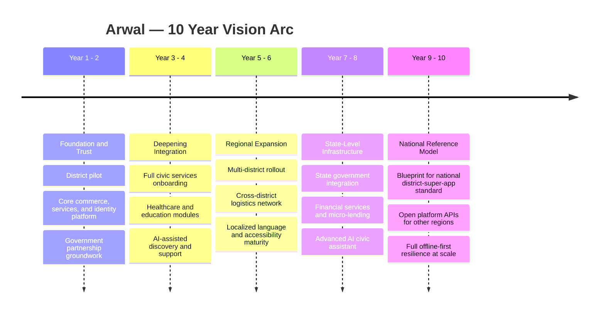
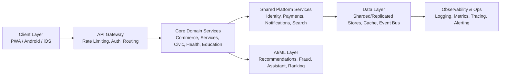
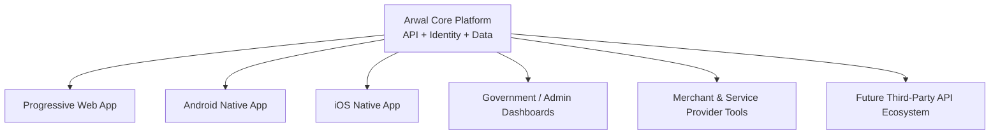

# Project Vision

**Document:** `ai-docs/00-project-vision.md`
**Project:** Arwal — The District Super App
**Stage:** 1 — Foundation
**Phase:** 1 — Project Vision
**Status:** Approved for Engineering Reference
**Audience:** Investors, Architects, Engineers, Designers, Product Managers, Government Partners

> **Callout — Purpose of This Document**
> This document is the founding charter of Arwal. It does not describe features, sprints, or timelines. It describes *why Arwal exists*, *what it must become*, and *the principles that will never be compromised* as the platform grows from a single district pilot into the digital operating system of a region. Every future architecture decision, every phase, every line of code written across the next ~300 micro-phases will be traceable back to the commitments made here.

Arwal is not a website, not a delivery app, and not a government portal. Arwal is a unified digital civilization layer for a district — a single application that a citizen opens in the morning to check a bus, in the afternoon to pay a hospital bill, in the evening to order groceries, and at night to renew a government certificate. It replaces twenty disconnected apps with one coherent experience, built on infrastructure capable of serving over a million people without compromise on speed, security, or dignity of access.

---

# Mission

**To build the single most trusted, most complete, and most accessible digital platform a district-level population can depend on for commerce, services, governance, mobility, healthcare, education, and community life — engineered to enterprise-grade standards from day one, not retrofitted later.**

Arwal's mission is threefold:

1. **Unify** — Collapse the fragmented digital experience of a district (dozens of apps, disconnected government counters, informal marketplaces, word-of-mouth service discovery) into one coherent, dependable platform.
2. **Empower** — Give every citizen, merchant, laborer, farmer, student, and government office equal-quality digital tools, regardless of income, literacy, or device capability.
3. **Endure** — Build the platform as permanent public-and-commercial infrastructure — architected to survive a decade of growth, technology shifts, and scale, not as a short-lived startup MVP.

---

# Core Philosophy

> **"One district. One application. Every essential service."**

Arwal is built on the belief that digital fragmentation is itself a form of inequality. When commerce, healthcare, transport, and governance each live in separate apps built by separate companies with separate incentives, the people who suffer most are those with the least time, the least bandwidth, and the least digital literacy to juggle them all.

The core philosophy rests on four pillars:

| Pillar | Meaning |
|---|---|
| **Unification over Fragmentation** | One identity, one wallet, one support system, one app — for everything. |
| **Infrastructure over Feature** | Arwal is treated as civic-grade infrastructure (like electricity or roads), not a disposable consumer app. |
| **Inclusion over Optimization** | The platform is designed first for the lowest-bandwidth, lowest-literacy, most rural user — not the urban power user. |
| **Trust over Growth-at-all-costs** | Every growth decision is filtered through: *does this preserve citizen trust and data dignity?* |

Arwal treats itself as **public-purpose private infrastructure** — commercially sustainable, but civic in responsibility.

---

# Why Arwal Exists

Districts across the region currently rely on a patchwork of national e-commerce apps that ignore local context, informal WhatsApp-based service economies with no accountability, physical-only government offices with long queues and opaque processes, and hyperlocal businesses with no digital storefront at all. This patchwork has three structural failures:

1. **No Local Ownership** — National platforms optimize for metro cities; district-level users are an afterthought, served last with worst latency, worst support, and least localized content.
2. **No Interoperability** — A citizen's identity, order history, payment methods, and trust score reset with every app they open. Nothing compounds. Nothing builds a reputation or a relationship.
3. **No Civic Integration** — Commerce and governance live in entirely separate universes, even though in a citizen's real life they are deeply intertwined (a farmer needs weather data, mandi prices, government subsidy status, and a marketplace to sell produce — today spread across five different systems, if they exist digitally at all).

Arwal exists to close this gap permanently, at the level of an entire district, by building the first truly unified local super-platform.

---

# Problem Statement

> **Callout — The Problem in One Sentence**
> A citizen of a district today needs 15–25 different apps, several physical government visits, and multiple informal networks to accomplish what should be achievable from a single trusted digital identity — and none of these systems talk to each other, trust each other, or serve the district's specific reality.

Breaking this down by domain:

- **Commerce:** Local shopkeepers have no affordable digital storefront; national platforms don't support hyperlocal same-day fulfillment at village-level granularity.
- **Services:** Skilled local labor (electricians, plumbing, tutoring, repair) is discovered through word of mouth with no verification, no ratings, no scheduling, and no dispute resolution.
- **Governance:** Citizens must physically visit government offices for certificates, applications, and grievance redress, often multiple times for a single service, with no transparent status tracking.
- **Healthcare:** No unified system to discover, book, and track local healthcare providers, diagnostics, or pharmacy availability.
- **Education:** No consolidated platform connecting students, tutors, local coaching centers, and skill-development resources.
- **Agriculture:** Farmers lack integrated access to mandi prices, weather intelligence, government schemes, and direct-to-buyer marketplaces.
- **Mobility:** No reliable, unified transport and logistics layer connecting citizens, local transport providers, and delivery infrastructure.
- **Payments & Trust:** No single trusted wallet or identity layer that carries reputation and history across every one of these interactions.

Arwal's founding premise is that **these are not eight separate problems — they are one problem: the absence of unified digital infrastructure at the district level.**

---

# Vision Statement

> **"Arwal will become the digital front door to an entire district — the first application a citizen opens, and the last one they ever need."**

By its maturity, Arwal will be the assumed default layer through which:

- Every local business is discoverable and transactable.
- Every citizen service — public or private — can be initiated, tracked, and completed.
- Every government office in the district is digitally reachable without a physical queue.
- Every worker, farmer, student, and professional has a verified digital identity and reputation.
- Every payment, order, booking, and application shares one secure, unified backbone.

---

# Long-Term Vision (5–10 Years)

Arwal's roadmap extends across a decade, structured in expanding rings of maturity:

**Within 5–10 years, Arwal aims to:**

1. Operate as the default digital layer for **1,000,000+ residents** of the district and, subsequently, neighboring districts.
2. Host **tens of thousands of local merchants and service providers** with zero-friction onboarding.
3. Serve as an **official digital channel for government service delivery**, recognized and integrated by district and state administration.
4. Achieve **offline-first reliability** so that connectivity gaps never fully block access to essential services.
5. Establish a **replicable architecture** that can be deployed as a template for other districts and states — becoming a national reference model for civic-commerce super-apps.
6. Build a **self-sustaining local digital economy**, where commerce fees, service fees, and value-added government partnerships fund continuous platform investment without compromising citizen affordability.

---

# Product Principles

Arwal's product decisions are governed by principles that outrank short-term convenience:

1. **One Identity, Everywhere** — A single account and profile powers every module: commerce, services, healthcare, civic, transport.
2. **Progressive Complexity** — The interface is simple by default and reveals power-user depth only as needed; a first-time low-literacy user and a power user both succeed.
3. **Local-First Relevance** — Search, discovery, and recommendations are always anchored to hyperlocal geography, language, and context — never generic.
4. **Trust Is a Feature** — Verification, ratings, dispute resolution, and transparency are treated as core product surface area, not afterthoughts.
5. **No Dead Ends** — Every user flow (search, booking, application, complaint) has a clear resolution path; nothing terminates in ambiguity.
6. **Design for the Slowest Device and Weakest Signal** — Every feature must degrade gracefully on 2G/3G networks and entry-level Android devices.

---

# User-Centric Principles

Arwal designs outward from real citizen personas, not backward from technology capability:

| Persona | Core Need | Design Response |
|---|---|---|
| **Rural Farmer** | Market prices, weather, government schemes | Voice-assisted, low-literacy UI, offline caching |
| **Urban Shopper** | Fast, reliable local delivery | Real-time tracking, multiple payment options |
| **Local Shop Owner** | Affordable digital storefront | Zero/low-cost onboarding, simple inventory tools |
| **Skilled Worker (electrician, tutor, etc.)** | Fair, steady bookings and reputation | Verified profiles, transparent ratings, secure payments |
| **Elderly Citizen** | Simple access to government/health services | Large UI targets, assisted-mode, family delegation |
| **Student** | Access to learning and local opportunities | Unified education discovery, scholarships, jobs |
| **Government Officer** | Efficient citizen service delivery | Admin dashboards, workflow automation, audit trails |

> **Callout — Design Commitment**
> If a feature cannot be explained to a first-generation smartphone user in under 30 seconds, it is not ready to ship. Simplicity is not a compromise on capability — it is the highest form of respect for the user's time and dignity.

---

# Technical Principles

Arwal's engineering culture is anchored on principles that are **non-negotiable across all 300 micro-phases**:

1. **Cloud-Native by Default** — Every service is designed to run in containerized, orchestrated, horizontally scalable environments from day one.
2. **Microservice-Ready Architecture** — Even where an early implementation is a modular monolith, service boundaries are drawn cleanly enough to extract into independent microservices without rewrites.
3. **API-First Design** — Every capability is built as a well-documented API before any UI consumes it, enabling web, Android, iOS, and third-party integrations from the same backend contract.
4. **Offline-First, Not Offline-Aware** — Core flows (browsing, cart, drafts, service requests) must function without connectivity and sync intelligently when restored — this is a first-class requirement, not a fallback.
5. **Security by Design** — Authentication, authorization, encryption, and audit logging are embedded in the architecture from the first commit, never bolted on later.
6. **Observability as a Requirement** — No service ships without logging, metrics, and tracing; if it can't be measured, it can't be trusted at scale.
7. **AI-Ready Data Architecture** — Data models and pipelines are designed so that AI/ML capabilities (search ranking, fraud detection, recommendation, civic assistant) can be layered in without structural rework.
8. **Progressive Web App + Native Parity** — PWA, Android, and iOS clients share design language and capability parity; no platform is treated as second-class.

---

# Scalability Vision

Arwal's scalability target is explicit and non-negotiable: **the architecture must support 1,000,000+ active users without a fundamental redesign.**

Scalability commitments:

- **Horizontal scaling by default** for every stateless service.
- **Data partitioning strategy** planned early (by district → ward → zone) to avoid single-point database bottlenecks as user count grows.
- **Caching and CDN strategy** for all read-heavy discovery and catalog flows.
- **Asynchronous, event-driven communication** between services for anything that does not require a synchronous response, to prevent cascading load failures.
- **Load and chaos testing** built into the engineering culture well before scale is actually reached — scalability is proven, not assumed.

---

# AI Vision

Arwal treats artificial intelligence not as a marketing feature but as a structural capability layered across the entire platform:

1. **Intelligent Discovery** — AI-powered search and recommendations that understand hyperlocal context, dialect, and intent, not just keyword matching.
2. **Civic Assistant** — A conversational assistant capable of guiding citizens through government processes, form-filling, and eligibility checks in local language.
3. **Trust & Fraud Intelligence** — AI-driven anomaly detection across transactions, reviews, and listings to protect citizens and merchants alike.
4. **Operational Intelligence** — Demand forecasting for delivery/logistics, dynamic service-provider matching, and resource allocation for civic services.
5. **Accessibility Amplifier** — Voice interfaces, text-to-speech, and simplified-language modes powered by AI to serve low-literacy and differently-abled users.

> **Callout — AI Principle**
> AI in Arwal must always be explainable and overridable by a human process. No citizen may be denied a government service, blocked from a transaction, or penalized in reputation solely by an opaque automated decision without a human appeal path.

---

# Accessibility Vision

Arwal's accessibility ambition goes beyond compliance — it is treated as a core equity mandate for a district population with wide variance in literacy, language, income, and ability.

- **Multi-language and dialect support**, including regional languages beyond the state's official language.
- **Voice-first interaction modes** for low-literacy users.
- **High-contrast, large-target UI modes** for elderly and visually impaired users.
- **Screen-reader and assistive-technology compliance** (WCAG 2.1 AA minimum target, progressing toward AAA for critical civic flows).
- **Low-bandwidth and low-end-device optimization** as an accessibility issue, not just a performance issue — a citizen with a ₹5,000 smartphone and 2G signal deserves the same access as one with flagship hardware and fiber broadband.
- **Assisted/delegated access modes**, allowing a family member or community kiosk operator to help an elderly or non-digital-native citizen complete a task safely.

---

# Sustainability Vision

Arwal's sustainability commitment spans environmental, economic, and civic dimensions:

| Dimension | Commitment |
|---|---|
| **Economic Sustainability** | Platform must generate sustainable commerce/service revenue to fund continuous investment without dependency on unlimited external funding. |
| **Merchant Sustainability** | Fee structures must remain fair enough that local merchants and workers earn a meaningfully better living than pre-Arwal informal channels. |
| **Environmental Sustainability** | Logistics and delivery routing designed to optimize for reduced trip redundancy and carbon footprint as the network matures. |
| **Digital Sustainability** | Codebase and infrastructure engineered for long-term maintainability — technical debt is tracked and actively managed, not allowed to compound silently. |
| **Civic Sustainability** | Government partnerships structured to be durable across administrative transitions, not dependent on any single official or political cycle. |

---

# Security Vision

Given Arwal's role as a custodian of citizen identity, payments, health data, and government interactions, security is treated as a foundational pillar equal to functionality itself.

1. **Zero-Trust Architecture** — No implicit trust between services; every request is authenticated and authorized regardless of network origin.
2. **End-to-End Encryption** — Data encrypted in transit and at rest across all sensitive domains (identity, payments, health, government records).
3. **Role-Based and Attribute-Based Access Control** — Fine-grained permissions across citizen, merchant, service-provider, and government-officer roles.
4. **Comprehensive Audit Trails** — Every sensitive action (payment, government application, health record access) is immutably logged for accountability.
5. **Regular Security Testing** — Penetration testing, dependency scanning, and vulnerability management embedded into the release cycle from early phases.
6. **Data Minimization & Consent** — Citizens control what data is shared with which module, with clear consent flows, especially for health and government data.
7. **Incident Response Readiness** — A defined breach-response and disclosure protocol is established before the platform handles sensitive data at scale.

> **Callout — Security Commitment**
> Arwal will never trade citizen data security for growth velocity. A security shortcut taken to hit a phase deadline is treated as a failed phase, not a completed one.

---

# Performance Vision

Performance is treated as a trust signal — a slow platform erodes citizen confidence faster than almost any other failure mode.

- **Target sub-2-second perceived load time** for core discovery and browsing flows, even on 3G networks.
- **Sub-200ms API response targets** for core read operations under normal load.
- **Aggressive caching and edge delivery** for static and semi-static content (catalogs, listings, civic information).
- **Graceful degradation** — under extreme load or partial outages, core flows (browse, view, offline drafts) remain available even if secondary features are temporarily throttled.
- **Continuous performance budgets** enforced in the engineering process — performance regressions block release, not just visual/functional bugs.

---

# Platform Vision

Arwal is architected as a true multi-surface platform from the outset:

Each surface consumes the same underlying platform capabilities through consistent, versioned APIs — ensuring that a feature built once (e.g., service booking) is available across every surface without duplicated logic. The long-term platform vision includes opening selected APIs to trusted third parties (logistics partners, fintech providers, government systems) once core trust and security maturity is established.

---

# Success Metrics

Arwal's success will be measured across four dimensions — never optimizing commercial metrics at the expense of civic and trust metrics.

| Category | Representative Metrics |
|---|---|
| **Reach** | Active users as % of district population; merchant/service-provider onboarding rate; government department integration count |
| **Trust** | Dispute resolution time; fraud incident rate; verified-provider ratio; citizen satisfaction score |
| **Reliability** | Platform uptime; API latency percentiles; offline-sync success rate; incident MTTR |
| **Impact** | Reduction in average time to complete a government service; local merchant revenue growth; measurable improvement in service-worker income |

> **Callout — North Star Principle**
> Growth metrics are meaningful only when trust and reliability metrics are simultaneously healthy. A spike in transactions accompanied by a spike in disputes or downtime is treated as a regression, not a win.

---

# Future Expansion Strategy

Arwal's expansion is deliberately sequenced rather than opportunistic:

1. **Depth before Breadth (Phase 1 District)** — Achieve genuine, trusted, daily-use dominance within the founding district before expanding geographically.
2. **Adjacent District Replication** — Once the model is proven, replicate the architecture into neighboring districts using a templated, configuration-driven rollout rather than a rebuild.
3. **State-Level Integration** — Pursue formal integration with state government digital service frameworks once civic modules demonstrate reliability and trust at district scale.
4. **Vertical Deepening** — Continuously deepen existing verticals (healthcare, education, agriculture) with richer functionality before adding unrelated new verticals.
5. **Open Ecosystem Phase** — In later years, expose platform APIs to allow third-party developers and businesses to build on top of Arwal's trusted identity, payment, and logistics rails.

---

# Non-Goals

To protect focus and architectural integrity, Arwal explicitly commits to **not** doing the following, especially in early phases:

- Arwal will **not** attempt to become a generic national e-commerce competitor; it remains district- and region-rooted in identity and design, even as it expands geographically.
- Arwal will **not** launch modules (e.g., healthcare, government integration) without proper verification, compliance, and safety review, regardless of feature-race pressure.
- Arwal will **not** sacrifice offline/low-bandwidth support for the sake of richer UI experiences aimed only at high-end devices.
- Arwal will **not** build closed, proprietary lock-in mechanisms that trap citizen data or merchant relationships against their interest.
- Arwal will **not** treat government/civic modules as a secondary "add-on" — they are considered co-equal to commerce from the architecture level up.
- Arwal will **not** pursue growth strategies (e.g., aggressive dark patterns, data resale) that conflict with the trust-first philosophy, even if commercially tempting.

---

# Risks

Arwal's leadership acknowledges the following material risks and commits to actively managing rather than ignoring them:

| Risk | Description | Mitigation Direction |
|---|---|---|
| **Government Dependency Risk** | Civic integration depends on administrative cooperation that may shift with political cycles | Build modular civic layer that adds value even without full government integration |
| **Digital Literacy Risk** | Target population includes significant low-literacy, first-time smartphone users | Accessibility-first design, assisted-mode, voice interfaces from early phases |
| **Trust-Building Risk** | Citizens and merchants may be skeptical of a new unified platform replacing familiar informal systems | Transparent onboarding, verifiable guarantees, strong dispute resolution |
| **Scale/Infrastructure Risk** | Rapid growth beyond initial architecture assumptions | Cloud-native, horizontally scalable design from Phase 1 |
| **Security/Data Risk** | Handling sensitive identity, payment, and health data at scale invites attack surface growth | Zero-trust architecture, continuous security testing, data minimization |
| **Competitive Risk** | National platforms may attempt hyperlocal expansion into the same district | Depth of local trust, government integration, and community rootedness as differentiators |
| **Operational Complexity Risk** | Managing commerce + services + civic + health under one platform is organizationally complex | Strict modular architecture and clear domain ownership boundaries |

---

# Guiding Principles

These principles serve as the tie-breaker whenever a decision is ambiguous:

1. **Citizen dignity over commercial convenience.**
2. **Long-term trust over short-term growth.**
3. **Accessibility over aesthetic minimalism.**
4. **Architectural discipline over shipping speed.**
5. **Transparency over opacity, even when transparency is uncomfortable.**
6. **Local relevance over generic scale.**
7. **Security and privacy are prerequisites, not features.**

---

# Engineering Culture

Arwal's engineering organization is built around the following cultural commitments:

- **Documentation-Driven Development** — Every phase, module, and architectural decision is documented before and after implementation (this document being the first artifact of that culture).
- **Small, Reviewable Increments** — The ~300 micro-phase structure exists specifically to enforce disciplined, reviewable, testable increments rather than large unreviewable rewrites.
- **Ownership and Accountability** — Every service and module has clear, named ownership boundaries, even as the team scales.
- **Test-First Mentality** — Automated testing (unit, integration, load) is treated as a definition-of-done requirement, not an optional add-on.
- **Blameless Postmortems** — Failures are treated as system and process learning opportunities, not individual fault-finding exercises.
- **Continuous Refactoring Budget** — A portion of every engineering cycle is explicitly reserved for technical debt reduction, preventing the "300 phases" from producing an unmaintainable system.

---

# Product Culture

- **Citizen Research Before Feature Design** — No major module ships without direct research into the real needs of its target persona in the district.
- **Simplicity as a Design Discipline** — Every new feature is scrutinized for whether it can be achieved with less complexity, not more.
- **Local Language and Context First** — Product decisions default to local relevance before generic global patterns.
- **Feedback Loops Built Into the Product** — Every module includes a clear, low-friction path for citizens and merchants to report issues, request features, and rate experiences.
- **Cross-Functional Collaboration** — Product, design, and engineering treat civic and commercial modules with equal seriousness and joint ownership.

---

# Definition of Success

Arwal will be considered successful when the following state is achieved and sustained:

1. A majority of district households use Arwal as their **default** channel for at least three of its core verticals (commerce, services, civic).
2. Local merchants and service providers report **measurable income improvement** attributable to the platform.
3. Government service completion times are **measurably reduced** for citizens using Arwal's civic modules.
4. The platform maintains **enterprise-grade reliability and security** (defined uptime, low fraud/dispute rates) at scale.
5. The architecture has proven **replicable** to at least one additional district without a fundamental rebuild.
6. Citizen trust surveys show Arwal is perceived as **safe, fair, and genuinely useful** — not merely used out of necessity.

---

# Closing Vision

> **Callout — Closing Statement**
> Arwal begins as software, but it is being built as infrastructure. Roads connect places. Electricity powers homes. Arwal will connect a district's people to commerce, care, opportunity, and governance — through one trusted door, engineered with the discipline of a platform meant to serve not for a product cycle, but for a generation.

This document, `ai-docs/00-project-vision.md`, is the first phase of approximately 300. Every subsequent phase — from data architecture to identity systems, from the first microservice to the millionth user — will be measured against the commitments made here: **unification without fragmentation, scale without fragility, intelligence without opacity, and growth without ever compromising the trust of the citizen it was built to serve.**

**End of Phase 1 — `ai-docs/00-project-vision.md`**
