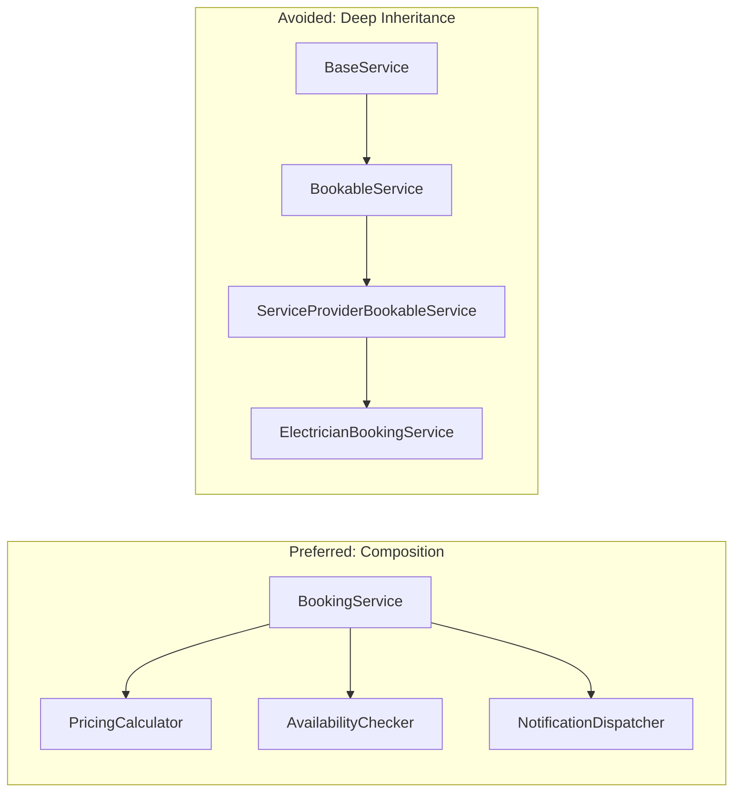
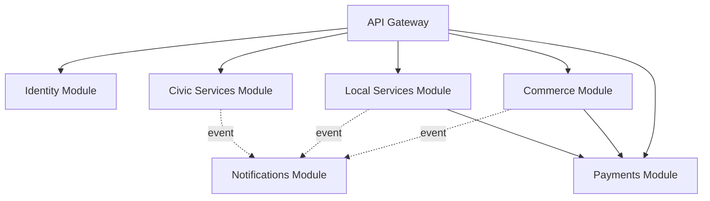
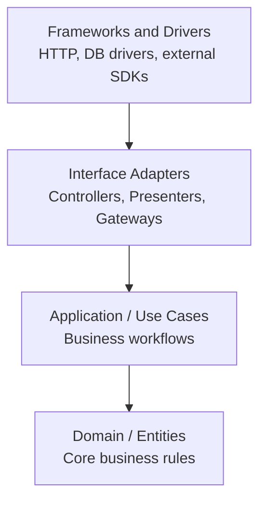
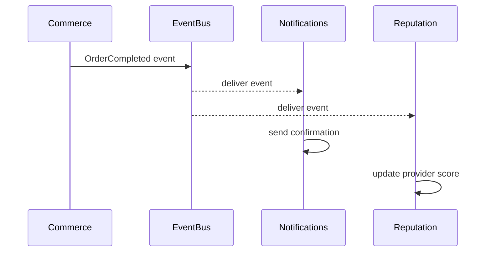
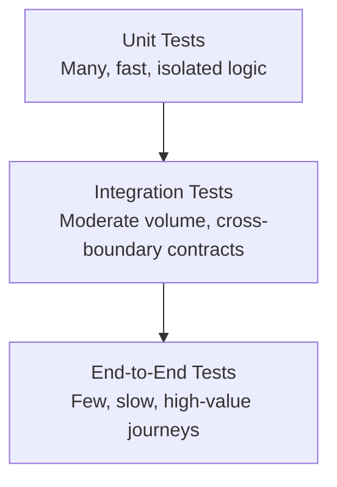

# Engineering Principles

**Document:** `ai-docs/02-engineering-principles.md`
**Project:** Arwal — The District Super App
**Stage:** 1 — Foundation
**Phase:** 3 — Engineering Principles
**Status:** Approved for Engineering Reference
**Audience:** Architects, Engineers, Engineering Managers, Technical Reviewers, Government Technical Partners

> **Callout — Purpose of This Document**
> `ai-docs/00-project-vision.md` defined why Arwal exists. `ai-docs/01-product-goals.md` defined what Arwal must achieve. This document defines **how Arwal is engineered** — the non-negotiable principles, patterns, and disciplines that every engineer, on every service, in every one of the ~300 micro-phases, is expected to follow. Where the Project Vision and Product Goals are aspirational and strategic, this document is operational and enforceable. Code review, architecture review, and ADR review will all cite this document directly.

---

# Purpose of this Document

Arwal will be built by a team that grows over years, across services owned by different engineers, some of whom will join long after Phase 1 is a distant memory. Without a shared, written, referenceable set of engineering principles, a codebase of this scale inevitably fragments into inconsistent styles, duplicated logic, incompatible abstractions, and silent architectural drift — the very disease that Arwal's founding vision explicitly exists to cure in the citizen's world. It would be an unacceptable contradiction to build an anti-fragmentation product on top of a fragmented codebase.

This document exists to:

1. Establish a **common engineering vocabulary** so that "clean architecture," "domain boundary," or "single source of truth" mean the same thing to every engineer on the team.
2. Provide a **default answer** to common design questions, so engineers spend their judgment on novel problems instead of re-litigating solved ones.
3. Give code reviewers and architecture reviewers a **citable standard** — "this violates Separation of Concerns as defined in Phase 3" is a legitimate, actionable review comment.
4. Protect the system's **long-term maintainability** across ~300 micro-phases, where the cost of inconsistency compounds silently unless actively resisted.
5. Serve as the **first document engineers read** when onboarding, before touching any domain-specific phase document.

This document applies to every service, every module, every client surface (PWA, Android, iOS, Admin), and every engineer, regardless of seniority. Deviations are permitted only when documented via an Engineering Decision Record (see the ADR section below) — never silently.

---

# Engineering Philosophy

Arwal's engineering philosophy is a direct technical translation of the trust-first, infrastructure-grade commitments made in the Project Vision. Four beliefs anchor everything else in this document:

1. **Software is read far more often than it is written.** Every principle in this document optimizes for the engineer reading the code six months from now — possibly someone who never met the original author — over the marginal convenience of the engineer writing it today.
2. **Correctness and clarity are not in tension with speed; they are prerequisites for it.** A codebase that is fast to hack on today and unreadable in three months is not fast — it is borrowing velocity from the future at a punishing interest rate. Arwal explicitly rejects this trade.
3. **Complexity must be justified, never assumed.** Every abstraction, every service boundary, every design pattern must earn its place by solving a real, present problem — not a hypothetical future one (see YAGNI below).
4. **Engineering discipline is a form of respect for the citizen.** A district's healthcare bookings, government applications, and payment history run on this code. Sloppy engineering is not a private inconvenience contained to the team — it is a direct risk to a citizen's money, data, and dignity. This is why Arwal treats engineering rigor as inseparable from its civic mission, not as a separate "best practices" concern layered on top.

> **Callout — The One-Sentence Philosophy**
> *"Build every service as if the next engineer to touch it has less context than you, less time than you, and is maintaining it for a citizen who is depending on it to work."*

---

# Core Engineering Principles

These are foundational software design principles. Every engineer is expected to internalize these deeply enough to apply them by instinct, not by checklist.

### SOLID

| Principle | Meaning | Application in Arwal |
|---|---|---|
| **Single Responsibility Principle (SRP)** | A class, module, or service should have exactly one reason to change. | An `OrderService` handles order lifecycle logic only — it does not also compute delivery routes or send notifications. Those are separate services invoked via well-defined interfaces or events. |
| **Open/Closed Principle (OCP)** | Software entities should be open for extension, closed for modification. | Adding a new payment method (e.g., a new UPI provider) should mean implementing a new `PaymentProvider` interface, not editing a large `switch` statement inside existing payment logic. |
| **Liskov Substitution Principle (LSP)** | Subtypes must be substitutable for their base types without breaking correctness. | Any implementation of a `NotificationChannel` interface (SMS, push, WhatsApp) must honor the same contract — callers must never need to know or care which concrete channel is in use. |
| **Interface Segregation Principle (ISP)** | Clients should not be forced to depend on interfaces they do not use. | A `ServiceProviderRepository` interface used by the booking module should not force civic-module code to implement irrelevant government-verification methods. |
| **Dependency Inversion Principle (DIP)** | High-level modules should not depend on low-level modules; both depend on abstractions. | The `Commerce` domain depends on a `PaymentGateway` interface, not on a concrete Razorpay or UPI SDK client directly — the concrete implementation is injected. |

SOLID is not applied dogmatically to every four-line function. It is applied deliberately at service, module, and domain boundaries — the places where the cost of a wrong abstraction compounds the most.

### DRY — Don't Repeat Yourself

Knowledge, not just code text, should have exactly one authoritative representation in the system. This means:

- Business rules (e.g., "a booking cannot be cancelled within 2 hours of the scheduled time") live in exactly one place — a domain service — never duplicated between frontend validation, backend validation, and a database constraint that can silently drift out of sync.
- Shared UI patterns (buttons, cards, form fields) are built once as reusable components, not copy-pasted per screen.
- Configuration values (API base URLs, feature flags, district identifiers) are defined once and referenced, never hardcoded in multiple files.

> **Callout — DRY Is About Knowledge, Not Just Text**
> Two pieces of code that look similar today but represent genuinely different business concepts should **not** be merged just because they're textually similar — that produces false coupling. DRY violations are about duplicated *decisions*, not duplicated *characters*. Premature de-duplication of coincidentally similar code is itself a design smell.

### KISS — Keep It Simple, Stupid

Every design decision defaults to the simplest solution that correctly and durably solves the actual problem. Complexity is added only when a specific, demonstrated requirement demands it — never speculatively. A junior engineer six months into the team should be able to read a module and understand its purpose without a senior engineer walking them through hidden cleverness.

### YAGNI — You Aren't Gonna Need It

Arwal's 300-micro-phase roadmap is long, and it is tempting to over-engineer Phase 3 code to anticipate Phase 150. This is explicitly rejected. Engineers build for the **current and near-term confirmed requirement**, guided by the architectural principles in this document (which do ensure extensibility), but do not pre-build speculative abstractions, unused configuration flags, or generalized frameworks for features that are not yet scoped. Extensibility comes from clean boundaries (see Architecture Principles), not from premature generalization.

### Separation of Concerns

Distinct responsibilities are isolated into distinct layers and modules so that a change in one does not ripple uncontrollably into another:

- Presentation logic is separate from business logic.
- Business logic is separate from data-access logic.
- Cross-cutting concerns (logging, auth, validation) are handled through shared, composable infrastructure — not scattered inline through every handler.

### Composition over Inheritance

Arwal favors composing behavior from small, focused units (functions, services, hooks, mixins-as-composition) over deep inheritance hierarchies. Deep inheritance chains create fragile coupling where a change to a base class can silently break every descendant. Composition keeps units independently testable and independently replaceable.



### Convention over Configuration

Wherever a sane, well-documented default exists, Arwal adopts it rather than forcing every engineer to make and configure the same decision repeatedly. Folder structures, naming conventions, API response envelopes, and error formats follow fixed, documented conventions across every service — configuration is reserved for genuine variability (e.g., district-specific settings), not for things that should simply be consistent.

### Single Source of Truth (SSOT)

Every piece of data and every business rule has exactly one authoritative owner:

- A citizen's identity is owned by the Identity service — no other service stores a shadow copy of profile data beyond what it needs cached for performance, and even then, cache invalidation rules are explicit.
- Domain events (see Architecture Principles) are the single source of truth for "what happened," from which read models and caches are derived — never the reverse.

---

# Architecture Principles

### Modular Architecture

Arwal is built as a set of clearly bounded modules — whether deployed initially as a modular monolith or later extracted into independent services — where each module owns its domain completely: its data, its business logic, and its API surface. Modules interact only through explicit, versioned contracts (APIs or events), never by reaching into another module's internal data store or internal code.



### Feature-First Organization

Within both frontend and backend codebases, code is organized primarily by **feature/domain**, not by technical layer. A `booking/` directory contains its own controllers, services, models, and tests together, rather than scattering "all controllers," "all services," and "all models" into separate top-level folders. This keeps related code physically close, makes ownership boundaries obvious, and makes it easy to eventually extract a feature into its own service without hunting across the codebase.

```
src/
  modules/
    booking/
      booking.controller.ts
      booking.service.ts
      booking.repository.ts
      booking.dto.ts
      booking.test.ts
    commerce/
      commerce.controller.ts
      commerce.service.ts
      ...
  shared/
    logging/
    auth/
    validation/
```

### Clean Architecture

Every service follows a layered dependency direction where **dependencies point inward**, toward business logic, never outward toward infrastructure:



The domain layer knows nothing about HTTP, databases, or third-party SDKs. This means core business rules (e.g., how a dispute is resolved, how a booking is priced) can be tested and reasoned about in complete isolation from infrastructure concerns, and infrastructure (a database, a payment SDK) can be swapped without touching business logic.

### Domain Boundaries

Every module has an explicitly documented domain boundary: what data it owns, what operations it exposes, and what it is expressly forbidden from doing. Domain boundaries are drawn along the lines established in the Product Goals (Identity, Commerce, Services, Civic, Payments, Logistics, etc.) and are treated as contracts, not suggestions. Crossing a domain boundary without going through its published API or event contract is treated as an architecture violation regardless of short-term convenience.

### API-First Design

No UI is built against an undocumented or ad-hoc backend response. Every capability is designed as a versioned API contract — request/response schema, error format, authentication requirements — **before** implementation begins, and that contract is what both backend and frontend teams build against in parallel. This enables PWA, Android, iOS, and future third-party integrations to consume the same backend without divergence.

### Event-Driven Thinking

Wherever an operation does not require an immediate synchronous response, Arwal defaults to asynchronous, event-driven communication between modules. A completed order emits an `OrderCompleted` event; the Notifications module, the Reputation module, and the Analytics pipeline each subscribe independently, without the Commerce module needing to know they exist. This prevents cascading failures (a notification outage should never block an order from completing) and keeps modules decoupled.



### Scalability by Design

Every architectural decision is evaluated against the 1,000,000+ user target from day one: services are stateless wherever possible, data is designed for future partitioning by district → ward → zone, and no design assumes a single-node ceiling. Scalability is not a later refactor — it is a filter applied to every design decision now, even while actual load remains small.

---

# Frontend Engineering Principles

### Reusable Components

UI is built from a shared, versioned component library rather than screen-specific one-off implementations. A button, form field, card, or modal is built once, documented once, and reused everywhere. New screens compose existing components before creating new ones; a new component is only introduced when no existing composition reasonably serves the need.

### Accessibility-First

Accessibility is designed in from the first component, not audited in afterward. Every interactive component ships with correct semantic markup, keyboard navigability, and screen-reader support by default. This is a direct technical execution of the Accessibility Vision in the Project Vision — WCAG 2.1 AA is the floor, not the target, for every component in the shared library.

### Responsive-First

Every screen is designed and implemented mobile-first, then progressively enhanced for larger viewports — reflecting the reality that the overwhelming majority of Arwal's users will access the platform on a phone. No component is designed desktop-first and "made responsive" later.

### Performance-First

Frontend performance is a design constraint, not a post-launch optimization pass:

- Bundle size budgets are enforced per route/feature.
- Images and media are served responsively, compressed, and lazily loaded.
- Every new dependency added to the frontend is evaluated for its bundle-size cost against its value, given the target device profile (entry-level Android, 2G/3G).

### State Management Philosophy

State is classified explicitly, and each category uses the appropriate tool — state is never managed with one blunt global mechanism regardless of its nature:

| State Category | Description | Approach |
|---|---|---|
| **Server/Remote State** | Data owned by the backend (orders, listings, bookings) | Fetched, cached, and synchronized via a dedicated data-fetching layer with built-in caching and revalidation |
| **UI/Local State** | Ephemeral, component-scoped state (form input, toggle state) | Local component state; never lifted globally without reason |
| **Global App State** | Cross-cutting concerns (auth session, active language, theme) | A minimal, explicit global store — kept intentionally small |
| **Offline/Draft State** | Data captured while offline, pending sync | Persisted locally with an explicit sync queue and conflict-resolution strategy |

Global state is treated as a liability to be minimized, not a default convenience.

### Styling Philosophy

Styling follows a consistent, token-driven design system (spacing, color, typography, breakpoints defined centrally) rather than ad-hoc inline values scattered per screen. This ensures visual consistency across the entire super-app surface and makes district-specific theming (if ever required) a configuration change, not a rewrite.

---

# Backend Engineering Principles

### Service Responsibilities

Each backend service exposes a narrow, well-defined responsibility aligned to a single domain boundary. A service's controllers handle only request/response translation; business rules live in a service layer; persistence lives in a repository layer. No controller directly executes database queries, and no repository contains business logic.

### Validation

All external input is validated at the boundary, before it reaches business logic — never trusted implicitly:

- Schema validation (types, required fields, formats) happens at the API boundary using a shared validation layer.
- Business-rule validation (e.g., "booking time must be in the future") happens inside the domain/service layer, independent of transport.
- Validation failures return structured, consistent, predictable error responses — never a raw stack trace or an ambiguous generic failure.

### Error Handling

Errors are categorized explicitly and handled consistently across every service:

| Error Category | Examples | Handling Approach |
|---|---|---|
| **Validation Errors** | Missing field, invalid format | 4xx response with structured field-level detail |
| **Business Rule Violations** | Booking conflict, insufficient balance | 4xx response with a clear, actionable, user-safe message |
| **Authorization Errors** | Insufficient role/permission | 403 response, logged for audit |
| **Not Found** | Referenced entity does not exist | 404 response |
| **Infrastructure/Unexpected Errors** | DB timeout, third-party API failure | 5xx response with a generic user-safe message; full detail captured only in logs, never leaked to the client |

Errors are never silently swallowed. Every caught exception is either handled meaningfully or re-thrown with added context — never discarded.

### Logging

Every service logs structured, machine-parseable events (not free-text strings) at appropriate levels (`debug`, `info`, `warn`, `error`), always including correlation/trace identifiers so a single citizen-facing request can be traced across every module it touched. Sensitive data (passwords, payment details, health records) is never logged in plaintext, per the Security Principles below.

### DTO Usage

Data Transfer Objects define the explicit shape of data crossing a boundary (API request/response, event payload) — internal domain models are never serialized and returned directly to a client. This decouples the internal data model (free to evolve) from the public contract (must remain stable and versioned), and ensures internal-only fields are never accidentally exposed.

### API Versioning

Every public API is explicitly versioned (e.g., `/v1/bookings`). Breaking changes are never introduced into an existing version — they require a new version, with a documented, time-bound deprecation path for the old one. This is essential given Arwal's commitment to PWA/Android/iOS parity: clients on different release cadences must be able to rely on a stable contract.

---

# Database Principles

### Data Integrity

The database enforces integrity constraints (foreign keys, unique constraints, not-null constraints, check constraints) as the last line of defense — application-level validation is the first line, but the database never trusts the application alone to prevent an invalid state.

### Normalization

Schemas are normalized (typically to Third Normal Form) by default to eliminate update anomalies and duplicated data, with deliberate, documented denormalization applied only where a specific, measured read-performance need justifies it — never as a default starting posture.

### Migrations

All schema changes are made exclusively through versioned, reviewable migration scripts — never through manual, undocumented changes against a live database. Migrations are:

- Forward-only in production (a broken migration is fixed with a new migration, not a manual rollback against live data, except in genuine emergencies with sign-off).
- Backward-compatible during rollout wherever possible, so a new schema can be deployed before all service instances have updated, avoiding downtime.
- Reviewed with the same rigor as application code.

### Indexing

Every query pattern expected to run at scale is backed by a deliberate index, added based on actual access patterns — not by indexing every column defensively, which imposes write-performance and storage costs. Index strategy is documented per table as part of the relevant data-model phase.

### Soft Deletes

Domain entities with civic, financial, or trust significance (orders, bookings, government applications, disputes, identity records) are never hard-deleted. They are soft-deleted (flagged inactive/removed with a timestamp) to preserve auditability, support dispute investigation, and satisfy regulatory retention requirements. Hard deletion is reserved for genuinely transient or non-sensitive data, and even then only via an explicit, documented data-retention policy.

### Audit Trails

Every sensitive state change (payment, government application status change, health-record access, identity change) is recorded in an immutable audit log, separate from the mutable operational record, capturing who performed the action, when, and what changed. This directly implements the Security Vision's audit-trail commitment at the data layer.

---

# Security Principles

### Secure by Default

Every new service, endpoint, and feature starts in the most restrictive, most secure configuration and is deliberately opened up only as needed — never the reverse. An endpoint is private until explicitly made public; a field is hidden until explicitly exposed.

### Least Privilege

Every user, service account, and internal process is granted the minimum set of permissions required to perform its function, nothing more. A service that only reads order data is never granted write access to the payments database. Role-based and attribute-based access control (per the Product Goals) is enforced at every layer, not just the UI.

### Authentication

A single, unified identity and authentication system underpins every module and role, using industry-standard, well-audited protocols (OAuth 2.0 / OpenID Connect patterns) rather than custom-built authentication logic. Session and token handling follows secure defaults: short-lived access tokens, securely stored refresh tokens, and mandatory re-authentication for sensitive actions (payments, government applications).

### Authorization

Authorization is checked at every layer that matters — API gateway, service boundary, and data-access layer — never relied upon solely at the UI layer, which is trivially bypassable. Every sensitive action is explicitly checked against the acting user's role and, where relevant, resource ownership.

### Secrets Management

No credential, API key, or secret is ever committed to source control, hardcoded in application code, or logged. Secrets are managed exclusively through a dedicated secrets-management system, injected at runtime, rotated on a defined schedule, and scoped as narrowly as possible to the service that needs them.

### Input Validation

Every input — from a citizen, a merchant, a government officer, or another internal service — is treated as untrusted until validated. This includes not just type/format validation but active defense against injection (SQL, script, command) and deserialization attacks, applied consistently through shared, tested validation infrastructure rather than ad hoc per-endpoint logic.

### Encryption

Data is encrypted in transit (TLS everywhere, including internal service-to-service traffic under the zero-trust model) and at rest for all sensitive domains — identity, payments, health, government records — per the Security Vision. Encryption keys are managed through a dedicated key-management system, never embedded in application configuration.

---

# Performance Principles

### Lazy Loading

Resources (routes, components, images, data) are loaded only when actually needed by the current user interaction, not eagerly on initial load. This is especially critical given Arwal's target device and network profile — an entry-level Android phone on 3G cannot absorb the cost of loading every module's code on first launch.

### Code Splitting

Frontend bundles are split by route and by feature module, so a citizen using only the commerce module never downloads the code for the civic or healthcare modules until they navigate there. Shared/common code is extracted into its own cached chunk to avoid duplication across split bundles.

### Caching

A deliberate, multi-layer caching strategy is applied:

| Layer | What's Cached | Strategy |
|---|---|---|
| **CDN / Edge** | Static assets, semi-static catalog/listing data | Long TTL with cache-busting on deploy |
| **API/Application Cache** | Frequently read, infrequently changed data (e.g., mandi prices, district config) | Time-bound or event-invalidated cache |
| **Client-Side Cache** | Recently fetched server data | Stale-while-revalidate pattern for responsiveness on flaky networks |
| **Offline Cache** | Core browse/draft data | Explicit local persistence with sync-on-reconnect |

Every cache has an explicit invalidation strategy defined at the time it is introduced — a cache without a defined invalidation plan is not approved for use.

### Asset Optimization

Images, fonts, and media are compressed, served in modern formats, and sized appropriately for the requesting device — never served at unnecessarily high resolution to a low-end device on a constrained connection.

### Database Optimization

Query performance is treated as a first-class concern: N+1 query patterns are actively avoided through deliberate data-loading strategies, slow queries are identified through monitoring (not guesswork), and query plans are reviewed for any endpoint expected to carry significant read load.

---

# Testing Principles

Arwal treats automated testing as a definition-of-done requirement, per the Product Goals — not an optional add-on applied only when time permits.

| Test Type | Purpose | Scope | Ownership |
|---|---|---|---|
| **Unit Testing** | Verify individual functions, classes, and business rules in isolation | Domain logic, utility functions, pure business rules | Engineer authoring the code, required at PR time |
| **Integration Testing** | Verify that modules, services, and their real dependencies (DB, cache, internal APIs) interact correctly | Service-to-database, service-to-service contracts | Engineer authoring the feature, required for any cross-boundary change |
| **End-to-End (E2E) Testing** | Verify complete citizen-facing flows behave correctly across the full stack | Critical user journeys (checkout, booking, application submission) | Shared ownership; automated as part of the release pipeline |
| **Performance Testing** | Verify the system meets latency and throughput targets under realistic and peak load | High-traffic endpoints, core read/write flows | Performed ahead of scale being reached, not reactively after an incident |

Testing philosophy follows a **testing pyramid**: many fast, isolated unit tests; a moderate number of integration tests; a smaller, carefully curated set of E2E tests covering only the flows that matter most to citizen trust. Flaky tests are treated as bugs requiring immediate fix or removal — a flaky test that is routinely ignored is worse than no test, because it trains engineers to ignore failures.



---

# Documentation Standards

Documentation is treated as a build artifact, not an afterthought:

- Every service has a README describing its purpose, domain boundary, and how to run it locally.
- Every public API is documented with request/response schemas, error codes, and examples, generated from or kept in lockstep with the actual contract (never hand-maintained and allowed to drift).
- Every non-obvious architectural or business-rule decision is documented inline as a comment explaining *why*, not restating *what* the code already says.
- Phase documents (like this one and its predecessors) are the authoritative source for cross-cutting standards; service-level documentation is the authoritative source for implementation specifics.

---

# Code Review Standards

Every change, regardless of author seniority, is reviewed before merging. Code review exists to protect the system, not to gatekeep individuals, and follows these standards:

1. **Correctness first** — Does the change do what it claims, including edge cases and failure modes?
2. **Principle alignment** — Does the change honor the principles in this document (SOLID, domain boundaries, error handling, security)? A reviewer citing a specific principle from this document is a legitimate and expected review pattern.
3. **Test coverage** — Are the appropriate levels of the testing pyramid present for the change's risk profile?
4. **Readability** — Could an engineer unfamiliar with this specific change understand it in six months?
5. **Scope discipline** — Is the change focused on its stated purpose, without unrelated opportunistic edits that make the diff harder to review and revert?

Reviews are conducted with the assumption of good faith and are blameless in tone — the goal is a better system, not a judgment of the author.

---

# Git and Branching Principles

- **Trunk-based development with short-lived feature branches** — branches are scoped to a single reviewable unit of work and merged promptly, avoiding long-lived divergent branches that accumulate painful merge conflicts.
- **Descriptive, convention-following commit messages** — commits explain *why* a change was made, referencing the relevant phase or issue, not just *what* files changed.
- **No direct commits to protected branches** (main/release) — all changes flow through reviewed pull/merge requests.
- **Atomic commits** — each commit represents one coherent, ideally revertible unit of change, rather than an undifferentiated bundle of unrelated edits.
- **Protected release branches** are always in a deployable state; broken builds on a protected branch are treated as a stop-the-line priority.

---

# Refactoring Principles

Refactoring — improving the internal structure of code without changing its external behavior — is treated as a routine, expected part of engineering work, not an exceptional event requiring special justification:

- Refactoring is done in small, safe, independently reviewable steps, each covered by passing tests, never as a single sprawling rewrite that's impossible to review meaningfully.
- Refactoring and feature work are kept in separate commits/PRs wherever possible, so a reviewer can evaluate structural change and behavioral change independently.
- "Leave the code slightly better than you found it" is an expected engineering norm — but larger structural refactors affecting shared boundaries require an ADR (see below), not a unilateral decision.

---

# Technical Debt Policy

Technical debt is acknowledged as an inevitable and sometimes rational trade-off — not a moral failure — but it must always be **visible and tracked**, never silent:

1. Any deliberate shortcut taken under time pressure is logged as tracked technical debt at the moment it is introduced, with a note on what the "correct" solution would have been and why it was deferred.
2. Every engineering cycle reserves an explicit portion of capacity for technical-debt reduction, per the Project Vision's Continuous Refactoring Budget commitment — this is a planned line item, not a "if we have time" afterthought.
3. Technical debt affecting security, data integrity, or citizen-facing reliability is prioritized above feature debt and is never allowed to persist indefinitely.
4. A technical debt item is not "resolved" by being forgotten — it is resolved by being fixed or by an explicit, documented decision that it no longer needs to be.

---

# Engineering Decision Records (ADR)

Significant architectural decisions — choosing a database technology, defining a new domain boundary, selecting an event-bus pattern, deciding to introduce a new cross-cutting dependency — are documented as Engineering Decision Records at the time the decision is made, not reconstructed from memory later.

An ADR captures:

- **Context** — what problem or fork in the road prompted the decision.
- **Decision** — what was decided.
- **Alternatives Considered** — what other options existed and why they were not chosen.
- **Consequences** — what trade-offs, risks, or follow-on work the decision introduces.

> **Callout — Why ADRs Matter at Arwal's Scale**
> Across ~300 micro-phases and a multi-year engineering effort, the single most expensive failure mode is not writing bad code — it is **forgetting why a decision was made** and either re-litigating it endlessly or, worse, violating it unknowingly because no one remembers it was deliberate. An ADR converts a moment of judgment into a durable, referenceable asset. Future engineers — and future versions of the same engineer — inherit the reasoning, not just the outcome. ADRs are especially critical for Arwal because civic and financial modules require defensible, auditable reasoning behind architectural choices, not just working code.

ADRs are stored alongside the relevant phase documentation, numbered sequentially, and never deleted — a superseded ADR is marked as superseded and linked to its replacement, preserving the full decision history.

---

# Logging and Monitoring Philosophy

Logging and monitoring exist to answer one operational question at any moment: **"Is the system healthy, and if not, why not, right now?"** This requires:

- **Structured logs** correlated by request/trace ID across every module a request touches, so a single citizen-facing failure can be traced end-to-end without guesswork.
- **Metrics** capturing the golden signals (latency, traffic, errors, saturation) for every service, exposed to a centralized monitoring system, not siloed per service.
- **Distributed tracing** across service boundaries, essential given Arwal's event-driven, multi-module architecture, where a single citizen action can fan out across several services asynchronously.
- **Actionable alerting** — alerts are tied to symptoms that require a human response, tuned to avoid both alert fatigue (too noisy, ignored) and blind spots (too quiet, incidents go unnoticed).
- **Dashboards as a first-class deliverable** — a service is not considered production-ready until its key health indicators are visible on a dashboard, not just theoretically loggable.

---

# Deployment Philosophy

- **Continuous Integration / Continuous Delivery (CI/CD)** is the default for every service — every merged change is automatically built, tested, and made deployable without manual, error-prone release rituals.
- **Small, frequent deployments** are preferred over large, infrequent releases — smaller changesets are easier to review, easier to test, and dramatically easier to roll back safely if something goes wrong.
- **Progressive delivery** (canary releases, feature flags, staged rollouts) is used for any change carrying meaningful risk, allowing issues to be caught against a small fraction of traffic before full rollout.
- **Automated rollback capability** is a requirement, not a nice-to-have, for every deployable service — a bad deploy must be reversible in minutes, not hours.
- **Zero-downtime deployment** is the default expectation for citizen-facing services, consistent with the Reliability commitments in the Project Vision.

---

# Scalability Philosophy

Scalability at Arwal is engineered proactively, not reactively:

- Every service is designed stateless-first, so horizontal scaling is a matter of adding instances, not re-architecting.
- Data partitioning (district → ward → zone) is planned into the data model from the start, so growth does not require an emergency re-sharding effort later.
- Load and chaos testing are performed **ahead of** anticipated scale milestones, so capacity limits are discovered deliberately in a controlled test, not accidentally in production during a citizen-facing surge.
- Capacity planning is data-driven, based on observed growth trends and the KPI targets defined in the Product Goals, not guesswork.
- Scalability and cost-efficiency are balanced deliberately — over-provisioning "just in case" is as much a discipline failure as under-provisioning, and both are avoided through measurement rather than assumption.

---

# Definition of Engineering Excellence

Engineering excellence at Arwal is defined concretely, not as a vague aspiration:

1. **Correct** — The system behaves as specified, including at its edges and failure modes, verified by tests rather than assumed.
2. **Clear** — Any engineer on the team can understand a module's purpose and behavior without needing its original author to explain it.
3. **Consistent** — The codebase follows the same conventions and principles across every module, so context learned in one part of the system transfers to another.
4. **Secure** — Every feature is built with the security principles in this document applied from its first commit, not audited in afterward.
5. **Observable** — Every service can answer "is it healthy, and why or why not" at any moment, without requiring a code deploy to add visibility.
6. **Resilient** — Failure in one part of the system degrades gracefully rather than cascading into a full outage.
7. **Maintainable** — The system can absorb the next 297 phases of change without accumulating unmanageable complexity, because technical debt is tracked and actively paid down.
8. **Accountable** — Significant decisions are documented (via ADRs) and traceable, so the reasoning behind the system's shape survives team turnover.

> **Callout — Excellence Is Not Perfection**
> Engineering excellence at Arwal does not mean an absence of trade-offs — it means every trade-off is **deliberate, documented, and revisited**, rather than accidental, hidden, and forgotten.

---

# Closing Statement

> **Callout — Closing Statement**
> Arwal's founding vision commits to building infrastructure a district can depend on for a generation. That commitment is only as real as the engineering discipline behind it. This document is the operational contract that makes the Project Vision and Product Goals achievable in practice — not through inspiration, but through consistently applied principles, enforced in code review, encoded in architecture, and honored across every one of the ~300 micro-phases still to come. Where a future phase must deviate from a principle stated here, that deviation is made explicitly, through an Engineering Decision Record — never silently, and never by default.

This document, `ai-docs/02-engineering-principles.md`, is the third phase of approximately 300. It is the standard against which every subsequent architectural, design, and implementation decision in this project will be measured.

**End of Phase 3 — `ai-docs/02-engineering-principles.md`**
