# System Architecture Principles

**Document:** `ai-docs/03-system-architecture-principles.md`
**Project:** Arwal — The District Super App
**Stage:** 1 — Foundation
**Phase:** 4 — System Architecture Principles
**Status:** Approved for Engineering Reference
**Audience:** Architects, Engineers, Engineering Managers, Technical Reviewers, Government Technical Partners

> **Callout — Purpose of This Document**
> `ai-docs/00-project-vision.md` defined why Arwal exists. `ai-docs/01-product-goals.md` defined what Arwal must achieve. `ai-docs/02-engineering-principles.md` defined how individual engineers write code day to day. This document defines **how the system itself is structured** — the architectural shape, the module boundaries, the communication patterns, and the resilience posture that every one of the ~300 micro-phases will build within. Where Phase 3 governs the engineer at the keyboard, Phase 4 governs the shape of the system the engineer is working inside of.

---

# Purpose of this Document

A codebase can follow every engineering principle in Phase 3 — SOLID, DRY, clean functions, well-tested modules — and still collapse under its own weight if the *system-level* architecture is wrong. Engineering principles govern the quality of a single brick. Architecture principles govern whether the building stands.

This document exists to:

1. Define the **architectural shape** of Arwal at the system level — how it is decomposed, how the pieces communicate, and how that decomposition evolves over time.
2. Establish a **shared architectural vocabulary** — "bounded context," "aggregate," "domain layer," "circuit breaker" — that means the same thing to every architect and engineer on the project.
3. Provide a **decision framework** for the hardest, most consequential engineering questions: when to split a service, where a boundary belongs, how modules should talk to each other, who owns which data.
4. Protect Arwal's ability to scale to **1,000,000+ users** and to survive **~300 micro-phases** of incremental change without a ground-up rewrite.
5. Serve as the **binding architectural reference** against which every future Architecture Decision Record, service specification, and API contract is measured.

This document does not replace domain-specific architecture documents that will follow in later phases (Identity Architecture, Payments Architecture, Data Architecture, and so on). It establishes the system-wide rules those documents must operate within.

---

# Architectural Vision

Arwal's architecture must simultaneously satisfy two demands that are often treated as being in tension:

1. **Move fast in the early phases**, when the team is small, the domain boundaries are still being learned, and the cost of premature distributed-systems complexity would cripple velocity.
2. **Scale without a rewrite** to over a million users and dozens of business domains (commerce, food delivery, grocery, marketplace, local services, healthcare, education, agriculture, government services, payments, logistics, community, property, jobs) across a multi-year, ~300-phase roadmap.

Arwal resolves this tension with a single architectural thesis:

> **Draw the boundaries correctly from day one; defer the distribution decision until it is justified by evidence.**

In other words: Arwal invests heavily, from Phase 1, in clean **domain boundaries** — but deliberately defers the operational cost of running those boundaries as physically separate services until scale, team size, or failure-isolation needs actually demand it. This is the foundation of the Modular Monolith First strategy detailed later in this document.

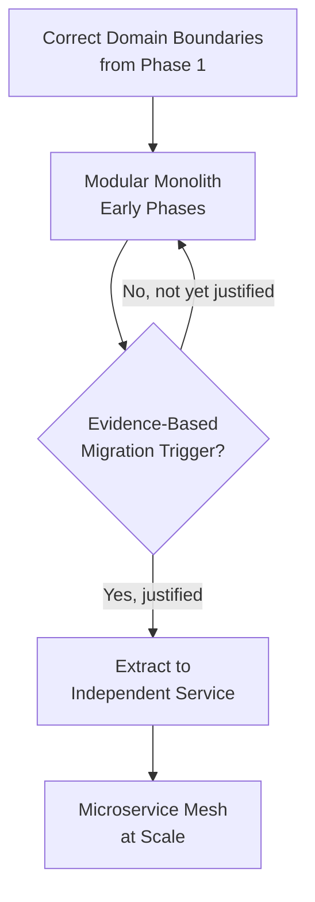

---

# Why Architecture Matters

Architecture is the set of decisions that are **expensive to change later** — everything else is a detail that can be refactored cheaply. A poorly named variable costs minutes to fix. A wrongly drawn domain boundary, a shared database between two "independent" modules, or a synchronous call chain baked into a critical path can cost months and can require a full system outage to correct.

Arwal's architecture matters for four concrete reasons:

1. **The roadmap is long.** ~300 micro-phases means the system will be touched by engineers who were not present for the original design decisions. Architecture is the only thing that keeps their contributions coherent with what came before.
2. **The domain is wide.** Commerce, healthcare, government services, and payments do not share the same risk profile, compliance requirements, or data sensitivity. An architecture that treats them identically will either over-constrain the low-risk domains or under-protect the high-risk ones.
3. **The scale target is real, not aspirational.** A million concurrent citizens is not a "someday" number — it is the explicit target from Phase 1 (see `ai-docs/00-project-vision.md`). Architecture decisions made assuming a single-node ceiling will not survive contact with that target.
4. **The stakes are civic, not just commercial.** A citizen's government application, health booking, or payment history depends on this system's correctness and availability. Architectural failure is not an inconvenience — it is a direct failure of the civic mandate.

---

# High-Level Architectural Philosophy

Arwal's architecture is guided by five philosophical commitments that resolve ambiguity whenever a design question does not have an obvious answer:

| Commitment | What it Means in Practice |
|---|---|
| **Boundaries before distribution** | Draw clean module/domain boundaries first; decide whether those boundaries become network boundaries later, based on evidence. |
| **Evolvable over perfect** | No architectural decision in Phase 1 is expected to be permanent. Every decision is made to be *cheaply reversible* wherever possible, and *deliberately, visibly irreversible* only where truly necessary (e.g., choice of primary datastore for a sensitive domain). |
| **Explicit over implicit** | Every dependency, every contract, every data-ownership boundary is explicit and documented — never inferred from convention or tribal knowledge. |
| **Evidence over prediction** | Scaling and splitting decisions are made from observed load, observed team friction, and observed failure patterns — not from speculative anticipation of Phase 200's needs. |
| **Isolation of blast radius** | Every architectural boundary exists, in part, to answer: "if this fails, what else fails with it?" A good boundary shrinks that answer. |

---

# Modular Monolith First Strategy

Arwal begins its engineering life as a **Modular Monolith**, not as a microservices mesh, and this decision is deliberate rather than a placeholder for "microservices we haven't gotten around to yet."

### What "Modular Monolith" Means at Arwal

A single deployable application (per logical tier — API, background workers, etc.) is internally decomposed into strictly bounded modules — `identity/`, `commerce/`, `services/`, `civic/`, `payments/`, and so on — each of which:

- Owns its own data (its own schema/tables, never queried directly by another module).
- Exposes a well-defined internal API (in-process interface or internal event) — never exposes its internal models to another module.
- Is developed, tested, and reasoned about as if it were already a separate service.
- Could be physically extracted into an independent service with minimal rework, because its boundary was never violated in the first place.

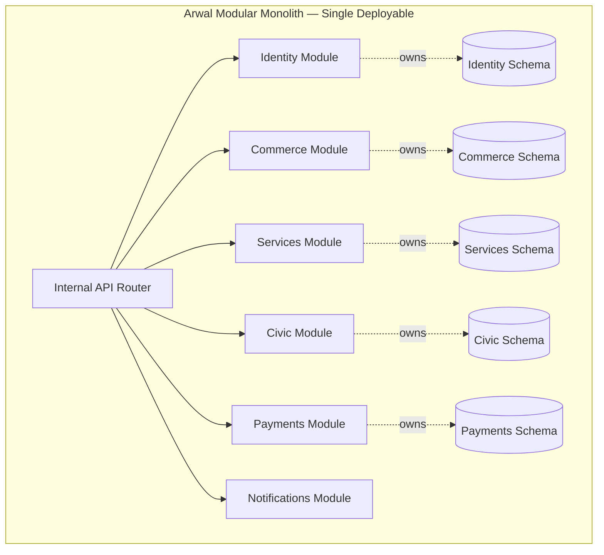

### Why Modular Monolith, Not Microservices, at This Stage

| Factor | Modular Monolith (Chosen) | Premature Microservices (Rejected) |
|---|---|---|
| **Team size in early phases** | A small team can reason about one deployable, one CI/CD pipeline, one local dev environment. | A small team pays enormous coordination tax operating dozens of independently deployed services. |
| **Domain boundaries** | Boundaries are still being *learned* in early phases; a monolith lets a boundary be corrected with a code change. | A wrongly drawn service boundary requires a live data migration and a coordinated multi-service rollout to fix. |
| **Operational overhead** | One deployment pipeline, one set of infra to monitor, one database cluster (logically partitioned) to operate. | Each service needs its own CI/CD, observability wiring, on-call rotation awareness, and failure-mode handling — multiplied by dozens of services from day one. |
| **Latency** | In-process calls between modules are effectively free. | Every cross-module call becomes a network hop, adding latency and a new failure mode, even for domains with almost no real independent scaling need yet. |
| **Transactional integrity** | Within a bounded context, a local transaction is trivial. | Cross-service transactions require sagas or distributed transaction patterns even for early-stage, low-volume flows that don't yet need them. |
| **Cost** | Single, right-sized infrastructure footprint appropriate to early-stage load. | Dozens of independently scaled services, each with a minimum viable infrastructure footprint, inflate cost long before load justifies it. |

### Trade-offs Arwal Consciously Accepts

The Modular Monolith is not free of trade-offs, and this document does not pretend otherwise:

- **Shared deployment risk** — until modules with independent scaling needs are extracted, a bug in one module can, in the worst case, affect the availability of the whole deployable. This is mitigated by strict module isolation (below) and by internal circuit-breaking between modules.
- **Shared runtime resource contention** — a CPU- or memory-heavy module can, if not carefully bounded, starve other modules running in the same process/container. This is mitigated through resource-aware design and monitoring, and is one of the explicit migration triggers described below.
- **Temptation toward boundary erosion** — the ease of an in-process function call makes it *tempting* to reach across a module boundary "just this once." This is why domain boundaries are enforced by code review, static analysis / lint boundary rules, and architecture review — never by good intentions alone (see `ai-docs/02-engineering-principles.md`, Domain Boundaries).

> **Callout — The Monolith Is Modular, Not Monolithic in the Pejorative Sense**
> "Modular Monolith" is not a euphemism for "big ball of mud." Every rule that would apply to a properly bounded microservice — data ownership, explicit contracts, no reaching into another module's internals — applies here too. The only thing deferred is the *network boundary*, not the *discipline*.

---

# Migration Strategy to Microservices

Arwal's architecture assumes that some — not necessarily all — modules will eventually be extracted into independently deployed services. This section defines when and how that happens, so migration is a **deliberate, evidence-driven engineering decision**, never a reflexive one.

### When Migration Should Happen

A module is a candidate for extraction into an independent service when **one or more** of the following is true and documented:

1. **Independent scaling need** — the module's load profile diverges sharply from the rest of the system (e.g., a search/ranking module needs to scale 10x independently of the payments module).
2. **Independent release cadence need** — the module is changing so frequently, by a large enough dedicated team, that shared-deployment coordination has become a measurable velocity tax.
3. **Failure isolation need** — the module's failure modes (e.g., a flaky third-party integration) must be prevented from threatening the availability of unrelated modules.
4. **Distinct compliance/security perimeter** — the module handles data (health records, payment credentials, government identity data) that benefits from a hard, physically separate security boundary, not just a logical one.
5. **Distinct technology need** — the module has a demonstrated, justified need for a different runtime, language, or datastore technology than the rest of the system (e.g., a fraud-detection module needing a specialized ML-serving runtime).

### Indicators That Justify Migration

| Indicator | How It's Measured |
|---|---|
| Sustained resource contention | Monitoring shows one module regularly consuming disproportionate CPU/memory relative to the rest of the deployable, at the expense of other modules' latency SLOs. |
| Deployment coordination friction | Release velocity data shows deployments are regularly delayed or complicated specifically because of one module's change volume or risk profile. |
| Divergent scaling curve | Traffic/load data shows one module's growth curve diverging significantly from the rest of the system. |
| Team topology change | A dedicated, sizeable team now owns the module full-time and would benefit from full deployment autonomy. |
| Compliance escalation | A regulatory or security review recommends physical isolation for a specific data domain. |

### Risks of Premature Migration

Extracting a service before these indicators are present introduces cost without corresponding benefit, and Arwal treats premature extraction as an architecture anti-pattern equal in severity to a poorly drawn boundary:

- **Distributed monolith risk** — services that are extracted along the wrong seams end up chatting synchronously and constantly, inheriting all the latency and failure-mode cost of distribution with none of the independence benefit.
- **Operational tax paid too early** — a small team maintaining ten prematurely extracted services spends more time on infrastructure glue than on citizen-facing capability.
- **Data-consistency complexity paid too early** — cross-service transactions (sagas, eventual consistency, compensating actions) are genuinely hard; introducing that complexity before the business need justifies it is pure cost.
- **False sense of boundary correctness** — physical separation can mask a boundary that was never logically correct, making the underlying design flaw harder, not easier, to fix later.

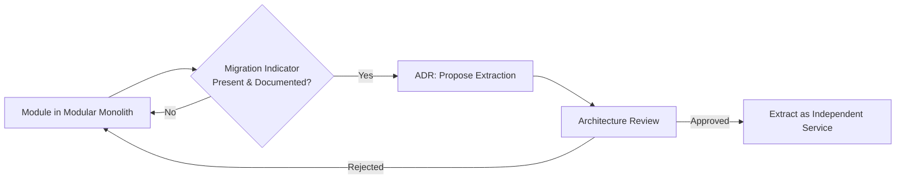

---

# Domain-Driven Design (DDD)

Arwal adopts Domain-Driven Design as the primary methodology for discovering and expressing module boundaries, both within the Modular Monolith and, later, across extracted services. DDD is chosen because it aligns technical boundaries with real business boundaries — the same alignment the Product Goals document requires between features and the personas they serve.

### Bounded Contexts

A **Bounded Context** is an explicit boundary within which a particular domain model is defined and consistent — the same term can mean different things in different bounded contexts, and that is expected, not an error to be reconciled.

At Arwal, each top-level module (Identity, Commerce, Local Services, Civic Services, Payments, Logistics, Healthcare, Agriculture, Education, Community, Property, Jobs) is a bounded context. For example, a "Provider" in the Local Services context (a verified electrician) and a "Provider" in the Healthcare context (a verified doctor) are deliberately modeled as distinct concepts with distinct rules, even though they share a name in casual conversation. Forcing them into one shared "Provider" model purely for textual DRY-ness would be exactly the false-coupling anti-pattern the Engineering Principles document warns against.

### Aggregates

An **Aggregate** is a cluster of domain objects treated as a single consistency boundary, accessed and modified only through its root entity. Aggregates ensure that business invariants are always enforced together, never partially.

Example: A `Booking` aggregate in the Local Services context includes the booking's schedule, its status transitions, and its line items — all changes to a booking go through the `Booking` aggregate root, which enforces rules like "a booking cannot be cancelled within 2 hours of the scheduled time" as a single atomic operation.

### Entities

An **Entity** is a domain object defined by a persistent identity that continues across state changes — a `Booking` remains the same booking even as its status moves from `Pending` to `Confirmed` to `Completed`.

### Value Objects

A **Value Object** has no identity of its own — it is defined entirely by its attributes and is immutable. A `Money` value object (amount + currency), an `Address`, or a `GeoCoordinate` are value objects: two `Money` instances with the same amount and currency are interchangeable, and a "change" to a value object is really a replacement, not a mutation.

### Domain Services

A **Domain Service** encapsulates business logic that does not naturally belong to any single entity or value object — typically logic that coordinates across multiple aggregates within the same bounded context. A `PricingCalculator` that computes a booking's final price from a base rate, a distance surcharge, and an active promotion is a domain service: the logic is real business logic, but it doesn't belong to any one aggregate.

### Repositories

A **Repository** provides the illusion of an in-memory collection of aggregates, abstracting away the actual persistence mechanism. Domain and application logic depend on a repository interface (`BookingRepository`), never directly on a database client or ORM — this is the Dependency Inversion Principle from `ai-docs/02-engineering-principles.md` applied specifically at the persistence boundary.

### How DDD Applies to Arwal, End to End

| DDD Concept | Arwal Example |
|---|---|
| Bounded Context | `commerce`, `local-services`, `civic`, `payments`, `healthcare` modules |
| Aggregate | `Order` (Commerce), `Booking` (Local Services), `Application` (Civic), `Wallet` (Payments) |
| Entity | `OrderLineItem`, `ServiceProviderProfile`, `ApplicationStatusHistory` |
| Value Object | `Money`, `Address`, `GeoCoordinate`, `TimeSlot` |
| Domain Service | `PricingCalculator`, `AvailabilityChecker`, `EligibilityEvaluator` |
| Repository | `OrderRepository`, `BookingRepository`, `ApplicationRepository` |

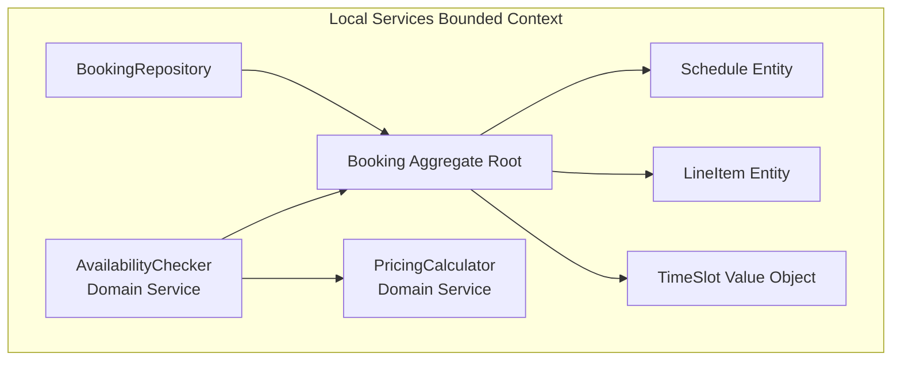

---

# System Layers

Every module within Arwal — whether in the Modular Monolith or later extracted as an independent service — follows the same four-layer internal structure, consistent with the Clean Architecture principle established in `ai-docs/02-engineering-principles.md`.

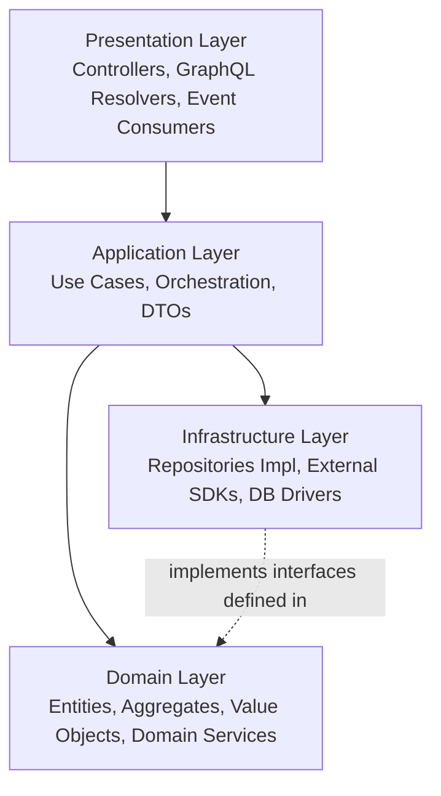

### Presentation Layer

Translates external input (HTTP requests, GraphQL queries, incoming events) into calls against the Application Layer, and translates Application Layer results back into external-facing responses (JSON, event payloads). Contains **no business logic** — its only job is protocol translation and DTO shaping.

### Application Layer

Orchestrates use cases by coordinating one or more domain objects and domain services to fulfill a specific business operation (e.g., "submit a booking," "process a civic application"). Contains workflow/orchestration logic, but delegates all business *rules* to the Domain Layer. This is also where cross-cutting concerns like authorization checks and transaction boundaries are typically coordinated.

### Domain Layer

The heart of the module: entities, aggregates, value objects, and domain services expressing the actual business rules. This layer has **zero knowledge** of HTTP, databases, message queues, or any framework — it is pure business logic, testable in complete isolation.

### Infrastructure Layer

Provides concrete implementations of interfaces defined by the Domain and Application layers: database repository implementations, external SDK clients (payment gateways, SMS providers), caching clients, and message-bus publishers/consumers. This is the only layer allowed to know about specific technology choices.

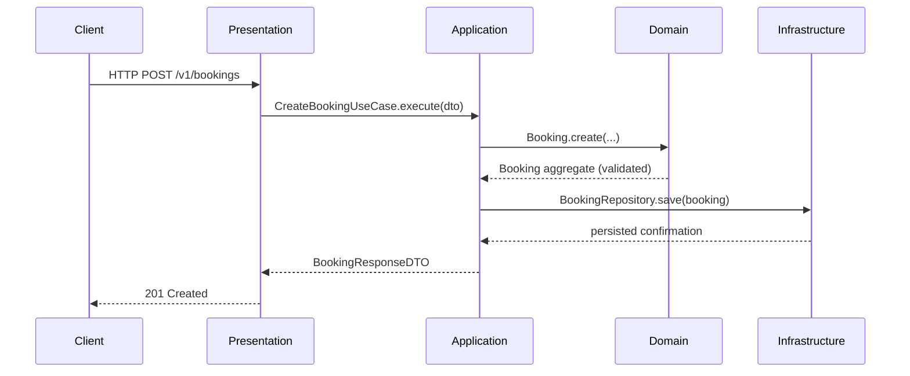

---

# Dependency Rules

Dependencies within and across every module follow one non-negotiable rule: **dependencies point inward, toward the Domain Layer, never outward.**

### Allowed Dependencies

- Presentation → Application
- Application → Domain
- Infrastructure → Domain (implements interfaces the Domain/Application layers define)
- Any layer → shared, framework-agnostic utility code (e.g., a pure validation helper)

### Forbidden Dependencies

- Domain → Infrastructure (the Domain Layer must never import a database driver, an HTTP client, or a third-party SDK directly)
- Domain → Presentation (business rules must never depend on how they are exposed)
- Application → Infrastructure concrete classes (Application depends on repository *interfaces*, never concrete repository implementations, which are injected)
- Any module → another module's internal Domain/Infrastructure classes (only a module's published Application-layer API or event contract may be depended upon externally)

### Dependency Inversion in Practice

High-level policy (the Domain Layer's business rules) must not depend on low-level detail (which database, which payment SDK). Both depend on an abstraction owned by the Domain/Application layer:

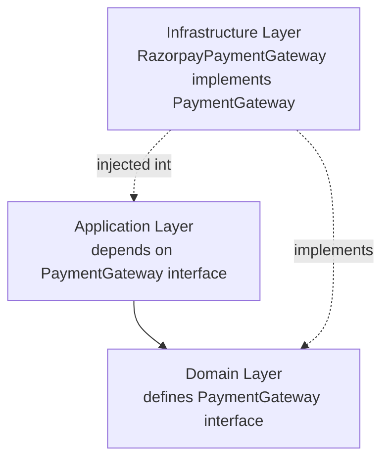

### Layer Boundaries Are Enforced, Not Assumed

Layer and module boundaries are enforced through a combination of:

- Static import/lint rules that fail CI if a forbidden cross-layer or cross-module import is introduced.
- Code review, citing this document directly ("this violates the Dependency Rule in Phase 4").
- Architecture review for any change that proposes a new cross-module dependency.

A dependency rule violation is treated with the same severity as a failing test — it blocks merge, regardless of how small or well-intentioned the shortcut appears.

---

# Module Communication

Modules — whether co-located in the Modular Monolith or later extracted as independent services — communicate only through explicit, published contracts. Reaching into another module's internal data or code is always a forbidden dependency, per the section above, regardless of the communication pattern used.

### Synchronous Communication

Used when the caller genuinely requires an immediate response to proceed (e.g., checking real-time availability before confirming a booking). Implemented as a well-defined internal API call (in the monolith) or a versioned HTTP/RPC call (post-extraction). Synchronous calls are used deliberately and sparingly, because every synchronous dependency is also a coupling of availability — if the callee is down, the caller degrades or fails too.

### Asynchronous Communication

The default communication style for anything that does not require an immediate response. A module publishes a fact about something that happened; interested modules subscribe independently. This is the same Event-Driven Thinking principle established in `ai-docs/02-engineering-principles.md`, applied at the system architecture level.

### Event-Driven Architecture

Domain events (e.g., `OrderCompleted`, `BookingConfirmed`, `ApplicationStatusChanged`, `PaymentSettled`) are published to a shared event bus. Consumers subscribe without the publisher needing any knowledge of who is listening or why. This decouples modules in time (the consumer need not be online at the moment of publication, given a durable event bus) and in knowledge (the publisher's code never references the consumer).

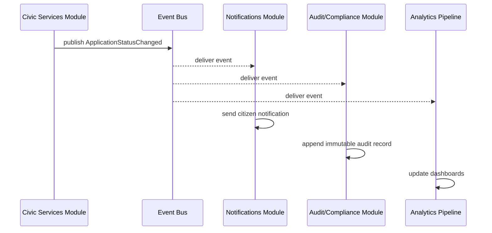

### API Contracts

Every synchronous module boundary, and every event payload, is defined as an explicit, versioned schema (request/response shape, event payload shape, error format) — documented and reviewed before implementation, consistent with the API-First Design principle. Contracts are backward-compatible within a version; breaking changes require a new version with a defined deprecation path.

### Internal Events vs. External Events

Arwal distinguishes between two event scopes:

| Event Scope | Purpose | Example |
|---|---|---|
| **Internal Domain Event** | Communicates a fact within a bounded context, often used to keep an aggregate's own side effects consistent. | `BookingLineItemAdded` used within the Local Services module. |
| **Integration Event** | Communicates a fact across module/bounded-context boundaries, published to the shared event bus. | `BookingConfirmed` consumed by Notifications, Payments, and Analytics. |

Internal domain events never leak outside their owning module; only Integration Events cross the module boundary, and only Integration Events are subject to the same versioned-contract discipline as a public API.

---

# Shared Services

Certain capabilities are needed by nearly every domain module and are deliberately centralized as shared platform services, rather than reimplemented per module — a direct application of DRY and Convention over Configuration at the system level.

| Shared Service | Responsibility | Consumed By |
|---|---|---|
| **Authentication** | Verifies citizen/merchant/officer identity; issues and validates tokens. | Every module, via the API Gateway and internal auth middleware. |
| **Authorization** | Evaluates role-based and attribute-based access rules for a given actor and resource. | Every module that exposes a protected operation. |
| **Notifications** | Delivers SMS, push, WhatsApp, and in-app notifications through a unified, preference-aware channel abstraction. | Commerce, Local Services, Civic, Payments, Logistics — any module with a citizen-facing event to communicate. |
| **Payments** | Owns wallet balance, transaction processing, and payment-gateway integration as a single source of truth for money movement. | Commerce, Local Services, Civic (fee payments), Logistics. |
| **Search** | Provides hyperlocal, ranked discovery across catalogs, listings, and providers. | Commerce, Local Services, Healthcare, Education, Agriculture. |
| **File Storage** | Handles upload, storage, and secure retrieval of documents and media (KYC documents, government forms, product images). | Identity, Civic, Commerce, Healthcare. |
| **Logging** | Provides the shared structured-logging infrastructure every module writes through. | Every module. |
| **Monitoring** | Aggregates metrics, traces, and health signals into centralized dashboards and alerting. | Every module and every shared service. |

Each shared service is itself built as its own bounded context, owning its own data, and is held to the exact same architectural rules as a domain module — a shared service is never granted a shortcut to reach into a domain module's data, and vice versa.

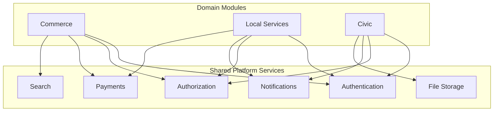

---

# Data Ownership Principles

### Module Ownership

Every piece of data in Arwal has exactly one owning module. Ownership means that module alone can write to that data, and any other module that needs it either calls the owning module's API or consumes a derived, explicitly-cached copy with a defined invalidation rule — never a direct read of another module's tables.

### Database Ownership

Each module owns its own schema (logically separated within a shared cluster in early phases; physically separate databases once/if the module is extracted into an independent service). A module's tables are never queried directly, not even read-only, by code outside that module.

### Avoiding Shared Databases

A shared database accessed by multiple modules is explicitly forbidden as an architectural anti-pattern (see Common Anti-Patterns below), because it creates the worst kind of hidden coupling: two modules that appear independent in their code but are silently bound together by schema, breaking the moment either one changes its data model. This is true even within the Modular Monolith, where the underlying database cluster may be shared purely as an infrastructure convenience — logical schema ownership boundaries are still absolute.

### Single Source of Truth

Consistent with `ai-docs/02-engineering-principles.md`, every fact in the system has exactly one authoritative owner. Where another module needs that fact, it has three options, in order of preference:

1. **Call the owning module's API synchronously**, when freshness is critical and the caller can tolerate the owning module's availability being a dependency.
2. **Subscribe to the owning module's Integration Events** and maintain a local, explicitly-invalidated read model, when eventual consistency is acceptable and decoupled availability is preferred.
3. **Query a shared, owning-module-published cache**, for high-read, low-volatility data (e.g., a product catalog listing), with a defined TTL or event-driven invalidation.

Directly querying another module's database is never an option, under any circumstance.

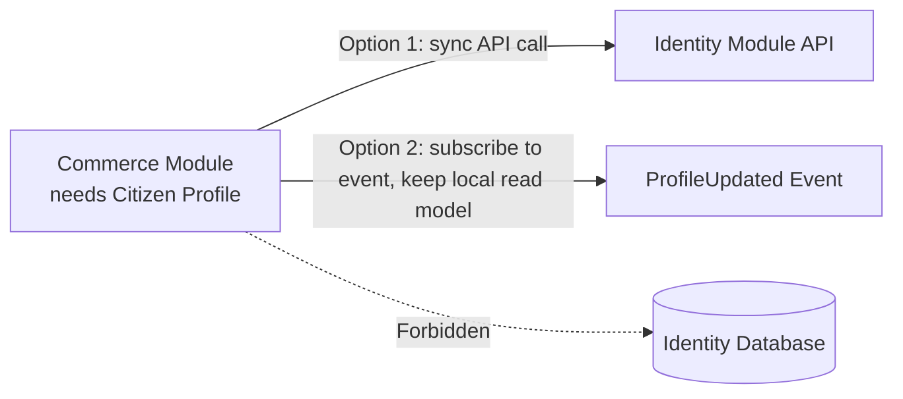

---

# API Gateway Philosophy

All external traffic — from the PWA, Android, iOS, and Admin clients — enters Arwal through a single API Gateway, which is responsible for:

- **Authentication enforcement** — validating tokens before any request reaches a domain module.
- **Rate limiting** — protecting the system from abuse and accidental client-side retry storms.
- **Request routing** — directing traffic to the correct module (in the monolith, this may be internal routing; post-extraction, routing to the correct service).
- **Protocol translation** — presenting a consistent external API surface even if internal implementations vary.
- **Versioning enforcement** — ensuring clients on different release cadences (PWA vs. Android vs. iOS) can each rely on the API version they were built against.

The API Gateway is explicitly **not** where business logic lives — it is a routing, security, and cross-cutting-concern layer only. Business logic in the gateway would violate Separation of Concerns and create a single, hard-to-test chokepoint for rules that belong in domain modules.

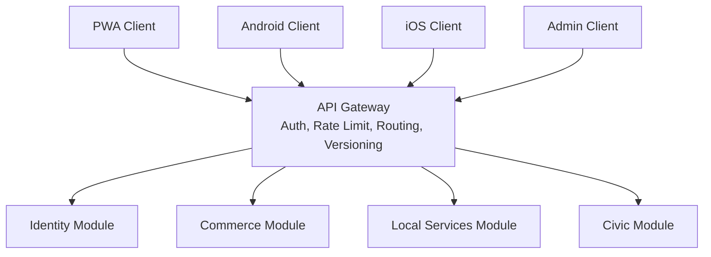

---

# Caching Strategy

Arwal applies a deliberate, multi-layer caching strategy, extending the caching table established in `ai-docs/02-engineering-principles.md` to the system-architecture level:

| Layer | Purpose | Invalidation Strategy |
|---|---|---|
| **Edge/CDN Cache** | Static assets and semi-static public content (catalog images, published civic information). | Long TTL, cache-busted on deploy. |
| **API Gateway Cache** | Cacheable, non-personalized read responses (e.g., public listing pages). | Short TTL or event-invalidated. |
| **Module-Level Application Cache** | Frequently read, infrequently changed domain data owned by that module (e.g., mandi prices, district configuration). | Time-bound or event-invalidated, owned and published by the data's owning module. |
| **Cross-Module Read Cache** | A consuming module's local, denormalized copy of another module's data, built from Integration Events. | Rebuilt/invalidated on receipt of the relevant Integration Event — never manually queried against the source. |
| **Client-Side Cache** | Recently fetched data on the PWA/Android/iOS client. | Stale-while-revalidate. |

Every cache introduced at any layer must have its invalidation strategy defined and documented at the moment it is introduced — an undefined invalidation strategy is grounds to reject the cache in review, per the standard already set in Phase 3.

---

# Scalability Strategy

Arwal's scalability strategy operates at three levels simultaneously:

1. **Stateless service scaling** — every module (and, later, every extracted service) is designed stateless-first, so horizontal scaling is a matter of adding instances behind a load balancer, never a re-architecture.
2. **Data partitioning** — data is modeled from Phase 1 for eventual partitioning along the district → ward → zone hierarchy, so that as usage grows within and beyond the founding district, no single database node becomes an unavoidable bottleneck.
3. **Selective service extraction** — as described in the Migration Strategy above, individual modules are extracted from the Modular Monolith and independently scaled precisely when their load profile diverges enough to justify it — not before, and not "just in case."

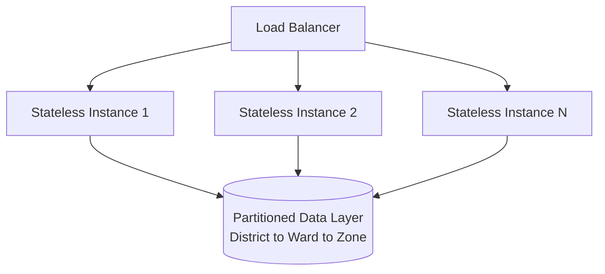

---

# High Availability Principles

- **No single point of failure** for any citizen-critical flow — every critical-path component (API Gateway, Identity, Payments) is deployed redundantly across multiple instances/zones.
- **Graceful degradation over full outage** — when a non-critical module or shared service is unavailable, the rest of the system continues to serve citizens, with the affected feature failing visibly and gracefully rather than cascading.
- **Zero-downtime deployment** — every module supports rolling deployment with backward-compatible schema and API changes, consistent with the Migrations and API Versioning principles in `ai-docs/02-engineering-principles.md`.
- **Multi-zone resilience** — infrastructure is deployed across multiple availability zones so that a single zone failure does not constitute a full platform outage.

---

# Reliability Principles

Reliability at Arwal is defined operationally, not aspirationally: the system must behave predictably under both expected and unexpected conditions.

- **Defined, monitored SLOs** for every citizen-critical flow (checkout, booking, application submission), with error budgets tracked and treated as a real engineering constraint, not a vanity metric.
- **Idempotent operations** wherever a client might retry a request (payments, booking confirmation), so a network hiccup never results in a duplicate charge or duplicate booking.
- **Load and chaos testing performed ahead of anticipated scale milestones**, per the Scalability Philosophy in Phase 3, so capacity and failure limits are discovered deliberately, not in production.
- **Defined incident response protocol**, with clear escalation paths and blameless postmortems feeding back into architecture review.

---

# Failure Isolation

Every module boundary in Arwal exists, in part, to answer a single question precisely: **"If this module fails, what else fails with it?"** A well-designed boundary shrinks the blast radius of any given failure to the smallest possible scope.

Failure isolation is achieved through:

- **Bulkheading** — resource pools (thread pools, connection pools) are isolated per module/dependency, so a slow or failing dependency in one module cannot exhaust resources needed by an unrelated module.
- **Independent failure domains for shared services** — a Notifications outage must never block an order from completing (per the Event-Driven Thinking principle); a Search outage must never block a checkout.
- **Explicit fallback behavior** for every critical-path dependency — defined in advance, not improvised during an incident.

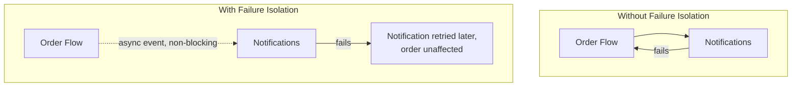

---

# Resilience Patterns

Every synchronous cross-module or cross-service call, and every external integration (payment gateways, SMS providers, government systems), is wrapped in a defined set of resilience patterns:

| Pattern | Purpose | Applied To |
|---|---|---|
| **Retry** | Recover automatically from transient failures (network blips, momentary unavailability). | External API calls, message publishing — always with capped attempts and backoff, never unbounded. |
| **Timeout** | Prevent a slow dependency from indefinitely holding resources or degrading the caller's own SLO. | Every synchronous call, internal or external, has an explicit timeout — no call is allowed to wait indefinitely. |
| **Circuit Breaker** | Stop calling a dependency that is clearly failing, to protect both the caller (from wasted resources) and the callee (from being overwhelmed while recovering). | External integrations and any internal synchronous cross-module dependency identified as a risk point. |
| **Idempotency** | Ensure a retried or duplicated request produces the same effect as a single successful request. | Payment processing, booking confirmation, any state-mutating operation reachable via client or automatic retry. |
| **Graceful Degradation** | Preserve core functionality when a non-critical dependency is unavailable, rather than failing the entire request. | Recommendations, notifications, and other secondary features degrade silently; browse/cart/checkout core flows remain available. |

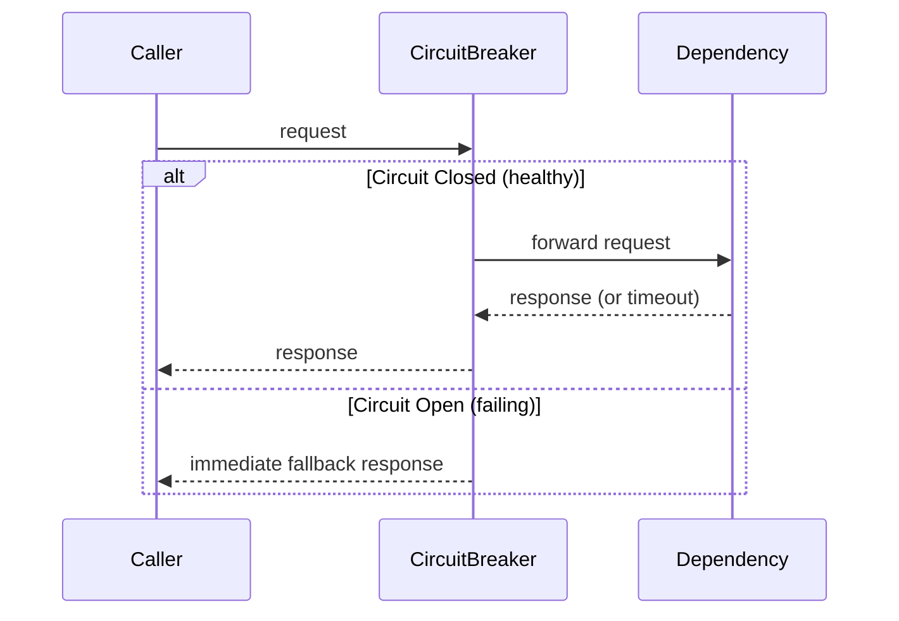

---

# Security Architecture Principles

System-level security architecture extends the Security Principles of `ai-docs/02-engineering-principles.md` and the Security Vision of `ai-docs/00-project-vision.md` into concrete structural rules:

- **Zero-trust between modules** — even within the Modular Monolith, cross-module internal calls are authenticated and authorized as if they were crossing a network boundary, so the security posture does not need to be redesigned when a module is later extracted.
- **Perimeter enforcement at the API Gateway**, with defense-in-depth re-validation at each module boundary — the gateway is the first check, never the only check.
- **Data classification drives architecture** — modules handling identity, payment, or health data are held to a stricter isolation and encryption standard than modules handling low-sensitivity data (e.g., public catalog listings), and this classification is a first-class input into extraction and infrastructure decisions.
- **Least-privilege service identity** — every module/service has its own scoped credentials for accessing shared infrastructure (databases, secrets, message bus), never a shared "god credential."
- **Auditability by architecture, not by convention** — sensitive state changes flow through the same Integration Event mechanism used for cross-module communication, making the audit trail a structural by-product of the architecture rather than a bolted-on logging task.

---

# Observability Principles

Consistent with the Logging and Monitoring Philosophy in `ai-docs/02-engineering-principles.md`, the system architecture must make observability structurally unavoidable, not optional per module:

- **Correlation IDs propagate automatically** across every module boundary and every asynchronous event, injected once at the API Gateway and carried through the entire request/event lifecycle without any module needing to remember to do so manually.
- **Golden signals (latency, traffic, errors, saturation)** are emitted by every module and shared service through a common, shared instrumentation library — never implemented ad hoc per module.
- **Distributed tracing spans every module and shared service a request or event touches**, essential given the event-driven, multi-module nature of Arwal's architecture, where a single citizen action can fan out asynchronously across several modules.
- **Health and readiness endpoints** are a mandatory, standardized contract for every module/service, consumed by both the API Gateway and the deployment orchestrator to make failure detection automatic rather than manually diagnosed.

---

# Technology Independence

Arwal's Domain Layer, in every module, must remain completely independent of any specific framework, database technology, or third-party SDK. This is the architectural expression of the Clean Architecture and Dependency Inversion principles already established, and it exists for concrete reasons:

1. **Frameworks evolve; business rules should not have to.** A major framework version upgrade, or a full framework replacement, should never require rewriting how a booking is priced or how a dispute is resolved.
2. **Technology choices are reversible only if business logic isn't entangled with them.** Swapping a database vendor, a payment gateway SDK, or a caching technology should be an Infrastructure Layer change — invisible to the Domain Layer.
3. **Testability depends on it.** Domain logic with zero framework dependency can be unit-tested in complete isolation, at the speed and volume the Testing Principles in Phase 3 require.
4. **It protects against vendor lock-in**, consistent with the Project Vision's explicit rejection of proprietary lock-in mechanisms — Arwal's own architecture must not lock *itself* into a framework the same way it refuses to lock in citizen or merchant data.

In practice, this means: business rule code never imports an ORM class directly into a domain entity, never references an HTTP framework's request/response objects inside a domain service, and never calls a third-party SDK client from anywhere but the Infrastructure Layer.

---

# Architectural Decision Records (ADR)

Every significant system-architecture decision — adopting the Modular Monolith strategy itself, choosing an event bus technology, defining a new bounded context, deciding to extract a module into an independent service — is captured as an ADR, following the same format defined in `ai-docs/02-engineering-principles.md`: Context, Decision, Alternatives Considered, Consequences.

At the architecture level specifically, ADRs additionally serve as the **auditable justification trail** for the Migration Strategy defined earlier in this document: no module is extracted from the Modular Monolith without an ADR documenting which migration indicator(s) were observed and why extraction was judged to outweigh the risks of premature migration. This prevents extraction decisions from being made reactively, under incident pressure, without the same rigor applied to every other architectural choice.

> **Callout — ADRs as the Memory of the Architecture**
> A system that lives across ~300 micro-phases will inevitably face the question "why is this module still part of the monolith?" or "why was this boundary drawn here and not there?" long after the engineers who made the call have moved to other work. The ADR is what allows that question to be answered with the original reasoning, not a guess.

---

# Architectural Review Process

Every proposed system-architecture-level change — a new bounded context, a new shared service, a proposed service extraction, a new cross-module communication pattern — goes through architectural review before implementation begins. Architectural review evaluates a proposal against:

1. **Alignment with this document** — does the proposal honor the Modular Monolith strategy, DDD boundaries, dependency rules, and data ownership principles defined here?
2. **Justification, not convenience** — is the proposal justified by a real, evidenced need (per the Migration Strategy's indicators), or is it speculative/premature?
3. **Blast-radius impact** — does the proposal shrink or grow the failure isolation of the affected modules?
4. **Consistency with existing ADRs** — does the proposal conflict with a previously recorded architectural decision? If so, is that conflict addressed explicitly (via a new ADR superseding the old one), never silently?
5. **Long-term maintainability** — is the proposal something a future engineer, unfamiliar with today's context, could understand and safely extend?

Architectural review is conducted with the same blameless, good-faith spirit as code review defined in Phase 3 — its purpose is to protect the system across 300 phases, not to gatekeep the proposer.

---

# Definition of Good Architecture

At Arwal, "good architecture" is defined concretely, not aspirationally:

1. **Boundaries match the business domain** — module boundaries reflect real bounded contexts, not arbitrary technical convenience groupings.
2. **Dependencies point in one direction** — inward, toward the domain, with no forbidden dependency ever present.
3. **Every piece of data has exactly one owner**, with no shared-database coupling anywhere in the system.
4. **Failure in one module has a bounded, predictable blast radius**, never an unpredictable cascade.
5. **The distribution decision is evidence-based**, never speculative — nothing is extracted into a separate service before an indicator justifies it, and nothing that should be extracted is left coupled past the point of justified need.
6. **The architecture is legible to a new architect** joining at Phase 150 without requiring an oral history from the original team.
7. **The system can absorb the next phase of change** — commerce, civic, healthcare, agriculture, and every future vertical — without a structural rewrite, because the boundaries were drawn correctly the first time.

> **Callout — Good Architecture Is Invisible When It Works**
> The sign of a well-designed architecture is not that it is discussed constantly — it's that engineers building Phase 180 rarely need to think about Phase 4 at all, because the boundaries drawn here simply hold.

---

# Common Anti-Patterns to Avoid

The following patterns are explicitly rejected across every module, every phase, and every engineer's work, regardless of short-term convenience:

| Anti-Pattern | Description | Why It's Rejected at Arwal |
|---|---|---|
| **God Objects** | A single class or module that knows about and controls far more of the system than its bounded context justifies. | Violates SRP and bounded-context isolation; becomes an unmaintainable, untestable chokepoint that every unrelated change risks breaking. |
| **Tight Coupling** | Modules that cannot be understood, tested, or changed independently because they reach directly into each other's internals. | Defeats the entire purpose of the Modular Monolith strategy — a tightly coupled "modular" monolith is, in practice, just a monolith. |
| **Shared Database** | Two or more modules reading or writing the same tables directly. | Creates invisible coupling that breaks the moment either module evolves its schema; explicitly forbidden under Data Ownership Principles above. |
| **Circular Dependencies** | Module A depends on Module B, which depends back on Module A. | Makes independent testing, deployment, and eventual extraction impossible; always resolved by introducing a proper abstraction or event-based decoupling, never tolerated as "just how it is." |
| **Fat Controllers** | Presentation-layer code that directly contains business rules instead of delegating to the Application/Domain layers. | Violates the System Layers dependency direction; makes business rules untestable without spinning up the full HTTP stack. |
| **Business Logic in UI** | Client-side code (PWA/Android/iOS) independently re-implementing business rules that belong in the backend domain layer. | Violates Single Source of Truth; guarantees drift between platforms and contradicts the Platform Parity commitment in the Project Vision. |
| **Distributed Monolith** | Services extracted along the wrong seams that end up calling each other synchronously and constantly, inheriting network cost without gaining independence. | The specific failure mode the Migration Strategy's evidence-based approach exists to prevent. |
| **Anemic Domain Model** | Entities that are just data bags, with all real business logic scattered across services/controllers instead of living in the domain objects themselves. | Undermines DDD's core value — business rules become impossible to locate, test, or trust as authoritative. |

---

# Closing Statement

> **Callout — Closing Statement**
> Arwal's founding vision commits to infrastructure a district can depend on for a generation; the Engineering Principles commit every line of code to that same standard. This document is where those commitments take physical shape — in bounded contexts, layered dependencies, evidence-based service extraction, and failure domains small enough that no single mistake can take down a citizen's ability to book a doctor, pay a bill, or renew a certificate. Where a future phase must deviate from a principle stated here, that deviation is made explicitly, through an Architectural Decision Record — never silently, and never by default.

This document, `ai-docs/03-system-architecture-principles.md`, is the fourth phase of approximately 300. Every service specification, every data model, and every API contract that follows will be measured against the boundaries, dependency rules, and resilience posture established here.

**End of Phase 4 — `ai-docs/03-system-architecture-principles.md`**
