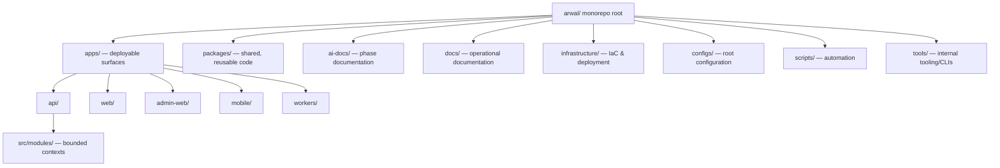
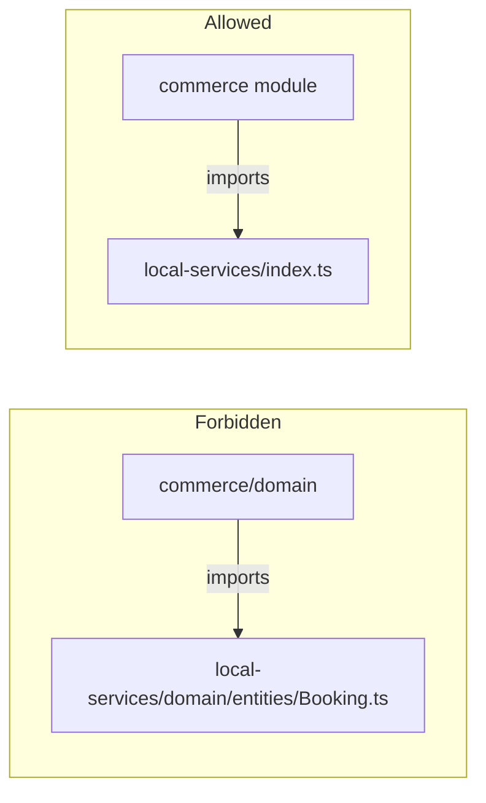
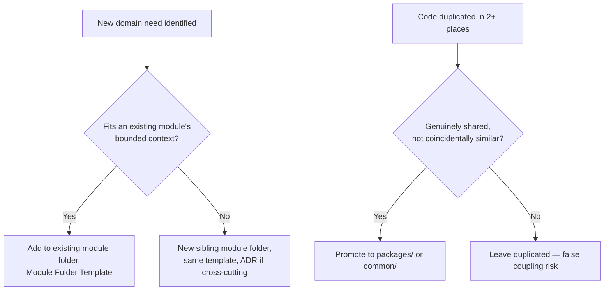

# Folder Guidelines

**Document:** `ai-docs/04-folder-guidelines.md`
**Project:** Arwal — The District Super App
**Stage:** 1 — Foundation
**Phase:** 5 — Folder Guidelines
**Status:** Approved for Engineering Reference
**Audience:** Architects, Engineers, Engineering Managers, Technical Reviewers, Government Technical Partners

> **Callout — Purpose of This Document**
> `ai-docs/00-project-vision.md` defined why Arwal exists. `ai-docs/01-product-goals.md` defined what Arwal must achieve. `ai-docs/02-engineering-principles.md` defined how individual engineers write code. `ai-docs/03-system-architecture-principles.md` defined how the system itself is structured — bounded contexts, layers, and communication patterns. This document defines **where every one of those things physically lives on disk.** Architecture without a disciplined folder structure degrades into ambiguity the moment more than one engineer touches the repository — this document exists so that ambiguity never has room to form.

---

# Purpose of this Document

A correct architecture, badly organized on disk, still fails. Engineers do not experience "Clean Architecture" or "Bounded Contexts" as abstract diagrams — they experience them as folders they open, files they search for, and imports they type. If the folder structure does not faithfully mirror the architectural decisions made in `ai-docs/03-system-architecture-principles.md`, the architecture exists only on paper, and the codebase will drift from it within weeks.

This document exists to:

1. Translate every architectural boundary defined in Phase 4 (bounded contexts, layers, shared services) into a **concrete, physical folder structure** that every engineer works inside of daily.
2. Provide a **single, unambiguous answer** to "where does this file go?" for every category of code, asset, config, and documentation Arwal will ever produce — across ~300 micro-phases.
3. Make the codebase **discoverable by convention** — a new engineer, or an unfamiliar engineer returning after a year away, should be able to locate any piece of functionality without asking a teammate.
4. Prevent the specific, well-documented failure modes of large monorepos — dump folders, "utils" folders that become junk drawers, deep unnavigable nesting, and folders that silently violate module boundaries.
5. Serve as the **binding reference** for repository scaffolding, code review, and onboarding — "this file is in the wrong place per Phase 5" is a legitimate, actionable review comment, exactly as legitimate as citing a principle from Phase 3 or a boundary from Phase 4.

This document assumes and requires familiarity with `ai-docs/03-system-architecture-principles.md`, in particular the Modular Monolith strategy, the four-layer System Layers model (Presentation → Application → Domain → Infrastructure), Domain-Driven Design bounded contexts, and the Data Ownership Principles. Nothing here contradicts Phase 4 — this document is Phase 4's shape, made literal.

---

# Folder Organization Philosophy

### Why Folder Structure Matters

A folder structure is not cosmetic. It is the physical enforcement mechanism for architectural intent. Three concrete consequences follow directly from folder discipline (or the lack of it):

1. **A folder structure either reinforces or silently erodes architectural boundaries.** If a `local-services` module's files can be found scattered across `controllers/`, `services/`, and `models/` top-level folders (technical-layer organization) rather than co-located under `modules/local-services/` (feature-first organization, per `ai-docs/02-engineering-principles.md`), the module boundary that Phase 4 defines on paper has no physical existence — and nothing stops it from being violated the first time convenience tempts an engineer to reach across it.
2. **A folder structure is read far more often than it is designed.** Every engineer who ever opens this repository — across ~300 phases and years of team turnover — pays the cost (or receives the benefit) of the folder decisions made here, thousands of times over. A structure optimized for the convenience of the engineer scaffolding Phase 5 at the expense of the engineer navigating Phase 220 is a bad trade.
3. **A folder structure is a form of documentation that cannot go stale.** Prose documentation drifts from reality; a folder that a file is *actually in* cannot drift from itself. Where possible, Arwal prefers structural self-documentation (a file's location tells you what it is and who owns it) over relying purely on comments or wikis to convey the same information.

### Scalability

Arwal's repository must scale along three independent axes simultaneously, and the folder structure is designed against all three at once, not just the first one that becomes visible:

| Axis | What "Scale" Means Here | Structural Response |
|---|---|---|
| **Domain scale** | ~18 business domains today (commerce, food delivery, grocery, marketplace, property, jobs, healthcare, education, agriculture, civic, payments, logistics, community, notifications, admin, analytics, AI services, identity), more over 300 phases | Feature-first, bounded-context-aligned module folders that can be added without touching unrelated modules |
| **Surface scale** | Web (PWA), Android, iOS, Admin Dashboard, all consuming the same backend contracts | A monorepo `apps/` structure where each surface is independently buildable but shares a common `packages/` layer |
| **Team scale** | A handful of engineers today, potentially dozens of teams across hundreds of phases | Folder-level ownership boundaries (see Folder Ownership Rules) that map cleanly onto team boundaries without requiring a repository split |

A folder structure that only scales along one of these axes will eventually be renegotiated at cost. Arwal's structure is designed once, deliberately, against all three.

### Maintainability

Every folder-structure decision in this document is evaluated against a single test: **can a module be deleted, or extracted into an independent service per the Migration Strategy in `ai-docs/03-system-architecture-principles.md`, by moving one top-level folder — without an archaeological hunt across the rest of the repository?** If the answer is no, the structure has failed its primary purpose, regardless of how tidy it looks on the day it is created.

### Discoverability

A folder structure is discoverable when a specific question always has exactly one confident answer, never a guess and never two equally plausible locations:

- "Where is the code for booking cancellation?" → `apps/api/src/modules/local-services/`
- "Where is the shared `Button` component?" → `packages/ui/src/components/Button/`
- "Where does this new environment variable go?" → `configs/` (see Configuration Organization)

Discoverability is achieved through **consistency over cleverness** — the same category of thing lives in the same shape of folder in every module, every time, so that pattern recognition from one part of the codebase transfers automatically to every other part, exactly as `ai-docs/02-engineering-principles.md` requires for Consistency as a pillar of Engineering Excellence.

---

# High-Level Repository Structure

Arwal is built as a single **monorepo**, consistent with the Modular Monolith First strategy in `ai-docs/03-system-architecture-principles.md`. A monorepo is chosen — over either a single sprawling application repository or a premature multi-repo split — because it lets Arwal draw clean logical boundaries (via folders) immediately, while deferring the far more expensive decision of physical repository separation until an extraction is actually justified by evidence, exactly as it defers service extraction.

```
arwal/
├── apps/                          # Deployable applications (every surface)
│   ├── api/                       # Backend Modular Monolith (Node/TypeScript)
│   ├── web/                       # PWA (citizen-facing)
│   ├── admin-web/                 # Admin & Government Dashboard (web)
│   ├── mobile/                    # Android + iOS (shared React Native/Flutter codebase, platform folders inside)
│   └── workers/                   # Background job / event-consumer processes
│
├── packages/                      # Shared, versioned, reusable code
│   ├── ui/                        # Shared design-system component library
│   ├── config/                    # Shared lint/tsconfig/build config packages
│   ├── types/                     # Shared cross-app TypeScript types/contracts
│   ├── sdk/                       # Generated/typed API client(s) for internal & partner use
│   ├── utils/                     # Framework-agnostic shared utility functions
│   ├── i18n/                      # Shared localization resources and tooling
│   └── testing/                   # Shared test utilities, fixtures, mocks
│
├── ai-docs/                       # Phase-by-phase authoritative project documentation
├── docs/                          # Engineer-facing operational documentation (READMEs, runbooks, guides)
├── infrastructure/                # Infrastructure-as-code, deployment, environments
├── configs/                       # Root-level environment & app configuration (non-secret)
├── scripts/                       # Repo-wide automation and developer-experience scripts
├── tools/                         # Internal developer tooling and CLIs owned by Arwal
│
├── .github/                       # CI/CD workflows, PR templates, issue templates
├── package.json                   # Monorepo root manifest (workspaces definition)
├── turbo.json / nx.json           # Monorepo build orchestration configuration
├── tsconfig.base.json             # Root TypeScript configuration extended by every package
└── README.md                      # Repository entry point: what this is, how to run it
```



This structure is deliberately **flat at the top** (a small, fixed number of root folders, each with a single unambiguous purpose) and **deep only where domain complexity genuinely requires it** (inside `apps/api/src/modules/*` and `apps/web/src/features/*`), consistent with the Common Mistakes guidance on deep nesting below.

---

# Root Folder Guidelines

Every root-level folder has exactly one purpose, an explicit list of what belongs inside it, and an explicit list of what is forbidden from ever being placed there. A file placed at the repository root outside of the folders below (other than the small set of named root manifests) is a review-blocking violation of this document.

### `apps/`

| | |
|---|---|
| **Purpose** | Contains every independently deployable application/surface Arwal ships — the physical realization of the Platform Vision in `ai-docs/00-project-vision.md`. |
| **Allowed contents** | One folder per deployable surface (`api`, `web`, `admin-web`, `mobile`, `workers`). Each contains its own `src/`, its own build configuration, and its own app-specific `package.json`. |
| **Forbidden contents** | Code intended to be shared across more than one app (belongs in `packages/`); business logic that does not belong to a specific deployable surface; ad hoc experimental apps not tied to a real deployment target. |

### `packages/`

| | |
|---|---|
| **Purpose** | Contains every piece of code shared by two or more apps — the DRY and Reusable Components principles from `ai-docs/02-engineering-principles.md`, applied at the repository level. |
| **Allowed contents** | Versioned, independently buildable packages, each with a clear single responsibility (`ui`, `types`, `sdk`, `utils`, `i18n`, `testing`, `config`). |
| **Forbidden contents** | Code used by only one app (that code belongs inside that app's own `src/`, not prematurely generalized into `packages/` per YAGNI); business/domain logic specific to one bounded context (domain logic belongs inside `apps/api/src/modules/*`, never in a shared package, or it silently reintroduces cross-module coupling). |

### `ai-docs/`

| | |
|---|---|
| **Purpose** | The authoritative, phase-numbered record of *why* and *how* Arwal is built — the vision, product goals, engineering principles, architecture principles, and this folder-guidelines document itself, plus every phase document still to come. |
| **Allowed contents** | Numbered phase documents (`00-project-vision.md`, `01-product-goals.md`, …), each approved and versioned exactly as described in their own headers. |
| **Forbidden contents** | Implementation code of any kind; draft/unapproved documents (drafts live in a PR, not in `ai-docs/`, until approved); anything not written to be a durable, citable reference. |

### `docs/`

| | |
|---|---|
| **Purpose** | Engineer-facing operational documentation — the "how do I actually work in this repository" counterpart to `ai-docs/`'s "why does this repository exist." |
| **Allowed contents** | Per-service READMEs (or links to them), onboarding guides, local development setup instructions, runbooks, incident-response playbooks, architecture diagrams that supplement (never contradict) `ai-docs/`. |
| **Forbidden contents** | Strategic or architectural decision-making content — that belongs in `ai-docs/` (for foundational phases) or in an ADR (for a specific decision), never duplicated here. |

### `infrastructure/`

| | |
|---|---|
| **Purpose** | Infrastructure-as-code and deployment definitions — the physical, provisioned realization of the Scalability and Deployment Philosophy in `ai-docs/02-engineering-principles.md` and `ai-docs/03-system-architecture-principles.md`. |
| **Allowed contents** | IaC definitions (Terraform/Pulumi/equivalent), container/orchestration manifests, environment-specific deployment configuration, CI/CD pipeline definitions not already covered by `.github/`. |
| **Forbidden contents** | Application source code; secrets or credentials of any kind (see Secrets Management in `ai-docs/02-engineering-principles.md` — these are never committed anywhere in the repository). |

### `configs/`

| | |
|---|---|
| **Purpose** | Root-level, non-secret configuration shared or referenced across apps — district configuration, feature-flag defaults, and environment-variable schemas/templates. |
| **Allowed contents** | `.env.example` templates (never real secrets), shared feature-flag definitions, district/locale configuration manifests. |
| **Forbidden contents** | Real secrets or credentials (always injected at runtime via the secrets-management system per Phase 3, never committed); app-specific build configuration that belongs inside that app's own folder. |

### `scripts/`

| | |
|---|---|
| **Purpose** | Repository-wide automation that supports engineers working across the whole monorepo — not business logic. |
| **Allowed contents** | Setup scripts, database-seeding scripts for local development, release/versioning automation, repo-wide lint/format-fix scripts. |
| **Forbidden contents** | Anything that runs as part of the deployed product itself (that belongs in `apps/workers/` or a module's own `jobs/` folder, see Backend Folder Structure). |

### `tools/`

| | |
|---|---|
| **Purpose** | Internal developer tooling authored and owned by Arwal's own engineering team — CLIs, code generators, custom lint rules. |
| **Allowed contents** | A code generator that scaffolds a new module folder from the Module Folder Template below; a custom ESLint plugin enforcing the Import Rules in this document; internal CLI utilities. |
| **Forbidden contents** | One-off scripts better suited to `scripts/`; anything that is really a shared runtime package (belongs in `packages/`). |

---

# Frontend Folder Structure

The structure below applies, with minor per-app naming adjustments, to every frontend surface (`apps/web`, `apps/admin-web`, and the shared portions of `apps/mobile`). It is Feature-First (per `ai-docs/02-engineering-principles.md`), with a small number of genuinely cross-cutting technical folders.

```
apps/web/
└── src/
    ├── app/                # Routing/entry layer — pages, route trees, layouts
    ├── features/           # Feature-first modules — the primary organizing unit
    │   ├── booking/
    │   │   ├── components/
    │   │   ├── hooks/
    │   │   ├── services/
    │   │   ├── store/
    │   │   ├── types/
    │   │   └── utils/
    │   ├── commerce/
    │   └── civic-services/
    ├── components/          # Cross-feature, app-local shared components (not yet promoted to packages/ui)
    ├── hooks/                # Cross-feature, app-local shared hooks
    ├── lib/                  # Thin wrappers/configuration around third-party libraries
    ├── providers/            # React context providers / app-level composition root
    ├── services/              # App-level API clients / data-fetching layer
    ├── store/                  # Global app state (per State Management Philosophy, Phase 3)
    ├── styles/                  # Global styles, design tokens, theme definitions
    ├── types/                    # App-wide, cross-feature TypeScript types
    ├── utils/                     # App-wide, framework-agnostic utility functions
    ├── assets/                     # Static assets local to this app (see Asset Organization)
    └── constants/                   # App-wide constant values
```

| Folder | Purpose | Notes |
|---|---|---|
| **`app/`** | The routing and composition layer — pages/routes, layouts, and the entry point that assembles features into screens. | Contains no business logic; a page composes feature components, it does not define them. |
| **`features/`** | The primary unit of frontend organization, one folder per product feature/domain (mirrors backend bounded contexts where applicable). | Each feature folder is internally structured identically to this top-level `src/` (its own `components/`, `hooks/`, `services/`, etc.), so pattern recognition transfers directly. |
| **`components/`** | Shared UI building blocks used by two or more features within *this app*, but not yet generalized enough (or not yet needed by other apps) to warrant promotion to `packages/ui`. | Per Reusable Components (Phase 3): compose before creating; promote to `packages/ui` once a second app needs the same component. |
| **`hooks/`** | Cross-feature custom React hooks not specific to any single feature (e.g., `useDebounce`, `useOnlineStatus`). | A hook used by only one feature lives inside that feature's own `hooks/`, not here — see Common Mistakes: Premature Promotion. |
| **`lib/`** | Thin, app-specific configuration/initialization wrappers around third-party libraries (e.g., the configured analytics client, the configured data-fetching client instance). | Never contains business logic — it exists purely to isolate third-party API surface, consistent with Technology Independence at the frontend layer. |
| **`providers/`** | React context providers and the app's top-level composition root (theme provider, auth-session provider, feature-flag provider). | Wiring only; no business logic. |
| **`services/`** | The app-level data-fetching/API-client layer implementing the Server/Remote State strategy from `ai-docs/02-engineering-principles.md`. | Talks to backend module APIs only through their published, versioned contracts — never assumes internal backend structure. |
| **`store/`** | Global application state — intentionally minimal, per the State Management Philosophy (Phase 3): auth session, active language, theme. | Feature-local state stays inside the feature's own `store/`, never lifted here without justification. |
| **`styles/`** | Global styles, design tokens, and theme definitions consistent with the token-driven Styling Philosophy (Phase 3). | Component-level styles co-locate with their component, not here. |
| **`types/`** | TypeScript types/interfaces shared across more than one feature. | A type used by only one feature lives in that feature's own `types/`. |
| **`utils/`** | Pure, framework-agnostic utility functions used across more than one feature. | See Common Mistakes: Utils Abuse — this folder is audited regularly, not a default dumping ground. |
| **`assets/`** | Images, icons, fonts, and other static media local to this specific app (see Asset Organization below for the full asset strategy). | Assets shared across apps live in `packages/ui/assets` or a dedicated shared asset package instead. |
| **`constants/`** | App-wide constant values (route names, storage keys, fixed configuration values) — the DRY principle applied to literals. | Feature-specific constants live in that feature's own `constants/`. |

---

# Backend Folder Structure

The backend Modular Monolith (`apps/api`) is the direct physical implementation of the Modular Monolith First strategy, the DDD Bounded Contexts, and the four-layer System Layers model, all defined in `ai-docs/03-system-architecture-principles.md`.

```
apps/api/
└── src/
    ├── modules/              # Bounded contexts — one folder per domain module
    │   ├── identity/
    │   ├── commerce/
    │   ├── local-services/
    │   ├── civic-services/
    │   ├── payments/
    │   ├── notifications/
    │   └── ...               # every future domain module, added the same way
    │
    ├── shared/                # Shared PLATFORM SERVICES (Phase 4) — themselves bounded contexts
    │   ├── authentication/
    │   ├── authorization/
    │   ├── search/
    │   └── file-storage/
    │
    ├── common/                 # Cross-cutting, framework-agnostic code with NO business logic
    │   ├── errors/
    │   ├── validation/
    │   ├── logging/
    │   └── pagination/
    │
    ├── middleware/               # Presentation-layer cross-cutting concerns (auth guard, rate limit, correlation ID)
    ├── config/                     # Backend runtime configuration loading and validation
    ├── database/                    # Migrations, seed scripts, connection/client setup
    ├── events/                       # Event bus setup, integration-event contracts/schemas
    ├── jobs/                          # Scheduled/background job definitions not owned by a single module
    ├── gateway/                        # API Gateway routing, versioning, and protocol-translation layer
    └── main.ts / app.ts                 # Application composition root and entry point
```

| Folder | Purpose | Notes |
|---|---|---|
| **`modules/`** | One folder per bounded context, structured internally per the Module Folder Template below. | This is where the overwhelming majority of backend code lives; a module here maps 1:1 to a row in the DDD table in `ai-docs/03-system-architecture-principles.md`. |
| **`shared/`** | Shared Platform Services (Authentication, Authorization, Notifications, Payments, Search, File Storage) — held to the *exact same* internal structure and boundary discipline as a domain module, per Phase 4. | Never a shortcut around module boundaries; a `shared/` service owns its own data exactly like a domain module does. |
| **`common/`** | Genuinely framework-agnostic, business-logic-free utilities used across every module — a typed base `AppError` class hierarchy, a shared validation-schema builder, a shared logging interface. | The single most tightly scrutinized folder in the backend — see Common Mistakes: Shared Folder Abuse. If a proposed addition contains any business rule, it does not belong here. |
| **`middleware/`** | Presentation-layer cross-cutting concerns applied at the request pipeline level (authentication guard, rate limiting, request-ID/correlation-ID injection). | Implements, never defines, policy — the actual authorization *rules* live in the `authorization` shared service's Domain Layer, not here. |
| **`config/`** | Loads, validates, and types backend runtime configuration (environment variables, feature flags) — see Configuration Organization below. | Fails fast at boot if required configuration is missing or malformed; never silently defaults a production value. |
| **`database/`** | Cross-module database tooling: the migration runner, seed scripts for local development, and the shared database client/connection setup consumed by every module's own Infrastructure Layer. | Individual module schemas/migrations are still logically owned by that module (see Data Ownership Principles, Phase 4) — this folder hosts the shared tooling, not shared schema. |
| **`events/`** | The shared event-bus client setup and the versioned schema definitions for every Integration Event (per Phase 4's Internal vs. Integration Event distinction). | Only Integration Events are defined here; Internal Domain Events stay inside their owning module and never appear in this folder. |
| **`jobs/`** | Scheduled or recurring background jobs that are genuinely cross-module (e.g., a nightly platform-wide reconciliation job). | A job that belongs conceptually to one module (e.g., "expire stale bookings") lives inside that module's own `jobs/` subfolder instead — see Module Folder Template. |
| **`gateway/`** | The physical implementation of the API Gateway Philosophy from Phase 4 — routing, versioning enforcement, and protocol translation only. | Contains zero business logic, by the same rule stated explicitly in Phase 4. |

---

# Shared Package Organization

`packages/` exists to prevent the DRY violations that `ai-docs/02-engineering-principles.md` warns against, while avoiding the opposite failure — premature, YAGNI-violating generalization of code only one app currently needs.

| Package | Contains | Consumed By |
|---|---|---|
| **`packages/ui`** | The shared, versioned design-system component library — implementing Reusable Components and Accessibility-First from Phase 3 once for every surface. | `apps/web`, `apps/admin-web`, and (where the mobile stack shares a rendering layer) `apps/mobile`. |
| **`packages/types`** | Cross-app TypeScript types generated from, or hand-aligned to, backend API contracts — the frontend-side counterpart to API-First Design. | Every `apps/*` frontend surface. |
| **`packages/sdk`** | A typed client for consuming Arwal's own versioned backend APIs, so no app hand-rolls its own fetch/parsing logic per endpoint. | Every `apps/*` frontend surface; internal tooling in `tools/`. |
| **`packages/utils`** | Genuinely framework- and app-agnostic utility functions (date formatting, currency formatting per the `Money` value object convention, string utilities). | Any app or package that needs them. |
| **`packages/i18n`** | Shared localization strings, locale-detection utilities, and translation tooling — the physical home of the Multi-Language & Accessibility Layer functional goal. | Every `apps/*` frontend surface. |
| **`packages/testing`** | Shared test utilities, fixtures, and mock factories used across more than one app's test suite. | Test suites in every `apps/*` and, where relevant, `apps/api`. |
| **`packages/config`** | Shared lint, TypeScript, and build configuration presets extended by every app/package, implementing Convention over Configuration at the tooling level. | Every `apps/*` and `packages/*`. |

> **Callout — The Promotion Rule**
> Code starts inside the app or module that needs it. It is promoted into `packages/` only once a **second**, genuinely independent consumer needs the same thing — never speculatively, per YAGNI (`ai-docs/02-engineering-principles.md`). Promoting on the first use is premature generalization; refusing to promote on the second use is a DRY violation. Both are treated as review findings.

---

# Module Folder Template

Every backend domain module under `apps/api/src/modules/*` — and every Shared Platform Service under `apps/api/src/shared/*` — follows this identical internal template, without exception, so that navigating a new module never requires re-learning a new shape.

```
modules/local-services/
├── presentation/
│   ├── controllers/         # HTTP/GraphQL entry points — protocol translation only
│   ├── dto/                 # Request/response Data Transfer Objects (Phase 3: DTO Usage)
│   └── validators/          # Schema/boundary validation for incoming requests
│
├── application/
│   ├── use-cases/            # One file per use case (e.g., CreateBookingUseCase)
│   └── events/                # Event publishers/subscribers at the application layer
│
├── domain/
│   ├── entities/               # Entities and Aggregate roots (Phase 4 DDD)
│   ├── value-objects/           # Value Objects (Money, TimeSlot, GeoCoordinate, etc.)
│   ├── services/                 # Domain Services (PricingCalculator, AvailabilityChecker)
│   └── repositories/              # Repository INTERFACES only (implementation lives in infrastructure/)
│
├── infrastructure/
│   ├── repositories/               # Concrete repository implementations (DB-specific)
│   ├── external/                    # Third-party SDK clients used only by this module
│   └── mappers/                      # Domain entity <-> persistence model mapping
│
├── jobs/                              # Background jobs owned specifically by this module
├── tests/
│   ├── unit/                           # Domain and application layer unit tests
│   ├── integration/                     # Cross-layer / cross-dependency integration tests
│   └── fixtures/                         # Test data specific to this module
│
├── types/                               # Module-local TypeScript types not exposed externally
├── utils/                                # Module-local, framework-agnostic utility functions
├── constants/                             # Module-local constant values
└── index.ts                                # The module's PUBLIC API — the only thing other modules may import
```

| Folder | Purpose | Layer (per Phase 4) |
|---|---|---|
| **`presentation/controllers/`** | Translates external requests into Application Layer calls and Application Layer results back into responses. Contains no business logic. | Presentation |
| **`presentation/dto/`** | Defines the explicit, versioned shape of data crossing the module's public boundary. Internal domain models are never returned directly. | Presentation |
| **`presentation/validators/`** | Schema-level validation (types, required fields, formats) at the boundary, before anything reaches business logic. | Presentation |
| **`application/use-cases/`** | One orchestration unit per business operation, coordinating domain objects and domain services; delegates all business *rules* to `domain/`. | Application |
| **`application/events/`** | Publishes Integration Events after a use case completes; subscribes to Integration Events from other modules where this module is a consumer. | Application |
| **`domain/entities/`** | Entities and Aggregate roots — the module's core business objects and the invariants they enforce. Zero framework/infrastructure knowledge. | Domain |
| **`domain/value-objects/`** | Immutable, identity-less domain values. | Domain |
| **`domain/services/`** | Domain Services — business logic that spans multiple entities/aggregates within this bounded context. | Domain |
| **`domain/repositories/`** | Repository *interfaces* only — the abstraction the Domain/Application layers depend on, per Dependency Inversion. | Domain (interface), implemented by Infrastructure |
| **`infrastructure/repositories/`** | Concrete repository implementations (e.g., a Postgres-backed `BookingRepository`) implementing the `domain/repositories/` interfaces. | Infrastructure |
| **`infrastructure/external/`** | Third-party SDK clients used exclusively by this module (e.g., a specific payment gateway SDK wrapper). | Infrastructure |
| **`infrastructure/mappers/`** | Translates between the Domain Layer's entities and the Infrastructure Layer's persistence/external-API models, keeping the two decoupled. | Infrastructure |
| **`jobs/`** | Background/scheduled work that is conceptually owned by this module alone (e.g., `ExpireStaleBookingsJob`). | Application/Infrastructure |
| **`tests/unit/`, `tests/integration/`, `tests/fixtures/`** | The module's own slice of the Testing Pyramid (Phase 3) — co-located with the code under test, never centralized in a separate top-level test tree. | Cross-cutting |
| **`types/`, `utils/`, `constants/`** | Module-local support code not intended for use outside the module. Promoted to `packages/` or `src/common/` only once genuinely shared, per the Promotion Rule. | Cross-cutting |
| **`index.ts`** | The module's sole public surface — every symbol another module is permitted to import. Everything else is a forbidden dependency per Phase 4's Dependency Rules, enforced by lint boundary rules. | Boundary enforcement |

---

# Naming Conventions

Consistent naming is Convention over Configuration (Phase 3) applied to the filesystem — it removes an entire category of decision every engineer would otherwise re-make, inconsistently, thousands of times.

| Category | Convention | Example |
|---|---|---|
| **Folders** | `kebab-case`, always | `local-services/`, `civic-services/`, `booking-history/` |
| **React components (files)** | `PascalCase`, matching the exported component name | `BookingCard.tsx`, `ServiceProviderProfile.tsx` |
| **Non-component TypeScript files** | `camelCase` | `pricingCalculator.ts`, `formatCurrency.ts` |
| **Hooks** | `camelCase`, always prefixed `use` | `useBookingAvailability.ts`, `useDebounce.ts` |
| **Utilities** | `camelCase`, named for the transformation performed, never generic | `formatDate.ts`, not `helpers.ts` or `misc.ts` |
| **Services (API/domain service files)** | `PascalCase` class name matching filename, suffixed `Service` | `PricingCalculatorService.ts`, `AvailabilityCheckerService.ts` |
| **Interfaces** | `PascalCase`, no Hungarian `I` prefix — Arwal relies on file location and usage context, not a prefix, to signal "interface" | `BookingRepository` (interface), not `IBookingRepository` |
| **Types** | `PascalCase`, suffixed by role where it disambiguates (`Dto`, `Payload`, `Props`) | `CreateBookingDto`, `BookingConfirmedPayload`, `BookingCardProps` |
| **Constants** | `SCREAMING_SNAKE_CASE` for primitive constant values; `PascalCase` for constant objects/enums-as-maps | `MAX_BOOKING_LEAD_DAYS`, `BookingStatus` |
| **Enums** | `PascalCase` for the enum itself; `PascalCase` for members (never screaming snake case for members) | `enum BookingStatus { Pending, Confirmed, Completed }` |
| **Environment files** | `.env.<environment>` — never a bare `.env` committed; `.env.example` is the only template committed | `.env.development.example`, `.env.production.example` |
| **Tests** | Co-located with the file under test, suffixed `.test.ts` (unit) or `.integration.test.ts` (integration) | `pricingCalculator.test.ts`, `bookingFlow.integration.test.ts` |
| **Event contract files** | `PascalCase` matching the event name, suffixed `Event` | `BookingConfirmedEvent.ts`, `ApplicationStatusChangedEvent.ts` |

> **Callout — Consistency Over Local Preference**
> An engineer's personal naming preference never overrides this table. A reviewer citing this section is exercising the same legitimate authority as a reviewer citing SOLID from `ai-docs/02-engineering-principles.md`.

---

# Import Rules

Import discipline is the mechanism that makes the Dependency Rules and Module Communication principles from `ai-docs/03-system-architecture-principles.md` enforceable in code, not just in review discussion.

### Absolute Imports and Path Aliases

Every app and package uses absolute imports via configured path aliases — relative imports (`../../../..`) are forbidden beyond a single directory level (`./` or `../` within the same feature/module is acceptable; anything requiring three or more `../` segments is a structural signal that the import is crossing a boundary it should not cross directly).

| Alias | Resolves To | Used By |
|---|---|---|
| `@modules/*` | `apps/api/src/modules/*` (public `index.ts` only) | Other backend modules, the gateway layer |
| `@shared/*` | `apps/api/src/shared/*` (public `index.ts` only) | Every backend module |
| `@common/*` | `apps/api/src/common/*` | Every backend module and shared service |
| `@features/*` | `apps/web/src/features/*` (or equivalent per app) | Same app's `app/` routing layer |
| `@ui/*` | `packages/ui/src` | Every frontend app |
| `@types/*` | `packages/types/src` | Every app |

### Allowed Imports

- A module may import its **own** internal files at any depth (`domain/`, `application/`, `infrastructure/`, etc.) using relative or module-local aliasing.
- A module may import **another module's `index.ts` public surface only** — never a file underneath another module's `domain/`, `application/`, or `infrastructure/` folders.
- Any layer may import genuinely framework-agnostic code from `common/` or `packages/utils`.
- Infrastructure Layer files may import third-party SDKs and framework code; Domain Layer files may not (per Technology Independence, Phase 4).

### Forbidden Imports

- **Domain Layer importing Infrastructure, Presentation, or any third-party SDK/framework** — a hard violation of the Dependency Rules in Phase 4, enforced by static lint rules, not just review.
- **Any module importing another module's internal (non-`index.ts`) files** — a hard violation of Data Ownership and Domain Boundaries, regardless of how small the reach-in appears.
- **`packages/*` importing from `apps/*`** — shared packages must never depend on a specific app; dependencies flow from apps into packages, never the reverse.
- **Frontend `features/*` importing directly from another feature's internal folders** — a feature may only be consumed via another feature's own public exports (if genuinely needed) or, more commonly, not at all; cross-feature UI composition happens at the `app/` routing layer.

### Circular Dependency Prevention

Circular dependencies (Module A imports Module B, which imports Module A) are treated as a build-blocking error, never a warning, consistent with the Common Anti-Patterns table in `ai-docs/03-system-architecture-principles.md`. They are prevented structurally by:

- Enforcing the `index.ts`-only cross-module import rule above, which makes accidental circular reach-ins far less likely.
- Preferring Integration Events over synchronous cross-module calls wherever both modules would otherwise need to import each other.
- Automated circular-dependency detection running in CI on every pull request, blocking merge on detection — never relying on manual review alone to catch it.



---

# Asset Organization

| Asset Type | Location | Notes |
|---|---|---|
| **Images (app-specific)** | `apps/<app>/src/assets/images/` | Optimized/compressed at build time per Asset Optimization (Phase 3); never committed at unnecessarily high resolution. |
| **Images (shared across apps)** | `packages/ui/assets/images/` | Promoted here only once genuinely reused, per the Promotion Rule. |
| **Icons** | `packages/ui/assets/icons/` as a single shared icon set | Icons are almost always cross-app by nature; they default to the shared package rather than app-local `assets/`. |
| **Fonts** | `packages/ui/assets/fonts/` | Loaded via the shared design-system/theme layer, never re-declared per app. |
| **Videos** | `apps/<app>/src/assets/videos/` if app-specific; otherwise a CDN-hosted reference is preferred over committing large binaries to the repository at all | Large media is generally not repository-committed; see the Edge/CDN Cache layer in Phase 4. |
| **Documents (e.g., legal, static PDFs)** | `apps/<app>/public/documents/` (served as static assets) or a dedicated File Storage shared service for user-generated documents | Static, build-time documents differ from the `file-storage` shared service, which handles KYC/government documents at runtime — never conflate the two. |
| **Static/public assets requiring a stable URL** | `apps/<app>/public/` | Anything that must be served at a fixed, unbundled path (e.g., `favicon.ico`, `manifest.json`). |

> **Callout — Assets Are Not an Afterthought Folder**
> Per Performance-First (Phase 3), every asset placed in any of the folders above is subject to the same bundle-size and compression scrutiny as code. `assets/` is not exempt from the Definition of Engineering Excellence just because it isn't `.ts`.

---

# Configuration Organization

Configuration is classified explicitly, mirroring the State Management Philosophy's insistence on classifying state — undifferentiated configuration handling is exactly the kind of "one blunt mechanism" Phase 3 rejects.

| Configuration Type | Location | Handling |
|---|---|---|
| **Environment variables** | Declared/typed in `apps/<app>/src/config/env.ts` (backend) or the equivalent frontend config module; templated (never populated with real values) in `configs/.env.<environment>.example` | Validated and typed at process boot; the process fails fast if a required variable is missing or malformed, per Phase 3's Validation principle. |
| **App config (feature flags, district config)** | `configs/` at the root for cross-app defaults; overridden per-app in `apps/<app>/src/config/` where an app needs a local override | Read through a single configuration-loading module — never read directly from `process.env` scattered throughout business logic. |
| **Build config** | Co-located with the app or package it configures (`apps/<app>/vite.config.ts`, `packages/<pkg>/tsup.config.ts`), extending shared presets from `packages/config` | Shared presets prevent every app from re-deciding the same build rules, per Convention over Configuration. |
| **Runtime config (values that can change without a redeploy, e.g., a feature flag)** | Served through the shared feature-flag/config service, consumed via `apps/<app>/src/config/runtime.ts` | Never hardcoded as a literal inside business logic — this is the same DRY discipline Phase 3 requires for business rules, applied to runtime toggles. |

Secrets are explicitly and permanently excluded from every category above; per `ai-docs/02-engineering-principles.md`'s Secrets Management principle, they are never present in any file in this repository, template or otherwise, beyond a placeholder value in a `.example` file.

---

# Testing Folder Structure

Consistent with the Testing Principles in `ai-docs/02-engineering-principles.md`, tests are **co-located with the code they test**, not centralized into a single detached top-level `tests/` tree that inevitably drifts out of sync with the code it covers.

```
modules/local-services/
├── domain/
│   ├── entities/
│   │   ├── Booking.ts
│   │   └── Booking.test.ts          # Unit test, co-located with the entity
├── application/
│   ├── use-cases/
│   │   ├── CreateBookingUseCase.ts
│   │   └── CreateBookingUseCase.test.ts
└── tests/
    ├── integration/
    │   └── bookingFlow.integration.test.ts   # Cross-layer, needs real/test DB
    └── fixtures/
        └── bookingFixtures.ts
```

| Test Type | Location | Rationale |
|---|---|---|
| **Unit tests** | Directly beside the file under test (`Booking.ts` + `Booking.test.ts`) | Maximizes the chance a change to the code and its test are reviewed and updated together; a moved/deleted source file makes an orphaned test impossible to miss. |
| **Integration tests** | The module's own `tests/integration/` folder | These test cross-layer or cross-dependency behavior (e.g., a repository against a real test database) and don't map cleanly to one source file, but still belong to the owning module, never a repo-wide tree. |
| **End-to-End tests** | `apps/<app>/e2e/` — app-level, since E2E tests exercise a full citizen journey across multiple modules | Reflects that E2E ownership is genuinely cross-module, per the Shared Ownership row in the Testing Principles table (Phase 3). |
| **Shared fixtures/mocks used across modules** | `packages/testing/fixtures/`, promoted per the Promotion Rule | Module-specific fixtures stay in that module's own `tests/fixtures/`. |

A top-level `apps/api/tests/` folder is **not** created for unit or integration tests — its existence would immediately invite the Dump Folder anti-pattern described below.

---

# Documentation Organization

| Documentation Type | Location |
|---|---|
| **Foundational, phase-numbered project documentation** (vision, goals, principles, this document, and every future phase document) | `ai-docs/`, exactly as established by the existing phase documents |
| **Per-module README** (module purpose, domain boundary, how to run/test it locally) | `apps/api/src/modules/<module>/README.md`, required per the Documentation Standards in `ai-docs/02-engineering-principles.md` |
| **Per-app README** (how to run this specific app) | `apps/<app>/README.md` |
| **API contract documentation** | Generated from or kept in lockstep with the actual contract (e.g., OpenAPI/GraphQL schema), published alongside the gateway layer, referenced from `docs/` — never hand-maintained prose that can drift |
| **Onboarding, local-dev setup, runbooks, incident playbooks** | `docs/` |
| **Architecture Decision Records** | Stored alongside the relevant phase documentation per `ai-docs/02-engineering-principles.md` — an `ai-docs/adr/` subfolder, numbered sequentially, never deleted |
| **Inline "why" comments** | Directly in the source file they explain, never extracted into a separate document a reader would have to go find |

---

# Folder Ownership Rules

### Who Owns Folders

Every top-level module under `apps/api/src/modules/*`, every Shared Platform Service under `apps/api/src/shared/*`, and every top-level `apps/*` surface has exactly one named owning team, recorded in that folder's own README (per Documentation Standards) and, where tooling supports it, in a `CODEOWNERS` file at the repository root. `packages/*` folders are owned by the platform/infrastructure team by default, since their entire purpose is cross-team reuse.

### Cross-Folder Communication

Ownership does not mean isolation — it means **accountability for a boundary**, not exclusion of collaboration. Cross-folder (cross-module) collaboration always happens through the mechanisms already defined in `ai-docs/03-system-architecture-principles.md`: a module's public `index.ts` API for synchronous needs, or Integration Events for asynchronous needs. A team needing a change to another team's module opens a pull request against that module, reviewed by its owning team — exactly as Phase 3's Code Review Standards describe, applied at folder granularity.

### Responsibilities

| Responsibility | Owning Team's Obligation |
|---|---|
| **Internal structure** | The owning team may reorganize anything strictly inside their own module (below `index.ts`) without cross-team review, as long as the Module Folder Template's top-level shape is preserved. |
| **Public API stability** | Any change to a module's `index.ts` exports, or to a published Integration Event's schema, requires the same API Versioning discipline as a public REST endpoint (Phase 3) — it is never a unilateral, unreviewed change. |
| **Test coverage** | The owning team is responsible for the full testing pyramid inside their own module folder, per the Ownership row in the Testing Principles table (Phase 3). |
| **Documentation currency** | The owning team keeps their module's README and API documentation in lockstep with the code — documentation drift inside an owned folder is that team's defect to fix. |

---

# Folder Evolution Strategy

The folder structure defined in this document is expected to evolve across ~300 phases — but evolution follows the same **evidence-based, never-speculative** discipline that governs the Migration Strategy in `ai-docs/03-system-architecture-principles.md`.

1. **New domain modules are added, not inserted awkwardly.** A new business vertical (e.g., a future `education` module) is added as a new sibling folder under `apps/api/src/modules/`, following the Module Folder Template exactly — never as a special case requiring a structural exception.
2. **A module outgrowing the monolith follows the Migration Strategy, folder-first.** Because a module's code already lives entirely within one top-level folder with a single public `index.ts` surface, physical extraction into an independent service/repository is, by design, primarily a `git` history preservation and CI/CD retargeting exercise — not a code archaeology exercise. This is the single most important evolutionary property this document is designed to protect.
3. **Shared code is promoted, never duplicated, as reuse needs emerge.** Following the Promotion Rule, code moves from an app/module into `packages/` or `common/` only once a second genuine consumer exists — the folder structure is expected to grow `packages/*` entries over time as real (not anticipated) sharing needs are discovered.
4. **Structural changes to this document itself require an ADR.** Any change to the root folder list, the Module Folder Template, or the Import Rules is treated with the same rigor as a system-architecture-level decision in `ai-docs/03-system-architecture-principles.md` — documented via an ADR, reviewed, and never applied silently or piecemeal across only part of the codebase.
5. **Deprecated folders are marked, migrated, and removed deliberately.** When a module is retired or merged, its folder is not simply deleted — it is marked deprecated in its README with a pointer to its replacement, migrated on a defined timeline, and only removed once no other module (verified via the Import Rules' lint tooling) still depends on it.



---

# Common Mistakes

The following patterns are explicitly rejected, regardless of how convenient they appear under deadline pressure. Each has been observed repeatedly across large monorepos and is called out here so that Arwal does not have to relearn the lesson the expensive way.

| Mistake | Description | Why It's Rejected |
|---|---|---|
| **Dump Folder** | A catch-all folder (`misc/`, `stuff/`, `other/`, or an overloaded generic `helpers/`) that accumulates unrelated code because no one took the time to find or create its correct home. | Destroys Discoverability entirely; a dump folder's contents are, by definition, unfindable by convention and must be located by memory or search, which fails the moment the original author leaves the team. |
| **Utils Abuse** | Every function that doesn't obviously belong somewhere else gets thrown into `utils/`, until it becomes a thousand-line junk drawer with no internal organization. | `utils/` is for genuinely pure, framework-agnostic, narrowly-named functions only; anything with business meaning belongs in a Domain Service, not a "util." Reviewed the same way `common/` is reviewed. |
| **Shared Folder Abuse** | Business logic, or code used by only one module, gets placed in `common/` or `packages/` "just in case it's useful later," violating YAGNI and reintroducing hidden cross-module coupling through a supposedly neutral folder. | Defeats the entire purpose of Data Ownership and Domain Boundaries (Phase 4) by giving every module an informal backdoor into shared, poorly-scoped code. |
| **Deep Nesting** | Folder hierarchies that exceed 4–5 meaningful levels of depth (e.g., `features/booking/components/forms/steps/inner/FieldGroup.tsx`), making navigation and imports painful. | Violates KISS (Phase 3); if a folder needs this much nesting to stay organized, its contents are a signal that the feature itself should be decomposed into smaller sibling features, not nested deeper. |
| **Wrong Module Placement** | Code for one bounded context is placed inside another module's folder because it was "easier to add here" at the moment of writing (e.g., civic-services logic added directly inside the `commerce` module because a feature happened to touch both). | Directly violates Domain Boundaries (Phase 4); the fix is always to place the code in its correct module and communicate across the boundary via the module's public API or an Integration Event — never to blur the boundary itself. |
| **Circular Imports** | Two modules, or two files within a module, end up depending on each other, often introduced gradually through small "just this one import" exceptions. | Makes independent testing, deployment, and eventual extraction impossible; treated as a build-blocking CI failure, never tolerated as "known and fine." |
| **Premature Promotion** | Code is moved into `packages/` or `common/` the first time it is written, before a second real consumer exists, in anticipation of future reuse. | Violates YAGNI; generalizes an abstraction before its real shape is known, which typically produces a worse abstraction than waiting for the second real use case would have. |
| **Technical-Layer-First Organization** | Reverting to `controllers/`, `services/`, `models/` as top-level folders across the whole backend, scattering a single feature's code across three distant locations. | The exact anti-pattern Feature-First Organization (Phase 3) was adopted to prevent; makes it impossible to reason about or extract one module without hunting across the entire tree. |

---

# Folder Review Checklist

Every pull request that adds, moves, or restructures folders is checked against the following before merge, in addition to the standard Code Review Standards in `ai-docs/02-engineering-principles.md`:

- [ ] Does every new file live inside the correct root folder per the Root Folder Guidelines?
- [ ] Does every new backend module folder match the Module Folder Template exactly, with no ad hoc top-level additions?
- [ ] Is all new code Feature-First / bounded-context-aligned, not organized by technical layer at the top level?
- [ ] Does the change avoid introducing or growing a Dump Folder, and avoid Utils/Shared Folder Abuse?
- [ ] Do all new imports comply with the Import Rules — no reach-in past another module's `index.ts`, no Domain Layer importing Infrastructure, no `packages/*` importing `apps/*`?
- [ ] Is folder/file naming consistent with the Naming Conventions table?
- [ ] Are new tests co-located per the Testing Folder Structure, not dropped into a detached top-level test tree?
- [ ] Is any newly shared code justified by a genuine second consumer (Promotion Rule), not promoted speculatively?
- [ ] Does the change avoid Deep Nesting beyond 4–5 meaningful levels?
- [ ] If the change modifies this document's own structural rules (root folders, the Module Folder Template, Import Rules), is it backed by an ADR?
- [ ] Does every new/changed module retain a current README per the Documentation Organization and Folder Ownership Rules sections?

A pull request failing any item above is not merged until resolved — this checklist carries the same authority as the Code Review Standards defined in `ai-docs/02-engineering-principles.md`.

---

# Closing Statement

> **Callout — Closing Statement**
> Architecture is a decision about how the system should be shaped. This document is the decision about where that shape actually lives, click by click, import by import, for every engineer who will ever open this repository across the next ~300 micro-phases. A folder structure that faithfully mirrors `ai-docs/03-system-architecture-principles.md` today, but is left to drift, silently becomes a folder structure that mirrors nothing — this document exists so that the mirror is checked, in every review, for as long as Arwal is built. Where a future phase must deviate from a structure defined here, that deviation is made explicitly, through an Architectural Decision Record — never silently, and never by default.

This document, `ai-docs/04-folder-guidelines.md`, is the fifth phase of approximately 300. Every service, module, component, and package created in the phases that follow is expected to conform to the structure defined here, or to justify its deviation in writing.

**End of Phase 5 — `ai-docs/04-folder-guidelines.md`**
