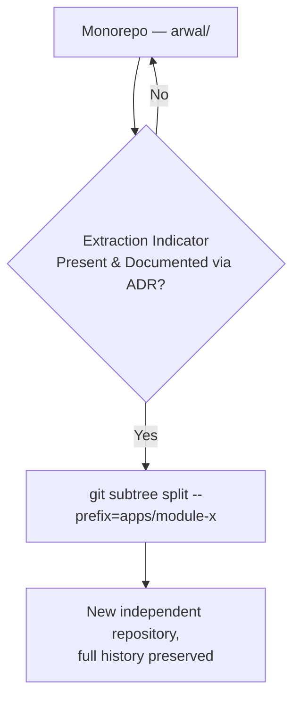
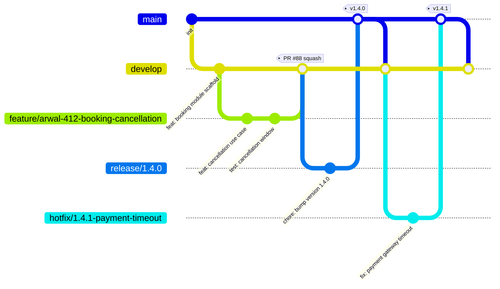
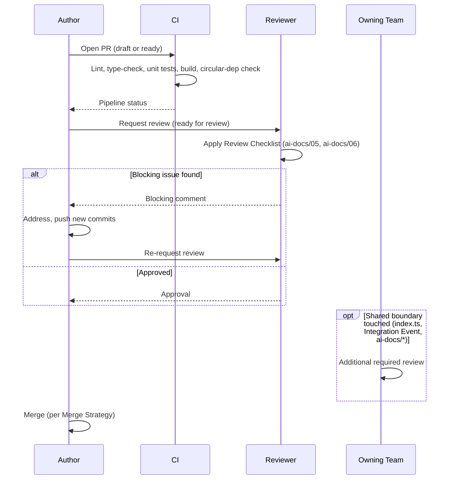
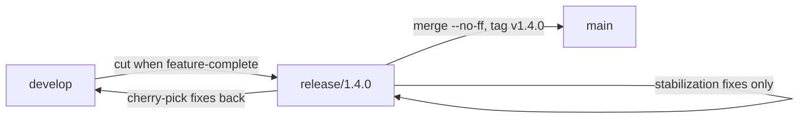
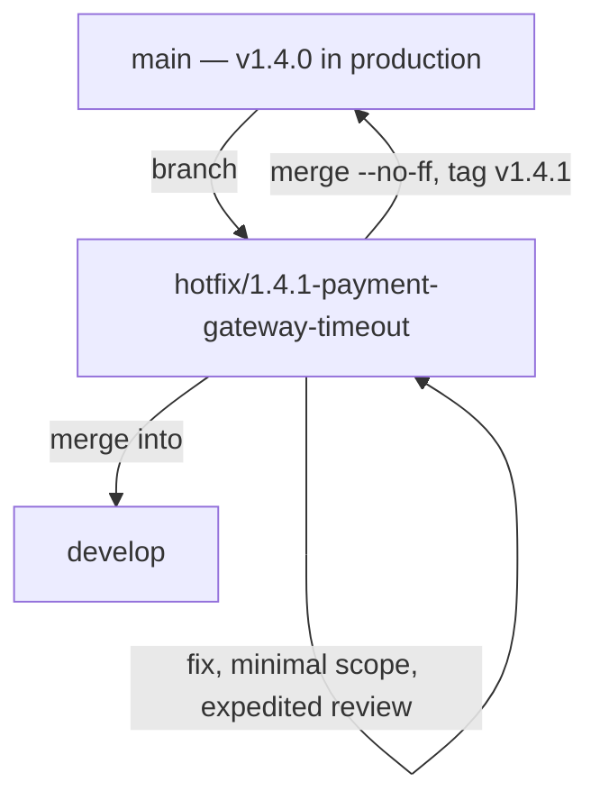
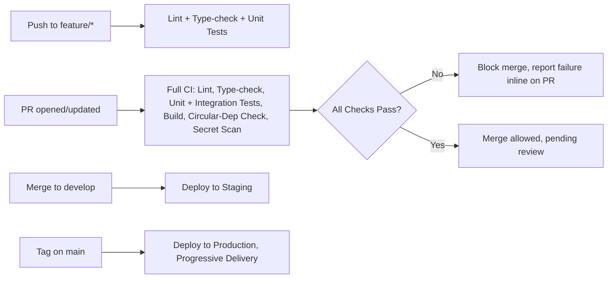

# Git and Version Control Standards

**Document:** `ai-docs/06-git-workflow.md`
**Project:** Arwal — The District Super App
**Stage:** 1 — Foundation
**Phase:** 7 — Git Workflow
**Status:** Approved for Engineering Reference
**Audience:** Architects, Engineers, Engineering Managers, Technical Reviewers, Release Engineers, Government Technical Partners

> **Callout — Purpose of This Document**
> `ai-docs/00-project-vision.md` defined why Arwal exists. `ai-docs/01-product-goals.md` defined what Arwal must achieve. `ai-docs/02-engineering-principles.md` defined how engineers reason about design. `ai-docs/03-system-architecture-principles.md` defined how the system is structured. `ai-docs/04-folder-guidelines.md` defined where that structure physically lives. `ai-docs/05-coding-standards.md` defined how individual lines of code are written. This document defines **how change itself moves through the system** — how a single line of code travels from an engineer's laptop to a citizen-facing production service, safely, traceably, and reversibly, across ~300 micro-phases and years of team growth.

---

# Purpose of this Document

Every principle in the five preceding phase documents assumes a mechanism by which change is proposed, reviewed, tested, merged, and released. That mechanism is Git, and the workflow built around it. Without a disciplined, written, enforced Git workflow, even a codebase with perfect architecture (`ai-docs/03-system-architecture-principles.md`), perfect folder discipline (`ai-docs/04-folder-guidelines.md`), and perfect coding standards (`ai-docs/05-coding-standards.md`) will still accumulate untraceable history, unreviewable diffs, unreproducible builds, and unrecoverable incidents.

This document exists to:

1. Make version control a **first-class engineering discipline** at Arwal, not an informal habit that varies by engineer.
2. Give every engineer a **single, citable reference** for how a branch is named, how a commit is written, how a pull request is structured, and how code reaches production — removing thousands of small, inconsistent, re-litigated decisions from the daily workflow, exactly as `ai-docs/05-coding-standards.md` does at the code level.
3. Protect **traceability and auditability** — a non-negotiable requirement given Arwal's civic, financial, and health-data responsibilities (`ai-docs/02-engineering-principles.md`, Security Principles; `ai-docs/03-system-architecture-principles.md`, Security Architecture Principles). Every change to a citizen's booking, payment, or government application must be traceable to a specific commit, a specific reviewer, and a specific reason.
4. Protect **reproducibility and rollback safety** — consistent with the Deployment Philosophy and Rollback commitments in `ai-docs/02-engineering-principles.md`, a bad deploy must be reversible in minutes, and Git history is the mechanism that makes that possible.
5. Give reviewers a **citable standard** for process — "this PR violates the Commit Standards in Phase 7" is exactly as legitimate a review comment as citing SOLID from Phase 3 or a folder rule from Phase 5.

This document assumes familiarity with all six preceding phase documents. It does not repeat their reasoning about *what* good code looks like — it defines the *process* by which that code is proposed, verified, and shipped.

---

# Version Control Philosophy

Git workflow at Arwal is governed by four commitments that resolve ambiguity whenever a process question doesn't have an obvious answer.

### Single Source of Truth

The `main` branch, at any point in time, represents the exact code running in (or about to run in) production. There is no second authoritative copy of "what's real" — no engineer's local branch, no shared staging fork, no undocumented long-lived branch competes with `main` for authority. This is the same Single Source of Truth principle from `ai-docs/02-engineering-principles.md` applied to the repository itself.

### Small, Atomic Commits

A commit represents one coherent, logically complete, ideally revertible unit of change — never an undifferentiated bundle of unrelated edits. A commit that mixes a bug fix with a refactor with a formatting pass cannot be reviewed, reverted, or bisected cleanly. Atomicity at the commit level is the same discipline SRP (`ai-docs/02-engineering-principles.md`) demands at the function level.

### Traceability

Every change in Arwal's history must answer, without requiring anyone's memory: **what changed, why it changed, who approved it, and what phase or issue it belongs to.** This is achieved through Conventional Commit messages, mandatory issue/ADR linkage in pull requests, and required review approval — never through tribal knowledge.

### Reproducibility

Given any commit hash, it must be possible to reconstruct exactly what was deployed, when, and to build it identically again. This depends on: no unpinned or silently mutable dependencies, no manual out-of-band changes to a deployed environment (`ai-docs/02-engineering-principles.md`, Migrations), and a Git history that is never rewritten on shared/protected branches.

> **Callout — The One-Sentence Git Philosophy**
> *"If an engineer cannot explain, from `git log` alone, what changed, why, and who approved it, the history has already failed its purpose."*

---

# Repository Strategy

### Monorepo

Arwal is built as a single monorepo, consistent with the High-Level Repository Structure defined in `ai-docs/04-folder-guidelines.md`. All apps (`apps/api`, `apps/web`, `apps/admin-web`, `apps/mobile`, `apps/workers`) and all shared packages (`packages/*`) live in one Git repository with one shared history.

### Why Monorepo

| Factor | Monorepo (Chosen) | Multi-Repo (Rejected at This Stage) |
|---|---|---|
| **Cross-cutting changes** | A single PR can update a backend contract (`apps/api`) and its typed client (`packages/sdk`) and the consuming frontend (`apps/web`) atomically, in one reviewable, one commit-linked change. | The same change requires coordinated, sequenced PRs across repositories, with a window where consumers are out of sync with the producer. |
| **Consistency enforcement** | Shared lint rules, `tsconfig`, CI pipelines, and the Coding Standards (`ai-docs/05-coding-standards.md`) apply uniformly, checked in one place. | Every repository can silently drift from shared standards without a central enforcement point. |
| **Discoverability** | An engineer can search the entire codebase — backend, frontend, shared packages — from one checkout, consistent with the Discoverability goal in `ai-docs/04-folder-guidelines.md`. | Finding "everywhere a `Booking` DTO is used" requires searching N repositories. |
| **Versioning overhead** | Internal packages (`packages/ui`, `packages/types`) are consumed at their current in-repo version — no publish-then-bump-then-install cycle for every internal change. | Every internal package needs its own release cycle before consumers can pick up a change, adding latency to every cross-cutting fix. |
| **Alignment with Modular Monolith** | Mirrors the Modular Monolith First strategy (`ai-docs/03-system-architecture-principles.md`) directly — logical boundaries (folders, modules) are drawn first; physical boundaries (repositories, services) are deferred until evidence justifies them. | Physically separate repositories would force the *distribution decision* before it is justified — the exact anti-pattern Phase 4 rejects for services, applied prematurely to the repository layer. |

### Future Extraction Strategy

Consistent with the Migration Strategy in `ai-docs/03-system-architecture-principles.md`, a module may eventually be extracted into its own repository — but only when the same evidence-based indicators that justify service extraction (independent scaling, independent release cadence, failure isolation, compliance perimeter, distinct technology need) are documented via an ADR. Because the Module Folder Template (`ai-docs/04-folder-guidelines.md`) already keeps each module's code entirely within one top-level folder with a single `index.ts` public surface, repository extraction is primarily a `git subtree split` / history-preserving export exercise, not a code archaeology exercise — the same property that makes service extraction cheap also makes repository extraction cheap, by design.



---

# Branch Strategy

Arwal uses a **trunk-based development model with short-lived supporting branches**, consistent with the Git and Branching Principles already established in `ai-docs/02-engineering-principles.md`.



### Branch Types

| Branch | Purpose | Lifetime | Merges Into | Deployable? |
|---|---|---|---|---|
| **`main`** | The Single Source of Truth. Always reflects what is (or is about to be) in production. Protected, never committed to directly. | Permanent | — | Yes — production |
| **`develop`** | Integration branch where completed, reviewed features accumulate ahead of a release cut. Always in a working, deployable-to-staging state. | Permanent | `main` (via `release/*`) | Yes — staging |
| **`feature/*`** | A single, scoped unit of new functionality tied to one phase/issue. | Short-lived (days, not weeks) | `develop` | No |
| **`bugfix/*`** | A fix for a defect found in `develop`/staging that is not yet in production. | Short-lived | `develop` | No |
| **`hotfix/*`** | An emergency fix for a defect already in production. Branches from `main`, not `develop`. | Very short-lived (hours) | `main` and `develop` | Yes — expedited |
| **`release/*`** | A stabilization branch cut from `develop` for a specific release — only fixes, no new features, land here. | Short-lived (days) | `main` and `develop` | Yes — release candidate |
| **`docs/*`** | Documentation-only changes (`ai-docs/`, `docs/`, READMEs) with no application code impact. | Short-lived | `develop` | No |
| **`chore/*`** | Non-functional maintenance: dependency bumps, tooling, CI config, formatting-only changes. | Short-lived | `develop` | No |

> **Callout — Why `develop` Exists Alongside Trunk-Based Development**
> Arwal's model is trunk-based *at the feature level* — branches are short-lived and merge frequently, per `ai-docs/02-engineering-principles.md` — but `develop` exists as a deliberate integration/staging buffer ahead of `main`, given Arwal's civic and financial responsibilities. A citizen-facing government or payment feature is proven on staging (`develop` → deployed to a staging environment) before it is promoted to `main` via a reviewed `release/*` branch, rather than every merged feature landing directly in production. This is a documented, deliberate deviation from pure trunk-based development, justified by the Trust Constraint in `ai-docs/01-product-goals.md`.

---

# Branch Naming Rules

Branch names are structured, lowercase, `kebab-case`, and always include a tracking reference (phase number or issue ID) so that a branch name alone answers "what is this for, and where is the record of why."

```
<type>/<tracking-id>-<short-description>
```

| Component | Rule |
|---|---|
| `type` | One of `feature`, `bugfix`, `hotfix`, `release`, `docs`, `chore` |
| `tracking-id` | The issue/ticket ID (e.g., `arwal-412`) or, for foundational work, the phase reference (e.g., `phase-07`) |
| `short-description` | 2–5 words, `kebab-case`, describing the change — never vague (`fix-stuff`, `updates`) |

### Examples

| Branch | Valid? | Why |
|---|---|---|
| `feature/arwal-412-booking-cancellation-window` | ✅ | Type, tracking ID, and clear scope |
| `bugfix/arwal-733-wallet-balance-rounding` | ✅ | Clear defect reference |
| `hotfix/1.4.1-payment-gateway-timeout` | ✅ | Hotfixes may use the target version instead of an issue ID, since they are often filed and fixed in the same motion |
| `release/1.4.0` | ✅ | Release branches are named by target version only |
| `docs/phase-07-git-workflow` | ✅ | Foundational documentation work tied to a phase |
| `chore/upgrade-typescript-5-6` | ✅ | Clear maintenance scope |
| `fix-bug` | ❌ | No type prefix, no tracking ID, no real description |
| `feature/my-work` | ❌ | No tracking ID, no meaningful description |
| `johns-branch` | ❌ | No type, no tracking ID, named after a person, not the work |

---

# Commit Standards

### Atomic Commits

A commit is atomic when reverting it, in isolation, leaves the codebase in a coherent, working state. This means:

- A commit that adds a new domain rule and its test lands together — splitting them would leave an intermediate commit with untested behavior.
- A commit that mixes a bug fix in `booking.service.ts` with an unrelated formatting pass across `commerce/` is split into two commits — the fix and the formatting are not the same unit of change, per the Scope Discipline principle in `ai-docs/02-engineering-principles.md`.

### Commit Size

A commit should be reviewable in a single sitting without the reviewer losing track of intent — as a practical heuristic, if a commit's diff cannot be summarized in one Conventional Commit subject line without an "and," it is very likely more than one commit (the same test applied to functions in `ai-docs/05-coding-standards.md`).

### Commit Scope

The `scope` in a Conventional Commit message identifies the module or area affected, aligned to the Module Folder Template (`ai-docs/04-folder-guidelines.md`) wherever possible — `booking`, `commerce`, `identity`, `civic`, `payments`, `ui`, `sdk`, `ci`, etc. A commit touching more than one unrelated scope is a signal to split it.

### When to Split Commits

| Situation | Split? |
|---|---|
| A feature and its accompanying tests | No — land together |
| A feature and an unrelated refactor it exposed | Yes — refactor is a separate commit/PR per Refactoring Principles (`ai-docs/02-engineering-principles.md`) |
| A bug fix and a dependency bump discovered while fixing it | Yes — different concerns, different risk profiles |
| Multiple files changed to implement one business rule | No — one commit, even across many files, if it's one coherent change |
| A formatting-only pass across many files | Yes — always its own `style:` commit, never bundled with logic changes |

### Conventional Commits

Every commit message follows the [Conventional Commits](https://www.conventionalcommits.org/) format:

```
<type>(<scope>): <short summary>

<optional body — the "why," not a restatement of the diff>

<optional footer — BREAKING CHANGE, issue references, ADR references>
```

| Type | Use For | Example |
|---|---|---|
| `feat` | A new user-facing or API-facing capability | `feat(booking): add cancellation within grace-period rule` |
| `fix` | A bug fix | `fix(payments): correct rounding error in wallet debit` |
| `docs` | Documentation-only changes | `docs(ai-docs): add Phase 7 Git Workflow document` |
| `refactor` | Internal restructuring with no behavior change | `refactor(commerce): extract PricingCalculator domain service` |
| `style` | Formatting-only changes (whitespace, semicolons) — never logic | `style(civic): apply prettier formatting to controllers` |
| `test` | Adding or correcting tests, no production code change | `test(booking): cover cancellation window edge cases` |
| `build` | Build system or dependency changes | `build(api): upgrade Prisma to 5.18` |
| `ci` | CI/CD pipeline configuration changes | `ci(github-actions): add circular-dependency check to PR pipeline` |
| `perf` | A performance improvement with no functional change | `perf(search): add composite index for listing queries` |
| `revert` | Reverting a previous commit | `revert: feat(booking): add cancellation within grace-period rule` |
| `chore` | Maintenance work not covered by the above | `chore(deps): bump eslint to 9.9.0` |

```bash
# Example: a well-formed commit
git commit -m "feat(booking): enforce 2-hour cancellation cutoff

Business rule confirmed with district government SLA (see ADR-0031).
Adds domain-level validation in Booking.cancel(); presentation layer
already surfaces the 422 error via the standard error envelope.

Refs: ARWAL-412"
```

```bash
# Example: a breaking change footer
git commit -m "feat(payments)!: require idempotency key on charge endpoint

BREAKING CHANGE: POST /v1/payments/charge now requires an
Idempotency-Key header. Clients on v1 without this header will
receive a 400. Deprecation window: 30 days per API Versioning
(ai-docs/02-engineering-principles.md).

Refs: ARWAL-501"
```

---

# Pull Request Standards

No commit reaches `develop`, `release/*`, or `main` without a pull request. Every PR uses Arwal's standard template and is not merged until every required section is complete.

### Required PR Template

```markdown
## Summary
What does this change do, and why? (1-3 sentences)

## Type of Change
- [ ] feat  - [ ] fix  - [ ] docs  - [ ] refactor
- [ ] style - [ ] test - [ ] build - [ ] ci
- [ ] perf  - [ ] chore

## Linked Issue / Phase
Closes ARWAL-412
Relates to ai-docs/02-engineering-principles.md (Domain Boundaries)

## ADR References (if applicable)
ADR-0031: 2-hour cancellation cutoff per district SLA

## Description
What changed, at a level a reviewer unfamiliar with this specific
area of the code can follow. Call out any deliberate deviations
from ai-docs/02-05.

## Screenshots / Recordings (UI changes only)
Before / After, or a short recording of the interactive flow.

## Testing Evidence
- [ ] Unit tests added/updated
- [ ] Integration tests added/updated (if crossing a boundary)
- [ ] Manually verified on: <device/browser/environment>
- [ ] Verified against the Testing Pyramid (ai-docs/02-engineering-principles.md)

## Checklist
- [ ] Follows ai-docs/05-coding-standards.md
- [ ] No forbidden cross-module/cross-layer imports (ai-docs/03, ai-docs/04)
- [ ] No secrets, credentials, or sensitive data in the diff
- [ ] No empty catch blocks / swallowed errors
- [ ] Authorization checked for any operation touching another actor's data
- [ ] Breaking API changes are versioned per ai-docs/05-coding-standards.md
- [ ] Technical debt introduced is marked with a tracked TODO/FIXME
```

### Required Elements, Explained

| Element | Why It's Required |
|---|---|
| **Linked Issue/Phase** | Enforces Traceability — every change must map to a documented reason to exist, not an ad hoc edit. |
| **ADR References** | Where a change implements or touches a recorded architectural/engineering decision, the PR is the point where a future reader connects code to reasoning, per the ADR Callout in `ai-docs/02-engineering-principles.md`. |
| **Screenshots/Recordings** | UI changes are difficult to review from a diff alone; a visual artifact lets reviewers verify intent without pulling the branch locally. |
| **Testing Evidence** | Makes the Testing Principles (`ai-docs/02-engineering-principles.md`) verifiable at the PR level, not just asserted. |
| **Review Checklist** | Converts the Code Review Standards and Engineering Excellence Checklist (`ai-docs/05-coding-standards.md`) into a per-PR, self-attested first pass, before a human reviewer's time is spent. |

---

# Code Review Workflow



### Required Approvals

- Every PR requires **at least one** qualified reviewer approval before merge, per the Code Review Standards in `ai-docs/02-engineering-principles.md`.
- A PR touching a module's `index.ts` public surface, a shared `packages/*` package, an Integration Event schema, or an `ai-docs/*` document requires an **additional** approval from that folder's owning team, per the Folder Ownership Rules in `ai-docs/04-folder-guidelines.md`.
- A PR touching `payments`, `identity`, or `civic-services` domain logic requires review from an engineer with context in that bounded context, given the Security/Trust sensitivity established in `ai-docs/00-project-vision.md`.

### Blocking Comments vs. Suggestions

| Comment Type | Meaning | Resolution Required Before Merge? |
|---|---|---|
| **Blocking** | Cites a specific violation — a missing authorization check, a swallowed exception, a forbidden import, a missing test for new business logic (see Blocking Issues in `ai-docs/05-coding-standards.md`). | Yes, always |
| **Suggestion** | A non-critical improvement, naming preference not covered by the Naming Standards, or an optional simplification. | No — author/reviewer judgment; may be tracked as follow-up debt |
| **Question** | A clarifying question that may reveal a blocking issue once answered. | Resolved by answer; escalates to Blocking if the answer reveals a real problem |

Reviews are conducted in the same blameless, good-faith spirit established in `ai-docs/02-engineering-principles.md` — a blocking comment protects the system, it is never a judgment of the author.

### Merge Policy

A PR merges only when: all CI checks pass, all Blocking comments are resolved, the required approval(s) are present, and the branch is up to date with its target branch (see Conflict Resolution below).

---

# Merge Strategy

| Strategy | Description | Arwal's Usage |
|---|---|---|
| **Merge Commit** | Preserves every individual commit from the feature branch plus a merge commit tying them together. | Used only for `release/*` → `main` and `hotfix/*` → `main` merges, where preserving the release branch's exact commit history is valuable for audit purposes. |
| **Squash Merge** | Combines all commits on the feature branch into a single commit on the target branch, using the PR title/description as the commit message. | **Default for `feature/*`, `bugfix/*`, `docs/*`, `chore/*` → `develop`.** |
| **Rebase Merge** | Replays each individual commit from the feature branch onto the target branch with no merge commit. | Not used for merging into shared branches at Arwal (see rationale below); acceptable for an individual engineer keeping their own feature branch current with `develop` before merge. |

### Why Squash Merge Is the Default

- **`develop` history stays legible.** One entry per feature/fix, matching one Conventional Commit message, means `git log develop` reads as a clean changelog — directly supporting Traceability.
- **Work-in-progress commits don't pollute shared history.** An engineer's local commits (`wip`, `fix typo`, `address review comment`) are real and useful during review but are noise in permanent history; squashing collapses them without losing the reviewed diff.
- **Bisecting stays simple.** `git bisect` against `develop`/`main` walks one commit per feature, not dozens of intermediate, possibly-broken states.
- **Reverting stays simple.** Reverting one squashed commit reverts the entire feature cleanly, consistent with the Atomic Commits philosophy above.

### Why Merge Commits Are Preserved for Releases

A `release/*` or `hotfix/*` branch merging into `main` uses a merge commit specifically so the **release boundary itself** is a visible, permanent marker in history — "this is where v1.4.0 became production" — which the Release Strategy and Rollback Strategy below depend on being identifiable at a glance.

```bash
# Feature branch into develop — squash
git checkout develop
git merge --squash feature/arwal-412-booking-cancellation-window
git commit -m "feat(booking): enforce 2-hour cancellation cutoff (#88)"

# Release branch into main — merge commit, preserves release history
git checkout main
git merge --no-ff release/1.4.0
git tag -a v1.4.0 -m "Release 1.4.0"
```

---

# Conflict Resolution

- **Rebase feature branches on their target, not the reverse.** An engineer keeps `feature/*` current by rebasing onto the latest `develop` (`git rebase develop`), never by merging `develop` into the feature branch repeatedly, which produces noisy, hard-to-review history.
- **Resolve conflicts locally, never in the GitHub/GitLab web editor**, for anything beyond a trivial one-line conflict — the web editor lacks the context (running tests, full IDE) needed to resolve a real conflict correctly.
- **Re-run the full test suite after any conflict resolution** — a mechanically "resolved" conflict can silently reintroduce a bug even when the diff looks clean.
- **When a conflict spans a module boundary** (e.g., two features both modifying `local-services/domain/entities/Booking.ts`), treat it as a signal, not just a mechanical merge: the two features may be encoding overlapping or contradictory business rules, and the domain owner should be looped in per the Folder Ownership Rules (`ai-docs/04-folder-guidelines.md`), not just textually merged.
- **Never force-push over a conflict resolution on a shared branch.** Force-push is permitted only on an engineer's own `feature/*` branch before it has been reviewed by anyone else (see Branch Protection Rules below).

```bash
# Correct conflict-resolution flow on a feature branch
git checkout feature/arwal-412-booking-cancellation-window
git fetch origin
git rebase origin/develop
# resolve conflicts in editor
git add <resolved-files>
git rebase --continue
npm test  # re-verify before pushing
git push --force-with-lease origin feature/arwal-412-booking-cancellation-window
```

> **Callout — Always `--force-with-lease`, Never `--force`**
> `--force-with-lease` refuses to overwrite a remote branch if someone else has pushed to it since your last fetch — `--force` does not check, and can silently discard a teammate's work. `--force` is never used at Arwal, on any branch, for any reason.

---

# Release Strategy

### Semantic Versioning

Arwal follows [Semantic Versioning](https://semver.org/) (`MAJOR.MINOR.PATCH`) for every versioned API (per API Versioning, `ai-docs/05-coding-standards.md`) and for the platform release itself:

| Segment | Incremented When |
|---|---|
| **MAJOR** | A breaking API change ships (new API version, e.g., `/v2/...`) or a fundamentally incompatible platform change. |
| **MINOR** | A new, backward-compatible feature/capability ships. |
| **PATCH** | A backward-compatible bug fix or a hotfix ships. |

### Release Branches

A `release/x.y.0` branch is cut from `develop` once its scoped feature set is complete and staging-verified. Only fixes discovered during release stabilization land on the release branch directly (cherry-picked back into `develop`); no new features are added to a release branch after it is cut.



### Release Tags

Every release merged into `main` is tagged immediately, using an annotated tag matching the release version, which becomes the permanent, immutable reference point for that release.

```bash
git checkout main
git merge --no-ff release/1.4.0
git tag -a v1.4.0 -m "Release 1.4.0: booking cancellation, wallet rounding fix"
git push origin main --tags
```

### Changelog Generation

The changelog is generated automatically from Conventional Commit history between tags — never hand-maintained, which would drift per the same reasoning `ai-docs/02-engineering-principles.md` applies to API documentation.

```bash
# Example: generate changelog entries since the last tag
git log v1.3.0..v1.4.0 --pretty=format:"- %s (%h)" --no-merges
```

---

# Hotfix Workflow

A hotfix addresses a defect already live in production and cannot wait for the next scheduled release.



1. Branch from `main` (not `develop`), since `main` is the only branch guaranteed to reflect exactly what's in production.
2. Scope the fix as narrowly as possible — a hotfix is not an opportunity for an unrelated improvement, per Scope Discipline (`ai-docs/02-engineering-principles.md`).
3. Route through an **expedited but not skipped** review — at least one reviewer approval is still required; "hotfix" reduces process latency, never review rigor, given the Blocking Issues that remain non-negotiable regardless of deadline pressure (`ai-docs/05-coding-standards.md`).
4. Merge into `main`, tag a new `PATCH` version, deploy.
5. Merge the same fix into `develop` immediately, so the next regular release doesn't regress the hotfix.

```bash
git checkout main
git checkout -b hotfix/1.4.1-payment-gateway-timeout
# implement fix, commit
git checkout main
git merge --no-ff hotfix/1.4.1-payment-gateway-timeout
git tag -a v1.4.1 -m "Hotfix 1.4.1: payment gateway timeout"
git push origin main --tags
git checkout develop
git merge --no-ff hotfix/1.4.1-payment-gateway-timeout
git push origin develop
```

---

# Rollback Strategy

Consistent with the Automated Rollback requirement in `ai-docs/02-engineering-principles.md`, every deployable release must be reversible in minutes:

- **Tag-based rollback** — because every release is tagged, rolling back means redeploying the previous tag's artifact, never reconstructing a previous state by hand.
- **Revert commits, never history rewrites, on shared branches** — a bad change already merged into `main` or `develop` is undone with `git revert`, which adds a new, forward-moving commit that undoes the change, preserving full history. Rewriting history on a shared branch (`git reset --hard` + force-push) is forbidden, since it breaks every collaborator's local history and invalidates prior reviews.
- **Database migrations are rollback-aware** — per the Migrations principle (`ai-docs/02-engineering-principles.md`), a rollback of application code is only safe if the corresponding migration was written backward-compatibly; a rollback plan is considered incomplete if it doesn't account for schema state.

```bash
# Rolling back a bad merge to main via revert (preferred)
git checkout main
git revert -m 1 <merge-commit-hash>
git push origin main
git tag -a v1.4.2 -m "Rollback: revert v1.4.1 payment gateway change"
```

---

# Git Ignore Policy

The following are never committed to the repository, under any circumstance, enforced by `.gitignore` at the root and per-app level, and backed by the Secret Scanning Policy below as a second line of defense:

- Environment files containing real values (`.env`, `.env.local`, `.env.production`) — only `.env.<environment>.example` templates are committed, per Configuration Organization (`ai-docs/04-folder-guidelines.md`).
- Any credential, API key, private key, or certificate.
- `node_modules/`, build output (`dist/`, `build/`, `.next/`), and other regenerable artifacts.
- IDE-specific and OS-specific files (`.vscode/` beyond a shared team config, `.DS_Store`, `Thumbs.db`).
- Local database dumps, seed data containing real citizen/merchant information, or any production data snapshot.
- Log files and local debugging output.

```gitignore
# Root .gitignore (excerpt)
node_modules/
dist/
build/
.env
.env.local
.env.*.local
*.pem
*.key
.DS_Store
coverage/
*.log
```

---

# Large File Policy

- Binary assets that must be version-controlled (design files, large images used in build) are managed through **Git LFS**, never committed directly into the standard object store, to keep clone and fetch times reasonable across a repository that will grow across ~300 phases.
- Per the Asset Organization guidance in `ai-docs/04-folder-guidelines.md`, large media (video, high-resolution source assets) is generally **not** repository-committed at all — it is hosted on the CDN/File Storage shared service and referenced by URL.
- Any file exceeding 5MB triggers a required justification in the PR description; any file exceeding 20MB is rejected by CI unless tracked via Git LFS with an explicit reviewer sign-off.

```bash
# Tracking a legitimate large asset via Git LFS
git lfs track "packages/ui/assets/fonts/*.ttf"
git add .gitattributes
```

---

# Secret Scanning Policy

- Every push and every pull request is scanned automatically by a secret-scanning tool (e.g., a `git-secrets`/`gitleaks`-class scanner) wired into CI, as a second line of defense behind the `.gitignore` policy above and the Secrets Management principle in `ai-docs/02-engineering-principles.md`.
- A detected secret **blocks the PR/push immediately** — merge is not possible until the secret is removed from history (not just the latest commit) and rotated, since a committed secret must be treated as compromised the moment it touches any branch, even briefly.
- A leaked secret discovered after merge triggers immediate rotation of the credential and a documented incident review, per the Incident Response Readiness commitment in `ai-docs/00-project-vision.md` — history rewriting to "remove" the secret is a secondary cleanup step, never a substitute for rotation.

---

# Branch Protection Rules

The following are enforced at the repository level for `main`, `develop`, and every `release/*` branch, with zero exceptions for seniority or deadline pressure:

| Rule | `main` | `develop` | `release/*` |
|---|---|---|---|
| **No direct pushes** — all changes via reviewed PR | ✅ | ✅ | ✅ |
| **Required approving review(s)** before merge | ✅ (2 for payments/identity/civic) | ✅ (1, 2 for shared boundaries) | ✅ (1) |
| **Required passing status checks** (lint, type-check, unit tests, build, circular-dep check) | ✅ | ✅ | ✅ |
| **Branch must be up to date with target before merge** | ✅ | ✅ | ✅ |
| **No force push** | ✅ | ✅ | ✅ |
| **No branch deletion** | ✅ | ✅ | ✅ (until merged and archived) |
| **Signed commits required** | ✅ (recommended, phased in as tooling matures) | Optional | Optional |
| **Linear history required** (no stray merge commits from feature branches) | ✅ | ✅ | N/A |

> **Callout — Why No Direct Push to `main`, Ever**
> `main` is the Single Source of Truth for what is running in production for over a million eventual citizens. A single unreviewed, untested direct push — however well-intentioned, however urgent — bypasses every safeguard this document exists to provide: review, CI verification, traceability. Branch protection makes this a structural guarantee, not a matter of individual discipline.

---

# CI/CD Integration

Every Git event triggers a corresponding automated pipeline stage, consistent with the CI/CD requirement in `ai-docs/02-engineering-principles.md`:



- **Every commit** on a `feature/*`, `bugfix/*`, or `chore/*` branch triggers a fast feedback loop (lint, type-check, unit tests) so an engineer sees failures within minutes, not at PR time.
- **Every PR** triggers the full pipeline, including integration tests and the circular-dependency check required by the Import Rules (`ai-docs/04-folder-guidelines.md`).
- **Every merge to `develop`** triggers an automatic deploy to the staging environment, giving the team a continuously current environment reflecting the Single Source of Truth's next candidate state.
- **Every tag on `main`** triggers a production deployment via progressive delivery (canary/staged rollout), per the Deployment Philosophy in `ai-docs/02-engineering-principles.md` — a Git tag is the sole trigger for a production release, never a manual out-of-band deploy.
- **Pipeline status is a required check** — a red pipeline blocks merge unconditionally, with no override, consistent with Protected release branches always being in a deployable state (`ai-docs/02-engineering-principles.md`).

---

# Common Git Mistakes

| Mistake | Example | Why It's Rejected |
|---|---|---|
| **Committing directly to `main`** | `git checkout main && git commit -m "quick fix"` | Bypasses review, CI, and branch protection entirely; forbidden regardless of urgency — use `hotfix/*` instead. |
| **Vague commit messages** | `git commit -m "fixes"` or `git commit -m "wip"` | Fails Traceability; a future engineer (or `git blame`) learns nothing about why the change was made. |
| **Giant, unreviewable PRs** | A single PR touching `commerce`, `payments`, and `notifications` with 4,000 lines changed | Violates Scope Discipline (`ai-docs/02-engineering-principles.md`) and Small, Reviewable Increments (`ai-docs/00-project-vision.md`); should be split into sequential, independently reviewable PRs. |
| **Force-pushing a shared branch** | `git push --force origin develop` | Silently discards teammates' history and invalidates prior review approvals; `--force` on a shared branch is never permitted. |
| **Merging with failing CI** | Manually overriding a red status check "just this once" | Defeats the entire purpose of required status checks; a release built on unverified code is not deployable, by definition. |
| **Committing secrets "temporarily"** | `git commit -m "add API key for testing"` then planning to remove it later | The secret is compromised the moment it's pushed, even if removed in the next commit — history still contains it; must be rotated, not just deleted. |
| **Long-lived feature branches** | A `feature/*` branch open for six weeks, diverging heavily from `develop` | Produces painful merge conflicts and defeats trunk-based development's core benefit; branches should be scoped small enough to merge within days. |
| **Rebasing a branch others have already pulled** | Rebasing and force-pushing a `feature/*` branch after a teammate has based their own work on it | Breaks the teammate's history; rebase is safe only before a branch has been shared/reviewed by others. |
| **Bundling a refactor with a feature** | One commit that both renames half the module's files and adds new booking logic | Makes the diff unreviewable and un-revertible independently; split per the Refactoring Principles (`ai-docs/02-engineering-principles.md`). |
| **Ignoring merge conflicts in generated/lock files** | Blindly accepting "theirs" on a `package-lock.json` conflict without regenerating it | Can silently reintroduce a vulnerable or incompatible dependency version; lock file conflicts are resolved by regenerating, not guessing. |

---

# Git Review Checklist

Every pull request is checked against the following before merge, in addition to the Code Review Standards (`ai-docs/02-engineering-principles.md`) and the Review Checklist (`ai-docs/05-coding-standards.md`):

- [ ] Branch name follows the `<type>/<tracking-id>-<description>` convention.
- [ ] Every commit follows Conventional Commits, with an accurate `type` and `scope`.
- [ ] Commits are atomic — no commit mixes unrelated concerns (feature + refactor + formatting).
- [ ] The PR description is complete: Summary, Linked Issue/Phase, ADR references where applicable, Testing Evidence.
- [ ] The PR is scoped to one coherent unit of work, not a bundle of unrelated changes.
- [ ] No secrets, credentials, or real citizen/merchant data appear anywhere in the diff or commit history.
- [ ] No large binary files were committed outside of Git LFS, per the Large File Policy.
- [ ] All required CI status checks are green.
- [ ] All required approvals (including owning-team review for shared boundaries) are present.
- [ ] The branch is up to date with its target branch, with conflicts resolved via rebase, not a merge-into-feature-branch pattern.
- [ ] The correct merge strategy was used (squash for `feature/bugfix/docs/chore`, merge commit for `release/hotfix`).
- [ ] If this PR represents a release, the version bump follows Semantic Versioning and a tag is planned.

A pull request failing any item above is not merged until resolved — this checklist carries the same authority as the Folder Review Checklist (`ai-docs/04-folder-guidelines.md`) and the Engineering Excellence Checklist (`ai-docs/05-coding-standards.md`).

---

# Closing Statement

> **Callout — Closing Statement**
> Architecture defines the shape of the system; folder guidelines define where that shape lives; coding standards define what fills it; this document defines how it moves — safely, traceably, and reversibly — from an engineer's keyboard to a citizen depending on it. A perfectly engineered feature that reaches production through an unreviewed direct push, an untraceable commit, or an unrecoverable release is not actually production-grade, regardless of the quality of the code itself. This document exists so that the *path* code travels is held to the same discipline as the code itself, for every one of the ~300 micro-phases still ahead. Where a future phase must deviate from a rule stated here, that deviation is made explicitly — through a documented review exception, or an ADR where the deviation is structural — never silently, and never by default.

This document, `ai-docs/06-git-workflow.md`, is the seventh phase of approximately 300. Every branch created, every commit written, and every pull request opened in the phases that follow is expected to conform to the standards defined here, or to justify its deviation in writing.

**End of Phase 7 — `ai-docs/06-git-workflow.md`**
