# Development Workflow

**Document:** `ai-docs/07-development-workflow.md`
**Project:** Arwal — The District Super App
**Stage:** 1 — Foundation
**Phase:** 8 — Development Workflow
**Status:** Approved for Engineering Reference
**Audience:** Architects, Engineers, Engineering Managers, QA Engineers, DevOps Engineers, UI/UX Designers, AI Engineers, Security Engineers, Technical Reviewers, Government Technical Partners

> **Callout — Purpose of This Document**
> `ai-docs/00-project-vision.md` defined why Arwal exists. `ai-docs/01-product-goals.md` defined what Arwal must achieve. `ai-docs/02-engineering-principles.md` defined how engineers reason about design. `ai-docs/03-system-architecture-principles.md` defined how the system is structured. `ai-docs/04-folder-guidelines.md` defined where that structure physically lives. `ai-docs/05-coding-standards.md` defined how individual lines of code are written. `ai-docs/06-git-workflow.md` defined how change moves through version control. This document defines **how a day of engineering work actually unfolds** — the end-to-end process by which an idea becomes a citizen-facing capability, and every checkpoint along the way that keeps that process safe, predictable, and repeatable across ~300 micro-phases.

---

# Purpose of this Document

Every document before this one describes a piece of the system: its principles (`ai-docs/02-engineering-principles.md`), its architecture (`ai-docs/03-system-architecture-principles.md`), its physical layout (`ai-docs/04-folder-guidelines.md`), its code-level rules (`ai-docs/05-coding-standards.md`), and the mechanics of how code moves through Git (`ai-docs/06-git-workflow.md`). None of these, individually, describes **what an engineer actually does, in what order, on any given day.** A team can have perfect architecture, perfect folder discipline, perfect coding standards, and a perfect Git workflow, and still ship inconsistently, unpredictably, or unsafely if there is no shared, written process connecting "I have an idea" to "a citizen is using this in production."

This document exists to:

1. **Tie every preceding phase document together into one operational process.** Architecture (Phase 4) tells you where a boundary belongs; this document tells you when that boundary gets reviewed. Coding standards (Phase 6) tell you how to write a function; this document tells you when that function gets tested, reviewed, and shipped. Git workflow (Phase 7) tells you how to structure a commit; this document tells you when that commit is created relative to planning, design, and deployment.
2. **Make the engineering lifecycle explicit and repeatable**, so that "how do we build things here" is answered identically whether the engineer asking is on day one or year five.
3. **Define checkpoints, not bureaucracy** — every gate in this document (architecture review, security review, code review) exists because skipping it has a known, specific failure mode, not because process is valued for its own sake.
4. **Give every engineering discipline** — frontend, backend, mobile, DevOps, QA, UI/UX, AI, security — a shared vocabulary and a shared map of how their work intersects with everyone else's, since Arwal's team is expected to grow across all of these disciplines over the life of the ~300-phase roadmap.
5. **Protect the citizen at the process level**, not just the code level — a workflow that lets a security gap, a broken migration, or an unreviewed architectural decision reach production has failed regardless of how clean the resulting code looks.

This document assumes familiarity with all seven preceding phase documents. Where a workflow step references a rule or principle, it cites the document that owns that rule rather than repeating it.

---

# Development Philosophy

Arwal's development workflow is governed by six commitments that resolve process ambiguity the same way the Engineering Principles (`ai-docs/02-engineering-principles.md`) resolve code-level ambiguity.

### Incremental Development

Every capability is built in the smallest slice that delivers real, reviewable, testable value — never as a single large undertaking that isn't visible until it's "done." This mirrors the ~300 micro-phase structure of the entire project (`ai-docs/00-project-vision.md`) at the level of an individual feature: a feature is itself decomposed into small, sequential, independently mergeable increments.

### Small Deliverables

A deliverable — a PR, a task, a phase — is sized so a reviewer, a QA engineer, or a future engineer can understand it in one sitting. This is the same Commit Size and Scope Discipline principle from `ai-docs/06-git-workflow.md`, applied one level up, to the unit of planning rather than the unit of version control.

### Continuous Feedback

Feedback loops are made as short as possible at every stage: a linter gives feedback in seconds, a unit test suite in minutes, a code review in hours, a staging deployment in a day, a citizen-facing metric within days of release. Arwal deliberately shortens each of these loops rather than accepting long, batched feedback cycles, because the cost of a mistake compounds the longer it goes undetected.

### Quality First

Quality gates (tests, review, security checks) are never skipped to hit a deadline. A shortcut taken under time pressure is tracked as technical debt per the Technical Debt Policy in `ai-docs/02-engineering-principles.md` — it is never silently absorbed into "done."

### Automation

Anything that can be automated — linting, type-checking, testing, dependency scanning, deployment, rollback — is automated, per the CI/CD Integration principles in `ai-docs/06-git-workflow.md`. Manual process is reserved for genuine human judgment calls (architecture review, security sign-off, UX evaluation), never for mechanical checks a machine can perform faster and more reliably.

### Documentation-First

A non-trivial change — a new module, a new API contract, a new architectural decision — is documented (an API contract, an ADR, a design spec) **before** implementation begins, not reconstructed from the finished code afterward. This is a direct extension of the Documentation-Driven Development commitment in `ai-docs/00-project-vision.md` and the API-First Design principle in `ai-docs/03-system-architecture-principles.md`.

> **Callout — The One-Sentence Development Philosophy**
> *"Small, tested, reviewed, documented, and observable — every time, not just when convenient."*

---

# Engineering Lifecycle

Every unit of work at Arwal — a feature, a bug fix, a refactor — passes through the same lifecycle stages, though the depth of each stage scales with the risk and size of the change (see Feature Development Workflow and Bug Fix Workflow below for stage-specific detail).

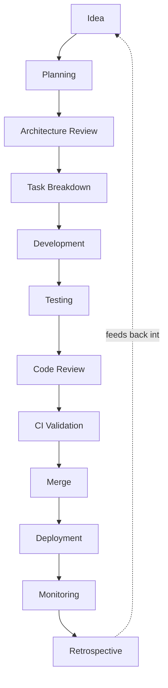

### Stage Definitions

| Stage | Purpose | Primary Owner | Exit Criteria |
|---|---|---|---|
| **Idea** | Capture a need — a citizen problem, a product goal, a technical improvement. | Product, Engineering, or Government Partner | The idea is written down and traceable to a goal in `ai-docs/01-product-goals.md` or a real observed problem. |
| **Planning** | Define scope, priority, and acceptance criteria. | Product Manager + Tech Lead | A scoped, prioritized ticket exists with clear acceptance criteria. |
| **Architecture Review** | Verify the proposed approach honors `ai-docs/03-system-architecture-principles.md` and `ai-docs/04-folder-guidelines.md`; determine if an ADR is required. | Architect / Tech Lead | Approach is approved, or an ADR is filed for a significant decision. |
| **Task Breakdown** | Decompose the work into small, independently reviewable units. | Tech Lead + Engineer | Tasks are sized per Small Deliverables above, each with a clear "done" definition. |
| **Development** | Implement the change per `ai-docs/05-coding-standards.md`. | Engineer | Code compiles, passes local lint/type-check, and satisfies acceptance criteria. |
| **Testing** | Verify correctness at the appropriate levels of the Testing Pyramid (`ai-docs/02-engineering-principles.md`). | Engineer + QA | Unit/integration tests pass locally; E2E/manual QA scheduled where applicable. |
| **Code Review** | Independent verification against `ai-docs/05-coding-standards.md` and `ai-docs/06-git-workflow.md`. | Peer Reviewer | Required approvals obtained, all Blocking comments resolved. |
| **CI Validation** | Automated verification: lint, type-check, tests, build, security scan, circular-dependency check. | CI Pipeline | All required checks green. |
| **Merge** | Integrate the change into `develop` per the Merge Strategy in `ai-docs/06-git-workflow.md`. | Engineer | Change lands on `develop`, tagged to its issue/phase. |
| **Deployment** | Ship to staging, then production, per the Deployment Philosophy in `ai-docs/02-engineering-principles.md`. | DevOps / Release Engineer | Change is live and passing health checks. |
| **Monitoring** | Confirm the change behaves as expected in production. | Engineer on-call + Observability tooling | Golden signals remain within SLO; no new alerts attributable to the change. |
| **Retrospective** | Capture what went well, what didn't, and what should change. | Team | Learnings are recorded and, where actionable, fed back into planning or this document itself. |

> **Callout — Not Every Stage Needs the Same Weight**
> A one-line copy fix does not need a formal Architecture Review or a retrospective. A new bounded context or a payments-affecting change needs every stage applied with full rigor. The lifecycle is a shape every change passes through — the *depth* at each stage is calibrated to risk, exactly as Code Review Standards in `ai-docs/02-engineering-principles.md` already establishes for review itself.

---

# Daily Engineering Workflow

A typical engineering day at Arwal follows a predictable rhythm, designed to maximize focused development time while keeping feedback loops short.

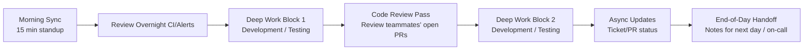

1. **Morning sync (async or 15-minute standup):** What shipped yesterday, what's planned today, any blockers. Kept short and asynchronous-friendly, given Arwal's eventual multi-timezone, multi-discipline team.
2. **Review overnight CI/alerts:** Any failed nightly build, security scan finding, or production alert is triaged before new work begins — an unresolved red signal is never left unattended while new development proceeds.
3. **Deep work blocks:** Uninterrupted time for development and testing, protected from meetings wherever possible, consistent with Maintainability (`ai-docs/05-coding-standards.md`) requiring focused attention to produce readable code.
4. **Code review pass:** Every engineer treats reviewing open PRs from teammates as a first-class daily task, not a "when I have time" activity — per the Code Review Workflow below, review latency is itself a tracked team health signal.
5. **Async updates:** Ticket and PR status are kept current throughout the day so planning and standups reflect reality, not memory.
6. **End-of-day handoff:** Anything left in a non-obvious state (a WIP branch, a flaky test under investigation, a pending deploy) is noted so the next engineer — or the on-call engineer — isn't left guessing.

---

# Feature Development Workflow

This is the canonical, step-by-step path a feature takes from request to production, applying the full Engineering Lifecycle above.

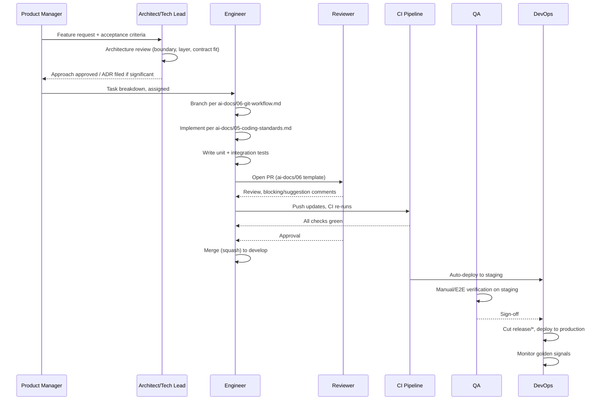

### Step-by-Step

1. **Request captured** — A feature request is written against a goal in `ai-docs/01-product-goals.md` or a documented citizen/merchant need. Vague requests ("make it better") are pushed back to Planning until they have concrete acceptance criteria.
2. **Architecture fit check** — Before any code is written, the Tech Lead or Architect confirms the feature fits an existing bounded context (`ai-docs/03-system-architecture-principles.md`) or requires a new one. See Architecture Review Workflow below for when this escalates to a formal ADR.
3. **Task breakdown** — The feature is split into tasks sized per Small Deliverables, each mapped to a specific module folder per `ai-docs/04-folder-guidelines.md`.
4. **API contract first (if applicable)** — Per API-First Design (`ai-docs/03-system-architecture-principles.md`), any new endpoint's request/response schema is drafted and reviewed before the controller or frontend consumer is implemented.
5. **Development** — The engineer branches per `feature/<tracking-id>-<description>`, implements per `ai-docs/05-coding-standards.md`, and writes tests alongside the code, never after.
6. **Local verification** — Lint, type-check, and unit tests run locally before a PR is opened; a PR opened with a red local test suite is a review-blocking practice, not just a courtesy violation.
7. **PR opened** — Using the required template from `ai-docs/06-git-workflow.md`, linked to its issue/phase.
8. **Code review** — At least one qualified reviewer approval; additional owning-team review if a shared boundary (`index.ts`, Integration Event, `packages/*`) is touched.
9. **CI validation** — Full pipeline: lint, type-check, unit + integration tests, build, circular-dependency check, secret scan.
10. **Merge to `develop`** — Squash merge, per the Merge Strategy in `ai-docs/06-git-workflow.md`.
11. **Staging deployment and QA** — Automatic deploy to staging; manual and/or E2E verification per the Testing Workflow below.
12. **Release cut** — A `release/*` branch is cut once the sprint's/phase's scoped feature set is staging-verified.
13. **Production deployment** — Progressive delivery (canary/staged rollout) per the Deployment Philosophy (`ai-docs/02-engineering-principles.md`).
14. **Monitoring** — Golden signals watched for a defined bake-in period after release; any regression triggers the Incident Response Workflow below.

---

# Bug Fix Workflow

Not every bug is equal, and the workflow scales with severity — treating a typo and a payment-processing failure identically would either over-process trivial issues or under-react to critical ones.

### Severity Levels

| Severity | Definition | Example | Response Target |
|---|---|---|---|
| **Sev 1 — Critical** | Citizen-facing outage or data integrity/security risk; core flow (checkout, booking, payment, civic application) unusable. | Payment charges failing platform-wide; a citizen's data exposed to another citizen. | Immediate — hotfix workflow (`ai-docs/06-git-workflow.md`), all-hands if needed. |
| **Sev 2 — High** | A significant feature is broken or degraded for a meaningful share of users, but a workaround exists or the core flow still functions. | Booking cancellation fails intermittently; search returns stale results. | Same business day; expedited PR + review. |
| **Sev 3 — Medium** | A non-critical feature is broken, affecting a small user segment or an edge case. | A rarely-used filter returns incorrect results. | Scheduled into the current or next sprint. |
| **Sev 4 — Low** | Cosmetic or minor inconsistency with no functional impact. | Misaligned padding on a rarely visited screen. | Backlog; tracked technical debt if deferred. |

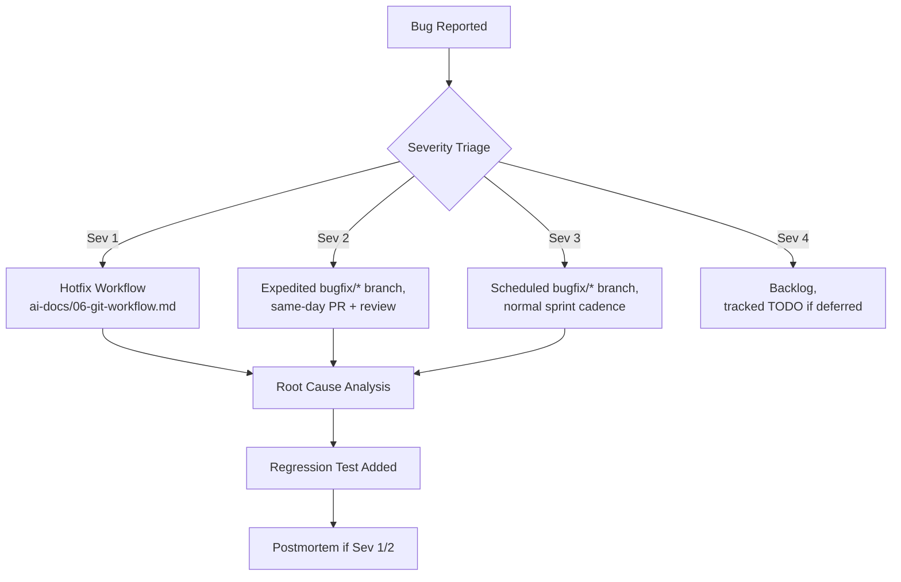

### Bug Fix Steps

1. **Reproduce and confirm** — A bug is never fixed against an assumed cause; the engineer reproduces it first, in a test where possible.
2. **Triage severity** — Per the table above, which determines branch type and review urgency.
3. **Root cause analysis** — The underlying cause is identified, not just the symptom; a fix that suppresses a symptom without understanding the cause is treated as incomplete.
4. **Fix, scoped narrowly** — Per Scope Discipline (`ai-docs/02-engineering-principles.md`), a bug fix branch contains only the fix, never opportunistic unrelated changes.
5. **Regression test added** — Every bug fix ships with a test that would have caught the bug, preventing silent reintroduction — a bug fix PR without a regression test is a review-blocking finding, mirroring the Testing Standards in `ai-docs/05-coding-standards.md`.
6. **Review and merge** — Per the Bug Fix Workflow branch type (`bugfix/*` or `hotfix/*`) in `ai-docs/06-git-workflow.md`.
7. **Postmortem (Sev 1/Sev 2 only)** — A blameless postmortem is written, per the Blameless Postmortems commitment in `ai-docs/00-project-vision.md`, capturing what happened, why, and what structural change (not just the code fix) prevents recurrence.

---

# Refactoring Workflow

Refactoring follows the Refactoring Principles in `ai-docs/02-engineering-principles.md` and `ai-docs/05-coding-standards.md`, made concrete as a workflow.

### When Refactoring Should Occur

| Trigger | Refactoring Response |
|---|---|
| A change requires touching code that is hard to safely modify | Refactor the specific area first, in its own commit/PR, before adding new behavior. |
| A Common Code Smell (`ai-docs/05-coding-standards.md`) is identified during code review | Logged as tracked technical debt if not addressed immediately; addressed immediately if small. |
| The Continuous Refactoring Budget (`ai-docs/00-project-vision.md`) is allocated for the cycle | Dedicated time is spent paying down tracked technical debt, prioritized by risk (security/data integrity first, per the Technical Debt Policy). |
| A module is about to be extracted per the Migration Strategy (`ai-docs/03-system-architecture-principles.md`) | Internal cleanup precedes extraction, since extraction should be a `git subtree split`, not a rewrite. |

### How Refactoring Should Occur

1. **Characterization tests first** — If the code being refactored lacks test coverage, tests are written to lock in current behavior before any structural change begins.
2. **Refactor and feature work stay in separate commits/PRs** — per `ai-docs/02-engineering-principles.md`, so a reviewer can evaluate "structure changed" independently of "behavior changed."
3. **Small, independently reviewable steps** — never a single sprawling rewrite; each step passes tests before the next begins.
4. **Public surface changes get extra scrutiny** — a refactor touching a module's `index.ts` or a shared package requires the same review rigor as a new public API, per the Refactoring Standards in `ai-docs/05-coding-standards.md`.

---

# Documentation Workflow

Documentation is updated as part of the same change that necessitates it — never as a follow-up ticket that risks being deprioritized indefinitely.

| Change Type | Documentation Required | Location |
|---|---|---|
| New/changed public API endpoint | API contract (schema, error codes, examples) updated in lockstep | Generated from/kept aligned with the OpenAPI/GraphQL schema, referenced from `docs/` |
| New/changed module | Module README (purpose, domain boundary, local run instructions) | `apps/api/src/modules/<module>/README.md` |
| Significant architectural or engineering decision | New ADR | `ai-docs/adr/`, per `ai-docs/02-engineering-principles.md` |
| New non-obvious business rule | Inline "why" comment | Directly in the source file, per Commenting Standards (`ai-docs/05-coding-standards.md`) |
| New onboarding step, runbook, or incident learning | Operational documentation update | `docs/` |
| Structural change to `ai-docs/*` itself | New phase document or amendment, with an ADR if it changes an existing phase's rules | `ai-docs/` |

A PR that introduces a new public API, module, or ADR-worthy decision without the corresponding documentation update is a Blocking Issue in code review, exactly as an untested business rule is (`ai-docs/05-coding-standards.md`).

---

# Testing Workflow

Testing at Arwal follows the Testing Pyramid established in `ai-docs/02-engineering-principles.md`, operationalized across the development lifecycle.

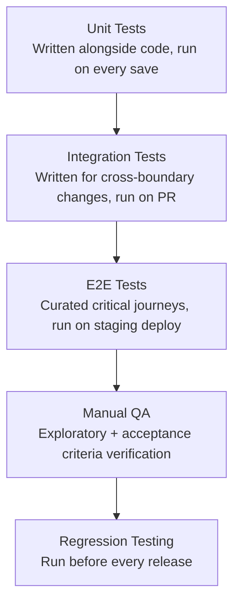

| Test Type | When Written | When Run | Owned By |
|---|---|---|---|
| **Unit Tests** | Alongside the code, same commit | On every save (local), every push (CI) | Engineer authoring the code |
| **Integration Tests** | For any cross-boundary change (module-to-database, module-to-module) | On every PR | Engineer authoring the feature |
| **E2E Tests** | For critical citizen journeys only (checkout, booking, application submission) | On staging deploy, before release cut | Shared ownership (Engineering + QA) |
| **Manual QA** | N/A — exploratory, ad hoc | Before release cut, especially for UI-heavy or civic/payment-sensitive changes | QA Engineer |
| **Regression Testing** | Cumulative — the full E2E + high-risk manual suite | Before every production release | QA Engineer + Release Engineer |

### Manual QA Focus Areas

Manual QA is not a substitute for automated testing — it is reserved for what automation cannot easily catch: real-device behavior on entry-level Android hardware, actual 2G/3G network degradation, screen-reader/accessibility walkthroughs, and genuinely exploratory testing of new UI flows against the Accessibility and Performance principles in `ai-docs/00-project-vision.md`.

### Regression Testing

Before any production release, the full E2E suite plus a curated set of high-risk manual checks (payments, civic application submission, identity) are re-run against the release candidate — never assumed to still pass because "nothing related changed," since cross-module regressions are exactly the failure mode Integration Events and shared services (`ai-docs/03-system-architecture-principles.md`) can introduce invisibly.

---

# Security Review Workflow

Security is checked at defined points in the lifecycle, not only at the end, consistent with Security by Design (`ai-docs/00-project-vision.md`) and Secure by Default (`ai-docs/02-engineering-principles.md`).

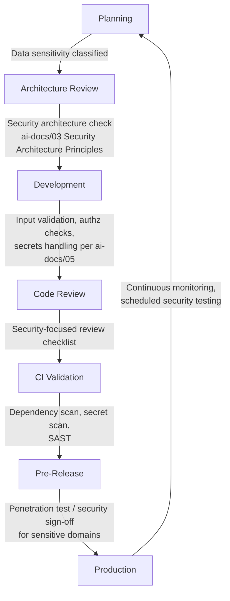

### Security Checkpoints

| Checkpoint | What's Verified |
|---|---|
| **Planning** | Data sensitivity is classified (identity, payment, health data vs. low-sensitivity data), per Data Classification in `ai-docs/03-system-architecture-principles.md`. |
| **Architecture Review** | The proposed design honors zero-trust, least privilege, and the module's security perimeter. |
| **Development** | Input validation at the boundary, authorization checks on every operation touching another actor's data, no secrets in code, per `ai-docs/05-coding-standards.md`. |
| **Code Review** | Reviewer explicitly checks the Security Coding Standards checklist items — missing authz, raw SQL concatenation, unsanitized HTML rendering. |
| **CI Validation** | Automated dependency vulnerability scanning and secret scanning (`ai-docs/06-git-workflow.md`) block merge on any finding. |
| **Pre-Release** | Any change touching `payments`, `identity`, or `civic-services` gets a security-focused review from an engineer with security context, per the Required Approvals in `ai-docs/06-git-workflow.md`. |
| **Production** | Regular penetration testing and dependency scanning, per the Security Vision (`ai-docs/00-project-vision.md`), run on a defined schedule independent of any single release. |

A security finding at any checkpoint is treated with the same non-negotiable severity as a missing authorization check in code review — it blocks progress to the next stage, regardless of deadline pressure.

---

# Performance Review Workflow

Performance is verified proactively, per the Performance-First principle (`ai-docs/02-engineering-principles.md`), not discovered reactively in production.

| Stage | Performance Check |
|---|---|
| **Architecture Review** | New synchronous cross-module calls are scrutinized — does this introduce a new latency dependency on the citizen-facing critical path? |
| **Development** | New database queries are checked for N+1 patterns; new frontend dependencies are checked against the bundle-size budget, per `ai-docs/05-coding-standards.md`. |
| **Code Review** | Reviewer verifies any new cache has a defined invalidation strategy (`ai-docs/03-system-architecture-principles.md`) and that memoization is applied only where justified. |
| **CI Validation** | Bundle-size budgets and, where configured, automated Lighthouse/performance-budget checks run as required status checks. |
| **Pre-Release** | Any endpoint expected to carry significant read/write load has its query plan reviewed, per Database Optimization (`ai-docs/02-engineering-principles.md`). |
| **Post-Release** | p95 API latency and perceived load time are monitored against the targets in `ai-docs/01-product-goals.md` (sub-200ms API, sub-2s perceived load on 3G); a regression triggers investigation before the next release, not after. |
| **Ahead of Scale Milestones** | Load and chaos testing are performed deliberately ahead of anticipated growth, per the Scalability Philosophy (`ai-docs/02-engineering-principles.md`), never discovered accidentally during a citizen-facing surge. |

---

# Architecture Review Workflow

Architecture Review, introduced in the Engineering Lifecycle above, is the checkpoint that protects the boundaries defined in `ai-docs/03-system-architecture-principles.md`.

### When Architecture Review Is Required

| Change Type | Review Required? |
|---|---|
| New bounded context / domain module | Yes — full architecture review, ADR required |
| New shared platform service | Yes — full architecture review, ADR required |
| New cross-module communication pattern (new event type, new sync dependency) | Yes — architecture review |
| Proposed service extraction from the Modular Monolith | Yes — architecture review against the Migration Strategy indicators, ADR required |
| A new endpoint within an existing module, following existing patterns | No — standard code review is sufficient |
| A new React component composed from existing patterns | No — standard code review is sufficient |
| A change to this document, the Module Folder Template, or Import Rules | Yes — treated with system-architecture-level rigor, ADR required |

### When an ADR Is Required

Per `ai-docs/02-engineering-principles.md` and `ai-docs/03-system-architecture-principles.md`, an ADR is required whenever a decision is:

- **Expensive to reverse** (a database technology choice, a new bounded context boundary).
- **Precedent-setting** (a new event-bus pattern that other modules will be expected to follow).
- **A deviation from an existing principle** in any prior phase document.
- **A service or module extraction**, documenting which Migration Strategy indicator(s) justified it.

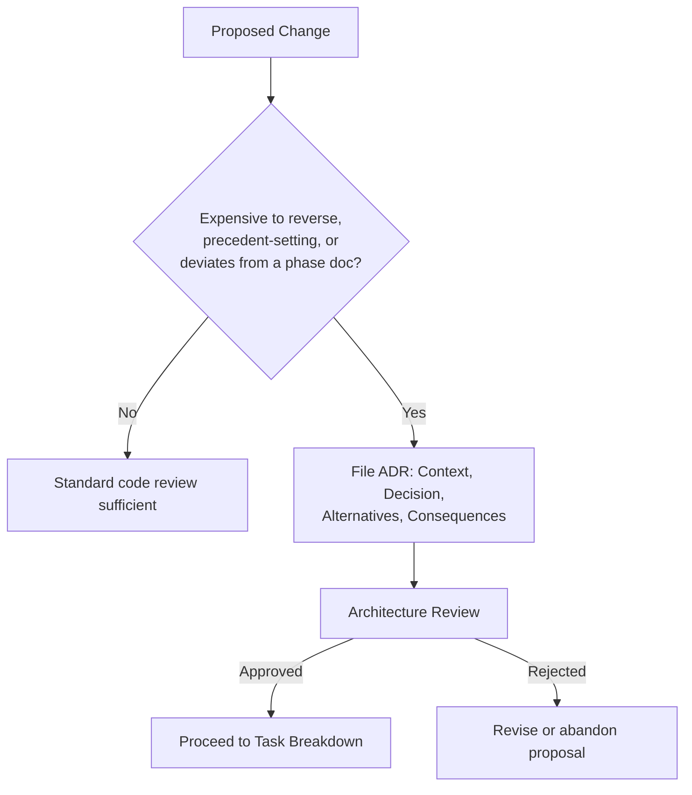

An ADR is never written retroactively to justify a decision already shipped — it is written **before** implementation begins, so the review is genuine, not ceremonial.

---

# Dependency Update Workflow

Third-party dependencies are a standing source of both risk (vulnerabilities, breaking changes) and opportunity (performance, security fixes), and are managed deliberately rather than ad hoc.

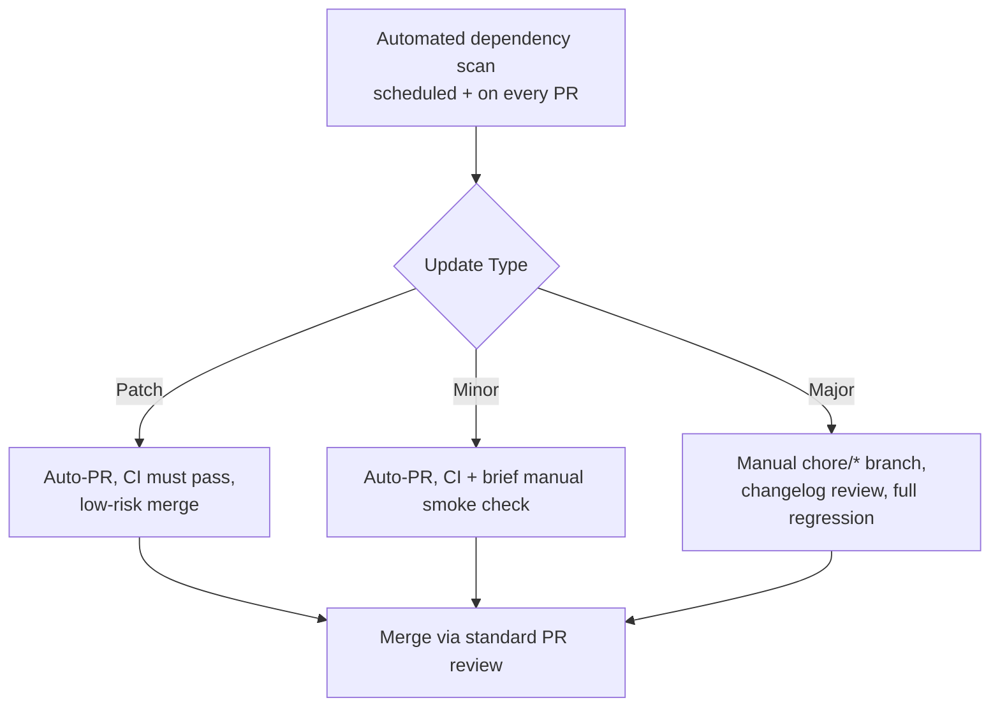

| Update Type | Process |
|---|---|
| **Patch (security fix)** | Fast-tracked; merged as soon as CI passes, given the security urgency, per Regular Security Testing (`ai-docs/00-project-vision.md`). |
| **Patch (non-security)** | Batched into a periodic `chore/*` PR, reviewed and merged on the normal cadence. |
| **Minor** | Batched periodically; CI plus a brief manual smoke check of affected areas. |
| **Major** | A dedicated `chore/*` branch; the changelog/migration guide is read before upgrading, a full regression pass is run, and the change is reviewed with the same rigor as a feature PR. |

A dependency is never upgraded "while I'm in there" as part of an unrelated feature PR — per Scope Discipline (`ai-docs/02-engineering-principles.md`) and the commit-splitting guidance in `ai-docs/06-git-workflow.md`, dependency updates are always their own commit and, for anything beyond a patch, their own PR.

---

# Database Change Workflow

Database changes are among the highest-risk category of change Arwal makes, given the Data Integrity and Migrations principles in `ai-docs/02-engineering-principles.md`, and follow a strict workflow.

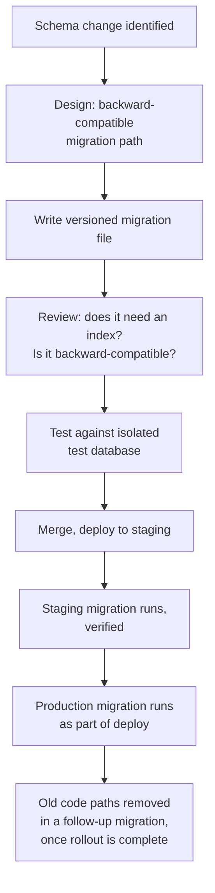

### Migration Strategy

1. **Additive first** — A new column is added nullable; a new table is added independently; nothing that would break a currently-running instance of the old code is introduced in the same migration that a rolling deploy would straddle.
2. **Backfill separately** — Data backfill for a new column runs as its own step (migration or job), never bundled into the schema-change migration itself, keeping each migration small and reviewable, per Atomic Commits (`ai-docs/06-git-workflow.md`).
3. **Constrain last** — A `NOT NULL` or foreign-key constraint is added only in a follow-up migration, once the backfill is confirmed complete — this is the concrete implementation of the Migrations principle's backward-compatibility requirement.
4. **Never manual** — No schema change is ever applied directly against a live database outside a versioned migration file, per Migrations (`ai-docs/02-engineering-principles.md`); an emergency exception requires explicit sign-off and is followed immediately by a matching migration file for reproducibility.
5. **Reviewed like code** — Every migration is reviewed for index implications (per Indexing, `ai-docs/02-engineering-principles.md`) and rollback-awareness (per the Rollback Strategy, `ai-docs/06-git-workflow.md`) before merge.
6. **Tested against an isolated database** — Never against shared or production infrastructure, per the Integration Testing standard in `ai-docs/05-coding-standards.md`.

---

# API Change Workflow

API changes are governed by the API-First Design principle (`ai-docs/03-system-architecture-principles.md`) and the API Coding Standards (`ai-docs/05-coding-standards.md`), operationalized as follows:

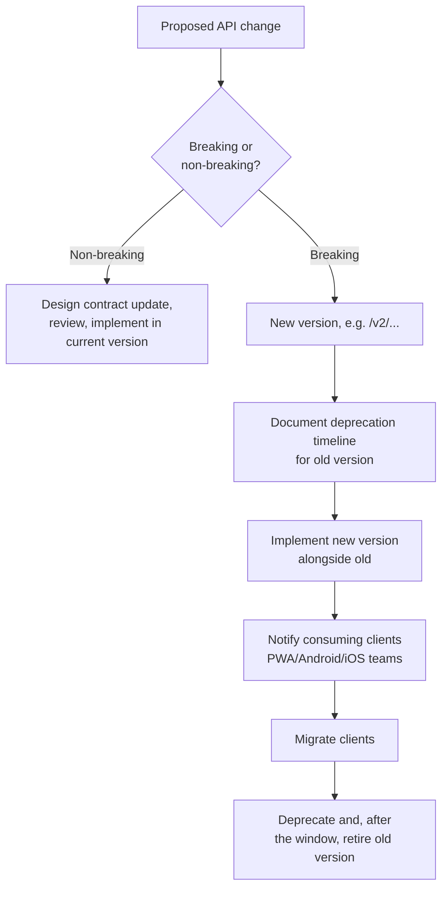

1. **Contract drafted first** — Request/response schema, error format, and auth requirements are written and reviewed before controller implementation begins, per API-First Design.
2. **Breaking-change determination** — Removing a field, changing a type, or changing required-ness in an incompatible direction is always breaking; anything else is additive and non-breaking.
3. **Non-breaking changes** ship within the current version after standard review.
4. **Breaking changes** always ship as a new version (`/v2/...`), with the old version's deprecation window documented in the PR and communicated to every consuming client team (PWA, Android, iOS, Admin), per Platform Parity (`ai-docs/01-product-goals.md`).
5. **Old version retirement** happens only after the documented deprecation window closes and telemetry confirms no meaningful traffic remains on it.

---

# UI Development Workflow

UI development follows a design-first, review-before-implementation discipline, consistent with Accessibility-First and Responsive-First (`ai-docs/02-engineering-principles.md`).

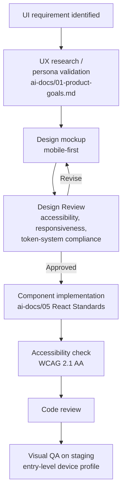

1. **Design precedes implementation** — No screen is built against an undocumented, ad hoc visual spec; a mockup exists and is reviewed first, per Citizen Research Before Feature Design (`ai-docs/00-project-vision.md`).
2. **Design review checks:** mobile-first layout, adherence to the shared token system (`ai-docs/02-engineering-principles.md`, Styling Philosophy), accessibility (contrast, target size, screen-reader labels), and reuse of existing `packages/ui` components before introducing new ones.
3. **Implementation** follows the React Standards in `ai-docs/05-coding-standards.md` — functional components, smallest possible client-component boundary, state classified correctly.
4. **Accessibility verification** is performed before code review, not assumed — automated accessibility linting plus a manual screen-reader pass for any new interactive component.
5. **Visual QA on staging** is performed against the actual target device profile (entry-level Android, throttled 3G), never only on a developer's high-end machine, per Design for the Slowest Device and Weakest Signal (`ai-docs/00-project-vision.md`).

---

# AI-Assisted Development Guidelines

Engineers may use AI coding assistants (including Claude-based tools) to accelerate development, but AI assistance is treated as a productivity aid that **never replaces human judgment or review**, consistent with the AI Principle in `ai-docs/00-project-vision.md`.

### Responsible Use Principles

1. **AI-generated code is held to the exact same standard as human-written code.** It is reviewed against `ai-docs/05-coding-standards.md` with no exception, no relaxed scrutiny, and no assumption of correctness because "the AI wrote it."
2. **The engineer who commits AI-assisted code owns it fully.** Authorship accountability (per the Traceability principle in `ai-docs/06-git-workflow.md`) is never diffused onto the tool — a commit author is responsible for understanding, testing, and defending every line they submit.
3. **AI is not used to generate security-sensitive logic unsupervised.** Authentication, authorization, payment processing, and cryptographic code are always human-designed and human-reviewed with extra scrutiny; AI suggestions in these areas are treated as a starting draft, never a final answer.
4. **AI-generated tests are verified to actually test the intended behavior**, not merely generated to satisfy a coverage number — a test that always passes regardless of the implementation is worse than no test, since it creates false confidence.
5. **No proprietary or citizen-sensitive data is pasted into an external AI tool** that isn't governed by Arwal's data-handling agreements, per the Secrets Management and Data Minimization principles (`ai-docs/02-engineering-principles.md`, `ai-docs/00-project-vision.md`).
6. **AI-assisted architectural or business-rule decisions still go through Architecture Review and ADRs** exactly as a human-originated proposal would — an AI suggestion does not skip the Architecture Review Workflow above.
7. **Documentation and comments explaining "why" are still human-authored or human-verified**, since an AI tool without full project context can generate a plausible-sounding but incorrect rationale that misleads a future engineer.

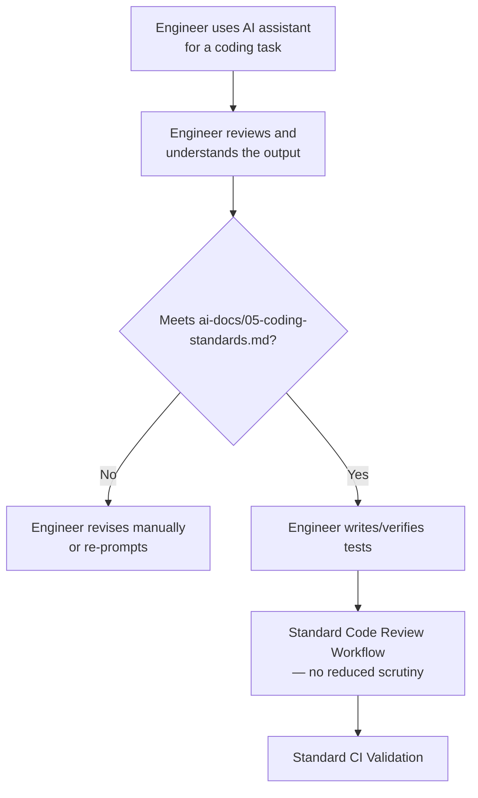

> **Callout — AI Accelerates Typing, Not Accountability**
> An AI assistant can help an engineer write code faster. It cannot attend the code review, defend a design decision in Architecture Review, or be paged during an incident. Every accountability structure in this document and its predecessors continues to apply, in full, to AI-assisted work.

---

# Incident Response Workflow

When a production issue affects citizens, Arwal's response follows a defined, rehearsed process — never improvised in the moment, consistent with the Incident Response Readiness commitment in `ai-docs/00-project-vision.md`.

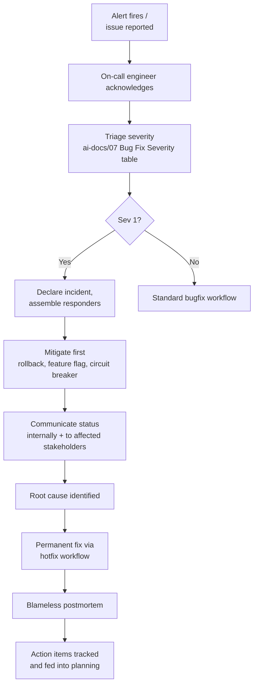

### Response Principles

1. **Mitigate before you understand fully.** The first priority is stopping citizen impact — a rollback (per the Rollback Strategy, `ai-docs/06-git-workflow.md`), a feature flag disable, or a circuit breaker trip — not immediately hunting for root cause while citizens are still affected.
2. **Idempotent operations make rollback safe.** Because payment and booking operations are designed idempotent per `ai-docs/03-system-architecture-principles.md`, a rollback or retry during an incident does not risk duplicate charges or bookings.
3. **Communicate early and honestly**, internally to the team and, where appropriate, to affected government or merchant partners, consistent with Transparency over Opacity (`ai-docs/00-project-vision.md`).
4. **Root cause, not just symptom.** The permanent fix addresses why the failure occurred, not only the immediate trigger — the same discipline required in the Bug Fix Workflow above.
5. **Blameless postmortem, always for Sev 1.** Failures are treated as system and process learning opportunities per `ai-docs/00-project-vision.md`, with action items — not just narrative — as the concrete output.
6. **Action items are tracked to completion**, feeding back into Planning in the Engineering Lifecycle, not left in a postmortem document no one revisits.

---

# Release Readiness Workflow

Before any release is promoted from `release/*` to `main`, a defined readiness check confirms the release is safe to ship, per the Deployment Philosophy in `ai-docs/02-engineering-principles.md`.

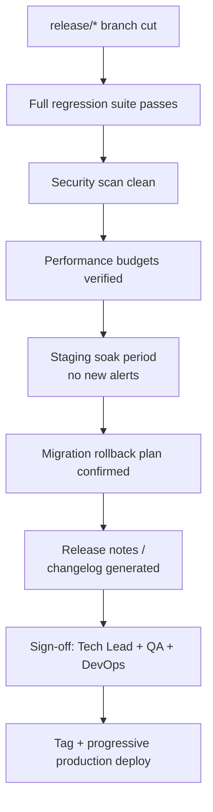

### Release Readiness Checklist

- [ ] Full E2E and regression suite passes against the release candidate.
- [ ] Dependency and secret scans are clean.
- [ ] No open Sev 1/Sev 2 defects in the release scope.
- [ ] Performance budgets (bundle size, API latency) are within target.
- [ ] The release has soaked on staging with no new, unexplained alerts.
- [ ] Every database migration in the release has a confirmed rollback-compatible path.
- [ ] Changelog is generated from Conventional Commit history, per `ai-docs/06-git-workflow.md`.
- [ ] Tech Lead, QA, and DevOps have each signed off.
- [ ] Progressive delivery (canary/staged rollout) plan is confirmed before the tag is pushed.

A release missing any item above is not promoted to production — this checklist carries the same non-negotiable authority as the Merge Requirements in `ai-docs/05-coding-standards.md`.

---

# Common Workflow Mistakes

| Mistake | Example | Why It's Rejected |
|---|---|---|
| **Skipping Architecture Review "just this once"** | A new bounded context added directly via a feature PR, no ADR, because a deadline was close. | Produces exactly the boundary erosion the Modular Monolith strategy (`ai-docs/03-system-architecture-principles.md`) exists to prevent; the cost of an incorrect boundary compounds silently. |
| **Writing tests after the fact to satisfy CI** | Implementation is finished, then minimal tests are bolted on purely to pass the coverage gate. | Produces shallow, low-value tests that don't actually verify behavior — the opposite of the Testing Principles' intent in `ai-docs/02-engineering-principles.md`. |
| **Treating documentation as a follow-up ticket** | A new module ships without a README, with "add docs" filed as a separate, deprioritized ticket. | Documentation drift is exactly the failure mode the Documentation Standards (`ai-docs/02-engineering-principles.md`) and Documentation Workflow above exist to prevent; deferred docs are rarely written. |
| **Batching unrelated changes into one release** | A hotfix, a new feature, and a dependency upgrade all merged and released together. | Makes root-causing a regression far harder and increases the blast radius of a bad release, contradicting Small, Frequent Deployments (`ai-docs/02-engineering-principles.md`). |
| **Bypassing manual QA for "simple" UI changes** | A civic-form UI change shipped straight from CI-green to production with no device/accessibility check. | CI cannot verify real-device behavior or accessibility experience; this is precisely why Manual QA exists as a distinct step in the Testing Workflow. |
| **Reactive-only performance/security review** | Performance and security are only checked when something breaks in production. | Contradicts Performance-First and Security by Design (`ai-docs/02-engineering-principles.md`); proactive review at defined checkpoints is cheaper than incident response. |
| **Silent scope creep during development** | A ticket for "fix booking cancellation bug" grows to include a UI redesign along the way. | Violates Scope Discipline (`ai-docs/02-engineering-principles.md`) and makes the PR unreviewable and unrevertible independently. |
| **Trusting AI output without review** | AI-generated code merged with only a cursory glance because "it looked right." | Directly violates the AI-Assisted Development Guidelines above; accountability cannot be delegated to a tool. |
| **Deploying on Friday afternoon without a rollback plan** | A release shipped right before the weekend with no on-call engineer briefed on what changed. | Contradicts Release Readiness and Incident Response Workflow requirements — a change without a monitored bake-in window is a change shipped blind. |

---

# Development Checklist

Before any unit of work is considered complete, it satisfies the following, drawn from every section above:

- [ ] The work traces to a documented idea/goal (`ai-docs/01-product-goals.md` or a real observed problem).
- [ ] Architecture fit was confirmed; an ADR was filed if the change was significant, precedent-setting, or a deviation.
- [ ] Work was broken into small, independently reviewable tasks.
- [ ] Code follows `ai-docs/05-coding-standards.md` without unjustified deviation.
- [ ] Tests exist at the appropriate levels of the Testing Pyramid, including a regression test for any bug fix.
- [ ] Security checkpoints were passed — input validation, authorization checks, no secrets in the diff, clean dependency/secret scans.
- [ ] Performance implications were considered — no unreviewed N+1 queries, no unbudgeted bundle growth, no cache without an invalidation strategy.
- [ ] Documentation (README, API contract, ADR, inline comments) was updated in the same change, not deferred.
- [ ] The PR follows `ai-docs/06-git-workflow.md`'s branch, commit, and PR standards.
- [ ] Code review approvals (including owning-team review where required) are complete, with all Blocking comments resolved.
- [ ] CI is fully green — lint, type-check, tests, build, circular-dependency check, security scan.
- [ ] Any AI-assisted portion of the work was reviewed with the same rigor as human-written code, per the AI-Assisted Development Guidelines.
- [ ] Deployment followed the Release Readiness Workflow, with monitoring confirmed healthy post-release.
- [ ] Any deliberate shortcut is marked as tracked technical debt, per `ai-docs/02-engineering-principles.md`.

---

# Closing Statement

> **Callout — Closing Statement**
> Architecture defines the shape of the system; folder guidelines define where that shape lives; coding standards define what fills it; Git workflow defines how change moves through version control; this document defines the human and procedural rhythm that ties all of it together, from the moment an idea is written down to the moment a citizen depends on it in production — and every day after, as that citizen's trust is maintained through monitoring, incident response, and continuous improvement. A workflow that is skipped under pressure is not a workflow — it is a suggestion, and Arwal's civic and financial responsibilities cannot be built on suggestions. Where a future phase must deviate from a process defined here, that deviation is made explicitly — through a documented review exception or an ADR where the deviation is structural — never silently, and never by default.

This document, `ai-docs/07-development-workflow.md`, is the eighth phase of approximately 300. Every feature, bug fix, refactor, and release in the phases that follow is expected to move through the lifecycle defined here, or to justify its deviation in writing.

**End of Phase 8 — `ai-docs/07-development-workflow.md`**
