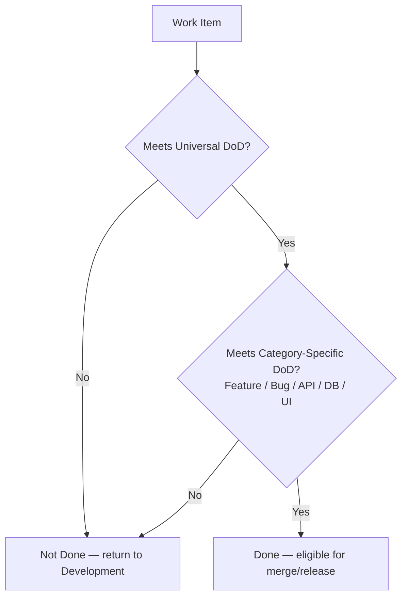
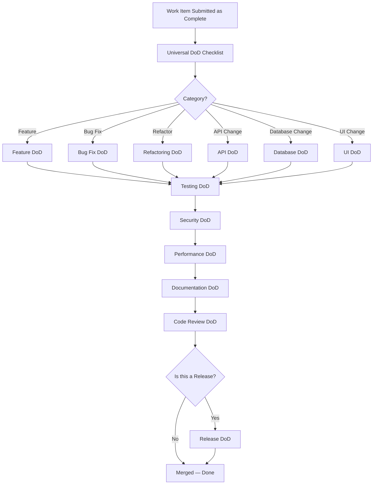

# Definition of Done

**Document:** `ai-docs/08-definition-of-done.md`
**Project:** Arwal — The District Super App
**Stage:** 1 — Foundation
**Phase:** 9 — Definition of Done
**Status:** Approved for Engineering Reference
**Audience:** Architects, Engineers, Engineering Managers, QA Engineers, DevOps Engineers, UI/UX Designers, AI Engineers, Security Engineers, Product Managers, Technical Reviewers, Government Technical Partners

> **Callout — Purpose of This Document**
> `ai-docs/00-project-vision.md` defined why Arwal exists. `ai-docs/01-product-goals.md` defined what Arwal must achieve. `ai-docs/02-engineering-principles.md` defined how engineers reason about design. `ai-docs/03-system-architecture-principles.md` defined how the system is structured. `ai-docs/04-folder-guidelines.md` defined where that structure physically lives. `ai-docs/05-coding-standards.md` defined how individual lines of code are written. `ai-docs/06-git-workflow.md` defined how change moves through version control. `ai-docs/07-development-workflow.md` defined how a day of engineering work unfolds, end to end. This document defines **the single, non-negotiable answer to the question every one of those documents ultimately exists to serve: when is a piece of work actually finished?**

---

# Purpose of this Document

Every phase document preceding this one describes a dimension of quality — architectural correctness, folder discipline, code-level rigor, version-control traceability, procedural rhythm. None of them, individually, tells an engineer, a reviewer, or a government technical partner **the exact, complete, closing condition** under which a task can be marked complete and trusted. Without that closing condition written down once, centrally, and applied uniformly, "done" quietly becomes whatever the busiest engineer on a given day decided it meant — which, across ~300 micro-phases and years of team growth, guarantees drift, inconsistency, and eventually a citizen-facing failure traceable to a task nobody actually finished.

This document exists to:

1. **Convert every preceding phase document into a single, enforceable exit gate.** `ai-docs/02-engineering-principles.md`'s SOLID and testing discipline, `ai-docs/03-system-architecture-principles.md`'s boundaries, `ai-docs/04-folder-guidelines.md`'s structure, `ai-docs/05-coding-standards.md`'s line-level rules, `ai-docs/06-git-workflow.md`'s traceability, and `ai-docs/07-development-workflow.md`'s lifecycle stages all converge here into one checklist a reviewer applies before saying "done."
2. **Eliminate ambiguity about completion.** "Done" is not a feeling, a deadline, or a demo — it is a specific, verifiable, checklist-driven state, identical every time it is invoked, for every engineer, on every task, in every phase.
3. **Give reviewers, QA engineers, and government technical partners a single, citable closing standard.** "This is not done per Phase 9" is exactly as legitimate and actionable a review comment as citing SOLID from Phase 3 or a folder rule from Phase 5 — and it is the comment that closes every other comment out.
4. **Protect the citizen from the specific failure mode of premature completion** — a feature marked "done" that is untested, undocumented, insecure, unobservable, or architecturally non-compliant is not a finished feature; it is a liability wearing the appearance of one, exactly the trap `ai-docs/00-project-vision.md`'s founding commitments exist to prevent.
5. **Serve as the final quality gate** referenced by every code review, every architecture review, every release readiness check, and every retrospective across the life of the ~300-phase roadmap.

This document assumes and requires familiarity with all eight preceding phase documents. It does not repeat their reasoning — it is the closing gate through which their reasoning must pass before any work is accepted.

---

# Philosophy of Done

### Done vs. Complete

"Complete" and "Done" are deliberately distinguished at Arwal, and conflating them is one of the most common and most dangerous failure modes in software engineering.

- **Complete** means the code exists, compiles, and appears to fulfill the request. Complete is a claim about *effort* — the engineer believes they have finished writing what was asked.
- **Done** means the code has passed every applicable gate in this document — architecture compliance, coding standards, tests at every relevant level of the Testing Pyramid, security review, performance verification, documentation, and code review. Done is a claim about *verified quality*, never a claim about effort or intention.

> **Callout — The Complete Trap**
> "It's complete, just needs a bit of polish" is the single most common precursor to a citizen-facing defect in Arwal's history-to-be. Complete work that has not passed this document's gates is not 90% done — it is, from a trust and risk perspective, 0% done, because none of its claims have been independently verified.

### Working Software

Working software is the primary measure of progress at Arwal, consistent with the Continuous Feedback and Quality First commitments in `ai-docs/07-development-workflow.md` — but "working" means working **under the conditions Arwal's citizens actually experience**: an entry-level Android device, a 2G/3G connection, a first-generation smartphone user, a screen reader, a partial backend outage. Software that only "works" on a developer's high-end machine, on a fast office network, against the happy path, is not working software by Arwal's definition — it is a demo.

### Maintainability

Done work is work a different engineer, unfamiliar with the change, can safely extend six months from now without needing to consult the original author — the same standard `ai-docs/02-engineering-principles.md` sets for Engineering Excellence. A task that is functionally correct today but incomprehensible or fragile to a future maintainer has not met the maintainability bar this document requires, and is not Done regardless of how well it currently behaves.

### Quality Gates

Every gate in this document exists because skipping it has a known, specific, previously observed failure mode — never because process is valued for its own sake, per the Development Philosophy in `ai-docs/07-development-workflow.md`. A quality gate is not a formality to be rushed past; it is the mechanism by which a claim ("this is secure," "this performs well," "this is tested") becomes a verified fact rather than an assumption.

### Long-Term Thinking

Every Definition of Done in this document is calibrated against the ~300-phase, multi-year roadmap, not against the convenience of finishing today's sprint. A shortcut that makes today's task "done" faster but leaves an untested edge case, an undocumented decision, or an unreviewed security gap is not a shortcut — it is debt transferred, without consent, to whichever engineer touches that code next. Per the Technical Debt Policy in `ai-docs/02-engineering-principles.md`, such debt is only acceptable when it is deliberately, visibly tracked — never when it is hidden behind a premature "done."

> **Callout — The One-Sentence Philosophy of Done**
> *"Done means a stranger could pick this up, trust it, extend it, and never discover a corner that was quietly skipped."*

---

# Universal Definition of Done

This is the master checklist that applies to **every** unit of engineering work at Arwal — feature, bug fix, refactor, API change, database change, UI change, or documentation change — regardless of size. Category-specific sections below add to this checklist; none of them subtract from it.

### Universal Checklist

- [ ] **Traceable** — The work links to a documented idea, goal, or issue per `ai-docs/01-product-goals.md` and `ai-docs/07-development-workflow.md`; no untraceable, ad hoc change exists in the codebase.
- [ ] **Architecturally compliant** — The change honors the Modular Monolith strategy, DDD boundaries, dependency rules, and data ownership principles in `ai-docs/03-system-architecture-principles.md`; no forbidden cross-module or cross-layer dependency was introduced.
- [ ] **Correctly located** — Every new or moved file lives in the correct folder per the Module Folder Template and Root Folder Guidelines in `ai-docs/04-folder-guidelines.md`.
- [ ] **Coding-standards compliant** — The code satisfies `ai-docs/05-coding-standards.md` in full: explicit types, no unjustified `any`, correctly separated layers, no Common Code Smell present without a reviewed, justified exception.
- [ ] **Tested at the appropriate level(s)** — Unit, integration, and/or E2E tests exist per the Testing Pyramid in `ai-docs/02-engineering-principles.md`, are named descriptively, and actually verify behavior rather than merely satisfying a coverage number.
- [ ] **Reviewed and approved** — At least one qualified reviewer approval is present, with any required owning-team review per the Folder Ownership Rules (`ai-docs/04-folder-guidelines.md`) obtained, and every Blocking comment resolved.
- [ ] **Documented** — Any README, API contract, ADR, or inline "why" comment required by the Documentation Workflow in `ai-docs/07-development-workflow.md` has been updated in the same change, not deferred.
- [ ] **Secure** — Input validation, authorization checks, and secrets handling satisfy the Security Coding Standards in `ai-docs/05-coding-standards.md`; dependency and secret scans are clean.
- [ ] **Performant** — No unreviewed N+1 query pattern, no unbudgeted bundle-size growth, and no cache introduced without a defined invalidation strategy, per the Performance Coding Standards in `ai-docs/05-coding-standards.md`.
- [ ] **Observable** — Structured logging, correlation-ID propagation, and, where applicable, metrics/tracing are in place per the Observability Principles in `ai-docs/03-system-architecture-principles.md` — the change can answer "is it healthy" without requiring a follow-up deploy to add visibility.
- [ ] **CI green** — Lint, type-check, unit and integration tests, build, circular-dependency check, and security/secret scan all pass, per `ai-docs/06-git-workflow.md`.
- [ ] **Correctly versioned in Git** — Branch naming, commit messages, and PR structure follow `ai-docs/06-git-workflow.md`; the merge strategy matches the branch type.
- [ ] **Technical debt is visible, not hidden** — Any deliberate shortcut is marked with a tracked `TODO`/`FIXME` and an owner or tracking reference, per the Technical Debt Policy in `ai-docs/02-engineering-principles.md`; nothing is silently deferred.

A work item failing **any single item** on this list is not Done — it returns to the appropriate stage of the Engineering Lifecycle in `ai-docs/07-development-workflow.md`, never forward to merge or release on an exception basis.

---

# Feature Definition of Done

A feature additionally satisfies the following before it is considered Done, layered on top of the Universal Definition of Done above.

| Requirement | What It Verifies | Why It's Required |
|---|---|---|
| **Acceptance criteria met** | Every acceptance criterion defined during Planning (`ai-docs/07-development-workflow.md`) is demonstrably satisfied, not approximately satisfied. | A feature that is 90% aligned with its acceptance criteria is a different feature than the one that was scoped, reviewed, and approved — the gap is either a defect or an undocumented scope change, and both require resolution before Done. |
| **Architecture compliance** | The feature was built inside its correct bounded context, uses the correct communication pattern (sync vs. event-driven per `ai-docs/03-system-architecture-principles.md`), and did not require an undocumented boundary violation to ship on time. | A feature that "works" by reaching across a module boundary silently reintroduces the tight coupling the Modular Monolith strategy exists to prevent — it is a liability disguised as a delivered feature. |
| **Coding standards compliance** | The feature's code passes the full Engineering Excellence Checklist in `ai-docs/05-coding-standards.md`. | Feature code is the code citizens interact with directly; it is held to the standard, not a relaxed version of it, regardless of delivery pressure. |
| **Testing completed** | Unit tests for domain/application logic, integration tests for any new cross-boundary interaction, and E2E coverage if the feature touches a critical citizen journey (checkout, booking, application submission), per `ai-docs/02-engineering-principles.md`'s Testing Pyramid. | Untested feature logic is unverified feature logic — "it works when I tried it" is not evidence a machine can re-check on every future change. |
| **Documentation updated** | Module README, API contract, and any ADR-worthy decision are current, per the Documentation Workflow in `ai-docs/07-development-workflow.md`. | A feature without documentation is a feature only the original author can safely extend — a single point of failure for a team meant to scale across years. |
| **Code reviewed** | At least one qualified reviewer approval, plus owning-team review for any shared-boundary change, per `ai-docs/06-git-workflow.md`. | Independent review is the primary defense against blind spots the original author cannot see in their own work. |
| **Performance verified** | No new N+1 query, no unbudgeted bundle growth, and — for a high-traffic endpoint — a reviewed query plan, per the Performance Review Workflow in `ai-docs/07-development-workflow.md`. | A feature that is functionally correct but slow on a 2G connection fails the Performance Vision in `ai-docs/00-project-vision.md` just as surely as a feature that returns wrong data. |
| **Security verified** | Input validation, authorization checks, and — for `payments`, `identity`, or `civic-services` — a security-focused review, per the Security Review Workflow in `ai-docs/07-development-workflow.md`. | A feature touching citizen data or money that has not passed security review is not a delivered feature; it is an unassessed risk. |
| **Monitoring ready** | Golden signals (latency, traffic, errors, saturation), structured logs, and, where relevant, a dashboard entry exist for the feature before it reaches production, per the Observability Principles in `ai-docs/03-system-architecture-principles.md`. | A feature the team cannot observe in production is a feature the team can only find out is broken from a citizen complaint — the opposite of Observability as a Build Requirement in `ai-docs/01-product-goals.md`. |

---

# Bug Fix Definition of Done

A bug fix additionally satisfies the following, layered on top of the Universal Definition of Done.

| Requirement | What It Verifies | Why It's Required |
|---|---|---|
| **Root cause identified** | The underlying cause of the defect is understood and documented, not just the symptom that was observed. | A fix targeting a symptom without understanding the cause frequently resurfaces the same defect in a different form, per the Bug Fix Workflow in `ai-docs/07-development-workflow.md`. |
| **Regression test added** | A test exists that would have failed before the fix and passes after it. | Without a regression test, the same bug can be silently reintroduced by a future, unrelated change — the test is the permanent, automated memory of the defect. |
| **No new side effects** | The fix is scoped narrowly (per Scope Discipline, `ai-docs/02-engineering-principles.md`) and verified not to alter behavior outside the specific defect being addressed. | A "fix" that resolves one issue while silently introducing another is a net-negative change, and is caught only by deliberately checking for unintended blast radius, never assumed absent. |
| **Documentation updated if required** | If the fix corrects a previously incorrect assumption documented elsewhere (a README, an API contract, an inline comment), that documentation is corrected in the same change. | Leaving stale documentation in place after a bug fix re-introduces the exact misunderstanding that may have caused the bug in the first place. |
| **Severity-appropriate rigor applied** | The fix passed through the correct workflow (hotfix, expedited, scheduled) for its Severity level, per the Bug Fix Workflow's Severity table in `ai-docs/07-development-workflow.md`. | Under-processing a Sev 1 risks citizen harm; over-processing a Sev 4 wastes scarce engineering time — the severity table exists so rigor is calibrated, not guessed. |
| **Postmortem completed (Sev 1/Sev 2 only)** | A blameless postmortem is written for any high-severity defect, capturing structural learnings, not just the code change. | The code fix addresses this one instance; the postmortem is what prevents the *class* of defect from recurring elsewhere in the system. |

---

# Refactoring Definition of Done

Refactoring is Done only when every one of the following is true, on top of the Universal Definition of Done:

- [ ] **Behavior is provably unchanged** — Characterization tests (written first, if coverage was previously absent) pass identically before and after the refactor, per the Refactoring Workflow in `ai-docs/07-development-workflow.md`.
- [ ] **The refactor is isolated from feature work** — It ships in its own commit/PR, never bundled with new behavior, so a reviewer can evaluate "structure changed" independently of "behavior changed," per `ai-docs/02-engineering-principles.md` and `ai-docs/06-git-workflow.md`.
- [ ] **Public surfaces received extra scrutiny** — If the refactor touches a module's `index.ts`, an Integration Event schema, or a shared `packages/*` export, it was reviewed with the same rigor as a new public API change, per `ai-docs/05-coding-standards.md`'s Refactoring Standards.
- [ ] **The improvement is real and demonstrable** — The refactor measurably improves readability, testability, or maintainability against a concrete before/after comparison — refactoring performed only because it was "more proper," with no demonstrated improvement, has not met KISS/YAGNI and is not Done in the sense this document requires.
- [ ] **No new technical debt was introduced in the process** — A refactor that trades one form of complexity for another, without net improvement, has not achieved its purpose.

> **Callout — A Refactor Without a Passing Test Suite Both Before and After Is Not a Refactor**
> If behavior cannot be proven unchanged, the change is not a refactor — it is an unreviewed behavioral change wearing a refactor's name, and must be treated (and reviewed) as such.

---

# API Definition of Done

An API change — new endpoint, modified contract, or version bump — is Done only when every item below is satisfied, in addition to the Universal Definition of Done.

| Requirement | What It Verifies | Why It's Required |
|---|---|---|
| **Contract finalized** | The request/response schema, error format, and auth requirements were drafted and reviewed **before** implementation began, per API-First Design (`ai-docs/03-system-architecture-principles.md`). | An API built against an ad hoc, undocumented shape guarantees drift between the backend and every client (PWA, Android, iOS) consuming it, breaking Platform Parity (`ai-docs/01-product-goals.md`). |
| **Validation** | Schema validation at the Presentation Layer and business-rule validation at the Domain Layer are both present and distinct, per `ai-docs/05-coding-standards.md`. | An unvalidated boundary is the single most common source of both defects and security vulnerabilities in a citizen-facing API. |
| **Versioning** | The endpoint is under an explicit version prefix (`/v1/...`); any breaking change ships as a new version with a documented deprecation path, per the API Versioning principle in `ai-docs/02-engineering-principles.md`. | Breaking an existing contract without versioning silently breaks every client on a different release cadence — a direct violation of Platform Parity. |
| **Documentation** | The contract is documented (OpenAPI/GraphQL schema or equivalent) and kept in lockstep with the implementation, per the Documentation Standards in `ai-docs/02-engineering-principles.md`. | Hand-maintained, drifted API documentation misleads every consuming team and defeats the purpose of API-First Design. |
| **Error responses** | Every failure mode returns the standard error envelope (`code`, `message`, `details`, `requestId`) with the correct HTTP status per the Status Codes table in `ai-docs/05-coding-standards.md`. | Inconsistent error shapes force every client to special-case handling per endpoint, and a raw stack trace leaking to a client is both an information-disclosure risk and a citizen-trust failure. |
| **Performance** | The endpoint meets the sub-200ms p95 target for core reads (`ai-docs/01-product-goals.md`), with no unreviewed N+1 pattern and appropriate pagination on any list response. | A slow API degrades every client built on top of it simultaneously, since all clients share the same backend contract. |
| **Security** | Authentication is enforced via the unified Authentication service, authorization is explicitly checked at the Application layer, and rate limiting is applied at the Gateway, per `ai-docs/03-system-architecture-principles.md` and `ai-docs/05-coding-standards.md`. | An API is the platform's most exposed attack surface; every one of these checks closes a specific, well-understood exploitation path. |

---

# Database Definition of Done

A database change is Done only when every item below is satisfied, in addition to the Universal Definition of Done.

| Requirement | What It Verifies | Why It's Required |
|---|---|---|
| **Migration reviewed** | The migration file is versioned, reviewed with the same rigor as application code, and confirmed backward-compatible during rollout, per the Database Change Workflow in `ai-docs/07-development-workflow.md`. | A migration that isn't backward-compatible during a rolling deploy creates a window where old code and new schema are incompatible — a self-inflicted outage. |
| **Rollback plan** | The migration's rollback path is confirmed — either a genuine down-migration or an explicit, sign-off documented reason a forward-only fix is the recovery path, per the Migrations principle in `ai-docs/02-engineering-principles.md`. | Per the Rollback Strategy in `ai-docs/06-git-workflow.md`, a bad deploy must be reversible in minutes — a migration with no considered rollback path breaks that guarantee. |
| **Index validation** | Any new query pattern expected to run at meaningful volume is backed by a deliberate, reviewed index — never a defensive, blanket index applied without a real access pattern. | An unindexed hot query degrades under real district-scale load; a defensively over-indexed table degrades write performance and storage cost for no benefit. |
| **Data integrity verification** | Foreign keys, unique constraints, not-null constraints, and check constraints are in place as the database's last line of defense, per Data Integrity in `ai-docs/02-engineering-principles.md`. | Application-level validation alone is not sufficient at Arwal's scale — a database that "trusts" the application to always behave correctly will eventually be proven wrong. |
| **Soft-delete compliance (where applicable)** | Any entity of civic, financial, or trust significance uses `deleted_at`, never a hard `DELETE`, per the Soft Deletes principle in `ai-docs/02-engineering-principles.md`. | Hard deletion of an order, booking, or government-application record destroys the auditability a dispute investigation or regulatory inquiry may later require. |
| **Tested against an isolated database** | The migration and any repository change were verified against a real, disposable test database — never against shared or production infrastructure, per `ai-docs/05-coding-standards.md`'s Integration Tests standard. | Testing schema changes against shared infrastructure risks corrupting a colleague's environment and produces unreliable, non-reproducible results. |

---

# UI Definition of Done

A UI change is Done only when every item below is satisfied, in addition to the Universal Definition of Done.

| Requirement | What It Verifies | Why It's Required |
|---|---|---|
| **Responsive** | The screen is implemented mobile-first and verified across the target breakpoints, per Responsive-First in `ai-docs/02-engineering-principles.md`. | The overwhelming majority of Arwal's users access the platform on a phone; a desktop-first implementation "made responsive" later routinely produces a degraded mobile experience. |
| **Accessible (WCAG 2.1 AA)** | Semantic markup, keyboard navigability, and screen-reader support are verified — both by automated linting and a manual screen-reader pass for new interactive components, per Accessibility-First in `ai-docs/02-engineering-principles.md`. | WCAG 2.1 AA is the floor, not the target, per the Accessibility Vision in `ai-docs/00-project-vision.md` — this is a direct execution of Arwal's equity mandate, not an optional nicety. |
| **Design review** | The implementation matches a reviewed, mobile-first mockup, using existing `packages/ui` components before introducing new ones, per the UI Development Workflow in `ai-docs/07-development-workflow.md`. | Implementation without a reviewed design produces visual and interaction inconsistency across the app, eroding the coherent, trusted experience the Project Vision commits to. |
| **Cross-browser/cross-device testing** | The screen is verified against the actual target device profile (entry-level Android, throttled 3G/2G) — not only a developer's high-end machine, per Design for the Slowest Device (`ai-docs/00-project-vision.md`). | A screen that performs well only on flagship hardware directly contradicts Arwal's founding commitment to equal-quality access regardless of device capability. |
| **Performance** | Bundle-size budgets are respected, images are compressed and lazily loaded, and perceived load time meets the sub-2-second target on 3G, per the Performance Principles in `ai-docs/02-engineering-principles.md`. | A slow interface is, per the Performance Vision in `ai-docs/00-project-vision.md`, one of the fastest ways to erode citizen trust — performance is a trust signal, not a cosmetic concern. |
| **Dark mode (where applicable)** | If the module/screen is in scope for dark-mode support, the token-driven Styling Philosophy (`ai-docs/02-engineering-principles.md`) is followed so theming is a configuration change, not a rewrite. | Ad hoc, hardcoded color values make future theming (dark mode, district-specific branding) an expensive retrofit instead of a configuration change. |

---

# Testing Definition of Done

Testing is Done only when every applicable layer of the Testing Pyramid (`ai-docs/02-engineering-principles.md`) has been satisfied for the specific change's risk profile.

| Test Type | Definition of Done |
|---|---|
| **Unit Tests** | Domain and Application layer logic is covered in isolation, with all Infrastructure dependencies replaced by test doubles; tests are named as full behavioral sentences, per the Test Naming standard in `ai-docs/05-coding-standards.md`. |
| **Integration Tests** | Any cross-boundary interaction (module-to-database, module-to-module) introduced or modified by the change is verified against real, isolated test dependencies, per `ai-docs/05-coding-standards.md`. |
| **E2E Tests** | Any change touching a critical citizen journey (checkout, booking, application submission) is covered by the curated E2E suite, or an existing E2E test is confirmed to still exercise the changed path. |
| **Manual QA** | Real-device, real-network-condition, and screen-reader verification is completed for any UI-heavy or civic/payment-sensitive change, per the Testing Workflow in `ai-docs/07-development-workflow.md`. |
| **Regression Tests** | The full E2E suite plus curated high-risk manual checks are re-run before any production release, per Regression Testing in `ai-docs/07-development-workflow.md` — never assumed to still pass because "nothing related changed." |

> **Callout — A Passing Test Suite Is Necessary, Never Sufficient**
> CI green confirms the tests that exist pass. It says nothing about whether the *right* tests exist. Testing is Done only when a reviewer has independently confirmed the tests actually exercise the behavior the acceptance criteria describe — not merely that some tests, of unknown relevance, are green.

---

# Security Definition of Done

A change is secure and Done only when every item below is verified, per the Security Review Workflow in `ai-docs/07-development-workflow.md` and the Security Coding Standards in `ai-docs/05-coding-standards.md`.

- [ ] **Input validation** — Every external input (request body, query/path parameter, header, event payload) is validated against an explicit schema at the boundary before use.
- [ ] **Authorization** — Every operation touching another actor's data, or performing a privileged action, has an explicit, tested authorization check at the Application layer — never assumed from the request having reached the controller.
- [ ] **Secrets handling** — No credential, API key, or secret appears anywhere in the diff, a config file, or a log statement; all secrets are sourced exclusively through the shared runtime configuration-loading module.
- [ ] **Dependency scan** — Automated dependency vulnerability scanning is clean, or any finding has a documented, approved remediation plan and timeline.
- [ ] **Secret scan** — Automated secret scanning on the push/PR is clean; any historical finding has been rotated, not merely deleted from the latest commit.
- [ ] **Injection defenses** — No raw SQL string concatenation of externally influenced values; no unsanitized HTML rendering via `dangerouslySetInnerHTML` or an equivalent mechanism.
- [ ] **Security review completed** — Any change touching `payments`, `identity`, or `civic-services` domain logic has been reviewed by an engineer with security context, per the Required Approvals in `ai-docs/06-git-workflow.md`.

Each item exists to close a specific, previously-documented class of vulnerability; none is optional based on perceived low risk, per Secure by Default in `ai-docs/02-engineering-principles.md`.

---

# Performance Definition of Done

A change is performant and Done only when every applicable item below is verified.

| Requirement | Target / Check |
|---|---|
| **Bundle size** | New frontend dependencies are evaluated against their bundle-size cost, and per-route/feature budgets (per `ai-docs/02-engineering-principles.md`) are not exceeded without an explicit, reviewed justification. |
| **API latency** | Core read operations meet the sub-200ms p95 target under normal load, per `ai-docs/01-product-goals.md`; any endpoint expected to carry significant load has a reviewed query plan. |
| **Database performance** | No unreviewed N+1 query pattern; any new query pattern expected to run at volume is backed by a deliberate index, per the Database Definition of Done above. |
| **Lighthouse / automated performance budget** | Where configured in CI, Lighthouse or an equivalent automated performance-budget check passes as a required status check, per the Performance Review Workflow in `ai-docs/07-development-workflow.md`. |
| **Core Web Vitals** | Perceived load time for core discovery/browsing flows meets the sub-2-second target on 3G, consistent with the Performance Vision in `ai-docs/00-project-vision.md`. |

A change that is functionally correct but fails any target above is not Done — performance is a first-class, equally-weighted requirement, per the Non-Functional Goals in `ai-docs/01-product-goals.md`, never a "nice to have" evaluated only if time permits.

---

# Documentation Definition of Done

Documentation is Done only when every applicable item below is current as of the same change that necessitated it, per the Documentation Workflow in `ai-docs/07-development-workflow.md`.

- [ ] **API docs** — The contract (schema, error codes, examples) is generated from or kept in lockstep with the actual implementation; no hand-maintained prose is allowed to drift from the real contract.
- [ ] **README** — The module's or app's README reflects its current purpose, domain boundary, and local run instructions, per the Documentation Organization in `ai-docs/04-folder-guidelines.md`.
- [ ] **ADR** — Any decision that is expensive to reverse, precedent-setting, or a deviation from an existing principle has a filed ADR (Context, Decision, Alternatives Considered, Consequences), per `ai-docs/02-engineering-principles.md`.
- [ ] **Inline comments** — Any non-obvious business rule, third-party workaround, or deliberate optimization has an explanatory "why" comment at the point of implementation, per the Commenting Standards in `ai-docs/05-coding-standards.md`.
- [ ] **Changelog** — The change is represented accurately in the auto-generated changelog via a correctly-typed Conventional Commit message, per `ai-docs/06-git-workflow.md`.

A PR introducing a new public API, module, or ADR-worthy decision without the corresponding documentation update is, per `ai-docs/07-development-workflow.md`, a Blocking Issue — not a follow-up task, not an acceptable trade for shipping faster.

---

# Code Review Definition of Done

Code review is Done only when:

1. **At least one qualified reviewer has approved**, per the Code Review Standards in `ai-docs/02-engineering-principles.md` and the Required Approvals in `ai-docs/06-git-workflow.md`.
2. **Every Blocking comment is resolved** — a missing authorization check, a swallowed exception, a forbidden import, a missing test, a secret in the diff, or a breaking API change without a version bump, per the Blocking Issues list in `ai-docs/05-coding-standards.md`.
3. **Owning-team review is present where required** — any change touching a module's `index.ts`, a shared `packages/*` package, an Integration Event schema, or an `ai-docs/*` document, per the Folder Ownership Rules in `ai-docs/04-folder-guidelines.md`.
4. **Elevated review is present for sensitive domains** — any change to `payments`, `identity`, or `civic-services` domain logic has been reviewed by an engineer with context in that bounded context, per `ai-docs/06-git-workflow.md`.
5. **The reviewer's approval reflects genuine understanding, not deference** — an approval given without actually reading and reasoning about the change does not satisfy this gate in substance, even if it satisfies it procedurally; reviewers are expected to apply the same rigor to a colleague's PR as to their own code.

Suggestions and non-blocking naming preferences may remain open at the reviewer's and author's shared judgment — but every Blocking item, without exception, must be closed before Code Review is Done.

---

# Release Definition of Done

A release is Done only when every item in the Release Readiness Checklist from `ai-docs/07-development-workflow.md` is satisfied, restated here as the closing gate:

- [ ] **CI green** — The full pipeline (lint, type-check, unit + integration tests, build, circular-dependency check, secret scan, dependency scan) passes against the release candidate.
- [ ] **Release notes** — A changelog is generated from Conventional Commit history between tags, accurately reflecting what shipped.
- [ ] **Rollback plan** — Every database migration in the release has a confirmed, rollback-compatible path, and the previous release's tag is confirmed deployable as an immediate rollback target, per the Rollback Strategy in `ai-docs/06-git-workflow.md`.
- [ ] **Monitoring** — Golden signals, dashboards, and alerting are in place and confirmed healthy for every service affected by the release, before the tag is pushed.
- [ ] **Production verification** — Progressive delivery (canary/staged rollout) is used, with a defined bake-in period during which golden signals are actively watched, not assumed healthy by default.
- [ ] **Sign-off obtained** — Tech Lead, QA, and DevOps have each explicitly signed off, per the Release Readiness Workflow in `ai-docs/07-development-workflow.md`.

A release missing any item above is not promoted to production — this checklist carries the same non-negotiable authority as every other Definition of Done in this document, and overrides schedule pressure without exception.

---

# AI-Assisted Development Definition of Done

Work produced with AI assistance is Done only when it satisfies every applicable Definition of Done above **with zero relaxed scrutiny**, plus the following, per the AI-Assisted Development Guidelines in `ai-docs/07-development-workflow.md`:

- [ ] **Full human review completed** — AI-generated code has been read, understood, and is defensible line-by-line by the committing engineer, who owns it exactly as if they had written it by hand.
- [ ] **No unsupervised AI generation of security-sensitive logic** — Authentication, authorization, payment processing, and cryptographic code generated with AI assistance have been treated as a first draft only, redesigned or verified in full by a human with security context.
- [ ] **AI-generated tests are verified meaningful** — Each test has been confirmed to actually fail against a broken implementation, not merely to exist and pass trivially.
- [ ] **No proprietary or citizen-sensitive data was exposed** — No data outside Arwal's governed tooling was pasted into an external AI tool during the work's production.
- [ ] **Architectural/business-rule decisions went through the standard Architecture Review process** — An AI-originated suggestion for a new bounded context, a new event pattern, or a significant design choice was not treated as pre-approved; it passed Architecture Review and, where required, received an ADR exactly as a human-originated proposal would.
- [ ] **"Why" documentation is human-verified** — Any comment or documentation explaining the rationale behind a decision has been confirmed accurate by a human with real project context, not accepted on the AI tool's assertion alone.

> **Callout — AI Assistance Changes the Tool, Never the Bar**
> Every Definition of Done in this document applies identically whether a line of code was typed by a human or suggested by an AI assistant. The presence of AI assistance is never, itself, grounds for expedited review, relaxed testing, or reduced scrutiny — if anything, the absence of a human's original reasoning trail makes independent verification more important, not less.

---

# Common False Positives

The following patterns feel like "Done" but are not, and are called out explicitly because they recur across engineering teams and are cheaper to name here than to relearn expensively in production.

| False Positive | Why It Feels Done | Why It Isn't |
|---|---|---|
| **"It works on my machine"** | The engineer manually verified the happy path locally. | Local verification does not account for the target device profile (entry-level Android, 2G/3G), concurrent load, or environment-specific configuration — per Working Software above, "works" is defined by the citizen's actual conditions, not the developer's. |
| **"Tests pass but requirements changed"** | CI is green and the original test suite passes. | A green test suite verifies conformance to what was originally specified, not to the current, possibly updated acceptance criteria — Feature Definition of Done requires current acceptance criteria are met, not stale ones. |
| **"Code merged but docs missing"** | The PR was approved and merged, closing the ticket. | Merge is a Universal DoD gate, not the final gate — the Documentation Definition of Done is a co-equal requirement, and a merge without it is an incomplete Done, per the Documentation Workflow in `ai-docs/07-development-workflow.md`. |
| **"CI green but accessibility failed"** | Lint, type-check, and unit tests all pass. | Automated CI checks do not, by default, verify screen-reader usability or real assistive-technology behavior — the UI Definition of Done's manual accessibility pass is a separate, required gate that a green pipeline does not substitute for. |
| **"It's just a small change, it doesn't need review"** | The diff is a few lines. | Diff size does not correlate with risk — a one-line change to an authorization check or a cancellation-window constant can be exactly as consequential as a 500-line feature; Code Review Definition of Done applies uniformly regardless of size. |
| **"The demo went well"** | Stakeholders saw the feature work in a live walkthrough. | A demo exercises a curated happy path under controlled conditions; it verifies none of the Testing, Security, or Performance Definitions of Done, and is never treated as a substitute for them. |
| **"We'll add tests later"** | The feature ships faster without writing tests now. | "Later" is, per the Technical Debt Policy in `ai-docs/02-engineering-principles.md`, only acceptable when tracked explicitly with an owner and a deadline — an untracked "later" is, in practice, "never," and the feature was never actually Done. |
| **"The migration ran fine on staging"** | No error was thrown during the staging deploy. | A staging migration succeeding says nothing about its rollback-compatibility, its index implications under production data volume, or its behavior against production's actual data shape — the Database Definition of Done's checklist is not satisfied by an absence of errors alone. |

---

# Master Engineering Checklist

This is the single, consolidated checklist a reviewer, QA engineer, or release manager applies as the final gate before any work is accepted as Done, drawing together every section above.

### Consolidated Checklist

- [ ] Traceable to a documented goal or issue.
- [ ] Architecturally compliant per `ai-docs/03-system-architecture-principles.md`.
- [ ] Correctly located per `ai-docs/04-folder-guidelines.md`.
- [ ] Coding-standards compliant per `ai-docs/05-coding-standards.md`.
- [ ] Category-specific Definition of Done satisfied in full (Feature / Bug Fix / Refactoring / API / Database / UI, as applicable).
- [ ] Unit, integration, and E2E tests present at the appropriate levels, verified meaningful, not merely present.
- [ ] Security Definition of Done satisfied — validation, authorization, secrets, scans, elevated review where applicable.
- [ ] Performance Definition of Done satisfied — bundle size, latency, database performance, Core Web Vitals.
- [ ] Documentation Definition of Done satisfied — API docs, README, ADR, inline comments, changelog.
- [ ] Code Review Definition of Done satisfied — required approvals, owning-team review, all Blocking comments resolved.
- [ ] CI fully green — lint, type-check, tests, build, circular-dependency check, dependency and secret scans.
- [ ] Monitoring and observability in place before production exposure.
- [ ] Any AI-assisted portion satisfies the AI-Assisted Development Definition of Done with zero relaxed scrutiny.
- [ ] Any deliberate shortcut is tracked as visible technical debt, never hidden behind a premature "Done."
- [ ] For a release: the full Release Definition of Done is satisfied, including sign-off from Tech Lead, QA, and DevOps.

A work item is Done only when **every applicable box is checked** — not most, not "the important ones," all of them. This checklist carries the same non-negotiable authority as every checklist in the eight preceding phase documents, and supersedes none of them; it is their sum, applied as a single closing gate.

---

# Closing Statement

> **Callout — Closing Statement**
> Every document before this one taught Arwal's engineers how to build correctly — the shape of the system, where its pieces live, how its code is written, how change moves through version control, and how a day of work unfolds. This document is where all of that becomes a single word with a precise, enforceable meaning: **Done.** A citizen renewing a certificate, booking a doctor, or paying a merchant does not experience Arwal's architecture, its folder structure, or its Git history — they experience whether the thing that was supposed to work, works, safely, every time. This document exists so that "Done" is never a guess, a feeling, or a concession to a deadline — it is a verified, checklist-driven fact, identical in meaning for every engineer, on every task, across every one of the ~300 micro-phases still ahead. Where a future phase must deviate from a requirement stated here, that deviation is made explicitly — through a documented review exception, or an ADR where the deviation is structural — never silently, and never by default.

This document, `ai-docs/08-definition-of-done.md`, is the ninth phase of approximately 300. Every feature, bug fix, refactor, API change, database change, and UI change delivered in the phases that follow is expected to satisfy the Definition of Done established here before it is accepted as complete — or to justify its deviation in writing.

**End of Phase 9 — `ai-docs/08-definition-of-done.md`**
