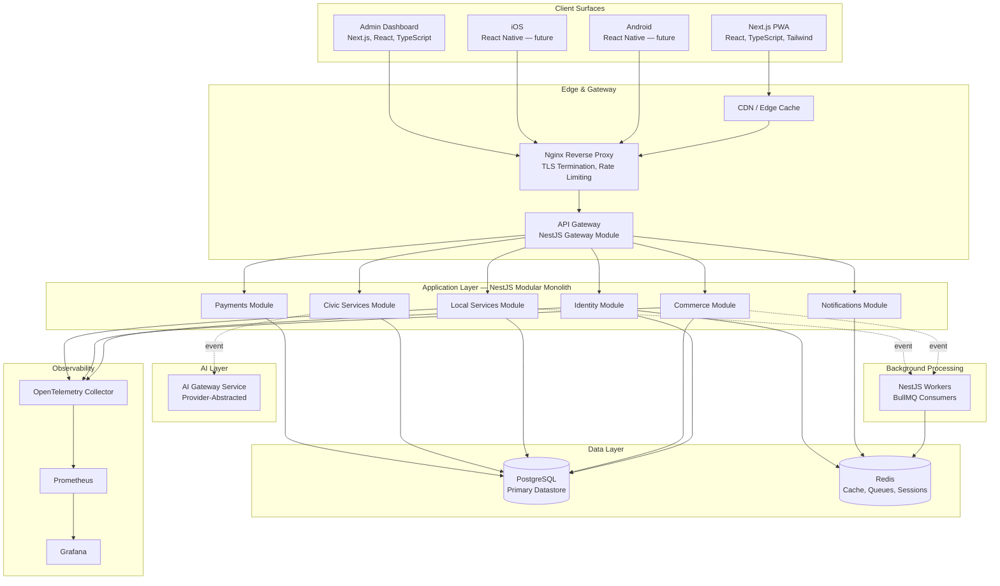
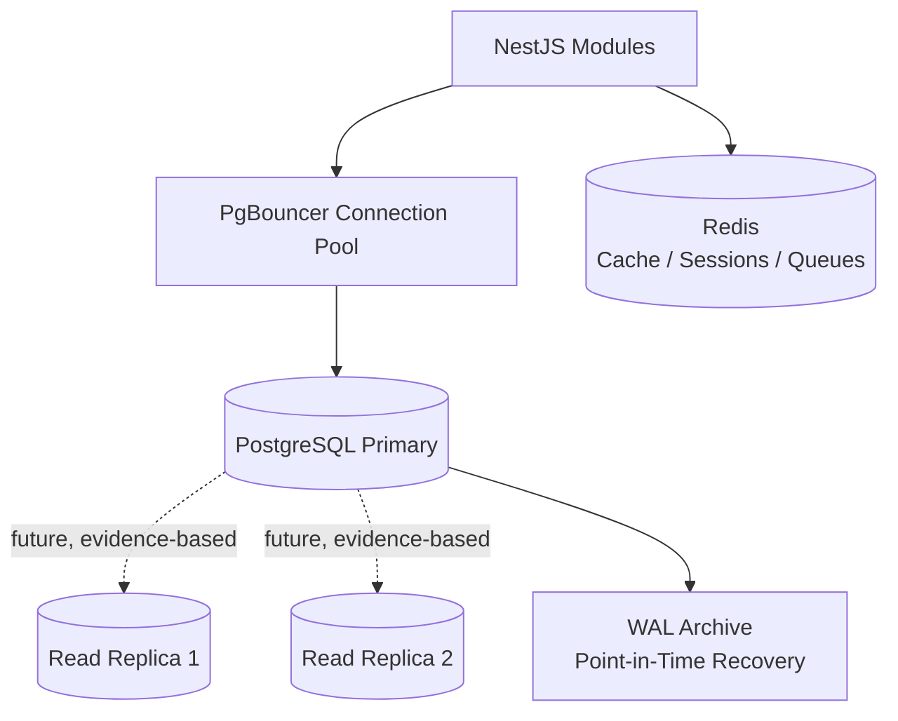
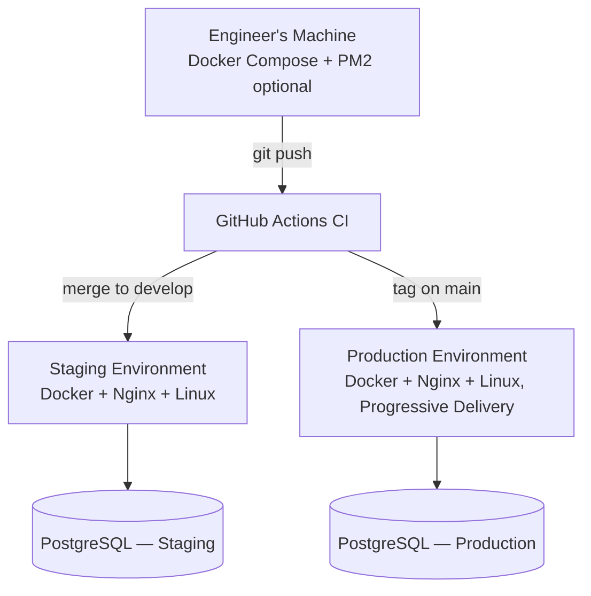
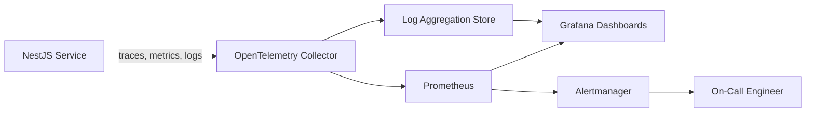
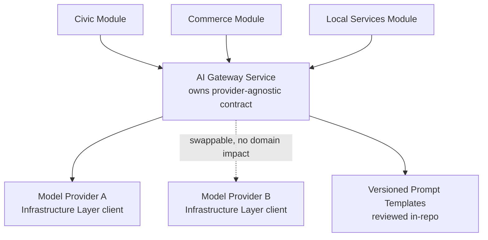
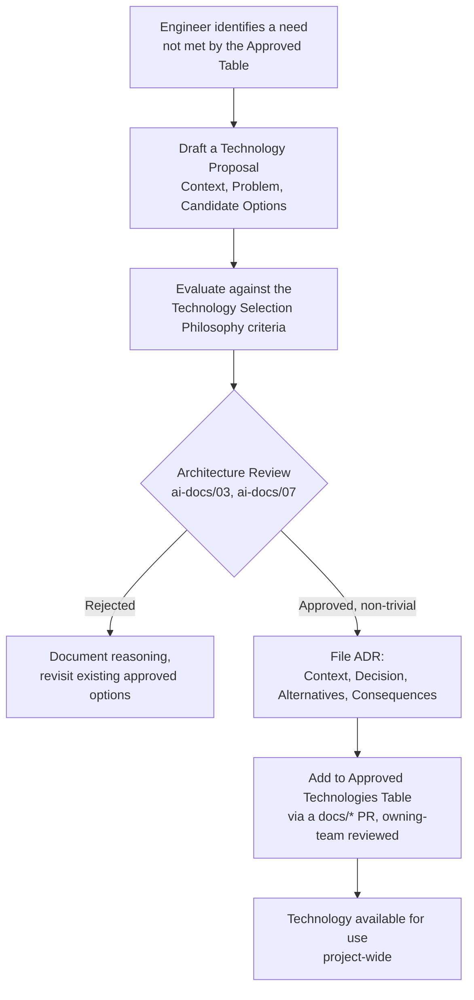

# Technology Stack Standards

**Document:** `ai-docs/09-tech-stack.md`
**Project:** Arwal — The District Super App
**Stage:** 1 — Foundation
**Phase:** 10 — Technology Stack Standards
**Status:** Approved for Engineering Reference
**Audience:** Architects, Engineers, Engineering Managers, DevOps Engineers, Security Engineers, AI Engineers, QA Engineers, Technical Reviewers, Government Technical Partners, Investors

> **Callout — Purpose of This Document**
> `ai-docs/00-project-vision.md` defined why Arwal exists. `ai-docs/01-product-goals.md` defined what Arwal must achieve. `ai-docs/02-engineering-principles.md` defined how engineers reason about design. `ai-docs/03-system-architecture-principles.md` defined how the system is structured. `ai-docs/04-folder-guidelines.md` defined where that structure physically lives. `ai-docs/05-coding-standards.md` defined how individual lines of code are written. `ai-docs/06-git-workflow.md` defined how change moves through version control. `ai-docs/07-development-workflow.md` defined how a day of engineering work unfolds. `ai-docs/08-definition-of-done.md` defined when a piece of work is actually finished. This document defines **what Arwal is actually built out of** — the specific languages, frameworks, databases, and infrastructure every one of the ~300 micro-phases will be implemented in. Every principle, boundary, and standard in the preceding nine phase documents is written in the abstract; this document is where that abstraction becomes a concrete, named, versioned technology choice.

---

# Purpose of this Document

A team can have a flawless architecture, a disciplined folder structure, rigorous coding standards, and an airtight Git workflow, and still fail if every engineer is free to pick their own language, framework, database, or testing library for the module in front of them. Technology fragmentation is the literal, technical mirror of the civic fragmentation Arwal's founding mission (`ai-docs/00-project-vision.md`) exists to eliminate in the world outside the codebase — it would be an unacceptable contradiction to fight fragmentation for a district's citizens while allowing it to fester inside Arwal's own engineering stack.

This document exists to:

1. **Name the specific technologies** that satisfy the architectural commitments of `ai-docs/03-system-architecture-principles.md` (Modular Monolith First, Clean Architecture, DDD, event-driven communication, horizontal scalability) and the folder/code standards of `ai-docs/04-folder-guidelines.md` and `ai-docs/05-coding-standards.md` (TypeScript-first, feature-first organization, strict typing).
2. **Give every engineer, reviewer, and government technical partner a single, citable reference** for what Arwal is built with — "we don't use that library, see Phase 10" is exactly as legitimate a review comment as citing SOLID from Phase 3 or a folder rule from Phase 5.
3. **Protect the 1,000,000+ user scale target** (`ai-docs/00-project-vision.md`, `ai-docs/01-product-goals.md`) by choosing technologies with proven production track records at that scale, not fashionable but unproven alternatives.
4. **Protect the ~300-micro-phase roadmap** from the specific failure mode of technology sprawl — a different ORM in one module, a different frontend framework in another, a different testing library in a third — which would make the Onboarding, Documentation, and Consistency commitments of every preceding phase document impossible to honor in practice.
5. **Make technology decisions revisitable, not permanent, through an explicit process** (see Technology Adoption Process below) rather than either ossifying prematurely or drifting silently — consistent with the Evolvable over Perfect commitment in `ai-docs/03-system-architecture-principles.md`.

This document assumes and requires familiarity with all nine preceding phase documents. It does not repeat their architectural or process reasoning — it is the concrete technology layer beneath it.

---

# Technology Selection Philosophy

Every technology named in this document was evaluated against the same nine criteria, applied consistently rather than selected ad hoc per module. A technology that fails more than one of these criteria is not adopted, regardless of how appealing it looks in isolation.

### Long-Term Stability

Arwal's roadmap spans ~300 micro-phases across a projected multi-year timeline. A technology chosen for Phase 10 must still be a reasonable, supportable choice at Phase 250. This rules out experimental, pre-1.0, or single-maintainer projects for anything on the critical path — not because innovation is unwelcome, but because Arwal's civic and financial responsibilities (`ai-docs/00-project-vision.md`) cannot be staked on a project that might be abandoned mid-roadmap.

### Community Support

A large, active community means faster answers to hard problems, a healthier supply of engineers who already know the tool, a lower risk of the project going stale, and a rich ecosystem of libraries, tooling, and integrations that Arwal does not have to build itself. Community size and health are weighted more heavily than raw technical elegance for any technology on Arwal's critical path.

### Security

Every technology choice is evaluated against its security track record: how quickly are vulnerabilities disclosed and patched, how mature is its dependency-scanning tooling, and how well does it support the Zero-Trust, Least-Privilege, and Encryption commitments already established in `ai-docs/02-engineering-principles.md` and `ai-docs/03-system-architecture-principles.md`. A technically superior but security-immature technology is not adopted for any module touching identity, payments, or civic data.

### Performance

Consistent with the Performance Vision in `ai-docs/00-project-vision.md` (sub-2-second perceived load on 3G, sub-200ms p95 API latency), every technology is evaluated for its actual, measured performance characteristics under Arwal's real target conditions — entry-level Android devices, 2G/3G networks — not benchmark performance on developer hardware.

### Scalability

Every technology must have a demonstrated, well-documented path to Arwal's 1,000,000+ user scale target, consistent with the Scalability Vision in `ai-docs/00-project-vision.md`. A technology that scales well only with heroic, bespoke engineering effort is treated as a scalability risk, not a scalability solution.

### Maintainability

A technology is chosen for how easy it makes the codebase to understand, test, and safely change six months or six years later — directly extending the Maintainability commitment in `ai-docs/05-coding-standards.md` and `ai-docs/08-definition-of-done.md` from the level of a function to the level of an entire stack layer.

### Developer Experience

A technology that is fast to develop against, well-documented, and pleasant to debug directly serves the Continuous Feedback and Small Deliverables commitments in `ai-docs/07-development-workflow.md`. A slow, ceremony-heavy toolchain is a tax on every one of the ~300 phases still ahead, paid every single day.

### Open Standards

Wherever a genuine open standard exists (REST, OpenAPI, OAuth 2.0/OIDC, SQL), Arwal builds on it rather than a proprietary equivalent, consistent with the Project Vision's explicit rejection of closed, proprietary lock-in mechanisms — Arwal refuses to lock in citizen and merchant data, and it extends that same principle to refusing to lock its own engineering organization into a single vendor's proprietary tooling wherever an open alternative is viable.

### Vendor Lock-In Considerations

Every technology and managed service is evaluated for how expensive it would be to leave. A managed service is acceptable (see Third-Party Service Policy below) when it sits behind an internal abstraction Arwal owns; a technology choice that would require a full architectural rewrite to replace is treated as a maximum-scrutiny decision requiring an ADR, per `ai-docs/02-engineering-principles.md`.

> **Callout — The One-Sentence Technology Philosophy**
> *"Choose the boring, proven, well-supported tool over the exciting, unproven one — every single time — because Arwal is infrastructure a district depends on, not a demo."*

---

# Architecture Overview

The technology stack maps directly onto the architectural layers and modules established in `ai-docs/03-system-architecture-principles.md`. No technology is introduced that does not have an explicit place in this map.

### Stack-to-Architecture Mapping

| Architectural Concept (Phase 4) | Technology Realization |
|---|---|
| Modular Monolith | A single NestJS application (`apps/api`), internally decomposed per the Module Folder Template (`ai-docs/04-folder-guidelines.md`) |
| Clean Architecture layers | NestJS's Controller → Provider (Service) → Repository pattern, mapped 1:1 to Presentation → Application → Domain → Infrastructure |
| Bounded Contexts | NestJS feature modules, one per domain (`IdentityModule`, `CommerceModule`, etc.) |
| Repository pattern / Dependency Inversion | Prisma-backed repository classes implementing hand-written repository interfaces, injected via NestJS's built-in DI container |
| Event-driven communication | BullMQ (Redis-backed) for asynchronous jobs and Integration Events; NestJS's `EventEmitter` for in-process domain events pre-extraction |
| API Gateway | A dedicated NestJS module acting as the gateway, fronted by Nginx for TLS termination and coarse-grained rate limiting |
| Data Partitioning readiness | PostgreSQL schemas per module, with a documented path to partitioning by district → ward → zone |
| Observability as a Build Requirement | OpenTelemetry instrumentation embedded at the framework level, exported to Prometheus, visualized in Grafana |

---

# Frontend Stack

The frontend stack is chosen to satisfy the Frontend Engineering Principles in `ai-docs/02-engineering-principles.md` (Accessibility-First, Responsive-First, Performance-First) and the React Standards in `ai-docs/05-coding-standards.md`.

### Next.js

**Selected as the framework for `apps/web` and `apps/admin-web`.** Next.js is chosen over a plain client-side React SPA (e.g., Create React App/Vite-only setup) because it provides Server Components and server-side rendering out of the box — directly serving the Performance-First principle and the sub-2-second load target on 3G networks from `ai-docs/00-project-vision.md`. Its file-system-based routing maps cleanly onto the `app/` routing layer defined in `ai-docs/04-folder-guidelines.md`, its built-in image optimization directly serves the Asset Optimization standard in `ai-docs/02-engineering-principles.md`, and its large, extremely active community and multi-year production track record satisfy the Long-Term Stability and Community Support criteria above.

**Trade-off acknowledged:** Next.js's opinionated conventions (routing, data-fetching patterns, the App Router's Server/Client Component split) impose a steeper initial learning curve than a plain SPA. Arwal accepts this cost because the alternative — hand-building SSR, routing, and image optimization — would be reinventing infrastructure Next.js already provides at production quality.

### React

**Selected as the UI library underlying every frontend surface.** React remains the most widely adopted UI library in the industry, with the deepest hiring pool, the richest component ecosystem (directly enabling the `packages/ui` strategy in `ai-docs/04-folder-guidelines.md`), and first-class support inside Next.js. Its Hooks-based, functional-component model aligns directly with the Functional Components Only standard in `ai-docs/05-coding-standards.md`.

### TypeScript

**Selected as the required language for every frontend and backend surface**, with zero exceptions, per the Strict Mode requirement in `ai-docs/05-coding-standards.md`. TypeScript's static type system is Arwal's primary defense against an entire category of defect before it ever reaches code review — a defense that a JavaScript-only codebase cannot offer. TypeScript's incremental adoption model, mature tooling, and status as the de facto standard for large-scale React/Node codebases satisfy every selection criterion above simultaneously.

### Tailwind CSS

**Selected as the styling system**, implementing the token-driven Styling Philosophy in `ai-docs/02-engineering-principles.md`. Tailwind's utility-first approach, combined with a centrally defined design-token configuration (`tailwind.config.ts`), gives Arwal consistent spacing, color, and typography across every screen without hand-rolled CSS drift between engineers. Tailwind's purge/JIT compilation keeps shipped CSS minimal, directly serving the Performance-First principle on constrained networks.

**Trade-off acknowledged:** Utility-class-heavy markup can look visually noisy compared to hand-authored CSS classes. Arwal accepts this in exchange for the elimination of an entire category of "which of these three near-identical CSS classes should I use" decision, consistent with Convention over Configuration (`ai-docs/02-engineering-principles.md`).

### shadcn/ui

**Selected as the base component layer for `packages/ui`.** Unlike a traditional component library consumed as an opaque `node_modules` dependency, shadcn/ui's components are copied into Arwal's own codebase and owned directly — meaning Arwal can modify, extend, and audit every component's accessibility and behavior without waiting on an upstream maintainer, while still benefiting from a well-designed, accessible, Tailwind-native starting point. This directly serves the Reusable Components and Accessibility-First principles in `ai-docs/02-engineering-principles.md`, and avoids the vendor lock-in risk of a closed-source commercial component library.

### TanStack Query

**Selected as the Server/Remote State data-fetching layer**, per the State Management Philosophy table in `ai-docs/02-engineering-principles.md`. TanStack Query provides caching, background revalidation, retry logic, and stale-while-revalidate semantics out of the box — precisely the behavior the Client-Side Cache layer in `ai-docs/03-system-architecture-principles.md`'s Caching Strategy requires, without Arwal having to hand-build a caching layer from scratch. Its framework-agnostic design (usable in React, and portable if a future surface uses a different renderer) also protects against front-end framework lock-in.

### React Hook Form

**Selected as the form-state management library.** React Hook Form's uncontrolled-input-by-default design minimizes unnecessary re-renders, directly serving the Avoid Unnecessary Renders principle in `ai-docs/05-coding-standards.md`'s Performance Coding Standards — a meaningful consideration given Arwal's entry-level Android device target. Its first-class integration with schema validation libraries (see Zod below) keeps form validation logic declarative and centrally defined rather than scattered across `onChange` handlers.

### Zod

**Selected as the schema validation library for both frontend forms and backend API boundaries.** A single validation library used on both sides of the request/response boundary means the same schema definition can validate a form on the client and a request DTO on the server, directly serving the Single Source of Truth principle in `ai-docs/02-engineering-principles.md` — a business rule expressed as a Zod schema is defined once, not reimplemented per layer. Zod's TypeScript-first design means validated data is automatically, correctly typed with zero manual type annotation drift.

### Framer Motion

**Selected as the animation library**, used deliberately and sparingly. Interactive, accessible motion (loading states, transitions, micro-interactions) improves perceived performance and citizen trust when used correctly, but every animation is evaluated against the Performance Coding Standards (`ai-docs/05-coding-standards.md`) and the entry-level device target — Framer Motion's ability to leverage the browser's native animation APIs where possible keeps this cost low, and motion is never applied to a component or interaction where it would meaningfully affect interaction latency on a low-end device.

### Zustand

**Selected as the approved Global App State library**, per the State Management Philosophy table in `ai-docs/02-engineering-principles.md`. Zustand is chosen over heavier alternatives (Redux and its ecosystem) because it requires minimal boilerplate, has no Provider-wrapping ceremony, and encourages small, purpose-scoped stores rather than one monolithic global store — directly reinforcing the principle that "Global state is treated as a liability to be minimized, not a default convenience." Zustand is used exclusively for genuinely cross-cutting concerns (auth session, active language, theme); server state remains the exclusive responsibility of TanStack Query, and feature-local state remains in component-scoped `useState`/`useReducer`.

### Frontend Stack Summary Table

| Layer | Technology | Alternative Considered | Why Rejected |
|---|---|---|---|
| Framework | Next.js | Vite + React Router (SPA-only) | No built-in SSR/Server Components; would require hand-built performance infrastructure Next.js already solves |
| UI Library | React | Vue, Svelte | Smaller hiring pool and ecosystem relative to React at Arwal's projected team-scaling needs |
| Language | TypeScript | Plain JavaScript | Forfeits static type safety, directly conflicting with `ai-docs/05-coding-standards.md`'s Strict Mode requirement |
| Styling | Tailwind CSS | CSS Modules, styled-components | Utility-first + design tokens gives faster, more consistent output than hand-authored per-component CSS |
| Component Base | shadcn/ui | MUI, Ant Design | Those ship as opaque dependencies with harder-to-override styling/accessibility; shadcn/ui is owned in-repo |
| Server State | TanStack Query | SWR, hand-rolled fetch + `useEffect` | SWR is a reasonable alternative but TanStack Query's ecosystem maturity and mutation-handling APIs are more complete for Arwal's needs |
| Forms | React Hook Form | Formik | React Hook Form has materially better performance characteristics via uncontrolled inputs |
| Validation | Zod | Yup, Joi | Zod's TypeScript-first inference eliminates a duplicate type-definition step Yup/Joi require |
| Animation | Framer Motion | CSS-only transitions, GSAP | Framer Motion's React-native API and accessibility-aware defaults fit the component model directly |
| Global State | Zustand | Redux Toolkit, Recoil | Redux Toolkit's boilerplate and ceremony are disproportionate to Arwal's genuinely minimal global-state needs |

---

# Backend Stack

The backend stack is chosen to satisfy the Modular Monolith First strategy, the four-layer System Layers model, and the Backend Engineering Principles in `ai-docs/02-engineering-principles.md` and `ai-docs/03-system-architecture-principles.md`.

### Node.js

**Selected as the backend runtime**, run on the current Active LTS release line (see Version Management Strategy below). Node.js is chosen because it lets Arwal share TypeScript types, validation schemas (Zod), and even utility code between `apps/api` and every frontend surface via `packages/*` — directly serving the DRY principle in `ai-docs/02-engineering-principles.md` at the level of an entire monorepo. Node's event-driven, non-blocking I/O model is well-suited to Arwal's API-heavy, I/O-bound workload (database queries, external payment/SMS gateway calls), and its enormous ecosystem and hiring pool satisfy the Community Support and Long-Term Stability criteria.

**Trade-off acknowledged:** Node.js is not the ideal runtime for CPU-bound workloads (e.g., heavy image processing, complex ML inference). Where such a workload emerges, it is isolated into its own worker process or an external, purpose-built service behind a well-defined interface — never forced into the main API runtime's event loop, consistent with Bulkheading (`ai-docs/03-system-architecture-principles.md`).

### NestJS

**Selected as the backend application framework**, run inside `apps/api`. NestJS is chosen specifically because its architecture already encodes the exact patterns `ai-docs/03-system-architecture-principles.md` and `ai-docs/05-coding-standards.md` require: a Controller → Provider → Repository layering, first-class dependency injection (making Dependency Inversion a framework-enforced default rather than a discipline engineers must remember), a modular structure that maps directly onto the Module Folder Template (`ai-docs/04-folder-guidelines.md`), and native support for both REST controllers and event-driven microservice transports (directly supporting the eventual Migration Strategy to independently deployed services). NestJS's decorator-based, opinionated structure reduces the number of "how should this be organized" decisions any two engineers might answer differently, directly serving Consistency (`ai-docs/02-engineering-principles.md`).

**Trade-off acknowledged:** NestJS's decorator-heavy, Angular-inspired style carries more ceremony than a minimal framework (e.g., Express or Fastify used directly). Arwal accepts this cost because the ceremony is exactly the structure that keeps a ~300-phase, multi-year codebase consistent across team growth — the alternative is re-deriving that structure by convention alone, which `ai-docs/02-engineering-principles.md` explicitly rejects as an unenforceable default.

### TypeScript (Backend)

Used identically to the frontend, under the same Strict Mode requirements defined in `ai-docs/05-coding-standards.md`. NestJS is itself written in and designed for TypeScript, making this a natural, zero-friction pairing.

### Prisma ORM

**Selected as the ORM/query layer for PostgreSQL access**, used exclusively inside each module's `infrastructure/repositories/` layer, per the Module Folder Template (`ai-docs/04-folder-guidelines.md`). Prisma is chosen over a raw query builder or a heavier, more ceremonial ORM because its schema-first approach generates fully typed query clients automatically — eliminating an entire class of type/schema-drift bug — and its migration tooling directly satisfies the versioned, reviewable Migrations principle in `ai-docs/02-engineering-principles.md`. Prisma's query API also structurally discourages the raw string-concatenation SQL injection risk called out in the Security Coding Standards (`ai-docs/05-coding-standards.md`).

**Trade-off acknowledged:** Prisma's abstraction can obscure the exact SQL executed for a complex query, and highly specialized query patterns occasionally require dropping to Prisma's raw parameterized query escape hatch. This is accepted as a rare, reviewed exception, never as a default pattern.

### PostgreSQL

See Database Stack below for full justification.

### Redis

See Database Stack below for full justification.

### BullMQ

**Selected as the job queue and Integration Event transport**, backed by Redis. BullMQ provides reliable, retryable, delayed, and scheduled job processing — the concrete implementation of the Event-Driven Thinking principle (`ai-docs/02-engineering-principles.md`) and the Asynchronous Communication pattern (`ai-docs/03-system-architecture-principles.md`) during the Modular Monolith phase. Its native support for retry-with-backoff, dead-letter queues, and job concurrency limits directly implements the Retry and Circuit Breaker resilience patterns from `ai-docs/03-system-architecture-principles.md` without Arwal needing to hand-build queue infrastructure. Because it is Redis-backed rather than requiring a dedicated message-broker cluster (e.g., Kafka, RabbitMQ), it keeps Arwal's early-phase infrastructure footprint appropriately sized, consistent with the Modular Monolith's Cost trade-off table in `ai-docs/03-system-architecture-principles.md` — with a clear, evidence-based upgrade path to a dedicated broker once message volume and durability requirements justify it (see Migration Strategy, `ai-docs/03-system-architecture-principles.md`).

### REST APIs

**Selected as the default API paradigm** for all client-facing and inter-module (post-extraction) APIs, per the API-First Design and API Coding Standards principles in `ai-docs/03-system-architecture-principles.md` and `ai-docs/05-coding-standards.md`. REST is chosen over GraphQL as the default because Arwal's domain is composed of clearly bounded, resource-oriented operations (bookings, orders, applications, payments) that map naturally onto REST's resource/verb model, and because REST's simpler caching semantics (HTTP-native caching, CDN-friendly) align directly with the multi-layer Caching Strategy in `ai-docs/03-system-architecture-principles.md`. GraphQL remains an option for a future, specifically justified use case (e.g., a client needing highly flexible, nested data-shaping across many entities) but is not adopted as a default, avoiding the complexity of running and securing two API paradigms without a demonstrated need.

### OpenAPI

**Selected as the API contract specification format**, generated directly from NestJS's decorator-based controller/DTO definitions via `@nestjs/swagger`. This keeps the contract documentation in lockstep with the actual implementation, per the Documentation Standards in `ai-docs/02-engineering-principles.md` ("never hand-maintained and allowed to drift"), and is the source from which `packages/sdk`'s typed API client is generated — directly implementing API-First Design end to end, from backend contract to typed frontend consumption.

### Backend Stack Summary Table

| Layer | Technology | Alternative Considered | Why Rejected |
|---|---|---|---|
| Runtime | Node.js (LTS) | Deno, Bun | Both have smaller ecosystems and shorter production track records at Arwal's target scale as of this writing |
| Framework | NestJS | Express (bare), Fastify (bare), Koa | Bare frameworks require Arwal to hand-build the DI, module, and layering conventions NestJS already provides |
| ORM | Prisma | TypeORM, Drizzle, raw SQL | TypeORM's Active Record pattern conflicts with the Repository pattern in `ai-docs/03-system-architecture-principles.md`; Drizzle is promising but has a shorter production track record at this scale |
| Job Queue | BullMQ | Kafka, RabbitMQ, AWS SQS | Justified only once independent-scaling/durability indicators are observed, per the Migration Strategy — premature at Phase 10 |
| API Style | REST + OpenAPI | GraphQL | GraphQL's flexible query surface and cache-invalidation complexity are unjustified overhead for Arwal's largely resource-oriented domain |

---

# Database Stack

### PostgreSQL

**Selected as Arwal's single primary datastore.** PostgreSQL is chosen over both a NoSQL-first approach and over a mixed-database-per-module approach for several concrete reasons:

- **ACID transactional guarantees** are essential for Arwal's financial (wallet, payments) and civic (government application status) data, per the Data Integrity principle in `ai-docs/02-engineering-principles.md` — a database that only offers eventual consistency by default would undermine that guarantee.
- **Mature JSON support** (via `jsonb`) gives Arwal the flexibility of a document store for genuinely semi-structured data (e.g., a civic application's variable form-field schema) without abandoning relational integrity for the rest of the schema.
- **Native support for logical partitioning** (schemas, table partitioning) directly supports the district → ward → zone Data Partitioning Strategy from `ai-docs/00-project-vision.md` and `ai-docs/03-system-architecture-principles.md`.
- **Proven scale**, extensive tooling, and a large, stable open-source community satisfy the Long-Term Stability, Community Support, and Open Standards criteria simultaneously — PostgreSQL is not tied to a single vendor, unlike several popular managed NoSQL alternatives.

Per the Database Ownership principle in `ai-docs/03-system-architecture-principles.md`, each module owns its own PostgreSQL schema within a shared cluster during the Modular Monolith phase; no module ever queries another module's schema directly, and this logical separation is what makes a future migration to physically separate database instances (upon service extraction) a low-risk, mechanical exercise rather than a redesign.

### Redis

**Selected as Arwal's caching, session, and job-queue backing store.** Redis is chosen for its combination of extremely low read/write latency (supporting the sub-200ms p95 API latency target in `ai-docs/01-product-goals.md`), native support for the data structures BullMQ requires, and a mature clustering story for horizontal scale as load grows. Redis serves three distinct roles at Arwal, each configured and monitored independently per the Bulkheading principle (`ai-docs/03-system-architecture-principles.md`): the Module-Level Application Cache and Cross-Module Read Cache layers from `ai-docs/03-system-architecture-principles.md`'s Caching Strategy, session/token storage for the Authentication shared service, and the BullMQ job-queue backing store.

### Database Migrations

All schema changes are made exclusively through Prisma's versioned migration files, committed to each module's `infrastructure/` layer and reviewed with the same rigor as application code, per the Migrations principle in `ai-docs/02-engineering-principles.md` and the Database Change Workflow in `ai-docs/07-development-workflow.md`. Migrations follow the additive-first, backfill-separately, constrain-last discipline already established in those documents — this document does not redefine that process, only names the tool (`prisma migrate`) that executes it.

### Connection Pooling

Every service connects to PostgreSQL through a connection pooler (PgBouncer, deployed in transaction-pooling mode) rather than directly, to prevent connection exhaustion as horizontal scaling adds instances per the Scalability by Design principle in `ai-docs/03-system-architecture-principles.md`. Prisma's own connection pool is tuned per service instance and sized conservatively beneath the pooler's upstream limit, so a burst of instances scaling out under load never collectively overwhelms PostgreSQL's own connection ceiling.

### Backup Strategy

- **Automated, continuous backups** are configured from the first production deployment onward — a database handling citizen identity, payment, and civic data is never run without a verified backup path, per the Security Vision and Incident Response Readiness commitments in `ai-docs/00-project-vision.md`.
- **Point-in-time recovery (PITR)** is enabled via continuous WAL archiving, allowing restoration to any point within the retention window, not just to the last full snapshot.
- **Backup restoration is tested on a defined schedule** (not merely assumed to work), consistent with the principle that an unverified backup is not a backup, only an assumption.
- **Backups are encrypted at rest**, consistent with the Encryption principle in `ai-docs/02-engineering-principles.md`.

### Replication (Future)

As load grows toward and beyond the 1,000,000-user target, PostgreSQL read replicas are introduced to offload read-heavy traffic (catalog browsing, listing search) from the primary write instance — this is an evidence-based decision, triggered by the same Migration Indicators discipline in `ai-docs/03-system-architecture-principles.md` (sustained read-load contention, observed via monitoring), not adopted speculatively at Phase 10. When introduced, read-replica routing is implemented at the Infrastructure Layer inside each module's repository implementation, invisible to the Domain and Application layers, consistent with Technology Independence.

---

# Mobile Stack

Arwal's mobile strategy must satisfy Platform Parity (`ai-docs/00-project-vision.md`, `ai-docs/01-product-goals.md`) across Android and iOS without duplicating business logic per platform, per the Business Logic in UI anti-pattern rejected in `ai-docs/03-system-architecture-principles.md`.

### React Native vs. Flutter — Trade-off Analysis

| Factor | React Native | Flutter |
|---|---|---|
| **Language/ecosystem alignment** | Shares TypeScript and, where the rendering layer allows, React component logic with `apps/web`/`apps/admin-web`, directly reusing `packages/types`, `packages/utils`, and business logic already written for the web surfaces. | Uses Dart, a separate language from the rest of Arwal's TypeScript-first stack (`ai-docs/05-coding-standards.md`), requiring a second language ecosystem, a second set of hiring criteria, and duplicated (not shared) business/validation logic. |
| **Team skill reuse** | Arwal's frontend engineers, already fluent in React/TypeScript per this document, can contribute to mobile with a materially smaller ramp-up. | Requires a dedicated Dart-skilled hiring track or a slower ramp-up for existing engineers. |
| **Performance** | Near-native performance for Arwal's use cases (forms, lists, navigation); genuinely native modules are used for the rare case demanding raw native performance. | Excellent, often best-in-class rendering performance via its own rendering engine, independent of platform UI widgets. |
| **Ecosystem maturity** | Very large, mature ecosystem, extensive third-party library support, proven at scale by numerous large consumer apps. | Rapidly maturing, strong Google backing, but a smaller overall third-party ecosystem than React Native's as of this writing. |
| **Long-term stability** | Backed by Meta with a long production history; large, diverse contributor base reduces single-vendor risk. | Backed primarily by Google; strong investment, but Arwal weighs the risk of depending on a single corporate sponsor's continued prioritization. |

### Approved Direction

**React Native is the approved mobile framework for Arwal**, to be adopted when the mobile phase of the roadmap is reached (per the 10-Year Vision Arc in `ai-docs/00-project-vision.md`). This decision is driven primarily by the Skill Reuse and Ecosystem Alignment factors above: React Native lets Arwal share TypeScript types, Zod validation schemas, business-logic utilities, and even selected component logic between `apps/web` and `apps/mobile`, directly serving the DRY principle (`ai-docs/02-engineering-principles.md`) at the cross-platform level, and lets the existing frontend engineering team scale into mobile without a parallel Dart-focused hiring track. Flutter remains a documented, seriously considered alternative and would be revisited via an ADR if a future phase surfaces a concrete, evidenced reason React Native cannot meet a specific mobile requirement.

Mobile app source lives in `apps/mobile`, per the High-Level Repository Structure in `ai-docs/04-folder-guidelines.md`, consuming the same versioned backend contracts (`packages/sdk`) as every other client surface, satisfying API-First Design and Platform Parity without divergence.

---

# Authentication & Security Stack

This stack makes the Security Principles in `ai-docs/02-engineering-principles.md` and the Security Architecture Principles in `ai-docs/03-system-architecture-principles.md` concrete.

### JWT (JSON Web Tokens)

**Selected as the access-token format**, issued exclusively by the unified Authentication shared service (`ai-docs/03-system-architecture-principles.md`). JWTs are short-lived (minutes, not hours), signed using an asymmetric algorithm (RS256), and validated at every module boundary — never trusted by signature alone without expiry and issuer checks — satisfying the Authentication principle in `ai-docs/02-engineering-principles.md`'s requirement for short-lived access tokens.

### Refresh Tokens

**Selected as the mechanism for maintaining a citizen's session beyond an access token's short lifetime**, stored server-side (Redis-backed, per the Database Stack above) with rotation on every use — a refresh token is single-use and immediately invalidated upon exchange, so a stolen, replayed refresh token is detectable and rejected. Refresh tokens are never stored in `localStorage`/`sessionStorage` on any client surface; they are held in secure, `httpOnly` cookies (web) or the platform's secure credential storage (mobile).

### OAuth 2.0 / OpenID Connect

**Selected as the underlying protocol family** for the unified Authentication shared service, per the Authentication principle in `ai-docs/02-engineering-principles.md`'s explicit rejection of custom-built authentication logic. OAuth 2.0/OIDC's industry-standard, well-audited flows (Authorization Code with PKCE for public clients) are used rather than a bespoke session/token scheme, satisfying the Open Standards criterion and giving Arwal a proven path to future third-party/government single-sign-on integrations (per the Open Ecosystem Phase in `ai-docs/01-product-goals.md`) without a protocol rewrite.

### Role-Based Access Control (RBAC)

**Selected as the primary authorization model**, extended with attribute-based checks (resource ownership) where role alone is insufficient — per the Role-Based and Attribute-Based Access Control principle in `ai-docs/02-engineering-principles.md` and `ai-docs/01-product-goals.md`. Roles (`citizen`, `merchant`, `service-provider`, `delivery-partner`, `government-officer`, `admin`) are defined centrally in the Identity/Authorization shared services and enforced at the Application Layer of every use case, never assumed from a request simply reaching a controller, per the Authorization standard in `ai-docs/05-coding-standards.md`.

### Argon2

**Selected as the password-hashing algorithm**, used for any credential requiring password-based authentication (administrative and government-officer accounts; citizen accounts are expected to favor OTP/passwordless flows where possible, per the low-literacy accessibility commitments in `ai-docs/00-project-vision.md`). Argon2 is chosen over legacy algorithms (MD5, SHA-family without proper KDF wrapping, even bcrypt) because it is the current password-hashing competition winner, purpose-built to resist both GPU/ASIC brute-force attacks and side-channel attacks, and is actively recommended by OWASP as of this writing.

### HTTPS

**Mandatory for every environment, including local development wherever practical, and non-negotiable in staging and production.** TLS termination happens at the Nginx reverse-proxy layer (see DevOps & Infrastructure below), with TLS 1.2 as the minimum accepted protocol version and modern cipher suites only — directly implementing the Encryption in Transit principle from `ai-docs/02-engineering-principles.md` and `ai-docs/03-system-architecture-principles.md`.

### Rate Limiting

**Enforced at two layers**: coarse-grained, IP/route-based limiting at the Nginx/API Gateway layer to absorb abusive traffic before it reaches application code, and fine-grained, per-actor/per-endpoint limiting inside NestJS (via a shared `@nestjs/throttler`-based guard) for sensitive operations (login attempts, OTP requests, payment initiation) where a stricter limit than the coarse gateway limit is warranted. This directly implements the Rate Limiting responsibility of the API Gateway Philosophy in `ai-docs/03-system-architecture-principles.md`.

### Helmet

**Selected as the HTTP security-header middleware** for every NestJS application, applied globally at application bootstrap. Helmet sets secure defaults for headers governing content-type sniffing, clickjacking protection (`X-Frame-Options`), and strict transport security (`HSTS`), implementing Secure by Default (`ai-docs/02-engineering-principles.md`) without requiring each module to remember to configure these headers individually.

### CORS

**Configured restrictively, per environment**, with an explicit allow-list of origins (Arwal's own PWA, admin dashboard, and mobile app origins) — a wildcard (`*`) CORS policy is never used in staging or production, consistent with Secure by Default and Least Privilege (`ai-docs/02-engineering-principles.md`).

---

# DevOps & Infrastructure

This section makes the Deployment Philosophy and Scalability Philosophy in `ai-docs/02-engineering-principles.md` concrete.

### Docker

**Selected as the containerization standard** for every deployable service (`apps/api`, `apps/workers`, and, where applicable, build artifacts for `apps/web`/`apps/admin-web`). Every service ships with its own `Dockerfile`, producing a reproducible, environment-independent build artifact — directly implementing the Reproducibility commitment in `ai-docs/06-git-workflow.md`: given any commit hash, the exact deployed artifact can be reconstructed identically.

### Docker Compose

**Selected as the local development environment orchestrator**, spinning up PostgreSQL, Redis, and every backend service together with a single command, so a new engineer's local environment matches production topology closely enough to catch integration issues before a PR is even opened — directly serving the Onboarding and Documentation-Driven Development commitments in `ai-docs/02-engineering-principles.md`.

### GitHub Actions

**Selected as the CI/CD pipeline engine**, implementing the CI/CD Integration principles from `ai-docs/06-git-workflow.md` end to end: lint, type-check, unit and integration tests, build, circular-dependency check, and secret/dependency scanning run on every push and PR; staging deploys trigger automatically on merge to `develop`; production deploys trigger on a tag push to `main`, via progressive delivery. GitHub Actions is chosen for its tight integration with the GitHub-hosted monorepo (avoiding a second platform's authentication and permissions model) and its mature marketplace of maintained actions for the exact checks Arwal's pipeline requires.

### Nginx

**Selected as the reverse proxy and TLS termination layer**, sitting in front of every backend service and the built static frontend assets. Nginx's proven production stability at scale, low resource footprint, and mature configuration ecosystem for rate limiting, caching headers, and load balancing make it the default choice over a heavier, more complex API gateway product at Arwal's current phase — consistent with the Modular Monolith's guiding principle of right-sized infrastructure over premature complexity.

### Linux

**Selected as the standard operating system for every deployed environment** (containers and underlying hosts), for its production maturity, security-patch cadence, and status as the de facto standard for containerized cloud-native workloads — directly serving the Cloud-Native by Default principle in `ai-docs/00-project-vision.md`.

### PM2 (Development Only)

**Approved strictly for local development convenience** — engineers may use PM2 to manage multiple local Node.js processes (e.g., the API and a worker process) without a full Docker Compose rebuild during rapid iteration. **PM2 is never used in staging or production**, where Docker's own process supervision, combined with the orchestration platform's restart/health-check policies, is the sole supervision mechanism, avoiding two overlapping and potentially conflicting process-management layers.

### Reverse Proxy

Every citizen-facing and internal service sits behind the Nginx reverse-proxy layer described above; no service is ever exposed directly to the public internet without passing through it first, consistent with Zero-Trust and Perimeter Enforcement in `ai-docs/03-system-architecture-principles.md`.

### Environment Management

Every environment (`development`, `staging`, `production`) has its own explicitly typed and validated configuration, loaded per the Configuration Organization guidance in `ai-docs/04-folder-guidelines.md`, sourced from a dedicated secrets-management system in staging/production and from `.env.<environment>.example`-templated local files in development — real secrets are never committed to the repository, per the Secrets Management principle in `ai-docs/02-engineering-principles.md` and the Git Ignore Policy in `ai-docs/06-git-workflow.md`.

---

# Testing Stack

This stack implements the Testing Pyramid and Testing Standards defined in `ai-docs/02-engineering-principles.md` and `ai-docs/05-coding-standards.md`.

### Vitest

**Selected as the unit-test runner for frontend code** (`apps/web`, `apps/admin-web`, `packages/*`). Vitest is chosen over Jest for the frontend specifically because it shares Vite's/Next.js's underlying transform pipeline, giving materially faster test execution and a simpler, less-configuration-heavy setup for a TypeScript/ESM-first codebase — directly serving the Continuous Feedback principle in `ai-docs/07-development-workflow.md` (fast feedback loops at every stage).

### Jest

**Selected as the unit and integration test runner for backend code** (`apps/api`, `apps/workers`), since it is NestJS's officially supported and deeply integrated testing framework, with first-class support for NestJS's dependency-injection testing utilities (`@nestjs/testing`). Using Jest specifically where NestJS's own tooling assumes it avoids fighting the framework's conventions.

### Playwright

**Selected as the End-to-End testing tool**, covering the curated critical citizen journeys defined in the Testing Pyramid (`ai-docs/02-engineering-principles.md`): checkout, booking, and civic application submission. Playwright is chosen over Cypress for its native multi-browser support (Chromium, Firefox, WebKit) in a single test suite — directly relevant given Arwal's Platform Parity commitment across browser engines — and its built-in support for network throttling, which is used deliberately to verify citizen-facing flows under simulated 3G conditions, per the Manual QA Focus Areas in `ai-docs/07-development-workflow.md`.

### Supertest

**Selected for backend API integration testing**, used alongside Jest to issue real HTTP requests against a running (or in-memory) NestJS application instance and assert on the actual HTTP response — verifying the Presentation Layer's request/response contract end to end, exactly as the Integration Tests standard in `ai-docs/05-coding-standards.md` requires for cross-boundary behavior.

### Testing Library

**Selected as the component-testing utility** (`@testing-library/react`), used alongside Vitest for frontend unit/component tests. Testing Library is chosen specifically because its API encourages testing components the way a citizen actually interacts with them (queries by accessible role, label, and text) rather than by internal implementation detail — directly reinforcing the Accessibility-First principle in `ai-docs/02-engineering-principles.md` at the level of the test suite itself: a component that is hard to query accessibly in a test is frequently a component that is hard to use accessibly in production.

### Testing Stack Summary

| Layer | Tool | Applies To |
|---|---|---|
| Frontend Unit/Component | Vitest + Testing Library | `apps/web`, `apps/admin-web`, `packages/ui` |
| Backend Unit/Integration | Jest + `@nestjs/testing` + Supertest | `apps/api`, `apps/workers` |
| End-to-End | Playwright | Critical citizen journeys across the full stack |

---

# Monitoring & Observability

This stack implements the Observability Principles from `ai-docs/02-engineering-principles.md` and `ai-docs/03-system-architecture-principles.md` structurally, not as an optional add-on.

### OpenTelemetry

**Selected as the instrumentation standard** across every backend service and, where applicable, frontend Real User Monitoring. OpenTelemetry is chosen specifically because it is a vendor-neutral, open-standard instrumentation format — traces, metrics, and logs collected through it can be exported to Prometheus/Grafana today and to a different backend later without re-instrumenting a single line of application code, directly protecting Arwal against Observability-vendor lock-in per the Vendor Lock-In Considerations criterion above. Correlation/trace ID propagation, required by `ai-docs/02-engineering-principles.md` and `ai-docs/03-system-architecture-principles.md`, is implemented via OpenTelemetry's context-propagation mechanism, injected once at the API Gateway and carried automatically through every module and async event a request touches.

### Prometheus

**Selected as the metrics collection and storage backend**, scraping the golden signals (latency, traffic, errors, saturation) exposed by every NestJS module and shared service via a standard `/metrics` endpoint. Prometheus's pull-based model, mature alerting rules engine, and status as the de facto open-source standard for cloud-native metrics satisfy the Community Support and Open Standards criteria.

### Grafana

**Selected as the dashboarding and visualization layer** atop Prometheus (and, for log data, atop the structured-logging pipeline). Every service is required to have a live Grafana dashboard covering its golden signals before it is considered production-ready, per the Dashboards as a First-Class Deliverable principle in `ai-docs/02-engineering-principles.md`.

### Structured Logging

Every service logs through a shared, structured-logging module (JSON-formatted, never free-text interpolated strings), per the Logging Standards in `ai-docs/05-coding-standards.md`, shipped to a centralized log-aggregation backend and correlated by the same trace ID OpenTelemetry propagates — so a single citizen-facing request or event can be traced across every module it touched, end to end, without guesswork.

### Health Checks

Every service exposes standardized liveness and readiness endpoints (`/health/live`, `/health/ready`), consumed by both the deployment orchestrator (to make failure detection and rolling-deployment gating automatic) and by Nginx/the API Gateway (to route traffic away from an unhealthy instance) — the mandatory, standardized contract required by the Observability Principles in `ai-docs/03-system-architecture-principles.md`.

---

# AI Stack

Consistent with the AI Vision and AI Principle in `ai-docs/00-project-vision.md` ("AI in Arwal must always be explainable and overridable by a human process"), Arwal's AI integration strategy is built to be **provider-independent by architecture**, not tied to any single model vendor.

### Provider Abstraction

All AI capability (intelligent discovery/ranking, the future Civic Assistant, fraud/trust anomaly detection, accessibility features like text-to-speech) is consumed through an internal **AI Gateway Service** — itself a bounded context per `ai-docs/03-system-architecture-principles.md`, owning its own data and exposing its own versioned internal API. Domain modules (Commerce, Civic, Local Services) never call a third-party AI provider's SDK directly; they call the AI Gateway Service's interface, which internally routes to whichever underlying model provider is currently configured. This directly implements Dependency Inversion (`ai-docs/02-engineering-principles.md`) at the AI layer: business logic depends on an `AIProvider` interface Arwal owns, never on a specific vendor's client library.

### Model Abstraction

The AI Gateway Service defines its own internal, provider-agnostic request/response contracts (e.g., a `CompletionRequest`/`CompletionResponse` shape, a `RankingRequest`/`RankingResponse` shape) that are mapped to and from whatever the currently configured provider's actual API expects, inside the Gateway's own Infrastructure Layer. Swapping or adding a model provider — or running two providers concurrently for different capabilities based on cost/quality trade-offs — is an Infrastructure Layer change inside the AI Gateway Service alone, invisible to every consuming domain module, exactly as Technology Independence (`ai-docs/03-system-architecture-principles.md`) requires.

### Prompt Management

Prompts are treated as versioned, reviewable artifacts, not inline string literals scattered through business logic — consistent with the Magic Numbers/Magic Strings discipline in `ai-docs/05-coding-standards.md` applied to AI prompts specifically. Every prompt template lives in a dedicated, version-controlled location inside the AI Gateway Service, is subject to the same code review rigor as any other change, and is never edited directly against a live provider's dashboard/console outside of Arwal's own repository.

### Human Override Path

Per the AI Principle in `ai-docs/00-project-vision.md`, every AI-influenced decision that could affect a citizen's access to a service, a transaction, or their reputation score is designed with an explicit, reachable human-appeal path from the first implementation — this is a Feature Definition of Done requirement (`ai-docs/08-definition-of-done.md`) for any AI-touching feature, not an optional later addition. No AI output is treated as an unreviewable, final decision anywhere in Arwal's civic or trust-and-safety workflows.

### Provider Independence

No AI feature is built assuming a single, permanent model provider. The AI Gateway Service's provider-agnostic contract is the mechanism that protects Arwal from the exact Vendor Lock-In risk this document's Selection Philosophy warns against, applied to the single fastest-moving, most vendor-fragmented category of technology Arwal will integrate with across its 300-phase roadmap.

---

# Third-Party Service Policy

Arwal will inevitably depend on external SaaS services for capability that is not core to its competitive differentiation and would be wasteful to build in-house (e.g., SMS/WhatsApp delivery, payment-gateway processing, transactional email). This section defines when that dependency is acceptable and how it is bounded.

### When External SaaS Is Acceptable

1. **The capability is genuinely undifferentiated** — it is not part of Arwal's civic-commerce unification value proposition (`ai-docs/01-product-goals.md`), and building it in-house would be reinventing commodity infrastructure at the expense of citizen-facing feature velocity.
2. **The service has a mature, well-documented API** that can be wrapped by an internal abstraction without leaking vendor-specific concepts into domain code.
3. **The service's data-handling practices satisfy Arwal's Security and Data Minimization commitments** (`ai-docs/00-project-vision.md`, `ai-docs/02-engineering-principles.md`) — no citizen-sensitive data is sent to a third party without an explicit, reviewed data-processing justification.
4. **A credible, evaluated alternative exists** should the vendor's terms, pricing, or reliability degrade — Arwal does not adopt a service with no viable exit path.

### How Vendor Lock-In Is Minimized

Every third-party SaaS integration is accessed exclusively through an `infrastructure/external/` client wrapper inside the owning module (per the Module Folder Template, `ai-docs/04-folder-guidelines.md`), implementing a domain-owned interface (e.g., `PaymentGateway`, `SmsProvider`, `NotificationChannel`) — never called directly from Application or Domain layer code. This is the same Dependency Inversion pattern already established for payment providers in `ai-docs/02-engineering-principles.md`'s OCP example, applied uniformly to every external SaaS dependency, and is what makes swapping a vendor an Infrastructure Layer change rather than a cross-cutting rewrite.

### Examples of Acceptable SaaS Categories

| Category | Example Use Case | Abstraction Point |
|---|---|---|
| SMS / WhatsApp delivery | OTP delivery, booking confirmations | `NotificationChannel` interface in the Notifications shared service |
| Payment gateway processing | UPI/card transaction processing | `PaymentGateway` interface in the Payments shared service |
| Transactional email | Government-officer account notifications | `NotificationChannel` interface (email variant) |
| Object/file storage (if not self-hosted) | KYC document storage | `FileStorageProvider` interface in the File Storage shared service |
| Map/geocoding data | District/ward geographic lookups | A dedicated `GeoDataProvider` interface, isolated to the modules that need it |

### Examples Requiring Elevated Scrutiny or Rejection

- Any service that would require sending raw, unencrypted citizen identity, health, or payment-instrument data to a third party without a documented, reviewed data-processing agreement.
- Any service with no viable migration path (e.g., a proprietary data format with no export capability).
- Any service whose core business model conflicts with Arwal's Trust Constraint (`ai-docs/01-product-goals.md`) — e.g., a provider that would monetize citizen data in a way Arwal itself refuses to.

---

# Version Management Strategy

### LTS Policy

Every foundational runtime and framework (Node.js, PostgreSQL, Redis) runs on its current **Active LTS** (or equivalent stable, long-support) release line — never a bleeding-edge, non-LTS release in production, and never a release that has fallen out of active support. This directly serves the Long-Term Stability criterion: an unsupported runtime is a standing security risk the moment its maintainers stop shipping patches.

### Dependency Updates

Dependency updates follow the Dependency Update Workflow already defined in `ai-docs/07-development-workflow.md`: security patches are fast-tracked, non-security patches and minor updates are batched into periodic `chore/*` PRs, and major version upgrades are treated as their own dedicated, fully-reviewed body of work with a full regression pass — this document does not redefine that workflow, only affirms that it governs every technology named here.

### Major Version Upgrades

A major version upgrade of any technology named in the Approved Technologies Table below (e.g., a NestJS major version, a Next.js major version) is proposed, evaluated, and approved through the same Technology Adoption Process defined below — it is never merged as an incidental part of an unrelated feature PR, consistent with Scope Discipline (`ai-docs/02-engineering-principles.md`).

### Deprecation Policy

A technology is formally deprecated — meaning no new code may adopt it, existing usage is scheduled for migration, and its status in the Approved Technologies Table is updated accordingly — only through an ADR documenting the reason for deprecation and the migration plan. A deprecated technology is never removed from a running service without first migrating that service's usage; deprecation marks a technology "no longer for new use," not "immediately broken."

---

# Approved Technologies Table

| Technology | Purpose | Status | Minimum Version | Notes |
|---|---|---|---|---|
| TypeScript | Primary language, frontend and backend | Approved | Current stable minus one major | Strict mode mandatory per `ai-docs/05-coding-standards.md` |
| Next.js | Frontend framework (`apps/web`, `apps/admin-web`) | Approved | Current stable App Router release | Server Components used by default |
| React | UI library | Approved | Current stable | Functional components only |
| Tailwind CSS | Styling system | Approved | Current stable | Token-driven configuration required |
| shadcn/ui | Base component layer | Approved | N/A (copied into repo) | Lives in `packages/ui`, owned in-repo |
| TanStack Query | Server state management | Approved | Current stable | Exclusive owner of Server/Remote State |
| React Hook Form | Form state management | Approved | Current stable | Paired with Zod schemas |
| Zod | Schema validation | Approved | Current stable | Shared across frontend and backend DTOs |
| Framer Motion | Animation | Approved | Current stable | Used deliberately, evaluated for perf cost |
| Zustand | Global app state | Approved | Current stable | Minimal, purpose-scoped stores only |
| Node.js | Backend runtime | Approved | Current Active LTS | No non-LTS releases in production |
| NestJS | Backend application framework | Approved | Current stable major | Enforces Controller/Provider/Repository layering |
| Prisma | ORM | Approved | Current stable | Migrations reviewed per `ai-docs/02-engineering-principles.md` |
| PostgreSQL | Primary datastore | Approved | Current stable major | Schema-per-module ownership |
| Redis | Cache, sessions, queues | Approved | Current stable | Bulkheaded per role (cache/session/queue) |
| BullMQ | Job queue / async events | Approved | Current stable | Redis-backed; upgrade path to dedicated broker is evidence-based |
| OpenAPI / Swagger | API contract specification | Approved | 3.x | Generated from NestJS decorators |
| React Native | Mobile framework | Approved (future adoption) | Current stable | Adoption timed to the mobile phase of the roadmap |
| Flutter | Mobile framework | Rejected (documented alternative) | N/A | Revisit only via ADR with concrete justification |
| JWT (RS256) | Access tokens | Approved | N/A (standard) | Short-lived, asymmetric signing only |
| OAuth 2.0 / OIDC | Auth protocol | Approved | N/A (standard) | Authorization Code + PKCE flow |
| Argon2 | Password hashing | Approved | Argon2id variant | Used for password-based accounts only |
| Docker | Containerization | Approved | Current stable | Mandatory for every deployable service |
| Docker Compose | Local orchestration | Approved | Current stable | Local development only |
| GitHub Actions | CI/CD | Approved | N/A (hosted) | Full pipeline per `ai-docs/06-git-workflow.md` |
| Nginx | Reverse proxy / TLS termination | Approved | Current stable | Mandatory in front of every service |
| PM2 | Local process management | Approved (dev only) | Current stable | Forbidden in staging/production |
| Vitest | Frontend test runner | Approved | Current stable | Frontend unit/component tests |
| Jest | Backend test runner | Approved | Current stable | Backend unit/integration tests |
| Playwright | E2E testing | Approved | Current stable | Curated critical-journey coverage only |
| Supertest | Backend HTTP integration testing | Approved | Current stable | Paired with Jest |
| Testing Library | Component testing | Approved | Current stable | Accessibility-oriented query APIs |
| OpenTelemetry | Instrumentation | Approved | Current stable | Vendor-neutral; mandatory across all services |
| Prometheus | Metrics backend | Approved | Current stable | Golden signals per service |
| Grafana | Dashboards | Approved | Current stable | Mandatory dashboard before production readiness |
| PgBouncer | Connection pooling | Approved | Current stable | Transaction pooling mode |
| GraphQL | Alternative API paradigm | Experimental | N/A | Only for a specifically justified, ADR-backed use case |
| Kafka / RabbitMQ | Dedicated message broker | Experimental (future) | N/A | Adoption is evidence-based, per the Migration Strategy |

---

# Technology Adoption Process

No new technology, library, or major version upgrade not already named in the Approved Technologies Table above enters Arwal's codebase without passing through this process — informal, ad hoc adoption ("I just added a library to solve today's problem") is treated as a review-blocking finding, exactly as an unreviewed architectural boundary change is in `ai-docs/03-system-architecture-principles.md`.

### Proposal Requirements

A Technology Proposal, at minimum, addresses:

1. **The specific problem** the current Approved Technologies Table does not solve — never a proposal justified purely by novelty or personal preference.
2. **An evaluation against every criterion** in the Technology Selection Philosophy section of this document — long-term stability, community support, security, performance, scalability, maintainability, developer experience, open standards, and vendor lock-in.
3. **At least one alternative considered and rejected**, with reasoning, mirroring the Alternatives Considered requirement of a standard ADR (`ai-docs/02-engineering-principles.md`).
4. **A migration/rollback plan** if the proposal would replace an already-approved technology — an addition is lower-risk than a replacement and is evaluated accordingly.

### Approval Authority

- A proposal that introduces a genuinely new category of technology (a new database engine, a new frontend framework, a new mobile stack) requires full Architecture Review and an ADR, per the Architecture Review Workflow in `ai-docs/07-development-workflow.md`.
- A proposal that adds a narrowly scoped utility library within an already-approved category (e.g., a new date-formatting library) requires Tech Lead sign-off and a lightweight documentation update, not a full Architecture Review — proportional rigor, per the same principle that governs Code Review Standards (`ai-docs/02-engineering-principles.md`).
- A rejected proposal is documented, not silently dropped — future engineers proposing the same technology should find the prior reasoning immediately, per the ADR Callout in `ai-docs/02-engineering-principles.md`.

### Experimental Status

A technology may be marked **Experimental** in the Approved Technologies Table — permitted for a scoped pilot (a single module, a non-critical-path feature) but not yet approved for project-wide default use. An Experimental technology is promoted to **Approved** only after the pilot demonstrates it against the Technology Selection Philosophy criteria in real Arwal conditions, and is removed entirely (never left in limbo) if the pilot does not justify promotion.

---

# Technology Review Checklist

Every Technology Proposal, and every periodic technology audit of the existing stack, is checked against the following before a technology is added to, retained in, or removed from the Approved Technologies Table:

- [ ] Does the technology solve a real, current problem — not a speculative, YAGNI-violating future need?
- [ ] Is the technology evaluated explicitly against every criterion in the Technology Selection Philosophy (stability, community, security, performance, scalability, maintainability, developer experience, open standards, vendor lock-in)?
- [ ] Is there a viable exit/migration path if the technology or its vendor becomes unsuitable?
- [ ] Does the technology fit cleanly into the existing architecture (`ai-docs/03-system-architecture-principles.md`) and folder structure (`ai-docs/04-folder-guidelines.md`) without requiring a structural exception?
- [ ] Is the technology's security and dependency-update track record acceptable for Arwal's civic/financial risk profile?
- [ ] Has at least one credible alternative been considered and documented as rejected, with reasoning?
- [ ] Is the technology on a currently supported (LTS or equivalent) release line, per the Version Management Strategy?
- [ ] If the technology replaces an already-approved technology, is a migration and rollback plan documented?
- [ ] Is an ADR filed for any non-trivial addition, replacement, or deprecation, per the Technology Adoption Process?
- [ ] Is the Approved Technologies Table itself updated in the same change, so it never drifts from what the codebase actually uses?

A technology failing more than one item on this checklist is not approved for adoption — this checklist carries the same authority as every other review checklist established in the preceding nine phase documents.

---

# Closing Statement

> **Callout — Closing Statement**
> Every preceding phase document described a dimension of *how* Arwal is built — its principles, its architecture, its folder structure, its code, its Git history, its daily workflow, and its definition of finished work. This document is where all of that abstraction becomes concrete: a named language, a named framework, a named database, a named queue, a named observability stack — the actual, specific materials from which a citizen's booking, payment, and government application will be built, for every one of the ~300 micro-phases still ahead. A technology choice made carelessly at Phase 10 becomes a structural constraint at Phase 200; a technology choice made with the discipline this document requires becomes a foundation the next 290 phases can be built on without regret. Where a future phase must deviate from a technology named here, that deviation is made explicitly — through the Technology Adoption Process and an Architectural Decision Record — never silently, and never by default.

This document, `ai-docs/09-tech-stack.md`, is the tenth phase of approximately 300. Every service, module, component, and package built in the phases that follow is expected to be built from the technologies approved here, or to justify its deviation in writing through the Technology Adoption Process defined above.

**End of Phase 10 — `ai-docs/09-tech-stack.md`**
