# Security Standards

**Document:** `ai-docs/10-security-standards.md`
**Project:** Arwal — The District Super App
**Stage:** 1 — Foundation
**Phase:** 11 — Security Standards
**Status:** Approved for Engineering Reference
**Audience:** Architects, Engineers, Engineering Managers, Security Engineers, DevOps Engineers, AI Engineers, QA Engineers, Technical Reviewers, Government Technical Partners, Auditors

> **Callout — Purpose of This Document**
> `ai-docs/00-project-vision.md` defined why Arwal exists. `ai-docs/01-product-goals.md` defined what Arwal must achieve. `ai-docs/02-engineering-principles.md` defined how engineers reason about design. `ai-docs/03-system-architecture-principles.md` defined how the system is structured. `ai-docs/04-folder-guidelines.md` defined where that structure physically lives. `ai-docs/05-coding-standards.md` defined how individual lines of code are written. `ai-docs/06-git-workflow.md` defined how change moves through version control. `ai-docs/07-development-workflow.md` defined how a day of engineering work unfolds. `ai-docs/08-definition-of-done.md` defined when a piece of work is actually finished. `ai-docs/09-tech-stack.md` named the concrete technologies everything is built from. This document defines **the specific, enforceable security standard every one of those technologies, boundaries, and workflows must satisfy** — the rules that turn "secure by design" from a stated value into a verifiable, auditable engineering practice, for every one of the ~300 micro-phases still ahead.

---

# Purpose of this Document

Every phase document preceding this one mentions security. `ai-docs/00-project-vision.md` names it as a foundational pillar equal to functionality. `ai-docs/02-engineering-principles.md` and `ai-docs/03-system-architecture-principles.md` establish Secure by Default, Least Privilege, and Zero-Trust as architectural commitments. `ai-docs/05-coding-standards.md` gives line-level rules for input validation, SQL injection prevention, and secrets handling. `ai-docs/06-git-workflow.md` enforces secret scanning and branch protection. `ai-docs/07-development-workflow.md` defines a Security Review Workflow with checkpoints across the engineering lifecycle. `ai-docs/08-definition-of-done.md` makes security verification a non-negotiable exit gate. `ai-docs/09-tech-stack.md` names the specific authentication, encryption, and infrastructure technologies Arwal is built from.

What none of those documents does — because it is not their job to — is define, in one place, **the complete, specific, citable security standard itself**: exactly what "secure" means for a JWT, a database column, a file upload, an AI prompt, or a Docker container at Arwal. Security mentioned everywhere but defined nowhere is not a security program; it is a good intention distributed so thinly across nine documents that no single engineer, reviewer, or auditor can point to the actual bar being held.

This document exists to:

1. **Consolidate every security-relevant principle scattered across Phases 1–10 into one authoritative, standalone reference** — the document a security reviewer opens first, and the document every other phase document's security references ultimately resolve to.
2. **Convert Arwal's civic mandate into concrete security obligation.** A citizen's identity, a farmer's subsidy application, a patient's healthcare booking, and a merchant's wallet balance are not abstractions in this document — they are the specific data classes this document exists to protect, because `ai-docs/00-project-vision.md` commits Arwal to never trading citizen data security for growth velocity.
3. **Give every engineer, reviewer, and government technical partner a single, citable security standard** — "this violates the Authentication Standards in Phase 11" is exactly as legitimate and actionable a review comment as citing SOLID from Phase 3 or a coding rule from Phase 6.
4. **Anticipate the specific threat profile of a district-scale civic-commerce platform** — a target with over a million users, government integrations, payment rails, and health data, which faces a materially different threat landscape than a single-purpose consumer app.
5. **Serve as the binding reference for security review, penetration testing, incident response, and compliance audit** for the entire life of the ~300-phase roadmap, revisited and amended only through the same Architectural Decision Record discipline established in `ai-docs/02-engineering-principles.md` and `ai-docs/03-system-architecture-principles.md`.

This document assumes and requires familiarity with all ten preceding phase documents. It does not re-argue their reasoning — it is where that reasoning becomes a specific, enforceable security control.

---

# Security Philosophy

Arwal's security posture rests on seven commitments. Together they answer the question every subsequent section in this document exists to make concrete: **what does "secure" actually require, by default, before a single line of business logic is written?**

### Security by Design

Security is never a phase, a sprint, or a pre-launch audit bolted onto finished work — it is a property designed into a system from its first commit, exactly as `ai-docs/00-project-vision.md`'s Security Vision and `ai-docs/02-engineering-principles.md`'s Secure by Default principle require. A feature that is functionally complete but was designed without its authentication model, its data classification, and its authorization boundary considered from the start is not a finished feature per `ai-docs/08-definition-of-done.md` — it is a retrofit waiting to fail.

### Zero Trust

No request, whether it originates from the public internet, another module in the Modular Monolith, or an internal service post-extraction, is trusted by default. Every request is authenticated and authorized on its own merits, every time, regardless of its network origin — extending the Zero-Trust Architecture commitment in `ai-docs/00-project-vision.md` and the Zero-Trust Between Modules principle in `ai-docs/03-system-architecture-principles.md` into a concrete rule: **network location is never a substitute for a credential.**

### Least Privilege

Every actor — a citizen, a merchant, a government officer, an internal service account, a CI/CD pipeline — is granted the minimum set of permissions required to perform its function, and nothing more. A service that reads order data is never granted write access to the payments schema. An engineer's local development credentials never carry production-scope permissions. Least Privilege is verified, not assumed, at every review.

### Defense in Depth

No single control is ever trusted as the sole safeguard against a given risk. Authentication is enforced at the API Gateway **and** re-validated at the module boundary. Input is validated at the Presentation Layer **and** business rules are validated again in the Domain Layer. A compromised layer degrades the system's posture — it never fully defeats it, because the next layer is designed assuming the previous one might fail.

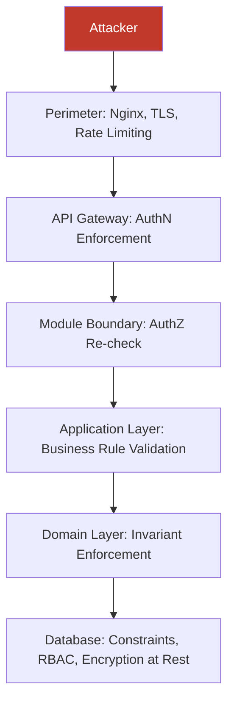

### Fail Secure

When a control cannot make a confident decision — an authorization check errors, a validation step times out, an external dependency is unreachable — the system fails **closed**, denying the action, never fails **open** by defaulting to permission. A payment that cannot be authorized is rejected, not silently approved; a request whose role cannot be resolved is denied, not treated as trusted.

### Secure Defaults

Every new service, endpoint, field, and configuration value starts in its most restrictive state and is deliberately, explicitly opened only as far as a real requirement demands — directly extending Secure by Default from `ai-docs/02-engineering-principles.md`. An endpoint is private until explicitly made public. A CORS policy allow-lists specific origins; it is never a wildcard in any shared environment.

### Continuous Verification

Security is never a one-time certification. Dependency scans run on every push. Secret scans run on every push and pull request. Penetration testing and security audits run on a defined recurring schedule, independent of any single release, per the Security Vision in `ai-docs/00-project-vision.md`. A system is only as secure as its most recent verification, and Arwal treats "we checked once, at launch" as a false sense of safety, not a security program.

> **Callout — The One-Sentence Security Philosophy**
> *"Assume every layer might fail, trust nothing by default, grant nothing beyond what's needed, and verify continuously — because a citizen's identity, health, and money depend on it being true every day, not just on launch day."*

---

# Threat Model

Arwal's threat model is organized around the specific reality of a district-scale civic-commerce platform: high-value data (identity, payments, health, government records), a large and technically heterogeneous user base, a Modular Monolith with an eventual microservices migration path, and an AI layer with its own distinct risk surface.

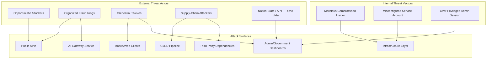

### OWASP Top 10 (Web Application Risk)

Every category of the OWASP Top 10 is treated as a standing, current risk against Arwal's API and web surfaces, not a checklist reviewed once:

| Risk | Arwal-Specific Manifestation | Primary Mitigation (this document) |
|---|---|---|
| **Broken Access Control** | A citizen accessing another citizen's booking, wallet, or application by ID manipulation | Authorization Standards — resource-ownership checks at the Application Layer, every time |
| **Cryptographic Failures** | Payment or health data transmitted or stored without adequate encryption | Data Protection Standards — encryption in transit and at rest, mandatory key management |
| **Injection** | SQL, command, or template injection via a booking note, a search filter, or an uploaded document's metadata | Secure Coding Standards — parameterized queries, strict input validation |
| **Insecure Design** | A feature shipped without its authorization model considered from the start | Security by Design philosophy; Architecture Review Workflow (`ai-docs/07-development-workflow.md`) |
| **Security Misconfiguration** | A wildcard CORS policy, a debug endpoint left enabled in production, an over-permissive S3-equivalent bucket policy | Infrastructure Security — secure defaults, hardening baselines |
| **Vulnerable and Outdated Components** | An unpatched dependency in `packages/*` or a transitive dependency with a known CVE | Dependency Security — continuous scanning, SBOM |
| **Identification and Authentication Failures** | Weak session handling, missing MFA on a government-officer account, token replay | Authentication Standards |
| **Software and Data Integrity Failures** | An unsigned CI/CD artifact, a tampered dependency, an unverified webhook payload | Dependency Security; Supply-Chain Protection |
| **Security Logging and Monitoring Failures** | An account-takeover pattern that goes unnoticed for weeks because no anomaly detection exists | Logging & Audit Standards; Monitoring & Incident Detection |
| **Server-Side Request Forgery (SSRF)** | A "fetch this document URL" feature (e.g., a government form attachment) used to probe internal infrastructure | Secure Coding Standards — SSRF prevention |

### API-Specific Attacks

Given Arwal's API-first architecture (`ai-docs/03-system-architecture-principles.md`), APIs are the platform's largest attack surface: broken object-level authorization (a citizen fetching another citizen's resource by guessable ID), excessive data exposure (returning a full internal entity instead of a scoped DTO), lack of rate limiting enabling brute-force or scraping, and mass assignment (a client-supplied field silently overwriting a server-controlled one, such as a role or price).

### Credential Theft

Phishing, credential stuffing (using breached password lists against Arwal's login), session hijacking, and token theft via a compromised client device are all standing risks against a platform with over a million eventual citizen accounts spanning a wide range of digital literacy — a population explicitly identified in `ai-docs/01-product-goals.md` as including first-generation smartphone users less likely to detect a phishing attempt.

### Insider Threats

A government officer, platform administrator, or engineer with legitimate elevated access misusing that access — viewing a citizen's health record without cause, approving a fraudulent government application, or exfiltrating payment data — is treated as a distinct threat category requiring its own controls (audit trails, least privilege, separation of duties), not merely an extension of external-attacker defenses.

### Supply-Chain Attacks

A compromised npm package, a poisoned base Docker image, a malicious CI/CD Action, or a compromised third-party SaaS integration (per the Third-Party Service Policy in `ai-docs/09-tech-stack.md`) can inject malicious code or exfiltrate secrets without ever touching Arwal's own repository directly — a category of risk that has grown to rival direct application-layer attacks industry-wide.

### AI-Specific Risks

Arwal's AI Gateway Service (`ai-docs/09-tech-stack.md`) introduces a threat category distinct from traditional web application risk: prompt injection (a citizen's input manipulating an AI assistant into ignoring its instructions or leaking another citizen's data), model abuse (using a civic assistant to generate harmful or misleading content), and training/inference-time data leakage.

### Infrastructure Attacks

Container escape, misconfigured network segmentation allowing lateral movement between modules' data stores, exposed management interfaces, and denial-of-service targeting the API Gateway or database connection pool are all threats specific to Arwal's containerized, cloud-native infrastructure (`ai-docs/09-tech-stack.md`).

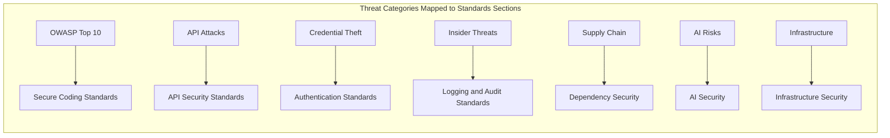

---

# Authentication Standards

Authentication is enforced exclusively through the unified Authentication shared service defined in `ai-docs/03-system-architecture-principles.md` — no module ever implements its own authentication logic, per the Authentication principle in `ai-docs/02-engineering-principles.md`.

### JWT (Access Tokens)

Access tokens are JSON Web Tokens signed with an asymmetric algorithm (RS256), per `ai-docs/09-tech-stack.md`. Every JWT includes, at minimum: `sub` (subject/actor ID), `role`, `iat`/`exp` (issued-at and expiry), and `iss` (issuer). Access tokens are short-lived — minutes, not hours — so that a leaked token has a narrow window of usability. Every module validates a JWT's signature, expiry, and issuer independently at its own boundary (defense in depth), never trusting that the API Gateway's validation alone is sufficient.

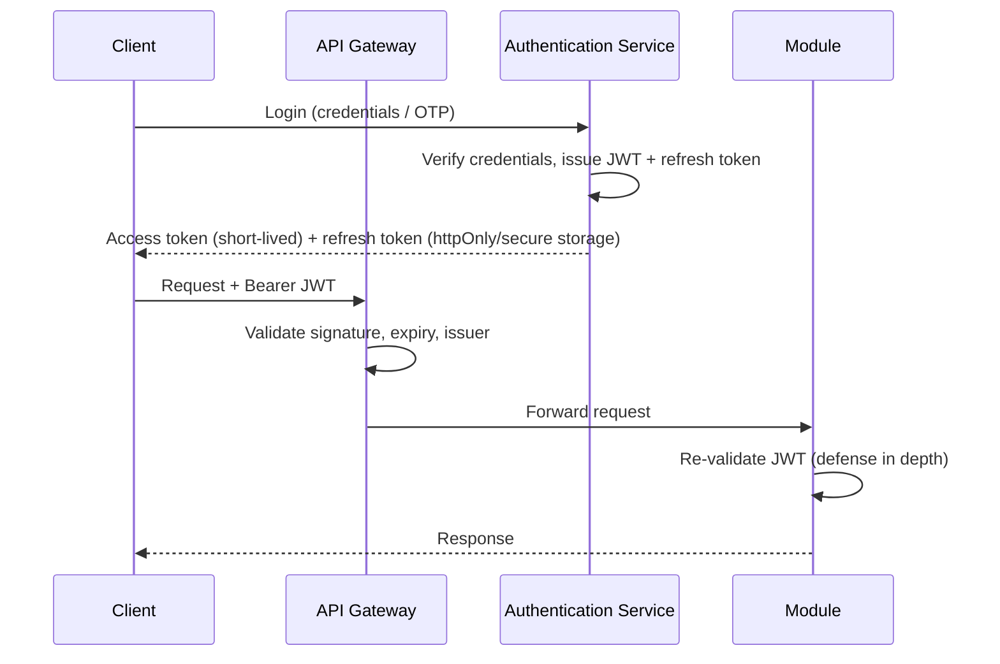

### Refresh Tokens

Refresh tokens are long-lived but single-use and rotated on every exchange — a used refresh token is immediately invalidated, so a replayed, stolen refresh token is detectable (its reuse signals compromise) and rejected. Refresh tokens are stored server-side (Redis-backed, per `ai-docs/09-tech-stack.md`) and never persisted in `localStorage`/`sessionStorage`; web clients hold them in secure, `httpOnly`, `SameSite` cookies, and mobile clients hold them in the platform's secure credential storage (Android Keystore / iOS Keychain).

### Multi-Factor Authentication (MFA)

MFA is mandatory for every account with elevated privilege — platform administrators and government officers — and is strongly encouraged, with low-friction delivery (SMS/WhatsApp OTP), for citizen accounts performing high-value actions (large payments, identity changes, civic application submission). MFA is never optional for an account that can access another actor's data or perform an irreversible financial or civic action. Given the accessibility commitments in `ai-docs/00-project-vision.md`, MFA delivery is designed around what a low-literacy, entry-level-device citizen can reliably use — OTP over SMS/WhatsApp, not an authenticator-app requirement, for citizen-facing flows.

### Password Policy

Password-based authentication is reserved for administrative and government-officer accounts; citizen accounts default to OTP/passwordless flows per the low-literacy accessibility commitments already established. Where a password is used:

- Minimum 12 characters, checked against a breached-password list (not merely a complexity regex) before acceptance.
- Hashed using Argon2id (per `ai-docs/09-tech-stack.md`), never a legacy or unsalted algorithm.
- No mandatory periodic rotation absent evidence of compromise — forced rotation without cause is deprecated industry practice that encourages weaker, incrementally-varied passwords, per current OWASP guidance.
- Account lockout / exponential backoff after repeated failed attempts, to blunt brute-force and credential-stuffing attacks, without permanently locking out a legitimate citizen (a time-based cooldown, not an indefinite lock, to avoid a denial-of-service vector against the citizen themselves).

### OTP (One-Time Passcodes)

OTPs are numeric, time-bound (a short validity window, typically 5–10 minutes), single-use, and rate-limited per actor and per phone number/channel to prevent both brute-force guessing and SMS-bombing abuse. An OTP is never logged in plaintext, per the Logging Standards in `ai-docs/05-coding-standards.md`.

### Session Management

A session is represented by the access token / refresh token pair described above — there is no separate, parallel server-side session store to keep in sync, avoiding a class of session-fixation and state-drift bugs. A citizen can view and revoke active sessions (logged-in devices) from their account, and a revoked session's refresh token is immediately invalidated. Sensitive actions (payment, government application submission, identity change) require the access token to be recently issued — an old-but-not-yet-expired token is insufficient for the highest-risk actions, requiring a fresh re-authentication step.

### Token Rotation

Access tokens are never renewed by extending their expiry — a new access token is always issued fresh from a valid refresh token exchange, keeping the short-lived guarantee meaningful. Signing keys themselves are rotated on a defined schedule (see Key Management below), with a documented overlap window during which both the old and new key are accepted for validation, so in-flight tokens are not invalidated mid-rotation.

---

# Authorization Standards

Authentication answers "who is this actor?" Authorization answers "is this actor allowed to do this, to this specific resource?" — and the two are never conflated, per the Authorization principle in `ai-docs/02-engineering-principles.md`.

### Role-Based Access Control (RBAC)

Roles (`citizen`, `merchant`, `service-provider`, `delivery-partner`, `government-officer`, `admin`) are defined centrally in the Identity/Authorization shared services, per `ai-docs/09-tech-stack.md`, and every protected operation declares which role(s) may invoke it. Role checks happen at the Application Layer of the use case handling the request — never assumed from the request simply having reached a controller, and never enforced solely at the UI layer, which is trivially bypassable.

### Resource Ownership

RBAC alone is insufficient wherever an actor's role permits an action in general but the specific resource must also belong to (or be assigned to) that actor — a citizen with the `citizen` role may cancel bookings, but only **their own** booking. Every operation touching another actor's data includes an explicit resource-ownership check, exactly as illustrated in the Authorization example in `ai-docs/05-coding-standards.md`.

```typescript
async execute(dto: CancelBookingDto, actor: AuthenticatedActor): Promise<void> {
  const booking = await this.bookingRepository.findById(dto.bookingId);
  if (!booking) throw new BookingNotFoundError(dto.bookingId);
  if (booking.citizenId !== actor.id && !actor.hasRole("admin")) {
    throw new UnauthorizedBookingAccessError(actor.id, booking.id);
  }
  booking.cancel(new Date());
  await this.bookingRepository.save(booking);
}
```

### Fine-Grained Permissions

Beyond role and ownership, certain operations require attribute-based checks — a government officer may only act on applications assigned to their specific department, not every civic application platform-wide. Fine-grained permission checks are expressed explicitly as domain rules (per the Domain Layer's business-rule ownership in `ai-docs/03-system-architecture-principles.md`), never inferred implicitly from a role name alone.

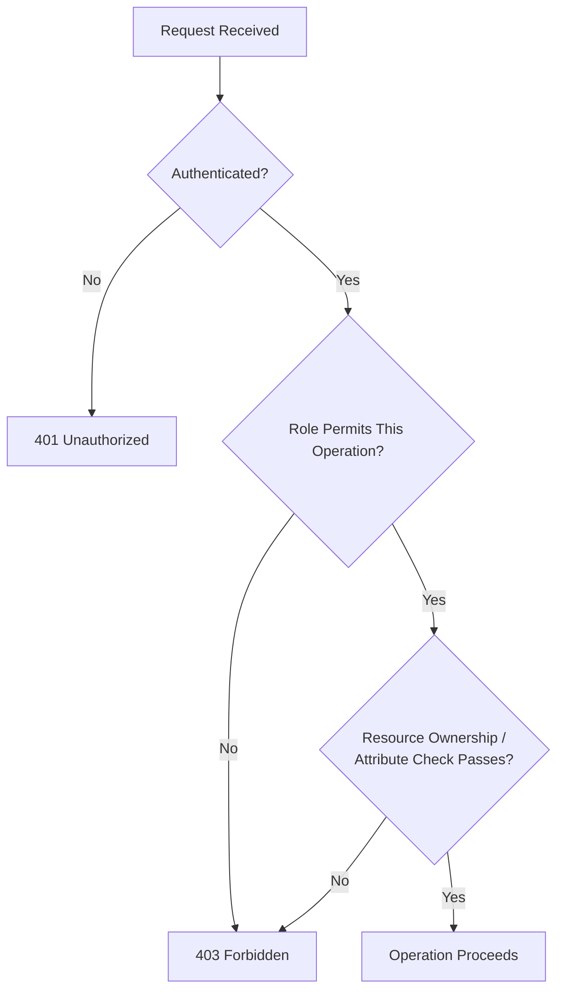

### Admin Privileges

Administrative and government-officer accounts follow the principle of least privilege at a granular level — a support agent handling dispute resolution does not automatically hold the same permissions as an engineer with database access, and a department officer's access is scoped to their specific department's applications, not the entire civic module. Elevated privilege actions (issuing a refund, overriding a fraud flag, accessing another citizen's record for support purposes) require explicit justification captured in the immutable audit log (see Logging & Audit Standards), and — for the highest-risk actions — a second-person approval (four-eyes principle) before execution.

### Service-to-Service Authorization

Consistent with Zero-Trust Between Modules (`ai-docs/03-system-architecture-principles.md`), every internal service-to-service call — whether an in-process call inside the Modular Monolith or a network call post-extraction — carries its own service identity and scoped credential, never a shared "god credential." A service account's permissions are scoped narrowly to the specific data and operations that service genuinely requires (e.g., the Notifications service can read citizen contact preferences but never wallet balances).

---

# Secure Coding Standards

These standards extend the Security Coding Standards in `ai-docs/05-coding-standards.md` with the full breadth of secure-coding practice required at Arwal's scale.

### Input Validation

Every external input — request body, query/path parameter, header, file upload, event payload — is validated against an explicit schema (Zod, per `ai-docs/09-tech-stack.md`) at the Presentation Layer boundary before it is trusted anywhere downstream. Validation is allow-list based wherever possible (accept known-good patterns) rather than deny-list based (block known-bad patterns), since a deny-list is inherently incomplete against novel attack payloads.

### Output Encoding

Data rendered back to a client is encoded appropriately for its output context — HTML-encoded when rendered into a web page, JSON-escaped when returned in an API response, URL-encoded when embedded in a redirect — so that data originating from one citizen can never be interpreted as executable markup or script when displayed to another.

### SQL Injection Prevention

Every database access goes through Prisma's parameterized query mechanism (per `ai-docs/09-tech-stack.md` and the SQL Injection Prevention standard in `ai-docs/05-coding-standards.md`); raw string concatenation of externally influenced values into a query is forbidden without exception, and any genuinely necessary raw SQL uses parameterized placeholders only.

### XSS Prevention

Frontend code never renders unsanitized, user-supplied HTML via `dangerouslySetInnerHTML` or an equivalent mechanism without passing through the shared, audited sanitization utility first. User-generated text (a review, a dispute message, a form response) is rendered as text by default, relying on React's automatic escaping — the safe default is never deliberately bypassed for visual convenience.

### CSRF (Cross-Site Request Forgery)

Every state-changing browser-originated request (`POST`, `PATCH`, `PUT`, `DELETE`) is protected by the shared CSRF-token mechanism wired into the API Gateway and the frontend's data-fetching layer, per `ai-docs/05-coding-standards.md`. `SameSite=Strict` (or `Lax` where a cross-site redirect flow genuinely requires it) is set on all session-relevant cookies as a second, independent layer of CSRF defense.

### SSRF (Server-Side Request Forgery)

Any feature that causes the backend to fetch a URL on the caller's behalf — retrieving a linked document, validating a webhook, fetching an image from a citizen-supplied URL — validates the target against an explicit allow-list of permitted schemes/hosts, rejects requests to private/internal IP ranges (link-local, loopback, RFC 1918 address space) by default, and never follows redirects blindly to an unvalidated destination. This directly protects the internal network topology described in `ai-docs/03-system-architecture-principles.md` from being probed via an otherwise-legitimate feature.

```typescript
// Rejected — no validation, allows fetching internal infrastructure
const response = await fetch(userSuppliedUrl);

// Required — validated against an allow-list, private ranges blocked
const url = validateExternalUrl(userSuppliedUrl); // throws on private IP ranges, disallowed schemes
const response = await fetch(url, { redirect: "error" });
```

### Command Injection

Application code never constructs a shell command by concatenating externally influenced input. Where invoking an external process is genuinely unavoidable, arguments are passed as a discrete, validated array (never a single interpolated string executed through a shell), and the specific business justification for shelling out at all is documented, since this pattern is rare and reviewed with elevated scrutiny by default.

### File Upload Validation

Every file upload (KYC documents, government form attachments, product images) is validated for: declared vs. actual file type (magic-byte verification, not filename extension alone), a maximum size limit appropriate to the upload's purpose, and — for image/document types — a re-encoding or sanitization pass before storage, to strip potentially malicious embedded content (e.g., a polyglot file). Uploaded files are stored via the File Storage shared service (`ai-docs/03-system-architecture-principles.md`) with a generated, non-guessable identifier — never served directly from a path derived from the original, user-supplied filename.

### Deserialization Risks

Application code never deserializes data from an untrusted source into a native object graph using a mechanism that can execute arbitrary code as a side effect of deserialization (e.g., unsafe deserialization of a custom binary format). JSON parsing via the standard, well-audited `JSON.parse` (in combination with schema validation immediately afterward) is the only accepted approach for untrusted structured input.

### Secrets Management

No secret, API key, or credential is ever written into source code, a config file committed to the repository, or a log statement, per `ai-docs/02-engineering-principles.md`'s Secrets Management principle and the Git Ignore Policy in `ai-docs/06-git-workflow.md`. Secrets are read exclusively through the shared runtime configuration-loading module, sourced from a dedicated secrets-management system, scoped as narrowly as possible to the service that needs them, and rotated on a defined schedule (see Key Management below).

---

# API Security Standards

These standards extend the API Coding Standards in `ai-docs/05-coding-standards.md` specifically from a security lens, given that APIs are Arwal's primary and most exposed attack surface.

### HTTPS Only

Every environment beyond local development enforces TLS exclusively — no endpoint accepts plaintext HTTP in staging or production, per `ai-docs/09-tech-stack.md`. HTTP requests are redirected to HTTPS at the Nginx layer, `HSTS` is set with a long max-age, and TLS 1.2 is the minimum accepted protocol version with modern cipher suites only.

### Rate Limiting

Rate limiting is enforced at two layers, per `ai-docs/09-tech-stack.md`: coarse-grained, IP/route-based limiting at the Nginx/API Gateway layer to absorb abusive or automated traffic before it reaches application code, and fine-grained, per-actor/per-endpoint limiting inside the application for sensitive operations (login attempts, OTP requests, payment initiation) where a stricter limit than the coarse gateway limit is warranted. A `429 Too Many Requests` response is returned with a `Retry-After` header, never a silent drop.

### API Versioning

Every public API is explicitly versioned (`/v1/...`), per `ai-docs/05-coding-standards.md` — a security-relevant discipline in its own right, since an unversioned API forces every client onto whatever the current implementation happens to do, making a security-motivated breaking change (e.g., tightening a validation rule) impossible to roll out without silently breaking every consumer simultaneously.

### Request Validation

Every request is validated against its declared schema before any business logic executes, per the Input Validation standard above — including validating that no unexpected fields are present (rejecting, not silently ignoring, an unrecognized field), which closes the Mass Assignment vulnerability class where a client-supplied field could otherwise overwrite a server-controlled property (a role, a price, a status).

### Response Validation

API responses are constructed exclusively from explicit DTOs (per `ai-docs/05-coding-standards.md`), never by serializing an internal domain entity directly — this structurally prevents accidental over-exposure of internal-only fields (a password hash, an internal risk score, another actor's identifier) that a raw entity serialization could otherwise leak.

### Error Handling

Every API error follows the standard error envelope defined in `ai-docs/05-coding-standards.md`: a stable `code`, a citizen-safe `message`, and — only for validation-style errors — `details`. A raw stack trace, an internal exception message, or any implementation detail (database engine, internal file paths, internal library versions) is never present in any response reachable by a client, in any environment, since such detail is directly useful reconnaissance for an attacker.

### Idempotency

Every state-mutating operation reachable via client retry (payment processing, booking confirmation, government application submission) requires or generates an idempotency key, so a network retry or a duplicated client request produces the same effect as a single successful request rather than a duplicate charge, duplicate booking, or duplicate application — per the Idempotency resilience pattern in `ai-docs/03-system-architecture-principles.md`.

### Audit Logging

Every API request affecting sensitive data (identity, payments, health, government records) is logged to the immutable audit trail described in Logging & Audit Standards below, capturing the acting identity, the resource affected, the outcome, and a correlation ID — independent of, and never substitutable by, the application's operational logs.

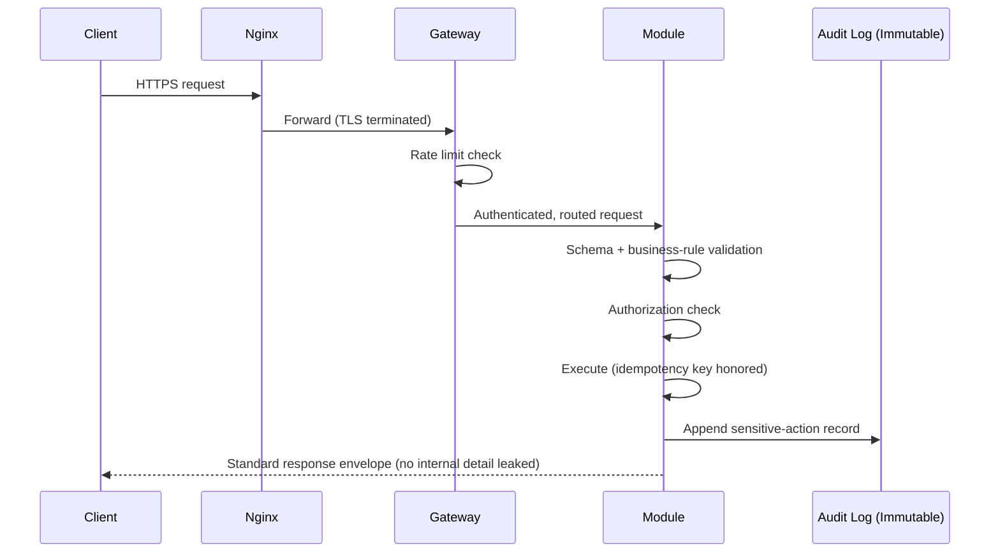

---

# Data Protection Standards

Arwal is a custodian of citizen identity, payment, and health data at a scale where a data-protection failure is not a technical incident alone — it is a direct breach of the civic trust `ai-docs/00-project-vision.md` commits the platform to never trade away.

### Encryption in Transit

TLS is mandatory for every network hop — citizen-to-Nginx, Nginx-to-API-Gateway, and every internal service-to-service call under the Zero-Trust model (`ai-docs/03-system-architecture-principles.md`), including internal traffic that a less rigorous system might leave unencrypted purely because it "stays inside the network."

### Encryption at Rest

Every sensitive domain's data — identity records, payment instruments and transaction history, health records, government application content — is encrypted at rest, using database-level (PostgreSQL) or storage-level (File Storage service) encryption backed by a dedicated key-management system, per `ai-docs/00-project-vision.md`'s Security Vision. Encryption at rest is a baseline for every domain, not only the highest-sensitivity ones — low-sensitivity data (e.g., public catalog listings) may use lighter-weight protections, but nothing in Arwal is stored deliberately unencrypted purely for convenience.

### PII Handling

Personally identifiable information (name, phone number, address, government ID numbers, health details) is never logged in plaintext (per the Logging Standards in `ai-docs/05-coding-standards.md`), never sent to a third-party SaaS integration without an explicit, reviewed data-processing justification (per the Third-Party Service Policy in `ai-docs/09-tech-stack.md`), and never included in an error message, analytics event, or any output not specifically designed and reviewed to carry it.

### Data Classification

Every data field owned by every module is classified into one of the following tiers at the time it is designed, per the Data Classification Drives Architecture principle in `ai-docs/03-system-architecture-principles.md`:

| Tier | Examples | Handling Requirement |
|---|---|---|
| **Restricted** | Government ID numbers, health records, payment instrument details, authentication credentials | Encrypted at rest and in transit; access logged in the immutable audit trail; strictest RBAC/ownership checks; never cached at the client or CDN layer |
| **Confidential** | Full name, phone number, address, wallet balance, booking history | Encrypted at rest and in transit; access authorization required; never exposed in a public API response |
| **Internal** | Internal risk scores, operational metrics, non-citizen-facing configuration | Access restricted to authenticated internal actors; not citizen-facing but not classified as sensitive personal data |
| **Public** | Published civic information, public catalog listings, public service-provider ratings | No special handling beyond standard integrity controls; safe for CDN caching and public API exposure |

### Data Minimization

Only the data genuinely required for a specific module's function is collected, stored, and shared — per the Data Minimization & Consent principle in `ai-docs/00-project-vision.md`. A module requesting a citizen's data from another module (per the Data Ownership Principles in `ai-docs/03-system-architecture-principles.md`) requests the minimum field set needed for its use case, never a wholesale copy "in case it's useful later" — the same YAGNI discipline from `ai-docs/02-engineering-principles.md`, applied to personal data.

### Backup Encryption

Every automated backup (per the Backup Strategy in `ai-docs/09-tech-stack.md`) is encrypted at rest using the same key-management standard as live production data — an unencrypted backup is treated as an unmitigated data-exposure risk equal in severity to an unencrypted production database, since a backup frequently persists longer and is replicated to more locations than the live system it was taken from.

### Key Management

Encryption keys are managed exclusively through a dedicated key-management system (KMS), never embedded in application configuration or source code, per the Encryption principle in `ai-docs/02-engineering-principles.md`. Keys are rotated on a defined schedule, access to key-management operations is itself subject to least-privilege and audit logging, and a key's compromise or scheduled rotation never requires re-encrypting the entire historical dataset in a single blocking operation — envelope encryption (a data-encryption key wrapped by a rotatable key-encryption key) is the standard pattern used to make rotation operationally feasible at scale.

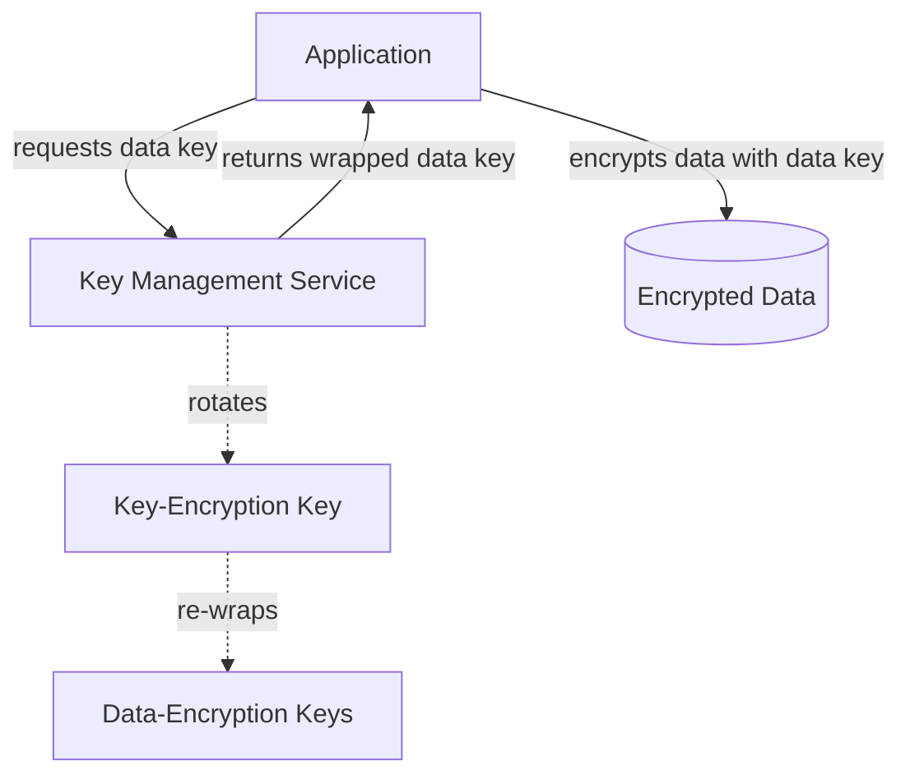

---

# Infrastructure Security

Infrastructure security makes the Docker, Nginx, and Linux choices in `ai-docs/09-tech-stack.md` concrete from a hardening perspective.

### Docker Security

Every container image is built from a minimal, official, actively-maintained base image — never an unverified or unofficial image pulled without review. Containers run as a non-root user by default; a container requiring elevated privilege is a documented, reviewed exception, never a default convenience. Images are scanned for known vulnerabilities as part of CI (see Dependency Security below) before being deployed to any environment, and unused build tools/dependencies are excluded from the final production image via multi-stage builds, minimizing the attack surface shipped to production.

### Linux Hardening

Underlying hosts run a hardened, minimal Linux configuration: unnecessary services and packages are not installed, the kernel and OS are kept current with the security-patch cadence per the Version Management Strategy in `ai-docs/09-tech-stack.md`, and host-level firewalling defaults to deny-all-inbound except the specific ports the deployed workload requires.

### Reverse Proxy

Every citizen-facing and internal service sits behind the Nginx reverse-proxy layer described in `ai-docs/09-tech-stack.md` — no service is ever directly exposed to the public internet, consistent with Zero-Trust and Perimeter Enforcement (`ai-docs/03-system-architecture-principles.md`). Nginx terminates TLS, applies coarse-grained rate limiting, and strips or rewrites headers that could otherwise leak internal implementation detail (server version banners, internal hostnames).

### Firewalls

Network-level firewalling (security groups / equivalent cloud-native constructs) enforces the principle that a service only accepts traffic from the specific sources it genuinely needs to — the database accepts connections only from the application tier's connection pool (PgBouncer, per `ai-docs/09-tech-stack.md`), never directly from the public internet or from an unrelated module's infrastructure.

### Network Segmentation

Modules' underlying data stores are segmented at the network layer to reinforce the logical Data Ownership boundaries already established in `ai-docs/03-system-architecture-principles.md` — even though schemas are logically separated within a shared cluster during the Modular Monolith phase, network-level access controls ensure that a compromised module's application tier cannot trivially reach another module's data store credentials or connection path, providing a defense-in-depth backstop to the logical ownership rule.

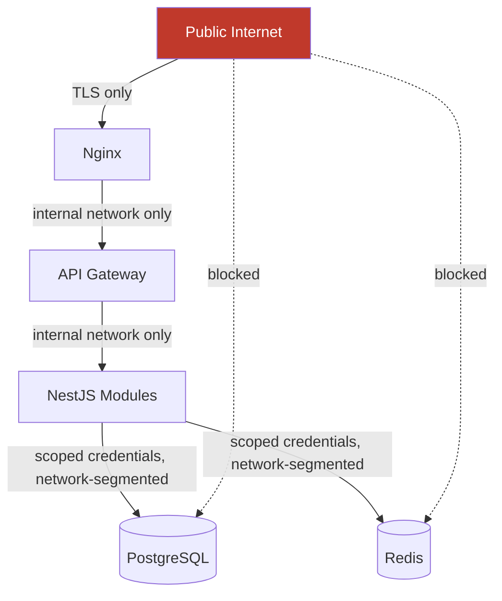

### Secrets Storage

Secrets (database credentials, API keys, signing keys) are stored exclusively in a dedicated secrets-management system integrated with the deployment platform, injected into a service's runtime environment at startup — never baked into a container image, never committed to the repository (per the Git Ignore Policy in `ai-docs/06-git-workflow.md`), and never passed as a plaintext command-line argument visible in process listings.

### Environment Isolation

`development`, `staging`, and `production` are fully isolated environments with distinct credentials, distinct data stores, and no shared secrets between them — a staging credential compromise never provides a path to production, and production data is never copied into a lower environment without anonymization, per the Large File Policy and Git Ignore Policy commitments against committing real citizen/merchant data in `ai-docs/06-git-workflow.md`.

---

# Dependency Security

Consistent with `ai-docs/07-development-workflow.md`'s Dependency Update Workflow, dependency security is treated as a continuous, automated discipline rather than a periodic manual audit.

### Vulnerability Scanning

Every dependency, direct and transitive, across every `apps/*` and `packages/*` workspace, is scanned automatically on every push and pull request, per the CI/CD Integration principles in `ai-docs/06-git-workflow.md`. A detected vulnerability above an agreed severity threshold blocks merge until remediated (an upgrade, a patch, or a documented, time-bound accepted-risk exception signed off by a security-context reviewer).

### Software Bill of Materials (SBOM)

Arwal generates and maintains a Software Bill of Materials for every deployable service, capturing every direct and transitive dependency and its version, as a build-time artifact. The SBOM makes it possible to answer, within minutes rather than days, "are we affected by this newly disclosed CVE?" — a capability that has become a baseline expectation for any platform handling payment and government data, not an optional maturity add-on.

### License Review

Every new dependency's license is checked against an approved-license allow-list before adoption, per the Technology Adoption Process in `ai-docs/09-tech-stack.md` — a dependency under a license incompatible with Arwal's commercial and civic distribution model is rejected regardless of its technical merit, since a license violation is a legal and civic-partnership risk in its own right.

### Supply-Chain Protection

Beyond scanning known vulnerabilities, Arwal treats the software supply chain itself as an attack surface: dependencies are pinned to specific, reviewed versions (never a floating `latest` tag in any deployed artifact); CI/CD pipeline actions/plugins are pinned to a specific commit SHA, not a mutable tag, to prevent a compromised upstream Action from silently altering pipeline behavior; and container base images are pulled from a verified, checksummed source, never an unauthenticated registry mirror.

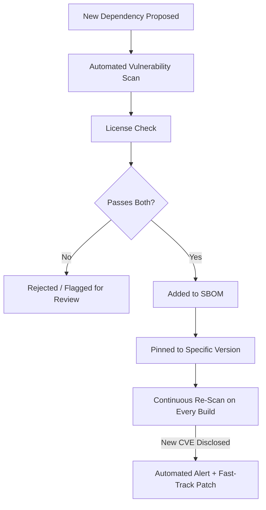

---

# Logging & Audit Standards

Logging and audit trails make security incidents detectable and investigable — a control that exists to close specific, previously observed failure modes (the account-takeover pattern no one noticed, the insider access no one could later prove or disprove), per the Logging Standards in `ai-docs/05-coding-standards.md` and the Audit Trails principle in `ai-docs/02-engineering-principles.md`.

### Structured Logging

Every service logs structured, machine-parseable events (JSON, never free-text interpolated strings), correlated by a trace/correlation ID propagated automatically across every module and asynchronous event a request touches, per the Observability Principles in `ai-docs/03-system-architecture-principles.md`.

### Audit Logs

Every sensitive state change — a payment, a government application status change, a health-record access, an identity change, an administrative override — is recorded in an **immutable, append-only** audit log, structurally separate from the mutable operational database row it describes, capturing: who performed the action, when, what changed, and (where applicable) why. The audit log is the mechanism that makes Auditability by Architecture (`ai-docs/03-system-architecture-principles.md`) a structural property rather than a hope.

### Sensitive Data Masking

No Restricted or Confidential-tier data (per the Data Classification table above) is ever written into an operational log statement, even inside a larger logged object — passwords, tokens, payment instrument numbers, government ID numbers, and health details are masked or omitted entirely, enforced by both code review and an automated log-scrubbing safeguard as a second line of defense, per `ai-docs/05-coding-standards.md`.

### Log Retention

Operational logs are retained long enough to support incident investigation and performance analysis (a defined window measured in weeks), while audit logs — given their civic, financial, and regulatory significance — are retained substantially longer, per applicable regulatory and data-retention requirements, and are never deleted as part of routine log rotation. Retention periods are documented explicitly per log category, never left to an ad hoc default.

### Tamper Resistance

The audit log is write-once/append-only at the storage layer — no application code path, including an administrative one, has the ability to modify or delete an existing audit entry. Where feasible, audit log integrity is additionally verifiable via cryptographic chaining or an equivalent tamper-evidence mechanism, so that even a compromised administrative credential cannot silently rewrite the platform's history of what happened.

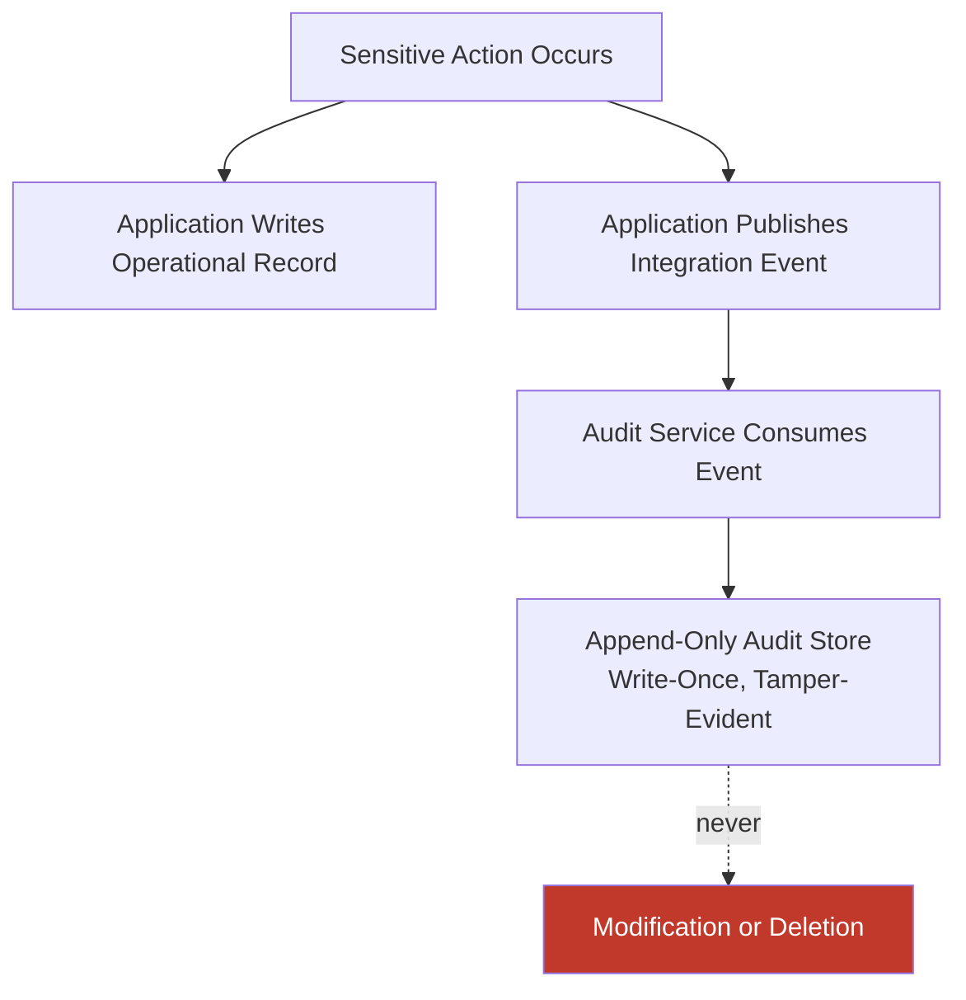

---

# Monitoring & Incident Detection

Monitoring exists to answer, continuously: **is the platform under attack, or already compromised, right now?** — extending the Logging and Monitoring Philosophy in `ai-docs/02-engineering-principles.md` specifically into the security domain.

### Security Monitoring

Beyond the golden-signal operational monitoring described in `ai-docs/03-system-architecture-principles.md` and `ai-docs/09-tech-stack.md`, security-specific signals are monitored continuously: authentication failure rates, authorization-denial rates, unusual data-access volume by a single actor, and known-malicious IP/user-agent patterns at the perimeter.

### Alerting

Security alerts are tuned deliberately to avoid both alert fatigue (too noisy, routinely ignored) and blind spots (too quiet, real incidents unnoticed), per the Actionable Alerting principle in `ai-docs/02-engineering-principles.md`. A security alert is routed to an on-call rotation with an explicit, rehearsed response expectation — never left to be discovered incidentally in a dashboard days later.

### Anomaly Detection

Behavioral anomaly detection (a citizen account suddenly accessing an unusual volume of other citizens' public data, a service account making calls outside its normal pattern, a spike in failed authentication attempts against a specific account) is layered on top of static, rule-based alerting, directly extending the Trust & Fraud Intelligence AI Vision capability in `ai-docs/00-project-vision.md` into a security-monitoring context — with the same AI Principle requirement that any automated flag remains human-reviewable and overridable, never an unreviewable autonomous block.

### Intrusion Detection

Network- and host-level intrusion detection monitors for known attack signatures, unexpected outbound connections (a potential sign of data exfiltration or a compromised dependency phoning home), and unauthorized configuration changes to production infrastructure — providing a detection layer independent of the application's own logging, so that a sufficiently sophisticated compromise of the application layer itself does not also blind the platform's ability to detect it.

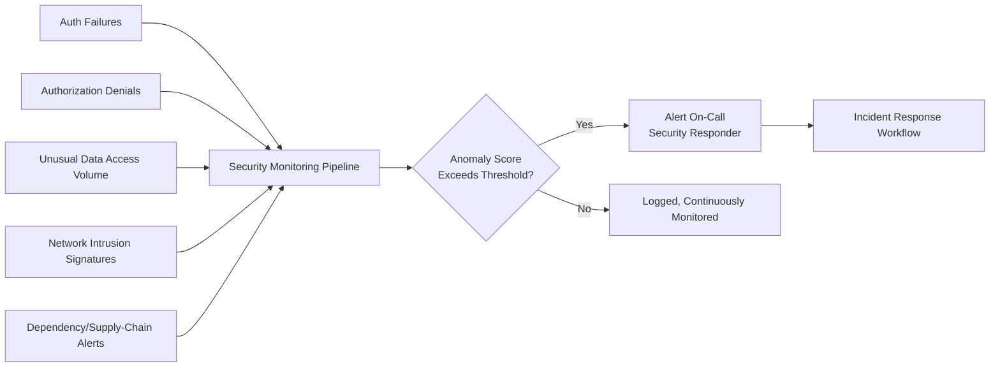

---

# Incident Response

Security incident response extends the Incident Response Workflow in `ai-docs/07-development-workflow.md` with security-specific severity criteria and response obligations, per the Incident Response Readiness commitment in `ai-docs/00-project-vision.md`.

### Severity Levels

| Severity | Definition | Example | Response Target |
|---|---|---|---|
| **Sev 1 — Critical** | Active data breach, confirmed unauthorized access to Restricted-tier data, or a live exploit affecting citizen safety/funds | Citizen payment data exfiltrated; government credential compromise; active account-takeover campaign | Immediate — incident declared, all-hands response |
| **Sev 2 — High** | A confirmed vulnerability with a viable exploitation path, not yet observed as actively exploited | A critical CVE in a production dependency; a discovered but unexploited authorization bypass | Same business day; expedited patch + review |
| **Sev 3 — Medium** | A security weakness with limited exploitability or limited data exposure | A missing rate limit on a low-risk endpoint; a misconfigured but non-exploited header | Scheduled into the current or next sprint |
| **Sev 4 — Low** | A hardening opportunity with no demonstrated exploitability | A dependency with a low-severity advisory and no known exploit; a minor logging gap | Backlog; tracked technical debt |

### Response Workflow

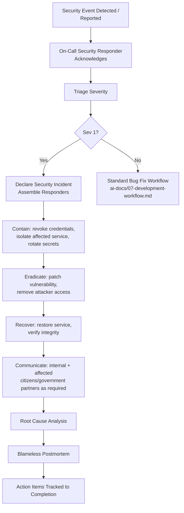

### Communication

Communication follows Transparency over Opacity (`ai-docs/00-project-vision.md`): affected citizens, merchants, and government partners are notified accurately and as promptly as containment allows, consistent with applicable breach-notification obligations — Arwal does not delay disclosure to protect its own reputation, and does not overstate uncertainty to appear more in control than the facts support.

### Recovery

Recovery prioritizes restoring citizen-facing service safely over restoring it quickly — a service is not returned to full operation until the specific vulnerability or attacker foothold that caused the incident has been eradicated and verified closed, not merely mitigated. Idempotent operations (per `ai-docs/03-system-architecture-principles.md`) make recovery actions like credential rotation and service restart safe to perform without introducing duplicate financial or civic side effects.

### Postmortem

Every Sev 1 and Sev 2 security incident receives a blameless postmortem, per `ai-docs/00-project-vision.md`'s Blameless Postmortems commitment, capturing the timeline, root cause, what worked in the response, what didn't, and concrete, owned action items — never treated as a symbolic exercise or a document that is written once and never revisited.

---

# AI Security

Arwal's AI Gateway Service (`ai-docs/09-tech-stack.md`) introduces a security surface distinct from traditional web application risk, and is governed by the AI Principle in `ai-docs/00-project-vision.md`: AI must always be explainable and overridable by a human process.

### Prompt Injection

A citizen's input to an AI-assisted feature (the future Civic Assistant, an AI-powered search/discovery feature) is never trusted to be free of adversarial instructions embedded within it — a prompt-injection attempt might try to make the assistant ignore its system instructions, reveal another citizen's data, or produce harmful content. Mitigations include strict separation between trusted system instructions and untrusted user input at the prompt-construction layer, output validation before any AI-generated content reaches a citizen or triggers a downstream action, and never granting an AI-assisted feature direct, unmediated access to sensitive operations (a civic assistant can draft a form; it cannot itself submit or approve a government application).

### Model Abuse

AI capabilities are rate-limited and monitored for abuse patterns — using a civic assistant to generate spam, harassment, misinformation, or content designed to defraud another citizen. The AI Gateway Service applies content-safety checks on both input and output, consistent with the same evenhandedness and harm-avoidance principles that govern Arwal's broader Trust & Fraud Intelligence commitments in `ai-docs/00-project-vision.md`.

### Data Leakage

The AI Gateway Service's provider-agnostic architecture (`ai-docs/09-tech-stack.md`) is also a security boundary: no citizen-sensitive data is sent to an external model provider without an explicit, reviewed data-processing justification, mirroring the Third-Party Service Policy's scrutiny for any SaaS integration. Prompts and completions involving Restricted or Confidential-tier data are never logged in a location outside Arwal's own governed audit infrastructure, and are never used to fine-tune or improve a third-party provider's general-purpose model without an explicit, separately reviewed data-sharing agreement.

### Human Oversight

Per the AI Principle in `ai-docs/00-project-vision.md`, no citizen may be denied a government service, blocked from a transaction, or penalized in reputation solely by an opaque automated decision without a human appeal path. Every AI-influenced decision affecting civic access, financial standing, or reputation is designed from its first implementation with a reachable human review/override mechanism — this is a Feature Definition of Done requirement (`ai-docs/08-definition-of-done.md`) for any AI-touching capability, never an optional later addition.

### Provider Isolation

Domain modules never call a third-party AI provider's SDK directly — every call is routed through the AI Gateway Service's internal, provider-agnostic contract, per `ai-docs/09-tech-stack.md`. This isolation is a security control as much as an architectural one: it means a provider-specific vulnerability, outage, or policy change is contained to the Gateway's Infrastructure Layer and never becomes an incident that touches every domain module that happens to use AI.

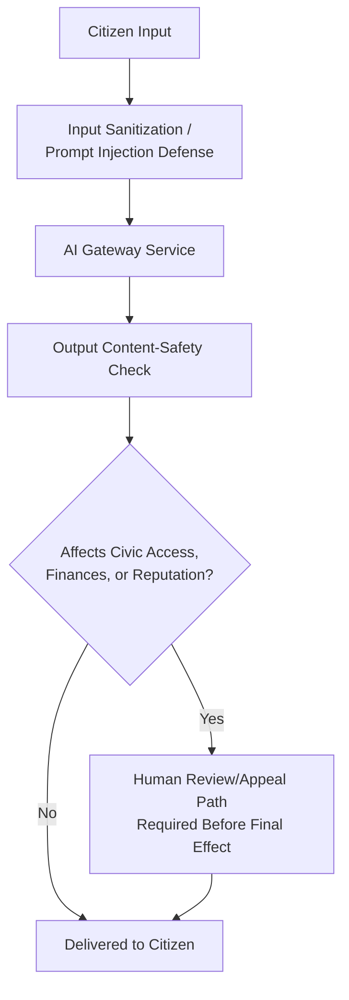

---

# Compliance Considerations

Arwal treats compliance as the floor its security program is measured against, not the ceiling it aspires to — the Security Standards in this document are, in every section, designed to exceed baseline regulatory requirements rather than merely satisfy them.

### OWASP ASVS

The OWASP Application Security Verification Standard (ASVS) serves as Arwal's structured self-assessment framework for verifying the controls described throughout this document — authentication, session management, access control, input validation, cryptography, and error handling are all mapped to their corresponding ASVS verification requirements during security review, giving reviewers and auditors a globally recognized reference point rather than an Arwal-only rubric.

### OWASP Top 10

The OWASP Top 10 (referenced in the Threat Model above) is treated as a living, periodically-refreshed checklist against which Arwal's threat model and mitigations are re-validated whenever OWASP publishes an updated edition — never adopted once and left static as the industry's understanding of prevalent risk evolves.

### Privacy Principles

Consistent with the Data Minimization & Consent principle in `ai-docs/00-project-vision.md`, Arwal's data handling is designed around core privacy principles applicable across jurisdictions: purpose limitation (data is used only for the purpose it was collected for), storage limitation (data is retained only as long as necessary, per the Data Classification and Retention standards above), and citizen control (citizens can view, correct, and — where civic/financial record-keeping obligations do not override it — request deletion of their own data).

### Audit Readiness

Because ADRs (`ai-docs/02-engineering-principles.md`, `ai-docs/03-system-architecture-principles.md`), immutable audit logs (this document), and the Definition of Done's security gates (`ai-docs/08-definition-of-done.md`) are continuously maintained rather than reconstructed under pressure, Arwal is structurally prepared for a government or regulatory security audit at any point in its lifecycle — audit readiness is a by-product of consistently following this document, not a separate, periodic scramble.

---

# Security Review Checklist

Every change touching authentication, authorization, payment processing, citizen/health/government data, or infrastructure configuration is checked against the following before it is considered secure and Done, extending the Security Definition of Done in `ai-docs/08-definition-of-done.md`:

- [ ] **Authentication** — Every protected endpoint enforces authentication via the unified Authentication service; no module implements its own auth logic.
- [ ] **Authorization** — Every operation touching another actor's data has an explicit role, ownership, and (where applicable) attribute-based check at the Application Layer.
- [ ] **Input validation** — Every external input is validated against an explicit schema at the boundary before use; no unexpected/mass-assignment fields are silently accepted.
- [ ] **Injection defenses** — No raw SQL concatenation, no unsanitized shell command construction, no unsafe deserialization of untrusted input.
- [ ] **XSS/CSRF/SSRF defenses** — Output is context-encoded; state-changing requests are CSRF-protected; any server-side URL fetch is validated against an allow-list and private-IP ranges are blocked.
- [ ] **Secrets handling** — No credential, key, or secret appears in the diff, a config file, or a log statement; all secrets are sourced through the shared runtime configuration module.
- [ ] **Data classification honored** — Every new or modified field is classified (Restricted/Confidential/Internal/Public) and handled per its tier's requirements.
- [ ] **Encryption** — Sensitive data is encrypted in transit and at rest; keys are managed through the KMS, never embedded in code or config.
- [ ] **Logging and audit** — Sensitive state changes are recorded in the immutable audit log; no Restricted/Confidential data appears in operational logs.
- [ ] **Dependency and secret scans** — Automated scans are clean, or any finding has a documented, approved, time-bound remediation plan.
- [ ] **Rate limiting and idempotency** — Sensitive or retry-prone operations are rate-limited and idempotent where applicable.
- [ ] **AI-specific checks (where applicable)** — Prompt injection defenses are in place; no unmediated sensitive-data exposure to a third-party model provider; a human override path exists for any AI-influenced civic/financial/reputation decision.
- [ ] **Elevated review completed** — Any change touching `payments`, `identity`, or `civic-services` domain logic, or the AI Gateway Service, has been reviewed by an engineer with security context, per `ai-docs/06-git-workflow.md`.
- [ ] **Incident-readiness verified** — Monitoring, alerting, and audit logging are in place for the change before it reaches production, so a future incident involving this change would be detectable, not discovered by a citizen complaint.

A change failing any item above is not secure and is not Done, per the non-negotiable authority already established by the Universal Definition of Done in `ai-docs/08-definition-of-done.md`.

---

# Closing Statement

> **Callout — Closing Statement**
> Every preceding phase document described a dimension of how Arwal is built well; this document describes how Arwal is built *safely* — for a citizen whose identity, health record, government application, and wallet balance depend on that safety being real, verified, and continuously maintained, not merely asserted. Security at Arwal is not a phase that concludes; it is a standard that every one of the ~300 micro-phases still ahead is measured against, from the first line of a new module to the millionth citizen's daily use of the platform. A feature that is fast, elegant, and functionally correct but insecure has not met Arwal's Definition of Done, regardless of how it appears in a demo — because a district's trust, once broken by a security failure, is far harder to rebuild than any feature is to ship. Where a future phase must deviate from a standard stated here, that deviation is made explicitly — through a documented, security-context-reviewed exception, or an Architectural Decision Record where the deviation is structural — never silently, and never by default.

This document, `ai-docs/10-security-standards.md`, is the eleventh phase of approximately 300. Every authentication flow, authorization check, API endpoint, database schema, infrastructure configuration, and AI-assisted capability built in the phases that follow is expected to satisfy the standards defined here, or to justify its deviation in writing.

**End of Phase 11 — `ai-docs/10-security-standards.md`**
