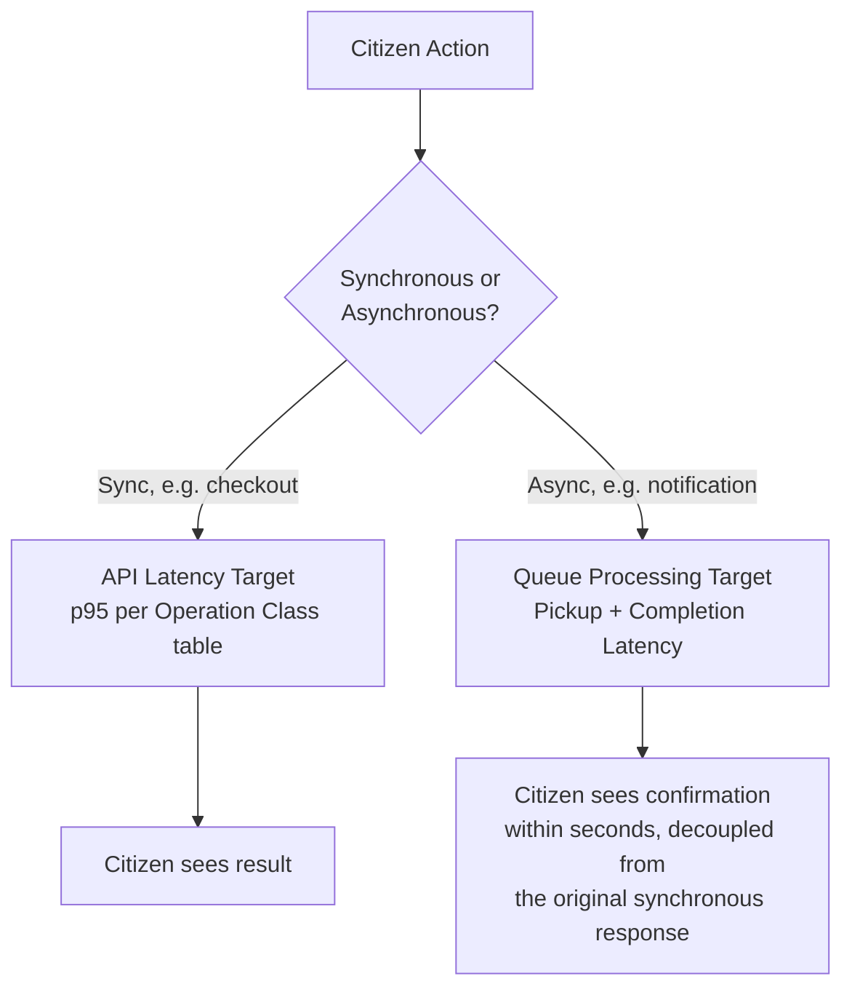
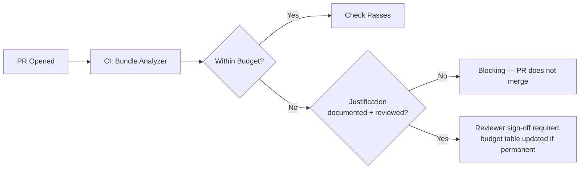
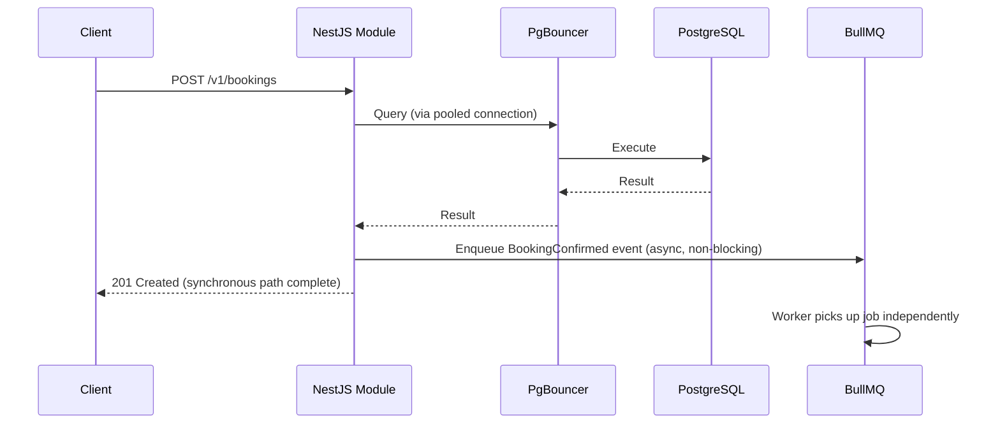
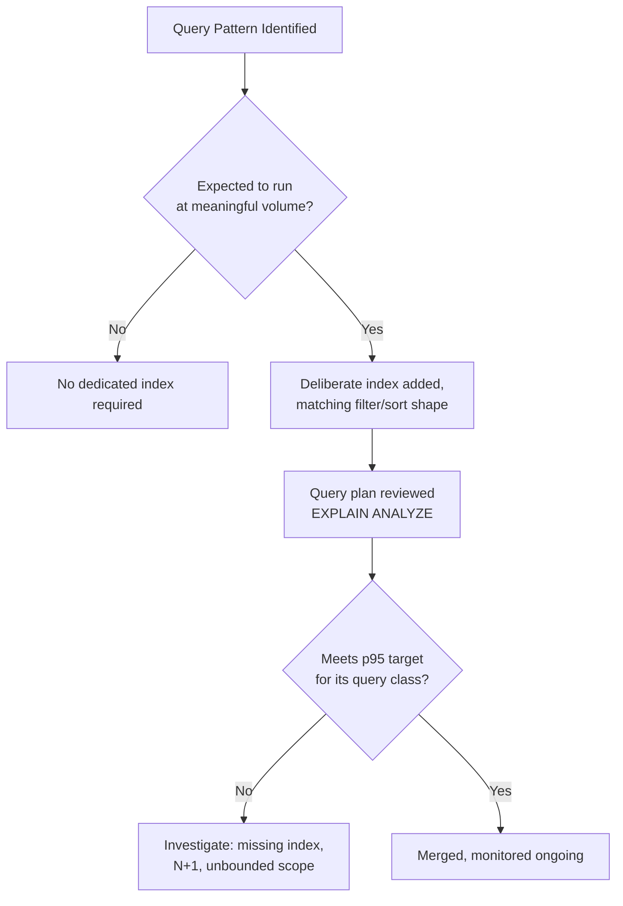
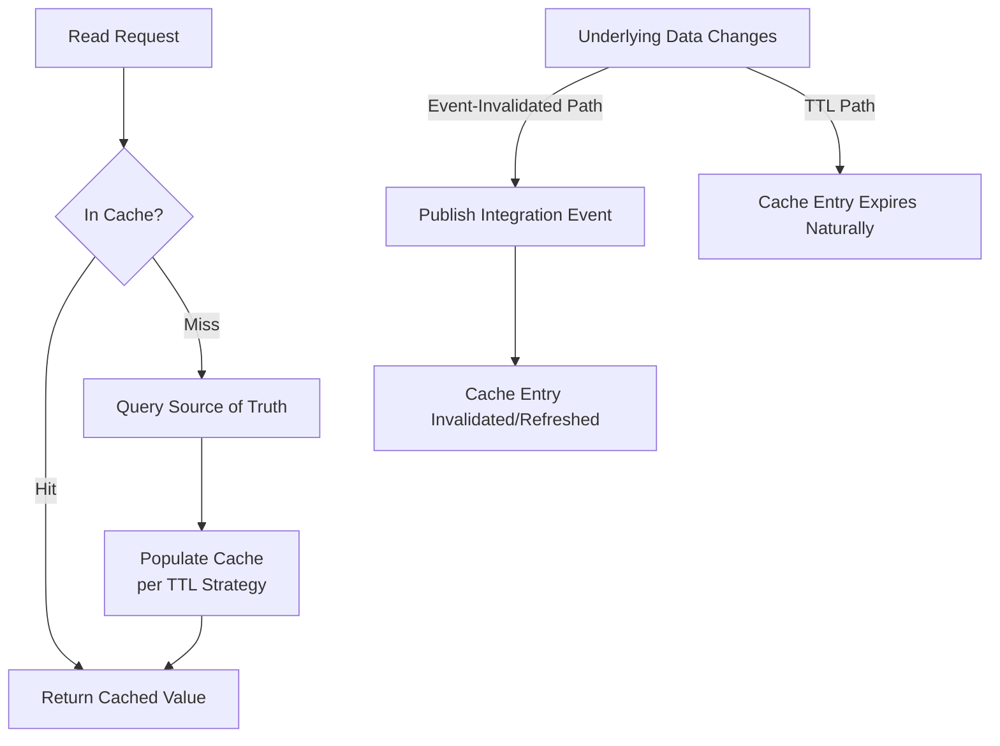
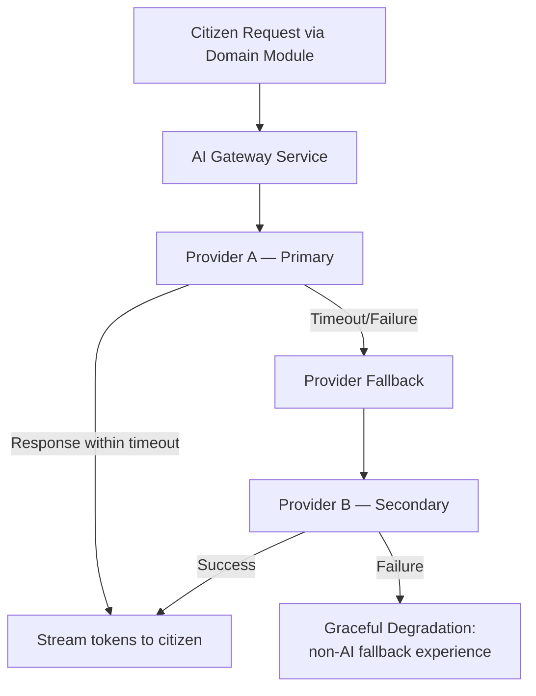
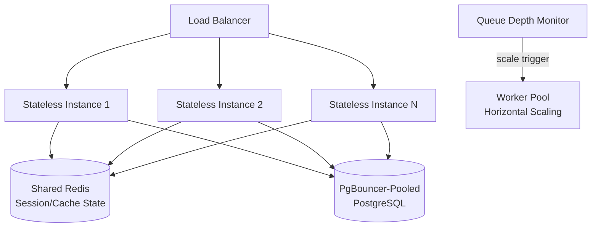
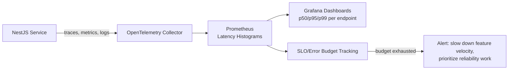
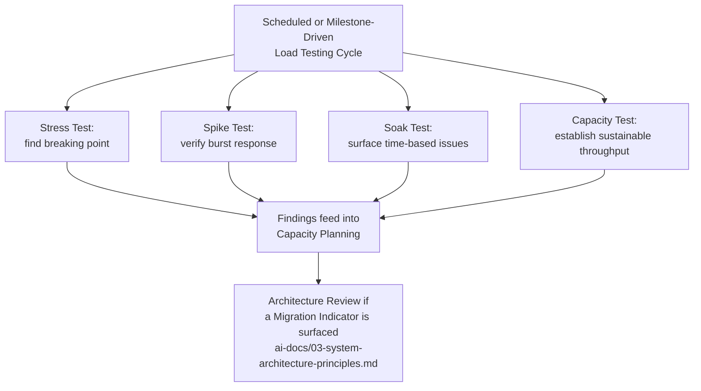

# Performance Standards

**Document:** `ai-docs/11-performance-standards.md`
**Project:** Arwal — The District Super App
**Stage:** 1 — Foundation
**Phase:** 12 — Performance Standards
**Status:** Approved for Engineering Reference
**Audience:** Architects, Engineers, Engineering Managers, SRE/DevOps Engineers, Performance Engineers, QA Engineers, AI Engineers, Technical Reviewers, Government Technical Partners

> **Callout — Purpose of This Document**
> `ai-docs/00-project-vision.md` defined why Arwal exists. `ai-docs/01-product-goals.md` defined what Arwal must achieve. `ai-docs/02-engineering-principles.md` defined how engineers reason about design. `ai-docs/03-system-architecture-principles.md` defined how the system is structured. `ai-docs/04-folder-guidelines.md` defined where that structure physically lives. `ai-docs/05-coding-standards.md` defined how individual lines of code are written. `ai-docs/06-git-workflow.md` defined how change moves through version control. `ai-docs/07-development-workflow.md` defined how a day of engineering work unfolds. `ai-docs/08-definition-of-done.md` defined when a piece of work is actually finished. `ai-docs/09-tech-stack.md` named the concrete technologies everything is built from. `ai-docs/10-security-standards.md` defined the enforceable security standard every one of those technologies must satisfy. This document defines **the enforceable performance standard** every one of those technologies, boundaries, and workflows must satisfy — the specific, measurable targets and disciplines that turn "performance is a trust signal" from a stated value in `ai-docs/00-project-vision.md` into a verifiable, auditable engineering practice, for every one of the ~300 micro-phases still ahead.

---

# Purpose of this Document

Every phase document preceding this one touches performance without fully defining it. `ai-docs/00-project-vision.md` names performance as a trust signal and commits to sub-2-second load on 3G and sub-200ms API latency. `ai-docs/01-product-goals.md` restates these as Non-Functional Goals and KPIs. `ai-docs/02-engineering-principles.md` establishes Lazy Loading, Code Splitting, Caching, and Database Optimization as Performance Principles. `ai-docs/03-system-architecture-principles.md` establishes Scalability by Design, the multi-layer Caching Strategy, and Resilience Patterns at the system level. `ai-docs/05-coding-standards.md` gives line-level Performance Coding Standards — memoization discipline, N+1 avoidance, bundle-size evaluation. `ai-docs/07-development-workflow.md` defines a Performance Review Workflow with checkpoints across the engineering lifecycle. `ai-docs/08-definition-of-done.md` makes performance verification a non-negotiable exit gate. `ai-docs/09-tech-stack.md` names the specific frameworks, datastores, and observability tools performance is built on. `ai-docs/10-security-standards.md` shows exactly this kind of consolidation exercise applied to security.

What none of those documents does — because it is not their job to — is define, in one place, **the complete, specific, measurable performance standard itself**: exactly what "fast enough" means for an API endpoint, a database query, a React Server Component, a Redis cache entry, an AI completion, or a BullMQ job at Arwal. Performance mentioned everywhere but quantified nowhere is not a performance program; it is a good intention with no number attached to it, which means it cannot be tested, budgeted, or defended in a code review.

This document exists to:

1. **Consolidate every performance-relevant principle scattered across Phases 1–11 into one authoritative, standalone reference** — the document a performance engineer opens first, and the document every other phase document's performance references ultimately resolve to.
2. **Convert Arwal's civic mandate into concrete performance obligation.** A farmer checking mandi prices on a 2G connection, a citizen renewing a certificate from an entry-level Android device, and a merchant managing orders during a network dip are not abstractions in this document — they are the specific conditions this document exists to guarantee acceptable performance under, per the Design for the Slowest Device and Weakest Signal principle in `ai-docs/00-project-vision.md`.
3. **Give every engineer, reviewer, and government technical partner a single, citable performance standard** — "this violates the API Performance targets in Phase 12" is exactly as legitimate and actionable a review comment as citing SOLID from Phase 3 or a security control from Phase 11.
4. **Make performance measurable, not subjective.** Every target in this document is a number, a percentile, or a budget — never a vague aspiration like "should feel fast." A number can be tested in CI, tracked on a dashboard, and enforced in code review; a feeling cannot.
5. **Serve as the binding reference for performance review, load testing, capacity planning, and production monitoring** for the entire life of the ~300-phase roadmap, revisited and amended only through the same Architectural Decision Record discipline established in `ai-docs/02-engineering-principles.md` and `ai-docs/03-system-architecture-principles.md`.

This document assumes and requires familiarity with all eleven preceding phase documents. It does not re-argue their reasoning — it is where that reasoning becomes a specific, enforceable, measurable performance target.

---

# Performance Philosophy

Arwal's performance posture rests on seven commitments. Together they answer the question every subsequent section in this document exists to make concrete: **what does "fast" actually require, by default, before a single line of business logic is written?**

### Performance by Design

Performance is never a post-launch optimization pass bolted onto finished work — it is a property designed into a system from its first commit, exactly as the Performance-First principle in `ai-docs/02-engineering-principles.md` and the Performance Vision in `ai-docs/00-project-vision.md` require. A feature that is functionally complete but was designed without its query pattern, its payload shape, and its rendering strategy considered from the start is not a finished feature per `ai-docs/08-definition-of-done.md` — it is a latency regression waiting to be discovered by a citizen on a 3G connection, not by a load test.

### Scalability First

Every performance decision is evaluated against the 1,000,000+ user target from `ai-docs/00-project-vision.md`, not against today's small load. A query that is fast against a development database with a thousand rows but has no index strategy for a hundred million rows is not a performant query — it is a performance regression with a delayed onset. Scalability First means the architecture in `ai-docs/03-system-architecture-principles.md` (stateless services, data partitioning, evidence-based extraction) is the permanent backdrop against which every performance decision in this document is made.

### Efficient Resource Usage

CPU, memory, network bandwidth, and database connections are treated as finite, shared, and costly resources — never assumed to be abundant. This is not only a cost-discipline concern (per the Scalability Philosophy's rejection of over-provisioning in `ai-docs/02-engineering-principles.md`); it is a citizen-experience concern, since Arwal's target device profile (entry-level Android, 2G/3G) means every byte transferred and every CPU cycle spent client-side has a directly felt cost on the citizen's actual hardware.

### Measure Before Optimizing

No performance change is made on intuition alone. Per the Evidence over Prediction commitment in `ai-docs/03-system-architecture-principles.md`, applied specifically to performance: a query is optimized because a query plan or a monitored p95 shows it is slow, a bundle is trimmed because a bundle-analyzer report shows what is heavy, a cache is introduced because monitored read volume justifies it. Optimizing code that profiling has not identified as a bottleneck is, at best, wasted engineering effort, and at worst, a KISS-violating complexity cost (`ai-docs/02-engineering-principles.md`) paid for no measurable benefit.

> **Callout — Premature Optimization Is Still Rejected, Not the Same as Premature Measurement**
> "Measure before optimizing" does not mean "wait until production is slow to think about performance." Performance *budgets* (see below) are set proactively, before a line of code is written, precisely so that measurement happens continuously during development, not only reactively after a citizen complaint. What is rejected is optimizing a code path with no evidence it is a bottleneck, at the cost of clarity (`ai-docs/05-coding-standards.md`, Readability Over Cleverness) — not the discipline of measuring early and often.

### Predictable Performance

A system that is fast on average but wildly inconsistent under real conditions has not met Arwal's bar. Every performance target in this document is expressed as a percentile (p50, p95, p99), never a mean alone, because a mean can hide a citizen-facing tail of slow requests that the mean makes invisible. Predictable performance also means graceful, bounded behavior under load — a system that degrades linearly as load increases is preferred over one that performs perfectly until a cliff-edge failure.

### Graceful Degradation

Consistent with the Graceful Degradation resilience pattern in `ai-docs/03-system-architecture-principles.md`, a non-critical dependency's slowness or unavailability (recommendations, a search-ranking refinement, a non-essential AI feature) degrades that specific feature, never the citizen-critical core flow (browse, cart, checkout, booking, civic application submission) it is attached to. Performance-under-failure is evaluated with the same rigor as performance-under-normal-load — a system is not performant if it is only performant when every dependency is healthy.

### Continuous Performance Verification

Performance is never a one-time certification at launch. Bundle-size budgets, Lighthouse checks, and query-plan reviews run on every relevant pull request, per the CI/CD Integration principles in `ai-docs/06-git-workflow.md`. Load and chaos testing are performed ahead of anticipated scale milestones, per the Scalability Philosophy in `ai-docs/02-engineering-principles.md`, never discovered accidentally during a citizen-facing surge. A system is only as fast as its most recently verified state, and Arwal treats "we checked once, at launch" as a false sense of safety, exactly as `ai-docs/10-security-standards.md` treats the equivalent security complacency.

> **Callout — The One-Sentence Performance Philosophy**
> *"Every millisecond a citizen waits is a millisecond of trust spent — measure it, budget it, and never spend it without evidence that it was necessary."*

---

# Performance Goals

Performance goals are Arwal's headline, citizen-facing targets — the numbers every other section in this document exists to make achievable. All latency targets are expressed at the p95 percentile unless otherwise stated, consistent with the Predictable Performance philosophy above; a p95 target ensures the vast majority of citizens experience the target performance, not merely the median citizen on the best network.

### API Latency

| Operation Class | p50 Target | p95 Target | p99 Target | Rationale |
|---|---|---|---|---|
| Core read (catalog, listing, profile fetch) | < 80ms | < 200ms | < 400ms | Matches the sub-200ms p95 target in `ai-docs/01-product-goals.md`; this is the most frequent operation class and directly shapes perceived responsiveness. |
| Core write (booking, order, application submission) | < 150ms | < 350ms | < 700ms | Writes carry validation and persistence cost `ai-docs/05-coding-standards.md`'s read latency target does not assume; a wider budget reflects genuine work, not laxity. |
| Search / ranked discovery | < 150ms | < 400ms | < 800ms | Search involves the Search shared service (`ai-docs/03-system-architecture-principles.md`) and, where AI-ranked, the AI Gateway; wider budget reflects real computational cost. |
| Payment initiation/confirmation | < 200ms | < 500ms | < 1000ms | Payments cross an external gateway (`ai-docs/09-tech-stack.md`); the budget must absorb network round-trip to a third party while still feeling immediate to the citizen. |
| Admin/government dashboard read | < 150ms | < 400ms | < 800ms | Lower traffic volume and less latency-sensitive usage pattern than citizen-facing core flows justifies a modestly wider budget. |

### Page Load and Time to Interactive

| Metric | Target (3G, entry-level Android) | Target (4G, mid-range device) | Rationale |
|---|---|---|---|
| Perceived load (First Contentful Paint) | < 2.0s | < 1.0s | Directly implements the sub-2-second target in `ai-docs/00-project-vision.md` and `ai-docs/01-product-goals.md`, measured against Arwal's actual target device profile, not developer hardware. |
| Time to Interactive (TTI) | < 3.5s | < 2.0s | A page that paints quickly but cannot respond to a tap for several more seconds fails the citizen's actual experience of "working," even if FCP looks good on a dashboard. |
| Largest Contentful Paint (LCP) | < 2.5s | < 1.5s | The Core Web Vitals threshold Google and the broader web-performance community treat as the boundary of "good" — Arwal adopts, not reinvents, this industry-standard threshold. |

### Core Web Vitals

| Metric | "Good" Threshold | Arwal Target | Why It Matters |
|---|---|---|---|
| **Largest Contentful Paint (LCP)** | ≤ 2.5s | ≤ 2.5s (3G), ≤ 1.5s (4G) | Measures perceived load speed — the moment the citizen sees the main content, per the Performance Vision in `ai-docs/00-project-vision.md`. |
| **Interaction to Next Paint (INP)** | ≤ 200ms | ≤ 200ms | Measures responsiveness to a citizen's tap/click across the page's full lifetime, superseding First Input Delay as the industry-standard responsiveness metric. |
| **Cumulative Layout Shift (CLS)** | ≤ 0.1 | ≤ 0.1 | Prevents a citizen from mis-tapping a button that shifted position — a direct dignity-of-access concern per the Accessibility Vision in `ai-docs/00-project-vision.md`, not merely a cosmetic one. |

### Database Query Performance

| Query Class | p95 Target | Notes |
|---|---|---|
| Indexed point lookup (`findById`) | < 5ms | Any point lookup exceeding this consistently is a signal of a missing or degraded index, per the Indexing principle in `ai-docs/02-engineering-principles.md`. |
| Indexed filtered list (paginated) | < 30ms | Assumes the filter/sort fields are backed by a deliberate index per `ai-docs/05-coding-standards.md`'s Filtering and Sorting standards. |
| Aggregate/reporting query | < 500ms | Reporting queries are expected to be heavier; anything beyond this budget is a candidate for a materialized read model or a scheduled job, not a live query. |
| Write (single-row insert/update) | < 15ms | Excludes cross-row transactional writes, which are measured separately below. |
| Transactional write (multi-statement) | < 50ms | Bounded transaction scope per the Transactions principle in `ai-docs/05-coding-standards.md` keeps this achievable even under lock contention. |

### Cache Hit Rate

| Cache Layer | Target Hit Rate | Notes |
|---|---|---|
| CDN / Edge cache (static assets, semi-static catalog) | > 95% | Long-TTL, cache-busted content should almost never miss in steady state, per the Caching Strategy in `ai-docs/03-system-architecture-principles.md`. |
| API Gateway cache (public, non-personalized reads) | > 80% | Lower than CDN because a smaller, more frequently invalidated dataset is cached here. |
| Module-level application cache (Redis) | > 85% | Applies to frequently read, infrequently changed domain data (mandi prices, district config) per `ai-docs/02-engineering-principles.md`. |
| Client-side cache (TanStack Query) | > 70% | Stale-while-revalidate semantics mean a lower hit rate is expected and acceptable, since freshness is deliberately favored for citizen-facing data. |

### Queue Processing and Background Jobs

| Metric | Target | Notes |
|---|---|---|
| Job pickup latency (time from enqueue to worker start) | < 2s (p95) | Ensures asynchronous Integration Events (`ai-docs/03-system-architecture-principles.md`) feel near-real-time to the citizen, even though they are architecturally decoupled. |
| Job completion time (notification dispatch) | < 5s (p95) | A citizen expects a booking confirmation notification within seconds, not minutes, even though the booking itself completed synchronously. |
| Job completion time (report/reconciliation job) | < 10 minutes (p95) | Heavier, scheduled batch jobs are held to a wider, but still bounded and monitored, budget. |
| Dead-letter rate | < 0.1% | A job that repeatedly fails and lands in the dead-letter queue is a signal of a defect requiring investigation, per the Retry resilience pattern in `ai-docs/03-system-architecture-principles.md`, not a number to be tolerated. |



---

# Performance Budgets

A performance budget is a hard ceiling, checked automatically in CI wherever tooling allows, that a change is not permitted to exceed without an explicit, reviewed justification — directly implementing the Bundle Size Budgets and Performance Regressions Block Release principles in `ai-docs/00-project-vision.md` and `ai-docs/02-engineering-principles.md`.

| Budget Category | Target | Enforcement Point |
|---|---|---|
| **JavaScript (per route, initial load)** | ≤ 170KB gzipped | CI bundle-analyzer check, per the Performance Coding Standards in `ai-docs/05-coding-standards.md`. |
| **JavaScript (total, cumulative across app)** | ≤ 500KB gzipped for the core citizen-facing app | Tracked per release; growth beyond budget requires a documented justification in the PR, per the Bundle Size row in `ai-docs/08-definition-of-done.md`'s Performance Definition of Done. |
| **CSS (per route)** | ≤ 30KB gzipped | Tailwind's JIT/purge compilation (`ai-docs/09-tech-stack.md`) is the primary mechanism keeping this achievable by default. |
| **Images (per page, above the fold)** | ≤ 200KB total, individual images ≤ 100KB | Enforced via Next.js Image component (`ai-docs/09-tech-stack.md`) with mandatory responsive `sizes` and modern-format (`WebP`/`AVIF`) output. |
| **Fonts (per app, total)** | ≤ 100KB (woff2, subset to required character sets) | Self-hosted via `packages/ui/assets/fonts` (`ai-docs/04-folder-guidelines.md`), never loaded from a third-party CDN that adds an uncontrolled network dependency. |
| **API payload (single response, core read)** | ≤ 50KB uncompressed | Enforced through DTO design (`ai-docs/05-coding-standards.md`) and pagination (see API Performance below); a response exceeding this is a signal of over-fetching or a missing pagination boundary. |
| **API payload (list response, per page)** | ≤ 100KB uncompressed | Assumes a bounded page size per the Pagination standard below; an unbounded list response is a Blocking Issue per `ai-docs/05-coding-standards.md`. |
| **Total page weight (initial load, 3G target)** | ≤ 500KB transferred (compressed) | The composite budget that FCP/LCP targets above are only achievable against; every category above rolls up into this ceiling. |

> **Callout — A Budget Exceeded Is a Blocking Issue, Not a Suggestion**
> Consistent with the Blocking Issues list in `ai-docs/05-coding-standards.md` and the Performance Definition of Done in `ai-docs/08-definition-of-done.md`, a PR that exceeds any budget above without an explicit, reviewed justification does not merge. A budget that can be silently exceeded "just this once" is not a budget — it is a suggestion, and Arwal's entry-level-device citizens cannot afford suggestions.



---

# Frontend Performance Standards

These standards make the Frontend Engineering Principles in `ai-docs/02-engineering-principles.md` and the Next.js/React choices in `ai-docs/09-tech-stack.md` concrete and measurable.

### Next.js Optimization

Every route is evaluated for its rendering strategy — static generation, server-side rendering, or incremental static regeneration — chosen deliberately per the route's actual data-freshness requirement, never defaulted to full client-side rendering as a matter of convenience. Semi-static civic and catalog content is a strong ISR candidate, directly serving the sub-2-second load target without requiring a database round-trip on every request.

### Server Components

Per the Server vs. Client Components standard in `ai-docs/05-coding-standards.md`, a component defaults to a Server Component unless it genuinely requires interactivity. This is a performance standard as much as an architectural one: every component kept server-rendered is JavaScript the citizen's entry-level Android device never has to download, parse, or execute.

### Client Components

Client Component boundaries are pushed to the smallest possible leaf in the component tree — a single interactive button or form, never the page that contains it — so that a page with one interactive element ships the JavaScript for that one element, not for the page's entire markup.

```tsx
// Rejected — the whole page becomes a Client Component for one button
"use client";
export function BookingPage({ booking }: BookingPageProps) {
  return (
    <div>
      <BookingDetails booking={booking} />
      <button onClick={handleCancel}>Cancel</button>
    </div>
  );
}

// Required — only the interactive leaf ships client-side JS
export function BookingPage({ booking }: BookingPageProps) {
  return (
    <div>
      <BookingDetails booking={booking} />
      <CancelBookingButton bookingId={booking.id} /> {/* "use client" lives here only */}
    </div>
  );
}
```

### Image Optimization

Every image is served through Next.js's built-in Image component, which handles responsive sizing, modern-format (`WebP`/`AVIF`) delivery, and lazy loading by default, per `ai-docs/09-tech-stack.md`. No image is ever committed or served at a resolution higher than its largest actual rendered size on the largest supported viewport, per the Asset Optimization standard in `ai-docs/02-engineering-principles.md`.

### Lazy Loading

Any component, route, or asset not needed for the current viewport or the current citizen interaction is loaded lazily — below-the-fold images, secondary modals, rarely-visited settings screens — per the Lazy Loading principle in `ai-docs/02-engineering-principles.md`, so the initial page weight budget above is spent only on what the citizen sees first.

### Code Splitting

Every route and every heavy, non-critical-path component (a rich text editor, a charting library, an admin-only widget) is code-split via dynamic `import()`, per the Code Splitting principle in `ai-docs/02-engineering-principles.md`. A citizen using only the commerce module never downloads the civic module's bundle, consistent with the Performance-First principle in the same document.

### Caching

Frontend caching follows the multi-layer Caching Strategy in `ai-docs/03-system-architecture-principles.md`: CDN/edge caching for static assets, TanStack Query's stale-while-revalidate for server data, and Next.js's own route-segment caching for semi-static content — never a single, undifferentiated cache mechanism applied blindly to every kind of data.

### Fonts

Fonts are self-hosted (never a third-party font CDN, which adds an uncontrolled third-party network dependency to every page load), subject to the font budget above, subset to only the character sets Arwal's supported languages require, and loaded with `font-display: swap` so text is never invisible while a font loads — a direct implementation of Design for the Slowest Device and Weakest Signal (`ai-docs/00-project-vision.md`) applied to typography specifically.

### Accessibility vs. Performance Trade-offs

Accessibility (`ai-docs/02-engineering-principles.md`'s Accessibility-First principle, WCAG 2.1 AA) is never sacrificed for a performance budget, and the two are, in practice, rarely in genuine tension: semantic HTML is typically lighter than a `div`-soup equivalent rebuilt with ARIA roles, and Server Components (which serve performance) also tend to produce more standards-compliant, more accessible markup than heavy client-side rendering. Where a genuine trade-off does arise (e.g., a rich, animated interactive widget that is both heavier and harder to make fully accessible), accessibility wins the trade-off by default, per the Accessibility Vision's "floor, not target" commitment — the performance cost is then addressed through code-splitting and lazy-loading the specific widget, not by reducing its accessibility.

---

# Backend Performance Standards

These standards make the Backend Engineering Principles in `ai-docs/02-engineering-principles.md` and the NestJS/Node.js choices in `ai-docs/09-tech-stack.md` concrete and measurable.

### Async Processing

Any operation that does not require an immediate synchronous response defaults to asynchronous, event-driven processing (BullMQ, per `ai-docs/09-tech-stack.md`), per the Event-Driven Thinking principle in `ai-docs/02-engineering-principles.md`. This keeps the synchronous request path — and therefore the API Latency budgets above — free of work that does not need to block the citizen's response.

### Database Optimization

Every database-backed endpoint is reviewed for N+1 query patterns, appropriate indexing (see Database Performance below), and query-plan cost before merge, per the Database Optimization principle in `ai-docs/02-engineering-principles.md` — this review is a required, not optional, step for any endpoint expected to carry meaningful read load.

### Connection Pooling

Every service connects to PostgreSQL through PgBouncer (transaction-pooling mode, per `ai-docs/09-tech-stack.md`), never directly, so that horizontal scaling (adding stateless instances per `ai-docs/03-system-architecture-principles.md`) never collectively exhausts the database's own connection ceiling. Redis connections are similarly pooled and bulkheaded per role (cache, session, queue), per the Bulkheading principle in `ai-docs/03-system-architecture-principles.md`, so contention in one role never starves another.

### Batch Operations

Any operation that would otherwise issue N individual queries or N individual external calls in a loop is rewritten as a single batched query (`IN` clause, bulk insert) or a batched external API call where the provider supports it — directly closing the N+1 anti-pattern this document repeatedly guards against, and reducing round-trip overhead that compounds badly under Arwal's target network conditions.

### Pagination

Every list-returning endpoint is paginated by default, per the Pagination standard in `ai-docs/05-coding-standards.md` — cursor-based for high-volume, frequently-changing collections (order history, notifications), offset-based for small, stable, admin-facing lists. An unbounded list endpoint is both a performance risk (violates the API payload budget above) and, per `ai-docs/10-security-standards.md`, a denial-of-service risk.

### Streaming

Where a response is genuinely large or produced incrementally (an AI completion, a large export/report generation), the response is streamed to the client rather than fully buffered server-side and sent as one large payload — this reduces server-side memory pressure and improves perceived responsiveness, since the citizen begins seeing output before the full operation completes.

### Memory Usage

Every service defines and monitors a memory budget appropriate to its workload, with alerting on sustained memory growth (a signal of a leak) rather than only on an out-of-memory crash. Memory-heavy operations (large report generation, bulk data processing) are bounded — processed in chunks/streams rather than loaded wholesale into memory — per the Efficient Resource Usage philosophy above.

### CPU Efficiency

Node.js's single-threaded event loop (per `ai-docs/09-tech-stack.md`) means a CPU-bound operation on the main thread blocks every other concurrent request being served by that instance. Any genuinely CPU-intensive workload (complex computation, heavy synchronous data transformation) is either optimized algorithmically, offloaded to a worker thread/process, or moved to a dedicated service — never left to silently degrade the latency of every unrelated concurrent request, per the CPU-bound workload trade-off already acknowledged in `ai-docs/09-tech-stack.md`.



---

# Database Performance

These standards make the Database Principles in `ai-docs/02-engineering-principles.md` and the Database Coding Standards in `ai-docs/05-coding-standards.md` concrete from a performance-measurement lens.

### Indexing Strategy

Every query pattern expected to run at meaningful volume is backed by a deliberate index, added in response to an observed access pattern — never defensively on every column, which imposes a write-performance and storage cost with no corresponding benefit, per the Indexing principle in `ai-docs/02-engineering-principles.md`. Composite indexes are ordered to match the actual filter/sort clause shape of the query they serve (equality columns first, range/sort columns last), and every migration introducing a new query pattern is reviewed specifically for whether it requires a matching index before merge, per the Database Change Workflow in `ai-docs/07-development-workflow.md`.

### Query Optimization

Every query expected to carry significant load has its query plan (`EXPLAIN ANALYZE`) reviewed before merge, not guessed at — a query that "seems fine" against a small development dataset can hide a full table scan that only becomes visible at production data volume. Query plans are re-reviewed whenever a table's data distribution changes meaningfully (a large volume increase, a new access pattern), not only at the time the query was first written.

### N+1 Prevention

A loop that issues one database query per iteration is a review-blocking defect, per the Database Optimization standard in `ai-docs/02-engineering-principles.md` and `ai-docs/05-coding-standards.md`. It is replaced with a single batched query, an explicit `JOIN`, or Prisma's relation-loading (`include`/`select`) mechanism, verified against the actual generated SQL rather than assumed correct from the ORM call's appearance.

```typescript
// Rejected — N+1: one query per booking to fetch its provider
const bookings = await bookingRepository.findAll();
for (const booking of bookings) {
  booking.provider = await providerRepository.findById(booking.providerId);
}

// Required — single batched query via relation loading
const bookings = await prisma.booking.findMany({
  include: { provider: true },
});
```

### Transactions

Transactions are scoped as narrowly as possible around the specific statements that require atomicity, per the Transactions principle in `ai-docs/05-coding-standards.md` — never wrapped around an entire request handler "to be safe," which holds database locks longer than necessary and directly degrades throughput under concurrent load. A transaction's duration is monitored, and any transaction regularly exceeding the Transactional Write latency target above is investigated for unnecessary scope or lock contention.

### Read/Write Patterns

Every module's repository layer is designed with its actual read-to-write ratio in mind — a catalog/listing module (read-heavy) is optimized for query performance and caching, while a payments module (write-sensitive, consistency-critical) is optimized for transactional correctness first, with performance tuning applied only within the bounds that correctness allows. This differentiation is a direct application of the Data Classification Drives Architecture principle in `ai-docs/03-system-architecture-principles.md`, applied to performance rather than security tiering.

### Partitioning Considerations

Every table is designed from Phase 1 with the district → ward → zone partitioning strategy in mind, per `ai-docs/00-project-vision.md` and `ai-docs/03-system-architecture-principles.md`, even though physical partitioning is deferred until evidence justifies it, per the Evidence over Prediction commitment. A table's primary access patterns are reviewed to confirm a partition key exists in the schema (even if unused for actual partitioning today) so the future migration to partitioned tables is an operational exercise, not a schema redesign.

### Connection Pooling

See Backend Performance Standards above — PgBouncer in transaction-pooling mode is the mandatory connection path for every service, sized so that horizontal scaling (adding NestJS instances) never collectively exceeds PostgreSQL's own connection ceiling, per `ai-docs/09-tech-stack.md`.



---

# Caching Strategy

This section operationalizes the multi-layer Caching Strategy already established in `ai-docs/02-engineering-principles.md` and `ai-docs/03-system-architecture-principles.md`, adding measurable hit-rate targets and TTL discipline.

### Browser Cache

Static assets (JS/CSS bundles, fonts, images) are served with long-lived, immutable cache headers (`Cache-Control: public, max-age=31536000, immutable`), relying on content-hashed filenames for cache-busting on deploy — never a short TTL that forces a citizen's browser to needlessly re-fetch an unchanged asset over a constrained connection.

### CDN Cache

Semi-static content (published civic information, catalog images, public listing pages) is cached at the CDN/edge layer with a long TTL, cache-busted on deploy or via explicit invalidation for civic content updates, per the Edge/CDN Cache row in `ai-docs/03-system-architecture-principles.md`'s Caching Strategy table. This is the layer primarily responsible for meeting the > 95% hit-rate target above.

### Redis Cache

Redis serves as the Module-Level Application Cache and Cross-Module Read Cache layers described in `ai-docs/03-system-architecture-principles.md`, holding frequently-read, infrequently-changed domain data (mandi prices, district configuration, a consuming module's denormalized read model built from Integration Events). Every Redis cache entry has an explicit key naming convention scoped to its owning module, preventing key collisions across bounded contexts.

### Query Cache

Expensive, frequently-repeated read queries (a ranked listing page, an aggregate dashboard figure) are cached at the application layer with an explicit invalidation trigger — either a TTL appropriate to the data's actual volatility, or an event-driven invalidation fired when the underlying data changes, per the Cross-Module Read Cache pattern in `ai-docs/03-system-architecture-principles.md`. A query cache is never introduced for a query that has not been measured to actually be expensive — per Measure Before Optimizing above.

### Cache Invalidation

Every cache introduced at any layer has its invalidation strategy defined and documented in the same change that introduces it — an undefined invalidation strategy is grounds to reject the cache in review, per the standard already established in `ai-docs/02-engineering-principles.md` and `ai-docs/03-system-architecture-principles.md`. Two invalidation strategies are used, chosen deliberately per data volatility:

| Strategy | When Used | Example |
|---|---|---|
| **Time-bound (TTL)** | Data with a known, acceptable staleness window and no reliable change-event to subscribe to. | Mandi price feed, refreshed on a defined interval. |
| **Event-invalidated** | Data owned by another module, kept fresh via that module's Integration Events. | A consuming module's cached copy of a citizen's display name, invalidated on `ProfileUpdated`. |

### TTL Strategy

| Data Volatility | TTL Guideline | Example |
|---|---|---|
| Highly volatile (changes every few minutes) | 30–60 seconds, or event-invalidated | Live order/booking status |
| Moderately volatile (changes hourly/daily) | 5–15 minutes | Mandi prices, weather intelligence |
| Low volatility (changes weekly or on deploy) | 1–24 hours | District configuration, feature flags |
| Effectively static (changes only on explicit action) | Long TTL (days) + event-invalidated on the specific action | Published civic service information |



---

# API Performance

These standards extend the API Coding Standards in `ai-docs/05-coding-standards.md` and the API Security Standards in `ai-docs/10-security-standards.md` from a latency and throughput lens.

### Response Time Targets

See the API Latency table under Performance Goals above — every public and internal API endpoint is measured against its operation class's p50/p95/p99 targets, tracked continuously on a Grafana dashboard (`ai-docs/09-tech-stack.md`), not verified once at launch.

### Compression

Every API response is served with `gzip` or `brotli` compression enabled at the Nginx layer (`ai-docs/09-tech-stack.md`), reducing bytes transferred over Arwal's target 2G/3G network conditions with negligible CPU cost — compression is enabled by default for every response above a minimal size threshold, never opted into per-endpoint.

### Pagination

See Backend Performance Standards above — every list endpoint is paginated, with pagination metadata always present in the response envelope's `meta`, per `ai-docs/05-coding-standards.md`.

### Filtering

Every filterable field is backed by a deliberate database index before it is exposed as a public query parameter, per the Filtering standard in `ai-docs/05-coding-standards.md` — a filter added to a public contract without its query-performance implication considered is a Blocking Issue.

### Sorting

Sortable fields are explicitly allow-listed per endpoint, never passed through to an ORM's `orderBy` unchecked, per `ai-docs/05-coding-standards.md` — this is both a performance safeguard (an unindexed sort column can force an expensive in-memory sort at scale) and a security safeguard (per `ai-docs/10-security-standards.md`).

### Rate Limiting

Rate limiting (coarse-grained at Nginx/Gateway, fine-grained per-actor inside NestJS, per `ai-docs/09-tech-stack.md` and `ai-docs/10-security-standards.md`) is also a performance-protection mechanism: it prevents a single abusive or malfunctioning client from degrading the p95 latency experienced by every other citizen sharing the same service instance.

### Idempotency

Every state-mutating operation reachable via client retry (payment processing, booking confirmation) requires or generates an idempotency key, per `ai-docs/03-system-architecture-principles.md` and `ai-docs/10-security-standards.md`. From a performance lens specifically, idempotency prevents a slow-network citizen's retried request from doubling the actual write load the database must absorb for what is, from the citizen's perspective, a single action.

---

# AI Performance

These standards extend the AI Stack architecture in `ai-docs/09-tech-stack.md` and the AI Security standards in `ai-docs/10-security-standards.md` with measurable latency and efficiency targets, consistent with the AI Principle in `ai-docs/00-project-vision.md` that AI must remain explainable, overridable, and — per this document — never a source of unbounded citizen-facing latency.

### Model Latency

| Interaction Type | p95 Target | Notes |
|---|---|---|
| Simple completion (short civic-assistant answer) | < 2s to first token, < 5s to completion | Measured at the AI Gateway Service boundary (`ai-docs/09-tech-stack.md`), independent of which underlying provider is currently configured. |
| Ranking/recommendation inference | < 300ms | Ranking sits on the citizen-facing discovery critical path and is held to a latency budget close to a core read, per the Performance Goals table above. |
| Complex/multi-step AI workflow | < 10s, with progress feedback | Any interaction expected to exceed a few seconds streams intermediate progress rather than leaving the citizen looking at an unexplained blank wait. |

### Streaming Responses

Any AI completion of non-trivial length is streamed token-by-token to the citizen rather than buffered and returned as one blocking response, per the Streaming standard in Backend Performance Standards above. This directly improves perceived latency — the citizen sees the response beginning to form within the Model Latency "first token" target, even if the full completion takes longer.

### Token Efficiency

Prompts sent to the underlying model provider are reviewed for token efficiency — unnecessary verbosity, redundant context, or an oversized retrieved-context window all directly increase both latency and cost. Prompt templates (versioned per `ai-docs/09-tech-stack.md`'s Prompt Management standard) are reviewed specifically for token efficiency as part of the same review rigor applied to their content and safety.

### Prompt Optimization

Prompts are structured to minimize round-trips — a single, well-structured prompt that returns a complete, directly usable response is preferred over a chain of several smaller sequential prompts wherever the underlying task allows it, since each additional round-trip to a model provider adds its own network and inference latency, compounding under Arwal's target network conditions.

### Provider Fallback

Per the Provider Independence principle in `ai-docs/09-tech-stack.md`, the AI Gateway Service supports a documented fallback path to a secondary model provider (or a degraded, non-AI fallback experience) when the primary provider exceeds its latency budget or becomes unavailable — directly implementing Graceful Degradation for the AI layer specifically, so a provider outage degrades one feature, never a citizen-critical core flow.

### Timeout Handling

Every call from the AI Gateway Service to an underlying model provider has an explicit, bounded timeout, per the Timeout resilience pattern in `ai-docs/03-system-architecture-principles.md` — no AI-dependent request is permitted to hold a connection or a citizen's attention indefinitely waiting on a provider that may never respond. A timed-out AI call triggers the Provider Fallback path above, never a bare error with no recovery attempt.



---

# Scalability

Scalability performance standards extend the Scalability Strategy in `ai-docs/03-system-architecture-principles.md` and the Scalability Vision in `ai-docs/00-project-vision.md` into measurable, verifiable practice.

### Horizontal Scaling

Every module and shared service is designed stateless-first, per `ai-docs/03-system-architecture-principles.md`, so that adding instances behind a load balancer is the default response to sustained load growth — never a re-architecture. Horizontal scalability is verified, not assumed: a load test (see Load Testing below) confirms that doubling instance count produces a near-linear throughput improvement for a given service before that service is trusted to scale this way in production.

### Stateless Services

No service holds citizen session state, in-memory cache state critical to correctness, or any other state in a way that would make a request's outcome depend on which specific instance handled it. Session state lives in Redis (per `ai-docs/09-tech-stack.md`), never in a Node.js process's memory, so any instance can serve any request and an instance can be added, removed, or restarted without citizen-visible impact.

### Queue Workers

BullMQ worker concurrency (`ai-docs/09-tech-stack.md`) is configured per job type based on the job's actual resource profile (I/O-bound jobs support higher concurrency than CPU-bound jobs) and scaled horizontally by adding worker instances as queue depth and processing-latency targets (per the Performance Goals table above) require — monitored continuously, not provisioned once and forgotten.

### Event Processing

The event bus (BullMQ during the Modular Monolith phase, per `ai-docs/09-tech-stack.md`) is monitored for consumer lag — the gap between when an Integration Event is published and when every subscribing module has processed it. Sustained, growing lag is an explicit Migration Indicator per `ai-docs/03-system-architecture-principles.md`, signaling either a need for more consumer capacity or, eventually, a dedicated message-broker migration.

### Capacity Planning

Capacity is planned proactively from observed growth trends and the KPI targets in `ai-docs/01-product-goals.md`, per the Scalability Philosophy in `ai-docs/02-engineering-principles.md` — never reactively, after a citizen-facing surge has already degraded service. A capacity plan is revisited on a defined cadence (at minimum, ahead of every anticipated scale milestone — a government partnership launch, a seasonal demand spike, a new district's onboarding) and is informed directly by the Load Testing practices below, not guesswork.



---

# Observability

Performance observability extends the Observability Principles in `ai-docs/03-system-architecture-principles.md` and the Monitoring & Observability stack in `ai-docs/09-tech-stack.md`, specifically from a performance-verification lens.

### Metrics

Every service emits the golden signals (latency, traffic, errors, saturation) via OpenTelemetry, scraped by Prometheus, per `ai-docs/09-tech-stack.md`. Latency metrics are captured as histograms, never as a single average, so that the p50/p95/p99 targets throughout this document can be computed and tracked accurately over time.

### Tracing

Distributed tracing (OpenTelemetry, per `ai-docs/09-tech-stack.md`) spans every module and shared service a request or event touches, with correlation IDs propagated automatically per `ai-docs/03-system-architecture-principles.md`'s Observability Principles. A slow citizen-facing request can be traced end-to-end to identify precisely which module, query, or external call is responsible for the latency, rather than guessed at.

### Logging

Structured, correlation-ID-tagged logs (per the Logging Standards in `ai-docs/05-coding-standards.md`) capture the timing of significant operations (a slow query, a cache miss, an external API call) at an appropriate log level, giving engineers a searchable timeline to reconstruct a specific slow request's path after the fact.

### Performance Dashboards

Every service has a live Grafana dashboard (`ai-docs/09-tech-stack.md`) covering, at minimum: p50/p95/p99 latency per endpoint class, error rate, cache hit rate, database query latency, and queue depth/processing latency where applicable. A service is not considered production-ready until this dashboard exists, per the Dashboards as a First-Class Deliverable principle in `ai-docs/02-engineering-principles.md`.

### SLOs (Service Level Objectives)

Every citizen-critical flow (checkout, booking, civic application submission) has a defined, monitored SLO, per the Reliability Principles in `ai-docs/03-system-architecture-principles.md` — for example, "99.5% of booking-confirmation requests complete within 350ms over a rolling 30-day window." SLOs are tracked against an error budget: the small, deliberately allowed margin of SLO violation that gives engineering room to ship change without treating every single slow request as an incident.

### SLIs (Service Level Indicators)

Every SLO is backed by a specific, precisely defined Service Level Indicator — the exact metric and measurement window the SLO is evaluated against (e.g., "p95 of the `POST /v1/bookings` endpoint's response time, measured server-side from request receipt to response sent, over a rolling 30-day window"). An SLO without a precisely defined SLI is unverifiable and is not accepted as a real target, consistent with the Measure Before Optimizing philosophy above.



---

# Load Testing

Load testing verifies, deliberately and ahead of anticipated need, the performance claims made throughout this document — never assumed true from a passing unit test suite or a clean demo, per the Load and Chaos Testing commitment in `ai-docs/02-engineering-principles.md` and `ai-docs/03-system-architecture-principles.md`.

### Stress Testing

Load is increased steadily beyond expected peak traffic until the system's actual breaking point is identified — not to prove the system never fails, but to know precisely where it fails and how, so that the failure mode (graceful degradation vs. cascading outage) can be verified and, if inadequate, fixed before a real citizen-facing surge discovers it first.

### Spike Testing

A sudden, sharp burst of traffic (simulating a government announcement driving a rush of citizens to a civic service, or a flash sale in commerce) is applied to verify the system's behavior under a rapid, non-gradual load increase — specifically checking that auto-scaling, rate limiting, and circuit breakers (`ai-docs/03-system-architecture-principles.md`) respond fast enough to prevent the spike from degrading service for citizens who arrived before it.

### Soak Testing

Sustained, moderate load is applied over an extended period (hours, not minutes) to surface issues that only manifest over time — a slow memory leak, a connection pool that isn't releasing connections correctly, a cache that grows unbounded. Soak testing catches exactly the class of defect that a short load test's brevity would hide.

### Capacity Testing

Load is applied specifically to determine the maximum sustainable throughput a given service or the platform overall can handle while still meeting its SLOs — the concrete number Capacity Planning (see Scalability above) is based on, rather than an estimate.

### Benchmarking

Individual, isolated operations (a specific query, a specific algorithm, a specific serialization path) are benchmarked in isolation to establish a baseline before and after a change, per Measure Before Optimizing above — a benchmark is the mechanism that turns "this optimization should help" into "this optimization measurably improved p95 latency by X%."

| Test Type | Purpose | Frequency |
|---|---|---|
| Stress | Find the actual breaking point and failure mode | Ahead of each major scale milestone, per `ai-docs/02-engineering-principles.md` |
| Spike | Verify response to sudden traffic bursts | Ahead of any anticipated high-visibility event (government launch, promotional campaign) |
| Soak | Surface time-dependent degradation (leaks, unbounded growth) | Quarterly, and before any major release affecting a long-running service |
| Capacity | Establish maximum sustainable throughput per SLO | Ahead of each capacity-planning cycle |
| Benchmarking | Verify a specific optimization's measured impact | Per optimization change, as part of its PR evidence |



---

# Performance Review Checklist

Every pull request affecting a citizen-facing flow, a database query, an API endpoint, or a frontend route is checked against the following before merge, extending the Performance Review Workflow in `ai-docs/07-development-workflow.md` and the Performance Definition of Done in `ai-docs/08-definition-of-done.md`:

- [ ] **Latency targets met** — The change's affected endpoint(s) meet their operation class's p50/p95/p99 targets per the Performance Goals table above, verified against real or realistic load, not assumed.
- [ ] **Budgets respected** — JavaScript, CSS, image, font, and API payload budgets are not exceeded without an explicit, reviewed justification documented in the PR.
- [ ] **No unreviewed N+1 pattern** — Every loop issuing a database or external call has been checked; batched queries/relations are used where applicable.
- [ ] **Indexing verified** — Any new query pattern expected to run at volume is backed by a deliberate, reviewed index.
- [ ] **Caching justified and bounded** — Any new cache has an explicit, documented invalidation strategy and TTL, chosen per the Data Volatility table above.
- [ ] **Pagination present** — Every list-returning endpoint is paginated, with bounded page size and pagination metadata in the response envelope.
- [ ] **Rendering strategy deliberate** — New frontend routes/components use the correct Server/Client Component split, with Client Components scoped to the smallest interactive leaf.
- [ ] **Lazy loading and code splitting applied** — Non-critical-path components, routes, and below-the-fold assets are lazily loaded.
- [ ] **Images optimized** — Served via the Next.js Image component, correctly sized, in a modern format.
- [ ] **AI calls bounded** — Any AI Gateway Service call has an explicit timeout, a defined fallback path, and, where non-trivial, streams its response.
- [ ] **Async where appropriate** — Any operation not requiring an immediate response is processed asynchronously via the event/queue infrastructure, not synchronously in the request path.
- [ ] **Observability in place** — The change's latency, error rate, and (where applicable) cache hit rate are visible on a Grafana dashboard before it reaches production.
- [ ] **Load-tested where risk warrants it** — A change expected to carry significant new load, or touching a citizen-critical flow's capacity assumptions, has been load-tested per the Load Testing section above, not shipped on faith.
- [ ] **No regression against existing SLOs** — The change has been verified not to erode an existing SLO's error budget for an already-monitored citizen-critical flow.

A pull request failing any item above is not merged until resolved, or an explicit, reviewed exception is documented — this checklist carries the same non-negotiable authority as every other review checklist established in the preceding eleven phase documents.

---

# Closing Statement

> **Callout — Closing Statement**
> Every preceding phase document described a dimension of how Arwal is built well and built safely; this document describes how Arwal is built *fast* — for a farmer on a 2G connection checking a mandi price, a citizen on an entry-level Android device renewing a certificate, and a merchant managing orders through a network dip, all of whom experience Arwal's architecture, its folder structure, its coding standards, and its security controls as a single, felt sensation: whether the thing that was supposed to respond, responds, quickly, every time. Performance at Arwal is not a launch-day benchmark to be hit once and forgotten — it is a standard every one of the ~300 micro-phases still ahead is measured against, continuously, from the first query written to the millionth citizen's daily use of the platform. A feature that is secure, elegant, and functionally correct but slow has not met Arwal's Definition of Done, regardless of how it appears in a demo — because, per the Performance Vision in `ai-docs/00-project-vision.md`, a slow platform erodes citizen trust faster than almost any other failure mode. Where a future phase must deviate from a target stated here, that deviation is made explicitly — through a documented, performance-reviewed exception, or an Architectural Decision Record where the deviation is structural — never silently, and never by default.

This document, `ai-docs/11-performance-standards.md`, is the twelfth phase of approximately 300. Every API endpoint, database query, frontend route, cache, queue, and AI-assisted capability built in the phases that follow is expected to satisfy the standards and targets defined here, or to justify its deviation in writing.

**End of Phase 12 — `ai-docs/11-performance-standards.md`**
