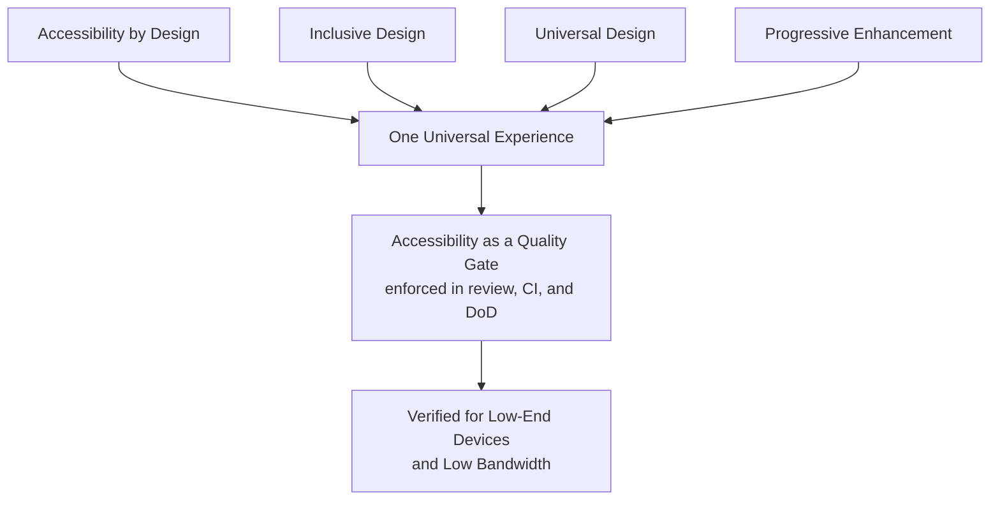
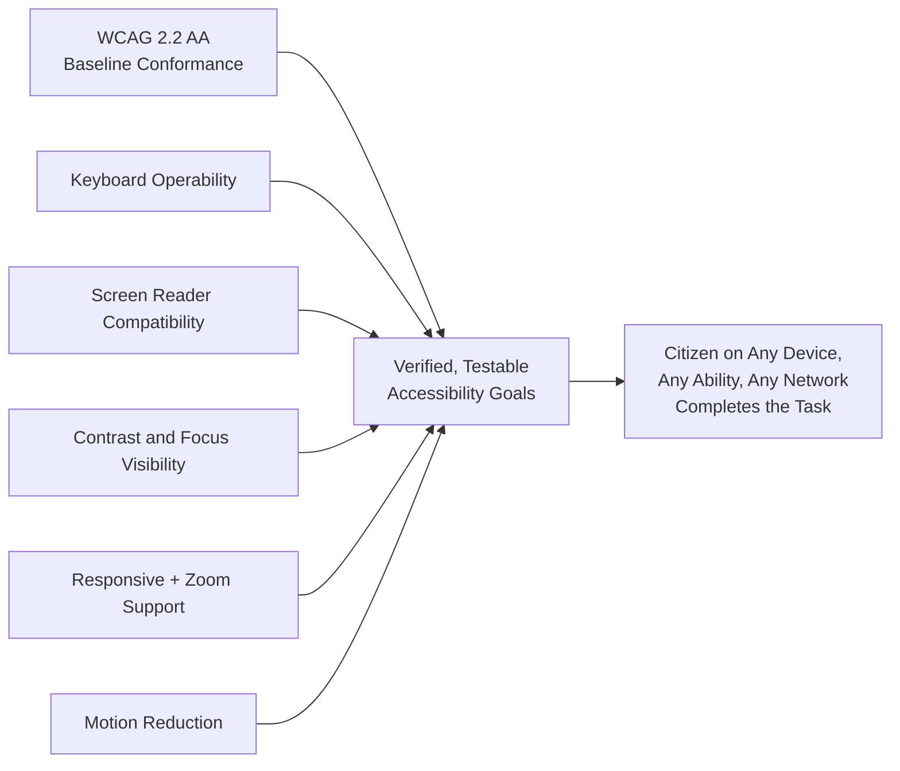
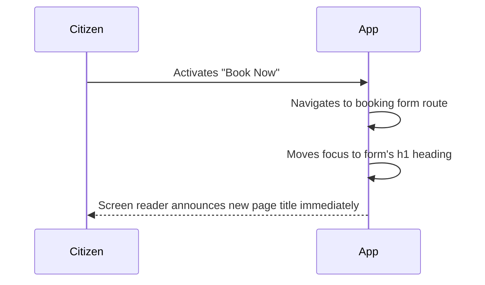
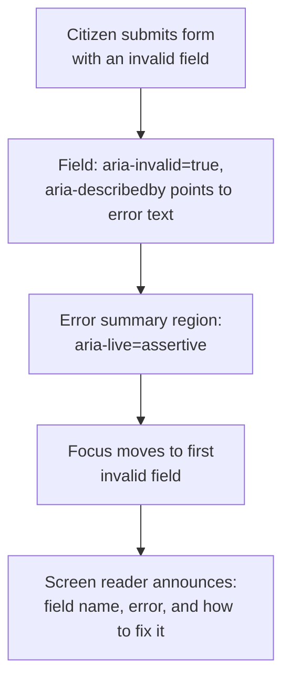
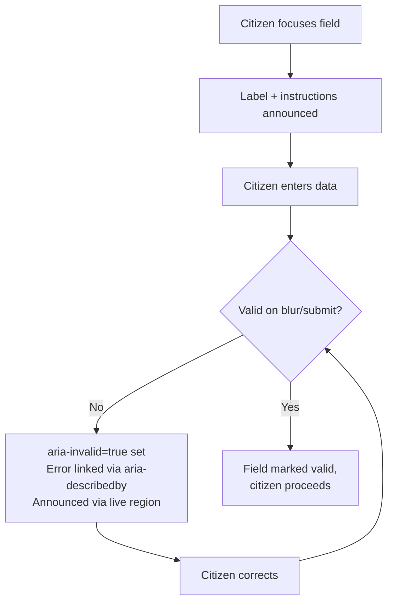
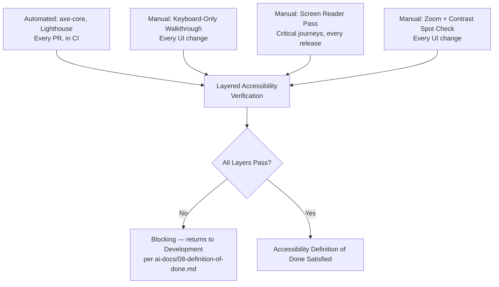

# Accessibility Standards

**Document:** `ai-docs/12-accessibility-standards.md`
**Project:** Arwal — The District Super App
**Stage:** 1 — Foundation
**Phase:** 13 — Accessibility Standards
**Status:** Approved for Engineering Reference
**Audience:** Architects, Engineers, Engineering Managers, UX/UI Designers, QA Engineers, Accessibility Engineers, Content Designers, Technical Reviewers, Government Technical Partners, Auditors

> **Callout — Purpose of This Document**
> `ai-docs/00-project-vision.md` defined why Arwal exists. `ai-docs/01-product-goals.md` defined what Arwal must achieve. `ai-docs/02-engineering-principles.md` defined how engineers reason about design. `ai-docs/03-system-architecture-principles.md` defined how the system is structured. `ai-docs/04-folder-guidelines.md` defined where that structure physically lives. `ai-docs/05-coding-standards.md` defined how individual lines of code are written. `ai-docs/06-git-workflow.md` defined how change moves through version control. `ai-docs/07-development-workflow.md` defined how a day of engineering work unfolds. `ai-docs/08-definition-of-done.md` defined when a piece of work is actually finished. `ai-docs/09-tech-stack.md` named the concrete technologies everything is built from. `ai-docs/10-security-standards.md` defined the enforceable security standard those technologies must satisfy. `ai-docs/11-performance-standards.md` defined the enforceable, measurable performance standard those technologies must satisfy. This document defines **the enforceable accessibility standard** every screen, component, flow, and interaction Arwal ships must satisfy — the specific, testable rules that turn "Inclusion over Optimization" and "Design for the Slowest Device and Weakest Signal," both founding pillars of `ai-docs/00-project-vision.md`, from stated values into verifiable, auditable engineering practice, for every one of the ~300 micro-phases still ahead.

---

# Purpose of this Document

Every phase document preceding this one touches accessibility without fully defining it. `ai-docs/00-project-vision.md` names Inclusion over Optimization as one of four founding philosophical pillars and dedicates an entire Accessibility Vision section to multi-language support, voice-first interaction, high-contrast/large-target UI modes, screen-reader compliance, low-bandwidth optimization as an equity issue, and assisted/delegated access. `ai-docs/01-product-goals.md` restates WCAG 2.1 AA as a Non-Functional Goal and a Must-Have priority, and every persona in its User Goals section — Meena the rural farmer, Devendra the elderly citizen, Suresh the low-digital-literacy shop owner — is defined by an accessibility need the product must serve, not an edge case it may choose to serve. `ai-docs/02-engineering-principles.md` establishes Accessibility-First as a Frontend Engineering Principle and sets WCAG 2.1 AA as "the floor, not the target." `ai-docs/03-system-architecture-principles.md` requires every module to be legible and usable regardless of which surface renders it. `ai-docs/05-coding-standards.md` gives concrete React-level rules — Error Boundaries with citizen-safe fallbacks, semantic component composition, Server/Client Component discipline. `ai-docs/07-development-workflow.md` defines a UI Development Workflow with a mandatory accessibility check before code review. `ai-docs/08-definition-of-done.md` makes a manual accessibility pass a non-negotiable exit gate for any UI change, explicitly calling out "CI green but accessibility failed" as a Common False Positive. `ai-docs/09-tech-stack.md` selected shadcn/ui specifically because it is "owned in-repo" and can be "audited for accessibility without waiting on an upstream maintainer," and selected Testing Library specifically because its query API "reinforces Accessibility-First... at the level of the test suite itself."

What none of those documents does — because it is not their job to — is define, in one place, **the complete, specific, testable accessibility standard itself**: exactly what "accessible" means for a form field, a modal dialog, a data table, a bottom navigation bar, a toast notification, or an AI-generated response at Arwal. Accessibility mentioned everywhere but specified nowhere is not an accessibility program; it is a good intention distributed so thinly across twelve documents that no single engineer, designer, reviewer, or auditor can point to the actual bar being held — exactly the failure mode `ai-docs/10-security-standards.md` and `ai-docs/11-performance-standards.md` were written to close for their respective domains.

This document exists to:

1. **Consolidate every accessibility-relevant principle scattered across Phases 1–12 into one authoritative, standalone reference** — the document a designer, engineer, or accessibility auditor opens first, and the document every other phase document's accessibility references ultimately resolve to.
2. **Convert Arwal's civic mandate into concrete accessibility obligation.** A 68-year-old citizen sharing a phone with his son to renew a certificate, a low-literacy farmer navigating by voice on a cracked entry-level screen, a citizen with low vision zooming a booking confirmation to 200%, and a citizen using a screen reader to submit a government grievance are not abstractions in this document — they are the specific people this document exists to guarantee a working experience for, per the Cross-Cutting User Principle in `ai-docs/01-product-goals.md`: *"the platform must never make them feel like a second-class user compared to a more 'premium' or 'urban' counterpart."*
3. **Give every engineer, designer, reviewer, and government technical partner a single, citable accessibility standard** — "this violates the Keyboard Navigation Standards in Phase 13" is exactly as legitimate and actionable a review comment as citing SOLID from Phase 3 or a security control from Phase 11.
4. **Make accessibility measurable, not subjective.** Every rule in this document resolves to a testable condition — a contrast ratio, a touch-target size, an ARIA attribute, a tab order, a `prefers-reduced-motion` check — never a vague aspiration like "should feel usable." A testable condition can be automated in CI, verified manually, and enforced in code review; a feeling cannot.
5. **Serve as the binding reference for design review, accessibility testing, and compliance audit** for the entire life of the ~300-phase roadmap, revisited and amended only through the same Architectural Decision Record discipline established in `ai-docs/02-engineering-principles.md` and `ai-docs/03-system-architecture-principles.md`.

This document assumes and requires familiarity with all twelve preceding phase documents. It does not re-argue their reasoning — it is where that reasoning becomes a specific, enforceable, testable accessibility requirement.

---

# Accessibility Philosophy

Arwal's accessibility posture rests on six commitments. Together they answer the question every subsequent section in this document exists to make concrete: **what does "accessible" actually require, by default, before a single pixel is designed?**

### Accessibility by Design

Accessibility is never a post-launch audit bolted onto finished work — it is a property designed into a screen from its first wireframe, exactly as the Accessibility-First principle in `ai-docs/02-engineering-principles.md` requires: "Accessibility is designed in from the first component, not audited in afterward." A screen that is visually polished and functionally complete but was never evaluated for keyboard operability or screen-reader labeling has not met `ai-docs/08-definition-of-done.md`'s UI Definition of Done — it is an exclusion waiting to be discovered by a citizen, not by an auditor.

### Inclusive Design

Inclusive Design means designing *with* the range of human variation — permanent, temporary, and situational disability; a spectrum of literacy and language fluency; a spectrum of device and network quality — rather than designing for an assumed "average" user and retrofitting exceptions. A citizen typing one-handed while holding a child, a farmer reading in bright outdoor sunlight, and a citizen who is permanently blind are all facing an accessibility barrier in that moment; Inclusive Design treats all three as first-class design inputs, not as three unrelated edge cases handled by three unrelated patches.

### Universal Design

Where Inclusive Design shapes the process, Universal Design shapes the outcome: one experience, usable by the widest practical range of people, without requiring a separate "accessible version." Arwal never ships a parallel "accessibility mode" screen that lags behind the primary experience in features or polish — the primary experience *is* the accessible experience, per the same reasoning `ai-docs/04-folder-guidelines.md` applies to folder structure: a second, parallel path inevitably drifts out of sync and becomes second-class.

### Progressive Enhancement

The baseline experience — semantic HTML, a working form, a readable document — must function with no JavaScript, no advanced CSS, and no high-end rendering capability, consistent with the Design for the Slowest Device and Weakest Signal principle in `ai-docs/00-project-vision.md`. Enhancements (animation, rich interactivity, client-side validation feedback) are layered on top of that baseline, never substituted for it. A citizen on a feature-phone-adjacent Android device with JavaScript failing to load must still be able to read content and, wherever technically feasible, submit a form — the enhanced experience is a bonus for citizens whose devices and networks can support it, never the only path to the outcome.

### Accessibility as a Quality Gate

Accessibility is held to the exact same non-negotiable standing as security and performance in `ai-docs/10-security-standards.md` and `ai-docs/11-performance-standards.md`: a Blocking Issue in code review, a required item in `ai-docs/08-definition-of-done.md`'s UI Definition of Done, and a dedicated checkpoint in the UI Development Workflow (`ai-docs/07-development-workflow.md`). A feature that is fast, secure, and functionally correct but inaccessible has not met Arwal's Definition of Done, regardless of how it appears in a demo, for exactly the reason `ai-docs/08-definition-of-done.md` names explicitly: *"CI green but accessibility failed"* is a Common False Positive, not an acceptable outcome.

### Design for Low-End Devices and Low Bandwidth

Accessibility at Arwal is inseparable from the device and network reality described in `ai-docs/01-product-goals.md`'s Target Audience: predominantly entry-to-mid-range Android smartphones, meaningful population share on 2G/3G, wide variance in literacy. A screen-reader interaction that is technically correct but requires downloading 2MB of unnecessary JavaScript to become operable has not met Arwal's bar — accessibility and the Performance Standards in `ai-docs/11-performance-standards.md` are mutually reinforcing, not competing, concerns: semantic, server-rendered markup is both more accessible and lighter than an equivalent client-heavy reimplementation, per the same reasoning already established in the Accessibility vs. Performance Trade-offs subsection of `ai-docs/11-performance-standards.md`.



> **Callout — The One-Sentence Accessibility Philosophy**
> *"If a citizen cannot see, hear, tap precisely, read fluently, or afford a fast connection, and the platform still works for them, it works for everyone — build for that citizen first, not last."*

---

# Accessibility Goals

Accessibility goals are Arwal's headline, citizen-facing targets — measurable, testable, and traceable to a specific verification method, consistent with the Measure Before Optimizing discipline `ai-docs/11-performance-standards.md` establishes for performance and applied here to accessibility.

| Goal Area | Measurable Target | Verification Method |
|---|---|---|
| **WCAG Conformance** | WCAG 2.2 Level AA, full conformance, across every citizen-facing and admin-facing surface; Level AAA is the aspirational target for critical civic flows (application submission, grievance redress), per `ai-docs/00-project-vision.md`'s Accessibility Vision. | Automated scan (axe-core) + manual audit against the WCAG 2.2 success criteria, per screen, before release. |
| **Keyboard Accessibility** | 100% of interactive functionality operable via keyboard alone, with no keyboard trap, on every surface that supports a physical or software keyboard. | Manual keyboard-only walkthrough (see Accessibility Testing below); zero Tab-reachable dead ends. |
| **Screen Reader Compatibility** | Every citizen-critical journey (browse, cart, checkout, booking, civic application submission) is fully completable using VoiceOver (iOS/Safari), TalkBack (Android/Chrome), and NVDA (Windows/Chrome desktop admin), with no unlabeled or misannounced element. | Manual screen-reader pass per critical journey, per release, per the Manual QA Focus Areas in `ai-docs/07-development-workflow.md`. |
| **Color Contrast** | 4.5:1 minimum for normal text, 3:1 minimum for large text (≥ 18pt or ≥ 14pt bold) and for meaningful UI component/graphical-object boundaries, per WCAG 2.2 SC 1.4.3 and 1.4.11. | Automated contrast check (axe-core) integrated into `packages/ui` component tests; design-token-level enforcement (see Visual Accessibility below). |
| **Focus Visibility** | Every focusable element has a visible focus indicator meeting a minimum 3:1 contrast ratio against its adjacent colors, per WCAG 2.2 SC 2.4.11 (Focus Not Obscured) and SC 2.4.13 (Focus Appearance, AAA target). | Automated + manual keyboard walkthrough; no custom component ever suppresses the focus ring without supplying an equal-or-better replacement. |
| **Responsive Layouts** | Full functionality and no loss of content or operability from 320px viewport width up through desktop breakpoints, with no horizontal scrolling required at any width ≥ 320px for standard content, per WCAG 2.2 SC 1.4.10 (Reflow). | Automated viewport testing in Playwright (`ai-docs/09-tech-stack.md`) across the breakpoint matrix defined in the Styling Philosophy (`ai-docs/02-engineering-principles.md`). |
| **Zoom Support** | Content and functionality remain fully usable at 200% browser zoom and up to 400% text-only zoom, with no content clipped, overlapping, or requiring two-dimensional scrolling, per WCAG 2.2 SC 1.4.4 and 1.4.10. | Manual zoom testing at defined checkpoints in the UI Development Workflow. |
| **Motion Reduction** | Every non-essential animation respects `prefers-reduced-motion: reduce`, with an equivalent, immediate-state alternative provided, per WCAG 2.2 SC 2.3.3 (AAA) — treated as an Arwal-mandatory bar, not merely an AAA aspiration, given the platform's elderly and vestibular-sensitive user base. | Automated CSS audit (no motion outside a `prefers-reduced-motion: no-preference` guard) + manual verification with the OS-level reduced-motion setting enabled. |



> **Callout — Why WCAG 2.2, Not 2.1**
> `ai-docs/01-product-goals.md` and `ai-docs/02-engineering-principles.md` reference WCAG 2.1 AA, written at a time when 2.1 was the current published standard. This document adopts **WCAG 2.2 AA** as Arwal's baseline going forward, since 2.2 is fully backward-compatible with 2.1's success criteria and adds criteria directly relevant to Arwal's mobile-first, elderly, and low-literacy user base (larger Target Size, clearer Focus behavior, Accessible Authentication without cognitive-function tests). Adopting 2.2 rather than freezing at 2.1 is consistent with the Evolvable over Perfect commitment in `ai-docs/03-system-architecture-principles.md` — this is a superset adoption, not a deviation, and requires no ADR to supersede the earlier phase documents' 2.1 references.

---

# Semantic HTML Standards

Semantic HTML is Arwal's first and cheapest line of accessibility defense — a correctly chosen native element gives an entire category of accessibility behavior (keyboard operability, screen-reader announcement, browser-native affordances) for free, before a single line of ARIA is written. This directly extends the Readability Over Cleverness and Explicitness principles in `ai-docs/05-coding-standards.md` to markup itself: a `<button>` communicates its own purpose; a `<div onClick>` communicates nothing without extensive, error-prone reconstruction.

### Landmarks

Every page exposes a complete set of landmark regions — `<header>`, `<nav>`, `<main>`, `<aside>` (where relevant), and `<footer>` — so a screen-reader user can jump directly between regions rather than linearly traversing the entire page on every visit. Exactly one `<main>` per page, uniquely identifying the page's primary content. Every `<nav>` beyond the first carries an `aria-label` (e.g., `aria-label="Breadcrumb"`, `aria-label="Pagination"`) disambiguating its purpose.

```html
<!-- Required -->
<header>...</header>
<nav aria-label="Primary">...</nav>
<main>
  <h1>Book a Service Provider</h1>
  ...
</main>
<footer>...</footer>

<!-- Rejected — no landmarks, screen reader sees an undifferentiated wall of content -->
<div class="header">...</div>
<div class="content">...</div>
```

### Headings

Headings (`<h1>`–`<h6>`) form a single, logical outline per page — exactly one `<h1>` describing the page's primary purpose, with no heading level skipped purely for visual sizing (a heading is never chosen for its default font size; visual size is a Tailwind/token concern, per the Styling Philosophy in `ai-docs/02-engineering-principles.md`, entirely decoupled from semantic level). A screen-reader user navigating by heading (the single most common screen-reader navigation pattern) must be able to build an accurate mental model of the page from the heading outline alone.

### Forms

Every form control is a native, correctly-typed HTML element (`<input type="tel">`, `<input type="email">`, `<select>`, `<textarea>`) rather than a styled `<div>` reconstruction — native controls give correct mobile keyboard layouts, native validation hooks, and full screen-reader/AT support without additional engineering effort, directly serving both Accessibility-First and the Performance Coding Standards (`ai-docs/05-coding-standards.md`) by avoiding a heavier, hand-built equivalent.

### Labels

Every form control has a programmatically associated `<label>` (via `for`/`id`, or by wrapping) — a placeholder is never used as a substitute for a label, since placeholder text disappears on input and is not reliably announced by every assistive technology.

```html
<!-- Required -->
<label for="citizen-phone">Phone number</label>
<input id="citizen-phone" type="tel" name="phone" autocomplete="tel" />

<!-- Rejected — placeholder-as-label, disappears on focus, unreliable AT support -->
<input type="tel" placeholder="Phone number" />
```

### Buttons

`<button>` is used for every action that does not navigate to a new URL (submit, toggle, open a dialog); `<a href>` is used for every action that does navigate. A `<div>` or `<span>` with a click handler is never used in place of either — this is a Blocking Issue per the Component Composition standard in `ai-docs/05-coding-standards.md`, since a `<div>` gives no keyboard focus, no keyboard activation, and no accessible role without extensive manual ARIA reconstruction that is easy to get wrong and expensive to maintain.

### Links

Link text is descriptive out of context — "View booking details for Electrician visit, July 28" rather than a bare "Click here" or "Read more" repeated identically across a list, since screen-reader users frequently navigate a page via a list of all links extracted from their surrounding context. Where a shorter visible label is a deliberate design choice (a card's "View" link), the fuller context is supplied via `aria-label` or an associated visually-hidden span, never omitted entirely.

### Tables

`<table>` is used exclusively for genuinely tabular data (a booking history, a pricing comparison) and never for visual layout, per the same "use the element for its meaning, not its default rendering" discipline as Headings above. Every data table includes `<th>` header cells with an explicit `scope` (`col` or `row`), and a `<caption>` describing the table's purpose, so a screen-reader user can navigate cell-by-cell with correct row/column context announced automatically.

### Lists

`<ul>`/`<ol>`/`<li>` are used for any genuinely list-structured content (a catalog of shops, a set of filter options, a menu), never a sequence of `<div>`s styled to look like a list — a screen reader announces "list, 6 items" and lets a user navigate item-by-item only when the semantic list element is actually present.

| Element Category | Correct Choice | Common Mistake Rejected |
|---|---|---|
| Clickable, in-page action | `<button>` | `<div onClick>` |
| Navigational action | `<a href>` | `<button onClick={() => router.push(...)}>` used where a real link is expected |
| Form field | Native `<input>`/`<select>`/`<textarea>` with `<label>` | Custom `<div>`-based input with no label association |
| Tabular data | `<table>` with `<th scope>` | `<div>` grid styled to look like a table |
| Grouped items | `<ul>`/`<ol>`/`<li>` | Sequence of styled `<div>`s |
| Page region | `<main>`, `<nav>`, `<header>`, `<footer>` | Generic `<div>` with a CSS class name only |

---

# Keyboard Navigation Standards

Keyboard accessibility protects not only citizens who cannot use a pointing device, but every citizen relying on an external keyboard on a low-cost Android device, a government officer navigating a dense admin dashboard efficiently, and a citizen using switch-access or voice-control software that emulates keyboard input under the hood.

### Logical Tab Order

Tab order follows the visual and logical reading order of the page — determined by DOM order, never overridden with a positive `tabindex` value (which is forbidden outright at Arwal, since a positive `tabindex` creates a parallel, error-prone tab sequence that inevitably drifts from the visual layout as the page evolves). Where a component's visual position differs from its logical DOM position (a rare, deliberately justified layout case), the DOM order — not the CSS `order` property's visual effect — is what determines tab order, and this is treated as a signal to reconsider the layout rather than accepted as a permanent trade-off.

### Focus Management

Focus is moved programmatically, deliberately, and only when it aids the citizen's task — never left stranded after a navigation event, a modal close, or a dynamic content update. When a new view loads (a route change in `apps/web`/`apps/admin-web`), focus moves to the page's `<h1>` or its main content landmark, so a screen-reader user is not left with focus lingering on a now-irrelevant control from the previous view.



### Skip Links

Every page provides a visually-hidden-until-focused "Skip to main content" link as the very first focusable element, so a keyboard or screen-reader user is never forced to tab through an entire navigation header on every single page before reaching the actual content — a direct implementation of WCAG 2.2 SC 2.4.1 (Bypass Blocks) and a concrete expression of the No Dead Ends product principle in `ai-docs/00-project-vision.md`.

```tsx
// Required — first focusable element on every page layout
<a href="#main-content" className="sr-only focus:not-sr-only focus:absolute focus:top-2 focus:left-2">
  Skip to main content
</a>
...
<main id="main-content">...</main>
```

### Modal Dialogs

Every modal dialog traps focus within itself while open (Tab and Shift+Tab cycle only through the dialog's own focusable content, never escaping to the page behind it), moves focus to the dialog's first meaningful element (typically its heading or first form field) on open, restores focus to the exact element that triggered the dialog when it closes, and closes on `Escape`. A modal that lets a keyboard user tab "through" it into the obscured page behind is a Blocking Issue, since it silently traps a screen-reader user's context in a confusing, invisible state.

### Menus

Dropdown and navigation menus support arrow-key navigation between items once opened, `Enter`/`Space` to activate the focused item, and `Escape` to close and return focus to the triggering control — implemented via shadcn/ui's Radix-based primitives (`ai-docs/09-tech-stack.md`) wherever possible, since Radix's accessibility behavior is already audited and owned in-repo rather than hand-rebuilt per feature.

### Keyboard Shortcuts

Global keyboard shortcuts (where introduced, primarily on `apps/admin-web` for government-officer efficiency) are single-key or simple-combination shortcuts that never conflict with a citizen's assistive technology's own keybindings, are always documented and discoverable in-app, and are always re-mappable or disable-able, per WCAG 2.2 SC 2.1.4 (Character Key Shortcuts) — a single printable-character shortcut is never active without a way to turn it off, since it would otherwise interfere with speech-input and switch-access software.

---

# Screen Reader Support

Screen readers translate visual and structural information into speech or braille output. Arwal's ARIA usage exists exclusively to supply the information semantic HTML cannot express on its own — ARIA is a supplement to semantic HTML, never a replacement for it, per the WAI-ARIA "First Rule": *if a native HTML element or attribute has the semantics and behavior required, use it, rather than repurposing an element and adding ARIA.*

### ARIA Usage

ARIA attributes are added only where semantic HTML is genuinely insufficient — a custom combobox, a live status region, a progress indicator — and every ARIA role, state, and property added is one the engineer can explain the purpose of, per the Commenting Standards discipline in `ai-docs/05-coding-standards.md`: if you cannot say why an `aria-*` attribute is present, it should not be there. Adding ARIA roles defensively "just in case" is rejected under the same YAGNI reasoning (`ai-docs/02-engineering-principles.md`) applied to markup — an incorrect or redundant ARIA role actively harms accessibility by overriding the correct native semantics a screen reader would otherwise announce.

```html
<!-- Rejected — redundant, potentially harmful ARIA on a native element -->
<button role="button" aria-label="Submit">Submit</button>

<!-- Required — the native element already communicates this -->
<button>Submit</button>
```

### Live Regions

Dynamic content updates that occur without a full page navigation — a form validation error, a "Booking confirmed" toast, a cart item count changing — are announced to screen-reader users via an `aria-live` region, since a screen reader does not automatically notice a DOM change outside the user's current focus. `aria-live="polite"` is the default (the announcement waits for the screen reader to finish its current speech); `aria-live="assertive"` is reserved for genuinely time-critical interruptions (a session-expiry warning, a failed payment) and is never used for routine content.

```tsx
// A shared, reusable live-region component per ai-docs/04-folder-guidelines.md's
// Promotion Rule — used across every module that needs status announcements
<div aria-live="polite" role="status" className="sr-only">
  {statusMessage}
</div>
```

### Accessible Names

Every interactive element has an accessible name — the text a screen reader announces to identify it — derived, in order of preference, from its visible text content, an explicit `aria-label`, or an `aria-labelledby` reference to visible text elsewhere on the page. An icon-only button (a common pattern in Arwal's compact mobile UI) always carries an `aria-label` describing its action in plain language, never its icon name.

```tsx
// Rejected — icon-only button with no accessible name
<button><TrashIcon /></button>

// Required — accessible name supplied explicitly
<button aria-label="Delete saved address">
  <TrashIcon aria-hidden="true" />
</button>
```

### Roles

Custom interactive components built from non-native elements (a rare, justified exception per the Semantic HTML Standards above) declare the correct ARIA role matching their actual behavior (`role="dialog"`, `role="tablist"`/`role="tab"`/`role="tabpanel"`, `role="combobox"`) and implement the full expected keyboard and state behavior for that role per the WAI-ARIA Authoring Practices — a role is never applied without also implementing the interaction pattern that role promises to a screen-reader user, since an incomplete implementation is more confusing than no ARIA role at all.

### Descriptions

Where a control needs supplementary explanation beyond its name (a password field's complexity requirement, a form field's format hint), that description is linked via `aria-describedby`, so it is announced alongside the field's name and current state, rather than existing only as visible text a screen-reader user might never associate with the field.

### Error Announcements

Form validation errors are announced immediately and specifically — associated with their field via `aria-describedby`, marked with `aria-invalid="true"` on the field itself, and, for a form-level submission failure, summarized in an `aria-live="assertive"` region at the top of the form (or moved-to via focus) so a screen-reader user is not left silently on a failed submission, guessing which of several fields is at fault.



---

# Visual Accessibility

### Contrast Ratios

Every text/background and meaningful non-text (icon, input border, focus indicator) color pairing meets or exceeds the ratios in the Accessibility Goals table above, enforced structurally through Arwal's token-driven Styling Philosophy (`ai-docs/02-engineering-principles.md`): color tokens in `tailwind.config.ts` are pre-validated for contrast against their intended pairings at design-system definition time, so an engineer choosing a token from the approved palette cannot accidentally produce a non-compliant pairing — contrast compliance is a property of the design-token system itself, not a per-screen judgment call repeated by every engineer.

### Typography

Body text defaults to a minimum 16px equivalent (1rem) base size, with a type scale that remains legible at every supported zoom level; line height is set no tighter than 1.5 for body text and 1.3 for headings, per WCAG 2.2 SC 1.4.12 (Text Spacing), and no text is ever set in a fixed-pixel container that would clip or truncate it when a citizen increases their OS-level font size.

### Font Scaling

Every layout is built to reflow correctly as the citizen's OS-level or browser-level font size increases up to 200%, per WCAG 2.2 SC 1.4.4 — text is sized in relative units (`rem`, not fixed `px`) throughout `packages/ui` and every app's component layer, so a citizen who has increased their device's system font size for low vision sees that preference respected across the entire app, not just in the OS chrome.

### Color Independence

Color is never the sole means of conveying information — a required form field is marked with an explicit "Required" label or asterisk *and* not by red color alone; a booking status is conveyed by an icon and a text label *and* not by a colored dot alone; an error state changes the input's border style/icon *and* not merely its color, per WCAG 2.2 SC 1.4.1 — this directly protects citizens with color vision deficiency, a population meaningfully larger than most product teams assume, and citizens viewing the app in bright outdoor sunlight where subtle color differences wash out entirely.

```tsx
// Rejected — color is the only signal of status
<span className="text-red-500">●</span>

// Required — color, icon, and text together convey the same status
<span className="text-red-500 flex items-center gap-1">
  <AlertCircleIcon aria-hidden="true" /> Payment failed
</span>
```

### Icons

Every icon used to convey meaning (not purely decorative) is paired with a visible or accessible-name text label — an icon is never the sole carrier of meaning for an action a citizen must correctly interpret to complete a task, consistent with the low-literacy, first-generation-smartphone-user persona explicit in `ai-docs/01-product-goals.md`. Purely decorative icons (accompanying an already-labeled action) are marked `aria-hidden="true"` so they are not redundantly announced by a screen reader.

### Focus Indicators

Every focusable element displays a visible focus indicator at all times when reached via keyboard — never suppressed with `outline: none` without an equal-or-better custom replacement — meeting the 3:1 contrast target in the Accessibility Goals table, and never obscured by a sticky header, a modal overlay, or an adjacent element's z-index, per WCAG 2.2 SC 2.4.11.

---

# Motion & Animation

### `prefers-reduced-motion`

Every animation beyond a minimal, essential state transition is gated behind a `prefers-reduced-motion: no-preference` media query; when a citizen's OS is set to reduce motion, Arwal substitutes an instant or minimal-crossfade state change in its place, never a bare removal of the transition's end state.

```css
/* Required pattern, applied globally via packages/ui's shared styles */
@media (prefers-reduced-motion: no-preference) {
  .card-enter {
    animation: slide-fade-in 200ms ease-out;
  }
}
@media (prefers-reduced-motion: reduce) {
  .card-enter {
    animation: none;
  }
}
```

### Animation Guidelines

Animation is used deliberately, per the Framer Motion trade-off already acknowledged in `ai-docs/09-tech-stack.md`, to communicate state change (a card entering, a value updating) — never purely decoratively, and never in a way that could trigger a vestibular reaction (no more than three flashes per second, per WCAG 2.2 SC 2.3.1, and no large-area parallax or auto-playing background motion on any citizen-facing screen).

### Non-Essential Animations

Any animation whose removal does not change a citizen's ability to understand or complete a task is classified as non-essential and is the first category disabled under reduced motion — a loading spinner communicating "in progress" is essential and is retained in a reduced form (e.g., a static "Loading…" label plus a non-animated indicator) rather than removed entirely, since removing it would leave the citizen with no feedback at all.

### Performance vs. Accessibility

Where an animation choice would meaningfully conflict with the Performance Budgets in `ai-docs/11-performance-standards.md` (a heavy animation library import for a rarely-seen transition), the resolution favors the lighter-weight, CSS-native transition over a JavaScript animation library — since a citizen on an entry-level device benefits from both a snappier load and a motion-respecting experience simultaneously; performance and accessibility are treated as aligned constraints here, not competing ones, consistent with the Accessibility vs. Performance Trade-offs reasoning in `ai-docs/11-performance-standards.md`.

---

# Forms & Validation

Forms are Arwal's highest-stakes accessibility surface — a citizen unable to complete a booking, a payment, or a government application form has been denied a civic or commercial outcome entirely, not merely inconvenienced.

### Labels

Every field has a persistent, visible `<label>` (never a placeholder-only field, per Semantic HTML Standards above), positioned immediately adjacent to its field so the visual and programmatic association match, per WCAG 2.2 SC 1.3.1 and 2.5.3 (Label in Name — the accessible name must contain the visible label text verbatim).

### Instructions

Format and input instructions ("10-digit mobile number, no country code") are supplied as visible, persistent text associated via `aria-describedby`, not only as a placeholder that vanishes on focus and is unavailable to a screen-reader user navigating by field afterward.

### Required Fields

Required fields are marked with the native `required` HTML attribute (giving both browser-native validation behavior and automatic `aria-required` semantics) plus a visible, non-color-only indicator (the word "required" or a clearly labeled asterisk with a legend), per Color Independence above.

### Error Messages

Error messages are specific, actionable, and written in plain citizen-facing language — "Enter a 10-digit mobile number" rather than "Invalid input" — consistent with the citizen-safe messaging standard already established for API errors in `ai-docs/05-coding-standards.md`. Every error message is programmatically associated with its field (`aria-describedby`) and visually adjacent to it, never displayed only in a distant summary the citizen must scroll to locate.

### Validation Feedback

Validation happens at a moment that respects the citizen's flow: inline, on blur or on submit, never on every keystroke in a way that interrupts an in-progress, not-yet-complete entry (e.g., flagging an email address as invalid before the citizen has finished typing it). A successful correction clears the error state and its announcement immediately, confirmed via the same live-region pattern established in Screen Reader Support above.

### Accessible Autocomplete

Every field capturing a common personal-data type (name, phone, address, OTP) sets the correct `autocomplete` attribute value (`autocomplete="tel"`, `autocomplete="name"`, `autocomplete="one-time-code"`, etc.), per WCAG 2.2 SC 1.3.5 — this both improves the experience for citizens using browser/OS-level autofill and is an explicit WCAG 2.2 AA requirement in its own right, distinct from and complementary to the mobile-keyboard-type benefit of correct native input types.



---

# Mobile Accessibility

Given `ai-docs/01-product-goals.md`'s Device Profile — predominantly entry-to-mid-range Android smartphones — mobile accessibility is not a secondary concern layered onto a desktop-first design; it is Arwal's primary accessibility surface, consistent with Responsive-First in `ai-docs/02-engineering-principles.md`.

### Touch Target Sizes

Every interactive element has a minimum touch target of 24×24 CSS pixels (WCAG 2.2 SC 2.5.8, AA), with Arwal's own internal standard set higher, at 44×44 CSS pixels, for any primary or frequently-used action — matching the iOS Human Interface Guidelines and Android Material Design's own long-established recommendation, and directly serving citizens with motor-control limitations, citizens using the app one-handed, and citizens using the app on a cracked or degraded touchscreen. Adjacent touch targets maintain sufficient spacing to prevent accidental mis-taps, per the same dignity-of-access reasoning already applied to Cumulative Layout Shift in `ai-docs/11-performance-standards.md`.

### Orientation

No screen locks to a single orientation (portrait-only or landscape-only) unless the content genuinely requires it (e.g., a scanned-document viewer), per WCAG 2.2 SC 1.3.4 — a citizen who has mounted their phone in landscape orientation for a physical or situational reason must still be able to complete every core flow.

### Gestures

Every action reachable via a complex, multi-point, or path-based gesture (a swipe-to-delete, a pinch-to-zoom) has an equivalent single-tap alternative reachable through a visible control, per WCAG 2.2 SC 2.5.1 (Pointer Gestures) — a citizen with limited fine motor control, or using a switch-access device, must never be locked out of an action because it is only reachable via a gesture.

### VoiceOver

`apps/web`/`apps/admin-web`, rendered inside Safari on iOS, and any future native `apps/mobile` iOS build (`ai-docs/09-tech-stack.md`) are tested against VoiceOver as a mandatory manual QA step per critical journey — VoiceOver's rotor navigation (by heading, by form field, by link) is exercised specifically, since it is the primary navigation mechanism experienced screen-reader users rely on, not linear swipe-through alone.

### TalkBack

The same manual QA discipline applies to TalkBack on Android Chrome, Arwal's single largest expected screen-reader user base given the Device Profile in `ai-docs/01-product-goals.md`. TalkBack's "explore by touch" and linear swipe navigation are both exercised, and any custom gesture Arwal introduces is verified not to conflict with TalkBack's own system-level gesture vocabulary.

---

# Multilingual Accessibility

### Language Attributes

Every HTML document declares its primary language via `<html lang="hi">` (or the relevant regional-language code), and any embedded passage in a different language (a government form field rendered in English within an otherwise Hindi page) is wrapped with its own `lang` attribute — this is not a cosmetic detail: a screen reader uses the `lang` attribute to select the correct pronunciation engine, and an incorrect or missing `lang` attribute produces unintelligible speech output for exactly the low-literacy, voice-reliant citizens `ai-docs/00-project-vision.md`'s Accessibility Vision commits to serving.

### Hindi and Regional Language Support

Every citizen-facing string is externalized through `packages/i18n` (`ai-docs/04-folder-guidelines.md`), never hardcoded inline, and every supported language — starting with Hindi and the founding district's dominant regional language(s), per the Language Constraint in `ai-docs/01-product-goals.md` — is held to the identical accessibility bar as English: the same contrast tokens, the same semantic structure, the same ARIA labeling discipline, translated and reviewed by a fluent speaker, never machine-translated without human accessibility review.

### Font Rendering

Fonts selected for Devanagari and other regional scripts are chosen and tested specifically for legibility at Arwal's minimum body-text size and under Arwal's font-scaling requirements (see Visual Accessibility above) — a font that renders crisply in Latin script at 16px is not assumed to render equally legibly in Devanagari at the same size, and font choice for non-Latin scripts is a distinct, explicitly reviewed design decision, not an afterthought bolted onto a Latin-first type system.

### RTL Readiness (Future)

While Arwal's founding-district languages are left-to-right, the component layer in `packages/ui` is built using logical CSS properties (`margin-inline-start`, `padding-inline-end`) rather than physical properties (`margin-left`, `padding-right`) wherever Tailwind's utility classes support the logical equivalent, per the Configuration-Driven Localization and Expansion technical goal in `ai-docs/01-product-goals.md` — this is a genuine, low-cost, evidence-adjacent hedge (not a speculative YAGNI violation, since Arwal's own roadmap explicitly names expansion to other regions and languages) that keeps a future right-to-left language addition a configuration and translation exercise rather than a component-layer rewrite.

---

# Accessibility Testing

Accessibility testing follows the same layered, never-single-point-of-failure discipline `ai-docs/10-security-standards.md`'s Defense in Depth applies to security: automated tooling catches the mechanically detectable subset of issues quickly and cheaply, while manual and assistive-technology testing catches the substantial remainder automated tooling cannot see.



### Automated Testing

**axe-core** is integrated directly into Arwal's testing stack (`ai-docs/09-tech-stack.md`): as an assertion library inside Vitest/Testing Library component tests for `packages/ui` and `apps/web`/`apps/admin-web`, and as a required check inside the Playwright E2E suite for full-page scans of every critical citizen journey. An axe-core violation above the `serious`/`critical` severity threshold is a Blocking Issue in CI, per the same non-negotiable authority the Bundle Size Budget check carries in `ai-docs/11-performance-standards.md`.

**Lighthouse** accessibility audits run as part of the CI performance-budget pipeline already established in `ai-docs/11-performance-standards.md`, with a minimum Lighthouse Accessibility score of 95 enforced as a required status check for any citizen-facing route — a regression below this threshold blocks merge exactly as a bundle-size budget violation does.

Automated testing is understood to catch roughly 30–50% of real-world accessibility issues (an industry-recognized limitation of tooling, not an Arwal-specific gap) — it is a fast, cheap first pass, never treated as a substitute for the manual layers below, per the same "CI green is necessary, never sufficient" reasoning `ai-docs/08-definition-of-done.md` applies to functional testing.

### Manual Testing

A manual accessibility review is a required step in the UI Development Workflow (`ai-docs/07-development-workflow.md`), performed before code review, on every UI change that introduces a new interactive component or modifies an existing one's structure.

### Keyboard-Only Testing

The engineer or designated reviewer disconnects/ignores the pointing device entirely and completes the full flow using only Tab, Shift+Tab, Enter, Space, and arrow keys — verifying logical tab order, visible focus at every step, no keyboard trap, and full operability of every control, per the Keyboard Navigation Standards above.

### Screen Reader Testing

Every critical citizen journey (per the Screen Reader Compatibility goal above) is walked through start-to-finish using VoiceOver, TalkBack, and — for `apps/admin-web` — NVDA, on a defined cadence (before every release touching that journey, at minimum) by a reviewer trained in basic screen-reader operation, verifying that every announcement is accurate, every control is correctly named, and every error state is announced per the Screen Reader Support standards above.

### Testing Matrix

| Test Layer | Tooling | Frequency | Scope | Blocking? |
|---|---|---|---|---|
| Automated component scan | axe-core + Testing Library | Every commit (CI) | `packages/ui` components | Yes — serious/critical violations |
| Automated page scan | axe-core (Playwright) + Lighthouse | Every PR (CI) | Every citizen-facing route | Yes — score below 95 or serious/critical violation |
| Keyboard-only walkthrough | Manual | Every UI change | The changed screen/flow | Yes — per UI Definition of Done |
| Screen reader pass | VoiceOver / TalkBack / NVDA, manual | Every release touching a critical journey | Checkout, booking, civic application submission | Yes — per UI Definition of Done |
| Zoom + contrast spot check | Manual + browser DevTools | Every UI change | The changed screen/flow | Yes — per UI Definition of Done |
| Full accessibility audit | Automated + manual, comprehensive | Quarterly, and ahead of any major release | Entire platform | Findings tracked as prioritized technical debt, per `ai-docs/02-engineering-principles.md` |

---

# Accessibility Review Checklist

Every pull request introducing or modifying a UI screen or component is checked against the following before merge, extending the UI Development Workflow (`ai-docs/07-development-workflow.md`) and the UI Definition of Done (`ai-docs/08-definition-of-done.md`):

- [ ] **Semantic HTML** — Native elements (`<button>`, `<a>`, `<label>`, `<table>`, `<ul>`) are used correctly; no `<div>`/`<span>` is repurposed as an interactive control without justification.
- [ ] **Landmarks and headings** — The page exposes correct landmark regions and a single, logical heading outline with no skipped levels chosen for visual sizing.
- [ ] **Keyboard operability** — Every interactive element is reachable and operable via keyboard alone, in a logical tab order, with no positive `tabindex` and no keyboard trap.
- [ ] **Focus management** — Focus moves deliberately on navigation, modal open/close, and dynamic updates; a visible, sufficiently contrasted focus indicator is present at every step.
- [ ] **Skip link present** — Every new page/layout retains or correctly extends the shared skip-to-main-content link.
- [ ] **Accessible names** — Every interactive element, especially icon-only controls, has a correct, descriptive accessible name.
- [ ] **ARIA used correctly and minimally** — No redundant or incorrect ARIA on native elements; any custom-component ARIA role is paired with its full expected keyboard/state behavior.
- [ ] **Live regions for dynamic content** — Toasts, validation errors, and status changes are announced via an appropriately-scoped `aria-live` region.
- [ ] **Contrast compliance** — All text and meaningful non-text color pairings meet the ratios in the Accessibility Goals table, using approved design tokens only.
- [ ] **Color independence** — No information is conveyed by color alone.
- [ ] **Touch targets** — Every interactive element meets the 44×44px internal standard (24×24px absolute WCAG floor).
- [ ] **Motion respects `prefers-reduced-motion`** — Any new animation is gated and has a reduced-motion equivalent.
- [ ] **Forms fully labeled and validated accessibly** — Persistent labels, correct `autocomplete`, `aria-describedby`-linked errors, and `aria-invalid` state.
- [ ] **Responsive and zoom-safe** — The screen reflows correctly from 320px width and remains usable at 200% zoom with no clipped or overlapping content.
- [ ] **Language attributes correct** — `lang` is set correctly on the document and on any mixed-language passage.
- [ ] **Automated scan clean** — axe-core and Lighthouse Accessibility checks pass in CI with no serious/critical violation and a score ≥ 95.
- [ ] **Manual keyboard-only walkthrough completed** — Documented in the PR per the Testing Evidence section of the PR template (`ai-docs/06-git-workflow.md`).
- [ ] **Screen reader pass completed (critical journeys only)** — Documented in the PR for any change touching checkout, booking, or civic application submission.

A pull request failing any item above is not merged until resolved, or an explicit, reviewed exception is documented — this checklist carries the same non-negotiable authority as every other review checklist established in the preceding twelve phase documents.

---

# Closing Statement

> **Callout — Closing Statement**
> Every preceding phase document described a dimension of how Arwal is built well, built safely, and built fast; this document describes how Arwal is built *for everyone* — for the citizen who cannot see the screen, the citizen who cannot hear a notification chime, the citizen who cannot hold a phone steady enough for a precise tap, the citizen who cannot read fluently, and the citizen whose only device is an entry-level Android phone on a flickering 2G signal. None of these citizens experience Arwal's architecture, its coding standards, or its performance budgets directly — they experience only whether the certificate got renewed, the booking got confirmed, and the payment went through, using whatever combination of ability, device, language, and assistive technology is true for them that day. Accessibility at Arwal is not a compliance checkbox satisfied once at launch — it is a standard every one of the ~300 micro-phases still ahead is measured against, continuously, from the first semantic `<button>` written to the millionth citizen's daily use of the platform. A feature that is fast, secure, and functionally correct but inaccessible has not met Arwal's Definition of Done, regardless of how it appears in a demo — because, per the founding Inclusion over Optimization pillar in `ai-docs/00-project-vision.md`, a platform that works only for the citizen with the newest phone and the fastest signal has already failed the district it exists to serve. Where a future phase must deviate from a standard stated here, that deviation is made explicitly — through a documented, accessibility-reviewed exception, or an Architectural Decision Record where the deviation is structural — never silently, and never by default.

This document, `ai-docs/12-accessibility-standards.md`, is the thirteenth phase of approximately 300. Every screen, component, form, dialog, and interaction built in the phases that follow is expected to satisfy the standards defined here, or to justify its deviation in writing.

**End of Phase 13 — `ai-docs/12-accessibility-standards.md`**