# Database Design Guidelines

**Document:** `ai-docs/14-database-design-guidelines.md`
**Project:** Arwal — The District Super App
**Stage:** 1 — Foundation
**Phase:** 15 — Database Design Guidelines
**Status:** Approved for Engineering Reference
**Audience:** Architects, Backend Engineers, Database Administrators, Data Engineers, QA Engineers, Technical Reviewers, Government Technical Partners, Auditors

> **Callout — Purpose of This Document**
> `ai-docs/00-project-vision.md` defined why Arwal exists. `ai-docs/01-product-goals.md` defined what Arwal must achieve. `ai-docs/02-engineering-principles.md` defined how engineers reason about design. `ai-docs/03-system-architecture-principles.md` defined how the system is structured. `ai-docs/04-folder-guidelines.md` defined where that structure physically lives. `ai-docs/05-coding-standards.md` defined how individual lines of code are written. `ai-docs/06-git-workflow.md` defined how change moves through version control. `ai-docs/07-development-workflow.md` defined how a day of engineering work unfolds. `ai-docs/08-definition-of-done.md` defined when a piece of work is actually finished. `ai-docs/09-tech-stack.md` named the concrete technologies everything is built from. `ai-docs/10-security-standards.md` defined the enforceable security standard those technologies must satisfy. `ai-docs/11-performance-standards.md` defined the enforceable, measurable performance standard those technologies must satisfy. `ai-docs/12-accessibility-standards.md` defined the enforceable accessibility standard every screen must satisfy. `ai-docs/13-api-design-guidelines.md` defined the enforceable API contract standard every endpoint must satisfy. This document defines **the enforceable database design standard** — the specific, citable rules that govern every table, column, relationship, index, migration, and transaction Arwal will ever persist, across `apps/api`'s PostgreSQL-backed modules, for every one of the ~300 micro-phases still ahead.

---

# Purpose of this Document

Every phase document preceding this one touches the database without fully specifying it. `ai-docs/00-project-vision.md` commits Arwal to enterprise-grade infrastructure serving over a million citizens, with data partitioning planned from Phase 1. `ai-docs/01-product-goals.md` names Data Partitioning Strategy from Day One and AI-Ready Data Foundations as Technical Goals. `ai-docs/02-engineering-principles.md` establishes the Database Principles — Data Integrity, Normalization, Migrations, Indexing, Soft Deletes, and Audit Trails — as foundational engineering disciplines. `ai-docs/03-system-architecture-principles.md` establishes Data Ownership Principles (one module, one schema, never a shared database) and the district → ward → zone partitioning strategy as system-architecture-level commitments. `ai-docs/04-folder-guidelines.md` gives every module's persistence layer a physical home (`domain/repositories`, `infrastructure/repositories`, `infrastructure/mappers`). `ai-docs/05-coding-standards.md` gives line-level Database Coding Standards — naming conventions, primary key strategy, foreign key rules, transaction scoping, migration discipline. `ai-docs/06-git-workflow.md` and `ai-docs/07-development-workflow.md` define the Database Change Workflow governing how a schema change moves from design to production. `ai-docs/08-definition-of-done.md` makes migration review, rollback planning, index validation, and soft-delete compliance a non-negotiable exit gate. `ai-docs/09-tech-stack.md` names PostgreSQL, Prisma, Redis, and PgBouncer as the concrete technologies the persistence layer is built from. `ai-docs/10-security-standards.md` defines encryption at rest, key management, and SQL injection prevention as enforceable security controls. `ai-docs/11-performance-standards.md` defines measurable query-latency, indexing, and caching targets. `ai-docs/13-api-design-guidelines.md` defines the pagination, filtering, and idempotency contract a database-backed endpoint must expose.

What none of those documents does — because it is not their job to — is define, in one place, **the complete, specific, citable database design standard itself**: exactly what a table should look like, exactly when a relationship becomes a junction table, exactly which normal form a schema must satisfy before denormalizing, and exactly how a migration is written so a rolling deployment never breaks. A database principle repeated across thirteen documents but never assembled into one canonical schema-design reference is not a database standard — it is a set of hints an engineer must reconstruct from memory at 11pm while writing a migration, which guarantees drift the moment two engineers reconstruct it differently.

This document exists to:

1. **Consolidate every database-relevant principle scattered across Phases 1–14 into one authoritative, standalone reference** — the document a backend engineer, DBA, or data engineer opens first, and the document every other phase document's database references ultimately resolve to.
2. **Convert Arwal's civic mandate into concrete data-modeling obligation.** A citizen's booking history, a farmer's subsidy application, a merchant's wallet ledger, and a government officer's audit trail are not abstractions in this document — they are the specific records this document exists to model correctly, protect from corruption, and keep queryable at district scale, forever.
3. **Give every engineer, reviewer, and government technical partner a single, citable database standard** — "this violates the Normalization Standards in Phase 15" is exactly as legitimate and actionable a review comment as citing SOLID from Phase 3 or an API rule from Phase 14.
4. **Protect the 1,000,000+ user scale target and the ~300-phase roadmap simultaneously** — a schema decision made carelessly at Phase 15 becomes a full-table migration at Phase 200; a schema decision made with the discipline this document requires becomes a foundation the next 285 phases build on without regret.
5. **Serve as the binding reference for schema review, migration review, query-plan review, and disaster-recovery drills** for the entire life of the ~300-phase roadmap, revisited and amended only through the same Architectural Decision Record discipline established in `ai-docs/02-engineering-principles.md` and `ai-docs/03-system-architecture-principles.md`.

This document assumes and requires familiarity with all fourteen preceding phase documents. It does not re-argue their reasoning — it is where that reasoning becomes a specific, enforceable database design rule.

---

# Database Design Philosophy

Arwal's database design rests on seven commitments. Together they answer the question every subsequent section of this document exists to make concrete: **what does a well-designed schema actually require, by default, before a single table is created?**

### Source of Truth

Every fact in the system has exactly one authoritative owner, per the Single Source of Truth principle in `ai-docs/02-engineering-principles.md` and the Data Ownership Principles in `ai-docs/03-system-architecture-principles.md`. A module's PostgreSQL schema is that module's — and only that module's — source of truth for the data it owns. No other module's schema, cache, or read model is ever treated as authoritative; a cache is a copy with a defined invalidation rule, never a second source of truth competing with the first.

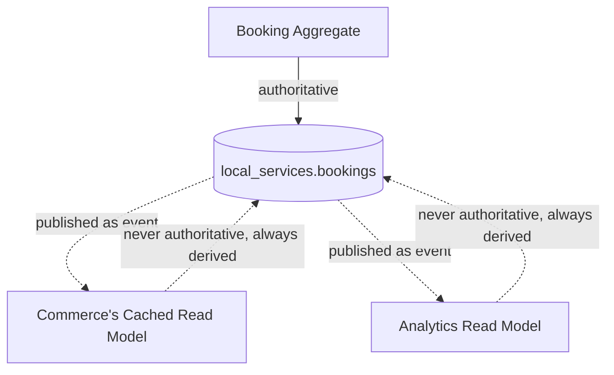

### Data Integrity

The database is the last line of defense against an invalid state, per the Data Integrity principle in `ai-docs/02-engineering-principles.md` — application-level validation is the first line, but it is never trusted alone. Foreign keys, unique constraints, not-null constraints, and check constraints are applied wherever a business invariant can be expressed declaratively, because an invariant enforced only in application code is an invariant that a future bug, a manual data-fix script, or a forgotten code path will eventually violate.

### Normalization First

Every schema starts normalized — typically to Third Normal Form — by default, per the Normalization principle in `ai-docs/02-engineering-principles.md`. Normalization is the default posture specifically because it eliminates update anomalies (the same fact stored in two places silently drifting apart) before they can occur, not because normalization is dogma for its own sake.

### Intentional Denormalization

Denormalization is never a starting posture — it is a deliberate, documented, evidence-based exception applied only where a specific, measured read-performance need justifies it, per the same Normalization principle. A denormalized field always has an explicit owner responsible for keeping it consistent (a database trigger, an event-driven read-model rebuild) — denormalization without an explicit consistency mechanism is not an optimization, it is a data-integrity bug waiting to be discovered by a citizen seeing stale data.

### Evolvability

A schema designed for a ~300-micro-phase roadmap cannot be perfect on day one — it must be **safe to change** on day 200. Every migration is additive-first, backward-compatible during rollout, and reversible in spirit if not always in a literal down-migration, per the Migrations principle in `ai-docs/02-engineering-principles.md` and the Database Change Workflow in `ai-docs/07-development-workflow.md`. Evolvability is treated as a property to design for explicitly — a nullable column left available for a known future need, a partition key present in the schema even before physical partitioning is triggered — not an afterthought discovered when the first breaking schema change is attempted.

### Performance

Query performance is a first-class design input from the moment a table is drafted, not a tuning pass applied after a citizen complaint, per the Performance Standards in `ai-docs/11-performance-standards.md`. Every access pattern a table is expected to serve at meaningful volume is considered at design time — what will be filtered on, what will be sorted by, what will be joined against — so that indexing decisions are a natural consequence of the schema's design, not a reactive scramble.

### Auditability

Every sensitive state change is recorded in a way that survives the operational row's own lifecycle, per the Audit Trails principle in `ai-docs/02-engineering-principles.md` and the Logging & Audit Standards in `ai-docs/10-security-standards.md`. A schema design that makes "what happened, and who did it" unanswerable after the fact has failed a civic-infrastructure platform's most basic obligation to the citizens and government partners who depend on it, regardless of how normalized or performant it otherwise is.

> **Callout — The One-Sentence Database Philosophy**
> *"A schema is a promise about what can never silently become untrue — design every table so that promise holds at 10 rows, at 10 million rows, and at Phase 250, without anyone needing to remember why."*

---

# Schema Design

### Naming Conventions

Naming is Convention over Configuration (`ai-docs/02-engineering-principles.md`) applied to the schema itself — it removes an entire category of "is it `booking_id` or `bookingId` here" decision an engineer would otherwise re-litigate per table, extending the identical table already established in `ai-docs/05-coding-standards.md`.

| Object | Convention | Example | Why |
|---|---|---|---|
| Table | `snake_case`, plural | `bookings`, `service_providers` | Plural reflects a collection of rows, matching the plural-resource convention already established for URIs in `ai-docs/13-api-design-guidelines.md`; consistency across the API and schema layers halves the cognitive translation an engineer performs moving between them. |
| Column | `snake_case` | `scheduled_at`, `provider_id` | Matches PostgreSQL's own case-folding behavior — an unquoted mixed-case identifier is silently lowercased by PostgreSQL, so `snake_case` avoids a class of confusing, case-sensitivity bugs entirely. |
| Primary key | `id` | `id` | A single, predictable name for every table's primary key means a `JOIN` clause never requires looking up what a table calls its own identifier. |
| Foreign key | `<referenced_singular>_id` | `provider_id` referencing `service_providers.id` | The column name alone tells a reader what it references, without needing to open the migration file. |
| Junction table | `<table_a_singular>_<table_b_singular>` | `booking_promotions` | Alphabetically/semantically ordered, singular-singular, so a many-to-many relationship's join table is discoverable by guessing. |
| Index | `idx_<table>_<columns>` | `idx_bookings_provider_id_status` | Encodes both the table and the exact column order in the name itself, so `\di` output is self-documenting without opening the migration. |
| Unique constraint | `uq_<table>_<columns>` | `uq_bookings_provider_id_scheduled_at` | Distinguishes a uniqueness constraint from a plain index at a glance, since the two serve different purposes despite similar implementation. |
| Check constraint | `ck_<table>_<rule>` | `ck_wallets_balance_non_negative` | Names the business rule being enforced, turning a constraint violation error into a self-explanatory message during debugging. |
| Enum-backed column values | Matches the TypeScript enum's serialized value exactly | `'CONFIRMED'`, `'PENDING'` | Per `ai-docs/05-coding-standards.md`'s String Enums standard — a database row's status column reads identically to the API response's status field, so a support engineer cross-referencing a database row against an API log never has to mentally re-case a value. |

### Tables

Every table represents exactly one bounded-context concept — an Entity or an Aggregate root, per the DDD vocabulary established in `ai-docs/03-system-architecture-principles.md` — never an ad hoc grouping of unrelated columns convenient to store together. A table's name should, by itself, tell a new engineer what a row represents without needing to read its columns.

Every table owned by a domain module lives exclusively within that module's schema, per the Database Ownership principle in `ai-docs/03-system-architecture-principles.md` — a `local_services.bookings` table is never queried directly by `commerce`'s repository code, regardless of how convenient a direct join would be.

```sql
-- Schema-per-module, logically separated within a shared cluster during
-- the Modular Monolith phase (ai-docs/03-system-architecture-principles.md)
CREATE SCHEMA IF NOT EXISTS local_services;
CREATE SCHEMA IF NOT EXISTS commerce;
CREATE SCHEMA IF NOT EXISTS civic_services;
CREATE SCHEMA IF NOT EXISTS payments;
CREATE SCHEMA IF NOT EXISTS identity;
```

### Columns

Every column represents exactly one atomic fact, per First Normal Form (see Normalization below). A column's name describes what it holds, not how it will be used (`scheduled_at`, never `field_3`), and every column's nullability is a deliberate decision, never a default left unconsidered: a column is `NOT NULL` unless there is a specific, documented reason a row can legitimately lack that value.

```sql
-- Rejected — ambiguous nullability, no documented reason
CREATE TABLE bookings (
    id UUID PRIMARY KEY,
    scheduled_at TIMESTAMPTZ,   -- can this ever be null? why?
    notes TEXT
);

-- Required — nullability is a deliberate, self-evident decision
CREATE TABLE local_services.bookings (
    id UUID PRIMARY KEY DEFAULT gen_random_uuid(),
    scheduled_at TIMESTAMPTZ NOT NULL,   -- every booking has a scheduled time
    notes TEXT NULL                       -- a citizen may optionally leave a note
);
```

### Data Types

Every column uses the most specific, narrowest PostgreSQL type that correctly represents its domain — a narrower type is both a data-integrity guardrail (an invalid value is rejected at the database layer, per Data Integrity above) and a storage/performance optimization (a smaller column is cheaper to store, index, and compare at scale, per `ai-docs/11-performance-standards.md`).

| Data Category | Required Type | Rejected Type | Why |
|---|---|---|---|
| Identifiers | `UUID` | `SERIAL`/`BIGSERIAL` | See UUID Primary Keys below. |
| Money | `NUMERIC(19,4)` (paired with a currency column, or Arwal's shared `Money` value object mapping) | `FLOAT`/`REAL`/`DOUBLE PRECISION` | Floating-point types introduce rounding error unacceptable for a payments/wallet domain — `NUMERIC` is exact, arbitrary-precision decimal arithmetic, per the Money Value Object convention in `ai-docs/03-system-architecture-principles.md` and `ai-docs/05-coding-standards.md`. |
| Timestamps | `TIMESTAMPTZ` | `TIMESTAMP` (no time zone) | A district spanning citizens, government offices, and eventually multiple states cannot afford ambiguous, timezone-naive timestamps; `TIMESTAMPTZ` always stores and returns UTC, with timezone conversion pushed to the presentation layer where it belongs. |
| Short, fixed-set text | Native `enum` type or a `CHECK`-constrained `TEXT` | Unconstrained `VARCHAR` | Prevents an invalid, unlisted value from ever being persisted — the database enforces the same closed set the TypeScript `enum` enforces at the application layer, per Defense in Depth (`ai-docs/10-security-standards.md`). |
| Free-form text | `TEXT` | `VARCHAR(n)` with an arbitrary length cap | PostgreSQL's `TEXT` and `VARCHAR` have identical storage and performance characteristics; an arbitrary `VARCHAR(255)` cap is a legacy convention from other database engines and, at Arwal, is applied only where a genuine business-rule length limit exists (e.g., a 500-character booking note, enforced via `CHECK` for a documented reason, not database habit). |
| Semi-structured data | `JSONB` | `JSON` (non-binary) or a serialized `TEXT` blob | `JSONB` is stored in a decomposed binary format supporting indexing (see GIN Indexes below) and efficient containment queries; `JSON` merely stores the original text and re-parses on every read. |
| Boolean flags | `BOOLEAN` | `INTEGER`/`CHAR(1)` encoding true/false | A native boolean is self-documenting and type-safe; a `0`/`1` integer or `'Y'`/`'N'` char column requires every reader to know the encoding convention. |
| Geographic coordinates | `NUMERIC` pair or PostGIS `GEOGRAPHY` (once introduced) | `FLOAT` pair | Matches the precision requirement already established for Money above; a future PostGIS adoption for genuine spatial queries is evaluated via the Technology Adoption Process (`ai-docs/09-tech-stack.md`), not introduced speculatively today. |

### UUID Primary Keys

Every table's primary key is a `UUID`, generated via `gen_random_uuid()` (PostgreSQL's built-in `pgcrypto`-backed generator) — never an auto-incrementing integer (`SERIAL`/`BIGSERIAL`), per the Primary Keys standard already established in `ai-docs/05-coding-standards.md`.

**Why UUIDs, not sequential integers:**

1. **No volume leakage.** A sequential integer ID exposed in a URL or API response (`/v1/bookings/48291`) leaks the platform's total booking count to anyone who can subtract two IDs — a direct information-disclosure concern per `ai-docs/10-security-standards.md`.
2. **Collision-free across future partitions.** Per the district → ward → zone Data Partitioning Strategy (`ai-docs/03-system-architecture-principles.md`), a UUID generated independently on any future partition or read replica can never collide with an ID generated elsewhere — a sequential integer requires centralized coordination (or complex sharding schemes) to guarantee the same.
3. **Safe to generate client-side or pre-persistence.** A UUID can be generated by the Application Layer before a row is ever written, letting an idempotency key (`ai-docs/13-api-design-guidelines.md`) reference the eventual resource's ID before the `INSERT` has committed — impossible with a database-assigned auto-increment value.
4. **No cross-module reference ambiguity.** Since every module's tables use the same identifier strategy, a `provider_id` column can hold a UUID regardless of which module or future physically-separated database it references, per the plain-identifier cross-module reference pattern in `ai-docs/03-system-architecture-principles.md`.

```sql
CREATE TABLE local_services.bookings (
    id UUID PRIMARY KEY DEFAULT gen_random_uuid(),
    -- ...
);
```

**Trade-off acknowledged:** A UUID is 16 bytes versus 4/8 bytes for an integer, and, as a v4 (fully random) UUID, it is not naturally sortable by creation order the way a sequential integer is, which can fragment a B-tree index under high insert volume. Arwal accepts the storage cost as negligible at its target scale, and mitigates the index-fragmentation concern by pairing every UUID primary key with a `created_at TIMESTAMPTZ` audit column (see Audit Fields below) for any query that needs chronological ordering — sort by `created_at`, not by the UUID's own value, which was never designed to be ordered.

### Constraints

Every constraint expresses a real business invariant, per Data Integrity above, and is named per the Naming Conventions table so a constraint-violation error is self-explanatory in a log or an exception message.

```sql
CREATE TABLE payments.wallets (
    id UUID PRIMARY KEY DEFAULT gen_random_uuid(),
    citizen_id UUID NOT NULL,
    balance NUMERIC(19,4) NOT NULL DEFAULT 0,
    currency TEXT NOT NULL DEFAULT 'INR',
    created_at TIMESTAMPTZ NOT NULL DEFAULT now(),
    updated_at TIMESTAMPTZ NOT NULL DEFAULT now(),

    CONSTRAINT uq_wallets_citizen_id UNIQUE (citizen_id),
    CONSTRAINT ck_wallets_balance_non_negative CHECK (balance >= 0),
    CONSTRAINT ck_wallets_currency_supported CHECK (currency IN ('INR'))
);
```

| Constraint Type | Purpose | Example |
|---|---|---|
| `NOT NULL` | Enforces that a fact is always present, never silently absent. | `scheduled_at TIMESTAMPTZ NOT NULL` |
| `UNIQUE` | Enforces a business-level uniqueness rule (a citizen has exactly one wallet). | `UNIQUE (citizen_id)` |
| `CHECK` | Enforces a value-range or cross-column business rule the type system alone cannot express. | `CHECK (balance >= 0)` |
| `FOREIGN KEY` | Enforces referential integrity **within a module's own schema** (see Relationships below). | `REFERENCES local_services.service_providers(id)` |
| `PRIMARY KEY` | Enforces row-level uniqueness and identity. | `id UUID PRIMARY KEY` |

---

# Relationships

### One-to-One

A one-to-one relationship is modeled as a foreign key on the "dependent" side, carrying a `UNIQUE` constraint so the database itself enforces the one-to-one cardinality rather than trusting application code to never insert a second row.

```sql
-- A ServiceProviderProfile extends exactly one Identity account, 1:1
CREATE TABLE local_services.service_provider_profiles (
    id UUID PRIMARY KEY DEFAULT gen_random_uuid(),
    identity_id UUID NOT NULL,           -- cross-module reference, plain identifier (see below)
    display_name TEXT NOT NULL,
    bio TEXT NULL,
    created_at TIMESTAMPTZ NOT NULL DEFAULT now(),
    updated_at TIMESTAMPTZ NOT NULL DEFAULT now(),

    CONSTRAINT uq_service_provider_profiles_identity_id UNIQUE (identity_id)
);
```

A genuine one-to-one relationship is used sparingly — most apparent 1:1 relationships are better modeled as columns on a single table (see Normalization below) unless the two halves have genuinely distinct lifecycles, ownership, or access patterns (e.g., a rarely-accessed, large `bio`/document blob separated from a frequently-accessed core profile row for performance reasons).

### One-to-Many

The overwhelming majority of Arwal's relationships are one-to-many, modeled as a foreign key on the "many" side referencing the "one" side's primary key.

```sql
-- One ServiceProvider has many Bookings
CREATE TABLE local_services.bookings (
    id UUID PRIMARY KEY DEFAULT gen_random_uuid(),
    provider_id UUID NOT NULL REFERENCES local_services.service_provider_profiles(id),
    citizen_id UUID NOT NULL,             -- cross-module reference to identity.citizens
    status TEXT NOT NULL DEFAULT 'PENDING',
    scheduled_at TIMESTAMPTZ NOT NULL,
    created_at TIMESTAMPTZ NOT NULL DEFAULT now(),
    updated_at TIMESTAMPTZ NOT NULL DEFAULT now(),
    deleted_at TIMESTAMPTZ NULL
);
```

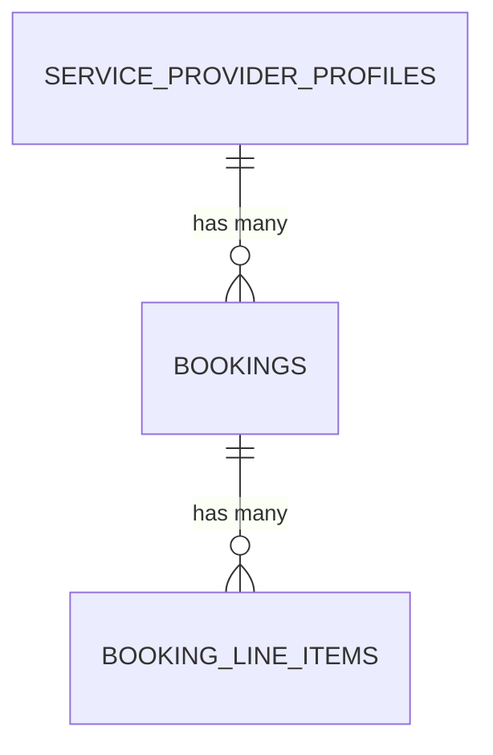

### Many-to-Many

A many-to-many relationship is never modeled with an array column or a comma-separated string — it is always expressed through an explicit **junction table** (also called an associative or join table), which gives the relationship itself a first-class place to carry its own attributes (e.g., *when* a promotion was applied to a booking) and lets the database enforce referential integrity on both sides independently.

```sql
-- A Booking may have many Promotions applied; a Promotion may apply to many Bookings
CREATE TABLE local_services.booking_promotions (
    booking_id UUID NOT NULL REFERENCES local_services.bookings(id),
    promotion_id UUID NOT NULL REFERENCES local_services.promotions(id),
    applied_at TIMESTAMPTZ NOT NULL DEFAULT now(),
    discount_amount NUMERIC(19,4) NOT NULL,

    PRIMARY KEY (booking_id, promotion_id)
);
```

### Junction Tables

A junction table's primary key is, by default, the composite of the two foreign keys it joins — this is both the simplest correct representation of "this specific pairing exists" and structurally prevents a duplicate pairing from ever being inserted, without a separate `UNIQUE` constraint. A junction table is given its own surrogate `UUID` primary key only when the relationship itself needs to be referenced independently by a third table (a rare, specifically justified case) or when the relationship has a natural need for its own soft-delete lifecycle distinct from either side.

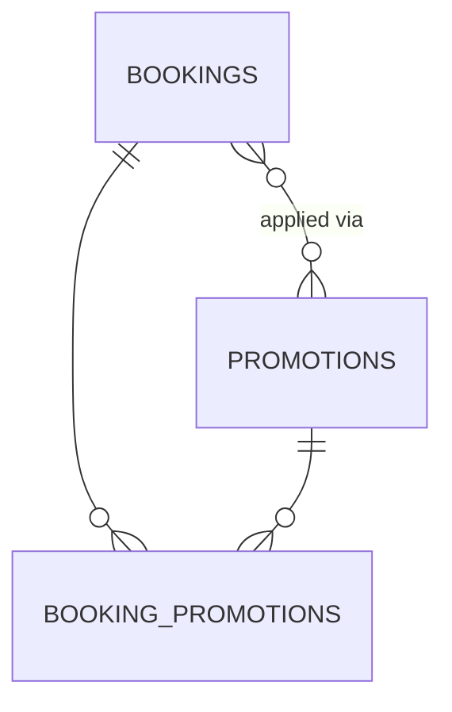

### Foreign Keys

Per the Foreign Keys standard already established in `ai-docs/05-coding-standards.md` and the Data Ownership Principles in `ai-docs/03-system-architecture-principles.md`:

- A foreign key constraint is created for every reference **within the same module's schema** — the database is the last line of defense, never trusted to be consistent by application discipline alone.
- A reference to a row owned by a **different module** is stored as a plain `UUID` column with **no database-level foreign key constraint**, because a real foreign key would create a hidden, schema-level coupling between two modules that Phase 4 (`ai-docs/03-system-architecture-principles.md`) explicitly forbids — and would make the eventual extraction of either module into a physically separate database impossible without breaking the constraint.

```sql
CREATE TABLE local_services.bookings (
    id UUID PRIMARY KEY DEFAULT gen_random_uuid(),

    -- Same-module reference: real foreign key, enforced by the database
    provider_id UUID NOT NULL REFERENCES local_services.service_provider_profiles(id),

    -- Cross-module reference: plain UUID, validated at the application layer
    -- via the Identity module's public API, never a database-level FK
    citizen_id UUID NOT NULL
);
```

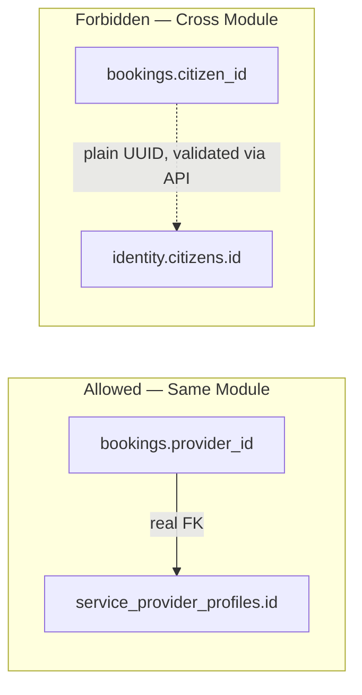

### Cascade Behavior

Every foreign key explicitly declares its `ON DELETE` behavior — never left to PostgreSQL's default (`NO ACTION`) without a considered reason:

| Behavior | When Used | Example |
|---|---|---|
| `ON DELETE RESTRICT` (or the default `NO ACTION`) | The referenced row of civic/financial/trust significance must never be removable while dependents exist — protects against accidental data loss. | A `service_provider_profiles` row cannot be hard-deleted while `bookings` reference it (moot in practice, since Soft Deletes below means hard deletion rarely happens at all). |
| `ON DELETE CASCADE` | The dependent row has no independent meaning once its parent is gone — a true composition relationship within the same Aggregate. | `booking_line_items` are deleted when their owning `bookings` row is hard-deleted (an Aggregate's internal entities per `ai-docs/03-system-architecture-principles.md`). |
| `ON DELETE SET NULL` | The dependent row remains meaningful independently, but the specific reference is optional and safe to clear. | A `bookings.cancelled_by_admin_id` reference is cleared, not the booking itself, if the referenced admin account is later removed. |

Because Soft Deletes (see below) are the default for any entity of civic, financial, or trust significance, `ON DELETE CASCADE`/`RESTRICT` behavior is primarily a safety net for the rare genuine hard-delete path, not the everyday deletion mechanism.

---

# Normalization

Normalization is a progressive discipline: each normal form eliminates a specific class of update anomaly building on the guarantees of the form before it. Arwal designs to Third Normal Form (3NF) by default, per `ai-docs/02-engineering-principles.md`, and explains each step here so a reviewer can cite the specific form a proposed schema violates.

### First Normal Form (1NF)

**Rule:** Every column holds a single, atomic value; no repeating groups or arrays of independent facts within one column.

```sql
-- Rejected — violates 1NF: multiple phone numbers crammed into one column
CREATE TABLE citizens (
    id UUID PRIMARY KEY,
    phone_numbers TEXT  -- "9876543210,9123456789" — not atomic
);

-- Required — 1NF: one fact per column/row
CREATE TABLE identity.citizen_phone_numbers (
    id UUID PRIMARY KEY DEFAULT gen_random_uuid(),
    citizen_id UUID NOT NULL REFERENCES identity.citizens(id),
    phone_number TEXT NOT NULL,
    is_primary BOOLEAN NOT NULL DEFAULT false
);
```

**Why it matters:** A comma-separated column cannot be indexed, filtered, or validated by the database at all — every one of those responsibilities silently shifts to fragile, duplicated application code, exactly the DRY violation `ai-docs/02-engineering-principles.md` warns against. (Note: `JSONB` array columns are a deliberate, later-discussed exception for genuinely semi-structured data — see Intentional Denormalization — never a substitute for 1NF on structured, relational facts like "a citizen's phone numbers.")

### Second Normal Form (2NF)

**Rule:** The table is in 1NF, and every non-key column depends on the **whole** primary key, not just part of a composite key.

```sql
-- Rejected — violates 2NF: provider_name depends only on provider_id,
-- not on the full (booking_id, provider_id) composite key
CREATE TABLE booking_details (
    booking_id UUID,
    provider_id UUID,
    provider_name TEXT,   -- partial dependency: depends on provider_id alone
    scheduled_at TIMESTAMPTZ,
    PRIMARY KEY (booking_id, provider_id)
);

-- Required — provider_name lives in its own table, keyed by provider_id alone
CREATE TABLE local_services.service_provider_profiles (
    id UUID PRIMARY KEY,
    display_name TEXT NOT NULL
);
CREATE TABLE local_services.bookings (
    id UUID PRIMARY KEY,
    provider_id UUID NOT NULL REFERENCES local_services.service_provider_profiles(id),
    scheduled_at TIMESTAMPTZ NOT NULL
);
```

**Why it matters:** 2NF violations only arise with composite primary keys; they are most commonly seen in poorly-designed junction tables that have accumulated non-relationship attributes that actually belong to one side alone.

### Third Normal Form (3NF)

**Rule:** The table is in 2NF, and no non-key column depends on another non-key column (no transitive dependency).

```sql
-- Rejected — violates 3NF: district_name depends on district_id,
-- not directly on the bookings table's own primary key (transitive dependency)
CREATE TABLE bookings (
    id UUID PRIMARY KEY,
    district_id UUID NOT NULL,
    district_name TEXT NOT NULL,   -- transitively dependent on district_id
    scheduled_at TIMESTAMPTZ NOT NULL
);

-- Required — district_name lives only in the districts table
CREATE TABLE civic_services.districts (
    id UUID PRIMARY KEY,
    name TEXT NOT NULL
);
CREATE TABLE local_services.bookings (
    id UUID PRIMARY KEY,
    district_id UUID NOT NULL,   -- district_name looked up via join, never duplicated
    scheduled_at TIMESTAMPTZ NOT NULL
);
```

**Why it matters:** This is the normal form that eliminates the single most common real-world update anomaly at Arwal's scale: a district's name is renamed once, in one row, in one table — never requiring an update sweep across every table that had transitively copied it, and never risking two tables disagreeing about the same district's current name.

### Boyce-Codd Normal Form (BCNF)

**Rule:** A stricter version of 3NF — for every functional dependency `A → B`, `A` must be a superkey (a candidate key or a superset of one). BCNF resolves the rare, specific edge case where a table is in 3NF but still contains an anomaly because a non-candidate-key column determines another column.

```sql
-- A table tracking which government officer is authorized to approve which
-- application category, where (officer_id, category) is not a clean candidate
-- key on its own because officer_id alone determines department, and
-- department determines which categories are even valid
CREATE TABLE civic_services.officer_department_assignments (
    officer_id UUID NOT NULL,
    department_id UUID NOT NULL,   -- functionally determined by officer_id alone
    category TEXT NOT NULL,
    PRIMARY KEY (officer_id, category)
);
-- department_id → this violates BCNF since officer_id (not a candidate key
-- alone in this composite) determines department_id.
-- Resolved by extracting officer → department into its own table:
CREATE TABLE civic_services.officers (
    id UUID PRIMARY KEY,
    department_id UUID NOT NULL REFERENCES civic_services.departments(id)
);
CREATE TABLE civic_services.officer_category_authorizations (
    officer_id UUID NOT NULL REFERENCES civic_services.officers(id),
    category TEXT NOT NULL,
    PRIMARY KEY (officer_id, category)
);
```

BCNF is applied deliberately, where a genuine anomaly of this specific shape is identified during design review — it is not chased reflexively on every table, since most of Arwal's schemas reach BCNF automatically once 3NF and clean candidate-key design are in place.

### When to Denormalize

Denormalization is applied only when **all** of the following are true, per the Intentional Denormalization commitment in the Database Design Philosophy above:

1. A specific, measured read-performance problem exists (per Measure Before Optimizing, `ai-docs/11-performance-standards.md`) — not a hypothetical future one.
2. The normalized query path (the join, the aggregate) has already been reviewed for a missing index and found to still be insufficient at the target load.
3. An explicit, documented mechanism keeps the denormalized copy consistent — a database trigger for same-schema denormalization, or an Integration-Event-driven read-model rebuild for cross-module denormalization (per the Cross-Module Read Cache pattern in `ai-docs/03-system-architecture-principles.md`).
4. The denormalization is reviewed and approved the same way a new index or a schema-level anti-pattern exception would be, per the Database Review Checklist below.

```sql
-- Justified denormalization: a booking's provider display name is duplicated
-- onto the booking row itself, to avoid a join on the extremely
-- high-volume "citizen's booking history" list endpoint, refreshed via
-- a database trigger whenever the provider's display name changes.
ALTER TABLE local_services.bookings
    ADD COLUMN provider_display_name_snapshot TEXT NOT NULL;

CREATE OR REPLACE FUNCTION local_services.sync_provider_display_name()
RETURNS TRIGGER AS $$
BEGIN
    UPDATE local_services.bookings
    SET provider_display_name_snapshot = NEW.display_name
    WHERE provider_id = NEW.id;
    RETURN NEW;
END;
$$ LANGUAGE plpgsql;

CREATE TRIGGER trg_sync_provider_display_name
AFTER UPDATE OF display_name ON local_services.service_provider_profiles
FOR EACH ROW EXECUTE FUNCTION local_services.sync_provider_display_name();
```

> **Callout — A Denormalized Column Without a Consistency Mechanism Is a Bug, Not an Optimization**
> Per the DRY Is About Knowledge callout in `ai-docs/02-engineering-principles.md`: a duplicated fact with no defined mechanism to keep both copies in sync is not a performance win — it is a guaranteed future data-integrity incident, deferred only until the first time the source value changes and the copy does not.

---

# Indexing

Indexing decisions are evidence-based, per the Indexing principle in `ai-docs/02-engineering-principles.md` and the Indexing Strategy in `ai-docs/11-performance-standards.md` — an index is added in response to an observed or confidently anticipated access pattern, never defensively on every column, since every index adds write-amplification and storage cost with no corresponding benefit if unused.

### Primary Indexes

Every table's `PRIMARY KEY` automatically creates a unique B-tree index on the key column(s) — this is PostgreSQL's default behavior and requires no additional declaration, but it is the first index every query-plan review considers: a query filtering or joining on `id` alone is already fast by default.

### Composite Indexes

A composite (multi-column) index is created when a query's `WHERE` clause filters on more than one column together, or combines a filter with a sort — ordered so that equality-filtered columns come first, followed by range-filtered or sorted columns last, per the Indexing Strategy in `ai-docs/11-performance-standards.md`.

```sql
-- Query: WHERE provider_id = ? AND status = ? ORDER BY scheduled_at DESC
CREATE INDEX idx_bookings_provider_id_status_scheduled_at
    ON local_services.bookings (provider_id, status, scheduled_at DESC);
```

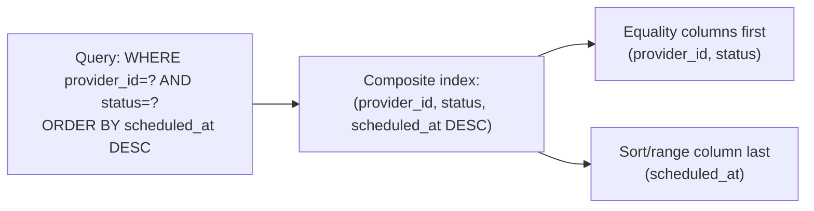

### Partial Indexes

A partial index — indexing only the subset of rows matching a `WHERE` predicate — is used when a query pattern only ever targets a small, well-defined slice of a table, keeping the index dramatically smaller and faster to maintain than a full-table index.

```sql
-- Almost every query against bookings filters WHERE deleted_at IS NULL
-- (per the Soft Deletes standard below) — a partial index skips indexing
-- soft-deleted rows entirely, since they are never part of a normal query path
CREATE INDEX idx_bookings_active_provider_id
    ON local_services.bookings (provider_id)
    WHERE deleted_at IS NULL;
```

### Unique Indexes

A unique index enforces a business-level uniqueness rule at the database layer, per the `UNIQUE` constraint discussion above — used identically whether declared inline as a table constraint or as a standalone `CREATE UNIQUE INDEX` (the latter is required when the uniqueness rule is itself partial or conditional).

```sql
-- A citizen may have only one ACTIVE wallet at a time, but may have
-- historical, closed wallet records — a plain UNIQUE constraint on
-- citizen_id alone would incorrectly forbid this
CREATE UNIQUE INDEX uq_wallets_citizen_id_active
    ON payments.wallets (citizen_id)
    WHERE status = 'ACTIVE';
```

### Covering Indexes

A covering index includes every column a specific frequent query needs directly within the index itself (via `INCLUDE`), letting PostgreSQL satisfy the query entirely from the index without a subsequent lookup against the underlying table (an "index-only scan") — used for a specific, measured hot-path query where profiling shows the extra table lookup is a meaningful cost.

```sql
-- The booking-list endpoint reads provider_id, status, and scheduled_at
-- to filter/sort, but also always projects out the id and citizen_id —
-- INCLUDE lets those ride along in the index without widening its key
CREATE INDEX idx_bookings_provider_status_covering
    ON local_services.bookings (provider_id, status)
    INCLUDE (id, citizen_id, scheduled_at);
```

### GIN Indexes

A GIN (Generalized Inverted Index) is used for `JSONB` containment queries, full-text search columns, and array-column membership checks — none of which a standard B-tree index can serve efficiently.

```sql
-- A civic application's variable, department-specific form data is
-- stored as JSONB; a GIN index supports efficient containment queries
-- against it (e.g., "applications where form_data @> '{"scheme": "PMKISAN"}'")
CREATE TABLE civic_services.applications (
    id UUID PRIMARY KEY DEFAULT gen_random_uuid(),
    department_id UUID NOT NULL,
    form_data JSONB NOT NULL,
    created_at TIMESTAMPTZ NOT NULL DEFAULT now()
);
CREATE INDEX idx_applications_form_data_gin
    ON civic_services.applications USING GIN (form_data);
```

### Index Review Discipline

Every migration introducing a new query pattern expected to run at meaningful volume is reviewed specifically for whether it requires a matching index, per the Database Change Workflow in `ai-docs/07-development-workflow.md` — never merged on the assumption that "it'll probably be fine," and never indexed defensively on every column "just in case," per the same principle's rejection of both extremes.

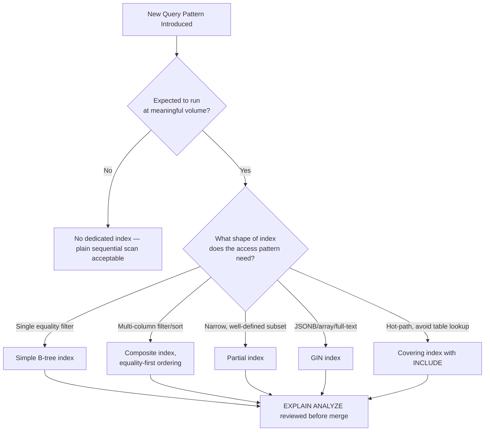

---

# Transactions

### ACID

Every transaction Arwal executes against PostgreSQL relies on the full ACID guarantee set, and this reliance is deliberate, per the ACID Transactional Guarantees justification for choosing PostgreSQL in `ai-docs/09-tech-stack.md`:

| Property | Guarantee | Arwal Example |
|---|---|---|
| **Atomicity** | A transaction's statements all succeed, or none do. | Debiting a citizen's wallet and crediting a merchant's wallet in a single payment either both happen or neither does — a partial transfer is never possible. |
| **Consistency** | A transaction only ever moves the database from one valid state to another, per every declared constraint. | A `CHECK (balance >= 0)` constraint (see Constraints above) guarantees a wallet transaction can never leave a balance negative, even under a concurrent-write race. |
| **Isolation** | Concurrent transactions do not observe each other's uncommitted intermediate state. | Two citizens booking the last available time slot simultaneously do not both see it as "available" and both succeed. |
| **Durability** | Once committed, a transaction's effect survives a crash. | A confirmed booking or a settled payment is never silently lost by a server restart, per the WAL-backed durability described in `ai-docs/09-tech-stack.md`. |

### Isolation Levels

PostgreSQL's default isolation level, **Read Committed**, is Arwal's default for the overwhelming majority of transactions — it is sufficient for most business logic and carries the lowest contention cost. A stricter isolation level is used only where a specific, identified race condition demands it:

| Isolation Level | When Used | Example |
|---|---|---|
| **Read Committed** (default) | The overwhelming majority of transactions — each statement within the transaction sees the latest committed data. | Standard `CREATE`, `UPDATE` operations on a single aggregate. |
| **Repeatable Read** | A transaction must see a single, consistent snapshot across multiple statements, preventing a value read early in the transaction from changing before the transaction commits. | Computing a wallet balance from multiple ledger rows and asserting a business rule against the sum, within one transaction. |
| **Serializable** | The strictest guarantee — transactions behave as if executed one at a time, in some serial order; used only for a genuinely high-stakes concurrent-write scenario where even Repeatable Read's guarantees are insufficient. | Booking the last remaining slot in a fixed-capacity time window, where two concurrent transactions must never both succeed. |

```sql
-- Serializable isolation for a genuinely contentious slot-booking path
BEGIN TRANSACTION ISOLATION LEVEL SERIALIZABLE;
SELECT capacity_remaining FROM local_services.time_slots
    WHERE id = $1 FOR UPDATE;
-- application checks capacity_remaining > 0, then:
UPDATE local_services.time_slots SET capacity_remaining = capacity_remaining - 1
    WHERE id = $1;
INSERT INTO local_services.bookings (...) VALUES (...);
COMMIT;
```

A higher isolation level is a deliberate, reviewed decision, per Justification not Convenience (`ai-docs/03-system-architecture-principles.md`) — it is never applied blanket "to be safe," since `SERIALIZABLE` carries real throughput and retry cost under contention.

### Deadlocks

A deadlock occurs when two transactions each hold a lock the other is waiting for, in a circular dependency — PostgreSQL detects this automatically and aborts one of the transactions with a `40P01` error. Deadlocks are minimized structurally, not merely handled reactively:

1. **Consistent lock ordering** — Any transaction that must lock multiple rows across tables always acquires those locks in the same, globally agreed order (e.g., always lock the `wallets` row before the `bookings` row, never the reverse in some code paths and the opposite order in others), eliminating the circular-wait condition that causes a deadlock in the first place.
2. **Narrow transaction scope** — Per the Transactions principle in `ai-docs/05-coding-standards.md`, a transaction is scoped as narrowly as possible around the statements genuinely requiring atomicity — a shorter transaction holds its locks for less time, reducing the window in which a deadlock can occur.
3. **`SELECT ... FOR UPDATE` used deliberately** — Row-level locks are acquired explicitly and only where a read-then-write race must be prevented, never applied reflexively to every read.

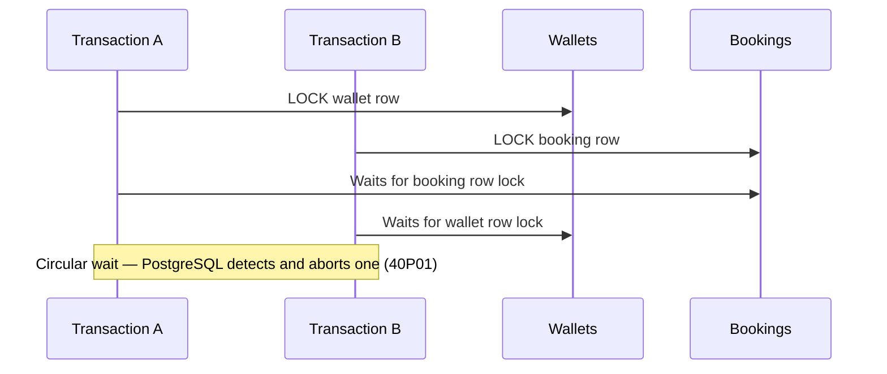

### Retry Strategy

Any operation that can encounter a deadlock (`40P01`) or a serialization failure (`40001` under `SERIALIZABLE` isolation) is wrapped in an automatic, bounded retry with exponential backoff, per the Retry resilience pattern in `ai-docs/03-system-architecture-principles.md` — the operation itself must be safe to retry (idempotent, per the Idempotency standard in `ai-docs/13-api-design-guidelines.md`), and the retry is capped (typically 3 attempts) so a genuinely unresolvable contention does not retry indefinitely, instead surfacing as a `409 Conflict` to the citizen per the Status Codes table in `ai-docs/13-api-design-guidelines.md`.

```typescript
async function withTransactionRetry<T>(
  operation: () => Promise<T>,
  maxAttempts = 3,
): Promise<T> {
  for (let attempt = 1; attempt <= maxAttempts; attempt++) {
    try {
      return await operation();
    } catch (error) {
      const isRetryable =
        error.code === "40P01" || error.code === "40001"; // deadlock / serialization failure
      if (!isRetryable || attempt === maxAttempts) throw error;
      await sleep(2 ** attempt * 50); // exponential backoff
    }
  }
  throw new Error("Unreachable");
}
```

---

# Migrations

### Prisma Migrate

Every schema change is made exclusively through Prisma Migrate's versioned migration files, per `ai-docs/09-tech-stack.md` and the Migrations principle in `ai-docs/02-engineering-principles.md` — never a manual, undocumented change applied directly against a live database.

```bash
# A schema change is authored in schema.prisma, then a migration is generated
npx prisma migrate dev --name add_booking_cancellation_reason
```

Every generated migration file is committed to the owning module's `infrastructure/` layer (per `ai-docs/04-folder-guidelines.md`) and reviewed with the same rigor as application code, per the Database Change Workflow in `ai-docs/07-development-workflow.md`.

### Forward-Only Migrations

Migrations in production are **forward-only** — a broken migration is fixed with a new, corrective migration, never by manually rolling back a live database against production data, except in a genuine emergency with explicit sign-off, per the Migrations principle in `ai-docs/02-engineering-principles.md`.

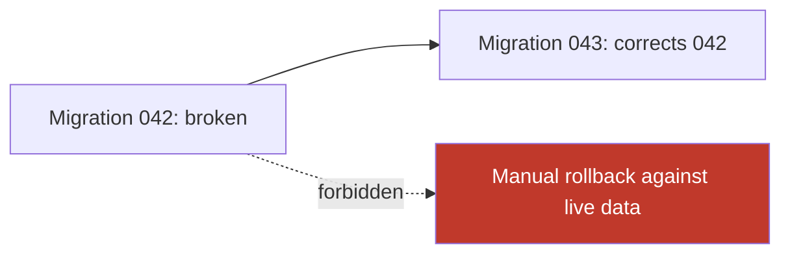

**Why forward-only:** A live production database has accumulated real citizen data since a migration ran — a literal "undo" of the schema change may not have a safe, lossless inverse (a dropped column's data is gone; a backfilled column's values were computed from data that itself may have since changed). Treating every fix as a new, forward-moving migration keeps the migration history an accurate, append-only record of what actually happened to the schema, mirroring the same forward-only philosophy the Rollback Strategy in `ai-docs/06-git-workflow.md` applies to Git history itself.

### The Three-Step Migration Discipline

Every schema change that could break a currently-running instance of the old application code during a rolling deployment follows the same additive-first, backfill-separately, constrain-last discipline established in `ai-docs/02-engineering-principles.md`, `ai-docs/05-coding-standards.md`, and `ai-docs/07-development-workflow.md`:

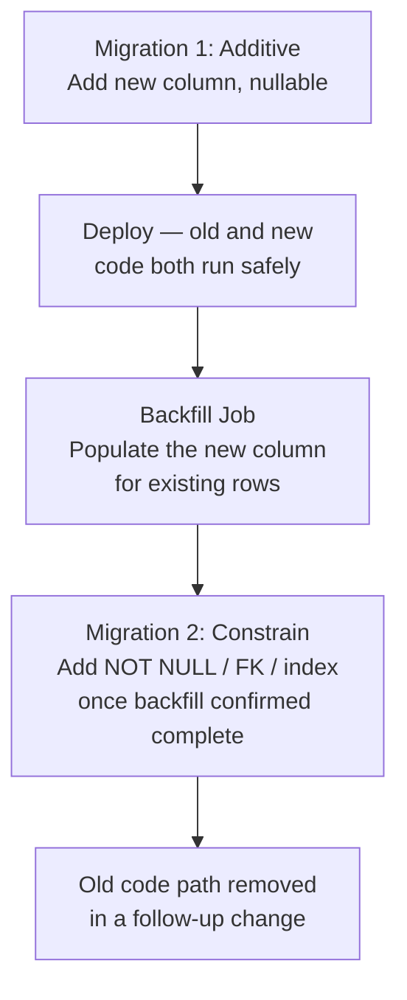

```prisma
// Step 1 — additive, nullable (safe for a rolling deploy)
model Booking {
  id                String   @id @default(uuid())
  cancellationReason String?
  // ...
}
```

```sql
-- Step 2 — backfill (its own migration/job, never bundled with Step 1)
UPDATE local_services.bookings
SET cancellation_reason = 'LEGACY_UNSPECIFIED'
WHERE status = 'CANCELLED' AND cancellation_reason IS NULL;
```

```prisma
// Step 3 — constrain, only after backfill is confirmed complete
model Booking {
  id                String @id @default(uuid())
  cancellationReason String
  // ...
}
```

### Rollback Strategy

Every migration's rollback path is confirmed before merge, per the Database Definition of Done in `ai-docs/08-definition-of-done.md`:

- An **additive** migration (new nullable column, new table) has a trivial rollback: the application code simply stops referencing the new schema element; the element itself can be dropped in a later migration once confirmed unused.
- A **constraining** migration (adding `NOT NULL`, a foreign key, or a unique index) is rolled back by a follow-up migration that relaxes the constraint — safe specifically because the three-step discipline above guarantees the constraining step is never load-bearing for correctness until the backfill is verified complete.
- A migration with **no safe automated rollback** (e.g., a genuinely destructive data transformation) requires explicit, documented sign-off before merge, stating why a forward-only fix is the only recovery path, per the Rollback Plan requirement in the Database Definition of Done (`ai-docs/08-definition-of-done.md`).

### Migration Review Checklist

Every migration is reviewed, before merge, against:

- [ ] Is the change backward-compatible with the currently-deployed application code during a rolling rollout?
- [ ] Does the change follow additive-first / backfill-separately / constrain-last where applicable?
- [ ] Does any new query pattern this migration enables have a matching index (see Indexing above)?
- [ ] Is the rollback path (or the explicit lack of one, with sign-off) documented?
- [ ] Has the migration been tested against an isolated test database, never shared or production infrastructure, per `ai-docs/05-coding-standards.md`?

---

# Soft Deletes

Every table backing a domain entity of civic, financial, or trust significance — orders, bookings, government applications, disputes, identity records, wallet transactions — is **never hard-deleted**, per the Soft Deletes principle in `ai-docs/02-engineering-principles.md`. A "delete" operation is always an `UPDATE ... SET deleted_at = now()`.

```sql
CREATE TABLE local_services.bookings (
    id UUID PRIMARY KEY DEFAULT gen_random_uuid(),
    -- ...
    deleted_at TIMESTAMPTZ NULL
);

-- "Deleting" a booking
UPDATE local_services.bookings
SET deleted_at = now()
WHERE id = $1 AND deleted_at IS NULL;
```

**Why soft deletes exist:** A hard-deleted booking, dispute, or government application record destroys the auditability a future dispute investigation or regulatory inquiry may require, per `ai-docs/02-engineering-principles.md` — data of civic and financial significance must remain reconstructable, not merely "gone."

Every repository query against a soft-deletable table filters `WHERE deleted_at IS NULL` by default, enforced through a shared query-builder convention (a Prisma middleware or a base repository method) so no individual query can forget it, per `ai-docs/05-coding-standards.md`. This is paired with the partial-index pattern shown in the Indexing section above, so the "active rows only" filter is also the platform's fastest, not merely its default, query path.

```typescript
// A shared Prisma extension applied once, never re-implemented per repository
const prismaWithSoftDelete = prisma.$extends({
  query: {
    booking: {
      async findMany({ args, query }) {
        args.where = { ...args.where, deletedAt: null };
        return query(args);
      },
    },
  },
});
```

Hard deletion is reserved for genuinely transient, non-sensitive data (an expired idempotency key, a stale session cache row) and even then only via an explicit, documented data-retention policy, per `ai-docs/02-engineering-principles.md`.

---

# Auditing

Every sensitive state change — a payment, a government application status change, a health-record access, an identity change, an administrative override — is recorded in an **immutable, append-only audit log**, structurally separate from the mutable operational row it describes, per the Audit Trails principle in `ai-docs/02-engineering-principles.md` and the Logging & Audit Standards in `ai-docs/10-security-standards.md`.

### Audit Fields (Operational Rows)

Every table includes, at minimum, standard audit fields maintained automatically — never manually set per write:

```sql
CREATE TABLE local_services.bookings (
    id UUID PRIMARY KEY DEFAULT gen_random_uuid(),
    -- ...
    created_at TIMESTAMPTZ NOT NULL DEFAULT now(),
    updated_at TIMESTAMPTZ NOT NULL DEFAULT now(),
    deleted_at TIMESTAMPTZ NULL
);

CREATE OR REPLACE FUNCTION common.set_updated_at()
RETURNS TRIGGER AS $$
BEGIN
    NEW.updated_at = now();
    RETURN NEW;
END;
$$ LANGUAGE plpgsql;

CREATE TRIGGER trg_bookings_set_updated_at
BEFORE UPDATE ON local_services.bookings
FOR EACH ROW EXECUTE FUNCTION common.set_updated_at();
```

### The Immutable Audit Log

Beyond `created_at`/`updated_at` on the operational row itself, every sensitive action is additionally recorded in a dedicated, append-only audit table (or an equivalent dedicated audit store), populated via the Integration Event mechanism per `ai-docs/03-system-architecture-principles.md` — never written directly by the same code path that mutates the operational row, so a compromised or buggy operational write path cannot also silently corrupt its own audit trail.

```sql
CREATE TABLE audit.action_log (
    id UUID PRIMARY KEY DEFAULT gen_random_uuid(),
    occurred_at TIMESTAMPTZ NOT NULL DEFAULT now(),
    actor_id UUID NOT NULL,
    actor_role TEXT NOT NULL,
    action TEXT NOT NULL,             -- e.g. "BOOKING_CANCELLED"
    resource_type TEXT NOT NULL,       -- e.g. "booking"
    resource_id UUID NOT NULL,
    change_summary JSONB NOT NULL,      -- before/after diff, no Restricted-tier data
    correlation_id UUID NOT NULL
);

-- No UPDATE or DELETE grant is ever issued against audit.action_log to any
-- application role — it is INSERT-only at the database privilege level.
REVOKE UPDATE, DELETE ON audit.action_log FROM app_role;
```

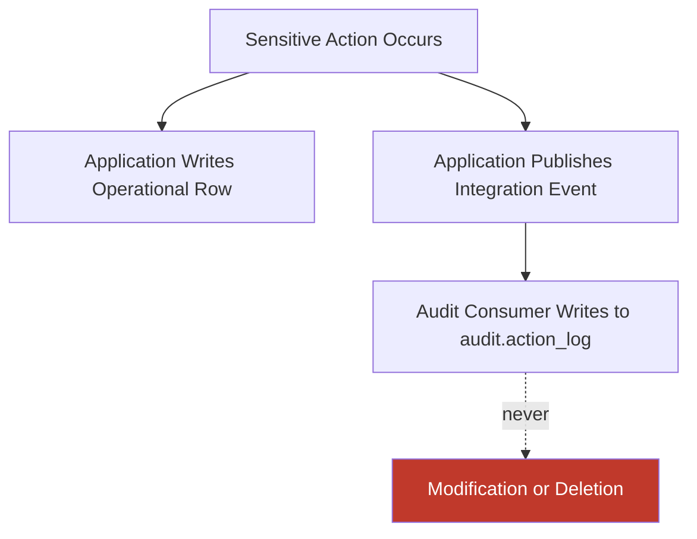

Tamper resistance is enforced at the database privilege layer (`REVOKE UPDATE, DELETE`), per the Tamper Resistance standard in `ai-docs/10-security-standards.md` — not merely by application-code convention, since a convention can be bypassed by a bug or a misused administrative credential, while a database-level `REVOKE` cannot.

---

# Multi-Tenancy (Future Readiness)

Arwal is not multi-tenant in the SaaS sense today — it serves one district's population as a single logical tenant. However, per the Replicable, Configuration-Driven Expansion Model goal in `ai-docs/01-product-goals.md` and the Future Expansion Strategy in `ai-docs/00-project-vision.md`, the schema is designed so that a future multi-district (and, further out, genuinely multi-tenant government-partner) model is a configuration and migration exercise, never a redesign.

### District as a Latent Tenant Key

Every table whose data is meaningfully scoped to a geography includes a `district_id` column from Phase 1, even while Arwal operates a single founding district — this column is unused for actual row-level isolation today, but its presence means a future multi-district rollout adds a `WHERE district_id = ?` filter and, eventually, a partition key (see Partitioning below), rather than requiring a schema migration to retrofit a tenant boundary onto every table after the fact.

```sql
CREATE TABLE local_services.bookings (
    id UUID PRIMARY KEY DEFAULT gen_random_uuid(),
    district_id UUID NOT NULL,   -- latent tenant/partition key, present from day one
    -- ...
);
```

### Isolation Strategy Comparison

| Strategy | Description | Arwal's Position |
|---|---|---|
| **Shared schema, tenant-key column** (chosen) | Every table carries a `district_id`/tenant column; all tenants share the same tables. | **Adopted.** Lowest operational overhead for a single-district launch; the tenant column is the seed for future row-level partitioning without a schema rewrite. |
| **Schema-per-tenant** | Each tenant (district) gets its own PostgreSQL schema, structurally identical. | Rejected for now — multiplies migration and operational overhead long before Arwal has more than one district live, violating YAGNI (`ai-docs/02-engineering-principles.md`); revisited via ADR if/when genuine multi-district operation is imminent. |
| **Database-per-tenant** | Each tenant gets a fully separate database/cluster. | Rejected — appropriate only for a much later stage where per-district compliance or scaling needs diverge sharply, per the Migration Strategy's evidence-based indicators (`ai-docs/03-system-architecture-principles.md`), not a Phase 1 concern. |

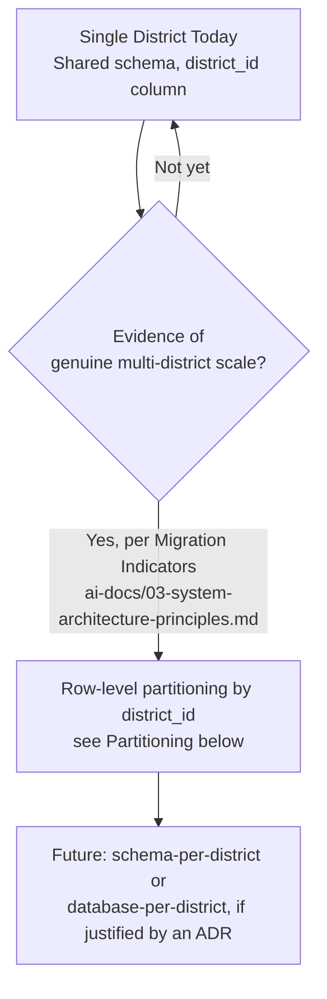

Row-level security (PostgreSQL `RLS`) is evaluated, not yet adopted, as the mechanism that would eventually enforce district-level data isolation transparently at the database layer, should a future government-partnership model require hard tenant isolation beyond what application-layer filtering provides.

---

# Partitioning

Consistent with the district → ward → zone Data Partitioning Strategy established in `ai-docs/00-project-vision.md` and `ai-docs/03-system-architecture-principles.md`, every high-volume table is **designed** with a partition key present in its schema from Phase 1 — while actual physical partitioning is deferred until evidence justifies it, per Evidence over Prediction (`ai-docs/03-system-architecture-principles.md`).

### Partition Key Selection

The partition key for a citizen-facing operational table is, by default, `district_id` (see Multi-Tenancy above) or, for a table with a natural high-volume time dimension (bookings, orders, audit logs), a combination of `district_id` and a time-based range (`created_at`).

```sql
-- Prepared for future range partitioning by created_at, once volume justifies it —
-- created as a normal table today, with the partition key already a first-class column
CREATE TABLE local_services.bookings (
    id UUID NOT NULL DEFAULT gen_random_uuid(),
    district_id UUID NOT NULL,
    created_at TIMESTAMPTZ NOT NULL DEFAULT now(),
    -- ...
    PRIMARY KEY (id, created_at)  -- partition key included in the PK, per PostgreSQL's requirement
);
```

### When Physical Partitioning Is Introduced

Physical `PARTITION BY RANGE`/`PARTITION BY LIST` is introduced only once a Migration Indicator from `ai-docs/03-system-architecture-principles.md` is observed and documented via an ADR — most commonly, sustained table-size growth pushing query performance beyond its target (`ai-docs/11-performance-standards.md`) despite correct indexing, or an operational need to archive/drop old partitions (e.g., audit log retention) without an expensive `DELETE` sweep.

```sql
-- Example future physical partitioning by month, once volume justifies it
CREATE TABLE local_services.bookings (
    id UUID NOT NULL DEFAULT gen_random_uuid(),
    district_id UUID NOT NULL,
    created_at TIMESTAMPTZ NOT NULL DEFAULT now(),
    -- ...
    PRIMARY KEY (id, created_at)
) PARTITION BY RANGE (created_at);

CREATE TABLE local_services.bookings_2026_07
    PARTITION OF local_services.bookings
    FOR VALUES FROM ('2026-07-01') TO ('2026-08-01');
```

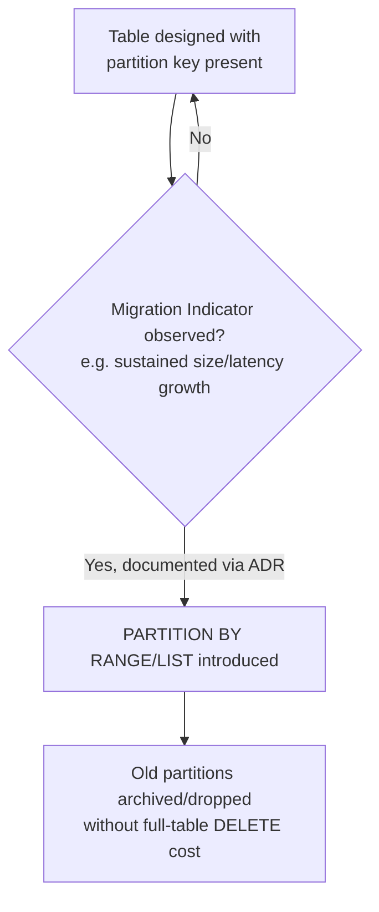

### Read Replicas as a Complementary Strategy

Per `ai-docs/09-tech-stack.md`'s Replication (Future) section, read replicas offload read-heavy traffic independent of partitioning — the two strategies are complementary, not substitutes: partitioning manages a single table's own size and maintenance cost, while replication manages horizontal read-capacity scaling across the whole dataset. Both are evidence-based, evaluated against the same Migration Indicators, never adopted speculatively.

---

# Performance Optimization

This section operationalizes, at the schema and query level, the Database Performance standards already established in `ai-docs/11-performance-standards.md`.

### Query Plan Review

Every query expected to carry meaningful load has its plan reviewed via `EXPLAIN ANALYZE` before merge — never assumed correct because it "looks fine" against a small development dataset, per the Query Optimization standard in `ai-docs/11-performance-standards.md`.

```sql
EXPLAIN ANALYZE
SELECT * FROM local_services.bookings
WHERE provider_id = '8f14e45f-ceea-4e9c-8b2a-1a3c4d5e6f7a'
  AND status = 'CONFIRMED'
  AND deleted_at IS NULL
ORDER BY scheduled_at DESC
LIMIT 20;
```

A plan showing a `Seq Scan` against a table expected to grow beyond a few thousand rows, where an index exists but is not being used, is a signal to investigate — a missing statistics update (`ANALYZE`), an unindexed expression, or a type mismatch between the filter value and the column's declared type are the most common causes.

### N+1 Prevention

Identical to the standard already established in `ai-docs/05-coding-standards.md` and `ai-docs/11-performance-standards.md`: a loop issuing one query per iteration is a review-blocking defect, replaced with Prisma's relation-loading (`include`/`select`) or an explicit batched query.

### Connection Pooling

Every service connects through PgBouncer in transaction-pooling mode, per `ai-docs/09-tech-stack.md`, never directly to PostgreSQL — this is what makes horizontal scaling of stateless NestJS instances (`ai-docs/03-system-architecture-principles.md`) safe without collectively exhausting PostgreSQL's own connection ceiling.

### Materialized Views

For a genuinely expensive, frequently-read aggregate (a district-wide dashboard figure, a ranking computation) that cannot be served fast enough by a live query even with correct indexing, a materialized view is used — refreshed on a defined schedule or via an event-driven trigger, never left stale with no refresh mechanism.

```sql
CREATE MATERIALIZED VIEW analytics.district_booking_summary AS
SELECT district_id, date_trunc('day', created_at) AS booking_date, count(*) AS total_bookings
FROM local_services.bookings
WHERE deleted_at IS NULL
GROUP BY district_id, date_trunc('day', created_at);

CREATE UNIQUE INDEX ON analytics.district_booking_summary (district_id, booking_date);

-- Refreshed on a schedule (e.g., every 15 minutes via a scheduled job)
REFRESH MATERIALIZED VIEW CONCURRENTLY analytics.district_booking_summary;
```

A materialized view is a form of Intentional Denormalization (see Normalization above) and is subject to the same review discipline: it is introduced only after a live-query approach has been measured and found insufficient, and its refresh/staleness window is explicitly documented.

### VACUUM and Autovacuum

PostgreSQL's `autovacuum` process, which reclaims space from updated/deleted rows and keeps the query planner's statistics current, is never disabled — a table experiencing high update/delete volume (notably any soft-deletable table, which accumulates dead tuples from every `UPDATE ... SET deleted_at`) is monitored for autovacuum lag, and its `autovacuum` tuning parameters (e.g., `autovacuum_vacuum_scale_factor`) are adjusted per-table only where monitoring shows the default cadence is insufficient — never tuned blindly ahead of an observed problem, per Measure Before Optimizing (`ai-docs/11-performance-standards.md`).

---

# Backup & Disaster Recovery

Consistent with the Backup Strategy already named in `ai-docs/09-tech-stack.md` and the Incident Response Readiness commitment in `ai-docs/00-project-vision.md`, this section defines the database-specific disaster-recovery discipline in full.

### Automated Continuous Backups

Automated backups are configured from the first production deployment onward — a database handling citizen identity, payment, and civic data is never run without a verified backup path.

### Point-in-Time Recovery (PITR)

Continuous WAL (Write-Ahead Log) archiving is enabled, allowing restoration to any specific point within the retention window — not merely to the last full snapshot — so a bad migration or a data-corrupting bug can be recovered from by restoring to the moment immediately before it occurred, minimizing data loss to the smallest possible window.

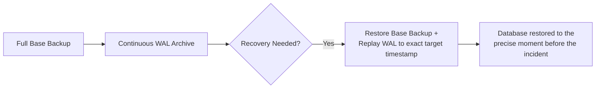

### Recovery Point Objective (RPO) and Recovery Time Objective (RTO)

| Metric | Target | Rationale |
|---|---|---|
| **RPO** (maximum acceptable data loss) | < 5 minutes | Bounded by WAL archiving frequency; a citizen's payment or booking made in the last few minutes before an incident is the maximum realistic exposure. |
| **RTO** (maximum acceptable downtime) | < 1 hour for a full restore; minutes for a replica failover | Aligns with the Automated Rollback and Zero-Downtime Deployment commitments in `ai-docs/02-engineering-principles.md`; a longer RTO is treated as a standing operational risk requiring remediation, not an accepted baseline. |

### Backup Testing

Backup restoration is tested on a defined, recurring schedule (at minimum, quarterly, and before any major schema-affecting release) — an unverified backup is not a backup, only an assumption, per `ai-docs/09-tech-stack.md`. A restoration test restores into a fully isolated environment, never against shared or production infrastructure, per the same discipline already established for migration testing.

### Backup Encryption

Every backup, including WAL archives, is encrypted at rest using the same key-management standard as live production data, per the Backup Encryption standard in `ai-docs/10-security-standards.md` — an unencrypted backup is treated as an unmitigated data-exposure risk equal in severity to an unencrypted production database, since a backup frequently persists longer and is replicated to more locations than the live system it was taken from.

### Disaster Recovery Drill

A full disaster-recovery drill — simulating a complete primary-database loss and executing the actual restore procedure end to end, including application reconnection and data-integrity verification — is performed on a defined cadence (at minimum, semi-annually) and after any material change to the backup/recovery tooling, per the Incident Response Readiness commitment in `ai-docs/00-project-vision.md`. A drill that has never actually been executed is not a disaster recovery plan; it is an untested assumption.

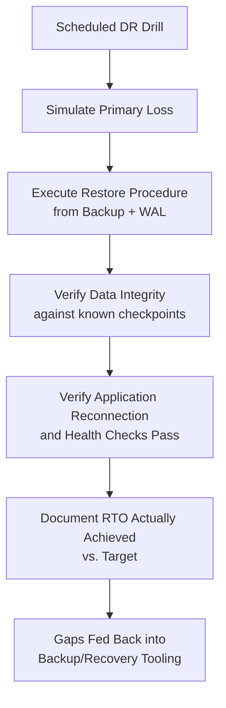

---

# Database Security

These standards extend the Data Protection Standards and Infrastructure Security sections of `ai-docs/10-security-standards.md` specifically to the database layer.

### Least Privilege

Every application service account connects to PostgreSQL with the minimum privilege set its module genuinely requires, per the Least Privilege principle in `ai-docs/02-engineering-principles.md` and `ai-docs/10-security-standards.md` — a service reading order data is never granted write access to the payments schema, and no application role is ever granted PostgreSQL superuser privileges.

```sql
-- Each module's application role is scoped to its own schema only
CREATE ROLE local_services_app_role LOGIN PASSWORD '...';
GRANT USAGE ON SCHEMA local_services TO local_services_app_role;
GRANT SELECT, INSERT, UPDATE ON ALL TABLES IN SCHEMA local_services TO local_services_app_role;
-- No DELETE grant on tables with soft-delete significance; no cross-schema grant
REVOKE ALL ON SCHEMA payments FROM local_services_app_role;
```

| Role Category | Typical Privileges | Never Granted |
|---|---|---|
| Module application role | `SELECT`, `INSERT`, `UPDATE` on its own schema's tables | `DELETE` on soft-deletable tables; any access to another module's schema; superuser |
| Read-replica/reporting role | `SELECT` only, across designated tables | Any write privilege |
| Migration/DDL role | Schema-modification privileges, used only by the CI/CD migration runner | Used directly by any running application service |
| Audit-log writer role | `INSERT` only on `audit.*` tables | `UPDATE`/`DELETE` on any audit table, per the Auditing section above |

### Encryption

Encryption in transit (`TLS` for every connection, including internal service-to-database traffic under the Zero-Trust model) and encryption at rest (database-level, backed by a dedicated key-management system) are both mandatory for every environment beyond local development, per the Encryption principle in `ai-docs/02-engineering-principles.md` and the full Data Protection Standards in `ai-docs/10-security-standards.md` — this document does not re-derive that reasoning, only affirms it applies identically to every database instance, replica, and backup Arwal operates.

### Secrets

Database credentials are never hardcoded in application code, a committed config file, or a Docker image — they are sourced exclusively through the shared secrets-management system described in `ai-docs/09-tech-stack.md` and `ai-docs/10-security-standards.md`, injected at runtime, and rotated on a defined schedule. A credential rotation never requires a coordinated application-code deployment, since credentials are read fresh from the secrets system at connection-pool initialization, never baked into a long-lived in-memory constant beyond the pool's own configured lifetime.

### SQL Injection Prevention

Every database access goes through Prisma's parameterized query mechanism, per `ai-docs/05-coding-standards.md` and `ai-docs/10-security-standards.md` — raw string concatenation of externally-influenced values into a SQL statement is forbidden without exception, enforced by both code review and static lint rules.

```typescript
// Forbidden — string concatenation, SQL injection risk
await prisma.$queryRawUnsafe(
  `SELECT * FROM local_services.bookings WHERE provider_id = '${providerId}'`
);

// Required — parameterized, injection-safe
await prisma.$queryRaw`
  SELECT * FROM local_services.bookings WHERE provider_id = ${providerId}
`;
```

Where Prisma's typed query builder cannot express a genuinely necessary raw query, `$queryRaw` (tagged-template, parameterized) is used — never `$queryRawUnsafe` with interpolated values — and the specific business justification for dropping to raw SQL is documented inline, per the Commenting Standards in `ai-docs/05-coding-standards.md`.

---

# Prisma Standards

These standards extend the ORM decision already justified in `ai-docs/09-tech-stack.md` with concrete usage rules.

### Schema Organization

Each module's Prisma models live in that module's own schema namespace, mapped explicitly via Prisma's `@@schema` attribute (multi-schema support) so the Data Ownership boundary established in `ai-docs/03-system-architecture-principles.md` is reflected directly in `schema.prisma`, not just in application code discipline.

```prisma
generator client {
  provider        = "prisma-client-js"
  previewFeatures = ["multiSchema"]
}

datasource db {
  provider = "postgresql"
  url      = env("DATABASE_URL")
  schemas  = ["local_services", "commerce", "payments", "identity"]
}

model Booking {
  id         String   @id @default(uuid())
  providerId String   @map("provider_id")
  citizenId  String   @map("citizen_id")
  status     BookingStatus @default(PENDING)
  scheduledAt DateTime @map("scheduled_at")
  createdAt  DateTime @default(now()) @map("created_at")
  updatedAt  DateTime @updatedAt @map("updated_at")
  deletedAt  DateTime? @map("deleted_at")

  provider   ServiceProviderProfile @relation(fields: [providerId], references: [id])

  @@map("bookings")
  @@schema("local_services")
}
```

### Repository Pattern Alignment

Prisma is used **exclusively inside each module's `infrastructure/repositories/` layer**, per the Module Folder Template in `ai-docs/04-folder-guidelines.md` — the Domain and Application layers depend only on the hand-written repository *interface* in `domain/repositories/`, never on the Prisma client directly, preserving Dependency Inversion (`ai-docs/02-engineering-principles.md`, `ai-docs/03-system-architecture-principles.md`) even though Prisma itself is the concrete implementation detail.

```typescript
// domain/repositories/BookingRepository.ts — the abstraction
export interface BookingRepository {
  findById(id: string): Promise<Booking | null>;
  save(booking: Booking): Promise<void>;
}

// infrastructure/repositories/PrismaBookingRepository.ts — the implementation
export class PrismaBookingRepository implements BookingRepository {
  constructor(private readonly prisma: PrismaClient) {}

  async findById(id: string): Promise<Booking | null> {
    const row = await this.prisma.booking.findFirst({
      where: { id, deletedAt: null },
    });
    return row ? BookingMapper.toDomain(row) : null;
  }

  async save(booking: Booking): Promise<void> {
    const data = BookingMapper.toPersistence(booking);
    await this.prisma.booking.upsert({
      where: { id: booking.id },
      create: data,
      update: data,
    });
  }
}
```

### Mapping Domain Entities

A repository never returns a raw Prisma-generated row directly to the Domain or Application layer — it is always mapped to a fully-constructed domain entity via an `infrastructure/mappers/` mapper, per `ai-docs/04-folder-guidelines.md`, keeping the Domain Layer's model free of any Prisma-specific type or decorator, per Technology Independence (`ai-docs/03-system-architecture-principles.md`).

### Migrations via Prisma Migrate

`prisma migrate dev` is used in local development to iterate on schema changes and generate migration files; `prisma migrate deploy` is the only command ever run against staging or production, applying already-committed, already-reviewed migration files in order — schema drift between `schema.prisma` and the actual database is checked automatically (`prisma migrate status`) as part of CI, per the CI/CD Integration principles in `ai-docs/06-git-workflow.md`.

### Query Logging in Development

Prisma's query-logging middleware is enabled in local development and staging to make N+1 patterns and unexpectedly expensive queries visible during active development — disabled by default in production (where structured, sampled logging via the shared observability stack, per `ai-docs/09-tech-stack.md`, is the production-appropriate mechanism instead), so verbose per-query logging never becomes a production performance or log-volume liability.

---

# Database Testing

Database-layer testing follows the Testing Pyramid established in `ai-docs/02-engineering-principles.md`, applied specifically to persistence code.

### Unit Testing Domain Logic

Domain and Application layer logic that depends on a repository is tested with the repository **interface** replaced by an in-memory test double — never a real database connection — per the Unit Tests standard in `ai-docs/05-coding-standards.md`. This keeps domain-rule tests (e.g., "a booking cannot be cancelled within 2 hours") fast and independent of any database at all.

### Integration Testing Repositories

Every concrete repository implementation is tested against a real, isolated, disposable test database (never shared or production infrastructure), per the Integration Tests standard in `ai-docs/05-coding-standards.md` and `ai-docs/07-development-workflow.md` — verifying that the actual SQL Prisma generates behaves correctly against real constraints, real indexes, and real transaction semantics.

```typescript
describe("PrismaBookingRepository", () => {
  let testDb: PrismaClient;

  beforeEach(async () => {
    testDb = await createIsolatedTestDatabase(); // fresh schema per test run
  });

  it("persists a booking and returns it via findById with deletedAt excluded", async () => {
    const repository = new PrismaBookingRepository(testDb);
    const booking = Booking.create({ providerId: "...", scheduledAt: new Date() });

    await repository.save(booking);
    const found = await repository.findById(booking.id);

    expect(found?.id).toBe(booking.id);
  });

  it("does not return a soft-deleted booking via findById", async () => {
    // ...
  });
});
```

### Migration Testing

Every migration is applied against an isolated test database as part of CI, verifying it runs cleanly forward — and, for any migration accompanied by a documented rollback path, that the rollback path also executes cleanly against a database that has already received the forward migration and sample data, per the Database Change Workflow in `ai-docs/07-development-workflow.md`.

### Seed Data

Local development and test environments are seeded via a dedicated, version-controlled seed script (`apps/api/src/database/seed`, per `ai-docs/04-folder-guidelines.md`) — never by manually crafted, ad hoc `INSERT` statements a new engineer would have to reverse-engineer. Seed data is realistic in shape (correct foreign-key relationships, correctly-typed enum values) but never contains real citizen, merchant, or government data, per the Git Ignore Policy in `ai-docs/06-git-workflow.md`.

### Query Plan Regression Testing

For an endpoint expected to carry significant load, its `EXPLAIN ANALYZE` plan is captured as part of its test evidence and re-verified whenever the query or its supporting indexes change, per the Query Optimization standard in `ai-docs/11-performance-standards.md` — a query that silently degrades from an index scan to a sequential scan due to an unrelated schema change is caught in review, not discovered in production.

---

# Database Review Checklist

Every pull request introducing or modifying a database schema, migration, or repository query is checked against the following before merge, extending the Database Definition of Done in `ai-docs/08-definition-of-done.md`:

- [ ] **Schema ownership respected** — Every new table lives in its owning module's schema; no cross-module foreign key is introduced.
- [ ] **Naming conventions followed** — Tables, columns, indexes, and constraints match the Naming Conventions table exactly.
- [ ] **Correct data types used** — `UUID` primary keys, `TIMESTAMPTZ` for timestamps, `NUMERIC` for money, no unconstrained `VARCHAR`.
- [ ] **Normalization justified** — The schema is normalized to at least 3NF by default; any denormalization is explicitly documented with its consistency mechanism.
- [ ] **Constraints declared** — `NOT NULL`, `UNIQUE`, `CHECK`, and foreign-key constraints express every real business invariant the database can enforce.
- [ ] **Relationships modeled correctly** — Many-to-many relationships use an explicit junction table; no array/CSV column models a relational fact.
- [ ] **Indexes justified by an access pattern** — Every new index maps to a real, expected query pattern; no defensive indexing without evidence.
- [ ] **Soft deletes applied where required** — Every entity of civic, financial, or trust significance uses `deleted_at`, never a hard `DELETE`.
- [ ] **Audit fields present** — `created_at`/`updated_at` exist and are automatically maintained; sensitive state changes flow into the immutable audit log.
- [ ] **Partition key present where applicable** — High-volume, district-scoped tables carry a `district_id`/time-based column even before physical partitioning is triggered.
- [ ] **Migration is safe for a rolling deploy** — Additive-first, backfill-separately, constrain-last discipline is followed; the rollback path (or explicit lack thereof, with sign-off) is documented.
- [ ] **Query plan reviewed** — Any new or modified query expected to carry meaningful load has its `EXPLAIN ANALYZE` plan reviewed and meets its performance-class target (`ai-docs/11-performance-standards.md`).
- [ ] **No N+1 pattern introduced** — Every loop-based query is replaced with a batched query or Prisma relation-loading.
- [ ] **Security controls honored** — No raw SQL string concatenation; the least-privilege role model is respected; no secret or credential appears in the diff.
- [ ] **Tested against an isolated database** — Repository and migration tests run against a real, disposable test database, never shared or production infrastructure.
- [ ] **Prisma schema and migration are in sync** — `prisma migrate status` shows no drift; `schema.prisma` accurately reflects the migration history.

A pull request failing any item above is not merged until resolved — this checklist carries the same non-negotiable authority as every other review checklist established in the preceding fourteen phase documents.

---

# Closing Statement

> **Callout — Closing Statement**
> Every preceding phase document described a dimension of how Arwal is built well, safely, fast, accessibly, and with a coherent API contract; this document describes the layer beneath all of them — the tables, constraints, indexes, and transactions that make every promise in those documents durable across a crash, a decade, and a million concurrent citizens. A citizen's booking, a farmer's subsidy application, and a merchant's wallet balance are not abstractions here — they are specific rows, in specific tables, governed by specific constraints that either hold or silently fail the moment a shortcut is taken. This document exists so that "the database" is never an accumulation of a thousand small, inconsistent decisions made independently by whoever happened to write a given migration that week — it is one schema, held to one standard, evolvable across every one of the ~300 micro-phases still ahead, from the first `CREATE TABLE` to the millionth citizen's daily transaction. Where a future phase must deviate from a rule stated here, that deviation is made explicitly — through the Database Change Workflow (`ai-docs/07-development-workflow.md`) and an Architectural Decision Record where the deviation is structural — never silently, and never by default.

This document, `ai-docs/14-database-design-guidelines.md`, is the fifteenth phase of approximately 300. Every table, column, relationship, index, migration, and transaction built in the phases that follow is expected to satisfy the standards defined here, or to justify its deviation in writing.

**End of Phase 15 — `ai-docs/14-database-design-guidelines.md`**