# Testing Standards

**Document:** `ai-docs/15-testing-standards.md`
**Project:** Arwal — The District Super App
**Stage:** 1 — Foundation
**Phase:** 16 — Testing Standards
**Status:** Approved for Engineering Reference
**Audience:** Architects, Backend Engineers, Frontend Engineers, QA Engineers, SRE/DevOps Engineers, AI Engineers, Security Engineers, Performance Engineers, Technical Reviewers, Government Technical Partners

> **Callout — Purpose of This Document**
> `ai-docs/00-project-vision.md` defined why Arwal exists. `ai-docs/01-product-goals.md` defined what Arwal must achieve. `ai-docs/02-engineering-principles.md` defined how engineers reason about design. `ai-docs/03-system-architecture-principles.md` defined how the system is structured. `ai-docs/04-folder-guidelines.md` defined where that structure physically lives. `ai-docs/05-coding-standards.md` defined how individual lines of code are written. `ai-docs/06-git-workflow.md` defined how change moves through version control. `ai-docs/07-development-workflow.md` defined how a day of engineering work unfolds. `ai-docs/08-definition-of-done.md` defined when a piece of work is actually finished. `ai-docs/09-tech-stack.md` named the concrete technologies everything is built from. `ai-docs/10-security-standards.md` defined the enforceable security standard those technologies must satisfy. `ai-docs/11-performance-standards.md` defined the enforceable, measurable performance standard those technologies must satisfy. `ai-docs/12-accessibility-standards.md` defined the enforceable accessibility standard every screen must satisfy. `ai-docs/13-api-design-guidelines.md` defined the enforceable API contract standard every endpoint must satisfy. `ai-docs/14-database-design-guidelines.md` defined the enforceable schema, migration, and query standard every table and transaction must satisfy. This document defines **the enforceable testing standard** — the specific, citable rules that govern how every one of those preceding standards is *proven*, in an automated, repeatable, machine-verifiable way, across `apps/api`, `apps/web`, `apps/admin-web`, `apps/mobile`, and `packages/*`, for every one of the ~300 micro-phases still ahead.

---

# Purpose of this Document

Every phase document preceding this one describes a claim about how Arwal should be built. `ai-docs/00-project-vision.md` claims Arwal will be trustworthy, inclusive, and enterprise-grade from day one. `ai-docs/01-product-goals.md` claims specific, measurable KPIs across Reach, Trust, Reliability, and Impact. `ai-docs/02-engineering-principles.md` claims SOLID, DRY, KISS, and a disciplined testing pyramid govern every module. `ai-docs/03-system-architecture-principles.md` claims clean domain boundaries, correct dependency direction, and resilient, evidence-based service extraction. `ai-docs/04-folder-guidelines.md` claims a folder structure that mirrors architecture exactly. `ai-docs/05-coding-standards.md` claims explicit types, no swallowed exceptions, and a fixed set of naming and error-handling conventions. `ai-docs/06-git-workflow.md` claims traceable, reviewable, reversible change. `ai-docs/07-development-workflow.md` claims a repeatable engineering lifecycle with checkpoints calibrated to risk. `ai-docs/08-definition-of-done.md` claims that "done" is a verified, checklist-driven fact, not a feeling. `ai-docs/09-tech-stack.md` claims a specific, production-proven set of technologies. `ai-docs/10-security-standards.md` claims a specific, enforceable security posture. `ai-docs/11-performance-standards.md` claims specific, measurable latency and throughput targets. `ai-docs/12-accessibility-standards.md` claims every screen is usable by every citizen regardless of ability, literacy, or device. `ai-docs/13-api-design-guidelines.md` claims a specific, versioned, predictable API contract. `ai-docs/14-database-design-guidelines.md` claims a specific, normalized, auditable, evolvable schema.

Every one of those is a claim. **Testing is the only mechanism that converts a claim into a verified fact.** A codebase that follows every principle in Phases 1–15 perfectly, but has no test proving it does, has not demonstrated any of those principles — it has merely asserted them, exactly as `ai-docs/08-definition-of-done.md` distinguishes "Complete" (a claim about effort) from "Done" (a claim about verified quality). Testing is the empirical discipline that makes every other phase document's claim falsifiable, and therefore trustworthy, per the same reasoning `ai-docs/10-security-standards.md` and `ai-docs/11-performance-standards.md` apply to their own domains: a value repeated across many documents but never consolidated into one specific, enforceable, measurable standard is not a program — it is a good intention with no way to check it.

This document exists to:

1. **Consolidate every testing-relevant principle scattered across Phases 1–15 into one authoritative, standalone reference** — the document a QA engineer, a backend engineer, a frontend engineer, or an AI engineer opens first, and the document every other phase document's testing references ultimately resolve to.
2. **Give every engineer, reviewer, and government technical partner a single, citable testing standard** — "this violates the Unit Testing Standards in Phase 16" is exactly as legitimate and actionable a review comment as citing SOLID from Phase 3, a security control from Phase 11, or a schema rule from Phase 15.
3. **Convert Arwal's civic mandate into concrete testing obligation.** A citizen's booking confirmation, a farmer's subsidy eligibility check, a merchant's payout calculation, and a government officer's approval workflow are not abstractions in this document — they are the specific behaviors this document exists to prove correct, before a citizen ever depends on them.
4. **Make testing measurable and enforceable, not aspirational.** Every rule in this document resolves to something a CI pipeline, a coverage report, or a reviewer can check mechanically — a passing assertion, a coverage percentage, a contract-diff result — never a vague aspiration like "the feature seems to work."
5. **Serve as the binding reference for test design, test review, CI/CD gating, and release readiness** for the entire life of the ~300-phase roadmap, revisited and amended only through the same Architectural Decision Record discipline established in `ai-docs/02-engineering-principles.md` and `ai-docs/03-system-architecture-principles.md`.

This document assumes and requires familiarity with all fifteen preceding phase documents. It does not re-argue their reasoning — it is where that reasoning becomes a specific, enforceable, automatable test.

---

# Testing Philosophy

Arwal's testing posture rests on ten commitments. Together they answer the question every subsequent section of this document exists to make concrete: **what does "tested" actually require, by default, before a single feature is called finished?**

### Quality by Design

Testing is never a phase bolted onto finished work — it is designed alongside the feature from its first commit, exactly as the Test-First Mentality commitment in `ai-docs/00-project-vision.md` and the Testing Principles in `ai-docs/02-engineering-principles.md` require. A `CreateBookingUseCase` is designed with its test cases considered at the same time as its happy path, not after. Quality is a property of how a feature is built, never a property inspected into it afterward.

### Shift Left Testing

The earlier a defect is caught, the cheaper it is to fix — a type error caught by the compiler costs seconds; the same defect caught in a code review costs minutes; caught in staging, it costs hours; caught in production, it costs a citizen's trust, per the North Star Principle in `ai-docs/00-project-vision.md`. Arwal deliberately pushes verification as early in the lifecycle as possible: static types (`ai-docs/05-coding-standards.md`), lint rules, unit tests, and schema validation (`ai-docs/13-api-design-guidelines.md`) all run before a human reviewer or a citizen ever sees the change.

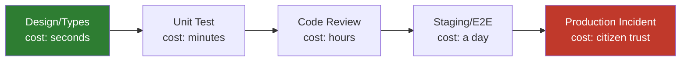

### Defense in Depth

No single test layer is trusted as the sole safeguard against a given defect class, mirroring the Defense in Depth commitment in `ai-docs/10-security-standards.md`. A business rule is verified by a unit test (fast, isolated), an integration test (verifies the real repository honors it), and — if it sits on a critical citizen journey — an E2E test (verifies the whole stack honors it together). A bug that slips past one layer is still expected to be caught by the next.

### Continuous Verification

Testing is never a one-time certification at launch, exactly as `ai-docs/10-security-standards.md` and `ai-docs/11-performance-standards.md` reject "we checked once" as a false sense of safety in their own domains. Every push runs the fast test suite; every PR runs the full suite; every merge to `develop` runs integration and E2E suites against staging; every release runs the full regression suite, per the Testing Workflow in `ai-docs/07-development-workflow.md`.

### Fast Feedback

A test suite that takes an hour to tell an engineer they made a mistake has already failed its purpose, per the Continuous Feedback commitment in `ai-docs/07-development-workflow.md`. Unit tests return in seconds, integration tests in low minutes, and the full CI pipeline in single-digit minutes wherever parallelization (see CI/CD Testing below) makes that achievable — a slow test suite is treated as a defect in its own right, not merely an inconvenience.

### Deterministic Testing

A test produces the same result every time it runs against the same code, given the same inputs — no dependency on wall-clock time, network latency, external service availability, or execution order. A test that sometimes passes and sometimes fails against unchanged code is not a test; it is noise that erodes confidence in every other test around it, per the Flaky Test Policy below.

### Repeatability

Any engineer, on any machine, in any environment satisfying the documented prerequisites, gets the same test result — a test that only passes "on my machine" or "only in CI" has a hidden environmental dependency that must be found and eliminated, never worked around.

### Reliability

A passing test suite is a genuine, trustworthy signal that the tested behavior works — not a formality satisfied by tests that don't actually exercise the behavior they claim to. Per the Testing Definition of Done in `ai-docs/08-definition-of-done.md`: *"CI green confirms the tests that exist pass. It says nothing about whether the right tests exist."* Reliability is a property of test *design*, not merely test *execution*.

### Risk-Based Testing

Testing effort is allocated proportionally to risk, not spread uniformly across every line of code regardless of its consequence — a payment-processing domain rule receives unit, integration, and E2E coverage; a purely cosmetic admin-dashboard label change does not require the same investment, per the Not Every Stage Needs the Same Weight callout in `ai-docs/07-development-workflow.md`. Risk is assessed along the same axes `ai-docs/10-security-standards.md` uses for data classification: civic, financial, and trust-significant code paths receive the deepest testing investment Arwal makes.

### Testing as Documentation

A well-named test is executable, permanently-accurate documentation of what a piece of code is supposed to do — unlike a prose comment, a test cannot silently drift out of sync with the code's actual behavior without failing, per the Documentation Cannot Go Stale principle already established for folder structure in `ai-docs/04-folder-guidelines.md`, applied here to behavior itself. A new engineer reading `Booking.test.ts` should be able to reconstruct the domain's business rules without reading `Booking.ts` first.

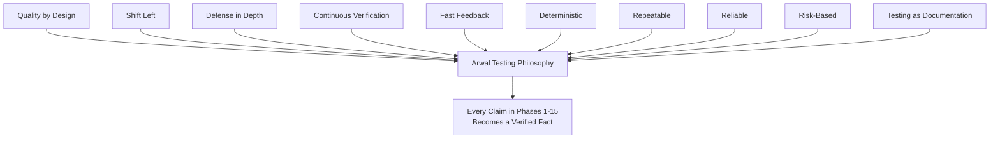

> **Callout — The One-Sentence Testing Philosophy**
> *"If it isn't tested, it isn't verified — and if it isn't verified, it's a guess wearing the appearance of a fact, which a citizen's booking, payment, or government application cannot be built on."*

**Engineering example.** Consider the 2-hour cancellation cutoff rule referenced throughout `ai-docs/02-engineering-principles.md` and `ai-docs/05-coding-standards.md`. Quality by Design means the rule's edge cases (exactly 2 hours, 1 second under, 1 second over) are considered when `Booking.cancel()` is designed, not discovered later. Shift Left means a unit test for the boundary condition exists before the PR is opened. Defense in Depth means an integration test also verifies the real `BookingRepository` persists the resulting `Cancelled` status correctly, and an E2E test verifies a citizen actually sees the correct error message in the UI. Risk-Based Testing means this specific rule — financially and contractually significant — receives all three layers, while a cosmetic tooltip nearby does not.

---

# Testing Pyramid

Arwal's testing strategy is organized as a pyramid — many fast, isolated tests at the base, progressively fewer, slower, higher-fidelity tests toward the top — first introduced in `ai-docs/02-engineering-principles.md`'s Testing Principles and operationalized fully here.

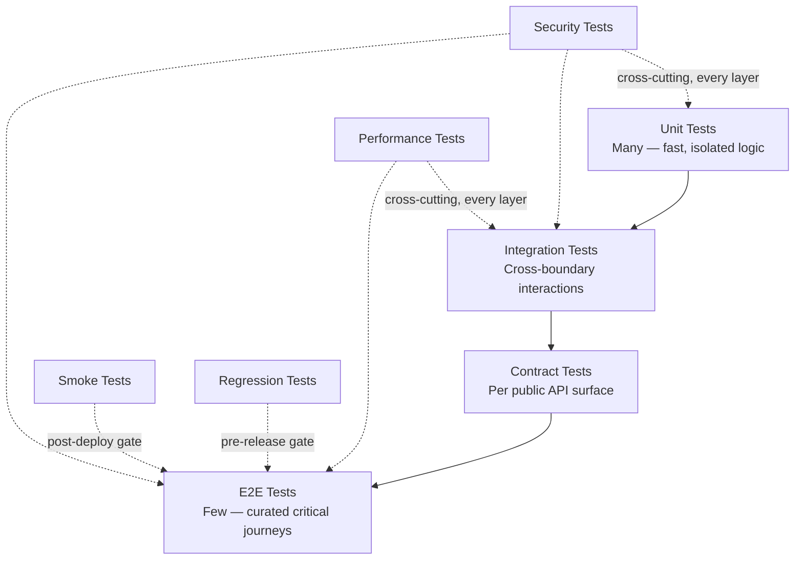

### Why Arwal Follows This Shape

| Layer | Speed | Cost to Write/Maintain | Confidence Given | Arwal's Reasoning |
|---|---|---|---|---|
| **Unit** | Milliseconds | Low | Confirms a single unit of logic is correct in isolation | The base of the pyramid because Domain and Application layer logic (`ai-docs/03-system-architecture-principles.md`) is, by Clean Architecture design, framework-free and therefore trivially fast to test — there is no excuse not to have many of these. |
| **Integration** | Seconds | Medium | Confirms a module's real interaction with its real dependencies (DB, cache) behaves as the unit tests assumed | Verifies exactly the seam unit tests intentionally mock out — a repository implementation, a Prisma query, a cache invalidation trigger. |
| **Contract** | Seconds | Medium | Confirms the implementation matches its published API contract exactly | Given Arwal's API-First, multi-client-surface architecture (`ai-docs/13-api-design-guidelines.md`), a contract drift is a Platform Parity failure waiting to happen across PWA/Android/iOS — caught here, cheaply, rather than by an integrator's bug report. |
| **E2E** | Minutes | High | Confirms a complete citizen journey works across the full stack | Deliberately few and curated (`ai-docs/02-engineering-principles.md`) — checkout, booking, civic application submission — because E2E tests are the most expensive to write, the slowest to run, and the most brittle to maintain; they exist to catch what only full-stack integration can reveal, never as a substitute for the layers beneath them. |
| **Smoke** | Seconds–minutes | Low | Confirms a freshly deployed environment is minimally alive and correctly configured | Runs immediately after every staging/production deploy, before broader traffic or the full regression suite — a fast circuit breaker against a catastrophically broken deploy. |
| **Regression** | Minutes–tens of minutes | Cumulative | Confirms nothing previously working has silently broken | The full E2E suite plus curated high-risk manual checks, re-run before every release per the Testing Workflow in `ai-docs/07-development-workflow.md` — never assumed to still pass because "nothing related changed." |
| **Performance** | Minutes–hours | Medium-High | Confirms the system meets its latency/throughput targets under realistic and peak load | Run ahead of anticipated scale milestones (`ai-docs/11-performance-standards.md`), not discovered reactively during a citizen-facing surge. |
| **Security** | Seconds–minutes (automated); longer (manual/pen-test) | Medium | Confirms the system resists known attack classes | Runs continuously (dependency/secret scanning, every push) and periodically (penetration testing), per `ai-docs/10-security-standards.md`. |

> **Callout — Why the Pyramid, Not an Hourglass or an Ice-Cream Cone**
> An "ice-cream cone" anti-pattern — few unit tests, heavy reliance on slow, brittle E2E tests — is explicitly rejected at Arwal. E2E tests are slow (a full booking journey through the actual stack takes seconds to minutes, not milliseconds), expensive to maintain (a UI refactor can break dozens of E2E tests testing the same underlying logic redundantly), and give ambiguous failure signals (an E2E failure could originate in any of a dozen modules). Arwal's Clean Architecture (`ai-docs/03-system-architecture-principles.md`) makes the pyramid shape *cheap to achieve correctly* — Domain layer logic has zero framework dependency, so it is naturally fast and trivial to unit test in bulk, which is precisely why the pyramid, not the cone, is achievable here without heroics.

### Practical Example: One Business Rule, Three Layers

```typescript
// UNIT — Domain layer, zero framework dependency, milliseconds
describe("Booking.cancel", () => {
  it("throws BookingCancellationWindowExpiredError when cancelled less than 2 hours before the scheduled time", () => {
    const booking = Booking.create({ scheduledAt: addHours(now(), 1) });
    expect(() => booking.cancel(now())).toThrow(BookingCancellationWindowExpiredError);
  });
});

// INTEGRATION — real Postgres-backed repository, seconds
describe("PrismaBookingRepository", () => {
  it("persists a Cancelled status and rejects a second cancellation attempt", async () => {
    const repo = new PrismaBookingRepository(testDb);
    const booking = await repo.save(Booking.create({ scheduledAt: addHours(now(), 3) }));
    booking.cancel(now());
    await repo.save(booking);
    const reloaded = await repo.findById(booking.id);
    expect(reloaded?.status).toBe(BookingStatus.Cancelled);
  });
});

// E2E — full stack, real browser, minutes
test("citizen sees a clear error when attempting to cancel within the 2-hour window", async ({ page }) => {
  await page.goto("/bookings/upcoming");
  await page.getByRole("button", { name: /cancel/i }).click();
  await expect(page.getByText("This booking can no longer be cancelled.")).toBeVisible();
});
```

---

# Unit Testing Standards

Unit tests verify a single unit of logic — a function, a domain method, a utility — in complete isolation from every collaborator, per the Unit Tests standard in `ai-docs/02-engineering-principles.md` and `ai-docs/05-coding-standards.md`.

### Domain Layer

Domain layer tests (`domain/entities/`, `domain/value-objects/`, `domain/services/`, per `ai-docs/04-folder-guidelines.md`) are the largest single category of test in Arwal's suite, because the Domain layer is, by Clean Architecture design (`ai-docs/03-system-architecture-principles.md`), free of any framework, database, or third-party dependency — every business rule is testable in pure isolation, at zero setup cost.

```typescript
describe("Money.add", () => {
  it("sums two Money values of the same currency", () => {
    const total = Money.of(100, "INR").add(Money.of(50, "INR"));
    expect(total.amount).toBe(150);
  });

  it("throws CurrencyMismatchError when adding different currencies", () => {
    expect(() => Money.of(100, "INR").add(Money.of(50, "USD"))).toThrow(CurrencyMismatchError);
  });
});
```

### Application Layer

Use case tests (`application/use-cases/`) verify orchestration logic — that the right domain objects and domain services are invoked in the right order — with every Infrastructure dependency (repositories, external SDK clients) replaced by an in-memory or hand-written test double, per the Dependency Injection standard in `ai-docs/05-coding-standards.md`, which is precisely what makes this substitution possible without reaching for a mocking framework's runtime magic.

```typescript
describe("CreateBookingUseCase", () => {
  it("rejects a booking when the requested time slot is unavailable", async () => {
    const repo = new InMemoryBookingRepository();
    const availability = new StubAvailabilityChecker({ available: false });
    const useCase = new CreateBookingUseCase(repo, availability);

    await expect(
      useCase.execute({ providerId: "p1", scheduledAt: someFutureDate() })
    ).rejects.toThrow(SlotUnavailableError);
  });
});
```

### Utilities

Pure, framework-agnostic utility functions (`utils/`, `packages/utils`) are unit tested exhaustively against their full input space, including boundary and malformed inputs, since a utility function's bugs propagate silently to every one of its many call sites, per the Utils Abuse anti-pattern warning in `ai-docs/04-folder-guidelines.md` — a widely-reused function deserves proportionally wide test coverage.

### Validation

Every Zod schema (`presentation/dto/`, per `ai-docs/13-api-design-guidelines.md`) is unit tested against both valid and invalid payloads — confirming a well-formed request passes, a missing required field is rejected with the correct error, and an unrecognized field is rejected by `.strict()` per the Mass Assignment defense in `ai-docs/10-security-standards.md`.

### Business Rules

Every named business rule (the 2-hour cancellation cutoff, the wallet non-negative-balance invariant, the government-department attribute-based authorization check) has at least one unit test directly naming that rule in its `describe`/`it` structure, so a future engineer searching the test suite for "cancellation window" finds the authoritative, current specification of that rule immediately.

### Edge Cases

Every unit test suite for a piece of domain logic explicitly covers: the boundary condition (exactly at a threshold), one step inside the valid range, one step outside it, the empty/zero/null case where applicable, and the maximum/overflow case where a numeric or collection bound exists. A test suite covering only the happy path is an incomplete test suite, per the Common False Positive "tests pass but requirements changed" pattern in `ai-docs/08-definition-of-done.md` — a green suite that never exercised the edge case in question provides no real confidence about it.

### Exception Handling

Every domain error type (extending the shared `AppError` hierarchy per `ai-docs/05-coding-standards.md`) has a corresponding unit test asserting it is thrown under the exact condition it claims to guard — a swallowed exception, an untested `catch` block, or an error thrown but never asserted against in a test is treated with the same severity as the Blocking Issues already defined in `ai-docs/05-coding-standards.md`.

### Mocking Policy

Arwal's mocking discipline is deliberately conservative, consistent with Readability Over Cleverness (`ai-docs/05-coding-standards.md`):

| What | Mocking Policy | Why |
|---|---|---|
| Repository interfaces (Domain/Application layer tests) | Replace with an in-memory implementation or a hand-written stub, never a heavy mocking-framework proxy | An in-memory implementation behaves like a real collection, catching bugs a loosely-configured mock would silently hide. |
| External SDK clients (payment gateway, SMS provider) | Replace with a hand-written fake implementing the same domain-owned interface (`ai-docs/09-tech-stack.md`) | Consistent with Dependency Inversion — the fake implements the interface the Domain layer actually depends on, never mocks the third-party SDK's own shape directly. |
| Pure functions / Value Objects | Never mocked | A Value Object has no side effects to mock away; mocking one would test nothing real. |
| The system clock (`Date.now()`) | Injected or faked deterministically (e.g., via a shared `Clock` abstraction) | Per Deterministic Testing above — a test asserting behavior "relative to now" must control what "now" is, never rely on wall-clock time. |
| Over-mocking (mocking the unit under test's own collaborators to the point the test only verifies mock-call order) | Rejected | A test that only asserts "mock A was called with these arguments" without exercising real logic is a Common False Positive — it can pass even when the underlying behavior is broken. |

### Test Naming

Every test name describes the behavior under test as a full, readable sentence, per the Test Naming standard in `ai-docs/05-coding-standards.md` — `it("throws BookingCancellationWindowExpiredError when cancelled less than 2 hours before the scheduled time")`, never `it("cancel test 3")`. A failing test's name alone must communicate what broke, without requiring the reader to open the test body.

### Test Isolation

Every unit test is fully independent and can run in any order, in isolation, or in parallel with any other test, per the Test Organization standard in `ai-docs/05-coding-standards.md`. Shared setup lives in explicit `beforeEach`/fixture helpers that construct fresh state per test — never in mutable module-level state that could leak between tests and produce order-dependent failures, which is itself a Flaky Test Policy violation (see below).

---

# Integration Testing

Integration tests verify a module's real interaction with its actual infrastructure dependencies — the seam unit tests deliberately mock out — per the Integration Tests standard in `ai-docs/05-coding-standards.md` and `ai-docs/09-tech-stack.md`.

### What Must Never Be Mocked

| Dependency | Testing Approach | Reasoning |
|---|---|---|
| **PostgreSQL** | Real, isolated, disposable test database (per-test-run schema or container) | The actual SQL Prisma generates, the actual constraint enforcement, and the actual transaction/isolation behavior (`ai-docs/14-database-design-guidelines.md`) can only be verified against a real PostgreSQL instance — a mocked ORM call proves nothing about whether a migration or a query is actually correct. |
| **Prisma** | Used against the real test database above, never mocked at the client level for a repository integration test | Mocking Prisma's client would test that the mock was called correctly, not that the repository's generated SQL and mapping logic are correct. |
| **Redis** | Real, isolated Redis instance (containerized) for cache/session/queue integration tests | Cache invalidation timing, TTL behavior, and BullMQ's actual job-processing semantics (`ai-docs/09-tech-stack.md`) are meaningfully different from an in-memory fake's approximation of them. |

### What Should Be Mocked / Faked

| Dependency | Testing Approach | Reasoning |
|---|---|---|
| **Message queues (external, beyond BullMQ's own Redis backing)** | A real, isolated broker instance for integration tests of the consumer/producer contract itself; faked at the module boundary for tests of business logic that merely publishes an event | The publish/consume contract deserves real integration coverage; the business logic invoking "publish an event" does not need a real broker to verify its own correctness. |
| **Email providers** | A sandboxed/test-mode provider account or a local SMTP-catching tool (e.g., a local mail-capture container) for integration tests; a fake `NotificationChannel` implementation for unit/application tests | Per the Third-Party Service Policy (`ai-docs/09-tech-stack.md`), the provider is accessed only through a domain-owned interface — the interface is faked in fast tests, and a real sandboxed account is used in a smaller number of true integration tests verifying the actual wiring. |
| **SMS providers (OTP delivery)** | A sandboxed/test-mode provider account with test phone numbers for integration tests; a fake `NotificationChannel` for everything else | Real SMS delivery is never triggered in an automated test run against a real citizen's phone number — this would itself be a security and cost incident. |
| **Payment gateways** | The gateway's own official sandbox/test-mode environment for integration tests, using documented test card/UPI credentials; a fake `PaymentGateway` implementation for unit/application tests | Never test against a real payment gateway's production endpoint under any circumstance — this is a Blocking Issue and a Sev 1 security/financial risk per `ai-docs/10-security-standards.md`. |
| **Government APIs** | A fake/stub implementation matching the documented contract for unit/application tests; a dedicated, access-controlled integration environment (where the government partner provides one) for scheduled integration verification, never run against a live citizen-facing government system from an automated test | Government-system availability and rate limits are outside Arwal's control; automated tests must never risk degrading a shared government service. |
| **Firebase (push notifications, if used for delivery)** | The Firebase Admin SDK's local emulator suite for integration tests; a fake `NotificationChannel` for unit/application tests | Firebase's official emulator suite gives real-enough integration fidelity without sending actual push notifications to real devices during a test run. |

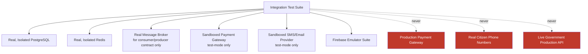

### Isolation and Disposability

Every integration test runs against infrastructure that is created fresh, used, and torn down per test run (or per test suite, at minimum) — never against shared or production infrastructure, per the Integration Testing standard in `ai-docs/05-coding-standards.md` and the Database Testing section of `ai-docs/14-database-design-guidelines.md`. A test database is provisioned via a disposable Docker container (`ai-docs/09-tech-stack.md`) so a colleague's environment or CI's shared state can never be corrupted by a test run's side effects.

```typescript
describe("PrismaWalletRepository (integration)", () => {
  let testDb: PrismaClient;

  beforeAll(async () => {
    testDb = await createIsolatedTestDatabase(); // fresh, disposable schema
  });

  afterAll(async () => {
    await teardownTestDatabase(testDb);
  });

  it("enforces the non-negative balance constraint at the database layer", async () => {
    const repo = new PrismaWalletRepository(testDb);
    const wallet = await repo.save(Wallet.create({ citizenId: "c1", balance: 0 }));
    await expect(repo.debit(wallet.id, 100)).rejects.toThrow(); // CHECK constraint violation
  });
});
```

---

# API Testing

API testing verifies the actual HTTP request/response contract established in `ai-docs/13-api-design-guidelines.md`, using Jest + Supertest against a real or in-memory NestJS instance, per `ai-docs/09-tech-stack.md`.

### Coverage Requirements per Endpoint

Every new or modified endpoint's PR includes, at minimum, integration tests covering:

| Category | What Is Verified |
|---|---|
| **Request validation** | A well-formed request succeeds; a request missing a required field returns `400` with the correct `error.code`; a request with an unrecognized field is rejected (Mass Assignment defense). |
| **Response validation** | The success response matches its documented DTO shape exactly — no internal-only field leaks, per the Response Design standard in `ai-docs/13-api-design-guidelines.md`. |
| **Authentication** | An unauthenticated request receives `401`; an expired/malformed token receives `401` with `TOKEN_EXPIRED` where applicable. |
| **Authorization** | A request from an actor lacking the required role receives `403`; a request targeting another actor's resource receives `403` or `404` per the ownership-disclosure decision documented for that endpoint (`ai-docs/13-api-design-guidelines.md`). |
| **Status codes** | Every documented status code (`200`/`201`/`204`/`400`/`401`/`403`/`404`/`409`/`422`/`429`) is exercised by at least one test case. |
| **Error responses** | Every documented error case returns the standard error envelope, a citizen-safe message, and never a raw stack trace. |
| **Pagination** | A list endpoint's default page size, maximum clamping behavior, and pagination metadata (`nextCursor`/`hasMore` or `page`/`totalPages`) are verified. |
| **Filtering** | An allow-listed filter narrows results correctly; an unrecognized filter parameter returns `400`, never silently ignored. |
| **Sorting** | An allow-listed sort field orders results correctly; a disallowed sort field returns `400` with the permitted list in `details`. |
| **Rate limiting** | A sensitive endpoint (login, OTP, payment initiation) returns `429` with a `Retry-After` header once its limit is exceeded, verified against the specific limits table in `ai-docs/13-api-design-guidelines.md`. |
| **Idempotency** | A repeated request carrying the same `Idempotency-Key` returns the original result without re-executing the operation a second time. |
| **API versioning** | The endpoint is reachable only under its correct version prefix; a deprecated version returns the `Deprecation`/`Sunset` headers where applicable. |
| **Headers** | Required headers (`Authorization`, `Content-Type`, `X-Correlation-Id` propagation) are verified present and correctly handled. |

```typescript
describe("POST /v1/bookings", () => {
  it("returns 201 with the created booking and a Location header", async () => {
    const res = await request(app.getHttpServer())
      .post("/v1/bookings")
      .set("Authorization", `Bearer ${citizenToken}`)
      .set("Idempotency-Key", uuid())
      .send({ providerId, scheduledAt: futureIso() });

    expect(res.status).toBe(201);
    expect(res.headers.location).toContain("/v1/bookings/");
    expect(res.body.data.status).toBe("PENDING");
  });

  it("returns 401 when no Authorization header is present", async () => {
    const res = await request(app.getHttpServer()).post("/v1/bookings").send({});
    expect(res.status).toBe(401);
  });

  it("returns the same booking on a retried request with the same Idempotency-Key", async () => {
    const key = uuid();
    const first = await request(app.getHttpServer())
      .post("/v1/bookings").set("Authorization", `Bearer ${citizenToken}`)
      .set("Idempotency-Key", key).send({ providerId, scheduledAt: futureIso() });
    const second = await request(app.getHttpServer())
      .post("/v1/bookings").set("Authorization", `Bearer ${citizenToken}`)
      .set("Idempotency-Key", key).send({ providerId, scheduledAt: futureIso() });

    expect(second.body.data.id).toBe(first.body.data.id);
  });
});
```

---

# Contract Testing

Contract tests verify that Arwal's implementation matches its published API contract exactly — closing the gap between what `ai-docs/13-api-design-guidelines.md` documents and what the running service actually does.

### OpenAPI Contracts

Every endpoint's OpenAPI specification (generated from NestJS decorators via `@nestjs/swagger`, per `ai-docs/09-tech-stack.md`) is validated in CI against the actual implementation's request/response behavior. A generated contract test suite issues requests matching the specification's documented examples and asserts the real response conforms to the documented schema — a divergence here is a Blocking Issue, per `ai-docs/13-api-design-guidelines.md`, since it means the specification (and therefore the generated `packages/sdk` client every frontend surface consumes) has silently drifted from reality.

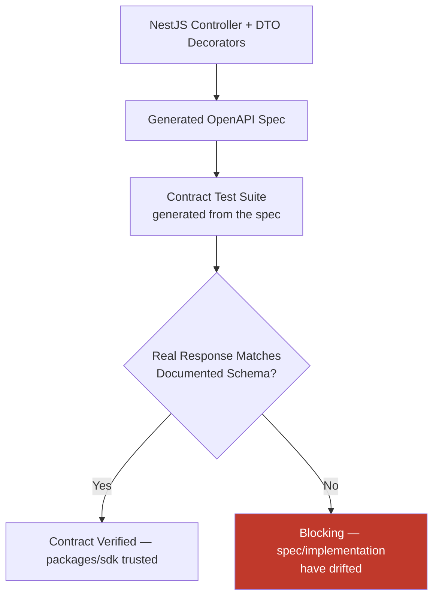

### Consumer-Driven Contracts

Where a specific consuming client (PWA, Android, iOS, Admin) depends on a precise response shape beyond what the generic OpenAPI schema captures (e.g., a specific field always being present for a particular UI state), that expectation is captured as a consumer-driven contract test, authored from the consumer's actual usage pattern — verifying the producer (the backend module) continues satisfying every currently-depended-upon consumer expectation, not merely its own documented intent.

### Backward Compatibility and Version Compatibility

Every contract test suite for a versioned endpoint (`/v1/...`) is retained and continuously run for the full life of that version, per the Compatibility Within a Version standard in `ai-docs/13-api-design-guidelines.md` — a change that would break an existing `/v1/` contract test is exactly the signal that the change is breaking and must ship as `/v2/...` instead, never silently inside the current version.

### Breaking Change Detection

CI runs an automated OpenAPI diff between the current specification and the previous release's specification on every PR touching an API contract. A diff revealing a breaking change per the classification table in `ai-docs/13-api-design-guidelines.md` (a removed field, a changed type, a newly-required request field) blocks merge unless the PR also introduces a new API version with the correct deprecation signaling for the old one.

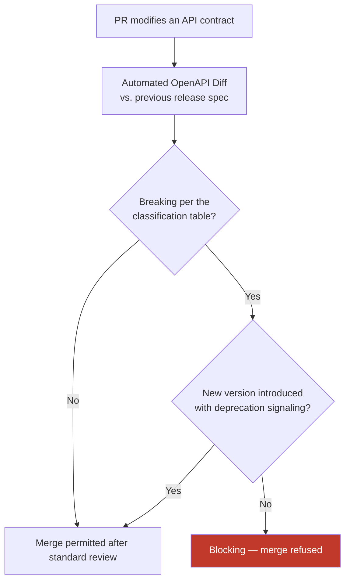

---

# Frontend Testing

Frontend tests verify React components, hooks, and full pages using Vitest and Testing Library, per `ai-docs/09-tech-stack.md`, applying the React Standards from `ai-docs/05-coding-standards.md`.

### React Components

Every component is tested through Testing Library's accessible-query API (`getByRole`, `getByLabelText`, `getByText`) rather than by implementation detail (a CSS class, a component's internal state) — per the Testing Library selection rationale in `ai-docs/09-tech-stack.md`, this directly reinforces Accessibility-First (`ai-docs/12-accessibility-standards.md`) at the level of the test suite itself: a component that is hard to query accessibly in a test is frequently hard to use accessibly in production.

```tsx
test("CancelBookingButton shows a confirmation dialog before cancelling", async () => {
  render(<CancelBookingButton bookingId="b1" />);
  await userEvent.click(screen.getByRole("button", { name: /cancel booking/i }));
  expect(screen.getByRole("dialog", { name: /are you sure/i })).toBeInTheDocument();
});
```

### Hooks

Custom hooks (`useBookingAvailability`, `useDebounce`, per the Naming Conventions in `ai-docs/04-folder-guidelines.md`) are tested via `renderHook` from Testing Library, verifying their returned state and behavior across re-renders, state transitions, and cleanup (unmount) — never by reaching into a hook's internal implementation.

### Forms

Every form is tested for: successful submission with valid input, per-field validation error display on invalid input (verified via the accessible error-association pattern in `ai-docs/12-accessibility-standards.md`), and correct handling of the Zod schema's `.strict()` rejection behavior where relevant to a client-side preview of a server validation rule.

### Routing

Route-level tests verify that navigating to a given route renders the expected page component, that route guards correctly redirect an unauthenticated citizen to login, and that a dynamic route parameter (`/bookings/:id`) correctly resolves and passes through to the rendered component.

### Accessibility

Every component test suite includes an `axe-core` assertion (via `jest-axe`/`vitest-axe`, per `ai-docs/12-accessibility-standards.md`) checking for zero serious/critical violations — this is a required, Blocking check in CI, not an optional add-on, per the Accessibility Testing section of `ai-docs/12-accessibility-standards.md`.

### Responsive Layouts

Playwright's viewport-emulation capability is used to verify a page reflows correctly at the 320px minimum width and remains fully operable, per the Responsive Layouts goal in `ai-docs/12-accessibility-standards.md` — a component test alone cannot verify reflow; this is a dedicated E2E-adjacent check run against the actual breakpoint matrix.

### Error States

Every component that can enter an error state (a failed data fetch, a rejected mutation) has a test rendering that exact state and asserting a citizen-safe, actionable message is shown — never a raw error object or a blank screen, consistent with the Error Boundaries standard in `ai-docs/05-coding-standards.md`.

### Loading States and Skeletons

Every component backed by asynchronous data (via TanStack Query, per `ai-docs/09-tech-stack.md`) has a test asserting its loading/skeleton state renders correctly before data resolves, and correctly transitions to the resolved state — verifying the citizen on a slow 3G connection (`ai-docs/11-performance-standards.md`) is never left looking at an unexplained blank region.

### Theme Switching

Where a component participates in Arwal's token-driven theming (dark mode, district-specific branding per `ai-docs/02-engineering-principles.md`'s Styling Philosophy), a test verifies the component correctly reflects a theme change without a full remount, and that contrast ratios remain compliant under both themes, per `ai-docs/12-accessibility-standards.md`.

---

# End-to-End Testing

E2E tests, run via Playwright (`ai-docs/09-tech-stack.md`), verify a complete citizen-facing (or officer/admin-facing) journey across the full stack — client through API Gateway through database and back — per the curated, deliberately small scope established in `ai-docs/02-engineering-principles.md`'s Testing Pyramid.

### Coverage by Persona

| Persona | Critical Journeys Covered |
|---|---|
| **Citizen** | Registration/OTP login, browse and search, add to cart and checkout, book a local service provider, track an order/booking, submit and track a civic application, receive and act on a notification, request a refund/dispute. |
| **Merchant** | Onboarding and storefront setup, receive and fulfill an order, manage inventory, view payout/earnings dashboard. |
| **Government Officer** | Log in via the officer-specific auth flow, view assigned application queue, approve/reject an application with a documented reason, respond to a citizen grievance. |
| **Admin** | Log in, review a merchant/provider verification request, resolve a flagged dispute, view platform-health dashboards. |

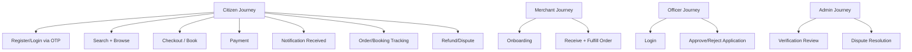

### Example: Booking Journey

```typescript
test("citizen can book a service provider and receive a confirmation notification", async ({ page }) => {
  await loginAsCitizen(page);
  await page.goto("/services/electricians");
  await page.getByRole("link", { name: "Anita — Verified Electrician" }).click();
  await page.getByRole("button", { name: "Book Now" }).click();
  await page.getByLabel("Select a time slot").selectOption("2026-08-01T10:00");
  await page.getByRole("button", { name: "Confirm Booking" }).click();

  await expect(page.getByText(/booking confirmed/i)).toBeVisible();
  await expect(page.getByTestId("notification-bell")).toHaveAttribute("data-unread", "true");
});
```

### Network Throttling

Per the Manual QA Focus Areas in `ai-docs/07-development-workflow.md`, a subset of critical-journey E2E tests run under Playwright's built-in network-throttling to simulate 3G conditions, verifying the journey remains completable (even if slower) under Arwal's actual target network profile, not only under a CI runner's fast, unrealistic connection.

### Ownership and Cadence

E2E tests are shared-ownership (Engineering + QA, per the Testing Principles table in `ai-docs/02-engineering-principles.md`), run on every staging deploy and before every release cut, per the Testing Workflow in `ai-docs/07-development-workflow.md` — never run only occasionally "when there's time."

---

# AI Testing

AI-assisted and AI-powered features (the AI Gateway Service, per `ai-docs/09-tech-stack.md`) require a testing discipline distinct from deterministic code, since a model's output is probabilistic, not perfectly reproducible — Arwal adapts its testing philosophy rather than abandoning it.

### Prompt Testing

Every versioned prompt template (`ai-docs/09-tech-stack.md`'s Prompt Management standard) has an associated test suite asserting the template renders correctly against a representative set of input variables, and that the resulting prompt stays within the Token Efficiency budget established in `ai-docs/11-performance-standards.md`.

### Hallucination Prevention

Any AI-generated response that asserts a specific fact used in a citizen-facing decision (a civic eligibility answer, a scheme deadline) is tested against a "grounding" requirement — the AI Gateway Service's response is verified, via automated test, to cite or derive from a specific retrieved source document rather than being accepted as free-form generation, and a test suite of known adversarial/ambiguous prompts is maintained specifically to catch a regression toward ungrounded, fabricated answers.

### Prompt Injection Defense

A dedicated adversarial test suite feeds known prompt-injection patterns (attempts to override system instructions, attempts to exfiltrate another citizen's data, attempts to make the assistant perform an unauthorized action) through the AI Gateway Service and asserts the system instructions remain intact and no unauthorized action or data disclosure occurs, per the AI Security standards in `ai-docs/10-security-standards.md`. This suite is run on every change to the AI Gateway Service's prompt-construction or input-sanitization logic, never only at initial launch.

### Output Validation

Every AI Gateway Service response consumed by a downstream module is validated against an explicit schema (Zod, per `ai-docs/09-tech-stack.md`) before being trusted — an AI response is treated as untrusted external input, identical to any other API request body, per the Input Validation standard in `ai-docs/10-security-standards.md`, and a test suite verifies malformed or unexpectedly-shaped model output is rejected rather than silently passed through.

### Fallback Behavior

Tests verify the Provider Fallback path (`ai-docs/11-performance-standards.md`) actually triggers correctly: a simulated primary-provider timeout or failure is injected, and the test asserts the secondary provider (or the documented non-AI degraded experience) is invoked, never a bare, unhandled error reaching the citizen.

### Provider Switching

Because the AI Gateway Service's provider-agnostic contract (`ai-docs/09-tech-stack.md`) is the mechanism protecting Arwal from vendor lock-in, a test suite runs the Gateway's core contract tests against every currently-configured provider's Infrastructure Layer adapter, verifying each provider adapter satisfies the same internal request/response contract identically from the calling domain module's perspective.

### Token Limits

Tests verify that a prompt exceeding a provider's token limit is truncated, summarized, or rejected gracefully (never silently sent and truncated by the provider in an unpredictable way) and that the Token Efficiency review (`ai-docs/11-performance-standards.md`) is enforced by an automated token-count assertion in CI for every prompt template change.

### Safety Evaluation

Every AI-generated output is evaluated, via an automated content-safety check, against Arwal's harm-avoidance and evenhandedness commitments (`ai-docs/00-project-vision.md`'s AI Principle) before being delivered to a citizen — a test suite of known unsafe/harmful prompt patterns verifies the safety layer correctly blocks or redirects them, and this suite is run continuously, not only at feature launch.

### Regression Testing for Prompts

Every change to a prompt template is run against a fixed, versioned "golden set" of representative inputs and their previously-approved expected outputs (or expected output *properties*, since exact text may legitimately vary) — a prompt change that causes the golden set's pass rate to regress is flagged for human review before merge, per the same Regression Testing discipline applied elsewhere in this document, adapted for probabilistic output.

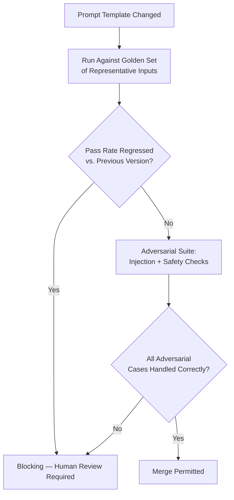

---

# Performance Testing

Performance testing verifies the specific, measurable targets established in `ai-docs/11-performance-standards.md`, never assumed true from a passing functional test suite.

| Test Type | Purpose | Frequency |
|---|---|---|
| **Load Testing** | Verify the system meets its p50/p95/p99 latency targets under expected peak traffic. | Ahead of every anticipated scale milestone, per the Load Testing section of `ai-docs/11-performance-standards.md`. |
| **Stress Testing** | Find the actual breaking point and verify the failure mode is graceful degradation, never a cascading outage. | Ahead of each major scale milestone. |
| **Spike Testing** | Verify auto-scaling, rate limiting, and circuit breakers respond fast enough to a sudden traffic burst without degrading service for existing citizens. | Ahead of any anticipated high-visibility event. |
| **Soak Testing** | Surface slow memory leaks, connection-pool exhaustion, or unbounded cache growth that only manifest over sustained load. | Quarterly, and before any major release affecting a long-running service. |
| **Benchmark Testing** | Establish a measured before/after comparison for a specific optimization. | Per optimization change, as PR evidence. |
| **Scalability Testing** | Confirm horizontal scaling produces a near-linear throughput improvement, verifying the Stateless Services design assumption (`ai-docs/11-performance-standards.md`) actually holds. | Ahead of each capacity-planning cycle. |

Every performance test's pass/fail criteria are the exact numeric targets in the Performance Goals table of `ai-docs/11-performance-standards.md` — never a subjective "seems fast enough" judgment.

---

# Security Testing

Security testing verifies the enforceable controls established in `ai-docs/10-security-standards.md`, layered exactly per that document's Defense in Depth principle.

| Category | What Is Tested | Tooling / Method |
|---|---|---|
| **OWASP Top 10** | Every category in the Threat Model table of `ai-docs/10-security-standards.md` is exercised by at least one automated or manual test case per release cycle. | SAST/DAST scanning, manual penetration testing on a defined schedule. |
| **Authentication** | Token expiry is enforced; a revoked refresh token is rejected; MFA is required where mandated; brute-force lockout triggers correctly. | Integration tests against the Authentication shared service. |
| **Authorization** | Every endpoint's role and resource-ownership check is exercised with a wrongly-scoped actor, per the Authorization Standards checklist. | API integration tests (see API Testing above). |
| **SQL Injection** | Parameterized query usage is verified; a deliberately malicious input string is confirmed to be treated as literal data, never executed. | Automated static analysis (no raw string concatenation) plus a targeted integration test with an injection-pattern payload. |
| **XSS** | User-generated content renders as escaped text, never executable markup, verified via a component test injecting a script-tag payload as input. | Testing Library + axe-core; manual verification for any `dangerouslySetInnerHTML` usage. |
| **CSRF** | A state-changing request without a valid CSRF token is rejected. | API integration test. |
| **SSRF** | A server-side fetch feature rejects a private/internal IP-range target URL. | Unit test against the URL-validation utility (`ai-docs/10-security-standards.md`). |
| **Rate Limiting** | Verified per the API Testing section above — sensitive endpoints correctly return `429` beyond their documented threshold. | API integration test. |
| **Secrets** | No credential appears in the diff, a built artifact, or a log statement. | Automated secret scanning on every push/PR, per `ai-docs/06-git-workflow.md`. |
| **Dependency Scanning** | Every direct and transitive dependency is scanned for known CVEs on every push. | Automated CI scan, per the Dependency Security section of `ai-docs/10-security-standards.md`; a finding above the agreed severity threshold blocks merge. |

Elevated, human-led security review (a security-context engineer's review, and periodic penetration testing) is required for any change touching `payments`, `identity`, or `civic-services` domain logic, per the Required Approvals in `ai-docs/06-git-workflow.md` and the Security Review Workflow in `ai-docs/07-development-workflow.md` — automated security testing is necessary, never sufficient, on its own for these domains.

---

# Test Data Management

### Factories

Domain entities and DTOs used across many test files are constructed via shared factory functions (e.g., `createTestBooking(overrides?)`) rather than duplicated inline object literals per test — a factory centralizes the "what does a valid Booking look like" knowledge in one place, consistent with DRY (`ai-docs/02-engineering-principles.md`) applied to test code, and lives in the module's own `tests/fixtures/` or the shared `packages/testing` package once genuinely reused across modules, per the Promotion Rule in `ai-docs/04-folder-guidelines.md`.

```typescript
// tests/fixtures/bookingFixtures.ts
export function createTestBooking(overrides: Partial<BookingProps> = {}): Booking {
  return Booking.create({
    providerId: "provider-1",
    citizenId: "citizen-1",
    scheduledAt: addDays(new Date(), 3),
    ...overrides,
  });
}
```

### Fixtures

Fixture data (a representative JSON payload, a sample uploaded document) is version-controlled alongside the tests that use it, never generated ad hoc inline in a way that makes the test's actual input opaque to a future reader.

### Seed Data

Local development and test environments are seeded via a dedicated, version-controlled seed script (`apps/api/src/database/seed`, per `ai-docs/04-folder-guidelines.md`) — realistic in shape (correct foreign-key relationships, correctly-typed enum values matching production's actual data distribution) but never containing real citizen, merchant, or government data, per the Git Ignore Policy in `ai-docs/06-git-workflow.md`.

### Anonymized Production Data

Where a genuinely representative dataset (not merely a synthetic one) is needed for a specific investigation (e.g., reproducing a production-only bug tied to real data distribution), production data is never copied into a lower environment without a documented anonymization pass stripping or irreversibly masking every Restricted and Confidential-tier field per the Data Classification table in `ai-docs/10-security-standards.md` — an anonymization gap here is treated with the same severity as a committed secret.

### Cleanup Strategy

Every test that creates persistent state (a database row, a cache entry, a queued job) cleans up after itself — via a transactional rollback wrapping the test (preferred, where the test framework supports it), an explicit `afterEach`/`afterAll` teardown, or a fully disposable per-test-run database/container (see Integration Testing above) — so no test's leftover state can influence a subsequent, unrelated test run.

### Isolation

Test data for one test is never visible to or mutable by another concurrently-running test — parallel test execution (see CI/CD Testing below) depends on this discipline holding absolutely, since a shared, mutated fixture is a direct cause of the exact non-determinism the Flaky Test Policy below exists to eliminate.

### Deterministic Datasets

Any test asserting against a specific, exact numeric or ordered result (a paginated list's exact item order, a computed total) is built against a dataset whose shape is fully known and fixed by the test itself — never against "whatever happens to be in the seed data today," which silently breaks the moment the seed script is updated for an unrelated reason.

---

# CI/CD Testing

Testing is embedded into the CI/CD pipeline established in `ai-docs/06-git-workflow.md`, making verification a structural, unbypassable gate rather than a manual, skippable step.

### Automated Pipelines

Every push to a `feature/*`/`bugfix/*`/`chore/*` branch triggers a fast feedback loop: lint, type-check, and unit tests, returning results within minutes, per the Daily Engineering Workflow in `ai-docs/07-development-workflow.md`. Every PR triggers the full pipeline: lint, type-check, unit and integration tests, contract tests, build, circular-dependency check, dependency and secret scans, and, where configured, a Lighthouse/accessibility/bundle-size check.

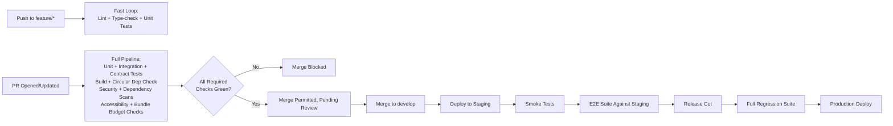

### Pull Request Validation

A PR cannot merge with a red pipeline, per the Merge Policy in `ai-docs/06-git-workflow.md` — there is no manual override for a failing required check, regardless of deadline pressure, mirroring the same non-negotiable authority `ai-docs/08-definition-of-done.md` gives every Definition of Done checklist.

### Required Checks

The following are configured as required status checks on every protected branch, per the Branch Protection Rules in `ai-docs/06-git-workflow.md`: lint, type-check, unit test suite, integration test suite (for any PR touching a cross-boundary change), contract test suite (for any PR touching an API surface), build, circular-dependency check, dependency vulnerability scan, secret scan, and, for `apps/web`/`apps/admin-web` changes, the accessibility (axe-core/Lighthouse) and bundle-size budget checks.

### Parallel Execution

Test suites are sharded and run in parallel across CI workers wherever the test runner supports it (Jest and Vitest both support parallel worker execution, per `ai-docs/09-tech-stack.md`), keeping the full pipeline's wall-clock time within the Fast Feedback target established in the Testing Philosophy above — a test suite is restructured to remove cross-test shared state (see Test Isolation above) specifically because that discipline is also what makes safe parallelization possible.

### Build Gates

A service is not considered buildable-and-deployable unless its full required-check set has passed — a build artifact produced from a commit that has not passed CI is never deployed to any environment beyond an engineer's own local machine.

### Release Gates

Before promotion from `release/*` to `main`, the full regression suite (E2E + curated high-risk manual checks) must pass against the release candidate, per the Release Readiness Workflow in `ai-docs/07-development-workflow.md` and the Release Definition of Done in `ai-docs/08-definition-of-done.md` — a release with any open Sev 1/Sev 2 defect in scope, or a failing regression suite, is not promoted, regardless of schedule pressure.

---

# Code Coverage

Code coverage is a useful diagnostic signal — it reveals code that has *no* test touching it at all — but it is never treated as a proxy for test quality, per the Common False Positive "tests pass but requirements changed" and the broader "CI green is necessary, never sufficient" reasoning in `ai-docs/08-definition-of-done.md`.

### Minimum Coverage Standards

| Layer | Minimum Line Coverage | Minimum Branch Coverage | Rationale |
|---|---|---|---|
| **Domain layer** (`domain/`) | 90% | 85% | This is where business rules live (`ai-docs/03-system-architecture-principles.md`); it is framework-free and cheap to test exhaustively, so a high bar is both achievable and warranted given the civic/financial stakes of the logic it contains. |
| **Application layer** (`application/`) | 85% | 80% | Orchestration logic carries meaningful risk (wrong ordering, missed authorization check) but naturally has fewer branches than domain logic. |
| **Infrastructure layer** (`infrastructure/`) | 70% (via integration tests, not unit tests) | N/A | Infrastructure code is thin by design (`ai-docs/03-system-architecture-principles.md`) — a repository implementation's correctness is proven by integration tests against a real database, not by a unit-test coverage percentage against mocked internals. |
| **Shared packages** (`packages/*`) | 90% | 85% | Shared code is consumed by every app that depends on it; a bug here has the widest possible blast radius, per the DRY reasoning already established in `ai-docs/04-folder-guidelines.md`. |
| **UI components** (`apps/web`, `apps/admin-web`) | 75% | 70% | Presentation logic is verified more meaningfully through behavior-driven Testing Library assertions and E2E coverage of critical journeys than through raw line coverage of every conditional render branch. |

### Why Percentage Alone Is Insufficient

A test suite reporting 100% line coverage can still be worthless if its assertions are shallow or absent — a test that calls a function and asserts nothing about its result executes every line without verifying a single behavior. Coverage measures *what code ran*, never *whether the right thing was verified*. Arwal therefore treats coverage as a floor, not a target:

- A coverage regression on a PR is a signal requiring investigation, not an automatic block by itself — the investigation asks "was real behavior left untested, or was dead code removed?"
- A reviewer explicitly evaluates whether a test's assertions actually exercise the acceptance criteria the PR claims to satisfy, per the Code Review Definition of Done in `ai-docs/08-definition-of-done.md` — "coverage is green" is never accepted as the sole justification for approving a PR's testing adequacy.
- Mutation testing (deliberately introducing a small defect into already-covered code and confirming the test suite catches it) is used periodically, particularly for `payments`, `identity`, and `civic-services` domain logic, as a stronger signal than line coverage alone that the existing tests would actually catch a real regression.

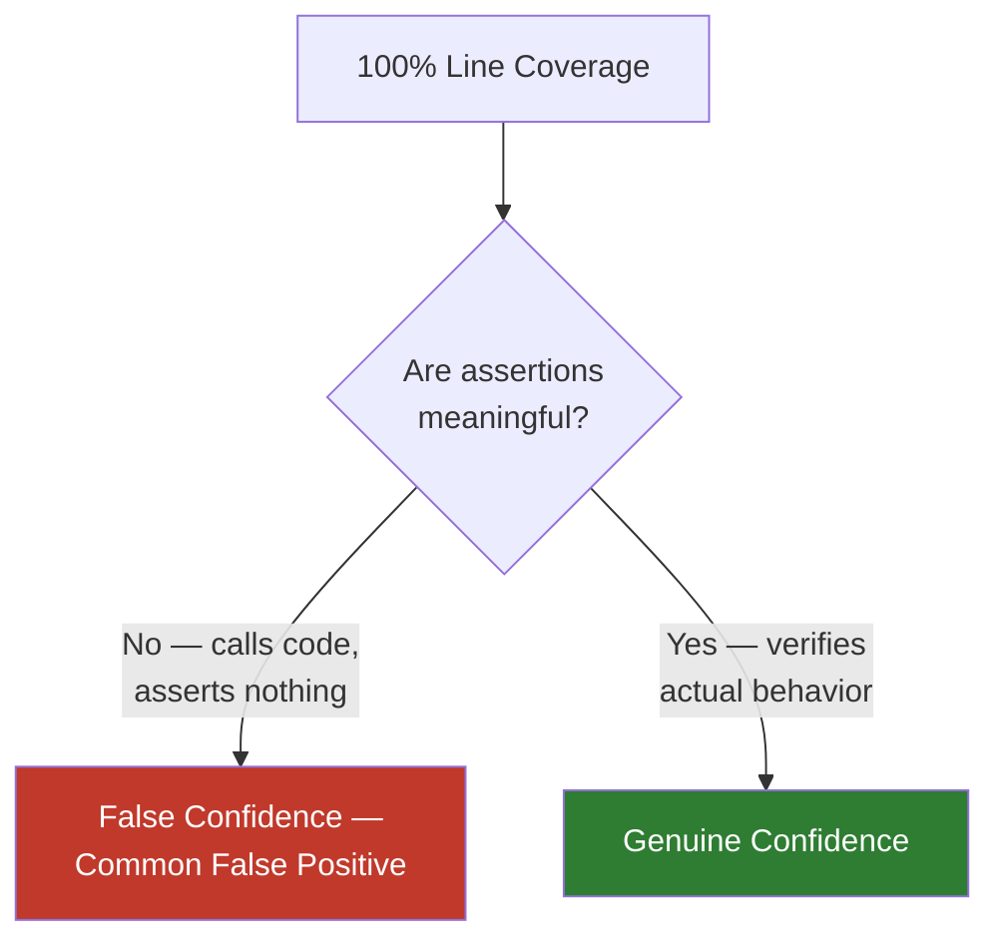

---

# Flaky Test Policy

A flaky test — one that passes and fails intermittently against unchanged code — is treated as a bug in its own right, per the explicit standard already set in `ai-docs/02-engineering-principles.md` and `ai-docs/05-coding-standards.md`: *"a flaky test that is routinely ignored is worse than no test, because it trains engineers to ignore failures."*

### Detection

CI tracks each test's pass/fail history over time; a test failing intermittently without a corresponding code change in its own area is automatically flagged by the CI dashboard as a flakiness candidate. Any engineer who observes a test fail, then pass on an unmodified re-run, reports it immediately rather than silently re-running until green.

### Investigation

A flagged flaky test is investigated within the same engineering cycle it is discovered, per the Technical Debt Policy's priority ordering in `ai-docs/02-engineering-principles.md` — common root causes investigated first are: shared mutable state between tests (see Test Isolation above), an unmocked or uncontrolled time/clock dependency, a race condition in asynchronous test setup, or a genuine, previously-hidden race condition in the production code itself (which the flaky test may be the first signal of).

### Quarantine

A flaky test that cannot be fixed immediately is quarantined — moved to a separate, non-blocking suite, tagged with an owner and a tracked issue reference — rather than deleted or left blocking every unrelated PR indefinitely. A quarantined test is never left quarantined without an active, owned investigation; quarantine is a temporary holding state, not a resolution.

### Resolution

A flaky test is resolved by fixing its root cause (never by adding an arbitrary retry/sleep that merely hides the symptom) and is returned to the required, blocking suite only once it has demonstrated stable, deterministic passes across a defined number of consecutive CI runs.

### Prevention

New tests are written following the Deterministic Testing and Test Isolation principles from the start — no reliance on real wall-clock time, no shared mutable fixtures, no dependency on network calls to a real external service in a unit or fast-integration test, and no assumption about execution order — so that flakiness is designed out from the outset rather than discovered and repaired after the fact.

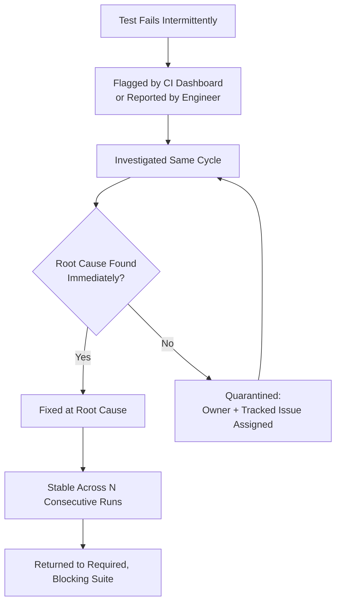

---

# Testing Review Checklist

Every pull request is checked against the following before merge, extending the Testing Definition of Done in `ai-docs/08-definition-of-done.md` and the Code Review Standards in `ai-docs/02-engineering-principles.md` and `ai-docs/05-coding-standards.md`:

- [ ] **Unit tests present** — Domain and Application layer logic is covered in isolation, with all Infrastructure dependencies replaced by test doubles per the Mocking Policy above.
- [ ] **Edge cases covered** — Boundary conditions, empty/null cases, and error paths are explicitly tested, not just the happy path.
- [ ] **Integration tests present** — Any new or modified cross-boundary interaction (repository, cache, queue, external provider) is verified against real, isolated test infrastructure, never a mock at this layer.
- [ ] **API tests complete** — For any new/modified endpoint: request validation, response shape, auth/authz, status codes, pagination, filtering, sorting, rate limiting, and idempotency are all covered.
- [ ] **Contract tests pass** — The implementation matches its OpenAPI specification exactly; no undetected breaking change has been introduced.
- [ ] **Frontend tests present** — New/modified components have Testing Library coverage, an axe-core accessibility assertion, and coverage of loading/error/empty states.
- [ ] **E2E coverage confirmed** — Any change touching a critical citizen journey (checkout, booking, civic application submission) is covered by the curated E2E suite, or an existing E2E test is confirmed to still exercise the changed path.
- [ ] **AI-specific tests present (where applicable)** — Prompt changes are run against the golden set and the adversarial/prompt-injection suite with no regression.
- [ ] **Performance implications considered** — No unreviewed N+1 pattern; a change expected to carry significant new load has been load-tested per `ai-docs/11-performance-standards.md`.
- [ ] **Security tests present (where applicable)** — Authorization, input validation, and injection-defense tests exist for any change touching sensitive data or an exposed input.
- [ ] **Test data is clean and isolated** — Fixtures/factories are used appropriately; no test leaves persistent state affecting another test; no real citizen/merchant data appears anywhere in test fixtures.
- [ ] **No flaky test introduced** — New tests avoid uncontrolled time, network, or ordering dependencies; an existing flaky test is not silently worked around.
- [ ] **Coverage floor met** — The change does not drop below the minimum coverage standard for its layer without a documented, reviewed justification.
- [ ] **Tests are meaningful, not merely present** — A reviewer has confirmed the test assertions genuinely verify the PR's acceptance criteria, not merely that some code executed.
- [ ] **CI fully green** — Lint, type-check, unit, integration, contract, and required security/accessibility/performance checks all pass.
- [ ] **Test names are descriptive** — Every test name reads as a full behavioral sentence, per the Test Naming standard.

A pull request failing any item above is not merged until resolved — this checklist carries the same non-negotiable authority as every other review checklist established in the preceding fifteen phase documents.

---

# Closing Statement

> **Callout — Closing Statement**
> Every preceding phase document described a dimension of how Arwal should be built — well, safely, fast, accessibly, with a coherent API, and on a sound schema. This document describes how every one of those claims is actually *proven*, continuously, by a machine, before a citizen ever depends on the result. A citizen's booking, a farmer's subsidy application, a merchant's payout, and a government officer's approval are not made trustworthy by the principles in Phases 1 through 15 alone — they are made trustworthy by the tests that verify those principles hold, on every commit, for every one of the ~300 micro-phases still ahead. A feature that is elegant, secure, fast, accessible, and well-architected but untested has not met Arwal's Definition of Done, regardless of how it appears in a demo — because an unverified claim is, from a citizen-trust perspective, indistinguishable from a guess. Where a future phase must deviate from a standard stated here, that deviation is made explicitly — through a documented, reviewed exception, or an Architectural Decision Record where the deviation is structural — never silently, and never by default.

This document, `ai-docs/15-testing-standards.md`, is Phase 16 of approximately 300. Every future phase must comply with these testing standards unless an approved Architectural Decision Record explicitly documents a justified exception.

**End of Phase 16 — `ai-docs/15-testing-standards.md`**