# Deployment Standards

**Document:** `ai-docs/16-deployment-standards.md`
**Project:** Arwal — The District Super App
**Stage:** 1 — Foundation
**Phase:** 17 — Deployment Standards
**Status:** Approved for Engineering Reference
**Audience:** Architects, DevOps Engineers, SRE, Platform Engineers, Backend Engineers, Release Managers, Security Engineers, Technical Reviewers, Government Technical Partners

> **Callout — Purpose of This Document**
> `ai-docs/00-project-vision.md` defined why Arwal exists. `ai-docs/01-product-goals.md` defined what Arwal must achieve. `ai-docs/02-engineering-principles.md` defined how engineers reason about design. `ai-docs/03-system-architecture-principles.md` defined how the system is structured. `ai-docs/04-folder-guidelines.md` defined where that structure physically lives. `ai-docs/05-coding-standards.md` defined how individual lines of code are written. `ai-docs/06-git-workflow.md` defined how change moves through version control. `ai-docs/07-development-workflow.md` defined how a day of engineering work unfolds. `ai-docs/08-definition-of-done.md` defined when a piece of work is actually finished. `ai-docs/09-tech-stack.md` named the concrete technologies everything is built from. `ai-docs/10-security-standards.md` defined the enforceable security standard those technologies must satisfy. `ai-docs/11-performance-standards.md` defined the enforceable performance standard those technologies must satisfy. `ai-docs/12-accessibility-standards.md` defined the enforceable accessibility standard every screen must satisfy. `ai-docs/13-api-design-guidelines.md` defined the enforceable API contract standard every endpoint must satisfy. `ai-docs/14-database-design-guidelines.md` defined the enforceable schema standard every table must satisfy. `ai-docs/15-testing-standards.md` defined how every one of those standards is proven, automatically, before a citizen depends on it. This document defines **the last gate a change passes through before it becomes reality for a citizen**: how verified, tested, reviewed code actually reaches production infrastructure, runs there safely, and can be reversed the moment it should not have.

---

# Purpose of this Document

Every phase document preceding this one describes a claim, and Phase 16 (`ai-docs/15-testing-standards.md`) describes how that claim is *proven*. But a proven claim sitting on a `develop` branch, verified by a green pipeline, has still not touched a single citizen's life. Deployment is the act that closes that final gap — the moment a tested, reviewed, documented change becomes the thing a farmer's phone actually talks to.

This is deliberately the **final operational gate** in Arwal's engineering governance stack. Everything upstream of it — architecture, folder discipline, coding standards, security, performance, accessibility, API contracts, database design, and testing — exists to produce a change that is *worth* deploying. This document exists to guarantee that once such a change exists, the act of putting it in front of a citizen never itself becomes the weak link: never introduces downtime a well-tested feature didn't need to cause, never leaks a secret a well-reviewed PR never contained, never becomes unrecoverable when a well-intentioned change turns out to be wrong in production despite every prior gate passing.

This document exists to:

1. **Define the concrete, physical mechanics of getting Arwal onto real infrastructure** — which environments exist, what each is for, how infrastructure is provisioned, how containers are built, and how a release actually rolls out to citizens.
2. **Give every engineer, release manager, and government technical partner a single, citable deployment standard** — "this violates the Rollback Standards in Phase 17" is exactly as legitimate and actionable a review comment as citing SOLID from Phase 3 or a security control from Phase 11.
3. **Protect the 1,000,000+ user scale target and the district's civic trust simultaneously** — a deployment is not merely a technical event; it is the moment a citizen's booking, payment, or government application starts depending on a specific version of Arwal's code being correctly, safely, and reversibly running.
4. **Make "production-ready" a specific, checklist-driven, non-negotiable state** — exactly as `ai-docs/08-definition-of-done.md` refuses to let "done" be a feeling, this document refuses to let "deployable" be a feeling.
5. **Serve as the binding reference for infrastructure provisioning, release management, incident response, and disaster recovery** for the entire life of the ~300-phase roadmap, revisited and amended only through the same Architectural Decision Record discipline established in `ai-docs/02-engineering-principles.md` and `ai-docs/03-system-architecture-principles.md`.

This document governs **how** software is deployed — environments, infrastructure, containerization, release strategy, rollback, and production readiness. It deliberately does **not** define pipeline mechanics, workflow automation, or build-stage implementation; that is the exclusive domain of `ai-docs/17-cicd-standards.md` (Phase 18), which this document references but never duplicates. Where this document says "the pipeline runs the deployment," the *how* of that pipeline is Phase 18's responsibility, not this one's.

This document assumes and requires familiarity with all sixteen preceding phase documents. It does not re-argue their reasoning — it is where that reasoning finally touches real, running infrastructure.

---

# Deployment Philosophy

Arwal's deployment posture rests on nine commitments. Together they answer the question every subsequent section of this document exists to make concrete: **what does "deployed safely" actually require, by default, before a single service touches production traffic?**

### Automation First

A deployment performed by a human typing commands into a terminal is a deployment that cannot be trusted to be identical the next time, per the Reproducibility commitment in `ai-docs/06-git-workflow.md`. Every deployment action — building an image, running a migration, promoting a release, rolling back a bad change — is automated and repeatable, never a manual ritual an engineer must remember correctly at 11pm during an incident. Automation is not about removing human judgment from deployment; it is about removing human *error* from the mechanical parts of it, so human judgment is spent on the decisions that actually need it (should we ship this? should we roll back?), not on whether a command was typed correctly.

### Immutable Infrastructure

A running container or server is never patched in place — it is replaced. Once a container image is built, it is never modified; a "fix" is a new image, deployed fresh, never a `docker exec` into a running production container to hand-edit a file. This directly extends the Reproducibility principle in `ai-docs/06-git-workflow.md` to the infrastructure layer: given any deployed artifact, its exact contents can always be reconstructed from the image and the commit it was built from, because nothing was ever changed in place, invisibly, after the fact. Immutability is also what makes Rollback (see below) trustworthy — rolling back to a previous image is only safe if that previous image's behavior hasn't silently drifted since it last ran.

### Infrastructure as Code

Every piece of provisioned infrastructure — a database instance, a Redis cluster, a load balancer, a DNS record, an IAM role — is defined in version-controlled, declarative configuration, never provisioned by clicking through a cloud console. This is the same Single Source of Truth principle from `ai-docs/02-engineering-principles.md`, applied to infrastructure itself: a console click leaves no reviewable diff, no audit trail, and no way to reconstruct "what does production actually look like right now" except by manually inspecting it — exactly the kind of silent architectural drift `ai-docs/02-engineering-principles.md`'s founding purpose exists to prevent.

### Zero-Downtime Deployments

A citizen renewing a certificate at 11pm on a Tuesday should never know a deployment happened. Every citizen-facing service is deployed using a strategy (see Deployment Strategies below) that keeps the service continuously available throughout the rollout — this is a direct extension of the Zero-Downtime Deployment commitment already established in `ai-docs/02-engineering-principles.md` and the High Availability Principles in `ai-docs/03-system-architecture-principles.md`, made concrete at the infrastructure-execution layer.

### Small & Frequent Releases

A large, infrequent release bundles risk: more changes, more interacting effects, a harder rollback (which of the twenty changes broke it?), and a longer feedback loop between a defect being introduced and being caught. Per the Small, Frequent Deployments principle in `ai-docs/02-engineering-principles.md`, Arwal prefers many small releases over few large ones — each release is easier to reason about, easier to test, and, critically, easier and safer to roll back.

### Rollback Over Hotfixes

When something is wrong in production, the fastest, safest first response is *always* to return to the last known-good state — never to rush a forward-fixing hotfix under pressure while citizens are actively affected. A hotfix is still the *correct* permanent fix, but it is never the *first* response to an active incident; per the Incident Response Workflow in `ai-docs/07-development-workflow.md`, mitigation (rollback) always precedes root-causing. This principle exists because a hotfix written under incident pressure, without the full review rigor `ai-docs/06-git-workflow.md` and `ai-docs/08-definition-of-done.md` require, carries its own risk of making things worse — a rollback to a version that was already tested, reviewed, and previously running successfully carries no such risk.

### Security by Default

Every deployment starts from the most restrictive posture and is deliberately opened up only as far as a genuine requirement demands, per Secure by Default in `ai-docs/02-engineering-principles.md` and the Security Philosophy in `ai-docs/10-security-standards.md`. A new service is unreachable from the public internet until explicitly, deliberately exposed; a deployment credential has the minimum scope its specific job requires; a container runs as a non-root user unless a documented, reviewed exception exists.

### Observability First

A deployment that cannot be observed is a deployment the team is flying blind on. Every service is deployable only once its health checks, metrics, logs, and dashboards (per `ai-docs/03-system-architecture-principles.md` and `ai-docs/09-tech-stack.md`) exist and are verified working — observability is a prerequisite of deployment, never a follow-up task added after a citizen-facing incident reveals the team couldn't see it coming.

### Reliability Over Speed

Where a genuine tension exists between deploying faster and deploying more reliably, Arwal chooses reliability, every time, without exception — consistent with the North Star Principle in `ai-docs/00-project-vision.md`: growth and velocity are only meaningful when trust and reliability remain healthy simultaneously. A deployment process that is slightly slower but structurally incapable of silent, undetected failure is preferred over a faster process that occasionally, invisibly, breaks something a citizen depends on.

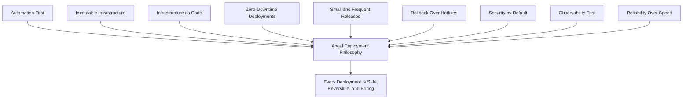

> **Callout — The One-Sentence Deployment Philosophy**
> *"A good deployment is a boring deployment — automated, observable, small, and instantly reversible, so that the most exciting thing that ever happens during one is nothing at all."*

---

# Deployment Environments

Arwal operates five distinct environments, each with a single, unambiguous purpose. An environment's identity is never blurred — a change is never tested "directly in staging because it's basically the same as QA," and production is never used as a de facto testing ground for anything, regardless of urgency.

### Local

**Purpose:** An individual engineer's own machine, running the full stack (or the relevant subset of it) via Docker Compose (`ai-docs/09-tech-stack.md`), for active development and fast iteration.

**Data policy:** Entirely synthetic, seeded data only (`apps/api/src/database/seed`, per `ai-docs/14-database-design-guidelines.md`). Real citizen, merchant, or government data is never present on a local machine, per the Git Ignore Policy in `ai-docs/06-git-workflow.md`.

**Infrastructure expectations:** Containerized PostgreSQL, Redis, and backend services via Docker Compose; no dependency on shared cloud infrastructure for core development. PM2 is permitted for local convenience only, per `ai-docs/09-tech-stack.md`.

**Access policy:** Fully controlled by the individual engineer; no shared credentials, no access to any real secret beyond a local `.env.development.example`-derived, non-production value.

**Deployment restrictions:** Nothing is ever deployed *from* local infrastructure to any shared environment. Code reaches other environments exclusively through the reviewed, merged, pipeline-driven path defined in `ai-docs/06-git-workflow.md` and `ai-docs/17-cicd-standards.md`.

### Development

**Purpose:** A shared, always-on environment reflecting the current state of the `develop` branch, used for cross-team integration testing and early manual verification before a change is considered staging-ready.

**Data policy:** Synthetic, seeded, or anonymized data only (per the Anonymized Production Data standard in `ai-docs/15-testing-standards.md`) — never unmasked real citizen data.

**Infrastructure expectations:** A right-sized, shared cloud deployment (see Infrastructure Deployment Standards below) — smaller instance classes than staging/production, since this environment's purpose is functional integration, not load or performance validation.

**Access policy:** Open to the full engineering team; no elevated approval required to deploy to it, since a defect here has no citizen-facing consequence.

**Deployment restrictions:** Deploys automatically on every merge to `develop`, per the CI/CD Integration principles in `ai-docs/06-git-workflow.md` — this document does not define that automation's mechanics, only affirms it happens (see Relationship to CI/CD Standards below).

### QA

**Purpose:** A dedicated, stable environment for structured manual QA, exploratory testing, and accessibility/device verification (per the Testing Workflow in `ai-docs/07-development-workflow.md`), isolated from the churn of continuous `develop` merges so a QA engineer's test session isn't disrupted mid-flow by an unrelated deploy.

**Data policy:** Synthetic or anonymized data, with a wider, more production-representative dataset shape than Development, to support realistic exploratory testing.

**Infrastructure expectations:** Mirrors staging's configuration at a smaller scale — same service topology, same feature-flag infrastructure, so a QA finding here is a reliable predictor of staging/production behavior.

**Access policy:** QA Engineers, Engineering, and Product; deploys are scheduled/batched (not on every commit) so a QA session has a stable target.

**Deployment restrictions:** Promoted on a defined cadence from `develop`, or on-demand for a specific feature's QA cycle — never a target for direct, ad hoc engineer pushes outside the standard promotion path.

### Staging

**Purpose:** The final, production-topology-identical environment where a `release/*` branch (per `ai-docs/06-git-workflow.md`) is soak-tested, E2E-verified (per `ai-docs/15-testing-standards.md`), and signed off before promotion to production. Staging is the environment the Release Readiness Workflow in `ai-docs/07-development-workflow.md` and the Release Definition of Done in `ai-docs/08-definition-of-done.md` are evaluated against.

**Data policy:** Anonymized, production-shaped data at a representative (though not necessarily full) volume — real citizen, payment, or health data is never present, per the Environment Isolation standard in `ai-docs/10-security-standards.md`.

**Infrastructure expectations:** Identical service topology, identical infrastructure technology (same managed PostgreSQL/Redis tier family, same container orchestration pattern) as production, differing only in scale/instance sizing — this identity is what makes a staging soak period a trustworthy predictor of production behavior.

**Access policy:** Engineering, QA, DevOps, and Tech Lead sign-off roles; access is logged, per the Auditability commitments in `ai-docs/10-security-standards.md`.

**Deployment restrictions:** Receives only `release/*` branch builds, per the Merge Strategy in `ai-docs/06-git-workflow.md` — never a direct `feature/*` branch deploy, and never a hotfix that hasn't already passed through the Hotfix Workflow's expedited-but-not-skipped review.

### Production

**Purpose:** The live environment serving real citizens, merchants, government officers, and administrators. Production is the only environment where Arwal's civic and financial commitments (`ai-docs/00-project-vision.md`) are actually being fulfilled or breached in real time.

**Data policy:** Real citizen, merchant, payment, health, and government data — encrypted in transit and at rest, classified and handled per the Data Protection Standards in `ai-docs/10-security-standards.md`, without exception.

**Infrastructure expectations:** Fully redundant, multi-zone, horizontally scaled per the Scalability Strategy in `ai-docs/03-system-architecture-principles.md`, with automated backups, monitoring, and alerting live before the first citizen-facing service is exposed.

**Access policy:** The most restrictive of every environment, per Least Privilege (`ai-docs/10-security-standards.md`) — a small, named set of release-manager and on-call roles have deploy authority; no engineer has standing, ambient production database or infrastructure access outside a logged, time-bound, explicitly justified break-glass procedure.

**Deployment restrictions:** Receives only tagged releases from `main`, per the Release Strategy in `ai-docs/06-git-workflow.md`, promoted exclusively through the approved pipeline (`ai-docs/17-cicd-standards.md`) after every item in the Production Readiness Checklist (below) is satisfied. There is no direct-push, no manual `kubectl apply`/`docker push`-to-production path available to any individual engineer, ever.

### Environment Comparison Table

| Dimension | Local | Development | QA | Staging | Production |
|---|---|---|---|---|---|
| **Purpose** | Individual iteration | Cross-team integration | Structured manual QA | Pre-release verification | Real citizens |
| **Data** | Synthetic | Synthetic/anonymized | Anonymized, representative | Anonymized, production-shaped | Real, classified, encrypted |
| **Infra parity with prod** | None | Low | Medium | High (topology-identical) | — (is production) |
| **Deploy trigger** | Manual, local only | Auto on `develop` merge | Scheduled/on-demand | `release/*` branch | Tag on `main`, gated |
| **Deploy frequency** | Continuous | Continuous | Batched | Per release cut | Per approved release |
| **Access** | Individual engineer | Full engineering team | QA + Engineering + Product | Eng + QA + DevOps + Tech Lead | Named release-manager/on-call roles only |
| **Rollback urgency** | N/A | Low | Low | Medium | Immediate, automated-first |
| **Monitoring rigor** | None | Basic | Basic | Full (mirrors prod) | Full + alerting + on-call |
| **Secrets** | Local-only, non-production | Environment-scoped, non-production | Environment-scoped, non-production | Environment-scoped, non-production | Production-scoped, rotated, KMS-backed |

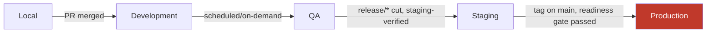

---

# Infrastructure Deployment Standards

### AWS Deployment Architecture

Arwal's backend infrastructure (`apps/api`, `apps/workers`) runs on AWS, chosen for its proven track record at Arwal's 1,000,000+ user scale target (`ai-docs/00-project-vision.md`), its mature managed-service ecosystem for PostgreSQL and Redis, and its multi-zone availability model directly supporting the High Availability Principles in `ai-docs/03-system-architecture-principles.md`. Every containerized service (per `ai-docs/09-tech-stack.md`) runs behind a load balancer, across multiple Availability Zones within Arwal's primary AWS region, so a single zone failure never constitutes a full platform outage.

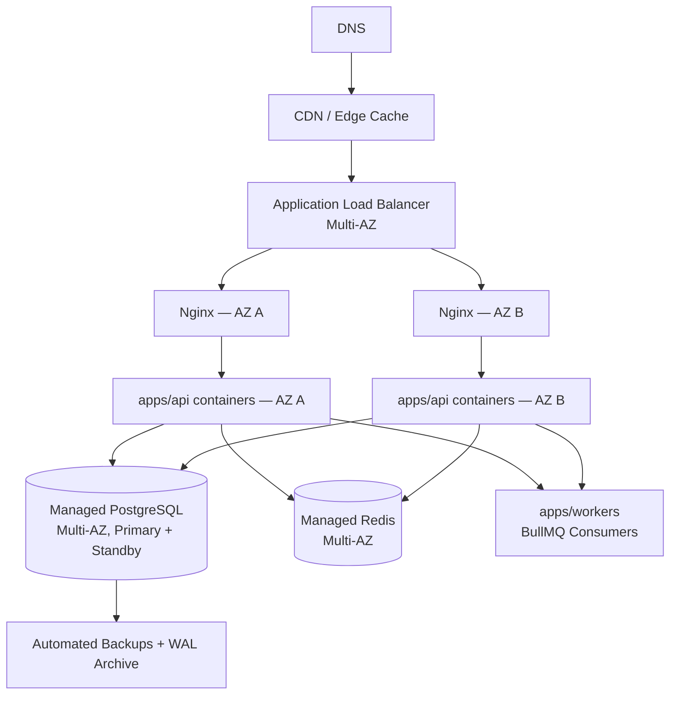

### Vercel Frontend Deployment

`apps/web` and `apps/admin-web` (Next.js, per `ai-docs/09-tech-stack.md`) deploy to Vercel, chosen specifically because it provides zero-configuration edge deployment, automatic CDN distribution, and native Server Components/ISR support without Arwal having to hand-build the equivalent edge infrastructure — directly serving the sub-2-second load target on 3G (`ai-docs/00-project-vision.md`, `ai-docs/11-performance-standards.md`) with materially less operational overhead than self-hosting the frontend tier on AWS. Every Vercel deployment consumes the same versioned `packages/sdk` API client (`ai-docs/04-folder-guidelines.md`) as every other client surface, calling the AWS-hosted backend through the public API Gateway — the frontend and backend deployment targets are deliberately decoupled, each optimized for its own workload shape, consistent with the vendor evaluation discipline in `ai-docs/09-tech-stack.md`.

**Trade-off acknowledged:** Running the frontend on Vercel and the backend on AWS introduces two infrastructure providers to reason about instead of one. Arwal accepts this because forcing the frontend onto a self-managed AWS edge/CDN setup would mean reimplementing infrastructure Vercel already provides at production quality, directly contradicting the Vendor Lock-In Considerations criterion in `ai-docs/09-tech-stack.md` — the frontend deployment is accessed only through standard build output and environment variables, never a Vercel-proprietary API woven into application code, keeping the exit path realistic if ever needed.

### Managed PostgreSQL

Production PostgreSQL runs as a managed AWS RDS (or equivalent managed-PostgreSQL) instance, in a Multi-AZ configuration with a synchronous standby, per the ACID and durability justification already established in `ai-docs/09-tech-stack.md` and `ai-docs/14-database-design-guidelines.md`. A managed service is chosen over a self-operated database because patching, failover, and backup mechanics are exactly the kind of undifferentiated operational burden the Third-Party Service Policy in `ai-docs/09-tech-stack.md` identifies as acceptable to delegate — Arwal's engineering effort is better spent on citizen-facing capability than on hand-operating database failover.

### Managed Redis

Production Redis runs as a managed cluster (AWS ElastiCache for Redis or equivalent), Multi-AZ with automatic failover, serving the three bulkheaded roles already established in `ai-docs/09-tech-stack.md`: cache, session storage, and BullMQ's queue backing store — each role monitored and capacity-planned independently, per the Bulkheading principle in `ai-docs/03-system-architecture-principles.md`.

### Object Storage

Citizen-uploaded documents (KYC, government form attachments) and product/catalog images are split across two deliberately distinct storage paths: AWS S3 (or equivalent object storage) behind the File Storage shared service (`ai-docs/03-system-architecture-principles.md`) for access-controlled, audit-relevant documents; and **Cloudinary** for public-facing, transformable media (product photos, provider profile images) where on-the-fly resizing, format conversion, and CDN delivery are the primary value, directly serving the Asset Optimization standard in `ai-docs/02-engineering-principles.md` and the Image Optimization standard in `ai-docs/11-performance-standards.md` without Arwal building its own image-transformation pipeline.

### CDN

Static assets, semi-static catalog content, and Cloudinary-served media are all delivered through a CDN layer, per the Edge/CDN Cache row already established in `ai-docs/03-system-architecture-principles.md` and `ai-docs/11-performance-standards.md`'s caching strategy — Vercel's own edge network handles `apps/web`/`apps/admin-web` static assets natively; Cloudinary provides its own CDN for transformed media; and CloudFront (or equivalent) fronts any AWS-hosted static content and the API Gateway for edge-level caching and DDoS absorption.

### DNS

DNS is managed through a dedicated, version-controlled DNS provider (Route 53 or equivalent), with every record defined declaratively as Infrastructure as Code (see below) — a DNS change is a reviewed pull request, never a console edit, since an incorrect DNS change is one of the fastest ways to cause a full, hard-to-diagnose citizen-facing outage.

### SSL/TLS

TLS termination happens at the Nginx reverse-proxy layer for AWS-hosted services and natively at Vercel's edge for frontend surfaces, per `ai-docs/09-tech-stack.md` and the API Security Standards in `ai-docs/10-security-standards.md` — TLS 1.2 minimum, modern cipher suites only, certificates provisioned and auto-renewed through a managed certificate authority (AWS Certificate Manager or equivalent), never a manually-renewed, easily-forgotten certificate.

### Domain Management

`arwal.in` (and its subdomains — `api.arwal.in`, `admin.arwal.in`, `docs.arwal.in`) are managed under a single, access-controlled domain registrar account, with registrar-level access restricted to a named set of DevOps/platform roles, per Least Privilege (`ai-docs/10-security-standards.md`) — domain and DNS compromise represents a full-platform-takeover risk, and is treated with the corresponding elevated access-control rigor.

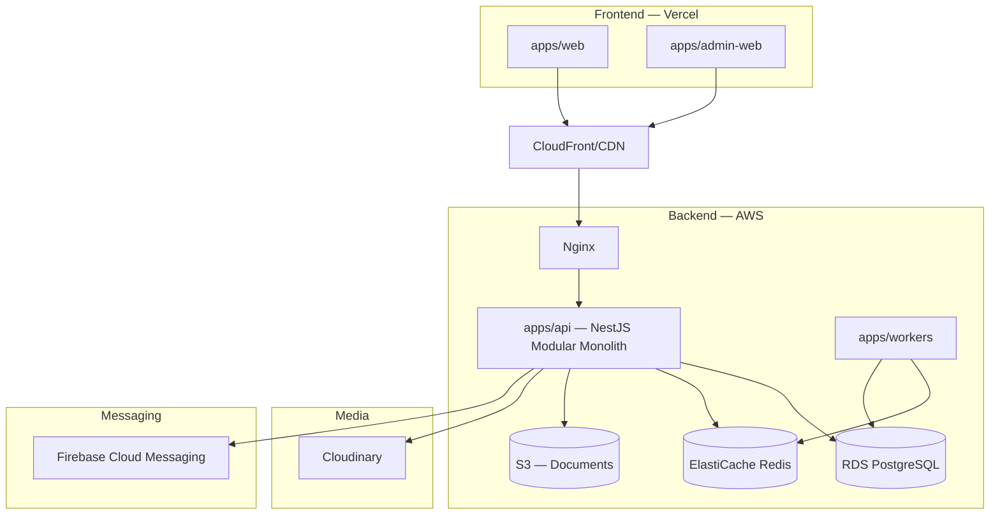

---

# Infrastructure as Code

### Declarative Infrastructure

Every provisioned resource — VPCs, subnets, security groups, RDS instances, ElastiCache clusters, ECS/container-orchestration definitions, IAM roles, DNS records — is defined declaratively in version-controlled configuration (Terraform or an equivalent declarative IaC tool), living in the `infrastructure/` root folder per `ai-docs/04-folder-guidelines.md`. Declarative configuration states the *desired end state* of infrastructure, and the IaC tool reconciles reality to match it — never an imperative, step-by-step script whose correctness depends on execution order and prior state that must be remembered.

### Version Control

Every infrastructure change is a Git commit, following the exact same branch, commit, and pull-request discipline established in `ai-docs/06-git-workflow.md` — a `chore/infra-*` or `feature/infra-*` branch, a reviewed PR, a Conventional Commit message. Infrastructure code is never treated as a lesser category of change exempt from the review rigor applied to application code; a misconfigured security group is exactly as capable of causing a citizen-facing incident as a defective use case.

### Environment Reproducibility

Because every environment (Development, QA, Staging, Production) is defined from the same IaC modules — parameterized by environment-specific variables, never hand-diverged copies — a new environment (a disaster-recovery region, a QA environment refresh) can be provisioned reliably and identically to its peers. This is the infrastructure-layer expression of the Reproducibility commitment already established in `ai-docs/06-git-workflow.md`: given the IaC repository at a specific commit, the exact infrastructure topology can be reconstructed, audited, or torn down and rebuilt with confidence.

### Infrastructure Reviews

Every infrastructure change undergoes the same Code Review Standards rigor established in `ai-docs/02-engineering-principles.md` and `ai-docs/06-git-workflow.md`, with mandatory additional review from a DevOps/platform-context reviewer for any change affecting network topology, IAM permissions, or a production-tier resource — mirroring the elevated review requirement `ai-docs/06-git-workflow.md` already applies to `payments`, `identity`, and `civic-services` domain code.

### State Management

The IaC tool's state (the record of what has actually been provisioned) is stored in a secured, versioned, remote backend (e.g., an encrypted S3 bucket with state locking) — never on an individual engineer's local machine, where it could be lost, become stale, or allow two engineers to apply conflicting changes simultaneously without detection. State-file access is scoped per Least Privilege (`ai-docs/10-security-standards.md`), since the state file itself can contain sensitive infrastructure detail.

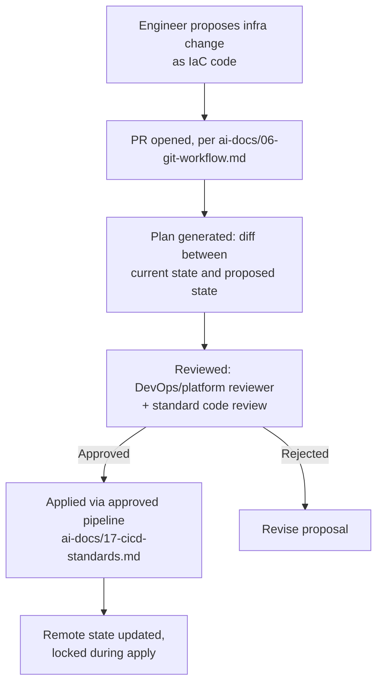

> **Callout — Why Infrastructure as Code Is Mandatory, Not Optional**
> A console-provisioned resource is invisible to code review, invisible to `git blame`, and invisible to a future engineer trying to understand why production is shaped the way it is — exactly the "tribal knowledge" failure mode `ai-docs/02-engineering-principles.md`'s Documentation-Driven Development principle exists to eliminate. At Arwal's ~300-phase horizon, an environment that cannot be reconstructed from version-controlled code alone is an environment nobody fully understands by Phase 150.

---

# Containerization Standards

### Docker Image Structure

Every deployable backend service (`apps/api`, `apps/workers`) ships as a Docker image, per `ai-docs/09-tech-stack.md`, built from a `Dockerfile` co-located with the app it packages. Every image is layered deliberately — dependencies installed before application code is copied in — so Docker's build cache is maximally effective and CI build times (governed by `ai-docs/17-cicd-standards.md`) stay short.

### Multi-Stage Builds

Every production image is built using a multi-stage `Dockerfile`: a `build` stage installs full dependencies (including dev dependencies), compiles TypeScript, and runs any build-time steps; a final, minimal `runtime` stage copies only the compiled output and production dependencies, discarding build tooling, source maps (unless explicitly needed for error tracking), and dev dependencies entirely.

```dockerfile
# Illustrative structure — exact contents evolve per service
FROM node:20-slim AS build
WORKDIR /app
COPY package*.json ./
RUN npm ci
COPY . .
RUN npm run build

FROM node:20-slim AS runtime
WORKDIR /app
ENV NODE_ENV=production
COPY --from=build /app/dist ./dist
COPY --from=build /app/node_modules ./node_modules
COPY package*.json ./
USER node
EXPOSE 3000
CMD ["node", "dist/main.js"]
```

### Non-Root Containers

Every container runs as a non-root user by default, per the Docker Security standard already established in `ai-docs/10-security-standards.md` — a container requiring elevated privilege is a documented, reviewed exception, never a default convenience. This limits the blast radius of a container-escape vulnerability: a compromised process running as `node` (UID 1000, non-root) cannot trivially escalate to host-level compromise the way a root-running container's compromised process could.

### Image Optimization

Every production image is built from a minimal, official, actively-maintained base image (e.g., `node:20-slim`, never a full, bloated general-purpose OS image), per `ai-docs/10-security-standards.md` — a smaller image means a smaller attack surface, faster pull times during deployment (directly supporting Zero-Downtime Deployments' speed of rollout), and lower storage cost across the image registry.

### Image Versioning

Every image is tagged with the immutable Git commit SHA it was built from — never `latest`, and never a floating, mutable tag in any deployed artifact, per the Supply-Chain Protection standard in `ai-docs/10-security-standards.md`. A `latest` tag, by definition, changes meaning over time; a SHA-tagged image is a permanent, unambiguous, reproducible reference to exactly what code is running, which is what makes both audit and rollback (see below) trustworthy.

```
registry.arwal.in/api:a1b2c3d4e5f6...      ← immutable, SHA-tagged
registry.arwal.in/api:v1.4.0               ← additionally tagged at release-tag time, per ai-docs/06-git-workflow.md
registry.arwal.in/api:latest               ← never used for a deployed artifact
```

### Registry Management

Built images are pushed to a private, access-controlled container registry (Amazon ECR or equivalent) — never a public registry for any Arwal-built image, since even a seemingly harmless internal service image can leak architectural detail useful to an attacker. Registry access follows Least Privilege: the CI/CD pipeline's service identity can push; only the deployment mechanism (never an individual engineer's personal credentials) can pull into production.

### Container Security

Every image is scanned for known vulnerabilities (per the Dependency Security and Docker Security standards in `ai-docs/10-security-standards.md`) as part of the build process, before it is eligible for deployment to any shared environment — a finding above the agreed severity threshold blocks promotion, exactly as a dependency vulnerability blocks a code PR. Base images are pulled from a verified, checksummed source only, and unused build tools, shells, and package managers are excluded from the final runtime image via the multi-stage pattern above, minimizing what an attacker could use even after a successful compromise.

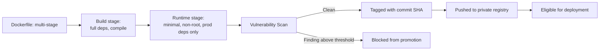

---

# Deployment Strategies

Arwal selects a deployment strategy deliberately, per change risk and service criticality — never applying the same strategy uniformly regardless of what is being shipped, consistent with the Risk-Based discipline already established for testing in `ai-docs/15-testing-standards.md`.

### Rolling Deployment

**What it is:** New instances (running the new image) are brought up gradually, replacing old instances one (or a small batch) at a time, with the load balancer shifting traffic only to instances that pass their health check.

**When used:** The default strategy for the overwhelming majority of `apps/api` and `apps/workers` deployments — low-risk, incremental, backward-compatible changes following the standard Feature Development Workflow (`ai-docs/07-development-workflow.md`).

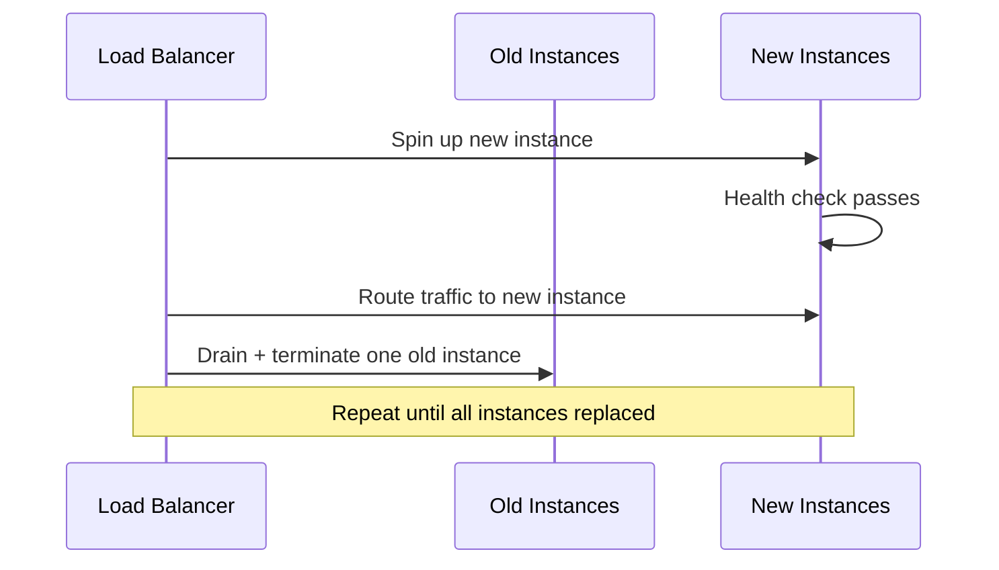

### Blue-Green Deployment

**What it is:** A complete second production environment ("green") is stood up alongside the currently-live one ("blue"), fully tested against real infrastructure, and traffic is switched over atomically once verified — with the old environment kept warm as an instant rollback target.

**When used:** Higher-risk releases touching a citizen-critical flow (payments, civic application submission) where an instantaneous, all-or-nothing cutover — and an equally instantaneous rollback by simply switching traffic back — is worth the doubled infrastructure cost for the duration of the cutover window.

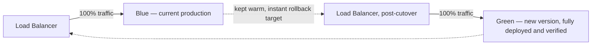

### Canary Deployment

**What it is:** The new version is rolled out to a small, controlled percentage of production traffic first (e.g., 5%), monitored closely against the golden signals and SLOs in `ai-docs/11-performance-standards.md`, and progressively expanded to 100% only if metrics remain healthy at each stage.

**When used:** Changes with a meaningful but not extreme risk profile, or any release where Arwal wants real production traffic's behavior as evidence before committing the entire citizen base to it — directly implementing the Progressive Delivery commitment already established in `ai-docs/02-engineering-principles.md`.

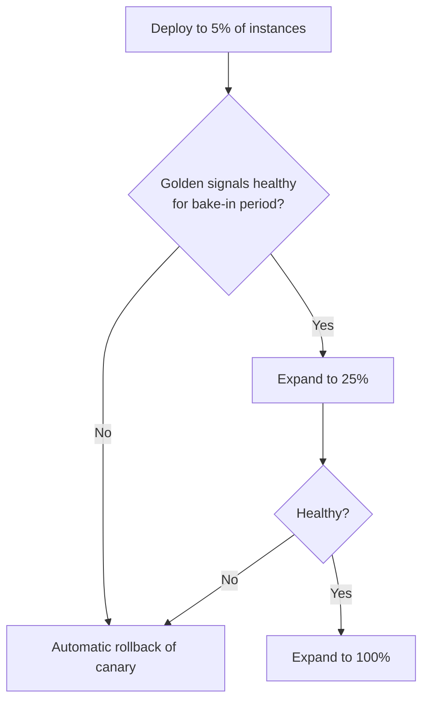

### Feature Flag Releases

**What it is:** New code is deployed to 100% of production instances but its citizen-facing behavior remains inactive, gated behind a feature flag — the flag is then toggled on for an internal cohort, a percentage of citizens, or all citizens, independent of any further deployment.

**When used:** Decoupling *deployment* (code reaching production) from *release* (a citizen actually experiencing the new behavior) — this is Arwal's preferred mechanism for de-risking a genuinely novel or citizen-behavior-changing feature, since a flag can be instantly toggled off without any deployment/rollback mechanics at all, per the Progressive Delivery principle in `ai-docs/02-engineering-principles.md`.

### Shadow Deployment

**What it is:** The new version receives a mirrored copy of real production traffic (or events) alongside the currently-live version, processing it fully but never returning its response to the actual citizen — used purely to observe the new version's behavior, performance, and error rate under genuine production load before it ever affects a citizen.

**When used:** A high-risk rewrite of a critical path (e.g., a new pricing-calculation engine, a new fraud-detection model) where Arwal wants direct evidence of production-scale correctness and performance before any citizen is exposed to the new logic at all — the highest-confidence, highest-cost strategy, reserved for genuinely significant changes.

### Strategy Comparison Table

| Strategy | Rollback Speed | Infrastructure Cost | Citizen Risk During Rollout | Best For |
|---|---|---|---|---|
| **Rolling** | Fast (redeploy previous image) | Low (no duplicate environment) | Low-Medium | Routine, low-risk releases |
| **Blue-Green** | Instant (traffic switch) | High (duplicate environment, temporary) | Low | High-stakes cutovers (payments, civic flows) |
| **Canary** | Fast (halt expansion, roll back canary slice) | Medium | Very Low | Uncertain-risk changes needing real traffic evidence |
| **Feature Flag** | Instant (toggle off, no redeploy) | Low | Very Low (opt-in exposure) | Citizen-behavior-changing features |
| **Shadow** | N/A (never citizen-facing) | High (duplicate processing) | None | Critical-path rewrites needing pre-exposure validation |

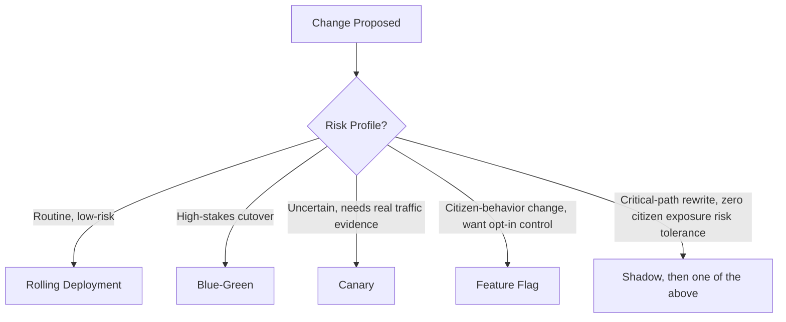

---

# Rollback Standards

### Automatic Rollback Philosophy

Per Rollback Over Hotfixes (above), the fastest, safest response to a deployment-caused regression is always reverting to the last known-good state — and wherever a deployment strategy supports it (Canary, Blue-Green), rollback is triggered **automatically** the moment monitored golden signals (`ai-docs/11-performance-standards.md`) breach a defined threshold during the post-deploy bake-in window, without waiting for a human to notice and decide. Automatic rollback is not a replacement for human judgment — it is a first line of defense that buys the human responder time to investigate without citizens continuing to be affected in the meantime.

### Manual Rollback

Where automatic rollback is not configured or does not trigger (a regression that manifests outside the automated bake-in window, or a subtler defect the automated thresholds don't catch), a manual rollback is initiated by the on-call engineer or release manager, executed through the same approved pipeline mechanism used for a forward deployment — never a manual, ad hoc infrastructure command, per the Automation First principle above.

### Database Rollback Considerations

Application code rollback and database rollback are **not symmetric**, and this asymmetry is the single most important rollback consideration at Arwal. Per the Three-Step Migration Discipline in `ai-docs/14-database-design-guidelines.md` (additive-first, backfill-separately, constrain-last), a schema migration deployed alongside application code is designed from the start to be backward-compatible with the *previous* application version — meaning a code rollback almost never requires a corresponding schema rollback, because the old code was never broken by the new, additive schema in the first place. A migration that would break the previous code version if left in place after a rollback is, by definition, a migration that violated the Database Change Workflow (`ai-docs/07-development-workflow.md`) and should not have been deployed as designed.

### Feature Flag Rollback

Where a regression is isolated to a feature-flagged capability, the fastest possible mitigation is toggling the flag off — no redeploy, no rollback pipeline, effectively instantaneous — and is preferred over a full application rollback whenever the flag's blast radius genuinely contains the issue.

### Verification After Rollback

A rollback is not complete the moment traffic shifts back to the previous version — it is complete once golden signals (`ai-docs/11-performance-standards.md`) are confirmed to have returned to their pre-incident baseline, smoke tests pass against the rolled-back version, and the on-call responder has explicitly confirmed citizen impact has ended, per the Post-Deployment Verification section below.

### Incident Escalation

A rollback that does not immediately resolve the observed regression, or a regression whose cause is not yet understood, escalates directly into the Incident Response Workflow already established in `ai-docs/07-development-workflow.md` — declaring an incident, assembling responders, and following the same Mitigate-Communicate-Root-Cause-Postmortem sequence, never treated as "just a deployment problem" separate from Arwal's standard incident discipline.

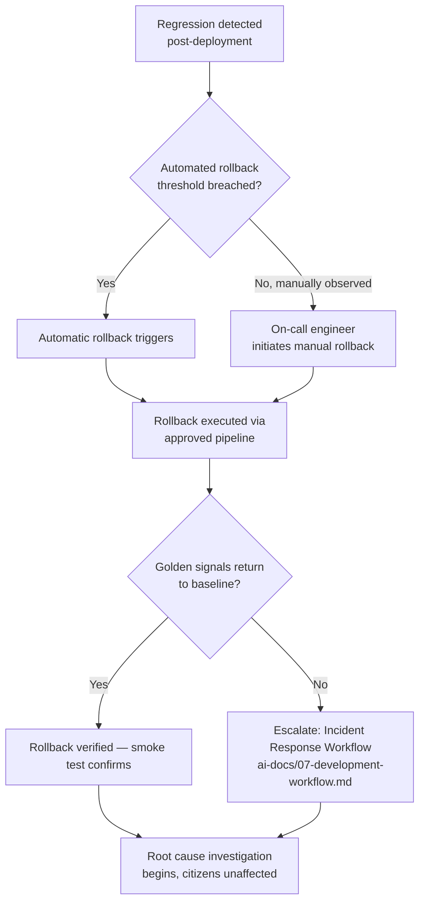

---

# Database Deployment Standards

### Prisma Migrations

Every schema change reaches production exclusively via `prisma migrate deploy`, applying already-committed, already-reviewed migration files in the exact order they were authored, per `ai-docs/09-tech-stack.md` and `ai-docs/14-database-design-guidelines.md` — this document does not redefine migration authorship discipline, only affirms that production migration execution happens through this single, deterministic command, never a manual SQL script run by hand against production.

### Migration Validation

Before a migration reaches staging, it has already been applied cleanly against an isolated test database (`ai-docs/14-database-design-guidelines.md`, `ai-docs/15-testing-standards.md`) and reviewed against the Migration Review Checklist in `ai-docs/14-database-design-guidelines.md`. Before a migration reaches production, it has additionally run successfully against staging's production-topology-identical database during the staging soak period, per the Release Readiness Workflow (`ai-docs/07-development-workflow.md`) — a migration is never applied to production as its first real-world execution.

### Backward-Compatible Schema Evolution

Every migration deployed to production is backward-compatible with the application version it is replacing throughout the rollout window, per the Three-Step Migration Discipline already established in `ai-docs/14-database-design-guidelines.md` — this is what makes Zero-Downtime Deployments (a rolling or blue-green rollout where old and new application code briefly run simultaneously against the same database) safe by construction, rather than by luck.

### Zero-Downtime Migrations

Migrations run **before** the corresponding application code deployment begins, so the new schema is present (additively, per the discipline above) before any instance running the new code needs it, and the old code — still serving traffic during a rolling rollout — continues operating correctly against the additively-changed schema throughout. A migration is never run mid-rollout, and a migration expected to lock a table for a meaningful duration at production data volume is scheduled deliberately (a low-traffic maintenance window, or executed via a lock-minimizing technique) and reviewed specifically for its lock-duration impact before merge, per the Query Plan Review discipline in `ai-docs/14-database-design-guidelines.md`.

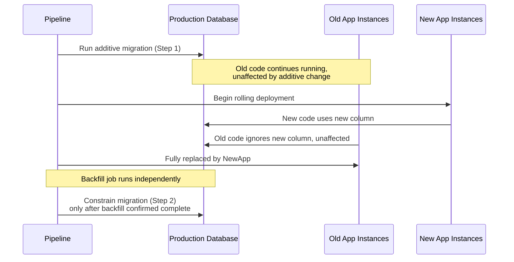

### Data Migration Strategy

A large-scale data backfill or transformation (distinct from a schema migration) is executed as its own, independently-monitored job — batched, resumable, and rate-limited to avoid overwhelming production database capacity — never bundled into the schema migration itself, per the Backfill Separately discipline in `ai-docs/14-database-design-guidelines.md`. A data migration affecting citizen-facing correctness is dry-run against staging's representative dataset first, with its expected row-count impact and duration estimated and documented before it is scheduled against production.

---

# Configuration Management

### Environment Variables

Every environment (`development`, `staging`, `production`) has its own explicitly typed, validated configuration, loaded through the shared configuration-loading module described in `ai-docs/04-folder-guidelines.md` and `ai-docs/09-tech-stack.md` — never read directly from `process.env` scattered through business logic. A service fails fast at boot if a required environment variable is missing or malformed, per the Validation principle in `ai-docs/02-engineering-principles.md`, rather than starting in a silently misconfigured state.

### Runtime Configuration

Values that can legitimately change without a redeploy (feature flags, district-specific configuration, rate-limit thresholds) are served through the shared feature-flag/configuration service described in `ai-docs/04-folder-guidelines.md`, consumed via each app's `config/runtime.ts` — never hardcoded as a literal requiring a full deployment to adjust, consistent with the DRY discipline `ai-docs/02-engineering-principles.md` applies to runtime toggles.

### Secret Management

Every credential, API key, and signing key is sourced exclusively through the dedicated secrets-management system already established in `ai-docs/09-tech-stack.md` and `ai-docs/10-security-standards.md` — injected into a service's runtime environment at deployment time, never baked into a container image, never committed to the repository, and never passed as a plaintext command-line argument visible in process listings. This document adds nothing to that standard beyond affirming it applies without exception at the point of deployment: the deployment pipeline's own access to the secrets store is itself scoped to the minimum set of secrets the specific deployment step requires, per Least Privilege.

### Configuration Validation

Every configuration value — environment variable, feature flag default, runtime setting — is schema-validated at service boot (Zod, per `ai-docs/09-tech-stack.md`), exactly as an API request is validated at its boundary (`ai-docs/13-api-design-guidelines.md`). A misconfigured, malformed, or missing required value is treated as a deployment-blocking failure, surfaced immediately and loudly, never allowed to degrade into a subtle runtime defect discovered later.

### Configuration Versioning

Non-secret configuration (`.env.<environment>.example` templates, feature-flag default definitions, `configs/`) is version-controlled per the Configuration Organization standard in `ai-docs/04-folder-guidelines.md`, so a configuration change is reviewable, traceable, and revertible through the exact same Git discipline as application code — a configuration drift between what's documented and what's actually deployed is treated as a defect, per the same Documentation Cannot Go Stale reasoning already established in `ai-docs/04-folder-guidelines.md`.

---

# Deployment Security

### Least Privilege

Every actor with any deployment capability — a CI/CD service identity, a release manager's personal account, an infrastructure-provisioning role — is granted the minimum permission set its specific function requires, per the Least Privilege principle in `ai-docs/10-security-standards.md`. A pipeline stage that only needs to push a container image is never also granted the ability to modify IAM policies; a release manager who can promote a staging build to production is not thereby granted standing SSH access to production hosts.

### Production Access Control

Direct, standing access to production infrastructure (database, containers, hosts) is granted to no one by default. Where a genuine, specific need arises (an emergency investigation, a documented break-glass scenario), access is time-bound, logged, and requires explicit justification captured in the immutable audit trail, per the Admin Privileges standard in `ai-docs/10-security-standards.md` — access is never ambient, permanent, or unlogged for any role, including the most senior engineer on the team.

### Secret Rotation

Every deployment-relevant secret (database credentials, API keys, signing keys, the deployment pipeline's own service credentials) is rotated on a defined schedule, per the Key Management standard in `ai-docs/10-security-standards.md`, with rotation itself automated and never requiring a coordinated, manually-triggered application redeploy — a service reads its credentials fresh from the secrets system at connection/session initialization, so rotation is transparent to running services.

### Supply Chain Security

Every dependency pulled into a deployed image — npm packages, the base Docker image, CI/CD actions/plugins — is pinned to a specific, reviewed version (never a floating tag) and sourced from a verified registry, per the Supply-Chain Protection standard in `ai-docs/10-security-standards.md`. A Software Bill of Materials (SBOM) is generated for every deployable image, giving Arwal the ability to answer "are we affected by this newly disclosed CVE" within minutes of a disclosure, per the same standard.

### Container Security

Per the Containerization Standards above, every deployed container runs non-root, is built from a scanned, minimal base image, and excludes build-time tooling from its runtime layer — this section affirms that these properties are verified as a **deployment gate**, not merely a build-time aspiration: an image failing its vulnerability scan is never eligible for promotion to any shared environment, regardless of how urgently a fix is needed elsewhere.

### Network Security

Production network topology enforces the same Zero-Trust and Network Segmentation principles already established in `ai-docs/03-system-architecture-principles.md` and `ai-docs/10-security-standards.md`: no service is directly reachable from the public internet except through the Nginx/API Gateway perimeter; the database accepts connections only from the application tier's connection pool; security groups default-deny and are opened only for the specific, documented traffic pattern a service genuinely requires.

### Deployment Authorization

A production deployment requires the same layered authorization already established for code merges in `ai-docs/06-git-workflow.md` (required reviewer approval, elevated review for sensitive domains) **plus** an explicit release-readiness sign-off (see Production Readiness Checklist below) — a deployment is never a unilateral action by a single engineer, regardless of seniority, mirroring the "No Direct Push to `main`, Ever" principle already established in `ai-docs/06-git-workflow.md`, extended from the code repository to the running infrastructure itself.

---

# Post-Deployment Verification

A deployment is not considered successful the moment new instances report healthy — it is considered successful only once the change has been actively verified against real behavior, per the Complete vs. Done distinction already established in `ai-docs/08-definition-of-done.md`.

### Smoke Testing

Immediately after every deployment to any shared environment, a fast, curated smoke-test suite runs against the freshly deployed environment — a small number of high-confidence checks (can a citizen log in, does the health endpoint respond, does a core read endpoint return data) that catch a catastrophically broken deploy within seconds, before broader verification or citizen traffic ramp-up proceeds, per the Smoke Testing layer already established in the Testing Pyramid (`ai-docs/15-testing-standards.md`).

### Health Checks

Every service's `/health/live` and `/health/ready` endpoints (per `ai-docs/09-tech-stack.md`) are polled continuously by the load balancer and deployment orchestrator throughout and after the rollout — an instance failing its readiness check is never routed traffic, and an instance failing its liveness check is automatically replaced, making failure detection structural rather than dependent on a human noticing.

### Functional Verification

For any release carrying meaningful feature risk, the curated E2E suite (`ai-docs/15-testing-standards.md`) is re-run against the newly deployed environment specifically — not merely trusted to still be valid from its staging run — confirming the deployed artifact, not just the tested one, behaves correctly.

### Performance Verification

Golden signals (latency, traffic, errors, saturation, per `ai-docs/11-performance-standards.md`) for the newly deployed version are compared against the pre-deployment baseline during the bake-in window (see below) — a deployment that is functionally correct but has silently regressed p95 latency is treated with the same severity as a functional defect, per the Performance Definition of Done in `ai-docs/08-definition-of-done.md`.

### Monitoring Verification

Dashboards and alerting (`ai-docs/09-tech-stack.md`, `ai-docs/11-performance-standards.md`) are confirmed to be correctly receiving data from the newly deployed instances before the deployment is considered complete — a "successful" deployment that has accidentally broken its own observability pipeline is not successful; it is a blind spot waiting to hide the next real incident.

### Rollback Readiness

Throughout the post-deployment observation window, the previous version's image remains available and the rollback pipeline remains primed and unblocked — rollback readiness is not something assembled *after* a problem is noticed; it is a standing precondition of every deployment, verified before the deployment even begins.

### Production Observation Window

Every production deployment is followed by a defined, actively-monitored **bake-in period** — a minimum of 30 minutes of focused observation for a routine rolling deployment, extended to several hours for a high-risk change deployed via Blue-Green or Canary — during which the deploying engineer or release manager remains available and golden signals are watched directly, not merely trusted to alert on their own. A deployment is not considered fully closed out until this window elapses without an unexplained regression.

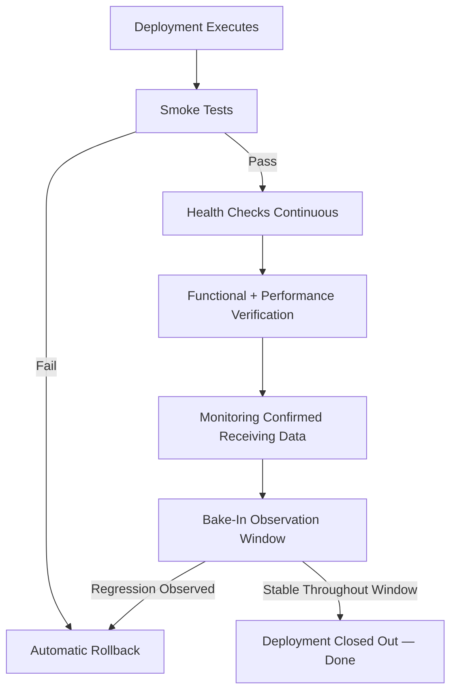

---

# Disaster Recovery

### Recovery Time Objective (RTO) and Recovery Point Objective (RPO)

| Scenario | RTO Target | RPO Target | Rationale |
|---|---|---|---|
| **Single service instance failure** | < 1 minute (automatic replacement) | 0 (no data loss — stateless, per `ai-docs/11-performance-standards.md`) | Handled automatically by health checks and horizontal redundancy; not a disaster-recovery event at all. |
| **Single Availability Zone failure** | < 5 minutes (automatic failover) | 0 | Multi-AZ deployment (see Infrastructure Deployment Standards) absorbs this without manual intervention. |
| **Database primary failure** | < 5 minutes (automatic standby promotion) | < 1 minute (synchronous replication lag) | Managed PostgreSQL Multi-AZ (`ai-docs/09-tech-stack.md`) handles primary failover automatically. |
| **Full regional outage** | < 1 hour | < 5 minutes (WAL-archive-bounded, per `ai-docs/14-database-design-guidelines.md`) | Requires manual DR activation to a secondary region; not fully automated at Arwal's current phase, but the restore path is tested and ready. |
| **Catastrophic data corruption (application-caused)** | < 1 hour | Point-in-time, to the moment immediately preceding the corrupting event | Point-in-Time Recovery via continuous WAL archiving (`ai-docs/14-database-design-guidelines.md`) restores to the exact pre-incident moment. |

### Backup Validation

Consistent with the Backup Testing standard in `ai-docs/14-database-design-guidelines.md`, every backup restoration path is tested on a defined, recurring schedule — an unverified backup is not a backup, only an assumption. Deployment infrastructure state (the IaC-defined topology itself) is similarly validated as reconstructable: a periodic drill provisions a fresh environment purely from IaC and the latest database backup, confirming the full recovery chain works end to end, not merely its individual pieces in isolation.

### Regional Failures

Arwal's primary infrastructure runs in a single AWS region with Multi-AZ redundancy absorbing the vast majority of realistic failure scenarios, per the Scalability by Design principle in `ai-docs/03-system-architecture-principles.md`. A full regional outage is a low-probability, high-impact event handled via a documented (though not fully automated, at Arwal's current phase) cross-region recovery runbook — database backups and WAL archives are replicated to a secondary region, and IaC definitions can provision a full recovery topology there, evaluated and exercised per the Disaster Recovery Drill cadence below. Full active-active multi-region deployment is a future evolution, revisited via ADR once genuine evidence (per the Migration Strategy discipline in `ai-docs/03-system-architecture-principles.md`) justifies the added operational complexity.

### Infrastructure Recovery

Because every piece of infrastructure is defined declaratively (see Infrastructure as Code above), infrastructure recovery from a catastrophic loss is, in principle, a matter of re-applying the IaC configuration against a new target — the same property that makes environment reproducibility routine also makes disaster recovery tractable rather than a from-memory reconstruction exercise.

### Database Recovery

Database recovery follows the Point-in-Time Recovery mechanism already established in `ai-docs/14-database-design-guidelines.md` — a full base backup plus continuously archived WAL segments allow restoration to any specific timestamp within the retention window, minimizing data loss to the smallest realistic exposure regardless of the failure's exact cause.

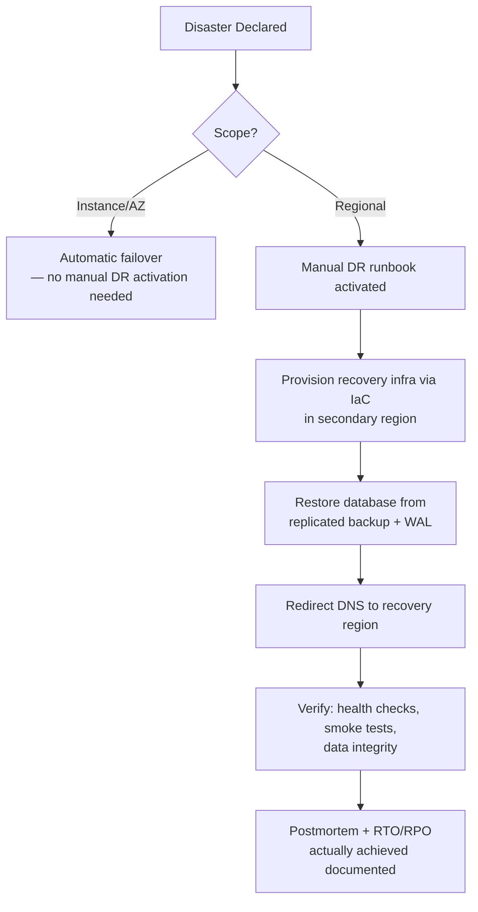

---

# Production Readiness Checklist

A release is not promoted to production unless every applicable item below is satisfied — this checklist extends, and does not replace, the Release Readiness Checklist already established in `ai-docs/07-development-workflow.md` and the Release Definition of Done in `ai-docs/08-definition-of-done.md`, adding the deployment-specific gates this document is responsible for.

### Infrastructure
- [ ] All infrastructure changes for this release are applied via reviewed IaC, with no undocumented console-provisioned resource.
- [ ] Multi-AZ redundancy is confirmed healthy for every citizen-critical service.
- [ ] Load balancer and health-check configuration is verified against the new version's actual health-check contract.

### Security
- [ ] Container images are scanned clean, or findings have a documented, approved remediation plan, per `ai-docs/10-security-standards.md`.
- [ ] No secret, credential, or key is present in any image layer, environment-variable template, or IaC diff.
- [ ] Least-privilege review is complete for any new or modified deployment role/credential.

### Performance
- [ ] Bundle-size and API-latency budgets (`ai-docs/11-performance-standards.md`) are verified against the release candidate, not merely assumed unchanged.
- [ ] Load testing has been performed for any change expected to carry significant new load, per `ai-docs/11-performance-standards.md`.

### Testing
- [ ] Full regression suite (E2E + curated high-risk manual checks) passes against the staging release candidate, per `ai-docs/15-testing-standards.md`.
- [ ] No open Sev 1/Sev 2 defect exists within the release's scope.

### Database
- [ ] Every migration in the release has been validated against staging and follows the backward-compatible, additive-first discipline.
- [ ] A rollback path (or explicit, signed-off lack thereof) is documented for every migration, per `ai-docs/14-database-design-guidelines.md`.

### Monitoring
- [ ] Dashboards and alerting exist and are verified functioning for every new or modified service, per `ai-docs/09-tech-stack.md`.
- [ ] SLOs affected by this release have been reviewed for expected impact.

### Rollback
- [ ] The previous production image/tag is confirmed available and deployable as an immediate rollback target.
- [ ] The deployment strategy (Rolling/Blue-Green/Canary) and its rollback mechanics are explicitly chosen and understood by the release manager before deployment begins.

### Documentation
- [ ] Release notes/changelog are generated from Conventional Commit history, per `ai-docs/06-git-workflow.md`.
- [ ] Any new service has a current README and a live dashboard, per `ai-docs/02-engineering-principles.md`.

### Operational Approvals
- [ ] Tech Lead, QA, and DevOps/Release Manager sign-off are all obtained, per the Release Readiness Workflow in `ai-docs/07-development-workflow.md`.
- [ ] The deployment is not scheduled for a window without an available, briefed on-call responder.

---

# Engineering Review Checklist

Every pull request or change proposal affecting deployment configuration, infrastructure, containerization, or release mechanics is checked against the following before merge, by a release manager or DevOps-context reviewer:

- [ ] Does the change preserve Zero-Downtime Deployment for every affected citizen-facing service?
- [ ] Is every new or modified infrastructure resource defined as reviewed, version-controlled IaC — no console-provisioned exception?
- [ ] Does the container image (if modified) remain non-root, minimal, and multi-stage-built?
- [ ] Is the image tagged immutably (commit SHA), never `latest`, for any artifact eligible for deployment?
- [ ] Is the correct deployment strategy (Rolling/Blue-Green/Canary/Feature Flag/Shadow) selected and justified for this change's risk profile?
- [ ] Is a rollback path explicitly confirmed — including for any accompanying database migration, per the asymmetry discussed in Rollback Standards?
- [ ] Does the change respect Least Privilege for every deployment-relevant credential or role it touches?
- [ ] Are health checks, metrics, and dashboards updated to reflect any new or changed service surface?
- [ ] Is the change consistent with the Production Readiness Checklist above, with no item silently skipped?
- [ ] If this change modifies this document's own standards, is it backed by an ADR, per the same discipline `ai-docs/02-engineering-principles.md` requires for any foundational-phase deviation?

A pull request or change failing any item above is not merged or promoted until resolved — this checklist carries the same non-negotiable authority as every other review checklist established in the preceding sixteen phase documents.

---

# Relationship to CI/CD Standards

This document defines **what** a safe, correct, reversible deployment looks like — the environments it targets, the infrastructure it runs on, the containers it packages code into, the strategies it uses to roll out, and the standards it must satisfy before and after it happens. It deliberately does not define **how** that deployment is mechanically triggered, orchestrated, or automated step by step — that is the exclusive responsibility of `ai-docs/17-cicd-standards.md` (Phase 18).

Every deployment described in this document — to Development, QA, Staging, or Production — occurs exclusively through the approved CI/CD platform defined in that document. There is no deployment path to any shared environment that bypasses the CI/CD pipeline, regardless of urgency, seniority, or perceived simplicity of the change, mirroring the "No Direct Push to `main`, Ever" principle already established in `ai-docs/06-git-workflow.md`. Where this document references "the pipeline," "the approved deployment mechanism," or "automated rollback," the concrete implementation of that mechanism — its stages, its tooling, its automation logic — is governed entirely by Phase 18, and this document neither duplicates nor overrides it.

---

# Closing Statement

> **Callout — Closing Statement**
> Every preceding phase document described a dimension of how Arwal is designed, written, secured, made performant, made accessible, contracted, modeled, and verified. This document describes the moment all of that becomes real — the instant a tested, reviewed, documented change stops being a diff in a repository and starts being the thing a farmer's phone, a citizen's booking, and a government officer's queue actually run on. A deployment at Arwal is never an act of hope; it is a repeatable, observable, immediately reversible operation, built on infrastructure that is itself code, reviewed with the same rigor as every function it ships, and never trusted to have worked until it has been actively verified to have worked. Where a future phase must deviate from a standard stated here, that deviation is made explicitly — through the Production Readiness Checklist's sign-off process, or an Architectural Decision Record where the deviation is structural — never silently, and never by default. Every deployment, for every one of the ~300 micro-phases still ahead, must remain secure, observable, repeatable, and reversible — because a district's trust, once shaken by a careless release, is far harder to rebuild than any feature is to ship.

This document, `ai-docs/16-deployment-standards.md`, is the seventeenth phase of approximately 300. Every environment provisioned, every container built, and every release promoted in the phases that follow is expected to satisfy the standards defined here, or to justify its deviation in writing.

**End of Phase 17 — `ai-docs/16-deployment-standards.md`**