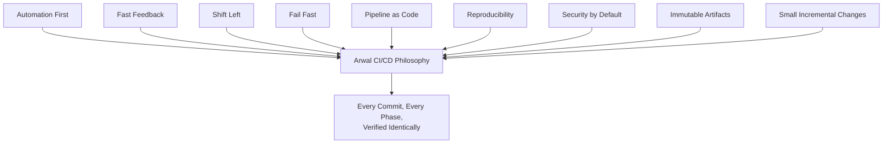
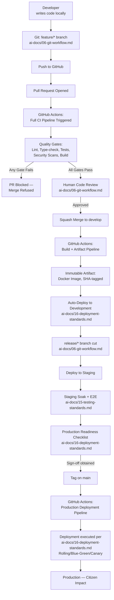
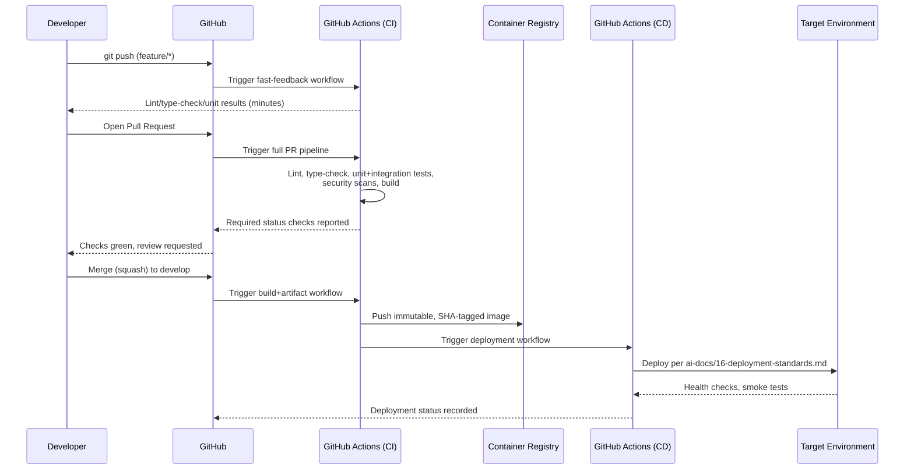
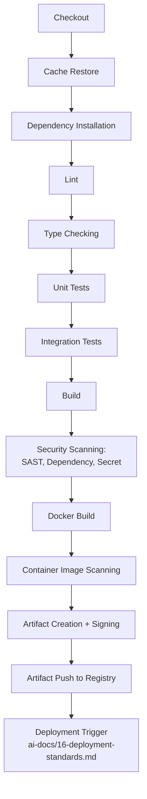
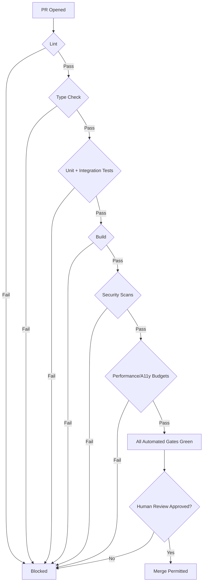
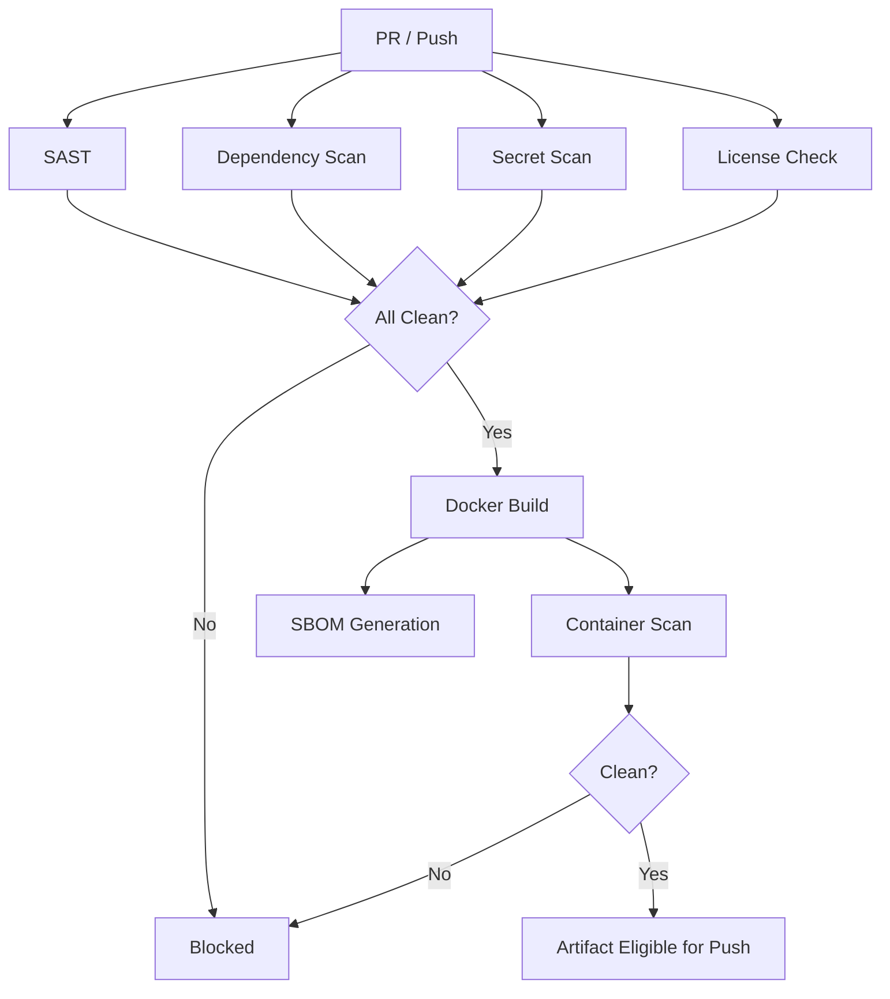
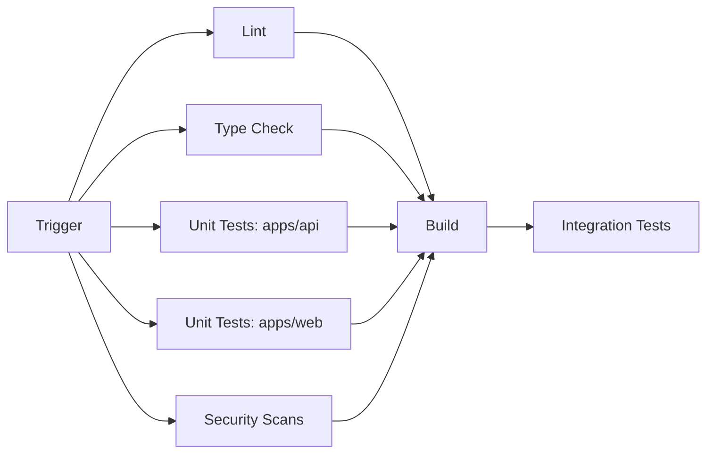
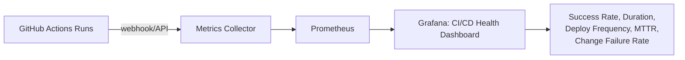
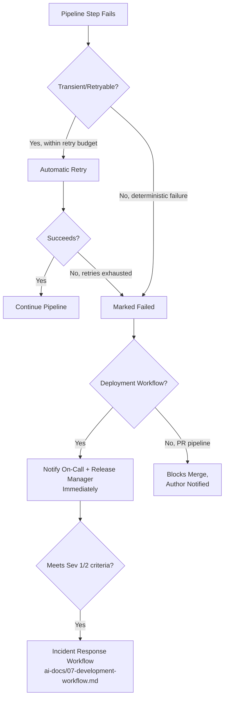

# CI/CD Standards

**Document:** `ai-docs/17-cicd-standards.md`
**Project:** Arwal — The District Super App
**Stage:** 1 — Foundation
**Phase:** 18 — CI/CD Standards
**Status:** Approved for Engineering Reference
**Audience:** Architects, DevOps Engineers, SRE, Platform Engineers, Backend Engineers, Frontend Engineers, Release Managers, Security Engineers, Technical Reviewers, Government Technical Partners

> **Callout — Purpose of This Document**
> `ai-docs/00-project-vision.md` defined why Arwal exists. `ai-docs/01-product-goals.md` defined what Arwal must achieve. `ai-docs/02-engineering-principles.md` defined how engineers reason about design. `ai-docs/03-system-architecture-principles.md` defined how the system is structured. `ai-docs/04-folder-guidelines.md` defined where that structure physically lives. `ai-docs/05-coding-standards.md` defined how individual lines of code are written. `ai-docs/06-git-workflow.md` defined how change moves through version control. `ai-docs/07-development-workflow.md` defined how a day of engineering work unfolds. `ai-docs/08-definition-of-done.md` defined when a piece of work is actually finished. `ai-docs/09-tech-stack.md` named the concrete technologies everything is built from. `ai-docs/10-security-standards.md` defined the enforceable security standard those technologies must satisfy. `ai-docs/11-performance-standards.md` defined the enforceable performance standard those technologies must satisfy. `ai-docs/12-accessibility-standards.md` defined the enforceable accessibility standard every screen must satisfy. `ai-docs/13-api-design-guidelines.md` defined the enforceable API contract standard every endpoint must satisfy. `ai-docs/14-database-design-guidelines.md` defined the enforceable schema standard every table must satisfy. `ai-docs/15-testing-standards.md` defined how every one of those standards is proven, automatically, before a citizen depends on it. `ai-docs/16-deployment-standards.md` defined where deployments run, what environments exist, and how a release is rolled out and rolled back safely. This document defines **the automated machinery that connects all of it** — the exact, citable rules for how a commit becomes a verified, artifact-producing, deployable pipeline run, every time, for every one of the ~300 micro-phases still ahead.

---

# Purpose of this Document

Every phase document preceding this one describes a standard that must be true about Arwal's code, schema, contracts, or infrastructure. `ai-docs/15-testing-standards.md` describes how those standards are *proven*. `ai-docs/16-deployment-standards.md` describes *where* a proven, tested change ultimately runs and how it is kept safe and reversible once it's there. Neither document describes the automated machine that sits between them — the system that actually takes a commit, runs every check `ai-docs/15-testing-standards.md` requires, produces the exact artifact `ai-docs/16-deployment-standards.md` expects, and hands it off to deployment without a human ever needing to remember a manual step.

That machine is CI/CD, and it is the connective tissue of every governance document in this project. Without it, `ai-docs/05-coding-standards.md`'s lint rules are a suggestion an engineer might forget to run locally. Without it, `ai-docs/10-security-standards.md`'s dependency scanning is a manual audit somebody has to remember to perform. Without it, `ai-docs/14-database-design-guidelines.md`'s migration review checklist is a promise with no enforcement. CI/CD is what converts every standard in Phases 1–17 from a written expectation into a structural, unbypassable gate.

This document exists to:

1. **Define the concrete, citable mechanics of Arwal's CI/CD platform** — GitHub Actions workflow organization, pipeline stage ordering, quality gates, artifact management, and release automation — the automated *how* that Phase 17 deliberately left undefined.
2. **Give every engineer, reviewer, and release manager a single, citable CI/CD standard** — "this violates the Pipeline Structure Standards in Phase 18" is exactly as legitimate and actionable a review comment as citing SOLID from Phase 3 or a rollback rule from Phase 17.
3. **Make automation the default, and manual intervention the exception**, per the Automation principle already established in `ai-docs/02-engineering-principles.md` and the Automation First commitment in `ai-docs/16-deployment-standards.md` — extended here into the literal workflow YAML and pipeline stages that make automation real.
4. **Protect the 1,000,000+ user scale target and the ~300-phase roadmap** by ensuring every one of the ~300 phases' worth of future pull requests passes through the identical, unbypassable verification path — no phase, no matter how urgent, ships through a hand-rolled shortcut.
5. **Serve as the binding reference for pipeline design, workflow review, release automation, and CI/CD incident response** for the entire life of the ~300-phase roadmap, revisited and amended only through the same Architectural Decision Record discipline established in `ai-docs/02-engineering-principles.md` and `ai-docs/03-system-architecture-principles.md`.

This document governs **how a change is automatically built, verified, packaged, and handed off for deployment.** It deliberately does **not** redefine deployment environments, deployment strategies, rollback mechanics, disaster recovery, or production readiness sign-off — those are the exclusive domain of `ai-docs/16-deployment-standards.md` (Phase 17), which this document references constantly but never duplicates. Where this document says "the pipeline triggers a deployment," the *destination, strategy, and safety mechanics* of that deployment are Phase 17's responsibility, not this one's.

This document assumes and requires familiarity with all seventeen preceding phase documents. It does not re-argue their reasoning — it is where that reasoning becomes an executable pipeline.

---

# CI/CD Philosophy

### Continuous Integration Philosophy

Continuous Integration means every engineer's change is merged into a shared branch frequently — at minimum daily, ideally every few hours — and verified automatically the moment it arrives, rather than accumulated in isolation and reconciled in one large, risky integration event later. CI exists because the cost of an integration conflict, a broken contract, or a failing test grows non-linearly with how long it goes undetected, per the Shift Left reasoning already established in `ai-docs/15-testing-standards.md`. Arwal's trunk-based-at-the-feature-level branching model (`ai-docs/06-git-workflow.md`) is only safe *because* CI verifies every merge automatically — without that verification, frequent merging would just mean frequent breakage.

### Continuous Delivery Philosophy

Continuous Delivery means every change that passes CI produces a deployable, release-candidate artifact — at any moment, `develop` and every tagged release on `main` are provably in a state that *could* be deployed, per the Protected Release Branches Always Deployable commitment in `ai-docs/02-engineering-principles.md`. Delivery does not mean every change is automatically pushed to citizens; it means the *option* to deploy is never blocked by an unknown, unverified state — the decision to actually release is a deliberate, separate act (see Continuous Deployment vs. Continuous Delivery below).

### Continuous Deployment vs. Continuous Delivery

| Aspect | Continuous Delivery (Arwal's model) | Continuous Deployment |
|---|---|---|
| **What happens after CI passes** | An artifact is produced and is *deployable* to any environment on demand | Every passing change is *automatically* pushed to production with no human gate |
| **Human decision point** | A release manager or Tech Lead explicitly promotes a `release/*` branch and signs off per the Production Readiness Checklist (`ai-docs/16-deployment-standards.md`) | None — merge to `main` is itself the deployment trigger |
| **Arwal's choice** | **Continuous Delivery** to `develop`/staging; a deliberate, sign-off-gated promotion to production | Not adopted for `apps/api`/`apps/workers` at Arwal's current phase |
| **Why** | Arwal's civic and financial stakes (`ai-docs/00-project-vision.md`) require a human accountability point before a change reaches a citizen's booking or payment — per the Trust Constraint in `ai-docs/01-product-goals.md`, velocity is never optimized at the expense of a deliberate release decision |

Development and Staging environments (`ai-docs/16-deployment-standards.md`) *do* deploy automatically on every merge to `develop`, since a defect there has no citizen-facing consequence — Continuous Deployment's automatic-promotion model is fully embraced up to, but never including, the production boundary.

### Relationship with Deployment Standards

`ai-docs/16-deployment-standards.md` answers *where does a release run, and how is it kept safe once it's there* — environments, infrastructure, containerization philosophy, deployment strategies, rollback, disaster recovery. This document answers *how does a commit automatically become that release* — the pipeline stages, the quality gates, the artifact that Phase 17's deployment strategies actually deploy. Every artifact this document produces is exactly the artifact Phase 17 consumes; every deployment trigger this document fires is caught and executed by the mechanisms Phase 17 defines. Neither document is complete without the other, and neither repeats the other's reasoning.

### Automation First

Per the Automation First principle already established in `ai-docs/16-deployment-standards.md`, every mechanical, repeatable action in the path from commit to artifact is automated — never performed by an engineer typing a command from memory. A manual step is a step that will eventually be skipped, performed incorrectly, or performed inconsistently across two different engineers; an automated step is performed identically every single time, which is the only way Arwal's ~300-phase roadmap can trust its own history.

### Fast Feedback

Per the Fast Feedback commitment in `ai-docs/15-testing-standards.md` and the Continuous Feedback principle in `ai-docs/07-development-workflow.md`, a pipeline that takes an hour to tell an engineer they made a mistake has already failed its purpose. Every pipeline stage is ordered and parallelized specifically to surface the cheapest, fastest-to-run checks (lint, type-check) before the most expensive, slowest ones (E2E, container builds) — so a trivial mistake is caught in seconds, not after twenty minutes of waiting for an irrelevant stage to finish first.

### Shift Left

Per the Shift Left Testing philosophy in `ai-docs/15-testing-standards.md`, CI/CD is the literal enforcement mechanism that pushes verification as early as technically possible: a lint failure blocks a commit within seconds of being pushed, a type error is caught before a human reviewer spends a minute reading code that wouldn't even compile, and a security scan runs on every pull request rather than as a pre-release audit. The pipeline is the physical embodiment of "cheaper to catch now than later."

### Fail Fast

A pipeline halts at the first meaningful failure rather than continuing to execute expensive downstream stages against code already known to be broken — a failing lint stage stops before a 20-minute E2E suite is ever started, per the same Fast Feedback reasoning above. Failing fast is not about being pessimistic; it is about not spending compute, time, and an engineer's attention on verifying stages downstream of an already-disqualifying failure.

### Pipeline as Code

Every pipeline definition — every workflow, every job, every step — lives as version-controlled YAML inside the repository (`.github/workflows/`), reviewed with the identical Code Review Standards rigor (`ai-docs/02-engineering-principles.md`, `ai-docs/06-git-workflow.md`) applied to application code. A pipeline is never configured by clicking through a CI provider's web UI — a UI-configured pipeline is invisible to `git blame`, invisible to code review, and drifts silently from what the repository's history says should be true, exactly the anti-pattern the Infrastructure as Code section of `ai-docs/16-deployment-standards.md` rejects at the infrastructure layer, applied here to the pipeline layer itself.

### Reproducibility

Given any commit SHA, the exact pipeline that ran against it — its steps, its dependency versions, its environment — can be reconstructed and re-run identically, per the Reproducibility commitment already established in `ai-docs/06-git-workflow.md`. This is what makes a pipeline result *trustworthy evidence*, not just a green checkmark: a passing pipeline run means something specific and reconstructable happened, not merely that some unspecified process didn't error.

### Security by Default

Every pipeline starts from the most restrictive permission set a job genuinely needs and is opened up only as far as that specific job requires, per Secure by Default (`ai-docs/02-engineering-principles.md`, `ai-docs/10-security-standards.md`). A workflow job that only needs to run unit tests never holds credentials capable of pushing a container image or deploying to production — this is Least Privilege (`ai-docs/10-security-standards.md`) applied to the automation layer itself, which is a uniquely attractive target precisely because it has broad, trusted access across the whole codebase.

### Immutable Artifacts

An artifact — a compiled build, a Docker image, a generated OpenAPI client — is built exactly once per commit and never rebuilt, patched, or reassembled for a different environment. The identical artifact that passed staging verification is the identical artifact promoted to production, per the Immutable Infrastructure principle already established in `ai-docs/16-deployment-standards.md` — rebuilding "the same thing" a second time for production reintroduces exactly the risk (a different dependency resolution, a different build-time environment variable) that immutability exists to eliminate.

### Small Incremental Changes

Per Small, Frequent Deployments (`ai-docs/02-engineering-principles.md`) and Small Deliverables (`ai-docs/07-development-workflow.md`), a pipeline is designed to run fast and cheap enough that small, frequent PRs are the *path of least resistance*, not a discipline engineers must fight the tooling to maintain. A slow, expensive pipeline quietly incentivizes engineers to batch changes into larger, riskier PRs just to amortize the pipeline's cost across fewer runs — Arwal's pipeline performance standards (see Pipeline Performance below) exist specifically to prevent that perverse incentive from ever taking hold.



> **Callout — The One-Sentence CI/CD Philosophy**
> *"A commit is not trustworthy because an engineer believes it works — it is trustworthy because a machine, running the exact same checks every single time, proved it works, in minutes, before any citizen could ever be affected."*

---

# CI/CD Architecture

Arwal's CI/CD architecture spans from an individual engineer's keyboard to a citizen's phone, with every step after "push" fully automated and every gate fully enforced, never bypassable by convenience or seniority.



### Architectural Layers

| Layer | Responsibility | Owning Document |
|---|---|---|
| **Source Control** | Branching, commit discipline, PR structure | `ai-docs/06-git-workflow.md` |
| **CI (this document)** | Automated verification of every push and PR: lint, type-check, tests, security scans, build | `ai-docs/17-cicd-standards.md` |
| **Artifact Production (this document)** | Turning verified code into an immutable, deployable, versioned artifact | `ai-docs/17-cicd-standards.md` |
| **CD Trigger (this document)** | The automated hand-off from a verified artifact to a deployment action | `ai-docs/17-cicd-standards.md` |
| **Deployment Execution** | Where the artifact runs, which rollout strategy is used, how it is monitored and rolled back | `ai-docs/16-deployment-standards.md` |

### End-to-End Sequence



---

# GitHub Actions Standards

GitHub Actions is Arwal's approved CI/CD engine, per the selection already justified in `ai-docs/09-tech-stack.md`. This section makes that choice concrete at the level of workflow file organization.

### Workflow Organization

Every workflow lives under `.github/workflows/`, one file per distinct triggerable concern — never one monolithic workflow file handling every possible trigger and every possible job, which becomes unreadable and unreviewable at Arwal's scale.

```
.github/
└── workflows/
    ├── ci-fast-feedback.yml        # push to feature/*: lint, type-check, unit
    ├── ci-pull-request.yml         # PR: full verification pipeline
    ├── ci-nightly.yml              # scheduled: full regression, dependency audit
    ├── build-artifact.yml          # merge to develop/main: build + push image
    ├── deploy-development.yml      # auto-deploy to Development
    ├── deploy-staging.yml          # release/* branch: deploy to Staging
    ├── deploy-production.yml       # tag on main: deploy to Production
    ├── infra-plan.yml              # PR touching infrastructure/: IaC plan
    ├── infra-apply.yml             # merge: IaC apply (ai-docs/16-deployment-standards.md)
    └── release-please.yml          # changelog + release automation
```

### Naming Conventions

| Element | Convention | Example |
|---|---|---|
| Workflow file | `kebab-case`, verb-or-trigger-first, descriptive | `ci-pull-request.yml`, `deploy-production.yml` |
| Workflow `name:` | Human-readable, matches the file's purpose | `CI — Pull Request Verification` |
| Job `id` | `camelCase`, short, action-oriented | `lintAndTypecheck`, `runUnitTests` |
| Job `name:` | Human-readable, shown in the GitHub UI checks list | `Lint & Type Check` |
| Step `name:` | A short sentence describing what the step does, not just the command | `Restore pnpm dependency cache`, not `cache-restore` |
| Reusable workflow file | Prefixed `_` to visually distinguish from directly-triggerable workflows | `_reusable-node-setup.yml` |
| Composite action directory | `kebab-case`, under `.github/actions/<name>/action.yml` | `.github/actions/setup-node-pnpm/action.yml` |

### Reusable Workflows

A pipeline stage repeated across more than one workflow (e.g., "set up Node, restore cache, install dependencies" appears in `ci-pull-request.yml`, `ci-nightly.yml`, and `build-artifact.yml`) is extracted into a **reusable workflow** (`workflow_call`), never copy-pasted across files — this is the CI/CD-layer expression of DRY (`ai-docs/02-engineering-principles.md`): a duplicated pipeline step is duplicated *knowledge* about how Arwal's build environment works, and it will drift the moment one copy is updated and the others are forgotten.

```yaml
# .github/workflows/_reusable-node-setup.yml
name: Reusable — Node Setup
on:
  workflow_call:
    inputs:
      node-version:
        type: string
        default: "20"
jobs:
  setup:
    runs-on: ubuntu-latest
    steps:
      - uses: actions/checkout@v4
      - uses: actions/setup-node@v4
        with:
          node-version: ${{ inputs.node-version }}
      - name: Restore pnpm dependency cache
        uses: actions/cache@v4
        with:
          path: ~/.pnpm-store
          key: pnpm-${{ runner.os }}-${{ hashFiles('**/pnpm-lock.yaml') }}
      - run: pnpm install --frozen-lockfile
```

```yaml
# .github/workflows/ci-pull-request.yml (excerpt)
jobs:
  setup:
    uses: ./.github/workflows/_reusable-node-setup.yml
```

### Composite Actions

A sequence of shell/tooling steps too fine-grained to warrant a full reusable workflow (e.g., "log in to the container registry and compute the image tag") is extracted into a **composite action** under `.github/actions/`, per the same DRY reasoning above, applied at a smaller grain — a composite action is chosen over a reusable workflow specifically when the steps need to run *within* an existing job (sharing that job's environment and prior step outputs) rather than as an independently-triggered job of their own.

### Matrix Builds

Matrix builds run the identical job definition across multiple parameter combinations in parallel — used at Arwal for: running the frontend test suite across the minimum-supported and current Node LTS versions during a major-version evaluation window (per the Version Management Strategy in `ai-docs/09-tech-stack.md`), and running Playwright E2E tests across Chromium, Firefox, and WebKit simultaneously (per the multi-browser rationale already established in `ai-docs/09-tech-stack.md`).

```yaml
jobs:
  e2e:
    strategy:
      fail-fast: false
      matrix:
        browser: [chromium, firefox, webkit]
    runs-on: ubuntu-latest
    steps:
      - run: npx playwright test --project=${{ matrix.browser }}
```

`fail-fast: false` is the deliberate default for a matrix intended to give complete cross-configuration evidence (e.g., "which browsers actually fail") — `fail-fast: true` is used only where the matrix exists purely to save compute time on an already-expected-uniform result and an early signal is more valuable than complete coverage.

### Caching

Every workflow that installs dependencies restores a cache keyed on the lockfile hash (`pnpm-lock.yaml`/`package-lock.json`), per the Pipeline Performance discipline below — an uncached dependency install is a Fast Feedback violation waiting to happen on every single pipeline run, not just an occasional inconvenience. Docker layer caching (via `actions/cache` or a registry-backed BuildKit cache) is used identically for container builds, so an unchanged base layer or dependency layer is never rebuilt from scratch.

### Concurrency

Every workflow triggered by a pull request declares a `concurrency` group scoped to the PR, with `cancel-in-progress: true` — a new push to the same PR immediately cancels any still-running pipeline for a stale commit, so CI compute is never wasted verifying code the engineer has already superseded, and the engineer's feedback reflects only their latest push.

```yaml
concurrency:
  group: ci-pr-${{ github.event.pull_request.number }}
  cancel-in-progress: true
```

Deployment workflows use the opposite discipline: a concurrency group scoped to the **target environment** (not the PR), with `cancel-in-progress: false` — two deployments to the same environment are never allowed to run simultaneously and interleave, but a running deployment is never cancelled mid-flight, since an interrupted deployment is a specific, well-known source of the exact undefined states `ai-docs/16-deployment-standards.md`'s Immutable Infrastructure principle exists to prevent.

```yaml
concurrency:
  group: deploy-production
  cancel-in-progress: false
```

### Self-Hosted vs. GitHub-Hosted Runners

| Runner Type | Used For | Rationale |
|---|---|---|
| **GitHub-hosted** (default) | The overwhelming majority of Arwal's pipeline: lint, type-check, unit/integration tests, standard builds | Zero infrastructure to maintain, automatically patched, sufficient performance for Arwal's current scale, consistent with the "boring, proven tool" philosophy in `ai-docs/09-tech-stack.md`. |
| **Self-hosted** | Reserved, evaluated via the Technology Adoption Process (`ai-docs/09-tech-stack.md`), only if a specific, evidenced need emerges — e.g., a build step requiring access to an internal network resource GitHub-hosted runners cannot reach, or a sustained, measured cost/performance case at much higher pipeline volume | Self-hosted runners introduce a standing infrastructure-maintenance burden and a materially larger security surface (the runner itself becomes a privileged, persistent target) — adopted only when GitHub-hosted runners are demonstrated insufficient, never speculatively, per Evidence over Prediction (`ai-docs/03-system-architecture-principles.md`). |

At Arwal's current phase, **100% of workflows use GitHub-hosted runners** — the Approved Technologies Table entry for self-hosted runners is marked Experimental/Not Yet Adopted, revisited only through an ADR documenting a concrete, evidenced need.

---

# Pipeline Structure

Every stage in Arwal's pipeline exists to close a specific, previously-identified risk — no stage is present as ceremony. Stages are ordered from cheapest/fastest to most expensive/slowest, per Fail Fast above.



### Checkout

Every job begins by checking out the exact commit that triggered the workflow (`actions/checkout@v4`), with a shallow fetch depth by default (fetching only what's needed) — a full-history checkout is used only for the specific jobs that genuinely need Git history (e.g., changelog generation, per Release Automation below), never as a blanket default, since a shallow checkout is measurably faster and Fast Feedback treats every avoidable second as a cost.

### Cache Restore

Dependency and build caches (see Caching above) are restored before installation begins — this stage exists purely to make the next stage (Dependency Installation) fast on the common case of an unchanged lockfile, directly serving Pipeline Performance.

### Dependency Installation

Dependencies are installed via a frozen-lockfile install (`pnpm install --frozen-lockfile` or equivalent) — never a bare `install` that could silently resolve a different dependency tree than what was locally tested and committed, per the Reproducibility commitment above and the Lock File Conflict guidance already established in `ai-docs/06-git-workflow.md`. A frozen-lockfile install that fails (because the lockfile and `package.json` have drifted) is itself a Blocking failure, catching a class of defect before any further stage wastes compute investigating symptoms of it.

### Lint

Runs ESLint (and equivalent tooling for non-TypeScript files) across every changed and dependent file, enforcing every rule established in `ai-docs/05-coding-standards.md` mechanically — a lint failure is the cheapest possible signal in the entire pipeline and is deliberately run first so an engineer never waits minutes for a type-check or test failure that a two-second lint pass would have already caught.

### Type Checking

Runs `tsc --noEmit` (or the framework-equivalent) across the full TypeScript project, enforcing Strict Mode per `ai-docs/05-coding-standards.md` — a type error is a defect the compiler proves exists without needing to execute a single line of the program, making it strictly cheaper to catch here than in any test, per Shift Left.

### Unit Tests

Runs the full unit test suite (Vitest for frontend, Jest for backend, per `ai-docs/09-tech-stack.md`) with parallel worker execution (see Pipeline Performance below), enforcing the coverage floors and mocking discipline established in `ai-docs/15-testing-standards.md`. Unit tests run before integration tests specifically because they are faster and catch a larger proportion of logic defects per second of CI time spent, per the Testing Pyramid's shape (`ai-docs/15-testing-standards.md`).

### Integration Tests

Runs against real, isolated, disposable PostgreSQL and Redis instances (spun up as GitHub Actions service containers, per `ai-docs/15-testing-standards.md`'s "never mocked" standard for these dependencies), verifying the actual seams unit tests intentionally mock out. This stage is slower and more expensive than Unit Tests and is deliberately ordered after it, per Fail Fast — a codebase with a failing unit test is not worth the cost of also spinning up a database to test integration behavior against it.

```yaml
jobs:
  integrationTests:
    runs-on: ubuntu-latest
    services:
      postgres:
        image: postgres:16
        env:
          POSTGRES_PASSWORD: test
        options: >-
          --health-cmd pg_isready
          --health-interval 10s
      redis:
        image: redis:7
        options: >-
          --health-cmd "redis-cli ping"
    steps:
      - run: npx prisma migrate deploy
      - run: pnpm test:integration
```

### Build

Compiles every app and package (`apps/*`, `packages/*`) exactly as it would be built for deployment, per Immutable Artifacts above — a build failure here is caught before any security scanning or containerization work is spent on code that doesn't even compile to a deployable form. The build stage's output is what every downstream stage (Docker Build, Artifact Creation) actually packages — it is never re-compiled differently for a later stage.

### Security Scanning

Runs SAST (static application security testing), dependency vulnerability scanning, and secret scanning (see DevSecOps below) against the codebase, enforcing the automated controls established in `ai-docs/10-security-standards.md` — every category of scan blocks merge on a finding above the agreed severity threshold, exactly as `ai-docs/10-security-standards.md`'s Dependency Security and Secret Scanning Policy sections require.

### Docker Build

Builds the multi-stage, non-root, minimal-base-image Docker image exactly per the Containerization Standards already established in `ai-docs/16-deployment-standards.md` — this document does not redefine what a correct image looks like, only affirms this is the pipeline stage where that image is actually produced, using BuildKit's layer caching (see Pipeline Performance below) to keep this stage's duration bounded.

### Container Image Scanning

Scans the freshly built image for known vulnerabilities in its OS packages and application dependencies (see DevSecOps below), per the Container Security standard in `ai-docs/10-security-standards.md` and the Container Security deployment gate in `ai-docs/16-deployment-standards.md` — a finding above the agreed threshold blocks the image from ever being eligible for push to the registry, regardless of how urgently a fix is needed elsewhere.

### Artifact Creation & Signing

The verified, scanned image is tagged with its immutable commit SHA (per the Image Versioning standard in `ai-docs/16-deployment-standards.md`) and cryptographically signed (e.g., via `cosign`), so a deployment mechanism can verify, before pulling, that an image genuinely originated from Arwal's own CI pipeline and has not been tampered with in the registry — a Supply-Chain Protection control per `ai-docs/10-security-standards.md`, applied concretely at the point of artifact creation.

### Artifact Push

The signed, tagged image is pushed to the private container registry (per the Registry Management standard in `ai-docs/16-deployment-standards.md`), using a narrowly-scoped, short-lived registry credential (see Secrets in CI/CD below) — this is the final CI stage; everything after this point is Deployment (`ai-docs/16-deployment-standards.md`'s domain).

### Deployment Trigger

The pipeline's final action is to hand off to the deployment mechanism defined in `ai-docs/16-deployment-standards.md` — for a merge to `develop`, an automatic trigger to the Development environment; for a `release/*` branch, a trigger to Staging; for a tag on `main`, a gated trigger to Production requiring the Production Readiness Checklist's sign-off. This document's responsibility ends at the trigger; the deployment strategy, health verification, and rollback mechanics that follow belong entirely to `ai-docs/16-deployment-standards.md`.

---

# Pipeline Quality Gates

Every gate below is a **required status check** on the relevant protected branch (see GitHub Branch Protection below) — a PR cannot merge, and an artifact cannot be produced, while any applicable gate is red, per the Merge Policy already established in `ai-docs/06-git-workflow.md`.

| Gate | Threshold | Blocking? | Source Standard |
|---|---|---|---|
| **Lint** | Zero errors (warnings tracked, non-blocking unless escalated) | Yes | `ai-docs/05-coding-standards.md` |
| **Type Check** | Zero TypeScript errors, Strict Mode enforced | Yes | `ai-docs/05-coding-standards.md` |
| **Unit Tests** | 100% pass; coverage floor per layer (Domain 90%, Application 85%, etc.) | Yes | `ai-docs/15-testing-standards.md` |
| **Integration Tests** | 100% pass, for any PR touching a cross-boundary change | Yes | `ai-docs/15-testing-standards.md` |
| **Contract Tests** | 100% pass, no undetected breaking API change | Yes | `ai-docs/13-api-design-guidelines.md`, `ai-docs/15-testing-standards.md` |
| **Circular Dependency Check** | Zero circular imports across modules/layers | Yes | `ai-docs/03-system-architecture-principles.md`, `ai-docs/04-folder-guidelines.md` |
| **Build** | Successful compilation of every affected app/package | Yes | — |
| **SAST** | Zero findings above the agreed severity threshold | Yes | `ai-docs/10-security-standards.md` |
| **Dependency Audit** | Zero vulnerabilities above threshold, or an approved, time-bound exception | Yes | `ai-docs/10-security-standards.md` |
| **Secret Scan** | Zero detected secrets, in the diff or full history for a new branch | Yes | `ai-docs/06-git-workflow.md`, `ai-docs/10-security-standards.md` |
| **Container Image Scan** | Zero vulnerabilities above threshold in the built image | Yes | `ai-docs/10-security-standards.md`, `ai-docs/16-deployment-standards.md` |
| **License Compliance** | Every dependency's license on the approved allow-list | Yes | `ai-docs/10-security-standards.md`, `ai-docs/09-tech-stack.md` |
| **Bundle Size Budget** | Within the limits defined in `ai-docs/11-performance-standards.md`, for `apps/web`/`apps/admin-web` changes | Yes | `ai-docs/11-performance-standards.md` |
| **Accessibility Scan** | axe-core clean (serious/critical), Lighthouse ≥ 95, for UI changes | Yes | `ai-docs/12-accessibility-standards.md` |
| **Required Reviewer Approval(s)** | At least one, plus owning-team/elevated review where required | Yes | `ai-docs/06-git-workflow.md` |



A gate failing is never manually overridden, for any reason, by any role, per the Merge Policy in `ai-docs/06-git-workflow.md` and the Blocking Issues list in `ai-docs/05-coding-standards.md` — a red required check has no "merge anyway" path in Arwal's branch protection configuration (see GitHub Branch Protection below).

---

# Artifact Management

### Immutable Artifacts

Every artifact — a Docker image, a compiled frontend build, a generated `packages/sdk` client — is built exactly once from a specific commit and never mutated afterward, per Immutable Artifacts above. An artifact promoted from Staging to Production is the **literal same bytes** that were verified in Staging, never a "rebuild for production" that could silently differ.

### Docker Images

Every deployable service's image follows the Containerization Standards in `ai-docs/16-deployment-standards.md` (multi-stage, non-root, minimal base) — this document's responsibility is the pipeline mechanics that *produce* that image reliably and reproducibly, covered under Pipeline Structure above.

### Build Outputs

Frontend build outputs (`apps/web`, `apps/admin-web`) are produced once per commit and deployed to Vercel via Vercel's own Git-integration deployment mechanism (`ai-docs/16-deployment-standards.md`), triggered by the same merge/tag events that trigger the backend's artifact pipeline — kept in lockstep so a citizen never experiences a frontend build calling a backend contract version that hasn't yet reached the corresponding environment.

### Versioning

Every artifact carries two tags simultaneously: an immutable commit SHA (the permanent, unambiguous reference) and, at release time, the Semantic Version tag (`v1.4.0`) applied to the corresponding Git tag on `main` (per the Release Tags standard in `ai-docs/06-git-workflow.md`) — never `latest` for any artifact eligible for deployment, per `ai-docs/16-deployment-standards.md`.

```
registry.arwal.in/api:a1b2c3d4e5f6...   ← produced by CI, every merge
registry.arwal.in/api:v1.4.0             ← additionally applied by Release Automation, at tag time
```

### Commit SHA Tagging

The commit SHA tag is the **primary, structural** identifier CI/CD reasons about internally — every deployment workflow references an artifact by its SHA tag, never by a mutable label, so "what is running in Staging right now" is always answerable with mathematical certainty, never a guess.

### Release Tags

The Semantic Version tag is the **human-facing** identifier used in release notes, incident postmortems, and communication with government technical partners — applied as an additional tag pointing at the same immutable artifact the SHA tag already identifies, never a separately-built image.

### Artifact Retention

| Artifact Category | Retention Policy | Rationale |
|---|---|---|
| SHA-tagged images from `feature/*`/`bugfix/*` builds | 14 days | Sufficient for a PR's active review/CI-debugging lifecycle; retained no longer to control registry storage cost. |
| SHA-tagged images from `develop` merges | 90 days | Covers a realistic window for tracing a regression back to a specific Development-environment deploy. |
| SHA-tagged images corresponding to a `release/*`/`main` tag | Indefinite | These are Arwal's permanent, citable production history — never purged, per the same Auditability reasoning `ai-docs/10-security-standards.md` applies to audit logs. |
| Build logs / CI run history | 400 days (GitHub's platform default) or longer via export to the shared observability stack for anything referenced by an incident postmortem | Balances audit-trail usefulness against unbounded storage growth. |

### Artifact Registry

Every image is pushed to the private, access-controlled registry (Amazon ECR or equivalent, per `ai-docs/16-deployment-standards.md`) — this document affirms the pipeline's registry-push credential is scoped to push-only, per Least Privilege (see Secrets in CI/CD below), and that only the deployment mechanism, never an individual engineer's personal credentials, holds pull authority into production.

---

# Release Automation

### Semantic Versioning

Every platform release follows Semantic Versioning (`MAJOR.MINOR.PATCH`), per the Release Strategy already established in `ai-docs/06-git-workflow.md` — this document's role is automating the mechanics of that versioning, not redefining what MAJOR/MINOR/PATCH mean.

### Release Branches

`release/*` branches are cut from `develop` exactly per the process in `ai-docs/06-git-workflow.md`; this document's pipeline automatically triggers a Staging deployment (`ai-docs/16-deployment-standards.md`) the moment a `release/*` branch is pushed or updated, so a release candidate is continuously, automatically verifiable on Staging throughout its stabilization window — never requiring a manual "please deploy this to staging" request.

### Tagging

CI automates the annotated Git tag creation described in `ai-docs/06-git-workflow.md` as part of the release-promotion workflow: once the Production Readiness Checklist (`ai-docs/16-deployment-standards.md`) sign-off is recorded, a single, human-triggered "Promote Release" workflow run creates the `main` merge commit, applies the version tag, and pushes both — replacing what would otherwise be several error-prone manual Git commands with one auditable, logged workflow execution.

```yaml
# .github/workflows/promote-release.yml (excerpt — manually dispatched, sign-off gated)
on:
  workflow_dispatch:
    inputs:
      release_branch:
        required: true
      version:
        required: true
jobs:
  promote:
    environment: production-promotion  # requires GitHub Environment protection reviewers
    runs-on: ubuntu-latest
    steps:
      - run: git merge --no-ff ${{ inputs.release_branch }}
      - run: git tag -a v${{ inputs.version }} -m "Release ${{ inputs.version }}"
      - run: git push origin main --tags
```

The `environment: production-promotion` protection rule is what encodes the "human sign-off" requirement structurally — GitHub Environments support required reviewers, meaning this workflow *cannot* proceed past that job until a designated Tech Lead/Release Manager approves it in the GitHub UI, giving Arwal an automated pipeline with a genuine, unbypassable human gate at exactly the point `ai-docs/16-deployment-standards.md` requires one.

### Changelog Generation

The changelog is generated automatically from Conventional Commit history between tags (per `ai-docs/06-git-workflow.md`), using an automated tool (e.g., `release-please` or an equivalent Conventional-Commits-aware generator) integrated as its own scheduled/triggered workflow — never hand-maintained, per the same Documentation Cannot Go Stale reasoning already established in `ai-docs/04-folder-guidelines.md` and `ai-docs/06-git-workflow.md`.

### Release Notes

Generated changelog content is published as the GitHub Release's notes, attached to the corresponding tag, and cross-referenced with any ADRs the release implements (per the ADR References requirement in the PR template, `ai-docs/06-git-workflow.md`) — giving every release a permanent, discoverable record of what shipped and why.

### Promotion Between Environments

| Promotion | Trigger | Mechanism | Governed By |
|---|---|---|---|
| `develop` merge → Development | Automatic, every merge | CI/CD pipeline, this document | `ai-docs/16-deployment-standards.md` (destination), this document (trigger) |
| `develop` → `release/*` cut → Staging | Automatic, on `release/*` push/update | CI/CD pipeline, this document | `ai-docs/16-deployment-standards.md` |
| `release/*` → `main` (tag) → Production | Manual dispatch, sign-off gated (GitHub Environment reviewers) | CI/CD pipeline, this document | `ai-docs/16-deployment-standards.md` (Production Readiness Checklist) |

This document owns the *mechanics* of each arrow above; `ai-docs/16-deployment-standards.md` owns *what happens at the destination* once the artifact arrives.

---

# Secrets in CI/CD

### GitHub Secrets

Every credential a workflow needs (registry push token, deployment role credentials, third-party API keys used only in CI, e.g., a Codecov/SAST tool token) is stored as a GitHub Actions Secret, scoped at the narrowest applicable level — a repository secret only if genuinely needed repo-wide, an **Environment secret** (tied to a GitHub Environment like `production`) wherever the credential is deployment-target-specific, per Least Privilege (`ai-docs/10-security-standards.md`). A secret is never hardcoded in a workflow YAML file, never echoed in a debug step, and never passed as a plain workflow input.

### OIDC (OpenID Connect)

Where the target cloud provider supports it (AWS does, per `ai-docs/16-deployment-standards.md`'s infrastructure choice), Arwal's workflows authenticate to AWS via **OIDC federation**, not long-lived static AWS access keys stored as GitHub Secrets — GitHub Actions requests a short-lived, narrowly-scoped credential at workflow-run time, valid only for that run's duration, per the same Short-Lived Credentials discipline already established for citizen-facing JWTs in `ai-docs/10-security-standards.md`. This eliminates an entire class of risk: a long-lived AWS key stored as a GitHub Secret is a standing target that, if ever leaked, remains valid until manually rotated; an OIDC-issued credential expires automatically within the hour regardless.

```yaml
permissions:
  id-token: write   # required for OIDC
  contents: read
jobs:
  deploy:
    steps:
      - uses: aws-actions/configure-aws-credentials@v4
        with:
          role-to-assume: arn:aws:iam::<account-id>:role/arwal-ci-deploy
          aws-region: ap-south-1
```

### Secret Rotation

Every long-lived secret that cannot be replaced by OIDC (a third-party SaaS API token used only during CI, e.g., a security-scanning vendor's API key) is rotated on the same defined schedule as any other production credential, per the Secret Rotation standard in `ai-docs/16-deployment-standards.md` and the Key Management standard in `ai-docs/10-security-standards.md` — rotation is tracked and owned by the same DevOps/platform role responsible for infrastructure secrets generally, never left as an untracked, "someone will remember" responsibility.

### Least Privilege

Every workflow declares the minimum `permissions:` block its jobs actually require, per the GitHub Actions `permissions` scoping mechanism — the platform default of broad, implicit `GITHUB_TOKEN` permissions is never relied upon; every workflow file explicitly states `contents: read` and adds only the specific additional scope (`packages: write`, `id-token: write`) a given job genuinely needs.

```yaml
permissions:
  contents: read   # explicit default — nothing broader unless a job needs it
```

### Secret Masking

GitHub Actions automatically masks any registered Secret value that appears in workflow logs, replacing it with `***` — this is a platform-provided safety net, never a substitute for the discipline of not deliberately echoing a secret to a log statement in the first place, per the No Secrets in Logs standard below.

### No Secrets in Logs

No workflow step ever intentionally prints, `echo`s, or logs a secret value, an access token, or a signed URL containing embedded credentials — consistent with the Logging Standards already established in `ai-docs/05-coding-standards.md` and `ai-docs/10-security-standards.md`. Debug-mode workflow runs (`ACTIONS_STEP_DEBUG`) are treated with the same scrutiny, since verbose debug output is a well-known vector for accidental secret exposure even when masking is active — a debug run touching a secret-handling step requires explicit review sign-off before being enabled, never toggled on casually during troubleshooting.

---

# DevSecOps

DevSecOps operationalizes the Security Standards (`ai-docs/10-security-standards.md`) as automated, continuous pipeline gates rather than a periodic, manual audit — per the Continuous Verification commitment already established in `ai-docs/10-security-standards.md`.

### SAST (Static Application Security Testing)

A SAST tool (e.g., Semgrep, CodeQL) scans every pull request's diff against a ruleset covering the OWASP Top 10 categories already mapped in `ai-docs/10-security-standards.md`'s Threat Model — SQL injection patterns, unsafe deserialization, hardcoded-secret patterns, unsanitized `dangerouslySetInnerHTML` usage — running as a required, blocking check on every PR, never only on a periodic schedule.

### Dependency Scanning

Every direct and transitive dependency, across every `apps/*` and `packages/*` workspace, is scanned on every push and PR (via GitHub's native Dependabot alerts plus a dedicated scanning action), per the Vulnerability Scanning standard in `ai-docs/10-security-standards.md` — a finding above the agreed severity threshold blocks merge until remediated or granted a documented, time-bound, security-context-reviewed exception.

### Container Scanning

Every built Docker image is scanned (e.g., via Trivy or Grype) for known OS-package and application-dependency vulnerabilities before it is eligible for registry push, per the Container Image Scanning pipeline stage above and the Container Security gate in `ai-docs/16-deployment-standards.md`.

### License Compliance

Every new or updated dependency's license is checked against Arwal's approved-license allow-list (e.g., MIT, Apache-2.0, BSD) as an automated pipeline step, per the License Review standard in `ai-docs/10-security-standards.md` and the Technology Adoption Process in `ai-docs/09-tech-stack.md` — a dependency introducing an incompatible license (e.g., a strong-copyleft license inconsistent with Arwal's commercial model) is flagged and blocked automatically, never discovered after the fact during a legal review.

### Secret Scanning

Every push and PR is scanned by a `git-secrets`/`gitleaks`-class tool (per the Secret Scanning Policy in `ai-docs/06-git-workflow.md`), running as its own dedicated, fast, early pipeline stage — a detected secret blocks the push/PR immediately and is treated as compromised the moment it touched any branch, requiring rotation, not merely removal, per `ai-docs/06-git-workflow.md`.

### SBOM Generation

Every deployable image's build produces a Software Bill of Materials (SBOM) as a build artifact, per the SBOM standard already established in `ai-docs/10-security-standards.md` — generated automatically (e.g., via Syft) as part of the Docker Build pipeline stage, attached to the corresponding release, and never generated retroactively or on-demand only when a CVE disclosure makes it urgently needed.



---

# Pipeline Performance

Per Small Incremental Changes above, a slow pipeline is a structural disincentive against the small, frequent PRs Arwal's entire engineering culture depends on — pipeline performance is treated with the same measurable-target discipline `ai-docs/11-performance-standards.md` applies to citizen-facing latency.

### Target Pipeline Durations

| Pipeline | Target Duration (p95) | Rationale |
|---|---|---|
| Fast-feedback (push to `feature/*`): lint, type-check, unit | < 5 minutes | Per Fast Feedback — an engineer should have actionable signal before context-switching away. |
| Full PR pipeline: all gates in Pipeline Quality Gates | < 15 minutes | Long enough to run every required gate thoroughly; short enough that a reviewer and author aren't blocked for a full work session. |
| Build + artifact pipeline (merge to `develop`) | < 10 minutes | Keeps the Development environment's auto-deploy close to real-time relative to the merge. |
| Full regression (nightly, pre-release) | < 45 minutes | Comprehensive by design (`ai-docs/15-testing-standards.md`); runs on a schedule, not blocking any individual engineer's flow. |

### Parallel Jobs

Independent pipeline stages (Lint, Type Check, Unit Tests for `apps/api` vs. `apps/web`, Security Scans) run as **separate, parallel jobs** within the same workflow, never sequential steps inside one job — GitHub Actions schedules independent jobs concurrently across separate runners by default, and Arwal's pipeline is explicitly structured to maximize the set of stages with no interdependency.



### Matrix Builds

See GitHub Actions Standards above — used to parallelize inherently-multi-configuration work (multi-browser E2E) rather than running it as a slow, sequential loop within one job.

### Incremental Builds

Arwal's monorepo build orchestration (Turborepo/Nx, per `ai-docs/04-folder-guidelines.md`'s reference to `turbo.json`/`nx.json`) is configured to build, lint, and test only the packages/apps actually affected by a given PR's changed files — a PR touching only `apps/web/src/features/booking` never re-lints or re-tests `apps/admin-web` or an unrelated backend module, directly serving Fast Feedback by keeping pipeline duration proportional to change size, not repository size.

### Dependency Caching

Package manager caches (`~/.pnpm-store` or equivalent) are restored via a lockfile-hash cache key (see GitHub Actions Standards above), turning a multi-minute cold dependency install into a near-instant cache hit on the common case of an unchanged lockfile.

### Docker Layer Caching

Docker builds use BuildKit's layer caching, backed by either GitHub Actions' native cache (`actions/cache` with the `docker/build-push-action`'s cache options) or a registry-backed cache — an unchanged dependency-installation layer or base-image layer is never rebuilt, keeping the Docker Build pipeline stage's duration close to the marginal cost of only the changed application-code layer.

### Pipeline Optimization Review

Pipeline duration is treated as a first-class metric (see Pipeline Monitoring below) — a pipeline that regresses meaningfully beyond its target duration is investigated with the same rigor a citizen-facing latency regression receives per `ai-docs/11-performance-standards.md`, never accepted as "just how it is now."

---

# Pipeline Monitoring

Consistent with the Logging and Monitoring Philosophy already established in `ai-docs/02-engineering-principles.md` and the Observability Principles in `ai-docs/03-system-architecture-principles.md`, the CI/CD pipeline itself is treated as a monitored system, not a black box assumed to be healthy.

### Pipeline Metrics

| Metric | Definition | Target Direction |
|---|---|---|
| **Pipeline Success Rate** | % of pipeline runs completing green, per workflow | Sustained high (> 95%); a sustained drop signals either flaky infrastructure or a systemic code-quality regression |
| **Build Duration (p50/p95)** | Wall-clock time per pipeline, per the targets in Pipeline Performance above | Flat or improving over time, never silently regressing as the codebase grows |
| **Deployment Frequency** | Count of successful deployments to each environment, per unit time | Increasing, per the Small & Frequent principle — a healthy sign of small, low-risk, frequently-shippable change |
| **Mean Time to Recovery (MTTR)** | Time from a failed/regressed deployment to a verified-restored state (rollback or fix), per `ai-docs/16-deployment-standards.md`'s Incident Response linkage | Consistently decreasing, per the same MTTR commitment already established in `ai-docs/02-engineering-principles.md` |
| **Change Failure Rate** | % of deployments requiring a rollback or hotfix | Kept low; a rising rate signals a quality-gate gap somewhere upstream in this document's pipeline, not merely a deployment-layer problem |

These map directly to the four DORA metrics (Deployment Frequency, Lead Time for Changes, Change Failure Rate, MTTR) — Arwal adopts them as the industry-standard framework for reasoning about CI/CD health, consistent with the Open Standards preference already established in `ai-docs/09-tech-stack.md`.

### Dashboards

Pipeline metrics are visualized on a dedicated Grafana dashboard (`ai-docs/09-tech-stack.md`), fed by GitHub Actions' own API/webhooks, sitting alongside — but distinct from — the citizen-facing golden-signal dashboards established in `ai-docs/11-performance-standards.md`. A CI/CD health dashboard is a required deliverable before this document's pipelines are considered production-ready, per the Dashboards as a First-Class Deliverable principle already established in `ai-docs/02-engineering-principles.md`.



### Alerting

A sustained drop in pipeline success rate, a pipeline duration regression beyond its target, or a deployment failure triggers an alert to the same on-call rotation established for citizen-facing incidents in `ai-docs/07-development-workflow.md` — a broken pipeline is an engineering-velocity incident in its own right, since every engineer behind it is blocked from shipping, and is treated with proportional urgency.

---

# Failure Handling

### Retry Policy

A pipeline step failing due to a genuinely transient condition (a momentary network blip pulling a base image, a flaky external service used only in an integration test) is retried automatically, with a small, capped retry count and short backoff — mirroring the Retry resilience pattern already established in `ai-docs/03-system-architecture-principles.md` for application code, applied here to the pipeline's own infrastructure calls. A retry is never applied to mask a genuine, deterministic failure (a failing test, a lint violation) — per the Flaky Test Policy in `ai-docs/15-testing-standards.md`, a test that only passes on retry is a flaky test requiring root-cause investigation, never a test whose retry is quietly normalized as acceptable pipeline behavior.

### Pipeline Cancellation

A superseded pipeline run (a new push to the same PR, per the Concurrency standard above) is cancelled automatically, freeing compute and avoiding a confusing scenario where two runs against the same PR report contradictory results. A deployment workflow, once started, is never automatically cancelled mid-flight — an in-progress deployment is allowed to complete or explicitly fail, never interrupted, per the Concurrency discipline above.

### Failed Deployment Notifications

A failed deployment workflow (as distinct from a failed PR-verification pipeline) notifies the on-call rotation and the release manager immediately, through the same alerting channel used for citizen-facing incidents, and links directly to the specific failed workflow run's logs — a failed deployment is never left for someone to notice by chance later.

### Build Logs

Every workflow run's full logs are retained per the Artifact Retention table above and are the canonical first source of truth when investigating a pipeline failure — an engineer investigating a red pipeline reads the actual failing step's output before speculating, consistent with the Root Cause, Not Just Symptom discipline already established in `ai-docs/07-development-workflow.md`'s Bug Fix Workflow.

### Incident Linkage

A pipeline or deployment failure that meets the Sev 1/Sev 2 criteria already established in `ai-docs/07-development-workflow.md`'s Bug Fix Workflow (e.g., a failed production deployment causing citizen-facing impact) is linked directly to the corresponding Incident Response Workflow (`ai-docs/07-development-workflow.md`) and, where the incident is security-relevant, the Incident Response process in `ai-docs/10-security-standards.md` — a CI/CD failure is never treated as "just a pipeline problem" in isolation from Arwal's standard incident discipline when its consequences reach a citizen.



---

# GitHub Branch Protection

Branch protection is the structural mechanism that makes every Quality Gate above genuinely unbypassable — a gate defined in a workflow file but not configured as a required status check is, in practice, optional. This section extends the Branch Protection Rules already established in `ai-docs/06-git-workflow.md` with the CI/CD-specific required-check configuration.

### Required Status Checks

Every check listed in the Pipeline Quality Gates table above is configured as a **required status check** on `main`, `develop`, and every `release/*` branch, per `ai-docs/06-git-workflow.md`'s Branch Protection Rules table — this document is the authoritative source for *which specific workflow jobs* populate that required-check list, since `ai-docs/06-git-workflow.md` defines the policy and this document defines the concrete checks satisfying it.

### Required Reviews

Per `ai-docs/06-git-workflow.md`: at least one approving review for `develop`/`release/*`, two for `main` when the change touches `payments`/`identity`/`civic-services`. This document adds no new review-count policy — it affirms that the CI pipeline's own status is a *precondition* for review-approval to even matter, since a reviewer approving a red-pipeline PR does not unblock merge.

### Status Checks vs. Required Checks

| Term | Meaning |
|---|---|
| **Status Check** | Any check reported to a PR/commit, informational or blocking |
| **Required Check** | A status check explicitly configured in branch protection as merge-blocking |

Every check in the Pipeline Quality Gates table is a Required Check; a small number of additional, informational-only checks (e.g., a bundle-size *trend* report, non-blocking Lighthouse sub-metrics beyond the required 95 threshold) may exist as Status Checks without being Required, but this distinction is itself documented per workflow — never left ambiguous about which checks a reviewer can safely ignore versus which ones structurally block merge.

### Protected Branches

`main`, `develop`, and every `release/*` branch are protected per `ai-docs/06-git-workflow.md` — no direct pushes, no force pushes, no branch deletion until archived. This document's pipelines are configured to trigger correctly against this protected-branch topology: a workflow never assumes it can push a commit directly to a protected branch (e.g., an auto-formatting bot committing directly to `develop`) — any pipeline-generated change to a protected branch (a changelog update, a version bump) flows through the identical PR-and-review path as any human-authored change.

### Force Push Policy

No workflow, service account, or CI credential is ever granted force-push capability to any protected branch, mirroring the "Never `--force`" discipline already established in `ai-docs/06-git-workflow.md` — a pipeline automating a Git operation uses the same `--force-with-lease`-or-never discipline a human engineer is held to, with no special CI exception.

### Merge Policy

Per `ai-docs/06-git-workflow.md`'s Merge Strategy: squash merge is the default for `feature/*`/`bugfix/*`/`docs/*`/`chore*` → `develop`; merge commits are preserved for `release/*`/`hotfix/*` → `main`. This document's pipelines detect and validate the correct merge strategy was used as part of the Git Review Checklist already established in `ai-docs/06-git-workflow.md` — a PR attempting an incorrect merge strategy for its branch type is a check this document's automation, not a human reviewer, is responsible for catching consistently.

---

# Engineering Review Checklist

Every pull request or change proposal introducing or modifying a GitHub Actions workflow, composite action, or CI/CD-related configuration is checked against the following before merge:

- [ ] Does the workflow follow the Naming Conventions in the GitHub Actions Standards section?
- [ ] Is duplicated logic extracted into a reusable workflow or composite action rather than copy-pasted?
- [ ] Does the workflow declare an explicit, minimal `permissions:` block — no reliance on the broad platform default?
- [ ] Is `concurrency` correctly configured — PR-scoped with `cancel-in-progress: true` for verification workflows, environment-scoped with `cancel-in-progress: false` for deployment workflows?
- [ ] Is dependency/build caching correctly configured, keyed on the lockfile hash?
- [ ] Does every stage in Pipeline Structure exist in the correct order (cheapest/fastest first, per Fail Fast)?
- [ ] Are all applicable Pipeline Quality Gates present and configured as required, blocking checks — not merely informational?
- [ ] Is every credential sourced via GitHub Secrets or OIDC — never hardcoded, never a broader scope than the job requires?
- [ ] Does no step intentionally or accidentally log a secret value?
- [ ] Is every produced artifact immutably SHA-tagged, never `latest`?
- [ ] Is the container image scanned and signed before becoming eligible for registry push?
- [ ] Does the workflow avoid duplicating anything already defined in `ai-docs/16-deployment-standards.md` (deployment strategy, environment topology, rollback mechanics)?
- [ ] Is pipeline duration within the targets established in Pipeline Performance, or is a regression explicitly justified and tracked?
- [ ] Does a deployment-triggering workflow correctly gate on the Production Readiness Checklist sign-off (`ai-docs/16-deployment-standards.md`) via a GitHub Environment's required reviewers, where applicable?
- [ ] Is the workflow itself reviewed with the same rigor as application code — no console-configured, undocumented CI behavior?
- [ ] If this change modifies this document's own standards (required checks, pipeline stage ordering, artifact policy), is it backed by an ADR, per the discipline `ai-docs/02-engineering-principles.md` requires for foundational-phase deviations?

A pull request or workflow change failing any item above is not merged until resolved — this checklist carries the same non-negotiable authority as every other review checklist established in the preceding seventeen phase documents.

---

# Relationship to Deployment Standards

`ai-docs/16-deployment-standards.md` (Phase 17) defines **where** a release runs and **how** it is kept safe once it is there: the five environments and their purposes, the AWS/Vercel infrastructure topology, Infrastructure as Code discipline, containerization standards, the five deployment strategies (Rolling, Blue-Green, Canary, Feature Flag, Shadow) and when each is chosen, rollback mechanics and the asymmetry between code and database rollback, post-deployment verification, disaster recovery, and the Production Readiness Checklist a release must satisfy before it is promoted.

This document, `ai-docs/17-cicd-standards.md` (Phase 18), defines **how** the artifact that Phase 17 deploys is automatically produced, verified, and handed off: GitHub Actions workflow organization, the exact pipeline stages between a commit and a deployable artifact, the quality gates that block an unverified change from ever becoming an artifact, artifact immutability and versioning mechanics, release automation (tagging, changelog generation, environment promotion triggers), secrets handling inside the pipeline itself, DevSecOps scanning integrated as pipeline stages, and pipeline performance/monitoring/failure-handling as its own operational concern.

Neither document duplicates the other. Where this document's pipeline reaches its final stage — "Deployment Trigger" — it hands off entirely to the mechanisms Phase 17 defines; this document never re-describes a deployment strategy, a rollback step, or a production readiness item, and Phase 17 never re-describes a pipeline stage, a required check, or a workflow file's structure. A reviewer citing "Phase 17" is discussing where and how a release runs; a reviewer citing "Phase 18" is discussing how that release was automatically built and verified in the first place. Together, they are the complete answer to "how does a line of code become something a citizen depends on" — and neither is complete without the other.

---

# Closing Statement

> **Callout — Closing Statement**
> Every preceding phase document described a standard Arwal's code, contracts, schema, and infrastructure must satisfy, and how that satisfaction is verified and, once verified, safely deployed. This document describes the machine that makes all of it automatic, repeatable, and unbypassable — the pipeline that takes a single engineer's commit and, without asking anyone to remember a manual step, proves it honors SOLID and DRY, proves it doesn't leak a secret, proves it doesn't regress a citizen's booking latency, proves it doesn't break an existing API contract, packages it into an artifact that is provably the same bytes from Staging to Production, and hands it to the deployment mechanics Phase 17 already trusts. No production deployment at Arwal — not one, across any of the ~300 micro-phases still ahead — ever reaches a citizen through any path other than this pipeline: no direct push, no manual `docker push`, no hand-run migration, no console-clicked infrastructure change. That is not a limitation on engineering velocity; it is the specific, structural reason Arwal's velocity can be trusted at all, for a district's booking, payment, and government-application history, for a generation. Where a future phase must deviate from a standard stated here, that deviation is made explicitly — through the Engineering Review Checklist's approval process, or an Architectural Decision Record where the deviation is structural — never silently, and never by default.

This document, `ai-docs/17-cicd-standards.md`, is the eighteenth phase of approximately 300. Every workflow written, every pipeline stage added, and every artifact produced in the phases that follow is expected to satisfy the standards defined here, or to justify its deviation in writing.

**End of Phase 18 — `ai-docs/17-cicd-standards.md`**