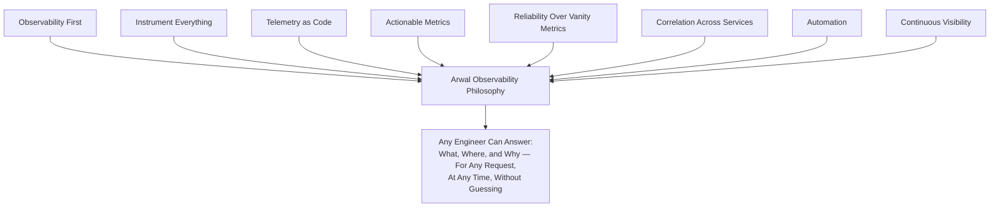
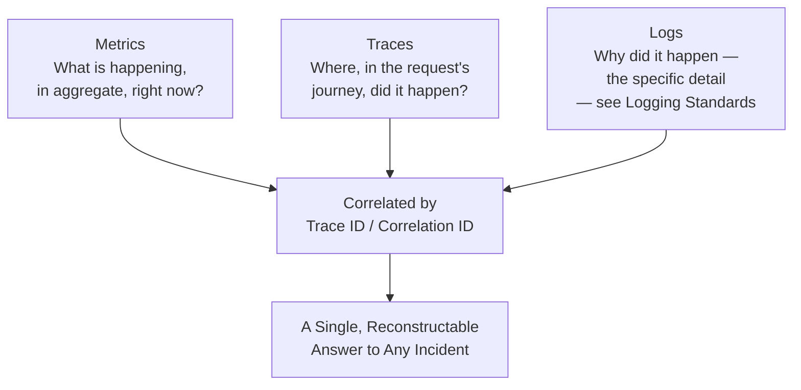
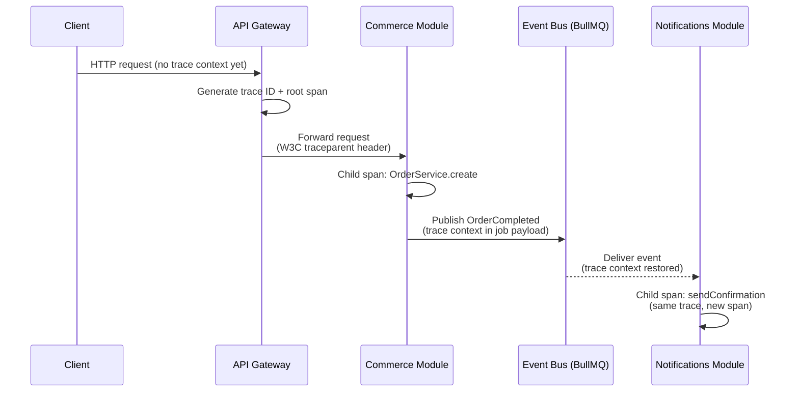
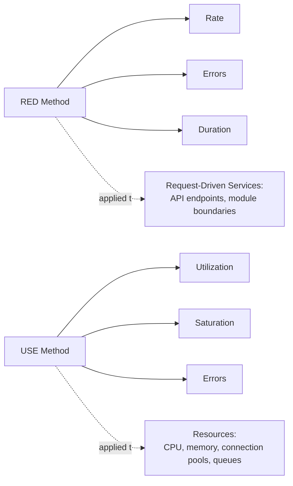
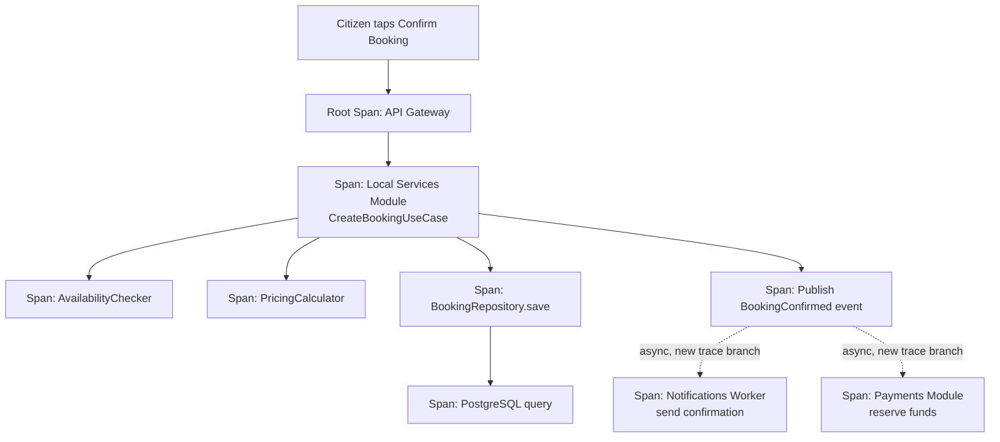
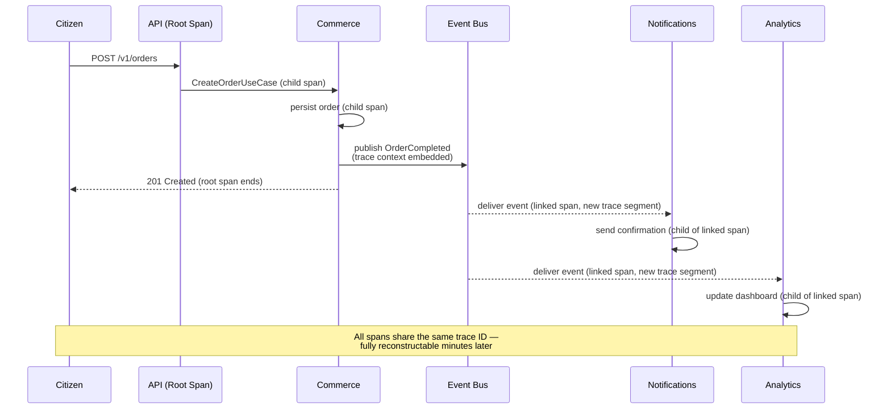
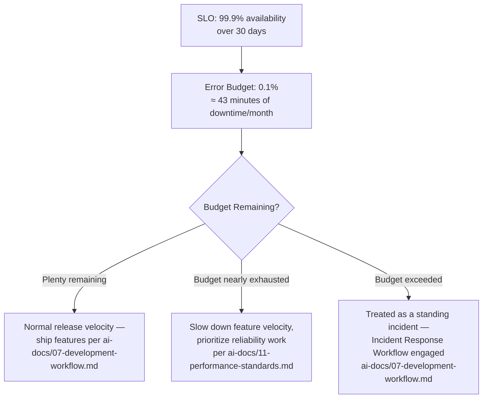
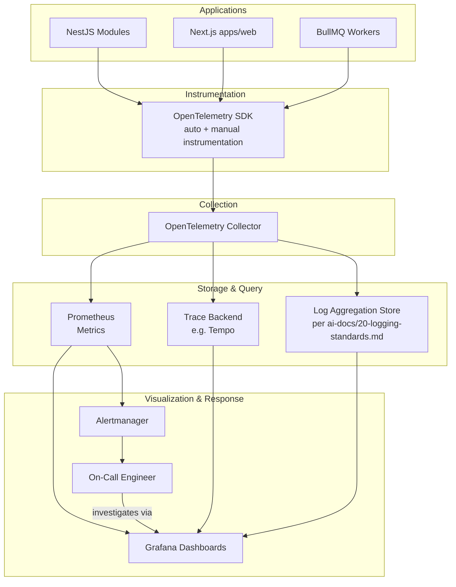
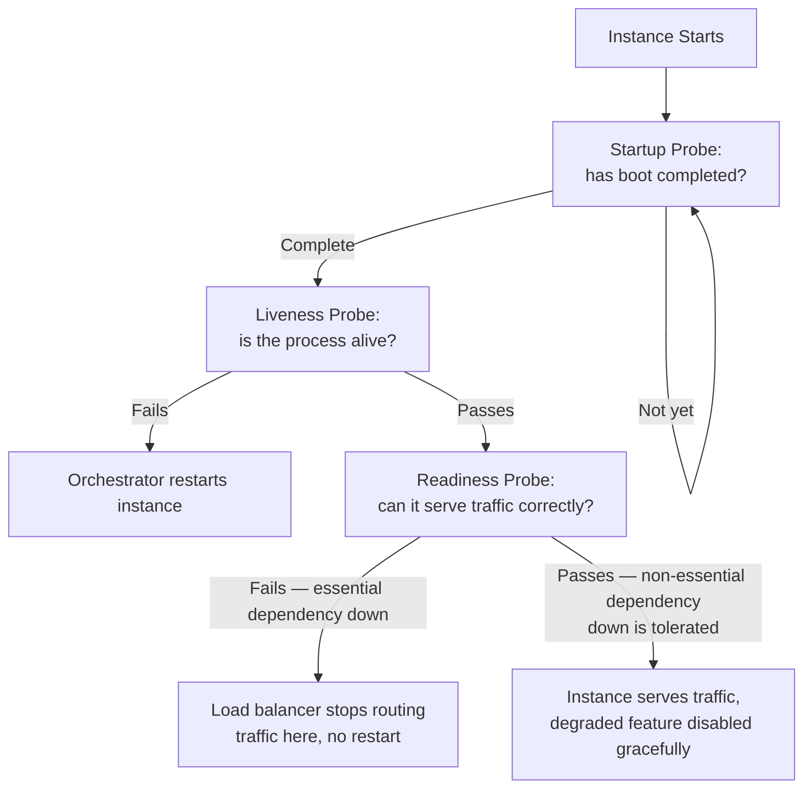
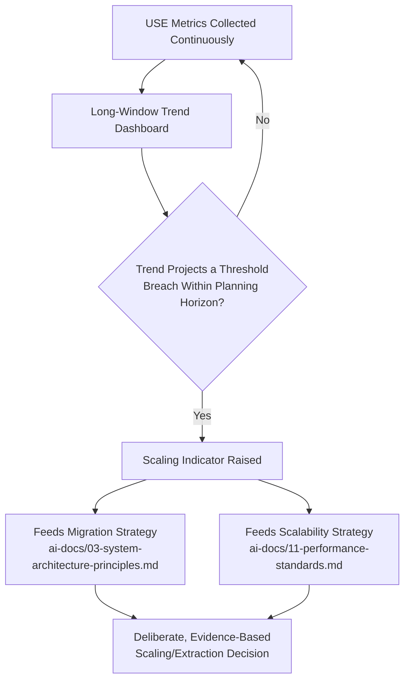

# Observability Standards

**Document:** `ai-docs/18-observability-standards.md`
**Project:** Arwal — The District Super App
**Stage:** 1 — Foundation
**Phase:** 19 — Observability Standards
**Status:** Approved for Engineering Reference
**Audience:** Architects, SRE/DevOps Engineers, Platform Engineers, Backend Engineers, Frontend Engineers, On-Call Engineers, Technical Reviewers, Government Technical Partners

> **Callout — Purpose of This Document**
> `ai-docs/00-project-vision.md` defined why Arwal exists. `ai-docs/01-product-goals.md` defined what Arwal must achieve. `ai-docs/02-engineering-principles.md` defined how engineers reason about design. `ai-docs/03-system-architecture-principles.md` defined how the system is structured. `ai-docs/04-folder-guidelines.md` defined where that structure physically lives. `ai-docs/05-coding-standards.md` defined how individual lines of code are written. `ai-docs/06-git-workflow.md` defined how change moves through version control. `ai-docs/07-development-workflow.md` defined how a day of engineering work unfolds. `ai-docs/08-definition-of-done.md` defined when a piece of work is actually finished. `ai-docs/09-tech-stack.md` named the concrete technologies everything is built from. `ai-docs/10-security-standards.md` defined the enforceable security standard those technologies must satisfy. `ai-docs/11-performance-standards.md` defined the enforceable performance standard those technologies must satisfy. `ai-docs/12-accessibility-standards.md` defined the enforceable accessibility standard every screen must satisfy. `ai-docs/13-api-design-guidelines.md` defined the enforceable API contract standard every endpoint must satisfy. `ai-docs/14-database-design-guidelines.md` defined the enforceable schema standard every table must satisfy. `ai-docs/15-testing-standards.md` defined how every one of those standards is proven, automatically, before a citizen depends on it. `ai-docs/16-deployment-standards.md` defined where deployments run and how they are kept safe. `ai-docs/17-cicd-standards.md` defined the automated machinery that turns a commit into a deployable artifact. This document defines **how Arwal sees itself** — how every one of those pieces, once running in production, tells the engineering team the truth about its own behavior, continuously, before a citizen has to.

---

# Purpose of this Document

### Why Observability Exists

A system that cannot be observed cannot be trusted, regardless of how correctly it was architected, coded, tested, or deployed. Every preceding phase document describes how Arwal is *built*; this document describes how Arwal is *understood* once it is running — how an engineer, at 2am, with no prior context on the specific request currently failing, can answer three questions with evidence rather than guesswork: **what is happening, where is it happening, and why is it happening.** Observability is the standing precondition for every operational commitment Arwal has already made — the 99.9%+ uptime target in `ai-docs/01-product-goals.md`, the MTTR-decreasing commitment in `ai-docs/02-engineering-principles.md`, the sub-200ms API latency target in `ai-docs/11-performance-standards.md` — because none of those targets can be verified, defended, or repaired without the ability to see, in real time and after the fact, what the system actually did.

### Monitoring vs. Observability

The two terms are related but not interchangeable, and the distinction matters enough to state precisely:

| | Monitoring | Observability |
|---|---|---|
| **Answers** | "Is a known failure mode happening right now?" | "What is actually happening, including failure modes nobody anticipated?" |
| **Requires** | A predefined dashboard or alert for a predicted problem | The raw telemetry (metrics, traces, and — per Logging Standards — logs) needed to construct an answer to a question not yet asked |
| **Posture** | Reactive to known unknowns | Investigative against unknown unknowns |
| **Arwal example** | "Alert if API p95 latency exceeds 400ms" (a known threshold, watched) | "Why did this *specific* citizen's booking confirmation take 4 seconds, when p95 overall is 180ms?" (answerable only by tracing that one request end-to-end) |

Monitoring is a subset of observability's toolset — Arwal needs both, but observability is the broader, harder-won capability: the system exposes enough of its own internal state that a novel question, about a failure mode nobody wrote a dashboard for, can still be answered from the data the system already emits.

### Why Observability Is Essential at District Scale

Per `ai-docs/00-project-vision.md`'s 1,000,000+ user target and `ai-docs/03-system-architecture-principles.md`'s Modular Monolith-toward-microservices trajectory, a single citizen action (a booking, a civic application submission) increasingly fans out across multiple modules, shared services, and asynchronous events. At small scale, an engineer can reason about the whole system in their head; at district scale, that stops being possible the moment more than a handful of modules exist, and it becomes structurally impossible once any module is extracted into an independently deployed service, per the Migration Strategy in `ai-docs/03-system-architecture-principles.md`. Observability is what preserves an engineer's ability to reason about a single citizen-facing failure even after the system has grown too large to hold in one person's head — this is not a nice-to-have maturity feature, it is a structural precondition for operating Arwal safely at its stated scale target.

### Relationship with Logging Standards

`ai-docs/20-logging-standards.md` (a future phase document) defines the structure, format, level discipline, correlation-ID injection, retention, and scrubbing rules for individual log statements — the *content and lifecycle of a single log line*. This document defines the *system-wide visibility architecture* those log lines are one input into: how metrics, traces, and logs are correlated together, how they are collected and stored, how they are visualized, and how they trigger a human response. This document references logs as one of the Three Pillars (see below) but does not define what a log line looks like, what level it is logged at, or how long it is retained — that is Logging Standards' exclusive domain, and this document never duplicates it.

### Relationship with Error Handling Standards

`ai-docs/21-error-handling-standards.md` (a future phase document) defines how an exception is typed, categorized, caught, and translated into a response — the *application-level discipline* of handling a specific failure. This document defines how that failure, once it has occurred, becomes *visible* to the engineering team as a metric, a trace span marked as an error, and an alert — the *operational-level discipline* of noticing and responding to failures in aggregate, across the whole system, not one exception at a time. Error Handling Standards governs what happens inside a `catch` block; this document governs what happens after that `catch` block finishes, in the dashboards and pagers of the people responsible for the system's health.

---

# Observability Philosophy

Arwal's observability posture rests on eight commitments. Together they answer the question every subsequent section of this document exists to make concrete: **what does "we can see what our system is doing" actually require, by default, before a single service is called production-ready?**

### Observability First

Observability is never a feature added after a service ships — it is a property designed in from a service's first commit, exactly as Security by Design (`ai-docs/10-security-standards.md`) and Performance by Design (`ai-docs/11-performance-standards.md`) are. A service that is functionally complete but has no metrics, no traces, and no dashboard has not met the Observability requirement already established as a Technical Goal in `ai-docs/01-product-goals.md` and a mandatory build requirement in `ai-docs/00-project-vision.md` — it is a black box waiting to fail silently.

### Instrument Everything

Every service, every module boundary, every external integration, and every asynchronous job emits telemetry by default — instrumentation is not something an engineer adds reactively after an incident reveals a blind spot; it is present before the blind spot has a chance to exist. This directly extends the Observability as a Build Requirement principle in `ai-docs/01-product-goals.md`: "if it can't be measured, it can't be trusted at scale" applies to every corner of the system, not only the corners that happened to cause a previous incident.

### Telemetry as Code

Instrumentation — metric definitions, trace span boundaries, dashboard definitions, alert rules — is version-controlled, code-reviewed, and deployed through the exact same pipeline as application code, per the Pipeline as Code principle in `ai-docs/17-cicd-standards.md`. A dashboard hand-edited in the Grafana UI, or an alert threshold changed by clicking through Prometheus's Alertmanager configuration, is invisible to `git blame`, invisible to code review, and drifts silently from what the repository says should be true — exactly the anti-pattern Infrastructure as Code (`ai-docs/16-deployment-standards.md`) and Pipeline as Code (`ai-docs/17-cicd-standards.md`) already reject, applied here to the observability layer itself.

### Actionable Metrics

Every metric Arwal collects exists to answer a specific question a human or an alert rule will actually ask — a metric collected "because it might be useful someday" is a YAGNI violation (`ai-docs/02-engineering-principles.md`) applied to telemetry, and it carries a real cost: cardinality, storage, and query-time cost that compounds across ~300 micro-phases exactly as unindexed database columns do (`ai-docs/14-database-design-guidelines.md`). A metric that cannot be tied to a dashboard panel, an alert rule, or a specific investigative question is not collected.

### Reliability Over Vanity Metrics

Consistent with the Metric Discipline callout in `ai-docs/01-product-goals.md` — "a GMV increase alongside a rising dispute rate or falling uptime is treated as a regression" — observability at Arwal prioritizes metrics that reflect genuine citizen-facing reliability (latency, error rate, availability) over metrics that merely look impressive in isolation (raw request count, raw throughput with no accompanying error/latency context). A dashboard showing rising traffic and silent about rising error rate is not a health signal; it is a vanity metric masquerading as one.

### Correlation Across Services

A single citizen action increasingly touches multiple modules and asynchronous events, per the Event-Driven Architecture established in `ai-docs/03-system-architecture-principles.md`. Observability's value collapses if a slow booking confirmation cannot be traced from the citizen's tap, through the API Gateway, through the Local Services module, through the Payments module, into the Notifications queue, and back — every signal Arwal collects is designed from the outset to be correlated against every other signal for the same request or event, never siloed per module in a way that would force an engineer to manually stitch together five separate dashboards during an incident.

### Automation

Collection, correlation, dashboarding, and alerting are automated end to end, per the Automation principle already established in `ai-docs/02-engineering-principles.md`, `ai-docs/16-deployment-standards.md`, and `ai-docs/17-cicd-standards.md` — a human is never responsible for manually aggregating logs, manually computing a latency percentile, or manually noticing a dashboard has gone red. Human judgment is reserved for interpreting a well-automated signal and deciding what to do about it, never for performing the mechanical work of producing that signal in the first place.

### Continuous Visibility

Observability is never a one-time certification at launch, exactly as `ai-docs/10-security-standards.md` and `ai-docs/11-performance-standards.md` reject "we checked once" as a false sense of safety in their own domains. Every service's telemetry is live, continuously flowing, and continuously reviewed — a dashboard that existed at launch but has silently stopped receiving data is a blind spot exactly as dangerous as a dashboard that was never built, and is treated with the same severity in review.

> **Callout — The One-Sentence Observability Philosophy**
> *"If a citizen's booking failed at 2am and the on-call engineer cannot reconstruct exactly what happened without guessing, the system was not observable — no matter how well it was architected, tested, or deployed."*

---

# The Three Pillars

Observability is built from three complementary telemetry types. No single pillar is sufficient alone — each answers a different shape of question, and Arwal's architecture deliberately makes them mutually reinforcing rather than redundant.

### Metrics

Metrics are numeric measurements aggregated over time — a count, a rate, a duration, a gauge. They are cheap to store, fast to query, and ideal for answering "what is the shape of the system's behavior right now, and how does it compare to five minutes ago, or five minutes into the past week?" Metrics are Arwal's first line of detection: a dashboard or an alert built on metrics is what tells an engineer *something* is wrong, before any deeper investigation begins. Metrics alone cannot tell an engineer *which specific citizen's request* was affected — that is what tracing and logging exist to answer next. See Metrics Standards below for Arwal's full metric taxonomy.

### Logs (Reference Only)

Logs are structured, timestamped records of a specific event — the fine-grained "what exactly happened, in this exact function call, with these exact values" detail that metrics necessarily discard through aggregation. Logs are indispensable for root-cause investigation once a metric or a trace has narrowed the search to a specific time window, service, and request. **The structure, format, level discipline, correlation-ID field naming, scrubbing, and retention of Arwal's logs are governed exclusively by `ai-docs/20-logging-standards.md`** — this document treats logs only as the third pillar's *existence* within the observability architecture (see Observability Architecture below) and does not redefine any of their content or lifecycle rules.

### Traces

Traces reconstruct the actual path a single request or event took through Arwal's distributed system — every module it touched, every synchronous call it made, every millisecond it spent waiting on each one. A trace answers "where, specifically, in this one citizen's booking confirmation, did the extra three seconds go?" in a way no aggregate metric ever could, and does so without requiring an engineer to manually correlate log lines across five different modules' log streams. See Distributed Tracing below for Arwal's full tracing standard.

### How the Three Pillars Work Together

| Investigative Step | Pillar Used | Question Answered |
|---|---|---|
| 1. Detect | Metrics + Alerting | "The booking-confirmation p95 latency just crossed its SLO threshold." |
| 2. Localize | Traces | "Of the requests behind that latency spike, which module's span is consistently the slowest?" |
| 3. Explain | Logs (`ai-docs/20-logging-standards.md`) | "What did that specific slow span's code path actually log — a retried external call, a cache miss, a lock wait?" |
| 4. Confirm resolution | Metrics | "Did the fix bring p95 latency back under the SLO threshold, sustained?" |

A team relying on only one pillar is structurally blind to the questions the other two exist to answer — this is why Instrument Everything (above) applies to all three pillars simultaneously for every service, never one pillar chosen as "good enough" for a given module.

---

# OpenTelemetry Standards

OpenTelemetry (per `ai-docs/09-tech-stack.md`) is Arwal's single, vendor-neutral instrumentation standard across metrics and traces (and, per Logging Standards, logs) — chosen specifically so telemetry collected today can be exported to a different backend tomorrow without re-instrumenting a single line of application code, directly protecting Arwal against Observability-vendor lock-in per the Vendor Lock-In Considerations criterion in `ai-docs/09-tech-stack.md`.

### Instrumentation Philosophy

Instrumentation is applied at two complementary levels, never relying on only one:

1. **Automatic instrumentation** — OpenTelemetry's auto-instrumentation packages (for NestJS/Node.js's HTTP layer, the Prisma client, Redis client, and outbound HTTP calls) are enabled by default for every service, giving baseline request/response, database, and cache visibility with zero per-endpoint engineering effort — this is the instrumentation floor every service starts from, per Instrument Everything above.
2. **Manual instrumentation** — A custom span is added deliberately wherever a business-meaningful operation isn't already captured by the automatic layer (e.g., `PricingCalculator.calculate`, `AvailabilityChecker.check`) — added the same way a business rule earns a unit test (`ai-docs/15-testing-standards.md`): because it represents a real, named operation a future engineer will want visibility into, not speculatively wrapped around every function.

A span, metric, or attribute that cannot be tied to a specific investigative or dashboard need is not added, per Actionable Metrics above — over-instrumentation is a real cost (cardinality, storage, trace-payload size) exactly as under-instrumentation is a real risk.

### Context Propagation

Trace context (trace ID, span ID, and any baggage) propagates automatically across every boundary a request or event crosses — an HTTP call between the API Gateway and a module, an in-process call between modules inside the Modular Monolith, and a BullMQ job published by one module and consumed by another — using OpenTelemetry's W3C Trace Context standard. No engineer manually threads a trace ID through a function signature; propagation is carried by the shared instrumentation middleware and BullMQ job-payload context injection, exactly as Correlation ID propagation is described as automatic in `ai-docs/03-system-architecture-principles.md`'s Observability Principles.

### Trace IDs

Every request entering the system through the API Gateway, and every Integration Event published to the event bus, is assigned a trace ID at the point of origin if one is not already present — a single, globally unique identifier for that entire logical operation, regardless of how many modules or asynchronous hops it eventually touches. The trace ID is the same identifier already referred to as the correlation/trace ID in `ai-docs/03-system-architecture-principles.md`'s Observability Principles and `ai-docs/13-api-design-guidelines.md`'s `X-Correlation-Id` header — Arwal deliberately unifies these into a single identifier space rather than maintaining a separate "correlation ID" and "trace ID" that an engineer would have to manually cross-reference.

### Span IDs

Every discrete unit of work within a trace — an HTTP handler, a database query, a domain-service call, a queue-job execution — is its own span, uniquely identified and carrying a reference to its parent span (see Distributed Tracing below for the parent/child model). A span's start time, end time, status (ok/error), and a bounded set of attributes are captured automatically by the instrumentation layer; a span is never manually timed with `Date.now()` arithmetic scattered through business logic, which would violate both Explicitness (`ai-docs/05-coding-standards.md`) and this document's Automation principle.

### Resource Attributes

Every span and metric is tagged with a fixed set of resource attributes identifying *what emitted it*, applied automatically at the OpenTelemetry SDK's initialization, never per-call:

| Attribute | Example Value | Purpose |
|---|---|---|
| `service.name` | `local-services-module` | Identifies which module/service emitted the signal, mapping directly to the bounded contexts in `ai-docs/03-system-architecture-principles.md`. |
| `service.version` | The deployed commit SHA, per `ai-docs/17-cicd-standards.md` | Ties a signal to the exact immutable artifact that produced it, enabling "did this regression start at this specific deploy" investigation. |
| `deployment.environment` | `production` / `staging` / `development` | Prevents cross-environment signal contamination on shared dashboards, per the Environment Isolation standard in `ai-docs/10-security-standards.md` and `ai-docs/16-deployment-standards.md`. |
| `cloud.region` | The AWS region hosting the instance, per `ai-docs/16-deployment-standards.md` | Supports zone/region-level failure diagnosis, per the Multi-AZ resilience commitments in `ai-docs/03-system-architecture-principles.md`. |
| `host.id` / `container.id` | The specific instance/container identifier | Narrows an investigation to a specific misbehaving instance, distinct from a systemic, fleet-wide issue. |

### Semantic Conventions

Arwal adopts OpenTelemetry's published Semantic Conventions for span and attribute naming (`http.method`, `http.status_code`, `db.system`, `db.statement` — with parameter values scrubbed per `ai-docs/20-logging-standards.md`'s sensitive-data rules, never raw citizen data — `messaging.system`, `messaging.destination`) rather than inventing Arwal-specific naming for concepts the industry standard already covers, per the Open Standards criterion in `ai-docs/09-tech-stack.md`. An Arwal-specific attribute (e.g., `arwal.module`, `arwal.district_id`) is added only for genuinely Arwal-specific business context the standard conventions don't cover, prefixed consistently so it is never confused with a standard OpenTelemetry attribute.

---

# Metrics Standards

Arwal's metrics are organized using two complementary, industry-standard frameworks, applied to the specific layer each is best suited for, plus a business-metric layer specific to Arwal's civic-commerce domain.

### RED Method

**Rate, Errors, Duration** — applied to every *request-driven* service (every API endpoint, every module boundary):

| Signal | What It Measures | Arwal Example |
|---|---|---|
| **Rate** | Requests per second the service is handling | Requests/sec to `POST /v1/bookings` |
| **Errors** | The rate of failed requests, as a percentage of total | % of booking-creation requests returning 5xx or a business-rule 422 |
| **Duration** | The distribution (p50/p95/p99, per `ai-docs/11-performance-standards.md`) of how long a request takes | Booking-creation request latency histogram |

### USE Method

**Utilization, Saturation, Errors** — applied to every *resource* (a database connection pool, a CPU, a memory allocation, a queue):

| Signal | What It Measures | Arwal Example |
|---|---|---|
| **Utilization** | The percentage of time/capacity the resource is busy | PgBouncer connection pool utilization %, per `ai-docs/09-tech-stack.md` |
| **Saturation** | The amount of work queued, waiting for the resource | Depth of the wait queue for a saturated PgBouncer pool |
| **Errors** | The rate of resource-level errors | Connection-pool exhaustion errors, out-of-memory events |

> **Callout — Why Two Methods, Not One**
> RED answers "is the service doing its job well?" from the outside — the shape of what citizens experience. USE answers "is a specific resource the service depends on the reason it might soon stop doing its job well?" from the inside — the shape of *why* a RED regression might be about to happen. A dashboard showing healthy RED metrics but a saturating USE metric (e.g., a connection pool at 95% utilization) is Arwal's earliest possible warning of a citizen-facing regression that hasn't happened yet — exactly the anticipatory signal Capacity Planning (below) depends on.

### Business Metrics

Metrics tied directly to the KPI categories already established in `ai-docs/01-product-goals.md` — Reach, Trust, Reliability, Impact — tracked with the same rigor as infrastructure metrics, per Reliability Over Vanity Metrics above:

| Category | Example Metrics |
|---|---|
| Reach | Active bookings created per hour, new merchant onboarding rate |
| Trust | Dispute rate (disputes / completed transactions), fraud-flag rate |
| Reliability | Booking-confirmation success rate, payment-settlement success rate |
| Impact | Civic-application completion rate, median time-to-approval |

Business metrics are never conflated with infrastructure health on the same dashboard panel without context — a spike in transaction volume alongside a spike in dispute rate is a regression per the Metric Discipline callout in `ai-docs/01-product-goals.md`, and the Business Dashboard (see Dashboards below) is specifically designed to make that correlation visible, never hidden behind two separately-viewed charts.

### Infrastructure Metrics

Host- and container-level signals per the USE Method above: CPU utilization, memory utilization/saturation, disk I/O, network throughput, and container restart counts — collected automatically via OpenTelemetry's host/container metric receivers and scraped by Prometheus (`ai-docs/09-tech-stack.md`), never manually gathered.

### Application Metrics

Service-level RED metrics per endpoint and per use case (`ai-docs/03-system-architecture-principles.md`'s Application Layer), plus event-loop lag and garbage-collection pause duration for Node.js specifically, per the CPU Efficiency discussion in `ai-docs/11-performance-standards.md` — event-loop lag is a leading indicator of exactly the CPU-bound-workload risk that document already identifies as a standing Node.js trade-off.

### Database Metrics

| Metric | Purpose |
|---|---|
| Query duration (p50/p95/p99), per query class | Verifies the latency targets in `ai-docs/11-performance-standards.md`'s Database Query Performance table are actually being met in production, not only in a staging benchmark. |
| Connection pool utilization/saturation (PgBouncer) | USE-method visibility into the exact resource `ai-docs/11-performance-standards.md` and `ai-docs/14-database-design-guidelines.md` identify as the horizontal-scaling bottleneck to watch. |
| Slow query count (queries exceeding their class's p95 target) | Surfaces a Query Plan Review candidate (`ai-docs/14-database-design-guidelines.md`) before it becomes a citizen-facing regression. |
| Replication lag (once read replicas are introduced, per `ai-docs/09-tech-stack.md`) | Detects stale-read risk before a citizen sees inconsistent data. |
| Deadlock / serialization-failure rate | Surfaces contention hotspots per the Deadlocks and Retry Strategy standards in `ai-docs/14-database-design-guidelines.md`. |

### Queue Metrics

| Metric | Purpose |
|---|---|
| Queue depth (per BullMQ queue) | Verifies against the Job Pickup Latency target in `ai-docs/11-performance-standards.md`; a growing depth is the Migration Indicator `ai-docs/03-system-architecture-principles.md` names for a dedicated-broker migration. |
| Job processing duration | Verifies against the Job Completion Time targets in `ai-docs/11-performance-standards.md`. |
| Dead-letter rate | Directly tracks the < 0.1% target already established in `ai-docs/11-performance-standards.md`; every dead-lettered job is a defect signal, never a tolerated background noise level. |
| Worker concurrency utilization | USE-method visibility into whether a queue's worker pool is the bottleneck, informing the horizontal-scaling decisions in `ai-docs/11-performance-standards.md`'s Queue Workers standard. |

### Cache Metrics

| Metric | Purpose |
|---|---|
| Hit rate, per cache layer (CDN, Gateway, Redis application cache, client-side) | Verifies against the specific hit-rate targets already established in `ai-docs/11-performance-standards.md`'s Cache Hit Rate table. |
| Eviction rate | An unexpectedly high eviction rate signals an undersized cache or a TTL/key-design issue, before a hit-rate regression makes it citizen-visible. |
| Redis memory utilization/saturation | USE-method visibility into the bulkheaded Redis roles (cache/session/queue, per `ai-docs/09-tech-stack.md`), so contention in one role is diagnosed independently of the others. |

---

# Distributed Tracing

### Request Lifecycle

A citizen action's trace begins the moment it enters Arwal — at the Nginx/API Gateway perimeter (`ai-docs/03-system-architecture-principles.md`) — and ends only once every synchronous response and every asynchronous side effect the action triggered has completed or been durably queued. The trace is the single, authoritative reconstruction of that action's actual path through the system, independent of how many modules it touched.

### Cross-Service Tracing

Even within the Modular Monolith — where a cross-module call is an in-process function call, not a network hop — that call is still instrumented as its own span, per the Zero-Trust Between Modules principle in `ai-docs/03-system-architecture-principles.md`: the module boundary is treated as an observability boundary exactly as it is treated as a security boundary, so that when a module is later extracted into an independent service (`ai-docs/03-system-architecture-principles.md`'s Migration Strategy), its tracing behavior does not need to be redesigned — it already looks, from a trace's perspective, like a call to a separate service.

### Parent/Child Spans

Every span except the root span of a trace has exactly one parent span, forming a tree that mirrors the actual call structure of the request — a database query span is a child of the repository-method span that issued it, which is a child of the use-case span that invoked the repository, which is a child of the controller span that received the HTTP request. This parent/child structure is what lets a trace-visualization tool (Grafana Tempo or equivalent, fed by the same OpenTelemetry Collector as metrics, per `ai-docs/09-tech-stack.md`) render a waterfall view showing exactly where time was spent, at every level, without an engineer manually reconstructing the call graph from scattered log lines.

### Correlation IDs

Per OpenTelemetry Standards above, Arwal unifies the trace ID and the correlation ID into a single identifier — the same value referenced as `X-Correlation-Id` at the API boundary (`ai-docs/13-api-design-guidelines.md`) is the OpenTelemetry trace ID underlying the request's full span tree. This means a support engineer handed a `requestId` from an API error response (`ai-docs/13-api-design-guidelines.md`'s error envelope) can locate the exact trace, and from the trace, the exact correlated log lines (`ai-docs/20-logging-standards.md`), without any manual cross-referencing step.

### Async Event Tracing

An Integration Event published to the event bus (`ai-docs/03-system-architecture-principles.md`) carries its originating trace context in its payload metadata, per Context Propagation above — when a consuming module picks up the event, its processing span is created as a child of (or, where the causal relationship is better modeled as "caused by" rather than "part of the same synchronous flow," a **linked span** referencing) the publishing span. This preserves the ability to answer "what downstream effects did this one citizen action eventually cause, even minutes later, across modules that never directly called each other" — the tracing-layer expression of the Event-Driven Architecture's decoupling already established in `ai-docs/03-system-architecture-principles.md`.

---

# Dashboards

Every dashboard is version-controlled as code (per Telemetry as Code above), lives alongside the service it monitors, and is reviewed with the Engineering Review Checklist below before a service is considered production-ready, per the Dashboards as a First-Class Deliverable principle already established in `ai-docs/02-engineering-principles.md`.

### Executive Dashboard

**Audience:** Leadership, government partners, investors. **Contains:** The four KPI categories from `ai-docs/01-product-goals.md` at a rolled-up, trend level — MAU/WAU stickiness, GMV/GSV with contribution margin trend, dispute-resolution time trend, platform uptime — deliberately free of low-level infrastructure detail, since this audience's question is "is the platform healthy and growing responsibly," not "what is p99 latency on the payments module right now."

### Operations Dashboard

**Audience:** On-call engineers, SRE. **Contains:** The current golden-signal state (RED per service) across every module, active alert status, current deployment version per service (`service.version` resource attribute), and a fast-access link into distributed tracing for any service currently showing degraded signals — this is the dashboard an engineer opens first the moment a pager fires.

### Infrastructure Dashboard

**Audience:** DevOps/Platform engineers. **Contains:** USE-method signals for every underlying resource — CPU/memory/disk per host and container, PgBouncer and Redis utilization/saturation, network throughput, and Multi-AZ health status per `ai-docs/16-deployment-standards.md`'s infrastructure topology.

### API Dashboard

**Audience:** Backend engineers. **Contains:** RED metrics broken out per endpoint and per API version (`ai-docs/13-api-design-guidelines.md`), rate-limit rejection rates, idempotency-key hit rates, and a breakdown of error responses by `error.code` (`ai-docs/13-api-design-guidelines.md`'s error envelope) so a spike in a specific business-rule violation is distinguishable at a glance from a spike in infrastructure-caused 5xx errors.

### Database Dashboard

**Audience:** Backend engineers, DBAs. **Contains:** Every Database Metric from Metrics Standards above, broken out per module schema (`ai-docs/14-database-design-guidelines.md`) — query latency by class, connection-pool saturation, slow-query count, deadlock rate, and autovacuum lag (`ai-docs/14-database-design-guidelines.md`'s VACUUM discussion) per table.

### Queue Dashboard

**Audience:** Backend engineers. **Contains:** Every Queue Metric above, broken out per BullMQ queue (per module, per job type) — depth, processing duration, dead-letter rate, and worker-concurrency utilization, giving direct visibility into the Migration Indicator (`ai-docs/03-system-architecture-principles.md`) a sustained, growing queue depth represents.

### Business Dashboard

**Audience:** Product, Trust & Safety, Operations. **Contains:** The Business Metrics from Metrics Standards above, cross-plotted against Reliability metrics on the same view per the Metric Discipline callout in `ai-docs/01-product-goals.md` — e.g., transaction volume and dispute rate rendered on the same timeline, so a reviewer cannot see one grow without the other being visible in the same glance.

| Dashboard | Primary Audience | Primary Question Answered |
|---|---|---|
| Executive | Leadership, government partners | Is the platform healthy and growing responsibly? |
| Operations | On-call engineers | Is anything degraded right now, and where do I look next? |
| Infrastructure | DevOps/Platform | Is any underlying resource close to saturation? |
| API | Backend engineers | Which endpoint, version, or error class is misbehaving? |
| Database | Backend engineers, DBAs | Which query, table, or connection pool needs attention? |
| Queue | Backend engineers | Is any job type falling behind or failing repeatedly? |
| Business | Product, Trust & Safety | Is growth accompanied by healthy trust and reliability? |

---

# Alerting Philosophy

### Actionable Alerts

Every alert that fires corresponds to a condition requiring a specific human action — never a condition that is merely "interesting to know," per the Actionable Alerting principle already established in `ai-docs/02-engineering-principles.md`. Before an alert rule is added, the reviewer asks: "if this fires at 3am, what does the on-call engineer do next?" — if there is no clear answer, the condition belongs on a dashboard for later review, not in the pager rotation.

### Noise Reduction

An alert that fires and resolves within seconds, repeatedly, without ever requiring intervention, is treated as a defect in the alert rule, not a tolerated background condition, per the same Actionable Alerting principle — alert fatigue (too noisy, routinely ignored) is explicitly named as a failure mode in `ai-docs/02-engineering-principles.md` and `ai-docs/10-security-standards.md`, and a noisy alert is fixed (a better threshold, a longer evaluation window, a `for:` duration requiring sustained breach before firing) or removed, never silenced indefinitely without resolution.

### Severity Levels

| Severity | Definition | Example | Response Expectation |
|---|---|---|---|
| **P1 — Critical** | A citizen-critical flow is down or severely degraded platform-wide | Booking/checkout returning errors platform-wide; payment processing fully down | Immediate page, all applicable on-call roles |
| **P2 — High** | A significant, but partial or workaround-able, degradation | Elevated error rate on one module; a single AZ degraded but redundancy absorbing it | Page during business hours; urgent but not all-hands by default |
| **P3 — Medium** | A leading indicator or a non-critical-path degradation | Cache hit rate trending down; a queue's depth growing but not yet breaching SLO | Ticketed, addressed in the current/next sprint |
| **P4 — Low** | An informational/trend signal | A dependency approaching a soft capacity limit weeks out | Tracked, reviewed in Capacity Planning below |

These severity levels are the observability-layer trigger condition; the actual human response process for a fired alert is governed by the Incident Response Workflow in `ai-docs/07-development-workflow.md` and the security-specific Incident Response section of `ai-docs/10-security-standards.md` — **this document defines when an alert fires and at what severity, never the procedural steps taken once it does.**

### Escalation

An unacknowledged P1/P2 alert escalates automatically, on a defined timer, from the primary on-call responder to a secondary responder and then to an engineering manager — escalation timing and routing configuration is itself version-controlled (per Telemetry as Code above), never a manually-maintained phone tree an engineer has to remember to update.

### Alert Ownership

Every alert rule has exactly one named owning team, recorded alongside the rule definition — mirroring the Folder Ownership Rules already established in `ai-docs/04-folder-guidelines.md` — so a firing alert always routes to the team with the context to act on it, never to a generic, unowned queue where responsibility is ambiguous.

### On-Call Expectations

An on-call engineer is expected to acknowledge a page within a defined window (per the escalation timer above) and to have the Operations Dashboard, distributed tracing, and the relevant service's dashboard bookmarked and immediately reachable — the specific procedural steps taken after acknowledgment (mitigate, communicate, root-cause, per the Incident Response Workflow) remain `ai-docs/07-development-workflow.md`'s domain; this document's obligation ends at "the right person is reliably and quickly notified, with the right dashboards one click away."

---

# SLI/SLO Standards

### Definitions

| Term | Definition |
|---|---|
| **SLI (Service Level Indicator)** | A precisely defined, directly measured metric — e.g., "the proportion of `POST /v1/bookings` requests completing in under 350ms, measured server-side, over a rolling 30-day window." |
| **SLO (Service Level Objective)** | A target value for an SLI that the team commits to — e.g., "99.5% of `POST /v1/bookings` requests complete within 350ms." |
| **Error Budget** | The inverse of the SLO — the small, deliberately allowed margin of SLO violation (0.5%, in the example above) that gives engineering room to ship change and absorb transient degradation without treating every single slow request as an incident. |

This directly restates and operationalizes the SLO/SLI framework already introduced in `ai-docs/11-performance-standards.md`'s Observability section — this document is where that framework's *measurement and alerting mechanics* live, while `ai-docs/11-performance-standards.md` remains the source of the specific numeric latency targets an SLO is built against.

### Availability

**Example SLI:** The proportion of requests to a citizen-critical endpoint that do not return a 5xx status, measured over a rolling 30-day window.
**Example SLO:** 99.9% availability for the booking and checkout critical paths, per the uptime target already established in `ai-docs/01-product-goals.md`.

### Latency

**Example SLI:** p95 response time for `GET /v1/bookings/:id`, measured server-side.
**Example SLO:** 95% of requests complete within 200ms, per the Core Read latency target in `ai-docs/11-performance-standards.md`.

### Error Rate

**Example SLI:** The proportion of `POST /v1/payments/charge` requests returning an unexpected 5xx (excluding expected, citizen-caused 4xx business-rule rejections).
**Example SLO:** Less than 0.1% unexpected error rate over a rolling 7-day window, given the elevated financial stakes of the payments domain per `ai-docs/10-security-standards.md`.

### Throughput

**Example SLI:** Sustained requests/second the booking-creation path can serve while remaining within its latency and error-rate SLOs.
**Example SLO:** The system sustains at least 2x the observed peak historical load for this endpoint without breaching its latency/error SLOs — directly tied to the Capacity Testing discipline in `ai-docs/11-performance-standards.md`.

### Error Budget in Practice

An SLO without a precisely defined SLI is unverifiable and is not accepted as a real target, per the same standard already established in `ai-docs/11-performance-standards.md` — every SLO Arwal publishes is backed by a specific Prometheus query and time window an engineer can point to, never an informally-agreed aspiration.

---

# Observability Architecture

### Layer Responsibilities

| Layer | Responsibility |
|---|---|
| **Applications** | Emit business logic outcomes; instrumented per OpenTelemetry Standards above. |
| **Instrumentation (OpenTelemetry SDK)** | Captures metrics, traces, and (per `ai-docs/20-logging-standards.md`) logs at the point of origin, tagged with resource attributes. |
| **Collection (OpenTelemetry Collector)** | A single, centralized point where telemetry is received, batched, and routed to the correct backend — the vendor-neutral layer that protects against backend lock-in, per `ai-docs/09-tech-stack.md`. |
| **Storage & Query (Prometheus, trace backend, log store)** | Each pillar's telemetry lands in the storage engine purpose-built for it — Prometheus for time-series metrics, a trace backend for span trees, and the log aggregation store defined by `ai-docs/20-logging-standards.md`. |
| **Visualization & Response (Grafana, Alertmanager, on-call)** | Grafana renders all three pillars, correlated by trace ID, into the dashboards defined above; Alertmanager evaluates alert rules against Prometheus and routes firing alerts per the Alerting Philosophy above; the on-call engineer is the human decision point the entire architecture exists to inform. |

This architecture is a direct extension of the Observability stack already named in `ai-docs/09-tech-stack.md` (OpenTelemetry → Prometheus → Grafana) — this document adds the trace-backend and log-store branches explicitly, and formalizes the full pipeline as a first-class architectural diagram every service is built against, per Telemetry as Code above.

---

# Health Checks

Health checks are the mandatory, standardized contract every service exposes, per `ai-docs/03-system-architecture-principles.md`'s Observability Principles and `ai-docs/09-tech-stack.md`'s Health Checks standard — this section makes that contract's three distinct check types explicit.

### Liveness

**Question answered:** "Is this process fundamentally still running and not deadlocked?" Exposed at `/health/live`. A liveness check failing causes the deployment orchestrator to restart the instance, per `ai-docs/16-deployment-standards.md` — it checks the absolute minimum (the process can respond at all), never a dependency's health, since a liveness check that fails because a downstream dependency is degraded would cause a cascading, unnecessary restart storm exactly when the system is least able to absorb it.

### Readiness

**Question answered:** "Is this instance currently able to correctly serve traffic?" Exposed at `/health/ready`. A readiness check verifies the instance's own internal state (e.g., its dependency connections are initialized) and causes the load balancer to stop routing traffic to this specific instance if it fails — without triggering a restart, per the Post-Deployment Verification standard in `ai-docs/16-deployment-standards.md`, since an instance failing readiness may simply need a moment to finish warming up, not to be destroyed.

### Startup Probes

**Question answered:** "Has this instance finished its initial boot sequence yet?" Used specifically to give a service with a genuinely slower cold-start (e.g., establishing its initial connection pool, loading configuration) a longer grace period before liveness/readiness checks begin evaluating it — preventing a slow-but-healthy startup from being mistaken for a liveness failure and restarted in a loop.

### Dependency Health

A readiness check reports the health of the specific dependencies that instance's traffic-serving capability genuinely requires (its database connection pool, its Redis connection) — but per Graceful Degradation (`ai-docs/03-system-architecture-principles.md`), a *non-essential* dependency (a secondary AI provider, a notifications channel) being unhealthy never fails the readiness check for the whole service, since that would incorrectly take a still-substantially-functional instance out of rotation over a dependency whose failure is designed to degrade gracefully, not cascade.

---

# Operational Visibility

Observability extends beyond request/response paths into every background and integration surface Arwal depends on — a citizen-facing feature that "works" in the request path but whose supporting background process is silently broken has not actually met Arwal's reliability bar.

### Feature Visibility

Every citizen-facing feature of meaningful scope has its own identifiable slice of telemetry — a way to answer "is this specific feature healthy" distinct from "is the module it lives in healthy overall" — typically achieved through a feature-scoped attribute on the relevant spans/metrics, so a regression isolated to one feature (e.g., a specific civic-scheme application flow) doesn't hide inside an otherwise-healthy module-wide aggregate.

### Background Jobs

Every BullMQ job type (per `ai-docs/09-tech-stack.md`) emits the Queue Metrics already defined above, and additionally exposes a dashboard panel showing its last-successful-run time — a job type that has simply stopped running (rather than failing loudly) is exactly the silent-failure mode a request/response-only observability posture would miss entirely.

### Scheduled Tasks

Every scheduled/cron-style job (`ai-docs/04-folder-guidelines.md`'s `jobs/` folders, both module-owned and cross-cutting) reports its last execution time, duration, and outcome as a metric, with an alert (per Alerting Philosophy above) firing if an expected schedule is missed beyond a defined grace window — a nightly reconciliation job that silently stopped running three weeks ago is a P2/P3-severity finding the moment this monitoring exists, versus an undiscovered data-integrity risk without it.

### Queues

See Queue Metrics and the Queue Dashboard above — covered in full there; referenced here to affirm that queue visibility is treated as a first-class Operational Visibility concern, not merely a performance-tuning input.

### Cron Jobs

Identical treatment to Scheduled Tasks above — the distinction is naming convention only (Arwal uses "scheduled task" for the general concept and "cron job" interchangeably for the same underlying mechanism); both are held to the same last-run/duration/outcome telemetry and missed-schedule alerting standard.

### External Integrations

Every third-party SaaS integration (per the Third-Party Service Policy in `ai-docs/09-tech-stack.md` — payment gateways, SMS/WhatsApp providers, the AI Gateway Service's underlying model providers) is instrumented at its `infrastructure/external/` client wrapper boundary (`ai-docs/04-folder-guidelines.md`) with RED-method metrics scoped specifically to that integration — so a degrading third-party dependency is visible and attributable to that specific vendor immediately, rather than surfacing only as an unexplained, generic rise in Arwal's own error rate. This directly supports the Provider Fallback and Circuit Breaker mechanics already established in `ai-docs/03-system-architecture-principles.md` and `ai-docs/11-performance-standards.md` — a circuit breaker cannot make a correct trip/reset decision without exactly this telemetry feeding it.

---

# Capacity Planning

### Resource Utilization

Every USE-method utilization metric (CPU, memory, connection pool, queue worker concurrency) is tracked not only for its current value but for its trend over weeks and months — a resource sitting at a comfortable 40% utilization today but climbing steadily 5 percentage points a month is a materially different planning signal than one flat at 40% indefinitely, even though their current-moment dashboards look identical.

### Trend Analysis

Dashboards used for capacity planning default to a longer time window (weeks to months) than the Operations Dashboard's real-time focus, specifically to make gradual, easy-to-miss trends visible — directly implementing the Capacity Planning commitment already established in `ai-docs/01-product-goals.md` and `ai-docs/03-system-architecture-principles.md`: "capacity is planned proactively from observed growth trends... never reactively, after a citizen-facing surge has already degraded service."

### Forecasting

Observed growth trends in request volume, data volume, and resource utilization are projected forward against the KPI growth targets in `ai-docs/01-product-goals.md`, giving the team a data-driven answer to "at current growth, when does this specific resource become a bottleneck" — replacing guesswork with the same Evidence over Prediction discipline already established in `ai-docs/03-system-architecture-principles.md` for architectural decisions, applied here to infrastructure sizing decisions.

### Scaling Indicators

A resource's utilization/saturation trend crossing a defined forecasting threshold (e.g., "projected to reach 80% sustained utilization within 60 days") is the same category of evidence the Migration Strategy in `ai-docs/03-system-architecture-principles.md` requires before a module extraction, and the same category of evidence the Scalability Strategy in `ai-docs/11-performance-standards.md` requires before a horizontal-scaling or read-replica decision — this document's role is ensuring that evidence is actually visible, continuously, well before the threshold is reached under real citizen-facing pressure, never discovered for the first time during an incident.

---

# Engineering Review Checklist

Every pull request introducing or modifying a service, endpoint, background job, or external integration is checked against the following before it is considered production-ready, extending the Observability Definition of Done requirements already established in `ai-docs/08-definition-of-done.md`:

- [ ] **Auto-instrumentation enabled** — The service uses OpenTelemetry's standard auto-instrumentation for HTTP, database, and cache clients.
- [ ] **Manual spans added for business-meaningful operations** — Domain services and use cases not already covered by auto-instrumentation have explicit, purposefully-named spans.
- [ ] **Resource attributes correctly set** — `service.name`, `service.version`, `deployment.environment` are present and accurate.
- [ ] **Semantic conventions followed** — No ad hoc attribute naming where an OpenTelemetry standard convention already exists.
- [ ] **RED metrics present** — Rate, Errors, and Duration are emitted for every new endpoint/use case.
- [ ] **USE metrics present for any new resource** — A new connection pool, queue, or cache has Utilization, Saturation, and Errors visibility.
- [ ] **Trace context propagates correctly** — Verified across at least one synchronous cross-module call and one asynchronous event, if applicable.
- [ ] **Dashboard exists and is version-controlled** — The service has a live dashboard covering its RED/USE signals before it is considered production-ready.
- [ ] **Alert rules are actionable** — Every new alert has a clear, documented "what does on-call do when this fires," a defined severity, and a named owning team.
- [ ] **SLIs/SLOs defined for citizen-critical paths** — Any new citizen-critical flow has a precisely defined SLI and an agreed SLO with an error budget.
- [ ] **Health checks correctly separate liveness, readiness, and startup** — No essential/non-essential dependency conflation in the readiness check.
- [ ] **Background jobs report last-run health** — Any new scheduled task or queue consumer exposes last-success time and is covered by a missed-schedule alert.
- [ ] **External integrations independently instrumented** — Any new third-party SaaS dependency has its own scoped RED metrics at its infrastructure wrapper boundary.
- [ ] **No duplication of Logging Standards** — Log format, level, and retention concerns are deferred to `ai-docs/20-logging-standards.md`, never redefined locally.
- [ ] **No duplication of Error Handling Standards** — Exception typing and handling logic is deferred to `ai-docs/21-error-handling-standards.md`; this review only confirms the resulting failure is visible as a metric/span, not how it was caught.

A pull request failing any item above is not merged until resolved — this checklist carries the same non-negotiable authority as every other review checklist established in the preceding eighteen phase documents.

---

# Relationship to Logging Standards

`ai-docs/20-logging-standards.md` (Phase 20) defines **what a log looks like and how it is managed**: structured format, log levels, correlation-ID field conventions, sensitive-data scrubbing, and retention policy — the content and lifecycle of an individual log statement.

This document, `ai-docs/18-observability-standards.md` (Phase 19), defines **how the system as a whole is understood**: the metrics and traces that detect and localize a problem, the dashboards that visualize system health, the alerting that notifies a human, the SLI/SLO framework that defines "healthy," and the architecture that ties metrics, traces, and logs together into one correlated investigative surface.

Neither document duplicates the other. Where this document references logs as the third pillar of observability, or references a correlation ID a log line will carry, it defers entirely to `ai-docs/20-logging-standards.md` for that field's exact structure and handling — this document only affirms that logs exist, are correlated by the same trace ID this document defines, and are visualized within the same Grafana layer this document's Observability Architecture describes. A reviewer citing "Phase 19" is discussing whether the system's overall health is visible and actionable; a reviewer citing "Phase 20" is discussing whether a specific log line is correctly structured, leveled, and safely retained. Together, they are the complete answer to "can an engineer understand what Arwal is doing, right now and after the fact" — and neither is complete without the other.

---

# Closing Statement

> **Callout — Closing Statement**
> Every preceding phase document described a dimension of how Arwal is designed, written, secured, made performant, made accessible, contracted, modeled, verified, and deployed. This document describes how Arwal *knows itself* once it is running — the metrics that say something changed, the traces that say where, and the logs (per `ai-docs/20-logging-standards.md`) that say why, correlated together so precisely that no citizen-facing failure, however novel, is ever a genuine mystery to the engineers responsible for fixing it. A district's trust in Arwal is not preserved by a system that never fails — every system eventually does — it is preserved by a system whose failures are seen immediately, understood quickly, and resolved before most citizens ever notice, for every one of the ~300 micro-phases still ahead, from the first service's first dashboard to the millionth citizen's daily dependence on a platform that is always, verifiably, being watched. Where a future phase must deviate from a standard stated here, that deviation is made explicitly — through the Engineering Review Checklist's approval process, or an Architectural Decision Record where the deviation is structural — never silently, and never by default.

This document, `ai-docs/18-observability-standards.md`, is the nineteenth phase of approximately 300. Every service, endpoint, background job, and integration built in the phases that follow is expected to satisfy the standards defined here, or to justify its deviation in writing.

**End of Phase 19 — `ai-docs/18-observability-standards.md`**