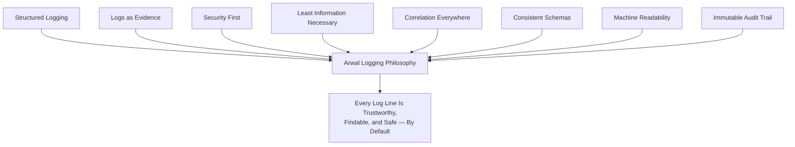
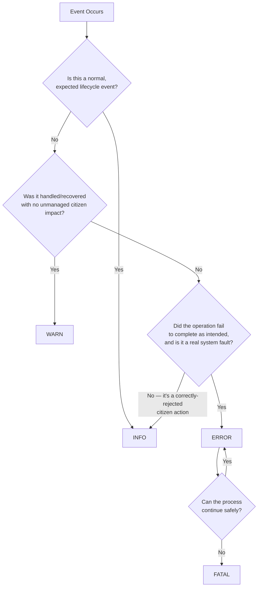
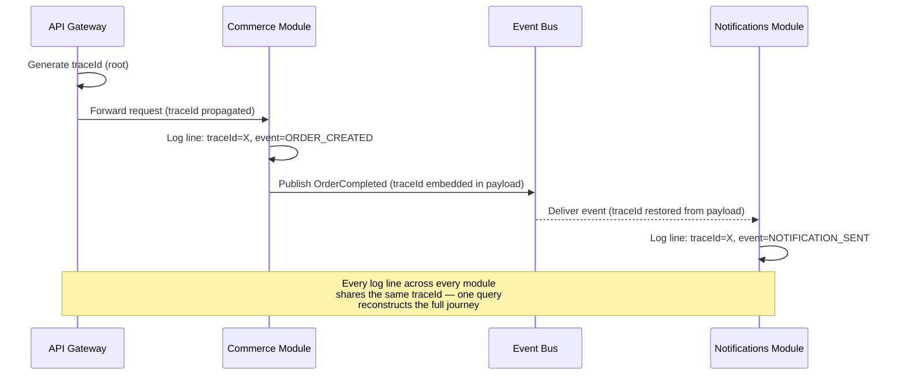
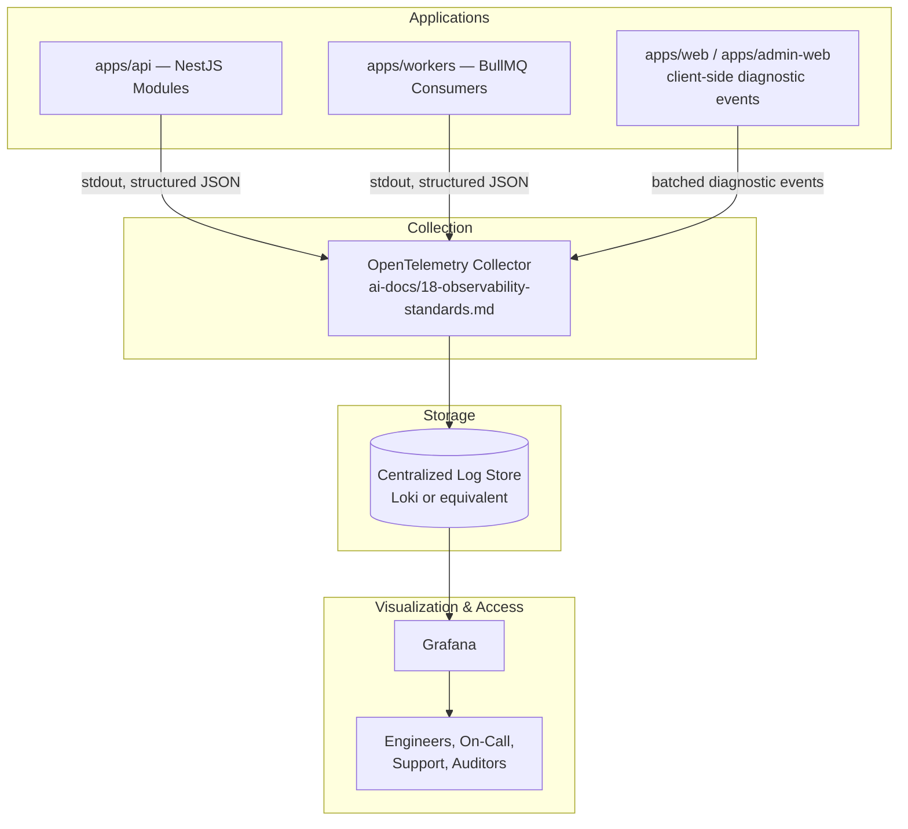
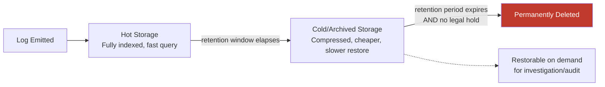
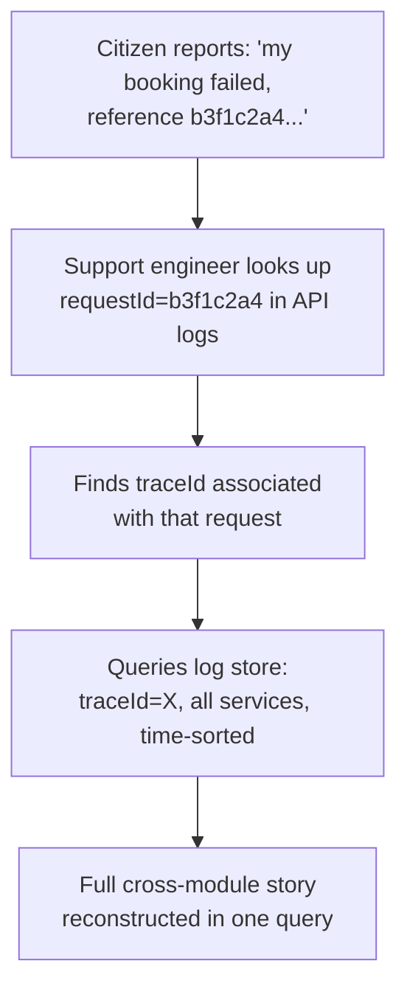
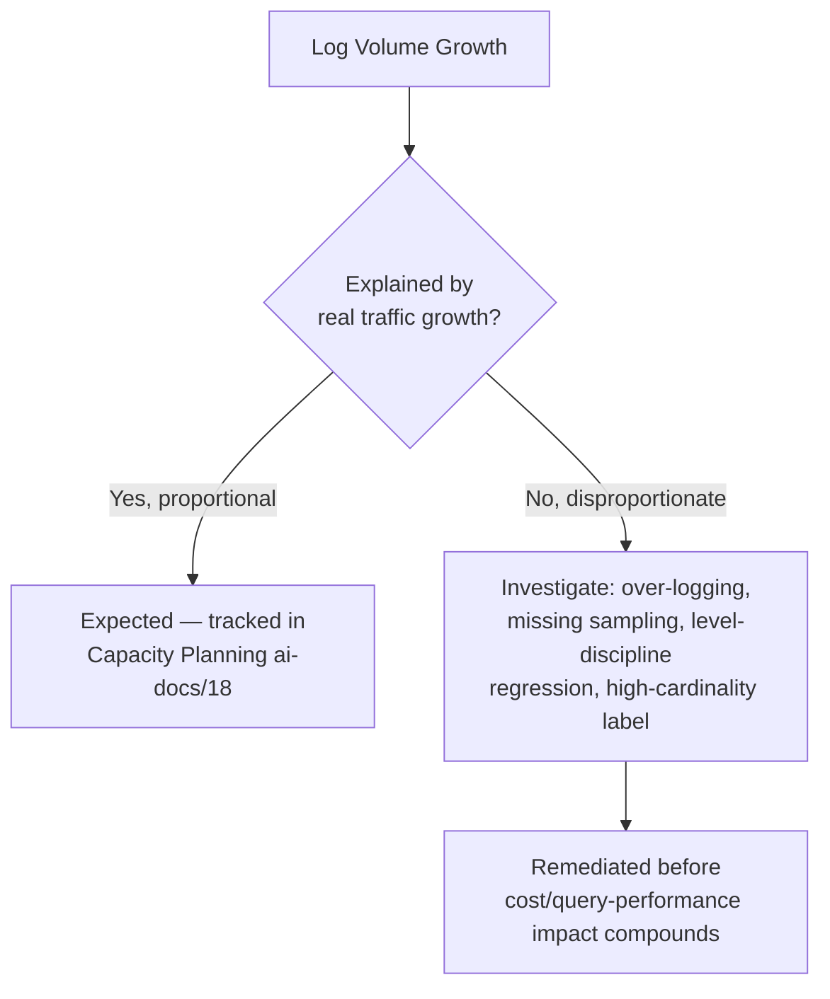

# Logging Standards

**Document:** `ai-docs/19-logging-standards.md`
**Project:** Arwal — The District Super App
**Stage:** 1 — Foundation
**Phase:** 20 — Logging Standards
**Status:** Approved for Engineering Reference
**Audience:** Architects, Backend Engineers, Frontend Engineers, SRE/DevOps Engineers, Security Engineers, Compliance Officers, On-Call Engineers, Technical Reviewers, Government Technical Partners, Auditors

> **Callout — Purpose of This Document**
> `ai-docs/00-project-vision.md` defined why Arwal exists. `ai-docs/01-product-goals.md` defined what Arwal must achieve. `ai-docs/02-engineering-principles.md` defined how engineers reason about design. `ai-docs/03-system-architecture-principles.md` defined how the system is structured. `ai-docs/04-folder-guidelines.md` defined where that structure physically lives. `ai-docs/05-coding-standards.md` defined how individual lines of code are written. `ai-docs/06-git-workflow.md` defined how change moves through version control. `ai-docs/07-development-workflow.md` defined how a day of engineering work unfolds. `ai-docs/08-definition-of-done.md` defined when a piece of work is actually finished. `ai-docs/09-tech-stack.md` named the concrete technologies everything is built from. `ai-docs/10-security-standards.md` defined the enforceable security standard those technologies must satisfy. `ai-docs/11-performance-standards.md` defined the enforceable performance standard those technologies must satisfy. `ai-docs/12-accessibility-standards.md` defined the enforceable accessibility standard every screen must satisfy. `ai-docs/13-api-design-guidelines.md` defined the enforceable API contract standard every endpoint must satisfy. `ai-docs/14-database-design-guidelines.md` defined the enforceable schema standard every table must satisfy. `ai-docs/15-testing-standards.md` defined how every one of those standards is proven, automatically, before a citizen depends on it. `ai-docs/16-deployment-standards.md` defined where deployments run and how they are kept safe. `ai-docs/17-cicd-standards.md` defined the automated machinery that turns a commit into a deployable artifact. `ai-docs/18-observability-standards.md` defined how Arwal sees itself in aggregate — metrics, traces, dashboards, alerting, and SLOs. This document defines **the single, precise unit of evidence underneath all of it**: what a log line actually contains, how it is protected, where it lives, how long it survives, and who is allowed to read it, for every one of the ~300 micro-phases still ahead.

---

# Purpose of this Document

### Why Structured Logging Exists

A metric tells an engineer *that* something changed. A trace tells an engineer *where*, in a request's journey, it changed. Neither tells an engineer the one thing they most need at 2am investigating a citizen's failed payment: **exactly what happened, in this exact function, with these exact (safely-redacted) values, in this exact order.** That is the job a log exists to do, and no other telemetry pillar in `ai-docs/18-observability-standards.md` can substitute for it. A log is the most granular, most detailed, and — if left undisciplined — most dangerous form of telemetry Arwal produces, because it is the pillar most likely to accidentally capture exactly the citizen data `ai-docs/10-security-standards.md` exists to protect. Structured logging exists to make that detail maximally useful to an engineer and maximally safe for a citizen, simultaneously, by design, not by individual engineer discipline exercised inconsistently across ~300 phases.

An unstructured log — a free-text string an engineer typed in the moment, shaped however felt natural at the time — is readable by a human scanning a terminal and unusable by everything else: it cannot be reliably filtered, cannot be safely scrubbed of sensitive fields before it is even written, cannot be correlated against a trace ID with certainty, and cannot be queried at the volume a million-citizen platform generates without either extremely expensive full-text search or simply giving up and trusting nothing is wrong. Structured logging — a fixed, versioned, machine-parseable schema, emitted identically by every module, every time — is what makes a log line a piece of queryable evidence rather than a diary entry.

### Logging vs. Observability

`ai-docs/18-observability-standards.md` already draws this distinction precisely and this document does not re-derive it — it restates it only to anchor logging's specific role within the whole:

| | Observability (Phase 19) | Logging (this document) |
|---|---|---|
| **Scope** | The system-wide architecture correlating metrics, traces, *and* logs into one investigative surface | The content, structure, protection, and lifecycle of a single log line |
| **Answers** | "What is happening, and where?" | "What exactly happened, and why?" |
| **Granularity** | Aggregate (metrics) or per-request-journey (traces) | Per-event, arbitrarily detailed |
| **Governs** | OpenTelemetry instrumentation, dashboards, alerting, SLI/SLO | JSON schema, log levels, correlation field naming, sensitive-data scrubbing, retention |

### Logging vs. Monitoring

Monitoring (per the Monitoring vs. Observability distinction in `ai-docs/18-observability-standards.md`) is the practice of watching a predefined signal for a predicted problem — a dashboard, an alert threshold. Logging is not, on its own, a monitoring mechanism; a log line sitting unread in a log store answers nothing until someone or something queries it. Logs *feed* monitoring (a log-based alert, e.g., "more than N `PAYMENT_DECLINED` events in five minutes," is a legitimate and common pattern — see Log Query Standards below) but logging's primary purpose at Arwal is **investigative evidence**, not real-time detection; real-time detection is metrics' and alerting's job, per `ai-docs/18-observability-standards.md`.

### Relationship with Observability Standards

`ai-docs/18-observability-standards.md` treats logs as the third of the Three Pillars and explicitly defers their content and lifecycle to this document — this document is that deferred definition, and it does not redefine anything `ai-docs/18-observability-standards.md` already owns: OpenTelemetry instrumentation philosophy, metrics taxonomy (RED/USE), distributed tracing, dashboards, alerting philosophy, or SLI/SLO mechanics. Where this document references a trace ID or correlation ID, it is the *same identifier* `ai-docs/18-observability-standards.md` defines as the unified OpenTelemetry trace ID — this document governs only how that identifier is *carried inside a log line's schema*, never how it is generated or propagated at the instrumentation layer.

### Relationship with Error Handling Standards

`ai-docs/21-error-handling-standards.md` (a future phase document) governs how an exception is typed, categorized, thrown, caught, and translated into a citizen-facing response — the *application-level discipline* of handling a failure. This document governs how that failure, once caught, is **written down** — at what level, in what shape, with what fields — so it becomes queryable evidence. This document does not define Arwal's exception type hierarchy, retry semantics, or circuit-breaker behavior; it defines only how a caught (or uncaught) error is logged once Error Handling Standards has decided what category it belongs to.

---

# Logging Philosophy

Arwal's logging posture rests on eight commitments. Together they answer the question every subsequent section of this document exists to make concrete: **what does "a trustworthy log line" actually require, by default, before a single `logger.info()` call is written?**

### Structured Logging

Every log emitted by every Arwal service is a single, well-formed JSON object — never a free-text, interpolated string, per the Logging Standards already established in `ai-docs/05-coding-standards.md` ("structured, machine-parseable events... not free-text strings"). Structure is what turns a log from something a human reads sequentially into something a machine can filter, aggregate, and correlate at the volume a district-scale platform produces, per Machine Readability below.

### Logs as Evidence

A log line is not a debugging convenience — it is evidence, in the same sense an audit trail is evidence, per the Audit Trails principle already established in `ai-docs/02-engineering-principles.md`. A citizen disputing a payment, a government auditor reviewing a civic application's processing history, and an engineer reconstructing a Sev 1 incident all depend on Arwal's logs being **complete, accurate, and untampered** for the period they cover. This standing is why logging discipline is held to the same non-negotiable rigor as a security control, not treated as a lower-stakes engineering nicety.

### Security First

Every logging decision is evaluated through a security lens before a convenience lens, per Secure by Default (`ai-docs/02-engineering-principles.md`, `ai-docs/10-security-standards.md`). A log line is a text-searchable, often long-retained, sometimes broadly-accessible artifact — it is, in practice, one of the largest surfaces on which a well-intentioned engineer could accidentally leak exactly the Restricted-tier data (`ai-docs/10-security-standards.md`'s Data Classification table) the rest of this project's security posture exists to protect. Security First means the default assumption for any new field an engineer wants to log is "no, unless proven safe," never "yes, unless proven dangerous."

### Least Information Necessary

A log line captures exactly the information needed to answer a real investigative question, never more "in case it's useful later" — the logging-layer expression of Data Minimization (`ai-docs/00-project-vision.md`, `ai-docs/10-security-standards.md`) and YAGNI (`ai-docs/02-engineering-principles.md`). Logging an entire request body "just to be safe" is not thoroughness; it is a standing liability that multiplies every downstream retention, access-control, and breach-exposure risk this document exists to bound.

### Correlation Everywhere

Every log line that is even loosely attributable to a specific request, event, or citizen action carries the identifiers needed to correlate it against the trace that produced it and against every other log line from every other module that same request touched, per Correlation Standards below — a log line with no correlation identifier is, in practice, unfindable the moment a real incident requires tracing a specific citizen's specific failed action across module boundaries.

### Consistent Schemas

The same category of event is logged with the same field names, the same types, and the same shape, every time, across every module — a `BOOKING_CONFIRMED` event logged by the Local Services module and a `PAYMENT_SETTLED` event logged by the Payments module share the same envelope structure (see Structured Logging Standard below) even though their event-specific payloads differ. Consistency is what lets a single Grafana/Loki query written against one module's logs be trivially adapted to any other module's, per the same Consistency Over Local Preference principle already established in `ai-docs/04-folder-guidelines.md` and `ai-docs/05-coding-standards.md`.

### Machine Readability

A log's primary consumer is not a human scrolling a terminal — it is a query engine, an alert rule, or an automated compliance export, per the Continuous Verification and Automation commitments already established across `ai-docs/10-security-standards.md`, `ai-docs/17-cicd-standards.md`, and `ai-docs/18-observability-standards.md`. Every field is typed, every timestamp is unambiguous (see Timestamp Format below), and every log line is valid, parseable JSON on its own — a log format optimized for a human's eye at the expense of a machine's parser has optimized for the rarer, less consequential use case.

### Immutable Audit Trail

Certain categories of log — most notably audit logs (see Audit Logging below) — are never mutable once written, mirroring the Tamper Resistance standard already established in `ai-docs/10-security-standards.md` and `ai-docs/14-database-design-guidelines.md` for the database-level audit log. A log store that permits its own history to be edited or selectively deleted outside a defined, governed retention policy cannot serve as evidence in the sense Logs as Evidence above requires — immutability is not a storage-engine preference, it is what makes a log trustworthy at all.



> **Callout — The One-Sentence Logging Philosophy**
> *"A log line is a permanent, citable statement about what Arwal did — write every one as if a citizen, an auditor, and an attacker will all eventually read it, because at Arwal's scale, over enough time, all three will."*

---

# Structured Logging Standard

### JSON Logs

Every log emitted anywhere in Arwal — `apps/api`, `apps/workers`, and, where a frontend surface logs client-side diagnostic events, `apps/web`/`apps/admin-web` — is a single-line, valid JSON object, emitted through the shared structured-logging module (`common/logging/`, per `ai-docs/04-folder-guidelines.md`) and never via `console.log`, which remains forbidden outside local scratch debugging and blocked by lint in committed code, per `ai-docs/05-coding-standards.md`. A multi-line, pretty-printed log is never emitted in any shared environment (Development, QA, Staging, Production, per `ai-docs/16-deployment-standards.md`), since a multi-line payload breaks line-oriented log collection (see Centralized Logging below) and is reserved, if used at all, purely for a `pino-pretty`-class local-development formatter applied *after* collection, never at the point of emission.

### Log Schema Version

Every log line's envelope includes a `schemaVersion` field, versioned independently of the application itself, per the same API Versioning discipline already established in `ai-docs/13-api-design-guidelines.md` applied to the logging contract — a downstream query, dashboard, or compliance export built against `schemaVersion: 1` must never silently break when a future phase adds or reshapes fields; a breaking schema change increments this version and is rolled out with the same deprecation discipline `ai-docs/13-api-design-guidelines.md` requires of a breaking API change.

### Required Fields

Every log line, without exception, includes the following envelope fields:

| Field | Type | Description |
|---|---|---|
| `timestamp` | string (ISO 8601, UTC) | The exact moment the event occurred, per Timestamp Format below. |
| `schemaVersion` | integer | The version of this log schema the line conforms to. |
| `level` | string enum | One of `TRACE`/`DEBUG`/`INFO`/`WARN`/`ERROR`/`FATAL`, per Log Levels below. |
| `service` | string | The emitting service/module, matching the `service.name` OpenTelemetry resource attribute already established in `ai-docs/18-observability-standards.md` (e.g., `local-services-module`). |
| `environment` | string enum | `development` / `qa` / `staging` / `production`, matching `deployment.environment` in `ai-docs/18-observability-standards.md`. |
| `traceId` | string \| null | The unified OpenTelemetry trace ID (`ai-docs/18-observability-standards.md`), present for every log line attributable to a request or event; `null` only for genuinely process-level events with no request context (e.g., a service boot message). |
| `spanId` | string \| null | The specific span active at the moment of logging, where applicable. |
| `event` | string | A stable, `SCREAMING_SNAKE_CASE` event name (e.g., `BOOKING_CONFIRMED`, `VALIDATION_FAILED`), never a free-form sentence — the machine-readable identity of *what happened*, distinct from `message`. |
| `message` | string | A short, human-readable, citizen-safe summary sentence — the same discipline already applied to API error messages in `ai-docs/13-api-design-guidelines.md`, applied here to logs. |

### Optional / Contextual Fields

Present when relevant to the specific event, never fabricated when not applicable:

| Field | Type | Description |
|---|---|---|
| `correlationId` | string | See Correlation Standards below — carried where a log line is part of a broader multi-hop operation not fully captured by `traceId` alone (e.g., a batch job's overall run identifier). |
| `requestId` | string | The specific HTTP request identifier, per `ai-docs/13-api-design-guidelines.md`'s `meta.requestId`, where the log line is directly attributable to one API call. |
| `sessionId` | string | An opaque, non-reversible session identifier (never a raw session token), where the log line is attributable to a specific citizen session. |
| `userId` | string | The acting actor's opaque identifier (a UUID, per `ai-docs/14-database-design-guidelines.md`'s Primary Keys standard) — **never** a citizen's name, phone number, or any other directly identifying value; see Sensitive Data Policy below. |
| `userRole` | string | The acting actor's role (`citizen`/`merchant`/`service-provider`/`government-officer`/`admin`, per `ai-docs/10-security-standards.md`), useful for filtering without needing to resolve `userId` to a person. |
| `module` | string | The specific bounded-context module (`ai-docs/03-system-architecture-principles.md`) the event originates from, where more granular than `service`. |
| `useCase` | string | The specific Application-layer use case (`ai-docs/03-system-architecture-principles.md`) executing when the event occurred (e.g., `CreateBookingUseCase`). |
| `durationMs` | number | Elapsed time for the logged operation, where the log line represents a completed unit of work. |
| `errorCode` | string | The stable, machine-readable error code, matching `error.code` in the API error envelope (`ai-docs/13-api-design-guidelines.md`), present only on `WARN`/`ERROR`/`FATAL` lines representing a failure. |
| `metadata` | object | A bounded, explicitly-typed object for event-specific contextual fields — never an unstructured catch-all for arbitrary data; every key inside `metadata` is itself subject to the Sensitive Data Policy below. |

### JSON Examples

```json
{
  "timestamp": "2026-07-24T09:12:03.482Z",
  "schemaVersion": 1,
  "level": "INFO",
  "service": "local-services-module",
  "environment": "production",
  "traceId": "4bf92f3577b34da6a3ce929d0e0e4736",
  "spanId": "00f067aa0ba902b7",
  "requestId": "b3f1c2a4-9e21-4c3a-8e7d-2a1f9c4d6e8b",
  "userId": "8f14e45f-ceea-4e9c-8b2a-1a3c4d5e6f7a",
  "userRole": "citizen",
  "module": "local-services",
  "useCase": "CreateBookingUseCase",
  "event": "BOOKING_CONFIRMED",
  "message": "Booking confirmed for the requested time slot",
  "durationMs": 142,
  "metadata": {
    "bookingId": "0c3b2a1d-7f5e-4a2b-9c1d-8e7f6a5b4c3d",
    "providerCategory": "electrician"
  }
}
```

```json
{
  "timestamp": "2026-07-24T09:13:47.910Z",
  "schemaVersion": 1,
  "level": "ERROR",
  "service": "payments-module",
  "environment": "production",
  "traceId": "7c9e6679b0ec4b1c8a3fda2fd0e3b7cd",
  "spanId": "a3ce929d0e0e4736",
  "requestId": "e2a8d4f1-1b3c-4a9e-9f2d-6c5b8a7e3d1f",
  "userId": "3d2c1b0a-9e8f-4d7c-8b6a-5f4e3d2c1b0a",
  "userRole": "citizen",
  "module": "payments",
  "useCase": "ChargeWalletUseCase",
  "event": "PAYMENT_GATEWAY_TIMEOUT",
  "message": "Payment gateway did not respond within the configured timeout",
  "durationMs": 5000,
  "errorCode": "PAYMENT_GATEWAY_TIMEOUT",
  "metadata": {
    "provider": "razorpay",
    "attempt": 2
  }
}
```

### Timestamp Format

Every `timestamp` is ISO 8601, always in UTC, always including millisecond precision (`2026-07-24T09:12:03.482Z`) — never a locally-zoned timestamp, never a Unix epoch integer, and never a human-formatted date string, per the same `TIMESTAMPTZ`-always-UTC discipline already established for the database layer in `ai-docs/14-database-design-guidelines.md`. A district spanning citizens, government offices, and future multi-state operation cannot afford ambiguous, timezone-relative log timestamps during an incident where minutes matter.

### Service Name and Environment

`service` and `environment` are populated automatically by the shared logging module's initialization, sourced from the same OpenTelemetry resource attributes already established in `ai-docs/18-observability-standards.md` — never hardcoded per log call, and never left for an individual engineer to remember to set, per the same Automation principle already applied to correlation-ID injection in `ai-docs/03-system-architecture-principles.md`.

---

# Log Levels

Every log level has exactly one meaning, applied consistently across every module — the logging-layer expression of Convention over Configuration (`ai-docs/02-engineering-principles.md`).

| Level | Meaning | When Allowed | Example |
|---|---|---|---|
| **TRACE** | The finest-grained detail, useful only for step-by-step diagnosis of a specific, actively-investigated problem. | Never enabled by default in any shared environment; enabled temporarily, narrowly-scoped, and time-bound during an active investigation only. | Logging every intermediate value inside a pricing calculation while debugging a specific discrepancy. |
| **DEBUG** | Detail useful only during active development or investigation, not part of normal operational awareness. | Enabled in Local and Development by default; disabled by default in QA/Staging/Production, enabled temporarily and narrowly for investigation, per `ai-docs/02-engineering-principles.md`'s Logging Standards. | `"Cache miss for key booking:8f14e45f, querying database"` |
| **INFO** | A normal, expected lifecycle event — a business operation completed as intended. | Always enabled, every environment. This is Arwal's default operational-awareness level. | `"Booking confirmed"`, `"Citizen profile updated"`, `"Notification dispatched"` |
| **WARN** | A recovered or degraded-but-handled condition — something noteworthy happened but the system responded correctly and no citizen impact resulted, or impact was contained. | Always enabled, every environment. | `"Payment gateway retried after transient timeout, succeeded on attempt 2"`, `"Cache layer unavailable, served from source"` |
| **ERROR** | A failure requiring attention — an operation did not complete as intended and the failure is not merely an expected, handled business outcome. | Always enabled, every environment; every `ERROR` log is expected to be actionable or investigable. | `"Failed to persist booking after 3 retries"`, `"Unhandled exception in CreateBookingUseCase"` |
| **FATAL** | The process itself cannot continue safely and is terminating or about to terminate. | Always enabled, every environment; reserved exclusively for unrecoverable process-level failures. | `"Unable to establish database connection pool at startup, exiting"` |

### Level Discipline

Per the Logging Standards already established in `ai-docs/05-coding-standards.md`: **`ERROR` is never used for an expected, handled business outcome** — a citizen's validation failure, a declined payment due to insufficient funds, or a booking-cancellation-window rejection is `INFO` or `WARN`, never `ERROR`, because it is not a system fault; the system behaved exactly as designed. Conflating "the citizen's request was correctly rejected" with "the system is broken" is a level-discipline violation that directly degrades the actionability of every genuine `ERROR` log around it, per the same Alert Fatigue reasoning already established in `ai-docs/18-observability-standards.md`.



---

# Correlation Standards

### Trace ID

Per `ai-docs/18-observability-standards.md`, Arwal unifies its correlation identifier and its OpenTelemetry trace ID into a single value — every log line's `traceId` field is that same identifier, generated once at the API Gateway (or at the point an Integration Event is published, per `ai-docs/03-system-architecture-principles.md`) and propagated automatically through every module and asynchronous hop the request or event touches. A log line is never manually stamped with a hand-constructed identifier; `traceId` is injected by the shared logging middleware exactly as `ai-docs/03-system-architecture-principles.md`'s Observability Principles already requires — no engineer threads it through a function signature by hand.

### Correlation ID

Where a single logical operation spans multiple independently-triggered traces (e.g., a scheduled reconciliation job that processes many individual bookings, each with its own `traceId`), a `correlationId` is used to tie the overall run together, distinct from any single request's `traceId` — this is the one case where `correlationId` and `traceId` are deliberately not the same value, and it is documented as such at the point of emission so a future reader is never confused about which identifier ties together *which* scope.

### Request ID

`requestId` mirrors the `meta.requestId` value already returned in every API response envelope (`ai-docs/13-api-design-guidelines.md`) — when a citizen or support engineer reports a problem quoting a `requestId` from an error response, that exact value is directly searchable against the log store (see Log Query Standards below) without any translation step.

### Session ID

`sessionId` identifies a citizen's authenticated session (per the Session Management standard in `ai-docs/10-security-standards.md`) without ever containing the session's actual token — it is a stable, opaque identifier useful for reconstructing "what did this one session do across multiple requests," never a credential in its own right, and is never sufficient on its own to authenticate as that citizen even if disclosed.

### Propagation Across Services

Propagation mechanics — the W3C Trace Context standard, BullMQ job-payload context injection, in-process module-boundary span creation — are entirely `ai-docs/18-observability-standards.md`'s domain and are not redefined here. This document's sole responsibility is affirming that whatever identifier `ai-docs/18-observability-standards.md`'s propagation mechanism carries, the logging module reads that identifier from the active context and stamps it onto every log line automatically, so correlation is a structural property of the shared logging module, never a per-call developer responsibility.



---

# Sensitive Data Policy

### What Must Never Appear in Logs

The following categories are **never** written to any log, at any level, in any environment, under any circumstance — this list extends the Sensitive Data Masking standard already established in `ai-docs/10-security-standards.md` and `ai-docs/05-coding-standards.md` with the full, explicit enumeration this document is responsible for:

| Category | Examples | Why |
|---|---|---|
| **Credentials** | Passwords (plaintext or hashed), OTPs, JWTs/access tokens, refresh tokens, API keys, signing keys | A logged credential is a compromised credential the moment it touches any log store, per the Secrets Management principle in `ai-docs/02-engineering-principles.md` and `ai-docs/10-security-standards.md`. |
| **Government identity numbers** | Full Aadhaar number, full PAN, voter ID, ration card number | Restricted-tier data per the Data Classification table in `ai-docs/10-security-standards.md` — logging these creates an identity-theft-grade exposure surface independent of the primary database's own protections. |
| **Payment information** | Full card/UPI number, CVV, bank account number, wallet balance in raw form tied to an identifiable citizen | Restricted-tier financial data; a leaked log line containing this is functionally equivalent to a payment-data breach. |
| **Health records** | Diagnosis, prescription content, appointment reason, any clinical detail | Restricted-tier health data per `ai-docs/10-security-standards.md`; healthcare-module logs are held to the same restriction as the underlying health record itself. |
| **Authentication tokens/secrets** | Session tokens, CSRF tokens, password-reset tokens, magic-link tokens | Logging any of these defeats the very authentication mechanism they secure. |
| **Full citizen PII in bulk** | Full name + phone + address combined in a single log line, a raw request body containing a citizen's full profile submission | Even where individual fields might be borderline-acceptable in isolation, combining them recreates a full identity record inside a system (the log store) that was never designed to be governed with the same rigor as the primary database. |
| **Raw request/response bodies for sensitive endpoints** | The full JSON body of a `POST /v1/payments/charge` or `POST /v1/civic-services/applications` request | A raw body is an unbounded, un-reviewed superset of every field above; sensitive endpoints log only their DTO's non-sensitive fields, explicitly allow-listed, never the body wholesale. |

### Masking and Redaction

Where a field is genuinely useful for correlation but is itself sensitive (e.g., a phone number used to look up a citizen during a support investigation), it is **masked**, never logged raw — the shared logging module applies an automated scrubbing pass (e.g., `98765XXXXX`, a last-four-digits pattern for a payment instrument) as a **second line of defense**, per the same Defense in Depth commitment already established in `ai-docs/10-security-standards.md`: masking is not a substitute for an engineer never passing the raw field to a log call in the first place, it is the safety net that catches the case where they did.

```json
{
  "timestamp": "2026-07-24T09:14:02.117Z",
  "schemaVersion": 1,
  "level": "WARN",
  "service": "identity-module",
  "environment": "production",
  "traceId": "9e8f7d6c5b4a3f2e1d0c9b8a7f6e5d4c",
  "userId": "1a2b3c4d-5e6f-4a7b-8c9d-0e1f2a3b4c5d",
  "userRole": "citizen",
  "module": "identity",
  "useCase": "VerifyOtpUseCase",
  "event": "OTP_VERIFICATION_FAILED",
  "message": "OTP verification failed — incorrect code",
  "metadata": {
    "phoneNumberMasked": "98765XXXXX",
    "attemptNumber": 2
  }
}
```

### Automated Scrubbing

The shared logging module (`common/logging/`, per `ai-docs/04-folder-guidelines.md`) applies an automated, pattern-based scrubbing utility to every outbound log line before it leaves the process — matching common sensitive-value shapes (a JWT's three-segment structure, a 16-digit card-number pattern, a 12-digit Aadhaar pattern) and replacing any match with a `[REDACTED]` marker, regardless of which field it appeared under. This is a structural, code-level control, not a documentation-only policy — it is enforced identically whether the developer who introduced the leak remembered this document's rules or not, per the same second-line-of-defense discipline `ai-docs/10-security-standards.md` requires for log scrubbing generally.

### Reference to Security Standards

The full Data Classification framework (Restricted / Confidential / Internal / Public), encryption requirements, and PII-handling rules this policy applies are owned entirely by `ai-docs/10-security-standards.md` — this document does not redefine that classification, it applies it specifically to the log-emission point, which `ai-docs/10-security-standards.md` identifies as one of the highest-risk surfaces for an accidental Restricted-tier data leak precisely because logging feels, to an engineer under deadline pressure, like a low-stakes debugging aid rather than a governed data surface.

---

# Centralized Logging

Every log line, from every service, in every environment beyond Local, flows through a single, centralized pipeline — never left on an individual container's ephemeral local disk, which would make cross-module correlation and post-incident investigation impossible the moment a container is replaced (an everyday event under `ai-docs/16-deployment-standards.md`'s Immutable Infrastructure model).



### Applications → Collectors

Every service writes its structured JSON logs to `stdout`/`stderr` only — never directly to a file, and never directly to the log store over a bespoke network connection — per the standard container-logging pattern already implied by the Docker/orchestration model in `ai-docs/16-deployment-standards.md`. The container runtime's log driver forwards `stdout` to the OpenTelemetry Collector (the same Collector already established as Arwal's single, vendor-neutral telemetry intake point in `ai-docs/18-observability-standards.md`), which is what keeps logging free of a second, log-specific vendor dependency running parallel to metrics/traces.

### Collectors → Log Store

The Collector batches, and — where a genuinely necessary, narrowly-scoped enrichment is required (e.g., attaching a resource attribute the application process itself doesn't have direct access to) — enriches log lines before forwarding them to the centralized log store (Loki or an equivalent Prometheus-ecosystem-aligned log aggregation system, per `ai-docs/09-tech-stack.md`'s observability stack and `ai-docs/18-observability-standards.md`'s architecture). Loki's label-based indexing model (see Log Query Standards below) is specifically why the Required Fields in Structured Logging Standard above are deliberately kept to a bounded, well-known set — an unbounded, high-cardinality field promoted to a Loki label would degrade query performance for every engineer, not just the one who added it.

### Log Store → Grafana

The same Grafana instance already established as Arwal's dashboarding layer in `ai-docs/09-tech-stack.md` and `ai-docs/18-observability-standards.md` is the single interface through which logs are queried, correlated against traces (via the shared `traceId`), and visualized — an engineer investigating a metric anomaly on the Operations Dashboard (`ai-docs/18-observability-standards.md`) can pivot directly from a suspicious span to its exact correlated log lines without leaving Grafana or manually re-typing a query.

### Grafana → Engineers

Access to query the centralized log store is itself access-controlled per Least Privilege (`ai-docs/10-security-standards.md`) — see Audit Logging and Compliance below for who may access which category of log, and under what logged, auditable conditions.

---

# Log Retention Policy

Retention is classified explicitly, per category, mirroring the same never-one-blunt-mechanism discipline already established for State Management (`ai-docs/02-engineering-principles.md`) and Configuration (`ai-docs/04-folder-guidelines.md`), applied here to logs.

| Log Category | Retention Period | Rationale |
|---|---|---|
| **`DEBUG`/`TRACE` logs** | 7 days | High volume, low long-term investigative value; retained only long enough to support an active, recently-started investigation. |
| **Application logs (`INFO`/`WARN`)** | 30 days (hot, queryable) → 90 days (cold/archived) | Sufficient for normal operational review, sprint retrospectives, and short-to-medium-term regression investigation, per the Operational Logs retention already implied in `ai-docs/10-security-standards.md`. |
| **Application error logs (`ERROR`/`FATAL`)** | 90 days (hot) → 1 year (cold/archived) | A production defect's root cause is sometimes only discovered weeks or months after it first began manifesting; error-level logs are retained longer than routine `INFO` noise specifically because they are disproportionately valuable for later investigation. |
| **Audit logs** (authentication, authorization, payments, administrative actions, data exports, per Audit Logging below) | Minimum 7 years, or the applicable regulatory/government-partnership retention requirement if longer, per `ai-docs/10-security-standards.md`'s Log Retention standard | Civic and financial audit obligations, dispute investigation windows, and government-partnership compliance requirements outlive any reasonable operational-log window; audit logs are never deleted as part of routine rotation. |
| **Security logs** (authentication failures, authorization denials, anomaly-detection findings, per `ai-docs/10-security-standards.md`'s Monitoring & Incident Detection) | Minimum 1 year (hot/warm) → indefinite for any log tied to a confirmed security incident | Supports both routine security-posture review and a delayed-discovery breach investigation, which frequently requires reconstructing activity from well before the breach was noticed. |
| **Compliance-designated logs** (any log explicitly scoped by a government-partnership or regulatory data-retention agreement) | Per the specific agreement's documented term | Retention is a negotiated, documented civic obligation in these cases, not an Arwal-internal engineering default — see Compliance below. |

### Archival Strategy

A log's transition from "hot" (fast, fully-indexed, immediately queryable in Grafana) to "cold" (compressed, cheaper, slower-to-restore archival storage — e.g., S3 Glacier-class storage, per the object-storage choices already established in `ai-docs/16-deployment-standards.md`) is automatic, defined declaratively as part of the log store's own lifecycle configuration (Infrastructure as Code, per `ai-docs/16-deployment-standards.md`), never a manual, easily-forgotten housekeeping task. A cold-archived log is never silently unrecoverable — it is retrievable on demand for an investigation or audit request, within a documented, bounded restoration time, and its existence and location are themselves tracked, per the same Auditability-by-architecture discipline `ai-docs/10-security-standards.md` requires of the database-level audit log.



A log under an active legal hold, an open Sev 1/Sev 2 postmortem investigation (`ai-docs/07-development-workflow.md`), or an ongoing dispute-resolution case (`ai-docs/01-product-goals.md`) is never deleted per its default retention schedule until that hold is explicitly lifted — mirroring the same principle already established for evidence preservation in `ai-docs/10-security-standards.md`'s Incident Response.

---

# Log Query Standards

### Labels

Loki's (or the equivalent log store's) indexing model is **label-based**, not full-text — a small, bounded, low-cardinality set of fields (`service`, `environment`, `level`, `module`) are promoted to indexed labels, while the remaining structured fields (`traceId`, `userId`, `event`, `metadata.*`) are queried via fast, indexed-adjacent line filtering rather than being labels themselves. This distinction exists specifically because a high-cardinality label (e.g., promoting `userId` or `requestId` — values with millions of distinct instances — to a label) collapses query performance for every engineer sharing the log store, per the same Indexing Strategy discipline already established in `ai-docs/14-database-design-guidelines.md` and `ai-docs/11-performance-standards.md`, applied here to log storage instead of a relational table.

### Indexing

| Field | Indexing Treatment | Why |
|---|---|---|
| `service`, `environment`, `level`, `module` | Indexed label | Low cardinality (a small, fixed set of possible values); filtering by these is Arwal's most common query pattern and must be fast by default. |
| `event` | Indexed label (bounded — `SCREAMING_SNAKE_CASE` event names form a known, finite vocabulary per module) | Enables a fast "show me every `PAYMENT_GATEWAY_TIMEOUT` event in the last hour" query without a full-text scan. |
| `traceId`, `requestId`, `userId`, `sessionId`, `correlationId` | Line-filtered (structured JSON field extraction at query time), never a label | High cardinality; correlating by these is a deliberate, specific investigative query, not a default filter dimension, and line-filtering on an already-time-and-service-bounded query window remains fast in practice. |
| `metadata.*` | Line-filtered only | Event-specific, unbounded in shape; never promoted to a label under any circumstance. |

### Query Efficiency

Every log query in Grafana is scoped, by default, to the narrowest reasonable time window and the narrowest reasonable label set (`service`/`environment`/`level` at minimum) before a `traceId` or `userId` line-filter is layered on top — an unscoped, "search every log ever written for this string" query is both slow and, per Least Information Necessary above, an unnecessarily broad exposure of potentially sensitive log content to whoever is running it. Saved, reusable Grafana query templates for Arwal's most common investigative patterns (see below) are maintained per module, per the same Promotion Rule discipline already established in `ai-docs/04-folder-guidelines.md` for shared code.

### Correlation in Practice

The canonical Arwal investigative query pattern is: start from a `traceId` (obtained from a trace in the Operations Dashboard, an API error response's `requestId`, or a citizen-reported reference), then line-filter the log store for that exact `traceId` across every `service` label, sorted by `timestamp` — reconstructing the full, cross-module story of one specific citizen action in a single query, per the Correlation Everywhere principle above.



### Search Patterns

| Investigative Need | Query Pattern |
|---|---|
| "What happened to this one citizen's action?" | Filter by `traceId`, all services, time-sorted |
| "Is this specific failure mode happening broadly right now?" | Filter by `service` + `level=ERROR` + `event=<SPECIFIC_EVENT>`, narrow time window |
| "What did this citizen's session do overall?" | Filter by `sessionId`, all services, wide time window |
| "Was this a widespread incident or isolated?" | Filter by `event` + `level`, aggregated count over time (feeds directly into a log-based alert, per `ai-docs/18-observability-standards.md`'s Alerting Philosophy) |
| "Reconstruct an audit trail for a dispute" | Filter the dedicated audit log stream (see Audit Logging below) by `userId`/`resourceId`, full retention window |

---

# Audit Logging

Audit logs are a **distinct log category**, structurally separated from routine operational logs, per the Immutable Audit Trail principle above and the Audit Trails principle already established in `ai-docs/02-engineering-principles.md` and `ai-docs/10-security-standards.md`. An audit log entry is never mixed into, or dependent on, the same rotation/retention lifecycle as a routine `INFO`/`DEBUG` operational log — it is written to its own dedicated stream, retained per the Audit Logs row in Log Retention Policy above, and is append-only at both the application and log-store level, mirroring the database-level `REVOKE UPDATE, DELETE` control already established for `audit.action_log` in `ai-docs/14-database-design-guidelines.md`.

### What Requires an Audit Log Entry

| Category | Examples |
|---|---|
| **Authentication** | Login success/failure, MFA challenge issued/passed/failed, password/OTP reset requested and completed, session revoked. |
| **Authorization** | A denied access attempt to another actor's resource, a role/permission change to any account, an elevated-privilege action performed. |
| **Payments** | Wallet debit/credit, payment initiated/settled/failed/refunded, any administrative override of a payment or fraud flag. |
| **Administrative actions** | A platform administrator viewing another actor's account for support purposes, a merchant/provider verification approval or rejection, a dispute resolution decision. |
| **Data exports** | Any bulk export of citizen, merchant, or government data — who requested it, what scope, and why. |
| **Security events** | A detected anomaly (per `ai-docs/10-security-standards.md`'s Anomaly Detection), a triggered rate limit on a sensitive endpoint, a secret-rotation event. |

### Audit Log Fields

An audit log entry carries every Required Field from Structured Logging Standard above, plus the following mandatory fields specific to audit significance:

```json
{
  "timestamp": "2026-07-24T09:15:33.201Z",
  "schemaVersion": 1,
  "level": "INFO",
  "service": "civic-services-module",
  "environment": "production",
  "traceId": "3fa85f6457174562b3fc2c963f66afa6",
  "event": "APPLICATION_STATUS_CHANGED",
  "message": "Government officer approved a civic application",
  "audit": {
    "actorId": "6ba7b810-9dad-11d1-80b4-00c04fd430c8",
    "actorRole": "government-officer",
    "action": "APPLICATION_APPROVED",
    "resourceType": "civic_application",
    "resourceId": "a1b2c3d4-5678-4abc-9def-1234567890ab",
    "beforeState": "UNDER_REVIEW",
    "afterState": "APPROVED",
    "justification": "Eligibility criteria verified per scheme guidelines",
    "correlationId": "3fa85f6457174562b3fc2c963f66afa6"
  }
}
```

| Audit-Specific Field | Purpose |
|---|---|
| `audit.actorId` / `audit.actorRole` | Who performed the action, and in what capacity — never inferred from `userId` alone, since an admin acting on a citizen's behalf must be distinguishable from the citizen acting themselves. |
| `audit.action` | A stable, enumerable action name — the audit-specific counterpart to `event`. |
| `audit.resourceType` / `audit.resourceId` | What was acted upon. |
| `audit.beforeState` / `audit.afterState` | The state transition, where applicable — never merely "what happened" but "what changed, from what, to what." |
| `audit.justification` | Where the action is a privileged override (per the Admin Privileges standard in `ai-docs/10-security-standards.md`), the recorded reason — never optional for an elevated-privilege action. |

### Immutability and Access

Audit log entries are write-once at the application layer (no code path ever issues an update or delete against the audit stream) and the underlying log-store index/stream is configured, at the infrastructure level, to reject any modification or early deletion request — the same defense-in-depth pairing (application discipline **and** a storage-layer technical control) already established for the database-level audit log in `ai-docs/14-database-design-guidelines.md`. Access to query the audit stream is itself more restrictive than access to routine operational logs, granted per Least Privilege (`ai-docs/10-security-standards.md`) to a named set of roles (Trust & Safety, Compliance, senior Engineering/DevOps, and an auditor granted time-bound access for a specific review) — and every *access to the audit log itself* is, in turn, logged, per the same recursive Auditability-by-architecture principle `ai-docs/10-security-standards.md` establishes.

---

# Performance Considerations

### Log Volume

At Arwal's 1,000,000+ user target (`ai-docs/00-project-vision.md`), naive logging — a verbose `INFO` line for every intermediate step of every request — produces a volume of data that is both expensive to store and, per Log Query Standards above, actively harmful to query performance for every engineer sharing the log store. Log volume is treated as a first-class cost, measured and reviewed, exactly as bundle size and API payload size are treated as first-class performance budgets in `ai-docs/11-performance-standards.md`.

### Sampling

Where a high-volume, low-marginal-value event genuinely needs some ongoing visibility but not a complete record of every occurrence (e.g., a `DEBUG`-level cache-hit confirmation on an extremely hot code path), **head-based sampling** is applied — logging, say, 1-in-N occurrences — configured explicitly and documented at the point of implementation, never applied silently in a way that could mislead a future investigation into believing an event's logged frequency reflects its true frequency. Sampling is never applied to `WARN`, `ERROR`, `FATAL`, or any audit-category log — every failure and every audit-significant event is logged in full, without exception, since sampling a failure is functionally equivalent to sometimes not noticing it.

### High-Cardinality Fields

Per Log Query Standards above, a field with unbounded or very high cardinality (a raw citizen phone number, a UUID, a freeform search query string) is never promoted to an indexed label — it is carried as a structured, line-filterable field only. This is a performance discipline as much as a cost discipline: an over-labeled log stream degrades query latency for the entire log store, exactly as an over-indexed database table degrades write performance for every consumer in `ai-docs/14-database-design-guidelines.md`.

### Async Logging

Log emission is non-blocking with respect to the request/response critical path, per the Async Processing principle already established in `ai-docs/11-performance-standards.md` — a service writes its structured log line to a buffered, asynchronous transport (the standard behavior of Arwal's shared logging library, e.g., Pino's async transport model) rather than blocking the citizen-facing response on a synchronous write to the collection pipeline. A logging-pipeline slowdown or a momentary collector outage must never itself become a citizen-facing latency regression, per the same Failure Isolation principle already established in `ai-docs/03-system-architecture-principles.md`.

### Cost Optimization

Log storage cost is monitored and reviewed on the same cadence as infrastructure Capacity Planning (`ai-docs/18-observability-standards.md`) — a sustained, unexplained growth in log volume per citizen-request is investigated as a potential over-logging regression, not silently absorbed into an ever-growing infrastructure bill. The Retention Policy's hot-to-cold archival transition (above) is Arwal's primary structural cost control, paired with the level-discipline (`DEBUG`/`TRACE` disabled by default in shared environments) and sampling disciplines above as the day-to-day engineering controls.



---

# Compliance

### GDPR Principles

While Arwal's founding operation is district- and India-rooted (`ai-docs/01-product-goals.md`), the platform's Non-Goals explicitly anticipate eventual broader reach (`ai-docs/00-project-vision.md`), and Arwal's logging discipline is built to the stricter of applicable standards from day one, per the same "exceed the floor, not merely meet it" posture already established in `ai-docs/10-security-standards.md`'s Compliance Considerations. GDPR's core principles — purpose limitation, storage limitation, and data minimization — are already structurally embodied in this document's Least Information Necessary principle, the Retention Policy's bounded windows, and the Sensitive Data Policy's explicit prohibitions.

### Indian DPDP Act Considerations

Arwal's primary regulatory environment is India's Digital Personal Data Protection (DPDP) Act, which — consistent with the Data Minimization & Consent principle already established in `ai-docs/00-project-vision.md` — requires personal data to be processed only for a specified, lawful purpose, retained only as long as necessary for that purpose, and protected by reasonable security safeguards. This document's Sensitive Data Policy, Retention Policy, and the audit-access controls above are Arwal's log-layer implementation of those obligations; where a future phase's compliance review identifies a DPDP-specific requirement not yet reflected here, that requirement is incorporated via the same ADR discipline (`ai-docs/02-engineering-principles.md`) governing any amendment to this document.

### Data Minimization

Per Least Information Necessary above, no log line ever captures more personal data than the specific event it documents genuinely requires — this is not merely a security posture, it is Arwal's direct compliance mechanism for the data-minimization obligation common to both GDPR and the DPDP Act: data that was never logged cannot later be the subject of a retention violation, an unauthorized-access incident, or an over-broad export.

### Right to Deletion (Where Applicable)

Operational and application-level logs (per the Retention Policy table above) age out and are deleted automatically on their defined schedule, which itself satisfies a meaningful share of a deletion obligation for non-audit data. **Audit logs are the deliberate, documented exception** — per Immutable Audit Trail above and the civic/financial retention obligations in `ai-docs/10-security-standards.md`, an audit log entry is not deleted on a citizen's deletion request where a legal, regulatory, or government-partnership retention obligation supersedes it; this exception is itself documented, citable, and consistent with how every major data-protection framework (including GDPR Article 17 and the DPDP Act) explicitly carves out retention for legal-compliance and dispute-resolution purposes. Where a deletion request applies to non-audit operational logs still within their retention window, deletion is honored through the same data-subject-request process governed by Arwal's broader privacy program (outside this document's scope), executed against the log store via its documented deletion/redaction tooling — never a manual, ad hoc edit to a supposedly immutable log stream.

### Audit Requirements

Every item in this Compliance section is, itself, subject to periodic review as part of Arwal's Audit Readiness posture already established in `ai-docs/10-security-standards.md` — because ADRs, immutable audit logs, and this document's own retention/access controls are continuously maintained rather than reconstructed under pressure, Arwal is structurally prepared for a government or regulatory audit of its logging practices at any point in the ~300-phase roadmap, not only at the moment one is requested.

---

# Engineering Review Checklist

Every pull request introducing or modifying a log statement, a logging-relevant field, or the shared logging module itself is checked against the following before merge:

- [ ] **Structured JSON only** — No `console.log`, no free-text string interpolation; every log line uses the shared logging module.
- [ ] **Required envelope fields present** — `timestamp` (ISO 8601 UTC), `schemaVersion`, `level`, `service`, `environment`, `traceId`/`spanId` (where applicable), `event`, `message`.
- [ ] **Correct log level chosen** — Per the Log Levels table; no expected, handled business outcome logged as `ERROR`.
- [ ] **`event` name is stable and `SCREAMING_SNAKE_CASE`** — Not a free-form sentence; distinct from the human-readable `message`.
- [ ] **No sensitive data present** — Verified against the Sensitive Data Policy table; no password, OTP, JWT, API key, government ID number, payment instrument detail, or health record content appears anywhere, including inside `metadata`.
- [ ] **No raw request/response body logged for a sensitive endpoint** — Only explicitly allow-listed, non-sensitive DTO fields.
- [ ] **Correlation identifiers present where applicable** — `traceId`/`requestId`/`sessionId`/`userId` are populated for any log line attributable to a request, event, or session.
- [ ] **No high-cardinality field promoted to a label** — `userId`, `requestId`, `traceId`, and `metadata.*` remain line-filtered, never indexed labels.
- [ ] **Audit-significant actions use the dedicated audit stream** — Any authentication, authorization, payment, administrative, data-export, or security event is logged with the full `audit.*` field set, per Audit Logging.
- [ ] **No PII combined in a single line unnecessarily** — Fields are individually justified, not bundled defensively.
- [ ] **Volume-conscious** — A new high-frequency code path does not introduce unbounded `DEBUG`/`INFO` volume without a sampling strategy where warranted.
- [ ] **Schema version respected** — Any change to the shared envelope's shape is a deliberate `schemaVersion` increment, not a silent, breaking reshape.
- [ ] **Retention category correctly implied** — The log's level and stream (routine vs. audit) correctly determine which Retention Policy row governs it.

A pull request failing any item above is not merged until resolved — this checklist carries the same non-negotiable authority as every other review checklist established in the preceding nineteen phase documents.

---

# Relationship to Observability Standards

`ai-docs/18-observability-standards.md` (Phase 19) answers **"what is happening, in aggregate, and where in the request's journey?"** — the metrics that detect a problem exists, the traces that localize which module and which span it lives in, the dashboards that visualize system health, the alerting that notifies a human, and the SLI/SLO framework that defines "healthy" numerically.

This document, `ai-docs/19-logging-standards.md` (Phase 20), answers **"what exactly happened, and why?"** — the precise, structured, safely-redacted record of a single event, correlated by the same trace ID Phase 19 already propagates, retained per a category-specific policy, and queryable by an engineer who has already used Phase 19's dashboards and traces to narrow down *where* to look.

Neither document duplicates the other. Where this document references `traceId` propagation, OpenTelemetry Collection, or Grafana visualization, it defers entirely to `ai-docs/18-observability-standards.md` for the mechanics of how that identifier is generated and carried — this document only affirms that every log line carries it. A reviewer citing "Phase 19" is discussing whether the system's overall health is visible; a reviewer citing "Phase 20" is discussing whether a specific log line is correctly structured, safely redacted, and retained per policy. Together, they are the complete answer to "can an engineer understand — in aggregate and in exact, evidentiary detail — what Arwal is doing, right now and after the fact."

---

# Closing Statement

> **Callout — Closing Statement**
> Every preceding phase document described a dimension of how Arwal is designed, written, secured, made performant, made accessible, contracted, modeled, verified, deployed, automated, and observed in aggregate. This document describes the smallest, most granular unit of truth underneath all of it — the single structured line that says, precisely and safely, what happened, when, to whom, and why. A citizen's booking, a farmer's subsidy application, and a government officer's approval are not made trustworthy by architecture and testing alone — they are made trustworthy by the fact that, months or years later, exactly what occurred can still be reconstructed, exactly, from evidence that was never allowed to leak a citizen's identity, credential, or health record along the way. A logging practice that captures too little leaves an incident unsolvable; a logging practice that captures too much turns the log store itself into the next data breach waiting to happen. This document exists so that Arwal's engineers never have to choose between those two failures — so that every log line, for every one of the ~300 micro-phases still ahead, is exactly detailed enough to be useful and exactly disciplined enough to be safe. Where a future phase must deviate from a standard stated here, that deviation is made explicitly — through a documented, reviewed exception, or an Architectural Decision Record where the deviation is structural — never silently, and never by default.

This document, `ai-docs/19-logging-standards.md`, is Phase 20 of approximately 300. Every log line, audit entry, and logging-relevant configuration written in the phases that follow is expected to satisfy the standards defined here, or to justify its deviation in writing.

**End of Phase 20 — `ai-docs/19-logging-standards.md`**
