# Error Handling Standards

**Document:** `ai-docs/20-error-handling-standards.md`
**Project:** Arwal — The District Super App
**Stage:** 1 — Foundation
**Phase:** 21 — Error Handling Standards
**Status:** Approved for Engineering Reference
**Audience:** Architects, Backend Engineers, Frontend Engineers, SRE/DevOps Engineers, Security Engineers, QA Engineers, On-Call Engineers, Technical Reviewers, Government Technical Partners

> **Callout — Purpose of This Document**
> `ai-docs/00-project-vision.md` defined why Arwal exists. `ai-docs/01-product-goals.md` defined what Arwal must achieve. `ai-docs/02-engineering-principles.md` defined how engineers reason about design. `ai-docs/03-system-architecture-principles.md` defined how the system is structured. `ai-docs/04-folder-guidelines.md` defined where that structure physically lives. `ai-docs/05-coding-standards.md` defined how individual lines of code are written. `ai-docs/06-git-workflow.md` defined how change moves through version control. `ai-docs/07-development-workflow.md` defined how a day of engineering work unfolds. `ai-docs/08-definition-of-done.md` defined when a piece of work is actually finished. `ai-docs/09-tech-stack.md` named the concrete technologies everything is built from. `ai-docs/10-security-standards.md` defined the enforceable security standard those technologies must satisfy. `ai-docs/11-performance-standards.md` defined the enforceable performance standard those technologies must satisfy. `ai-docs/12-accessibility-standards.md` defined the enforceable accessibility standard every screen must satisfy. `ai-docs/13-api-design-guidelines.md` defined the enforceable API contract standard every endpoint must satisfy. `ai-docs/14-database-design-guidelines.md` defined the enforceable schema standard every table must satisfy. `ai-docs/15-testing-standards.md` defined how every one of those standards is proven, automatically, before a citizen depends on it. `ai-docs/16-deployment-standards.md` defined where deployments run and how they are kept safe. `ai-docs/17-cicd-standards.md` defined the automated machinery that turns a commit into a deployable artifact. `ai-docs/18-observability-standards.md` defined how Arwal sees itself in aggregate. `ai-docs/19-logging-standards.md` defined the single, precise unit of evidence underneath all of it — the structured log line. This document defines **the discipline that decides what happens the moment something goes wrong** — how a failure is classified, propagated, recovered from, retried, degraded gracefully around, and ultimately presented to a citizen, a merchant, or a government officer, for every one of the ~300 micro-phases still ahead.

---

# Purpose of this Document

### Why Consistent Error Handling Exists

Every other phase document describes how Arwal behaves when things go **right**. This document describes how Arwal behaves when things go **wrong** — and at district scale, across ~18 business domains, a Modular Monolith trending toward microservices, and over a million eventual citizens, something is *always* going wrong somewhere: a payment gateway times out, a government API is briefly unreachable, a citizen submits a malformed phone number, a database connection pool saturates under load. None of these are exceptional in the statistical sense — they are the routine, expected texture of operating distributed, citizen-facing infrastructure. What determines whether Arwal is trustworthy is not whether failures happen, but whether **every failure is handled the same, deliberate way, every time**, regardless of which engineer wrote the code or which module the failure originated in.

Without a single, enforced error-handling standard, a codebase spanning ~300 micro-phases inevitably fragments: one module swallows exceptions silently, another leaks a raw stack trace to a citizen, a third retries an already-charged payment because it wasn't idempotent, a fourth crashes the whole process because an optional recommendation service timed out. Each of these is a **specific, previously observed failure mode** in software of Arwal's scale — and each is exactly the failure mode this document exists to close by design, not by individual engineer discipline exercised inconsistently across years of team growth.

### Errors vs. Exceptions vs. Failures vs. Incidents

These four terms are used precisely and distinctly throughout this document — conflating them is itself a common source of miscommunication during an on-call investigation, per the Common Engineering Vocabulary commitment already established in `ai-docs/02-engineering-principles.md`.

| Term | Definition | Arwal Example |
|---|---|---|
| **Error** | A general, category-level term for any condition where an operation did not produce its intended, correct outcome. The umbrella term this entire document is organized under. | "A booking creation error occurred." |
| **Exception** | The specific *language-level mechanism* — a thrown, typed object — used to signal that an error has occurred, per the Exception Hierarchy below. Not every error is represented as a thrown exception (a validation failure returned as a typed `Result` may not throw at all), but every exception represents an error. | `throw new BookingCancellationWindowExpiredError(bookingId)` |
| **Failure** | The *observable consequence* of an error — a request returning a non-success status, a job landing in a dead-letter queue, a circuit breaker tripping. A single error can cause multiple downstream failures (a database failure can cause an API failure, a queue-processing failure, and a dashboard alert simultaneously). | The `POST /v1/bookings` request returns `422` to the citizen. |
| **Incident** | A **human-declared, process-level event** — per the Incident Response Workflow already established in `ai-docs/07-development-workflow.md` and `ai-docs/10-security-standards.md` — triggered when a failure (or a pattern of failures) meets a severity threshold requiring coordinated human response. Not every failure is an incident; a correctly-handled `422` validation rejection is a normal, expected failure and never becomes an incident. | Payment processing failing platform-wide is a Sev 1 incident; a single citizen mistyping a phone number is not. |

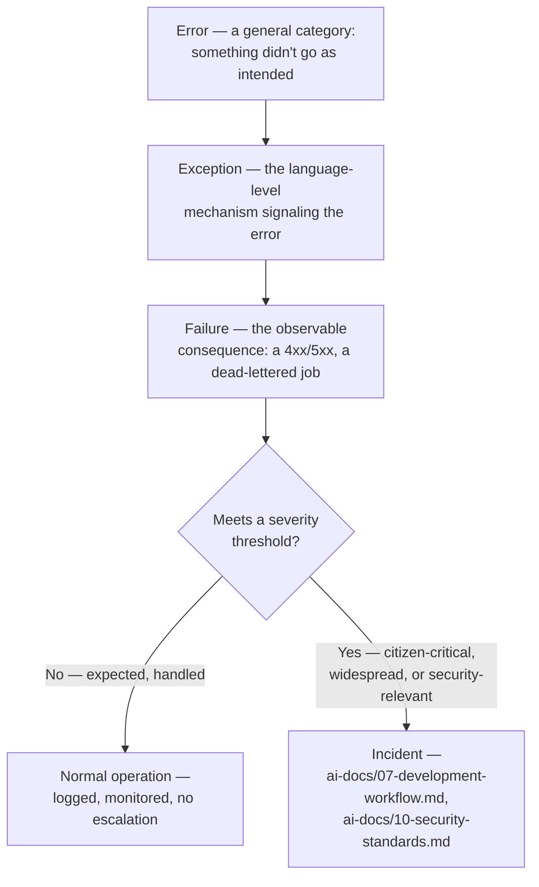

A citizen entering an invalid OTP is an **error**, represented as an **exception** (`OtpVerificationFailedError`), producing a **failure** (a `401` response) — and is never, on its own, an **incident**. A payment gateway becoming completely unreachable is an **error**, represented as an **exception** (`PaymentGatewayUnavailableError`), producing a **failure** (every checkout attempt returning `503`), which — because it is citizen-critical and platform-wide — *is* escalated into an **incident**. This document governs the first three; `ai-docs/07-development-workflow.md` and `ai-docs/10-security-standards.md` govern the fourth.

### Relationship with Logging Standards

`ai-docs/19-logging-standards.md` governs **what a log line looks like once a failure has been decided about** — its JSON schema, its level, its correlation fields, its sensitive-data scrubbing, its retention. This document governs **the decision itself**: what category an error belongs to, whether it is retried, whether it is recovered from silently, whether it is escalated, and what a caller — human or machine — is told about it. The relationship is sequential and non-overlapping: **Error Handling decides what to do; Logging records what happened.** A `catch` block in Arwal's code first applies this document's rules (categorize, decide, recover-or-propagate) and only then, as part of that handling, emits a log line whose *shape* is entirely governed by `ai-docs/19-logging-standards.md`. This document never redefines a log field, a log level's meaning, or a retention window — it only affirms that every meaningful error-handling decision results in exactly one clearly attributable log entry, per the Least Information Necessary and Structured Logging principles already established there.

### Relationship with Observability Standards

`ai-docs/18-observability-standards.md` governs **how a failure becomes visible in aggregate** — the metric that increments, the span that is marked as an error, the dashboard panel that turns red, the alert that pages an engineer. This document governs **the application-level discipline that produces that failure in the first place** — the typed exception, the retry decision, the circuit-breaker state transition. As `ai-docs/18-observability-standards.md` itself states: *"Error Handling Standards governs what happens inside a `catch` block; \[Observability\] governs what happens after that `catch` block finishes, in the dashboards and pagers of the people responsible for the system's health."* This document does not define a metric name, a span attribute, an alert threshold, or a dashboard — it defines only the error-handling behavior that observability instrumentation, layered on top per `ai-docs/18-observability-standards.md`, ultimately measures.

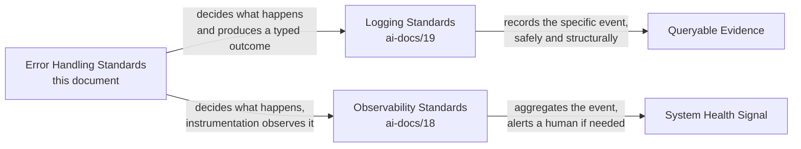

This document deliberately does **not** define logging formats, metrics, tracing, alerting, deployment mechanics, CI/CD, or configuration management — every one of those is the exclusive, already-governed domain of a preceding phase document, referenced here by citation, never duplicated.

---

# Error Handling Philosophy

Arwal's error-handling posture rests on eight commitments. Together they answer the question every subsequent section of this document exists to make concrete: **what does "handled correctly" actually require, by default, before a single `try/catch` is written?**

### Fail Fast

An invalid state is rejected at the earliest possible point in the call stack — the moment it is detected — rather than allowed to propagate deeper into the system where it becomes harder to trace and more expensive to recover from. Per the Shift Left philosophy already established in `ai-docs/15-testing-standards.md` and `ai-docs/17-cicd-standards.md` applied here to runtime behavior: a malformed request is rejected by schema validation at the Presentation Layer before it ever reaches a use case; a domain invariant is enforced the instant an entity's state would become inconsistent, never several operations later when the inconsistency has already spread. Failing fast exists because the cost of an undetected invalid state compounds the longer it survives — exactly the same reasoning `ai-docs/02-engineering-principles.md` applies to technical debt.

### Fail Securely

When a system cannot make a confident decision — an authorization check errors, a validation step cannot complete, an external trust boundary cannot be verified — it fails **closed**, denying the action, never fails **open** by defaulting to permission. This directly restates the Fail Secure principle already established in `ai-docs/10-security-standards.md`, extended here to every category of error, not only security-specific ones: an unexpected exception during a payment authorization check is treated as "not authorized," never as "probably fine, let it through." Failing securely exists because the asymmetry of harm is not equal — a wrongly denied action costs a citizen a retry; a wrongly permitted action can cost a citizen their money, their data, or their government service eligibility.

### Graceful Degradation

A non-critical dependency's failure degrades the specific feature it powers, never the citizen-critical core flow it is attached to, per the Graceful Degradation resilience pattern already established in `ai-docs/03-system-architecture-principles.md` and `ai-docs/11-performance-standards.md`. A citizen who cannot see personalized recommendations because the ranking service is down can still browse, add to cart, and check out — Graceful Degradation exists because a system that treats every dependency as equally load-bearing turns every minor outage into a total one, which is precisely the cascading-failure anti-pattern Arwal's Modular Monolith and Failure Isolation architecture (`ai-docs/03-system-architecture-principles.md`) is designed from Phase 1 to prevent.

### Recover Where Safe

An error is recovered from automatically — a retry, a fallback, a cached value — only where recovery is genuinely safe: the operation is idempotent, the fallback's staleness or reduced fidelity is an acceptable trade-off, and recovering silently does not hide a defect a human needs to know about. Recovery is a deliberate design decision at the point an operation is written, never a reflexive `try/catch` wrapped around code "just in case" — this principle exists because unsafe, blanket recovery (retrying a non-idempotent payment charge, silently substituting a default value for a citizen's actual eligibility status) converts a visible, honest failure into a much more dangerous, invisible incorrect success.

### Explicit Errors

Every error is represented by a specific, named, typed exception describing exactly what went wrong — never a generic, untyped `Error("something went wrong")` that forces every caller to either guess or ignore it. This directly extends Explicitness, already established as a core coding-philosophy commitment in `ai-docs/05-coding-standards.md` ("nothing in Arwal's codebase is implicit where it could be explicit"), into the error-handling domain specifically: an error type is itself part of a module's public contract, exactly as a DTO is, and callers write code against that contract, not against a string message that could be reworded at any time without notice.

### No Silent Failures

An error is never caught and discarded without either recovering meaningfully or re-throwing with added context — an empty `catch {}` block is treated with the same review-blocking severity already established in `ai-docs/02-engineering-principles.md` and `ai-docs/05-coding-standards.md`. This principle exists because a silently swallowed error is strictly worse than an unhandled one: an unhandled error at least produces a visible failure someone can investigate; a swallowed error produces a system that appears healthy while quietly doing the wrong thing, which is the single hardest class of defect to discover and the most damaging to citizen trust once discovered.

### Deterministic Behavior

Given the same input and the same system state, error handling behaves identically every time — the same validation failure always produces the same error code, the same retry policy always applies to the same failure class, the same circuit-breaker threshold always trips at the same point. This mirrors the Deterministic Testing principle already established in `ai-docs/15-testing-standards.md`, applied here to production behavior: non-deterministic error handling (a retry count that varies by code path, an error occasionally logged and occasionally not) makes both testing and incident investigation unreliable, since the same conditions can no longer be trusted to reproduce the same outcome.

### User-Centric Error Messages

Every error a citizen, merchant, or government officer actually sees is written in plain, actionable, citizen-safe language — "This booking can no longer be cancelled" — never a raw exception name, an internal error code with no explanation, or a message that assumes technical fluency the platform's Target Audience (`ai-docs/01-product-goals.md`) cannot be assumed to have. This directly extends the User-Safe Messages standard already established in `ai-docs/05-coding-standards.md` and `ai-docs/13-api-design-guidelines.md`, and connects error handling to the Accessibility Vision in `ai-docs/00-project-vision.md`: a confusing error message is, for a low-literacy or first-generation smartphone citizen, functionally indistinguishable from the platform simply not working.

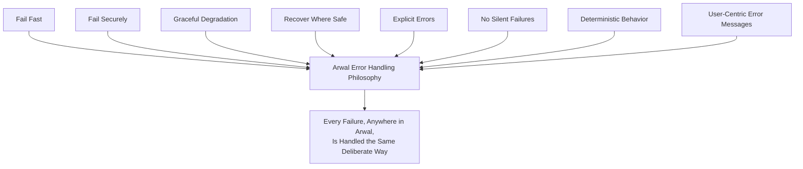

> **Callout — The One-Sentence Error Handling Philosophy**
> *"An error that is caught, understood, and handled deliberately protects a citizen's trust; an error that is guessed at, hidden, or ignored spends it — and Arwal never spends what it cannot rebuild."*

---

# Error Taxonomy

Every error in Arwal belongs to exactly one category in this taxonomy, extending and making exhaustive the Error Handling table first introduced in `ai-docs/02-engineering-principles.md` and the Data Classification-style tiering already established in `ai-docs/10-security-standards.md`. Categorization determines everything downstream: the HTTP status code (`ai-docs/13-api-design-guidelines.md`), whether a retry is attempted (see Retry Strategy below), whether it is logged at `WARN` or `ERROR` (`ai-docs/19-logging-standards.md`), and whether it can ever be escalated into an incident.

| Category | Definition | Example | Retryable? | Citizen-Facing? |
|---|---|---|---|---|
| **Validation Errors** | The request is structurally malformed — missing a required field, wrong type, fails schema constraints — detected at the Presentation Layer boundary before business logic runs. | A booking request missing `providerId`; an email field containing non-email text. | No — retrying identical, invalid input produces the identical failure. | Yes — field-level, actionable. |
| **Domain Errors** | A request is well-formed and passes schema validation, but violates a rule the Domain Layer (`ai-docs/03-system-architecture-principles.md`) owns and enforces as part of an entity's or aggregate's own invariants. | `Booking.cancel()` throwing because the aggregate's own state (`Cancelled` already) forbids the transition. | No. | Yes, when the rule is citizen-relevant. |
| **Business Rule Violations** | A specific subclass of Domain Error representing a named, documented business policy rather than a structural entity invariant — often cross-cutting or configuration-dependent (a cutoff window, a fee threshold). | The 2-hour cancellation cutoff (`ai-docs/02-engineering-principles.md`); a promotion no longer valid for a citizen's tier. | No. | Yes — the specific policy being violated is stated plainly. |
| **Authentication Errors** | The actor's identity cannot be established or verified — missing, invalid, or expired credential. | An expired JWT; an OTP that does not match. | No (the same credential will always fail) — but the *corrective action* (re-authenticate) is retryable by the citizen. | Yes — generic enough not to aid credential-stuffing (`ai-docs/10-security-standards.md`). |
| **Authorization Errors** | The actor is authenticated, but is not permitted to perform this specific action on this specific resource. | A citizen attempting to cancel another citizen's booking. | No. | Yes or No, per the 403-vs-404 disclosure decision in `ai-docs/13-api-design-guidelines.md`. |
| **Infrastructure Errors** | A failure in Arwal's own owned infrastructure — the database, the cache, the message queue — distinct from a failure in a third-party dependency. | A PostgreSQL connection pool exhausted; a Redis connection dropped. | Often yes, per Retry Strategy below. | No — presented as a generic, citizen-safe failure. |
| **Network Errors** | A failure in the transport layer between two components — a timeout, a DNS resolution failure, a connection reset — distinct from the remote system explicitly rejecting the request. | A TCP connection to the payment gateway timing out mid-handshake. | Often yes. | No — presented as a generic, citizen-safe failure. |
| **External API Errors** | A third-party system (payment gateway, SMS provider, government API, AI provider per `ai-docs/09-tech-stack.md`) responds, but with an error status or an unexpected shape. | The payment gateway returns a `5xx`; a government API returns a malformed response body. | Depends on the specific status/class returned, per Retry Strategy below. | Sometimes — e.g., "Payment could not be completed, please try again." |
| **Database Errors** | A specific subclass of Infrastructure Error: a constraint violation, a deadlock, a serialization failure, a migration-state mismatch, per `ai-docs/14-database-design-guidelines.md`. | A `CHECK (balance >= 0)` constraint violation; a `40P01` deadlock. | Deadlocks/serialization failures: yes, per the Retry Strategy in `ai-docs/14-database-design-guidelines.md`. Constraint violations: no. | No — mapped to a citizen-safe domain error where the constraint reflects a real business rule (e.g., insufficient balance), otherwise generic. |
| **Configuration Errors** | A required environment variable, feature flag, or runtime setting is missing, malformed, or logically inconsistent, per the Configuration Validation standard in `ai-docs/16-deployment-standards.md`. | A service booting with `DATABASE_URL` unset. | No — this is a deployment-blocking failure, never a runtime retry candidate. | No — a citizen never sees this; it prevents the service from starting at all. |
| **Programming Errors** | A defect in Arwal's own code — a null-reference the type system should have prevented, an off-by-one, a violated invariant caused by a bug, not by bad input or a failed dependency. | Calling `.find()` on an array assumed non-empty, which is actually empty due to a logic error. | No — retrying executes the same buggy code path again. | No — always a generic failure; the underlying defect is a Sev-tracked bug per `ai-docs/07-development-workflow.md`. |
| **Unexpected Errors** | Any error that does not cleanly map to a category above — a genuinely novel failure mode, a third-party library throwing an undocumented exception type. | An unrecognized native error thrown by a dependency during a rare edge case. | No, by default — treated conservatively until understood. | No — the most generic, citizen-safe fallback message applies. |

### Category Decision Flow

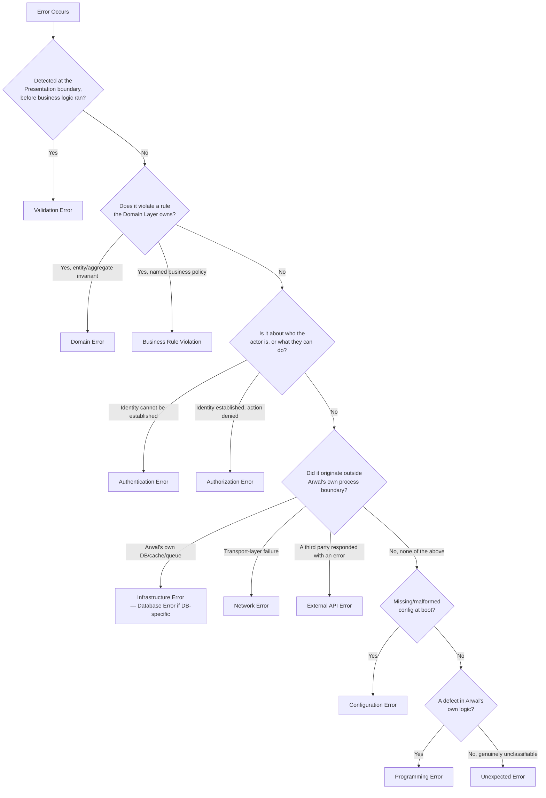

> **Callout — Category Determines Everything Downstream**
> A mis-categorized error is not merely an inconvenience — it silently breaks the Retry Strategy, the Security Considerations, and the API status-code mapping this entire document depends on. A `Programming Error` mistakenly categorized as an `Infrastructure Error` will be retried, repeating the same defect three times instead of surfacing it once, clearly, for a human to fix.

---

# Exception Hierarchy

Every exception in Arwal's backend (`apps/api`, `apps/workers`) descends from a single, shared root, per the typed-error-hierarchy standard first introduced in `ai-docs/05-coding-standards.md`'s Backend Standards and made complete here. Every exception class lives in `common/errors/`, per `ai-docs/04-folder-guidelines.md`, with module-specific subclasses defined inside that module's own `domain/` layer where the error represents a domain-owned rule.

### The Hierarchy

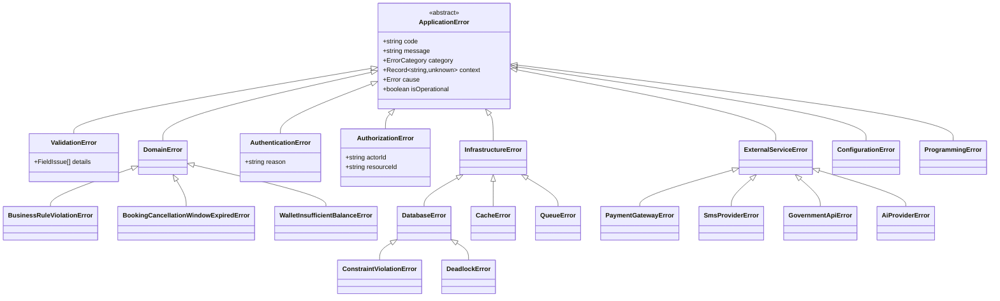

### Base `ApplicationError`

Every Arwal exception extends a single abstract base class, never `Error` directly, so every error in the system shares a guaranteed, structured shape:

```typescript
// common/errors/ApplicationError.ts
export enum ErrorCategory {
  Validation = "VALIDATION",
  Domain = "DOMAIN",
  Authentication = "AUTHENTICATION",
  Authorization = "AUTHORIZATION",
  Infrastructure = "INFRASTRUCTURE",
  ExternalService = "EXTERNAL_SERVICE",
  Configuration = "CONFIGURATION",
  Programming = "PROGRAMMING",
}

export abstract class ApplicationError extends Error {
  abstract readonly code: string;
  abstract readonly category: ErrorCategory;
  /** Operational errors are expected, handled conditions (a declined payment).
   *  Non-operational errors indicate a defect requiring investigation. */
  abstract readonly isOperational: boolean;

  constructor(
    message: string,
    public readonly context: Record<string, unknown> = {},
    public readonly cause?: Error,
  ) {
    super(message);
    this.name = this.constructor.name;
    Error.captureStackTrace(this, this.constructor);
  }
}
```

### `DomainError`

Represents a violation of a rule the Domain Layer owns — an entity invariant or a named business policy, per `ai-docs/03-system-architecture-principles.md`'s DDD vocabulary. `DomainError` is always `isOperational: true` — it represents the system working exactly as designed, correctly rejecting an invalid operation.

```typescript
export abstract class DomainError extends ApplicationError {
  readonly category = ErrorCategory.Domain;
  readonly isOperational = true;
}

export class BookingCancellationWindowExpiredError extends DomainError {
  readonly code = "BOOKING_CANCELLATION_WINDOW_EXPIRED";
  constructor(bookingId: string) {
    super("This booking can no longer be cancelled.", { bookingId });
  }
}
```

### `ValidationError`

Represents a schema/boundary validation failure, per the two-place validation discipline already established in `ai-docs/05-coding-standards.md` and `ai-docs/13-api-design-guidelines.md`. Always operational.

```typescript
export interface FieldIssue {
  field: string;
  issue: string;
}

export class ValidationError extends ApplicationError {
  readonly code = "VALIDATION_ERROR";
  readonly category = ErrorCategory.Validation;
  readonly isOperational = true;
  constructor(public readonly details: FieldIssue[]) {
    super("The request failed validation.", { details });
  }
}
```

### `AuthenticationError` and `AuthorizationError`

Distinct classes, never conflated, mirroring the explicit "authentication answers who; authorization answers what they can do" separation already established in `ai-docs/10-security-standards.md`. Both are operational — a citizen presenting an expired token is expected, handled behavior, not a system defect.

```typescript
export class AuthenticationError extends ApplicationError {
  readonly code = "AUTHENTICATION_REQUIRED";
  readonly category = ErrorCategory.Authentication;
  readonly isOperational = true;
}

export class AuthorizationError extends ApplicationError {
  readonly code = "FORBIDDEN";
  readonly category = ErrorCategory.Authorization;
  readonly isOperational = true;
  constructor(actorId: string, resourceId: string, action: string) {
    super("You are not authorized to perform this action.", { actorId, resourceId, action });
  }
}
```

### `InfrastructureError`

Represents a failure in infrastructure Arwal itself owns and operates (database, cache, queue), per `ai-docs/03-system-architecture-principles.md`. Never operational by default — an infrastructure failure typically signals a condition requiring attention, even if automatically recovered from via retry.

```typescript
export abstract class InfrastructureError extends ApplicationError {
  readonly category = ErrorCategory.Infrastructure;
  readonly isOperational = false;
}

export class DatabaseError extends InfrastructureError {
  readonly code = "DATABASE_ERROR";
  constructor(operation: string, cause: Error) {
    super(`Database operation failed: ${operation}`, { operation }, cause);
  }
}
```

### `ExternalServiceError`

Represents a failure attributable to a third-party dependency accessed through a domain-owned interface, per the Third-Party Service Policy in `ai-docs/09-tech-stack.md` — always carries which provider failed, never conflated with an Arwal-internal `InfrastructureError`, since the remediation path (a circuit breaker, a fallback provider) differs entirely.

```typescript
export abstract class ExternalServiceError extends ApplicationError {
  readonly category = ErrorCategory.ExternalService;
  readonly isOperational = false;
  constructor(public readonly provider: string, message: string, cause?: Error) {
    super(message, { provider }, cause);
  }
}

export class PaymentGatewayError extends ExternalServiceError {
  readonly code = "PAYMENT_GATEWAY_ERROR";
}
```

### `ConfigurationError` and `ProgrammingError`

Both are always `isOperational: false` — neither is ever citizen-facing, and both represent conditions requiring an engineer's attention: `ConfigurationError` blocks a service from starting (per `ai-docs/16-deployment-standards.md`'s Configuration Validation); `ProgrammingError` represents an actual code defect and is never caught and "handled" beyond logging it and re-throwing, so it fails loudly rather than masking a bug.

### Operational vs. Non-Operational — Why the Distinction Matters

| | Operational Errors | Non-Operational Errors |
|---|---|---|
| **Represents** | The system correctly rejecting an invalid or disallowed request | The system failing to do what it was supposed to do |
| **Examples** | `ValidationError`, `DomainError`, `AuthenticationError`, `AuthorizationError` | `InfrastructureError`, `ExternalServiceError`, `ConfigurationError`, `ProgrammingError` |
| **Log level (per `ai-docs/19-logging-standards.md`)** | `INFO`/`WARN` — never `ERROR`, since this is expected, handled behavior, not a system fault | `WARN`/`ERROR`/`FATAL`, depending on severity |
| **Alerting (per `ai-docs/18-observability-standards.md`)** | Never pages on-call on its own; aggregate rate may inform a Business Metric | May page on-call if it breaches an SLO error budget |
| **Process health** | The process is completely healthy | May indicate the process itself is degraded |

This distinction is the exact, concrete implementation of the Level Discipline callout already established in `ai-docs/19-logging-standards.md`: *"`ERROR` is never used for an expected, handled business outcome."* The `isOperational` flag on every `ApplicationError` is what makes that discipline mechanically enforceable rather than a matter of individual judgment at each log call site.

---

# Error Propagation

### Where Errors Should Be Caught

Errors are caught at the layer that can either **recover meaningfully** or **translate the error into a more specific, more useful type** for the layer above — never caught reflexively "just to be safe" at every level, which fragments a single root cause into a chain of progressively less-informative wrappers.

| Layer (per `ai-docs/03-system-architecture-principles.md`) | Catches | Never Catches |
|---|---|---|
| **Infrastructure** | Raw driver/SDK exceptions (a Prisma error, an HTTP client timeout) — translated into a typed `InfrastructureError`/`ExternalServiceError` immediately at this boundary, per Technology Independence. | A `DomainError` — infrastructure code has no business-rule context to act on it. |
| **Domain** | Nothing from outside itself — the Domain Layer has zero framework/infrastructure knowledge (`ai-docs/03-system-architecture-principles.md`) and cannot catch what it cannot see. It only *throws* typed `DomainError`s as invariants are violated. | — |
| **Application** | A `DomainError` thrown by the entity/aggregate it orchestrates, where recovery or a compensating action is possible; an `InfrastructureError`/`ExternalServiceError` from a repository or external client call, where a retry (see Retry Strategy) or fallback is appropriate. | A raw, untyped exception — by the time an error reaches the Application Layer, it must already be a typed `ApplicationError`, per Layer Responsibilities below. |
| **Presentation** | Every `ApplicationError` the Application Layer allows to propagate up — translated into the correct HTTP status code and the standard error envelope (`ai-docs/13-api-design-guidelines.md`). | Nothing beyond this layer — Presentation is the final catch point before a response is sent; nothing propagates past it uncaught. |

### Where Errors Should Be Rethrown

An error is rethrown, always **with added context, never bare**, in exactly these situations:

1. **Crossing a layer boundary** — an Infrastructure Layer catching a raw Prisma exception rethrows it wrapped as a typed `DatabaseError`, preserving the original as `cause`.
2. **Crossing a module boundary** — a module's public `index.ts` (`ai-docs/04-folder-guidelines.md`) never leaks an internal exception type to a caller in another module; it rethrows as a documented, public exception the calling module's Application Layer can meaningfully catch.
3. **Adding business context a lower layer couldn't know** — a repository's raw `ConstraintViolationError` is rethrown by the Application Layer as a `WalletInsufficientBalanceError` once it has the business context (which constraint, on which entity) to translate it meaningfully.

```typescript
// Infrastructure layer — catches raw driver error, translates immediately
async findById(id: string): Promise<Wallet | null> {
  try {
    const row = await this.prisma.wallet.findUnique({ where: { id } });
    return row ? WalletMapper.toDomain(row) : null;
  } catch (cause) {
    throw new DatabaseError("Wallet.findById", cause as Error);
  }
}

// Application layer — catches the typed infra error, adds business context, rethrows
async execute(dto: DebitWalletDto): Promise<void> {
  try {
    const wallet = await this.walletRepository.findById(dto.walletId);
    if (!wallet) throw new WalletNotFoundError(dto.walletId);
    wallet.debit(dto.amount); // throws WalletInsufficientBalanceError if invalid
    await this.walletRepository.save(wallet);
  } catch (cause) {
    if (cause instanceof ApplicationError) throw cause; // already typed, propagate as-is
    throw new DatabaseError("DebitWalletUseCase.execute", cause as Error); // unexpected — wrap, never swallow
  }
}
```

### Layer Responsibilities

| Layer | Responsibility Toward Errors |
|---|---|
| **Presentation** | Translate every `ApplicationError` into the correct HTTP status and the standard error envelope (`ai-docs/13-api-design-guidelines.md`). Never constructs a domain-specific error itself — it only maps. |
| **Application** | Orchestrate recovery (retry, fallback, compensating action) where safe; translate infrastructure-level errors into business-meaningful ones where it has the context to do so; never construct an HTTP status code itself, per the Dependency Rules in `ai-docs/03-system-architecture-principles.md`. |
| **Domain** | The sole authority on what constitutes a `DomainError` for its own aggregate; throws with full business context at the exact point an invariant is violated. |
| **Infrastructure** | Catch every raw third-party/driver exception at the boundary and translate it into a typed `InfrastructureError`/`ExternalServiceError` before it is allowed to propagate — a raw Prisma or Axios exception must never reach the Application Layer undisguised. |

### Avoid Swallowing Exceptions

An empty `catch {}` block, a `catch` that logs and does nothing else, or a `.catch(() => {})` on a promise are all **Blocking Issues**, per the zero-exception standard already established in `ai-docs/05-coding-standards.md`. Every catch clause does exactly one of three things: **recovers** (with a documented, deliberate reason recovery is safe), **translates and rethrows** (with `cause` preserved), or **is not written at all**, letting the error propagate to a layer that can actually do something useful with it.

```typescript
// Rejected — swallowed, no recovery, no context, silent
try {
  await notificationService.send(notification);
} catch (e) {
  // nothing
}

// Rejected — logged but still effectively swallowed; caller has no idea it failed
try {
  await notificationService.send(notification);
} catch (e) {
  logger.error("notification failed", e);
}

// Required — genuinely safe to recover from (non-critical, per Graceful Degradation),
// but the failure is visible and attributable, never silent
try {
  await notificationService.send(notification);
} catch (cause) {
  throw new NotificationDispatchError(notification.id, cause as Error);
  // caught one layer up by the calling use case, which — per its own design —
  // logs a WARN and continues, since a booking's success never depends on
  // a notification succeeding (Graceful Degradation)
}
```

### Preserve Root Cause

Every rethrown or translated exception carries the original exception as its `cause` (native `Error.cause`/the `ApplicationError` constructor's `cause` parameter), never discarding it — a stack trace and root cause lost at a translation boundary is unrecoverable information the moment it is lost, and reconstructing "what actually failed, underneath three layers of wrapping" without it is frequently impossible during an incident investigation.

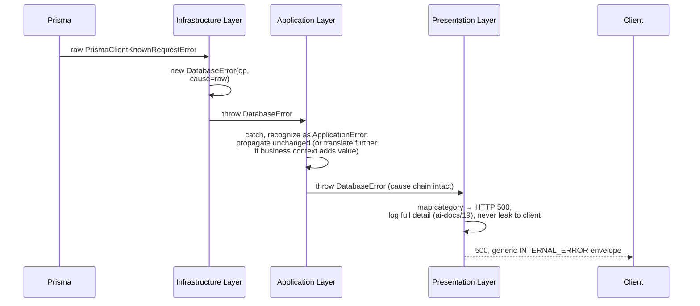

---

# API Error Responses

Every API error response follows the exact standard error envelope, status-code mapping, and error-code discipline already fully specified in `ai-docs/13-api-design-guidelines.md`'s Response Design, Status Codes, and Error Handling sections — this document does not redefine that contract. It affirms only how this document's Exception Hierarchy maps onto that already-established contract, and adds the propagation discipline that makes the mapping mechanical rather than ad hoc per endpoint.

### Category → Status Code Mapping

| `ErrorCategory` | HTTP Status (per `ai-docs/13-api-design-guidelines.md`) |
|---|---|
| `Validation` | `400 Bad Request` |
| `Domain` (structural invariant) | `409 Conflict` or `422 Unprocessable Entity`, per the specific rule (see the Status Codes table in `ai-docs/13-api-design-guidelines.md`) |
| `Authentication` | `401 Unauthorized` |
| `Authorization` | `403 Forbidden` or `404 Not Found`, per the ownership-disclosure decision in `ai-docs/13-api-design-guidelines.md` |
| `Infrastructure` | `500 Internal Server Error` |
| `ExternalService` | `502 Bad Gateway` (the remote system errored) or `503 Service Unavailable` (the remote system is unreachable/circuit open) |
| `Configuration` | Never reaches an HTTP response — the process fails to boot, per `ai-docs/16-deployment-standards.md` |
| `Programming` | `500 Internal Server Error` |

### Error Codes and Human-Readable Messages

`error.code` is the exception's own `code` property, exactly as defined in the Exception Hierarchy above — a stable, `SCREAMING_SNAKE_CASE` identifier a client can branch on, never changing once published, per `ai-docs/13-api-design-guidelines.md`'s Error Codes standard. `error.message` is the exception's `message` property, always written per the User-Centric Error Messages principle above — plain, citizen-safe, actionable language. The mapping from exception instance to response body is entirely mechanical at the Presentation Layer, never hand-crafted per endpoint:

```typescript
// common/errors/errorResponseMapper.ts — the single, shared translation point
export function toErrorResponse(error: ApplicationError, requestId: string) {
  return {
    error: {
      code: error.code,
      message: error.message, // always citizen-safe by construction, per this document
      details: error instanceof ValidationError ? error.details : undefined,
      requestId,
    },
  };
}
```

### Correlation and Request IDs

Every error response's `requestId` is the same identifier already established as `meta.requestId` in `ai-docs/13-api-design-guidelines.md` and unified with the OpenTelemetry trace ID in `ai-docs/18-observability-standards.md` — this document adds nothing new here; it affirms that every `ApplicationError` reaching the Presentation Layer is translated into a response carrying that same identifier, so a citizen quoting a `requestId` from an error message gives a support engineer a direct path into the correlated trace and logs, per the investigative pattern already fully described in `ai-docs/19-logging-standards.md`'s Correlation in Practice section.

### Unmapped / Unexpected Errors

Any exception reaching the Presentation Layer that is **not** an `ApplicationError` (a raw, unwrapped exception that slipped past every lower layer's translation responsibility) is treated as a `Programming Error` by default — mapped to `500 Internal Server Error`, logged at `ERROR` with full internal detail (per `ai-docs/19-logging-standards.md`), and returned to the client as the single, generic `INTERNAL_ERROR` code with no further detail. This is the mandatory fallback, never a code path that is expected to be exercised in a mature module — its presence exists purely as the final Fail Securely backstop, per the Fail Securely principle above.

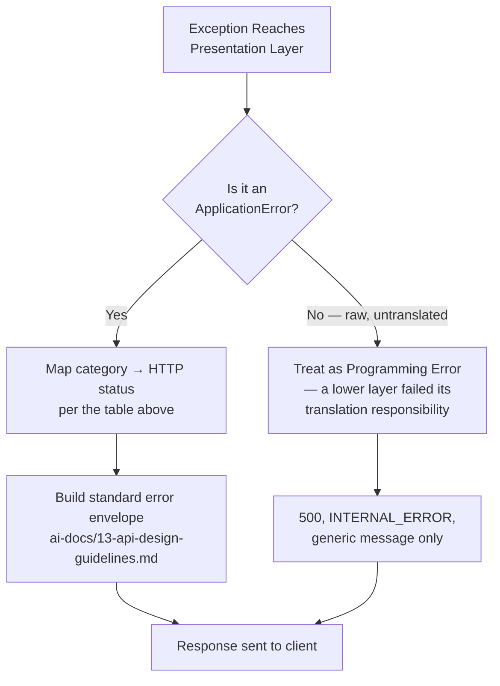

---

# Retry Strategy

### Retryable vs. Non-Retryable Failures

Retry is applied **only** to failures where a repeated attempt has a genuine chance of succeeding without the original request having changed — never applied reflexively to every failure, since retrying a non-retryable failure wastes resources, delays an honest failure signal to the citizen, and — for a non-idempotent operation — risks a duplicate side effect.

| Category | Retryable? | Reasoning |
|---|---|---|
| `ValidationError`, `DomainError`, `AuthenticationError`, `AuthorizationError` | **Never** | The failure is deterministic against the same input; retrying reproduces the identical rejection. |
| `Network Error` (timeout, connection reset) | **Yes** | Often a genuinely transient condition — a momentary network blip, per the Resilience Patterns already established in `ai-docs/03-system-architecture-principles.md`. |
| `Infrastructure Error` — connection pool exhaustion, deadlock (`40P01`), serialization failure (`40001`) | **Yes**, per the specific Retry Strategy already detailed in `ai-docs/14-database-design-guidelines.md` | These are concurrency/contention artifacts, not correctness failures — the identical operation frequently succeeds moments later. |
| `Infrastructure Error` — a constraint violation (`23505` unique violation, `23514` check violation) | **Never** | The data itself is invalid; retrying without changing the input reproduces the identical violation. |
| `External Service Error` — `5xx`, timeout, connection failure | **Yes, bounded** | The category of failure the Retry resilience pattern in `ai-docs/03-system-architecture-principles.md` exists for. |
| `External Service Error` — `4xx` (the provider rejected the request as malformed/unauthorized) | **Never** | A client-side error on Arwal's part; retrying an identical malformed request never succeeds. |
| `Programming Error` | **Never** | Retrying executes the same defective code path again, per the Error Taxonomy table above. |

### Exponential Backoff

Every automated retry uses exponential backoff — the delay between attempts grows geometrically (e.g., 100ms, 200ms, 400ms, 800ms) — never a fixed, constant delay, which would cause every failed caller to retry in lockstep and produce a synchronized "thundering herd" against an already-struggling dependency at each retry interval.

```typescript
async function withRetry<T>(
  operation: () => Promise<T>,
  isRetryable: (error: unknown) => boolean,
  maxAttempts = 3,
  baseDelayMs = 100,
): Promise<T> {
  for (let attempt = 1; attempt <= maxAttempts; attempt++) {
    try {
      return await operation();
    } catch (error) {
      if (!isRetryable(error) || attempt === maxAttempts) throw error;
      const delay = baseDelayMs * 2 ** (attempt - 1) + jitter();
      await sleep(delay);
    }
  }
  throw new Error("unreachable");
}
```

### Jitter

A small, randomized offset is added to every computed backoff delay (`jitter()` above), per the same thundering-herd reasoning — without jitter, many callers that failed at the same moment (e.g., during a brief provider outage) would all retry at exactly the same computed delay, recreating the exact synchronized load spike backoff was meant to avoid. Jitter is applied as a percentage of the base delay (typically ±20%), never large enough to defeat the backoff curve's purpose.

### Maximum Retry Count

Every retry loop has a hard, capped maximum attempt count — **3 attempts by default**, adjusted only for a specifically justified, documented reason (e.g., a lower-stakes background job tolerating 5) — never unbounded. An operation that has exhausted its retry budget fails **loudly and immediately**, propagated as the original (or a wrapping) `ApplicationError`, never silently retried forever in the background where a citizen is left waiting indefinitely with no feedback.

### Idempotency Considerations

Retry is **only** ever applied to an operation that is either naturally idempotent (a `GET`, a `PUT`, per `ai-docs/13-api-design-guidelines.md`'s Method Safety table) or has been made idempotent via an explicit idempotency key (a `POST` representing payment initiation or booking creation, per the Idempotency Keys standard already fully specified in `ai-docs/13-api-design-guidelines.md` and `ai-docs/03-system-architecture-principles.md`). An automatic retry is **never** wrapped around a non-idempotent operation lacking this guarantee — this is the single most consequential rule in this section, since violating it converts a transient network blip into a duplicate payment charge or a duplicate booking, exactly the failure mode Idempotency exists to prevent.

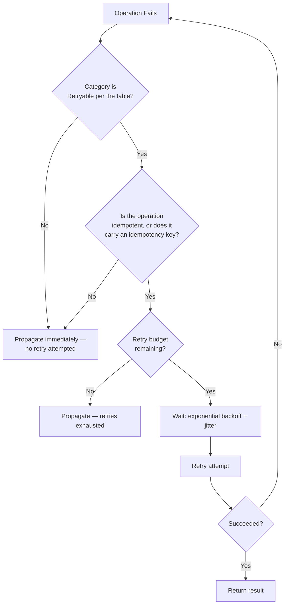

---

# Circuit Breakers

A circuit breaker protects both the caller and the callee from a dependency that is clearly failing — it stops sending requests to a struggling dependency, giving it room to recover, and stops the caller from wasting resources and time waiting on a call that is very unlikely to succeed. This directly implements the Circuit Breaker resilience pattern already established in `ai-docs/03-system-architecture-principles.md` and referenced throughout `ai-docs/11-performance-standards.md`'s Provider Fallback and Timeout Handling sections — this document defines the state-machine discipline in full.

### States

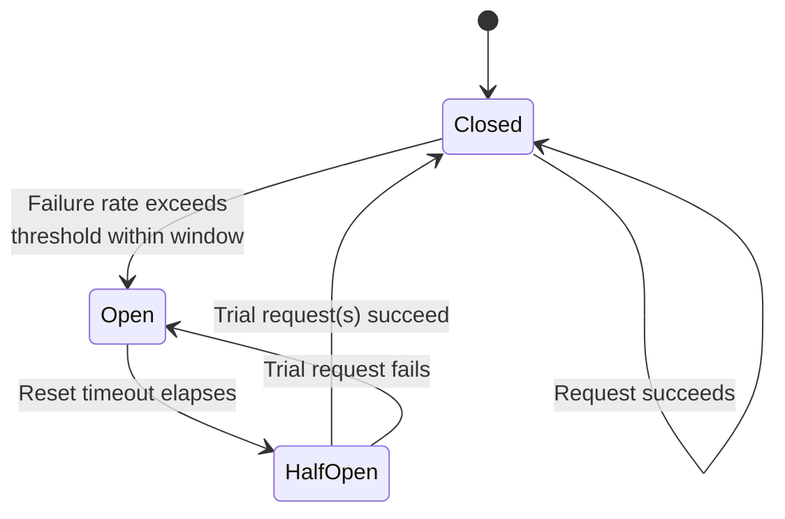

| State | Behavior | Purpose |
|---|---|---|
| **Closed** | Every request is forwarded to the dependency normally; failures are counted against a rolling window. | The default, healthy state — the circuit does not interfere while the dependency is behaving. |
| **Open** | Every request is rejected **immediately**, without ever reaching the dependency, returning a fast, typed `ExternalServiceError`/`InfrastructureError` (per the Fail Fast principle above). | Protects the failing dependency from additional load while it is already struggling, and protects the caller from wasting its own latency budget on calls very unlikely to succeed. |
| **Half-Open** | After a defined reset timeout, a small, limited number of trial requests are allowed through. | Tests whether the dependency has recovered, without immediately resubmitting full production load onto a dependency that may still be fragile. |

### Applied To

Per the Resilience Patterns table already established in `ai-docs/03-system-architecture-principles.md`: every external integration (payment gateways, SMS/WhatsApp providers, government APIs, AI model providers per `ai-docs/09-tech-stack.md`) and any internal synchronous cross-module dependency specifically identified as a risk point. A circuit breaker is never applied to a purely in-process, framework-internal call with no genuine external failure mode to protect against.

### Failure Threshold and Reset Timeout

The threshold that trips a circuit from Closed to Open (e.g., "50% failure rate over the last 20 requests" or "5 consecutive failures") and the reset timeout before an Open circuit tries Half-Open (e.g., 30 seconds) are both configured **per dependency**, never a single global default applied uniformly — a payment gateway's threshold is deliberately more conservative (trips faster, resets more cautiously) than a low-stakes recommendation service's, mirroring the Risk-Based discipline already established in `ai-docs/15-testing-standards.md`.

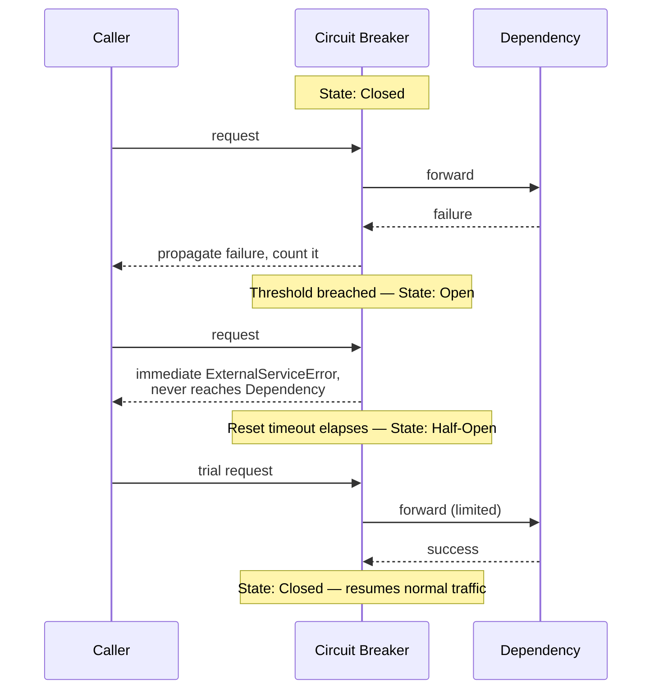

### Interaction with Retry

A circuit breaker and a retry policy (above) are complementary, never redundant, and are always layered in a specific order: **retry operates within a Closed circuit** (retrying a transient failure while the dependency is still considered healthy overall); **an Open circuit bypasses retry entirely**, since retrying against a dependency the breaker has already determined is failing wastes exactly the time and load the breaker exists to save. A retry loop is never wrapped *around* an already circuit-breaker-protected call in a way that would repeatedly re-trip an Open circuit's trial requests — the breaker's own Half-Open trial mechanism is the only retry-like behavior permitted against an Open circuit.

---

# Timeouts

Every synchronous call, internal or external, has an **explicit, bounded timeout** — no call is ever allowed to wait indefinitely, per the Timeout resilience pattern already established in `ai-docs/03-system-architecture-principles.md`. A timed-out call is treated as a failure of the category the call itself belongs to (an `ExternalServiceError` for a third-party API, an `InfrastructureError` for a database query) and is handled per the Retry Strategy and Circuit Breaker sections above, exactly as any other failure of that category would be.

| Call Type | Default Timeout | Rationale |
|---|---|---|
| **HTTP (citizen-facing API request, end-to-end)** | Bounded by the p99 latency target for its operation class in `ai-docs/11-performance-standards.md` (e.g., 700ms for a core write) plus a defined margin — never left to the client's or the framework's own unbounded default. | A request with no bound can hold a connection and a citizen's attention indefinitely; a bounded timeout guarantees the citizen always gets *an* answer, even if that answer is "please try again." |
| **Database query** | Per the query-class targets already established in `ai-docs/11-performance-standards.md` (e.g., 5ms indexed lookup, 500ms aggregate) — a statement timeout configured at the connection/pool level, never left unbounded, so a single runaway query cannot exhaust the pool `ai-docs/11-performance-standards.md` and `ai-docs/14-database-design-guidelines.md` depend on being available for every other concurrent request. | An unbounded query is a standing saturation risk for the entire connection pool, per the USE-method reasoning in `ai-docs/18-observability-standards.md`. |
| **Cache (Redis)** | Short — low tens of milliseconds — since a cache is, by design, meant to be faster than its source of truth; a slow cache call is worse than no cache call at all. | A hung cache call that blocks the request path defeats the entire purpose of caching, per the Caching Strategy in `ai-docs/11-performance-standards.md`; a cache timeout falls through to the source of truth, per Graceful Degradation below. |
| **Queue (BullMQ job pickup/ack)** | Bounded per the Job Pickup Latency and Job Completion Time targets already established in `ai-docs/11-performance-standards.md`. | A job that never times out and never completes silently occupies a worker slot indefinitely, degrading throughput for every other job in the queue. |
| **External APIs (payment gateway, SMS, government API, AI provider)** | Explicit, provider-specific, and deliberately conservative — bounded by the Model Latency and API Latency targets already established in `ai-docs/11-performance-standards.md`, never the provider SDK's own unbounded default. | A third party's outage or degradation must never become an unbounded liability for Arwal's own citizen-facing latency; a timed-out external call triggers the Provider Fallback / Circuit Breaker path immediately. |

### Timeout Discipline

- A timeout value is never left at a library's undocumented default — it is explicitly configured, reviewed, and justified per the specific call, mirroring the Explicitness principle in `ai-docs/05-coding-standards.md`.
- A timeout is set with the *caller's* latency budget in mind, not merely the callee's typical response time — a downstream call's timeout must leave enough remaining budget for the caller itself to still respond within its own target.
- A timed-out call is never silently retried without going through the same Retryable/Idempotency discipline already established in Retry Strategy above — a timeout is a failure like any other, categorized and handled per this document's rules, never treated as a special case exempt from them.

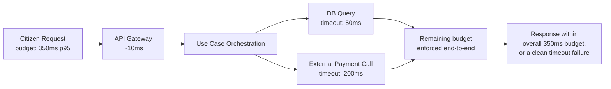

---

# Graceful Degradation

Graceful Degradation is the deliberate design decision, made **in advance**, for what a feature does when a specific dependency it relies on is unavailable — never improvised during an incident. Per the philosophy established above and the Failure Isolation principle in `ai-docs/03-system-architecture-principles.md`, a non-critical dependency's failure degrades the specific feature it powers, never the citizen-critical core flow it is attached to.

| Dependency Failure | Degraded Behavior | Never |
|---|---|---|
| **Cache (Redis) unavailable** | Fall through to the source of truth (the database) directly; the request succeeds, slightly slower, per the Cache Layer discussion in `ai-docs/11-performance-standards.md`. | Fail the entire request because a cache — an optimization, not a source of truth — is unreachable. |
| **Payment gateway unavailable** | The specific payment/checkout action fails cleanly with a citizen-safe, actionable message ("Payment could not be completed, please try again shortly"); browsing, cart, and every other module continue operating normally. | Let a payment-gateway outage cascade into the whole platform being reported as "down," when only checkout is actually affected. |
| **Notification service unavailable** | The originating action (a booking, an order) completes and is durably persisted regardless — the notification is queued for retry per Retry Strategy above, and its eventual, possibly-delayed delivery never blocks or fails the action it is attached to, per the Event-Driven Thinking principle in `ai-docs/03-system-architecture-principles.md` ("a notification outage should never block an order from completing"). | Roll back or fail a completed booking because its confirmation notification could not be sent. |
| **Third-party outage (SMS provider, AI provider, government API)** | The Provider Fallback path already established in `ai-docs/11-performance-standards.md` and `ai-docs/10-security-standards.md` engages — a secondary provider, or a documented, reduced-functionality experience (e.g., an AI-assisted feature falling back to a static, non-AI form) — never a bare, unhandled error reaching the citizen. | Present a raw connection-failure message, or silently do nothing with no citizen-visible feedback at all. |
| **Search/ranking service unavailable** | Catalog and listing pages fall back to a simpler, non-ranked (e.g., recency- or category-sorted) view — browsing remains fully functional, only the personalization/ranking quality is reduced. | Block browsing entirely because the ranking refinement on top of it is unavailable. |
| **AI Gateway Service unavailable** | Per `ai-docs/11-performance-standards.md`'s AI Performance section, the specific AI-assisted feature degrades to its documented non-AI fallback (a static help article instead of a conversational assistant); no citizen-critical civic or financial flow ever depends on the AI Gateway being available. | Block a government application submission or a payment because an unrelated AI-assisted helper feature is down. |

### Design-Time, Not Incident-Time

Every citizen-critical flow's dependency graph is reviewed at design time — during Architecture Review, per `ai-docs/07-development-workflow.md` — specifically to answer: "if this dependency fails, what happens to this flow?" A flow whose answer is "it fails completely" is either redesigned to degrade gracefully, or the dependency is explicitly, deliberately reclassified as citizen-critical in its own right (with its own SLO, per `ai-docs/18-observability-standards.md`) — Graceful Degradation is never a retrofit applied only after a real outage exposes a flow that had no fallback plan.

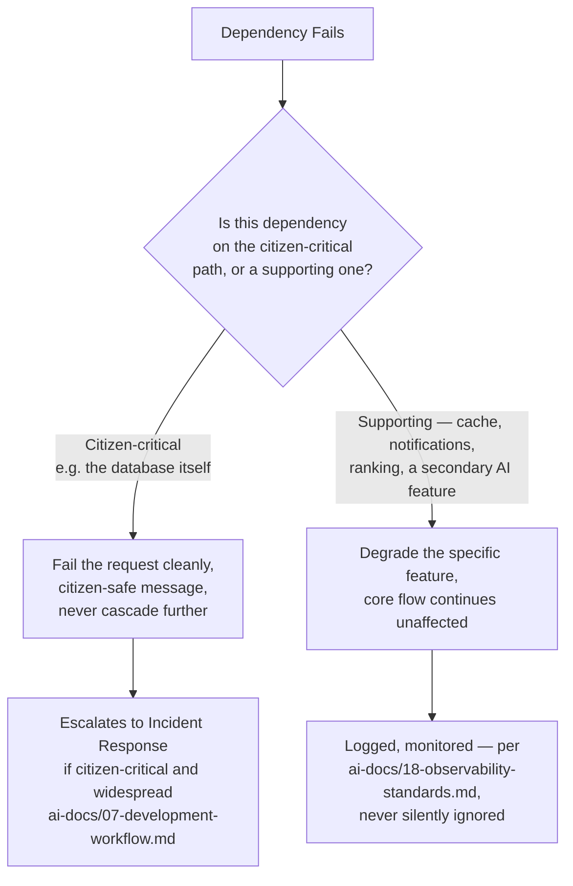

---

# Security Considerations

Error handling is one of the largest, most easily overlooked attack surfaces in any system — a well-intentioned, verbose error message is frequently the fastest path to information disclosure. This section extends the Error Responses standard already established in `ai-docs/10-security-standards.md` and `ai-docs/13-api-design-guidelines.md`, applied specifically to the error-handling discipline itself.

### No Sensitive Information in User-Facing Errors

A citizen-facing error message never contains: a database engine name or version, an internal file path, a stack trace, an internal service or module name, a raw exception class name, a SQL fragment, or any Restricted/Confidential-tier data (per the Data Classification table in `ai-docs/10-security-standards.md`) belonging to the citizen or any other actor. Every `ApplicationError`'s `message` field is, by construction (per the Exception Hierarchy above), already written in citizen-safe language at the moment the exception is authored — there is no separate "sanitization pass" required at the API boundary because the unsafe detail was never placed in a citizen-facing field to begin with.

### Internal vs. External Messages

Every `ApplicationError` carries two distinct pieces of information, deliberately kept separate:

| Field | Audience | Content |
|---|---|---|
| `message` | Citizen/client-facing (returned in the API error envelope) | Plain, actionable, always safe to display, per User-Centric Error Messages above. |
| `context` / `cause` | Internal only (never serialized into an API response; consumed exclusively by the structured logging pipeline per `ai-docs/19-logging-standards.md`) | Full technical detail — the original exception, internal identifiers, query fragments — exactly the detail an engineer needs to diagnose the failure. |

This two-field design is what makes it structurally impossible for a correctly-authored `ApplicationError` to leak internal detail through the standard error-response mapping (`errorResponseMapper.ts` above) — the mapper only ever reads `code` and `message`, never `context` or `cause`.

### Stack Traces

A stack trace is **never** present in any response reachable by a client, in **any** environment — including Development and Staging, per the Environment Isolation discipline already established in `ai-docs/10-security-standards.md` and `ai-docs/16-deployment-standards.md` — since a habit formed in a "safe" lower environment is the single most common cause of an accidental production leak. A stack trace exists exclusively inside the structured log entry the error produces, governed entirely by `ai-docs/19-logging-standards.md`.

### Error Sanitization

Where an error's `context` object is genuinely at risk of accidentally capturing a sensitive field (e.g., a validation error's `details` echoing back part of a request that happened to include a password field, per a client error), the same automated scrubbing safeguard already established in `ai-docs/19-logging-standards.md`'s Sensitive Data Policy applies as a second line of defense — error handling code is never trusted alone to avoid capturing a sensitive value; the shared logging/error-serialization pipeline scrubs defensively regardless.

### Enumeration and Timing Attacks

Per the OWASP-mapped Threat Model already established in `ai-docs/10-security-standards.md`: an authentication or authorization error never discloses *which specific check* failed in a way that would help an attacker enumerate valid accounts or resource IDs (e.g., "no such citizen" vs. "wrong password" are both collapsed into the identical `AUTHENTICATION_REQUIRED` response), and — where a timing difference between two failure paths could itself leak information (a database lookup that only happens for a valid citizen ID) — the two paths are made timing-equivalent, per the same threat-modeling discipline already established there.

### Error Sanitization in Logs vs. Responses

To avoid any ambiguity: **sanitization for a citizen-facing response and scrubbing for a log entry are two distinct controls, applied at two distinct points, for two distinct audiences** — this document governs the former (never place unsafe detail in `message`); `ai-docs/19-logging-standards.md` governs the latter (automatically scrub any sensitive value that does end up in a log's `context`/`metadata`). Neither substitutes for the other.

---

# Engineering Review Checklist

Every pull request introducing or modifying error-handling logic — a new exception type, a new `try/catch`, a retry policy, a circuit breaker, or an API error mapping — is checked against the following before merge:

- [ ] **Correct category assigned** — Every new exception extends the correct base class in the Exception Hierarchy, with `category` and `isOperational` set correctly per the Error Taxonomy table.
- [ ] **No untyped errors** — No `throw new Error("...")`; every thrown value is a typed `ApplicationError` subclass.
- [ ] **No silent failures** — No empty `catch {}`, no `.catch(() => {})`, no caught-and-ignored rejection; every catch clause recovers, translates-and-rethrows, or is not written.
- [ ] **Root cause preserved** — Every translated/rethrown error carries its original exception as `cause`.
- [ ] **Correct layer performed the translation** — A raw driver/SDK exception is translated to a typed error at the Infrastructure boundary, never allowed to reach the Application or Presentation layer undisguised.
- [ ] **Citizen-safe message** — Every `ApplicationError`'s `message` field is plain-language, actionable, and contains zero internal/technical/sensitive detail.
- [ ] **Correct HTTP status mapping** — The error's category maps to the correct status code per the table in API Error Responses, consistent with `ai-docs/13-api-design-guidelines.md`.
- [ ] **Retryability correctly determined** — A retry is applied only to a category marked Retryable in the Error Taxonomy table, and only to an idempotent (or idempotency-keyed) operation.
- [ ] **Backoff and jitter present** — Any retry loop uses exponential backoff with jitter and a hard-capped maximum attempt count, never a fixed delay or an unbounded loop.
- [ ] **Circuit breaker applied where appropriate** — Every external integration and any identified high-risk internal synchronous dependency is protected by a circuit breaker, configured per-dependency, never a shared global default.
- [ ] **Explicit, bounded timeout** — Every synchronous call (HTTP, DB, cache, queue, external API) has an explicit timeout appropriate to its class, never a library default left unexamined.
- [ ] **Graceful degradation designed, not improvised** — Any new dependency on a non-critical service has a documented fallback behavior reviewed at design time, per the Graceful Degradation section.
- [ ] **No sensitive data in citizen-facing fields** — No stack trace, internal identifier, database detail, or Restricted/Confidential-tier data appears in `error.message` or any client-reachable field, in any environment.
- [ ] **Security-sensitive paths reviewed** — Any change to authentication/authorization error handling has been reviewed for enumeration/timing-attack risk, per `ai-docs/10-security-standards.md`.
- [ ] **Tested per the Testing Standards** — A regression test exists proving the specific error condition is thrown/handled correctly, per the Exception Handling standard in `ai-docs/15-testing-standards.md`.
- [ ] **Logging deferred correctly** — The change does not redefine a log format, level, or field — it only ensures the correct, existing logging pipeline (`ai-docs/19-logging-standards.md`) is invoked with the correct typed error.
- [ ] **Observability deferred correctly** — The change does not redefine a metric, span, or alert — it only ensures the resulting failure is visible to the existing instrumentation layer (`ai-docs/18-observability-standards.md`).

A pull request failing any item above is not merged until resolved — this checklist carries the same non-negotiable authority as every other review checklist established in the preceding twenty phase documents.

---

# Relationship to Logging Standards

`ai-docs/19-logging-standards.md` (Phase 20) answers **"what exactly happened, and how is it safely, permanently recorded?"** — the JSON schema, the log level taken as a given input from this document's `isOperational` classification, the correlation-ID fields, the sensitive-data scrubbing, and the category-specific retention window.

This document, `ai-docs/20-error-handling-standards.md` (Phase 21), answers **"what should happen the moment something goes wrong?"** — how the failure is classified, whether it is recovered from, retried, circuit-broken, or degraded around, and what a caller is ultimately told.

Neither document duplicates the other. Every `ApplicationError` this document defines is, at the moment it is finally handled or propagated to a response boundary, logged through the exact structured pipeline `ai-docs/19-logging-standards.md` governs — this document supplies the *decision* (what category, what `isOperational` value, what level of severity the failure represents); `ai-docs/19-logging-standards.md` supplies the *record* (the exact JSON shape, the exact field names, the exact retention policy that log entry is subject to). A reviewer citing "Phase 20" is discussing whether an error's classification, propagation, retry, and citizen-facing message are correct; a reviewer citing "Phase 19" is discussing whether the resulting log line is correctly structured, safely redacted, and retained per policy. Together, they are the complete answer to "when Arwal fails — and it will — does the team know exactly what happened, and did the citizen experience that failure with dignity, safety, and an honest, actionable answer."

---

# Closing Statement

> **Callout — Closing Statement**
> Every preceding phase document described how Arwal behaves when everything goes right — a correct architecture, a disciplined codebase, a secure and performant and accessible platform, a proven, deployed, observed, and logged system. This document describes the one certainty that outlasts all of that discipline: things will still go wrong, every day, at every layer, for as long as Arwal exists. A payment gateway will time out. A citizen will submit a malformed request. A database connection pool will briefly saturate under an unexpected surge. What determines whether a district trusts Arwal for a generation is not whether these moments happen — they always will — it is whether every one of them is met with the same deliberate, tested, citizen-respecting discipline: classified correctly, recovered from where it is genuinely safe to, retried only when retrying cannot cause harm, degraded around gracefully where a citizen's core need can still be served, and — when nothing else is possible — explained honestly, safely, and actionably to the person waiting for an answer. A system that never fails does not exist; a system whose failures are always handled with this much care is the only kind of infrastructure a citizen's booking, payment, and government application can safely depend on, for every one of the ~300 micro-phases still ahead. Where a future phase must deviate from a standard stated here, that deviation is made explicitly — through a documented, reviewed exception, or an Architectural Decision Record where the deviation is structural — never silently, and never by default.

This document, `ai-docs/20-error-handling-standards.md`, is Phase 21 of approximately 300. Every exception thrown, every retry attempted, every circuit breaker tripped, and every error message a citizen ever sees in the phases that follow is expected to satisfy the standards defined here, or to justify its deviation in writing.

**End of Phase 21 — `ai-docs/20-error-handling-standards.md`**