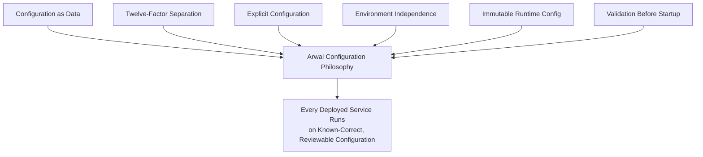
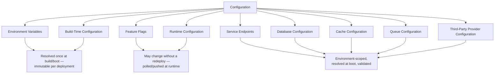
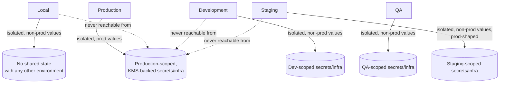
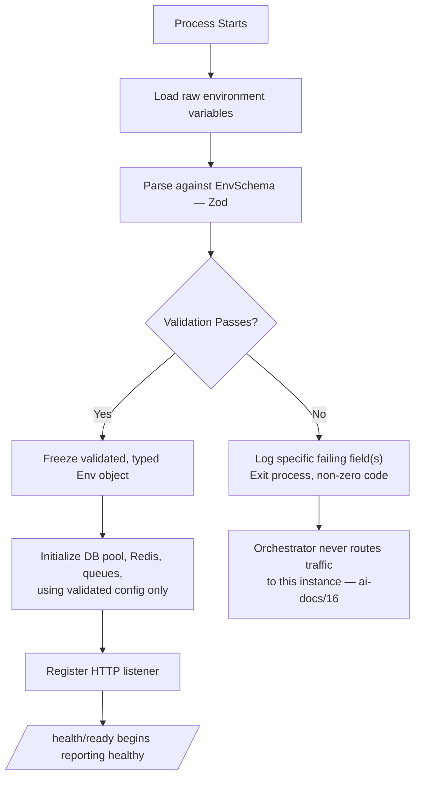
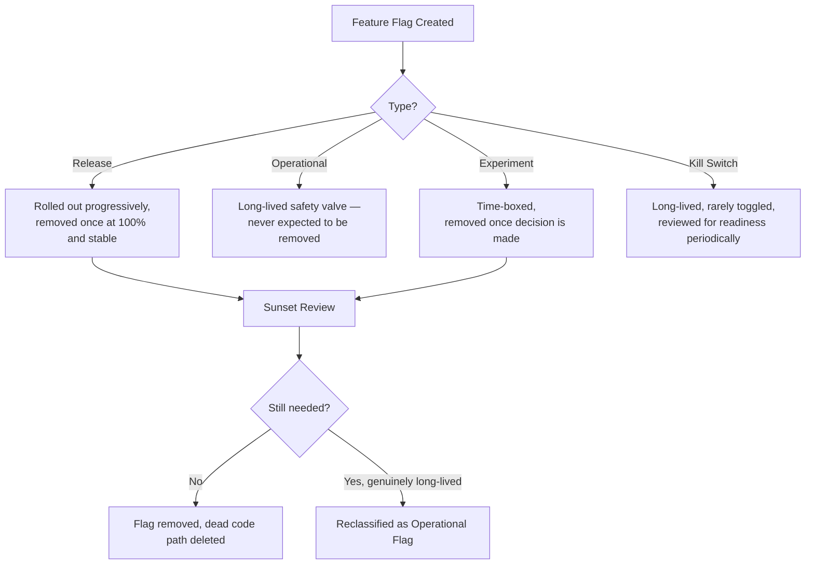
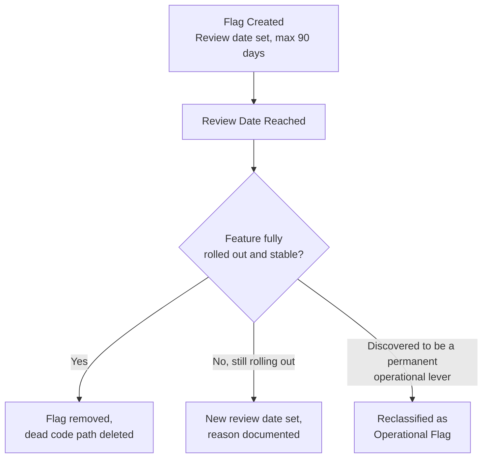
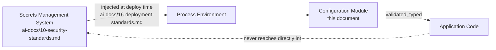
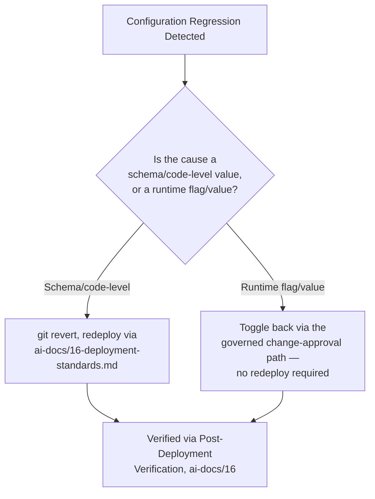
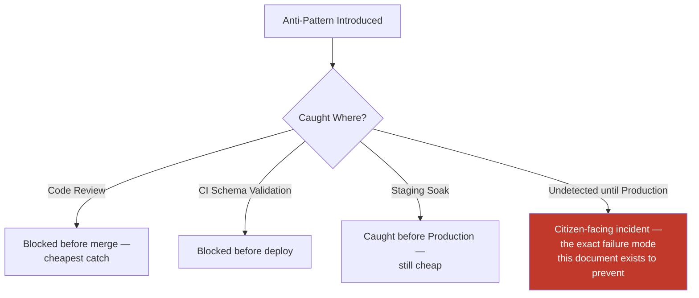

# Configuration Management Standards

**Document:** `ai-docs/21-configuration-management-standards.md`
**Project:** Arwal — The District Super App
**Stage:** 1 — Foundation
**Phase:** 22 — Configuration Management Standards
**Status:** Approved for Engineering Reference
**Audience:** Architects, Backend Engineers, Frontend Engineers, DevOps Engineers, SRE, Security Engineers, QA Engineers, Technical Reviewers, Government Technical Partners

> **Callout — Purpose of This Document**
> `ai-docs/00-project-vision.md` defined why Arwal exists. `ai-docs/01-product-goals.md` defined what Arwal must achieve. `ai-docs/02-engineering-principles.md` defined how engineers reason about design. `ai-docs/03-system-architecture-principles.md` defined how the system is structured. `ai-docs/04-folder-guidelines.md` defined where that structure physically lives. `ai-docs/05-coding-standards.md` defined how individual lines of code are written. `ai-docs/06-git-workflow.md` defined how change moves through version control. `ai-docs/07-development-workflow.md` defined how a day of engineering work unfolds. `ai-docs/08-definition-of-done.md` defined when a piece of work is actually finished. `ai-docs/09-tech-stack.md` named the concrete technologies everything is built from. `ai-docs/10-security-standards.md` defined the enforceable security standard those technologies must satisfy. `ai-docs/11-performance-standards.md` defined the enforceable performance standard those technologies must satisfy. `ai-docs/12-accessibility-standards.md` defined the enforceable accessibility standard every screen must satisfy. `ai-docs/13-api-design-guidelines.md` defined the enforceable API contract standard every endpoint must satisfy. `ai-docs/14-database-design-guidelines.md` defined the enforceable schema standard every table must satisfy. `ai-docs/15-testing-standards.md` defined how every one of those standards is proven, automatically, before a citizen depends on it. `ai-docs/16-deployment-standards.md` defined where deployments run and how they are kept safe. `ai-docs/17-cicd-standards.md` defined the automated machinery that turns a commit into a deployable artifact. `ai-docs/18-observability-standards.md` defined how Arwal sees itself in aggregate. `ai-docs/19-logging-standards.md` defined the single, precise unit of evidence underneath all of it. `ai-docs/20-error-handling-standards.md` defined what happens the moment something goes wrong. This document defines **the discipline governing everything that shapes Arwal's behavior without being code** — every environment variable, feature flag, runtime setting, and service endpoint, and exactly how each is created, validated, secured, versioned, and loaded, for every one of the ~300 micro-phases still ahead.

---

# Purpose of this Document

### Why Configuration Management Exists

Every phase document preceding this one assumes a working, correctly-configured system underneath it. `ai-docs/16-deployment-standards.md`'s Configuration Management section establishes that every environment has its own explicitly typed, validated configuration; `ai-docs/09-tech-stack.md` names Zod as the shared validation mechanism; `ai-docs/04-folder-guidelines.md` gives configuration a physical home (`configs/`, `apps/<app>/src/config/`). What none of those documents does — because it is not their job to — is define, in one place, **the complete discipline of configuration itself**: what belongs in configuration versus code, how a configuration value is named, typed, validated, and defaulted, how a feature flag is born and retired, and how a secret is referenced without ever being confused with a configuration value.

Configuration is the quietest, most under-governed surface in most large systems, precisely because it does not compile, does not get a code review comment about SOLID, and does not fail a unit test the way business logic does. A misconfigured `DATABASE_URL`, a feature flag left permanently on "for now," or a hardcoded district identifier buried three files deep in `commerce/` are not exotic failure modes — they are the *default* outcome of a codebase that treats configuration as an afterthought rather than a governed discipline. At Arwal's scale — a Modular Monolith trending toward independently deployed services, ~18 business domains, five environments, and a ~300-phase roadmap — an ungoverned configuration surface is a silent, compounding liability exactly of the kind `ai-docs/02-engineering-principles.md`'s founding purpose exists to prevent.

### Configuration vs. Code

Code expresses **behavior that is true regardless of where it runs** — how a booking is priced, how a cancellation window is enforced. Configuration expresses **facts that are true only for a specific place, time, or deployment** — which database to connect to, which payment gateway is active, whether a feature is turned on for this cohort of citizens today. The test is always the same one `ai-docs/02-engineering-principles.md` applies to DRY: *if this value changes when the environment, the district, or the deployment changes, but the behavior it triggers does not, it is configuration; if the behavior itself must change, it is code.* Conflating the two — hardcoding an environment-specific value into code, or expressing a business rule as a mutable runtime flag — is a design smell this document exists to eliminate on both sides.

### Immutable Configuration Philosophy

Per the Immutable Infrastructure principle already established in `ai-docs/16-deployment-standards.md`, a running service's configuration is never mutated in place after startup — a "change" to build-time or startup-resolved configuration is always a new deployment carrying the new value, never a live edit to a running process's environment. Configuration that is genuinely expected to change without a redeploy (a feature flag, a rate-limit threshold) is deliberately modeled as **runtime configuration**, sourced from a dedicated, observable configuration service — never as a mutable in-memory variable an engineer patches by hand during an incident. This distinction — build-time/startup-resolved configuration is immutable per deployment; only explicitly-designated runtime configuration may change without one — is the organizing principle behind every category defined in this document.

### Relationship with Deployment Standards

`ai-docs/16-deployment-standards.md` governs **where** configuration is consumed — which environment, on which infrastructure, injected at which point in the deployment pipeline — and already establishes the top-level rules this document does not repeat: configuration is validated at boot, secrets are sourced from the secrets-management system, and configuration drift between documented and deployed state is a defect. This document governs **the configuration itself** — its categories, its naming, its typing, its validation schema, its versioning, and its review discipline — the substance that `ai-docs/16-deployment-standards.md`'s deployment mechanics carry into a running environment. Where this document says "injected at deploy time," the *mechanics* of that injection belong entirely to `ai-docs/16-deployment-standards.md` and `ai-docs/17-cicd-standards.md`, never redefined here.

### Relationship with Security Standards

`ai-docs/10-security-standards.md` governs the full discipline of **secrets** — encryption, key management, rotation cadence, least-privilege access to the secrets store itself. This document governs the discipline of **configuration**, and treats secrets as a distinct, security-owned category that configuration only ever *references*, never *contains* (see Secrets Management below). Wherever this document touches a secret-adjacent concern, it defers entirely to `ai-docs/10-security-standards.md` and does not restate or reinterpret that document's rules — this document's only responsibility is ensuring configuration code never becomes a backdoor around the discipline `ai-docs/10-security-standards.md` already requires.

---

# Configuration Philosophy

Arwal's configuration management rests on six commitments. Together they answer the question every subsequent section of this document exists to make concrete: **what does "configuration is trustworthy" actually require, by default, before a single environment variable is read?**

### Configuration as Data

Configuration is treated as **data with a schema**, never as loosely-typed strings scattered through `process.env` reads. Every configuration value has a name, a type, a validation rule, and — where applicable — a default, defined once in a single, authoritative schema per app, per the Single Source of Truth principle already established in `ai-docs/02-engineering-principles.md`. Configuration-as-data is what makes configuration *reviewable*: a schema change is a diff a reviewer can read, exactly as a database migration (`ai-docs/14-database-design-guidelines.md`) or an API contract change (`ai-docs/13-api-design-guidelines.md`) is.

### The Twelve-Factor App

Arwal's configuration discipline is explicitly grounded in the [Twelve-Factor App](https://12factor.net/) methodology's Config factor — **strict separation of configuration from code** — chosen because it is a widely adopted, well-understood, and battle-tested standard, consistent with the Open Standards criterion already established in `ai-docs/09-tech-stack.md`. Three of its principles are load-bearing for everything that follows in this document:

| Twelve-Factor Principle | Arwal's Application |
|---|---|
| **Store config in the environment** | Every environment-specific value (a connection string, a feature-flag default, an API base URL) is injected via environment variables or a runtime configuration service — never hardcoded, never committed as a literal. |
| **Strict separation from code** | The *same build artifact* (per the Immutable Artifacts principle in `ai-docs/17-cicd-standards.md`) is deployed to every environment; only its injected configuration differs. A service is never rebuilt "for staging" versus "for production." |
| **No grouping of config into named environments inside the codebase** | Arwal does not maintain an `if (env === "production")` branch scattered through business logic to encode environment-specific behavior — differences are expressed entirely as configuration *values*, never as environment-conditional *code paths*, per Environment Independence below. |

### Explicit Configuration

Nothing about Arwal's runtime behavior is implicit where it could be explicit, per the Explicitness principle already established in `ai-docs/05-coding-standards.md`, applied here to configuration specifically: every value a service depends on is named, typed, and declared in that service's configuration schema — never silently inferred, never read ad hoc from `process.env.SOME_VAR` scattered through business logic where its existence and shape are invisible to anyone not reading that exact line.

### Environment Independence

Application code is never aware of *which* environment it is running in beyond a single, explicit `environment` configuration value used only for the narrow, legitimate purposes of telemetry tagging (per `ai-docs/18-observability-standards.md`'s `deployment.environment` resource attribute) and configuration-source selection. Business logic never branches on environment name — a citizen's booking is priced identically whether the request happens to be served from Staging or Production; only the *data* the code operates on (which database, which payment gateway, which feature-flag state) differs, never the *logic itself*.

### Immutable Runtime Configuration

Per the Immutable Configuration Philosophy established above, a service's resolved, boot-time configuration is treated as a frozen snapshot for the life of that process — read once at startup, validated, and never re-read from the environment mid-process. A value that must be able to change without a redeploy is explicitly modeled as **runtime configuration** (see Configuration Categories below), sourced through its own dedicated, polled-or-pushed mechanism — never by a service re-reading `process.env` on every request, which would make configuration state non-deterministic and untestable, violating the Deterministic Testing principle already established in `ai-docs/15-testing-standards.md`.

### Validation Before Startup

A service **never** starts in a partially or incorrectly configured state, per the Configuration Validation standard already established in `ai-docs/16-deployment-standards.md`. Every configuration value is schema-validated (Zod, per `ai-docs/09-tech-stack.md`) at process boot, before the service accepts a single request — a missing required variable, a malformed connection string, or a value outside its declared valid range is a **boot-blocking failure**, surfaced immediately and loudly in the deployment pipeline's health checks (`ai-docs/16-deployment-standards.md`), never allowed to degrade into a subtle runtime defect discovered later by a citizen.



> **Callout — The One-Sentence Configuration Philosophy**
> *"Configuration is not an escape hatch from code review — it is data with a schema, and a service that cannot prove its configuration is valid has no business accepting a citizen's request."*

---

# Configuration Categories

Configuration is classified explicitly into nine categories, mirroring the never-one-blunt-mechanism discipline already established for State Management (`ai-docs/02-engineering-principles.md`) and Caching (`ai-docs/11-performance-standards.md`), applied here to configuration itself. Each category has a distinct mutability profile, source, and review discipline.



| Category | Mutability | Resolved | Typical Source |
|---|---|---|---|
| **Environment Variables** | Immutable per deployment | Process boot | `.env.<environment>`-derived, injected via the secrets/config system (`ai-docs/16-deployment-standards.md`) |
| **Feature Flags** | May change without a redeploy | Runtime, polled/pushed | Shared feature-flag/configuration service |
| **Runtime Configuration** | May change without a redeploy | Runtime, polled/pushed | Shared feature-flag/configuration service |
| **Build-Time Configuration** | Immutable — baked into the artifact | Build/compile time | `packages/config` presets, `.env.*.example`-templated build variables |
| **Service Endpoints** | Immutable per deployment | Process boot | Environment variables, validated URL format |
| **Database Configuration** | Immutable per deployment | Process boot | Environment variables + secrets system |
| **Cache Configuration** | Immutable per deployment | Process boot | Environment variables + secrets system |
| **Queue Configuration** | Immutable per deployment | Process boot | Environment variables + secrets system |
| **Third-Party Providers** | Immutable per deployment (credentials); flag-gated (which provider is active) | Process boot + runtime | Environment variables + secrets system + feature flags |

### Environment Variables

The foundational configuration primitive — a named, typed, environment-scoped value injected into a process at boot. Every other category *except* Feature Flags and Runtime Configuration is, mechanically, expressed as one or more environment variables at the point a service reads it; this category is the generic case, and the categories below are its specialized, business-meaningful applications. See Environment Variables below for the full naming and validation standard.

### Feature Flags

A named, boolean-or-multivariate toggle controlling whether a specific piece of already-deployed code is active for a given actor, cohort, or all citizens — the mechanism that decouples *deployment* from *release*, per the Feature Flag Releases strategy already established in `ai-docs/16-deployment-standards.md`. Feature flags are the one configuration category explicitly designed to change frequently, deliberately, and without a redeploy. See Feature Flags below for the full taxonomy.

### Runtime Configuration

A value that is not a feature toggle but is still legitimately expected to change without a redeploy — a rate-limit threshold, a cancellation-window duration, a district-specific display setting. Runtime configuration is served through the same shared configuration service as feature flags (`ai-docs/04-folder-guidelines.md`'s `configs/` and each app's `config/runtime.ts`), consumed identically, and held to the identical review and auditability discipline as a feature flag — the two categories are siblings, distinguished only by *what kind of value* they carry (a toggle vs. an arbitrary typed value), never by how they are governed.

### Build-Time Configuration

Values resolved once, at compile/build time, and baked immutably into the resulting artifact — a frontend's public API base URL for static asset generation, a bundler's target environment, a `packages/config`-defined lint/TypeScript preset. Build-time configuration can never be changed without producing a new build, per Immutable Artifacts (`ai-docs/17-cicd-standards.md`) — this is the category most easily confused with an environment variable, and the distinguishing test is: *does changing this value require a new build, or can the identical artifact simply be redeployed with a different injected value?* If the former, it is build-time configuration; if the latter, it is a boot-time environment variable.

### Service Endpoints

The set of URLs and hostnames a service uses to reach another internal service, the API Gateway, or a shared platform service (`ai-docs/03-system-architecture-principles.md`) — e.g., the Notifications shared service's internal base URL. Service endpoints are environment-scoped (Development's endpoints differ from Production's) and are never hardcoded, since a hardcoded endpoint is precisely the kind of environment-conditional code path Environment Independence above forbids.

### Database Configuration

Connection strings, pool sizing (per the PgBouncer discipline in `ai-docs/09-tech-stack.md` and `ai-docs/11-performance-standards.md`), and statement timeout settings (per the Timeouts standard in `ai-docs/20-error-handling-standards.md`). The connection string's credential component is a **secret reference**, never a literal, per Secrets Management below; the pool-sizing and timeout values are ordinary, non-secret environment variables.

### Cache Configuration

Redis connection details, TTL defaults per data class (per the TTL Strategy already established in `ai-docs/11-performance-standards.md`), and per-role connection pool sizing (cache/session/queue, per the Bulkheading principle in `ai-docs/03-system-architecture-principles.md` and `ai-docs/09-tech-stack.md`). Identical credential-vs-setting split as Database Configuration above.

### Queue Configuration

BullMQ connection details, per-queue concurrency settings, and retry/backoff defaults (per the Retry Strategy in `ai-docs/20-error-handling-standards.md`) — configured per job type, never as a single undifferentiated default applied blindly to every queue, per the Queue Workers standard already established in `ai-docs/11-performance-standards.md`.

### Third-Party Providers

Which concrete provider is currently active for a given `infrastructure/external/` interface (`ai-docs/09-tech-stack.md`'s Third-Party Service Policy) — e.g., which SMS provider, which payment gateway, which AI Gateway Service model provider is currently routed to. This is deliberately a **hybrid** category: the credential to reach a given provider is a secret (`ai-docs/10-security-standards.md`); *which* provider is currently active, and any per-provider rollout percentage, is expressed as a feature flag or runtime configuration value, never hardcoded — this is exactly what makes the Provider Fallback and Provider Independence mechanisms in `ai-docs/09-tech-stack.md` and `ai-docs/11-performance-standards.md` operable without a redeploy.

---

# Environment Strategy

Configuration standards apply identically in *kind* across every environment defined in `ai-docs/16-deployment-standards.md` — Local, Development, QA, Staging, Production — and differ only in *value* and in the rigor of change control applied to that environment's values. This document does not redefine what each environment is for; it defines how configuration behaves within the environment topology `ai-docs/16-deployment-standards.md` already establishes.

| Environment | Configuration Source | Secrets Source | Change Control | Validation |
|---|---|---|---|---|
| **Local** | `.env.development.local`, derived from the committed `.env.development.example` template | Local, non-production placeholder values only, per `ai-docs/06-git-workflow.md`'s Git Ignore Policy | Freely editable by the individual engineer | Full schema validation runs identically to every other environment — Local is never exempt |
| **Development** | Environment-scoped variables injected by the deployment pipeline, per `ai-docs/16-deployment-standards.md` | Environment-scoped, non-production secrets | Merged via standard PR review, no elevated approval required (per `ai-docs/16-deployment-standards.md`'s Development access policy) | Full schema validation, boot-blocking on failure |
| **QA** | Environment-scoped, promoted on the same cadence as the environment itself | Environment-scoped, non-production secrets | Standard PR review; QA-representative configuration changes flagged for QA awareness | Full schema validation |
| **Staging** | Environment-scoped, production-topology-identical shape (`ai-docs/16-deployment-standards.md`) | Environment-scoped, non-production secrets, production-shaped | Standard PR review + the same rigor as a `release/*` code change, per `ai-docs/06-git-workflow.md` | Full schema validation; a Staging soak period is expected to surface any environment-specific misconfiguration before Production |
| **Production** | Environment-scoped, injected exclusively through the approved deployment pipeline (`ai-docs/17-cicd-standards.md`) | Production-scoped, KMS-backed secrets (`ai-docs/10-security-standards.md`) | Elevated review — the same Required Approvals discipline `ai-docs/06-git-workflow.md` applies to `payments`/`identity`/`civic-services` code applies to any Production configuration change | Full schema validation; a misconfiguration is a deployment-blocking failure, never a runtime surprise |

### Environment Isolation

Per the Environment Isolation standard already established in `ai-docs/10-security-standards.md` and `ai-docs/16-deployment-standards.md`, no configuration value — and no secret — is ever shared across environment boundaries. A Staging database connection string is never valid against Production; a Development API key for a third-party sandbox is never capable of touching a production-scoped account. This isolation is enforced structurally by the secrets-management system's own environment-scoped credential issuance (`ai-docs/10-security-standards.md`), never by developer discipline alone — the same defense-in-depth reasoning `ai-docs/10-security-standards.md` applies throughout is applied here: a config-loading bug that accidentally reads the wrong environment's variable name must still be incapable of reaching another environment's actual infrastructure, because the credential itself was never issued with that scope.



### Configuration Parity

Every environment is defined from the **same configuration schema**, parameterized by environment-specific values — never a hand-diverged schema per environment, mirroring the Environment Reproducibility principle already established for Infrastructure as Code in `ai-docs/16-deployment-standards.md`. A configuration key that exists in Production but not in Staging (or vice versa) is a defect, caught by the same schema-validation discipline that catches a missing required variable — schema parity across environments is what makes a Staging soak period a trustworthy predictor of Production configuration behavior, exactly as topology parity does for infrastructure.

---

# Environment Variables

### Naming Conventions

Every environment variable name is `SCREAMING_SNAKE_CASE`, namespaced by a domain-meaningful prefix, and never abbreviated ambiguously — extending the Naming Standards discipline already established in `ai-docs/05-coding-standards.md` to the configuration surface specifically.

| Component | Convention | Example |
|---|---|---|
| **Prefix** | `ARWAL_<DOMAIN>_` for Arwal-specific configuration; a bare, unprefixed name only for a small, fixed set of universally-recognized conventions (`NODE_ENV`, `PORT`) that the ecosystem itself expects unprefixed | `ARWAL_DATABASE_URL`, `ARWAL_PAYMENTS_GATEWAY_TIMEOUT_MS` |
| **Module scoping** | The owning module's name appears in the prefix wherever a variable is module-specific, mirroring Data Ownership (`ai-docs/03-system-architecture-principles.md`) applied to configuration | `ARWAL_LOCAL_SERVICES_BOOKING_CUTOFF_HOURS` |
| **Units** | A numeric variable's name always states its unit explicitly — never a bare number whose meaning (seconds? milliseconds? minutes?) must be guessed | `ARWAL_PAYMENTS_GATEWAY_TIMEOUT_MS`, not `ARWAL_PAYMENTS_GATEWAY_TIMEOUT` |
| **Booleans** | Prefixed as a predicate, matching the Boolean Naming standard in `ai-docs/05-coding-standards.md` | `ARWAL_FEATURE_AI_ASSISTANT_ENABLED`, not `ARWAL_AI_ASSISTANT` |
| **Secrets** | Carry an explicit `_SECRET`/`_KEY`/`_TOKEN` suffix so a reviewer can identify a secret-shaped variable name at a glance, even before checking its source | `ARWAL_PAYMENTS_GATEWAY_API_KEY` |

### Prefixes by Category

| Prefix | Category | Example |
|---|---|---|
| `ARWAL_DATABASE_*` | Database Configuration | `ARWAL_DATABASE_URL`, `ARWAL_DATABASE_POOL_MAX` |
| `ARWAL_REDIS_*` | Cache Configuration | `ARWAL_REDIS_CACHE_URL`, `ARWAL_REDIS_SESSION_URL` |
| `ARWAL_QUEUE_*` | Queue Configuration | `ARWAL_QUEUE_BOOKING_CONCURRENCY` |
| `ARWAL_<MODULE>_*` | Module-specific runtime settings | `ARWAL_PAYMENTS_GATEWAY_TIMEOUT_MS` |
| `ARWAL_FEATURE_*` | Feature-flag default/fallback value (see Feature Flags below) | `ARWAL_FEATURE_CIVIC_ASSISTANT_ENABLED` |
| `ARWAL_ENDPOINT_*` | Service Endpoints | `ARWAL_ENDPOINT_NOTIFICATIONS_SERVICE` |
| `NODE_ENV`, `PORT` | Ecosystem-standard, unprefixed by convention | `NODE_ENV=production` |

### Required vs. Optional Variables

Every variable is explicitly declared **required** or **optional** in its owning schema — never left ambiguous. A required variable missing at boot is a hard failure, per Validation Before Startup above; an optional variable missing at boot silently resolves to its declared default, never to `undefined` propagating unpredictably through business logic.

```typescript
// apps/api/src/config/env.schema.ts — illustrative
import { z } from "zod";

export const EnvSchema = z.object({
  NODE_ENV: z.enum(["development", "qa", "staging", "production"]),
  PORT: z.coerce.number().int().positive().default(3000),

  ARWAL_DATABASE_URL: z.string().url(), // required — no default; a missing DB is never guessable
  ARWAL_DATABASE_POOL_MAX: z.coerce.number().int().positive().default(10), // optional, sane default

  ARWAL_REDIS_CACHE_URL: z.string().url(),
  ARWAL_REDIS_SESSION_URL: z.string().url(),

  ARWAL_PAYMENTS_GATEWAY_API_KEY: z.string().min(1), // required, sourced from secrets system
  ARWAL_PAYMENTS_GATEWAY_TIMEOUT_MS: z.coerce.number().int().positive().max(5000).default(2000),

  ARWAL_ENDPOINT_NOTIFICATIONS_SERVICE: z.string().url(),
});

export type Env = z.infer<typeof EnvSchema>;
```

### Default Values

A default is provided **only** where a genuinely sane, safe, universally-correct default exists — per Convention over Configuration (`ai-docs/02-engineering-principles.md`) applied to configuration itself. A default is never provided for a value whose "safe" default could mask a real misconfiguration (a database URL, a secret) — those are always required, with no default, so their absence fails loudly rather than silently falling back to a placeholder that happens to look valid.

| Variable Class | Default Provided? | Reasoning |
|---|---|---|
| Connection strings, credentials | **Never** | A default here would mask a genuine misconfiguration behind an apparently-working boot. |
| Timeouts, pool sizes, concurrency | **Yes, when a documented, reviewed sane value exists** | A missing timeout should fall back to a known-good value, not block every engineer's local boot over an unrelated, non-critical setting. |
| Feature-flag fallback values | **Always** — see Feature Flags below | A feature flag's fallback is the value used when the flag service itself is unreachable (Graceful Degradation, `ai-docs/20-error-handling-standards.md`), and must always be defined. |
| Environment identifier (`NODE_ENV`) | **Never** | The environment must always be explicit; defaulting it risks a service silently believing it is in a different environment than it actually is. |

### Validation Rules

Every variable's schema entry expresses every constraint that is knowable at the type level: format (URL, email, UUID), numeric bounds (a timeout must be positive and below some sane ceiling), and enum membership (an environment name must be one of the five defined in `ai-docs/16-deployment-standards.md`, never an arbitrary string). A validation rule that could catch a real misconfiguration but is omitted from the schema is treated as a review-blocking gap, per the same rigor the API Coding Standards (`ai-docs/05-coding-standards.md`) apply to a request DTO's schema.

---

# Configuration Loading

### Startup Validation

Every service parses and validates its full environment against its schema **exactly once**, at the very beginning of process boot, before any other initialization (database connection, HTTP listener, queue consumer) begins — per Validation Before Startup above and the Configuration Validation standard in `ai-docs/16-deployment-standards.md`. A validation failure throws immediately, logs the specific field(s) that failed (via the structured logging pipeline, per `ai-docs/19-logging-standards.md`, never a raw stack trace to stdout alone), and exits the process with a non-zero code — causing the deployment orchestrator's health check (`ai-docs/16-deployment-standards.md`, `ai-docs/18-observability-standards.md`) to correctly report the instance as never having become ready.



### Strong Typing

The validated environment is never re-accessed as a loosely-typed `process.env.X` string scattered through business logic — it is exposed exactly once, as a single, fully-typed `Env` object (or an equivalent NestJS `ConfigService`-wrapped type, per `ai-docs/09-tech-stack.md`), matching the Explicit Types standard already established in `ai-docs/05-coding-standards.md`. Every consumer of a configuration value receives it through this typed object, never through a raw environment read — this is what makes a configuration typo a compile-time TypeScript error rather than a runtime `undefined`.

```typescript
// Rejected — untyped, unvalidated, scattered
const timeout = parseInt(process.env.ARWAL_PAYMENTS_GATEWAY_TIMEOUT_MS ?? "2000");

// Required — read once from the validated, typed config module
constructor(private readonly config: ConfigService<Env, true>) {}

async charge(amount: Money): Promise<void> {
  const timeoutMs = this.config.get("ARWAL_PAYMENTS_GATEWAY_TIMEOUT_MS", { infer: true });
  // ...
}
```

### Fail Fast

A configuration failure is treated with the identical severity `ai-docs/20-error-handling-standards.md` assigns to a `ConfigurationError` — always `isOperational: false`, never citizen-facing (a citizen never sees a configuration error; the service simply never became ready to serve them), and never retried, since retrying against an unchanged, invalid environment reproduces the identical failure. Fail Fast at the configuration layer is the earliest possible application of the Fail Fast principle already established in `ai-docs/20-error-handling-standards.md` — a misconfiguration caught at boot costs an engineer a failed deployment; the same misconfiguration undetected until a citizen's request touches it costs far more.

### Configuration Modules

Every app (`apps/api`, `apps/workers`, `apps/web`, `apps/admin-web`) owns exactly one configuration module (`src/config/`, per `ai-docs/04-folder-guidelines.md`), which is the **sole** place `process.env` (or the frontend build-time equivalent) is ever read directly — every other file in the codebase consumes configuration exclusively through this module's exported, typed interface, per the Configuration Organization standard already established in `ai-docs/04-folder-guidelines.md`. A `process.env` read appearing anywhere outside this module is a Blocking Issue in code review, mirroring the severity already assigned to a forbidden cross-module import in `ai-docs/05-coding-standards.md`.

### Dependency Injection

In `apps/api`/`apps/workers` (NestJS, per `ai-docs/09-tech-stack.md`), the validated configuration is exposed through NestJS's own `ConfigModule`/`ConfigService`, injected via constructor injection into every consuming class — never accessed through a global singleton or a service-locator pattern, per the Dependency Injection standard already established in `ai-docs/05-coding-standards.md`. This is what makes a use case's configuration dependency explicit in its constructor signature, and what makes it trivially fakeable in a unit test (`ai-docs/15-testing-standards.md`) without needing to mutate real environment variables during a test run.

```typescript
@Injectable()
export class PaymentGatewayClient {
  constructor(
    @Inject(ConfigService) private readonly config: ConfigService<Env, true>,
  ) {}
}

// Unit test — configuration is injected, never read from a real process.env
const fakeConfig = { get: () => 2000 } as unknown as ConfigService<Env, true>;
const client = new PaymentGatewayClient(fakeConfig);
```

---

# Feature Flags

Feature flags are the deliberate, governed exception to Immutable Runtime Configuration above — a category explicitly designed to change without a redeploy, and precisely because of that power, held to a stricter lifecycle discipline than any other configuration category.

### Taxonomy

| Flag Type | Purpose | Lifetime | Example |
|---|---|---|---|
| **Release Flags** | Decouple deployment from release for a specific feature, per the Feature Flag Releases strategy in `ai-docs/16-deployment-standards.md` — toggled on for a cohort, then all citizens, once confidence is established. | Short-lived — removed once the feature reaches 100% rollout and is confirmed stable. | `ARWAL_FEATURE_NEW_BOOKING_FLOW` |
| **Operational Flags** | Give on-call responders a fast, redeploy-free lever to disable a specific capability during an incident (`ai-docs/20-error-handling-standards.md`'s Graceful Degradation), without touching the code path itself. | Long-lived — a standing operational safety valve. | `ARWAL_OPERATIONAL_DISABLE_AI_ASSISTANT` |
| **Experiment Flags** | Support an A/B or multivariate test comparing two or more behaviors for a defined cohort and a defined duration. | Short-lived — removed once the experiment concludes and a decision (adopt/reject) is made. | `ARWAL_EXPERIMENT_CHECKOUT_LAYOUT_V2` |
| **Kill Switches** | An emergency, single-purpose, binary off-switch for a specific, high-risk capability — the fastest possible mitigation path per the Feature Flag Rollback standard in `ai-docs/16-deployment-standards.md`. | Long-lived, rarely toggled, always present for any capability with a meaningful blast radius. | `ARWAL_KILLSWITCH_PAYMENTS_GATEWAY_X` |



### Flag Design Standards

- Every flag has exactly one owning team (per the Folder Ownership Rules discipline already established in `ai-docs/04-folder-guidelines.md`), recorded alongside the flag's definition.
- Every flag has a documented **fallback value** — the behavior used if the flag service is unreachable, per Graceful Degradation (`ai-docs/20-error-handling-standards.md`) — always defaulting to the **safer**, more conservative behavior (a new feature defaults *off*; a kill switch's fallback is the *disabled* state), never the reverse.
- A flag's evaluation is never blocking on the citizen-facing critical path beyond a short, bounded timeout (per the Timeouts standard in `ai-docs/20-error-handling-standards.md`) — a flag-service outage degrades to the fallback value, it never fails the request.
- Flags are never nested or combined into implicit, undocumented interaction effects (`flagA && !flagB` scattered inline) — a genuinely combined condition is itself named and evaluated as a single, explicit derived flag, per Explicitness above.

### Sunset Policy

Every Release Flag and Experiment Flag is created with an **explicit review date**, no more than 90 days out, tracked the same way a `TODO`/`FIXME` is tracked per the Technical Debt Policy already established in `ai-docs/02-engineering-principles.md` — an unreviewed, permanently-lingering release flag is exactly the kind of untracked technical debt that document explicitly forbids. At its review date, a flag is either: removed (the feature is fully rolled out and the flag's own code branch is deleted), reclassified as an Operational Flag (a genuine, permanent operational lever was discovered), or extended with a new, explicit review date and a documented reason. A flag is never left in permanent, undocumented limbo — the same "never" already established for technical debt in `ai-docs/02-engineering-principles.md` applies identically here.



---

# Secrets Management

### Separation of Secrets and Configuration

A secret is **never** a configuration value in the sense this document otherwise governs — it is a distinct, security-owned category, subject in full to the Secrets Management, Encryption, and Key Management standards already exhaustively defined in `ai-docs/10-security-standards.md`. This document does not redefine how a secret is encrypted, rotated, or access-controlled; it defines only the **boundary** between the two categories and ensures configuration-loading code never becomes an accidental bypass of `ai-docs/10-security-standards.md`'s controls.

| | Configuration | Secrets |
|---|---|---|
| **Examples** | A timeout value, a feature-flag state, a pool size, a non-sensitive endpoint URL | A database password, an API key, a signing key, a webhook secret |
| **Committed to `.env.*.example`?** | Yes — with a realistic, non-sensitive placeholder | **Never** — not even a placeholder resembling a real secret's shape |
| **Governing document** | This document | `ai-docs/10-security-standards.md` |
| **Storage** | Environment-scoped, non-encrypted-at-rest configuration store | Dedicated secrets-management system, KMS-backed, per `ai-docs/10-security-standards.md` |
| **Loaded by** | The app's configuration module, from environment variables | The same configuration module — but the *value itself* is sourced from the secrets system at deploy time, never typed inline |

### Secret References, Never Values

Configuration code **references** a secret by name — it never contains, computes, or transforms the secret's actual value. The application's configuration schema treats a secret-backed field (e.g., `ARWAL_DATABASE_URL`'s credential component) exactly like any other required string field for validation purposes, but the *actual value injected at that environment variable name* is populated by the deployment pipeline from the secrets-management system (`ai-docs/10-security-standards.md`, `ai-docs/16-deployment-standards.md`), never by this document's configuration-loading code reaching into the secrets system directly.



### Never Hardcode Credentials

No credential, API key, connection-string password, or signing key is ever written into source code, a committed config file, a `.env.*.example` template (even as a "realistic-looking" placeholder that could be mistaken for real), or a Docker image layer — per the Secrets Management principle already established in `ai-docs/02-engineering-principles.md` and enforced structurally by the Git Ignore Policy and Secret Scanning Policy in `ai-docs/06-git-workflow.md`. This document adds no new enforcement mechanism beyond affirming that configuration-loading code is itself subject to the identical secret-scanning discipline as any other source file.

### Environment-Specific Secrets

Per Environment Isolation above, a secret issued for one environment is never valid, never reused, and never even *readable* by a different environment's service identity — a Staging database password does not open Production's database, and no engineer, script, or CI job holds a credential spanning more than one environment's scope, per the Least Privilege principle already established in `ai-docs/10-security-standards.md`.

### Least Privilege

Every service's configuration-loading identity requests only the specific secrets that service genuinely needs — a service reading order data is never granted the payments schema's database credential merely because "it's configured in the same place," per Least Privilege (`ai-docs/10-security-standards.md`) applied at the configuration-access layer. This document's sole addition to that already-complete standard is procedural: a new required secret reference added to a service's configuration schema is itself a signal, reviewed at PR time, that the corresponding secrets-management grant must be provisioned with correspondingly narrow scope — a configuration schema change and a secrets-access grant are never approved independently of one another.

---

# Versioning and Change Management

### Configuration Review

Every change to a configuration schema, a `.env.*.example` template, a feature-flag definition, or a runtime-configuration default is a reviewed pull request, following the identical branch, commit, and review discipline already established in `ai-docs/06-git-workflow.md` — configuration is never treated as a lesser category of change exempt from that rigor, mirroring the explicit stance `ai-docs/16-deployment-standards.md` already takes for infrastructure code ("a misconfigured security group is exactly as capable of causing a citizen-facing incident as a defective use case").

### Change Approval

| Change Type | Required Approval |
|---|---|
| Adding a new optional configuration key with a safe default | Standard PR review (one qualified reviewer) |
| Adding a new **required** configuration key | Standard PR review + confirmation the corresponding value is provisioned in every environment before merge, since a required key with no provisioned value blocks every environment's next deployment |
| Modifying a feature flag's fallback value | Standard PR review + the flag's owning team, per Folder Ownership Rules (`ai-docs/04-folder-guidelines.md`) |
| Toggling a Production feature flag or runtime-configuration value (not a schema change — a live value change) | The same elevated review already required for `payments`/`identity`/`civic-services` changes in `ai-docs/06-git-workflow.md`, applied whenever the flag/value gates a citizen-critical flow |
| Modifying a secret **reference** (adding/removing which secret name a service depends on) | Standard PR review + a security-context reviewer, per the Elevated Review requirement in `ai-docs/06-git-workflow.md` |

### Rollback

A configuration change is rolled back exactly as any other change is, per the Rollback Standards already established in `ai-docs/16-deployment-standards.md`: a schema/code-level configuration change is reverted via a new commit (`git revert`, never a history rewrite, per `ai-docs/06-git-workflow.md`) and redeployed; a runtime-configuration or feature-flag *value* change — since it does not require a redeploy — is rolled back by toggling the value back through the same governed change-approval path, which is, per the Feature Flag Rollback standard in `ai-docs/16-deployment-standards.md`, Arwal's fastest available rollback mechanism for any citizen-facing regression traceable to a configuration value rather than a code defect.



### Auditability

Every configuration value's current state — which flags are on, what a runtime setting's current value is, what schema version a service is running against — is **reconstructable at any point in time** from Git history (for schema/code-level configuration) and from the runtime-configuration service's own change log (for flag/value changes), mirroring the Auditability by Architecture principle already established in `ai-docs/03-system-architecture-principles.md` and `ai-docs/10-security-standards.md`. A runtime-configuration or feature-flag change is never applied through an unlogged, ad hoc mechanism (a direct database edit against the flag service's own store) — every change flows through the same reviewed, auditable path, whether it is a Git-tracked schema change or a flag toggle recorded in the configuration service's own append-only change history, consistent with the Immutable Audit Trail principle already established in `ai-docs/19-logging-standards.md`.

---

# Anti-Patterns

The following patterns are explicitly rejected, regardless of how convenient they appear under deadline pressure — each is a specific, previously observed failure mode in configuration-heavy systems, called out here so Arwal does not have to relearn the lesson expensively in production.

| Anti-Pattern | Description | Why It's Rejected |
|---|---|---|
| **Hardcoded Values** | An environment-specific value (a URL, a district identifier, a fee threshold) written as a literal directly in business logic instead of sourced from configuration. | Violates Environment Independence and Twelve-Factor separation above; makes the identical build artifact incapable of running correctly in more than one environment, breaking Immutable Artifacts (`ai-docs/17-cicd-standards.md`). |
| **Hidden Defaults** | A configuration value silently defaults to a fallback deep inside a function (`value ?? "some-default"` scattered far from the schema) rather than being declared explicitly in the owning schema. | Violates Explicit Configuration above; a reviewer reading the schema alone can no longer know the true, complete set of a service's behavior-affecting defaults. |
| **Runtime Mutation** | A configuration value read from `process.env` fresh on every request, or a module-level mutable variable holding "current" configuration state that code elsewhere reassigns. | Violates Immutable Runtime Configuration above; makes configuration state non-deterministic across the life of a process, breaking Deterministic Testing (`ai-docs/15-testing-standards.md`) and making an incident investigation unable to trust "what was the config at the time of the failure." |
| **Environment Drift** | Staging's configuration schema quietly diverges from Production's — a key present in one but not the other, or a differently-typed value for the "same" setting. | Violates Configuration Parity above; destroys the entire value of a Staging soak period, since a Staging-verified release may fail in Production purely due to an un-mirrored configuration gap `ai-docs/16-deployment-standards.md`'s Staging environment exists specifically to catch. |
| **Configuration Duplication** | The same business-meaningful value (e.g., the 2-hour cancellation cutoff, per `ai-docs/02-engineering-principles.md`) expressed independently as both a hardcoded constant *and* a configuration value in different parts of the codebase. | A DRY violation (`ai-docs/02-engineering-principles.md`) applied to configuration; the two copies inevitably drift, reproducing exactly the "two different cancellation cutoffs" failure mode that document already warns against. |
| **Secrets in Configuration Files** | A real (or realistic-looking) credential committed into a `.env.*.example` template "just for this one testing session." | Directly violates `ai-docs/10-security-standards.md` and the Git Ignore/Secret Scanning Policies in `ai-docs/06-git-workflow.md` — a committed secret is compromised the instant it touches any branch, even briefly. |
| **Environment-Conditional Business Logic** | An `if (env === "production")` branch inside domain or application logic, changing *behavior* rather than merely *data* per environment. | Violates Environment Independence above; the artifact deployed to Staging is no longer provably the same logic as the artifact deployed to Production, undermining the entire premise of a pre-production soak period. |
| **Silent Optional-to-Required Drift** | A configuration key that was optional (with a default) becomes, through an undocumented code change, implicitly required — with no schema update reflecting the change. | Breaks Validation Before Startup's guarantee; a service can now boot "successfully" while silently missing behavior it actually depends on, since the schema no longer reflects the code's true requirements. |
| **Un-Sunset Feature Flags** | A Release or Experiment flag left permanently in the codebase, years after its rollout concluded, with dead `if (flag)` branches accumulating around it. | Violates the Sunset Policy above and the Technical Debt Policy in `ai-docs/02-engineering-principles.md`; a codebase littered with permanently-true-or-false flags becomes unreadable and untestable, since every reader must mentally resolve which branches are even reachable anymore. |



---

# Engineering Review Checklist

Every pull request introducing or modifying an environment variable, a feature flag, a runtime-configuration value, a service endpoint, or any app's configuration schema is checked against the following before merge:

- [ ] **Correctly categorized** — The value is placed in the correct category (Environment Variable / Feature Flag / Runtime Configuration / Build-Time Configuration / Service Endpoint / Database / Cache / Queue / Third-Party Provider) per the definitions above.
- [ ] **Configuration vs. code test applied** — The value genuinely varies by environment/deployment/cohort without changing underlying behavior; it is not, in fact, a business rule that belongs in code.
- [ ] **Naming convention followed** — `SCREAMING_SNAKE_CASE`, correctly prefixed, units stated explicitly for numeric values, boolean values prefixed as predicates.
- [ ] **Required vs. optional explicitly declared** — No ambiguous, undeclared defaulting behavior.
- [ ] **Schema-validated** — The value has an explicit Zod (or equivalent) schema entry with every knowable constraint (type, format, bounds, enum membership) expressed.
- [ ] **Default justified, or explicitly absent** — A default is present only where a genuinely safe, universal value exists; a connection string, credential, or environment identifier has no default.
- [ ] **No secret present as a plain configuration value** — Any secret-shaped value is a reference resolved through the secrets-management system (`ai-docs/10-security-standards.md`), never a literal in code, a config file, or a `.env.*.example` template.
- [ ] **Present in every environment's schema** — No Staging/Production drift; a new required key is provisioned in every environment before merge.
- [ ] **Read only through the app's configuration module** — No direct `process.env` access anywhere outside the designated configuration-loading module.
- [ ] **Injected via constructor/dependency injection** — No global singleton or service-locator access pattern.
- [ ] **Feature flags have an owning team, a fallback value, and a review date** — Per the Feature Flags taxonomy and Sunset Policy above.
- [ ] **Environment-conditional business logic avoided** — No `if (env === ...)` branch inside Domain or Application layer code; environment differences are expressed as configuration values only.
- [ ] **No configuration duplication** — The value is not already expressed elsewhere as a hardcoded constant or a second, independent configuration key.
- [ ] **Change approval matches the change's risk tier** — Per the Change Approval table above, including elevated review for Production-critical or secret-reference changes.
- [ ] **Rollback path is clear** — A schema/code change has a straightforward `git revert` path; a runtime/flag value change has a documented, governed toggle-back mechanism.
- [ ] **No deployment/CI/CD/logging/observability/error-handling/secrets-rotation logic duplicated** — Any such concern is deferred entirely to its owning phase document (`ai-docs/16`, `ai-docs/17`, `ai-docs/19`, `ai-docs/18`, `ai-docs/20`, `ai-docs/10`), never redefined here.

A pull request failing any item above is not merged until resolved — this checklist carries the same non-negotiable authority as every other review checklist established in the preceding twenty-one phase documents.

---

# Closing Statement

> **Callout — Closing Statement**
> Every preceding phase document described a dimension of how Arwal is designed, written, secured, made performant and accessible, contracted, modeled, tested, deployed, automated, observed, logged, and recovered from failure. This document describes the quiet substrate underneath all of it — the specific, named, typed, validated values that decide which database a citizen's booking is actually written to, which payment gateway processes a farmer's subsidy disbursement, and whether a new civic-assistant feature is visible to a single pilot district or to a million citizens at once. A system can be flawlessly architected and still fail a citizen because a required variable was silently missing, because a feature flag was left permanently, undocumentedly on, or because Staging's configuration quietly diverged from Production's the one time it mattered. This document exists so that configuration is never the unreviewed, untyped, unvalidated exception to everything Arwal otherwise holds itself to — it is data, with a schema, reviewed with the same rigor as a database migration or an API contract, for every one of the ~300 micro-phases still ahead. Where a future phase must deviate from a standard stated here, that deviation is made explicitly — through the Engineering Review Checklist's approval process, or an Architectural Decision Record where the deviation is structural — never silently, and never by default.

This document, `ai-docs/21-configuration-management-standards.md`, is Phase 22 of approximately 300. Every environment variable, feature flag, runtime setting, and configuration schema introduced in the phases that follow is expected to satisfy the standards defined here, or to justify its deviation in writing.

**End of Phase 22 — `ai-docs/21-configuration-management-standards.md`**