# Dependency Management Standards

**Document:** `ai-docs/22-dependency-management-standards.md`
**Project:** Arwal — The District Super App
**Stage:** 1 — Foundation
**Phase:** 23 — Dependency Management Standards
**Status:** Approved for Engineering Reference
**Audience:** Architects, Backend Engineers, Frontend Engineers, DevOps Engineers, Security Engineers, Legal/Compliance Reviewers, Technical Reviewers, Government Technical Partners

> **Callout — Purpose of This Document**
> `ai-docs/00-project-vision.md` defined why Arwal exists. `ai-docs/01-product-goals.md` defined what Arwal must achieve. `ai-docs/02-engineering-principles.md` defined how engineers reason about design. `ai-docs/03-system-architecture-principles.md` defined how the system is structured. `ai-docs/04-folder-guidelines.md` defined where that structure physically lives. `ai-docs/05-coding-standards.md` defined how individual lines of code are written. `ai-docs/06-git-workflow.md` defined how change moves through version control. `ai-docs/07-development-workflow.md` defined how a day of engineering work unfolds. `ai-docs/08-definition-of-done.md` defined when a piece of work is actually finished. `ai-docs/09-tech-stack.md` named the concrete technologies everything is built from. `ai-docs/10-security-standards.md` defined the enforceable security standard those technologies must satisfy. `ai-docs/11-performance-standards.md` defined the enforceable performance standard those technologies must satisfy. `ai-docs/12-accessibility-standards.md` through `ai-docs/21-configuration-management-standards.md` defined every other enforceable discipline governing how Arwal is built, verified, deployed, observed, and configured. This document defines **the discipline governing everything Arwal did not write itself** — every third-party package, every internal shared package, and every line of code that entered the codebase through `npm install` rather than a pull request against Arwal's own domain logic — for every one of the ~300 micro-phases still ahead.

---

# Purpose of this Document

### Why Dependency Governance Exists

Every phase document preceding this one governs code Arwal's own engineers write. This document governs code Arwal's engineers **did not write** but nonetheless ship to a million citizens, run with the same privileges as Arwal's own business logic, and depend on for correctness, security, and availability exactly as much as a hand-written `BookingService`. A dependency is not a shortcut around engineering discipline — it is a decision to trust a third party's engineering discipline instead of Arwal's own, and that decision deserves exactly the same rigor `ai-docs/09-tech-stack.md` already applies to selecting a framework, extended here to the tens of thousands of transitive packages a modern Node.js/TypeScript monorepo inevitably accumulates.

Without a disciplined, written, enforced standard, dependency management degrades exactly the way `ai-docs/02-engineering-principles.md`'s founding purpose warns an ungoverned codebase degrades: two modules import two different date-formatting libraries to solve the identical problem; a package abandoned by its maintainer three years ago quietly sits in `node_modules`, unpatched, until a citizen's data is exposed through it; an engineer under deadline pressure `npm install`s a package with 40 downloads a week because a Stack Overflow answer mentioned it. None of these are hypothetical failure modes — they are the *default* outcome of treating dependency selection as a personal, momentary convenience rather than a governed, reviewed, accountable decision.

### Dependency Sprawl

**Dependency sprawl** is the specific, compounding failure mode this document exists to prevent: a codebase's total dependency count grows unboundedly because adding a package is easy and removing one is not, because no two engineers are held to the same selection bar, and because nobody owns the question "do we actually still need this?" At Arwal's scale — a Turborepo monorepo with `apps/api`, `apps/web`, `apps/admin-web`, `apps/mobile`, `apps/workers`, and a growing `packages/*` surface, built by a team that will scale from a handful of engineers to hundreds across ~300 micro-phases — unchecked dependency sprawl produces exactly the same silent, compounding tax that `ai-docs/02-engineering-principles.md` identifies as the central risk of Arwal's entire roadmap: cost that is invisible on the day it is introduced and expensive on every day thereafter.

### Long-Term Maintainability

A dependency selected in Phase 23 is a dependency Arwal's engineers are implicitly committing to live with — patch, upgrade, work around, and eventually migrate away from — for however many of the remaining ~277 phases it survives. Per the Long-Term Stability criterion already established in `ai-docs/09-tech-stack.md`, a dependency chosen for how quickly it solves today's problem, without regard for whether it will still be a reasonable choice at Phase 250, is a liability wearing the appearance of a productivity win. This document exists to make that trade-off explicit and reviewed, every time, rather than left to an individual engineer's optimism about a package's future.

### Software Supply-Chain Security

Every dependency Arwal installs is, functionally, code Arwal runs with the same trust and privilege as its own — a compromised transitive dependency can exfiltrate secrets, inject malicious behavior into a citizen-facing build, or silently corrupt data, exactly as a compromised first-party module could. Per the Supply-Chain Attacks threat category already established in `ai-docs/10-security-standards.md`'s Threat Model, the software supply chain has grown to rival direct application-layer attack as a primary risk vector industry-wide, and Arwal's civic and financial responsibilities mean this risk is never treated as a secondary, "someone else's problem" concern.

### Relationship with Security Standards

`ai-docs/10-security-standards.md` already establishes the enforceable security controls a dependency must satisfy once it is in Arwal's codebase: Vulnerability Scanning, SBOM Generation, License Review, and Supply-Chain Protection (pinned versions, checksummed sources, no floating tags) are all defined there in full, and this document does not redefine any of them. This document governs the discipline **upstream** of those controls — how a dependency is evaluated, selected, and approved *before* it ever reaches the point where `ai-docs/10-security-standards.md`'s scanning and pinning controls apply to it, and how it is maintained, updated, and eventually retired across its lifetime inside Arwal's codebase. Where this document references a security control already defined elsewhere, it cites that document and does not restate its reasoning.

### Relationship with Configuration Standards

`ai-docs/21-configuration-management-standards.md` governs the discipline of configuration — data with a schema that shapes Arwal's behavior without being code. A dependency is neither configuration nor first-party code; it is a third, distinct category this document owns exclusively: externally-authored code Arwal chooses to depend on. Where a dependency itself requires configuration (a database client's connection pool settings, a validation library's schema options), that configuration is governed entirely by `ai-docs/21-configuration-management-standards.md`; this document governs only the decision to depend on the package in the first place, and its ongoing maintenance.

### Relationship with CI/CD

`ai-docs/17-cicd-standards.md` already defines the automated pipeline mechanics that *enforce* several of this document's standards — the Dependency Audit and License Compliance gates in its Pipeline Quality Gates table, and the Dependency Scanning stage in its DevSecOps section, are the CI/CD-layer execution of the policies this document defines. This document does not redefine a pipeline stage, a workflow file, or a required check — it defines the **policy** those already-existing pipeline mechanics enforce: which licenses are acceptable, which update cadence is required, and what evaluation a new dependency must pass before an engineer is even permitted to open a PR adding it.

---

# Dependency Philosophy

Arwal's dependency management rests on eight commitments. Together they answer the question every subsequent section of this document exists to make concrete: **what does "a dependency worth trusting" actually require, by default, before a single `npm install` is run?**

### Minimal Dependencies

Every dependency added is a dependency Arwal must patch, upgrade, audit, and eventually migrate away from — for the life of the codebase. The default posture toward any proposed new dependency is skepticism, not enthusiasm: the question is never "would this be useful?" (almost anything would be, in isolation) but "is the problem this solves significant enough, and recurring enough, to justify the total cost of ownership of a new external dependency?" This is the same YAGNI discipline already established in `ai-docs/02-engineering-principles.md`, applied specifically to the decision of what enters `package.json` rather than what enters a module's own code.

### Prefer Platform Features First

Before evaluating any third-party package, the first question is always: does the language, the runtime, or an already-approved framework already solve this? Node.js's built-in `crypto`, `fetch`, and `Intl` APIs; TypeScript's own utility types; a capability NestJS or Next.js already ships — each of these is preferred over an equivalent third-party package, because a platform feature carries none of the maintenance, security, or version-drift risk a package does, and is already covered by the Long-Term Stability guarantee `ai-docs/09-tech-stack.md` gives the platform itself.

### Quality Over Popularity

A package's weekly download count is a weak, easily-gamed signal — it reflects adoption, not quality, maintenance health, or fitness for Arwal's specific civic-and-financial-grade requirements. A smaller, more focused, better-maintained package is preferred over a more popular but poorly-maintained or overly broad alternative, per the same Quality-over-momentum reasoning already established for framework selection in `ai-docs/09-tech-stack.md`'s Technology Selection Philosophy.

### Stability Over Trends

Arwal does not chase the newest, most-discussed library of the month. A dependency's excitement in the wider developer community is not, on its own, evidence it will still be a reasonable choice at Phase 200 — per the Long-Term Stability criterion in `ai-docs/09-tech-stack.md`, a pre-1.0, single-maintainer, or unproven project is never adopted for anything on Arwal's critical path, regardless of how compelling its README looks today.

### Long-Term Maintenance Burden

Every dependency is evaluated not only for the value it delivers today, but for the ongoing cost of keeping it current, patched, and compatible with the rest of Arwal's stack across dozens of future major-version upgrades of Node.js, TypeScript, NestJS, and Next.js. A dependency with a demonstrated history of painful, breaking major-version upgrades is a standing tax on every future engineer who has to absorb that pain, and is weighed accordingly against a more stable alternative.

### Small Attack Surface

Every dependency added — and, more consequentially, every dependency it transitively pulls in — expands Arwal's software supply-chain attack surface, per the Supply-Chain Attacks threat category in `ai-docs/10-security-standards.md`. A package with a large, sprawling dependency tree of its own is a materially larger risk than a package with few or zero dependencies solving the identical problem, and this is weighed explicitly during selection (see Dependency Selection Criteria below), never treated as an invisible, unpriced cost.

### Reproducible Builds

Given the same lockfile and the same commit, a dependency install must produce byte-identical `node_modules` contents every time, on every machine, in every environment — this is the dependency-layer expression of the Reproducibility commitment already established in `ai-docs/06-git-workflow.md` and `ai-docs/17-cicd-standards.md`. A dependency management practice that permits non-deterministic installs (an unpinned version range resolving differently on two different days) undermines every downstream guarantee this project's CI/CD and deployment discipline depends on.

### Deterministic Installations

An install is deterministic when it depends only on the committed lockfile — never on network conditions, registry mirror state, or the specific moment `npm install` happens to run, per the Lockfile Policy below. Determinism is not a convenience; it is what makes a security scan, a test result, or a production incident investigation trustworthy evidence about a specific, reconstructable set of code, rather than a snapshot of whatever happened to resolve on a given day.

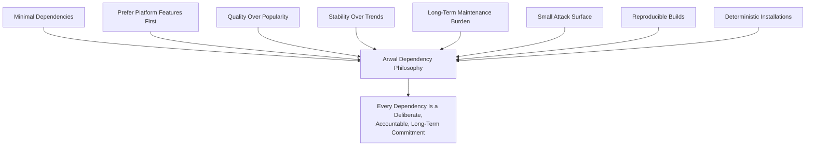

> **Callout — The One-Sentence Dependency Philosophy**
> *"A dependency is not free code — it is a standing liability Arwal agrees to carry, patch, and eventually replace, and it earns that commitment only by being demonstrably better than writing or not needing the code at all."*

---

# Dependency Classification

Every package Arwal depends on is classified into exactly one of six categories, each with a distinct purpose, distinct review bar, and distinct lifecycle — mirroring the never-one-blunt-mechanism discipline already established for State Management (`ai-docs/02-engineering-principles.md`) and Configuration (`ai-docs/21-configuration-management-standards.md`), applied here to dependencies.

| Category | Definition | Ships to Production? | Example |
|---|---|---|---|
| **Runtime Dependencies** | Code required for the application to function correctly when deployed. | Yes | `react`, `@nestjs/core`, `prisma`, `zod` |
| **Development Dependencies** | Tooling needed only during development, build, or test — never executed in a deployed artifact. | No | `typescript`, `eslint`, `vitest`, `@types/*` |
| **Peer Dependencies** | A dependency a package expects its *consumer* to provide, rather than bundling itself — used to avoid duplicate, conflicting instances of a shared library. | Indirectly, via the consumer | `react` as a peer dependency of a component library |
| **Optional Dependencies** | A dependency that enhances functionality if present but whose absence must not break the package. | Conditionally | A native binary accelerator for a compression library, with a pure-JS fallback |
| **Internal Packages** | Code owned and authored by Arwal's own engineering team, published within the monorepo workspace, per `ai-docs/04-folder-guidelines.md`. | Yes, where consumed by a deployable app | `packages/ui`, `packages/types` |
| **Shared Packages** | The subset of Internal Packages specifically designed for cross-app reuse, per the Promotion Rule in `ai-docs/04-folder-guidelines.md`. | Yes, where consumed | `packages/utils`, `packages/sdk` |

### Runtime Dependencies

A runtime dependency is code that executes as part of Arwal's deployed artifact and is therefore held to the full weight of this document's review, security, and licensing standards — a vulnerability or a license violation here is a direct, citizen-facing risk. Every runtime dependency is justified by a genuine, current need per Minimal Dependencies above, never spec­ulatively added.

### Development Dependencies

A development dependency never ships inside a production Docker image (per the Multi-Stage Builds discipline already established in `ai-docs/16-deployment-standards.md`, which strips `devDependencies` from the final runtime layer) and therefore carries a materially lower security review bar — a vulnerability in a build-time-only tool cannot be exploited by a citizen's request, though it can still compromise the CI/CD pipeline itself (see Supply Chain Security below) and is never dismissed as zero-risk.

### Peer Dependencies

A peer dependency exists to prevent two copies of a library with global or singleton state (most commonly `react`) from being bundled simultaneously by a package and its consumer — Arwal's own `packages/ui` declares `react` as a peer dependency, never a direct dependency, so every consuming app supplies exactly one shared React instance. See Peer Dependency Strategy below for the full standard.

### Optional Dependencies

Optional dependencies are used sparingly and only where a package's own architecture genuinely supports graceful absence — Arwal never depends on an optional dependency's presence for a citizen-critical code path, consistent with the Graceful Degradation principle already established in `ai-docs/20-error-handling-standards.md`.

### Internal Packages

See Internal vs. External Dependencies and Shared Internal Packages below for the full standard governing this category.

### Shared Packages

A shared package is an Internal Package that has crossed the Promotion Rule threshold in `ai-docs/04-folder-guidelines.md` — genuinely consumed by two or more apps, never promoted speculatively. See Shared Internal Packages below.

### Comparison: Review Rigor by Category

| Dimension | Runtime | Dev | Peer | Optional | Internal/Shared |
|---|---|---|---|---|---|
| **Security scan required** | Yes, full (`ai-docs/10-security-standards.md`) | Yes, but lower severity threshold | Via the declaring package | Yes, if bundled at all | N/A — reviewed as first-party code |
| **License review required** | Yes, always | Yes, always | Via the declaring package | Yes, always | N/A — Arwal-owned |
| **Approval process** | Full (see Dependency Approval Process) | Lightweight, Tech Lead sign-off | Follows the declaring package's own approval | Full | Standard code review (`ai-docs/06-git-workflow.md`) |
| **Update cadence** | Per Dependency Updates below | Batched, lower urgency | Aligned to the declaring package's requirement | Batched | Continuous, owned by the maintaining team |
| **Bundle size impact evaluated** | Yes, always | No — never shipped | Yes | Yes | Yes |

---

# Internal vs. External Dependencies

### Internal Packages

Internal packages are code Arwal's own engineers author, own, test, and version — living inside `packages/*` per the High-Level Repository Structure already established in `ai-docs/04-folder-guidelines.md`. An internal package is never subject to the External Dependency Selection Criteria below (there is no "maintenance risk" for a package Arwal's own team maintains), but is held to the identical Coding Standards (`ai-docs/05-coding-standards.md`), Testing Standards (`ai-docs/15-testing-standards.md`), and Code Review Standards (`ai-docs/06-git-workflow.md`) as every other first-party module.

| Example Internal Package | Purpose |
|---|---|
| `packages/ui` | The shared, versioned design-system component library, per `ai-docs/09-tech-stack.md` and `ai-docs/04-folder-guidelines.md`. |
| `packages/types` | Cross-app TypeScript types generated from or aligned to backend API contracts. |
| `packages/utils` | Framework-agnostic shared utility functions. |
| `packages/config` | Shared lint/TypeScript/build configuration presets. |

### External Packages

External packages are code authored, owned, and maintained entirely outside Arwal's organization — every package pulled from the npm registry. Arwal has no direct control over an external package's roadmap, quality, or continued maintenance, which is precisely why the full weight of Dependency Selection Criteria (below) applies to it and does not apply to an internal package.

| Example External Package | Purpose | Owning Vendor/Community |
|---|---|---|
| `react` | UI library, per `ai-docs/09-tech-stack.md` | Meta / open-source community |
| `@nestjs/core` | Backend application framework | NestJS core team |
| `prisma` | ORM | Prisma, Inc. |
| `zod` | Schema validation | Open-source community |

### Ownership

Every internal package has exactly one named owning team, recorded in that package's README and, where tooling supports it, in a `CODEOWNERS` entry — identical to the Folder Ownership Rules already established in `ai-docs/04-folder-guidelines.md` for `apps/api/src/modules/*`, extended here explicitly to `packages/*`. Every external dependency has exactly one named **internal sponsor** — the engineer or team that proposed and is accountable for its continued suitability — recorded in the Dependency Approval Process's record (see below), since an external package has no Arwal-internal team to "own" it in the code-authorship sense, but still requires an accountable party who notices when it needs upgrading, replacing, or removing.

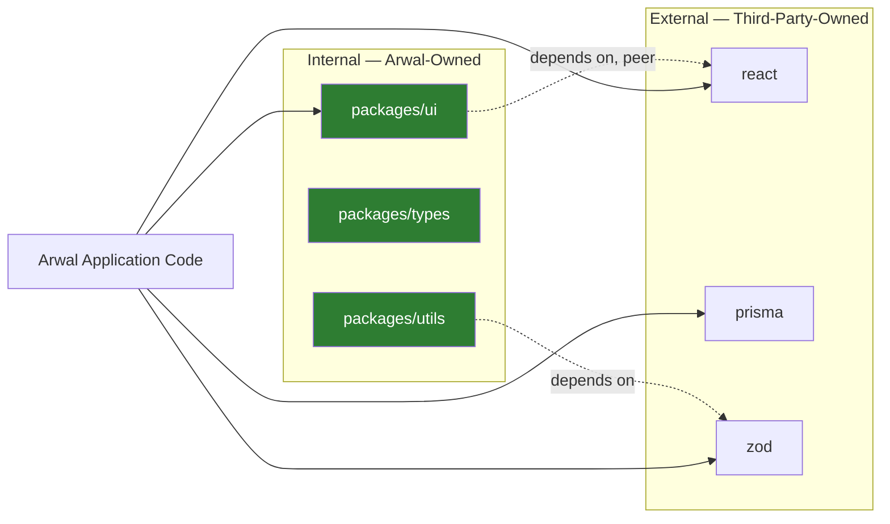

---

# Dependency Selection Criteria

Every proposed **external** dependency is evaluated against ten weighted criteria before it is eligible for approval, extending the Technology Selection Philosophy already established in `ai-docs/09-tech-stack.md` from the level of a foundational framework choice down to the level of an individual npm package.

| Criterion | What It Evaluates | Why It Matters |
|---|---|---|
| **Active Maintenance** | Commit frequency, issue-response latency, time since last release | An unmaintained package accumulates unpatched vulnerabilities and incompatibilities silently, per the Long-Term Stability criterion in `ai-docs/09-tech-stack.md`. |
| **Community Adoption** | Download volume, dependent-package count, GitHub stars *as a secondary, not primary, signal* | A larger community means more available answers, more contributors catching bugs, and a lower risk of the project going stale — weighted below Quality per the philosophy above. |
| **Documentation Quality** | Completeness of the README, API reference, migration guides | Poor documentation is a direct, compounding tax on every future engineer who must use the package without the original evaluator's context. |
| **Release Cadence** | Frequency and predictability of releases, adherence to Semantic Versioning | An erratic or absent release cadence makes it impossible to plan upgrades or trust a version range, per the Versioning Policy below. |
| **License** | Compatibility with Arwal's commercial and civic distribution model | See Open Source Licensing below — an incompatible license is an automatic disqualifier regardless of technical merit. |
| **Security History** | Past CVEs, response time to prior disclosures, presence of a security policy | A package with a pattern of severe, slowly-patched vulnerabilities is a standing supply-chain risk, per `ai-docs/10-security-standards.md`. |
| **Bundle Size** | The package's own size plus its full transitive dependency tree's size | Directly weighed against the Performance Budgets already established in `ai-docs/11-performance-standards.md` for any frontend-consumed package. |
| **Performance** | Measured runtime characteristics against Arwal's actual target conditions (`ai-docs/11-performance-standards.md`) | A technically elegant package that is slow on an entry-level Android device fails Arwal's Performance-First bar regardless of developer convenience. |
| **TypeScript Support** | First-class, native TypeScript types vs. a community-maintained `@types/*` package vs. no types at all | Per the TypeScript Standards in `ai-docs/05-coding-standards.md`, a package without reliable types is a standing `any`-shaped hole in Arwal's type safety. |
| **Long-Term Viability** | Corporate/community backing, funding model, single-maintainer risk | The same Long-Term Stability reasoning `ai-docs/09-tech-stack.md` applies to a framework choice, applied at the package level. |

### Scoring Matrix

Each criterion is scored 0–5 by the proposing engineer as part of the Dependency Approval Process (below), with weights reflecting Arwal's specific risk profile — Security History and Active Maintenance are weighted most heavily, since these are the criteria most directly tied to Arwal's civic and financial risk exposure.

| Criterion | Weight | Score (0–5) | Weighted Score |
|---|---|---|---|
| Active Maintenance | 15% | — | — |
| Community Adoption | 5% | — | — |
| Documentation Quality | 10% | — | — |
| Release Cadence | 10% | — | — |
| License | 15% (pass/fail gate — see below) | — | — |
| Security History | 15% | — | — |
| Bundle Size | 10% | — | — |
| Performance | 10% | — | — |
| TypeScript Support | 5% | — | — |
| Long-Term Viability | 5% | — | — |

A dependency scoring below **3.5 / 5.0 weighted average** is not approved without an explicit, documented, Architecture-Review-level justification for why no better-scoring alternative exists — per the same "justified, not convenient" discipline already established in `ai-docs/03-system-architecture-principles.md`'s Architectural Review Process. A dependency failing the License criterion outright (see Open Source Licensing below) is disqualified regardless of every other score.

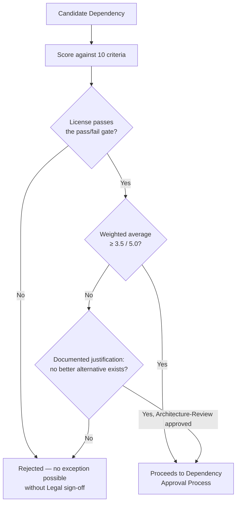

---

# Approved Dependency Sources

Every dependency is installed **exclusively** from a small, explicitly approved set of sources — an unapproved source is a Blocking Issue in code review, per the same non-negotiable severity already established for a raw SQL string or a swallowed exception in `ai-docs/05-coding-standards.md`.

| Approved Source | Used For |
|---|---|
| **The npm Registry** (`registry.npmjs.org`), accessed through Arwal's own private registry proxy/mirror | The default, overwhelming majority source for every package. |
| **Official GitHub Releases** from a project's verified, canonical repository | Used only where a package is genuinely not distributed via npm (rare — e.g., a specific binary tool), always pinned to a specific release tag/commit SHA, never a moving branch reference. |
| **Arwal's own private npm scope** (`@arwal/*`) | Every internal package, per the Internal Packages standard above, published to Arwal's own private registry namespace. |

### Explicitly Disallowed Sources

| Disallowed Source | Why |
|---|---|
| **Unknown or unofficial registry mirrors** | No provenance guarantee; a mirror can silently serve a tampered package with no way for Arwal to detect the substitution before install. |
| **Random Git repositories referenced directly in `package.json`** (`"some-lib": "github:randomuser/some-lib"`) | Bypasses the npm registry's own (imperfect but real) publishing and audit trail entirely; a repository can be force-pushed or deleted out from under a pinned reference with no registry-level immutability guarantee. |
| **Unverified, unpublished, or "borrowed" packages** copied directly into the codebase from a blog post or gist without attribution or a licensing check | Impossible to patch, impossible to audit for the original author's later security disclosures, and frequently a License violation (see Open Source Licensing below) committed unknowingly. |
| **Any package installed via a personal access token pointing at a private, unreviewed fork** | Creates an unauditable, single-point-of-failure dependency on one engineer's personal infrastructure, violating both Reproducible Builds and the Bus Factor reasoning already implicit in `ai-docs/04-folder-guidelines.md`'s Folder Ownership Rules. |

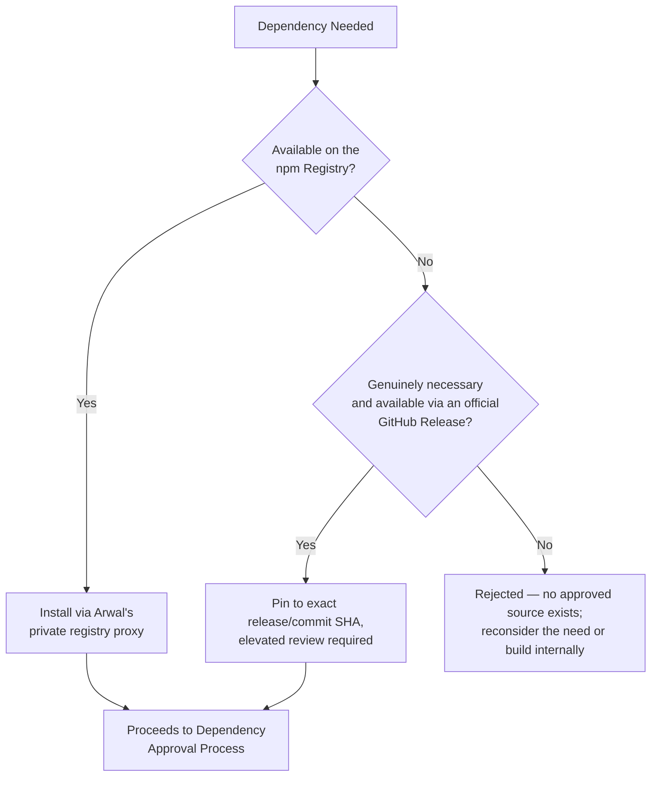

---

# Versioning Policy

### Version Range Notations

| Notation | Example | Behavior | Arwal's Policy |
|---|---|---|---|
| **Exact** | `4.18.2` | Installs exactly this version, every time, regardless of what's newer. | **Required** for any package on a citizen-critical, security-sensitive, or historically unstable-upgrade path (e.g., core framework versions, cryptography libraries). |
| **Caret (`^`)** | `^4.18.2` | Allows any version compatible with SemVer's MINOR/PATCH promise — `4.x.x`, never `5.0.0`. | **Default** for the overwhelming majority of `dependencies`, trusting the package's own SemVer discipline for non-breaking updates. |
| **Tilde (`~`)** | `~4.18.2` | Allows PATCH-level updates only — `4.18.x`, never `4.19.0`. | Used selectively where a package's own release history shows MINOR versions have, in practice, introduced unexpected breaking behavior despite SemVer claims — a documented, evidenced exception, never a blanket default. |

### Arwal's Default Policy

Arwal's default is **caret (`^`)** ranges for `dependencies` and `devDependencies` alike, trusting the npm ecosystem's SemVer convention for the common case, **combined with a committed lockfile** (see Lockfile Policy below) that pins the *actually installed* version exactly — this combination gives Arwal both flexibility (a fresh `npm install` from a clean lockfile can pick up compatible patches) and determinism (every existing checkout, every CI run, and every deployed artifact uses the exact same resolved version until the lockfile is deliberately updated).

| Dependency Class | Default Range | Rationale |
|---|---|---|
| Core framework versions (`next`, `@nestjs/core`, `react`, `typescript`) | Exact | A major-framework-version drift is exactly the kind of change `ai-docs/09-tech-stack.md`'s Major Version Upgrades standard requires deliberate, reviewed handling for — never left to an implicit caret-range resolution. |
| General runtime dependencies | Caret (`^`) | The common case; SemVer's PATCH/MINOR promise is trusted, backed by the lockfile's determinism guarantee. |
| Dev tooling (`eslint`, `prettier`, test runners) | Caret (`^`) | Lower risk profile; a tooling MINOR update rarely affects citizen-facing behavior. |
| Packages with a documented history of SemVer-violating MINOR releases | Tilde (`~`), with the specific incident documented in the dependency's approval record | A deliberate, evidenced exception per Evidence over Prediction (`ai-docs/03-system-architecture-principles.md`). |

> **Callout — Why Not Exact-Pin Everything**
> Exact-pinning every dependency sounds maximally safe but is, in practice, a maintainability trap at Arwal's scale: it turns every security patch — even a trivial, backward-compatible one — into a manual version-bump PR across potentially dozens of `package.json` files, defeating the very automation `ai-docs/17-cicd-standards.md`'s Dependency Update Workflow relies on. Caret ranges plus a committed lockfile give Arwal the *same* reproducibility guarantee (the lockfile, not the range, is what's actually installed) while keeping routine patch/minor updates a low-friction, automatable process.

---

# Semantic Versioning

Arwal requires every dependency selected to follow [Semantic Versioning](https://semver.org/) as a **selection criterion in its own right** (see Dependency Selection Criteria above) — a package with an inconsistent or undocumented versioning scheme is penalized in the scoring matrix, since Arwal's entire Versioning Policy above depends on the ecosystem's SemVer promise being honored.

### MAJOR.MINOR.PATCH

| Segment | Incremented When | Arwal's Expectation of the Package |
|---|---|---|
| **MAJOR** | A breaking, backward-incompatible change ships. | Never installed automatically by any range notation Arwal uses; always a deliberate, reviewed upgrade per Major Updates below. |
| **MINOR** | A new, backward-compatible feature ships. | Installed automatically under a caret range; assumed non-breaking, verified by CI regardless (`ai-docs/17-cicd-standards.md`). |
| **PATCH** | A backward-compatible bug fix ships. | Installed automatically under both caret and tilde ranges; the lowest-risk, most-automatable update category. |

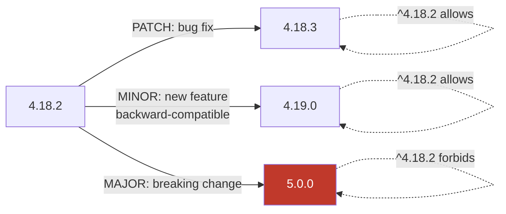

### SemVer as a Trust Contract, Not a Guarantee

Arwal treats a package's declared SemVer version as a strong signal, never an absolute guarantee — per the Testing Standards already established in `ai-docs/15-testing-standards.md`, every dependency update (even a PATCH) still passes through Arwal's full CI pipeline (`ai-docs/17-cicd-standards.md`) before merge, because a package's own SemVer discipline is outside Arwal's control and has, industry-wide, been violated by well-intentioned maintainers more than once. SemVer earns Arwal's *default trust for automation*, not an exemption from verification.

---

# Lockfile Policy

### Lockfile Purpose

A lockfile (`pnpm-lock.yaml`, per the pnpm-based monorepo tooling implied by `ai-docs/09-tech-stack.md`'s `.npm-global`/workspace conventions and `ai-docs/17-cicd-standards.md`'s `pnpm-lock.yaml`-hash cache keys) is the single, authoritative record of the **exact, fully-resolved dependency tree** — every direct and transitive package, at its exact resolved version, with its exact integrity checksum — that a given commit depends on. Where a project or historical tooling reference uses `package-lock.json` (npm's equivalent lockfile), the identical policy below applies without exception; the specific lockfile format is a Technology Adoption Process decision (`ai-docs/09-tech-stack.md`), never a policy distinction.

### Why Lockfiles Exist

Without a lockfile, a version range like `^4.18.2` in `package.json` resolves to *whatever the newest compatible version happens to be at the moment `npm install` runs* — meaning two engineers running `npm install` on the same commit, on two different days, could install two different sets of transitive dependencies, silently. This directly violates the Reproducible Builds and Deterministic Installations principles established in Dependency Philosophy above, and — more consequentially — it means a security scan, a passing test suite, or a production incident investigation is reasoning about a dependency tree that may not be the one actually running anywhere else.

### Lockfiles Must Always Be Committed

The lockfile is **always** committed to the repository, for every app and package in the monorepo sharing one root lockfile per the Monorepo Dependency Strategy below — never `.gitignore`d, never regenerated ad hoc without review, per the same Single Source of Truth principle already established in `ai-docs/02-engineering-principles.md`. A PR that modifies `package.json` without a corresponding lockfile update is a Blocking Issue, exactly as a PR modifying a Prisma schema without a corresponding migration is (`ai-docs/14-database-design-guidelines.md`).

### Frozen-Lockfile Installs

Every CI pipeline stage and every production build installs dependencies via a **frozen-lockfile** install (`pnpm install --frozen-lockfile`, per the exact standard already established in `ai-docs/17-cicd-standards.md`'s Dependency Installation pipeline stage) — an install that would require modifying the lockfile fails loudly and immediately, rather than silently resolving a different tree than what was locally tested and reviewed.

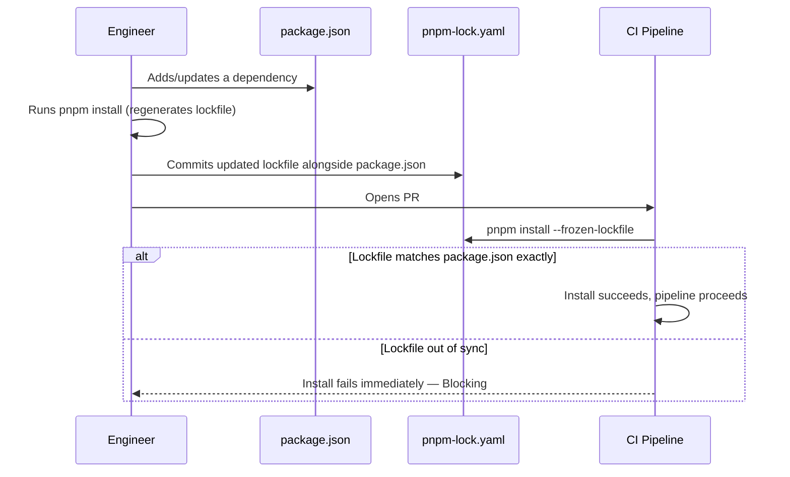

### Reproducible Builds

Because every environment (Local, Development, QA, Staging, Production, per `ai-docs/16-deployment-standards.md`) and every CI run installs from the identical, committed lockfile via a frozen install, the exact dependency tree running in Production is provably the same tree that was scanned by `ai-docs/10-security-standards.md`'s Dependency Security controls and verified by `ai-docs/15-testing-standards.md`'s test suite in CI — this is the dependency-layer completion of the Reproducibility guarantee `ai-docs/06-git-workflow.md` and `ai-docs/17-cicd-standards.md`'s Immutable Artifacts principle already establish for application code.

---

# Monorepo Dependency Strategy

Arwal's Turborepo-orchestrated monorepo (per `ai-docs/04-folder-guidelines.md`'s High-Level Repository Structure and `ai-docs/17-cicd-standards.md`'s Incremental Builds standard) requires a deliberate strategy for where a dependency is declared and how it is shared across `apps/*` and `packages/*`.

### Workspace Packages

Every `apps/*` and `packages/*` directory is its own npm **workspace**, each with its own `package.json` declaring exactly the dependencies that specific app or package directly uses — never a dependency declared only because "it's probably needed somewhere in the workspace." This mirrors the Data Ownership Principles already established in `ai-docs/03-system-architecture-principles.md`: a workspace owns its own dependency list exactly as a module owns its own schema.

### Root Dependencies

A small, deliberately minimal set of dependencies lives at the **monorepo root** `package.json` — exclusively tooling that genuinely operates across the entire workspace (Turborepo itself, the root-level TypeScript/ESLint orchestration, Husky/lint-staged for repo-wide git hooks) — never an application-level runtime dependency, which always belongs in the specific workspace that uses it.

### App Dependencies

Every `apps/*` workspace declares the runtime dependencies specific to that deployable surface — `apps/api`'s `package.json` declares `@nestjs/core` and `prisma`; `apps/web`'s declares `next` and `react`. An app never silently relies on a dependency "hoisted" from a sibling app's declaration; every dependency an app's code actually imports is explicitly declared in that app's own `package.json`, per Explicit Configuration reasoning already established in `ai-docs/21-configuration-management-standards.md`, applied here to dependency declarations.

### Shared Dependencies

A dependency genuinely used identically by multiple workspaces (e.g., `zod`, used by both `apps/api` for backend DTO validation and `apps/web` for frontend form validation, per `ai-docs/09-tech-stack.md`'s Single Source of Truth reasoning for that specific package) is declared independently in **each** consuming workspace's own `package.json`, at the same version — never assumed to be silently available via hoisting alone. Explicit declaration in every consumer is what keeps each workspace's dependency list an accurate, self-contained statement of what it actually needs, per the Package Boundaries principle below.

### Package Boundaries

A workspace's `package.json` is the single, authoritative, machine-readable statement of everything that workspace depends on — code review verifies that every import statement in a workspace's source maps to a dependency actually declared in that workspace's own `package.json` (or a workspace-local internal package), never an accidental transitive import "leaking" through pnpm's node_modules structure from an unrelated sibling package.

### Dependency Hoisting

pnpm's default, strict `node_modules` structure (as opposed to npm/Yarn's flatter hoisting model) is Arwal's chosen package manager behavior specifically **because** it prevents a workspace from accidentally resolving an undeclared, transitively-hoisted package — a workspace that imports a package it never declared in its own `package.json` fails to resolve under pnpm's strict linking, catching the Package Boundaries violation above at install time rather than allowing it to work by accident until a future dependency change silently breaks it.

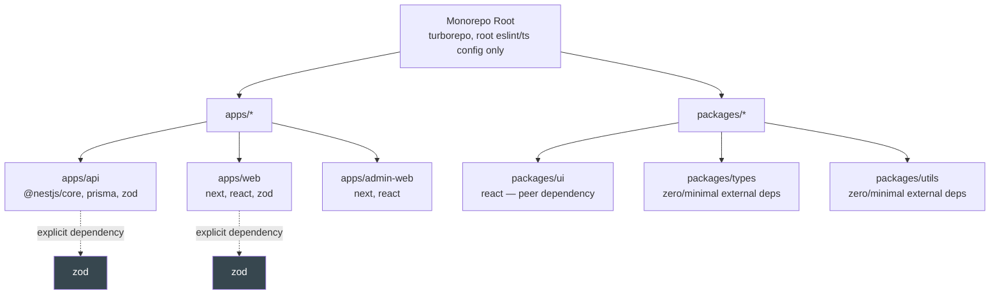

---

# Shared Internal Packages

Every internal package under `packages/*` is held to a specific, named standard, extending the Shared Package Organization table already established in `ai-docs/04-folder-guidelines.md` with the ownership and dependency-governance dimension that document does not cover.

| Package | Purpose | Dependency Philosophy | Owning Team |
|---|---|---|---|
| **`packages/ui`** | The shared, versioned design-system component library, per `ai-docs/09-tech-stack.md`. | `react` declared as a **peer dependency**, never bundled (see Peer Dependency Strategy below); every other dependency evaluated with the same rigor as an app-level dependency, since it is transitively inherited by every consuming app. | Platform/Design Systems team, per the default ownership already established in `ai-docs/04-folder-guidelines.md`. |
| **`packages/config`** | Shared lint, TypeScript, and build configuration presets. | Deliberately minimal — configuration presets should depend on almost nothing beyond the tools they configure (`eslint`, `typescript` themselves as peer dependencies). | Platform/Infrastructure team. |
| **`packages/types`** | Cross-app TypeScript types aligned to backend API contracts, per `ai-docs/04-folder-guidelines.md`. | Ideally **zero runtime dependencies** — a types-only package should compile to nothing but `.d.ts` output; any runtime dependency here is a signal the package has scope-crept beyond its stated purpose. | Backend Platform team, in coordination with API-owning teams. |
| **`packages/utils`** | Framework- and app-agnostic shared utility functions. | Minimal by design, per Minimal Dependencies above — a utility package pulling in a heavy dependency for a narrow function is scrutinized hard, since its cost multiplies across every consuming app. | Platform/Infrastructure team. |
| **`packages/eslint-config`** | The shared ESLint ruleset every app and package extends. | Depends only on ESLint itself and its plugins; never depends on an app-level framework package. | Platform/Infrastructure team. |
| **`packages/tsconfig`** | The shared base `tsconfig.json` every app and package extends, per the Strict Mode requirement in `ai-docs/05-coding-standards.md`. | Zero runtime dependencies — a `.json` configuration file has none by nature. | Platform/Infrastructure team. |

### Ownership

Every package above has exactly one named owning team, per the Ownership standard already established in Internal vs. External Dependencies above and `ai-docs/04-folder-guidelines.md`'s Folder Ownership Rules — a change to a shared package's own dependency list requires that owning team's review, since a dependency added to `packages/ui` becomes, transitively, a dependency of every app that consumes it, exactly the "blast radius" reasoning `ai-docs/03-system-architecture-principles.md` already applies to shared platform services.

### The Promotion Rule Applied to Dependencies

Consistent with the Promotion Rule already established in `ai-docs/04-folder-guidelines.md` ("code starts inside the app or module that needs it... promoted into `packages/` only once a second, genuinely independent consumer needs the same thing"), a *dependency* is added to a shared internal package only once genuinely needed by that shared package's own logic — a shared package is never used as a convenient place to "pre-install" a dependency an app team anticipates needing later, which would silently widen every consuming app's dependency tree in anticipation of a speculative future need, violating YAGNI.

---

# Dependency Approval Process

No new external dependency enters Arwal's codebase without passing through this process — an informally `npm install`ed package with no corresponding approval record is treated as a review-blocking finding, exactly as an unreviewed architectural boundary change is in `ai-docs/03-system-architecture-principles.md`, and exactly as an unapproved technology is in `ai-docs/09-tech-stack.md`'s Technology Adoption Process, which this process mirrors at the individual-package level.

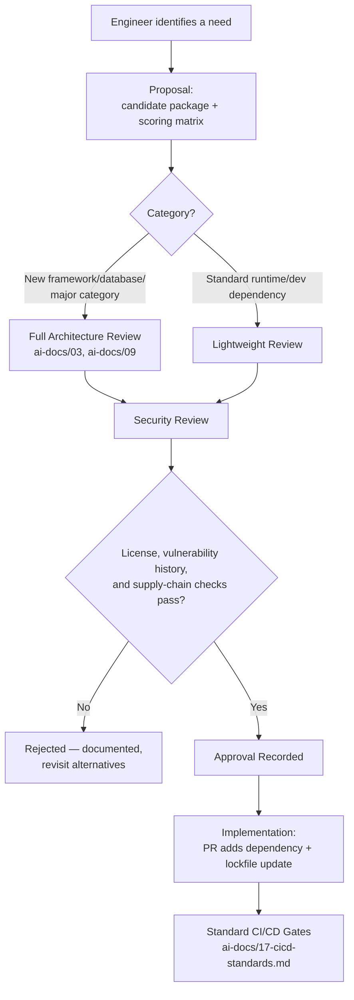

### Step-by-Step

1. **Engineer identifies a need** — A specific, current problem (per Minimal Dependencies above) that Platform Features First and Arwal's existing dependency set do not already solve.
2. **Proposal** — The engineer completes the Dependency Selection Criteria scoring matrix (above), naming the candidate package, its version, its license, and at least one alternative considered and rejected — mirroring the Proposal Requirements already established in `ai-docs/09-tech-stack.md`'s Technology Adoption Process.
3. **Architecture Review** — For a dependency introducing a genuinely new category of capability (a new database driver, a new major framework-adjacent library) or replacing an already-approved dependency, full Architecture Review is required, per the Architecture Review Workflow in `ai-docs/07-development-workflow.md`. For a routine, narrowly-scoped utility dependency within an already-established category, a lightweight Tech Lead sign-off suffices — proportional rigor, per the same principle already governing Code Review Standards in `ai-docs/02-engineering-principles.md`.
4. **Security Review** — The candidate package is checked against the Supply Chain Security and Vulnerability Management standards below — its published vulnerability history, its transitive dependency tree size, and, for any dependency touching `payments`, `identity`, or `civic-services` code paths, an elevated review from an engineer with security context, per the Required Approvals discipline already established in `ai-docs/06-git-workflow.md`.
5. **Approval** — A dependency passing every gate above is recorded as Approved (mirroring the Approved Technologies Table discipline in `ai-docs/09-tech-stack.md`, extended here to individual packages via the dependency manifest's own review history) and becomes eligible for use project-wide, not only by the original proposing engineer.
6. **Implementation** — The dependency is added via a standard PR, updating both `package.json` and the lockfile together (per Lockfile Policy above), passing through the identical CI/CD Quality Gates (`ai-docs/17-cicd-standards.md`) every other change passes through — a dependency addition is never treated as a lesser category of change exempt from standard review.

### Approval Authority Table

| Change Type | Required Approval |
|---|---|
| Adding a narrowly-scoped utility dependency within an already-established category | Tech Lead sign-off + standard PR review |
| Adding a dependency introducing a genuinely new category (new database client, new major framework-adjacent library) | Full Architecture Review + ADR, per `ai-docs/09-tech-stack.md` |
| Adding any dependency touching `payments`/`identity`/`civic-services` code paths | The above, plus a security-context reviewer, per `ai-docs/06-git-workflow.md` |
| Replacing an already-approved dependency | Full Architecture Review + migration/rollback plan, per `ai-docs/09-tech-stack.md`'s Major Version Upgrades standard |
| Adding an internal-package-only dev dependency (a test helper, a build script utility) | Standard PR review, owning team |

---

# Open Source Licensing

### Approved License Categories

Every dependency's license is checked against Arwal's approved-license allow-list **before** adoption, per the License Review standard already established in `ai-docs/10-security-standards.md` and the Technology Adoption Process in `ai-docs/09-tech-stack.md` — this document is the canonical source for the allow-list itself.

| License | Category | Arwal's Position |
|---|---|---|
| **MIT** | Permissive | Approved, no restriction. |
| **Apache License 2.0** | Permissive, with an explicit patent grant | Approved, no restriction — the patent grant is a genuine additional protection Arwal values. |
| **BSD (2-Clause / 3-Clause)** | Permissive | Approved, no restriction. |
| **ISC** | Permissive, functionally equivalent to MIT | Approved, no restriction. |

### Restricted Licenses

| License | Category | Arwal's Position |
|---|---|---|
| **GPL (v2/v3)** | Strong copyleft — requires derivative works to be released under the same license | **Restricted.** Never used in any code that is compiled/linked into Arwal's own deployed artifacts, since this would obligate Arwal to release its own proprietary application code under GPL terms — a direct conflict with Arwal's commercial sustainability commitments in `ai-docs/01-product-goals.md`. A GPL-licensed **tool** used only at build/dev time and never linked into a shipped artifact may be considered, but only with explicit Legal review (see below). |
| **AGPL (v3)** | Strong copyleft, extended to cover network/SaaS use | **Restricted, effectively prohibited** for any server-side runtime dependency — AGPL's network-use clause would obligate Arwal to release its own backend source code merely by operating a service that uses an AGPL-licensed library, which is categorically incompatible with Arwal's business model. No exception is granted without Legal sign-off and a documented, board-level risk acceptance. |
| **LGPL (v2.1/v3)** | Weak copyleft — permits linking from proprietary code under specific conditions (dynamic linking, unmodified library) | **Restricted, case-by-case.** Acceptable only where the specific linking mechanism genuinely satisfies LGPL's proprietary-linking exception (typically dynamic linking without modification) — requires Legal review to confirm Arwal's actual usage pattern qualifies, since a misjudged LGPL usage can silently become a GPL-equivalent obligation. |

### When Legal Review Is Required

| Trigger | Review Required |
|---|---|
| A dependency's license is not on the Approved list above | Mandatory Legal review before any adoption, regardless of technical merit. |
| A dependency's license terms have changed since a prior approval (a maintainer re-licensing a previously-MIT package) | Mandatory Legal re-review — an approval is never assumed to remain valid indefinitely if the underlying license itself changes. |
| A dependency bundles or depends on any GPL/AGPL/LGPL-licensed code transitively | Mandatory Legal review of the full transitive license exposure, not merely the direct dependency's own declared license. |
| A dependency's license is ambiguous, dual-licensed, or lacks a clear `LICENSE` file in its published package | Mandatory Legal review — an unclear license is treated with the same caution as a Restricted license until clarified. |

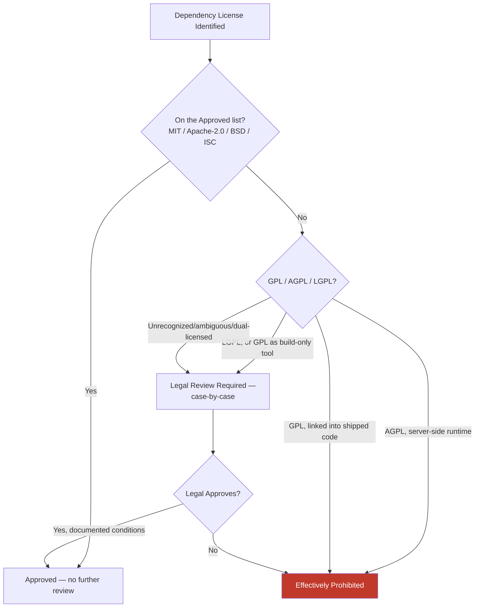

---

# Supply Chain Security

Software supply-chain security extends the Supply-Chain Attacks threat category and the Supply-Chain Protection standard already fully established in `ai-docs/10-security-standards.md` — this document does not redefine those controls, it affirms their application specifically at the point of dependency selection and ongoing maintenance.

### Package Integrity

Every dependency install is verified against the lockfile's recorded integrity checksum (an `sri`-format hash, per pnpm/npm's own lockfile format) — a package whose downloaded content does not match its recorded checksum fails the install immediately, per the same Package Integrity mechanism already implicit in `ai-docs/06-git-workflow.md`'s Reproducibility commitment.

### Dependency Confusion

Dependency confusion — an attack where a public registry package is published under the same name as an internal, private package, tricking a misconfigured build into installing the malicious public version instead of the intended private one — is structurally prevented at Arwal by two controls: every internal package is published under Arwal's own reserved, scoped npm namespace (`@arwal/*`, per Internal Packages above), and the package manager's registry configuration explicitly pins the `@arwal/*` scope to Arwal's own private registry, never falling back to the public registry for that scope under any resolution failure.

### Typosquatting

Typosquatting — a malicious package published under a name deliberately similar to a popular legitimate package (e.g., `reactt` or `zod-js`) — is mitigated by the Dependency Approval Process above requiring an explicit, named, verified package identity as part of every proposal, and by automated tooling (integrated into the CI/CD Dependency Scanning stage, per `ai-docs/17-cicd-standards.md`'s DevSecOps section) that flags a newly-added dependency name with high string-similarity to a known-popular package for manual verification before approval.

### Malicious Packages

Every dependency — direct and transitive — is scanned by the automated Dependency Scanning and Container Scanning pipeline stages already fully established in `ai-docs/17-cicd-standards.md` and `ai-docs/10-security-standards.md`, which include signature- and behavior-based detection of known-malicious package patterns (a package with a post-install script that exfiltrates environment variables, a package that has been retroactively flagged and pulled by the registry for malicious behavior). This document's responsibility is ensuring every dependency, without exception, passes through that already-established scanning gate — no dependency is ever exempted from it, including a dependency added under deadline pressure.

### Signature Verification

Where a package or its registry supports cryptographic provenance attestation (npm's provenance statements, linking a published package back to the exact CI workflow run and source commit that produced it), Arwal's dependency-selection scoring favors packages that provide it, per the Long-Term Viability and Security History criteria in Dependency Selection Criteria above — a package with verifiable provenance offers materially stronger supply-chain assurance than one relying solely on registry-account trust.

### Trusted Publishers

Arwal's own internal packages (`@arwal/*`) are published to the private registry exclusively through the approved CI/CD pipeline's own service identity (per the Registry Management and OIDC standards already established in `ai-docs/16-deployment-standards.md` and `ai-docs/17-cicd-standards.md`) — never via an individual engineer's personal `npm publish` credential, which would create exactly the kind of unauditable, single-point-of-failure publishing path this document exists to prevent for third-party packages, applied reflexively to Arwal's own.

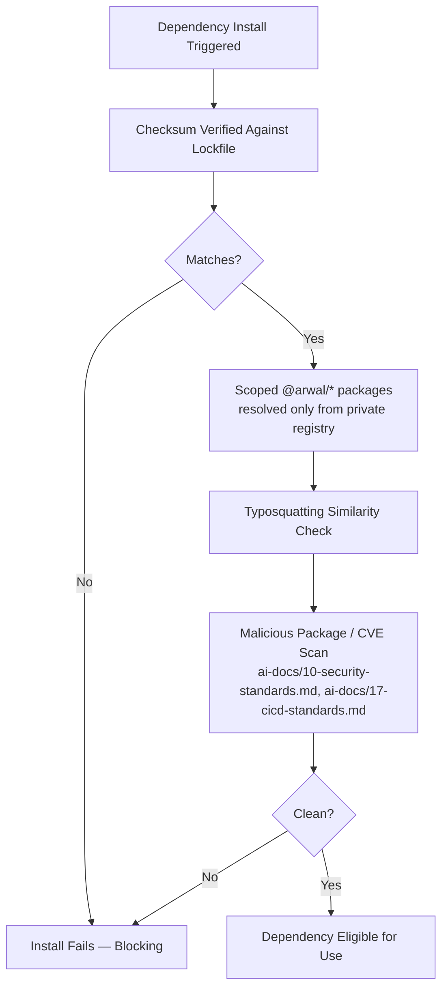

---

# Vulnerability Management

### npm Audit

`npm audit` (or pnpm's equivalent `pnpm audit`) is run as part of the automated Dependency Scanning pipeline stage already established in `ai-docs/17-cicd-standards.md`, on every push and pull request — this document does not redefine that pipeline mechanic, it defines the **response policy** once a finding is reported.

### GitHub Dependabot

GitHub's native Dependabot alerting is enabled across every workspace in the monorepo, providing continuous, off-pipeline vulnerability monitoring against newly disclosed CVEs affecting an already-installed dependency — even one that passed its scan clean at install time, since a vulnerability can be disclosed well after a package was originally approved and installed. Dependabot's automated PR-generation capability is used for Patch-level security updates (see Dependency Updates below), fast-tracked per the policy already established in `ai-docs/07-development-workflow.md`'s Dependency Update Workflow.

### CVSS Severity and Response Timelines

Every disclosed vulnerability is triaged by its CVSS (Common Vulnerability Scoring System) severity, with a response timeline scaled to that severity — mirroring the Severity Levels discipline already established in `ai-docs/07-development-workflow.md`'s Bug Fix Workflow and `ai-docs/10-security-standards.md`'s Incident Response.

| CVSS Severity | Score Range | Response Timeline | Process |
|---|---|---|---|
| **Critical** | 9.0 – 10.0 | Immediate — same-day patch or mitigation | Emergency update, per Emergency Updates below; may trigger the Incident Response Workflow (`ai-docs/07-development-workflow.md`) if the vulnerable dependency is actively exploitable on a citizen-facing path. |
| **High** | 7.0 – 8.9 | Within 48 hours | Fast-tracked patch update, expedited review per `ai-docs/06-git-workflow.md`'s Hotfix Workflow discipline where the fix requires more than a version bump. |
| **Medium** | 4.0 – 6.9 | Within the current or next sprint | Scheduled patch/minor update, standard review. |
| **Low** | 0.1 – 3.9 | Backlog, tracked technical debt | Batched into the next routine dependency-update cycle, per `ai-docs/02-engineering-principles.md`'s Technical Debt Policy. |

### Emergency Updates

A Critical-severity vulnerability in a dependency reachable from a citizen-facing or `payments`/`identity`/`civic-services` code path follows the identical Hotfix Workflow already fully established in `ai-docs/06-git-workflow.md` — branched from `main`, scoped narrowly to the dependency update alone, reviewed on an expedited-but-never-skipped basis, merged, tagged, and deployed per `ai-docs/16-deployment-standards.md`'s Hotfix mechanics. A dependency's emergency patch is never delayed to "batch it with other changes" when its severity and exploitability warrant immediate action.

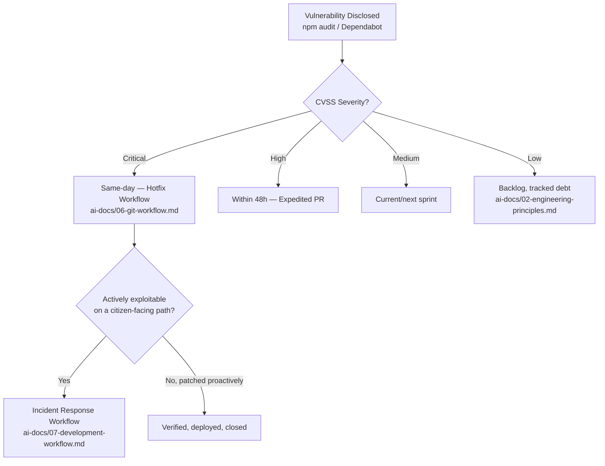

---

# Dependency Updates

### Update Categories and Approval Requirements

| Update Type | Approval Requirement | Regression Testing Requirement |
|---|---|---|
| **Patch (security)** | Fast-tracked, merged as soon as CI passes, per `ai-docs/07-development-workflow.md`'s Dependency Update Workflow | Full existing CI suite (`ai-docs/17-cicd-standards.md`) — no additional manual testing required for a true patch-level change. |
| **Patch (non-security)** | Batched into a periodic `chore/*` PR, standard review | Full existing CI suite. |
| **Minor** | Batched periodically; standard review | Full CI suite + a brief manual smoke check of the areas most likely affected, per `ai-docs/07-development-workflow.md`. |
| **Major** | A dedicated `chore/*` branch; changelog/migration guide read in full before upgrading; standard review + Tech Lead sign-off for a core framework dependency | Full CI suite + full regression pass (`ai-docs/15-testing-standards.md`'s Regression Testing) + manual verification of any documented breaking change's specific impact area. |

This table restates, without redefining, the Dependency Update Workflow already fully established in `ai-docs/07-development-workflow.md` — this document adds the explicit regression-testing tie-in to `ai-docs/15-testing-standards.md`'s Testing Pyramid and affirms that a dependency update, regardless of category, is never merged on a red CI pipeline, exactly as any other change is held to `ai-docs/17-cicd-standards.md`'s Quality Gates.

### Never Bundled With Unrelated Work

A dependency is never upgraded "while I'm in there" as part of an unrelated feature PR, per the Scope Discipline principle already established in `ai-docs/02-engineering-principles.md` and the explicit prohibition already stated in `ai-docs/07-development-workflow.md` — a dependency update is always its own commit and, for anything beyond a Patch, its own PR, so a regression can always be isolated to either the feature change or the dependency change, never an ambiguous mixture of both.

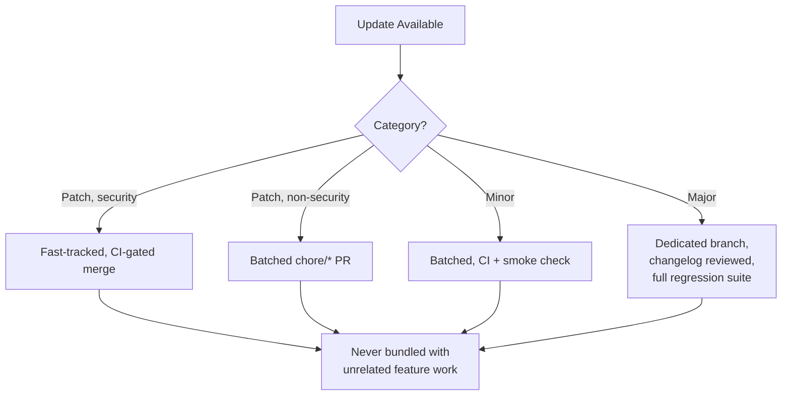

---

# Deprecated Dependencies

### Detection

A dependency is flagged as deprecated through any of: an explicit `npm deprecate` notice surfaced by the registry, a sustained absence of maintenance activity crossing the Active Maintenance threshold in Dependency Selection Criteria above, a Dependabot/security-scan alert indicating the maintainer has publicly announced end-of-life, or a periodic dependency-health audit (run on the same cadence as the Technology Review Checklist in `ai-docs/09-tech-stack.md`) proactively identifying a package that no longer meets Arwal's approval bar.

### Migration

Once flagged, a deprecated dependency's replacement follows the identical Migration and Rollback Plan discipline already established in `ai-docs/09-tech-stack.md`'s Deprecation Policy for a foundational technology — a migration plan is documented, an ADR is filed if the replacement is architecturally significant, and the migration is scheduled as tracked technical debt (`ai-docs/02-engineering-principles.md`) with a prioritization reflecting the deprecated package's actual risk (a deprecated package with active, unpatched vulnerabilities is prioritized far above a deprecated package that is simply no longer receiving new features).

### Sunset

A deprecated dependency is given an explicit sunset timeline — never left in permanent limbo — mirroring the Sunset Policy already established for feature flags in `ai-docs/21-configuration-management-standards.md`: a review date is set, and at that date the dependency is either fully migrated away from and removed, or the sunset is explicitly extended with a documented reason.

### Removal Process

A dependency's removal is verified, not assumed — the Duplicate Dependency Prevention tooling below confirms no remaining import references the removed package anywhere in the monorepo before its `package.json` entry is deleted, and the corresponding lockfile update is committed in the same PR, per Lockfile Policy above.

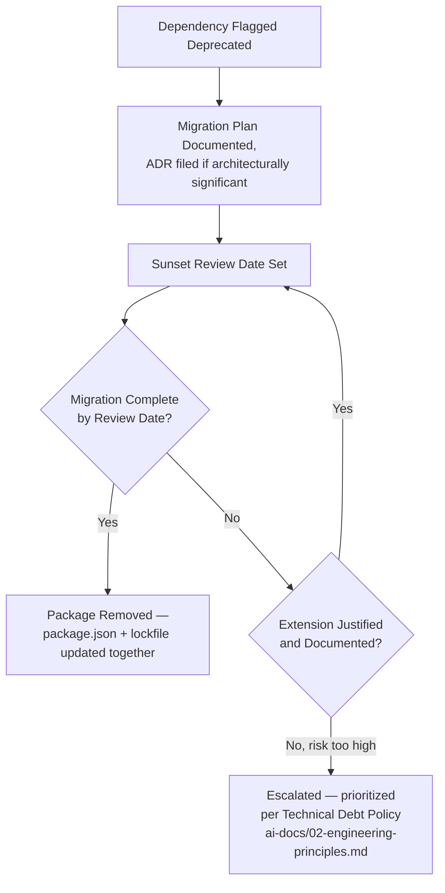

---

# Duplicate Dependency Prevention

### Single Package Versions

Per Version Fragmentation in Anti-Patterns below, Arwal enforces — via an automated lint/CI check (`syncpack` or an equivalent monorepo-version-consistency tool, integrated into `ai-docs/17-cicd-standards.md`'s pipeline) — that every workspace declaring the same shared dependency (e.g., `zod`, `react`) declares it at the **identical version**, never two different ranges resolving to two different installed copies across the monorepo.

### Workspace Consistency

A version-consistency check runs as a required, blocking CI gate: a PR that introduces a version mismatch for an already-shared dependency across two or more workspaces is rejected until the versions are aligned, per the same Consistency Over Local Preference discipline already established in `ai-docs/04-folder-guidelines.md` and `ai-docs/05-coding-standards.md`.

### Why This Matters

Two different versions of the same library installed simultaneously (most consequentially, two copies of `react`) is a well-documented source of subtle, hard-to-diagnose runtime bugs (broken Context, duplicated global state, hook-invocation errors) and, independently, a pure bundle-size cost per `ai-docs/11-performance-standards.md`'s Performance Budgets — shipping two copies of the same library to a citizen's entry-level Android device is waste with no corresponding benefit.

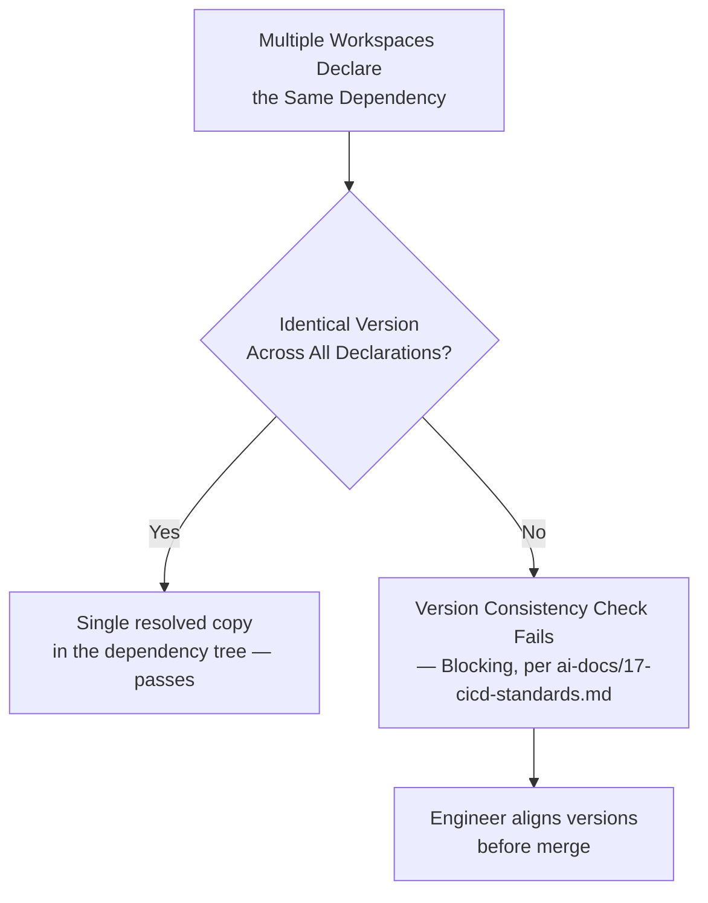

---

# Peer Dependency Strategy

### React Peer Dependencies

Every internal package that renders React components (`packages/ui`, and any future shared component package) declares `react` and `react-dom` as **peer dependencies**, never as direct `dependencies` — ensuring every consuming app (`apps/web`, `apps/admin-web`, and eventually `apps/mobile`'s shared rendering layer, per `ai-docs/09-tech-stack.md`) supplies exactly one shared React instance, avoiding the Duplicate Dependency Prevention risk above specifically for React's own singleton-sensitive internals (Context, Hooks' internal dispatcher).

```json
// packages/ui/package.json — illustrative
{
  "peerDependencies": {
    "react": "^18.0.0 || ^19.0.0"
  },
  "devDependencies": {
    "react": "^19.0.0"
  }
}
```

### Shared Libraries

Any internal package designed to be consumed by more than one app follows the identical peer-dependency pattern for any dependency with meaningful global/singleton state or a strict single-instance requirement (a state-management library, a styling-runtime library) — a dependency without such a requirement (a pure utility function library with no shared runtime state) is declared as a normal `dependency` instead, since forcing every consumer to separately declare and align a peer dependency it doesn't strictly need to deduplicate is unnecessary friction.

### Plugin Architecture

Where Arwal builds a plugin-style extension point (e.g., a future `AIProvider` adapter architecture per `ai-docs/09-tech-stack.md`'s AI Gateway Service pattern applied to a package-level plugin system), the plugin's own dependency on the host interface is declared as a peer dependency, never bundled — ensuring a plugin author's package doesn't silently ship a second, conflicting copy of Arwal's own shared contract types.

---

# Transitive Dependencies

### Why They Matter

A direct dependency's own dependencies — and their dependencies, recursively — form Arwal's *actual* total dependency surface, frequently an order of magnitude larger than the explicit `dependencies` list in any single `package.json`. A vulnerability, a license violation, or a malicious package can enter Arwal's codebase entirely through a transitive dependency an engineer never directly chose or reviewed — which is precisely why every automated control in this document (Vulnerability Management, Supply Chain Security, License review) is applied to the **full resolved tree**, never only to the direct dependencies an engineer explicitly typed into `package.json`.

### Risk Management

Per the Small Attack Surface principle in Dependency Philosophy above, a candidate direct dependency's own transitive tree size and quality is itself a factor in the Dependency Selection Criteria scoring matrix — a package that solves a narrow problem but pulls in fifty additional transitive packages of its own is a materially larger risk addition than a package solving the identical problem with two or three well-maintained transitive dependencies, and is scored accordingly.

### Auditing

The full, resolved transitive dependency tree is what `npm audit`/Dependabot (per Vulnerability Management above) and the SBOM generation already established in `ai-docs/10-security-standards.md` and `ai-docs/17-cicd-standards.md` actually scan — this document adds no new scanning mechanism, it affirms that "reviewing a dependency" always means reviewing its full transitive impact, never only its own declared, direct dependency list.

### Visibility

Arwal maintains visibility into its full transitive dependency graph through the SBOM already generated as a build artifact per `ai-docs/10-security-standards.md`'s Software Bill of Materials standard — the same artifact that lets Arwal answer "are we affected by this newly disclosed CVE" within minutes is the artifact that gives engineers and security reviewers a complete, queryable picture of every package actually running in production, direct or transitive, never merely an assumption based on the top-level `package.json` files.

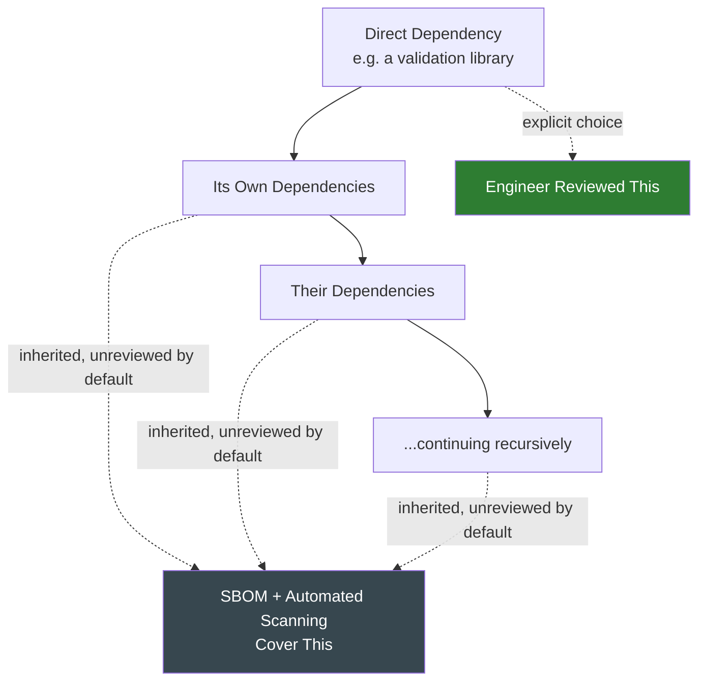

---

# Anti-Patterns

The following patterns are explicitly rejected, regardless of how convenient they appear under deadline pressure — each is a specific, previously observed failure mode in dependency-heavy Node.js/TypeScript codebases, called out here so Arwal does not have to relearn the lesson expensively in production.

| Anti-Pattern | Description | Why It's Rejected |
|---|---|---|
| **Installing Packages Without Review** | An engineer runs `npm install some-package` directly against a shared branch without going through the Dependency Approval Process. | Bypasses every security, license, and quality gate this document exists to enforce; treated with the same severity as an unreviewed architectural boundary change (`ai-docs/03-system-architecture-principles.md`). |
| **Duplicate Libraries** | Two different date-formatting, HTTP-client, or state-management libraries solving the identical problem, adopted independently by two different engineers/teams. | A DRY violation applied to the dependency tree — doubles the maintenance, security-review, and bundle-size cost for no corresponding benefit, and forces every future engineer to learn two APIs instead of one. |
| **Abandoned Libraries** | A dependency with no meaningful maintenance activity in over a year, retained in the codebase with no active migration plan. | Accumulates unpatched vulnerabilities silently; violates the Active Maintenance criterion and the Deprecated Dependencies process above. |
| **Large Unnecessary Libraries** | Pulling in a large, general-purpose utility library (e.g., an entire date/time or functional-programming megalibrary) to use one small piece of its functionality. | Violates Minimal Dependencies and directly conflicts with the Performance Budgets in `ai-docs/11-performance-standards.md` — a narrowly-scoped, single-purpose package (or a hand-written utility in `packages/utils`) is preferred. |
| **Copying GitHub Repositories** | Manually copy-pasting source code from a GitHub repository into Arwal's codebase instead of installing it as a proper, versioned dependency. | Impossible to patch via the normal update process, frequently a silent license violation, and invisible to every automated scanning control this document depends on, per Approved Dependency Sources above. |
| **Ignoring Security Warnings** | A `npm audit`/Dependabot finding is dismissed, silenced, or left open past its CVSS-mandated response timeline without a documented, approved exception. | Directly violates Vulnerability Management above and the Continuous Verification principle already established in `ai-docs/10-security-standards.md` — an ignored, known vulnerability is a standing, avoidable risk. |
| **Using Deprecated Packages** | Continuing to add new usages of a package already flagged deprecated (per Deprecated Dependencies above) instead of routing new work to its approved replacement. | Grows the migration burden instead of shrinking it, and signals the deprecation process is not actually being enforced. |
| **Version Fragmentation** | The same shared dependency installed at multiple different versions across different workspaces in the monorepo. | Violates Duplicate Dependency Prevention above; multiplies bundle size, multiplies the surface area for a version-specific bug, and undermines Reproducible Builds. |

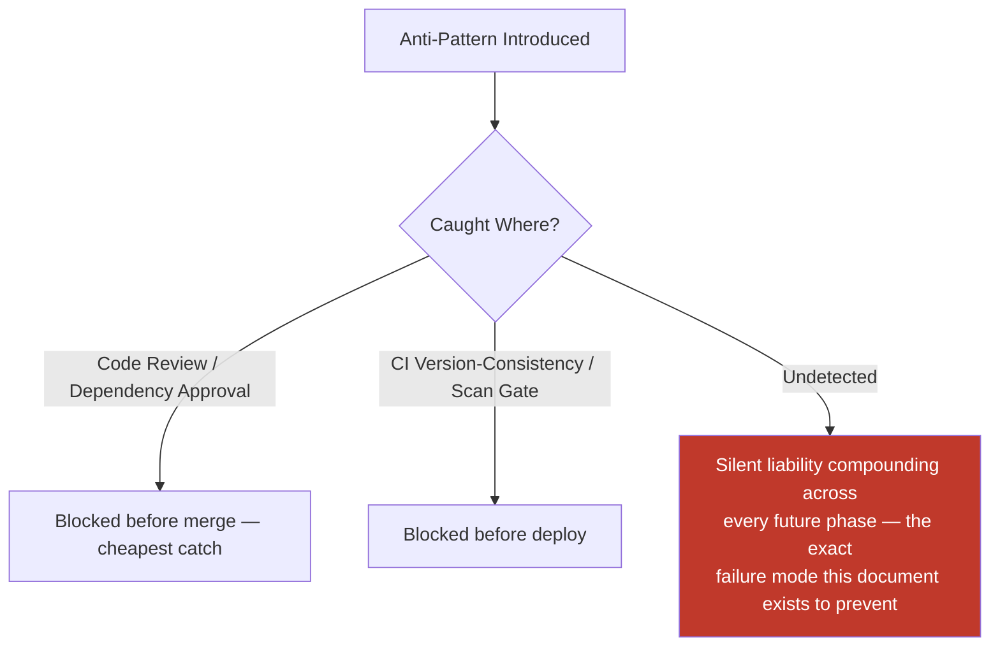

---

# Engineering Review Checklist

Every pull request introducing, updating, or removing a dependency — internal or external — is checked against the following before merge:

- [ ] **Correctly classified** — The dependency is placed in the correct category (Runtime / Dev / Peer / Optional / Internal / Shared), per Dependency Classification above.
- [ ] **Sourced from an approved registry** — Installed exclusively from the npm Registry, an official GitHub Release (pinned to a commit SHA, exceptional cases only), or Arwal's own `@arwal/*` private scope — no unknown mirror, no direct Git-repo reference, no manually copied source.
- [ ] **Selection criteria scored** — For a new external dependency, the full Dependency Selection Criteria scoring matrix is completed and meets the 3.5/5.0 threshold, or carries an explicit, Architecture-Review-approved justification.
- [ ] **License approved** — The dependency's license is on the Approved list, or has passed mandatory Legal review per Open Source Licensing above.
- [ ] **Approval process followed** — The dependency has passed through the Dependency Approval Process appropriate to its risk tier (lightweight vs. full Architecture Review + Security Review).
- [ ] **Versioning policy respected** — The correct range notation (exact/caret/tilde) is used per the Versioning Policy table, and the lockfile is committed alongside the `package.json` change.
- [ ] **No duplicate dependency introduced** — The dependency does not solve a problem an already-approved dependency already solves; a genuinely new shared dependency is declared at a consistent version across every workspace that uses it.
- [ ] **Bundle size impact evaluated** — For any dependency reachable from `apps/web`/`apps/admin-web`, its impact against the Performance Budgets in `ai-docs/11-performance-standards.md` is assessed.
- [ ] **Security scan clean** — Vulnerability, secret, and container scans (`ai-docs/17-cicd-standards.md`, `ai-docs/10-security-standards.md`) pass, or a finding carries a documented, time-bound, approved exception.
- [ ] **Peer dependencies correctly declared** — Any shared internal package with a singleton-sensitive dependency (React) declares it as a peer dependency, never bundled.
- [ ] **Not bundled with unrelated work** — A dependency addition/update is its own commit and, beyond a Patch, its own PR, never mixed into an unrelated feature change.
- [ ] **Deprecation handled correctly** — A dependency flagged deprecated is not gaining new usages; its migration is tracked with a sunset date.
- [ ] **Internal package ownership current** — Any change to a `packages/*` dependency list has the owning team's review, per Shared Internal Packages above.
- [ ] **No CI/CD, security, or configuration logic duplicated** — Any such concern is deferred entirely to its owning phase document (`ai-docs/10`, `ai-docs/17`, `ai-docs/21`), never redefined here.

A pull request failing any item above is not merged until resolved — this checklist carries the same non-negotiable authority as every other review checklist established in the preceding twenty-two phase documents.

---

# Relationship to Previous Standards

### Security Standards

`ai-docs/10-security-standards.md` owns the full, enforceable technical controls a dependency must satisfy once it enters Arwal's codebase — vulnerability scanning thresholds, SBOM generation, encryption and key management for any credential a dependency might handle, and the Supply-Chain Protection standard this document's Supply Chain Security section directly builds on. This document owns the **upstream governance** — selection, approval, licensing, and lifecycle — that decides whether a dependency is trustworthy enough to be subjected to those controls in the first place.

### CI/CD Standards

`ai-docs/17-cicd-standards.md` owns the exact, executable pipeline mechanics that enforce this document's policies automatically — the Dependency Audit, License Compliance, Secret Scan, and Container Scan required status checks in its Pipeline Quality Gates table are the concrete workflow jobs that make this document's rules unbypassable. This document never redefines a workflow file, a required check's YAML, or a caching strategy — it defines only the **policy** those mechanics enforce.

### Configuration Management

`ai-docs/21-configuration-management-standards.md` owns the discipline of runtime configuration — environment variables, feature flags, secrets references. A dependency and a configuration value are distinct categories: a dependency is code Arwal chooses to run; configuration is data that shapes how already-approved code (first-party or third-party) behaves in a given environment. Where a dependency requires its own configuration (a Redis client's connection pool size, a validation library's locale setting), that configuration is governed entirely by `ai-docs/21-configuration-management-standards.md`, never by this document.

### Coding Standards

`ai-docs/05-coding-standards.md` owns how first-party code is written, including how it *consumes* a dependency (constructor injection over direct import, wrapping a third-party SDK behind a domain-owned interface per the Dependency Inversion pattern already established there and in `ai-docs/09-tech-stack.md`'s Third-Party Service Policy). This document owns the decision of *which* dependency is available to be consumed in the first place — the two documents meet at the exact point `ai-docs/05-coding-standards.md`'s Infrastructure Layer wraps a dependency this document has already approved.

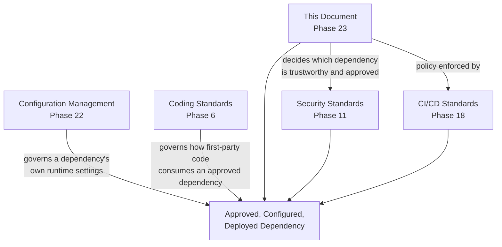

---

# Closing Statement

> **Callout — Closing Statement**
> Every preceding phase document described a dimension of how Arwal builds its own code — well, safely, fast, accessibly, tested, deployed, observed, logged, and correctly configured. This document describes the discipline governing everything Arwal did not build itself but nonetheless trusts with a citizen's booking, a farmer's subsidy application, and a merchant's wallet balance the moment it enters `node_modules`. A dependency selected carelessly at any phase becomes a structural liability at every phase after it — an unpatched vulnerability, a license conflict discovered too late, an abandoned package nobody remembers approving. A dependency selected with the discipline this document requires becomes a foundation the next 277 phases can build on without regret, exactly as `ai-docs/09-tech-stack.md` already committed for Arwal's foundational technology choices. Arwal will, across its lifetime, depend on thousands of packages it did not write, maintained by thousands of people it will never meet — and the only thing standing between that reality and a supply-chain incident is the discipline this document exists to make permanent: every dependency is a deliberate, accountable, reviewed decision, never a convenience. Where a future phase must deviate from a standard stated here, that deviation is made explicitly — through the Dependency Approval Process, or an Architectural Decision Record where the deviation is structural — never silently, and never by default.

This document, `ai-docs/22-dependency-management-standards.md`, is Phase 23 of approximately 300. Every package installed, upgraded, deprecated, and removed in the phases that follow is expected to satisfy the standards defined here, or to justify its deviation in writing.

**End of Phase 23 — `ai-docs/22-dependency-management-standards.md`**