# Environment Strategy

**Document:** `ai-docs/23-environment-strategy.md`
**Project:** Arwal — The District Super App
**Stage:** 1 — Foundation
**Phase:** 24 — Environment Strategy
**Status:** Approved for Engineering Reference
**Audience:** Architects, Backend Engineers, Frontend Engineers, DevOps Engineers, SRE, Security Engineers, QA Engineers, Release Managers, Technical Reviewers, Government Technical Partners

> **Callout — Purpose of This Document**
> `ai-docs/00-project-vision.md` defined why Arwal exists. `ai-docs/01-product-goals.md` defined what Arwal must achieve. `ai-docs/02-engineering-principles.md` defined how engineers reason about design. `ai-docs/03-system-architecture-principles.md` defined how the system is structured. `ai-docs/04-folder-guidelines.md` defined where that structure physically lives. `ai-docs/05-coding-standards.md` defined how individual lines of code are written. `ai-docs/06-git-workflow.md` defined how change moves through version control. `ai-docs/07-development-workflow.md` defined how a day of engineering work unfolds. `ai-docs/08-definition-of-done.md` defined when a piece of work is actually finished. `ai-docs/09-tech-stack.md` named the concrete technologies everything is built from. `ai-docs/10-security-standards.md` defined the enforceable security standard those technologies must satisfy. `ai-docs/11-performance-standards.md` through `ai-docs/22-dependency-management-standards.md` defined every other enforceable discipline governing how Arwal is built, verified, deployed, observed, logged, and configured. This document defines **the world those disciplines run inside of** — the distinct, isolated, governed environments a change travels through between an engineer's keyboard and a citizen's phone, and the rules that keep every one of those environments trustworthy, for every one of the ~300 micro-phases still ahead.

---

# Purpose of this Document

### Why Environments Exist

An environment is not infrastructure — it is a **claim**. A "Staging" environment claims to behave like Production, minus real citizens. A "Development" environment claims to reflect the current state of the team's collective work. A "Local" environment claims to give one engineer a fast, private space to iterate. Every one of these claims is only true if it is *deliberately engineered to be true* — infrastructure left to accumulate ad hoc, environment by environment, over ~300 phases and years of team growth, does not converge on these claims naturally. It drifts away from them, silently, the same way an unreviewed folder structure drifts away from the architecture it was meant to mirror (`ai-docs/04-folder-guidelines.md`) or an unvalidated configuration schema drifts away from what a service actually requires (`ai-docs/21-configuration-management-standards.md`).

This document exists to make every environment's claim **true by construction** — defined once, applied consistently, and never left to individual engineer memory or per-environment improvisation. Without it, "works in Staging" stops meaning anything the first time Staging's topology quietly diverges from Production's; "isolated test data" stops being true the first time a QA environment is seeded from an un-anonymized production export; "temporary preview environment" stops being temporary the moment nobody owns tearing it down.

### Environment Lifecycle

Every environment Arwal operates — permanent (Production) or ephemeral (a Preview environment for a single pull request) — passes through the same conceptual lifecycle: **Creation** (provisioned from the same Infrastructure as Code source every other environment is provisioned from, per `ai-docs/16-deployment-standards.md`), **Maintenance** (kept current, patched, and schema-parity-checked against its peers), **Use** (the purpose it exists to serve — a developer iterating, a citizen transacting), and **Decommissioning** (torn down deliberately, never abandoned into an unmonitored, unpatched, forgotten liability). See Environment Lifecycle below for the full standard.

### Environment Isolation

No environment's failure, misconfiguration, or compromise is ever capable of affecting another environment — per the Failure Isolation principle already established in `ai-docs/03-system-architecture-principles.md` and the Environment Isolation standard already established in `ai-docs/10-security-standards.md` and `ai-docs/16-deployment-standards.md`, extended here into the complete, environment-by-environment isolation matrix every engineer builds against. A bug in a QA-only script must never be *capable* of touching Production data, not merely unlikely to.

### Environment Consistency

Every environment is provisioned from the identical, version-controlled source — the same Infrastructure as Code modules (`ai-docs/16-deployment-standards.md`), the same configuration schema (`ai-docs/21-configuration-management-standards.md`), the same container image build process (`ai-docs/17-cicd-standards.md`) — parameterized only by environment-specific *values*, never by environment-specific *code paths* or hand-diverged definitions. Consistency is what makes a Staging soak period a trustworthy predictor of Production behavior, and what makes "it worked in every lower environment" a meaningful, evidence-based statement rather than a hopeful one.

### Relationship with Deployment Standards

`ai-docs/16-deployment-standards.md` already defines, in full, the mechanics that make an environment *run*: AWS/Vercel infrastructure topology, containerization, Infrastructure as Code, deployment strategies (Rolling/Blue-Green/Canary/Feature Flag/Shadow), rollback, disaster recovery mechanics, and the Production Readiness Checklist. This document does not redefine any of that. This document governs the **environment as a governed concept** — how many environments exist, what each is *for*, who may use it, what data it may hold, how software is promoted between them, and how an environment's entire lifecycle (not a single deployment event) is managed. Where this document says "deployed to Staging," the *mechanics* of that deployment belong entirely to `ai-docs/16-deployment-standards.md` and `ai-docs/17-cicd-standards.md`.

### Relationship with Configuration Management

`ai-docs/21-configuration-management-standards.md` already defines how configuration is categorized, named, typed, validated, and loaded, and already establishes that every environment has its own explicitly typed, schema-validated configuration. This document does not redefine a single configuration category, naming convention, or validation rule — it defines *which environments exist* for that configuration schema to be parameterized against, and the isolation and parity rules that make each environment's configuration set trustworthy relative to its peers.

### Relationship with Security Standards

`ai-docs/10-security-standards.md` already defines Zero Trust, Least Privilege, Data Classification, and the full Authentication/Authorization framework. This document does not redefine any security control — it defines the environment-scoped **boundaries** those controls are applied within: which environment holds real citizen data, which access tier is permitted into which environment, and when a break-glass procedure (governed entirely by `ai-docs/10-security-standards.md`) may be invoked against a specific environment.

---

# Environment Philosophy

Arwal's environment strategy rests on seven commitments. Together they answer the question every subsequent section of this document exists to make concrete: **what does "an environment can be trusted" actually require, by default, before a single instance is provisioned?**

### Environment Parity

Every environment beyond Local is built from the same Infrastructure as Code modules and the same container artifacts as Production, differing only in scale and injected configuration values, per the Environment Reproducibility principle already established in `ai-docs/16-deployment-standards.md`. Parity exists because the entire value of a pre-production environment — the confidence a Staging soak period gives a release manager before a citizen is exposed to a change — collapses the moment that environment's *shape* is allowed to differ from Production's in an undocumented way. An environment that "mostly" matches Production is an environment that will eventually fail to catch the one difference that mattered.

### Isolation

Every environment is a hard boundary — its own database, its own cache, its own secrets, its own network segment — never a shared resource "just for now." Isolation exists because a shared resource between two environments of different sensitivity (a shared database between Staging and Production, a shared secret between Development and Production) collapses the security and blast-radius guarantees every other governance document in this project depends on; a compromise or a bug in the lower-trust environment becomes, instantly, a compromise of the higher-trust one.

### Reproducibility

Given the IaC repository at a specific commit and the target environment's name, the exact environment can be reconstructed, audited, or rebuilt with confidence — the environment-layer expression of the Reproducibility commitment already established in `ai-docs/06-git-workflow.md` and `ai-docs/16-deployment-standards.md`. Reproducibility exists because an environment that cannot be rebuilt from source is an environment nobody fully understands by Phase 150 — its actual state exists only in the memory of whoever last touched it by hand, which is precisely the tribal-knowledge failure mode `ai-docs/02-engineering-principles.md`'s founding purpose exists to eliminate.

### Immutable Environments

An environment's running infrastructure is never patched or hand-edited in place — a change to an environment is always a new, version-controlled deployment of the identical artifact and IaC definition used everywhere else, per the Immutable Infrastructure principle already established in `ai-docs/16-deployment-standards.md`. Immutability exists because a hand-edited environment silently stops being reproducible the moment the edit is made — it becomes a snowflake (see Anti-Patterns below) whose true state can no longer be reconstructed from the repository alone.

### Least Privilege

Access to any environment is scoped to the minimum an actor's role genuinely requires, and access to a higher-sensitivity environment is always more restrictive than access to a lower one, per the Least Privilege principle already established in `ai-docs/10-security-standards.md`. This principle exists because ambient, standing access to every environment for every engineer is a standing liability that scales with headcount — a compromised laptop, a departed engineer's un-revoked credential, or a well-intentioned mistake all carry a blast radius directly proportional to how many environments that credential could reach.

### Production-First Mindset

Every environment other than Production exists to protect Production, never the reverse — a QA finding, a Staging soak-period regression, and a Preview environment's automated check all exist because catching a defect before it reaches a citizen is categorically cheaper than catching it after, per the Shift Left philosophy already established in `ai-docs/15-testing-standards.md` and `ai-docs/20-error-handling-standards.md`. A Production-First mindset means every lower environment's design question is always "does this genuinely increase our confidence before Production?" — never "is this environment convenient for an engineer today?" at the expense of that confidence.

### Automation Over Manual Operations

Every environment is created, configured, deployed to, and torn down through automation — never through an engineer manually running commands against a specific target, per the Automation First principle already established in `ai-docs/16-deployment-standards.md` and `ai-docs/17-cicd-standards.md`. Automation exists because a manual operation performed correctly nine times and incorrectly the tenth time is indistinguishable, from the outside, from an automated operation performed correctly every time — until the tenth time causes an incident nobody can explain, because there is no record of what was actually done.

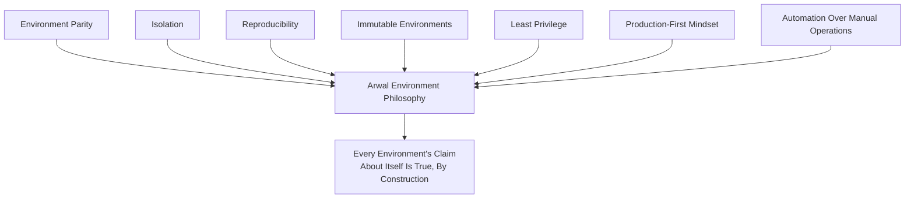

> **Callout — The One-Sentence Environment Philosophy**
> *"An environment is trustworthy only to the degree it was built the same, disciplined way as every other environment — the moment one is allowed to be special, none of them can be fully trusted again."*

---

# Environment Types

Arwal operates nine distinct environment types. Every environment has exactly one purpose, and that purpose is never blurred — a change is never verified "directly in Staging because it's basically Development," and Production is never used as a testing ground for anything, regardless of urgency, mirroring the discipline already established in `ai-docs/16-deployment-standards.md`'s Deployment Environments section (Local, Development, QA, Staging, Production) and extended here to the full environment taxonomy Arwal's roadmap requires.

### Local

| Dimension | Standard |
|---|---|
| **Purpose** | An individual engineer's own machine, running the full stack (or the relevant subset) via Docker Compose, for active development and the fastest possible iteration loop. |
| **Who Uses It** | The individual engineer, exclusively. |
| **Availability Requirement** | None — Local has no uptime obligation to anyone but its owner. |
| **Data Policy** | Entirely synthetic, seeded data only (`apps/api/src/database/seed`, per `ai-docs/14-database-design-guidelines.md`). Real citizen, merchant, or government data is never present, per `ai-docs/06-git-workflow.md`'s Git Ignore Policy. |
| **Deployment Policy** | Manual, local-only, via Docker Compose; nothing is ever deployed *from* Local to any shared environment. |
| **Restrictions** | No access to any shared secret beyond a local `.env.development.example`-derived, non-production placeholder value, per `ai-docs/21-configuration-management-standards.md`. |

### Development

| Dimension | Standard |
|---|---|
| **Purpose** | A shared, always-on environment reflecting the current state of `develop`, used for cross-team integration and early manual verification. |
| **Who Uses It** | The full engineering team. |
| **Availability Requirement** | Best-effort; a Development outage has no citizen-facing consequence and is never treated with production urgency. |
| **Data Policy** | Synthetic, seeded, or anonymized data only, per `ai-docs/15-testing-standards.md`'s Anonymized Production Data standard. |
| **Deployment Policy** | Automatic, on every merge to `develop`, per `ai-docs/17-cicd-standards.md`. |
| **Restrictions** | No elevated approval required to deploy; never receives a direct `feature/*` push outside the standard merge path. |

### QA / Testing

| Dimension | Standard |
|---|---|
| **Purpose** | A dedicated, stable environment for structured manual QA, exploratory testing, and accessibility/device verification (`ai-docs/07-development-workflow.md`, `ai-docs/12-accessibility-standards.md`), isolated from `develop`'s continuous churn. |
| **Who Uses It** | QA Engineers, Engineering, Product. |
| **Availability Requirement** | Stable for the duration of a scheduled QA session — never redeployed mid-session without coordination. |
| **Data Policy** | Synthetic or anonymized, with a wider, more production-representative shape than Development, to support realistic exploratory testing. |
| **Deployment Policy** | Promoted on a defined cadence, or on-demand for a specific feature's QA cycle. |
| **Restrictions** | Never a target for direct, ad hoc engineer pushes outside the standard promotion path. |

### Integration

| Dimension | Standard |
|---|---|
| **Purpose** | A dedicated environment purpose-built for cross-module and cross-service integration verification — validating that Integration Events (`ai-docs/03-system-architecture-principles.md`), contract tests (`ai-docs/15-testing-standards.md`), and asynchronous consumers behave correctly together at a fidelity beyond what a PR-scoped CI job can exercise. |
| **Who Uses It** | Backend Engineers, Platform Engineers, automated integration/contract test suites. |
| **Availability Requirement** | Best-effort; primarily consumed by automation, not humans in real time. |
| **Data Policy** | Synthetic, deterministic fixture data (`ai-docs/15-testing-standards.md`'s Test Data Management), never anonymized-production-shaped data, since Integration prioritizes deterministic, repeatable scenarios over representativeness. |
| **Deployment Policy** | Triggered by the CI pipeline for any PR touching a cross-module or cross-service boundary, per `ai-docs/17-cicd-standards.md`. |
| **Restrictions** | Never used for exploratory human QA — that is QA's exclusive purpose; Integration exists for automated, scenario-driven verification only. |

### Preview

| Dimension | Standard |
|---|---|
| **Purpose** | A temporary, per-pull-request environment giving a reviewer, a designer, or a Product stakeholder a live, running instance of a specific proposed change before it merges. |
| **Who Uses It** | The PR's author, its reviewers, and Product/Design stakeholders evaluating a specific in-flight change. |
| **Availability Requirement** | Exists only for the life of the PR; no uptime obligation beyond that. |
| **Data Policy** | Synthetic, seeded data only — identical in kind to Development's, never anonymized-production data, since a Preview environment's ephemeral, per-PR nature makes it the least-controlled environment beyond Local. |
| **Deployment Policy** | Automatically created on PR open/update, automatically destroyed on PR close/merge, per Preview Environments below. |
| **Restrictions** | Never used to verify a citizen-critical release readiness item — Staging is the only environment authorized for that per the Production Readiness Checklist (`ai-docs/16-deployment-standards.md`). |

### Staging

| Dimension | Standard |
|---|---|
| **Purpose** | The final, production-topology-identical environment where a `release/*` branch is soak-tested and signed off before promotion, per `ai-docs/16-deployment-standards.md`. |
| **Who Uses It** | Engineering, QA, DevOps, Tech Lead sign-off roles. |
| **Availability Requirement** | High — a Staging outage blocks the entire release pipeline behind it and is treated with meaningful, though not Production-level, urgency. |
| **Data Policy** | Anonymized, production-shaped data at a representative volume, per `ai-docs/16-deployment-standards.md` and `ai-docs/10-security-standards.md`'s Environment Isolation standard — real citizen, payment, or health data is never present. |
| **Deployment Policy** | Receives only `release/*` branch builds, per `ai-docs/06-git-workflow.md`'s Merge Strategy. |
| **Restrictions** | Never receives a direct `feature/*` deploy; never receives a hotfix that has not passed through the Hotfix Workflow's expedited-but-not-skipped review. |

### Production

| Dimension | Standard |
|---|---|
| **Purpose** | The live environment serving real citizens, merchants, government officers, and administrators — the only environment where Arwal's civic and financial commitments are actually being fulfilled in real time. |
| **Who Uses It** | Real citizens, merchants, government officers, and administrators; a small, named set of release-manager and on-call engineering roles for operational purposes. |
| **Availability Requirement** | The full uptime target already established in `ai-docs/01-product-goals.md` (99.9%+ for core flows), monitored per `ai-docs/18-observability-standards.md`. |
| **Data Policy** | Real citizen, merchant, payment, health, and government data — encrypted and classified per `ai-docs/10-security-standards.md`, without exception. |
| **Deployment Policy** | Receives only tagged releases from `main`, promoted exclusively through the approved pipeline, per `ai-docs/16-deployment-standards.md` and `ai-docs/17-cicd-standards.md`. |
| **Restrictions** | No direct-push, no manual infrastructure command, no ambient standing access for any individual engineer, ever — per `ai-docs/16-deployment-standards.md`'s Deployment Authorization standard. |

### Disaster Recovery

| Dimension | Standard |
|---|---|
| **Purpose** | A dormant, periodically-validated environment capable of assuming Production's role in the event of a full regional/primary-environment loss, per `ai-docs/16-deployment-standards.md`'s Disaster Recovery section. |
| **Who Uses It** | Not used in normal operation; activated exclusively per the Activation Criteria in the Disaster Recovery Environment section below. |
| **Availability Requirement** | Not continuously running at full scale in the common case (cost-optimized dormant/warm-standby posture, per the RTO targets already established in `ai-docs/16-deployment-standards.md`); must meet its documented RTO the moment activation is declared. |
| **Data Policy** | Real citizen, merchant, payment, health, and government data, replicated from Production's backups/WAL archive — held to the identical `ai-docs/10-security-standards.md` classification and encryption standard as Production itself, since it is, functionally, a dormant copy of Production. |
| **Deployment Policy** | Provisioned from the identical IaC modules as Production, per Infrastructure Recovery in `ai-docs/16-deployment-standards.md`; never hand-diverged from Production's topology. |
| **Restrictions** | Never used for any purpose other than disaster recovery and its own periodic validation drills; never a target for routine deployment traffic. |

### Training / Demo

| Dimension | Standard |
|---|---|
| **Purpose** | A stable, demonstration-quality environment used for government-partner demos, investor walkthroughs, internal training, and sales/onboarding presentations — never used for any engineering verification purpose. |
| **Who Uses It** | Product, leadership, government technical partners (during a scheduled demo), new-engineer onboarding sessions. |
| **Availability Requirement** | Scheduled — stable and available during a booked demo/training window; no standing 24/7 obligation. |
| **Data Policy** | Entirely synthetic, curated, narrative-friendly data — deliberately crafted to tell a coherent demo story (a realistic-looking but entirely fictional district, citizens, and bookings), never anonymized real data, since a demo audience's trust in what they are shown must never rest on data that was ever real. |
| **Deployment Policy** | Promoted deliberately, on a schedule aligned to demo/training needs, from a known-stable tagged release — never from `develop`'s continuous churn. |
| **Restrictions** | Never connected to any real citizen-facing integration (a real payment gateway, a real government API, a real SMS provider) — every external integration in Training/Demo is a sandboxed or fully mocked equivalent, per the Third-Party Service Policy already established in `ai-docs/09-tech-stack.md`. |

### Environment Type Comparison Matrix

| Environment | Uptime Priority | Data Sensitivity | Deploy Trigger | Primary Consumer |
|---|---|---|---|---|
| Local | None | None (synthetic) | Manual, local | Individual engineer |
| Development | Low | None (synthetic/anonymized) | Auto, on `develop` merge | Full engineering team |
| QA | Low–Medium | Low (anonymized, representative) | Scheduled/on-demand | QA + Engineering + Product |
| Integration | Low | None (deterministic fixtures) | Auto, on cross-boundary PR | Automation, backend engineers |
| Preview | None (ephemeral) | None (synthetic) | Auto, on PR open/update | PR author, reviewers, stakeholders |
| Staging | Medium–High | Low (anonymized, production-shaped) | On `release/*` branch | Eng + QA + DevOps + Tech Lead |
| Production | Highest | Highest (real, classified) | Tag on `main`, gated | Citizens, merchants, officers, admins |
| Disaster Recovery | Dormant / on-activation-highest | Highest (real, replicated) | Activation-triggered | On-call/DevOps during a declared disaster |
| Training / Demo | Scheduled | None (curated synthetic) | Manual, scheduled | Leadership, partners, new engineers |

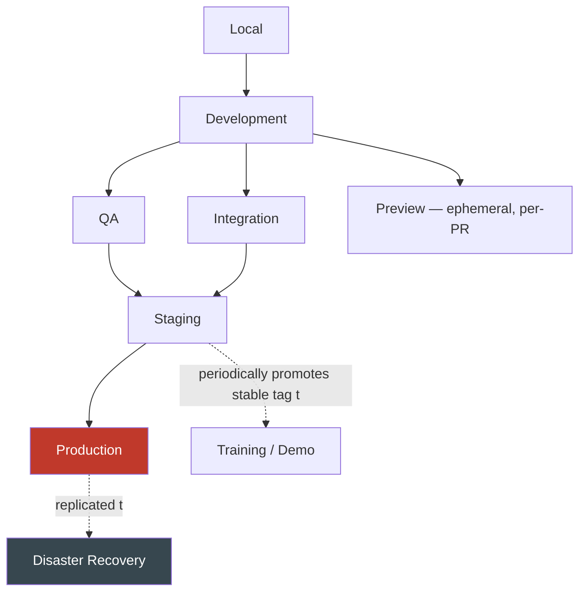

---

# Environment Promotion Strategy

### Promotion Flow

A change moves through Arwal's environments in a single, well-defined direction — never sideways between peer environments, and never backward except via an explicit, governed rollback (`ai-docs/16-deployment-standards.md`). Promotion is always **evidence-gated**: a change advances to the next environment only once the prior environment's exit criteria (see Deployment Readiness below) are satisfied, never on elapsed time alone.

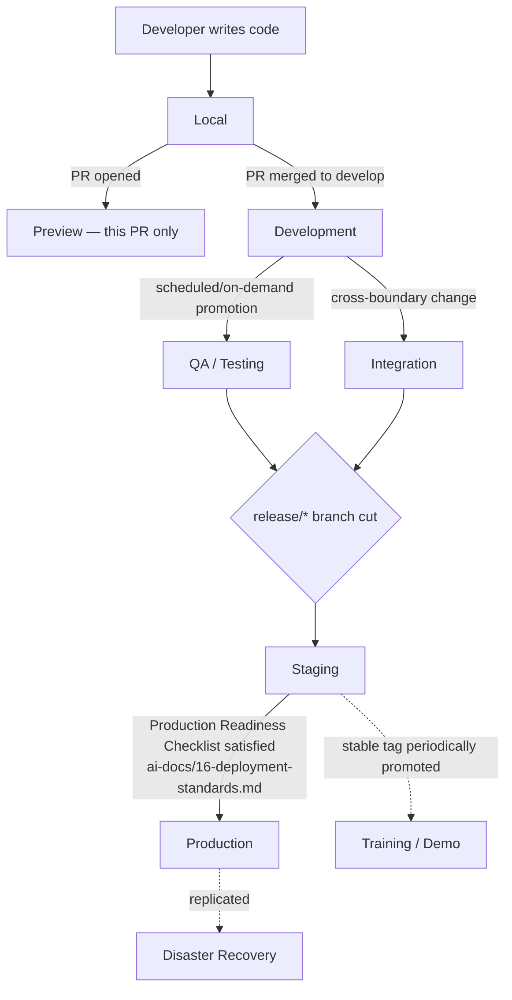

### Promotion Sequence Detail

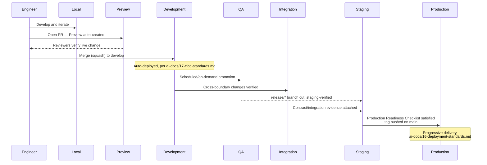

### No Environment Skipping

A change is never promoted directly from Development to Staging, or from Staging directly to Production without passing every applicable gate at each intermediate environment — an environment that can be skipped "just this once" is an environment that provides no real evidence the rest of the time either, mirroring the "no exceptions, ever" discipline already established for branch protection in `ai-docs/06-git-workflow.md`.

---

# Environment Isolation

Every environment is isolated from every other along ten independent dimensions — isolation on only some of these dimensions is not isolation, since a shared resource on even one dimension recreates the exact cross-environment blast radius this document exists to prevent.

| Dimension | Isolation Rule | Governing Document |
|---|---|---|
| **Databases** | Every environment has its own PostgreSQL instance (or, for Local/Preview, its own disposable container instance) — no environment ever queries another's database, even read-only. | `ai-docs/14-database-design-guidelines.md`, `ai-docs/16-deployment-standards.md` |
| **Caches** | Every environment has its own Redis instance/cluster — no shared cache role across environments, mirroring the Bulkheading discipline already established for cache/session/queue roles within a single environment. | `ai-docs/09-tech-stack.md`, `ai-docs/11-performance-standards.md` |
| **Queues** | Every environment's BullMQ queues are backed by that environment's own isolated Redis instance — a job enqueued in Development is never visible to or processable by a Staging or Production worker. | `ai-docs/09-tech-stack.md` |
| **Storage** | Every environment has its own S3 buckets/Cloudinary namespace for citizen documents and media — no cross-environment bucket sharing, per `ai-docs/16-deployment-standards.md`'s Object Storage standard. | `ai-docs/16-deployment-standards.md` |
| **Secrets** | Every environment's secrets are issued, scoped, and stored independently in the secrets-management system — a credential issued for one environment is never valid in another, per `ai-docs/10-security-standards.md` and `ai-docs/21-configuration-management-standards.md`. | `ai-docs/10-security-standards.md`, `ai-docs/21-configuration-management-standards.md` |
| **Domains** | Every environment resolves under its own subdomain (e.g., `api.arwal.in` for Production, `api.staging.arwal.in` for Staging, `pr-1234.preview.arwal.in` for a Preview instance), never a shared hostname distinguished only by a path or a header. | `ai-docs/16-deployment-standards.md` |
| **Monitoring** | Every environment's metrics carry a distinct `deployment.environment` resource attribute (`ai-docs/18-observability-standards.md`) and are queryable/dashboarded separately — a Production dashboard never silently blends in Staging traffic. | `ai-docs/18-observability-standards.md` |
| **Logging** | Every environment's logs carry a distinct `environment` field (`ai-docs/19-logging-standards.md`) and are retained and access-controlled per that environment's own sensitivity tier — Production's audit-log retention obligations never apply to, or are diluted by, Development's routine noise. | `ai-docs/19-logging-standards.md` |
| **Network** | Every environment is deployed into its own VPC/subnet boundary (or an equivalently isolated logical network segment), per the Network Segmentation principle already established in `ai-docs/03-system-architecture-principles.md` and `ai-docs/10-security-standards.md` — no environment's application tier can reach another environment's database or cache at the network layer, even if a credential were somehow known. | `ai-docs/10-security-standards.md`, `ai-docs/16-deployment-standards.md` |
| **IAM** | Every environment's service identities and human-access roles are scoped exclusively to that environment — an IAM role usable in Staging is never simultaneously valid in Production, per Least Privilege (`ai-docs/10-security-standards.md`). | `ai-docs/10-security-standards.md` |

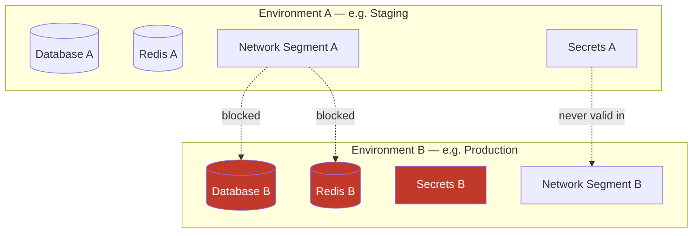

> **Callout — Isolation Is Verified, Not Assumed**
> Per the Defense in Depth principle already established in `ai-docs/10-security-standards.md`, isolation on every dimension above is a verified, tested property — not merely a documented intention. A periodic review (see Engineering Review Checklist below) confirms, for each environment pair, that no credential, network path, or shared resource has quietly emerged that would violate this section.

---

# Environment Parity

### What Must Match

| Parity Dimension | Requirement | Rationale |
|---|---|---|
| **Infrastructure Parity** | Identical service topology and identical infrastructure technology (same managed PostgreSQL/Redis tier family, same container orchestration pattern) across Staging and Production, differing only in instance sizing/scale, per `ai-docs/16-deployment-standards.md`. | A Staging soak period is only a trustworthy predictor of Production behavior if the two environments are, structurally, the same shape. |
| **Software Parity** | The exact same, immutably-tagged artifact (`ai-docs/17-cicd-standards.md`) is what moves through every environment beyond Development — never a "Staging build" and a separately-compiled "Production build." | Rebuilding "the same thing" twice reintroduces exactly the risk (a different dependency resolution, a different build-time flag) Immutable Artifacts exists to eliminate. |
| **Dependency Parity** | Every environment installs from the identical, committed lockfile, per `ai-docs/22-dependency-management-standards.md`'s Lockfile Policy — no environment-specific dependency version. | A dependency behaving differently between Staging and Production because of a version drift is a defect this document's parity requirement structurally prevents. |
| **Configuration Parity** | Every environment is defined from the same configuration schema, parameterized by environment-specific values, per `ai-docs/21-configuration-management-standards.md`'s Configuration Parity standard. | A configuration key present in Production but absent from Staging's schema is a defect caught by validation, never a silent, undetected gap. |
| **Operational Parity** | The same deployment strategy family, the same health-check contract, and the same observability instrumentation (`ai-docs/18-observability-standards.md`) apply identically across Staging and Production. | An environment that is operated differently than Production cannot meaningfully validate Production's actual operational behavior. |

### Acceptable Differences

| Difference | Why It's Acceptable |
|---|---|
| **Instance count / scale** | Staging need not run at Production's full horizontal scale — the Scalability Strategy (`ai-docs/03-system-architecture-principles.md`) is validated through dedicated Load Testing (`ai-docs/11-performance-standards.md`), not through matching Staging's instance count to Production's. |
| **Data volume** | Staging's dataset is representative in *shape*, not necessarily equal in raw row count to Production — per `ai-docs/16-deployment-standards.md`. |
| **Third-party provider mode** | Staging and Development use sandbox/test-mode credentials for external integrations (`ai-docs/15-testing-standards.md`'s Integration Testing table); Production uses live, production-scoped credentials. |
| **Monitoring alert routing** | A Staging alert routes to a lower-urgency channel than an identical Production alert, per the Severity discipline already established in `ai-docs/18-observability-standards.md` — the *signal* is identical; the *response urgency* differs by design. |

### Unacceptable Differences

| Difference | Why It's Rejected |
|---|---|
| **A different container base image or Node.js version between Staging and Production** | Directly violates Software Parity; reintroduces the exact "works in Staging, fails in Production" risk parity exists to eliminate. |
| **A feature flag defaulted differently in Staging than its documented Production rollout plan without a recorded reason** | Makes Staging's soak period evidence unreliable — the citizen-facing behavior actually being validated is not the behavior that will actually ship. |
| **A database schema present in Staging but not yet migrated to Production, without an explicit, tracked reason** | Violates Configuration/Software Parity and risks a migration surprise at Production promotion time, contradicting the Migration Validation standard in `ai-docs/16-deployment-standards.md`. |
| **A manually-applied infrastructure tweak in one environment "to make a demo work"** | An Immutable Environments violation (see Anti-Patterns below) — the environment silently stops being reproducible from IaC alone. |

---

# Data Strategy

Every category of data used across Arwal's environments is classified explicitly, mirroring the never-one-blunt-mechanism discipline already established for State (`ai-docs/02-engineering-principles.md`) and Configuration (`ai-docs/21-configuration-management-standards.md`), applied here to environment data.

| Data Category | Definition | Permitted Environments |
|---|---|---|
| **Production Data** | Real citizen, merchant, payment, health, and government data. | **Production and Disaster Recovery only.** |
| **Synthetic Data** | Entirely fabricated data with no origin in any real citizen record — generated by the seed script (`ai-docs/14-database-design-guidelines.md`) or a dedicated test-data factory (`ai-docs/15-testing-standards.md`). | Local, Development, Integration, Preview, Training/Demo. |
| **Seed Data** | A version-controlled, deterministic dataset (`apps/api/src/database/seed`) establishing a known-good baseline state for a fresh environment. | Local, Development, QA, Integration, Preview. |
| **Reference Data** | Genuinely non-sensitive, slowly-changing platform data that is *not* citizen-specific — district/ward/zone identifiers, category taxonomies, government-department lists. | Every environment, including Production, since reference data by definition carries no citizen-sensitivity classification per `ai-docs/10-security-standards.md`. |
| **Test Data** | Data crafted specifically to exercise a test scenario (a boundary condition, an edge case) — per the Test Data Management standard in `ai-docs/15-testing-standards.md`. | Local, Development, QA, Integration, Preview. |
| **Anonymized Data** | Production data that has passed a documented, irreversible anonymization/masking pass stripping or replacing every Restricted and Confidential-tier field (`ai-docs/10-security-standards.md`'s Data Classification table). | QA, Staging only — never Development, Preview, Integration, or Training/Demo, which use purely synthetic data instead. |

### Data Refresh

Anonymized data in QA and Staging is refreshed from a fresh Production snapshot on a defined, documented cadence (never continuously synced in real time, which would recreate a de facto shared-database risk) — every refresh re-runs the full anonymization pipeline from scratch, never assumes a previous anonymization pass remains valid against newly-included rows.

### Data Retention

Non-Production environment data is retained only as long as that environment's own operational need requires — Preview environment data is destroyed with the environment itself (see Preview Environments below); QA/Staging anonymized datasets are retired and replaced at each refresh cycle, never accumulated indefinitely.

### Data Cleanup

Every environment other than Production and Disaster Recovery is subject to periodic, automated data cleanup — stale Preview databases, orphaned Integration-test fixtures, and outdated QA anonymized snapshots are identified and removed on a scheduled job, never left to accumulate as an unbounded, unmonitored cost and risk surface.

### What Is Prohibited

- **Production data is never copied into Development, Preview, Integration, or Training/Demo, in any form, anonymized or not.**
- **Un-anonymized Production data is never copied into QA or Staging**, even temporarily, even for "just this one investigation."
- **A citizen's real contact information is never used to trigger a real SMS/email/push notification from any environment other than Production**, per the Integration Testing standard in `ai-docs/15-testing-standards.md`.
- **Anonymization is never treated as reversible** — an anonymization pipeline that could theoretically be reversed to reconstruct the original data is treated as a Sev 1 security finding, per `ai-docs/10-security-standards.md`.

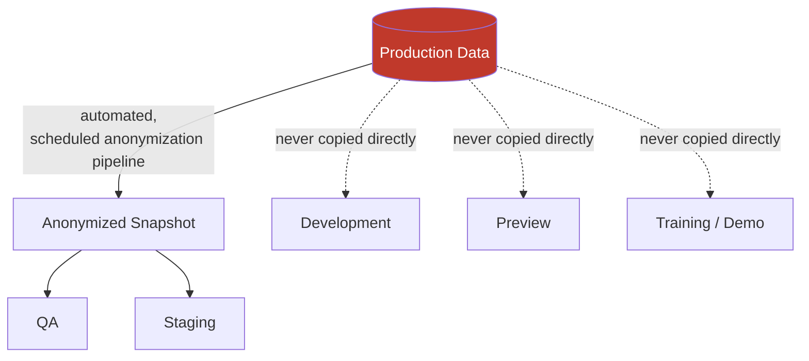

---

# Preview Environments

### Pull Request Environments

Every non-trivial pull request against `apps/web`, `apps/admin-web`, or `apps/api` triggers the automatic creation of a dedicated, isolated Preview environment scoped to that PR alone — giving a reviewer a live, running instance of the proposed change without needing to check the branch out locally, directly serving the Continuous Feedback commitment already established in `ai-docs/07-development-workflow.md`.

### Automatic Creation

A Preview environment is provisioned automatically the moment a PR is opened or updated, via the identical CI/CD pipeline mechanics already established in `ai-docs/17-cicd-standards.md` — never manually requested or manually provisioned, per Automation Over Manual Operations above.

### Automatic Destruction

A Preview environment is automatically, unconditionally destroyed the moment its PR is closed or merged — never left running "just in case," per the Automation and Cost Control principles below. Destruction includes every resource the environment provisioned: its database, its storage, and its DNS entry.

### Naming Conventions

| Element | Convention | Example |
|---|---|---|
| Preview subdomain | `pr-<number>.preview.arwal.in` | `pr-1284.preview.arwal.in` |
| Preview database | `preview_pr_<number>` | `preview_pr_1284` |
| Preview environment tag (IaC/CI) | `preview-pr-<number>` | `preview-pr-1284` |

### Lifecycle

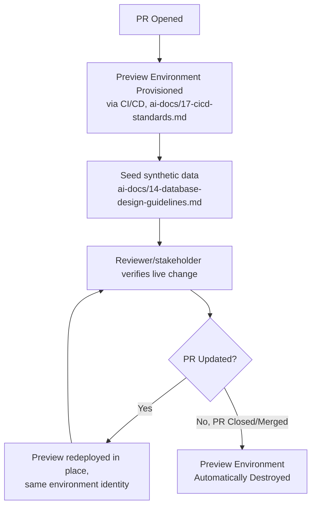

### Cost Control

Every Preview environment is provisioned at the smallest viable instance size — never Staging- or Production-scale resources — and a Preview environment idle beyond a defined inactivity window (e.g., no traffic and no PR update for 72 hours) is automatically flagged and torn down early, regardless of whether the PR is still open, per the same automated-cleanup discipline already established in Data Strategy above. A Preview environment's maximum lifetime is capped even for a long-lived, still-open PR — a PR open longer than that cap is itself a signal it has grown too large, per the Long-Lived Feature Branches anti-pattern already established in `ai-docs/06-git-workflow.md`.

---

# Environment Naming Standards

Naming is Convention over Configuration (`ai-docs/02-engineering-principles.md`) applied to the environment layer — it removes an entire category of "what do we call this in Staging" decision an engineer would otherwise re-litigate per environment.

| Resource Type | Convention | Example (Staging) | Example (Production) |
|---|---|---|---|
| **Applications/Services** | `<service-name>-<environment>` | `api-staging` | `api-production` |
| **Domains** | `<subdomain>.<environment>.arwal.in` (Production has no environment segment) | `api.staging.arwal.in` | `api.arwal.in` |
| **Databases** | `arwal_<module>_<environment>` | `arwal_bookings_staging` | `arwal_bookings_production` |
| **Storage (S3 buckets)** | `arwal-<purpose>-<environment>` | `arwal-documents-staging` | `arwal-documents-production` |
| **Queues** | `<module>:<queue-name>:<environment>` | `local-services:booking-confirm:staging` | `local-services:booking-confirm:production` |
| **Secrets (in the secrets-management system)** | `<environment>/<service>/<secret-name>` | `staging/payments/gateway-api-key` | `production/payments/gateway-api-key` |
| **Preview-specific resources** | See Preview Environments' Naming Conventions above | — | — |

Every environment name used anywhere in this table is drawn from a single, fixed, closed set: `local`, `development`, `qa`, `integration`, `preview`, `staging`, `production`, `dr`, `demo` — never an ad hoc or freely-typed string, mirroring the `NODE_ENV` enum discipline already established in `ai-docs/21-configuration-management-standards.md`.

---

# Access Control

Access to an environment is governed entirely by the Authentication, Authorization, and Least Privilege standards already fully established in `ai-docs/10-security-standards.md` — this document does not redefine RBAC, MFA, or the break-glass mechanism itself. This section defines only the **environment-scoped access tiering** those controls are applied against.

| Role | Local | Development | QA | Integration | Preview | Staging | Production | Disaster Recovery |
|---|---|---|---|---|---|---|---|---|
| **Individual Engineer** | Full (own machine) | Full | Read/interact | Read (automation-driven) | Full (own PRs) | Read + deploy via pipeline only | None (standing) | None (standing) |
| **QA Engineer** | — | Read | Full | Read | Read | Read + sign-off | None (standing) | None (standing) |
| **DevOps / Release Manager** | — | Full | Full | Full | Full | Full | Deploy via pipeline + break-glass eligible | Deploy via pipeline + break-glass eligible |
| **On-Call Engineer** | — | Read | Read | Read | Read | Read | Break-glass eligible during a declared incident | Break-glass eligible during a declared disaster |
| **Government Technical Partner** | — | — | — | — | — | Scoped, logged demo access (rare) | None (standing) | None (standing) |

### Developer Access

Standing access to Local, Development, and Preview environments is granted broadly across the engineering team, per the low-sensitivity data classification those environments carry — this is the intentional, low-friction end of the access spectrum, since blocking iteration speed on low-risk environments provides no proportionate security benefit.

### QA Access

Standing, full access to the QA environment is granted to the QA team and Engineering; access to Staging is read-plus-sign-off, never standing deploy authority, since Staging's promotion is governed by the Release Readiness Workflow (`ai-docs/07-development-workflow.md`), not by any individual QA engineer's discretion.

### Operations Access

DevOps and Platform Engineering roles hold the broadest standing access across the environment set, since operating and maintaining every environment — not merely Production — is their explicit function; this access is still scoped per Least Privilege within each environment (e.g., a DevOps engineer's Production access is deploy-pipeline-scoped, not ambient database access, per `ai-docs/10-security-standards.md`).

### Production Access

No individual engineer holds standing, ambient access to Production infrastructure, data, or credentials, regardless of seniority — per the Production Access Control standard already established in `ai-docs/16-deployment-standards.md`. All Production interaction flows through the approved deployment pipeline (`ai-docs/17-cicd-standards.md`) or, exceptionally, a logged, time-bound break-glass procedure.

### Break-Glass Procedures

A break-glass access grant into Production or Disaster Recovery is time-bound, requires explicit, recorded justification, and is captured in the immutable audit trail — the full mechanism (approval flow, automatic expiry, mandatory post-hoc review) is governed entirely by `ai-docs/10-security-standards.md`'s Admin Privileges standard and is not redefined here; this document affirms only that break-glass is the **sole** exception to "no standing Production access," never a routine, informally-repeated convenience.

### Approval Process

| Access Change | Required Approval |
|---|---|
| Standing access to Development/Preview/Integration | Team lead sign-off, provisioned as part of onboarding |
| Standing access to QA | Team lead sign-off |
| Standing deploy-pipeline access to Staging | Tech Lead + DevOps sign-off |
| Any standing access to Production or Disaster Recovery infrastructure | Not granted, by design — see Production Access above |
| Break-glass grant | Per the approval and logging mechanism in `ai-docs/10-security-standards.md` |
| Scoped, time-bound government-partner demo access | Product + Security-context reviewer sign-off, logged and expiring automatically |

---

# Deployment Readiness

A change is never promoted to the next environment until every applicable readiness item below is satisfied — this section names the environment-promotion-specific gate; the full mechanics of each underlying check are governed by the phase document cited.

| Readiness Item | Verified Before Promotion To | Governing Document |
|---|---|---|
| Unit, integration, and (where applicable) E2E tests passing | Development → QA/Integration | `ai-docs/15-testing-standards.md` |
| Code review approved, all Blocking comments resolved | Development (merge itself) | `ai-docs/06-git-workflow.md` |
| Security checks passed (SAST, dependency scan, secret scan) | Every promotion | `ai-docs/10-security-standards.md`, `ai-docs/17-cicd-standards.md` |
| Database migration verified against an isolated test database and reviewed for rollout-safety | QA/Staging | `ai-docs/14-database-design-guidelines.md` |
| Performance validation completed (budgets respected; load-tested where risk warrants) | Staging → Production | `ai-docs/11-performance-standards.md` |
| Accessibility checks passed (automated + manual, for UI changes) | Staging → Production | `ai-docs/12-accessibility-standards.md` |
| Full regression suite passing against the release candidate | Staging → Production | `ai-docs/15-testing-standards.md` |
| Rollback path confirmed available (previous artifact deployable, migration rollback-compatible) | Staging → Production | `ai-docs/16-deployment-standards.md` |
| Dashboards and alerting verified functioning for any new/changed service | Staging → Production | `ai-docs/18-observability-standards.md` |
| Production Readiness Checklist fully satisfied, sign-offs obtained | Staging → Production | `ai-docs/16-deployment-standards.md` |

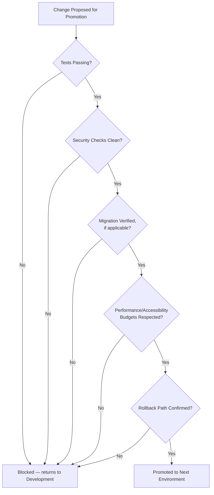

---

# Environment Health

### Health Checks

Every service in every shared environment exposes the identical `/health/live` and `/health/ready` contract already fully established in `ai-docs/18-observability-standards.md` — this document adds no new health-check mechanism; it affirms that health-check verification is a mandatory gate at every environment boundary, never assumed passing without being actively polled.

### Smoke Tests

Immediately after any deployment to any shared environment, the curated smoke-test suite already established in `ai-docs/16-deployment-standards.md`'s Post-Deployment Verification runs against that specific environment — a smoke-test failure blocks the environment from being considered "ready" for its next intended use (QA session, Staging soak, citizen traffic), regardless of which environment it occurred in.

### Availability Validation

An environment is not considered available for its intended purpose merely because its instances report a passing liveness check — availability validation additionally confirms the load balancer is correctly routing traffic, DNS resolves correctly for the environment's own domain (per Environment Naming Standards above), and every essential dependency (database, cache, queue) is reachable from within that environment's own isolated network segment.

### Readiness Verification

Per the Readiness Probe standard in `ai-docs/18-observability-standards.md`, an environment's overall readiness is the aggregate of every individual service's own readiness — a shared environment is never declared "ready for QA" or "ready for a Staging soak" while any citizen-critical-path service within it is still failing its own readiness check.

### Dependency Verification

Before an environment is used for its intended purpose, every external integration it depends on (a sandboxed payment gateway, a sandboxed SMS provider, per `ai-docs/15-testing-standards.md`'s Integration Testing table) is confirmed reachable and correctly configured for that specific environment — a QA session blocked because a sandbox credential silently expired is exactly the class of avoidable friction this verification step exists to catch before it wastes a human's time.

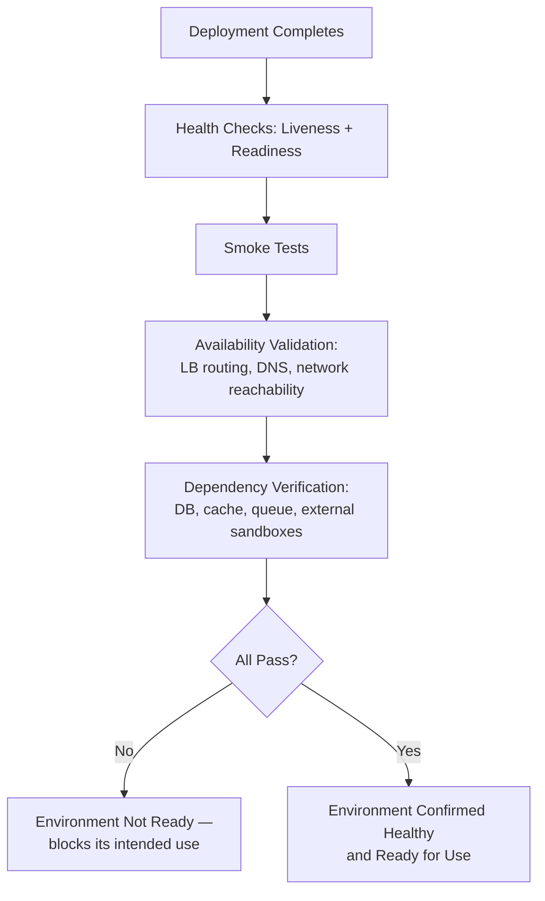

---

# Disaster Recovery Environment

### Purpose

The Disaster Recovery (DR) environment exists to restore citizen-facing service within the RTO/RPO targets already established in `ai-docs/16-deployment-standards.md`'s Disaster Recovery section, in the event Production's primary region becomes unavailable — it is Arwal's environment-layer expression of the same commitment.

### Activation Criteria

DR is activated **only** upon a formally declared disaster — a full regional outage or an equivalent catastrophic, non-recoverable-in-place Production failure, per the Regional Failures discussion in `ai-docs/16-deployment-standards.md` — never for a routine, single-AZ or single-instance failure, which Production's own Multi-AZ redundancy absorbs automatically without DR activation. Activation is declared through the identical Incident Response Workflow already established in `ai-docs/07-development-workflow.md`, at Sev 1 severity, never unilaterally by a single engineer.

### Synchronization Philosophy

DR's data is kept current via continuous replication of Production's backups and WAL archive to the secondary region, per the Point-in-Time Recovery mechanism already established in `ai-docs/14-database-design-guidelines.md` — DR is never manually or periodically "synced" via an ad hoc process; replication is a standing, monitored, automated pipeline, and replication lag is itself a monitored metric per `ai-docs/18-observability-standards.md`.

### Testing Cadence

A full disaster-recovery drill — simulating a complete primary-region loss and executing the actual, documented recovery runbook end to end — is performed on the identical semi-annual (minimum) cadence already established in `ai-docs/14-database-design-guidelines.md`'s Backup & Disaster Recovery section, and after any material change to the backup/recovery tooling or the DR environment's own IaC definitions.

### Recovery Validation

Every DR drill validates, and documents, three things: the **actual** RTO achieved versus the target, the **actual** data-loss window (RPO) versus the target, and the correctness of the recovered environment's data via an integrity check against known checkpoints — a drill that only confirms "the environment came up" without validating these three specifics is not a complete drill, per the same rigor already established in `ai-docs/16-deployment-standards.md`'s Disaster Recovery diagram.

### Relationship with Backup & Disaster Recovery Standards

The complete backup mechanics (WAL archiving, backup encryption, backup testing cadence), the RTO/RPO target table, and the recovery runbook itself are all already fully governed by `ai-docs/14-database-design-guidelines.md`'s Backup & Disaster Recovery section and `ai-docs/16-deployment-standards.md`'s Disaster Recovery section. This document does not redefine any of those mechanics — it defines only that Disaster Recovery is a **first-class, named environment type** in Arwal's environment taxonomy, subject to the identical isolation, naming, access-control, and parity disciplines every other environment in this document is held to.

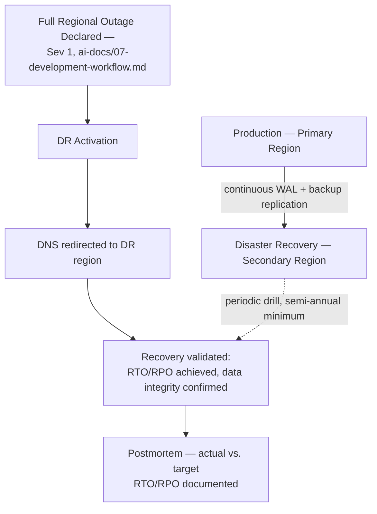

---

# Environment Lifecycle

### Creation

Every environment, without exception, is created from the same version-controlled Infrastructure as Code modules already established in `ai-docs/16-deployment-standards.md`, parameterized by that environment's own configuration values — never provisioned by an engineer clicking through a cloud console, per the same Infrastructure as Code mandate already established there.

### Maintenance

Every shared environment (every type except Local and Preview) receives the identical patch cadence, dependency-update cadence, and configuration-schema-parity verification as every other, per `ai-docs/22-dependency-management-standards.md`'s Update Categories and `ai-docs/21-configuration-management-standards.md`'s Configuration Parity standard — no environment is allowed to fall behind "because nobody's using it much right now," since an unmaintained environment is a silent parity violation waiting to surface at the worst possible moment (a Staging environment three major versions behind Production, discovered only when a Staging-verified release breaks in Production).

### Upgrade

An environment-wide upgrade (a new Node.js LTS line, a new PostgreSQL major version, per `ai-docs/09-tech-stack.md`'s Version Management Strategy) is rolled out to every environment in the identical promotion order this document already establishes — Development first, then QA/Integration, then Staging, then Production — never applied to Production first "to save time," and never applied to only one environment as a permanent, undocumented exception.

### Decommissioning

An environment that is no longer needed (a discontinued Training/Demo variant, a retired regional Disaster Recovery configuration superseded by a new one) is decommissioned deliberately: its data is archived or destroyed per the applicable retention policy, its DNS entries and secrets are revoked, and its IaC definition is removed from the repository in the same reviewed PR that tears down the running infrastructure — never left running, forgotten, unpatched, and unmonitored, which is precisely the Undocumented Environments anti-pattern named below.

### Archiving

Where an environment's data (not the environment itself) has ongoing audit or compliance value after decommissioning — a retired Training/Demo configuration's data does not, but a superseded Disaster Recovery region's final backup snapshot might — that data is archived per the identical cold-storage lifecycle already established for logs in `ai-docs/19-logging-standards.md`, never deleted outright without a documented retention decision.

### Ownership

Every environment has exactly one named owning team, recorded alongside its IaC definition — Platform/DevOps Engineering owns Production, Staging, Disaster Recovery, and the shared Development/QA/Integration environments; individual engineers own their own Local environments; the CI/CD pipeline's own service identity is the de facto "owner" of every ephemeral Preview environment, per the Folder Ownership Rules discipline already established in `ai-docs/04-folder-guidelines.md`, extended here to the environment layer.

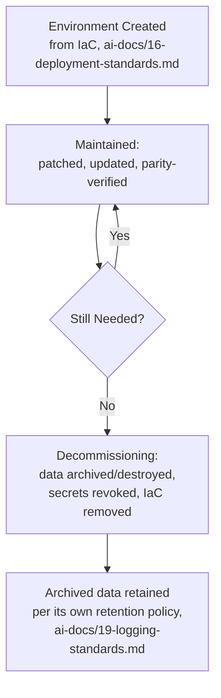

---

# Anti-Patterns

The following patterns are explicitly rejected, regardless of how convenient they appear under deadline pressure — each is a specific, previously observed failure mode in environment-heavy platforms, called out here so Arwal does not have to relearn the lesson expensively in production.

| Anti-Pattern | Description | Why It's Rejected |
|---|---|---|
| **Shared Databases** | Two environments (e.g., QA and Staging) pointed at the same database instance "temporarily." | Directly violates Environment Isolation above; a QA test run mutating data a Staging soak period depends on invalidates the entire evidentiary purpose of both environments simultaneously. |
| **Shared Secrets** | The same API key or database credential reused across two environments' configuration. | Violates Isolation and `ai-docs/10-security-standards.md`'s Environment-Specific Secrets standard; a lower-trust environment's compromise becomes a higher-trust environment's compromise. |
| **Manual Configuration Drift** | An engineer hand-edits a running Staging instance's environment variable to "test something quickly." | Violates Immutable Environments and Configuration Parity; the environment silently stops matching its IaC-defined source of truth, and the drift is invisible until it causes an unexplained discrepancy. |
| **Testing in Production** | Verifying a fix, a migration, or a new feature directly against Production because "it's basically the same as Staging." | Violates the Production-First Mindset and directly exposes real citizens to unverified risk — the entire purpose of every lower environment is to make this unnecessary. |
| **Production Data in Development** | Copying a Production database dump into a Development environment "just to debug this one issue faster." | An absolute, zero-exception prohibition per Data Strategy above and `ai-docs/10-security-standards.md`; Development's broad engineering access makes this one of the highest-severity possible data-exposure incidents. |
| **Environment Snowflakes** | An environment that has accumulated enough manual, undocumented changes that it can no longer be reliably reproduced from its IaC definition alone. | Violates Reproducibility above; a snowflake environment is, by definition, no longer trustworthy evidence about anything, since nobody can say with certainty what it actually consists of. |
| **Long-Lived Preview Environments** | A Preview environment kept alive for weeks because its PR has been open "just a little longer." | Violates Cost Control and the Long-Lived Feature Branches discipline already established in `ai-docs/06-git-workflow.md`; an open-ended Preview environment is both a standing cost and a signal the underlying PR itself has grown too large. |
| **Undocumented Environments** | An environment provisioned outside the standard IaC/promotion flow — a one-off EC2 instance an engineer spun up for a demo and never tore down. | Violates Automation Over Manual Operations and Ownership above; an environment nobody has formally acknowledged exists is an environment nobody is patching, monitoring, or securing, and is a standing, invisible attack surface. |

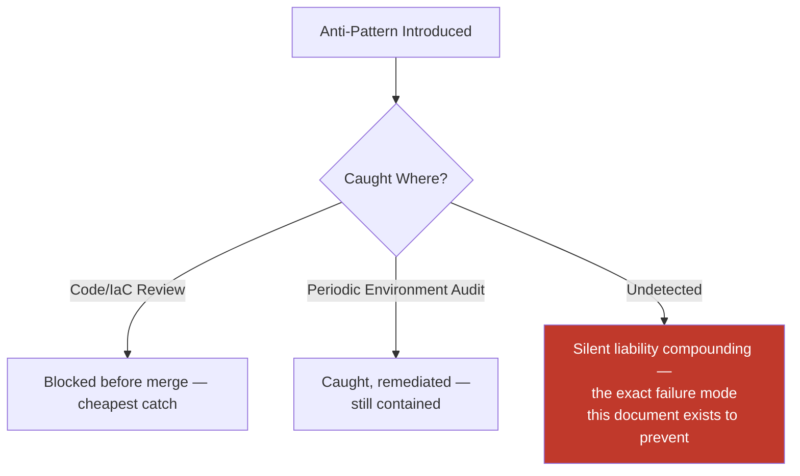

---

# Engineering Review Checklist

Every pull request or change proposal introducing, modifying, or decommissioning an environment — its IaC definition, its promotion path, its data policy, or its access grants — is checked against the following before merge:

- [ ] **Environment type correctly classified** — The environment fits one of the nine defined types (Local/Development/QA/Integration/Preview/Staging/Production/Disaster Recovery/Training-Demo), never an undocumented tenth category.
- [ ] **Provisioned entirely via Infrastructure as Code** — No console-provisioned resource, per `ai-docs/16-deployment-standards.md`.
- [ ] **Isolation verified across every dimension** — Database, cache, queue, storage, secrets, domain, monitoring, logging, network, and IAM are all independently scoped to this environment alone.
- [ ] **Parity confirmed** — Infrastructure, software, dependency, configuration, and operational parity with its peer environments are intact; any deviation is explicitly documented as Acceptable per the table above.
- [ ] **Data policy correctly applied** — Only the permitted data category (per the Data Strategy table) is used; no Production data present outside Production/Disaster Recovery.
- [ ] **Naming convention followed** — Every resource name matches the Environment Naming Standards table exactly.
- [ ] **Access control matches the Access Control tiering table** — No standing Production/DR access granted to an individual engineer; break-glass is the sole exception, per `ai-docs/10-security-standards.md`.
- [ ] **Deployment readiness gates respected** — The environment's promotion path enforces every applicable item in the Deployment Readiness table before advancing a change further.
- [ ] **Health/readiness/smoke verification wired in** — The environment is confirmed healthy before being declared ready for its intended use, per Environment Health above.
- [ ] **Ownership assigned** — A named owning team is recorded for the environment, per Environment Lifecycle's Ownership standard.
- [ ] **Lifecycle plan exists** — Creation, maintenance cadence, and (for a temporary/Preview environment) automatic destruction are all defined, never left open-ended.
- [ ] **No anti-pattern present** — The change does not introduce a shared database/secret, manual drift, Production testing, Production data misuse, a snowflake, an unbounded Preview lifetime, or an undocumented environment.
- [ ] **No duplication of Deployment, Configuration, Security, CI/CD, or Observability standards** — Any such concern is deferred entirely to its owning phase document (`ai-docs/16`, `ai-docs/21`, `ai-docs/10`, `ai-docs/17`, `ai-docs/18`), never redefined here.

A pull request or change proposal failing any item above is not merged until resolved — this checklist carries the same non-negotiable authority as every other review checklist established in the preceding twenty-three phase documents.

---

# Relationship to Previous Standards

### Deployment Standards

`ai-docs/16-deployment-standards.md` owns the full mechanics of how software actually reaches and runs safely inside an environment — infrastructure topology, containerization, deployment strategies, rollback, and disaster-recovery mechanics. This document owns the **environment as a governed concept**: how many exist, what each is for, how a change is promoted between them, and how each environment's entire lifecycle — not a single deployment event — is managed. Every "deployed to X" reference in this document defers entirely to `ai-docs/16-deployment-standards.md` for the deployment mechanics themselves.

### Configuration Management

`ai-docs/21-configuration-management-standards.md` owns configuration's categories, naming, typing, validation, and versioning in full. This document owns the environment topology that configuration schema is parameterized against, and the parity/isolation rules that make each environment's configuration set trustworthy relative to its peers — this document never redefines a configuration category or naming rule.

### Security Standards

`ai-docs/10-security-standards.md` owns the complete security control set — authentication, authorization, encryption, data classification, and incident response — applied identically regardless of environment. This document owns the environment-scoped boundary those controls are applied within: which environment may hold which data classification tier, and which access tier is permitted into which environment.

### CI/CD Standards

`ai-docs/17-cicd-standards.md` owns the automated pipeline mechanics — the workflows, the quality gates, the artifact production — that physically move a verified change from one environment to the next. This document owns the environment topology those pipelines target and the readiness gates a pipeline enforces at each promotion boundary; it never redefines a workflow file or a pipeline stage.

### Observability Standards

`ai-docs/18-observability-standards.md` owns metrics, traces, dashboards, alerting, and SLI/SLO mechanics, applied per environment via the `deployment.environment` resource attribute. This document owns the requirement that every environment *have* this instrumentation and be verifiably healthy before use — it never redefines a metric, a dashboard, or an alert rule.

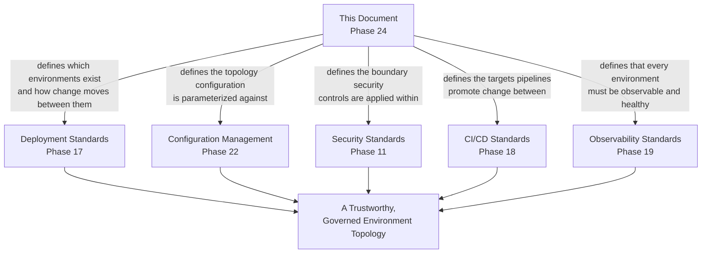

---

# Closing Statement

> **Callout — Closing Statement**
> Every preceding phase document described a dimension of how Arwal is built, secured, tested, deployed, observed, logged, and configured. This document describes the **world** all of that discipline actually runs inside of — the nine distinct, isolated, deliberately governed environments a single line of code passes through between an engineer's first keystroke and a citizen's completed booking. A perfectly engineered feature, verified by a perfect test suite, means nothing if the environment it was verified in was never actually a trustworthy stand-in for the one a citizen depends on — an environment strategy that is disciplined, consistent, and reproducible is not bureaucracy layered on top of engineering; it is the precondition that makes every other governance document in this project *mean* what it claims to mean. For every one of the ~300 micro-phases still ahead — as Arwal grows from a single founding district to many, from a handful of engineers to hundreds, and from a modular monolith toward independently deployed services — the environments this document defines are the stable, trustworthy ground every other discipline is built on. Where a future phase must deviate from a standard stated here, that deviation is made explicitly — through the Engineering Review Checklist's approval process, or an Architectural Decision Record where the deviation is structural — never silently, and never by default.

This document, `ai-docs/23-environment-strategy.md`, is Phase 24 of approximately 300. Every environment provisioned, promoted through, or decommissioned in the phases that follow is expected to satisfy the standards defined here, or to justify its deviation in writing.

**End of Phase 24 — `ai-docs/23-environment-strategy.md`**