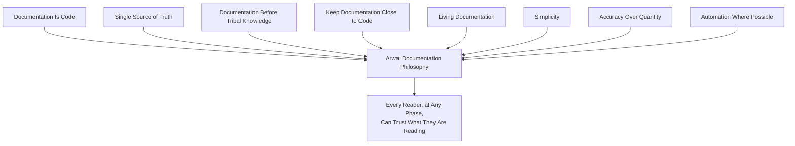
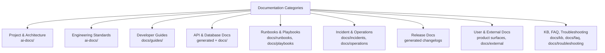
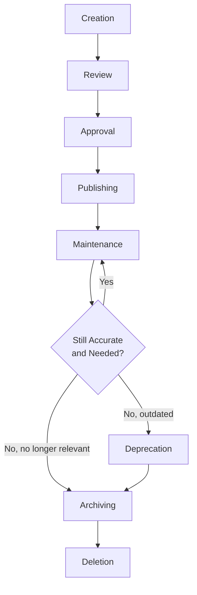
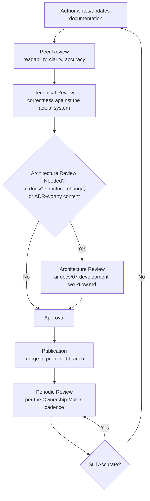
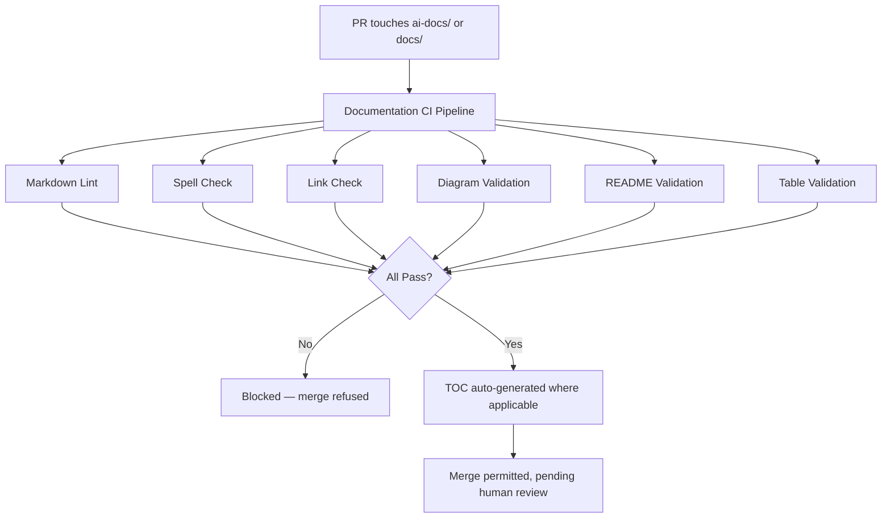
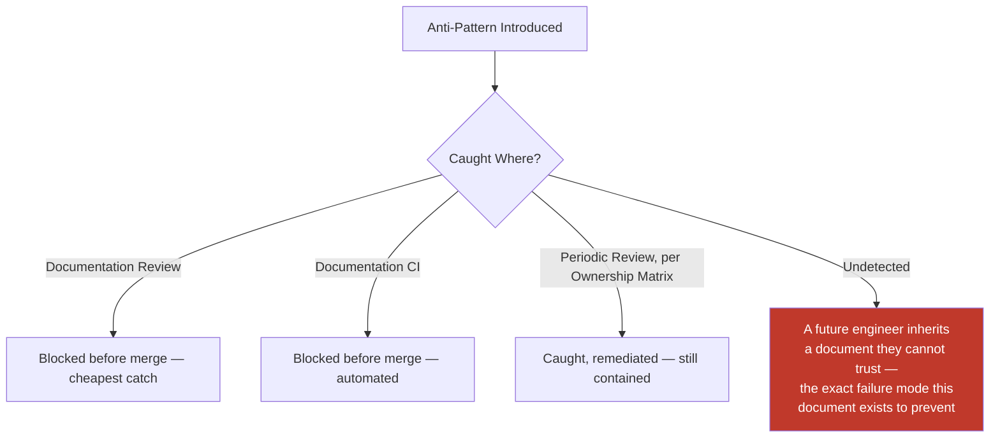
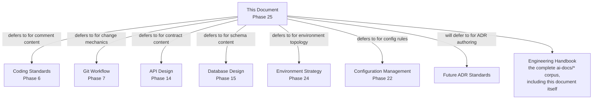

# Documentation Standards

**Document:** `ai-docs/24-documentation-standards.md`
**Project:** Arwal — The District Super App
**Stage:** 1 — Foundation
**Phase:** 25 — Documentation Standards
**Status:** Approved for Engineering Reference
**Audience:** Architects, Engineers, Engineering Managers, Technical Writers, DevEx Leads, QA Engineers, Technical Reviewers, Government Technical Partners, New Engineers Onboarding

> **Callout — Purpose of This Document**
> `ai-docs/00-project-vision.md` defined why Arwal exists. `ai-docs/01-product-goals.md` defined what Arwal must achieve. `ai-docs/02-engineering-principles.md` through `ai-docs/23-environment-strategy.md` defined every enforceable engineering discipline governing how Arwal is designed, written, secured, tested, deployed, observed, logged, configured, and operated. Every one of those documents *is itself* documentation — and every one of them will be read, misread, extended, and eventually amended by an engineer who was not present when it was written. This document defines **the discipline that keeps every other document trustworthy**: how documentation is structured, written, reviewed, versioned, owned, and retired, for every one of the ~300 micro-phases still ahead.

---

# Purpose of this Document

### Why Documentation Matters

A codebase that works but cannot be understood is not an asset — it is a liability with a delayed invoice. Every phase document preceding this one exists because Arwal's founders judged that writing the reasoning down, once, precisely, and citably, was cheaper than re-litigating it a hundred times across a ~300-phase, multi-year roadmap. Documentation is the mechanism that makes that judgment durable: it is what lets an engineer joining at Phase 180 inherit the reasoning behind a decision made at Phase 12, without needing to track down whoever made it. Per the Documentation-Driven Development commitment already established in `ai-docs/00-project-vision.md`, documentation at Arwal is not a courtesy extended to future readers — it is a load-bearing part of the engineering system itself.

### Documentation as Engineering Infrastructure

Arwal treats documentation with the same seriousness it treats a database migration (`ai-docs/14-database-design-guidelines.md`) or a deployment pipeline (`ai-docs/17-cicd-standards.md`): as infrastructure that other work depends on being correct, current, and available. A missing README is not a minor inconvenience — it is a missing piece of infrastructure exactly as a missing health check (`ai-docs/18-observability-standards.md`) is. This reframing is deliberate: infrastructure is budgeted for, reviewed, monitored, and repaired when it breaks; a "nice to have" is postponed indefinitely. Documentation at Arwal is budgeted for, reviewed, monitored, and repaired.

### Documentation Lifecycle

Every piece of documentation Arwal produces — from this handbook to a single module's README — passes through the same conceptual lifecycle: **Creation** (written alongside the work it documents, never after, per the Documentation-First principle already established in `ai-docs/07-development-workflow.md`), **Review** (verified for accuracy and clarity before publication), **Publication** (made discoverable at its correct, conventional location), **Maintenance** (kept current as the system it describes evolves), and **Deprecation/Archiving** (retired deliberately when it no longer reflects reality, never left to quietly mislead). See Documentation Lifecycle below for the full standard.

### Documentation Ownership

Every piece of documentation has exactly one named owner, accountable for its accuracy — the documentation-layer expression of the Folder Ownership Rules already established in `ai-docs/04-folder-guidelines.md` and the Alert Ownership standard already established in `ai-docs/18-observability-standards.md`. Undocumented ownership is, in practice, no ownership at all: a README nobody is accountable for is a README that drifts from reality the first time the code it describes changes and nobody notices.

### Relationship with Coding Standards

`ai-docs/05-coding-standards.md` already defines, in full, the Commenting Standards governing inline "why" comments, `TODO`/`FIXME` markers, and ADR references at the point of implementation — this document does not redefine any of that. This document governs documentation as a **standalone artifact** — a README, a guide, a runbook — never a single line of code's accompanying comment. Where this document references a code comment, it defers entirely to `ai-docs/05-coding-standards.md`.

### Relationship with ADRs

Architectural Decision Records are introduced across `ai-docs/02-engineering-principles.md` and `ai-docs/03-system-architecture-principles.md` and will receive their own complete, dedicated standard in a future phase document (`ai-docs/adr/` conventions, ADR numbering, and the full ADR lifecycle). This document does not define how an ADR itself is authored or numbered — it defines only how other documentation **references** an ADR once one exists, per ADR References below, and affirms that this handbook's own governance is subject to that same future ADR discipline for any structural change to itself.

### Relationship with the Engineering Handbook

"Engineering Handbook" is the informal name for the complete set of `ai-docs/*` phase documents taken together — the living, cross-referenced body of standards this document is itself the twenty-fifth chapter of. This document defines the rules that keep every other chapter of that handbook (and every piece of documentation outside it — READMEs, runbooks, API docs) held to a single, consistent, citable standard, exactly as `ai-docs/05-coding-standards.md` does for source code and `ai-docs/14-database-design-guidelines.md` does for schemas.

---

# Documentation Philosophy

Arwal's documentation practice rests on eight commitments. Together they answer the question every subsequent section of this document exists to make concrete: **what does "documentation can be trusted" actually require, by default, before a single Markdown file is written?**

### Documentation Is Code

Documentation lives in the same repository, moves through the same Git workflow (`ai-docs/06-git-workflow.md`), and is reviewed with the same rigor as application code — a `docs/*` branch, a Conventional Commit message, a pull request. This exists because documentation kept outside version control (a wiki nobody links back to the repository, a shared drive folder) inevitably drifts from the code it describes with no mechanism to catch the drift, exactly the failure mode `ai-docs/04-folder-guidelines.md`'s "a folder structure is a form of documentation that cannot go stale" reasoning already warns against — treating documentation as code is what extends that same non-staleness guarantee to prose.

### Single Source of Truth

Every fact has exactly one authoritative document — the documentation-layer expression of the Single Source of Truth principle already established in `ai-docs/02-engineering-principles.md`. A deployment procedure is documented once, in the runbook that owns it, and every other document that needs to reference it links to that runbook rather than repeating it. This exists because a fact copied into two documents will, eventually, be updated in only one of them — and the reader has no way to know which copy is current.

### Documentation Before Tribal Knowledge

Any operational knowledge that exists only in an engineer's head is treated as an unacceptable, standing risk — the moment that engineer is unavailable, on leave, or has left the team, the knowledge is gone. This exists because Arwal's ~300-phase roadmap and eventual hundreds-of-engineers team size make tribal knowledge a mathematical certainty of failure: the probability that the one person who remembers why a queue is configured a certain way is unavailable at the exact moment that knowledge is needed only grows as the team grows.

### Keep Documentation Close to Code

A module's documentation lives beside the module it describes (`apps/api/src/modules/<module>/README.md`, per the Documentation Organization already established in `ai-docs/04-folder-guidelines.md`), never centralized into a single, disconnected documentation repository. This exists because proximity is what makes documentation discoverable at the exact moment an engineer needs it — a README an engineer must actively remember to go find in a separate system is a README that will eventually be forgotten, while a README sitting in the same folder as the code is found simply by looking.

### Living Documentation

Documentation is a continuously maintained artifact, not a one-time deliverable produced at a feature's launch and never revisited — mirroring the Continuous Verification commitment already established across `ai-docs/10-security-standards.md`, `ai-docs/11-performance-standards.md`, and `ai-docs/18-observability-standards.md`. This exists because a document that was accurate on the day it was written and never updated since is, by definition, drifting toward inaccuracy the moment the code it describes next changes — living documentation treats that drift as a defect to be actively prevented, not an inevitability to be tolerated.

### Simplicity

Documentation is written in the plainest language that correctly conveys the idea — never padded with unnecessary formality, jargon, or length to appear more authoritative. This exists because the purpose of documentation is to transfer understanding as efficiently as possible; a document that takes twice as long to read without conveying twice the understanding has failed its purpose regardless of how polished its prose looks.

### Accuracy Over Quantity

A short, correct document is worth more than a long, comprehensive one that is subtly wrong in places — Arwal never rewards documentation volume as a proxy for documentation quality. This exists because an inaccurate document is worse than no document at all (per the same reasoning `ai-docs/20-error-handling-standards.md` applies to a silently swallowed error): a missing document prompts an engineer to ask a question; a wrong document confidently gives them the wrong answer.

### Automation Where Possible

Anything that can be generated, validated, or verified mechanically is — never left to a human's memory to keep current, per the Automation principle already established throughout `ai-docs/16-deployment-standards.md`, `ai-docs/17-cicd-standards.md`, and `ai-docs/18-observability-standards.md`. OpenAPI specifications are generated from code (`ai-docs/13-api-design-guidelines.md`), never hand-maintained; a table of contents is generated, never hand-updated; a broken link is caught by a linter, never discovered by a frustrated reader. See Documentation Automation below for the full standard.



> **Callout — The One-Sentence Documentation Philosophy**
> *"Documentation that isn't trusted isn't read, and documentation that isn't read might as well not exist — every standard in this document exists to keep Arwal's documentation worth trusting, for a reader who wasn't there when it was written."*

---

# Documentation Categories

Every document Arwal produces belongs to exactly one of the following categories, each with a distinct purpose, primary audience, and home location — mirroring the never-one-blunt-mechanism discipline already established for State Management (`ai-docs/02-engineering-principles.md`) and Configuration (`ai-docs/21-configuration-management-standards.md`), applied here to documentation.

| Category | Purpose | Primary Audience | Home Location |
|---|---|---|---|
| **Project Documentation** | Describes what Arwal is, its vision, goals, and scope — `ai-docs/00`–`01`. | Everyone; investors, government partners | `ai-docs/` |
| **Architecture Documentation** | Describes how the system is structured — `ai-docs/03`, `ai-docs/14`. | Architects, senior engineers | `ai-docs/`, `docs/architecture/` |
| **Engineering Standards** | The full `ai-docs/02`, `05`–`23` governance set. | Every engineer | `ai-docs/` |
| **Developer Guides** | How-to material for a specific task — "how to add a new module," "how to run E2E tests locally." | Engineers actively working in the codebase | `docs/guides/` |
| **API Documentation** | The contract a client integrates against, per `ai-docs/13-api-design-guidelines.md`. | Frontend/mobile engineers, third-party integrators | Generated OpenAPI spec, referenced from `docs/api/` |
| **Database Documentation** | Schema, relationships, and data-flow narrative, per `ai-docs/14-database-design-guidelines.md`. | Backend engineers, DBAs | Module READMEs, `docs/database/` |
| **Infrastructure Documentation** | Topology, environments, and provisioning, per `ai-docs/16`, `ai-docs/23`. | DevOps, SRE, Platform Engineers | `infrastructure/README.md`, `docs/infrastructure/` |
| **Runbooks** | Step-by-step operational procedures for a routine, known task (a scheduled failover test, a manual data-backfill trigger). | On-call engineers, DevOps | `docs/runbooks/` |
| **Playbooks** | Decision-tree guidance for a class of situation without one fixed procedure (a suspected data-integrity anomaly). | On-call engineers, incident responders | `docs/playbooks/` |
| **Incident Documentation** | Postmortems and incident timelines, per the Incident Response Workflow in `ai-docs/07-development-workflow.md`. | Engineering, leadership | `docs/incidents/` |
| **Operations Documentation** | Day-to-day operational reference — on-call rotation, escalation paths. | On-call engineers, DevOps | `docs/operations/` |
| **Release Documentation** | Changelogs and release notes, per `ai-docs/06-git-workflow.md`'s Changelog Generation. | Everyone; government partners | Generated, referenced from `docs/releases/` |
| **User Documentation** | Citizen/merchant/officer-facing help content (outside this handbook's engineering scope, but linked for context). | Citizens, merchants, government officers | The product's own in-app help surfaces |
| **Internal Documentation** | Anything not intended for external or citizen-facing consumption — most of this handbook. | Arwal engineers and partners | `ai-docs/`, `docs/` |
| **External Documentation** | Anything shared outside Arwal — a government-partner integration guide, a public API reference. | Government technical partners, third-party integrators | `docs/external/`, published API portal |
| **Knowledge Base Articles** | A focused answer to a single recurring question, distinct from a full guide. | Engineers, support staff | `docs/kb/` |
| **FAQ** | A curated set of frequently asked questions, per topic area. | New engineers, cross-team readers | `docs/faq/` |
| **Changelogs** | An auto-generated, chronological record of what shipped, per `ai-docs/06-git-workflow.md`. | Everyone | Generated per release |
| **Migration Guides** | How to move from one version/pattern/API to another, per a breaking change (`ai-docs/13-api-design-guidelines.md`'s Deprecation Policy). | Engineers, integrators affected by the change | `docs/migrations/` |
| **Troubleshooting Guides** | Symptom-to-resolution reference for a known class of problem. | Engineers, on-call, support | `docs/troubleshooting/` |



---

# Repository Documentation Structure

### README Hierarchy

Documentation lives at four nested levels, each answering a progressively narrower question, mirroring the Feature-First, nested organization already established in `ai-docs/04-folder-guidelines.md`:

| Level | Answers | Example |
|---|---|---|
| **Root README** | "What is this repository, and how do I get started?" | `/README.md` |
| **App README** | "What is this specific deployable surface, and how do I run it?" | `apps/api/README.md` |
| **Package README** | "What is this shared package, and how do I use it?" | `packages/ui/README.md` |
| **Module README** | "What is this bounded context, and what is its domain boundary?" | `apps/api/src/modules/local-services/README.md` |

### Repository Tree

```
arwal/
├── README.md                          # Root — repository entry point
├── CONTRIBUTING.md                    # Contribution workflow, cross-referenced from every README
├── CODEOWNERS                         # Ownership mapping, per Folder Ownership Rules
├── LICENSE
│
├── ai-docs/                           # Phase-numbered, authoritative governance documents
│   ├── 00-project-vision.md
│   ├── 01-product-goals.md
│   ├── ...
│   ├── 24-documentation-standards.md
│   └── adr/                           # Architectural Decision Records (future phase standard)
│       ├── 0001-modular-monolith-first.md
│       └── README.md                  # ADR index + numbering convention
│
├── docs/                              # Operational, day-to-day documentation
│   ├── guides/                        # Developer how-to guides
│   ├── runbooks/                      # Step-by-step operational procedures
│   ├── playbooks/                     # Decision-tree operational guidance
│   ├── incidents/                     # Postmortems
│   ├── operations/                    # On-call, escalation, day-to-day reference
│   ├── releases/                      # Release notes (generated)
│   ├── migrations/                    # Breaking-change migration guides
│   ├── troubleshooting/               # Symptom-to-resolution guides
│   ├── kb/                            # Knowledge base articles
│   ├── faq/                           # Frequently asked questions
│   ├── external/                      # Government-partner-facing documentation
│   ├── architecture/                  # Supplementary architecture diagrams/notes
│   ├── database/                      # Supplementary schema documentation
│   ├── infrastructure/                # Supplementary infrastructure documentation
│   ├── assets/                        # Images referenced by docs/
│   └── diagrams/                      # Source files for Mermaid/diagram assets
│
├── apps/
│   ├── api/
│   │   ├── README.md                  # App README
│   │   └── src/modules/
│   │       └── local-services/
│   │           └── README.md          # Module README
│   ├── web/
│   │   └── README.md
│   └── ...
│
└── packages/
    ├── ui/
    │   └── README.md                  # Package README
    └── ...
```

### `docs/` vs. `ai-docs/`

`ai-docs/` is reserved exclusively for the phase-numbered, foundational governance documents (this handbook itself) and Architectural Decision Records — content intended to be a durable, citable, rarely-changing reference, per the Root Folder Guidelines already established in `ai-docs/04-folder-guidelines.md`. `docs/` is reserved for operational, more frequently updated content — guides, runbooks, troubleshooting material — the "how do I actually work in this repository day to day" counterpart already distinguished from `ai-docs/` in that same document. A document is never placed in the wrong one of these two folders "because it seemed close enough" — the distinction is load-bearing, since `ai-docs/` content carries the elevated review rigor of a foundational-phase change (per the ADR discipline already established in `ai-docs/02-engineering-principles.md`), while `docs/` content follows the standard PR review already established in `ai-docs/06-git-workflow.md`.

### `assets/` and `diagrams/`

Images referenced by any document in `docs/` live under `docs/assets/`, following the same Asset Organization discipline already established in `ai-docs/04-folder-guidelines.md` — never embedded as a base64 blob inside a Markdown file, and never hot-linked from an external, un-owned source. Diagram **source files** (a `.mermaid` file, a draw.io source, a Figma export reference) live under `docs/diagrams/`, distinct from the rendered image asset, so a diagram can be edited and regenerated rather than redrawn from scratch — see Diagrams below for the full standard.

---

# README Standards

### Required Sections by Level

Every README includes the sections marked **Required** at its level; sections marked **Conditional** are included only where genuinely applicable, never included as an empty placeholder header per the Anti-Patterns section below.

| Section | Root | App | Package | Module |
|---|---|---|---|---|
| **Purpose** | Required | Required | Required | Required |
| **Overview** | Required | Required | Required | Required |
| **Architecture** | Required (links out) | Required | Conditional | Required (domain boundary) |
| **Installation** | Required | Required | Conditional | — |
| **Configuration** | Conditional (links out) | Required | Conditional | — |
| **Running Locally** | Required | Required | Conditional | — |
| **Testing** | Required (links out) | Required | Required | Required (links to module `tests/`) |
| **Deployment** | Conditional (links out) | Required (links out) | — | — |
| **Folder Structure** | Required | Conditional | Conditional | Conditional |
| **Dependencies** | Conditional | Required | Required | Conditional |
| **Contributing** | Required (links to `CONTRIBUTING.md`) | Conditional | Conditional | — |
| **Troubleshooting** | Conditional | Conditional | Conditional | Conditional |
| **License** | Required | — | Conditional | — |
| **Contacts / Ownership** | Required | Required | Required | Required |

### Section Definitions

- **Purpose** — One or two sentences: why this thing exists, in the context of Arwal's mission (`ai-docs/00-project-vision.md`).
- **Overview** — A short, plain-language description of what the reader is looking at.
- **Architecture** — For a module, this is its domain boundary per `ai-docs/03-system-architecture-principles.md`: what it owns, what it exposes, what it is forbidden from doing. For an app, a link to the relevant architecture diagram.
- **Installation** — The exact, minimal steps to get the code running from a clean checkout.
- **Configuration** — Which environment variables this app/package requires, linking to `ai-docs/21-configuration-management-standards.md` for the full discipline rather than restating it.
- **Running Locally** — The exact command(s) to start the service or package in local development, per `ai-docs/09-tech-stack.md`'s Docker Compose standard.
- **Testing** — How to run this scope's test suite locally, linking to `ai-docs/15-testing-standards.md` rather than restating the Testing Pyramid.
- **Deployment** — A link to `ai-docs/16-deployment-standards.md` and `ai-docs/17-cicd-standards.md`; a README never restates deployment mechanics.
- **Folder Structure** — For a module, a link to (never a restatement of) the Module Folder Template in `ai-docs/04-folder-guidelines.md`.
- **Dependencies** — The genuinely notable direct dependencies and why they were chosen, linking to `ai-docs/22-dependency-management-standards.md` for the full policy.
- **Contributing** — A link to the root `CONTRIBUTING.md`; never duplicated per README.
- **Troubleshooting** — Only the specific, recurring issues genuine to this scope; a generic troubleshooting section is a sign it belongs in `docs/troubleshooting/` instead.
- **License** — Present only at the root, per standard open-source/commercial-repository convention.
- **Contacts / Ownership** — The named owning team, per Documentation Ownership below — never omitted, at any level.

> **Callout — A README Is a Pointer, Not a Duplicate**
> Per Single Source of Truth above, a README's Configuration, Testing, and Deployment sections **link to** the governing phase document — they never restate its rules. A README that duplicates `ai-docs/21-configuration-management-standards.md`'s content is a README that will drift the moment that document is amended and this one is not.

---

# Markdown Standards

### Headings

A single `#` (H1) per document, matching the document's title; sections use `##` (H2) and below, nested logically, never skipping a level purely for visual sizing — the identical discipline already established for semantic HTML headings in `ai-docs/12-accessibility-standards.md`, applied here to Markdown's own heading hierarchy.

### Tables

Used for any genuinely tabular comparison (a decision matrix, a review checklist's structured form) — never for layout. Every table has a header row; columns are aligned for source readability where practical, though rendered output is what matters, not raw-source alignment.

### Lists

An unordered list (`-`) for a set of items with no inherent sequence; an ordered list (`1.`) for a genuine sequence of steps (an installation procedure, a runbook's procedure). A list is never used as a substitute for prose where prose would communicate a relationship between ideas more clearly.

### Code Blocks

Every code block declares its language for correct syntax highlighting (` ```typescript `, ` ```sql `, ` ```bash `) — an undeclared, bare ` ``` ` block is a review-blocking omission, since it degrades both readability and any automated code-block linting (see Documentation Automation below).

### Callouts

A blockquote-styled `> **Callout — <Title>**` pattern, matching the convention already used consistently across every `ai-docs/*` document, is Arwal's standard callout format — used to highlight a single, especially load-bearing point a reader should not skim past. Callouts are used sparingly; a document that callouts every paragraph has callouts that mean nothing.

### Images

Every image includes descriptive alt text, per the Accessibility Standards already established in `ai-docs/12-accessibility-standards.md` extended here to documentation itself — an image with no alt text is inaccessible to a screen-reader-using engineer reading the documentation, exactly as it would be to a citizen using the product.

### Links

Every link is either a relative path to another file in the repository (preferred, since it survives a repository rename/move) or a full, stable external URL — never a bare, unlabeled URL dropped into prose; link text describes the destination ("see the Module Folder Template") rather than reading "click here," mirroring the Link Text standard already established in `ai-docs/12-accessibility-standards.md`.

### Mermaid

Every diagram embedded in Markdown uses Mermaid syntax rendered natively by GitHub and the documentation tooling, per the convention already established throughout every `ai-docs/*` document — never a screenshot of an externally-authored diagram tool's output, since a screenshot cannot be diffed, reviewed, or kept in sync with the system it describes the way a Mermaid source block can. See Diagrams below for the full standard.

### Naming Conventions

| Element | Convention | Example |
|---|---|---|
| Markdown files | `kebab-case`, phase-numbered where applicable | `24-documentation-standards.md`, `booking-flow-guide.md` |
| Headings | Sentence case, not Title Case | `## Running the service locally`, not `## Running The Service Locally` |
| Anchors/slugs | Auto-generated from headings; never hand-crafted to diverge from the heading text | — |

### Formatting

- **Line length**: Markdown source is not hard-wrapped at a fixed column; prose flows naturally and is wrapped by the renderer — hard-wrapping produces unnecessary diff noise on every edit, violating the same Atomic Commits reasoning already established in `ai-docs/06-git-workflow.md`.
- **File naming**: `kebab-case.md`, always lowercase, never spaces or underscores.
- **Emoji policy**: Emoji are not used in engineering documentation — they carry inconsistent meaning across readers and render inconsistently across tooling; a callout or a heading communicates emphasis more reliably.
- **Capitalization**: Product and technology names follow their own canonical capitalization (`Arwal`, `PostgreSQL`, `TypeScript`); generic nouns are lowercase unless starting a sentence.

---

# Writing Style Guide

### Professional Tone

Documentation is written plainly and professionally — neither overly casual nor artificially formal. The goal is clarity a tired engineer can absorb in one pass, per the same Readability Over Cleverness principle already established in `ai-docs/05-coding-standards.md`, applied here to prose rather than code.

### Consistency

The same concept is referred to by the same name, every time, across every document — "citizen," never interchangeably "user" and "customer" and "citizen" within the same document, per the Common Engineering Vocabulary commitment already established in `ai-docs/02-engineering-principles.md`.

### Active Voice

Prefer active voice ("the API Gateway validates the token") over passive voice ("the token is validated by the API Gateway") — active voice is shorter, clearer about who or what performs an action, and easier to scan under time pressure, exactly the condition documentation is most often read under (an on-call engineer at 2am, per `ai-docs/19-logging-standards.md`'s framing).

### Terminology

Every domain-specific term (Bounded Context, Aggregate, Integration Event) is used with the exact meaning already established in `ai-docs/03-system-architecture-principles.md`'s DDD vocabulary — a new document never silently redefines a term an earlier phase document has already given a precise meaning to.

### Grammar

Standard English grammar and punctuation apply; a document with persistent grammatical errors undermines a reader's confidence in its technical accuracy, exactly as sloppy code formatting undermines confidence in its correctness.

### Inclusive Language

Language is written to be welcoming and accurate for Arwal's actual, wide-ranging audience — engineers, government partners, and, per `ai-docs/12-accessibility-standards.md`'s Accessibility Philosophy, readers of varying fluency and literacy. Gendered defaults ("he," as a generic pronoun) are avoided in favor of "they" or a rephrasing; culturally or ableist-coded idioms are avoided in favor of literal, precise language.

### Examples

Every non-trivial procedure or concept is illustrated with a concrete example — a code snippet, a sample request/response, a worked scenario — never left purely abstract. An example is chosen to be realistic (using Arwal's own domain: bookings, citizens, districts) rather than a generic `foo`/`bar` placeholder, per the same "no placeholders" discipline that governs this handbook's own construction.

### Avoid Ambiguity

A sentence with more than one plausible reading is rewritten, never left for the reader to guess the intended meaning — per the same Explicitness principle already established in `ai-docs/05-coding-standards.md`. Pronouns with an unclear antecedent ("it," "this," referring back across multiple possible nouns) are replaced with the specific noun.

### Explain Abbreviations

Every abbreviation or acronym is spelled out in full on its first use within a document, with the abbreviation in parentheses, and used consistently thereafter ("Recovery Time Objective (RTO)") — never assumed to be universally known, since a new engineer's onboarding-phase reading is exactly the audience most harmed by an unexplained acronym.

### Technical Vocabulary

Precise technical terms are preferred over vague, colloquial substitutes ("idempotent," not "safe to retry a bunch of times") once the term has been introduced and explained — precision is not the same as unnecessary complexity; it is a shared vocabulary that lets two engineers communicate exactly, per the same reasoning `ai-docs/02-engineering-principles.md` gives for this handbook's existence in the first place.

---

# Diagrams

### Mermaid as the Default

Every diagram in Arwal's documentation is authored in Mermaid syntax, per the convention already established consistently throughout every `ai-docs/*` document — flowcharts, sequence diagrams, entity-relationship diagrams, state diagrams, and Gantt-style timelines are all expressible in Mermaid, and the format is chosen specifically because it is version-controllable, diffable, and renders natively without a separate authoring tool license.

### Diagram Types and When Each Is Used

| Diagram Type | Used For | Example |
|---|---|---|
| **Flowchart (`graph`)** | A decision process, a data flow, a conceptual relationship between components. | The Documentation Review Process below. |
| **Sequence Diagram (`sequenceDiagram`)** | An interaction over time between two or more actors/systems. | A request's path through the API Gateway and modules (`ai-docs/03-system-architecture-principles.md`). |
| **Architecture Diagram (`graph`/`flowchart`)** | The static shape of the system — modules, services, data stores. | The Modular Monolith diagram in `ai-docs/03-system-architecture-principles.md`. |
| **ER Diagram (`erDiagram`)** | Table relationships in a schema. | The relationships already modeled in `ai-docs/14-database-design-guidelines.md`. |
| **State Diagram (`stateDiagram-v2`)** | An entity's lifecycle across discrete states. | The Circuit Breaker states in `ai-docs/20-error-handling-standards.md`. |
| **Decision Tree (`graph TD`)** | A branching decision an engineer or reviewer must make. | The Error Taxonomy's Category Decision Flow in `ai-docs/20-error-handling-standards.md`. |

### Naming

Every diagram is given a short, descriptive title in the surrounding prose immediately before it (never left unlabeled) — a reader scanning a document's headings and diagram titles alone should be able to reconstruct its overall structure.

### Styling

Diagrams use Mermaid's default styling for the overwhelming majority of cases; a deliberate color highlight (e.g., `style X fill:#c0392b,color:#fff`) is reserved for drawing attention to a specifically dangerous or forbidden path — exactly the convention already used throughout this handbook's own security- and rollback-related diagrams — never applied decoratively.

### Versioning

A diagram is versioned identically to the document it lives inside — via Git history, per Documentation Is Code above — never maintained as a separately-versioned external asset disconnected from the prose around it.

### Ownership

A diagram's accuracy is the responsibility of the same owner accountable for the document it appears in, per Documentation Ownership below — a diagram is never "someone else's problem" merely because a different engineer originally drew it.

### When Diagrams Are Mandatory

A diagram is required, not optional, for: any document describing a multi-step process spanning more than two actors or systems (a Mermaid sequence diagram), any document describing a state machine or lifecycle with more than three states, any document describing a decision process with more than two branches, and every module's README where the module's position in the broader architecture is not immediately obvious from prose alone.

---

# API Documentation Standards

The complete, enforceable API contract standard — URI design, HTTP methods, status codes, request/response design, versioning, and error handling — is defined in full in `ai-docs/13-api-design-guidelines.md`. This document does not redefine any of it; it defines only how that contract is **presented as documentation**.

### OpenAPI as the Source of Truth

Per the OpenAPI Standards already established in `ai-docs/13-api-design-guidelines.md`, every endpoint's documentation is generated directly from NestJS's decorator-based controller/DTO definitions via `@nestjs/swagger` — never hand-written prose describing an endpoint that could drift from its actual implementation. A hand-maintained API reference document is a Blocking Issue in review; the OpenAPI specification, and only the OpenAPI specification, is authoritative.

### Examples

Every documented endpoint includes at least one realistic request example and one realistic success-response example, drawn from Arwal's own domain (a booking, a citizen, a district) — generated as part of the same `@nestjs/swagger` decorator annotations, never maintained as a separate, hand-written example document that could drift from the generated schema.

### Request and Response Examples

Both the request payload shape and the response envelope shape (per `ai-docs/13-api-design-guidelines.md`'s Response Design) are shown together, so an integrating engineer sees a complete, working round-trip rather than two disconnected fragments.

### Error Documentation

Every documented error response references its stable `error.code` (per `ai-docs/13-api-design-guidelines.md`'s Error Codes standard) and its corresponding HTTP status — generated from the same `@ApiResponse` decorator annotations already illustrated in `ai-docs/13-api-design-guidelines.md`'s OpenAPI Standards section.

### Authentication Examples

Every protected endpoint's documentation includes a realistic `Authorization: Bearer <JWT>` header example, per `ai-docs/10-security-standards.md`'s Authentication Standards, so an integrator never has to guess the expected authentication shape from prose alone.

### Versioning

Every endpoint's documentation is generated under its correct version prefix (`/v1/...`), and a deprecated endpoint's `deprecated: true` flag (per `ai-docs/13-api-design-guidelines.md`'s API Versioning section) is reflected automatically in the generated documentation — never left to a human to remember to mark manually.

---

# Database Documentation

The complete, enforceable schema, relationship, indexing, and migration standard is defined in full in `ai-docs/14-database-design-guidelines.md`. This document does not redefine any of it; it defines only how that schema is **presented as documentation** for a reader who needs to understand it without reading every migration file.

### Schema Documentation

Every module owning a database schema (per the Schema-per-Module Ownership already established in `ai-docs/14-database-design-guidelines.md`) maintains an up-to-date ER diagram (Mermaid `erDiagram`, per Diagrams above) in its own README, showing its owned tables and their relationships — regenerated whenever a migration meaningfully changes the schema's shape, never left stale after the first migration that invalidates it.

### Relationships

A module's ER diagram shows both same-module foreign-key relationships and cross-module plain-identifier references (annotated as such, per the distinction already established in `ai-docs/14-database-design-guidelines.md`), so a reader can immediately see which relationships are database-enforced and which are application-layer-validated.

### Indexes

A module's README documents, in prose or a small table, the *reasoning* behind its non-obvious indexes — which query pattern a given composite or partial index (`ai-docs/14-database-design-guidelines.md`) exists to serve — since the migration file itself shows *what* index exists but not always *why*, and that "why" is exactly the kind of context `ai-docs/05-coding-standards.md`'s Commenting Standards already require for non-obvious decisions.

### Constraints

A module's README notes any constraint whose business meaning is not self-evident from its name alone (e.g., why a `CHECK` constraint enforces a specific numeric bound), linking back to the originating ADR where the constraint reflects a documented business or regulatory rule.

### Migration Notes

A migration with non-trivial rollout implications (a backfill, a lock-duration concern, per the Three-Step Migration Discipline in `ai-docs/14-database-design-guidelines.md`) includes a short prose note in its own file or PR description explaining the rollout plan — this is documentation embedded in the migration itself, never a separate document that could drift from the migration it describes.

### Data Flow

Where a module's data is derived from, or feeds into, another module's Integration Events (`ai-docs/03-system-architecture-principles.md`), the module's README includes a short data-flow diagram (Mermaid `sequenceDiagram` or `graph`) showing the event's origin and destination, so a reader understands not just the schema in isolation but how its data actually moves through the system.

---

# Code Documentation

The complete Commenting Standards — when a comment is required, when a comment is noise, `TODO`/`FIXME` discipline, and ADR references at the point of implementation — are defined in full in `ai-docs/05-coding-standards.md`. This document does not redefine any of it; it defines only the categories of code documentation this handbook's broader discipline applies to.

### Public APIs

Every module's public surface (`index.ts`, per `ai-docs/04-folder-guidelines.md`) is documented with a docstring-style comment on each exported symbol, describing its purpose and, where non-obvious, its parameters and return shape — since this is the contract other modules depend on, per the Dependency Rules already established in `ai-docs/03-system-architecture-principles.md`, and deserves the same documentation rigor as an external API.

### Complex Algorithms

A non-trivial algorithm (a pricing calculation with several interacting factors, a ranking computation) is documented with a short comment explaining the approach at a level above the code's own line-by-line logic — the "what is this algorithm doing and why this approach," not a restatement of what each line already says, per the same distinction already drawn in `ai-docs/05-coding-standards.md`'s Commenting Standards.

### Business Rules

A comment stating a business rule's origin (e.g., "cancellation cutoff is 2 hours per district government SLA") is required wherever the rule's origin is not self-evident from the code alone — this is the exact example already given in `ai-docs/05-coding-standards.md`, restated here to affirm it as a category this handbook's documentation discipline also governs.

### Inline Comments

Used sparingly, only where code cannot fully express *why*, never to restate *what* the next line already says — per the identical standard already established in `ai-docs/05-coding-standards.md`.

### Docstrings

Every module's public functions, classes, and interfaces use a consistent docstring format (JSDoc-style `/** ... */` for TypeScript) so that IDE tooling and any future documentation-generation pipeline can extract them mechanically, per Automation Where Possible above.

### Generated Documentation

Where a docstring format is consistently applied, a generated API-reference site (e.g., via TypeDoc) is a legitimate, automatable output for `packages/*` shared libraries — generated documentation is preferred over hand-maintained equivalent prose wherever the underlying source is already fully typed and commented, per the same Automation reasoning already established for OpenAPI generation above.

### Comment Anti-Patterns

A comment that merely restates the following line of code, a comment that has drifted out of sync with the code it describes (the single most damaging anti-pattern, since a wrong comment is worse than no comment), and a commented-out block of dead code left "just in case" are all review-blocking findings, per the identical standard already established in `ai-docs/05-coding-standards.md`.

### When Comments Are Prohibited

A comment is never used to explain code that should instead be refactored into a well-named function — per the Readability Over Cleverness principle already established in `ai-docs/05-coding-standards.md`: "if a block of code needs a comment to explain *what* it does, the correct fix... is almost always to extract it into a well-named function, not to leave the code as-is and annotate it."

---

# ADR References

### How Documentation References ADRs

Any document — a README, a guide, a runbook — that touches a decision significant enough to have warranted an Architectural or Engineering Decision Record includes an inline reference to that ADR's number at the point the decision is relevant, per the ADR References standard already established in `ai-docs/05-coding-standards.md` and `ai-docs/02-engineering-principles.md`. A reference reads as a citation — "per ADR-0031" — never as a restatement of the ADR's own Context/Decision/Alternatives/Consequences content, which would violate Single Source of Truth above.

### Architecture Evolution

As Arwal's architecture evolves across ~300 phases, a document describing a currently-true architectural fact links to the ADR that established it, so a future reader who questions "why is this built this way" is pointed directly to the recorded reasoning — the identical purpose already established for ADRs in `ai-docs/03-system-architecture-principles.md`'s "ADRs as the Memory of the Architecture" callout, extended here into every document that touches architecture, not only the architecture phase document itself.

### Decision Traceability

Every significant, non-obvious decision reflected in a piece of documentation is traceable, through an ADR reference, back to the original context and alternatives considered — this is what makes Arwal's documentation an *auditable* record, not merely a *descriptive* one, per the Audit Readiness reasoning already established in `ai-docs/10-security-standards.md`.

### Superseded Decisions

Where a document describes a decision that has since been superseded by a later ADR, the document is updated to reference the current ADR, and — per the ADR discipline already established in `ai-docs/02-engineering-principles.md` — the superseded ADR itself remains in `ai-docs/adr/`, marked superseded and linked to its replacement, never deleted. A document is never left silently referencing an ADR that has since been superseded without updating the reference — this is a stale-documentation defect, per Documentation Quality Standards below.

---

# Versioning Documentation

### Document Versioning

Every `ai-docs/*` phase document carries its Phase number and Status in its own header, exactly as every existing phase document in this handbook already does — this is Arwal's chosen versioning scheme for foundational documentation: the phase number is the version, and a structural change to an already-approved phase document is itself an amendment requiring the same ADR discipline as any other foundational-phase deviation, per `ai-docs/02-engineering-principles.md`.

### Revision History

A `docs/*` operational document (a runbook, a guide) that changes meaningfully over time maintains a short revision history at its foot — date, author, and a one-line summary of what changed — so a reader can distinguish "this was just reformatted" from "this procedure materially changed since I last used it."

```markdown
## Revision History

| Date | Author | Summary |
|---|---|---|
| 2026-07-24 | J. Sharma | Updated failover trigger threshold per ADR-0044 |
| 2026-05-02 | A. Kumar | Initial version |
```

### Breaking Documentation Changes

A documentation change that would invalidate a reader's existing understanding in a consequential way (a runbook's procedure fundamentally changing, not merely being clarified) is called out explicitly in the PR description and, where the document is widely referenced, communicated to its known consumers — mirroring the Breaking Change communication discipline already established for API changes in `ai-docs/13-api-design-guidelines.md`.

### Approval Dates, Authors, and Owners

Every `ai-docs/*` phase document's header already records its Status ("Approved for Engineering Reference"); a `docs/*` document additionally records, at minimum, its current owning team (see Documentation Ownership below) and, where the document has a defined review cadence, its last-reviewed date.

### Review Dates

A document with an explicit review cadence (see the Ownership Matrix below) states its next scheduled review date in its own metadata, so a document overdue for review is mechanically detectable rather than relying on someone remembering to check.

---

# Documentation Lifecycle

Every document, without exception, passes through the same lifecycle stages, mirroring the Engineering Lifecycle already established in `ai-docs/07-development-workflow.md` for a unit of engineering work.



### Creation

A document is created alongside the work it documents — a module README is written as part of the PR that creates the module, a runbook is written as part of the change that introduces the procedure it describes — never as a deferred, separately-ticketed follow-up, per the Documentation-First principle already established in `ai-docs/07-development-workflow.md`.

### Review

Every new or meaningfully-changed document passes through the Documentation Review Process defined below before merge — never merged directly to a protected branch without review, per the identical Branch Protection discipline already established in `ai-docs/06-git-workflow.md`.

### Approval

A document reaches "Approved" status once its required reviewers (per Documentation Ownership below) have signed off — for a foundational `ai-docs/*` document, this mirrors the elevated review already required for any change touching a shared boundary in `ai-docs/06-git-workflow.md`.

### Publishing

An approved document is published the moment it merges — there is no separate, manual "publish" step for `ai-docs/*` and `docs/*` content, since the repository itself is the publication target, per Documentation Is Code above.

### Maintenance

A published document is kept current as the system it describes changes — the PR that changes a documented behavior includes the corresponding documentation update in the same change, per the Documentation Workflow already established in `ai-docs/07-development-workflow.md` ("a PR that introduces a new public API, module, or ADR-worthy decision without the corresponding documentation update is... a Blocking Issue").

### Deprecation

A document that no longer reflects current, recommended practice — but is still historically relevant (a superseded runbook procedure) — is marked deprecated at its top with a pointer to its replacement, mirroring the Deprecated Folders discipline already established in `ai-docs/04-folder-guidelines.md`, never silently left in place to confuse a future reader.

### Archiving

A deprecated document that is no longer actively referenced is moved to a clearly labeled `docs/archive/` location (or, for a superseded ADR, remains in `ai-docs/adr/` marked superseded per ADR References above) — archiving preserves history without cluttering the active documentation surface a reader searches by default.

### Deletion

A document is permanently deleted only when it has no remaining historical, audit, or compliance value — Git history preserves every prior version regardless, per Reproducibility (`ai-docs/06-git-workflow.md`), so deletion here means removal from the active documentation tree, never destruction of the record entirely.

---

# Documentation Ownership

### Owner

Every document has exactly one named owning team or individual, recorded in the document itself (a `docs/*` document's footer, or a module README's Contacts section) and, where tooling supports it, in `CODEOWNERS` — mirroring the identical Folder Ownership Rules already established in `ai-docs/04-folder-guidelines.md`.

### Backup Owner

Every document with a single named individual owner (rather than a team) additionally records a backup owner — a second named person able to approve a change or answer a question if the primary owner is unavailable, per the same Bus Factor reasoning already implicit throughout this handbook's emphasis on avoiding tribal knowledge.

### Reviewers

A document's required reviewer(s) are determined by its category and sensitivity: a routine `docs/guides/*` update requires one qualified reviewer, per the standard already established in `ai-docs/06-git-workflow.md`; a change to an `ai-docs/*` foundational document requires the elevated, owning-team review already established there for a shared-boundary change.

### Approval Authority

| Document Category | Approval Authority |
|---|---|
| `ai-docs/*` foundational document (new or structural change) | Architecture Review + ADR, per `ai-docs/02-engineering-principles.md` |
| `ai-docs/*` foundational document (clarification, no rule change) | Owning-team review, standard PR |
| Module/App/Package README | Owning team, standard PR review |
| `docs/guides/`, `docs/kb/`, `docs/faq/` | Standard PR review, one qualified reviewer |
| `docs/runbooks/`, `docs/playbooks/` | Owning team + one on-call-experienced reviewer |
| `docs/incidents/` (postmortems) | Per the Blameless Postmortem discipline in `ai-docs/07-development-workflow.md` |
| `docs/external/` (partner-facing) | Owning team + Product/Legal sign-off where the content is contractually referenced |

### Review Frequency

Every document category has a defined maximum review interval, after which it is either re-confirmed accurate or flagged stale, per the Ownership Matrix below.

### Ownership Matrix

| Category | Owner | Review Frequency | Escalation Path |
|---|---|---|---|
| `ai-docs/*` foundational | Architecture/Platform team | Reviewed on every referencing phase's introduction; full audit annually | Architecture Review Workflow (`ai-docs/07-development-workflow.md`) |
| Module README | The module's owning team (`ai-docs/04-folder-guidelines.md`) | Every release touching the module | Team Lead → Engineering Manager |
| App/Package README | The app/package's owning team | Quarterly | Team Lead → Engineering Manager |
| API documentation (generated) | Backend Platform team | Continuous (auto-generated, per API Documentation Standards above) | N/A — drift is structurally prevented |
| Database documentation | The schema-owning module's team | Every migration touching the schema | Team Lead → DBA/Platform |
| Runbooks/Playbooks | DevOps/SRE | Semi-annually, and after every real invocation | On-Call Lead → DevOps Manager |
| Incident postmortems | Incident Commander (per-incident) | Action items tracked to completion; document itself is immutable once published | Engineering Manager |
| Guides/KB/FAQ | The team most expert in the topic | Annually, or when repeatedly reported stale | Team Lead |
| External/partner documentation | Product + the relevant engineering team | Before every partner-facing release | Product Lead → Legal (where contractual) |

### Escalation

A document flagged stale, inaccurate, or ownerless (its named owner has left the team with no backup owner reassigned) escalates to that document's category's Engineering Manager, per the Escalation Path column above — an ownerless document is treated as a defect requiring immediate reassignment, never left indefinitely unowned.

---

# Documentation Review Process



### Stage Definitions

| Stage | Verifies | Performed By |
|---|---|---|
| **Author** | The document exists, follows this handbook's Markdown, style, and structural standards. | The engineer proposing the change |
| **Peer Review** | Readability, clarity, adherence to the Writing Style Guide above. | Any qualified reviewer, per `ai-docs/06-git-workflow.md`'s standard review discipline |
| **Technical Review** | The document is factually correct against the actual, current system — not merely well-written. | An engineer with direct expertise in the documented area |
| **Architecture Review (conditional)** | Whether the document reflects or proposes a structurally significant decision requiring an ADR. | Architect/Tech Lead, per the Architecture Review Workflow already established in `ai-docs/07-development-workflow.md` |
| **Approval** | Every required reviewer (per the Approval Authority table above) has signed off. | The document's owning team |
| **Publication** | The document merges to its protected branch and becomes the live, authoritative version. | Automatic, on merge |
| **Periodic Review** | The document remains accurate on its defined cadence (per the Ownership Matrix). | The document's named owner |

---

# Documentation Quality Standards

Every document is measured against explicit, checkable quality criteria — never assessed only by subjective impression, mirroring the Measurable Performance Targets discipline already established in `ai-docs/11-performance-standards.md` applied here to documentation quality.

| Quality Dimension | Requirement | How Verified |
|---|---|---|
| **Accuracy** | Every stated fact matches the current, actual system behavior. | Technical Review stage; flagged by any reader who finds a discrepancy |
| **Completeness** | Every Required section (per README Standards) is present and substantive, not a placeholder. | Peer Review checklist |
| **Consistency** | Terminology, formatting, and structure match this handbook's standards and the rest of the corpus. | Peer Review + automated linting (see Documentation Automation) |
| **Examples Included** | Every non-trivial concept or procedure has at least one concrete, realistic example. | Peer Review checklist |
| **Screenshots Updated** | Any UI screenshot reflects the current, shipped interface, never a stale prior version. | Reviewer visually confirms against the current build |
| **Working Links** | Every internal and external link resolves correctly. | Automated link checking (see Documentation Automation) |
| **No Outdated References** | No reference to a removed module, a deprecated API version, or a superseded ADR without the appropriate deprecation marker. | Technical Review + Documentation Automation |
| **Grammar** | Free of persistent grammatical errors that impede comprehension. | Automated spell/grammar checking + Peer Review |
| **Formatting** | Conforms to the Markdown Standards above. | Automated Markdown linting |
| **Review Status** | Carries an accurate, current owner and (where applicable) last-reviewed date. | Documentation Ownership discipline |

> **Callout — A Broken Link Is a Broken Build**
> Per Automation Where Possible, a document with a broken internal link is treated with the same severity as a failing unit test — it is a Blocking Issue in CI, never a "we'll fix it later" note, per the Documentation Automation standard below.

---

# Documentation Automation

Consistent with the CI/CD Integration principles already established throughout `ai-docs/17-cicd-standards.md`, documentation quality is enforced by automated pipeline stages wherever mechanically possible — never left solely to a human reviewer's memory or diligence.

| Automated Check | Purpose | Blocking? |
|---|---|---|
| **Markdown Linting** (e.g., `markdownlint`) | Enforces the Markdown Standards above — heading structure, code-block language tags, consistent list formatting. | Yes |
| **Spell Checking** (e.g., `cspell`, with an Arwal-domain dictionary for terms like "Aadhaar," "gram panchayat") | Catches typos before a reviewer has to. | Yes for `ai-docs/*` and `docs/*`; advisory for free-form KB drafts |
| **Link Checking** | Verifies every internal relative link resolves to an existing file/anchor, and every external URL returns a successful status. | Yes |
| **Dead Link Detection** | A scheduled, repository-wide sweep (not only PR-scoped) catching a link that broke due to an unrelated later change (a renamed file, a moved section). | Files an issue, does not block an unrelated PR |
| **Diagram Validation** | Every Mermaid block is syntactically valid and renders without error. | Yes |
| **README Validation** | Every `apps/*`, `packages/*`, and module folder has a README containing every section marked Required in README Standards above. | Yes |
| **Table Validation** | Every Markdown table has a consistent column count across its header and rows. | Yes |
| **Automatic TOC Generation** | A document exceeding a defined length threshold has its table of contents generated automatically from its heading structure, never hand-maintained (which drifts the moment a heading is added or reordered). | N/A — generated, not blocking |
| **Documentation CI** | The full set of checks above runs as a required, blocking pipeline stage on every PR touching `ai-docs/*` or `docs/*`, per `ai-docs/17-cicd-standards.md`'s Pipeline as Code principle — never configured through a UI, always version-controlled. | Yes |



---

# Documentation Searchability

A document that cannot be found is, functionally, a document that does not exist — searchability is treated as a first-class design property of Arwal's documentation, not an afterthought.

### Naming

Every document's filename and title accurately, specifically describe its content — `booking-cancellation-runbook.md`, never `notes.md` or `misc.md`, mirroring the Dump Folder anti-pattern already rejected for code folders in `ai-docs/04-folder-guidelines.md`, applied here to documentation filenames.

### Metadata

Every `docs/*` document carries a short metadata block (owner, category, last-reviewed date) at its top or foot, per Documentation Ownership above — this metadata is what a future search/indexing tool (see below) surfaces alongside a search result, letting a reader judge a document's currency before opening it.

### Tags and Keywords

Where the documentation tooling supports it, a document is tagged with its category (per Documentation Categories above) and any genuinely useful cross-cutting keywords (`payments`, `onboarding`, `incident-response`) — tags are drawn from a small, curated, known vocabulary, never freely invented per document, mirroring the Naming Conventions discipline already established in `ai-docs/05-coding-standards.md` for enums.

### Folder Organization

Documentation is discoverable by convention — the same "a specific question always has exactly one confident answer" discoverability principle already established for code folders in `ai-docs/04-folder-guidelines.md`, applied identically here: "where is the runbook for a failed deployment?" has exactly one answer, `docs/runbooks/`, never a guess between two equally plausible locations.

### Cross-Linking

A document that discusses a concept another document already fully covers links to that document rather than re-explaining the concept — this both reinforces Single Source of Truth above and improves searchability, since a reader who lands on either document can navigate to the other.

### Indexing

A root-level `docs/README.md` and `ai-docs/` index page (this handbook's own list of phase documents, already present at the top of the corpus) is maintained as the canonical entry point into the documentation tree — never assumed a reader will discover a specific document purely through the folder tree without a starting index.

### Glossary

A shared glossary (`docs/glossary.md`) defines Arwal's domain-specific and DDD vocabulary (Bounded Context, Aggregate, district, ward, zone) in one place, cross-linked from every document that uses a term first defined there — preventing the same term from being informally, inconsistently re-explained in a dozen different documents.

### Search Optimization

Document titles and first paragraphs are written to front-load the specific, searchable terms a reader is most likely to query ("Booking Cancellation Runbook: what to do when a citizen's cancellation fails to process" rather than a vague "Cancellation Notes") — this is the same "specificity aids discovery" reasoning already applied to log event names in `ai-docs/19-logging-standards.md`.

---

# AI-Generated Documentation

Consistent with the AI-Assisted Development Guidelines already established in `ai-docs/07-development-workflow.md`, documentation produced with AI assistance is governed by the identical accountability principle: **AI accelerates typing, never accountability.**

### Review Requirements

Every AI-generated or AI-assisted piece of documentation passes through the full Documentation Review Process above with **zero relaxed scrutiny** — the committing engineer reads, understands, and is defensible for every claim the document makes, exactly as the AI-Assisted Development Definition of Done already established in `ai-docs/08-definition-of-done.md` requires for AI-assisted code.

### Fact Verification

Every factual claim in AI-generated documentation — a described behavior, a cited configuration value, a stated procedure — is independently verified against the actual, current system by the committing engineer before merge, per the same Hallucination Prevention discipline already established for AI-generated citizen-facing content in `ai-docs/15-testing-standards.md`'s AI Testing section, applied here to internal documentation: an AI tool without full project context can produce a plausible-sounding but incorrect procedure, and a plausible-sounding but incorrect runbook is more dangerous than no runbook at all.

### Ownership

AI assistance never diffuses documentation ownership — the human engineer who commits an AI-assisted document is its accountable owner, per Documentation Ownership above, identical to the Traceability principle already established in `ai-docs/06-git-workflow.md` for AI-assisted code commits.

### Editing Expectations

AI-generated documentation is treated as a first draft, never a final answer — it is edited for accuracy, for adherence to the Writing Style Guide above, and for removal of any generic, non-Arwal-specific filler language an AI tool commonly produces (vague transitional phrases, unearned superlatives) before it is considered ready for review.

### Confidential Information

No proprietary or citizen-sensitive information — a real citizen's data, an unreleased architectural decision, a security vulnerability under active remediation — is ever pasted into an external AI tool not governed by Arwal's own data-handling agreements, per the identical Data Minimization and Secrets Management principles already established in `ai-docs/00-project-vision.md` and `ai-docs/10-security-standards.md`, applied here to documentation drafting specifically.

### Security Review

Documentation touching `payments`, `identity`, or `civic-services` domains, or describing a security-relevant procedure (an incident response runbook, an access-control policy), receives the same elevated, security-context review already required for code changes in those domains, per `ai-docs/06-git-workflow.md` — regardless of whether the document was AI-assisted or entirely human-authored.

---

# Anti-Patterns

The following patterns are explicitly rejected, regardless of how convenient they appear under deadline pressure — each is a specific, previously observed failure mode in documentation-heavy engineering organizations, called out here so Arwal does not have to relearn the lesson expensively at Phase 200.

| Anti-Pattern | Description | Why It's Rejected |
|---|---|---|
| **Outdated Documentation** | A document describing a behavior the system no longer exhibits, left uncorrected. | Actively misleads a reader; per Accuracy Over Quantity, worse than no document at all. |
| **Duplicate Documentation** | The same fact explained independently in two or more documents. | Violates Single Source of Truth; the two copies inevitably drift, and a reader has no way to know which is current. |
| **Copy-Paste Documentation** | A README cloned from another module and never adapted to the new module's actual purpose. | Produces a document that is technically present but factually wrong from the moment it's created — a Completeness and Accuracy violation simultaneously. |
| **Missing READMEs** | A module, app, or package with no README at all. | Violates the mandatory README Validation check in Documentation Automation; forces a reader to reverse-engineer purpose and ownership from code alone. |
| **Broken Links** | A link that no longer resolves, left unfixed. | Caught by automated Link Checking above; an unfixed broken link signals the document is not actively maintained. |
| **Unmaintained Diagrams** | A diagram that no longer reflects the current architecture or schema. | Worse than no diagram — a wrong diagram actively misleads a reader who trusts a visual over prose, per Accuracy Over Quantity. |
| **Undocumented APIs** | An endpoint shipped without corresponding OpenAPI decoration. | Directly violates `ai-docs/13-api-design-guidelines.md`'s OpenAPI Standards and the API Definition of Done in `ai-docs/08-definition-of-done.md`. |
| **Undocumented Architecture** | A new bounded context or shared service introduced without an updated architecture diagram or module README. | Violates the Documentation Workflow already established in `ai-docs/07-development-workflow.md` — a Blocking Issue, not a follow-up ticket. |
| **Tribal Knowledge** | Operational knowledge that exists only in one engineer's head, never written down. | The central failure mode this entire document exists to prevent, per Documentation Before Tribal Knowledge above. |
| **Over-Documentation** | Excessive, redundant, or overly granular documentation that adds reading burden without adding understanding — documenting a self-evident getter function's docstring at exhaustive length. | Violates Simplicity and Accuracy Over Quantity; a reader wastes time separating genuinely useful detail from noise, and over-documented code is more, not less, likely to drift out of sync since there is simply more surface area to keep current. |
| **Under-Documentation** | The opposite failure — a module with a one-line README that answers none of the Required sections. | Violates Completeness in Documentation Quality Standards; forces every future reader to reconstruct context that should have been written down once. |



---

# Engineering Review Checklist

Every pull request introducing or modifying any documentation — an `ai-docs/*` phase document, a `docs/*` operational document, or a README at any level — is checked against the following before merge:

- [ ] **Correctly categorized** — The document is placed in the correct category and folder (`ai-docs/` vs. `docs/*` subfolder), per Documentation Categories and Repository Documentation Structure above.
- [ ] **Required sections present** — Every section marked Required at this document's level (per README Standards, where applicable) is present and substantive, never a placeholder header.
- [ ] **Markdown standards followed** — Headings, tables, lists, code blocks (with language tags), callouts, images (with alt text), and links all conform to Markdown Standards above.
- [ ] **Writing style followed** — Professional tone, active voice, consistent terminology, explained abbreviations, no ambiguity, per the Writing Style Guide above.
- [ ] **Diagrams present where mandatory** — Any multi-actor process, state machine, or decision tree includes a Mermaid diagram, per Diagrams above.
- [ ] **No duplication of a governing phase document** — Configuration, security, testing, deployment, API, database, and environment rules are referenced by link, never restated, per Single Source of Truth.
- [ ] **Accurate against the current system** — Every factual claim has been technically verified, not merely assumed correct.
- [ ] **Links resolve** — Every internal and external link is verified working, per Documentation Automation.
- [ ] **ADR references correct** — Any significant decision referenced links to its current, non-superseded ADR, per ADR References above.
- [ ] **Ownership recorded** — The document names its owning team/individual, backup owner (where applicable), and review cadence, per Documentation Ownership above.
- [ ] **Versioning metadata present** — Revision history, approval status, and next-review date are recorded where the document's category requires them, per Versioning Documentation above.
- [ ] **Documentation CI passing** — Markdown lint, spell check, link check, diagram validation, README validation, and table validation all pass, per Documentation Automation above.
- [ ] **Searchability considered** — Filename, title, and (where supported) tags are specific and discoverable, per Documentation Searchability above.
- [ ] **AI-assisted content fact-checked and owned** — Where AI assistance was used, every claim has been independently verified and the committing engineer is the accountable owner, per AI-Generated Documentation above.
- [ ] **No anti-pattern present** — The change does not introduce outdated, duplicate, copy-pasted, missing, or over-/under-documented content, per Anti-Patterns above.
- [ ] **Appropriate review obtained** — The correct Approval Authority (per Documentation Ownership's table) has signed off, including Architecture Review where the content is ADR-worthy.

A pull request failing any item above is not merged until resolved — this checklist carries the same non-negotiable authority as every other review checklist established in the preceding twenty-four phase documents.

---

# Relationship to Previous Standards

### Coding Standards

`ai-docs/05-coding-standards.md` owns inline code comments, docstrings, and `TODO`/`FIXME` discipline in full. This document owns documentation as a standalone artifact — a README, a guide, a runbook — and never redefines a single line of that document's Commenting Standards.

### Git Workflow

`ai-docs/06-git-workflow.md` owns branching, commit messages, PR structure, and merge strategy for every change, documentation included — a documentation PR follows the identical branch-naming, Conventional Commit, and review discipline as a code PR. This document owns only documentation's own content standards, never the mechanics of how a documentation change moves through Git.

### API Design

`ai-docs/13-api-design-guidelines.md` owns the complete API contract — every URI, status code, and error shape. This document owns how that already-defined contract is presented to a reader via generated OpenAPI documentation, never redefining a single rule of the contract itself.

### Database Design

`ai-docs/14-database-design-guidelines.md` owns the complete schema, relationship, indexing, and migration standard. This document owns how that schema is narratively and diagrammatically presented in a module's README, never redefining a naming convention or a normalization rule.

### Environment Strategy

`ai-docs/23-environment-strategy.md` owns the complete environment taxonomy, isolation, and promotion discipline. This document owns how an environment's own README/runbook documentation is structured, never redefining which environments exist or how a change is promoted between them.

### Configuration Management

`ai-docs/21-configuration-management-standards.md` owns configuration's categories, naming, typing, and validation in full. This document owns how a service's required configuration is *referenced* in its README (a link, never a restated schema), never redefining a single configuration rule.

### Future ADR Standards

A future phase document will define the complete ADR authoring standard — numbering, required sections, and the ADR-specific review process. This document defines only how *other* documentation references an already-existing ADR, per ADR References above, and will defer entirely to that future document once published, exactly as this document already defers to future Phase documents for logging, error handling, and configuration.

### Engineering Handbook

This document is itself the twenty-fifth chapter of the Engineering Handbook — the complete `ai-docs/*` corpus — and is held to every standard it defines, including its own Documentation Review Process, Documentation Quality Standards, and Engineering Review Checklist above, exactly as `ai-docs/05-coding-standards.md` is itself written in the coding style it prescribes.



---

# Closing Statement

> **Callout — Closing Statement**
> Every preceding phase document described a dimension of how Arwal is designed, written, secured, tested, deployed, observed, logged, configured, and operated. This document describes how all of that knowledge survives — not in any single engineer's memory, but in a body of documentation disciplined enough to be trusted by a reader who arrives at Phase 250 having never met the engineers who wrote Phase 1. A codebase this large, built across a team this size, over a roadmap this long, does not stay comprehensible by accident — it stays comprehensible because every README, every runbook, every diagram, and every ADR reference was held to the same standard this document defines, reviewed with the same rigor as the code it describes, and never allowed to quietly drift into something a reader can no longer trust. Excellent documentation is not a courtesy Arwal extends to future engineers — it is the mechanism by which a district's trust in this platform outlives any single person who ever worked on it, enabling onboarding without gatekeeping, knowledge-sharing without dependency on any one individual, and engineering excellence that compounds across ~300 micro-phases instead of resetting with every team change. Where a future phase must deviate from a standard stated here, that deviation is made explicitly — through the Documentation Review Process, or an Architectural Decision Record where the deviation is structural — never silently, and never by default.

This document, `ai-docs/24-documentation-standards.md`, is Phase 25 of approximately 300. Every README, guide, runbook, diagram, and phase document written in the phases that follow is expected to satisfy the standards defined here, or to justify its deviation in writing.

**End of Phase 25 — `ai-docs/24-documentation-standards.md`**