# Architecture Decision Records

**Document:** `ai-docs/25-architecture-decision-records.md`
**Project:** Arwal — The District Super App
**Stage:** 1 — Foundation
**Phase:** 26 — Architecture Decision Records
**Status:** Approved for Engineering Reference
**Audience:** Architects, Engineers, Engineering Managers, Technical Reviewers, Government Technical Partners, New Engineers Onboarding

> **Callout — Purpose of This Document**
> `ai-docs/00-project-vision.md` through `ai-docs/24-documentation-standards.md` defined why Arwal exists, what it must achieve, and every enforceable discipline governing how it is designed, written, secured, tested, deployed, observed, logged, configured, and documented. Every one of those documents references Architectural Decision Records — as the mechanism that preserves *why* a boundary was drawn, a technology was chosen, or a principle was deviated from — without ever fully defining what an ADR is, how it is written, reviewed, numbered, stored, or retired. This document is that definition: the complete, standalone governance standard for Arwal's Architecture Decision Records, for every one of the ~300 micro-phases still ahead.

---

# Purpose of this Document

### Why ADRs Exist

Every phase document in this handbook makes decisions. `ai-docs/03-system-architecture-principles.md` chose a Modular Monolith over microservices. `ai-docs/09-tech-stack.md` chose PostgreSQL over a NoSQL-first approach. `ai-docs/16-deployment-standards.md` chose AWS for the backend and Vercel for the frontend. Each of these decisions was made once, by specific people, weighing specific alternatives, at a specific point in Arwal's history — and each is referenced, throughout this handbook, as a settled fact future work builds on. An ADR is the artifact that makes a decision like this **durable**: a permanent, citable record of what was decided, why, and what else was considered, independent of whether the people who made it are still on the team.

### Why Memory Fails

Human memory is not a reliable long-term store for engineering rationale. An engineer who chose PostgreSQL over MongoDB in Phase 10 will, by Phase 150, remember that the decision was made — but rarely the specific trade-offs weighed, the specific alternative that came second, or the specific constraint that tipped the balance. Multiply this by hundreds of decisions, dozens of engineers, and years of team turnover, and the result is not merely imperfect memory — it is **systematic amnesia**: a codebase whose shape is fully documented (`ai-docs/04-folder-guidelines.md`) but whose *reasoning* exists nowhere, forcing every future question of "why is this built this way?" to be answered by archaeology, guesswork, or re-litigation. ADRs exist to convert a moment of judgment into a durable, referenceable asset before that moment is lost, per the identical reasoning already established in `ai-docs/02-engineering-principles.md`'s "ADRs as the Memory of the Architecture" callout.

### Why Decisions Must Be Documented

A decision that is not documented is a decision that will eventually be **violated unknowingly** — an engineer who does not know a boundary was deliberate will cross it "just this once," not out of carelessness but because the deliberateness was never visible to them. Documentation converts an implicit, fragile agreement ("we all remember why we did this") into an explicit, durable one ("this is recorded, citable, and binding until superseded"). This is the same distinction `ai-docs/04-folder-guidelines.md` draws between a folder structure that "exists only on paper" versus one enforced in practice — an undocumented decision exists only in the past tense; a documented one exists in the present tense, governing every commit that follows it.

### Engineering Knowledge Preservation

Across ~300 micro-phases and a team that will scale from a handful of engineers to hundreds, per `ai-docs/00-project-vision.md`'s founding scale target, Arwal's engineering knowledge must outlive any single person's tenure. An ADR is Arwal's primary mechanism for this preservation — not a wiki page maintained informally, not a Slack thread searched for by luck, but a version-controlled, reviewed, permanent record living inside the same repository the code itself lives in, per the Documentation Is Code principle already established in `ai-docs/24-documentation-standards.md`.

### Decision Traceability

Every significant engineering decision at Arwal is traceable, end to end: from the problem that prompted it, through the alternatives considered, to the decision itself, to every subsequent piece of code, documentation, or later decision that depends on it. This traceability is what makes Arwal's engineering **auditable** — a government technical partner, a security auditor, or a new architect can reconstruct not just what Arwal does, but why it does it that way, without needing to interview anyone who was present at the time, per the Audit Readiness reasoning already established in `ai-docs/10-security-standards.md`.

### Relationship with Documentation Standards

`ai-docs/24-documentation-standards.md` already establishes the complete discipline for documentation generally — categories, Markdown standards, writing style, review process, ownership, and lifecycle — and explicitly identifies ADRs as a distinct category deferred to "a future phase document." This document is that deferred definition. Every general documentation rule already established in `ai-docs/24-documentation-standards.md` (Markdown Standards, Writing Style Guide, Diagrams, Documentation Automation, Documentation Searchability) applies to an ADR exactly as it applies to any other document in `ai-docs/`, and this document does not restate any of it. This document defines only what is **specific to an ADR**: its lifecycle, its template, its numbering, its review workflow, and its relationships to other ADRs — the content `ai-docs/24-documentation-standards.md` deliberately left to this chapter.

### Relationship with the Engineering Handbook

This document is itself governed by the same discipline it defines — a structural change to this document's own standards requires the identical Architecture Review and ADR discipline `ai-docs/02-engineering-principles.md` and `ai-docs/03-system-architecture-principles.md` already require for any foundational-phase deviation. This document is the twenty-sixth chapter of the Engineering Handbook (the complete `ai-docs/*` corpus, per `ai-docs/24-documentation-standards.md`), and every ADR ever filed at Arwal becomes, collectively, a second, decision-indexed body of knowledge running parallel to — and cross-referenced from — that handbook's phase-numbered chapters.

---

# ADR Philosophy

Arwal's ADR discipline rests on seven commitments. Together they answer the question every subsequent section of this document exists to make concrete: **what makes a decision record actually worth trusting, years after it was written?**

### Decisions Are Assets

An ADR is not paperwork attached to a decision — it *is* an engineering asset in its own right, with the same durable value as a well-designed schema (`ai-docs/14-database-design-guidelines.md`) or a well-tested module (`ai-docs/15-testing-standards.md`). A well-written ADR pays for the time it took to write many times over, every time a future engineer would otherwise have had to re-derive the same reasoning from scratch or, worse, make an incompatible decision out of ignorance that a prior one existed.

### Decisions Outlive People

The engineer who authors an ADR will, eventually, no longer be the one maintaining the system it governs — through promotion, team change, or departure. The ADR is written to be understood entirely on its own terms, by a reader who has never met its author and cannot ask them a clarifying question. This is why an ADR's Context and Decision Drivers sections (see ADR Template below) are never abbreviated on the assumption "everyone here already knows this" — that assumption is false the moment a single new engineer joins the team, and permanently false a few years later.

### Record Why, Not Only What

The *what* of a decision is almost always recoverable from the code itself — a database migration shows which database was chosen; a `package.json` shows which framework was adopted. What the code can never show is *why* — what alternatives were rejected, what constraint made this the right call at the time, and what would have to change for the decision to be revisited. An ADR that records only the *what* duplicates information already visible in the codebase and adds no value; an ADR that records the *why* is the only artifact in the entire system capable of answering "why is it built this way?"

### Context Matters

A decision is only correctly understood in the context it was made in — the team size at the time, the traffic volume at the time, the alternatives that were genuinely available at the time (not merely the ones that exist today). An ADR that omits this context invites a future reader to judge a past decision by present-day standards unfairly, or to assume a decision remains correct simply because it was never revisited. Context is what lets a future reader distinguish "this was the right call given what was known then" from "this needs to be reconsidered now that circumstances have changed."

### Reversible vs. Irreversible Decisions

Not every decision carries the same weight, and an ADR's rigor scales with how expensive the decision is to reverse — directly extending the Evolvable over Perfect commitment already established in `ai-docs/03-system-architecture-principles.md`: *"No architectural decision in Phase 1 is expected to be permanent. Every decision is made to be cheaply reversible wherever possible, and deliberately, visibly irreversible only where truly necessary."* A reversible decision (a library choice with a clean abstraction boundary, per `ai-docs/22-dependency-management-standards.md`) still deserves an ADR, but a shorter, lighter one; an irreversible decision (a primary datastore choice, a data-residency commitment) deserves Arwal's fullest possible rigor, since a future correction — if the decision proves wrong — will be measured in months of migration effort, not a version bump.

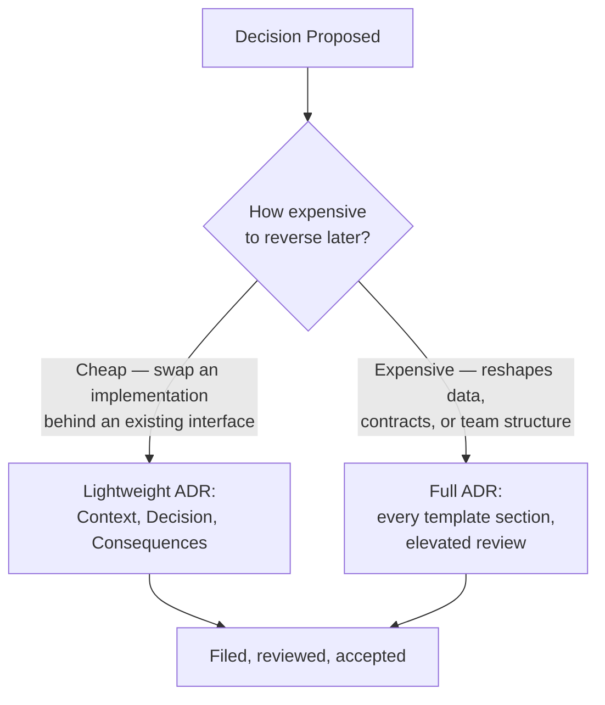

### Small ADRs Are Better Than Giant ADRs

A single ADR bundling several independent decisions ("we will use PostgreSQL, and also restructure our module boundaries, and also change our deployment strategy") is unreviewable, unrevertible independently, and impossible to supersede cleanly when only one of its several decisions later needs to change — the identical Scope Discipline reasoning already established for pull requests in `ai-docs/02-engineering-principles.md` and `ai-docs/06-git-workflow.md`, applied here to decisions themselves. Arwal prefers several small, focused ADRs, each addressing exactly one decision, over one sprawling ADR that tries to justify an entire quarter's work in a single document.

### Every Important Decision Deserves History

A decision worth making is a decision worth being able to look back on — not to assign blame if it turns out wrong, but to understand, in good faith, what was known and why the choice made sense at the time, per the Blameless Postmortems principle already established in `ai-docs/00-project-vision.md` and `ai-docs/07-development-workflow.md`. An ADR is never deleted once accepted (see ADR Numbering Standards and ADR Status Definitions below) — it is superseded, marked accordingly, and left in place as part of Arwal's permanent decision history, exactly as a superseded ADR is already described as "marked as superseded and linked to its replacement, preserving the full decision history" in `ai-docs/02-engineering-principles.md`.

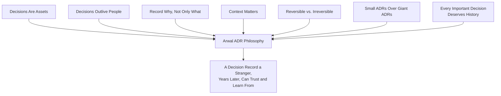

> **Callout — The One-Sentence ADR Philosophy**
> *"An ADR is not a record of what Arwal did — it is a record of what Arwal knew, at the moment it decided, so that a future engineer disagreeing with the outcome can first understand the reasoning before deciding whether to change it."*

---

# What Requires an ADR

An ADR is required whenever a decision is **expensive to reverse**, **precedent-setting** (other decisions will be measured against it), or **a deviation from an already-established phase document's principle** — the exact trigger already established in `ai-docs/02-engineering-principles.md` and `ai-docs/03-system-architecture-principles.md`, made concrete here across every domain Arwal's engineering touches.

| Domain | Example Decisions Requiring an ADR |
|---|---|
| **Architecture** | Introducing a new bounded context; extracting a module from the Modular Monolith into an independent service (`ai-docs/03-system-architecture-principles.md`'s Migration Strategy); changing the four-layer System Layers model. |
| **Infrastructure** | Moving from a single AWS region to multi-region; changing the container orchestration platform; introducing a new managed service category. |
| **Technology Selection** | Adopting a new framework, database engine, or language beyond the Approved Technologies Table (`ai-docs/09-tech-stack.md`); replacing an already-approved technology. |
| **Database Strategy** | Introducing physical partitioning (`ai-docs/14-database-design-guidelines.md`); adopting a read-replica topology; a schema-isolation strategy change for multi-district expansion. |
| **Authentication** | Changing the token strategy (e.g., moving off JWT); adopting a new identity-federation protocol; changing MFA requirements for a role class. |
| **Authorization** | Introducing attribute-based access control beyond the current RBAC+ownership model (`ai-docs/10-security-standards.md`); a fundamental change to the permission model. |
| **Deployment Strategy** | Adopting a new deployment pattern beyond the five already established in `ai-docs/16-deployment-standards.md`; moving from Continuous Delivery to Continuous Deployment for a service class. |
| **API Versioning** | Any policy change to the versioning scheme itself (`ai-docs/13-api-design-guidelines.md`) — not an individual version bump, which is routine. |
| **Caching** | Introducing a new caching layer or technology; a fundamental change to the multi-layer Caching Strategy (`ai-docs/11-performance-standards.md`). |
| **Messaging** | Migrating from BullMQ to a dedicated message broker (`ai-docs/09-tech-stack.md`'s evidence-based upgrade path); introducing a new event schema versioning scheme. |
| **Search** | Adopting a dedicated search engine beyond the current Search shared service approach (`ai-docs/03-system-architecture-principles.md`). |
| **Storage** | Changing the object-storage provider; a data-residency or sovereignty commitment affecting where citizen data is physically stored. |
| **Observability** | Changing the observability vendor/backend (`ai-docs/18-observability-standards.md`); a fundamental change to the OpenTelemetry instrumentation strategy. |
| **Security** | Any deviation from `ai-docs/10-security-standards.md`; adopting a new encryption/key-management approach; a change to the threat model. |
| **Performance** | Relaxing or tightening a performance target in `ai-docs/11-performance-standards.md`; adopting a new performance-budget enforcement mechanism. |
| **Scalability** | A sharding/partitioning strategy change; a decision to pursue active-active multi-region (`ai-docs/16-deployment-standards.md`). |
| **Compliance** | Any decision made specifically to satisfy a regulatory or government-partnership requirement (`ai-docs/19-logging-standards.md`'s Compliance section). |
| **Build System** | Changing the monorepo orchestration tool (Turborepo → Nx or equivalent); a fundamental change to the CI/CD pipeline architecture (`ai-docs/17-cicd-standards.md`). |
| **Monorepo Changes** | Splitting a module out of the monorepo into its own repository (`ai-docs/06-git-workflow.md`'s Future Extraction Strategy); changing workspace boundaries. |
| **Breaking Engineering Standards** | Any deliberate, reviewed deviation from a rule in Phases 2–24 — per the explicit closing-statement pattern repeated throughout this handbook: *"Where a future phase must deviate... that deviation is made explicitly, through an Architectural Decision Record."* |
| **Major Refactoring** | A refactor touching a module's public `index.ts` surface or a shared package export (`ai-docs/05-coding-standards.md`'s Refactoring Standards), where the refactor is itself a structural, precedent-setting change rather than a routine cleanup. |
| **Business Architecture** | A change to how commerce, civic, and payments domains are bounded relative to each other; introducing a new top-level vertical (`ai-docs/00-project-vision.md`'s Future Expansion Strategy). |
| **AI Architecture** | A change to the AI Gateway Service's provider-abstraction contract (`ai-docs/09-tech-stack.md`); adopting a new model provider category; a change to the AI Principle's human-override mechanism. |

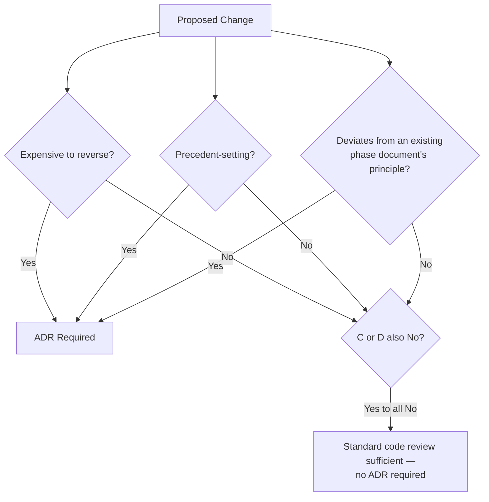

---

# What Does NOT Require an ADR

An ADR is a deliberately weighty artifact, and requiring one for routine work would both slow ordinary engineering to a crawl and dilute the significance of every genuine ADR — per the same Proportional Rigor principle already established in `ai-docs/02-engineering-principles.md`'s Code Review Standards and `ai-docs/07-development-workflow.md`'s "Not Every Stage Needs the Same Weight" callout.

| Category | Example | Why No ADR Is Needed |
|---|---|---|
| **Bug Fixes** | Correcting a rounding error in wallet-debit calculation. | Restores intended behavior; does not change a decision, per the Bug Fix Definition of Done in `ai-docs/08-definition-of-done.md`. |
| **Minor Refactoring** | Extracting a repeated block into a private helper function. | A structural improvement with no behavioral or architectural consequence, per the Refactoring Principles in `ai-docs/02-engineering-principles.md`. |
| **Variable Renaming** | Renaming `bkCnt` to `bookingCount` for clarity. | A pure Naming Standards compliance fix (`ai-docs/05-coding-standards.md`); no decision is being made or changed. |
| **Dependency Patch Updates** | Bumping `zod` from `3.22.1` to `3.22.4` for a security patch. | Routine, per the Dependency Update Workflow (`ai-docs/07-development-workflow.md`, `ai-docs/22-dependency-management-standards.md`) — the *decision* to depend on `zod` was already ADR-worthy (if it met the threshold) at the time of original adoption, not at every patch thereafter. |
| **Formatting** | A Prettier auto-format pass across a directory. | Explicitly a `style:` commit with zero logic change, per `ai-docs/06-git-workflow.md`. |
| **Documentation Corrections** | Fixing a broken link or a typo in a README. | A Documentation Quality fix per `ai-docs/24-documentation-standards.md`, not a decision. |
| **Routine Implementation Details** | Choosing between two equivalent, already-approved ways to structure a single use case's internal logic. | An implementation choice within an already-decided architecture, left to the implementing engineer's judgment and standard code review. |

> **Callout — When in Doubt, Ask the Reversibility Question**
> The single fastest test for whether a change needs an ADR: *if this turns out to be wrong, what does correcting it cost?* A cost measured in minutes or a single PR does not need an ADR. A cost measured in a migration project, a multi-team coordination effort, or a citizen-facing contract break almost certainly does.

---

# ADR Lifecycle

Every ADR passes through the same lifecycle stages, mirroring the Engineering Lifecycle already established in `ai-docs/07-development-workflow.md` for a unit of engineering work, and the Documentation Lifecycle already established in `ai-docs/24-documentation-standards.md` for a document generally.

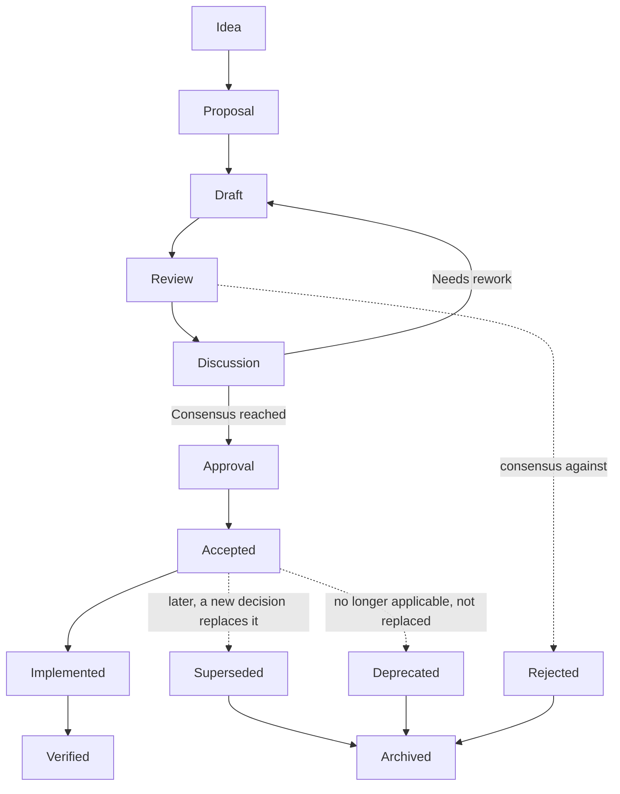

### Stage Definitions

| Stage | Meaning | Exit Criteria |
|---|---|---|
| **Idea** | An engineer identifies a decision point genuinely meeting the What Requires an ADR bar above. | The idea is articulated clearly enough to draft a Context section. |
| **Proposal** | A short, informal statement of the problem and the leading candidate decision, shared with the relevant team(s) to gauge whether a full ADR is warranted. | The proposing engineer and at least one Architect/Tech Lead agree the threshold is met, per `ai-docs/07-development-workflow.md`'s Architecture Review Workflow. |
| **Draft** | The full ADR Template (below) is filled out — Context, Decision Drivers, Options Considered, Decision, Consequences, and every other required section. | The draft is complete enough for a substantive review, not merely a placeholder skeleton. |
| **Review** | The draft undergoes the ADR Review Process (below) — peer review, technical review, and Architecture Review where required. | Every reviewer's comments are addressed or explicitly resolved as non-blocking. |
| **Discussion** | Open questions, disagreements, or alternative framings are worked through — synchronously (a review meeting) or asynchronously (PR comments) — until consensus emerges or the proposal is reworked. | Consensus is reached, or the ADR returns to Draft for substantial rework, or the ADR is Rejected. |
| **Approval** | The required approvers (per Decision Ownership below) formally sign off. | Every required approval is recorded. |
| **Accepted** | The ADR is merged into `ai-docs/adr/`, numbered, and becomes the authoritative record of the decision — binding from this point forward. | Merge to the protected branch, per `ai-docs/06-git-workflow.md`. |
| **Implemented** | The decision has been carried out in the codebase, infrastructure, or process it governs. | The implementing PR(s) reference the ADR number, per ADR References in `ai-docs/24-documentation-standards.md`. |
| **Verified** | The implemented decision has been confirmed, in production, to deliver the outcome the ADR predicted (or the ADR is updated/superseded to reflect what was actually learned). | A defined verification checkpoint (a bake-in period, a KPI review) confirms the decision's real-world effect. |
| **Superseded** | A later ADR replaces this decision with a new one. | The later ADR exists, is Accepted, and explicitly references this ADR as superseded. |
| **Deprecated** | The decision is no longer applicable (the system it governed was retired) but was not replaced by a new decision. | Marked explicitly, with the reason recorded. |
| **Archived** | A Superseded, Deprecated, or Rejected ADR is moved into the permanent historical record. | Never deleted — see ADR Numbering Standards' Immutable Numbers below. |
| **Rejected** | The proposal did not reach consensus/approval and is not adopted. | The reasoning for rejection is recorded in the ADR itself, per Decision Quality Standards below — a rejected ADR is documented, not deleted, so a future engineer proposing the same idea finds the prior reasoning immediately, per the identical standard already established in `ai-docs/09-tech-stack.md`'s Technology Adoption Process. |

---

# ADR Repository Structure

Every ADR lives under `ai-docs/adr/`, per the location already established across `ai-docs/02-engineering-principles.md`, `ai-docs/03-system-architecture-principles.md`, and `ai-docs/24-documentation-standards.md`'s Repository Tree. This document defines the complete internal structure of that folder.

```
ai-docs/
├── 00-project-vision.md
├── 01-product-goals.md
├── ...
├── 25-architecture-decision-records.md
└── adr/
    ├── README.md                          # ADR index — auto-generated table of every ADR
    ├── TEMPLATE.md                         # The canonical, blank ADR template (see ADR Template below)
    │
    ├── 0001-modular-monolith-first.md
    ├── 0002-postgresql-as-primary-datastore.md
    ├── 0003-nestjs-as-backend-framework.md
    ├── ...
    ├── 0087-district-scoped-partition-key.md
    │
    └── archive/
        ├── README.md                       # Index of archived (superseded/deprecated/rejected) ADRs
        ├── 0014-mongodb-for-catalog-data.md         # Superseded by 0002
        └── 0031-graphql-as-default-api-style.md     # Rejected
```

### Structural Rules

- **No status-based subfolders for active ADRs.** Every Accepted, Implemented, or Verified ADR lives together, flat, in `ai-docs/adr/`, numbered sequentially — sorting or filtering by status is a metadata/index concern (see ADR Searchability below), never a folder-placement concern, mirroring the Deep Nesting anti-pattern already rejected in `ai-docs/04-folder-guidelines.md`.
- **`archive/` is reserved exclusively for Superseded, Deprecated, and Rejected ADRs.** An ADR moves to `archive/` only once it reaches one of those terminal, non-active statuses — it is never moved back, and its filename and number never change during the move, per Immutable Numbers below.
- **`README.md` is the generated index**, per Documentation Automation in `ai-docs/24-documentation-standards.md` — never hand-maintained, since a hand-maintained index drifts the moment an ADR's status changes and the index is not updated in the same PR.
- **`TEMPLATE.md` is the single source of truth for the ADR Template** (below) — every new ADR is created by copying this file, never by copying a prior ADR and stripping its content, which risks carrying over stale boilerplate.

---

# ADR Numbering Standards

### Sequential Numbering

Every ADR is assigned the next available integer in a single, global, monotonically increasing sequence — never per-category, per-team, or per-year numbering, which would fragment the sequence and make "how many ADRs exist" and "what came before this one" both ambiguous questions.

### Zero Padding

Every ADR number is zero-padded to four digits (`0001`, `0087`, `1000`), giving Arwal headroom for up to 9,999 ADRs before a numbering-scheme change would even need to be considered — comfortably beyond any realistic count across ~300 phases — and ensuring lexicographic (alphabetical) file sorting matches numeric sorting exactly, which a 1–3 digit unpadded scheme would break the moment the count crosses a power of ten.

### Immutable Numbers

Once assigned, an ADR's number is **permanent** — never reused, never reassigned, and never renumbered even if the ADR is later rejected, superseded, or archived. A rejected proposal that consumed number `0031` leaves `0031` permanently retired, never reassigned to the next new ADR — this mirrors the Immutable Artifacts principle already established in `ai-docs/16-deployment-standards.md` and `ai-docs/17-cicd-standards.md`, applied to the decision record itself: a number is a permanent, unambiguous reference, and reusing one would make every prior citation of it ambiguous.

### Reserved Numbers

A number is reserved the moment an ADR's Draft stage begins (see ADR Lifecycle above) — via a placeholder file or an entry in a tracked reservation log — so two concurrently-drafted ADRs never collide on the same number. A reserved number that is never used (the draft is abandoned before reaching Review) is **not** reassigned; it remains permanently retired, with a one-line note in the archive index recording that it was reserved and abandoned, for the identical reason numbers are never reused after rejection.

### Superseded ADR Handling

When ADR `N` is superseded by ADR `M`:

1. ADR `M` is a **new**, sequentially-numbered ADR — never a revision of ADR `N`'s own file.
2. ADR `N`'s `Status` field is updated to `Superseded by ADR-000M`, and ADR `N` is moved into `archive/`.
3. ADR `M`'s own template includes an explicit `Related ADRs` entry: `Supersedes ADR-000N`.
4. Every other document in the codebase that cited ADR `N` for its reasoning is updated, in the same or a prompt follow-up PR, to cite ADR `M` instead — per the Superseded Decisions standard already established in `ai-docs/24-documentation-standards.md`.

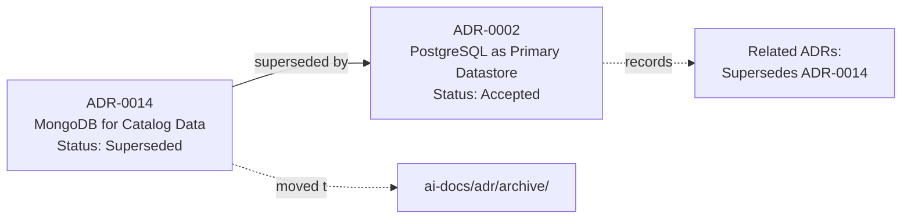

### Examples

| Scenario | Correct Handling |
|---|---|
| A brand-new decision, no prior ADR on the topic | Next sequential number, e.g., `0088-ai-gateway-provider-abstraction.md` |
| A decision revisited and reversed | New number for the new decision (e.g., `0091`); the old ADR (e.g., `0014`) marked `Superseded by ADR-0091`, moved to `archive/` |
| A proposal drafted, reserved number `0092`, then abandoned before Review | `0092` remains permanently retired; noted in `archive/README.md` as "Reserved, not used" |
| A typo discovered in an already-Accepted ADR's prose | Corrected via a normal `docs/*`-style PR editing the existing file in place — this is a documentation correction (per What Does NOT Require an ADR above), never a new ADR or a renumbering |

---

# ADR Template

Every new ADR is created by copying `ai-docs/adr/TEMPLATE.md`, which contains exactly the following structure. No section is deleted; a genuinely inapplicable section is marked `N/A` with a one-line reason, never silently omitted, so a reader can distinguish "not applicable, considered" from "forgotten."

# ADR-NNNN: <Short, Specific, Decision-Stating Title>

## Status

<Proposed | Draft | Accepted | Implemented | Verified | Rejected | Superseded by ADR-XXXX | Deprecated>

## Date

<YYYY-MM-DD — the date this ADR reached its current Status>

## Authors

<Name(s) of the engineer(s) who drafted this ADR>

## Reviewers

<Name(s) of every engineer who performed a Review-stage pass, per the ADR Review Process>

## Approvers

<Name(s) and role(s) of every required approver, per Decision Ownership>

## Context

What problem, constraint, or fork in the road prompted this decision? Describe the
situation as it was understood at the time — team size, scale, prior decisions this
one builds on or reconsiders, and any deadline or external pressure genuinely relevant
to the decision. A reader with zero prior context should be able to understand why
this decision needed to be made at all after reading this section alone.

## Problem Statement

A single, precise statement of the specific question this ADR answers. Not the
Context's narrative — the exact question: "Which primary datastore should Arwal's
Modular Monolith use?" not "We need to think about data."

## Decision Drivers

The specific, prioritized factors that determined the outcome — e.g., ACID
transactional guarantees for payment/civic data, JSON flexibility for semi-structured
civic-application data, alignment with the district-partitioning strategy, team
familiarity, long-term community support. Each driver is stated as a criterion, not
as a conclusion.

## Options Considered

### Option A: <Name>
Description, and how it performs against each Decision Driver.

### Option B: <Name>
Description, and how it performs against each Decision Driver.

### Option C: <Name>
Description, and how it performs against each Decision Driver.

(Minimum two genuine options; a single-option ADR is a Blocking Issue per Decision
Quality Standards below, unless a documented reason establishes no real alternative
existed.)

## Decision

The option chosen, stated plainly and unambiguously in one or two sentences. Everything
above this section is reasoning; this section is the binding outcome a future reader
can cite without reading the rest.

## Consequences

### Positive
What this decision makes easier, safer, faster, or more correct.

### Negative
What this decision makes harder, slower, or more costly — every real trade-off,
stated honestly, never omitted to make the decision look cleaner than it is.

## Trade-offs

The specific things given up by choosing this option over the others, stated
explicitly — distinct from Consequences in that this section names what a
reader might otherwise assume was free but wasn't.

## Risks

What could make this decision wrong in the future, and what signal would reveal it
— the same Migration Indicator-style thinking already established in
`ai-docs/03-system-architecture-principles.md`.

## Security Impact

Any effect on Arwal's security posture, per `ai-docs/10-security-standards.md` —
new attack surface introduced, a data-classification tier affected, or explicitly
"No security impact" with a one-line reason.

## Performance Impact

Any effect on latency, throughput, or resource usage, per `ai-docs/11-performance-standards.md`
— measured where possible, estimated with stated assumptions where not yet measurable.

## Operational Impact

Effect on deployment (`ai-docs/16-deployment-standards.md`), observability
(`ai-docs/18-observability-standards.md`), on-call burden, or day-to-day operations.

## Migration Strategy

If this decision requires migrating existing data, code, or infrastructure: the
concrete plan, phased where necessary, per the Migration Strategy discipline already
established in `ai-docs/14-database-design-guidelines.md` and `ai-docs/09-tech-stack.md`.

## Rollback Strategy

What happens if this decision needs to be reversed after implementation — the
concrete, honest answer, even (especially) where the honest answer is "this is
difficult to reverse," per the Reversible vs. Irreversible Decisions principle above.

## Alternatives

Any option seriously considered but not detailed as a full Option above (a
briefly-explored idea dismissed early), recorded so a future reader does not
re-propose it without knowing it was already considered.

## References

Links to supporting material — benchmarks, prior art, vendor documentation,
internal discussion threads.

## Related ADRs

- Supersedes: <ADR-XXXX, or "None">
- Superseded by: <ADR-XXXX, or "N/A">
- Depends on: <ADR-XXXX, ...>
- Related to: <ADR-XXXX, ...>

## Future Work

Any follow-on decision or implementation work this ADR anticipates but does not
itself resolve — never used as a substitute for resolving something this ADR
should decide now.


> **Callout — The Decision Section Is the Contract; Everything Else Is the Evidence**
> A future engineer under time pressure may read only the Decision section — this is expected and acceptable, provided that section alone is unambiguous. Every other section exists so that a future engineer with *more* time — evaluating whether to revisit the decision — has the full evidentiary record available without needing to ask anyone.

---

# Decision Quality Standards

An ADR is only as valuable as the rigor behind it. Every ADR is held to the following characteristics, verified during Review (see ADR Review Process below) — an ADR failing these standards is returned to Draft, never merged as-is.

| Quality Characteristic | What It Means | Why It's Required |
|---|---|---|
| **Evidence-Based** | Claims are backed by a benchmark, a citation, a documented prior incident, or explicit, stated reasoning — never bare assertion. | An ADR built on "I think this is faster" instead of a measured comparison cannot be trusted or re-verified later, per Measure Before Optimizing (`ai-docs/11-performance-standards.md`) applied to decision-making itself. |
| **Measurable** | Where the decision has a performance, cost, or reliability consequence, that consequence is stated in specific, checkable terms — a number, a threshold, an SLO — never a vague "should be faster." | An unmeasurable claim can never be verified true or false, defeating the Verified lifecycle stage above. |
| **Clear** | Written in plain language per the Writing Style Guide in `ai-docs/24-documentation-standards.md` — no ambiguous pronoun, no unexplained acronym, no sentence with more than one plausible reading. | An ADR that must be interpreted is an ADR that will be interpreted differently by two different future readers. |
| **Actionable** | The Decision section states, unambiguously, what to actually do — never leaves the reader to infer the practical consequence from abstract principle alone. | An ADR whose Decision cannot be directly translated into a code change, a config change, or a process change has not actually decided anything. |
| **Traceable** | Every claim in Context and Decision Drivers can be traced to a real, citable source — a prior ADR, a phase document, a measured benchmark, a documented incident. | Traceability is what separates an ADR from an opinion piece; per Decision Traceability above, this is the entire reason ADRs exist. |
| **Reviewable** | Scoped to one decision (per Small ADRs Are Better Than Giant ADRs above), short enough that a reviewer can hold the whole argument in mind, and structured per the Template so a reviewer knows exactly where to look for each kind of information. | An unreviewable ADR either gets rubber-stamped without genuine scrutiny or never gets reviewed at all — both defeat the ADR Review Process below. |
| **Not Opinion-Based** | The Decision follows demonstrably from the stated Decision Drivers and the comparison across Options Considered — never merely "this is my preferred approach" with the drivers and options reverse-engineered to justify a predetermined conclusion. | An opinion dressed as an ADR misleads a future reader into thinking a decision was rigorously evaluated when it was not, which is more dangerous than no ADR at all, per the same reasoning `ai-docs/24-documentation-standards.md` applies to inaccurate documentation generally. |

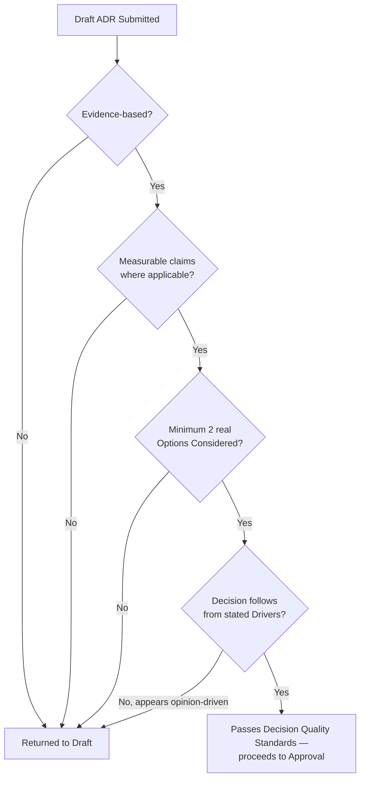

---

# Decision Classification

Every ADR is tagged with exactly one classification, reflecting its scope and durability — this classification drives its required review depth (see Decision Ownership below) and its place in the ADR Metrics (below).

| Classification | Definition | Typical Reversibility | Example |
|---|---|---|---|
| **Strategic** | Shapes Arwal's multi-year direction — a commitment referenced across many future phases. | Very low — years to reverse | Modular Monolith First; PostgreSQL as primary datastore. |
| **Architectural** | Shapes system structure within the strategic direction already set. | Low — a significant migration effort | A new bounded context; a service extraction. |
| **Technical** | A specific technology or pattern choice within an already-set architecture. | Medium — a scoped replacement project | Choosing BullMQ over a dedicated broker at Arwal's current scale. |
| **Operational** | Governs how an already-built system is run day to day. | Medium-high — an operational policy change | A deployment strategy choice for a specific service class. |
| **Temporary** | A deliberate, time-boxed decision known in advance to be revisited. | High — expires by design | Using a sandbox-only AI provider pending a production contract's finalization. |
| **Experimental** | A decision made to support a bounded pilot or A/B test, not yet a platform-wide commitment. | Very high — no lasting commitment implied | Trialing a new ranking algorithm behind a feature flag for one district. |
| **Emergency** | A decision made under active incident pressure, per the Incident Response Workflow (`ai-docs/07-development-workflow.md`). | Varies — always revisited post-incident | A temporary rate-limit tightening during an active abuse event. |
| **Regulatory** | Made specifically to satisfy a legal, compliance, or government-partnership requirement. | Very low — externally constrained | A data-residency commitment required by a state government partnership. |

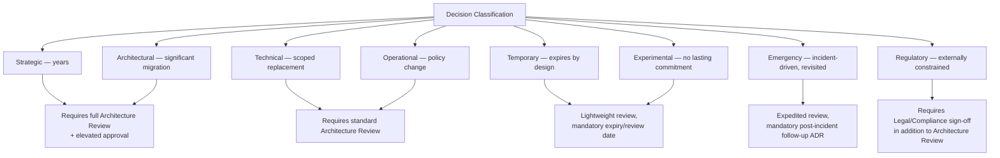

An Emergency-classified ADR is filed **after** the immediate incident response (`ai-docs/07-development-workflow.md`'s Mitigate-First principle) — it documents a decision already made under pressure, and is always followed, within the same engineering cycle, by either promotion to a permanent classification (if the emergency decision should stay) or an explicit rollback ADR (if it should not), never left indefinitely in Emergency status.

---

# Decision Ownership

Every ADR has a clearly assigned ownership structure, extending the Folder Ownership Rules already established in `ai-docs/04-folder-guidelines.md` and the Documentation Ownership standard already established in `ai-docs/24-documentation-standards.md` to the specific case of a decision record.

| Role | Responsibility |
|---|---|
| **Owner** | The single named individual (or, where a decision is genuinely joint, a small named group) accountable for the decision remaining correct and current — the person who is asked first if the decision is later questioned. |
| **Co-Owner** | Named where a decision spans two domains with distinct accountable parties (e.g., a decision jointly owned by Backend Platform and Security) — a co-owner carries equal accountability, not a secondary/backup role. |
| **Reviewers** | Every engineer who performed a substantive Review-stage pass, recorded by name in the ADR's own header, per the ADR Template above — distinct from Approvers, since a reviewer's feedback may have been incorporated without that reviewer holding formal approval authority. |
| **Approval Authority** | The specific role(s) whose sign-off is required before Acceptance, determined by the ADR's Decision Classification (below) — never a single, blanket "anyone senior" standard. |
| **Successor Owner** | Recorded the moment an Owner is known to be leaving the team or role — an ADR is never left with a departed, unreachable Owner; see Ownership Transfer below. |

### Approval Authority by Classification

| Classification | Required Approval |
|---|---|
| Strategic | Chief Architect (or equivalent) + at least two independent Tech Leads |
| Architectural | Architecture Review Board (or the acting Architect/Tech Lead group) per `ai-docs/07-development-workflow.md`'s Architecture Review Workflow |
| Technical | Tech Lead of the affected domain(s) |
| Operational | DevOps/Platform Lead + the affected service's owning Tech Lead |
| Temporary / Experimental | The proposing team's Tech Lead, with a mandatory expiry/review date recorded |
| Emergency | The on-call Incident Commander at time of decision; ratified by Tech Lead within one business day |
| Regulatory | Architecture Review Board + Legal/Compliance sign-off |

### Escalation

A disagreement during Review or Discussion that cannot be resolved between the proposing engineer and the reviewers escalates to the Approval Authority appropriate to the ADR's classification, per the table above — mirroring the Escalation discipline already established for Documentation Ownership in `ai-docs/24-documentation-standards.md`. An escalation is never left unresolved indefinitely; it is scheduled for explicit discussion within a defined window (one week, for a non-Emergency ADR).

### Ownership Transfer

When an ADR's Owner leaves their role or the team, ownership transfers to a named Successor Owner — proposed by the outgoing Owner's manager and confirmed by the ADR's original Approval Authority — recorded as an update to the ADR's own header (an edit, not a new ADR, per the Documentation Correction discipline in What Does NOT Require an ADR above). An ADR is never left ownerless; an ownerless ADR discovered during a periodic review (per ADR Metrics below) is treated as a defect requiring immediate reassignment, identical to the standard already established for ownerless documentation generally in `ai-docs/24-documentation-standards.md`.

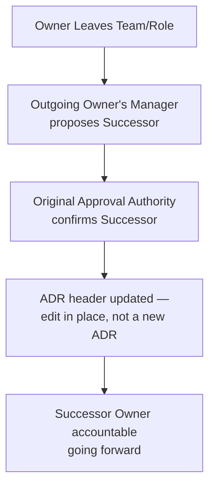

---

# ADR Review Process

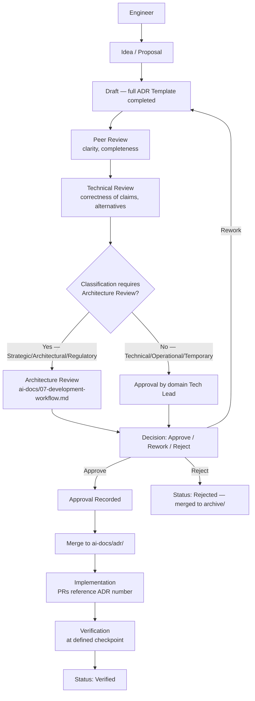

### Stage Detail

| Stage | Who | What Happens |
|---|---|---|
| **Engineer** | The proposing engineer | Identifies the decision point, confirms it meets the What Requires an ADR bar, drafts the ADR from `TEMPLATE.md`. |
| **Discussion** | Proposing engineer + affected teams | Informal, early-stage sharing to surface objections or missing alternatives before a full Review cycle begins — cheaper to catch a missing option here than after formal Review. |
| **Peer Review** | Any qualified engineer, per the standard `ai-docs/06-git-workflow.md` review discipline | Verifies clarity, completeness against the Template, and adherence to Decision Quality Standards above. |
| **Technical Review** | An engineer with direct domain expertise | Verifies the technical claims are accurate, the alternatives considered are genuinely representative, and the Consequences/Trade-offs/Risks sections are honest and complete. |
| **Architecture Review** | Architecture Review Board / acting Architects, per `ai-docs/07-development-workflow.md`, required for Strategic, Architectural, and Regulatory classifications | Verifies alignment with `ai-docs/03-system-architecture-principles.md` and every other governing phase document; confirms the ADR does not silently conflict with a prior, still-active ADR. |
| **Decision** | The Approval Authority appropriate to the ADR's classification | Approve, request rework (returns to Draft), or Reject. |
| **Approval** | Named individuals per Decision Ownership above | Formal sign-off recorded in the ADR's own `Approvers` field. |
| **Merge** | Standard PR merge, per `ai-docs/06-git-workflow.md` | The ADR becomes Accepted the moment it merges to the protected branch. |
| **Implementation** | The engineer(s) carrying out the decision | Every implementing PR references the ADR number in its description, per the ADR References standard in `ai-docs/24-documentation-standards.md`. |
| **Verification** | The ADR's Owner | At a defined checkpoint (a bake-in period for an operational decision; a KPI review for a strategic one), confirms the decision delivered its intended outcome, updating the ADR's Status to Verified or flagging a discrepancy for a future superseding ADR. |

---

# ADR Status Definitions

| Status | Meaning | Reversible to a Prior Status? |
|---|---|---|
| **Proposed** | An early-stage idea shared for initial feedback, not yet a full Draft. | Can be withdrawn without formal record. |
| **Draft** | A complete ADR Template submission, undergoing or awaiting Review. | Returns here from Review if rework is needed. |
| **Accepted** | Approved and merged — the current, binding decision. | Never reverts to Draft; only moves forward to Implemented/Verified or is later Superseded/Deprecated. |
| **Implemented** | The decision has been carried out in the system. | Moves forward to Verified, or, if implementation reveals a flaw, is followed by a new superseding ADR — never edited to retroactively describe a different decision. |
| **Rejected** | Considered, reviewed, and not adopted. | Terminal — archived, never reopened; a genuinely new attempt is a new ADR with a fresh number, citing the rejected one in Related ADRs. |
| **Superseded** | Replaced by a later, numbered ADR. | Terminal — archived, permanently linked to its successor. |
| **Deprecated** | No longer applicable; not replaced by a new decision (the system it governed was retired). | Terminal — archived. |
| **Archived** | The storage state for any terminal-status ADR (Rejected, Superseded, Deprecated). | Permanent. |
| **Experimental** | A time-boxed classification (see Decision Classification above), not a separate status — an Experimental ADR still carries a standard status (typically Accepted) alongside its Experimental classification. | Resolves at its review date to a permanent classification or expires per its Temporary/Experimental terms. |
| **Emergency** | Identical relationship to status as Experimental above — a classification, carried alongside an Accepted status, requiring mandatory post-incident follow-up. | Resolves per the Decision Classification table above. |

---

# ADR Relationships

An ADR rarely exists in isolation — Arwal's decisions form a connected graph, and every relevant relationship is recorded explicitly in the `Related ADRs` section of the ADR Template, never left for a reader to infer.

| Relationship Type | Meaning | Recorded As |
|---|---|---|
| **Parent ADR** | A broader, earlier decision this ADR operates within and does not contradict. | `Depends on: ADR-XXXX` |
| **Child ADR** | A narrower, later decision that specializes or implements this ADR's direction. | Recorded in the *parent's* own `Related ADRs` once it exists, as `Related to: ADR-YYYY` |
| **Superseded ADR** | An earlier decision this ADR formally replaces. | `Supersedes: ADR-XXXX` (in the new ADR) / `Superseded by: ADR-YYYY` (in the old ADR) |
| **Related ADR** | A decision on an adjacent topic, informative but not a dependency. | `Related to: ADR-XXXX` |
| **Dependency** | A decision that must remain true for this ADR to hold — if the dependency is superseded, this ADR is flagged for review. | `Depends on: ADR-XXXX` |
| **Conflict** | Two ADRs that, on inspection, contain incompatible decisions — always resolved explicitly, never left standing. | Flagged during Architecture Review; resolved by superseding one, narrowing both, or filing a new ADR that reconciles them |

### Decision Chains

A **decision chain** is the traceable sequence of ADRs that led, step by step, to the current state of a specific system area — e.g., ADR-0001 (Modular Monolith First) → ADR-0014 (MongoDB for catalog data, later superseded) → ADR-0002 (PostgreSQL as primary datastore, the superseding decision) → ADR-0087 (district-scoped partition key, building on ADR-0002). A reader following a decision chain from the most recent ADR backward through its `Supersedes`/`Depends on` links can reconstruct the system's entire decision history for that area without needing any external context.

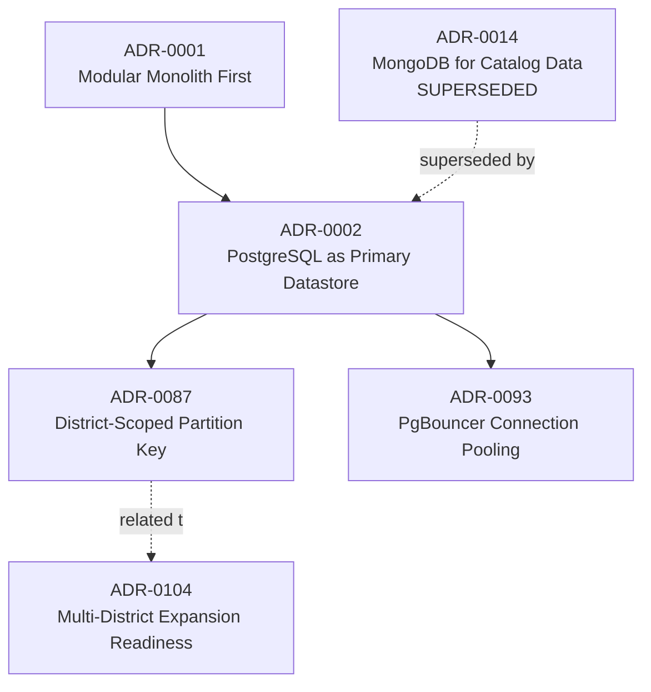

### Conflicts

A conflict between two Accepted ADRs is a governance defect, not a tolerable ambiguity — the moment one is discovered (typically during Architecture Review of a new, related proposal, per Architectural Review below), it is resolved through an explicit new or amending ADR, never left for future engineers to silently pick whichever one they happen to read first.

---

# ADR Searchability

An ADR that cannot be found is functionally equivalent to an ADR that was never written — searchability is a first-class design property of Arwal's ADR corpus, extending the Documentation Searchability standard already established in `ai-docs/24-documentation-standards.md` with ADR-specific mechanisms.

### Metadata

Every ADR's header (Status, Date, Authors, Reviewers, Approvers, per the Template above) is itself structured metadata, machine-parseable for the generated index (see ADR Automation below) — never free-text prose masquerading as a header field.

### Tags

Every ADR carries one or more tags drawn from a small, curated, controlled vocabulary aligned to the domains in What Requires an ADR above (`architecture`, `database`, `security`, `deployment`, `ai`, `messaging`, and so on) — never a freely-invented tag per ADR, mirroring the Naming Conventions discipline already established in `ai-docs/05-coding-standards.md` for enums and `ai-docs/24-documentation-standards.md` for documentation tags.

### Categories

Every ADR's Decision Classification (Strategic/Architectural/Technical/Operational/Temporary/Experimental/Emergency/Regulatory) doubles as a primary searchable category, surfaced in the generated index alongside its tags.

### Keywords

The ADR's title and Problem Statement are written to front-load the specific, searchable terms a future reader is most likely to query — the identical Search Optimization discipline already established in `ai-docs/24-documentation-standards.md`, applied to decision titles specifically: `0002-postgresql-as-primary-datastore.md`, never a vague `0002-database-decision.md`.

### Indexes

`ai-docs/adr/README.md` is the canonical, generated index — a single table listing every ADR's number, title, status, classification, date, and tags, sortable and filterable — the entry point every reader starts from rather than browsing the raw folder listing.

### Cross-References

Every phase document in this handbook that cites an ADR (per the ADR References standard in `ai-docs/24-documentation-standards.md`) uses the exact form `ADR-NNNN`, consistently, so a repository-wide search for `ADR-0002` surfaces every phase document, README, and code comment that depends on that specific decision — a citation format that varies ("ADR 2," "ADR#2," "the PostgreSQL ADR") defeats this searchability entirely.

### Naming

Every ADR filename follows `NNNN-kebab-case-decision-title.md` exactly, per the Markdown Naming Conventions already established in `ai-docs/24-documentation-standards.md`, extended here with the mandatory leading number — the filename alone, without opening the file, tells a reader the ADR's number and its subject.

---

# ADR Automation

Consistent with Automation Where Possible in `ai-docs/24-documentation-standards.md` and the Pipeline as Code principle in `ai-docs/17-cicd-standards.md`, the mechanical aspects of ADR governance are enforced automatically, never left to a human reviewer's memory.

| Automated Check | Purpose | Blocking? |
|---|---|---|
| **ADR Template Scaffolding** | A CLI/script command (`tools/`, per `ai-docs/04-folder-guidelines.md`) generates a new ADR file pre-filled from `TEMPLATE.md` with the next reserved number, preventing manual copy-paste drift. | N/A — a convenience tool |
| **Automatic Index Generation** | `ai-docs/adr/README.md` is regenerated automatically from every ADR's header metadata on every merge touching `ai-docs/adr/*`, per the identical Automatic TOC Generation standard in `ai-docs/24-documentation-standards.md`. | N/A — generated, not hand-edited |
| **Number Validation** | CI verifies a new ADR's number is the next available sequential value, zero-padded correctly, and not a collision with an existing or reserved number. | Yes |
| **Status Validation** | CI verifies the `Status` field is one of the defined values in ADR Status Definitions above — an invalid or missing status is rejected. | Yes |
| **Link Validation** | Every `Related ADRs` reference resolves to an existing ADR file, per the Link Checking discipline already established in `ai-docs/24-documentation-standards.md`. | Yes |
| **Cross-Reference Validation** | If ADR `M` declares `Supersedes: ADR-N`, CI verifies ADR `N` exists and its own `Status` correctly reads `Superseded by ADR-M` — a one-directional, un-reciprocated supersession link is rejected. | Yes |
| **Template Completeness Validation** | Every required section from the ADR Template is present (even if marked `N/A` with a reason) — a section silently omitted is a Blocking Issue. | Yes |
| **Archive Placement Validation** | CI verifies every ADR with a terminal status (Rejected/Superseded/Deprecated) actually resides in `ai-docs/adr/archive/`, and every non-terminal-status ADR resides in the active `ai-docs/adr/` root — catching a status update that wasn't accompanied by the corresponding file move. | Yes |

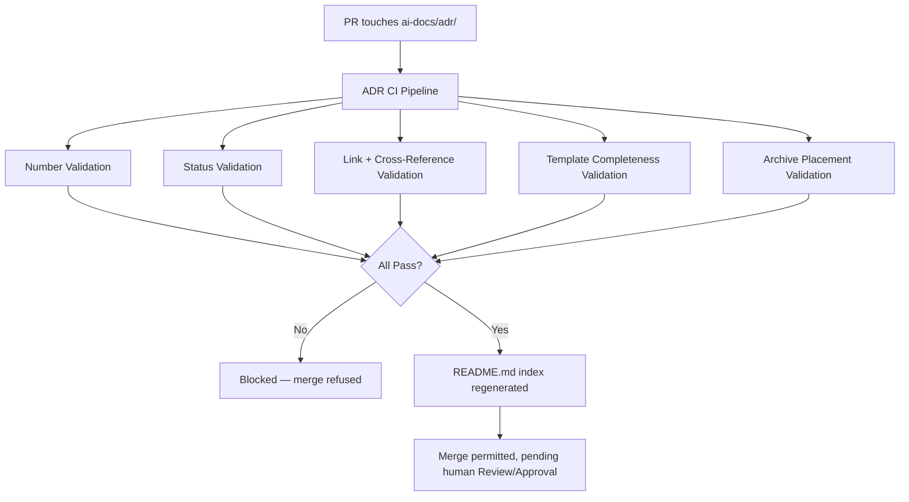

---

# ADR Metrics

Consistent with the Actionable Metrics principle already established in `ai-docs/18-observability-standards.md` — every metric ties to a real question a human will actually ask — Arwal tracks the following governance-health metrics for its ADR corpus, reviewed on the same cadence as the Documentation Ownership Matrix in `ai-docs/24-documentation-standards.md`.

| Metric | Definition | What a Regression Signals |
|---|---|---|
| **Average Review Time** | Days from Draft submission to Approval, per Decision Classification. | A rising trend suggests the Review Process has become a bottleneck — either too many reviewers required, or Architecture Review capacity is under-resourced. |
| **Outstanding Drafts** | Count of ADRs currently in Draft or Review status, with age. | A large or aging backlog signals decisions are being made informally, off-record, while their ADRs stall — undermining the entire discipline this document exists to enforce. |
| **Rejected Decisions** | Count and rate of ADRs reaching Rejected status. | Not inherently bad — a healthy rejection rate shows genuine scrutiny is occurring — but a near-zero rejection rate over a long period suggests Review has become a rubber stamp. |
| **Superseded ADR Count** | Count of ADRs that have been superseded, and the average time-to-supersession per Decision Classification. | A very short average time-to-supersession for Strategic/Architectural ADRs suggests those decisions are being made without sufficient rigor at Draft time. |
| **Decision Implementation Rate** | The percentage of Accepted ADRs that reach Implemented status within a reasonable window. | A low rate signals ADRs are being approved faster than the organization can actually act on them — a planning, not a governance, problem, but one the ADR corpus itself surfaces. |
| **ADR Coverage** | The ratio of ADR-worthy changes (per What Requires an ADR above, cross-referenced against Architecture Review Workflow triggers already logged in `ai-docs/07-development-workflow.md`) that actually have a corresponding ADR. | A gap here is the single most direct signal that the discipline this document defines is being bypassed in practice — every phase document's closing statement depends on this ratio staying near 100%. |
| **Ownerless ADR Count** | ADRs whose named Owner has left the team with no Successor Owner assigned, per Decision Ownership above. | Any non-zero count is treated as an active defect requiring immediate remediation, never a tolerated steady-state number. |

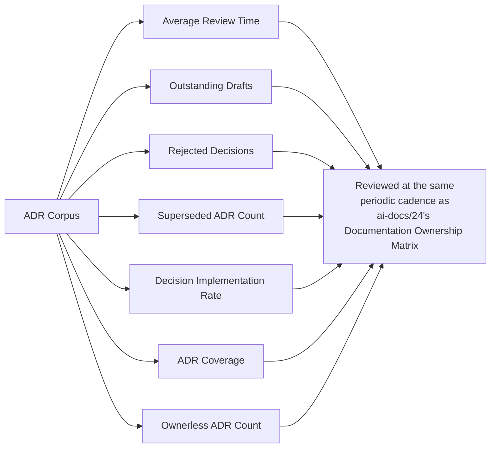

---

# AI-Generated ADRs

Consistent with the AI-Assisted Development Guidelines in `ai-docs/07-development-workflow.md`, the AI-Assisted Development Definition of Done in `ai-docs/08-definition-of-done.md`, and the AI-Generated Documentation standard in `ai-docs/24-documentation-standards.md`, an ADR produced with AI assistance is governed by the identical, non-negotiable principle: **AI accelerates drafting, never accountability.**

### Human Ownership

The engineer who commits an AI-assisted ADR is its full, accountable Owner, per Decision Ownership above — identical in every respect to an ADR they authored entirely by hand. An ADR is never merged with an AI tool implicitly credited as its decision-maker; the `Authors` field always names the accountable human.

### Fact Verification

Every factual claim an AI tool contributes to an ADR's Context, Decision Drivers, or Options Considered sections — a described library behavior, a cited benchmark figure, a stated industry convention — is independently verified against the actual, current reality by the committing engineer before the ADR proceeds to Review, per the identical Hallucination Prevention discipline already established for AI-generated documentation in `ai-docs/24-documentation-standards.md` and for AI-generated citizen-facing content in `ai-docs/15-testing-standards.md`. An unverified AI-generated claim in a document that will bind Arwal's architecture for years is a categorically higher-stakes risk than the same claim in a routine guide.

### Evidence Validation

Per Decision Quality Standards above, an ADR must be Evidence-Based — and an AI tool's confident-sounding but unverified assertion is not evidence. Every Option Considered's comparison against the Decision Drivers is checked by the committing engineer against a real, citable source before the ADR is submitted for Review; an AI-suggested comparison table is a starting draft to verify, never a substitute for genuine evaluation.

### Review Requirements

An AI-assisted ADR passes through the identical, full ADR Review Process above with **zero relaxed scrutiny** — no ADR is fast-tracked, exempted from Architecture Review, or held to a lower Decision Quality Standards bar because it was AI-assisted. If anything, reviewers apply *additional* scrutiny to an AI-assisted ADR's Options Considered section specifically, since an AI tool's tendency to present a plausible-sounding but shallow comparison is a known failure mode this document's Decision Quality Standards exist to catch.

### Security Review

An AI-assisted ADR touching `payments`, `identity`, or `civic-services` domains, or carrying a Regulatory or Strategic classification, receives the identical elevated, security-context review already required for any such ADR in Decision Ownership above, regardless of whether it was AI-assisted or entirely human-authored, per `ai-docs/06-git-workflow.md`'s Required Approvals discipline.

### Confidentiality

No proprietary architectural detail, unreleased strategic decision, or citizen-sensitive context is ever pasted into an external AI tool not governed by Arwal's own data-handling agreements while drafting an ADR — per the identical Confidential Information standard already established in `ai-docs/24-documentation-standards.md` and the Data Minimization principles in `ai-docs/00-project-vision.md` and `ai-docs/10-security-standards.md`. An ADR describing a security vulnerability under active remediation, in particular, is drafted with extreme care regarding which tooling ever sees its content.

---

# ADR Anti-Patterns

The following patterns are explicitly rejected, regardless of how convenient they appear under deadline pressure — each is a specific, previously observed failure mode in ADR-practicing engineering organizations, called out here so Arwal does not have to relearn the lesson expensively at Phase 200.

| Anti-Pattern | Description | Why It's Rejected |
|---|---|---|
| **Decision Without Context** | An ADR whose Decision section is complete but whose Context is thin or absent — "we chose X" with no explanation of the problem X solves. | Defeats Record Why, Not Only What above; a future reader cannot evaluate whether the original reasoning still holds. |
| **Opinion-Based ADR** | An ADR where the Options Considered section is transparently reverse-engineered to justify a predetermined conclusion, rather than a genuine comparison. | Violates Not Opinion-Based in Decision Quality Standards; misleads a future reader into trusting a rigor that was never actually applied. |
| **No Alternatives** | A single-option ADR with no genuine comparison. | Violates the Options Considered minimum-two-options requirement in the ADR Template; a decision made without comparing it to anything is not demonstrably the right one. |
| **Missing Trade-offs** | An ADR whose Consequences section lists only positives. | Every real decision has a cost; an ADR that hides it is dishonest by omission and will be trusted less the moment the hidden cost surfaces in production. |
| **Duplicate ADRs** | Two separate ADRs independently deciding the same question, unaware of each other. | A direct ADR Relationships failure (a Conflict never resolved); signals the Draft-stage Discussion step was skipped. |
| **Conflicting ADRs** | Two Accepted ADRs whose decisions are mutually incompatible, left unreconciled. | An active governance defect per ADR Relationships above; every engineer reading either one is working from an ambiguous, contradictory record. |
| **Never-Updated ADRs** | An ADR whose real-world outcome diverged significantly from its predicted Consequences, with no follow-up ADR ever filed to correct the record. | Violates Decisions Outlive People and the Verified lifecycle stage; the ADR corpus stops being a trustworthy predictor of current reality. |
| **Huge ADRs** | A single ADR bundling several independent decisions. | Violates Small ADRs Are Better Than Giant ADRs above; unreviewable, and impossible to supersede cleanly when only one bundled decision needs revisiting. |
| **Hidden Decisions** | A significant, ADR-worthy decision made silently in a PR description, a Slack thread, or a meeting, with no corresponding ADR ever filed. | The single most damaging anti-pattern this entire document exists to prevent — it recreates exactly the tribal-knowledge failure mode named in `ai-docs/24-documentation-standards.md` and Why Memory Fails above. |
| **Undocumented Architecture** | A system component whose shape reflects a real decision, but no ADR exists explaining why it was built that way. | Forces every future engineer to reverse-engineer intent from code alone — precisely the "archaeology, guesswork, or re-litigation" failure mode named in this document's Purpose section. |

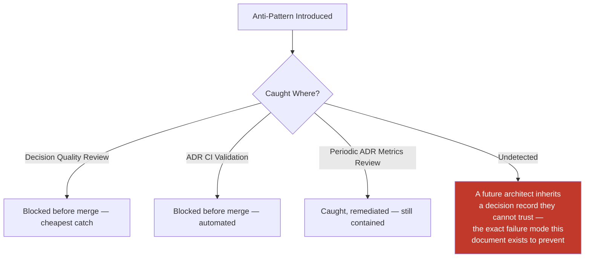

---

# Engineering Review Checklist

Every pull request introducing or modifying an ADR is checked against the following before merge, extending the Documentation Review Process already established in `ai-docs/24-documentation-standards.md` with the ADR-specific gates this document defines:

- [ ] **Threshold correctly applied** — The change genuinely meets the What Requires an ADR bar (expensive to reverse, precedent-setting, or a deviation from an existing phase document), not a routine change per What Does NOT Require an ADR.
- [ ] **Correctly numbered** — Sequential, zero-padded, not colliding with an existing or reserved number, per ADR Numbering Standards.
- [ ] **Filed in the correct location** — Active ADRs in `ai-docs/adr/`; terminal-status ADRs in `ai-docs/adr/archive/`.
- [ ] **Every Template section present** — Including any section marked `N/A` with a stated reason, never silently omitted.
- [ ] **Minimum two genuine Options Considered** — Or an explicit, documented reason no real alternative existed.
- [ ] **Decision Quality Standards met** — Evidence-based, measurable, clear, actionable, traceable, reviewable, and not opinion-based, per Decision Quality Standards above.
- [ ] **Classification assigned** — Strategic/Architectural/Technical/Operational/Temporary/Experimental/Emergency/Regulatory, per Decision Classification.
- [ ] **Ownership recorded** — A named Owner (and Co-Owner where applicable), Reviewers, and Approvers, per Decision Ownership.
- [ ] **Correct Approval Authority obtained** — Matching the ADR's Classification, per the Approval Authority table.
- [ ] **Consequences honest and complete** — Both positive and negative, with Trade-offs and Risks genuinely stated, never omitted to make the decision look cleaner.
- [ ] **Security, Performance, and Operational Impact addressed** — Filled in substantively or explicitly marked `N/A` with reasoning.
- [ ] **Migration and Rollback Strategy stated** — Concrete, even where the honest answer is that rollback is difficult.
- [ ] **Related ADRs complete** — Every Supersedes/Superseded by/Depends on/Related to link present and reciprocated (verified by automation, per ADR Automation).
- [ ] **No conflict with an existing Accepted ADR** — Verified during Architecture Review, per ADR Relationships' Conflicts standard.
- [ ] **Searchability standards met** — Filename, title, tags, and keywords follow ADR Searchability above.
- [ ] **ADR CI passing** — Number, status, link, cross-reference, template-completeness, and archive-placement validation all pass, per ADR Automation.
- [ ] **AI-assisted content fact-checked and owned** — Where AI assistance was used, every claim independently verified and the committing engineer named as the accountable Owner, per AI-Generated ADRs above.
- [ ] **No anti-pattern present** — The ADR does not exhibit any pattern named in ADR Anti-Patterns above.

A pull request failing any item above is not merged until resolved — this checklist carries the same non-negotiable authority as every other review checklist established in the preceding twenty-five phase documents.

---

# Relationship to Previous Standards

### Engineering Principles

`ai-docs/02-engineering-principles.md` first introduces the ADR concept and its Context/Decision/Alternatives/Consequences structure, and establishes that ADRs are "especially critical for Arwal because civic and financial modules require defensible, auditable reasoning behind architectural choices." This document is the complete, standalone expansion of that introduction — every structural element `ai-docs/02-engineering-principles.md` sketches (the four core sections, the "never deleted, only superseded" rule) is fully specified here, with the additional lifecycle, ownership, review, and automation machinery that document deliberately left undefined.

### System Architecture

`ai-docs/03-system-architecture-principles.md` establishes that ADRs are the "auditable justification trail" for the Migration Strategy specifically, and that ADRs "additionally serve" this purpose at the architecture-review level. This document does not redefine the Migration Strategy or its indicators — it defines the complete ADR mechanism that document already assumes exists, and this document's What Requires an ADR section explicitly incorporates every trigger `ai-docs/03-system-architecture-principles.md` names.

### Documentation Standards

`ai-docs/24-documentation-standards.md` owns every general documentation rule — Markdown Standards, Writing Style, Diagrams, Documentation Automation, Documentation Searchability, and the Documentation Review Process — and explicitly defers ADR-specific content ("numbering, required sections, and the ADR-specific review process") to this document. This document never restates a Markdown formatting rule, a writing-style guideline, or a general documentation-review stage already fully specified there; it inherits all of it and adds only what is unique to an ADR as a document type.

### Git Workflow

`ai-docs/06-git-workflow.md` owns branching, commit messages, PR structure, merge strategy, and branch protection for every change in the repository, ADRs included — an ADR PR follows the identical `docs/*`-style (or, for a foundational-phase-touching ADR, elevated) review discipline already established there. This document adds no new Git mechanic; it defines only the ADR-specific content that flows through that already-established process.

### Coding Standards

`ai-docs/05-coding-standards.md` establishes the ADR References standard for inline code comments — "any code implementing a decision that was significant enough to warrant an ADR includes an inline reference to that ADR's number." This document is the authoritative source for what that referenced ADR number actually points to, its numbering scheme, and its lifecycle — the two documents meet exactly at the point a `// per ADR-0031` comment cites a record this document governs.

### Configuration Management

`ai-docs/21-configuration-management-standards.md` requires an ADR for a broad category of technology-adoption and pattern-level configuration decisions (per its own Change Approval discipline) but does not itself define the ADR mechanism — it assumes this document's standard, exactly as every other phase document referencing an ADR does.

### Future Engineering Handbook

This document is the twenty-sixth chapter of the Engineering Handbook, and every ADR ever filed under `ai-docs/adr/` becomes a second, decision-indexed body of knowledge that runs parallel to, and is continuously cross-referenced from, the phase-numbered chapters that precede it — together, the Handbook's phase documents and its ADR corpus form Arwal's complete institutional memory: the phase documents record the standards Arwal holds itself to; the ADRs record the specific decisions, made under specific circumstances, that shaped how those standards came to be and how they are applied in practice.

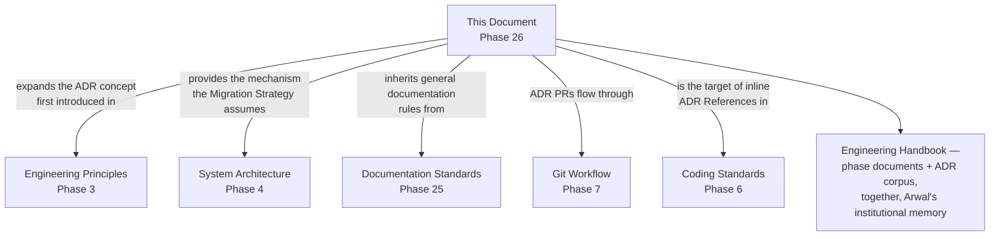

---

# Closing Statement

> **Callout — Closing Statement**
> Every preceding phase document described a standard Arwal holds itself to — how the system is architected, written, secured, tested, deployed, observed, logged, configured, and documented. This document describes how the *reasoning* behind every one of those standards, and every decision still to come across the remaining ~274 micro-phases, survives the people who made it. A codebase without ADRs can still function; it simply cannot be trusted to explain itself, and every engineer who joins after the original decision-makers have moved on inherits a system they can operate but not truly understand. Arwal's ADR corpus is the mechanism by which that gap never opens: every strategic bet, every architectural boundary, every technology chosen over its alternatives, and every deliberate deviation from this handbook's own rules is recorded once, reviewed rigorously, numbered permanently, and never silently lost — so that a citizen's booking, payment, and government application continue to run on a system whose builders, however many years and however many team changes removed from the original decision, can still answer with confidence: *this is why it works this way.* Where a future phase must deviate from a standard stated here, that deviation is itself made explicit — through this very document's own Review Process, or a new ADR where the deviation is structural — never silently, and never by default.

This document, `ai-docs/25-architecture-decision-records.md`, is Phase 26 of approximately 300. Every architectural, infrastructural, technical, and strategic decision made in the phases that follow is expected to be recorded per the standards defined here, or to justify its absence in writing.

**End of Phase 26 — `ai-docs/25-architecture-decision-records.md`**