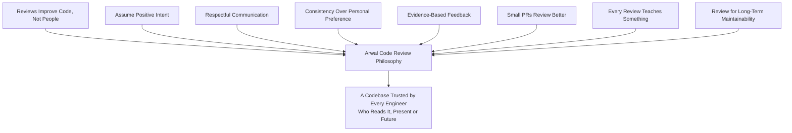
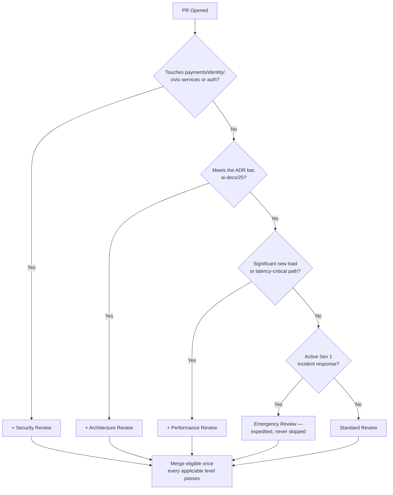
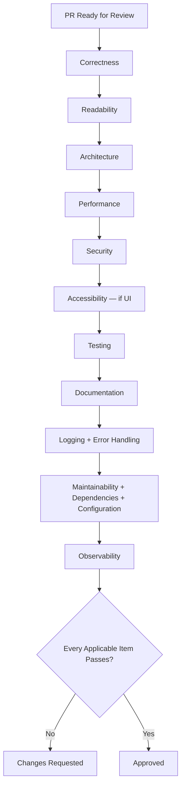
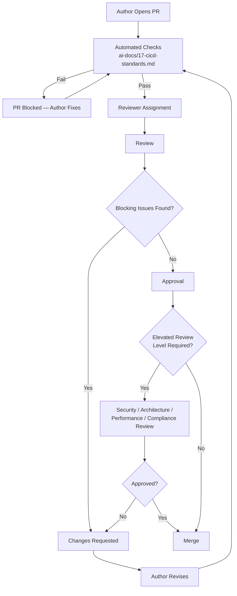
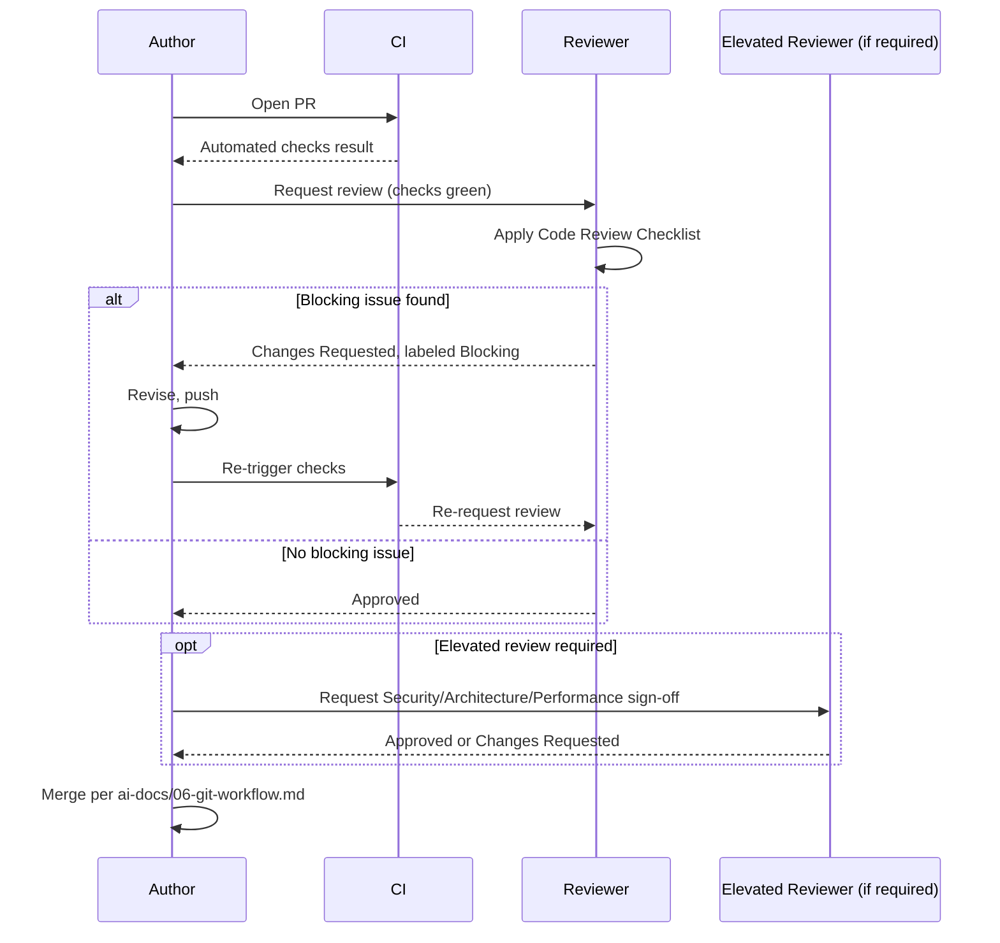
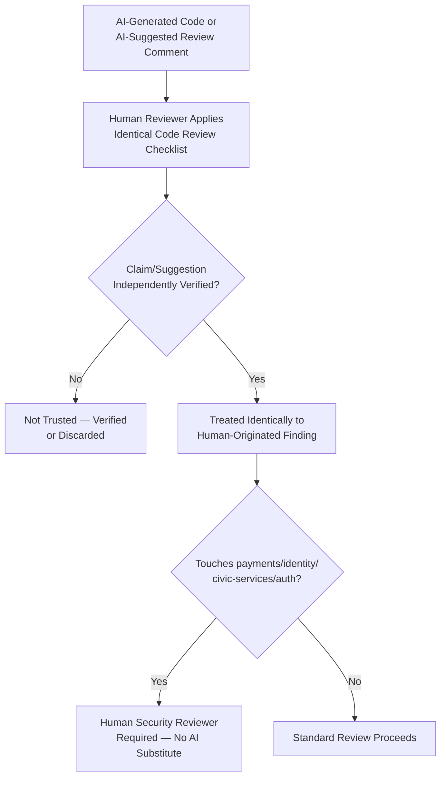
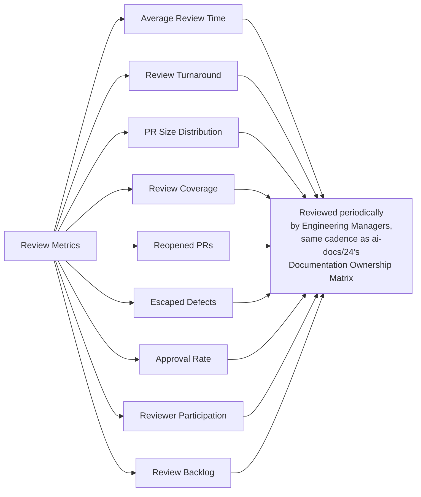
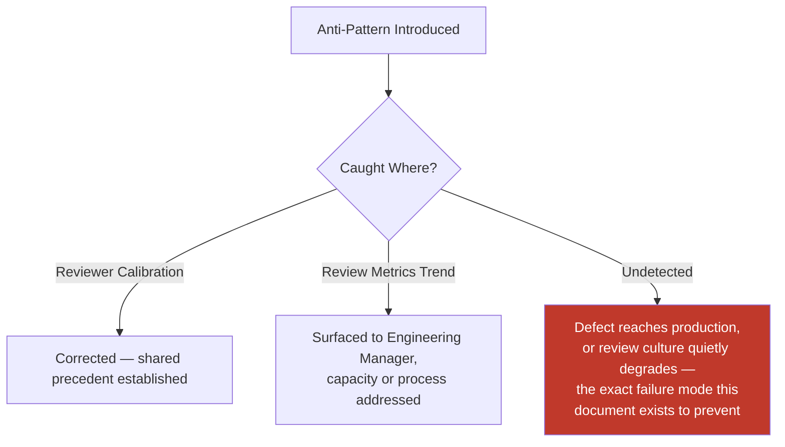
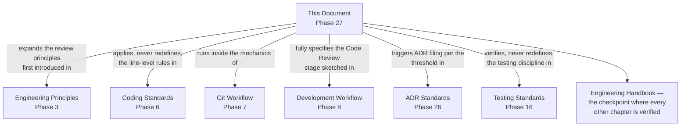

# Code Review Standards

**Document:** `ai-docs/26-code-review-standards.md`
**Project:** Arwal — The District Super App
**Stage:** 1 — Foundation
**Phase:** 27 — Code Review Standards
**Status:** Approved for Engineering Reference
**Audience:** Architects, Engineers, Engineering Managers, Security Engineers, QA Engineers, Technical Reviewers, Government Technical Partners

> **Callout — Purpose of This Document**
> `ai-docs/00-project-vision.md` through `ai-docs/25-architecture-decision-records.md` defined why Arwal exists and every enforceable discipline governing how it is designed, written, secured, tested, deployed, observed, logged, configured, documented, and decided upon. Every one of those disciplines is *verified*, in practice, at exactly one recurring checkpoint: the pull request review. This document defines **the complete, standalone governance standard for how Arwal reviews code** — who reviews, what must be reviewed, how feedback is given, what blocks a merge, and how review quality itself is measured and kept consistent, for every one of the ~300 micro-phases still ahead.

---

# Purpose of this Document

### Why Code Reviews Exist

Every standard in Phases 2 through 26 is a claim about how Arwal's code should look, behave, and be governed. A claim is only as good as the mechanism that checks it against reality. Automated checks (`ai-docs/17-cicd-standards.md`) catch what a machine can verify mechanically — a lint rule, a failing test, a missing type. Code review is what catches everything a machine cannot: whether a change actually solves the right problem, whether a new abstraction fits the architecture (`ai-docs/03-system-architecture-principles.md`), whether a citizen-facing error message is actually citizen-safe (`ai-docs/20-error-handling-standards.md`), whether a "clean" diff quietly reintroduces a defect a human eye would catch and a linter would not. Code review is Arwal's last human checkpoint before a change is trusted, and it exists because no amount of automation replaces a second engineer's judgment applied to a specific, real change.

### Knowledge Sharing

A pull request is not only a request to merge — it is a teaching moment in both directions. A reviewer learns what the author built and why; an author learns how a reviewer with different context or experience would have approached the same problem. Across a ~300-phase roadmap and a team scaling toward hundreds of engineers, code review is one of Arwal's primary mechanisms for spreading domain knowledge horizontally, so that understanding of `payments`, `civic-services`, or the AI Gateway Service is never concentrated in one person's head — directly reinforcing the Documentation Before Tribal Knowledge principle already established in `ai-docs/24-documentation-standards.md`.

### Defect Prevention

Per the Shift Left philosophy already established in `ai-docs/15-testing-standards.md`, a defect caught in review costs minutes; the same defect caught in production costs a citizen's trust. Code review is the layer that sits between "this passed CI" and "this is trusted" — it catches the class of defect that is syntactically valid, passes every automated gate, and is still wrong: a missing authorization check, a subtly incorrect business rule, an edge case the author did not consider.

### Engineering Consistency

Per Consistency Over Local Preference already established throughout `ai-docs/04-folder-guidelines.md` and `ai-docs/05-coding-standards.md`, code review is the enforcement mechanism that keeps thousands of individual engineering decisions, made by hundreds of different engineers over years, resolving the same way every time. A reviewer citing a specific standard from a specific phase document is not expressing a personal preference — they are enforcing a decision Arwal already made, once, deliberately.

### Security

Every security control defined in `ai-docs/10-security-standards.md` — input validation, authorization checks, secrets handling — is, in practice, only as strong as the review that verifies it was actually applied. Code review is a mandatory, non-bypassable layer of Defense in Depth (`ai-docs/10-security-standards.md`): automated scanning catches known patterns; a human reviewer catches the specific, contextual security implication of *this* change that no scanner was written to anticipate.

### Maintainability

A change reviewed only for "does this work" and never for "can a stranger maintain this in six months" degrades the codebase's long-term health even while shipping working software. Code review is where the Engineering Excellence definition already established in `ai-docs/02-engineering-principles.md` — Correct, Clear, Consistent, Secure, Observable, Resilient, Maintainable, Accountable — is checked as a whole, not merely the "does it run" subset a test suite alone can verify.

### Team Collaboration

Code review is a structured, recorded conversation between engineers about a specific, bounded piece of work — it builds shared understanding of the codebase, surfaces disagreement in a healthy, documented forum rather than in production, and is one of the few points in the engineering lifecycle where two or more engineers are guaranteed to look closely at the same code together.

### Relationship with Git Workflow

`ai-docs/06-git-workflow.md` already defines the complete mechanics code review runs inside of: branch naming, commit standards, PR template requirements, required approvals per branch, merge strategy, and branch protection. This document does not redefine any of that. This document governs **what happens inside the review itself** — the judgment, the checklist, the standards a reviewer applies, and the human process of giving and receiving feedback — the content that fills the review step `ai-docs/06-git-workflow.md`'s workflow diagram already shows as a single box.

### Relationship with Coding Standards

`ai-docs/05-coding-standards.md` already defines the line-level rules a reviewer checks against — naming, typing, error handling, the Common Code Smells table, the Engineering Excellence Checklist. This document does not restate a single one of those rules; it defines the **process** by which a reviewer applies them: how thoroughly, in what order, with what tone, and with what authority to block a merge.

### Relationship with ADR Standards

`ai-docs/25-architecture-decision-records.md` already defines when a decision requires a permanent, numbered record and how that record is reviewed and approved. Code review and ADR review are related but distinct: code review verifies that an *implementation* is correct against already-decided standards; ADR review verifies that a *decision* itself is sound before it becomes a standard. A code reviewer who encounters an undocumented, ADR-worthy decision inside a PR does not approve it silently — they require the author to file the ADR first, per the What Requires an ADR triggers already established there.

---

# Code Review Philosophy

Arwal's code review discipline rests on eight commitments. Together they answer the question every subsequent section of this document exists to make concrete: **what makes a review actually improve the codebase, rather than merely gate it?**

### Reviews Improve Code, Not People

A code review evaluates the *change*, never the *engineer*. Feedback is phrased about the diff — "this function has two responsibilities" — never about the person — "you always write functions like this." This exists because a review culture that feels personal produces defensive authors, discourages engineers from opening PRs early for feedback, and shifts energy from improving the code to protecting an ego — exactly the opposite of what a review exists to do.

### Assume Positive Intent

Every reviewer assumes the author made a reasonable decision given the context and time they had, even where the reviewer disagrees with the outcome — mirroring the Blameless Postmortems principle already established in `ai-docs/00-project-vision.md` and `ai-docs/07-development-workflow.md`, applied here to the moment-to-moment act of review. This exists because assuming carelessness or incompetence by default poisons the tone of every subsequent comment, while assuming positive intent leaves room for the author to explain context the reviewer may be missing.

### Respectful Communication

Every review comment is written the way an engineer would want to receive it — direct, specific, and free of sarcasm, condescension, or dismissiveness. This exists because Arwal is deserving of, and depends on, engineers who feel safe opening a PR, per the same dignity-of-engagement standard `claude_behavior`-adjacent norms already apply broadly across this handbook's tone: a codebase's quality is inseparable from whether the people maintaining it feel respected while doing so.

### Consistency Over Personal Preference

A reviewer's comment is grounded in a specific, citable standard from this handbook — never a bare personal preference dressed up as a rule. "I would have named this differently" is not a blocking comment; "this violates the Naming Standards in `ai-docs/05-coding-standards.md`" is. This exists because a review culture that enforces individual taste, inconsistently, per reviewer, is indistinguishable from no standard at all — and directly undermines the Consistency pillar of Engineering Excellence (`ai-docs/02-engineering-principles.md`).

### Evidence-Based Feedback

A review comment states *what* is wrong, *why* it matters, and, where possible, *how* to fix it — never an unsupported assertion. "This will be slow" is weak feedback; "this issues one query per loop iteration, which is the N+1 pattern `ai-docs/11-performance-standards.md` treats as review-blocking — batch it via a single `IN` clause" is evidence-based feedback a reader can act on without further clarification.

### Small PRs Review Better

A small, focused PR is reviewable in a single sitting, with the reviewer able to hold the entire change in working memory — per the Small Deliverables principle already established in `ai-docs/07-development-workflow.md` and the Scope Discipline principle in `ai-docs/02-engineering-principles.md`. This exists because review quality degrades non-linearly with PR size: a reviewer skimming a 2,000-line diff catches a fraction of what the same reviewer catches in a focused 200-line diff, and a large PR is a well-documented predictor of both slower review turnaround and more escaped defects.

### Every Review Teaches Something

A review that only says "LGTM" with no substantive engagement has failed its Knowledge Sharing purpose, even if the code itself is correct. A reviewer looks for at least one opportunity — a note on why a pattern was chosen, a pointer to a related part of the codebase, a question that helps the author think about an edge case — to make the review a moment of genuine exchange, not merely a gate to pass through.

### Review for Long-Term Maintainability

A reviewer evaluates a change not only against "does this work today" but against "will a stranger, at Phase 200, understand and safely extend this" — the same standard already established for Engineering Excellence in `ai-docs/02-engineering-principles.md` and for Definition of Done in `ai-docs/08-definition-of-done.md`. A change that is functionally correct but incomprehensible to a future maintainer has not passed review in the sense this document requires, even if it passes every automated check.

> **Callout — The One-Sentence Code Review Philosophy**
> *"A review exists to make the code better and the author stronger, at the same time — a review that does only one of those has only done half its job."*

---

# What Must Be Reviewed

Every category below requires human review before merge — no category is ever merged on automated checks alone, regardless of how green the pipeline is, per the Merge Requirements already established in `ai-docs/06-git-workflow.md`.

| Category | Review Focus | Governing Standard |
|---|---|---|
| **Application code** | Correctness, layer separation, business-rule accuracy | `ai-docs/05-coding-standards.md`, `ai-docs/03-system-architecture-principles.md` |
| **Infrastructure code (IaC)** | Network topology, IAM scope, resource sizing, no console-provisioned drift | `ai-docs/16-deployment-standards.md` |
| **Configuration** | Correct categorization, schema validation, no hardcoded secret | `ai-docs/21-configuration-management-standards.md` |
| **Database migrations** | Backward compatibility, rollback path, index implications | `ai-docs/14-database-design-guidelines.md` |
| **API changes** | Contract correctness, versioning, breaking-change classification | `ai-docs/13-api-design-guidelines.md` |
| **Public interfaces (`index.ts`, shared exports)** | Backward compatibility for every consumer, per the Module Folder Template's boundary discipline | `ai-docs/04-folder-guidelines.md` |
| **Shared libraries (`packages/*`)** | Blast radius across every consuming app | `ai-docs/22-dependency-management-standards.md` |
| **Security-sensitive code** | Input validation, injection defenses, sensitive-data handling | `ai-docs/10-security-standards.md` |
| **Authentication** | Token handling, session management, MFA enforcement | `ai-docs/10-security-standards.md` |
| **Authorization** | Role and resource-ownership checks at the Application Layer | `ai-docs/10-security-standards.md` |
| **Payment logic** | Idempotency, transactional integrity, elevated review requirement | `ai-docs/10-security-standards.md`, `ai-docs/14-database-design-guidelines.md` |
| **Background jobs** | Idempotency, retry/backoff correctness, dead-letter handling | `ai-docs/20-error-handling-standards.md` |
| **CI/CD changes** | Least privilege, no unpinned action, correct required-check wiring | `ai-docs/17-cicd-standards.md` |
| **Build configuration** | No unreviewed dependency addition, correct artifact tagging | `ai-docs/17-cicd-standards.md`, `ai-docs/22-dependency-management-standards.md` |
| **Documentation** | Accuracy, completeness, correct category and location | `ai-docs/24-documentation-standards.md` |
| **Tests** | Meaningful assertions, correct pyramid level, no flakiness introduced | `ai-docs/15-testing-standards.md` |
| **AI-generated code** | Identical scrutiny to human-written code, per AI-Assisted Code Review below | This document, `ai-docs/07-development-workflow.md`, `ai-docs/08-definition-of-done.md` |

### Elevated Review Categories

Per the Required Approvals already established in `ai-docs/06-git-workflow.md`, any change touching `payments`, `identity`, or `civic-services` domain logic, an Integration Event schema, or an `ai-docs/*` document requires an *additional* review beyond the standard single approval — this document does not redefine that approval-count policy, it defines the reviewer judgment applied once that additional reviewer is engaged (see Review Levels below).

---

# What Does NOT Require Full Review

The categories below still pass through a pull request and still require CI to pass, but do not require the full Code Review Checklist below or a second, elevated approval — applying full review rigor here would dilute review attention away from changes that genuinely need it, per the same Proportional Rigor principle already established in `ai-docs/02-engineering-principles.md`'s Code Review Standards.

| Category | Why It's Lightweight |
|---|---|
| **Formatting-only changes** | A `style:` commit with zero logic change, per `ai-docs/06-git-workflow.md`; verified mechanically by the formatter itself. |
| **Comment correction** | No behavioral change; verified by reading the corrected comment against the code it describes. |
| **Typo fixes** | No behavioral change; a single-glance verification suffices. |
| **Generated files** | Content is a deterministic function of its source (an OpenAPI spec, a Prisma client) — reviewing the generator's *input* is what matters, not the generated *output*. |
| **Lock files** | Reviewed only for whether the accompanying `package.json` change is justified, per `ai-docs/22-dependency-management-standards.md`; the lockfile's own diff is not manually read line by line. |
| **Approved automated dependency updates (Patch, non-security)** | Per the Dependency Update Workflow already established in `ai-docs/07-development-workflow.md` and `ai-docs/22-dependency-management-standards.md`, a Patch-level update is fast-tracked once CI passes. |
| **Minor documentation corrections** | A broken link fix, a rewording for clarity with no factual change — per the Documentation Quality Standards already established in `ai-docs/24-documentation-standards.md`. |

> **Callout — Lightweight Does Not Mean Unreviewed**
> Every category above still requires at least one reviewer's glance and a passing pipeline before merge — "does not require full review" means the Code Review Checklist below is not exhaustively applied, never that the change bypasses review and CI entirely, per the "No Direct Push to `main`, Ever" principle already established in `ai-docs/06-git-workflow.md`.

---

# Review Roles

| Role | Responsibilities |
|---|---|
| **Author** | Opens a reviewable, appropriately-scoped PR per Pull Request Standards below; responds to every comment; never merges their own PR without the required approvals. |
| **Reviewer** | Applies the Code Review Checklist below with genuine engagement; distinguishes Blocking from Suggestion feedback per Review Quality Standards; approves only once genuinely satisfied the change is correct. |
| **Senior Reviewer** | A reviewer with demonstrated depth across multiple domains, engaged for a PR of unusual complexity or cross-cutting impact; carries no special formal authority beyond a standard Reviewer unless also acting in one of the roles below. |
| **Domain Expert** | An engineer with direct, current ownership context in the specific bounded context the PR touches (per the Folder Ownership Rules in `ai-docs/04-folder-guidelines.md`); required for a change to a module outside the author's own primary ownership. |
| **Security Reviewer** | An engineer with security context, required for any change touching `payments`, `identity`, `civic-services`, or an authentication/authorization code path, per `ai-docs/06-git-workflow.md`'s Required Approvals and `ai-docs/10-security-standards.md`'s Elevated Review requirement. |
| **Architecture Reviewer** | An Architect/Tech Lead engaged per the Architecture Review Workflow already established in `ai-docs/07-development-workflow.md`, for a change meeting the What Requires an ADR bar in `ai-docs/25-architecture-decision-records.md`. |
| **QA Reviewer** | Verifies test adequacy and, for a UI or citizen-critical change, performs the manual verification steps already established in `ai-docs/15-testing-standards.md` and `ai-docs/12-accessibility-standards.md`. |
| **Release Reviewer** | A Tech Lead/DevOps role signing off on the Release Readiness Checklist (`ai-docs/07-development-workflow.md`) and Production Readiness Checklist (`ai-docs/16-deployment-standards.md`) — reviews the *release*, not an individual PR. |
| **Engineering Manager** | Owns review-health metrics (see Review Metrics below), resolves escalated disagreements per Decision Ownership-style escalation, and ensures no team's review capacity becomes a standing bottleneck. |

### Responsibility Matrix

| Responsibility | Author | Reviewer | Domain Expert | Security Reviewer | Architecture Reviewer | EM |
|---|---|---|---|---|---|---|
| Open a reviewable PR | ✅ | | | | | |
| Apply the Code Review Checklist | | ✅ | ✅ | ✅ | ✅ | |
| Block merge on a security gap | | ✅ | | ✅ | | |
| Block merge on an architectural violation | | ✅ | | | ✅ | |
| Resolve an escalated reviewer/author disagreement | | | | | | ✅ |
| Monitor review-health metrics | | | | | | ✅ |
| Verify test adequacy | | ✅ | | | | |
| Sign off on release readiness | | | | | | (via Release Reviewer) |

---

# Review Levels

| Level | When It Applies | Who Is Required |
|---|---|---|
| **Standard Review** | The overwhelming majority of PRs — routine feature work, bug fixes, refactors within an already-established pattern. | One qualified Reviewer, per `ai-docs/06-git-workflow.md`. |
| **Security Review** | Any change to `payments`, `identity`, `civic-services`, authentication, authorization, or a change flagged by an automated security scan finding. | Standard Review + a Security Reviewer, per `ai-docs/10-security-standards.md`'s Security Review Checklist. |
| **Architecture Review** | A change meeting the What Requires an ADR bar in `ai-docs/25-architecture-decision-records.md` — a new bounded context, a new shared service, a service extraction. | Standard Review + Architecture Reviewer, per `ai-docs/07-development-workflow.md`'s Architecture Review Workflow. |
| **Performance Review** | A change expected to carry significant new load, touching a citizen-critical latency path, or introducing a new cache/query pattern. | Standard Review + a reviewer applying the Performance Review Checklist in `ai-docs/11-performance-standards.md`. |
| **Emergency Review** | A change responding to an active Sev 1 incident, per the Incident Response Workflow in `ai-docs/07-development-workflow.md`. | Expedited-but-never-skipped Standard Review — process latency is reduced, Blocking Issue rigor is not, per `ai-docs/05-coding-standards.md`. |
| **Hotfix Review** | A change branched per the Hotfix Workflow in `ai-docs/06-git-workflow.md`, scoped narrowly to a production defect. | At least one reviewer approval, scoped strictly to the fix — no opportunistic unrelated review comments accepted, per Scope Discipline. |
| **Compliance Review** | A change made specifically to satisfy a regulatory or government-partnership requirement, per `ai-docs/25-architecture-decision-records.md`'s Regulatory classification. | Standard Review + Architecture Review + Legal/Compliance sign-off. |

---

# Pull Request Standards

This section restates, at the level of review readiness, the PR mechanics already fully established in `ai-docs/06-git-workflow.md` — branch naming, commit standards, and the required PR template. It does not redefine any of that; it defines the **bar a PR must clear to be genuinely review-ready**.

| Dimension | Standard |
|---|---|
| **PR size** | Reviewable in a single sitting — as a practical heuristic, under ~400 lines of net change for application code; a larger PR is split per Small PRs Review Better above, unless it is a mechanical, low-risk change (a rename, a generated-file regeneration) explicitly called out as such. |
| **Atomic changes** | One coherent unit of work per PR — a feature and an unrelated refactor are separate PRs, per the Scope Discipline already established in `ai-docs/02-engineering-principles.md` and the commit-splitting guidance in `ai-docs/06-git-workflow.md`. |
| **Clear title** | States what changed, in the imperative, matching the eventual squash-merge commit message's subject line. |
| **Description** | Summarizes what and why in 1–3 sentences, per the required PR template in `ai-docs/06-git-workflow.md`. |
| **Screenshots** | Included for every UI change — before/after or a short recording of the interactive flow, per `ai-docs/06-git-workflow.md`. |
| **Linked issue/phase** | Every PR traces to a documented reason to exist, per `ai-docs/06-git-workflow.md`'s Traceability principle. |
| **Testing evidence** | Unit/integration/E2E coverage confirmed per `ai-docs/15-testing-standards.md`, stated explicitly in the PR template. |
| **Migration notes** | Any database migration's rollout plan and rollback path stated, per `ai-docs/14-database-design-guidelines.md`. |
| **Rollback notes** | For a change carrying meaningful production risk, the rollback path is stated explicitly, even if it is simply "standard rollback via `ai-docs/16-deployment-standards.md`." |
| **Checklist** | The full required PR template checklist from `ai-docs/06-git-workflow.md` is completed, not left with unchecked boxes. |
| **Review readiness** | The author has re-read their own diff once before requesting review, confirming local CI passes and no debug artifact (a `console.log`, a commented-out block) remains, per the Local Verification standard in `ai-docs/07-development-workflow.md`. |

> **Callout — A PR Opened Before It's Ready Wastes Two People's Time**
> Requesting review on a PR the author has not re-read is a common, avoidable cause of a slow, frustrating review cycle — the first review pass should never be the first time anyone, including the author, has looked closely at the diff.

---

# Code Review Checklist

Every Standard Review applies this checklist in full. Elevated review levels (Security, Architecture, Performance, Compliance) add their own domain-specific checklist, already fully defined in their respective governing documents, layered on top of this one.

- [ ] **Correctness** — Does the change do what it claims, including edge cases and failure modes, per the Correctness First standard in `ai-docs/02-engineering-principles.md`?
- [ ] **Readability** — Could an engineer unfamiliar with this change understand it in six months, per `ai-docs/05-coding-standards.md`'s Readability Over Cleverness?
- [ ] **Architecture** — Does the change honor the Modular Monolith strategy, layer boundaries, and Dependency Rules in `ai-docs/03-system-architecture-principles.md`?
- [ ] **Performance** — No unreviewed N+1 pattern, no unbudgeted bundle growth, no cache without a defined invalidation strategy, per `ai-docs/11-performance-standards.md`.
- [ ] **Security** — Input validation, authorization checks, no secret in the diff, no raw SQL concatenation, per `ai-docs/10-security-standards.md`.
- [ ] **Accessibility** — For a UI change, semantic HTML, keyboard operability, and contrast compliance per `ai-docs/12-accessibility-standards.md`.
- [ ] **Testing** — Tests exist at the appropriate Testing Pyramid level, are meaningful (not merely present), per `ai-docs/15-testing-standards.md`.
- [ ] **Documentation** — Any new public API, module, or ADR-worthy decision has its corresponding documentation update, per `ai-docs/24-documentation-standards.md`.
- [ ] **Logging** — Structured, correctly-leveled, correlation-ID-carrying, free of sensitive data, per `ai-docs/19-logging-standards.md`.
- [ ] **Error handling** — Every error is typed, categorized correctly, and never silently swallowed, per `ai-docs/20-error-handling-standards.md`.
- [ ] **Maintainability** — No Common Code Smell present without a reviewed, justified exception, per `ai-docs/05-coding-standards.md`.
- [ ] **Dependencies** — Any new dependency has passed the Dependency Approval Process, per `ai-docs/22-dependency-management-standards.md`.
- [ ] **Configuration** — Any new configuration value is correctly categorized, schema-validated, and never a hardcoded secret, per `ai-docs/21-configuration-management-standards.md`.
- [ ] **Observability** — Metrics, spans, and dashboards exist for any new or changed service surface, per `ai-docs/18-observability-standards.md`.
- [ ] **AI-generated code** — Held to identical scrutiny as human-written code, per AI-Assisted Code Review below.

---

# Review Quality Standards

| Standard | Definition | Example |
|---|---|---|
| **Actionable feedback** | A comment states what to change, not merely that something is wrong. | "Extract this into a named function per SRP" — not "this is messy." |
| **Evidence-based comments** | A comment cites a specific, checkable standard or a specific, demonstrable consequence. | "This N+1 pattern will scale linearly with citizen count, per `ai-docs/11-performance-standards.md`." |
| **Respectful language** | No sarcasm, no absolutes about the author's skill, no rhetorical questions used as veiled criticism. | "Consider extracting this" — not "Why would you do it this way?" |
| **No personal opinions presented as rules** | A preference is labeled as a preference, never phrased as a blocking requirement without a citable standard. | "Nitpick: I'd personally reorder these, non-blocking" — not "Reorder these." |
| **Explain reasoning** | Every non-trivial comment includes the *why*, not only the *what*. | See Evidence-based comments above — the two overlap by design. |
| **Suggest improvements** | Where feasible, a comment includes a concrete suggested diff or approach, not only a critique. | A suggested code snippet attached to the comment. |
| **Avoid bikeshedding** | Time is not spent extensively debating a low-consequence stylistic choice already covered by an automated formatter. | A disagreement over brace placement is never a blocking comment — Prettier already resolved it. |
| **Identify Blocking vs. Suggestion explicitly** | Every comment is labeled, implicitly or explicitly, per the Blocking Comments vs. Suggestions table already established in `ai-docs/06-git-workflow.md`. | "Blocking: missing authorization check" vs. "Suggestion: could simplify this conditional." |

> **Callout — This Standard Exists Because of Real Review Friction**
> The distinction between evidence-based and opinion-based feedback, and the explicit Blocking/Suggestion labeling requirement, are direct responses to a recurring failure pattern in fast-growing engineering organizations: reviewers who unintentionally block merges over unlabeled personal preference, eroding trust in the review process itself. This standard exists to make that failure mode structurally harder to fall into, not to imply it has already happened at Arwal.

---

# Approval Rules

| Rule | Standard |
|---|---|
| **Required approvals** | Per the Branch Protection Rules already established in `ai-docs/06-git-workflow.md` — at minimum one for `develop`/`release/*`, two (including a security-context reviewer) for `main` changes touching `payments`/`identity`/`civic-services`. |
| **Conditional approvals** | A reviewer may approve "pending" a specific, minor, verifiably-completed follow-up (e.g., "approved once the typo in the error message is fixed") — the author addresses it and merges without a re-review cycle, provided the change is genuinely trivial and the reviewer's condition was explicit and narrow. |
| **Blocking reviews** | A Blocking comment (per Review Quality Standards above) must be resolved — either fixed or explicitly, mutually agreed as a tracked follow-up — before merge; it is never silently dismissed by the author alone. |
| **Approval dismissal** | A new commit pushed after an approval that changes the reviewed logic invalidates that approval automatically, per GitHub's dismiss-stale-review setting, requiring a fresh look — a cosmetic-only follow-up commit (a typo fix, a comment) does not require re-approval. |
| **Re-review requirements** | Any push addressing a Blocking comment requires the original reviewer's re-engagement before merge, unless that reviewer has explicitly delegated final sign-off. |
| **Code owner approvals** | Per the `CODEOWNERS`-driven Folder Ownership Rules already established in `ai-docs/04-folder-guidelines.md`, a change to a module's `index.ts`, a shared `packages/*` export, or an `ai-docs/*` document requires the owning team's approval in addition to a general Reviewer's. |

---

# Review Workflow

---

# Review Automation

Every mechanical check a machine can perform runs automatically, before a human reviewer's time is spent — this document does not redefine the pipeline mechanics already fully established in `ai-docs/17-cicd-standards.md`; it affirms which checks exist specifically to make human review more focused and effective.

| Automated Check | Purpose | Governing Document |
|---|---|---|
| **Lint** | Removes an entire category of style debate from human review. | `ai-docs/17-cicd-standards.md` |
| **Type checking** | Catches a defect the compiler proves exists, before a human reads a single line. | `ai-docs/17-cicd-standards.md` |
| **Tests** | Confirms existing behavior is preserved; a reviewer trusts a green suite and focuses on new behavior. | `ai-docs/15-testing-standards.md` |
| **Coverage** | Flags a change introducing untested logic, directing reviewer attention there. | `ai-docs/15-testing-standards.md` |
| **Formatting** | Eliminates whitespace/style bikeshedding entirely, per Review Quality Standards above. | `ai-docs/05-coding-standards.md` |
| **Security scanning (SAST)** | Catches a known-pattern vulnerability class before a human needs to spot it manually. | `ai-docs/17-cicd-standards.md`, `ai-docs/10-security-standards.md` |
| **Dependency scanning** | Flags a vulnerable or unapproved dependency automatically. | `ai-docs/22-dependency-management-standards.md` |
| **License scanning** | Flags an incompatible license automatically, before a human needs domain legal knowledge to catch it. | `ai-docs/22-dependency-management-standards.md` |
| **Secrets detection** | Catches a committed credential before any human reviewer even opens the diff. | `ai-docs/06-git-workflow.md` |
| **Static analysis / circular-dependency check** | Catches an architectural boundary violation mechanically, per `ai-docs/03-system-architecture-principles.md` and `ai-docs/04-folder-guidelines.md`. | `ai-docs/17-cicd-standards.md` |
| **Automatic reviewer assignment** | Routes a PR to the correct owning team via `CODEOWNERS`, per `ai-docs/04-folder-guidelines.md`, removing the friction of manually finding the right reviewer. | `ai-docs/06-git-workflow.md` |

> **Callout — Automation Frees Human Attention for Judgment**
> Every check in the table above exists to remove a category of concern from a human reviewer's plate — the goal is never to reduce human review, it is to ensure a human reviewer spends their limited attention on correctness, architecture, and business logic, the things automation cannot yet judge, rather than on a missing semicolon.

---

# AI-Assisted Code Review

Consistent with the AI-Assisted Development Guidelines already established in `ai-docs/07-development-workflow.md` and the AI-Assisted Development Definition of Done in `ai-docs/08-definition-of-done.md`, this section governs both AI-*generated* code under review and AI *tools used as a reviewer*.

### AI-Generated Code

Code produced with AI assistance is reviewed with **zero relaxed scrutiny** — it passes through the identical Code Review Checklist above, at the identical review level its domain requires (Security Review for a `payments`-touching AI-assisted change, exactly as for a human-written one). A reviewer never approves a change faster or more leniently because it "looks AI-generated" or because the author disclosed AI assistance — the standard is the code, not its origin.

### AI Review Comments

Where an AI-based review tool is used to generate suggested comments on a PR, every suggestion is treated as a **draft for a human to evaluate**, never as an authoritative finding to accept or reject mechanically — an AI-generated comment that is wrong, irrelevant, or based on a misunderstanding of Arwal's specific architecture is dismissed by a human reviewer exactly as a mistaken comment from a junior engineer would be, without deference to its automated origin.

### Human Responsibility

The committing engineer is the full, accountable owner of every line in their PR, regardless of whether it was typed by hand or suggested by an AI tool, per the Traceability principle already established in `ai-docs/06-git-workflow.md` — "the AI suggested it" is never an acceptable answer to a reviewer's question about why a piece of code exists or behaves a certain way.

### Fact Verification

Any claim an AI tool makes about the codebase — "this function is unused," "this matches the existing pattern in module X" — is independently verified by the human reviewer or author before being acted on, per the Hallucination Prevention discipline already established in `ai-docs/15-testing-standards.md` and `ai-docs/24-documentation-standards.md`, applied here to review-time claims specifically.

### Security Review

An AI-assisted change touching `payments`, `identity`, `civic-services`, or authentication/authorization logic receives the identical elevated, human, security-context review already required in Review Levels above — an AI code-review tool's clean report is never treated as a substitute for the Security Reviewer role.

### Ownership

Per `ai-docs/07-development-workflow.md`'s AI-Assisted Development Guidelines, AI accelerates typing, never accountability — this principle applies identically to review-time AI assistance: an AI-suggested "approve" is never itself an approval; a human with the Reviewer role must actually engage with the change per this document's checklist.

---

# Review Metrics

Per the Actionable Metrics principle already established in `ai-docs/18-observability-standards.md`, every metric below ties to a real question an Engineering Manager or Tech Lead will actually ask — never collected purely because it is measurable.

| Metric | Definition | What a Regression Signals |
|---|---|---|
| **Average review time** | Time from "ready for review" to first substantive reviewer engagement. | A rising trend signals reviewer capacity strain or a PR-size problem, per Small PRs Review Better. |
| **Review turnaround** | Time from "ready for review" to merge. | A widening gap between review time and turnaround signals slow *iteration* (author response latency), distinct from slow initial review. |
| **PR size** | Lines changed per PR, tracked as a distribution, not just an average. | A growing median signals Scope Discipline (`ai-docs/02-engineering-principles.md`) is eroding. |
| **Review coverage** | The percentage of merged PRs that received substantive (non-rubber-stamp) engagement, per Anti-Patterns below. | A low or declining rate signals rubber-stamping is occurring. |
| **Reopened PRs** | PRs merged and then promptly reverted or hotfixed. | A rising rate signals review is not catching what it should. |
| **Escaped defects** | Production defects traceable to a change that passed review. | The single most direct signal of review effectiveness — tracked per the Root Cause Analysis discipline in `ai-docs/07-development-workflow.md`'s Bug Fix Workflow. |
| **Approval rate** | The percentage of PRs approved without a Changes Requested cycle. | Neither extreme is healthy — near-100% may signal insufficient scrutiny; a persistently low rate may signal unclear standards or an author/reviewer mismatch. |
| **Reviewer participation** | Distribution of review load across the team — how concentrated review responsibility is in a small subset of engineers. | High concentration signals a bus-factor risk and an uneven Knowledge Sharing outcome. |
| **Review backlog** | Count of PRs awaiting a first review, with age. | A growing, aging backlog is a velocity-blocking signal requiring capacity investigation, exactly as a CI backlog is treated in `ai-docs/17-cicd-standards.md`. |

---

# Reviewer Calibration

Review quality across a team of hundreds of engineers, spanning many teams, stays consistent only through deliberate calibration — never assumed to emerge naturally from individually well-intentioned reviewers applying their own judgment.

### Shared Expectations

Every reviewer is expected to apply the identical Code Review Checklist, the identical Blocking/Suggestion distinction, and the identical tone standard from Review Quality Standards above — calibration exists specifically to keep "what one reviewer blocks" and "what another reviewer blocks" from silently diverging as the team scales.

### Calibration Meetings

A periodic (quarterly, at minimum) calibration session brings reviewers together to discuss recent, real (anonymized where appropriate) review examples — surfacing disagreement about what should have been Blocking versus Suggestion, and resolving it as a shared, documented precedent rather than leaving it to individual interpretation.

### Example Blocking Issues

| Example | Why It's Blocking |
|---|---|
| A missing authorization check on an endpoint touching another citizen's data. | Directly violates `ai-docs/10-security-standards.md`; a Blocking Issue per `ai-docs/05-coding-standards.md`. |
| An empty `catch {}` block. | A Blocking Issue per `ai-docs/05-coding-standards.md` and `ai-docs/20-error-handling-standards.md`, with zero exceptions. |
| A raw SQL string built via concatenation of external input. | Directly violates `ai-docs/10-security-standards.md`'s SQL Injection Prevention. |
| A breaking API change shipped without a version bump. | Directly violates `ai-docs/13-api-design-guidelines.md`. |
| A new business-rule branch with no accompanying test. | Directly violates the Testing Definition of Done in `ai-docs/08-definition-of-done.md`. |

### Example Non-Blocking Suggestions

| Example | Why It's a Suggestion |
|---|---|
| "Consider extracting this three-line block into a named helper for clarity." | An improvement, not a correctness or standards violation — the author may accept or defer it. |
| "This could use `Array.prototype.reduce` instead of a loop." | A stylistic alternative with no functional difference; a matter of the author's judgment. |
| "A future refactor could unify this with the similar logic in module Y." | Valuable, forward-looking, but out of scope for the current PR per Scope Discipline. |
| "Nitpick: the variable name `res` could be more descriptive." | Real, but minor — labeled explicitly as a nitpick, non-blocking. |

### Consistency Across Teams

Every team's reviewers apply this document's checklist identically — a change is never held to a stricter or looser bar merely because of which team's reviewer happens to be assigned. Where a team-specific convention exists beyond this handbook's baseline (a stricter internal review norm for a particularly sensitive module), it is documented in that module's own README, per `ai-docs/24-documentation-standards.md`, never left as an unwritten expectation new reviewers must guess at.

---

# Communication Guidelines

### Respectful Feedback

Every comment addresses the code, states the concern plainly, and avoids language that would embarrass the author if read aloud in a team meeting — per Respectful Communication in Code Review Philosophy above.

### Constructive Criticism

A criticism is paired with either a suggested fix or an invitation to discuss — "this approach has a race condition under concurrent bookings; would a `SELECT ... FOR UPDATE` here address it?" rather than "this is broken."

### Disagreement Resolution

A technical disagreement between author and reviewer is worked through in the PR's comment thread first; if unresolved after a reasonable exchange (typically two to three rounds), it escalates to a Domain Expert or Architecture Reviewer, per the Escalation discipline already established in `ai-docs/25-architecture-decision-records.md`'s Decision Ownership section, applied here to a review-level disagreement rather than an ADR-level one.

### Technical Discussions

A genuinely complex disagreement is moved to a synchronous conversation (a call, a pairing session) once it becomes clear async comments are prolonging rather than resolving it — the *outcome* of that conversation is then recorded back in the PR thread, so the written record remains complete per Decision Recording below.

### Escalation

An escalation is never treated as a failure of either party — it is a normal, expected part of resolving a genuine technical disagreement, per the same blameless framing already established throughout `ai-docs/00-project-vision.md` and `ai-docs/07-development-workflow.md`.

### Decision Recording

The outcome of any disagreement — including one resolved synchronously — is captured in the PR thread itself, so a future reader of the PR's history understands not just what was decided but why, mirroring the Record Why, Not Only What principle already established in `ai-docs/25-architecture-decision-records.md`.

### Examples of Good Review Comments

> "Blocking: this endpoint doesn't check that `booking.citizenId === actor.id` before allowing cancellation — per the Authorization Standards in `ai-docs/10-security-standards.md`, this needs an explicit ownership check before the domain method is called."

> "Suggestion, non-blocking: `PricingCalculator.calculate` is doing three distinct calculations inline — might be clearer as three named steps, but not blocking if you'd rather leave it as-is."

### Examples of Poor Review Comments

> "This is wrong." *(No explanation, no citation, no suggested fix — fails Actionable Feedback and Evidence-Based Feedback.)*

> "Why would you write it like this?" *(Rhetorical, implicitly critical of the author rather than the code — fails Respectful Communication.)*

> "I don't like this." *(A bare personal preference with no citable standard — fails Consistency Over Personal Preference.)*

---

# Anti-Patterns

The following patterns are explicitly rejected, regardless of how convenient they appear under deadline pressure — each is a specific, previously observed failure mode in code-review-heavy engineering organizations, called out here so Arwal does not have to relearn the lesson expensively at Phase 200.

| Anti-Pattern | Description | Why It's Rejected |
|---|---|---|
| **Rubber Stamping** | An "LGTM" approval with no genuine engagement — the reviewer did not actually read the diff. | Defeats the entire purpose of review; directly degrades the Review Coverage metric above and lets defects reach production undetected. |
| **Personal Preference Reviews** | A Blocking comment grounded only in the reviewer's taste, with no citable standard. | Violates Consistency Over Local Preference; erodes trust in the review process and produces inconsistent outcomes across reviewers. |
| **Large PRs** | A PR spanning thousands of lines and multiple unrelated concerns. | Violates Small PRs Review Better; measurably increases both review latency and escaped-defect rate. |
| **Drive-By Reviews** | A single surface-level pass with no follow-through — approving without confirming Blocking comments were actually addressed. | Defeats Re-Review Requirements above; a Blocking comment that is never verified resolved is functionally never resolved. |
| **Ignoring Security** | Approving a change without applying the Security-relevant checklist items, assuming "someone else will catch it." | Directly undermines Defense in Depth (`ai-docs/10-security-standards.md`); every reviewer, not only a designated Security Reviewer, is responsible for the baseline security checklist items. |
| **Ignoring Tests** | Approving a PR with missing or superficial test coverage because "the code looks right." | Violates the Testing Definition of Done (`ai-docs/08-definition-of-done.md`); "looks right" is not verified correctness. |
| **Nitpicking** | An excessive volume of minor, low-value comments that overwhelm the substantive feedback and delay merge without improving the outcome. | Violates Avoid Bikeshedding above; erodes author morale and obscures genuinely important comments in noise. |
| **Unclear Comments** | A comment too vague to act on — "this seems off." | Violates Actionable Feedback; forces the author to guess at the reviewer's actual concern. |
| **No Explanation** | A Blocking comment with no stated reasoning. | Violates Evidence-Based Feedback; an unexplained block cannot be evaluated or learned from. |
| **Hostile Language** | Sarcasm, condescension, or language attacking the author rather than the code. | Directly violates Respectful Communication and Reviews Improve Code, Not People above. |
| **Review Fatigue** | A reviewer approving quickly, without genuine scrutiny, because they are reviewing too many PRs in a single session to engage meaningfully with any of them. | A capacity problem, not an individual failing — surfaced via the Review Backlog and Reviewer Participation metrics above and addressed by an Engineering Manager, never tolerated as a standing condition. |

---

# Engineering Review Checklist

Every pull request, regardless of size or category, is checked against the following before it is considered to have passed code review:

- [ ] **PR is appropriately scoped** — Atomic, reviewable in a single sitting, per Pull Request Standards above.
- [ ] **PR template complete** — Title, description, linked issue, testing evidence, and (where applicable) migration/rollback notes are all present, per `ai-docs/06-git-workflow.md`.
- [ ] **Automated checks green** — Every required status check per `ai-docs/17-cicd-standards.md` passes before human review begins.
- [ ] **Correct review level applied** — Standard, Security, Architecture, Performance, Emergency, Hotfix, or Compliance Review, per Review Levels above, matches the change's actual risk profile.
- [ ] **Full Code Review Checklist applied** — Correctness, readability, architecture, performance, security, accessibility, testing, documentation, logging, error handling, maintainability, dependencies, configuration, observability, per the checklist above.
- [ ] **Every comment meets Review Quality Standards** — Actionable, evidence-based, respectful, explicitly labeled Blocking or Suggestion.
- [ ] **Every Blocking comment resolved** — Fixed, or explicitly, mutually agreed as a tracked follow-up — never silently dismissed.
- [ ] **Correct approvals obtained** — Matching the Approval Rules table above, including Code Owner and elevated-domain approvals where required.
- [ ] **AI-assisted content held to identical scrutiny** — Per AI-Assisted Code Review above, with independent fact verification and human accountability.
- [ ] **No anti-pattern present** — No rubber-stamping, drive-by review, hostile language, or unexplained block, per Anti-Patterns above.
- [ ] **Merge strategy correct** — Squash for `feature/*`/`bugfix/*`, merge commit for `release/*`/`hotfix/*`, per `ai-docs/06-git-workflow.md` — verified as part of the review, not assumed.
- [ ] **No duplication of Coding, Git, Testing, Documentation, or ADR standards** — Any such concern is deferred entirely to its owning phase document, never redefined here.

A pull request failing any item above is not merged until resolved — this checklist carries the same non-negotiable authority as every other review checklist established in the preceding twenty-six phase documents.

---

# Relationship to Previous Standards

### Engineering Principles

`ai-docs/02-engineering-principles.md` already establishes the Code Review Standards' founding principles — correctness first, principle alignment, test coverage, readability, scope discipline — and the blameless-review posture. This document is the complete, standalone expansion of that foundation: every principle sketched there is fully specified here, with the roles, levels, workflow, automation, metrics, and calibration discipline that document deliberately left undefined.

### Coding Standards

`ai-docs/05-coding-standards.md` owns every line-level rule a reviewer checks against — naming, typing, error handling, the Common Code Smells table, and the Blocking Issues list this document's Approval Rules directly depend on. This document never restates a single one of those rules; it defines the process, roles, and communication discipline by which they are applied during review.

### Git Workflow

`ai-docs/06-git-workflow.md` owns the complete mechanics review runs inside of — branch protection, required approvals, PR template, merge strategy, and the Code Review Workflow diagram this document's own Review Workflow section extends with the human judgment layer. This document adds no new Git mechanic.

### Development Workflow

`ai-docs/07-development-workflow.md` owns the Engineering Lifecycle's Code Review stage at a high level, the Architecture Review Workflow, and the AI-Assisted Development Guidelines this document's AI-Assisted Code Review section directly builds on. This document is where that lifecycle stage's content is fully specified.

### Documentation Standards

`ai-docs/24-documentation-standards.md` owns how a documentation PR is reviewed as a content category; this document owns how *any* PR, documentation included, moves through the human review process itself — the two meet at the point a documentation change enters this document's Review Workflow.

### ADR Standards

`ai-docs/25-architecture-decision-records.md` owns when a decision requires a permanent record and how that record itself is authored and approved. This document owns how a reviewer recognizes, during a routine code review, that a PR contains an undocumented, ADR-worthy decision — and requires the author to file one before proceeding, per What Must Be Reviewed above.

### Testing Standards

`ai-docs/15-testing-standards.md` owns the complete testing discipline a reviewer verifies against — the Testing Pyramid, coverage floors, and the Testing Review Checklist this document's own Code Review Checklist references rather than restates.

### Future Engineering Handbook

This document is the twenty-seventh chapter of the Engineering Handbook, and every pull request ever opened at Arwal passes through the discipline it defines — the point at which every other chapter's standards are actually verified, one change at a time, by one engineer reading another engineer's work.

---

# Closing Statement

> **Callout — Closing Statement**
> Every preceding phase document described a standard Arwal holds itself to. This document describes the recurring, human moment where every one of those standards is actually checked, one pull request at a time, by one engineer reading another engineer's work with care. Architecture, coding standards, tests, and automation can define what correct looks like — but only a reviewer, applying genuine judgment, catches the specific way a specific change falls short of it. Across ~300 micro-phases, thousands of pull requests, and a team that will grow from a handful of engineers to hundreds across many teams, code review is the one checkpoint that never becomes fully automatable, because it is where Arwal's standards meet the irreducibly human work of understanding what a change actually does and whether a citizen can trust it. A codebase this large stays trustworthy not because any one engineer is infallible, but because every change passes through a second, careful, respectful set of eyes — held to a consistent standard, given evidence-based feedback, and never merged until it has genuinely earned that trust. Where a future phase must deviate from a standard stated here, that deviation is made explicitly — through this document's own calibration and escalation process, or an Architectural Decision Record where the deviation is structural — never silently, and never by default.

This document, `ai-docs/26-code-review-standards.md`, is Phase 27 of approximately 300. Every pull request opened, reviewed, and merged in the phases that follow is expected to satisfy the standards defined here, or to justify its deviation in writing.

**End of Phase 27 — `ai-docs/26-code-review-standards.md`**