# Branching & Release Strategy

**Document:** `ai-docs/27-branching-release-strategy.md`
**Project:** Arwal — The District Super App
**Stage:** 1 — Foundation
**Phase:** 28 — Branching & Release Strategy
**Status:** Approved for Engineering Reference
**Audience:** Architects, Engineers, Engineering Managers, Release Engineers, DevOps Engineers, SRE, QA, Security Engineers, Product Owners, Technical Reviewers, Government Technical Partners

> **Callout — Purpose of This Document**
> `ai-docs/00-project-vision.md` through `ai-docs/26-code-review-standards.md` defined why Arwal exists and every enforceable discipline governing how it is designed, written, secured, tested, deployed, observed, logged, configured, documented, decided upon, and reviewed. `ai-docs/06-git-workflow.md` already defines branch naming, commit standards, PR structure, merge strategy, and branch protection at the level of an individual change. `ai-docs/17-cicd-standards.md` already defines the pipeline mechanics that verify and package a change. `ai-docs/16-deployment-standards.md` already defines the environments a release travels through and how it is rolled back. This document defines **the strategy that ties all of it into a coherent, long-lived release rhythm** — how branches are typed and governed as a system, how a release moves from an idea to production and eventually to a hotfix, and how that rhythm stays predictable across thousands of releases and ~300 micro-phases still ahead.

---

# Purpose of this Document

### Why Branching Strategy Matters

A branch is a parallel timeline of the codebase. The moment Arwal has more than one engineer, it has more than one timeline in flight simultaneously — and without an explicit, agreed strategy for how those timelines are created, merged, and retired, the codebase's actual history stops being a coherent story and becomes an accumulation of divergent, half-reconciled forks. A branching strategy exists to make Arwal's Git history answer, at any point, three questions without ambiguity: what is currently true (which branch is the Single Source of Truth, per `ai-docs/06-git-workflow.md`), what is in flight (which branches represent work not yet merged), and what has already shipped (which tag corresponds to which release). A team without this strategy does not avoid these questions — it merely answers them inconsistently, per engineer, per day.

### Why Release Strategy Matters

A release is the moment a specific, bounded set of changes becomes the thing a citizen depends on. Without an explicit release strategy, "when do we ship" and "what exactly are we shipping" become ad hoc decisions made under whatever pressure happens to exist that week — which is precisely how a rushed, under-tested release reaches production, and precisely how a citizen-facing regression becomes untraceable to the specific change that caused it. A release strategy exists to make shipping software a deliberate, repeatable, low-drama act — the same "boring deployment" ideal already established in `ai-docs/16-deployment-standards.md`, extended here to the cadence and packaging discipline that makes each individual deployment boring in the first place.

### Engineering Stability

A stable `main` branch — one that is always deployable, always representative of what is (or is about to be) in production — is the foundation every other engineering discipline in this handbook depends on. `ai-docs/17-cicd-standards.md`'s Continuous Delivery model, `ai-docs/16-deployment-standards.md`'s Immutable Artifacts, and `ai-docs/26-code-review-standards.md`'s review discipline are all built on the assumption that `main` never lies about its own state. Branching strategy is the mechanism that keeps that assumption true.

### Parallel Development

Arwal's ~18 business domains, dozens of concurrent feature efforts, and eventual hundreds of engineers all need to work simultaneously without blocking each other — per the Modular Monolith's own promise in `ai-docs/03-system-architecture-principles.md` that module boundaries let teams work independently. Branching strategy is the version-control-layer realization of that same independence: a well-scoped `feature/*` branch lets one team iterate freely while another team's `feature/*` branch, on an unrelated module, proceeds entirely undisturbed.

### Traceability

Every commit, every branch, and every release must be traceable back to a documented reason it exists — the version-control expression of the Traceability principle already established in `ai-docs/06-git-workflow.md`. A branching and release strategy that lets an untracked, ad hoc branch or an unversioned release slip into the history breaks that traceability permanently for that specific change, exactly the failure mode this document exists to prevent at the level of the overall release rhythm, not merely the individual commit.

### Production Reliability

A citizen's booking, payment, and government application run on whatever `main` currently reflects. Every rule in this document — how long a branch may live, how a release is classified by risk, how a hotfix reaches production — exists to protect the reliability of that one branch, because everything else in Arwal's engineering discipline is, ultimately, in service of making `main` something a citizen can depend on without knowing it exists.

### Relationship with Git Workflow

`ai-docs/06-git-workflow.md` already defines, in full, the mechanics this document's strategy runs on top of: branch naming conventions, Conventional Commit discipline, the PR template, merge strategies (squash vs. merge commit), conflict resolution, and branch protection rules. This document does not redefine any of that. This document governs the **strategic layer above those mechanics**: which branch types exist and why, how long each lives, how a release is classified by risk and cadence, how versioning and hotfixes work as a coherent system, and who owns each stage of that system. Where this document says "merged per the standard squash strategy," the *mechanics* of that merge belong entirely to `ai-docs/06-git-workflow.md`.

### Relationship with CI/CD

`ai-docs/17-cicd-standards.md` already defines the complete, executable pipeline — workflow files, quality gates, artifact production, and release automation mechanics (tagging, changelog generation, environment-promotion triggers). This document does not redefine a single pipeline stage or workflow file. This document defines the **policy** those pipelines execute: which branch type triggers which kind of release, what cadence governs how often a release is cut, and what risk classification determines how much rigor a given release requires before promotion.

### Relationship with Deployment Standards

`ai-docs/16-deployment-standards.md` already defines the complete deployment mechanics — environments, deployment strategies (Rolling/Blue-Green/Canary/Feature Flag/Shadow), rollback mechanics, and the Production Readiness Checklist. This document does not redefine any of that. This document defines the **release-strategy layer that decides when a `release/*` branch is cut, what kind of release it represents, and how a hotfix's branch lifecycle differs from a routine release's** — the strategic decisions that, once made, hand off entirely to `ai-docs/16-deployment-standards.md`'s mechanics for execution.

---

# Branching Philosophy

Arwal's branching strategy rests on eight commitments. Together they answer the question every subsequent section of this document exists to make concrete: **what does a trustworthy branch actually require, by default, before a single `git checkout -b` is run?**

### Stable Main Branch

`main`, at every point in time, reflects exactly what is running (or is about to run) in production — the Single Source of Truth principle already established in `ai-docs/06-git-workflow.md`, restated here as the anchor every other principle in this section exists to protect. This exists because every downstream discipline — deployment, observability, incident response — depends on `main` being an unambiguous, trustworthy record of production reality; a `main` that can drift from that reality invalidates every tool built on top of it.

### Isolated Development

Work in progress lives on its own branch, isolated from `main` and from every other engineer's in-progress work, until it is reviewed and ready — this exists because unfinished, unreviewed code merged directly into a shared branch forces every other engineer to build on top of an unstable foundation, multiplying the blast radius of any single mistake across the entire team.

### Small, Short-Lived Feature Branches

A feature branch is scoped to a single, reviewable unit of work and lives for days, not weeks — directly restating the Short-Lived Supporting Branches principle already established in `ai-docs/06-git-workflow.md`. This exists because the cost of a merge conflict, and the cost of a reviewer holding an entire diff in working memory, both grow non-linearly with a branch's age and size; a branch open for six weeks accumulates risk every single day it remains unmerged.

### Merge Early, Merge Often

A branch is merged the moment its scoped unit of work is complete and reviewed — never held open "to bundle a few more things in" — because every day a branch stays unmerged is a day its base diverges further from `main`, compounding the eventual conflict-resolution cost and delaying the feedback loop (`ai-docs/07-development-workflow.md`'s Continuous Feedback principle) that catches a problem while it is still cheap to fix.

### Avoid Long-Running Branches

A branch that persists for weeks without merging is treated as a standing risk, not a tolerated inconvenience — it accumulates drift from `main`, its author loses the fast-feedback benefit of frequent integration, and it becomes progressively harder to review as its diff grows. This exists because a long-running branch is, in practice, a second, competing version of the truth `main` is supposed to be the sole source of.

### Trunk-First Mindset Where Practical

Arwal's model is trunk-based at the feature level — branches are short-lived and merge frequently into `develop`, which itself merges frequently into `main` via a reviewed `release/*` promotion, per the deliberate deviation from pure trunk-based development already justified in `ai-docs/06-git-workflow.md`. This exists because trunk-based development's core benefit — fast integration, low divergence — is preserved at the feature level even though Arwal's civic and financial stakes justify a staging buffer (`develop`) between a merged feature and a production-bound release.

### Reproducible Releases

Given a release's tag, the exact commit history, the exact artifact, and the exact set of changes it represents can always be reconstructed — the release-layer expression of the Reproducibility principle already established in `ai-docs/06-git-workflow.md` and `ai-docs/17-cicd-standards.md`. This exists because a release that cannot be reconstructed cannot be trusted during an incident investigation, a security audit, or a rollback decision.

### One Branch, One Purpose

Every branch type in this document's taxonomy (see Branch Types below) exists for exactly one purpose, and a branch is never repurposed mid-life (a `feature/*` branch quietly becoming a de facto `hotfix/*`) — this exists because a branch whose purpose has silently shifted no longer carries the guarantees (merge target, review rigor, lifetime) its type was supposed to promise, and a reviewer or automation rule reasoning about that branch by its name alone is misled.

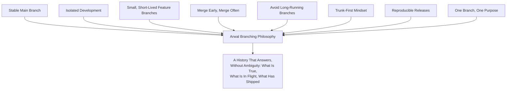

> **Callout — The One-Sentence Branching Philosophy**
> *"A branch is a promise about how long it will live and where it will go — the moment that promise becomes ambiguous, the branch has already started costing more than it's worth."*

---

# Branch Types

Every branch in Arwal's repository belongs to exactly one of eleven defined types. A branch outside this taxonomy is a review-blocking finding, mirroring the severity already established for an unapproved technology in `ai-docs/09-tech-stack.md` and an unapproved dependency in `ai-docs/22-dependency-management-standards.md`.

### `main`

| Dimension | Standard |
|---|---|
| **Purpose** | The Single Source of Truth for what is (or is about to be) in production, per `ai-docs/06-git-workflow.md`. |
| **Naming** | `main`, exactly — never renamed, never a second parallel "main-like" branch. |
| **Lifetime** | Permanent — exists for the life of the repository. |
| **Merge Targets** | Never merges *into* anything else except a hotfix's mandatory back-merge into `develop`. |
| **What Merges In** | `release/*` branches (merge commit) and `hotfix/*` branches (merge commit), per `ai-docs/06-git-workflow.md`'s Merge Strategy. |
| **Deletion Policy** | Never deleted. |
| **Owner** | Collectively owned by Engineering; protected per Branch Protection Rules below. |

### `develop`

| Dimension | Standard |
|---|---|
| **Purpose** | The integration branch where completed, reviewed features accumulate ahead of a release cut — always in a working, staging-deployable state, per `ai-docs/06-git-workflow.md`. |
| **Naming** | `develop`, exactly. |
| **Lifetime** | Permanent. |
| **Merge Targets** | Merges into `main` exclusively via a `release/*` branch. |
| **What Merges In** | `feature/*`, `bugfix/*`, `chore/*`, `docs/*`, `security/*` (non-emergency) branches, and a `hotfix/*`'s mandatory back-merge. |
| **Deletion Policy** | Never deleted. |
| **Owner** | Collectively owned by Engineering. |

### `feature/*`

| Dimension | Standard |
|---|---|
| **Purpose** | A single, scoped unit of new functionality tied to one phase/issue, per `ai-docs/06-git-workflow.md`. |
| **Naming** | `feature/<tracking-id>-<short-description>`, e.g. `feature/arwal-412-booking-cancellation-window`. |
| **Lifetime** | Short-lived — days, not weeks; a branch open beyond 10 business days is flagged per Anti-Patterns below. |
| **Merge Targets** | `develop`. |
| **Deletion Policy** | Deleted immediately on merge, per `ai-docs/06-git-workflow.md`'s Branch Protection Rules. |
| **Owner** | The authoring engineer, until merged. |

### `bugfix/*`

| Dimension | Standard |
|---|---|
| **Purpose** | A fix for a defect found in `develop`/Staging that is not yet in production. |
| **Naming** | `bugfix/<tracking-id>-<short-description>`, e.g. `bugfix/arwal-733-wallet-balance-rounding`. |
| **Lifetime** | Short-lived — typically shorter than a `feature/*` branch, scoped to a single defect. |
| **Merge Targets** | `develop`. |
| **Deletion Policy** | Deleted immediately on merge. |
| **Owner** | The authoring engineer. |

### `hotfix/*`

| Dimension | Standard |
|---|---|
| **Purpose** | An emergency fix for a defect already live in production, per `ai-docs/06-git-workflow.md`'s Hotfix Workflow. |
| **Naming** | `hotfix/<target-version>-<short-description>`, e.g. `hotfix/1.4.1-payment-gateway-timeout`. |
| **Lifetime** | Very short-lived — hours, never days. |
| **Merge Targets** | `main` (tagged immediately) **and** `develop` (mandatory back-merge), per `ai-docs/06-git-workflow.md`. |
| **Branches From** | `main`, never `develop` — the only branch type permitted to do so, since `main` is the only branch guaranteed to reflect exactly what is in production. |
| **Deletion Policy** | Deleted immediately once both merges are confirmed. |
| **Owner** | The responding on-call engineer, under Release Ownership's Incident Commander coordination (see below). |

### `release/*`

| Dimension | Standard |
|---|---|
| **Purpose** | A stabilization branch cut from `develop` for a specific release — only fixes, no new features, land here, per `ai-docs/06-git-workflow.md`. |
| **Naming** | `release/<version>`, e.g. `release/1.4.0`. |
| **Lifetime** | Short-lived — days, bounded by the Staging soak period (`ai-docs/16-deployment-standards.md`). |
| **Merge Targets** | `main` (merge commit, tagged) and `develop` (cherry-picked stabilization fixes back). |
| **Deletion Policy** | Archived, not deleted, until merged into `main` and tagged; deleted shortly after, per `ai-docs/06-git-workflow.md`'s "No branch deletion until merged and archived" rule. |
| **Owner** | The Release Engineer for that release cycle, per Release Ownership below. |

### `experiment/*`

| Dimension | Standard |
|---|---|
| **Purpose** | A speculative technical exploration — evaluating a candidate library, a new architectural pattern, or a performance hypothesis — with no commitment that it ever merges. |
| **Naming** | `experiment/<tracking-id>-<short-description>`, e.g. `experiment/arwal-901-drizzle-orm-evaluation`. |
| **Lifetime** | Bounded, explicitly time-boxed at creation (typically 1–2 weeks) — an `experiment/*` branch with no defined end date is a review-blocking finding at creation, not a tolerated ambiguity. |
| **Merge Targets** | Never merges directly — findings are written up (an ADR per `ai-docs/25-architecture-decision-records.md` if the exploration warrants one) and, if adopted, re-implemented as a fresh `feature/*` branch against current `develop`. |
| **Deletion Policy** | Deleted at its time-box's end, regardless of outcome — an experiment's *conclusion* (a written finding) is what is preserved, never the branch's raw commit history. |
| **Owner** | The proposing engineer. |

### `spike/*`

| Dimension | Standard |
|---|---|
| **Purpose** | A rapid, throwaway technical investigation to answer a narrow question ("can this approach even work at all?") — distinct from `experiment/*` in scope and formality: a spike is smaller, faster, and never intended to produce production-quality code. |
| **Naming** | `spike/<tracking-id>-<short-description>`, e.g. `spike/arwal-1042-can-we-stream-large-exports`. |
| **Lifetime** | Very short-lived — typically 1–3 days. |
| **Merge Targets** | Never merges — a spike's code is explicitly disposable; its answer (yes/no, plus what was learned) is captured in the originating ticket or a short note, never the branch itself. |
| **Deletion Policy** | Deleted immediately once the question is answered. |
| **Owner** | The investigating engineer. |

### `chore/*`

| Dimension | Standard |
|---|---|
| **Purpose** | Non-functional maintenance — dependency bumps, tooling changes, CI configuration, formatting-only passes, per `ai-docs/06-git-workflow.md`. |
| **Naming** | `chore/<short-description>`, e.g. `chore/upgrade-typescript-5-6`. |
| **Lifetime** | Short-lived. |
| **Merge Targets** | `develop`. |
| **Deletion Policy** | Deleted immediately on merge. |
| **Owner** | The authoring engineer. |

### `docs/*`

| Dimension | Standard |
|---|---|
| **Purpose** | Documentation-only changes (`ai-docs/`, `docs/`, READMEs) with no application-code impact, per `ai-docs/06-git-workflow.md` and `ai-docs/24-documentation-standards.md`. |
| **Naming** | `docs/<phase-or-topic>-<short-description>`, e.g. `docs/phase-28-branching-release-strategy`. |
| **Lifetime** | Short-lived. |
| **Merge Targets** | `develop` for `docs/*` operational content; a direct PR against `main`-adjacent review rigor for a structural `ai-docs/*` phase-document change, per `ai-docs/24-documentation-standards.md`'s Approval Authority table. |
| **Deletion Policy** | Deleted immediately on merge. |
| **Owner** | The authoring engineer, or the owning team for a foundational `ai-docs/*` change. |

### `security/*`

| Dimension | Standard |
|---|---|
| **Purpose** | A change addressing a security finding — a dependency CVE remediation, a hardening pass, a fix for an internally-discovered (not yet exploited) vulnerability — that is sensitive enough to warrant restricted visibility and elevated review, but is not yet an active production incident (which instead uses `hotfix/*`). |
| **Naming** | `security/<tracking-id>-<short-description>`, e.g. `security/sec-0087-jwt-issuer-validation`. |
| **Lifetime** | Short-lived, urgency scaled to the CVSS severity table already established in `ai-docs/22-dependency-management-standards.md`. |
| **Merge Targets** | `develop` for a routine finding; `main` directly (via the Hotfix Workflow's mechanics) for a Critical-severity finding with active citizen-facing exposure. |
| **Deletion Policy** | Deleted immediately on merge; the branch name and its PR are never publicly indexed if the underlying vulnerability is not yet publicly disclosed, per `ai-docs/10-security-standards.md`'s Incident Response confidentiality posture. |
| **Owner** | A Security Reviewer, per `ai-docs/26-code-review-standards.md`'s Security Reviewer role, jointly with the authoring engineer. |

### `support/*`

| Dimension | Standard |
|---|---|
| **Purpose** | A maintenance branch for an older, still-supported release line that is no longer receiving new features but still requires a patch (see LTS Releases below) — used only once Arwal's release maturity genuinely requires maintaining more than one active production line simultaneously. |
| **Naming** | `support/<major.minor>`, e.g. `support/1.4`. |
| **Lifetime** | Long-lived by design, for the declared support window of that release line — the one deliberate, documented exception to Avoid Long-Running Branches above, since its long life is the entire point, not an oversight. |
| **Merge Targets** | Never merges into `develop` or `main` — a fix landing here is cherry-picked from (or independently authored and separately cherry-picked into) the currently active `develop`/`main` line where applicable, never merged forward wholesale. |
| **Deletion Policy** | Deleted only once its declared support window formally ends, per an explicit, documented decision. |
| **Owner** | The Release Engineer responsible for that release line's support commitment. |

### Branch Type Comparison Table

| Branch Type | Lifetime | Merges Into | Deployable? | Deletion |
|---|---|---|---|---|
| `main` | Permanent | — | Yes — production | Never |
| `develop` | Permanent | `main` (via `release/*`) | Yes — staging | Never |
| `feature/*` | Days | `develop` | No | Immediate on merge |
| `bugfix/*` | Days | `develop` | No | Immediate on merge |
| `hotfix/*` | Hours | `main` + `develop` | Yes — expedited | Immediate on dual merge |
| `release/*` | Days | `main` + `develop` | Yes — release candidate | On merge + tag |
| `experiment/*` | 1–2 weeks (time-boxed) | Never | No | At time-box end |
| `spike/*` | 1–3 days | Never | No | Immediately after answer found |
| `chore/*` | Days | `develop` | No | Immediate on merge |
| `docs/*` | Days | `develop` (or elevated) | No | Immediate on merge |
| `security/*` | Hours–days (severity-scaled) | `develop` or `main` | Conditional | Immediate on merge |
| `support/*` | Life of the support window | Never forward-merges | Yes — its own line | End of support window |

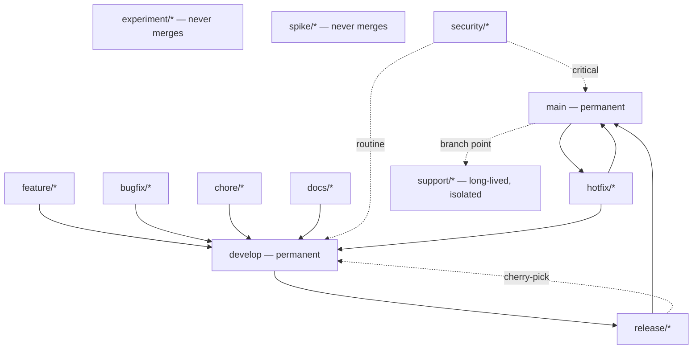

---

# Branch Lifecycle

Every branch, regardless of type, passes through the same conceptual lifecycle stages — Create, Develop, Sync, Review, Merge, Delete, and, for a small subset of types, Archive.

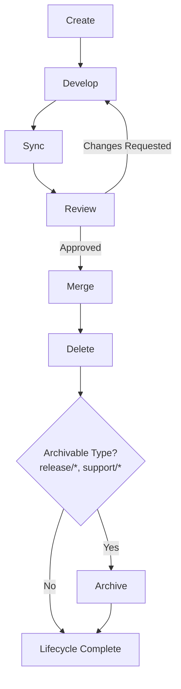

### Create

A branch is created from its correct base (`develop` for the overwhelming majority of types; `main` exclusively for `hotfix/*` and `support/*`), named per its type's convention above, and — for `experiment/*` — given an explicit, recorded time-box at the moment of creation. A branch created from the wrong base is a Blocking finding, since it silently changes what the branch's eventual merge will actually contain.

### Develop

Work proceeds on the branch through small, atomic commits, per the Commit Standards already established in `ai-docs/06-git-workflow.md` — a branch in this stage is never treated as a private scratchpad exempt from Conventional Commit discipline, since its commit history is what a reviewer and, later, a `git bisect` will read.

### Sync

The branch is kept current with its base via rebase (`git rebase develop`), never by repeatedly merging the base into the feature branch, per the Conflict Resolution standard already established in `ai-docs/06-git-workflow.md`. Syncing is performed proactively, before the branch has drifted far enough to produce a painful conflict, directly serving the Merge Early, Merge Often principle above.

### Review

The branch's PR passes through the complete Code Review process already established in `ai-docs/26-code-review-standards.md` — this document does not redefine a single element of that process; a branch does not advance past this stage until every applicable review level (Standard, Security, Architecture, Performance) has approved.

### Merge

The branch merges per the correct strategy for its type — squash for `feature/*`/`bugfix/*`/`chore/*`/`docs/*`, merge commit for `release/*`/`hotfix/*`, exactly per `ai-docs/06-git-workflow.md`'s Merge Strategy table, which this document does not redefine.

### Delete

The branch is deleted immediately upon successful merge, per the Branch Protection Rules already established in `ai-docs/06-git-workflow.md` and restated in the Deletion Policy column of every branch type above — a merged branch left undeleted clutters the repository's branch list and invites confusion about whether it still represents active work.

### Archive

Only `release/*` (until its tag is confirmed) and `support/*` (for the life of its support window) are ever archived rather than immediately deleted — every other branch type's work is fully preserved in `main`/`develop`'s own commit history the instant it merges, making a separate archive step unnecessary and, per Avoid Long-Running Branches above, actively undesirable.

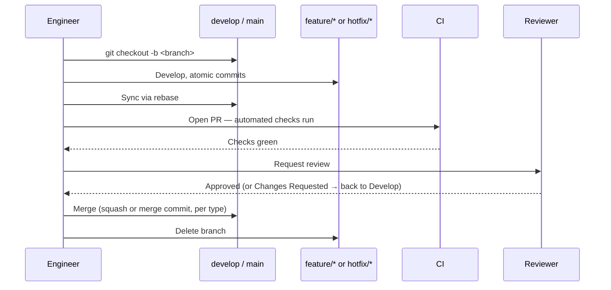

---

# Release Strategy

Arwal recognizes seven distinct release categories, each with a distinct purpose, audience, and rigor — mirroring the never-one-blunt-mechanism discipline already established for State Management (`ai-docs/02-engineering-principles.md`) and Configuration (`ai-docs/21-configuration-management-standards.md`), applied here to releases.

| Release Category | Purpose | Audience | Source Branch | Cadence |
|---|---|---|---|---|
| **Development Release** | Every merge to `develop`, continuously deployed to the Development environment (`ai-docs/23-environment-strategy.md`). | Engineering team | `develop` | Continuous |
| **Internal Release** | A stable, curated `develop` snapshot promoted to QA/Integration for structured verification. | QA, Engineering, Product | `develop` (snapshot) | Weekly, or on-demand |
| **Beta Release** | A `release/*` branch deployed to a limited, opt-in citizen cohort behind feature flags (`ai-docs/16-deployment-standards.md`'s Feature Flag Releases), to gather real-world signal before full rollout. | A defined citizen/merchant pilot cohort | `release/*` | Per feature readiness, not fixed cadence |
| **Release Candidate (RC)** | A `release/*` branch, staging-soaked and fully regression-tested, awaiting final Production Readiness sign-off. | Release Engineer, QA, DevOps, Tech Lead | `release/*` | Per Release Cadence below |
| **Production Release** | A tagged, promoted `main` commit, live to all citizens. | All citizens, merchants, officers, admins | `main` (via `release/*`) | Per Release Cadence below |
| **Emergency Release** | A Production Release cut outside the normal cadence in direct response to a Sev 1/Sev 2 incident, per `ai-docs/07-development-workflow.md`'s Incident Response Workflow. | All citizens (immediate impact scope) | `hotfix/*` or an expedited `release/*` | As needed, never scheduled |
| **Hotfix Release** | A narrowly-scoped Production Release addressing exactly one production defect, per `ai-docs/06-git-workflow.md`'s Hotfix Workflow. | All citizens affected by the specific defect | `hotfix/*` | As needed |
| **LTS Release** | A designated release line receiving only critical security and defect patches for an extended support window, once Arwal's maturity and government-partnership commitments require maintaining a stable line beyond the current release (see LTS Releases below). | Government partners on a contractual support window; enterprise-integration consumers | `support/*` | Patch-only, as needed within the window |

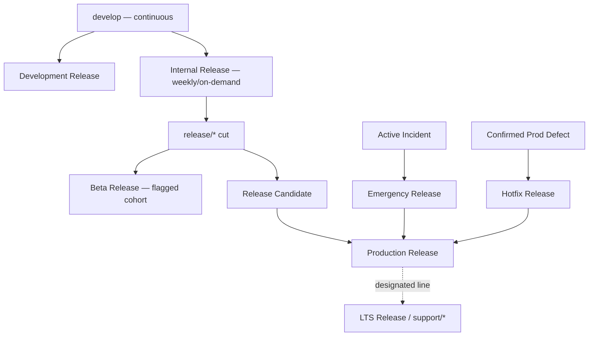

### LTS Releases

An LTS (Long-Term Support) release line is designated only when a genuine, documented need exists — a government-partnership contract requiring a stable integration surface for a fixed multi-month window, or an enterprise integration that cannot absorb Arwal's normal release cadence — never adopted speculatively, per the same Evidence over Prediction discipline already established in `ai-docs/03-system-architecture-principles.md`. Designating an LTS line is itself an ADR-worthy decision (`ai-docs/25-architecture-decision-records.md`'s Operational classification, at minimum), since it commits Arwal to maintaining a `support/*` branch and back-porting fixes to it for a defined window.

---

# Semantic Versioning

Arwal follows [Semantic Versioning](https://semver.org/) for the platform release itself, restating and extending the versioning scheme already introduced in `ai-docs/06-git-workflow.md`'s Release Strategy section with the full compatibility and deprecation discipline this document owns.

### MAJOR.MINOR.PATCH

| Segment | Incremented When | Example |
|---|---|---|
| **MAJOR** | A breaking, backward-incompatible platform change ships — a new API major version (`ai-docs/13-api-design-guidelines.md`), a fundamentally incompatible schema change, or a citizen-facing contract break with no compatibility shim. | `1.4.2` → `2.0.0` |
| **MINOR** | A new, backward-compatible feature or capability ships. | `1.4.2` → `1.5.0` |
| **PATCH** | A backward-compatible bug fix or hotfix ships. | `1.4.2` → `1.4.3` |

### Pre-Release Identifiers

A pre-release version is suffixed with a hyphenated identifier, ordered by SemVer's own precedence rules (a pre-release version always sorts before its corresponding final release):

| Identifier | Meaning | Example |
|---|---|---|
| `-alpha.N` | An early, internally-verified snapshot — Internal Release category above. | `1.5.0-alpha.1` |
| `-beta.N` | A Beta Release, per the category above — feature-complete, exposed to a limited cohort. | `1.5.0-beta.2` |
| `-rc.N` | A Release Candidate — staging-soaked, awaiting final sign-off. | `1.5.0-rc.1` |

### Build Metadata

Where a build-specific identifier is genuinely useful (tying a specific CI run or commit SHA to a version string for internal traceability), it is appended after a `+`, per SemVer's own build-metadata convention — build metadata is **never** used for version precedence comparison and is purely informational: `1.5.0+build.20260724.a1b2c3d`.

### Examples

| Version String | Meaning |
|---|---|
| `1.4.2` | The current, stable Production Release. |
| `1.5.0-rc.1` | The first Release Candidate for the upcoming `1.5.0` MINOR release. |
| `1.4.3` | A PATCH release — a bug fix or hotfix on top of `1.4.2`. |
| `2.0.0-beta.1` | The first Beta of an upcoming breaking MAJOR release. |
| `1.4.2+build.a1b2c3d` | The exact same release as `1.4.2`, annotated with its build provenance. |

### Version Compatibility

A MINOR or PATCH release is always backward-compatible with the version it follows within the same MAJOR line — a citizen-facing client, a government-partner integration, or an internal `packages/sdk` consumer built against `1.4.x` continues working unmodified against `1.5.0`, per the identical Backward Compatibility discipline already established for API versioning in `ai-docs/13-api-design-guidelines.md`, applied here to the platform release version as a whole. A MAJOR release is the only version boundary permitted to break this guarantee, and only after the deprecation window below has run its full course.

### Deprecation Policy

Per the identical Deprecation and Sunset Policy already established in `ai-docs/13-api-design-guidelines.md` for individual API versions, a platform MAJOR version's predecessor is supported for a minimum, documented window after the new MAJOR ships — during which the prior MAJOR line receives only critical security and defect patches (functionally, a time-boxed `support/*` line) before being formally retired. A MAJOR version bump is never announced and executed in the same release; the deprecation window is communicated in advance, per the Transparency over Opacity principle already established in `ai-docs/00-project-vision.md`.

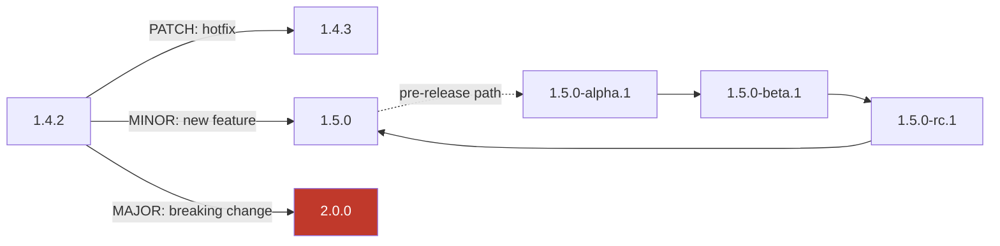

---

# Release Cadence

| Cadence Tier | Frequency | What Ships |
|---|---|---|
| **Daily Development** | Continuous, on every merge to `develop`. | Auto-deployed to the Development environment, per `ai-docs/23-environment-strategy.md` — no version tag, no citizen impact. |
| **Weekly Internal** | Weekly, or on-demand for a feature-complete slice. | A stable `develop` snapshot promoted to QA/Integration for structured verification. |
| **Bi-Weekly / Monthly Production** | A fixed, published cadence — Arwal's recommended default is **bi-weekly** during active early-phase development, moving toward **monthly** once the platform and its citizen base mature and stability outweighs the value of faster feature delivery. | A tagged, sign-off-gated `main` promotion, per the Production Readiness Checklist (`ai-docs/16-deployment-standards.md`). |
| **Emergency Release** | Unscheduled, triggered exclusively by a declared Sev 1/Sev 2 incident. | A narrowly-scoped fix, per the Hotfix Strategy below. |

### Why Bi-Weekly, Not Weekly or Quarterly

A cadence faster than bi-weekly does not give a `release/*` branch's Staging soak period (`ai-docs/16-deployment-standards.md`) enough real-world time to surface a slow-manifesting regression before the next release is already queued behind it. A cadence slower than monthly re-introduces the Large, Infrequent Release risk already named in `ai-docs/16-deployment-standards.md`'s Small & Frequent Releases principle — more changes bundled together, a harder rollback, and a longer feedback loop between a defect's introduction and its discovery. Bi-weekly is Arwal's evidence-based starting point, revisited via ADR (`ai-docs/25-architecture-decision-records.md`, Operational classification) as real release-metrics data (see Release Metrics below) accumulates.

### Scheduled Maintenance Windows

Where a release carries a genuine, unavoidable citizen-facing interruption risk (a rare, non-zero-downtime-capable migration, per the narrow exception already acknowledged in `ai-docs/16-deployment-standards.md`'s Zero-Downtime Migrations section), it is scheduled into a published, low-traffic maintenance window, communicated to affected citizens and government partners in advance, per Transparency over Opacity.

### Release Freeze Periods

A release freeze — a defined window during which no non-emergency Production Release is promoted — is declared for a specific, documented reason: a major government-partnership launch event, a high-traffic civic deadline (a scheme application closing date), or an end-of-year low-staffing period. A freeze never blocks an Emergency Release; the Hotfix Strategy below remains fully active during any freeze, since a citizen-facing defect does not pause merely because the calendar says it should.

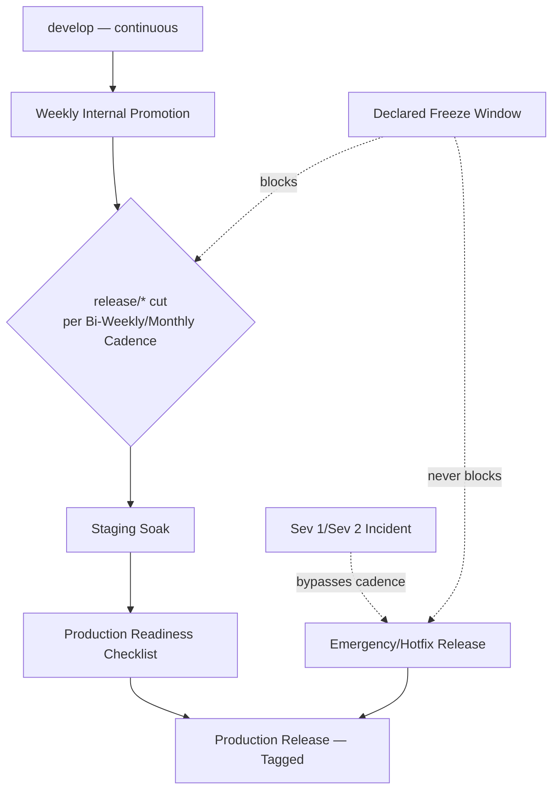

---

# Hotfix Strategy

### When Hotfixes Are Allowed

A `hotfix/*` branch is opened only for a **confirmed, already-live production defect** — per the Bug Fix Severity table already established in `ai-docs/07-development-workflow.md`, this means a Sev 1 (always) or Sev 2 (typically) classification. A hotfix is never used as a shortcut to ship a feature outside the normal `feature/*` → `develop` → `release/*` path merely because it feels urgent — urgency without a confirmed production defect routes through the expedited-but-standard Bug Fix Workflow, never a hotfix.

### Approval Process

A hotfix requires at least one reviewer's approval — expedited, never skipped, per the identical standard already established in `ai-docs/06-git-workflow.md`'s Hotfix Workflow. For a hotfix touching `payments`, `identity`, or `civic-services`, the elevated, security-context review already required by `ai-docs/06-git-workflow.md`'s Required Approvals and `ai-docs/26-code-review-standards.md`'s Security Review level applies identically — "hotfix" reduces process *latency*, never review *rigor*.

### Testing Expectations

Per the Bug Fix Definition of Done already established in `ai-docs/08-definition-of-done.md`, every hotfix ships with a regression test proving the specific defect is fixed and would have been caught by that test before the fix — a hotfix PR without one is a Blocking finding, with zero exception for urgency. The hotfix additionally passes the full existing CI suite (`ai-docs/17-cicd-standards.md`) before merge; "urgent" never means "untested."

### Rollback Requirements

Per the Rollback Standards already established in `ai-docs/16-deployment-standards.md`, every hotfix's rollback path is confirmed *before* it is deployed — the previous production tag remains deployable, and any accompanying migration follows the identical backward-compatible discipline already established in `ai-docs/14-database-design-guidelines.md`. A hotfix with no confirmed rollback path is not deployed, regardless of the incident's severity, since deploying an unrecoverable fix during an active incident risks converting a bad situation into an unrecoverable one.

### Merge-Back Strategy

Every hotfix merges into **both** `main` (tagged immediately as a new PATCH release) **and** `develop` (via a mandatory back-merge), per `ai-docs/06-git-workflow.md` — the back-merge into `develop` is never optional or deferred, since skipping it means the next regular release would silently regress the exact defect the hotfix just fixed.

### Documentation Updates

Every Sev 1/Sev 2 hotfix is followed by a blameless postmortem, per the Incident Response Workflow already established in `ai-docs/07-development-workflow.md`, and — where the hotfix implements or reveals an ADR-worthy decision (a previously undocumented assumption the incident exposed) — a corresponding ADR is filed per `ai-docs/25-architecture-decision-records.md`'s Emergency classification, ratified within one business day of the incident's resolution.

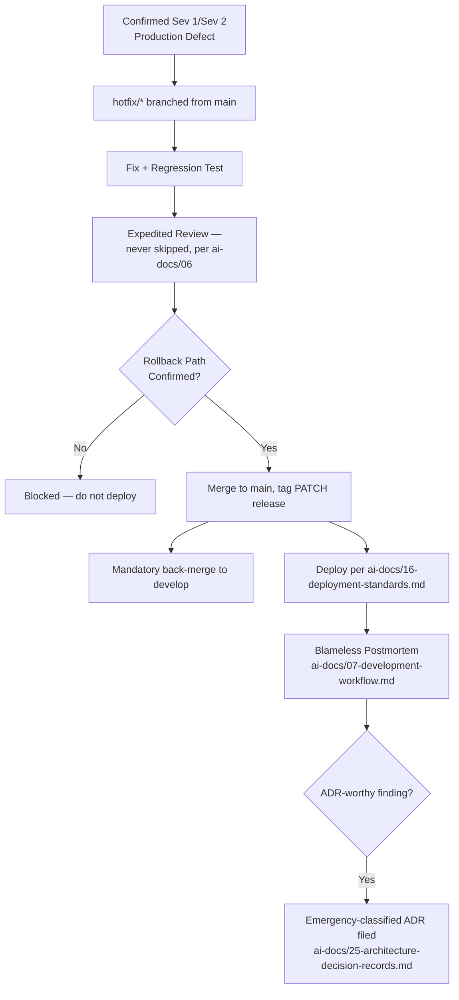

---

# Release Ownership

| Role | Responsibility |
|---|---|
| **Developer** | Authors a correctly-typed, correctly-scoped branch per Branch Types above; ensures their own PR is release-ready per `ai-docs/26-code-review-standards.md`'s Pull Request Standards. |
| **Reviewer** | Applies the Code Review Checklist (`ai-docs/26-code-review-standards.md`) to every branch before it merges into `develop` or a `release/*` line. |
| **Release Engineer** | Owns the `release/*` branch for a given cycle end-to-end — cutting it, coordinating its Staging soak, tracking its stabilization fixes, and executing its promotion to `main` per the Release Workflow below. |
| **QA** | Verifies the release candidate against the full regression suite (`ai-docs/15-testing-standards.md`) and signs off on the Release Readiness Checklist (`ai-docs/07-development-workflow.md`). |
| **Security** | Reviews any `security/*` branch and any release touching `payments`/`identity`/`civic-services`, per `ai-docs/10-security-standards.md`'s Elevated Review requirement. |
| **Product Owner** | Confirms the release's scope matches what was committed for that cycle; makes the final call on whether a partially-complete feature ships behind a flag or is deferred to the next cycle. |
| **Engineering Manager** | Owns release-health metrics (see Release Metrics below), resolves cross-team scheduling conflicts, and ensures release cadence is sustainable, not merely aspirational. |
| **Incident Commander** | Assumes command authority for the duration of an Emergency/Hotfix Release, per the Incident Response Workflow (`ai-docs/07-development-workflow.md`) — coordinates the responding engineer, the approval path, and the post-incident documentation. |

### Responsibility Matrix

| Responsibility | Developer | Reviewer | Release Engineer | QA | Security | Product Owner | EM | Incident Commander |
|---|---|---|---|---|---|---|---|---|
| Author a correctly-scoped branch | ✅ | | | | | | | |
| Review a PR before merge | | ✅ | | | ✅ (elevated) | | | |
| Cut and own a `release/*` branch | | | ✅ | | | | | |
| Sign off on Release Readiness | | | ✅ | ✅ | ✅ (where applicable) | | | |
| Confirm release scope | | | | | | ✅ | | |
| Tag and promote to `main` | | | ✅ | | | | | |
| Declare and lead an incident | | | | | | | | ✅ |
| Approve a hotfix | | ✅ | | | ✅ (elevated) | | | ✅ (ratifies) |
| Track release-health metrics | | | | | | | ✅ | |
| Resolve scheduling conflicts | | | | | | | ✅ | |

---

# Branch Protection Rules

This section restates, at the strategic level, the branch protection mechanics already fully established in `ai-docs/06-git-workflow.md`'s Branch Protection Rules table — it does not redefine any enforcement mechanic; it affirms which branch types from this document's taxonomy each rule applies to.

| Rule | `main` | `develop` | `release/*` | `support/*` | `feature/*`/`bugfix/*`/`chore/*`/`docs/*` |
|---|---|---|---|---|---|
| **Protected (no direct push)** | ✅ | ✅ | ✅ | ✅ | Optional, at team discretion |
| **Force push forbidden** | ✅ | ✅ | ✅ | ✅ | ✅ (once shared/reviewed) |
| **Required reviews** | 1–2 (per domain, `ai-docs/06`) | 1 | 1 | 1 | 1 |
| **Required CI** | ✅ | ✅ | ✅ | ✅ | ✅ |
| **Signed commits** | Recommended, phased in | Optional | Optional | Optional | Optional |
| **Direct push policy** | Never, for any role | Never | Never | Never | Permitted only on an engineer's own unreviewed branch |
| **Merge restrictions** | Only `release/*`/`hotfix/*` merge commits | Only `feature/*`/`bugfix/*`/`chore/*`/`docs/*`/`security/*` squash merges + `hotfix/*` back-merge | Only from `develop`, plus cherry-picked fixes | Cherry-picked patches only, never a forward merge | Merges into `develop` only |

> **Callout — No Branch Type Is a Backdoor**
> Every rule above applies identically regardless of which branch type is attempting the action — a `hotfix/*` branch's urgency never grants it force-push capability, and a `support/*` branch's isolation never exempts it from required review. Branch protection has no "urgent" exception, per the identical "No Direct Push to `main`, Ever" principle already established in `ai-docs/06-git-workflow.md`.

---

# Release Workflow

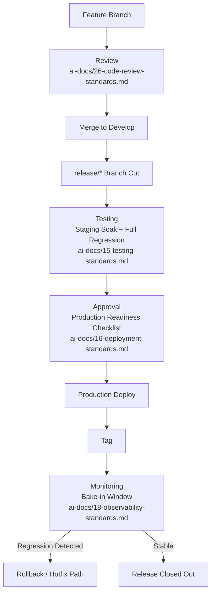

### Stage Detail

| Stage | Governed By | This Document's Role |
|---|---|---|
| **Feature Branch** | `ai-docs/06-git-workflow.md` | Names the branch type and its lifecycle expectations (Branch Types above). |
| **Review** | `ai-docs/26-code-review-standards.md` | Defers entirely — no redefinition. |
| **Merge to Develop** | `ai-docs/06-git-workflow.md` | Defers to the Merge Strategy mechanics. |
| **`release/*` Branch Cut** | This document | Defines *when* a cut happens (Release Cadence above) and *who* owns it (Release Ownership above). |
| **Testing** | `ai-docs/15-testing-standards.md` | Defers entirely — no redefinition. |
| **Approval** | `ai-docs/16-deployment-standards.md`, `ai-docs/07-development-workflow.md` | Defers entirely — no redefinition. |
| **Production Deploy** | `ai-docs/16-deployment-standards.md`, `ai-docs/17-cicd-standards.md` | Defers entirely — no redefinition. |
| **Tag** | `ai-docs/06-git-workflow.md`, `ai-docs/17-cicd-standards.md` | Defines the SemVer scheme the tag follows (Semantic Versioning above). |
| **Monitoring** | `ai-docs/18-observability-standards.md` | Defers entirely — no redefinition. |

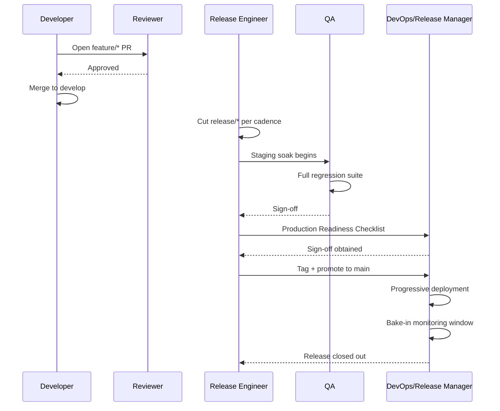

---

# Release Risk Classification

Every release — a routine cycle, a hotfix, or an emergency — is classified into one of four risk tiers, and that classification determines the review depth, testing depth, approval chain, and rollback/monitoring rigor applied to it. This directly extends the Risk-Based Testing discipline already established in `ai-docs/15-testing-standards.md` to the release as a whole, not merely its constituent tests.

| Risk Tier | Definition | Review Level | Testing | Approvals | Rollback Expectation | Monitoring |
|---|---|---|---|---|---|---|
| **Low** | A change confined to a single, non-citizen-critical module, with no schema change, no new external dependency, no security-sensitive surface. | Standard Review, one approver. | Unit + integration, per the appropriate Testing Pyramid level. | Release Engineer sign-off only. | Standard rollback (redeploy previous tag), per `ai-docs/16-deployment-standards.md`. | Standard bake-in window (30 minutes, per `ai-docs/16-deployment-standards.md`). |
| **Medium** | A change touching a citizen-facing but non-financial, non-identity flow, or introducing a new, non-breaking schema addition. | Standard Review + Domain Expert. | Unit + integration + relevant E2E coverage. | Release Engineer + QA sign-off. | Confirmed rollback path stated explicitly in the PR/release notes. | Extended bake-in window; golden signals actively watched for the first hour. |
| **High** | A change touching `payments`, `identity`, or `civic-services` domain logic, a breaking API version, or a schema change with a non-trivial backfill. | Standard Review + Security Reviewer + Architecture Reviewer (where ADR-worthy). | Full regression suite + load testing where load risk is identified, per `ai-docs/11-performance-standards.md`. | Release Engineer + QA + Security + Tech Lead sign-off. | Rollback path tested against a Staging-equivalent scenario before promotion; Blue-Green or Canary strategy preferred per `ai-docs/16-deployment-standards.md`. | Full bake-in window (several hours) with an assigned, briefed on-call responder actively watching. |
| **Critical** | A change with platform-wide citizen impact potential — a core authentication change, a payment-gateway integration change, a data-residency-affecting infrastructure change, or any Emergency Release. | Every applicable elevated review level engaged simultaneously; Architecture Review mandatory regardless of ADR threshold. | Full regression suite + load testing + a dedicated pre-release verification pass. | Release Engineer + QA + Security + Tech Lead + Engineering Manager sign-off; Incident Commander on standby for the deployment window. | Rollback plan rehearsed, not merely documented; a Shadow or Canary deployment strategy is the default, never Rolling alone, per `ai-docs/16-deployment-standards.md`. | Continuous, live-monitored bake-in with a dedicated incident bridge kept open until stability is confirmed. |

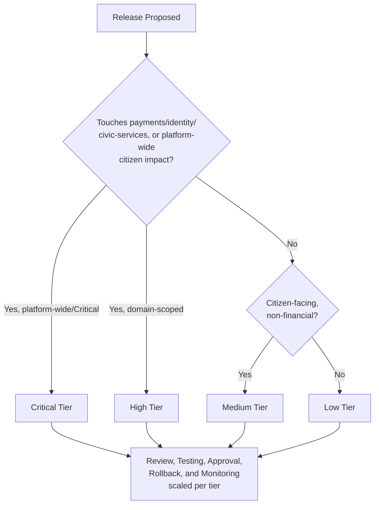

---

# Automation

Consistent with the Automation First principle already established across `ai-docs/16-deployment-standards.md` and `ai-docs/17-cicd-standards.md`, every mechanical aspect of this document's release strategy is executed automatically — this document does not redefine a single pipeline mechanic; it affirms which automated capabilities exist to serve the strategy defined above.

| Automated Capability | Purpose | Governing Document |
|---|---|---|
| **Automatic versioning** | Computes the next SemVer version from Conventional Commit history since the last tag, per the scheme in Semantic Versioning above. | `ai-docs/17-cicd-standards.md`'s Release Automation |
| **Tag generation** | Applies the annotated Git tag the moment a `release/*` or `hotfix/*` branch merges to `main`. | `ai-docs/06-git-workflow.md`, `ai-docs/17-cicd-standards.md` |
| **Release notes generation** | Generates a changelog from Conventional Commits between tags, per `ai-docs/06-git-workflow.md`. | `ai-docs/17-cicd-standards.md` |
| **Branch cleanup** | Automatically deletes a merged `feature/*`/`bugfix/*`/`chore/*`/`docs/*` branch, per the Deletion Policy already stated per type above. | `ai-docs/06-git-workflow.md`'s Branch Protection Rules |
| **CI gates** | Every required status check per `ai-docs/17-cicd-standards.md`'s Pipeline Quality Gates table blocks merge on failure, with no exception for any branch type in this document's taxonomy. | `ai-docs/17-cicd-standards.md` |
| **Deployment triggers** | Merge to `develop` triggers Development deploy; `release/*` push triggers Staging deploy; a tag on `main` triggers the gated Production deployment workflow, per `ai-docs/17-cicd-standards.md`'s Promotion Between Environments. | `ai-docs/17-cicd-standards.md`, `ai-docs/16-deployment-standards.md` |
| **Artifact generation** | Every merge to `develop`/`main` produces an immutable, SHA-tagged artifact, per `ai-docs/17-cicd-standards.md`'s Artifact Management. | `ai-docs/17-cicd-standards.md` |

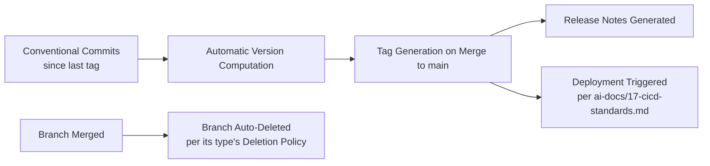

---

# Release Metrics

Per the Actionable Metrics principle already established in `ai-docs/18-observability-standards.md`, every metric below ties to a real question a Release Engineer or Engineering Manager will actually ask — never collected purely because it is measurable. These align directly with the four DORA metrics already adopted for CI/CD health in `ai-docs/17-cicd-standards.md`, applied here specifically to the release rhythm this document governs.

| Metric | Definition | What a Regression Signals |
|---|---|---|
| **Release frequency** | Count of Production Releases per unit time, tracked against the Release Cadence target above. | A declining rate signals either a growing backlog of unreleased work or a Staging soak/approval bottleneck. |
| **Lead time for changes** | Time from a commit landing on `develop` to that commit reaching Production. | A rising lead time signals cadence drift or an oversized `release/*` stabilization window. |
| **Deployment success rate** | Percentage of Production Releases that complete without requiring a rollback or immediate hotfix. | A declining rate signals a gap in the Release Risk Classification's testing/approval rigor for the tier(s) actually failing. |
| **Rollback rate** | Percentage of releases triggering a rollback per `ai-docs/16-deployment-standards.md`'s Rollback Standards. | A rising rate is the single most direct signal that risk classification or Staging soak duration needs recalibration. |
| **Hotfix frequency** | Count of `hotfix/*` releases per unit time. | A rising trend signals either declining pre-release quality or an under-resourced regular release cadence pushing urgent fixes outside the normal path. |
| **Mean Time to Recovery (MTTR)** | Average time from a Production regression's detection to its resolution (rollback or hotfix), per `ai-docs/07-development-workflow.md`'s Incident Response Workflow. | A rising MTTR signals a gap in rollback readiness or on-call response capacity. |
| **Change failure rate** | Percentage of all changes (routine + hotfix) that result in a degraded service requiring remediation. | The headline DORA-aligned quality signal — a rising rate is treated with the same severity `ai-docs/17-cicd-standards.md` already assigns it for pipeline health. |
| **Release duration** | Time from `release/*` branch cut to Production tag — the Staging soak-and-approval window's actual length. | A duration significantly exceeding the Release Cadence target's implied window signals a testing or approval bottleneck requiring investigation, not a schedule to simply push back silently. |

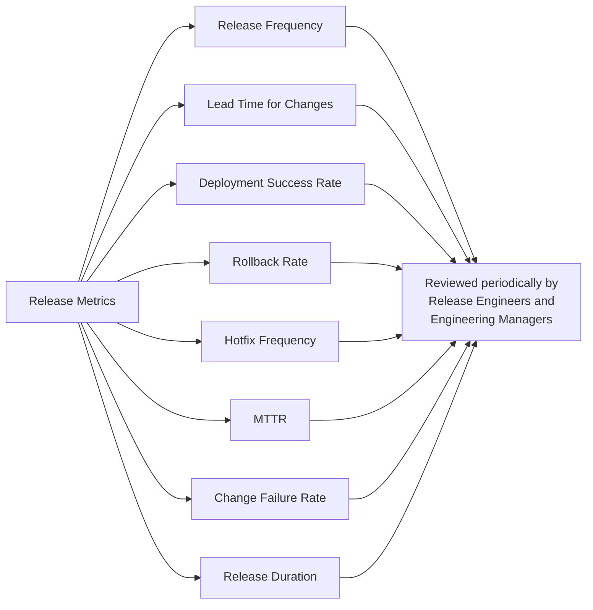

---

# AI-Assisted Release Governance

Consistent with the AI-Assisted Development Guidelines already established in `ai-docs/07-development-workflow.md`, the AI-Generated Documentation standard in `ai-docs/24-documentation-standards.md`, and the AI-Assisted Code Review standard in `ai-docs/26-code-review-standards.md`, release-related content produced with AI assistance is governed by the identical, non-negotiable principle: **AI accelerates drafting, never accountability.**

### AI-Generated Release Notes

A release's changelog is generated mechanically from Conventional Commit history, per `ai-docs/17-cicd-standards.md`'s Changelog Generation — where an AI tool is used to produce a more readable, narrative summary layered on top of that mechanical changelog (e.g., a citizen-facing "what's new" summary), the underlying commit-derived changelog remains the authoritative record, and the AI-generated narrative is reviewed for accuracy before publication.

### AI-Assisted Changelog Generation

Any AI-assisted rewording of a changelog entry is verified against the actual PR/commit it describes by the Release Engineer before the release notes are published — an AI tool's plausible-sounding but inaccurate summary of what a change actually does is a direct violation of Accuracy Over Quantity, already established in `ai-docs/24-documentation-standards.md`, applied here to release communication specifically.

### AI Recommendations

An AI tool may be used to suggest a release's risk classification (per Release Risk Classification above), flag a potentially missing rollback plan, or draft a release-readiness summary — every such suggestion is treated as a draft for the Release Engineer to evaluate, never as an authoritative classification accepted mechanically, mirroring the identical AI Review Comments standard already established in `ai-docs/26-code-review-standards.md`.

### Human Approval

No release — Low, Medium, High, or Critical tier — is promoted to Production on the basis of an AI tool's sign-off alone. Every Approval Authority named in Release Ownership above is a named human, and that human's engagement with the actual release candidate, not merely a review of an AI-generated summary of it, is what constitutes approval.

### Fact Verification

Any claim an AI tool makes about a release candidate — "this release contains no breaking changes," "this migration is backward-compatible" — is independently verified against the actual diff and the relevant governing standard (`ai-docs/13-api-design-guidelines.md`, `ai-docs/14-database-design-guidelines.md`) before being relied upon, per the identical Hallucination Prevention discipline already established in `ai-docs/15-testing-standards.md` and `ai-docs/24-documentation-standards.md`.

### Ownership

The Release Engineer who promotes a release remains its full, accountable owner regardless of how much AI assistance contributed to its notes, its risk assessment draft, or its changelog — identical to the Traceability principle already established in `ai-docs/06-git-workflow.md` for AI-assisted commits.

---

# Branch & Release Anti-Patterns

The following patterns are explicitly rejected, regardless of how convenient they appear under deadline pressure — each is a specific, previously observed failure mode in branching-and-release-heavy engineering organizations, called out here so Arwal does not have to relearn the lesson expensively at Phase 200.

| Anti-Pattern | Description | Why It's Rejected |
|---|---|---|
| **Long-Lived Branches** | A `feature/*` branch open for weeks, diverging heavily from `develop`. | Violates Avoid Long-Running Branches above; produces painful conflicts and stale review context, per `ai-docs/06-git-workflow.md`. |
| **Huge Releases** | A `release/*` branch bundling months of unrelated feature work into one cut. | Violates Small & Frequent Releases (`ai-docs/16-deployment-standards.md`); a defect in a huge release is far harder to isolate to its cause. |
| **Direct Production Commits** | A change pushed directly to `main`, bypassing every branch type in this taxonomy. | Bypasses review, CI, and every risk-classification gate this document defines; forbidden with zero exception, per `ai-docs/06-git-workflow.md`'s "No Direct Push to `main`, Ever." |
| **Unreviewed Hotfixes** | A `hotfix/*` merged without the required review, "because it's urgent." | Directly violates Hotfix Strategy's Approval Process above; urgency reduces latency, never rigor. |
| **Skipped Testing** | A release promoted without its full regression suite, "to save time." | Violates the Testing requirements at every Release Risk Classification tier above and the Release Readiness Checklist in `ai-docs/07-development-workflow.md`. |
| **Manual Versioning** | A version number hand-typed by an engineer instead of computed from Conventional Commit history. | Defeats the Reproducible Releases principle above and the Automatic Versioning capability in Automation above; introduces a class of human-error version drift. |
| **Forgotten Branches** | A merged branch left undeleted, or an `experiment/*`/`spike/*` branch abandoned past its time-box with no cleanup. | Clutters the repository and, per `experiment/*`'s and `spike/*`'s explicit lifecycle rules above, leaves an ambiguous, unowned artifact nobody is accountable for. |
| **Release Without a Rollback Plan** | A Production Release promoted with no confirmed, stated rollback path. | Directly violates the Rollback Expectation column of every Release Risk Classification tier above and `ai-docs/16-deployment-standards.md`'s standing Rollback Readiness precondition. |
| **Branch Type Misuse** | A `spike/*` branch quietly evolving into production code, or a `feature/*` branch repurposed as a de facto hotfix. | Violates One Branch, One Purpose above; the branch's type no longer reflects the guarantees a reviewer or automation rule assumes about it. |
| **Cadence Drift Without Acknowledgment** | Releases silently slipping later and later without a documented reason or a recalibrated cadence. | Violates the Release Duration metric's purpose above; an unacknowledged drift compounds into an unpredictable, untrustworthy release rhythm. |

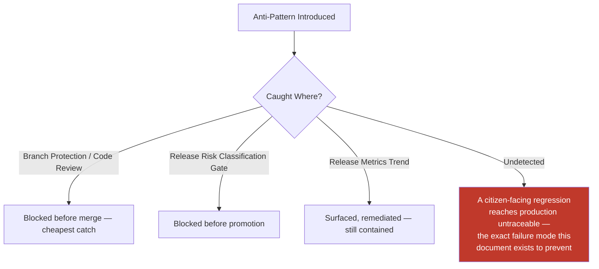

---

# Engineering Review Checklist

Every pull request, branch, or release proposal is checked against the following before it is considered compliant with this document:

- [ ] **Correct branch type used** — The branch matches exactly one type in Branch Types above, named per its convention, branched from its correct base.
- [ ] **Lifetime respected** — The branch has not exceeded its type's expected lifetime (per Branch Type Comparison Table) without an explicit, documented reason.
- [ ] **Merge target correct** — The branch merges into exactly the target(s) its type permits — no `feature/*` merging directly to `main`, no `hotfix/*` skipping its mandatory `develop` back-merge.
- [ ] **Deletion policy honored** — The branch is deleted (or archived, for `release/*`/`support/*`) per its type's policy immediately upon reaching its lifecycle's end.
- [ ] **Correct release category identified** — The change is correctly understood as belonging to a Development, Internal, Beta, RC, Production, Emergency, Hotfix, or LTS release, per Release Strategy above.
- [ ] **Version bump correct** — Any version change follows Semantic Versioning above; a breaking change is never shipped as a MINOR or PATCH.
- [ ] **Cadence respected, or deviation documented** — The release fits the defined cadence, or an explicit reason (Emergency Release, freeze exception) is recorded.
- [ ] **Hotfix criteria genuinely met** — A `hotfix/*` branch corresponds to a confirmed, already-live Sev 1/Sev 2 defect, never a convenience shortcut.
- [ ] **Risk tier correctly classified** — The release's Low/Medium/High/Critical classification matches its actual scope and domain sensitivity, per Release Risk Classification above.
- [ ] **Required approvals obtained** — Matching the classification's Approval column, per Release Risk Classification and the Responsibility Matrix in Release Ownership.
- [ ] **Rollback plan confirmed** — Stated explicitly, and — for High/Critical tiers — tested, before promotion.
- [ ] **Automation correctly invoked** — Versioning, tagging, and changelog generation are automated per Automation above, never manually substituted.
- [ ] **AI-assisted release content verified** — Any AI-generated release note, changelog narrative, or risk-classification suggestion has been independently fact-checked by the accountable human Release Engineer.
- [ ] **No anti-pattern present** — The change does not exhibit a long-lived branch, a huge release, a direct production commit, an unreviewed hotfix, skipped testing, manual versioning, a forgotten branch, or a rollback-plan-free release.
- [ ] **No duplication of Git Workflow, CI/CD, Deployment, Testing, or Code Review standards** — Any such concern is deferred entirely to its owning phase document, never redefined here.

A pull request or release failing any item above is not merged or promoted until resolved — this checklist carries the same non-negotiable authority as every other review checklist established in the preceding twenty-seven phase documents.

---

# Relationship to Previous Standards

### Engineering Principles

`ai-docs/02-engineering-principles.md` establishes the founding Git and Branching Principles — trunk-based development with short-lived branches, descriptive commits, no direct commits to protected branches, atomic commits, and always-deployable protected branches. This document is the complete, standalone expansion of the *branching and release* dimension of that foundation, applied across every branch type Arwal actually uses and every release category it actually ships.

### Git Workflow

`ai-docs/06-git-workflow.md` owns every mechanical detail this document's branch types and release workflow run on top of — branch naming syntax, commit message format, PR template, merge strategy per branch type, conflict resolution, and branch protection configuration. This document never redefines a single one of those mechanics; it defines the strategic layer of *which branch types exist, how long they live, and what release rhythm they collectively produce*.

### Development Workflow

`ai-docs/07-development-workflow.md` owns the Engineering Lifecycle, the Bug Fix Workflow's severity table, the Architecture Review Workflow, and the Release Readiness Workflow this document's Release Workflow and Hotfix Strategy sections directly build on. This document is where the *branching and versioning* consequences of those workflows are fully specified.

### CI/CD Standards

`ai-docs/17-cicd-standards.md` owns the complete, executable automation — the workflows, quality gates, and release automation mechanics (tagging, changelog generation, promotion triggers) that make this document's strategy real. This document never redefines a pipeline stage; it defines the policy those pipelines execute.

### Deployment Standards

`ai-docs/16-deployment-standards.md` owns environments, deployment strategies, rollback mechanics, and the Production Readiness Checklist. This document never redefines a deployment mechanic; it defines when a `release/*` branch is cut and what release category and risk tier determine which of `ai-docs/16-deployment-standards.md`'s strategies applies.

### Testing Standards

`ai-docs/15-testing-standards.md` owns the complete Testing Pyramid and regression-testing discipline this document's Release Risk Classification table references by tier. This document never redefines a test type or coverage floor; it defines how much of that testing discipline a given release's risk tier requires before promotion.

### Code Review Standards

`ai-docs/26-code-review-standards.md` owns the complete human review process, checklist, and elevated-review-level mechanics this document's Branch Lifecycle's Review stage and Hotfix Strategy's Approval Process both depend on. This document never redefines a review standard; it defines which branch types and release tiers trigger which review level.

### ADR Standards

`ai-docs/25-architecture-decision-records.md` owns when a decision requires a permanent record. This document's LTS Release designation, Release Cadence recalibration, and Emergency-classified hotfix follow-ups all reference that document's ADR triggers directly, never redefining them.

### Future Engineering Handbook

This document is the twenty-eighth chapter of the Engineering Handbook, and every branch opened and every release shipped at Arwal, for the life of the project, flows through the strategy it defines — the layer that turns individually well-governed commits, reviews, and deployments into a coherent, predictable, trustworthy release rhythm sustained across ~300 micro-phases.

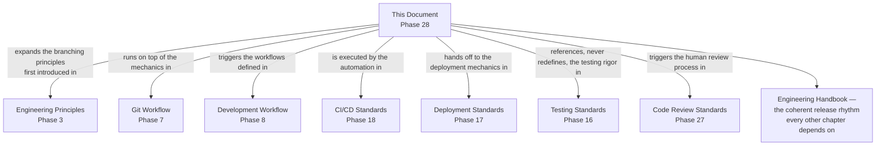

---

# Closing Statement

> **Callout — Closing Statement**
> Every preceding phase document described a standard Arwal holds itself to at the level of a line of code, a pull request, a deployment, or a decision. This document describes the rhythm that ties every one of those individual acts into a single, predictable, trustworthy cadence — the difference between a team that ships software and a team that ships software *the same disciplined way, every time*, whether it is the first release of Phase 1 or the three-thousandth release of Phase 280. A branching and release strategy is not bureaucracy layered on top of engineering velocity — it is the precondition for velocity that lasts. A team that treats every branch and every release as a one-off, improvised event will, for a while, appear fast; a team that treats every branch and every release as an instance of a well-understood, well-governed pattern will still be fast at Phase 280, when the improvising team has long since drowned in its own untraceable history. For a district's citizens depending on Arwal for a booking, a payment, and a government application, the branch and release strategy behind that dependency is invisible — and its invisibility, sustained flawlessly across years of team growth and thousands of releases, is exactly the point. Where a future phase must deviate from a standard stated here, that deviation is made explicitly — through this document's own review process, or an Architectural Decision Record where the deviation is structural — never silently, and never by default.

This document, `ai-docs/27-branching-release-strategy.md`, is Phase 28 of approximately 300. Every branch opened, every release cut, and every hotfix shipped in the phases that follow is expected to satisfy the standards defined here, or to justify its deviation in writing.

**End of Phase 28 — `ai-docs/27-branching-release-strategy.md`**