# Dependency Governance Standards

**Document:** `ai-docs/28-dependency-governance-standards.md`
**Project:** Arwal — The District Super App
**Stage:** 1 — Foundation
**Phase:** 29 — Dependency Governance Standards
**Status:** Approved for Engineering Reference
**Audience:** Architects, Engineers, Engineering Managers, Security Engineers, DevSecOps Engineers, Platform Engineers, Legal/Compliance Reviewers, Technical Governance Leads, Technical Reviewers, Government Technical Partners

> **Callout — Purpose of This Document**
> `ai-docs/00-project-vision.md` through `ai-docs/27-branching-release-strategy.md` defined why Arwal exists and every enforceable discipline governing how it is designed, written, secured, tested, deployed, observed, logged, configured, documented, decided upon, reviewed, branched, and released. `ai-docs/22-dependency-management-standards.md` already defines the mechanics of dependency classification, selection criteria, lockfiles, monorepo strategy, licensing, and vulnerability response. This document sits one level above that: it is Arwal's **governance charter** for the entire dependency ecosystem — the enduring principles, the risk-tiered decision framework, the supply-chain trust model, and the organizational accountability structure that `ai-docs/22-dependency-management-standards.md`'s mechanics exist to serve, for every one of the ~300 micro-phases still ahead.

---

# Purpose of this Document

### Why Dependency Governance Exists, Distinct from Dependency Management

`ai-docs/22-dependency-management-standards.md` (Phase 23) already answers the tactical questions: which range notation to use, how the lockfile works, how a monorepo workspace declares its dependencies, which licenses are on the allow-list, and what the CVSS-scaled remediation timeline is. Those are **mechanics** — the concrete, repeatable procedures an engineer follows on a Tuesday afternoon adding a package. This document answers a different, higher-order question: **why does Arwal trust any dependency at all, and who is accountable for that trust remaining justified for the life of the project?** Governance is the standing framework of principles, risk tiers, and organizational ownership that gives Phase 23's mechanics their authority and their "why" — mechanics without governance is a checklist nobody owns; governance without mechanics is a philosophy nobody can execute. Arwal requires both, and this document is deliberately the former, never restating the latter.

### Software Supply Chain Risk as an Existential Concern

Arwal will, across its lifetime, run tens of thousands of transitive packages authored by people who have never heard of Arwal, have no contractual obligation to it, and — in the overwhelming majority of cases — maintain their package as unpaid, part-time labor. Per the Supply-Chain Attacks threat category already established in `ai-docs/10-security-standards.md`, this is not a theoretical risk category; it is an industry-wide pattern of real incidents: compromised maintainer accounts, hijacked npm packages, typosquatted lookalikes, and post-install scripts that exfiltrate secrets. A district-scale civic-commerce platform handling citizen identity, health data, and payments cannot treat this risk as someone else's problem — it is Arwal's problem the moment a single `npm install` resolves a compromised package into a citizen-facing build.

### Long-Term Maintainability at 300-Phase Scale

A dependency decided upon casually in Phase 29 is a decision Arwal's engineers are still living with at Phase 250 — patching it, working around its quirks, and eventually replacing it. Per the Long-Term Stability criterion already established in `ai-docs/09-tech-stack.md` and the Long-Term Maintenance Burden principle in `ai-docs/22-dependency-management-standards.md`, governance exists to make that multi-year commitment a deliberate, accountable choice rather than an accident of whoever happened to solve today's problem fastest.

### Security Before Convenience

Every governance decision in this document defaults to the more restrictive, more scrutinized posture whenever security and convenience are in tension — mirroring Secure by Default, already established across `ai-docs/02-engineering-principles.md` and `ai-docs/10-security-standards.md`. A dependency that saves an afternoon of engineering time but expands Arwal's attack surface without justification is not a productivity win; it is unpriced risk.

### Operational Stability

An ungoverned dependency ecosystem does not fail loudly on the day it is introduced — it fails quietly, months or years later, when an abandoned package's unpatched vulnerability is exploited, or when a version-fragmented monorepo produces a citizen-facing bug no single engineer can reproduce. Governance exists to make dependency-related operational risk visible and managed continuously, never discovered reactively during an incident.

### Engineering Consistency Across Hundreds of Engineers

Arwal's roadmap anticipates a team scaling from a handful of engineers to hundreds, working across dozens of business domains and eventually hundreds of internal packages. Without a shared governance framework, "is this dependency okay to use" becomes a question answered differently by every team, every time — exactly the fragmentation `ai-docs/02-engineering-principles.md`'s founding purpose exists to prevent, applied here to the dependency surface specifically.

### Relationship with Dependency Management Standards

`ai-docs/22-dependency-management-standards.md` owns, in full and without redefinition here: dependency classification (Runtime/Dev/Peer/Optional/Internal/Shared), the Dependency Selection Criteria scoring matrix, Approved Dependency Sources, the Versioning Policy's range-notation table, Lockfile Policy, Monorepo Dependency Strategy, Shared Internal Packages' per-package dependency philosophy, the Dependency Approval Process's step-by-step mechanics, Open Source Licensing's approved/restricted license tables, Supply Chain Security's technical controls (checksums, dependency confusion, typosquatting, signature verification), Vulnerability Management's CVSS-timeline table, Dependency Updates' category table, Deprecated Dependencies' process, Duplicate Dependency Prevention's tooling, Peer Dependency Strategy, and Transitive Dependencies. This document does not restate a single one of those mechanics. Where this document needs a mechanic, it cites `ai-docs/22-dependency-management-standards.md` directly.

### Relationship with Security Standards

`ai-docs/10-security-standards.md` owns the complete, enforceable security control set a dependency must satisfy — encryption, secrets handling, the OWASP-mapped threat model, and the Supply-Chain Protection technical standard (pinned versions, checksummed sources, SBOM generation) this document's Supply Chain Security section builds directly on top of without redefining. This document owns the **governance layer above those controls**: who decides a dependency is trustworthy enough to be subjected to them, and how that trust is re-evaluated over the dependency's lifetime.

### Relationship with CI/CD Standards

`ai-docs/17-cicd-standards.md` owns the exact, executable pipeline mechanics — the Dependency Audit, License Compliance, Secret Scan, and Container Scan required status checks in its Pipeline Quality Gates table — that make this document's governance policy automatically enforced rather than merely aspirational. This document never redefines a workflow file or a required check's YAML.

### Relationship with Code Review Standards

`ai-docs/26-code-review-standards.md` owns the complete human review process a dependency-adding PR passes through — reviewer roles, the Code Review Checklist, Blocking vs. Suggestion feedback discipline. This document's Approval Process hands off entirely to that process for the act of reviewing the implementing PR; this document governs only the upstream governance decision of whether the dependency itself is an acceptable class of risk to bring into Arwal at all.

---

# Governance Philosophy

Arwal's dependency governance rests on eight commitments. Together they answer the question every subsequent section of this document exists to make concrete: **what does it mean for Arwal to actually govern, rather than merely tolerate, its dependency ecosystem?**

### Fewer Dependencies Are Better

The default posture toward any proposed dependency is skepticism — restating and elevating to governance-level authority the Minimal Dependencies principle already established in `ai-docs/22-dependency-management-standards.md`. This exists because every dependency, once added, is functionally permanent: removing a dependency is materially harder than adding one, since removal requires proving nothing still depends on it (per the Removal Process already established there), while addition requires only a single `npm install`. Governance exists to keep that asymmetry from producing unbounded growth by default.

### Prefer Mature, Well-Governed Ecosystems

Arwal favors dependencies from ecosystems with their own demonstrated governance discipline — a foundation-backed project, a corporate-sponsored open-source effort with a public security-disclosure process, a project with multiple independent maintainers rather than a single point of failure — over an equally capable but ungoverned alternative. This exists because a dependency's own governance maturity is a leading indicator of how it will behave during a security incident, a maintainer transition, or a breaking change: a mature ecosystem has already answered "what happens when something goes wrong," while an immature one has not yet been tested.

### Security Before Convenience

Where a genuine trade-off exists between a dependency that is faster to integrate and one that is more scrutinized, audited, or narrowly scoped, Arwal chooses the latter — the dependency-governance restatement of Reliability Over Speed already established in `ai-docs/16-deployment-standards.md`. This exists because the cost of convenience is paid once, at integration time, while the cost of a security compromise compounds indefinitely and is borne by citizens, not engineers.

### Evidence-Based Adoption

No dependency is adopted on the strength of a blog post, a conference talk, or an engineer's enthusiasm alone — every adoption decision is grounded in the measurable Evaluation Criteria defined below, mirroring the Evidence over Prediction commitment already established in `ai-docs/03-system-architecture-principles.md`. This exists because enthusiasm is not a risk signal; a package's actual maintenance history, security record, and community health are.

### Long-Term Maintainability Over Short-Term Velocity

A dependency decision is evaluated against its cost across the remaining ~270 phases of Arwal's roadmap, never merely against how quickly it solves this week's ticket. This exists because Arwal's civic and financial mandate (`ai-docs/00-project-vision.md`) is explicitly a multi-year, infrastructure-grade commitment, not a startup MVP — and a dependency chosen for short-term velocity at the expense of long-term maintainability is a debt transferred, without consent, to whichever engineer inherits it later, per the identical Technical Debt Policy reasoning already established in `ai-docs/02-engineering-principles.md`.

### Community Health as a Governance Signal

A package's community — its contributor diversity, its issue-response culture, its transparency about known limitations — is weighed as a first-class governance signal, not a secondary popularity metric. This exists because a single-maintainer package with no succession plan is a standing bus-factor risk regardless of its current code quality, while a package with a healthy, diverse contributor base is more likely to survive its original author's departure.

### Transparency

Every dependency decision — adoption, rejection, deprecation, or exception — is recorded, reviewable, and never made silently, mirroring the Transparency over Opacity principle already established in `ai-docs/00-project-vision.md`'s Guiding Principles. This exists because a dependency ecosystem nobody can audit is, functionally, a dependency ecosystem nobody actually governs — transparency is what converts governance from an intention into a verifiable practice.

### Continuous Evaluation, Never a One-Time Gate

A dependency's approval at the moment of adoption is not a permanent certificate — its maintenance status, security record, and fitness for Arwal's needs are re-evaluated on a recurring cadence for the life of its use, mirroring the Continuous Verification principle already established throughout `ai-docs/10-security-standards.md` and `ai-docs/18-observability-standards.md`. This exists because a package that was well-maintained and secure at adoption can become abandoned or compromised years later, and a governance model that only checks once, at the door, is blind to that drift.

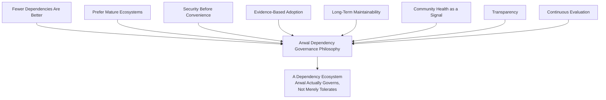

> **Callout — The One-Sentence Governance Philosophy**
> *"A dependency's approval is not a certificate that expires never — it is a standing trust relationship Arwal reviews as diligently as the day it began, for as long as the code that depends on it is still running."*

---

# Dependency Classification

This section governs the **organizational risk posture** applied to each dependency category. It does not redefine the technical classification (Runtime/Dev/Peer/Optional/Internal/Shared) already fully owned by `ai-docs/22-dependency-management-standards.md`'s Dependency Classification section — it defines the governance lens layered on top of that classification.

| Category | Governance Posture | Rationale |
|---|---|---|
| **Runtime Dependencies** | Highest governance rigor — full Evaluation Criteria, full Risk Classification tier assignment, recurring re-evaluation. | Executes inside every citizen-facing deployed artifact; a compromise here is a direct citizen-facing risk. |
| **Development Dependencies** | Moderate rigor — evaluated for supply-chain integrity (a compromised build-time tool can still poison a build, per Supply Chain Security below) but not for citizen-facing runtime behavior. | Never ships to production (`ai-docs/22-dependency-management-standards.md`'s Multi-Stage Builds discipline), but can compromise the CI/CD pipeline itself. |
| **Build Tools** | Moderate-to-high rigor — a compiler, bundler, or monorepo orchestrator sits on the critical path of every single deployed artifact. | A compromised build tool can inject malicious code into every artifact it produces, regardless of how clean the source code is. |
| **Testing Libraries** | Lower rigor, still governed — never ships to production, but a compromised test runner could still exfiltrate CI secrets. | Governed primarily for supply-chain integrity, not for runtime fitness. |
| **Infrastructure Dependencies** | Highest governance rigor — Terraform providers, container base images, and orchestration tooling, per `ai-docs/16-deployment-standards.md`. | A compromised infrastructure dependency can compromise the entire deployed environment, not merely one application. |
| **Cloud SDKs** | High rigor, evaluated against the AWS-first commitment in `ai-docs/16-deployment-standards.md` — an unofficial or community-maintained SDK is scrutinized far more heavily than an official vendor SDK. | Cloud SDKs typically hold broad, privileged credentials; a compromise here has an outsized blast radius. |
| **CLI Tools** | Moderate rigor — a developer-experience tool (a code generator, a local dev CLI) evaluated primarily for supply-chain integrity and for whether it is ever invoked in CI. | Lower runtime risk if used only interactively by engineers, but still a genuine supply-chain vector if it runs in any automated context. |
| **Internal Shared Packages** | Governed entirely under Internal Package Governance below — no External Dependency Selection Criteria apply, since Arwal owns the code. | An internal package carries no third-party trust risk, but carries a genuine cross-team blast-radius risk, governed distinctly. |
| **Experimental Dependencies** | Highest governance friction relative to benefit — permitted only inside a time-boxed `experiment/*` branch (per `ai-docs/27-branching-release-strategy.md`) and never merged into a shared branch without passing through the full Approval Process below. | A dependency evaluated under time pressure, for a narrow proof-of-concept, is precisely the condition under which governance discipline is most tempting to skip and most important to hold. |

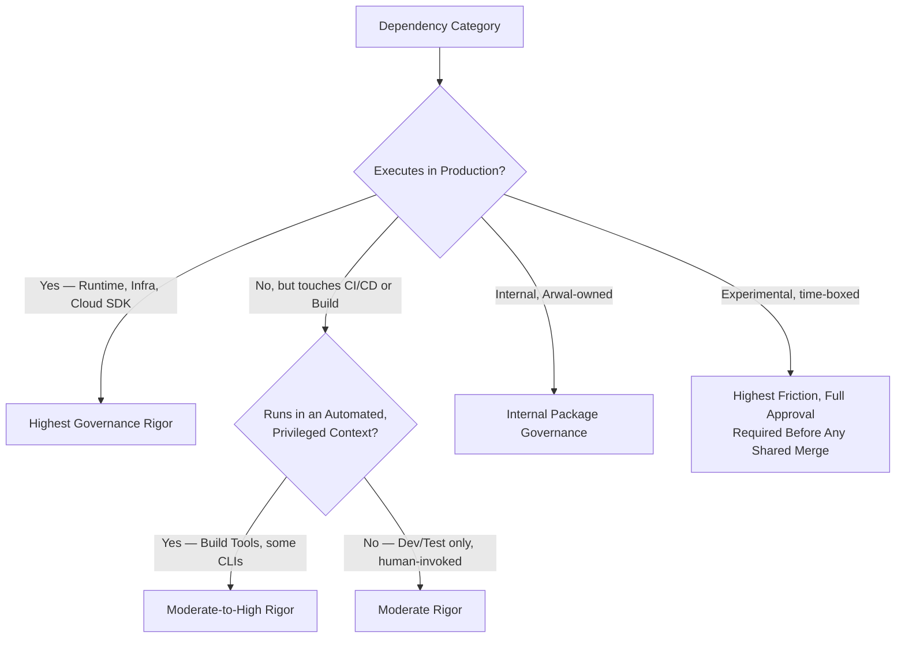

---

# Dependency Approval Process

This section defines the **governance decision** that precedes the tactical mechanics already fully specified in `ai-docs/22-dependency-management-standards.md`'s Dependency Approval Process. Where that document defines *how* a proposal moves through a PR, this section defines *what judgment* is applied at each governance checkpoint and *who* holds the authority to approve.

### Evaluation Criteria (Governance Gate)

Every proposed dependency is scored against the measurable criteria in Evaluation Criteria below — this is the governance-level gate that must pass before a proposal is even eligible for the scoring matrix already established in `ai-docs/22-dependency-management-standards.md`.

### Business Justification

Every proposal states, in one or two sentences, the specific, current business or engineering need the dependency addresses — never a speculative future need, per Fewer Dependencies Are Better above. A proposal whose justification is "it might be useful" rather than "it solves problem X, which blocks feature Y" is returned to the proposer before governance review begins.

### Architecture Review

Per the Approval Authority Table already established in `ai-docs/22-dependency-management-standards.md`, a dependency introducing a genuinely new category of capability triggers full Architecture Review under `ai-docs/07-development-workflow.md`'s Architecture Review Workflow and, where the What Requires an ADR bar in `ai-docs/25-architecture-decision-records.md` is met, a filed ADR. This document adds no new architecture-review mechanic; it affirms this gate is mandatory governance, not an optional courtesy step.

### Security Review

Every proposed Runtime, Infrastructure, or Cloud SDK dependency passes through a security-context review evaluating its Security History criterion (below) and its Supply Chain Security posture (below), per the elevated review discipline already established in `ai-docs/06-git-workflow.md` and `ai-docs/10-security-standards.md`.

### License Review

Every proposed dependency's license is checked against the License Governance section below — this document's license table is the canonical governance-level policy; `ai-docs/22-dependency-management-standards.md`'s Open Source Licensing section is the tactical implementation of that same policy at the point of adoption, and the two are held in lockstep, never diverging.

### Maintenance Review

Every proposed dependency's ongoing maintenance health — commit cadence, issue backlog, release history — is evaluated against the Evaluation Criteria below, distinct from a one-time technical fitness check, since a dependency that is technically excellent today but abandoned tomorrow is a governance failure regardless of its initial quality.

### Approval Workflow

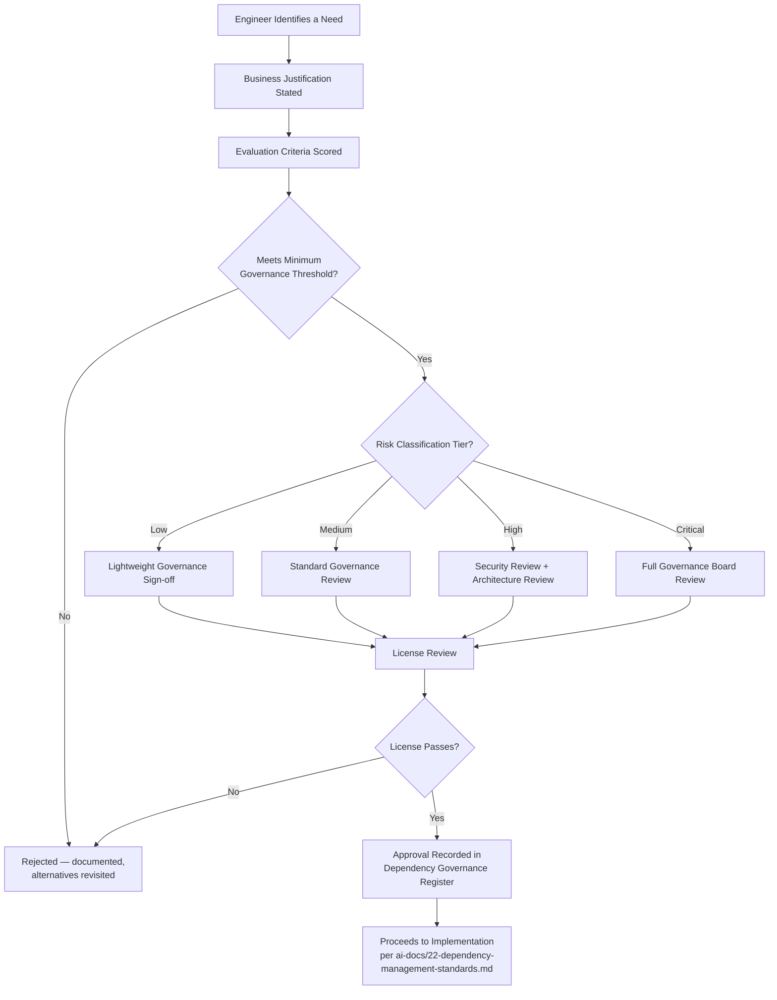

### Exception Handling

A dependency that fails one or more governance criteria but is judged to have no viable alternative is not automatically rejected — it may proceed via a **documented exception**, requiring: (1) an explicit statement of which criterion failed and why, (2) a named, accountable sponsor who accepts ongoing responsibility for the elevated risk, (3) a mandatory, calendar-scheduled re-evaluation date (never longer than 6 months out), and (4) sign-off from the Approval Authority appropriate to the dependency's Risk Classification tier (below). An exception is never granted silently or verbally — it is recorded in the Dependency Governance Register (see Metrics below) with the identical permanence already established for an ADR's Rejected status in `ai-docs/25-architecture-decision-records.md`.

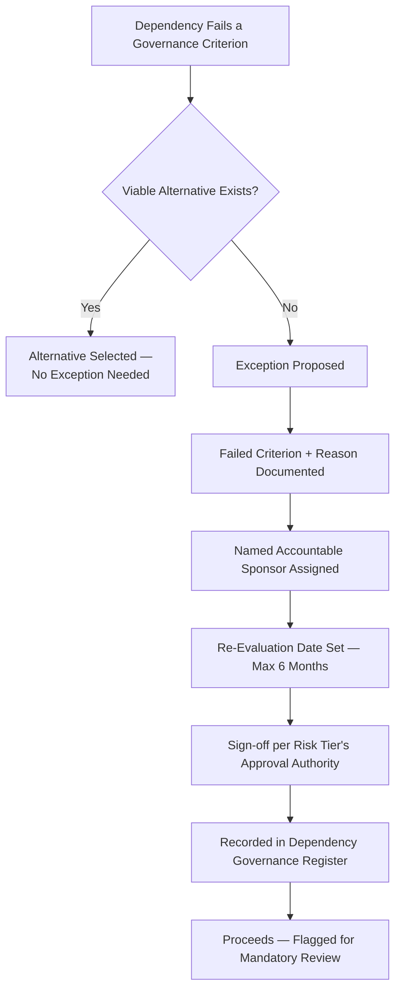

---

# Evaluation Criteria

Every proposed external dependency is scored against the following measurable criteria — this section is the governance-level definition of the criteria `ai-docs/22-dependency-management-standards.md`'s Dependency Selection Criteria scoring matrix already applies mechanically; this document defines the reasoning and threshold behind each criterion.

| Criterion | Measurable Signal | Governance Threshold |
|---|---|---|
| **Maintenance Activity** | Commits and releases within the trailing 6 months; median issue-response time. | No meaningful commit activity in 12+ months is an automatic Evaluation Criteria failure, absent an explicit, documented reason (e.g., the package is feature-complete and stable by design). |
| **Release Frequency** | Regularity and predictability of tagged releases against SemVer. | An erratic or entirely absent release history (only `main`-branch installs, no tags) fails this criterion outright. |
| **Security History** | Count and severity of past CVEs; median time-to-patch for a disclosed vulnerability; presence of a published security policy/disclosure process. | A pattern of slow (>90 day) patch turnaround for Critical/High findings is a disqualifying signal absent a documented exception. |
| **Community Adoption** | Download volume and dependent-package count, weighted as a secondary, not primary, signal per `ai-docs/22-dependency-management-standards.md`. | Used only to break ties between otherwise-comparable candidates — never a primary approval driver. |
| **Documentation Quality** | Completeness of README, API reference, and migration guides. | Documentation insufficient to onboard a new engineer without external searching is a governance concern, scored but not automatically disqualifying. |
| **Performance** | Measured runtime characteristics against Arwal's actual target conditions, per `ai-docs/11-performance-standards.md`. | A package failing Arwal's Performance Budgets for its category is disqualified regardless of every other criterion's score. |
| **Compatibility** | Fit with Arwal's approved technology stack (`ai-docs/09-tech-stack.md`) — TypeScript-first, Node.js LTS-compatible, monorepo-workspace-friendly. | Incompatibility with an already-Approved foundational technology is disqualifying. |
| **API Stability** | Frequency and severity of past breaking changes; adherence to a documented deprecation policy. | A package with frequent, poorly-communicated breaking changes is scored down heavily, since it imposes a recurring migration tax. |
| **License Compatibility** | Pass/fail gate against License Governance below. | A failing license is an absolute disqualifier — see License Governance. |
| **Long-Term Viability** | Corporate/community backing, funding model, single-maintainer bus-factor risk, per Prefer Mature Ecosystems above. | A single-maintainer, unfunded, no-succession-plan package is scored down and, for a Critical-tier dependency, requires an explicit exception. |

### Scoring and Threshold

Each criterion is scored 0–5, weighted identically to the scoring matrix already established in `ai-docs/22-dependency-management-standards.md`'s Dependency Selection Criteria — this document does not duplicate that weighting table; it affirms that a weighted average below the 3.5/5.0 threshold defined there requires the identical Architecture-Review-level justification already required there, now additionally logged in the Dependency Governance Register.

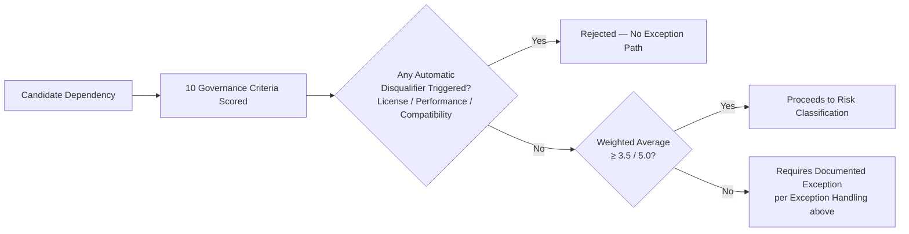

---

# Supply Chain Security

This section governs Arwal's **trust model** for the software supply chain — the organizational posture that the technical controls already fully established in `ai-docs/10-security-standards.md` (Dependency Security, Supply-Chain Protection) and `ai-docs/22-dependency-management-standards.md` (Package Integrity, Dependency Confusion, Typosquatting, Malicious Packages, Signature Verification, Trusted Publishers) exist to enforce. This document does not redefine a single technical control from either source.

### The Trust Model

Arwal extends trust to a dependency along three independent axes, none of which alone is sufficient: **provenance** (can the package's origin be cryptographically or organizationally verified?), **maintenance** (is there an accountable party actively responsible for it today?), and **scrutiny** (has it been reviewed — by Arwal, by its own community, or by independent security research — closely enough to have surfaced a hidden compromise?). A dependency strong on one axis and weak on the others (e.g., high download volume but a single, unresponsive maintainer) is treated as only partially trusted, and governed accordingly per its Risk Classification tier.

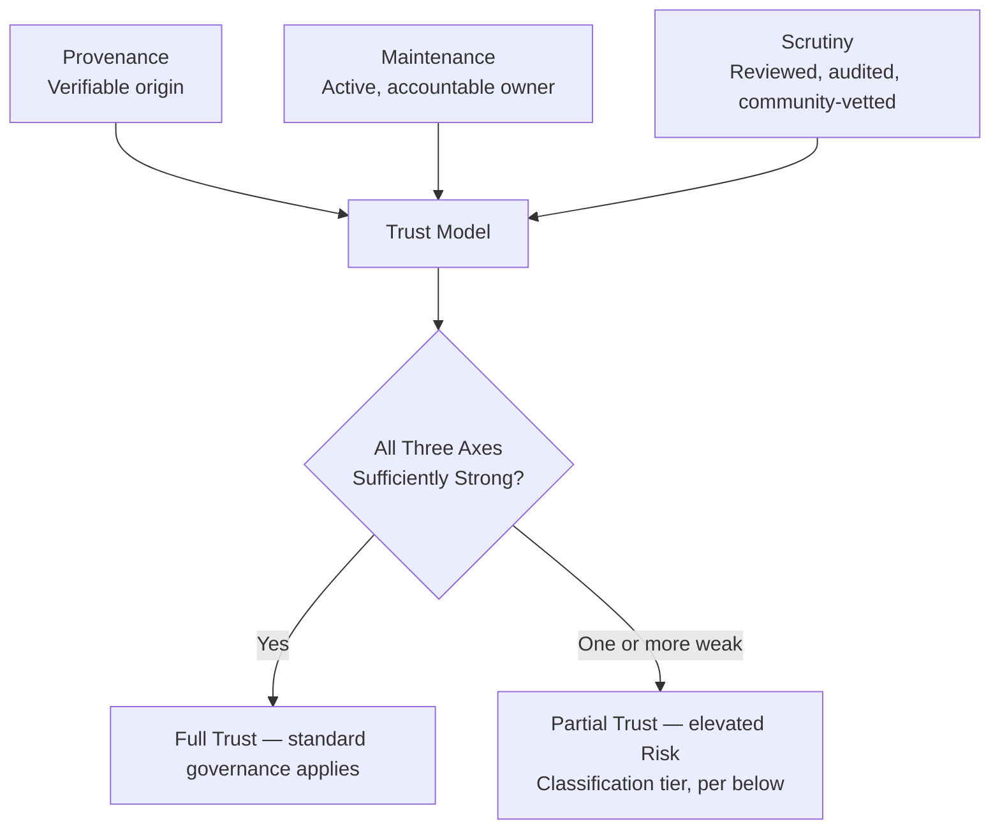

### Package Integrity and Checksums

Governed entirely by the Package Integrity standard already established in `ai-docs/22-dependency-management-standards.md` — this document affirms that integrity verification is a **non-negotiable governance precondition**, not an optional CI convenience: no dependency is trusted, at any Risk Classification tier, without lockfile-recorded checksum verification succeeding on every install.

### Trusted Registries

Governed entirely by the Approved Dependency Sources standard already established in `ai-docs/22-dependency-management-standards.md`. This document's governance addition: any proposal to add a new trusted source (a new private registry mirror, a new artifact repository) is itself a Strategic or Architectural classification ADR per `ai-docs/25-architecture-decision-records.md`, never a routine configuration change.

### Dependency Confusion and Typosquatting

Governed entirely by the technical controls already established in `ai-docs/22-dependency-management-standards.md`'s Supply Chain Security section (scoped `@arwal/*` namespace, automated similarity checking). This document's governance addition: a flagged typosquatting-similarity finding during Approval is never dismissed by the proposing engineer alone — it requires explicit Security Reviewer sign-off before the proposal can proceed, regardless of how confident the proposer is that the flag is a false positive.

### Malicious Packages and Compromised Maintainers

Governed by the automated scanning already established in `ai-docs/10-security-standards.md` and `ai-docs/17-cicd-standards.md`'s DevSecOps section. This document's governance addition: a maintainer-account compromise disclosed for an already-adopted dependency (even where Arwal's specific installed version was not affected) triggers an immediate, out-of-cycle re-evaluation of that dependency's Risk Classification tier and Evaluation Criteria score — never deferred to the dependency's next scheduled periodic review.

### SBOM (Software Bill of Materials)

Governed by the SBOM Generation standard already established in `ai-docs/10-security-standards.md` and `ai-docs/17-cicd-standards.md`. This document's governance addition: the SBOM is the canonical, queryable source of truth the Dependency Governance Register (Metrics below) is built from — a governance claim about "what depends on what" is never made from memory or an informal audit; it is always verified against the current SBOM.

### Provenance

Governed by the Signature Verification standard already established in `ai-docs/22-dependency-management-standards.md` (npm provenance attestations). This document's governance addition: for a Critical-tier dependency (below), verifiable provenance is elevated from a scored preference to a **required** criterion — a Critical-tier candidate lacking any provenance mechanism requires an explicit, Governance-Board-level exception per Exception Handling above.

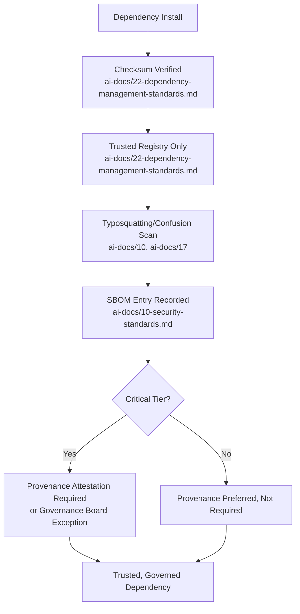

---

# Internal Package Governance

This section governs the **organizational discipline** applied to `packages/*` — code Arwal's own engineers author, distinct from the per-package dependency lists already fully governed in `ai-docs/22-dependency-management-standards.md`'s Shared Internal Packages table.

### Ownership

Every internal package has exactly one named owning team, recorded per the Folder Ownership Rules already established in `ai-docs/04-folder-guidelines.md` and restated for the dependency-specific case in `ai-docs/22-dependency-management-standards.md`. Governance's addition here: an internal package's owning team is accountable not only for its code quality (per `ai-docs/05-coding-standards.md`) but for its **consumer impact** — a breaking change to `packages/ui` is a governance event affecting every consuming app, held to the identical rigor as a third-party dependency's breaking MAJOR release.

### Versioning

Every internal package follows the identical Semantic Versioning discipline already established in `ai-docs/22-dependency-management-standards.md`'s Semantic Versioning section — internal packages are never exempted from SemVer discipline merely because "we control both sides," since Arwal's own future team-scaling (hundreds of engineers, per this document's Purpose) will eventually mean an internal package's consumers are no longer co-located with its authors in the way a small early team assumes.

### Deprecation

An internal package or a specific exported symbol within one follows the identical Deprecated Dependencies lifecycle already established in `ai-docs/22-dependency-management-standards.md` — flagged, given a migration plan, assigned a sunset date, and removed only once every internal consumer (verified via the monorepo's own dependency graph, per Automation below) has migrated away.

### Documentation

Every internal package's README satisfies the Package-level README Standards already established in `ai-docs/24-documentation-standards.md` — this document adds no new documentation requirement; it affirms that an internal package's documentation currency is itself a governance gate, reviewed at the same cadence as its Ownership Matrix entry in `ai-docs/24-documentation-standards.md`.

### Testing

Every internal package is held to the identical Testing Standards coverage floor already established in `ai-docs/15-testing-standards.md`'s Code Coverage table for `packages/*` (90% line / 85% branch) — an internal package consumed by multiple apps carries a wider blast radius than most application code, and its test coverage is governed accordingly, never relaxed because "it's just internal."

### Publishing

Every internal package is published to Arwal's own private `@arwal/*` npm scope exclusively through the CI/CD pipeline's own service identity, per the Trusted Publishers standard already established in `ai-docs/22-dependency-management-standards.md` — never via an individual engineer's personal credential.

### Breaking Changes and Compatibility

A breaking change to an internal package's public surface (`index.ts`, per `ai-docs/04-folder-guidelines.md`) requires the identical owning-team-plus-standard-review discipline already established in `ai-docs/06-git-workflow.md`'s Folder Ownership Rules, and — where the change is precedent-setting or affects more than one consuming app — the identical Architecture Review trigger already established in `ai-docs/25-architecture-decision-records.md`'s Major Refactoring row.

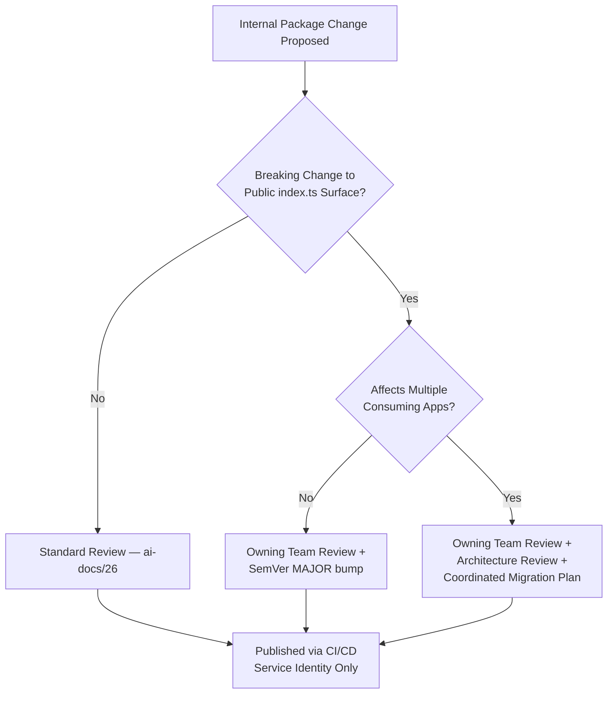

---

# Versioning Policy

This section governs the **organizational policy** behind version-range decisions; the exact SemVer mechanics, range notations, and lockfile behavior are owned entirely by `ai-docs/22-dependency-management-standards.md`'s Versioning Policy, Semantic Versioning, and Lockfile Policy sections.

### Semantic Versioning as a Governance Expectation

Every dependency Arwal adopts is expected, as a scored Evaluation Criterion (API Stability, above), to follow SemVer — a package with an undocumented or inconsistent versioning scheme is treated as a governance risk, not merely a technical inconvenience, since Arwal's entire automated-update trust model (`ai-docs/22-dependency-management-standards.md`'s caret-range default) depends on the ecosystem's SemVer promise holding.

### Pinning Strategy

Governance mandates exact-version pinning for any dependency in the Critical Risk Classification tier (below) or any dependency `ai-docs/22-dependency-management-standards.md`'s Versioning Policy table already designates for exact pinning (core framework versions) — this document adds the governance rule that a Critical-tier dependency's pin is never silently widened to a caret range without an explicit Risk Classification re-evaluation.

### Upgrade Policy

Every dependency upgrade follows the Update Categories table already established in `ai-docs/22-dependency-management-standards.md` and `ai-docs/07-development-workflow.md`'s Dependency Update Workflow. This document's governance addition: an upgrade to a Critical-tier dependency, regardless of its SemVer category (even a Patch), requires the Critical tier's full Approval Chain (Risk Classification below) before merge — Critical-tier status overrides the routine Patch fast-track.

### Major Version Adoption

A MAJOR version upgrade of any already-approved dependency is itself treated as a new Approval Process cycle, per the Replacing an Already-Approved Dependency row already established in `ai-docs/22-dependency-management-standards.md`'s Approval Authority table — a MAJOR upgrade is never assumed pre-approved merely because the dependency's MINOR/PATCH history was.

### Emergency Upgrades

An emergency, Critical-CVSS-severity upgrade follows the identical Emergency Updates path already fully established in `ai-docs/22-dependency-management-standards.md`'s Vulnerability Management section (the Hotfix Workflow, per `ai-docs/06-git-workflow.md` and `ai-docs/27-branching-release-strategy.md`) — this document's governance addition: every emergency upgrade is retroactively logged in the Dependency Governance Register within one business day, so an urgency-driven bypass of the normal Approval Process is never left unrecorded.

### Downgrade Strategy

A downgrade — reverting a dependency to a prior version after discovering a regression — is treated with the identical rigor as an upgrade: it requires the same category of review (a downgrade past a MAJOR boundary requires the same Approval Process as adopting that older MAJOR version fresh) and is never performed as a silent, undocumented `package.json` edit. A downgrade's reason is always recorded — either in the reverting PR's description or, where the regression was significant, in a dedicated postmortem per `ai-docs/07-development-workflow.md`.

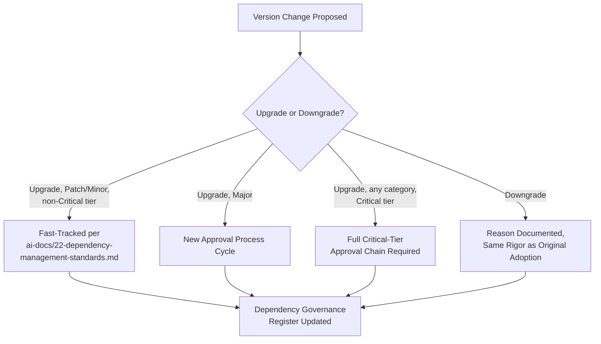

---

# Dependency Lifecycle

Every dependency, from the moment a need is identified to the moment it is fully removed, passes through eight governed stages.

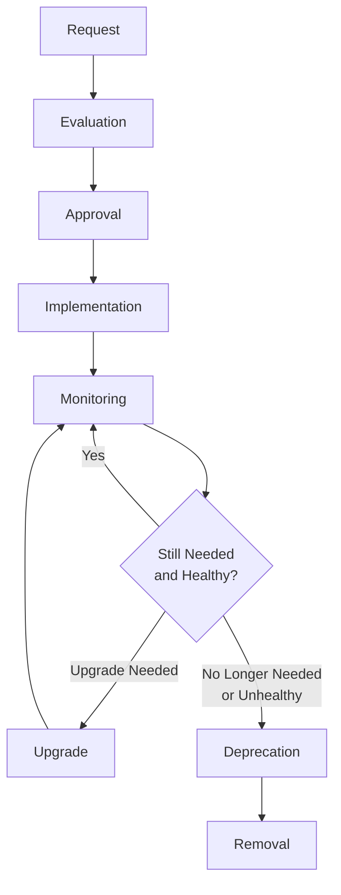

### Request

An engineer identifies a genuine, current need per Business Justification above — the request is recorded (as a proposal PR, per `ai-docs/22-dependency-management-standards.md`'s Dependency Approval Process step 1) before any code is written against the candidate dependency.

### Evaluation

The candidate is scored against Evaluation Criteria above and classified per Risk Classification below — this stage produces the evidence the Approval stage acts on.

### Approval

The Approval Workflow defined above executes; the outcome (Approved, Approved-with-Exception, or Rejected) is recorded in the Dependency Governance Register.

### Implementation

The approved dependency is added via the standard PR mechanics already fully established in `ai-docs/22-dependency-management-standards.md` (package.json + lockfile update, standard CI/CD gates) and reviewed per `ai-docs/26-code-review-standards.md`.

### Monitoring

Once live, a dependency is continuously monitored per Automation below — vulnerability scanning, license-drift detection, and maintenance-health tracking run for the entire duration of its use, never only at the moment of adoption.

### Upgrade

A dependency is upgraded per Versioning Policy above, triggered either routinely (a scheduled Patch/Minor batch) or reactively (a disclosed vulnerability, per `ai-docs/22-dependency-management-standards.md`'s Vulnerability Management).

### Deprecation

A dependency flagged as no longer meeting Arwal's governance bar — abandoned, superseded by a better alternative, or no longer needed — enters the Dependency Retirement process defined below.

### Removal

The dependency is fully removed, verified via the Removal Process already established in `ai-docs/22-dependency-management-standards.md`, and the Dependency Governance Register is updated to reflect its retired status — never simply deleted from history, mirroring the Immutable Numbers principle already established for ADRs in `ai-docs/25-architecture-decision-records.md`.

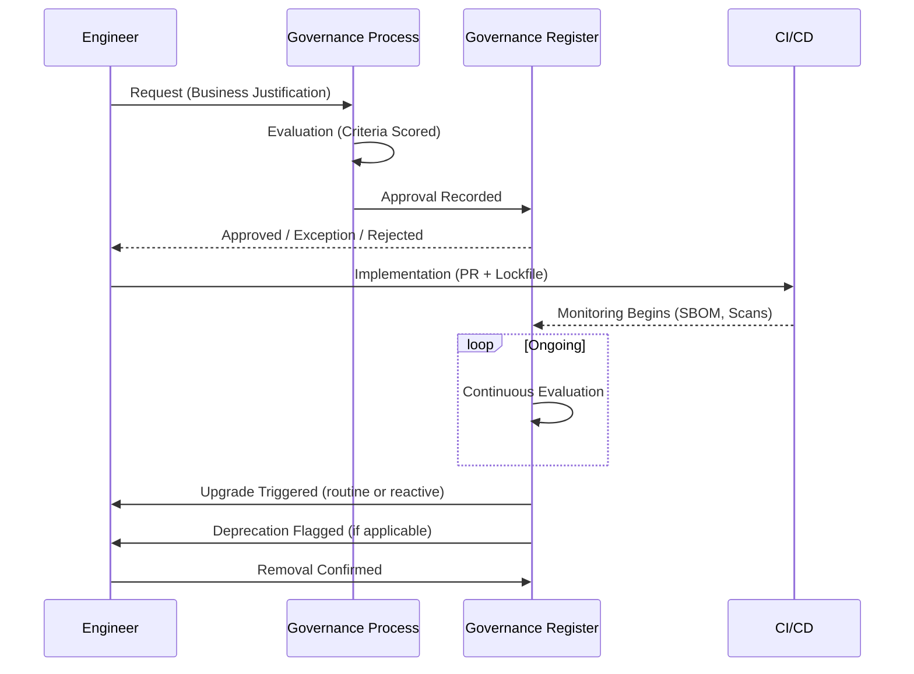

---

# Risk Classification

Every dependency is assigned exactly one Risk Classification tier at Approval, and re-assigned whenever a material change occurs (a new CVE, a maintainer change, an expanded usage scope). This tier is the single governing input to how much rigor a dependency receives at every subsequent lifecycle stage.

| Tier | Definition | Review Requirements | Security Requirements | Approval Chain | Monitoring | Update Priority |
|---|---|---|---|---|---|---|
| **Low** | A narrowly-scoped Dev/Test dependency with no production execution path and no privileged CI access. | Standard PR review only. | Automated scanning only (`ai-docs/17-cicd-standards.md`'s DevSecOps stages). | One qualified Reviewer. | Passive — included in routine automated scans. | Batched with routine dependency updates. |
| **Medium** | A Runtime dependency in a non-critical module, or a Build Tool with CI access but no production runtime footprint. | Standard PR review + Evaluation Criteria scoring. | Automated scanning + manual Security History review at Approval. | Reviewer + Tech Lead. | Active — tracked in the Dependency Governance Register with a defined re-evaluation cadence (annually). | Scheduled within the current or next sprint for Medium/High CVSS findings. |
| **High** | A Runtime dependency in a citizen-facing critical path, or any dependency touching `payments`/`identity`/`civic-services`, or an Infrastructure/Cloud SDK dependency. | Standard review + Security Review + Domain Expert review, per `ai-docs/26-code-review-standards.md`'s Review Levels. | Full Supply Chain Security posture required (provenance preferred, integrity verification mandatory); elevated Security Reviewer sign-off. | Tech Lead + Security Reviewer. | Active — quarterly re-evaluation; immediate re-evaluation on any disclosed CVE regardless of severity. | Fast-tracked per the CVSS-severity table already established in `ai-docs/22-dependency-management-standards.md`, with no batching delay. |
| **Critical** | A dependency on the direct authentication, authorization, payment-processing, or cryptographic path — or any dependency whose compromise would constitute a platform-wide incident. | Full Governance Board Review (Security Reviewer + Architecture Reviewer + Tech Lead, jointly) — mirroring the Regulatory classification's approval rigor already established in `ai-docs/25-architecture-decision-records.md`. | Provenance attestation required or an explicit Governance Board exception; exact-version pinning mandatory; SBOM cross-referenced on every build. | Governance Board (Security Reviewer + Architecture Reviewer + Tech Lead + Engineering Manager). | Continuous — monitored identically to a Critical-severity production service per `ai-docs/18-observability-standards.md`'s alerting philosophy; monthly re-evaluation. | Same-day response for any Critical-severity CVSS finding, per the Emergency Updates path in `ai-docs/22-dependency-management-standards.md`. |

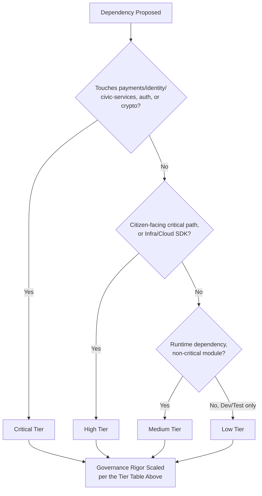

> **Callout — Risk Tier Is Never Static**
> A dependency's Risk Classification is re-evaluated the moment its usage context changes — a Low-tier dev tool that is later wired into a CI pipeline step handling production secrets is immediately re-classified, never left at its original, now-inaccurate tier merely because "that's what it was approved as."

---

# License Governance

This section is the canonical, governance-authoritative license policy. `ai-docs/22-dependency-management-standards.md`'s Open Source Licensing section is the tactical, PR-level implementation of this exact same policy — the two are held in permanent lockstep; a change to one requires an identical change to the other, reviewed together.

### Allowed Licenses

| License | Category | Governance Position |
|---|---|---|
| MIT | Permissive | Approved without restriction. |
| Apache License 2.0 | Permissive, explicit patent grant | Approved without restriction; the patent grant is a genuine additional protection Arwal values. |
| BSD (2-Clause / 3-Clause) | Permissive | Approved without restriction. |
| ISC | Permissive | Approved without restriction. |

### Restricted Licenses

| License | Category | Governance Position |
|---|---|---|
| LGPL (v2.1/v3) | Weak copyleft | Case-by-case, mandatory Legal review confirming the specific linking mechanism qualifies for the proprietary-linking exception. |
| GPL (v2/v3), as a build-only tool never linked into a shipped artifact | Strong copyleft | Case-by-case, mandatory Legal review; permitted only where genuinely never compiled/linked into deployed code. |

### Prohibited Licenses

| License | Category | Governance Position |
|---|---|---|
| GPL (v2/v3), linked into any shipped artifact | Strong copyleft | Prohibited outright — would obligate Arwal to release proprietary application code under GPL terms, a direct conflict with `ai-docs/01-product-goals.md`'s commercial sustainability commitments. |
| AGPL (v3) | Strong copyleft, network-use clause | Effectively prohibited for any server-side runtime dependency; no exception without Legal sign-off and board-level risk acceptance, per the identical standard already established in `ai-docs/22-dependency-management-standards.md`. |
| Any unclear, ambiguous, dual-licensed, or missing-`LICENSE`-file package | Unknown | Treated as Prohibited until Legal review clarifies the actual terms — an unclear license is never assumed safe by default, per Secure by Default. |

### License Compatibility

Every dependency's license is additionally checked for compatibility with every other license already present in Arwal's dependency tree — a permissive license that becomes incompatible only in combination with another (a rare but real scenario in complex, multi-licensed transitive trees) is caught by the automated License Scanning already established in Automation below, never assumed away because each individual license, viewed in isolation, passed.

### Commercial Considerations

Arwal's governance evaluates a dependency's license not only for legal compliance but for **commercial risk exposure** — a permissively-licensed package whose maintainer has signaled an intent to relicense toward a more restrictive commercial model in a future version (a documented, real pattern in the open-source ecosystem) is flagged during Long-Term Viability scoring (Evaluation Criteria above), even while its current license remains fully Approved.

### Attribution Requirements

Every dependency requiring attribution (most permissive licenses require preserving a copyright notice) has that attribution captured automatically in the generated SBOM (per `ai-docs/10-security-standards.md`) and, where a citizen-facing or partner-facing distribution requires a visible attribution notice (an open-source acknowledgments page), that notice is generated from the SBOM, never hand-maintained, per the identical Automation Where Possible principle already established in `ai-docs/24-documentation-standards.md`.

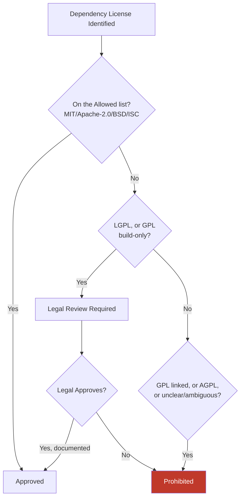

---

# Automation

Every mechanical governance check runs automatically, never left to a human's memory — this document does not redefine a single pipeline stage already fully established in `ai-docs/17-cicd-standards.md`'s DevSecOps section; it affirms which automated capabilities exist specifically to make this document's governance policy continuously enforced.

| Automated Capability | Purpose | Cadence |
|---|---|---|
| **Vulnerability scanning** | Continuous CVE detection across the full transitive tree, per `ai-docs/10-security-standards.md` and `ai-docs/17-cicd-standards.md`. | Every push/PR, plus continuous off-pipeline monitoring (Dependabot-class tooling). |
| **License scanning** | Automated verification of every dependency's license against the Allowed/Restricted/Prohibited tables above. | Every push/PR touching `package.json`/lockfiles. |
| **SBOM generation** | Produces the canonical, queryable dependency inventory every governance claim is verified against. | Every build, per `ai-docs/10-security-standards.md`. |
| **Outdated dependency detection** | Flags a dependency whose latest available version has diverged meaningfully from the installed version. | Weekly scheduled scan. |
| **Automated update proposals** | Generates a PR for a routine Patch/Minor update, per the Update Categories table in `ai-docs/22-dependency-management-standards.md`. | Continuous, as new versions are published. |
| **Dependency graph monitoring** | Tracks the full transitive dependency graph's shape over time — count, depth, and duplication. | Weekly, feeding directly into Metrics below. |
| **Integrity verification** | Confirms every installed package matches its lockfile-recorded checksum. | Every install, in every environment. |
| **Maintenance-health tracking** | Automated polling of a dependency's upstream commit/release activity, feeding the Evaluation Criteria's Maintenance Activity score. | Monthly, or immediately on a flagged governance re-evaluation trigger. |

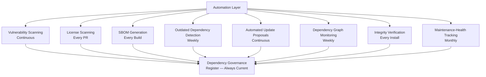

---

# Metrics

Per the Actionable Metrics principle already established in `ai-docs/18-observability-standards.md`, every metric below ties to a real question a Governance Board or Engineering Manager will actually ask — never collected purely because it is measurable.

| Metric | Definition | What a Regression Signals |
|---|---|---|
| **Average dependency age** | Mean time since a dependency's currently-installed version was released, across the full tree. | A rising average signals the update cadence (`ai-docs/22-dependency-management-standards.md`'s Dependency Update Workflow) is falling behind, accumulating both security and compatibility risk. |
| **Upgrade frequency** | Count of dependency version bumps merged per unit time. | A declining rate signals process friction in the Approval or Review pipeline, not merely fewer available updates. |
| **Critical vulnerabilities** | Count of currently-open Critical/High CVSS findings across the tree. | Any sustained non-zero count beyond its CVSS-mandated response window (`ai-docs/22-dependency-management-standards.md`) is an active governance failure. |
| **Mean remediation time** | Average time from vulnerability disclosure to patched, deployed fix. | A rising trend signals the Emergency/Fast-Track update paths are not functioning as designed. |
| **Unused dependencies** | Count of declared dependencies with no corresponding import anywhere in the codebase, per the Package Boundaries verification already established in `ai-docs/22-dependency-management-standards.md`. | A non-zero, growing count signals Fewer Dependencies Are Better is not being actively enforced at removal time. |
| **Dependency count growth** | Total direct + transitive dependency count, tracked over time relative to codebase/feature growth. | Growth meaningfully outpacing feature growth signals dependency sprawl, per the Dependency Sprawl concern in `ai-docs/22-dependency-management-standards.md`'s Purpose section. |
| **Approval turnaround** | Time from Request to Approval/Rejection, per Risk Classification tier. | A widening turnaround, especially at the Low/Medium tiers, signals the governance process itself has become a velocity bottleneck disproportionate to the risk it manages. |
| **License compliance** | Percentage of the dependency tree passing automated license scanning without a flagged exception. | Any finding below 100% (excluding an explicitly Legal-approved, documented exception) is an immediate governance defect. |

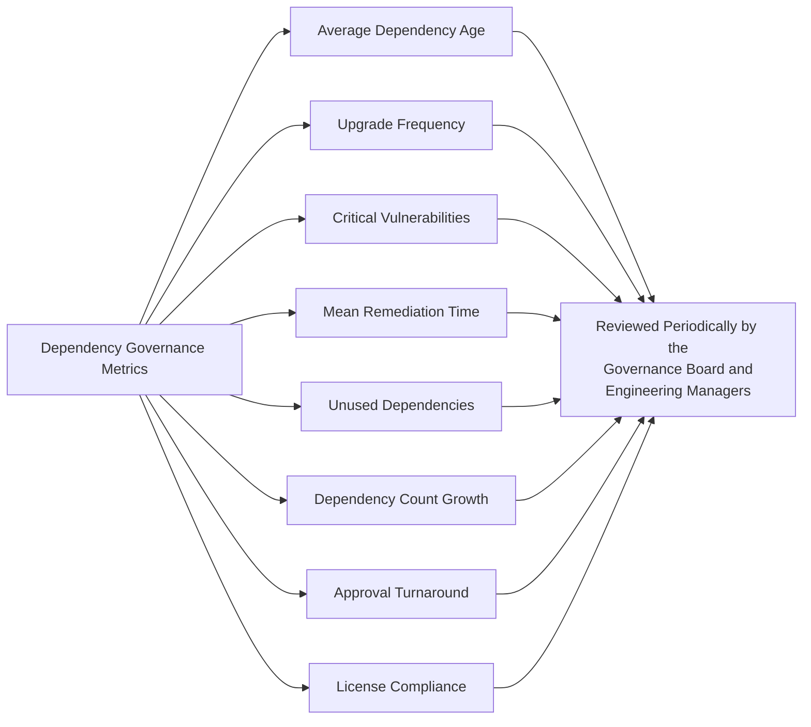

---

# AI-Assisted Governance

Consistent with the AI-Assisted Development Guidelines already established in `ai-docs/07-development-workflow.md`, the AI-Assisted Development Definition of Done in `ai-docs/08-definition-of-done.md`, and the identical AI-assistance principles already established across `ai-docs/24-documentation-standards.md`, `ai-docs/25-architecture-decision-records.md`, `ai-docs/26-code-review-standards.md`, and `ai-docs/27-branching-release-strategy.md`: **AI accelerates evaluation, never accountability.**

### AI Recommendations

An AI tool may be used to surface candidate dependencies, summarize a package's changelog, or flag a potentially concerning maintenance pattern (a sudden drop in commit activity, a maintainer's public statement about stepping back) — every such recommendation is treated as a lead for a human governance reviewer to investigate, never as a pre-approved finding.

### AI-Assisted Evaluation

An AI tool may assist in scoring a candidate against the Evaluation Criteria above by summarizing publicly available signals (release history, issue-response patterns) — every AI-summarized signal is independently spot-checked by the proposing engineer or reviewer against the actual source (the package's real repository, its real release history) before being relied upon in the Approval Workflow, per the identical Hallucination Prevention discipline already established in `ai-docs/15-testing-standards.md` and `ai-docs/24-documentation-standards.md`.

### AI-Generated Upgrade Plans

An AI tool may draft a migration plan for a MAJOR version upgrade (summarizing breaking changes from a changelog, suggesting an order of operations) — this draft is treated as a starting point the responsible engineer verifies line-by-line against the actual breaking-change documentation before it governs a real upgrade, per the identical Fact Verification discipline already established in `ai-docs/26-code-review-standards.md` and `ai-docs/27-branching-release-strategy.md`.

### Human Approval

No dependency — at any Risk Classification tier — is approved, upgraded, or exempted on the basis of an AI tool's assessment alone. Every Approval Chain named in Risk Classification above names accountable humans, and an AI tool's favorable evaluation is never itself sufficient sign-off, mirroring the identical Human Approval standard already established in `ai-docs/27-branching-release-strategy.md`'s AI-Assisted Release Governance section.

### Verification

Every quantitative claim an AI tool makes about a dependency — its download count, its last-commit date, its open CVE count — is independently verified against the actual, current registry/repository data before it is used to justify an Approval or Exception decision, since a governance decision built on a stale or hallucinated statistic is a governance decision built on nothing.

### Ownership

The engineer or reviewer who ultimately approves a dependency remains its full, accountable Owner in the Dependency Governance Register, regardless of how much AI assistance contributed to the evaluation — identical to the Traceability principle already established in `ai-docs/06-git-workflow.md` for AI-assisted commits and extended consistently across every governance document in this handbook.

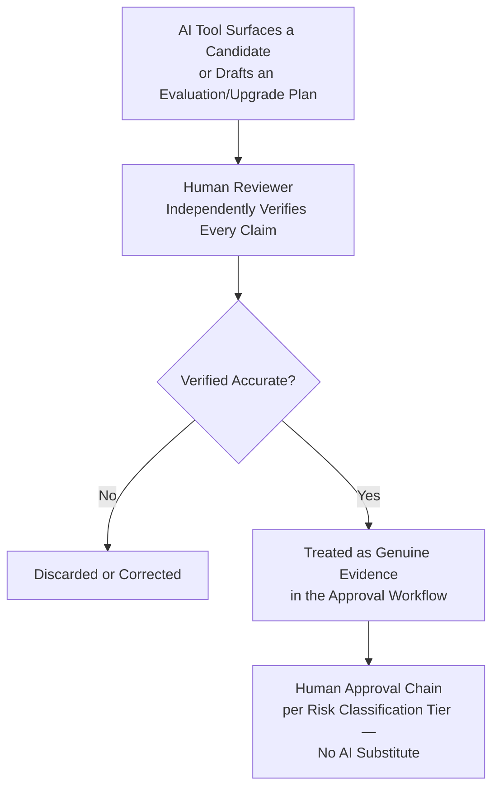

---

# Dependency Retirement

### Deprecation Process

A dependency is flagged for retirement through any of: an upstream `npm deprecate` notice, a sustained Maintenance Activity failure (per Evaluation Criteria above), a superior alternative identified during a periodic re-evaluation, or a Risk Classification tier that can no longer be justified given the dependency's continued decline. Flagging is recorded in the Dependency Governance Register the moment it occurs, per Transparency above — never left informal.

### Migration Planning

Every retirement carries an explicit migration plan, scaled to the dependency's Risk Classification tier: a Low-tier dev dependency's plan may be a single line ("swap for X in the next chore PR"); a Critical-tier dependency's plan follows the full Migration Strategy discipline already established in `ai-docs/09-tech-stack.md`'s Deprecation Policy and `ai-docs/25-architecture-decision-records.md`'s Migration Strategy ADR section.

### Replacement Evaluation

Where a retirement requires a replacement dependency, that replacement passes through the identical, full Dependency Approval Process defined above — a replacement is never assumed pre-approved merely because it serves the same purpose as the dependency it replaces.

### Communication

A retirement affecting more than one team (a widely-used internal package, or an external dependency embedded across several modules) is communicated to every affected owning team before the sunset date is finalized, per the identical Breaking Documentation Changes communication discipline already established in `ai-docs/24-documentation-standards.md`.

### Removal Workflow

Removal follows the identical Removal Process already established in `ai-docs/22-dependency-management-standards.md` — verified via the dependency graph (no remaining import references), executed as a single, reviewed PR updating `package.json` and the lockfile together.

### Historical Traceability

A retired dependency is never simply deleted from Arwal's institutional memory — its entry in the Dependency Governance Register is marked Retired (never removed), recording its adoption date, its retirement date, the reason for retirement, and its replacement (if any), mirroring the identical Archive, Never Delete discipline already established for ADRs in `ai-docs/25-architecture-decision-records.md`.

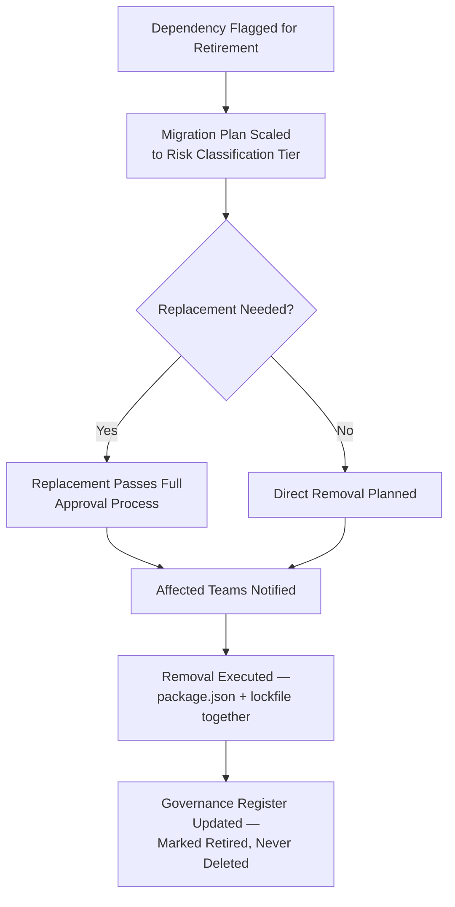

---

# Anti-Patterns

The following patterns are explicitly rejected, regardless of how convenient they appear under deadline pressure — each is a specific, previously observed governance failure mode, called out here so Arwal does not have to relearn the lesson expensively at Phase 250.

| Anti-Pattern | Description | Why It's Rejected |
|---|---|---|
| **Adding Unnecessary Libraries** | Installing a package to solve a problem three lines of first-party code would have solved. | Violates Fewer Dependencies Are Better; every unnecessary dependency is unpriced, permanent maintenance and attack-surface risk. |
| **Ignoring Updates** | A dependency left unpatched for months because "it's working fine." | Violates Continuous Evaluation above; a dependency's security posture degrades silently the moment a disclosed CVE goes unpatched. |
| **Unmaintained Packages Left in Place** | A package flagged as abandoned during a periodic review, with no retirement action taken. | Violates the Deprecation Process above; an identified risk that is never acted on is a governance failure identical in effect to never having identified it. |
| **Copying Random GitHub Code** | Manually pasting source from an unreviewed repository instead of a proper, versioned, governed dependency. | Violates Approved Dependency Sources (`ai-docs/22-dependency-management-standards.md`) and bypasses every governance control in this document entirely. |
| **Ignoring Licenses** | Adding a dependency without checking its license, discovering an incompatibility only after it is deeply embedded. | Violates License Governance above; a late-discovered license violation is dramatically more expensive to remediate than a pre-adoption check. |
| **Unverified Packages** | Installing a package with no integrity verification, from an unverified source, "just this once, to test something." | Violates the Trust Model above; a single unverified install is a single successful supply-chain attack vector. |
| **Multiple Libraries Solving the Same Problem** | Two teams independently adopting two different date-formatting or HTTP-client libraries. | Violates Duplicate Dependency Prevention (`ai-docs/22-dependency-management-standards.md`) at the governance level; doubles the maintenance and security-review burden for zero additional capability. |
| **Over-Engineering the Approval Process** | Applying Critical-tier governance rigor to a Low-tier dev dependency, grinding routine work to a halt. | Violates Proportional Rigor already established throughout this handbook (`ai-docs/02-engineering-principles.md`, `ai-docs/07-development-workflow.md`); governance that is uniformly heavy is governance nobody follows for the cases that actually need it. |

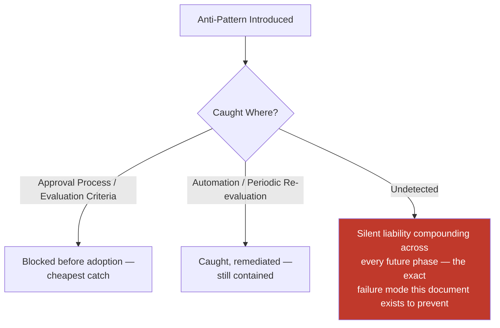

---

# Engineering Review Checklist

Every dependency proposal, upgrade, exception, or retirement is checked against the following before it is considered governance-compliant:

- [ ] **Business justification stated** — A specific, current need is named, never a speculative future one.
- [ ] **Correctly classified by Risk Tier** — Low/Medium/High/Critical, per Risk Classification above, matching the dependency's actual production exposure.
- [ ] **Evaluation Criteria scored** — All ten criteria assessed, with any automatic disqualifier (license, performance, compatibility) checked first.
- [ ] **Approval Chain matches Risk Tier** — The correct reviewers/board have signed off per the Risk Classification table.
- [ ] **License governance-compliant** — On the Allowed list, or has passed mandatory Legal review, per License Governance above.
- [ ] **Supply chain trust model satisfied** — Provenance, integrity, and registry-trust checks pass per the dependency's tier.
- [ ] **Exception properly recorded, if applicable** — Failed criterion documented, sponsor named, re-evaluation date set, per Exception Handling above.
- [ ] **Governance Register updated** — The Approval, Upgrade, Exception, or Retirement is logged, never left informal.
- [ ] **Internal package governance applied, if applicable** — Ownership, versioning, deprecation, testing, and publishing per Internal Package Governance above.
- [ ] **AI-assisted evaluation independently verified** — Any AI-surfaced claim fact-checked by a human before being relied upon.
- [ ] **No anti-pattern present** — No unnecessary library, ignored update, unmaintained package left in place, copied code, ignored license, unverified package, duplicate library, or disproportionate process weight.
- [ ] **No duplication of Dependency Management, Security, CI/CD, Code Review, or Branching/Release standards** — Any such concern deferred entirely to its owning phase document, never redefined here.

A proposal, upgrade, exception, or retirement failing any item above is not approved until resolved — this checklist carries the same non-negotiable authority as every other review checklist established in the preceding twenty-eight phase documents.

---

# Relationship to Previous Standards

### Engineering Principles

`ai-docs/02-engineering-principles.md` establishes YAGNI, DRY, and the Technical Debt Policy this document's Fewer Dependencies Are Better and Long-Term Maintainability principles directly extend to the dependency ecosystem specifically.

### Security Standards

`ai-docs/10-security-standards.md` owns the complete, enforceable technical security control set — encryption, SBOM generation, the Supply-Chain Protection standard. This document owns the governance layer deciding which dependency is trustworthy enough to be subjected to those controls, and how that trust is re-evaluated over time.

### Dependency Management Standards

`ai-docs/22-dependency-management-standards.md` owns every tactical mechanic this document's governance policy operates on top of — classification, selection scoring, sources, versioning ranges, lockfiles, monorepo strategy, per-package dependency lists, the step-by-step approval mechanics, license tables, supply-chain technical controls, vulnerability response timelines, update categories, deprecation process, duplicate prevention, and peer/transitive dependency handling. This document never redefines a single one of those mechanics — it is the governance charter that mechanics exists to serve.

### CI/CD Standards

`ai-docs/17-cicd-standards.md` owns the exact, executable pipeline stages (Dependency Audit, License Compliance, Secret Scan, Container Scan) that automatically enforce this document's policy. This document defines the policy; that document defines the workflow YAML.

### Code Review Standards

`ai-docs/26-code-review-standards.md` owns the complete human review process a dependency-adding PR passes through. This document's Approval Process hands off to that process for implementation-level review, while retaining governance authority over the upstream trust decision.

### Branching & Release Strategy

`ai-docs/27-branching-release-strategy.md` owns the `security/*` branch type and the Emergency Release category this document's Emergency Upgrades reference — this document adds no new branch type or release category.

### ADR Standards

`ai-docs/25-architecture-decision-records.md` owns when a dependency decision is significant enough to warrant a permanent, numbered record — a new trusted registry source, a Critical-tier dependency's adoption, or a major replacement decision all trigger the identical ADR discipline already established there.

### Future Engineering Handbook

This document is the twenty-ninth chapter of the Engineering Handbook, and every dependency Arwal ever adopts, upgrades, or retires across the remaining ~271 micro-phases is governed by the charter it defines — the accountable, risk-tiered, continuously-verified trust relationship that makes Arwal's reliance on tens of thousands of packages it did not write a deliberate engineering decision, never an accident.

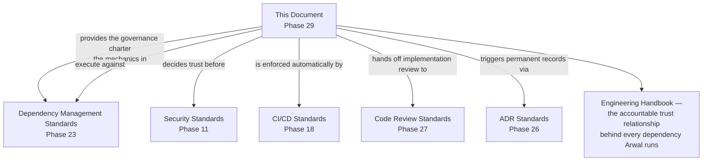

---

# Closing Statement

> **Callout — Closing Statement**
> Every preceding phase document described a standard governing code Arwal's own engineers write. This document describes the discipline governing everything Arwal chooses to trust instead of writing itself — the tens of thousands of packages, authored by strangers, that a citizen's booking, a farmer's subsidy application, and a merchant's wallet balance will depend on for as long as this platform exists. Dependency governance is not bureaucracy layered on top of engineering velocity; it is the specific, structural reason Arwal's reliance on the wider open-source ecosystem can be trusted at all — because every dependency's presence in Arwal's codebase is a deliberate, evidence-based, accountable decision, never a convenience nobody remembers approving. A single ungoverned dependency, quietly abandoned or silently compromised, can undo years of disciplined architecture, security, and testing work in a single incident — and this document exists so that risk is never left to chance, individual memory, or good intentions, but is instead governed continuously, transparently, and accountably, for every one of the ~271 micro-phases still ahead. Where a future phase must deviate from a standard stated here, that deviation is made explicitly — through the Exception Handling process, or an Architectural Decision Record where the deviation is structural — never silently, and never by default.

This document, `ai-docs/28-dependency-governance-standards.md`, is Phase 29 of approximately 300. Every dependency evaluated, approved, classified, monitored, upgraded, and retired in the phases that follow is expected to satisfy the standards defined here, or to justify its deviation in writing.

**End of Phase 29 — `ai-docs/28-dependency-governance-standards.md`**