# Engineering Governance & Decision Authority

**Document:** `ai-docs/29-engineering-governance-decision-authority.md`
**Project:** Arwal — The District Super App
**Stage:** 1 — Foundation
**Phase:** 30 — Engineering Governance & Decision Authority
**Status:** Approved for Engineering Reference
**Audience:** CTO, VP Engineering, Principal Engineers, Architecture Board, Platform Team, Security Team, SRE, Engineering Managers, Tech Leads, Senior Engineers, Developers, QA, Product Managers, Government Technical Partners

> **Callout — Purpose of This Document**
> `ai-docs/00-project-vision.md` through `ai-docs/28-dependency-governance-standards.md` defined why Arwal exists and every enforceable discipline governing how it is designed, written, secured, tested, deployed, observed, logged, configured, documented, decided upon, reviewed, branched, released, and depended upon. Every one of those documents assumes a working answer to a question none of them fully answers: **who, exactly, has the authority to decide?** This document is that answer — Arwal's governance charter for engineering decision-making itself: who proposes, who reviews, who approves, who is accountable, and how disagreement is resolved, for every one of the ~300 micro-phases still ahead.

---

# Purpose of this Document

### Why Governance Matters

Every standard in this handbook describes *what* is correct. None of them, on its own, describes *who gets to decide* when a standard is ambiguous, when two standards conflict, when a genuinely novel situation falls outside every existing standard, or when someone believes a standard itself should change. A team of five engineers can answer that question informally, in a hallway conversation, without ever writing it down — the answer is obvious because everyone already knows everyone. A team of hundreds, spread across a Platform team, a Security team, an SRE team, a Product organization, and dozens of feature teams, cannot. Without an explicit governance model, decision authority defaults to whoever is loudest, whoever has been at the company longest, or whoever happens to be in the room — none of which reliably correlates with who has the most relevant context or the most accountability for the outcome. Governance exists to make "who decides" as deliberately engineered a property of Arwal as its architecture, never left to accident or seniority alone.

### Decision Consistency

A citizen's booking, a farmer's subsidy application, and a merchant's wallet balance depend on thousands of engineering decisions being made the same way, by the same standards, regardless of which team or which decade of Arwal's roadmap made them. Per the Consistency pillar of Engineering Excellence already established in `ai-docs/02-engineering-principles.md`, an engineer's understanding of how a decision gets made in one part of the organization must transfer to every other part — governance is what makes that transfer possible at the level of *process*, exactly as the Module Folder Template (`ai-docs/04-folder-guidelines.md`) makes it possible at the level of *code*.

### Organizational Scalability

Arwal's roadmap anticipates growth from a handful of founding engineers to hundreds, organized into a Platform team, a Security team, an SRE team, and a growing set of product-aligned feature teams. A governance model that works for five engineers in one room does not survive that growth — it must be replaced deliberately, before the growth happens, or it will collapse under its own weight at the worst possible moment (mid-incident, mid-launch, mid-reorganization). This document defines the governance model Arwal grows *into*, not the one it improvises its way out of.

### Accountability

Per the Accountable pillar of Engineering Excellence in `ai-docs/02-engineering-principles.md`, every significant decision must be traceable to a specific, named, accountable party — never a diffuse "the team decided" with no one actually responsible for the outcome. Governance is the structural mechanism that assigns that accountability *before* a decision is made, not reconstructed after something goes wrong.

### Engineering Transparency

Per Transparency over Opacity, already established as a Guiding Principle in `ai-docs/00-project-vision.md`, every engineer — regardless of tenure or team — can see how a decision affecting their work was made, by whom, and why. A governance model practiced invisibly, through informal influence and unwritten precedent, is not transparent no matter how well-intentioned its participants are; this document exists to make Arwal's governance a written, citable, auditable system.

### Long-Term Maintainability

Governance decisions, like architectural decisions, outlive the people who make them. A governance model documented once, in Phase 30, and never revisited or enforced degrades exactly as an unmaintained folder structure or an unmaintained dependency does — this document is itself subject to the same living-document discipline (`ai-docs/24-documentation-standards.md`) it requires of everything else.

### Relationship with ADR Standards

`ai-docs/25-architecture-decision-records.md` already defines, in full, **how a decision is recorded** once it is made — the template, the numbering, the lifecycle, the review process for the *document*. This document defines **who has the authority to make the decision the ADR records** — the organizational role, not the artifact. The two meet at exactly one point: this document's Decision Authority Matrix names the Approval Authority; `ai-docs/25-architecture-decision-records.md`'s Approval Authority table (mirrored, not duplicated, here) is where that authority signs an ADR. Neither document redefines the other's territory.

### Relationship with Engineering Principles

`ai-docs/02-engineering-principles.md` establishes the founding engineering culture — ownership and accountability, blameless postmortems, the ADR concept's first introduction. This document is the organizational structure that culture requires to function at scale: a culture of accountability without a defined authority structure produces diffusion of responsibility exactly as an authority structure without that culture produces bureaucratic compliance with no genuine ownership. The two are load-bearing for each other.

### Relationship with Development Workflow

`ai-docs/07-development-workflow.md` already defines the Engineering Lifecycle's Architecture Review Workflow, the Bug Fix Workflow's severity table, and the Incident Response Workflow — every one of which *assumes* a governance structure this document is what actually names. Where `ai-docs/07-development-workflow.md` says "Architect/Tech Lead" or "Incident Commander," this document defines who holds that role, how they got it, and what authority it carries.

### Relationship with Code Review Standards

`ai-docs/26-code-review-standards.md` already defines the complete human review process for a pull request — reviewer roles, review levels, the checklist. This document does not redefine a single element of that process. It defines the governance layer *above* an individual PR: who has standing authority over an entire domain, a whole architecture, or a cross-team conflict that a single PR's review cannot resolve.

---

# Governance Philosophy

Arwal's governance model rests on eight commitments. Together they answer the question every subsequent section of this document exists to make concrete: **what makes a decision-making system trustworthy at organizational scale, for years, without collapsing into either paralysis or unaccountable authority?**

### Accountability Over Hierarchy

Authority at Arwal is granted because a role carries genuine accountability for an outcome, never merely because a title sits higher on an organizational chart. A Principal Engineer's authority over a system-wide architectural pattern exists because they are accountable for that pattern working at scale — not because "Principal" outranks "Senior." This exists because a governance model built on hierarchy alone rewards proximity to power rather than proximity to context, and produces decisions made by people furthest from the consequences of being wrong.

### Transparency

Every decision of consequence is visible to every engineer who might reasonably be affected by it, recorded in a citable, permanent location, per the identical Transparency over Opacity principle already established in `ai-docs/00-project-vision.md`. This exists because a decision made in private, however correct, cannot be trusted by the people who must live with it — trust in a governance system requires the ability to inspect it, not merely to be told it works.

### Delegation with Responsibility

Authority is delegated deliberately and explicitly, and delegation always carries the accountability for the outcome along with the power to decide — authority is never handed off while responsibility is quietly retained, and responsibility is never assigned without the corresponding authority to actually act on it. This exists because a delegate who is accountable without authority is set up to fail, and a delegate with authority but no accountability has no reason to decide carefully.

### Evidence-Based Decisions

Every significant decision is grounded in demonstrable evidence — a benchmark, a documented incident, a cited alternative genuinely considered — never in seniority, confidence, or force of personality alone, mirroring the identical Evidence over Prediction principle already established in `ai-docs/03-system-architecture-principles.md` and the Decision Quality Standards in `ai-docs/25-architecture-decision-records.md`. This exists because a governance system that rewards the most persuasive argument over the best-supported one optimizes for the wrong thing.

### Lowest Competent Decision Maker

A decision is made at the lowest organizational level genuinely competent to make it well — never escalated reflexively to a more senior authority "to be safe," and never made below a level that actually has the context to weigh its consequences correctly. This exists because over-escalation is a direct tax on organizational velocity (every decision waiting on a scarce senior resource) and under-escalation is a direct risk to correctness (a decision made without the context to see its full consequences) — the Lowest Competent Decision Maker principle is the deliberate balance between these two failure modes, and is the single most load-bearing principle the Decision Authority Matrix below is built to operationalize.

### Document Before Deciding

For any decision meeting the significance threshold already established in `ai-docs/25-architecture-decision-records.md`'s What Requires an ADR section, the context, the options, and the trade-offs are written down *before* the decision is finalized, never reconstructed afterward to justify a conclusion already reached informally. This exists because a decision documented after the fact is not a record of reasoning — it is a record of rationalization, and the two are not the same thing, per the identical Not Opinion-Based standard already established in `ai-docs/25-architecture-decision-records.md`'s Decision Quality Standards.

### Reversible vs. Irreversible Decisions

The rigor a decision receives scales with how expensive it is to reverse, restating and elevating to governance-level authority the identical Reversible vs. Irreversible Decisions principle already established in `ai-docs/25-architecture-decision-records.md`. This exists because applying uniform, maximum rigor to every decision — including the cheaply reversible ones — is itself a governance failure: it slows the organization down without making it meaningfully safer, exactly the Over-Engineering the Approval Process anti-pattern already named in `ai-docs/28-dependency-governance-standards.md`.

### Long-Term Thinking

Every governance decision is evaluated against its consequences across the remaining ~270 phases of Arwal's roadmap and the eventual hundreds-of-engineers team it will support, never merely against the convenience of resolving today's disagreement quickly. This exists because a governance shortcut that expedites one decision today can quietly become the precedent that erodes the entire model's credibility at Phase 150, when a very different team inherits a governance structure nobody who built it is still around to explain.

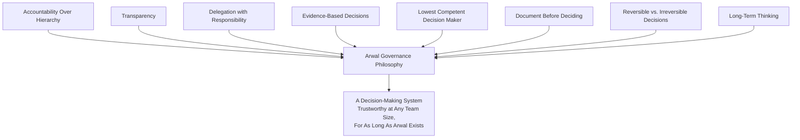

> **Callout — The One-Sentence Governance Philosophy**
> *"Authority exists to make good decisions happen at the right level, quickly, visibly, and accountably — the moment it exists for any other reason, it has stopped being governance and started being politics."*

---

# Governance Organization

Every role below carries a defined scope of decision authority, a defined accountability, and a defined relationship to every other role — no role's authority is left to inference.

| Role | Scope of Authority | Primary Accountability |
|---|---|---|
| **CTO** | Final authority on Arwal's technical direction, Strategic-classification decisions, and any decision escalated to the top of the chain, per Escalation Process below. | The technical strategy's coherence with Arwal's business and civic mission (`ai-docs/00-project-vision.md`), across the full ~300-phase roadmap. |
| **VP Engineering** | Organizational structure of engineering, cross-team resourcing, and Strategic/Architectural decisions jointly with the CTO and Principal Engineers. | Engineering organizational health, delivery predictability, and the sustainability of the governance model itself (per Governance Metrics below). |
| **Principal Engineers** | System-wide architectural patterns, cross-cutting technical direction, and Architecture Review Board membership (below). | The long-term technical integrity of Arwal's architecture across every domain, per `ai-docs/03-system-architecture-principles.md`. |
| **Architecture Review Board** | Approval authority for Architectural and Strategic-classification decisions, per Decision Classification below and the identical Architecture Review Workflow already established in `ai-docs/07-development-workflow.md`. | Consistency of architectural decisions with `ai-docs/03-system-architecture-principles.md` and every prior ADR (`ai-docs/25-architecture-decision-records.md`). |
| **Platform Team** | Shared infrastructure, `packages/*` shared libraries, CI/CD pipeline (`ai-docs/17-cicd-standards.md`), developer tooling, and Operational-classification decisions affecting more than one product team. | The reliability, consistency, and usability of the shared engineering foundation every product team builds on. |
| **Security Team** | Security Review Board membership, veto authority over any change failing `ai-docs/10-security-standards.md`, and Security-classification decision approval. | Arwal's security posture across every module, dependency, and deployment, per `ai-docs/10-security-standards.md`. |
| **SRE** | Production reliability standards, incident command (per Escalation Process below), and Operational-classification decisions affecting availability or performance SLOs. | Uptime, latency, and recovery targets already established in `ai-docs/01-product-goals.md` and `ai-docs/11-performance-standards.md`. |
| **Engineering Managers** | Team resourcing, review-capacity health (per `ai-docs/26-code-review-standards.md`'s Review Metrics), and escalation resolution within their own team's scope. | Their team's delivery, engineering health, and adherence to this handbook's standards. |
| **Tech Leads** | Technical-classification decisions within their owned domain/module, per `ai-docs/04-folder-guidelines.md`'s Folder Ownership Rules. | The correctness and maintainability of their owned domain's implementation. |
| **Senior Engineers** | Technical and Routine-classification decisions within their current work; Domain Expert reviewer authority per `ai-docs/26-code-review-standards.md`. | Depth of implementation quality and mentorship of less-senior engineers within their domain. |
| **Developers** | Routine-classification decisions within an already-approved pattern; proposal authority for any higher classification. | Correct, tested, reviewed implementation of assigned work, per `ai-docs/08-definition-of-done.md`. |
| **QA** | Test adequacy sign-off, Release Readiness verification (`ai-docs/07-development-workflow.md`), and QA Reviewer authority per `ai-docs/26-code-review-standards.md`. | Verified correctness and citizen-facing quality of every release. |
| **Product Managers** | Product-Engineering classification decisions — feature scope, prioritization, and release-content trade-offs, per the Product Owner role already established in `ai-docs/27-branching-release-strategy.md`. | Alignment of what ships with `ai-docs/01-product-goals.md`'s Product Priorities. |

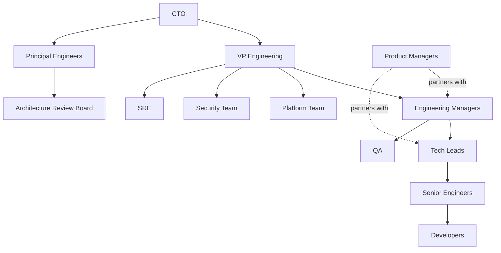

> **Callout — Organization Chart Is Not Decision Authority**
> The reporting-line diagram above shows organizational structure, never decision authority directly — a Developer's proposal authority and a Senior Engineer's Domain Expert authority are both real, standing powers within their scope, independent of who they report to. The Decision Authority Matrix below, not this org chart, is the authoritative source for "who decides what."

---

# Decision Classification

Every engineering decision at Arwal belongs to exactly one of ten categories. Classification determines everything downstream: required authority, review depth, and documentation obligation.

| Category | Definition | Examples | Required Authority | Review Requirement |
|---|---|---|---|---|
| **Strategic** | Shapes Arwal's multi-year technical direction; referenced by many future phases. | Modular Monolith First (`ai-docs/03-system-architecture-principles.md`); PostgreSQL as primary datastore (`ai-docs/09-tech-stack.md`). | CTO + Principal Engineers, jointly. | Full ADR (`ai-docs/25-architecture-decision-records.md`), Architecture Review Board. |
| **Architectural** | Shapes system structure within an already-set strategic direction. | A new bounded context; a service extraction from the Modular Monolith (`ai-docs/03-system-architecture-principles.md`'s Migration Strategy). | Architecture Review Board. | Full ADR, Architecture Review Workflow (`ai-docs/07-development-workflow.md`). |
| **Technical** | A specific technology or implementation pattern within an already-set architecture. | Choosing between two libraries within an approved category (`ai-docs/22-dependency-management-standards.md`). | Tech Lead of the affected domain. | Lightweight ADR or standard code review, per the Reversibility test in `ai-docs/25-architecture-decision-records.md`. |
| **Operational** | Governs how an already-built system is run day to day. | A deployment strategy choice (`ai-docs/16-deployment-standards.md`); a release cadence recalibration (`ai-docs/27-branching-release-strategy.md`). | DevOps/Platform Lead + affected service's Tech Lead. | Operational-classification ADR where precedent-setting; otherwise standard review. |
| **Security** | Any decision affecting Arwal's security posture, threat model, or data classification. | An encryption approach change; an authentication protocol change (`ai-docs/10-security-standards.md`). | Security Review Board. | Security Review, per `ai-docs/10-security-standards.md`'s Security Review Checklist. |
| **Compliance** | Made specifically to satisfy a legal, regulatory, or government-partnership requirement. | A data-residency commitment; a retention-policy change for government audit purposes. | Architecture Review Board + Legal/Compliance. | Regulatory-classification ADR (`ai-docs/25-architecture-decision-records.md`). |
| **Infrastructure** | Provisioned infrastructure, environment topology, or cloud resource decisions. | A new AWS resource category; an environment-topology change (`ai-docs/23-environment-strategy.md`). | Platform Team + DevOps Lead. | Infrastructure-scoped Architecture Review where the change is structural, per `ai-docs/16-deployment-standards.md`. |
| **Product Engineering** | A trade-off between engineering approach and product scope/timeline. | Deferring a feature behind a flag versus completing it for the current release (`ai-docs/16-deployment-standards.md`'s Feature Flag Releases). | Product Manager + Tech Lead, jointly. | Documented in the release's own record, per `ai-docs/27-branching-release-strategy.md`'s Release Ownership. |
| **Emergency** | Made under active Sev 1/Sev 2 incident pressure, per `ai-docs/07-development-workflow.md`'s Incident Response Workflow. | A temporary rate-limit tightening during an active abuse event; an emergency dependency patch (`ai-docs/22-dependency-management-standards.md`). | Incident Commander, ratified within one business day. | Emergency-classification ADR (`ai-docs/25-architecture-decision-records.md`), mandatory postmortem. |
| **Routine** | A decision within an already-approved pattern, carrying no new precedent. | Implementing a use case following an existing module's established pattern. | The implementing engineer. | Standard code review (`ai-docs/26-code-review-standards.md`) only — no ADR. |

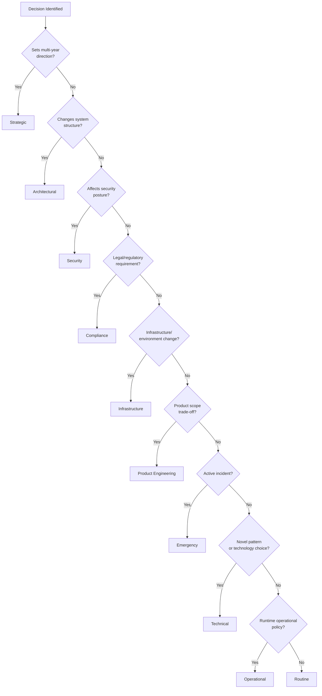

---

# Decision Authority Matrix

For every decision category, the matrix below names who may propose, who reviews, who holds final approval, who must be informed, and who owns implementation — mirroring RACI discipline (Responsible/Accountable/Consulted/Informed) applied specifically to Arwal's engineering decisions.

| Decision Type | Proposes | Reviews | Approves | Informed | Implementation Owner |
|---|---|---|---|---|---|
| **Strategic** | Any engineer, typically Principal/CTO-initiated | Architecture Review Board, Engineering Leadership Council | CTO + Principal Engineers | All Engineering, Product, Government Partners (where applicable) | Platform Team + affected domain teams |
| **Architectural** | Tech Lead, Senior Engineer, or Principal Engineer | Architecture Review Board | Architecture Review Board | All Engineering | Owning team's Tech Lead |
| **Technical** | Any engineer | Domain Expert, Tech Lead | Tech Lead of the affected domain | Team | Proposing engineer |
| **Operational** | SRE, Platform Team, DevOps | DevOps Lead, affected Tech Lead | DevOps/Platform Lead | Affected teams | Platform Team / SRE |
| **Security** | Any engineer, typically Security Team-initiated | Security Review Board | Security Review Board | All Engineering, affected domain teams | Security Team + implementing engineer |
| **Compliance** | Legal/Compliance, Product, or Architecture Review Board | Architecture Review Board + Legal | Architecture Review Board + Legal | CTO, VP Engineering, affected teams | Implementing engineer, Legal-verified |
| **Infrastructure** | Platform Team, DevOps, SRE | Platform Governance Board | Platform Team Lead + DevOps Lead | All Engineering (for a structural change) | Platform Team |
| **Product Engineering** | Product Manager or Tech Lead | Tech Lead + Product Manager, jointly | Product Manager (scope) + Tech Lead (feasibility) | Team, Release Governance Board | Implementing team |
| **Emergency** | On-call responder, Incident Commander | Incident Commander | Incident Commander (immediate); Tech Lead (ratification) | All affected teams, Engineering Leadership Council | Responding engineer |
| **Routine** | Implementing engineer | PR Reviewer, per `ai-docs/26-code-review-standards.md` | PR Reviewer | Team (via standard PR visibility) | Implementing engineer |

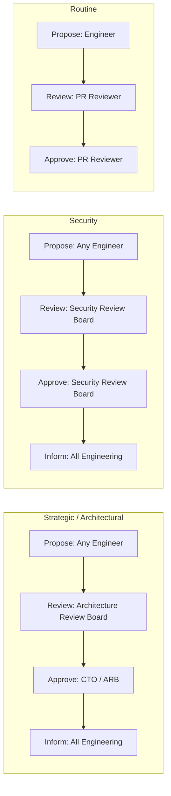

> **Callout — The Matrix Is the Authoritative Source**
> Where any other section of this document appears to conflict with the Decision Authority Matrix above, the Matrix governs — every other section exists to explain the Matrix's reasoning, never to silently override it.

---

# Decision Delegation

### Delegation Principles

Authority is delegated explicitly, in writing, scoped to a specific domain and time period — never assumed, never inherited implicitly by proximity to a role, and never granted verbally with no corresponding record, per Transparency above. A delegation always names the delegator, the delegate, the scope, and the duration.

### Temporary Delegation

A temporary delegation — an Engineering Manager delegating release sign-off authority while on leave, a Tech Lead delegating Domain Expert review during a sprint of reduced availability — is recorded with an explicit start and end date. It reverts automatically to the delegator at the stated end date without requiring an active revocation step, so a forgotten delegation never silently persists past its intended window.

### Permanent Delegation

A permanent delegation — appointing a new Tech Lead for a module, expanding the Architecture Review Board's membership — follows the identical Ownership Transfer discipline already established in `ai-docs/25-architecture-decision-records.md`: proposed by the outgoing or delegating authority, confirmed by the next level up, and recorded as an update to the Governance Organization roster (see Decision Transparency below), never as an informal handoff.

### Authority Limits

Every delegation carries an explicit boundary — a Tech Lead delegated Technical-classification authority over their module never thereby gains Architectural or Strategic authority over it; a delegated authority is always a subset of the delegator's own authority, never a superset, and never silently expands beyond its stated scope through repeated use.

### Revoking Delegation

A delegation is revoked by the same authority that granted it (or by that authority's own superior, per the Governance Organization hierarchy), documented with a stated reason, and takes effect immediately — a revoked delegate is never left continuing to act under an authority that has already been withdrawn, and the revocation itself is recorded per Decision Transparency below.

### Shared Authority

Where two roles jointly hold approval authority over a decision category (e.g., Product Manager + Tech Lead for Product Engineering decisions, per the Decision Authority Matrix), both must concur before the decision is final — a disagreement between joint authority-holders is never resolved by one unilaterally overriding the other; it follows the Escalation Process below.

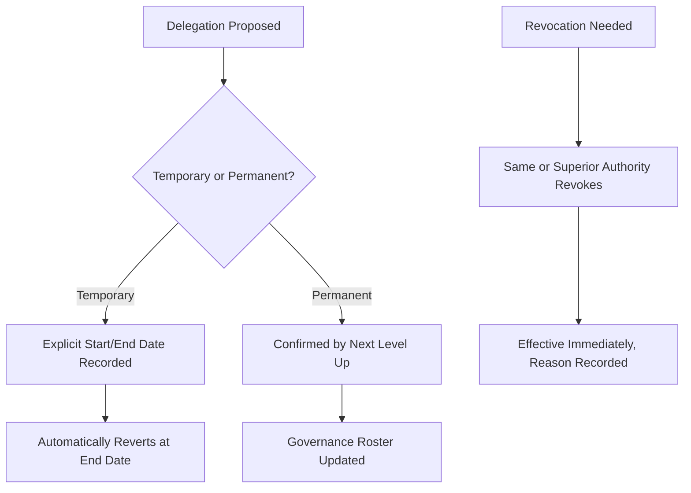

---

# Escalation Process

Escalation exists to resolve a genuine disagreement or a blocked decision without either party unilaterally overriding the other, per the identical blameless-escalation framing already established in `ai-docs/25-architecture-decision-records.md`'s Decision Ownership section and `ai-docs/26-code-review-standards.md`'s Communication Guidelines.

### Technical Disagreement

Two engineers disagree on a Technical-classification decision. Worked through directly first; if unresolved after a reasonable exchange (per `ai-docs/26-code-review-standards.md`'s Disagreement Resolution), it escalates to the Tech Lead of the affected domain, whose decision is final for that classification tier.

### Architecture Conflict

A proposed change conflicts with an existing architectural decision, or two Architectural-classification proposals are mutually incompatible. Escalates directly to the Architecture Review Board, per the identical Conflicts standard already established in `ai-docs/25-architecture-decision-records.md`'s ADR Relationships section — never left for two competing PRs to silently coexist.

### Security Conflict

A security-relevant disagreement — whether a proposed mitigation is sufficient, whether a finding's severity is correctly classified. Escalates to the Security Review Board, whose determination carries veto authority over any conflicting engineering preference, per `ai-docs/10-security-standards.md`'s non-negotiable security posture.

### Production Incident

An active Sev 1/Sev 2 incident, per `ai-docs/07-development-workflow.md`'s Incident Response Workflow. Escalates immediately to the Incident Commander, who holds full Emergency-classification decision authority for the duration of the incident — a Production Incident escalation bypasses the normal review chain by design, per the identical Mitigate First principle already established there.

### Cross-Team Disagreement

Two teams disagree on a decision spanning both their domains (a shared contract's shape, a shared infrastructure resource's allocation). Escalates to the Engineering Leadership Council (see Governance Boards below), which either resolves the disagreement directly or routes it to the correct specialized board (Architecture Review Board, Security Review Board, Platform Governance Board).

### Blocked Decisions

A decision that has not been resolved within a reasonable window (per the Escalation Timing table below) despite genuine attempts at Standard resolution is treated as a blocked decision in its own right — the absence of resolution is itself escalated, never allowed to stall indefinitely, per the identical Outstanding Drafts governance-health signal already established in `ai-docs/25-architecture-decision-records.md`'s ADR Metrics.

### Executive Escalation

A disagreement unresolved at the Engineering Leadership Council level, or a decision whose consequences are judged Strategic-classification mid-escalation, reaches the CTO/VP Engineering — the final escalation tier, whose determination is binding.

### Escalation Timing

| Escalation Level | Maximum Resolution Window |
|---|---|
| Direct (peer-to-peer) | 2–3 exchange rounds, typically same day |
| Tech Lead | 2 business days |
| Architecture/Security Review Board | 1 week (standing meeting cadence, per Governance Boards below) |
| Engineering Leadership Council | 1 week |
| CTO/VP Engineering | 3 business days once reached |
| Production Incident | Immediate — no window, per Incident Response |

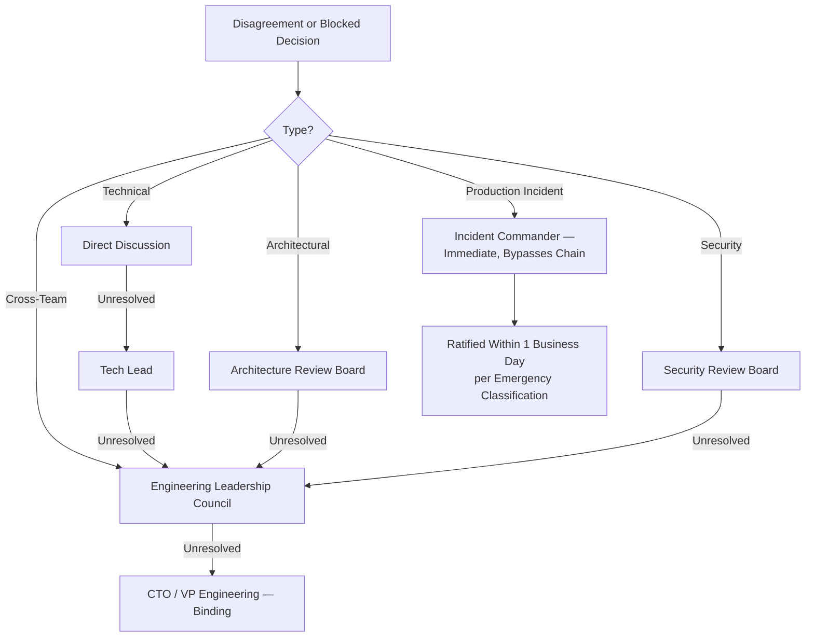

---

# Governance Boards

### Architecture Review Board

**Responsibilities:** Approval authority for Strategic and Architectural-classification decisions; resolution authority for Architecture Conflict escalations; custodian of consistency across every ADR (`ai-docs/25-architecture-decision-records.md`).
**Membership:** Principal Engineers, CTO or delegate, and rotating domain Tech Leads for a decision touching their specific domain.
**Decision Process:** Consensus-seeking first; where consensus is not reached within the meeting, the CTO or their delegate on the Board casts the deciding vote, recorded with dissent noted per Decision Transparency below.
**Cadence:** Weekly standing meeting, plus ad hoc sessions for an Emergency-classification ratification or a time-sensitive Architectural proposal.

### Security Review Board

**Responsibilities:** Approval authority for Security-classification decisions; veto authority over any change failing `ai-docs/10-security-standards.md`; resolution authority for Security Conflict escalations.
**Membership:** Security Team lead and senior members, a rotating Platform/SRE representative, and — for a `payments`/`identity`/`civic-services`-touching decision — the affected domain's Tech Lead as a consulted (non-voting) participant.
**Decision Process:** The Security Review Board's determination on a security-classified matter is not overridable by any other board except the CTO/VP Engineering at Executive Escalation, and even then only with a documented, board-level risk acceptance, per the identical AGPL/GPL exception discipline already established in `ai-docs/22-dependency-management-standards.md`'s Open Source Licensing.
**Cadence:** Weekly standing meeting, plus mandatory same-day session for a Critical-severity finding, per the CVSS response timelines already established in `ai-docs/22-dependency-management-standards.md`.

### Platform Governance Board

**Responsibilities:** Approval authority for cross-team Infrastructure and Operational-classification decisions; custodian of `packages/*` shared-package governance (`ai-docs/28-dependency-governance-standards.md`'s Internal Package Governance) and CI/CD pipeline policy (`ai-docs/17-cicd-standards.md`).
**Membership:** Platform Team lead, DevOps/SRE lead, and rotating representation from the two or three product teams most affected by a given proposal.
**Decision Process:** Majority vote among standing members; a dissenting product team may escalate to the Engineering Leadership Council if it believes a Platform decision materially harms its own delivery.
**Cadence:** Bi-weekly standing meeting.

### Engineering Leadership Council

**Responsibilities:** Resolution authority for Cross-Team Disagreement escalations; oversight of Governance Metrics (below); the body that recalibrates this document itself when evidence warrants.
**Membership:** VP Engineering (chair), all Engineering Managers, Principal Engineers, and the leads of Platform, Security, and SRE.
**Decision Process:** Deliberative discussion; the VP Engineering holds the deciding vote where consensus is not reached, subject to CTO override at Executive Escalation.
**Cadence:** Bi-weekly standing meeting, plus ad hoc sessions for an urgent Cross-Team Disagreement.

### Release Governance Board

**Responsibilities:** Sign-off authority for Critical-tier releases per `ai-docs/27-branching-release-strategy.md`'s Release Risk Classification; custodian of Release Cadence policy and Release Metrics.
**Membership:** Release Engineer (chair), QA lead, DevOps/Release Manager, and — for a High/Critical-tier release — a Security Reviewer.
**Decision Process:** Every named sign-off role must concur before a Critical-tier release is promoted, per the identical Approval Chain already established in `ai-docs/27-branching-release-strategy.md`'s Release Risk Classification table.
**Cadence:** Per the Release Cadence already established in `ai-docs/27-branching-release-strategy.md` — convened for every Release Candidate, plus emergency sessions for a Hotfix/Emergency Release.

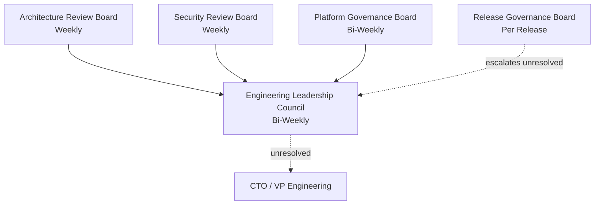

---

# Exception Governance

### When Exceptions Are Allowed

An exception to any standard in this handbook is permitted only where: (1) a genuine, documented constraint makes full compliance currently infeasible, (2) no viable compliant alternative exists, and (3) the risk introduced is explicitly named and accepted by an accountable party — mirroring the identical Exception Handling discipline already established in `ai-docs/28-dependency-governance-standards.md`'s Dependency Approval Process, generalized here to every governance domain this handbook covers.

### Approval Chain

An exception's required approval scales with the standard being excepted, per the identical classification already used throughout this document: a Routine-tier exception requires Tech Lead sign-off; a Security-tier exception requires the Security Review Board; a Strategic-tier exception requires the Architecture Review Board and, where it touches a regulatory commitment, Legal/Compliance.

### Risk Documentation

Every exception is recorded with: the specific standard being excepted, the reason full compliance is currently infeasible, the specific risk the exception introduces, and the accountable sponsor who accepts that risk — identical in structure to the Exception Handling record already established in `ai-docs/28-dependency-governance-standards.md`.

### Time Limits

Every exception carries an explicit expiration date, never longer than 6 months from grant without a fresh review, mirroring the identical Re-Evaluation Date discipline already established in `ai-docs/28-dependency-governance-standards.md`'s Dependency Approval Process and `ai-docs/21-configuration-management-standards.md`'s Feature Flags Sunset Policy.

### Re-Evaluation

At an exception's expiration date, it is either resolved (full compliance achieved, the exception closed), extended with a fresh, documented justification, or escalated as an unresolved risk to the Approval Authority one tier above the original grant — an exception is never silently allowed to lapse into permanent, unreviewed status.

### Expiration

An exception that reaches its expiration date with no re-evaluation action taken is treated as a governance defect in its own right, surfaced by the Governance Metrics' Exception Count tracking below, and escalated automatically to the Engineering Leadership Council.

### Audit Trail

Every exception — granted, extended, or closed — is permanently recorded in the Decision Log (see Decision Transparency below), never deleted, mirroring the identical Immutable Numbers / Archive, Never Delete principle already established for ADRs in `ai-docs/25-architecture-decision-records.md`.

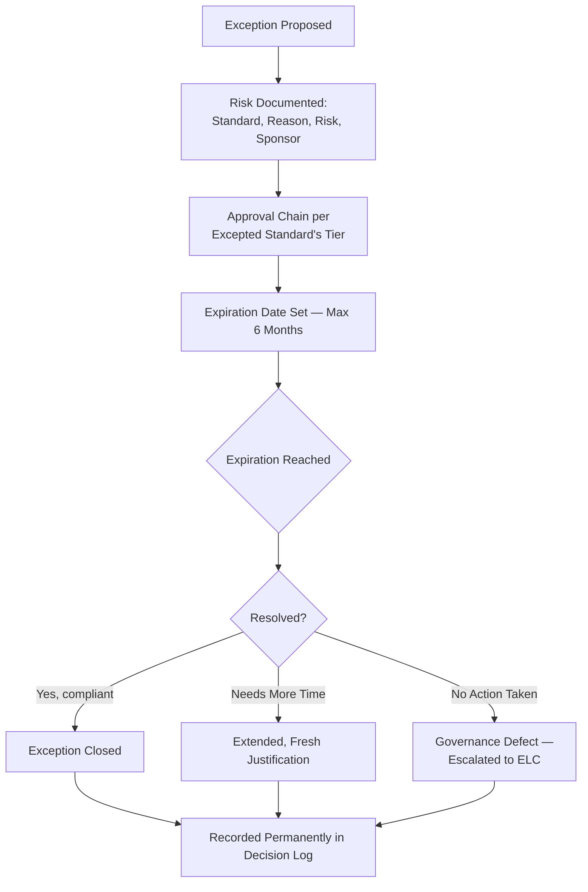

---

# Accountability

Every domain below has exactly one named, accountable owner — never a diffuse, collective "the team."

| Domain | Accountable Owner | Governing Standard |
|---|---|---|
| **Architecture** | Architecture Review Board (collectively), with the Principal Engineer sponsoring a given ADR individually accountable for its outcome. | `ai-docs/03-system-architecture-principles.md`, `ai-docs/25-architecture-decision-records.md` |
| **Security** | Security Team lead, with the Security Review Board collectively accountable for board-level decisions. | `ai-docs/10-security-standards.md` |
| **Infrastructure** | Platform Team lead / DevOps lead. | `ai-docs/16-deployment-standards.md`, `ai-docs/23-environment-strategy.md` |
| **Dependencies** | Per `ai-docs/28-dependency-governance-standards.md`'s named sponsor per dependency, with the Platform Team accountable for the governance process itself. | `ai-docs/22`, `ai-docs/28-dependency-governance-standards.md` |
| **Documentation** | Per `ai-docs/24-documentation-standards.md`'s Documentation Ownership Matrix — this document adds no new documentation-ownership rule. | `ai-docs/24-documentation-standards.md` |
| **Quality** | QA lead, jointly with each Tech Lead for their owned domain's test coverage. | `ai-docs/15-testing-standards.md`, `ai-docs/08-definition-of-done.md` |
| **Production Reliability** | SRE lead, with the on-call Incident Commander individually accountable during an active incident. | `ai-docs/18-observability-standards.md`, `ai-docs/07-development-workflow.md` |
| **Performance** | SRE + the Tech Lead of the affected domain, jointly, per the SLO ownership already implicit in `ai-docs/11-performance-standards.md`. | `ai-docs/11-performance-standards.md` |
| **Accessibility** | The Frontend Platform lead (or equivalent), with each feature Tech Lead accountable for their own module's compliance. | `ai-docs/12-accessibility-standards.md` |

> **Callout — Collective Accountability Is a Contradiction**
> A board can be *collectively* accountable for a *board-level decision process* remaining sound — but every individual decision within that process still has one named, individually accountable sponsor. "The Architecture Review Board decided" is a legitimate description of *process*; it is never an acceptable substitute for naming the specific engineer who proposed, and remains accountable for, the outcome.

---

# Decision Transparency

### Documentation

Every decision meeting the ADR threshold in `ai-docs/25-architecture-decision-records.md` is documented per that document's Template — this document adds no new documentation format. Every decision *below* that threshold but still governance-relevant (a Routine escalation resolution, an exception grant) is recorded in the Decision Log below.

### Meeting Records

Every Governance Board meeting (above) produces a short, written record — attendees, decisions made, dissent noted, and action items — published to a location every engineer can access, per the identical Documentation Is Code principle already established in `ai-docs/24-documentation-standards.md`. A meeting record is never the only record of a decision; any decision reaching ADR significance is additionally filed as its own ADR.

### Decision Logs

A lightweight, chronological **Decision Log** (`ai-docs/adr/decision-log.md`, or an equivalent generated index) captures every governance-relevant decision *not* significant enough for its own ADR — an escalation resolution, an exception grant, a delegation change — giving a complete, queryable history of Arwal's governance activity distinct from, and complementary to, the full ADR corpus.

### ADR Relationship

Every Strategic, Architectural, Compliance, and Emergency-classification decision produces an ADR, per `ai-docs/25-architecture-decision-records.md` — this document's role is ensuring the *governance process* that produced that ADR (which board, which vote, which escalation path) is itself visible, not merely the ADR's final Decision section.

### Communication

A decision affecting more than one team is actively communicated to every affected team — never merely published passively and assumed to be discovered, mirroring the identical Communication discipline already established in `ai-docs/24-documentation-standards.md`'s Breaking Documentation Changes standard.

### Historical Traceability

Per the identical Decision Traceability reasoning already established in `ai-docs/25-architecture-decision-records.md`, every governance decision is traceable, end to end, from the problem that prompted it through the board that resolved it to the ADR or Decision Log entry that records it — a future engineer questioning "why does this board exist, or why was this decision made this way" is always pointed to a citable record, never an oral history.

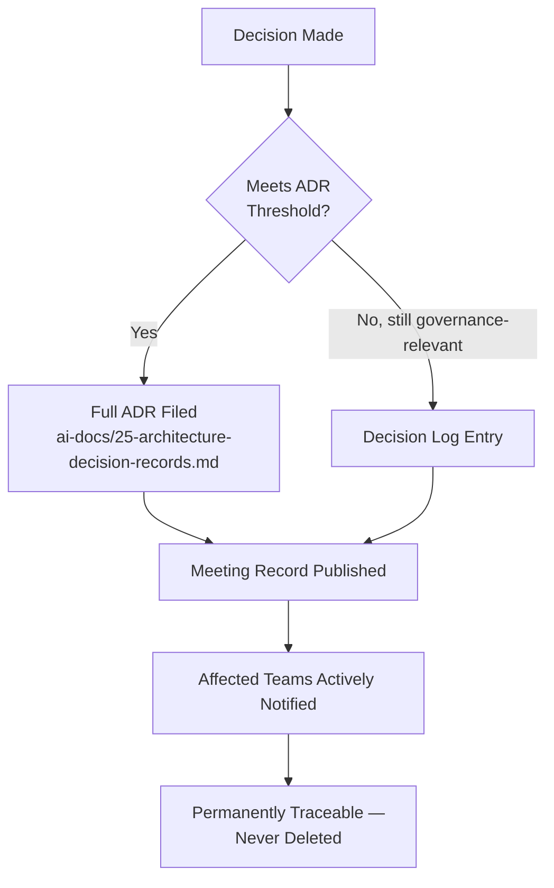

---

# Governance Metrics

Per the Actionable Metrics principle already established in `ai-docs/18-observability-standards.md`, every metric below ties to a real question the Engineering Leadership Council will actually ask.

| Metric | Definition | What a Regression Signals |
|---|---|---|
| **Decision turnaround time** | Time from a decision's proposal to its resolution, per classification tier. | A rising trend at a given tier signals that tier's board or authority is under-resourced or over-scoped. |
| **Escalation frequency** | Count of decisions escalated beyond their expected level, per unit time. | A rising rate signals the Lowest Competent Decision Maker principle is not holding — decisions are being pushed up unnecessarily. |
| **Exception count** | Count of currently-active exceptions, per standard and per classification tier. | A growing count signals a standard itself may need reconsideration, or that compliance friction is being routinely worked around rather than addressed. |
| **Governance compliance** | The percentage of ADR-worthy decisions that actually produced an ADR, per `ai-docs/25-architecture-decision-records.md`'s ADR Coverage metric. | A gap here is the single most direct signal that this document's authority is being bypassed in practice. |
| **Decision reversals** | Count of decisions superseded or reversed within a short window of being made. | A rising rate signals decisions are being made without sufficient evidence or review rigor at the point of approval. |
| **Architecture consistency** | Count of Architecture Conflict escalations per unit time. | A rising rate signals architectural boundaries or precedent are not being consistently communicated across teams. |
| **Cross-team conflicts** | Count of Cross-Team Disagreement escalations per unit time. | A rising rate signals unclear domain boundaries or contract ownership between teams, per `ai-docs/03-system-architecture-principles.md`'s Domain Boundaries. |
| **Audit findings** | Count and severity of findings from a periodic governance audit (reviewing Decision Log completeness, exception currency, and board meeting-record consistency). | Any non-trivial finding is treated as an active governance defect, identical in severity treatment to an Ownerless ADR in `ai-docs/25-architecture-decision-records.md`. |

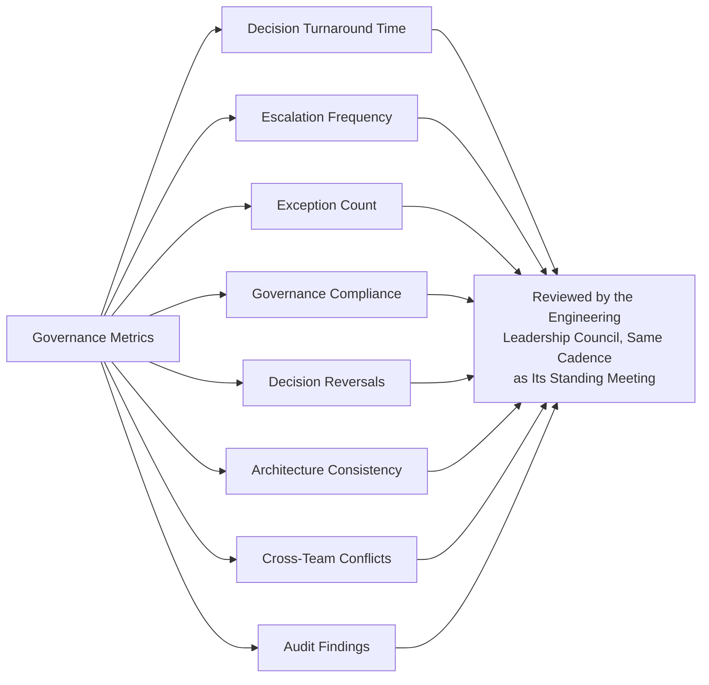

---

# AI-Assisted Governance

Consistent with the identical AI-assistance principle already established across `ai-docs/24-documentation-standards.md`, `ai-docs/25-architecture-decision-records.md`, `ai-docs/26-code-review-standards.md`, `ai-docs/27-branching-release-strategy.md`, and `ai-docs/28-dependency-governance-standards.md`: **AI accelerates analysis, never authority.**

### AI Recommendations

An AI tool may surface a candidate precedent from a prior ADR, flag a potential Architecture Conflict before a human reviewer notices it, or suggest which classification tier a proposed decision likely belongs to — every such recommendation is treated as a lead for a human governance participant to evaluate, never as a pre-made determination.

### AI Meeting Summaries

Where a Governance Board meeting is summarized with AI assistance, the summary is verified against the actual discussion by a human attendee (typically the chair) before it is published as the meeting's Decision Transparency record — an AI-generated summary that mischaracterizes a dissent or a decision's actual scope is a direct threat to the accuracy Decision Transparency depends on.

### AI Decision Analysis

An AI tool may be used to analyze Governance Metrics trends, draft a first pass at a Decision Authority Matrix classification, or compare a proposed decision against similar past ADRs — every such analysis is a draft input to human deliberation, never a substitute for it, mirroring the identical AI Recommendations standard already established in `ai-docs/28-dependency-governance-standards.md`.

### Human Authority

No decision at any classification tier is approved on the basis of an AI tool's analysis alone — every Approval named in the Decision Authority Matrix is a named human or a named human-constituted board, and that requirement has no AI exception, at any tier, ever.

### Verification

Any factual claim an AI tool makes in support of a governance decision — "this mirrors ADR-0044's precedent," "three prior escalations resolved this way" — is independently verified against the actual Decision Log and ADR corpus before being relied upon, per the identical Fact Verification discipline already established throughout this handbook's AI-assistance sections.

### Ownership

The human approver named in the Decision Authority Matrix remains the full, accountable owner of every decision, regardless of how much AI assistance contributed to its analysis — identical to the Traceability principle already established in `ai-docs/06-git-workflow.md` and consistently extended across every governance document in this handbook.

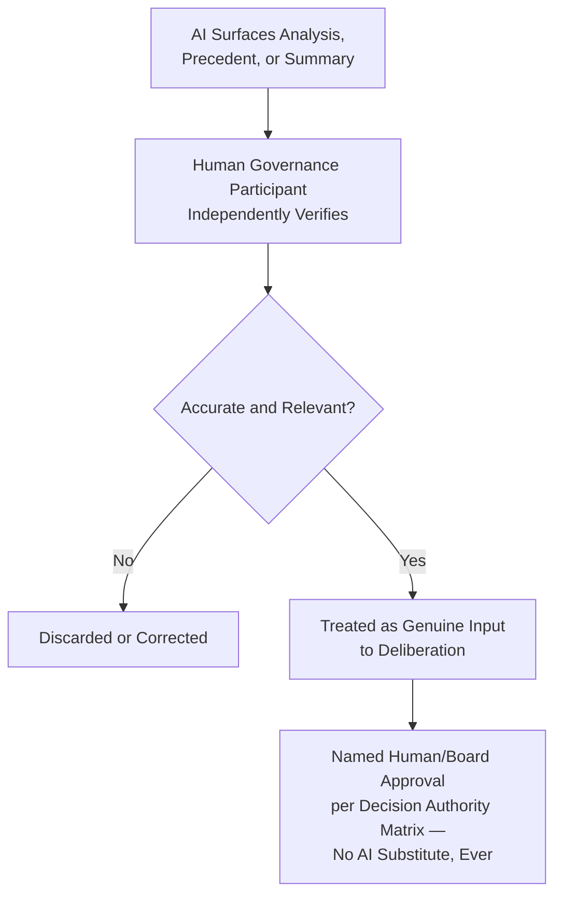

---

# Governance Anti-Patterns

The following patterns are explicitly rejected, regardless of how convenient they appear under organizational pressure — each is a specific, previously observed governance failure mode, called out here so Arwal does not have to relearn the lesson expensively at Phase 250.

| Anti-Pattern | Description | Why It's Rejected |
|---|---|---|
| **Decision by Seniority Alone** | A decision resolved in favor of whoever is most senior in the room, with no reference to the Decision Authority Matrix or evidence. | Violates Accountability Over Hierarchy above; seniority is not, on its own, a proxy for the correct authority for a given decision's classification. |
| **Undocumented Decisions** | A significant, ADR-worthy decision made in a hallway conversation or a private message thread, never recorded. | The single most damaging anti-pattern this document exists to prevent — recreates the exact tribal-knowledge failure mode already named in `ai-docs/24-documentation-standards.md` and `ai-docs/25-architecture-decision-records.md`. |
| **Shadow Governance** | A parallel, informal decision-making structure operating alongside the documented one — a small group that "really" decides things regardless of what the Decision Authority Matrix says. | Directly violates Transparency above; a governance model that is bypassed in practice is not a governance model, it is a fiction the organization has agreed not to examine. |
| **Permanent Exceptions** | An exception granted once and never re-evaluated, effectively becoming a silent, permanent carve-out from a standard. | Violates the Time Limits and Re-Evaluation standards in Exception Governance above; an unreviewed exception is a standard silently abandoned. |
| **Decision Paralysis** | A decision escalated repeatedly, or held pending "more input," well past its Escalation Timing window, with no resolution. | Violates Lowest Competent Decision Maker and the Blocked Decisions standard in Escalation Process above; paralysis is itself a decision — to delay — made without accountability. |
| **Over-Centralization** | Every decision, regardless of classification, routed to the CTO or a single senior authority "to be safe." | Violates Lowest Competent Decision Maker above; creates a scarce-resource bottleneck and signals the Decision Authority Matrix is not trusted or not being followed. |
| **Under-Governance** | A Strategic or Architectural-classification decision made without any board review, "because the team was confident." | Violates Document Before Deciding and the Evaluation Criteria this document exists to enforce; confidence is not evidence, per Evidence-Based Decisions above. |
| **Ignoring Evidence** | A decision made contrary to demonstrated evidence (a benchmark, a documented incident) because it conflicts with a preferred outcome. | Violates Evidence-Based Decisions above; the single fastest way to erode trust in the governance model's legitimacy. |

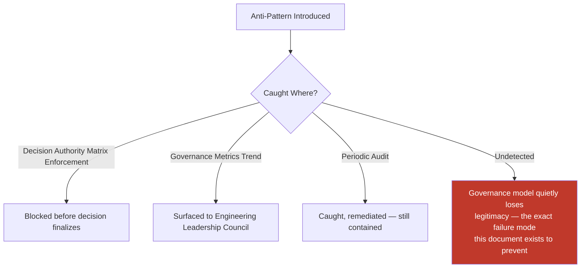

---

# Engineering Review Checklist

Every decision, escalation, exception, or delegation is checked against the following before it is considered governance-compliant:

- [ ] **Correctly classified** — The decision matches exactly one of the ten categories in Decision Classification above.
- [ ] **Correct authority engaged** — Proposer, Reviewer, Approver, Informed, and Implementation Owner match the Decision Authority Matrix exactly.
- [ ] **Lowest Competent Decision Maker respected** — The decision was made at the lowest level genuinely competent to make it, neither over- nor under-escalated.
- [ ] **Evidence-based** — The decision is grounded in demonstrable evidence, never seniority or confidence alone.
- [ ] **Documented before finalized** — Context, options, and trade-offs were written down before the decision was locked in, per Document Before Deciding.
- [ ] **ADR filed where required** — Every Strategic, Architectural, Compliance, and Emergency-classification decision has a corresponding ADR, per `ai-docs/25-architecture-decision-records.md`.
- [ ] **Delegation, if applicable, is explicit** — Recorded with delegator, delegate, scope, and duration; never assumed or verbal.
- [ ] **Escalation, if applicable, followed the correct path** — Per Escalation Process above, within its stated timing window.
- [ ] **Exception, if applicable, fully governed** — Risk documented, approval chain matched to tier, expiration date set, per Exception Governance above.
- [ ] **Accountable owner named** — A specific individual or board, never a diffuse "the team," per Accountability above.
- [ ] **Transparency satisfied** — Recorded in an ADR, the Decision Log, or a published meeting record, per Decision Transparency above.
- [ ] **AI-assisted analysis independently verified** — Any AI-surfaced claim fact-checked by a human before being relied upon, per AI-Assisted Governance above.
- [ ] **No anti-pattern present** — No decision by seniority alone, undocumented decision, shadow governance, permanent exception, decision paralysis, over-centralization, under-governance, or evidence-ignoring outcome.
- [ ] **No duplication of ADR, Code Review, Git Workflow, Development Workflow, Security, or Branching/Release standards** — Any such concern deferred entirely to its owning phase document, never redefined here.

A decision, escalation, exception, or delegation failing any item above is not considered final until resolved — this checklist carries the same non-negotiable authority as every other review checklist established in the preceding twenty-nine phase documents.

---

# Relationship to Previous Standards

### Project Vision

`ai-docs/00-project-vision.md` establishes the Guiding Principles — Citizen dignity over commercial convenience, Long-term trust over short-term growth, Transparency over opacity — that this document's Governance Philosophy directly operationalizes into an organizational decision-making structure. Every tie-breaker `ai-docs/00-project-vision.md` names for an ambiguous decision is, in practice, applied through the authority structure this document defines.

### Engineering Principles

`ai-docs/02-engineering-principles.md` establishes the founding engineering culture — ownership, accountability, blameless postmortems, and the ADR concept's first introduction. This document is the organizational structure that culture requires to function at scale, and never redefines a single principle already established there.

### Architecture Principles

`ai-docs/03-system-architecture-principles.md` establishes the Architectural Review Process and the technical criteria a proposal is judged against. This document owns *who* sits on the board applying that process; it never redefines the criteria themselves.

### ADR Standards

`ai-docs/25-architecture-decision-records.md` owns the complete artifact-level discipline — template, numbering, lifecycle, review process for the document itself. This document owns the organizational authority that artifact records; the two meet exactly at the Approval Authority naming, never overlapping further.

### Development Workflow

`ai-docs/07-development-workflow.md` owns the Engineering Lifecycle, the Architecture Review Workflow's process steps, and the Incident Response Workflow's procedural sequence. This document names the roles and authority those workflows assume exist, without redefining a single workflow step.

### Code Review Standards

`ai-docs/26-code-review-standards.md` owns the complete human review process for an individual pull request. This document governs authority above that level — cross-team, cross-domain, and organization-wide decisions a single PR's review cannot resolve.

### Dependency Governance

`ai-docs/28-dependency-governance-standards.md` owns the complete dependency-specific governance charter — Evaluation Criteria, Risk Classification, the Dependency Governance Register. This document's general Exception Governance, Escalation Process, and Decision Authority Matrix are the template that document's dependency-specific instances were built following; neither redefines the other.

### Branching & Release Strategy

`ai-docs/27-branching-release-strategy.md` owns Release Ownership and the Release Governance Board's release-specific mechanics. This document names the Release Governance Board as one of Arwal's standing Governance Boards, without redefining its release-specific process.

### Future Engineering Handbook

This document is the thirtieth chapter of the Engineering Handbook, and it is the chapter every other chapter's authority claims ultimately resolve to — "who approved this," asked of any standard in Phases 2 through 29, is answered by tracing back through the Decision Authority Matrix this document defines.

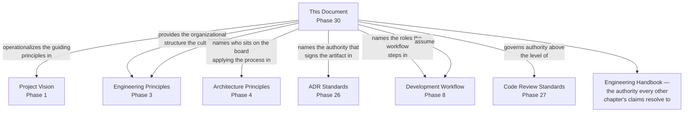

---

# Closing Statement

> **Callout — Closing Statement**
> Every preceding phase document described a standard Arwal holds itself to. This document describes who has the authority to hold it — and, just as importantly, who is accountable when a standard is bent, broken, or found wanting. A governance model is not a constraint on engineering excellence; it is the precondition for excellence surviving contact with scale. A five-person team can be excellent through shared instinct alone; a five-hundred-person organization, spanning a Platform team, a Security team, an SRE team, and dozens of product teams, can only be excellent through a decision-making system deliberate enough that the right person, with the right context, makes the right call at the right level — every time, not merely when the stars align. For a district's citizens depending on Arwal for a booking, a payment, and a government application, the governance behind that dependency is invisible, exactly as a well-run engineering organization should be — and its invisibility, sustained across years of growth, thousands of decisions, and inevitable disagreement resolved with evidence and respect rather than seniority and politics, is exactly the point. Where a future phase must deviate from a standard stated here, that deviation is made explicitly — through this document's own Escalation Process, or a Strategic-classification ADR where the deviation is structural — never silently, and never by default.

This document, `ai-docs/29-engineering-governance-decision-authority.md`, is Phase 30 of approximately 300. Every decision proposed, reviewed, approved, escalated, and recorded in the phases that follow is expected to satisfy the standards defined here, or to justify its deviation in writing.

**End of Phase 30 — `ai-docs/29-engineering-governance-decision-authority.md`**