# Engineering Risk Management Standards

**Document:** `ai-docs/30-engineering-risk-management-standards.md`
**Project:** Arwal — The District Super App
**Stage:** 1 — Foundation
**Phase:** 31 — Engineering Risk Management Standards
**Status:** Approved for Engineering Reference
**Audience:** CTO, Architecture Review Board, Platform Team, Security Team, SRE, Engineering Managers, Tech Leads, Developers, QA, Product Managers, Government Technical Partners

> **Callout — Purpose of This Document**
> `ai-docs/00-project-vision.md` through `ai-docs/29-engineering-governance-decision-authority.md` defined why Arwal exists and every enforceable discipline governing how it is designed, written, secured, tested, deployed, observed, logged, configured, documented, decided upon, reviewed, branched, released, and depended upon. None of those documents, individually, answers a question that sits above all of them: **what could go wrong, how likely is it, how bad would it be, and who is watching for it before it happens?** This document is Arwal's engineering risk management charter — the discipline that makes uncertainty itself a governed, visible, owned engineering concern, for every one of the ~300 micro-phases still ahead.

---

# Purpose of this Document

### Why Engineering Risk Management Exists

Every standard in this handbook describes how Arwal should be built when things go according to plan. Risk management exists for the discipline of reasoning, deliberately and in advance, about the ways things might *not* go according to plan — a dependency quietly going unmaintained, a database approaching a scaling ceiling nobody flagged, a single engineer holding undocumented knowledge of a critical subsystem, a government-integration deadline colliding with an unfinished compliance requirement. None of these are incidents yet. Each is a **risk**: a condition that, left unmanaged, has a meaningful chance of becoming an incident, a security breach, a missed commitment, or a silent erosion of the system's integrity. Risk management is what lets Arwal see these conditions while they are still cheap to address, rather than discovering them only once they have already become expensive.

### Risk vs. Incident

The distinction is precise and load-bearing, mirroring the identical precision `ai-docs/20-error-handling-standards.md` applies to Error vs. Exception vs. Failure vs. Incident:

| Term | Definition | Arwal Example |
|---|---|---|
| **Risk** | A condition or uncertainty that has not yet materialized, but carries a non-trivial probability of causing harm if left unaddressed. | "Our primary payment gateway has no contractually committed fallback provider." |
| **Issue** | A risk that has begun to manifest in a limited, contained way, short of a full incident. | "Payment gateway latency has crept up 15% over the last month, still within SLO." |
| **Incident** | A risk that has fully materialized into citizen-facing or system-facing harm, governed entirely by the Incident Response Workflow already established in `ai-docs/07-development-workflow.md` and `ai-docs/10-security-standards.md`. | "The payment gateway is down platform-wide." |

Risk management's job is to keep the population of *risks* small, visible, and owned — so that the population of *incidents* Arwal actually experiences is smaller than it would otherwise be, and less surprising when it does occur. This document governs the first two rows of that table; it explicitly does not redefine the third, which remains entirely the domain of the Incident Response Workflow and the Security Incident Response process already established elsewhere in this handbook.

### Proactive vs. Reactive Engineering

An engineering organization that only ever responds to incidents is, by definition, always one step behind — every lesson is paid for in citizen-facing harm before it is learned. Per the Shift Left philosophy already established in `ai-docs/15-testing-standards.md` and `ai-docs/20-error-handling-standards.md`, risk management is the organizational expression of that same shift, applied above the level of an individual defect: a risk identified, assessed, and mitigated in a quarterly review costs a conversation and a tracked action item; the same risk discovered as an incident costs an outage, a postmortem, and — per the North Star Principle already established in `ai-docs/00-project-vision.md` — a measurable dent in citizen trust. Proactive risk management is not a tax on engineering velocity; it is what keeps velocity from being periodically and unpredictably interrupted by preventable emergencies.

### Organizational Resilience

Arwal's roadmap anticipates a team scaling from a handful of founding engineers to hundreds, organized across Platform, Security, SRE, and dozens of product teams, per the identical organizational trajectory already established in `ai-docs/29-engineering-governance-decision-authority.md`. An organization of that size cannot rely on a handful of senior engineers' tacit sense of "what feels risky" — that instinct does not scale, does not transfer to a new hire, and does not survive its holders' eventual departure. A formal risk management discipline is what lets Arwal's collective risk awareness scale with the organization itself, rather than being bottlenecked by a small number of people who happen to remember what almost went wrong three years ago.

### Long-Term Sustainability

Per the Continuous Refactoring Budget commitment already established in `ai-docs/00-project-vision.md` and the Technical Debt Policy in `ai-docs/02-engineering-principles.md`, Arwal already treats certain classes of accumulating cost — technical debt, dependency drift — as governed, budgeted concerns rather than ignored liabilities. Risk management generalizes that same discipline to *every* category of engineering uncertainty, not only code-level debt: a risk register that has been actively maintained for years is a primary input into Arwal's ability to survive a decade of growth, technology shifts, and team turnover without a catastrophic, avoidable surprise.

### Relationship with Engineering Principles

`ai-docs/02-engineering-principles.md` already establishes the Technical Debt Policy — tracked, budgeted, never silent — as the founding discipline for one specific category of risk (code-quality debt). This document generalizes that same "never silent" discipline across every category of engineering risk, per Engineering Risk Categories below, without redefining the Technical Debt Policy's own mechanics.

### Relationship with Security Standards

`ai-docs/10-security-standards.md` already owns the complete, enforceable security control set, the security-specific threat model, and the security Incident Response process. This document does not redefine any security control, any encryption standard, or any security incident procedure — it defines the general risk-management framework that a *security risk* (one of several categories below) flows through before it either resolves, escalates into `ai-docs/10-security-standards.md`'s Incident Response, or is formally accepted.

### Relationship with Testing Standards

`ai-docs/15-testing-standards.md` already owns the complete discipline for verifying that a specific piece of code behaves correctly. This document does not redefine a single testing standard — it treats "insufficient test coverage in a specific high-risk domain" as one *instance* of a Technical or Reliability risk, tracked and escalated through this document's framework, with the actual remediation (writing the tests) governed entirely by `ai-docs/15-testing-standards.md`.

### Relationship with Observability Standards

`ai-docs/18-observability-standards.md` already owns metrics, traces, dashboards, alerting, and SLI/SLO mechanics — the tooling that detects a problem *as it is happening*. This document's Risk Monitoring section defines the complementary, longer-horizon discipline of watching *leading indicators* that a problem may be forming, before it ever trips an observability alert — this document never redefines a metric, a dashboard, or an alert rule already governed there.

### Relationship with Engineering Governance

`ai-docs/29-engineering-governance-decision-authority.md` already owns the complete organizational decision-authority structure — who proposes, reviews, approves, and escalates a *decision*. This document's Risk Ownership, Risk Escalation, and Risk Acceptance sections are built directly on top of that same authority structure, extended specifically to the act of accepting or mitigating a *risk* rather than approving a *decision* — the two documents share governance boards and escalation tiers by design, never duplicating them.

---

# Risk Management Philosophy

Arwal's risk management discipline rests on eight commitments. Together they answer the question every subsequent section of this document exists to make concrete: **what makes a risk management practice actually reduce harm, rather than merely produce paperwork?**

### Prevention Over Recovery

A risk mitigated before it materializes is categorically cheaper than the same risk recovered from after it becomes an incident — mirroring the identical Shift Left reasoning already established in `ai-docs/15-testing-standards.md` and `ai-docs/17-cicd-standards.md`. This exists because recovery cost is not merely financial; it is measured in citizen trust (`ai-docs/00-project-vision.md`'s North Star Principle), which does not rebuild at the same rate it erodes.

### Risk Proportionality

The rigor applied to identifying, assessing, and mitigating a risk scales with its potential impact and likelihood — never applied uniformly regardless of scale, mirroring the identical Proportional Rigor principle already established throughout `ai-docs/02-engineering-principles.md`, `ai-docs/07-development-workflow.md`, and `ai-docs/28-dependency-governance-standards.md`. This exists because treating a Low-tier risk with Critical-tier ceremony wastes scarce attention that a genuinely Critical risk needs, and a risk process too heavy to actually use for routine work will simply not be used at all.

### Evidence-Based Assessment

A risk's likelihood and impact are estimated from demonstrable evidence — a historical incident pattern, a measured trend, a documented industry precedent — never from unexamined intuition alone, mirroring the identical Evidence over Prediction principle already established in `ai-docs/03-system-architecture-principles.md` and `ai-docs/25-architecture-decision-records.md`'s Decision Quality Standards. This exists because an assessment built on confidence rather than evidence produces exactly the miscalibration (over-worrying about vivid but improbable risks, under-worrying about mundane but likely ones) that makes a risk register untrustworthy.

### Continuous Monitoring

A risk's status is never assessed once and left static — its likelihood, impact, and mitigation progress are re-evaluated on a defined cadence for as long as the risk remains open, mirroring the identical Continuous Verification principle already established across `ai-docs/10-security-standards.md`, `ai-docs/18-observability-standards.md`, and `ai-docs/28-dependency-governance-standards.md`. This exists because a risk's shape changes over time — a dependency that was merely aging six months ago may be genuinely abandoned today — and a risk register that only reflects the moment a risk was first logged is a stale, misleading artifact.

### Shared Visibility

Every risk of Medium classification or above is visible to every engineer who might reasonably be affected by it, recorded in a citable, permanent location, per the identical Transparency principle already established in `ai-docs/00-project-vision.md` and `ai-docs/29-engineering-governance-decision-authority.md`. This exists because a risk known only to the person who identified it is, functionally, still an unmanaged risk — visibility is what allows a second engineer to notice a connection, a mitigation opportunity, or an underestimated severity the original identifier could not see alone.

### Named Ownership

Every risk has exactly one named, accountable owner, never a diffuse "the team" — restating and applying the identical Accountability principle already established in `ai-docs/02-engineering-principles.md`'s Engineering Excellence definition and `ai-docs/29-engineering-governance-decision-authority.md`'s Accountability section. This exists because an unowned risk is a risk nobody is actually tracking, regardless of how carefully it was documented at the moment it was logged.

### Early Mitigation

A risk is addressed at the earliest point its cost of mitigation is lowest, never deferred until circumstance forces action — mirroring the identical Fail Fast principle already established in `ai-docs/20-error-handling-standards.md`, applied here at the level of organizational planning rather than a single request. This exists because the cost of mitigating most engineering risks grows over time (a small architectural correction becomes a multi-quarter migration if deferred long enough), and early mitigation is almost always the cheapest mitigation available.

### Continuous Improvement

Arwal's risk management practice itself — its categories, its thresholds, its review cadence — is periodically re-evaluated and improved based on what Arwal actually learns from the risks it tracks, per the identical Continuous Improvement discipline already established for retrospectives in `ai-docs/07-development-workflow.md`. This exists because a risk framework designed once, in Phase 31, and never revisited will drift out of fit with Arwal's actual risk profile as the system, the team, and the threat landscape all evolve.

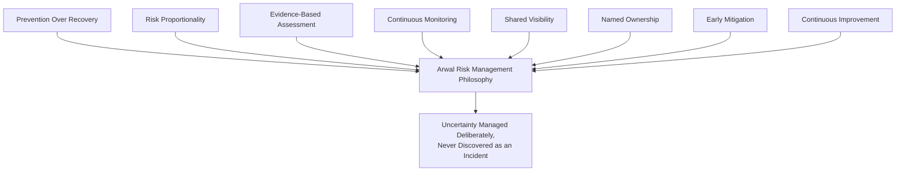

> **Callout — The One-Sentence Risk Management Philosophy**
> *"A risk written down, owned, and watched is a problem Arwal is already solving; a risk nobody wrote down is an incident Arwal simply hasn't had yet."*

---

# Engineering Risk Categories

Every engineering risk at Arwal belongs to exactly one of eighteen categories. Classification determines typical ownership, escalation path, and which of this handbook's other governing documents ultimately owns the remediation mechanics.

### Strategic Risk

**Definition:** A risk to Arwal's multi-year technical direction or its ability to fulfill `ai-docs/00-project-vision.md`'s founding commitments.
**Examples:** Betting on an architectural approach that does not scale to the 1,000,000+ user target; a technology choice that becomes a long-term liability.
**Potential Impact:** Multi-quarter remediation cost; erosion of the platform's founding trust commitments.
**Typical Owner:** CTO, Principal Engineers, per `ai-docs/29-engineering-governance-decision-authority.md`'s Strategic classification.

### Architecture Risk

**Definition:** A risk that a structural boundary, pattern, or dependency direction will not hold as the system grows.
**Examples:** A module boundary quietly eroding under delivery pressure; a premature or overdue service extraction, per the Migration Strategy in `ai-docs/03-system-architecture-principles.md`.
**Potential Impact:** Compounding coupling, harder future extraction, degraded team independence.
**Typical Owner:** Architecture Review Board.

### Technical Risk

**Definition:** A risk localized to a specific implementation, pattern, or technology choice within an already-set architecture.
**Examples:** A brittle, undertested module; a technology adopted without full evaluation, per `ai-docs/22-dependency-management-standards.md`.
**Potential Impact:** Localized defect rate increase; a costly rewrite of one module.
**Typical Owner:** Tech Lead of the affected domain.

### Security Risk

**Definition:** A condition that increases the likelihood or impact of a security compromise, distinct from an active incident already governed by `ai-docs/10-security-standards.md`.
**Examples:** An unpatched dependency with a known but not-yet-exploited CVE; a service with excessive standing privilege.
**Potential Impact:** Data breach, citizen harm, regulatory exposure.
**Typical Owner:** Security Team.

### Operational Risk

**Definition:** A risk arising from how an already-built system is run day to day.
**Examples:** A manual deployment step not yet automated; an under-rehearsed rollback procedure.
**Potential Impact:** Slower or error-prone incident response; avoidable downtime.
**Typical Owner:** SRE, DevOps/Platform Lead.

### Infrastructure Risk

**Definition:** A risk in the provisioned infrastructure or its topology.
**Examples:** A single-region deployment with no tested cross-region recovery path, per `ai-docs/16-deployment-standards.md`; an under-provisioned resource approaching capacity.
**Potential Impact:** Regional outage, capacity-driven degradation.
**Typical Owner:** Platform Team.

### Performance Risk

**Definition:** A risk that a system component will not meet its latency, throughput, or resource-efficiency targets under real load.
**Examples:** An unindexed query pattern discovered only at scale; a component never load-tested against `ai-docs/11-performance-standards.md`'s targets.
**Potential Impact:** Citizen-facing latency regression, SLO breach.
**Typical Owner:** SRE + the affected domain's Tech Lead.

### Scalability Risk

**Definition:** A risk that a system's current design will not absorb anticipated future growth.
**Examples:** A data model without a partition key ready for the district → ward → zone strategy in `ai-docs/14-database-design-guidelines.md`; a synchronous dependency chain that will not tolerate 10x traffic.
**Potential Impact:** A citizen-facing surge outpaces the platform's ability to serve it.
**Typical Owner:** Architecture Review Board, SRE.

### Reliability Risk

**Definition:** A risk that a system will fail to behave predictably under both expected and unexpected conditions.
**Examples:** A non-idempotent operation reachable via client retry; a missing circuit breaker on a critical external dependency, per `ai-docs/20-error-handling-standards.md`.
**Potential Impact:** Duplicate charges, cascading failure, citizen-facing errors.
**Typical Owner:** SRE, the affected domain's Tech Lead.

### Availability Risk

**Definition:** A risk to a citizen-critical flow's uptime.
**Examples:** A single point of failure in an otherwise redundant architecture; an unmonitored dependency with no fallback.
**Potential Impact:** Downtime on a citizen-critical flow, breaching the uptime target in `ai-docs/01-product-goals.md`.
**Typical Owner:** SRE.

### Compliance Risk

**Definition:** A risk that Arwal fails to satisfy a legal, regulatory, or government-partnership obligation.
**Examples:** A data-residency commitment not yet technically enforced; a retention policy gap relative to a government audit requirement.
**Potential Impact:** Regulatory penalty, loss of government partnership, per `ai-docs/01-product-goals.md`'s Government Coordination Risk.
**Typical Owner:** Architecture Review Board + Legal/Compliance.

### Dependency Risk

**Definition:** A risk arising from Arwal's reliance on a third-party package, governed operationally by `ai-docs/22-dependency-management-standards.md` and `ai-docs/28-dependency-governance-standards.md`.
**Examples:** A Critical-tier dependency with a single, unresponsive maintainer.
**Potential Impact:** Supply-chain compromise, unplanned migration cost.
**Typical Owner:** The named dependency sponsor, per `ai-docs/28-dependency-governance-standards.md`.

### Vendor Risk

**Definition:** A risk arising from reliance on an external, contracted service provider (a cloud provider, a payment gateway, a managed database).
**Examples:** A single-vendor dependency with no evaluated exit path, per the Vendor Lock-In Considerations in `ai-docs/09-tech-stack.md`.
**Potential Impact:** Service disruption outside Arwal's direct control, unfavorable pricing/contract leverage.
**Typical Owner:** Platform Team, Engineering Leadership.

### Third-Party Integration Risk

**Definition:** A risk specific to a government API, SMS provider, or other external system Arwal integrates with, per the Third-Party Service Policy in `ai-docs/09-tech-stack.md`.
**Examples:** A government API with no documented SLA; an integration with no tested fallback.
**Potential Impact:** A citizen-facing civic flow degraded by a partner's own outage.
**Typical Owner:** The owning domain's Tech Lead, Product.

### Data Risk

**Definition:** A risk to the integrity, availability, or classification-appropriate handling of Arwal's data.
**Examples:** A schema without a tested backup-restoration path, per `ai-docs/14-database-design-guidelines.md`; data classified incorrectly relative to `ai-docs/10-security-standards.md`.
**Potential Impact:** Data loss, data corruption, or inappropriate exposure of sensitive citizen data.
**Typical Owner:** Backend Platform Team, Security Team.

### AI Risk

**Definition:** A risk specific to Arwal's AI-assisted or AI-powered capabilities, per the AI Vision and AI Principle in `ai-docs/00-project-vision.md`.
**Examples:** An AI Gateway Service capability without a human-override path; an under-evaluated model provider's data-handling practices.
**Potential Impact:** A citizen denied a service by an unreviewable automated decision; a provider-side data-handling violation.
**Typical Owner:** The AI Gateway Service's owning team, Security Team.

### Human Process Risk

**Definition:** A risk arising from how engineering work itself is organized and executed, distinct from the code or infrastructure it produces.
**Examples:** A review process being routinely rubber-stamped, per the Anti-Patterns already named in `ai-docs/26-code-review-standards.md`; an on-call rotation with insufficient depth.
**Potential Impact:** Quality erosion, burnout-driven attrition, slower incident response.
**Typical Owner:** Engineering Managers.

### Knowledge Risk

**Definition:** A risk that critical understanding of a system exists in too few people's heads, per the Documentation Before Tribal Knowledge principle already established in `ai-docs/24-documentation-standards.md`.
**Examples:** A module with a single, undocumented owning engineer; an ADR-worthy decision never actually recorded.
**Potential Impact:** A single departure making a system unmaintainable or a decision unexplainable.
**Typical Owner:** Engineering Managers, the affected domain's Tech Lead.

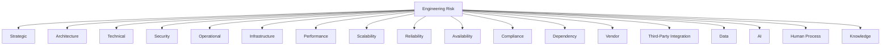

---

# Risk Classification

Every risk is assigned exactly one classification level, re-assessed whenever material new evidence emerges.

| Level | Likelihood | Business Impact | Engineering Impact | Review Frequency | Escalation Level | Approval Authority |
|---|---|---|---|---|---|---|
| **Low** | Unlikely within the next 12 months | Minor, localized, easily absorbed | A single team, low remediation cost | Semi-annually | Tech Lead | Tech Lead |
| **Medium** | Plausible within 6–12 months | Noticeable, contained to one domain or citizen flow | Cross-function coordination, moderate cost | Quarterly | Engineering Manager | Engineering Manager |
| **High** | Likely within 3–6 months, or already showing early signal | Significant citizen-facing or financial impact if realized | Multi-team, meaningful remediation cost | Monthly | Architecture/Security Review Board | Architecture Review Board or Security Review Board, per category |
| **Critical** | Imminent, or actively trending toward materializing | Platform-wide citizen impact, regulatory, or existential | Organization-wide, high remediation cost or urgency | Continuous (standing watch) | Engineering Leadership Council / CTO | CTO, Engineering Leadership Council |

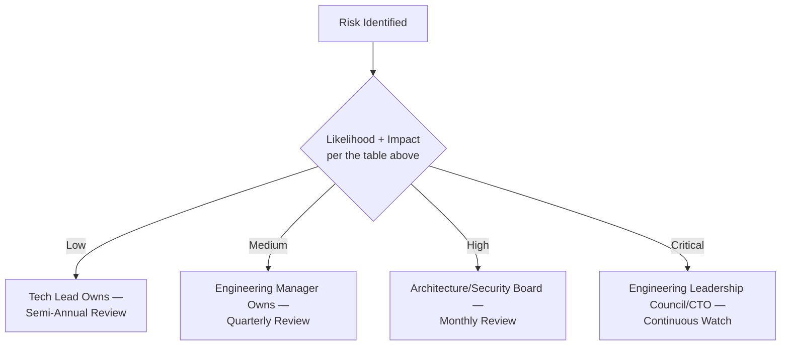

---

# Risk Assessment Framework

### Dimensions

| Dimension | Definition | Scored |
|---|---|---|
| **Probability** | The likelihood the risk materializes within a defined horizon. | 1 (rare) – 5 (near-certain) |
| **Impact** | The severity of consequence if the risk materializes — citizen harm, financial cost, regulatory exposure, engineering disruption. | 1 (negligible) – 5 (severe) |
| **Detectability** | How likely Arwal is to notice the risk materializing before it causes significant harm. | 1 (immediately obvious) – 5 (silent, hard to detect) — a *higher* detectability score means *worse* visibility, and raises overall priority. |
| **Exposure** | The breadth of the system, citizen base, or team affected if the risk materializes. | 1 (narrow) – 5 (platform-wide) |

### Risk Score

```
Risk Score = Probability × Impact × (1 + (Detectability / 10)) × (1 + (Exposure / 10))
```

Detectability and Exposure act as multipliers on the base Probability × Impact score — a risk that is hard to detect or broad in exposure is prioritized higher than an equally probable, equally impactful risk that is easy to see coming and narrowly scoped.

### Risk Matrix

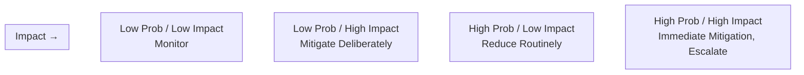

| | **Impact: Low** | **Impact: Medium** | **Impact: High** | **Impact: Severe** |
|---|---|---|---|---|
| **Probability: Rare** | Low | Low | Medium | Medium |
| **Probability: Unlikely** | Low | Medium | Medium | High |
| **Probability: Possible** | Medium | Medium | High | High |
| **Probability: Likely** | Medium | High | High | Critical |
| **Probability: Near-Certain** | High | High | Critical | Critical |

### Priority Calculation

Priority within a classification tier is determined by Risk Score, breaking ties by Exposure (broader exposure prioritized first) and then by Detectability (harder-to-detect risks prioritized first) — never by recency of identification alone, per Evidence-Based Assessment above.

### Residual Risk

After a mitigation is applied, the risk is re-scored to determine its **residual risk** — the risk that remains after mitigation, never assumed to be zero. A mitigation that reduces a risk's classification tier (e.g., from High to Medium) is recorded as such in the Risk Register, with the residual risk explicitly re-assessed, never silently assumed fully resolved merely because a mitigating action was taken.

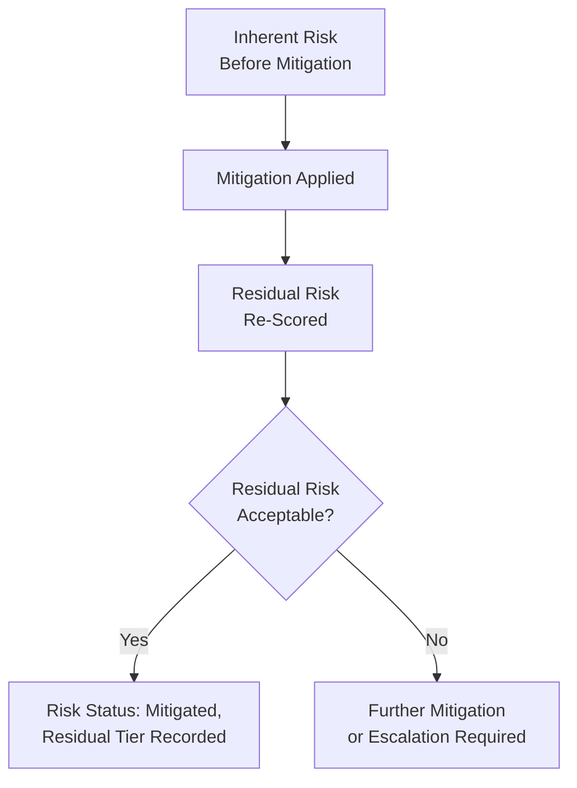

---

# Risk Register

The Risk Register is Arwal's single, authoritative, version-controlled record of every tracked engineering risk, per the identical Single Source of Truth principle already established throughout this handbook. It lives at `docs/risk-register/` (or an equivalent tracked system integrated with the Engineering Handbook, per `ai-docs/24-documentation-standards.md`'s Repository Documentation Structure), reviewed with the identical Documentation Is Code rigor already established there.

| Field | Description |
|---|---|
| **Risk ID** | A permanent, sequential, zero-padded identifier (`RISK-0001`), never reused, mirroring the Immutable Numbers principle already established for ADRs in `ai-docs/25-architecture-decision-records.md`. |
| **Description** | A precise, specific statement of the risk — what condition exists, and what could happen if it is not addressed. |
| **Category** | One of the eighteen categories in Engineering Risk Categories above. |
| **Owner** | A named individual, per Named Ownership above — never a team alone. |
| **Likelihood** | Per the Probability dimension in Risk Assessment Framework above. |
| **Impact** | Per the Impact dimension above. |
| **Risk Score / Tier** | The computed score and resulting Low/Medium/High/Critical classification. |
| **Mitigation** | The specific, planned or in-progress action(s) reducing the risk, with an owner and target date. |
| **Status** | `Identified` / `Assessed` / `Mitigating` / `Monitoring` / `Accepted` / `Closed` / `Retired`, per Risk Lifecycle below. |
| **Review Date** | The next scheduled re-assessment date, per the cadence in Risk Classification above. |
| **Retirement Criteria** | The specific, observable condition under which the risk is considered fully retired — never left ambiguous. |

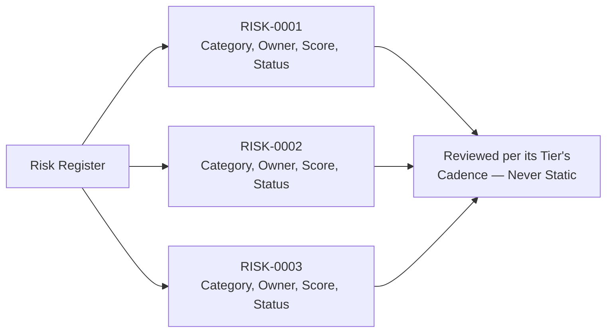

---

# Risk Ownership

| Role | Ownership Responsibility |
|---|---|
| **CTO** | Final accountability for Critical-tier and Strategic-category risk; chairs the Critical risk standing review. |
| **Architecture Review Board** | Owns Architecture- and Scalability-category risk assessment and mitigation sign-off, per `ai-docs/29-engineering-governance-decision-authority.md`. |
| **Platform Team** | Owns Infrastructure, Vendor, and cross-team Operational risk. |
| **Security Team** | Owns Security, Compliance (jointly with Legal), and AI-category risk assessment. |
| **SRE** | Owns Availability, Reliability, and Performance risk; maintains the leading-indicator monitoring in Risk Monitoring below. |
| **Engineering Managers** | Own Human Process and Knowledge risk within their teams; escalate any risk their team cannot mitigate independently. |
| **Tech Leads** | Own Technical and domain-scoped Dependency/Third-Party Integration risk within their module. |
| **Developers** | Identify and report risk at the point of discovery; own a Low-tier risk within their own current work once assigned. |
| **QA** | Owns risk related to test coverage gaps and release-readiness confidence, feeding Reliability and Technical risk assessment. |
| **Product Managers** | Own risk arising from scope, timeline, or prioritization trade-offs that create engineering exposure — jointly with the affected Tech Lead. |

---

# Risk Lifecycle

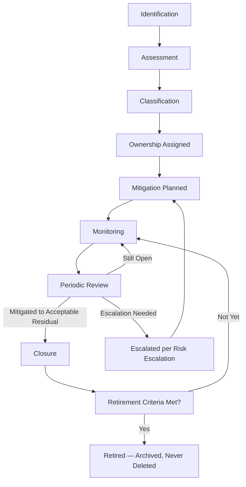

### Stage Definitions

| Stage | Meaning | Exit Criteria |
|---|---|---|
| **Identification** | A risk is first surfaced — by any engineer, an automated scan (`ai-docs/17-cicd-standards.md`'s DevSecOps stages), or a periodic review. | Logged in the Risk Register with an initial description. |
| **Assessment** | The risk is scored per the Risk Assessment Framework above. | Probability, Impact, Detectability, and Exposure are all scored with stated reasoning. |
| **Classification** | The computed score is mapped to Low/Medium/High/Critical. | Classification recorded, driving review cadence and escalation level. |
| **Ownership** | A named owner is assigned, per Risk Ownership above. | Owner explicitly confirmed, never assumed. |
| **Mitigation** | A concrete action plan — Avoid, Reduce, Transfer, Accept, or Monitor, per Risk Mitigation below — is defined and tracked. | Mitigation plan recorded with an owner and target date. |
| **Monitoring** | The risk's status and any leading indicators are actively watched per Risk Monitoring below. | Ongoing, for the life of the risk. |
| **Review** | The risk is re-assessed at its classification's defined cadence. | Score and status updated; classification re-confirmed or changed. |
| **Closure** | The risk's mitigation has reduced residual risk to an acceptable level. | Residual risk explicitly re-scored and confirmed acceptable. |
| **Retirement** | The risk's Retirement Criteria are met — the underlying condition no longer exists. | Retirement Criteria verified true; the risk is archived, never deleted, per the identical Archive Never Delete principle already established for ADRs. |

---

# Risk Mitigation

Every risk's mitigation strategy is one of five deliberate categories — never left ambiguous or implicit.

| Strategy | Definition | When Used |
|---|---|---|
| **Avoid** | Eliminate the risk entirely by not proceeding with, or fundamentally redesigning, the condition that creates it. | The risk's potential impact is severe enough, and no acceptable mitigation exists, that the underlying approach itself must change. |
| **Reduce** | Lower the risk's probability or impact through a specific engineering action. | The most common strategy — adding a test, a fallback, a redundant instance, a documented runbook. |
| **Transfer** | Shift some or all of the risk's consequence to a third party — an insurance mechanism, a vendor SLA, a contractual indemnity. | The risk is genuinely outside Arwal's direct engineering control (e.g., a Vendor risk) but can be contractually bounded. |
| **Accept** | Consciously choose not to further mitigate, per the explicit governance in Risk Acceptance below. | The cost of further mitigation exceeds the risk's residual impact, and an accountable party formally accepts the remaining exposure. |
| **Monitor** | Take no immediate mitigating action, but actively watch for a change in the risk's likelihood or impact. | The risk is currently Low-tier and stable, but its trajectory is uncertain enough to warrant standing attention rather than dismissal. |

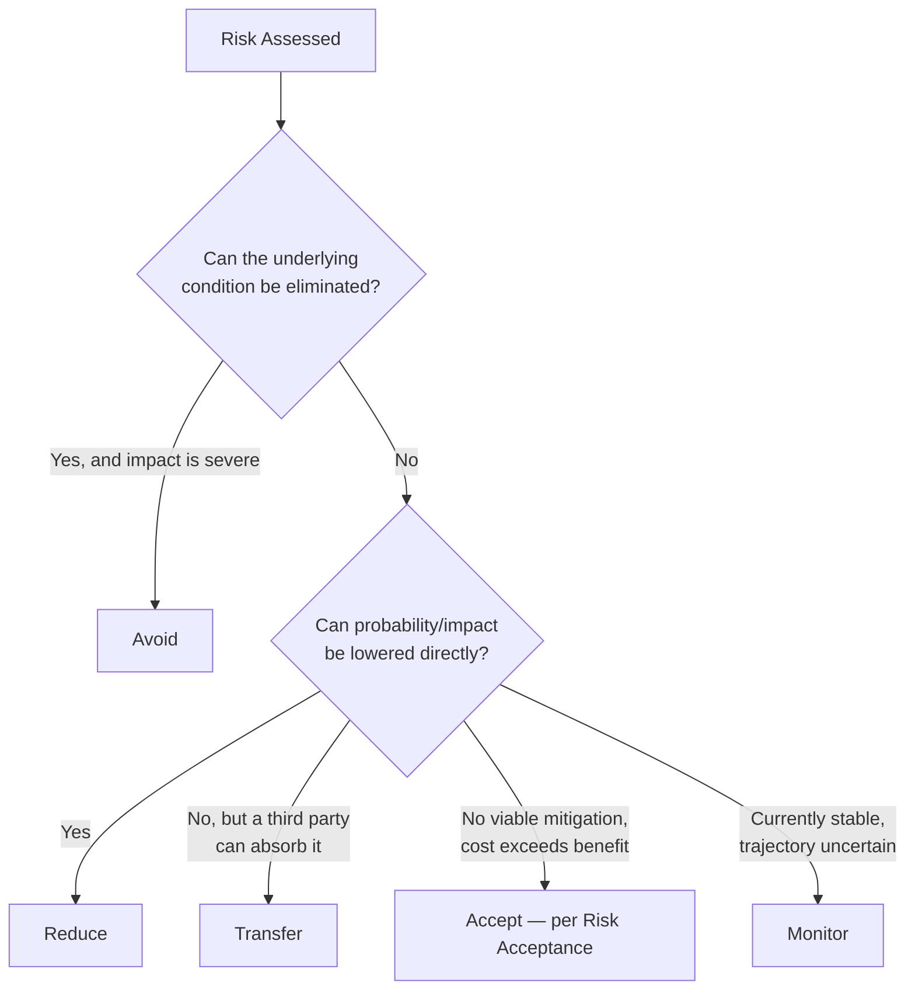

---

# Risk Acceptance

### When Acceptance Is Allowed

A risk may be formally accepted only where: (1) every viable mitigation has been genuinely evaluated and documented, (2) the cost of further mitigation is demonstrably disproportionate to the residual risk, and (3) an accountable party with authority matching the risk's classification explicitly signs off — mirroring the identical Exception Handling discipline already established in `ai-docs/28-dependency-governance-standards.md` and `ai-docs/29-engineering-governance-decision-authority.md`.

### Approval Chain

| Risk Tier | Required Acceptance Authority |
|---|---|
| Low | Tech Lead |
| Medium | Engineering Manager |
| High | Architecture Review Board or Security Review Board, per category |
| Critical | CTO, with Engineering Leadership Council informed |

### Conflict of Interest

An individual is never the sole approver of a risk acceptance where they are also the primary author of the condition creating the risk, or where accepting the risk materially benefits their own team's delivery timeline at another team's expense — per the identical Shared Authority discipline already established in `ai-docs/29-engineering-governance-decision-authority.md`. Where such a conflict exists, acceptance requires a second, independent approver at the same or a higher authority tier, and the conflict itself is explicitly noted in the Risk Register entry.

### Documentation

Every acceptance records: the risk it applies to, the specific reasoning for accepting rather than further mitigating, the accepting authority's name, and the expiration date below — identical in structure to the Exception Handling record already established in `ai-docs/28-dependency-governance-standards.md`.

### Time Limits

Every risk acceptance carries an explicit expiration date, never exceeding 6 months for a High or Critical-tier risk and never exceeding 12 months for a Low or Medium-tier risk, without a fresh re-approval.

### Periodic Review and Re-Approval

At its expiration date, an accepted risk is either: re-assessed and re-accepted with fresh, current reasoning; mitigated further, closing the acceptance; or escalated as an unresolved risk, per Risk Escalation below. An accepted risk is never permitted to lapse into silent, permanent, unreviewed acceptance — per the identical Permanent Exceptions anti-pattern already rejected in `ai-docs/29-engineering-governance-decision-authority.md`.

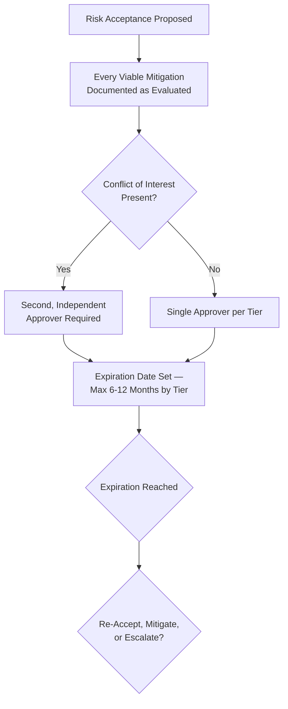

---

# Risk Escalation

### Escalation Triggers

| Trigger | Escalates To |
|---|---|
| **Critical-tier risk identified or newly re-classified as Critical** | CTO, Engineering Leadership Council — immediate. |
| **Cross-team risk** — no single team can mitigate alone | Engineering Leadership Council, per `ai-docs/29-engineering-governance-decision-authority.md`'s Cross-Team Disagreement path. |
| **Production risk** — a risk with a direct, plausible path to an active incident | SRE + the affected domain's Tech Lead, immediate; may pre-emptively engage the Incident Response Workflow's readiness posture per `ai-docs/07-development-workflow.md`, without itself being an incident. |
| **Architecture risk** — a risk implying an existing architectural boundary may not hold | Architecture Review Board. |
| **Security risk** — any risk with a plausible security consequence | Security Review Board, per `ai-docs/10-security-standards.md`'s Elevated Review requirement. |
| **Compliance risk** — any risk touching a regulatory or government-partnership obligation | Architecture Review Board + Legal/Compliance. |
| **Executive risk** — a risk whose potential impact is judged Strategic-classification mid-review | CTO / VP Engineering, per the identical Executive Escalation tier already established in `ai-docs/29-engineering-governance-decision-authority.md`. |

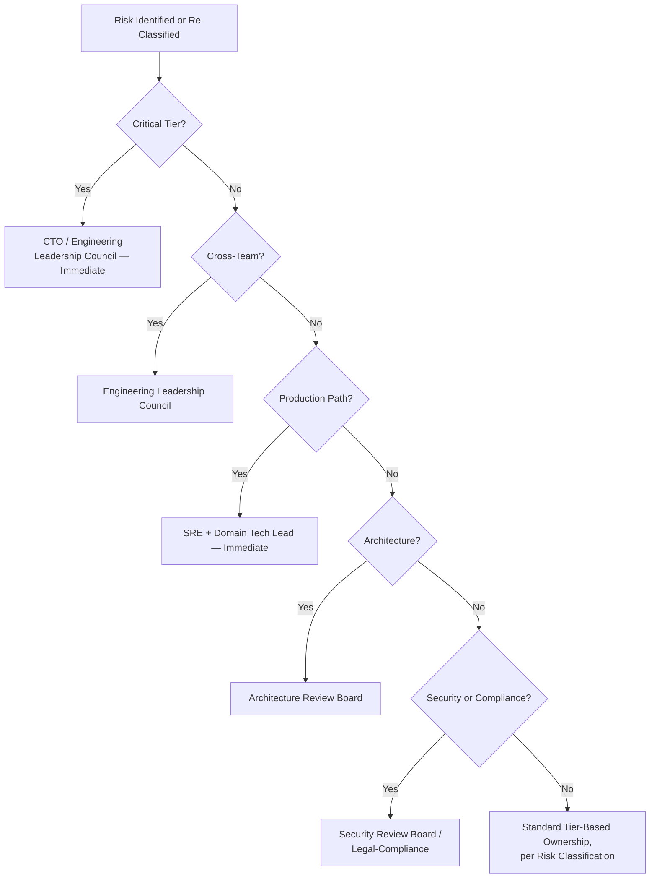

### Escalation Timing

Escalation timing mirrors the identical Escalation Timing table already established in `ai-docs/29-engineering-governance-decision-authority.md` — a Critical-tier risk escalation is immediate, never batched into a routine review cycle; a High-tier escalation resolves within the standing Architecture/Security Board's weekly cadence; Medium and Low-tier escalations follow their classification's defined review cadence in Risk Classification above.

---

# Risk Monitoring

### Key Performance Indicators (KPIs) and Key Risk Indicators (KRIs)

| Type | Definition | Example |
|---|---|---|
| **KPI** | A lagging measure of engineering health this document's risk practice ultimately protects. | Uptime, MTTR, escaped-defect rate. |
| **KRI (Key Risk Indicator)** | A leading measure that a specific risk is trending toward materializing, watched *before* it affects a KPI. | Dependency age trend (`ai-docs/22-dependency-management-standards.md`'s Average Dependency Age), connection-pool saturation trend (`ai-docs/18-observability-standards.md`'s USE metrics), review-coverage trend (`ai-docs/26-code-review-standards.md`). |

Risk Monitoring's distinguishing purpose is watching KRIs specifically — Observability Standards (`ai-docs/18-observability-standards.md`) already governs the real-time detection of a KPI breach; this document governs the longer-horizon discipline of noticing a KRI's trend *before* it becomes a KPI breach at all.

### Trend Analysis and Thresholds

Every tracked KRI has an explicit, documented threshold at which it converts from "monitored" to "actively flagged for reassessment" — a threshold set with the same Evidence-Based Assessment rigor already established above, never an arbitrary round number chosen for convenience.

### Review Cadence

Risk Monitoring's review cadence mirrors each risk's classification tier, per Risk Classification above — Low-tier risks are monitored passively and reviewed semi-annually; Critical-tier risks are under continuous, standing watch.

### Reporting and Dashboards

The Risk Register's aggregate state — open risk count by tier and category, KRI trend lines, and overdue reviews — is visualized on a dedicated dashboard, reviewed by the Engineering Leadership Council at the identical cadence already established for its standing meeting in `ai-docs/29-engineering-governance-decision-authority.md`, per the Dashboards as a First-Class Deliverable principle already established in `ai-docs/02-engineering-principles.md`.

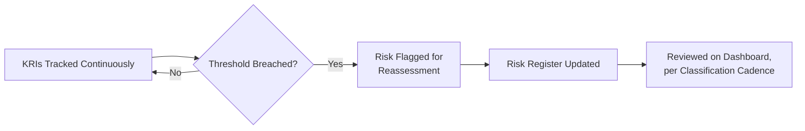

---

# Engineering Risk Metrics

Per the Actionable Metrics principle already established in `ai-docs/18-observability-standards.md`, every metric below ties to a real question the Engineering Leadership Council or a Governance Board will actually ask.

| Metric | Definition | What a Regression Signals |
|---|---|---|
| **Open risks** | Total count of currently open (non-Closed, non-Retired) risks, by tier. | A rising count without a corresponding rise in mitigation capacity signals the practice is falling behind its own identification rate. |
| **Critical risks** | Count of currently open Critical-tier risks. | Any sustained non-zero count is treated with the same urgency as an open Critical CVE in `ai-docs/22-dependency-management-standards.md`. |
| **Mean mitigation time** | Average time from a risk's Assessment to its Closure, per tier. | A rising trend signals mitigation capacity is under-resourced relative to the risk load. |
| **Risk age** | Time since a risk was first identified, for every still-open risk. | A growing population of old, unresolved risks signals Early Mitigation is not being honored in practice. |
| **Residual risk** | The aggregate distribution of residual risk scores across all mitigated-but-not-closed risks. | A cluster of high residual scores signals mitigations are being marked complete without genuinely reducing exposure. |
| **Repeated risks** | Count of risks that closely resemble a previously Closed or Retired risk. | A rising count signals a root-cause or systemic issue behind the recurring pattern is not actually being addressed. |
| **Accepted risks** | Count of currently active risk acceptances, by tier. | A growing count, especially at High/Critical tiers, signals mitigation is being deferred rather than pursued. |
| **Retired risks** | Count of risks reaching full Retirement in a given period. | A near-zero rate over a long window suggests risks are being closed prematurely rather than genuinely retired, or that Retirement Criteria are set unrealistically high. |
| **Risk trend** | The overall trajectory of total weighted risk score (sum of all open risks' Risk Scores) over time. | A sustained upward trend is the single most direct signal that Arwal's risk exposure is growing faster than its mitigation capacity. |

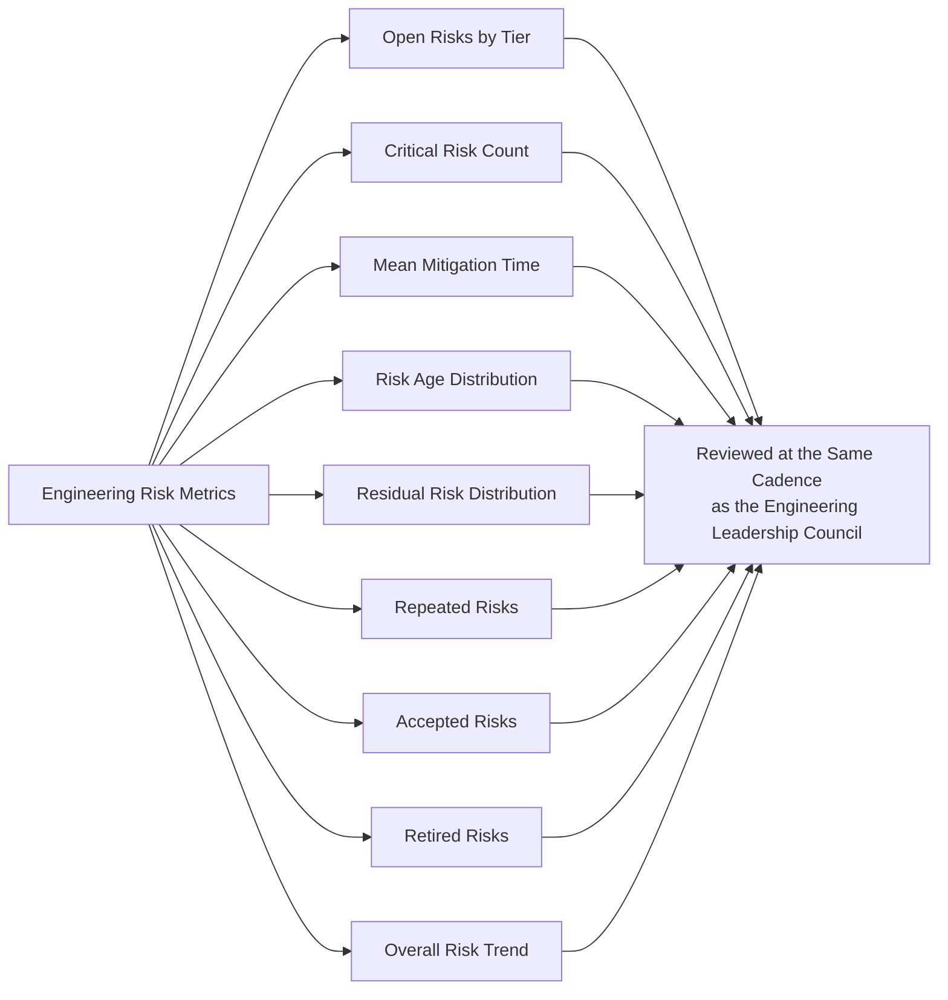

---

# AI-Assisted Risk Management

Consistent with the identical AI-assistance principle already established across `ai-docs/24-docs`, `ai-docs/25`, `ai-docs/26`, `ai-docs/27`, `ai-docs/28`, and `ai-docs/29-engineering-governance-decision-authority.md`: **AI accelerates identification and analysis, never accountability.**

### AI Risk Identification

An AI tool may scan commit history, dependency trends, incident postmortems, and observability data to surface a candidate risk a human has not yet logged — every such surfaced candidate is treated as a lead for a human to independently confirm and log, never auto-added to the Risk Register.

### AI Trend Analysis

An AI tool may analyze KRI trend lines (per Risk Monitoring above) and flag an emerging pattern before it crosses a defined threshold — this is a genuinely valuable early-warning capability, and every such flag is verified against the actual underlying data by the risk's owner before it changes the risk's classification or triggers escalation.

### AI Reporting

An AI tool may draft the Engineering Risk Metrics summary or a Risk Register status report for a governance board meeting — the draft is verified for accuracy by a human (typically the Engineering Manager or Governance Board chair) before it is presented, per the identical AI Meeting Summaries standard already established in `ai-docs/29-engineering-governance-decision-authority.md`.

### AI Recommendations

An AI tool may suggest a candidate mitigation strategy or a risk's likely classification tier — every such recommendation is a draft input to human deliberation, never a substitute for the Risk Assessment Framework's human-applied scoring.

### Human Verification

Any quantitative or qualitative claim an AI tool makes in support of a risk assessment — a cited precedent, a trend characterization, a comparison to a prior incident — is independently verified against the actual Risk Register, postmortem archive, or observability data before being relied upon.

### Human Ownership

The named human Owner in the Risk Register remains the full, accountable owner of every risk, regardless of how much AI assistance contributed to its identification, analysis, or reporting — identical to the Traceability principle already established in `ai-docs/06-git-workflow.md` and consistently extended across every governance document in this handbook. No risk is accepted, closed, or retired on the basis of an AI tool's assessment alone.

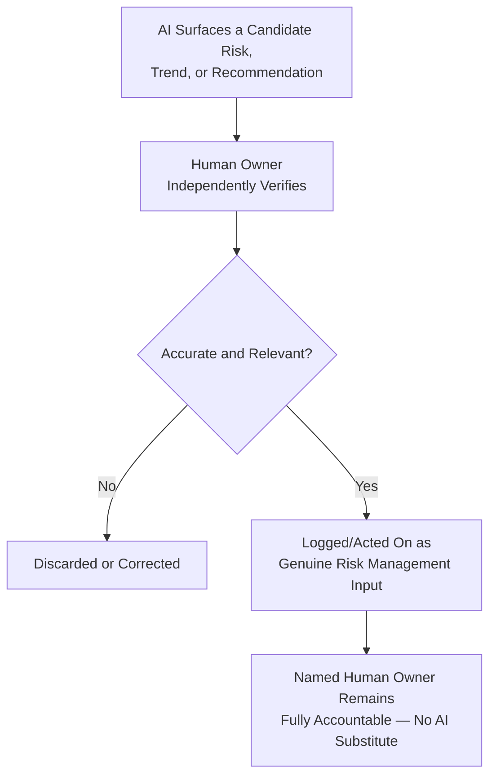

---

# Engineering Risk Anti-Patterns

The following patterns are explicitly rejected, regardless of how convenient they appear under deadline pressure — each is a specific, previously observed risk-management failure mode, called out here so Arwal does not have to relearn the lesson expensively at Phase 250.

| Anti-Pattern | Description | Why It's Rejected |
|---|---|---|
| **Ignoring Known Risks** | A logged, assessed risk left unmitigated with no active plan, "because nothing has gone wrong yet." | Violates Prevention Over Recovery above; a risk's silence is not evidence of its absence. |
| **Unknown Ownership** | A risk logged with no clearly assigned individual owner. | Violates Named Ownership above; an unowned risk is, in practice, an unmanaged one. |
| **Permanent Acceptance** | A risk acceptance granted once and never re-reviewed, effectively becoming a silent, indefinite exposure. | Violates the Time Limits and Periodic Review standards in Risk Acceptance above; mirrors the identical Permanent Exceptions anti-pattern already rejected in `ai-docs/29-engineering-governance-decision-authority.md`. |
| **No Monitoring** | A risk assessed once at identification and never revisited, regardless of classification tier. | Violates Continuous Monitoring above; a risk's shape changes over time, and a static assessment becomes misleading. |
| **Late Escalation** | A risk held at a lower tier's ownership far longer than its actual severity warrants, escalated only after it has already begun to manifest. | Violates Early Mitigation above and directly increases the eventual cost of addressing it. |
| **Hidden Risks** | A risk known informally to one or two engineers but never logged in the Risk Register. | Violates Shared Visibility above; recreates the exact tribal-knowledge failure mode already named throughout `ai-docs/24-documentation-standards.md` and `ai-docs/25-architecture-decision-records.md`. |
| **Optimism Bias** | A risk's likelihood or impact systematically underestimated because acknowledging it honestly would be inconvenient for a current delivery timeline. | Violates Evidence-Based Assessment above; the single fastest way for a risk register to become untrustworthy. |
| **Risk Without Documentation** | A mitigation decided upon and executed with no corresponding Risk Register entry explaining what was addressed and why. | Violates Document Before Deciding, the identical principle already established in `ai-docs/29-engineering-governance-decision-authority.md`; an undocumented mitigation cannot be verified, audited, or learned from later. |

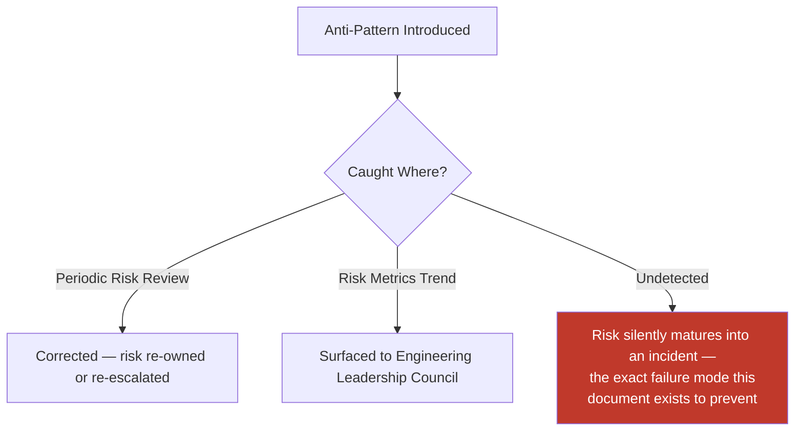

---

# Engineering Review Checklist

Every risk identified, assessed, mitigated, accepted, escalated, or retired is checked against the following before it is considered risk-management-compliant:

- [ ] **Correctly categorized** — The risk matches exactly one of the eighteen categories in Engineering Risk Categories above.
- [ ] **Scored per the Risk Assessment Framework** — Probability, Impact, Detectability, and Exposure all assessed with stated, evidence-based reasoning.
- [ ] **Correctly classified** — Low/Medium/High/Critical, matching the computed Risk Score.
- [ ] **Named owner assigned** — A specific individual, never a diffuse team, per Named Ownership.
- [ ] **Mitigation strategy explicit** — Avoid, Reduce, Transfer, Accept, or Monitor, per Risk Mitigation above, with a concrete plan.
- [ ] **Logged in the Risk Register** — Every required field populated, per Risk Register above.
- [ ] **Review cadence assigned** — Matching the risk's classification tier, per Risk Classification.
- [ ] **Escalation path correct, if applicable** — Matching the correct trigger in Risk Escalation above.
- [ ] **Acceptance properly governed, if applicable** — Approval chain matched to tier, conflict of interest checked, expiration date set, per Risk Acceptance.
- [ ] **Retirement Criteria defined** — A specific, observable condition, never left ambiguous.
- [ ] **Monitored, not static** — At least one leading indicator (KRI) identified where the risk category supports one, per Risk Monitoring.
- [ ] **AI-assisted analysis independently verified** — Any AI-surfaced claim fact-checked by the human owner before being relied upon.
- [ ] **No anti-pattern present** — No ignored risk, unknown ownership, permanent acceptance, unmonitored risk, late escalation, hidden risk, optimism bias, or undocumented mitigation.
- [ ] **No duplication of Security, Incident Management, Deployment, Observability, Testing, Governance, or ADR standards** — Any such concern deferred entirely to its owning phase document, never redefined here.

A risk entry failing any item above is not considered properly governed until resolved — this checklist carries the same non-negotiable authority as every other review checklist established in the preceding thirty phase documents.

---

# Relationship to Previous Standards

### Project Vision

`ai-docs/00-project-vision.md` establishes the North Star Principle and the founding Risk Register already sketched at a strategic level (Government Dependency Risk, Digital Literacy Risk, Trust-Building Risk, and others). This document is the complete, operational expansion of that founding sketch into a standing, organization-wide engineering discipline.

### Engineering Principles

`ai-docs/02-engineering-principles.md` establishes the Technical Debt Policy — the first, narrowest instance of risk management already present in this handbook. This document generalizes that same discipline (tracked, budgeted, never silent) across every category of engineering risk, never redefining the Technical Debt Policy's own specific mechanics.

### Architecture Principles

`ai-docs/03-system-architecture-principles.md` establishes Evidence over Prediction and the Migration Strategy's indicator-based discipline. This document's Architecture and Scalability risk categories are the standing, continuous version of that same evidence-gathering practice, feeding directly into the Migration Strategy's own decision process without redefining it.

### Security Standards

`ai-docs/10-security-standards.md` owns the complete, enforceable security control set and the security Incident Response process. This document never redefines a security control — it governs the discipline of tracking a security *risk* before it becomes an active incident that document's own process takes over.

### Testing Standards

`ai-docs/15-testing-standards.md` owns the complete testing discipline. A test-coverage gap is tracked as a Technical or Reliability risk in this document's framework; the remediation itself (writing the actual tests) is executed entirely per that document's standards.

### Observability Standards

`ai-docs/18-observability-standards.md` owns real-time metrics, traces, dashboards, and alerting. This document's Risk Monitoring section is the complementary, longer-horizon discipline of watching leading indicators before they trip that document's own alerting thresholds.

### Dependency Governance

`ai-docs/28-dependency-governance-standards.md` owns the complete dependency-specific risk framework — Evaluation Criteria, Risk Classification tiers, the Dependency Governance Register. This document's general Risk Classification, Risk Assessment Framework, and Risk Register are the template that document's dependency-specific instances were built following; neither redefines the other.

### Engineering Governance

`ai-docs/29-engineering-governance-decision-authority.md` owns the complete organizational decision-authority structure — the boards, the escalation tiers, the approval chains this document's Risk Ownership, Risk Escalation, and Risk Acceptance sections are built directly on top of, never duplicating.

### Future Engineering Handbook

This document is the thirty-first chapter of the Engineering Handbook, and it is the chapter that gives every other chapter's "what could go wrong" question a standing, disciplined home — a risk identified anywhere in Arwal's engineering practice, in any domain this handbook governs, ultimately flows through the framework this document defines.

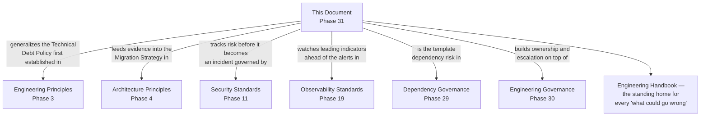

---

# Closing Statement

> **Callout — Closing Statement**
> Every preceding phase document described a standard Arwal holds itself to when things go according to plan. This document describes the discipline that keeps Arwal from being surprised when they don't — the practice of naming, scoring, owning, watching, and deliberately addressing uncertainty before it becomes a citizen-facing incident, a security breach, or a missed civic commitment. A district's trust in Arwal is built not only by what the platform does well, but by how rarely it fails in ways that were foreseeable and preventable. Across ~300 micro-phases, a team growing from a handful of founding engineers to hundreds, and a mission that will eventually touch government integration, financial services, and healthcare, the single most valuable engineering capability Arwal can sustain is not the absence of risk — no system of Arwal's ambition is ever risk-free — but the discipline of seeing risk clearly, owning it honestly, and acting on it early, every time, for as long as the platform exists. Where a future phase must deviate from a standard stated here, that deviation is made explicitly — through this document's own Risk Acceptance process, or a Strategic-classification ADR where the deviation is structural — never silently, and never by default. This document's own framework — its categories, its thresholds, its cadence — is itself reviewed no less than annually by the Engineering Leadership Council, ensuring the practice of managing risk never itself becomes an unmanaged risk.

This document, `ai-docs/30-engineering-risk-management-standards.md`, is Phase 31 of approximately 300. Every risk identified, assessed, owned, mitigated, accepted, escalated, and retired in the phases that follow is expected to satisfy the standards defined here, or to justify its deviation in writing.

**End of Phase 31 — `ai-docs/30-engineering-risk-management-standards.md`**