# Change Management & Governance Standards

**Document:** `ai-docs/31-change-management-governance-standards.md`
**Project:** Arwal — The District Super App
**Stage:** 1 — Foundation
**Phase:** 32 — Change Management & Governance Standards
**Status:** Approved for Engineering Reference
**Audience:** CTO, Architecture Review Board, Platform Team, Security Team, SRE, Engineering Managers, Tech Leads, Developers, QA, Product Managers, Government Technical Partners

> **Callout — Purpose of This Document**
> `ai-docs/00-project-vision.md` through `ai-docs/30-engineering-risk-management-standards.md` defined why Arwal exists and every enforceable discipline governing how it is designed, written, secured, tested, deployed, observed, logged, configured, documented, decided upon, reviewed, branched, released, depended upon, governed, and risk-managed. None of those documents, individually, answers the question that sits at the exact point a decision becomes a production reality: **how does a specific, bounded change move — deliberately, safely, and auditably — from "proposed" to "live," and how does Arwal know, afterward, that it actually worked?** This document is that answer: Arwal's Change Management & Governance charter, for every one of the ~300 micro-phases still ahead.

---

# Purpose of this Document

### Why Change Management Exists

`ai-docs/07-development-workflow.md` describes how a day of engineering work unfolds. `ai-docs/16-deployment-standards.md` describes how a tested artifact reaches production infrastructure. `ai-docs/17-cicd-standards.md` describes the automated machinery that builds and verifies that artifact. `ai-docs/27-branching-release-strategy.md` describes the branching and release rhythm that ties individual changes into a coherent cadence. None of those documents, on its own, answers the specific governance question this document exists to close: **for this one change, right now — is it actually safe to make, has it been assessed proportionally to its risk, does the right authority know about it, and can Arwal prove, after the fact, that it happened the way it was supposed to?** Change management is the discipline that wraps every deployment, every configuration edit, every infrastructure adjustment, and every emergency fix in a consistent, risk-scaled, evidence-based governance layer — so that "we shipped it" and "we shipped it responsibly" are never two different claims.

### Controlled Delivery

Arwal ships continuously, per the Continuous Delivery model already established in `ai-docs/17-cicd-standards.md`. Continuous does not mean uncontrolled — every change, no matter how small or how frequent, passes through a proportional, defined process before it touches a citizen. Controlled delivery is what lets Arwal ship *often* without ever shipping *carelessly*, and this document is the framework that makes "often" and "carelessly" stay mutually exclusive.

### Engineering Stability

A citizen's booking, payment, and government application run on production systems that must remain predictable even as change happens to them constantly. Per the Stable Main Branch principle already established in `ai-docs/27-branching-release-strategy.md`, change management exists to protect that stability — not by slowing change down uniformly, but by ensuring the amount of scrutiny a change receives is proportional to the risk it carries, so a routine configuration tweak moves fast and a payments-affecting schema migration moves carefully.

### Governance

Per the Decision Authority Matrix already established in `ai-docs/29-engineering-governance-decision-authority.md`, every decision at Arwal has a named, accountable authority. A production change is a decision with consequences a citizen directly experiences — this document is where that governance model is applied specifically to the act of *changing a running system*, closing the gap between "who may decide" (Phase 30) and "who may actually flip the switch, and how" (this document).

### Continuous Delivery with Confidence

The goal of this document is not to add friction — it is to make speed and safety the same thing. A change management framework that is too heavy makes engineers route around it; one that is too light leaves Arwal blind to its own risk. This document exists to calibrate that balance precisely, per the Change Classification Matrix below, so that Arwal's engineers can ship with genuine confidence, not merely with hope.

### Relationship with Development Workflow

`ai-docs/07-development-workflow.md` already owns the complete Engineering Lifecycle — Idea through Retrospective — and the day-to-day rhythm an engineer follows. This document does not redefine that lifecycle. It defines the **governance overlay** applied to the specific moment a change is proposed for production: classification, approval authority, evidence requirements, and audit — the checkpoint that sits across every lifecycle stage `ai-docs/07-development-workflow.md` already describes, never duplicating its stage definitions.

### Relationship with Deployment Standards

`ai-docs/16-deployment-standards.md` already owns environments, deployment strategies, rollback mechanics, and the Production Readiness Checklist in full. This document does not redefine a single deployment mechanic. It defines the governance decision that determines *which* deployment strategy a given change's risk tier requires, and the paper trail that confirms the Production Readiness Checklist was actually satisfied — governance sitting above mechanics `ai-docs/16-deployment-standards.md` already fully specifies.

### Relationship with CI/CD

`ai-docs/17-cicd-standards.md` already owns the exact, executable pipeline that verifies and packages a change. This document does not redefine a pipeline stage. It defines the change record — the auditable artifact — that a pipeline run's outcome becomes evidence for, and the governance decision of whether that evidence is sufficient for a given change's classification.

### Relationship with Engineering Governance

`ai-docs/29-engineering-governance-decision-authority.md` already owns the organizational decision-authority structure — roles, boards, escalation, delegation. This document is built directly on top of that structure: every Approval Authority named below is a role already defined there, and every Escalation path below routes into the identical Escalation Process already established there. This document never redefines a board's membership or a role's general scope of authority; it applies that existing structure specifically to the governance of a *production change*.

### Relationship with Engineering Risk Management

`ai-docs/30-engineering-risk-management-standards.md` already owns the complete Risk Assessment Framework, Risk Register, and Risk Classification tiers for standing engineering risk. This document's Change Classification Matrix is a close cousin — deliberately structured in the identical Low/Medium/High/Critical shape — but governs a *bounded, time-limited event* (a specific change) rather than a *standing condition* (a risk that persists until mitigated). Where a change surfaces a new standing risk (e.g., a High-tier change reveals a previously unknown Architecture Risk), that risk is logged into the Risk Register per `ai-docs/30-engineering-risk-management-standards.md`, never tracked redundantly here.

---

# Change Management Philosophy

Arwal's change management discipline rests on eight commitments. Together they answer the question every subsequent section of this document exists to make concrete: **what makes a change genuinely governed, rather than merely logged?**

### Every Production Change Is Intentional

No change reaches production by accident, by convenience, or by an engineer's unilateral judgment alone — every change is a deliberate act, classified, assessed, and approved at a level proportional to its risk. This exists because an unintentional change (a config drift, an unreviewed hotfix, a manual production edit) is precisely the failure mode `ai-docs/16-deployment-standards.md`'s Immutable Infrastructure principle and `ai-docs/06-git-workflow.md`'s "No Direct Push to `main`, Ever" principle already exist to prevent — this document generalizes that same intentionality requirement across every category of change, not only code.

### Automation First

Every mechanical step in a change's lifecycle — classification suggestion, evidence collection, approval routing, deployment execution, rollback — is automated wherever a machine can perform it reliably, mirroring the identical Automation First principle already established in `ai-docs/16-deployment-standards.md` and `ai-docs/17-cicd-standards.md`. This exists because a manual governance step is a step that will eventually be skipped under pressure, performed inconsistently, or forgotten — automation is what makes governance durable rather than aspirational.

### Small, Incremental Changes

A small, tightly-scoped change is easier to assess, easier to test, easier to roll back, and easier to root-cause if it goes wrong — restating, at the governance level, the identical Small & Frequent Releases principle already established in `ai-docs/16-deployment-standards.md` and the Scope Discipline principle in `ai-docs/02-engineering-principles.md`. This exists because change governance's entire cost-benefit calculation improves the smaller a change is: the same rigor applied to a ten-line config change and a thousand-line migration produces wildly different actual risk coverage per unit of review effort spent.

### Reversible Changes

Every change is designed, from the outset, to be reversible — and where genuine irreversibility cannot be avoided (a destructive data transformation, a compliance-mandated one-way action), that irreversibility is itself a first-class fact the approval process must weigh, per the identical Rollback Over Hotfixes and Reversible vs. Irreversible Decisions principles already established in `ai-docs/16-deployment-standards.md` and `ai-docs/25-architecture-decision-records.md`. This exists because the single fastest, safest response to a change gone wrong is always a clean reversal — a change that cannot be reversed has already spent its entire safety margin before it was even deployed.

### Evidence Before Approval

No change is approved on confidence, seniority, or urgency alone — every approval is granted against specific, checkable evidence: a passing test suite, a documented rollback plan, a stated business justification, per the identical Evidence-Based Decisions principle already established in `ai-docs/29-engineering-governance-decision-authority.md` and `ai-docs/25-architecture-decision-records.md`'s Decision Quality Standards. This exists because an approval granted on trust alone cannot be audited, cannot be defended to a government partner, and cannot be learned from when it turns out to be wrong.

### Accountability

Every change has exactly one named requester and exactly one named approving authority per its classification tier — never a diffuse "the team decided to ship it," mirroring the identical Accountability Over Hierarchy and Named Ownership principles already established in `ai-docs/29-engineering-governance-decision-authority.md` and `ai-docs/30-engineering-risk-management-standards.md`. This exists because a change without a named accountable party is, in practice, a change nobody is actually responsible for when its consequences appear.

### Transparency

Every change of Medium classification or above is visible to every team it might reasonably affect, recorded in a citable, permanent location, per the identical Transparency principle already established throughout `ai-docs/00-project-vision.md`, `ai-docs/24-documentation-standards.md`, and `ai-docs/29-engineering-governance-decision-authority.md`. This exists because a change made invisibly, however well-intentioned, cannot be trusted by the teams who must operate alongside its consequences.

### Continuous Improvement

Arwal's change management practice — its classification thresholds, its approval chains, its evidence requirements — is itself periodically re-evaluated against what Change Metrics (below) actually reveal, per the identical Continuous Improvement discipline already established for retrospectives in `ai-docs/07-development-workflow.md` and for risk practice in `ai-docs/30-engineering-risk-management-standards.md`. This exists because a change framework calibrated once, in Phase 32, and never revisited will drift out of fit with Arwal's actual change volume and risk profile as the team and the system both grow.

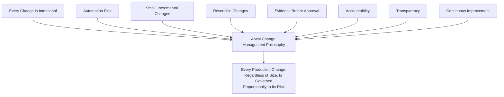
```mermaid
graph TD
    A[Every Change Is Intentional] --> I[Arwal Change Management Philosophy]
    B[Automation First] --> I
    C[Small, Incremental Changes] --> I
    D[Reversible Changes] --> I
    E[Evidence Before Approval] --> I
    F[Accountability] --> I
    G[Transparency] --> I
    H[Continuous Improvement] --> I
    I --> J[Every Production Change,<br/>Regardless of Size, Is Governed<br/>Proportionally to Its Risk]
```

> **Callout — The One-Sentence Change Management Philosophy**
> *"A change that is small, reversible, evidenced, and owned by name is a change Arwal can trust before it ships and learn from after it does — a change missing any one of those properties is a risk wearing the appearance of routine work."*

---

# Change Categories

Every production change belongs to exactly one primary category (a change may carry a secondary tag where it genuinely spans two — e.g., a Database Change that is also a Security Change — but always has one primary owner category for approval-routing purposes).

### Standard Change

**Definition:** A pre-approved, low-risk, well-understood, repeatable change following an established pattern, per Standard Changes below.
**Examples:** A routine dependency Patch update (`ai-docs/22-dependency-management-standards.md`); a documentation correction; a feature-flag toggle already within its pre-approved blast radius.
**Approval Authority:** Pre-approved by category — no per-instance approval required, per Standard Changes below.
**Required Evidence:** CI green, per `ai-docs/17-cicd-standards.md`'s required checks.
**Risk Level:** Low.

### Normal Change

**Definition:** A planned, reviewed change following the standard engineering lifecycle — the overwhelming majority of Arwal's production changes.
**Examples:** A new feature shipped via the standard `release/*` cadence; a routine schema migration following the Three-Step Migration Discipline (`ai-docs/14-database-design-guidelines.md`).
**Approval Authority:** Per Change Classification Matrix below, scaled to the change's assessed tier.
**Required Evidence:** Full Testing evidence, Release Readiness Checklist (`ai-docs/07-development-workflow.md`), Production Readiness Checklist (`ai-docs/16-deployment-standards.md`).
**Risk Level:** Low–High, assessed per change.

### Major Change

**Definition:** A Normal Change whose scope, blast radius, or precedent-setting nature meets the ADR threshold in `ai-docs/25-architecture-decision-records.md`, or carries platform-wide citizen impact potential.
**Examples:** A new bounded context; a breaking API MAJOR version (`ai-docs/13-api-design-guidelines.md`); a payment-gateway provider change.
**Approval Authority:** Architecture Review Board and/or Security Review Board, per the Critical tier in Change Classification Matrix below.
**Required Evidence:** Full regression suite, load testing where applicable, a filed ADR, Production Readiness Checklist, rehearsed rollback plan.
**Risk Level:** High–Critical.

### Emergency Change

**Definition:** A change made in direct response to an active Sev 1/Sev 2 incident, per the Incident Response Workflow in `ai-docs/07-development-workflow.md` and the Hotfix Workflow in `ai-docs/06-git-workflow.md`.
**Examples:** A hotfix for a production-breaking defect; an emergency Critical-CVSS dependency patch (`ai-docs/22-dependency-management-standards.md`).
**Approval Authority:** Incident Commander (immediate), ratified within one business day per Emergency Changes below.
**Required Evidence:** Regression test proving the fix, confirmed rollback path — evidence gathered in parallel with, never skipped in favor of, urgency.
**Risk Level:** Assessed per the underlying incident's severity, typically High–Critical.

### Infrastructure Change

**Definition:** A change to provisioned infrastructure — network topology, IAM policy, compute/storage resources, per `ai-docs/16-deployment-standards.md`'s Infrastructure as Code section.
**Examples:** A new VPC subnet; an IAM role's permission scope change; an RDS instance class change.
**Approval Authority:** Platform Team + DevOps Lead; Architecture Review Board for a structural topology change.
**Required Evidence:** IaC plan diff (`ai-docs/16-deployment-standards.md`), DevOps/platform-context review.
**Risk Level:** Medium–Critical, scaled to blast radius.

### Application Change

**Definition:** A change to first-party application code — a feature, a bug fix, a refactor.
**Examples:** A new use case in a module; a UI component change.
**Approval Authority:** Per the standard Code Review process (`ai-docs/26-code-review-standards.md`), escalated per Change Classification Matrix.
**Required Evidence:** Passing CI, code review approval, test coverage per `ai-docs/15-testing-standards.md`.
**Risk Level:** Low–High, scaled to the domain touched.

### Database Change

**Definition:** A schema migration, index change, or data transformation, per `ai-docs/14-database-design-guidelines.md`.
**Examples:** An additive column migration; a backfill job; a new composite index.
**Approval Authority:** Tech Lead of the owning module + DBA/Platform review for a High/Critical-tier migration.
**Required Evidence:** Migration Review Checklist (`ai-docs/14-database-design-guidelines.md`), rollback path, isolated-database test evidence.
**Risk Level:** Medium–Critical, scaled to lock duration and data volume affected.

### API Change

**Definition:** A new endpoint, a modified contract, or a version change, per `ai-docs/13-api-design-guidelines.md`.
**Examples:** A new `/v1/...` endpoint; a `/v2/...` breaking version introduction.
**Approval Authority:** Standard review for non-breaking; Architecture Review Board for a breaking version.
**Required Evidence:** OpenAPI contract diff, contract test suite (`ai-docs/15-testing-standards.md`), breaking-change classification per the table in `ai-docs/13-api-design-guidelines.md`.
**Risk Level:** Low (additive) – High (breaking).

### Configuration Change

**Definition:** A change to an environment variable, feature flag, or runtime setting, per `ai-docs/21-configuration-management-standards.md`.
**Examples:** A feature-flag toggle for a citizen-facing rollout; a rate-limit threshold adjustment.
**Approval Authority:** Per `ai-docs/21-configuration-management-standards.md`'s Change Approval table, scaled by whether the value gates a citizen-critical flow.
**Required Evidence:** Schema validation pass, documented fallback value.
**Risk Level:** Low–High, scaled to blast radius.

### Dependency Change

**Definition:** Adding, upgrading, or removing a third-party or internal package, per `ai-docs/22-dependency-management-standards.md` and `ai-docs/28-dependency-governance-standards.md`.
**Examples:** A MAJOR version framework upgrade; a new Critical-tier dependency adoption.
**Approval Authority:** Per the Risk Classification tier already established in `ai-docs/28-dependency-governance-standards.md`.
**Required Evidence:** Evaluation Criteria scoring, license/security scan clean.
**Risk Level:** Low–Critical, per the dependency's own governance tier.

### Security Change

**Definition:** Any change affecting Arwal's security posture, threat model, or data classification, per `ai-docs/10-security-standards.md`.
**Examples:** An authentication protocol change; an encryption key rotation procedure change.
**Approval Authority:** Security Review Board, per `ai-docs/29-engineering-governance-decision-authority.md`.
**Required Evidence:** Security Review Checklist (`ai-docs/10-security-standards.md`), penetration-test evidence where applicable.
**Risk Level:** Medium–Critical.

### Operational Change

**Definition:** A change to how an already-built system is run day to day — a deployment strategy, a monitoring threshold, an on-call procedure.
**Examples:** A new alert rule (`ai-docs/18-observability-standards.md`); a deployment strategy change for a service class (`ai-docs/16-deployment-standards.md`).
**Approval Authority:** DevOps/Platform Lead + the affected service's Tech Lead.
**Required Evidence:** A documented before/after operational impact statement.
**Risk Level:** Low–High.

### Documentation Change

**Definition:** A change to `ai-docs/*` or `docs/*` content, per `ai-docs/24-documentation-standards.md`.
**Examples:** A README correction; a new runbook; a structural phase-document amendment.
**Approval Authority:** Per the Approval Authority table already established in `ai-docs/24-documentation-standards.md`.
**Required Evidence:** Documentation CI pass (link check, lint), technical review for accuracy.
**Risk Level:** Low, except a structural `ai-docs/*` amendment, which is High per its ADR requirement.

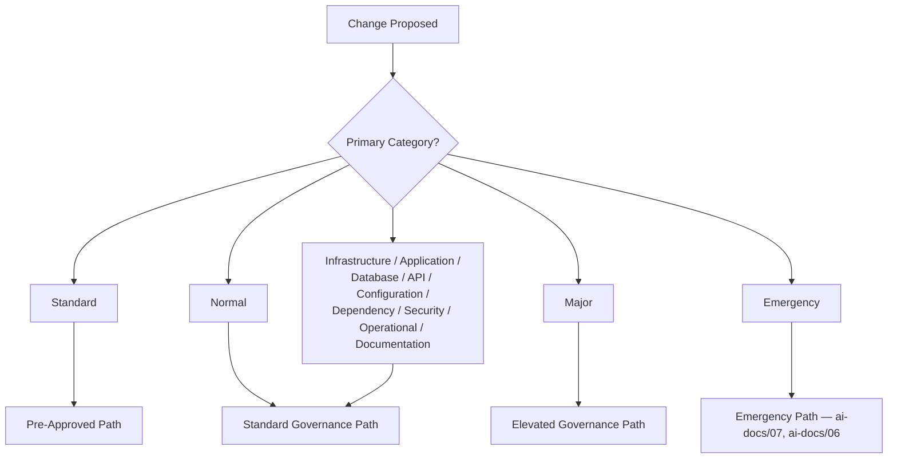
```mermaid
graph TD
    A[Change Proposed] --> B{Primary Category?}
    B --> C[Standard]
    B --> D[Normal]
    B --> E[Major]
    B --> F[Emergency]
    B --> G[Infrastructure / Application /<br/>Database / API / Configuration /<br/>Dependency / Security / Operational / Documentation]
    C --> H[Pre-Approved Path]
    D --> I[Standard Governance Path]
    E --> J[Elevated Governance Path]
    F --> K[Emergency Path — ai-docs/07, ai-docs/06]
    G --> I
```

---

# Change Classification Matrix

Every change — regardless of its primary category above — is additionally assigned exactly one risk tier: Low, Medium, High, or Critical. The tier, not the category, is what determines approval chain, testing depth, rollback requirement, and communication requirement.

| Tier | Business Impact | Technical Impact | Approval Chain | Required Testing | Rollback Requirement | Communication Requirement |
|---|---|---|---|---|---|---|
| **Low** | Negligible; no citizen-facing effect, or effect is cosmetic/non-critical. | Confined to a single, non-critical module; no schema change; no new external dependency. | Tech Lead (or, for a Standard Change, pre-approved with no per-instance step). | Unit + integration, per `ai-docs/15-testing-standards.md`. | Standard rollback — redeploy previous artifact, per `ai-docs/16-deployment-standards.md`. | Team-level, via standard PR visibility. |
| **Medium** | Noticeable to citizens but contained to one domain or flow; no financial/identity/civic-service impact. | A citizen-facing but non-financial, non-identity flow; a non-breaking schema addition. | Tech Lead + Engineering Manager. | Unit + integration + relevant E2E coverage. | Rollback path stated explicitly in the Change Request. | Affected teams informed in advance. |
| **High** | Significant citizen-facing or financial impact if the change misbehaves. | Touches `payments`, `identity`, or `civic-services` domain logic; a breaking API version; a schema change with non-trivial backfill; a structural infrastructure change. | Tech Lead + Security Reviewer + Architecture Reviewer (where ADR-worthy), per `ai-docs/26-code-review-standards.md`'s Review Levels. | Full regression suite + load testing where load risk is identified (`ai-docs/11-performance-standards.md`). | Rollback path tested against a Staging-equivalent scenario before promotion; Blue-Green or Canary strategy preferred (`ai-docs/16-deployment-standards.md`). | Every affected team notified in advance; Release Governance Board informed. |
| **Critical** | Platform-wide citizen impact potential — a core authentication change, a payment-gateway integration change, a data-residency-affecting change, or any Emergency Change. | Cross-cutting; affects multiple bounded contexts or the shared platform layer. | Every applicable elevated review level engaged simultaneously; Engineering Leadership Council informed; Architecture Review mandatory regardless of ADR threshold, per `ai-docs/29-engineering-governance-decision-authority.md`. | Full regression + load testing + a dedicated pre-release verification pass; rollback rehearsed, not merely documented. | Rollback plan rehearsed against a Staging-equivalent scenario; Shadow or Canary deployment strategy is default, never Rolling alone. | All Engineering, Product, and — where a government-partnership integration is affected — the relevant Government Technical Partner. |

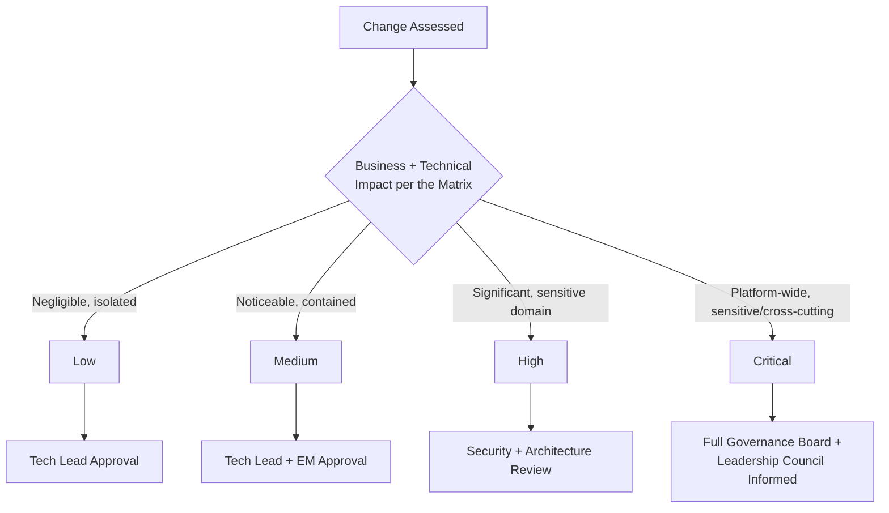
```mermaid
graph TD
    A[Change Assessed] --> B{Business + Technical<br/>Impact per the Matrix}
    B -->|Negligible, isolated| C[Low]
    B -->|Noticeable, contained| D[Medium]
    B -->|Significant, sensitive domain| E[High]
    B -->|Platform-wide, sensitive/cross-cutting| F[Critical]
    C --> G[Tech Lead Approval]
    D --> H[Tech Lead + EM Approval]
    E --> I[Security + Architecture Review]
    F --> J[Full Governance Board +<br/>Leadership Council Informed]
```

> **Callout — Tier Is Assessed Once, Confirmed Twice**
> A change's tier is assessed at Request (an initial, evidence-based estimate) and re-confirmed at Risk Review (below) once the full implementation is known — a change that appeared Low-tier at proposal but turns out to touch `payments` code is re-classified before approval, never grandfathered in at its original, now-inaccurate tier.

---

# Change Request Lifecycle

Every change — Standard, Normal, Major, or Emergency — passes through the same ten conceptual stages, though the depth and duration of each stage scale with the change's classification tier, mirroring the identical "not every stage needs the same weight" principle already established in `ai-docs/07-development-workflow.md`.

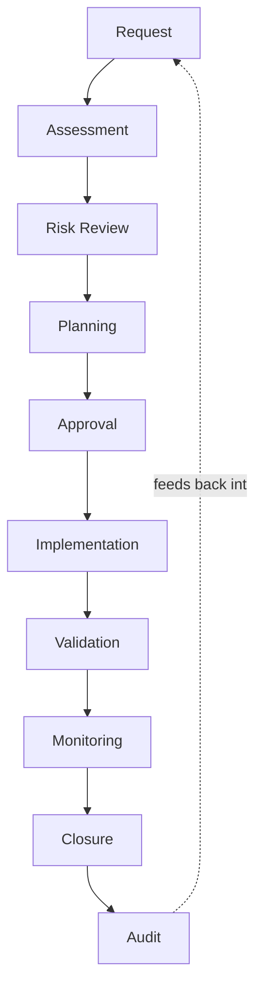
```mermaid
graph TD
    A[Request] --> B[Assessment]
    B --> C[Risk Review]
    C --> D[Planning]
    D --> E[Approval]
    E --> F[Implementation]
    F --> G[Validation]
    G --> H[Monitoring]
    H --> I[Closure]
    I --> J[Audit]
    J -.feeds back into.-> A
```

### Stage Definitions

| Stage | Purpose | Primary Owner | Exit Criteria |
|---|---|---|---|
| **Request** | The change is formally proposed using the Change Request Template below. | Requesting engineer | A complete Change Request record exists, including a stated Business Justification. |
| **Assessment** | The change is mapped to a primary category (Change Categories) and an initial risk tier (Change Classification Matrix). | Tech Lead | Category and tier assigned, with stated reasoning. |
| **Risk Review** | The tier is confirmed against the actual, complete implementation; any newly-surfaced standing risk is logged per `ai-docs/30-engineering-risk-management-standards.md`. | Tech Lead + Domain Expert | Tier confirmed or revised; any surfaced risk cross-referenced. |
| **Planning** | Impact analysis, dependency analysis, scheduling, and — for a High/Critical change — a maintenance window decision, per Change Planning below. | Requesting engineer + affected teams | A concrete implementation and rollback plan exists. |
| **Approval** | The Approval Authority matching the confirmed tier signs off, per Change Approval Authority below. | Per Change Classification Matrix | Every required approval recorded. |
| **Implementation** | The change is executed via the approved CI/CD and deployment mechanics, per `ai-docs/17-cicd-standards.md` and `ai-docs/16-deployment-standards.md`. | Implementing engineer / Release Engineer | Deployment completes per its chosen strategy. |
| **Validation** | Functional, performance, security, and business validation confirm the change behaves as intended, per Change Validation below. | QA + the implementing engineer | Every applicable validation category passes. |
| **Monitoring** | The change is observed through its defined bake-in window, per `ai-docs/16-deployment-standards.md`'s Post-Deployment Verification. | On-call engineer / SRE | Golden signals stable through the bake-in window. |
| **Closure** | The change is formally marked complete; any deviation from plan is documented. | Requesting engineer | Change Request record updated to Closed. |
| **Audit** | The complete change record is retained and periodically reviewed, per Change Audit below. | Governance/Compliance | Record retained per its classification's retention policy. |

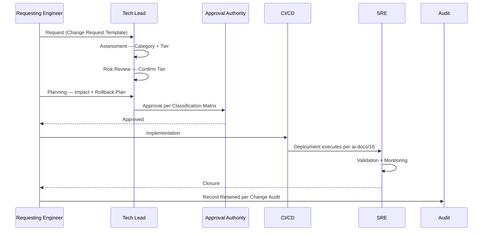
```mermaid
sequenceDiagram
    participant Eng as Requesting Engineer
    participant TL as Tech Lead
    participant App as Approval Authority
    participant CI as CI/CD
    participant SRE
    participant Aud as Audit

    Eng->>TL: Request (Change Request Template)
    TL->>TL: Assessment — Category + Tier
    TL->>TL: Risk Review — Confirm Tier
    Eng->>TL: Planning — Impact + Rollback Plan
    TL->>App: Approval per Classification Matrix
    App-->>Eng: Approved
    Eng->>CI: Implementation
    CI->>SRE: Deployment executes per ai-docs/16
    SRE->>SRE: Validation + Monitoring
    SRE-->>Eng: Closure
    Eng->>Aud: Record Retained per Change Audit
```

---

# Change Request Template

Every Change Request — regardless of tier — is recorded using the following mandatory fields. A Low-tier Standard Change may satisfy several fields via automation (e.g., Testing Evidence auto-populated from CI); a Critical-tier change completes every field explicitly and substantively.

| Field | Description |
|---|---|
| **Change ID** | A permanent, sequential identifier (`CHG-00001`), never reused, mirroring the Immutable Numbers principle already established for ADRs in `ai-docs/25-architecture-decision-records.md`. |
| **Title** | A short, specific, decision-stating title — never vague. |
| **Description** | What is changing, in plain language a non-implementing reader can follow. |
| **Business Justification** | The specific, current need this change addresses, per the identical Business Justification standard already established in `ai-docs/28-dependency-governance-standards.md`. |
| **Technical Summary** | What changed, at a level a reviewer unfamiliar with the specific area can follow — mirroring the PR Description standard already established in `ai-docs/06-git-workflow.md`. |
| **Category** | The primary Change Category, per Change Categories above. |
| **Classification Tier** | Low / Medium / High / Critical, per Change Classification Matrix above. |
| **Affected Systems** | Every module, service, and shared dependency the change touches. |
| **Dependencies** | Any other in-flight change this one depends on or blocks. |
| **Risk Assessment** | The specific risks identified, per `ai-docs/30-engineering-risk-management-standards.md`'s Risk Assessment Framework where the change surfaces a standing risk. |
| **Rollback Plan** | The concrete, specific rollback mechanism — never "we'll figure it out," per Rollback Governance below. |
| **Testing Evidence** | Links to the passing CI run, and, for High/Critical tiers, load-test or manual QA evidence. |
| **Deployment Window** | The planned date/time, and — for a High/Critical change — confirmation against any active Change Freeze (below). |
| **Approvers** | Every required approver's name, per Change Approval Authority below. |
| **Communication Plan** | Who is notified, when, and through what channel, per Change Communication below. |
| **Post-Change Verification** | The specific, checkable criteria that confirm the change succeeded, per Change Validation below. |

## Change Request: CHG-00147

**Title:** Introduce composite index on `local_services.bookings(provider_id, status)`

**Category:** Database Change
**Classification Tier:** Medium

**Description:** Adds a composite index to support the booking-list endpoint's
filter+sort query pattern, per the Indexing Strategy in ai-docs/14.

**Business Justification:** The booking-list endpoint currently exceeds its
p95 latency target under provider-level query load (ai-docs/11).

**Technical Summary:** Additive migration; no application-code deploy required
until the index is confirmed present.

**Affected Systems:** local-services module, PostgreSQL (local_services schema)

**Dependencies:** None

**Risk Assessment:** Low probability of lock contention; index build performed
CONCURRENTLY per ai-docs/14's Migration discipline.

**Rollback Plan:** DROP INDEX, additive-only migration, no data loss risk.

**Testing Evidence:** [CI run link], EXPLAIN ANALYZE plan attached.

**Deployment Window:** 2026-08-02, 02:00 IST (low-traffic window)

**Approvers:** [Tech Lead], [DBA/Platform Reviewer]

**Communication Plan:** #local-services-team notified 24h in advance.

**Post-Change Verification:** p95 latency for GET /v1/bookings returns to
target within the bake-in window.

---

# Change Approval Authority

Every role below carries defined change-approval responsibility, built directly on top of the Governance Organization already established in `ai-docs/29-engineering-governance-decision-authority.md` — this document names no new role and adds no new authority beyond applying that existing structure specifically to change approval.

| Role | Change Approval Responsibility |
|---|---|
| **Developer** | Proposes a change via the Change Request Template; never self-approves a Medium-or-above tier change. |
| **Tech Lead** | Approval authority for Low and Medium-tier changes within their owned domain; required co-signer for High/Critical-tier changes touching their domain. |
| **Engineering Manager** | Approval authority for Medium-tier changes requiring cross-function coordination; resolves review-capacity bottlenecks per `ai-docs/26-code-review-standards.md`. |
| **Architecture Review Board** | Approval authority for High/Critical-tier changes meeting the ADR threshold (`ai-docs/25-architecture-decision-records.md`) or carrying structural, precedent-setting impact. |
| **Security Team** | Mandatory co-approver for any change touching `payments`, `identity`, `civic-services`, authentication, or authorization, per `ai-docs/10-security-standards.md`'s Elevated Review requirement; holds veto authority at this tier. |
| **Platform Team** | Approval authority for Infrastructure and cross-team Operational changes, per `ai-docs/29-engineering-governance-decision-authority.md`'s Platform Governance Board. |
| **SRE** | Approval authority for a change's deployment strategy selection and rollback readiness confirmation at High/Critical tiers; owns the Production Observation Window (`ai-docs/16-deployment-standards.md`). |
| **CTO** | Final approval authority for Critical-tier changes with platform-wide impact, and the escalation terminus for any unresolved approval disagreement, per `ai-docs/29-engineering-governance-decision-authority.md`. |
| **Engineering Leadership Council** | Informed of every Critical-tier change in advance; resolution authority for a Cross-Team Disagreement blocking a change's approval. |

### Approval Matrix

| Tier | Minimum Required Approvers |
|---|---|
| Low | 1 (Tech Lead, or pre-approved per Standard Changes) |
| Medium | 2 (Tech Lead + Engineering Manager) |
| High | 3 (Tech Lead + Security Reviewer + Architecture Reviewer, where applicable) |
| Critical | 4+ (Tech Lead + Security Review Board + Architecture Review Board + CTO or delegate) |

### Separation of Duties

For every High- and Critical-tier change, the individual who **requests** the change, the individual(s) who **approve** it, and the individual who performs **post-change validation** are never the same person — mirroring the identical Conflict of Interest discipline already established in `ai-docs/30-engineering-risk-management-standards.md`'s Risk Acceptance section. A requesting engineer may implement their own approved change, but never signs their own Approval field, and never is the sole party confirming their own Post-Change Verification criteria were met. Where a team is small enough that three genuinely independent individuals are not available, the Engineering Manager is looped in as the independent validator, and this substitution is itself recorded in the Change Request.

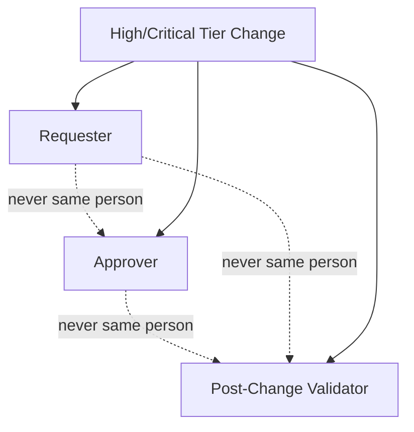
```mermaid
graph TD
    A[Requester] -.never same person.-> B[Approver]
    B -.never same person.-> C[Post-Change Validator]
    A -.never same person.-> C
    D[High/Critical Tier Change] --> A
    D --> B
    D --> C
```

---

# Standard Changes

### Pre-Approved Changes

A Standard Change is a category of change so well-understood, so low-risk, and so frequently repeated that requiring per-instance human approval would add cost without adding meaningful safety — mirroring the identical Proportional Rigor principle already established throughout `ai-docs/02-engineering-principles.md` and `ai-docs/28-dependency-governance-standards.md`'s rejection of Over-Engineering the Approval Process.

### Criteria for Pre-Approval

A change category qualifies for Standard Change status only where **all** of the following hold: it has been executed successfully, without incident, at least a dozen times in Arwal's history; its blast radius is provably confined to a Low-tier classification every time; its rollback is fully automated and has never required manual intervention; and it carries no security, payments, identity, or civic-services surface. A single incident traceable to a Standard Change category immediately suspends its pre-approved status pending Governance Review below.

### Examples of Standard Changes

- A dependency Patch update passing every automated gate in `ai-docs/17-cicd-standards.md` (security patch or routine).
- A documentation-only correction per `ai-docs/24-documentation-standards.md`'s "What Does NOT Require an ADR" category.
- A feature-flag toggle already within its documented, pre-approved rollout percentage range.
- A formatting-only `style:` commit, per `ai-docs/06-git-workflow.md`.

### Automation

Every Standard Change's approval is enforced entirely by CI/CD gates (`ai-docs/17-cicd-standards.md`) — a green pipeline **is** the approval; no human sign-off step exists in the critical path. This is what makes the pre-approval genuinely low-friction rather than merely nominally so.

### Documentation

Every Standard Change is still recorded — automatically, from CI metadata — in the Change Log (see Change Audit below), so that "pre-approved" never means "invisible." A Standard Change's record satisfies the Change Request Template's fields via automated population, never requiring the requester to hand-fill a form for a routine dependency bump.

### Review Frequency

Every Standard Change category is reviewed by the Platform Team **quarterly**, confirming its pre-approval criteria still hold — per the explicit governance improvement this document incorporates: **a Standard Change category is never left pre-approved indefinitely on the strength of its original qualification alone.** The quarterly review checks: has an incident occurred in this category since the last review, has the category's automation drifted from its original scope, and does the category's actual historical risk profile still match a Low tier. A category failing this review is suspended from pre-approved status and routed through Normal Change governance until re-qualified.

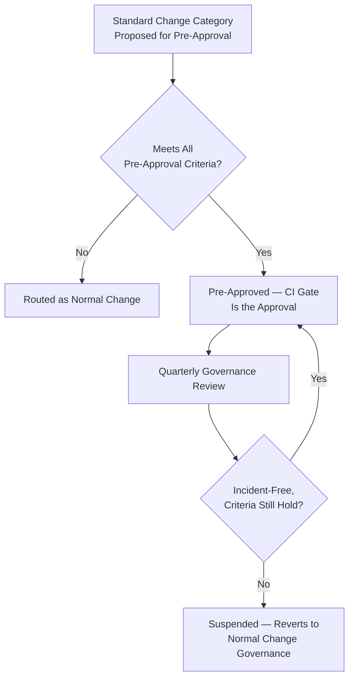
```mermaid
graph TD
    A[Standard Change Category<br/>Proposed for Pre-Approval] --> B{Meets All<br/>Pre-Approval Criteria?}
    B -->|No| C[Routed as Normal Change]
    B -->|Yes| D[Pre-Approved — CI Gate<br/>Is the Approval]
    D --> E[Quarterly Governance Review]
    E --> F{Incident-Free,<br/>Criteria Still Hold?}
    F -->|Yes| D
    F -->|No| G[Suspended — Reverts to<br/>Normal Change Governance]
```

---

# Normal Changes

### Planning

Every Normal Change begins with the Planning stage already defined in Change Request Lifecycle above — impact analysis, dependency analysis, and a stated rollback plan, scaled to the change's assessed tier.

### Review

A Normal Change passes through the identical Code Review process already fully established in `ai-docs/26-code-review-standards.md`, at the Review Level its classification tier requires — this document adds no new review mechanic, it confirms the change's tier correctly determined which review level applied.

### Approval

Per the Approval Matrix in Change Approval Authority above, matched to the change's confirmed tier.

### Testing

Per `ai-docs/15-testing-standards.md`'s Testing Pyramid, at the depth the tier requires — a Low-tier Normal Change requires unit + integration; a High-tier Normal Change requires the full regression suite.

### Deployment

Per the deployment strategy `ai-docs/16-deployment-standards.md` designates for the change's risk profile — Rolling for Low/Medium, Blue-Green/Canary preferred for High/Critical, per the Change Classification Matrix above.

### Verification

Per Change Validation below, confirmed within the change's Monitoring stage before Closure.

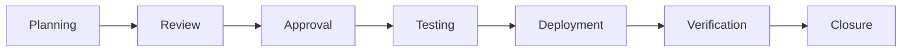
```mermaid
graph LR
    A[Planning] --> B[Review]
    B --> C[Approval]
    C --> D[Testing]
    D --> E[Deployment]
    E --> F[Verification]
    F --> G[Closure]
```

---

# Emergency Changes

### When Allowed

An Emergency Change is permitted **only** for a confirmed, already-live production defect meeting the Sev 1 (always) or Sev 2 (typically) severity classification already established in `ai-docs/07-development-workflow.md`'s Bug Fix Workflow — never as a shortcut to bypass Normal Change governance for a change that merely feels urgent, mirroring the identical restriction already established in `ai-docs/27-branching-release-strategy.md`'s Hotfix Strategy.

### Approval Process

The on-call Incident Commander holds immediate, full decision authority for the duration of the incident, per the identical Emergency-classification authority already established in `ai-docs/29-engineering-governance-decision-authority.md`. This is the one governance path in this entire document where implementation may begin before every field of the Change Request Template is complete — but the change is never deployed without at minimum: a stated rollback plan and one reviewer's expedited approval, per the identical "urgency reduces latency, never rigor" standard already established in `ai-docs/06-git-workflow.md` and `ai-docs/27-branching-release-strategy.md`.

### Temporary Approval

An Emergency Change's approval, granted under incident pressure by the Incident Commander, is explicitly **temporary** — it authorizes the immediate mitigating action only. It does not substitute for the full Change Request record, which is completed retroactively per Post-Implementation Review below.

### Post-Implementation Review

Every Emergency Change is followed, within one business day, by: full completion of the Change Request Template (retroactively), ratification of the Incident Commander's decision by the affected domain's Tech Lead, and — where the change reveals an ADR-worthy structural decision — a filed Emergency-classification ADR per `ai-docs/25-architecture-decision-records.md`. An Emergency Change whose retroactive record is never completed is treated as an active governance defect, surfaced by Change Metrics below.

### Documentation

Every Emergency Change is logged in the Change Log with an explicit `Emergency` flag, distinct from a Normal Change's record, so its aggregate frequency (per Change Metrics below) is independently trackable — a rising Emergency Change rate is one of Arwal's most direct signals that upstream quality gates are under strain.

### Incident Relationship

An Emergency Change is never treated as "just a deployment problem" separate from Arwal's standard incident discipline — it is inseparably linked to the Incident Response Workflow (`ai-docs/07-development-workflow.md`) and, for a security-relevant Emergency Change, the Incident Response process in `ai-docs/10-security-standards.md`. The Change Request record and the incident postmortem cross-reference each other permanently.

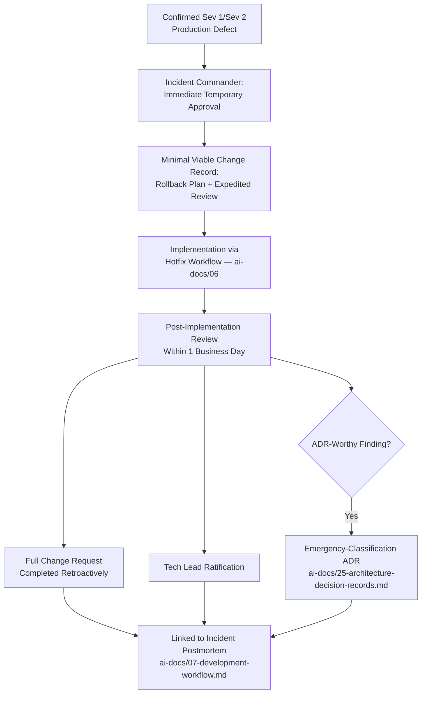
```mermaid
graph TD
    A[Confirmed Sev 1/Sev 2<br/>Production Defect] --> B[Incident Commander:<br/>Immediate Temporary Approval]
    B --> C[Minimal Viable Change Record:<br/>Rollback Plan + Expedited Review]
    C --> D[Implementation via<br/>Hotfix Workflow — ai-docs/06]
    D --> E[Post-Implementation Review<br/>Within 1 Business Day]
    E --> F[Full Change Request<br/>Completed Retroactively]
    E --> G[Tech Lead Ratification]
    E --> H{ADR-Worthy Finding?}
    H -->|Yes| I[Emergency-Classification ADR<br/>ai-docs/25-architecture-decision-records.md]
    F & G & I --> J[Linked to Incident Postmortem<br/>ai-docs/07-development-workflow.md]
```

---

# Change Planning

### Impact Analysis

Every change above Low tier states, explicitly, what breaks if the change is wrong — which citizen flow, which downstream module, which shared contract. Impact analysis is never assumed obvious from the Technical Summary alone; it is a distinct, deliberate exercise, per the identical Impact Analysis discipline `ai-docs/16-deployment-standards.md`'s Post-Deployment Verification already assumes precedes every deployment.

### Dependency Analysis

A change's Dependencies field (per the Change Request Template) is checked against every other currently in-flight change — two changes touching the same module, or one change's rollback plan assuming a state the other change would have already altered, are surfaced and sequenced deliberately, never left to collide in production.

### Resource Planning

A High/Critical-tier change confirms, before Approval, that the personnel required for its Implementation, Validation, and Monitoring stages (an on-call responder, a domain expert, a Release Engineer) are actually available for the planned window — a change is never scheduled against a window nobody is actually staffed to support.

### Scheduling

Every change's Deployment Window is chosen deliberately: a Low/Medium-tier change follows the routine release cadence already established in `ai-docs/27-branching-release-strategy.md`; a High/Critical-tier change is scheduled into a period with an actively available, briefed on-call responder, per `ai-docs/16-deployment-standards.md`'s Production Observation Window.

### Maintenance Windows

Where a change carries a genuine, unavoidable citizen-facing interruption risk (per the narrow exception already acknowledged in `ai-docs/16-deployment-standards.md`'s Zero-Downtime Migrations section), it is scheduled into a published, low-traffic maintenance window, communicated to affected citizens and government partners in advance, per Transparency over Opacity (`ai-docs/00-project-vision.md`). A maintenance window is itself a governed artifact: it has a defined start and end time, a named owner, and an explicit list of what is and is not expected to be affected, published at least 72 hours in advance for a routine window and as far in advance as operationally possible for an exceptional one.

### Change Freeze Periods

A **Change Freeze** is a defined window during which no Normal or Standard Change of Medium tier or above is promoted to production — reserved for a specific, documented reason: a major government-partnership launch event, a state or district election period where civic-service continuity is especially sensitive, a high-traffic civic deadline (a scheme application closing date), or an end-of-year low-staffing period, mirroring the identical Release Freeze Periods concept already established in `ai-docs/27-branching-release-strategy.md`. A freeze is declared by the Engineering Leadership Council, published at least two weeks in advance where practicable, and **never blocks an Emergency Change** — a citizen-facing defect does not pause merely because the calendar says it should. During a freeze, only Standard Changes and Emergency Changes proceed; every Normal/Major Change is either completed before the freeze begins or explicitly deferred, with its deferral recorded in the Change Log.

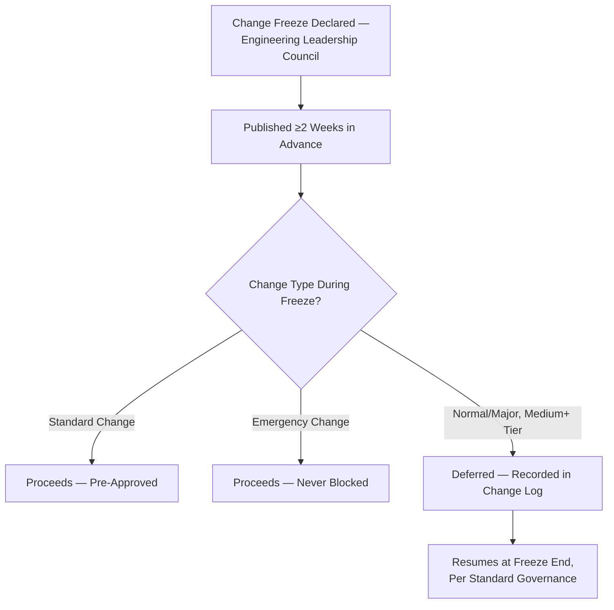
```mermaid
graph TD
    A[Change Freeze Declared —<br/>Engineering Leadership Council] --> B[Published ≥2 Weeks in Advance]
    B --> C{Change Type During Freeze?}
    C -->|Standard Change| D[Proceeds — Pre-Approved]
    C -->|Emergency Change| E[Proceeds — Never Blocked]
    C -->|Normal/Major, Medium+ Tier| F[Deferred — Recorded in Change Log]
    F --> G[Resumes at Freeze End,<br/>Per Standard Governance]
```

### Business Considerations

A change's scheduling accounts for the business and civic context around it — a change is never deployed immediately ahead of a known high-traffic civic event (a subsidy-application deadline, a government-partnership demo) without an explicit, documented risk acceptance from the Product Manager and the affected domain's Tech Lead, per the identical Product Engineering classification already established in `ai-docs/29-engineering-governance-decision-authority.md`.

---

# Change Execution

### Pre-Deployment Checklist

Before any High/Critical-tier change's Implementation stage begins, the following are confirmed: every required Approval is recorded, the rollback path has been confirmed available (per `ai-docs/16-deployment-standards.md`'s Rollback Readiness), monitoring and dashboards exist for every new or changed surface (`ai-docs/18-observability-standards.md`), and the briefed on-call responder is actively available for the deployment window.

### Deployment Governance

Every change is deployed exclusively through the approved CI/CD pipeline and deployment mechanics already fully established in `ai-docs/17-cicd-standards.md` and `ai-docs/16-deployment-standards.md` — this document adds no new deployment mechanic. Governance's role at this stage is confirming the *correct* deployment strategy (Rolling/Blue-Green/Canary/Feature Flag/Shadow) was selected for the change's actual assessed tier, per the Change Classification Matrix above, never a lesser strategy chosen for convenience.

### Monitoring

Golden signals for the changed service are actively watched through the deployment and the subsequent bake-in window, per `ai-docs/18-observability-standards.md` and `ai-docs/16-deployment-standards.md`'s Production Observation Window — this document adds no new monitoring mechanic, it confirms monitoring is a standing precondition of Implementation proceeding at all.

### Verification

Per Change Validation below, executed before the change is considered ready for Closure.

### Rollback Readiness

Rollback readiness is never assembled *after* a problem is noticed during Implementation — it is a standing precondition confirmed in the Pre-Deployment Checklist above, per the identical standard already established in `ai-docs/16-deployment-standards.md`.

### Completion Criteria

A change reaches Completion only once: the deployment has finished per its chosen strategy, the bake-in window has elapsed without an unexplained regression, every applicable Validation category has passed, and the Change Request record has been updated to reflect the actual outcome (including any deviation from the original plan).

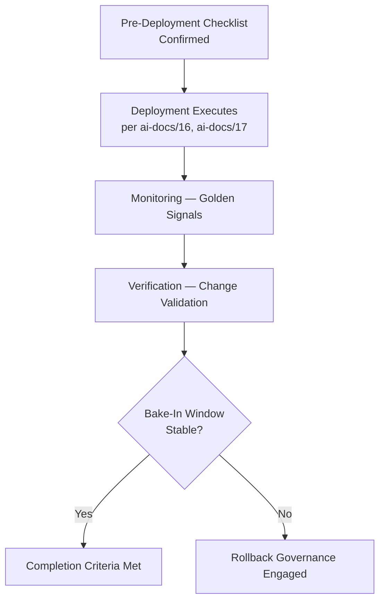
```mermaid
graph TD
    A[Pre-Deployment Checklist<br/>Confirmed] --> B[Deployment Executes<br/>per ai-docs/16, ai-docs/17]
    B --> C[Monitoring — Golden Signals]
    C --> D[Verification — Change Validation]
    D --> E{Bake-In Window<br/>Stable?}
    E -->|Yes| F[Completion Criteria Met]
    E -->|No| G[Rollback Governance Engaged]
```

---

# Rollback Governance

### Rollback Triggers

A rollback is triggered by any of: an automated golden-signal threshold breach during the bake-in window (`ai-docs/16-deployment-standards.md`'s Automatic Rollback), a manually observed regression an on-call responder confirms is attributable to the change, or a Post-Change Verification criterion (per the Change Request Template) failing outright.

### Rollback Authority

For a Low/Medium-tier change, the implementing engineer or the on-call responder may initiate a rollback unilaterally — speed matters more than a second sign-off when the blast radius is contained. For a High/Critical-tier change, a rollback is initiated by the on-call responder or Incident Commander, with the original change's Approval Authority informed immediately, mirroring the identical Rollback Over Hotfixes principle already established in `ai-docs/16-deployment-standards.md`: **the decision to roll back is never itself gated behind the same approval chain the forward change required** — rollback authority is always faster and less encumbered than forward-change authority, because the asymmetry of harm favors reverting quickly.

### Rollback Testing

For any High/Critical-tier change, the rollback path is tested against a Staging-equivalent scenario **before** the change is promoted to production, per the identical standard already established in Change Classification Matrix above and `ai-docs/16-deployment-standards.md`'s Rollback Standards — a rollback plan that has never actually been exercised is a documented intention, not a verified capability.

### Rollback Ownership

The individual who executes a rollback is named in the Change Request's updated record, distinct from (and, per Separation of Duties above, ideally independent of) the original requester — so that a rollback decision is never made, or seen to be made, by someone protecting their own change from scrutiny.

### Communication

A rollback of a Medium-tier or above change is communicated through the identical channels the original change's Communication Plan specified, immediately — per Change Communication below, a rollback is never a quieter event than the original deployment it reverses.

### Post-Rollback Review

Every rollback of a Medium-tier or above change receives a short, blameless review — capturing what was expected, what actually happened, and why — feeding directly into Change Metrics (below) and, where the root cause reveals a standing risk, the Risk Register per `ai-docs/30-engineering-risk-management-standards.md`. A rollback is never treated as a closed, unexamined event merely because the citizen-facing symptom resolved.

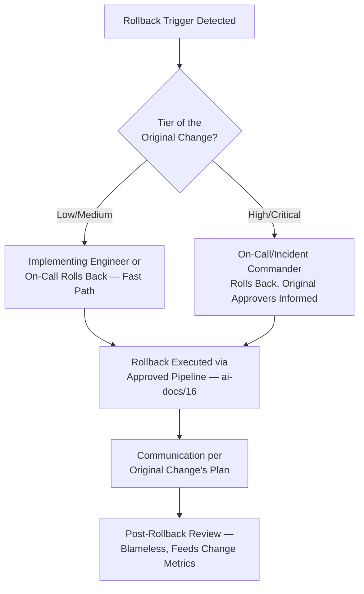
```mermaid
graph TD
    A[Rollback Trigger Detected] --> B{Tier of the<br/>Original Change?}
    B -->|Low/Medium| C[Implementing Engineer or<br/>On-Call Rolls Back — Fast Path]
    B -->|High/Critical| D[On-Call/Incident Commander<br/>Rolls Back, Original Approvers Informed]
    C & D --> E[Rollback Executed via<br/>Approved Pipeline — ai-docs/16]
    E --> F[Communication per<br/>Original Change's Plan]
    F --> G[Post-Rollback Review —<br/>Blameless, Feeds Change Metrics]
```

---

# Change Communication

### Stakeholders

Every change's Communication Plan names the specific stakeholders affected — never a blanket "everyone" or "no one," scaled per the Change Classification Matrix's Communication Requirement column.

### Internal Communication

A Low-tier change is visible through standard PR/CI activity alone. A Medium-tier change is actively communicated to every affected team in advance, via the team's standard channel. A High/Critical-tier change is communicated to the Release Governance Board (`ai-docs/29-engineering-governance-decision-authority.md`) and posted to a shared, org-wide channel ahead of its deployment window.

### Executive Communication

A Critical-tier change, and any Emergency Change responding to a Sev 1 incident, is communicated to the CTO/VP Engineering per the Engineering Leadership Council's standing awareness, per `ai-docs/29-engineering-governance-decision-authority.md` — never discovered by leadership after the fact.

### Customer Communication

Where a change carries a genuine, unavoidable citizen-facing interruption (per the Maintenance Windows standard above), citizen-facing communication is planned and issued in advance, in Arwal's supported languages (`ai-docs/12-accessibility-standards.md`'s Multilingual Accessibility), through the product's own citizen-facing channels — never assumed unnecessary because the interruption is "brief."

### Government Communication

Where a change affects a government-partner integration (a civic API contract, a data-sharing schedule), the relevant Government Technical Partner is notified per the specific communication terms of that partnership, consistent with Transparency over Opacity (`ai-docs/00-project-vision.md`) — a government partner is never surprised by a change to a system they integrate with.

### Status Updates

A High/Critical-tier change in progress provides a status update at each major lifecycle transition (Approval granted, Implementation begun, Validation complete, Monitoring window closed) to its named stakeholders — never a single "it's done" message with no visibility into the intervening stages.

### Completion Reports

Every Medium-tier or above change concludes with a short completion report: what changed, whether it succeeded as planned, and any deviation — distributed to the same stakeholders who received the original Communication Plan, closing the loop transparently regardless of outcome.

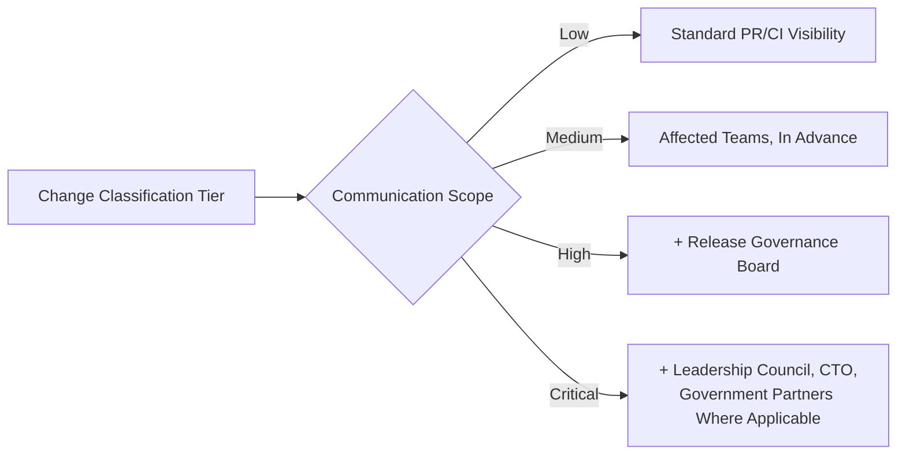
```mermaid
graph LR
    A[Change Classification Tier] --> B{Communication Scope}
    B -->|Low| C[Standard PR/CI Visibility]
    B -->|Medium| D[Affected Teams, In Advance]
    B -->|High| E[+ Release Governance Board]
    B -->|Critical| F[+ Leadership Council, CTO,<br/>Government Partners Where Applicable]
```

---

# Change Validation

### Functional Validation

Confirms the change does what it claims — the deployed artifact's actual behavior matches the Change Request's Description and Technical Summary, verified via the curated E2E suite (`ai-docs/15-testing-standards.md`) for any change touching a critical citizen journey.

### Performance Validation

Confirms the change meets its latency, throughput, and resource-usage targets under real production conditions, per `ai-docs/11-performance-standards.md` — golden signals compared against the pre-change baseline through the bake-in window.

### Security Validation

Confirms no new security exposure was introduced, per `ai-docs/10-security-standards.md`'s Security Definition of Done — mandatory for every High/Critical-tier change and any change touching `payments`, `identity`, or `civic-services`.

### Operational Validation

Confirms the change is observable, alertable, and operationally sound — dashboards and alerting exist and are receiving correct data for any new or changed service surface, per `ai-docs/18-observability-standards.md`.

### Business Validation

Confirms the change actually delivers the Business Justification stated in the Change Request — a Product Manager or the relevant domain owner confirms the citizen-facing or business outcome matches intent, distinct from purely technical correctness.

### Acceptance Criteria

Every change's Post-Change Verification field (per the Change Request Template) states specific, checkable acceptance criteria before Implementation begins — never assessed after the fact by asking "did it seem to work?" A change is not Closed until every stated acceptance criterion is confirmed true.

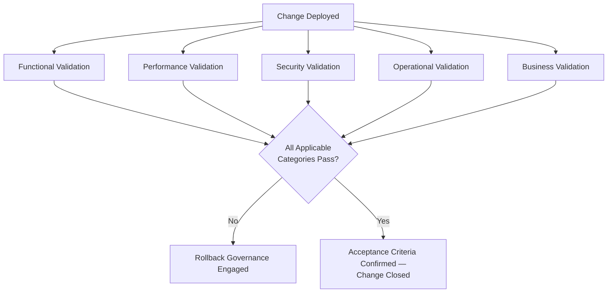
```mermaid
graph TD
    A[Change Deployed] --> B[Functional Validation]
    A --> C[Performance Validation]
    A --> D[Security Validation]
    A --> E[Operational Validation]
    A --> F[Business Validation]
    B & C & D & E & F --> G{All Applicable<br/>Categories Pass?}
    G -->|No| H[Rollback Governance Engaged]
    G -->|Yes| I[Acceptance Criteria Confirmed —<br/>Change Closed]
```

---

# Change Audit

### Audit Requirements

Every Change Request record, regardless of tier, is retained permanently in the Change Log — never deleted, mirroring the identical Archive, Never Delete principle already established for ADRs in `ai-docs/25-architecture-decision-records.md`. A Low-tier Standard Change's record may be lightweight (CI metadata alone); a Critical-tier change's record is comprehensive, including every approval signature, every validation result, and every communication sent.

### Evidence Retention

Change evidence (test results, approval records, rollback confirmations) is retained per the identical retention tiers already established in `ai-docs/19-logging-standards.md`'s Log Retention Policy — a Critical-tier change's full evidentiary record is retained at minimum as long as the audit logs its implementation touched, since a future compliance or security review may need to reconstruct exactly what was approved and why.

### Approval Records

Every approval is recorded with the approver's name, role, timestamp, and — where the approval was conditional (per `ai-docs/26-code-review-standards.md`'s Conditional Approvals) — the specific condition attached. An approval recorded only as a generic "approved" checkbox with no attributable name is treated as a governance defect.

### Implementation Records

Every Implementation stage's actual execution — the CI run, the deployment strategy used, the artifact SHA deployed — is captured automatically from `ai-docs/17-cicd-standards.md`'s own audit trail, cross-referenced into the Change Request record rather than manually re-entered, per Automation First above.

### Compliance Review

A periodic (at minimum quarterly, more frequently for a government-partnership-affecting domain) compliance review samples a cross-section of closed Change Requests, verifying: was the classification tier accurate in hindsight, were all required approvals genuinely obtained (not merely recorded), and did Validation actually occur before Closure. A compliance review finding is treated with the identical severity already established for an Audit Finding in `ai-docs/29-engineering-governance-decision-authority.md`'s Governance Metrics.

### Lessons Learned

Every Post-Rollback Review (above) and every Emergency Change's Post-Implementation Review feeds a lightweight "lessons learned" entry into the Change Log, distinct from a full incident postmortem (`ai-docs/07-development-workflow.md`) but cross-referenced to one where applicable — a pattern across several lessons-learned entries (e.g., three separate Medium-tier database changes all under-estimating lock duration) is itself surfaced to the Platform Team as a candidate Technical or Operational risk, per `ai-docs/30-engineering-risk-management-standards.md`.

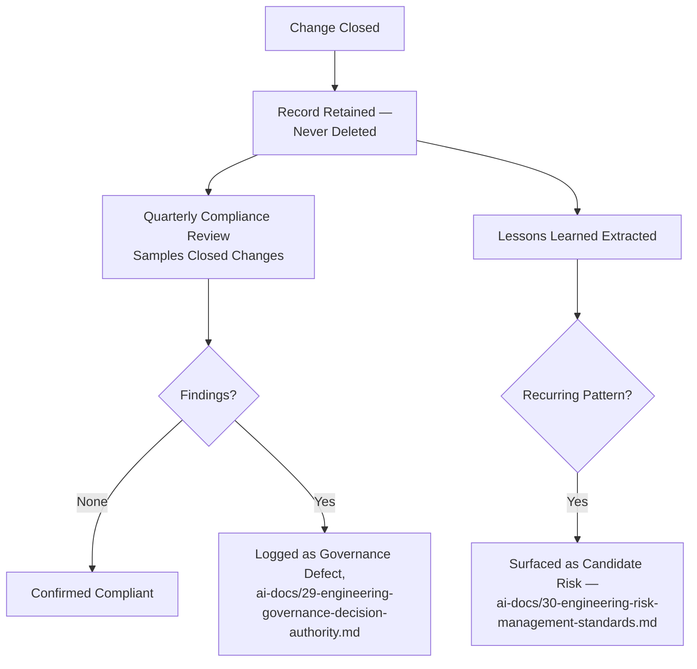
```mermaid
graph TD
    A[Change Closed] --> B[Record Retained —<br/>Never Deleted]
    B --> C[Quarterly Compliance Review<br/>Samples Closed Changes]
    C --> D{Findings?}
    D -->|None| E[Confirmed Compliant]
    D -->|Yes| F[Logged as Governance Defect,<br/>ai-docs/29-engineering-governance-decision-authority.md]
    B --> G[Lessons Learned Extracted]
    G --> H{Recurring Pattern?}
    H -->|Yes| I[Surfaced as Candidate Risk —<br/>ai-docs/30-engineering-risk-management-standards.md]
```

---

# Change Metrics

Per the Actionable Metrics principle already established in `ai-docs/18-observability-standards.md`, every metric below ties to a real question a Tech Lead, Release Engineer, or the Engineering Leadership Council will actually ask.

| Metric | Definition | What a Regression Signals |
|---|---|---|
| **Change success rate** | Percentage of changes completing Closure without requiring a rollback or a follow-up Emergency Change. | A declining rate signals a gap in Risk Review, Testing, or Approval rigor for the tier(s) actually failing. |
| **Rollback rate** | Percentage of changes triggering Rollback Governance. | A rising rate is the most direct signal that classification tiers or evidence requirements need recalibration. |
| **Emergency change rate** | Count of Emergency Changes per unit time, relative to total change volume. | A rising trend signals either declining pre-release quality or an under-resourced Normal Change cadence pushing urgent fixes outside the normal path, per the identical signal already established in `ai-docs/27-branching-release-strategy.md`'s Hotfix Frequency metric. |
| **Failed change rate** | Percentage of changes failing Validation outright (never reaching Closure as planned). | A rising rate signals Planning or Pre-Deployment Checklist gaps. |
| **Approval time** | Time from Request to full Approval, per classification tier. | A rising trend at a given tier signals that tier's Approval Authority is under-resourced or over-scoped, per the identical Decision Turnaround Time signal in `ai-docs/29-engineering-governance-decision-authority.md`. |
| **Implementation duration** | Time from Approval to Completion. | A widening duration relative to the change's tier signals a deployment or validation bottleneck. |
| **Post-change incidents** | Count of Sev 1/Sev 2 incidents traceable to a change within a defined window (e.g., 72 hours) after its Closure. | The single most direct signal of change governance effectiveness — a rising rate demands immediate review of the framework itself. |
| **Audit findings** | Count and severity of findings from the periodic Compliance Review above. | Any non-trivial finding is treated as an active governance defect, per Change Audit above. |
| **Mean recovery time** | Average time from a rollback trigger to confirmed, stable reversion. | A rising trend signals Rollback Testing or Rollback Readiness gaps, per Rollback Governance above. |

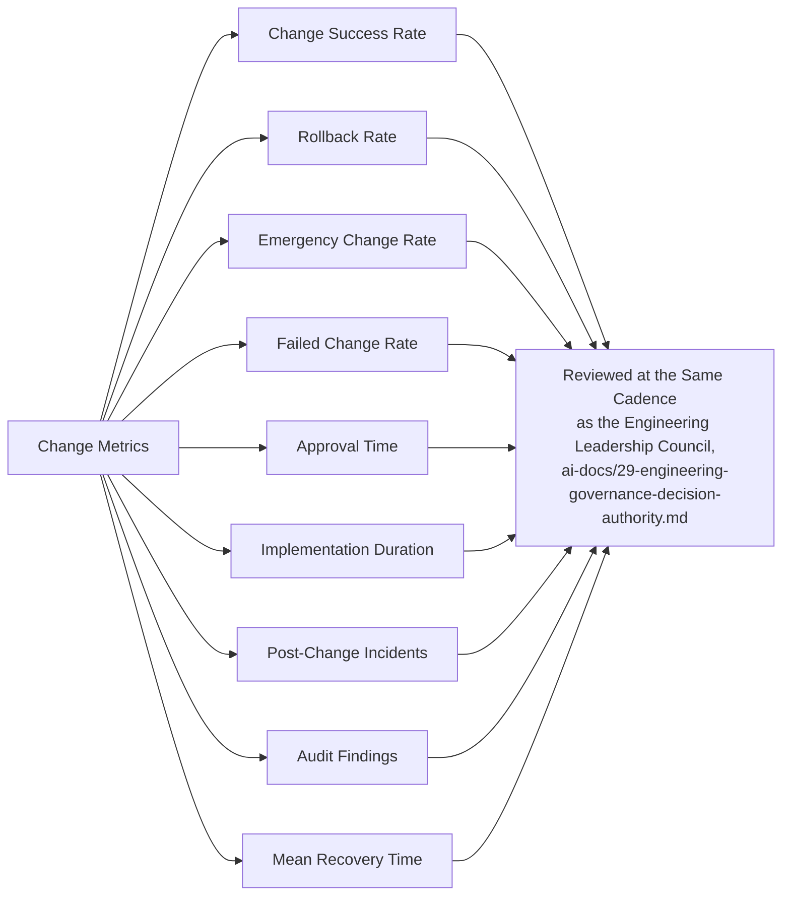
```mermaid
graph LR
    A[Change Metrics] --> B[Change Success Rate]
    A --> C[Rollback Rate]
    A --> D[Emergency Change Rate]
    A --> E[Failed Change Rate]
    A --> F[Approval Time]
    A --> G[Implementation Duration]
    A --> H[Post-Change Incidents]
    A --> I[Audit Findings]
    A --> J[Mean Recovery Time]
    B & C & D & E & F & G & H & I & J --> K[Reviewed at the Same Cadence<br/>as the Engineering Leadership Council,<br/>ai-docs/29-engineering-governance-decision-authority.md]
```

---

# AI-Assisted Change Management

Consistent with the identical AI-assistance principle already established across every governance document in this handbook (`ai-docs/24` through `ai-docs/30`): **AI accelerates analysis and drafting, never authority.**

### AI-Assisted Impact Analysis

An AI tool may analyze a proposed change's diff against the module dependency graph and surface a candidate list of affected systems for the requester to confirm — every such surfaced candidate is verified by the requester and Tech Lead before it populates the Change Request's Affected Systems field, never trusted as a complete answer on its own.

### AI-Assisted Documentation

An AI tool may draft the Technical Summary or Business Justification fields from a linked ticket and diff — the draft is reviewed and, where necessary, corrected by the requesting engineer before submission, per the identical Accuracy Over Quantity discipline already established in `ai-docs/24-documentation-standards.md`.

### AI-Assisted Rollout Recommendations

An AI tool may suggest a candidate deployment strategy or bake-in window duration based on the change's classification tier and historical outcomes of similar changes — every such suggestion is a draft input for the approving authority to evaluate, never a substitute for the Change Classification Matrix's stated requirements.

### AI-Assisted Risk Identification

An AI tool may flag a change that resembles a previously rolled-back or incident-linked change, or surface a relevant entry from the Risk Register (`ai-docs/30-engineering-risk-management-standards.md`) — every flag is independently verified before it influences classification or approval.

### AI-Generated Summaries

Where a Change Request's Closure report or a periodic Change Metrics summary is drafted with AI assistance, the draft is verified against the actual Change Log data by a human (typically the Release Engineer or Engineering Manager) before it is published, per the identical AI Meeting Summaries standard already established in `ai-docs/29-engineering-governance-decision-authority.md`.

### Human Approval Requirements

No change, at any classification tier, is approved on the basis of an AI tool's analysis alone. Every Approval named in Change Approval Authority above is a named human, and that requirement carries no AI exception, at any tier, ever — identical to the Human Authority standard already established throughout this handbook's governance chapters.

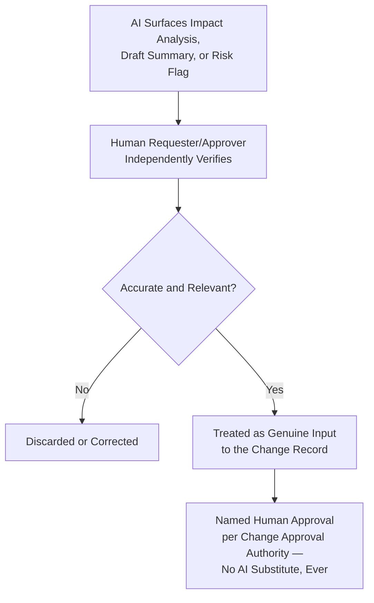
```mermaid
graph TD
    A[AI Surfaces Impact Analysis,<br/>Draft Summary, or Risk Flag] --> B[Human Requester/Approver<br/>Independently Verifies]
    B --> C{Accurate and Relevant?}
    C -->|No| D[Discarded or Corrected]
    C -->|Yes| E[Treated as Genuine Input<br/>to the Change Record]
    E --> F[Named Human Approval<br/>per Change Approval Authority —<br/>No AI Substitute, Ever]
```

---

# Engineering Change Anti-Patterns

The following patterns are explicitly rejected, regardless of how convenient they appear under deadline pressure — each is a specific, previously observed change-management failure mode, called out here so Arwal does not have to relearn the lesson expensively at Phase 250.

| Anti-Pattern | Description | Why It's Rejected |
|---|---|---|
| **Unapproved Production Changes** | A change reaching production with no corresponding Change Request, or with an approval recorded after the fact to paper over an already-completed action. | Violates Every Production Change Is Intentional above and the "No Direct Push to `main`, Ever" principle already established in `ai-docs/06-git-workflow.md`. |
| **Missing Rollback Plan** | A change approved with a Rollback Plan field left vague ("we'll roll back if needed") rather than a concrete mechanism. | Violates Reversible Changes above and the standing Rollback Readiness precondition in `ai-docs/16-deployment-standards.md`. |
| **Skipping Testing** | A change promoted without its tier's required Testing evidence, "to save time." | Violates Evidence Before Approval above and the Testing requirements at every tier in Change Classification Matrix. |
| **Large Bundled Changes** | A single Change Request bundling several unrelated concerns, making impact analysis and rollback ambiguous. | Violates Small, Incremental Changes above and the identical Scope Discipline principle already established in `ai-docs/02-engineering-principles.md`. |
| **Hidden Infrastructure Changes** | An infrastructure change applied via console access rather than reviewed IaC, invisible to the Change Log. | Violates Infrastructure as Code (`ai-docs/16-deployment-standards.md`) and Transparency above. |
| **Undocumented Emergency Fixes** | An Emergency Change whose Post-Implementation Review is never completed, leaving no permanent record of what was actually deployed. | Violates the Post-Implementation Review standard in Emergency Changes above; an undocumented emergency fix is indistinguishable from an unapproved one six months later. |
| **No Post-Change Validation** | A change marked Closed without its stated Acceptance Criteria ever being checked. | Violates Change Validation above; "it seems to be working" is not evidence. |
| **Approval Bypass** | A change proceeding to Implementation before every required approver in the Approval Matrix has signed off, "because they're unavailable and it's time-sensitive." | Violates Accountability above; a time-sensitive change that is not an Emergency Change per the defined criteria still requires its full approval chain, or must be escalated per `ai-docs/29-engineering-governance-decision-authority.md`'s Escalation Process — never quietly skipped. |

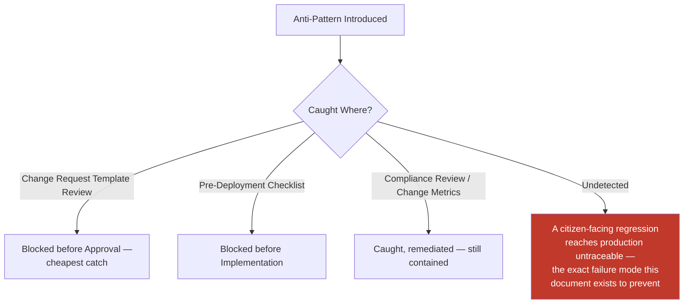
```mermaid
graph TD
    A[Anti-Pattern Introduced] --> B{Caught Where?}
    B -->|Change Request Template Review| C[Blocked before Approval —<br/>cheapest catch]
    B -->|Pre-Deployment Checklist| D[Blocked before Implementation]
    B -->|Compliance Review / Change Metrics| E[Caught, remediated — still contained]
    B -->|Undetected| F[A citizen-facing regression<br/>reaches production untraceable —<br/>the exact failure mode this<br/>document exists to prevent]
    style F fill:#c0392b,color:#fff
```

---

# Engineering Review Checklist

Every Change Request, at any classification tier, is checked against the following before it is considered change-management-compliant:

- [ ] **Correctly categorized** — The change matches exactly one primary Change Category, per Change Categories above.
- [ ] **Correctly classified** — Low/Medium/High/Critical, per Change Classification Matrix, confirmed (not merely estimated) at Risk Review.
- [ ] **Change Request Template complete** — Every mandatory field populated substantively, never left as a placeholder.
- [ ] **Business Justification stated** — A specific, current need, never a speculative one.
- [ ] **Rollback plan concrete** — A specific, testable mechanism, never a vague intention.
- [ ] **Testing evidence matches the tier** — Per the Required Testing column in Change Classification Matrix.
- [ ] **Correct Approval Authority engaged** — Matching the Approval Matrix in Change Approval Authority above.
- [ ] **Separation of Duties respected** — For High/Critical tiers, requester, approver, and post-change validator are distinct individuals.
- [ ] **Deployment window checked against active Change Freeze** — Per Change Planning above, unless the change is a genuine Emergency Change.
- [ ] **Communication Plan matches the tier** — Per the Communication Requirement column in Change Classification Matrix and Change Communication above.
- [ ] **Deployment strategy matches the tier** — Rolling/Blue-Green/Canary/Feature Flag/Shadow chosen per Change Execution above and `ai-docs/16-deployment-standards.md`.
- [ ] **Post-Change Verification criteria explicit** — Specific and checkable, stated before Implementation begins.
- [ ] **Monitoring and rollback readiness confirmed** — Per the Pre-Deployment Checklist in Change Execution above.
- [ ] **Emergency Change, if applicable, has a completed Post-Implementation Review** — Within one business day, per Emergency Changes above.
- [ ] **AI-assisted content independently verified** — Any AI-drafted field or AI-surfaced flag fact-checked by a human before being relied upon.
- [ ] **No anti-pattern present** — No unapproved change, missing rollback plan, skipped testing, oversized bundle, hidden infrastructure change, undocumented emergency fix, unvalidated closure, or approval bypass.
- [ ] **Record retained for Audit** — Logged permanently in the Change Log, per Change Audit above.
- [ ] **No duplication of Git Workflow, Development Workflow, Deployment, CI/CD, Branching/Release, Governance, Risk Management, or Incident Management standards** — Any such concern deferred entirely to its owning phase document, never redefined here.

A Change Request failing any item above is not considered ready for Implementation until resolved — this checklist carries the same non-negotiable authority as every other review checklist established in the preceding thirty-one phase documents.

---

# Governance Review

### Annual Review of the Change Management Framework

This document's own classification thresholds, approval chains, evidence requirements, and Standard Change pre-approval list are reviewed no less than **annually** by the Engineering Leadership Council, per the identical standing self-review commitment already established in `ai-docs/30-engineering-risk-management-standards.md`'s closing framework-review obligation. The annual review specifically asks: does the Low/Medium/High/Critical boundary still reflect Arwal's actual incident and rollback history; are any pre-approved Standard Change categories overdue for their quarterly re-qualification; and has the Emergency Change rate trended in a direction that demands upstream investment rather than a change to this document's thresholds.

### Continuous Improvement

Between annual reviews, Change Metrics (above) are watched continuously by the Engineering Leadership Council at its standing meeting cadence (`ai-docs/29-engineering-governance-decision-authority.md`) — a sharp, sustained shift in any metric (a spike in rollback rate, a persistent rise in Emergency Change frequency) triggers an out-of-cycle review of the specific classification tier or category implicated, never deferred to the next scheduled annual review.

### Metrics-Driven Updates

Any proposed change to this document's own thresholds, approval chains, or Standard Change list is itself governed as a Documentation Change (per Change Categories above) requiring, at minimum, Architecture Review Board sign-off — a structural amendment to Arwal's change-governance framework is never made informally, mirroring the identical rigor already required for any foundational `ai-docs/*` amendment throughout this handbook.

### Governance Ownership

The Engineering Leadership Council is the standing, accountable owner of this document's continued fitness, per the identical Governance Boards structure already established in `ai-docs/29-engineering-governance-decision-authority.md` — a specific Principal Engineer or the VP Engineering is named as this document's individual accountable Owner (per the Accountability standard in `ai-docs/29-engineering-governance-decision-authority.md`), recorded in the document's own header metadata alongside its Status.

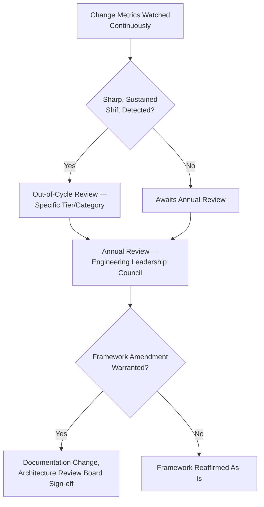
```mermaid
graph TD
    A[Change Metrics Watched<br/>Continuously] --> B{Sharp, Sustained<br/>Shift Detected?}
    B -->|Yes| C[Out-of-Cycle Review —<br/>Specific Tier/Category]
    B -->|No| D[Awaits Annual Review]
    C & D --> E[Annual Review —<br/>Engineering Leadership Council]
    E --> F{Framework Amendment<br/>Warranted?}
    F -->|Yes| G[Documentation Change,<br/>Architecture Review Board Sign-off]
    F -->|No| H[Framework Reaffirmed As-Is]
```

---

# Relationship to Previous Standards

### Project Vision

`ai-docs/00-project-vision.md` establishes Trust over Growth-at-all-costs and Transparency over Opacity as founding pillars. This document is the operational mechanism that keeps every production change accountable to those pillars — a change that erodes citizen trust for the sake of velocity is exactly what this document's proportional governance exists to prevent.

### Engineering Principles

`ai-docs/02-engineering-principles.md` establishes Small, Reviewable Increments and the Technical Debt Policy. This document's Small, Incremental Changes principle and its treatment of an unresolved Change Request as tracked, visible work directly extend that founding discipline to the specific act of changing production.

### Development Workflow

`ai-docs/07-development-workflow.md` owns the complete Engineering Lifecycle and Incident Response Workflow this document's Change Request Lifecycle and Emergency Changes sections are built directly on top of, never redefining a single lifecycle stage or incident-response step.

### Deployment Standards

`ai-docs/16-deployment-standards.md` owns environments, deployment strategies, rollback mechanics, and the Production Readiness Checklist in full. This document's Change Execution and Rollback Governance sections apply governance judgment to *which* of those already-defined mechanics a given change's tier requires — never redefining the mechanics themselves.

### CI/CD Standards

`ai-docs/17-cicd-standards.md` owns the exact, executable pipeline that produces the evidence this document's Change Request Template and Change Audit sections rely on — this document never redefines a workflow stage or a required check.

### Security Standards

`ai-docs/10-security-standards.md` owns the complete, enforceable security control set and security Incident Response process this document's Security Change category and High/Critical-tier Security Validation requirements are built on top of, never redefined here.

### Engineering Governance

`ai-docs/29-engineering-governance-decision-authority.md` owns the complete organizational decision-authority structure — every board, every role, every escalation tier this document's Change Approval Authority section names is drawn directly from that structure, applied specifically to change approval, never duplicated.

### Engineering Risk Management

`ai-docs/30-engineering-risk-management-standards.md` owns the complete standing Risk Register and Risk Assessment Framework. This document's Change Classification Matrix governs a bounded, time-limited event; where a change surfaces a persistent risk beyond its own lifecycle, that risk is logged into the Risk Register this document never redefines.

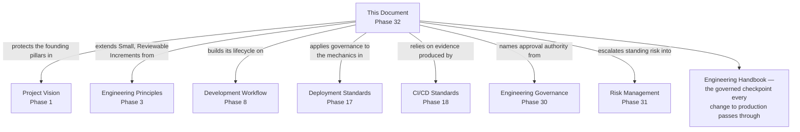
```mermaid
graph TD
    A[This Document<br/>Phase 32] -->|"protects the founding pillars in"| B[Project Vision<br/>Phase 1]
    A -->|"extends Small, Reviewable<br/>Increments from"| C[Engineering Principles<br/>Phase 3]
    A -->|"builds its lifecycle on"| D[Development Workflow<br/>Phase 8]
    A -->|"applies governance to<br/>the mechanics in"| E[Deployment Standards<br/>Phase 17]
    A -->|"relies on evidence produced by"| F[CI/CD Standards<br/>Phase 18]
    A -->|"names approval authority from"| G[Engineering Governance<br/>Phase 30]
    A -->|"escalates standing risk into"| H[Risk Management<br/>Phase 31]
    A --> I[Engineering Handbook —<br/>the governed checkpoint every<br/>change to production passes through]
```

---

# Closing Statement

> **Callout — Closing Statement**
> Every preceding phase document described a standard for how Arwal is designed, built, secured, tested, deployed, governed, and risk-managed. This document describes the discipline that turns every one of those standards into a specific, accountable, evidenced act every time a real change touches a citizen's booking, payment, or government application. Change management is not a brake on Arwal's velocity — it is the reason that velocity can be sustained indefinitely, because a change made intentionally, classified proportionally, approved by the right authority, tested to the depth its risk demands, and reversible the moment it proves wrong is a change Arwal can make again tomorrow with the same confidence, and again the day after that, for every one of the ~268 micro-phases still ahead. A district's trust in Arwal is not built by never changing — a platform that never changes stagnates and eventually fails its citizens in a different, slower way — it is built by changing constantly, visibly, and safely, so that every citizen who depends on Arwal today can depend on it, unchanged in its trustworthiness, tomorrow. Where a future phase must deviate from a standard stated here, that deviation is made explicitly — through this document's own Governance Review process, or a Strategic-classification ADR where the deviation is structural — never silently, and never by default.

This document, `ai-docs/31-change-management-governance-standards.md`, is Phase 32 of approximately 300. Every change requested, assessed, approved, implemented, validated, and audited in the phases that follow is expected to satisfy the standards defined here, or to justify its deviation in writing.

**End of Phase 32 — `ai-docs/31-change-management-governance-standards.md`**