# Technical Debt Management Standards

**Document:** `ai-docs/32-technical-debt-management-standards.md`
**Project:** Arwal — The District Super App
**Stage:** 1 — Foundation
**Phase:** 33 — Technical Debt Management Standards
**Status:** Approved for Engineering Reference
**Audience:** CTO, Architecture Review Board, Platform Team, Security Team, SRE, Engineering Managers, Tech Leads, Developers, QA, Product Managers, Government Technical Partners

> **Callout — Purpose of This Document**
> `ai-docs/00-project-vision.md` through `ai-docs/31-change-management-governance-standards.md` defined why Arwal exists and every enforceable discipline governing how it is designed, written, secured, tested, deployed, observed, logged, configured, documented, decided upon, reviewed, branched, released, depended upon, governed, risk-managed, and changed. Every one of those documents assumes the codebase they govern stays maintainable over ~300 micro-phases. None of them, individually, answers the question that determines whether that assumption holds: **what happens to the gap between the code Arwal has and the code Arwal should have, and who is accountable for closing it before it closes Arwal's options instead?** This document is that answer — Arwal's Technical Debt Management charter, for every one of the ~300 micro-phases still ahead.

---

# Purpose of this Document

### Why Technical Debt Management Exists

Every deliberate engineering shortcut, every deferred refactor, every "good enough for now" implementation is a small loan against Arwal's future engineering capacity. A loan taken consciously, tracked, and repaid on a plan is a normal, healthy part of shipping software under real constraints — exactly as a business takes on financial debt to fund growth it could not otherwise afford. A loan taken silently, forgotten, and left to compound is how a codebase that was once a pleasure to work in becomes, by Phase 150, a place where every change is slower, riskier, and more expensive than it needs to be — not because any single decision was wrong, but because a thousand small, untracked shortcuts accumulated interest nobody was watching. Technical Debt Management exists to make sure Arwal only ever carries the first kind of debt.

### Sustainable Engineering

Arwal's founding commitment, per `ai-docs/00-project-vision.md`, is to build infrastructure a district can depend on for a generation — not a fast-moving demo optimized for a single funding round. Sustainable engineering velocity is not the velocity Arwal has on day one; it is the velocity Arwal still has at Phase 250, after years of feature work, team turnover, and real citizen load. Technical debt, left unmanaged, is the single most reliable way to trade day-one velocity for a permanently degraded Phase-250 velocity — this document exists to keep that trade from happening by accident.

### Long-Term Maintainability

Per the Engineering Excellence definition already established in `ai-docs/02-engineering-principles.md` — Correct, Clear, Consistent, Secure, Observable, Resilient, **Maintainable**, Accountable — maintainability is not a nice-to-have quality attribute alongside the others; it is the property that determines whether every other quality attribute can still be verified and improved six years from now. Technical debt is the specific, accumulating threat to that property, and this document is where Maintainability's abstract commitment becomes a concrete, tracked, budgeted engineering practice.

### Engineering Investment

A codebase is an asset, and technical debt reduction is capital reinvestment in that asset — never a discretionary "nice to have someday" activity squeezed in only when a sprint happens to be light. Per the Continuous Refactoring Budget commitment already established in `ai-docs/00-project-vision.md`, Arwal treats debt repayment as a standing, planned line item in every engineering cycle, exactly as a well-run business budgets for equipment maintenance rather than waiting for equipment to fail.

### Business Value

Technical debt is never managed as a purely internal engineering concern disconnected from Arwal's civic and commercial mission. Every debt item this document governs is ultimately about protecting a citizen's ability to book a doctor, pay a merchant, or renew a certificate reliably — a codebase too brittle to extend safely eventually fails its citizens through slower features, more incidents, and a widening gap between what the district needs and what Arwal can actually ship. Prioritization in this document is explicitly anchored to that business value, never to engineering taste alone.

### Relationship with Engineering Principles

`ai-docs/02-engineering-principles.md` already establishes the founding Technical Debt Policy — debt is acknowledged as inevitable, must be logged at the moment it's introduced, receives a reserved capacity budget, and is prioritized by whether it affects security, data integrity, or citizen-facing reliability. This document does not redefine that founding policy; it is the complete, standalone operational expansion of it — every principle sketched there (tracked, budgeted, never silent) is fully specified here with the categories, lifecycle, register, prioritization framework, ownership model, and metrics that document deliberately left undefined.

### Relationship with Engineering Risk Management

`ai-docs/30-engineering-risk-management-standards.md` already owns the complete Risk Register, Risk Assessment Framework, and Risk Classification tiers for standing engineering uncertainty. Technical debt is a close cousin of risk but a distinct concept: a **risk** is uncertainty about whether something bad will happen; **technical debt** is a known, already-existing gap between the current and ideal state of the system, whose cost is compounding interest rather than probabilistic exposure. Where a debt item's *consequence* is uncertain enough to also constitute a standing risk (an unrefactored payment module that could fail under load), it is cross-referenced into the Risk Register per that document's framework — this document never duplicates Risk Classification's scoring mechanics, and that document never duplicates this one's debt-specific categories.

### Relationship with Change Management

`ai-docs/31-change-management-governance-standards.md` already owns the complete Change Request lifecycle for a bounded, time-limited production change. A technical debt *repayment* — a refactor, a migration, a dependency upgrade — is implemented as a governed Change per that document's framework once it reaches the Implementation stage of the lifecycle this document defines. This document owns the decision of *what debt exists, how it is prioritized, and when it is scheduled*; `ai-docs/31-change-management-governance-standards.md` owns *how the resulting change is safely deployed*, and this document never redefines a Change Request field or approval chain.

### Relationship with Engineering Governance

`ai-docs/29-engineering-governance-decision-authority.md` already owns the complete organizational decision-authority structure — roles, boards, escalation, delegation. Every approval authority named in this document's Technical Debt Classification and Ownership sections is a role already defined there, applied specifically to the act of accepting, prioritizing, or deferring technical debt — never a new authority structure invented here.

### Relationship with Architecture Principles

`ai-docs/03-system-architecture-principles.md` already establishes Evidence over Prediction and the Migration Strategy's indicator-based discipline for extracting a module from the Modular Monolith. A significant share of Architecture-category debt (below) is precisely the accumulated evidence that Migration Strategy's indicators exist to detect — this document tracks that accumulation explicitly; `ai-docs/03-system-architecture-principles.md` governs what happens once the evidence justifies extraction.

---

# Technical Debt Philosophy

Arwal's technical debt management rests on eight commitments. Together they answer the question every subsequent section of this document exists to make concrete: **what makes debt management actually protect the codebase, rather than merely document its decay?**

### Debt Is Intentional, Not Accidental

A deliberate shortcut, taken consciously with a stated reason and a stated repayment plan, is legitimate engineering practice — restating the identical Technical Debt Policy already established in `ai-docs/02-engineering-principles.md`: "acknowledged as an inevitable and sometimes rational trade-off — not a moral failure." This exists because pretending debt never happens produces engineers who hide shortcuts rather than track them, which is categorically worse than the shortcut itself; naming debt as an accepted, normal category of decision is what makes it safe to be honest about.

### Every Debt Has an Owner

A debt item with no named, accountable owner is not managed debt — it is an abandoned liability nobody is responsible for noticing has grown worse, mirroring the identical Named Ownership principle already established in `ai-docs/29-engineering-governance-decision-authority.md` and `ai-docs/30-engineering-risk-management-standards.md`. This exists because an unowned debt item never gets prioritized in any sprint planning conversation — there is no one in the room whose job it is to advocate for it.

### Debt Must Be Visible

Every debt item of Medium classification or above is recorded in a single, citable, permanent location every engineer can see — never left in an engineer's private notes, a Slack thread, or an unspoken team norm, mirroring the identical Transparency principle already established throughout this handbook. This exists because a debt item known only to the engineer who introduced it disappears the moment that engineer moves to a different team, exactly the tribal-knowledge failure mode `ai-docs/24-documentation-standards.md` already exists to prevent.

### Debt Must Be Measurable

A debt item is described in terms a reader can verify and compare against another debt item — its category, its classification, its estimated repayment effort, its business impact — never as a vague, unquantified "this code is bad," mirroring the identical Measurable requirement already established in `ai-docs/25-architecture-decision-records.md`'s Decision Quality Standards. This exists because an unmeasured debt backlog cannot be prioritized rationally; it can only be argued about.

### Prevention Over Accumulation

The cheapest technical debt is the debt that is never incurred — every mechanism in Technical Debt Prevention below exists because catching a shortcut at the moment it is proposed, in code review, is dramatically cheaper than discovering it as an accumulated liability eighteen months later. This exists because, per the identical Shift Left reasoning already established in `ai-docs/15-testing-standards.md` and `ai-docs/17-cicd-standards.md`, the cost of any defect — including a structural one — grows the longer it survives undetected.

### Continuous Repayment

Debt repayment is a standing, budgeted, every-cycle activity — never a one-time "debt sprint" scheduled only after the backlog has already become unmanageable, mirroring the identical Continuous Refactoring Budget commitment already established in `ai-docs/00-project-vision.md`. This exists because a codebase that only ever pays down debt in occasional, dramatic bursts spends most of its life in a degraded state, and a "debt sprint" large enough to matter is itself a high-risk, poorly-scoped change of exactly the kind `ai-docs/31-change-management-governance-standards.md`'s Small, Incremental Changes principle warns against.

### Business Alignment

Debt prioritization is never driven by engineering preference alone — it is weighed against the same citizen-facing and commercial outcomes every other governance document in this handbook is ultimately in service of, per Business Value above. This exists because an engineering organization that repays debt purely by its own aesthetic judgment, disconnected from what the district actually needs from Arwal next, will optimize for the wrong things even while working hard and honestly.

### Continuous Improvement

Arwal's debt management practice — its categories, its classification thresholds, its budget allocation — is itself periodically re-evaluated against what Technical Debt Metrics (below) actually reveal, per the identical Continuous Improvement discipline already established in `ai-docs/30-engineering-risk-management-standards.md` and `ai-docs/31-change-management-governance-standards.md`. This exists because a debt framework calibrated once, in Phase 33, and never revisited will drift out of fit with Arwal's actual codebase, team size, and risk profile as all three evolve.

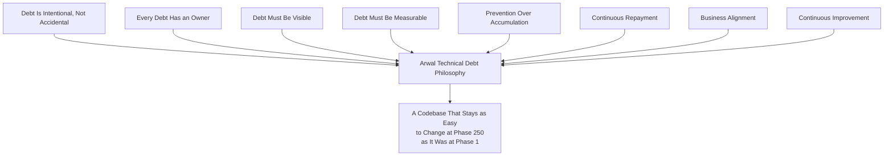

> **Callout — The One-Sentence Technical Debt Philosophy**
> *"Debt taken on consciously, named honestly, owned by someone, and repaid on a real plan costs Arwal a schedule line; debt taken on silently and left to compound costs Arwal its ability to move at all."*

---

# What Is Technical Debt

Technical debt is a **deliberate or discovered gap between the current state of the system and its ideal, sustainable state** — a gap that, if left unaddressed, makes future work slower, riskier, or more expensive than it would otherwise be. Precision here matters: technical debt is frequently confused with several adjacent, but distinct, categories of engineering work, and conflating them misdirects both prioritization and the metrics in this document.

| Category | Definition | Distinguishing Test | Governing Document |
|---|---|---|---|
| **Bug** | Code that does not do what it was specified to do. | "Is the current behavior wrong relative to its own specification?" — if yes, it's a bug, not debt. | `ai-docs/07-development-workflow.md`'s Bug Fix Workflow |
| **Incident** | An active, citizen-facing or system-facing failure happening now. | "Is this actively causing harm right now?" — if yes, it's an incident, not debt (though an unresolved debt item is frequently an incident's *root cause*). | `ai-docs/07-development-workflow.md`, `ai-docs/10-security-standards.md` |
| **Feature Work** | New capability the system does not yet have. | "Does this add new, specified behavior?" — if yes, it's feature work, not debt. | `ai-docs/07-development-workflow.md`'s Feature Development Workflow |
| **Refactoring** | Improving code structure with no behavior change, per `ai-docs/02-engineering-principles.md`'s Refactoring Principles. | Refactoring is frequently the *mechanism* by which debt is repaid — but "leave the code slightly better than you found it" opportunistic refactoring is routine hygiene, not itself a tracked debt item, unless the underlying structural gap is significant enough to meet this document's Technical Debt Classification thresholds. | `ai-docs/02-engineering-principles.md`'s Refactoring Principles |
| **Architecture Evolution** | A deliberate, evidence-based structural change per the Migration Strategy in `ai-docs/03-system-architecture-principles.md`. | Planned architectural evolution triggered by genuine scaling evidence is *not*, by itself, debt repayment — it becomes an Architecture Debt item specifically when the current state is already a demonstrated constraint on delivery, not merely a future one being planned for ahead of need. | `ai-docs/03-system-architecture-principles.md` |
| **Planned Engineering Investment** | A deliberately scoped, forward-looking capability build (a new shared service, a new testing framework). | Investment adds new capacity; debt repayment restores capacity that has been eroded. The two are budgeted from different conversations, even though both compete for the same engineering calendar. | `ai-docs/07-development-workflow.md` |
| **Technical Debt** | A known gap between current and ideal state that makes future work slower, riskier, or more costly if left unaddressed. | "Would fixing this make no functional difference to a citizen today, but make every future change in this area cheaper, safer, or faster?" — if yes, it's debt. | This document |

### Practical Examples

| Scenario | Category | Why |
|---|---|---|
| A booking's price is calculated incorrectly under a specific promotion combination. | Bug | The code does not match its own specification. |
| The payment gateway is returning 5xx errors platform-wide right now. | Incident | Active, ongoing harm. |
| Adding support for a new government scheme application type. | Feature Work | New, specified behavior. |
| Extracting a repeated validation block into a shared helper, discovered mid-PR. | Routine Refactoring | Small, opportunistic, no separate tracking needed. |
| The `local-services` module's booking logic is deeply coupled to `commerce`'s pricing internals, discovered while shipping an unrelated feature, and every touch to either module now risks breaking the other. | **Architecture Debt** | A known, structural gap slowing every future change to either module — tracked, owned, prioritized. |
| A `PricingCalculatorService` was written with a documented `// TODO(ARWAL-4821)` shortcut under deadline pressure, per the Commenting Standards already established in `ai-docs/05-coding-standards.md`. | **Code Debt**, deliberately incurred | Named at the moment of creation, per Debt Is Intentional above. |
| A dependency flagged Deprecated in `ai-docs/22-dependency-management-standards.md`, with a migration plan not yet executed. | **Dependency Debt** | Already governed by that document's mechanics; tracked here as a debt item cross-referencing it. |
| A module has 40% unit test coverage against Arwal's 90% floor for the Domain layer, discovered during a security audit. | **Testing Debt** | A known gap making every future change in that module riskier to verify. |

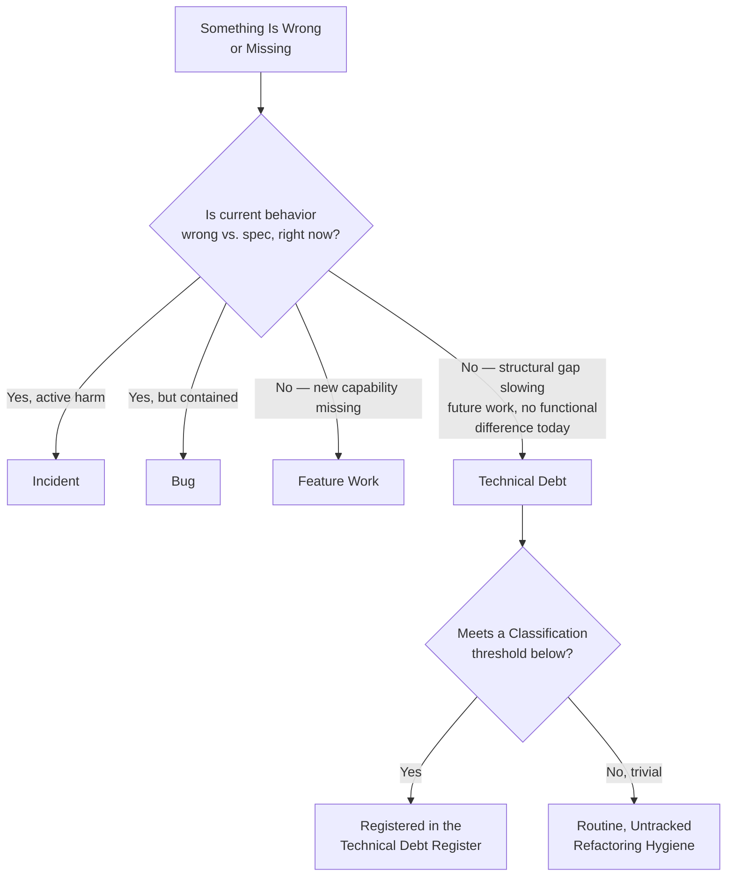

---

# Technical Debt Categories

Every debt item belongs to exactly one primary category (a secondary tag may apply where a debt item genuinely spans two, e.g., Database Debt that is also Performance Debt — the primary category still determines default ownership).

### Architecture Debt

**Definition:** A structural boundary, dependency direction, or pattern that no longer matches how the system actually needs to be shaped, per `ai-docs/03-system-architecture-principles.md`.
**Examples:** A module boundary quietly eroded by a "just this once" cross-module import; a module overdue for extraction per the Migration Strategy's own indicators, left unaddressed past the point of clear evidence.
**Typical Owner:** Architecture Review Board, or the affected domain's Tech Lead for a single-module boundary issue.
**Potential Impact:** Compounding coupling; every future change in the affected modules becomes progressively riskier and slower.

### Code Debt

**Definition:** A localized deficiency in code quality, structure, or clarity within an already-correct architecture, per `ai-docs/05-coding-standards.md`.
**Examples:** A God Class accumulated past its original scope; a documented `// TODO`/`// FIXME` shortcut never revisited; a Common Code Smell (`ai-docs/05-coding-standards.md`) left unaddressed after review flagged it as non-blocking.
**Typical Owner:** The module's owning Tech Lead.
**Potential Impact:** Slower, riskier changes localized to the affected file/module; a magnet for further shortcuts as engineers "match the existing style."

### Database Debt

**Definition:** A schema, index, or data-model gap relative to `ai-docs/14-database-design-guidelines.md`'s standards.
**Examples:** A table missing an audit-field or soft-delete pattern it should have; a denormalization applied without its required consistency mechanism; a missing composite index discovered via slow-query monitoring.
**Typical Owner:** The schema-owning module's Tech Lead, with Platform/DBA consultation for a cross-cutting fix.
**Potential Impact:** Data integrity risk, degrading query performance as volume grows, harder future migrations.

### Infrastructure Debt

**Definition:** A gap in provisioned infrastructure relative to `ai-docs/16-deployment-standards.md`'s standards.
**Examples:** A manually-provisioned resource never captured in Infrastructure as Code; an environment that has drifted from Configuration Parity (`ai-docs/23-environment-strategy.md`); an under-automated deployment step.
**Typical Owner:** Platform Team.
**Potential Impact:** Slower, error-prone operations; a snowflake environment (`ai-docs/23-environment-strategy.md`'s Anti-Patterns) nobody can fully reconstruct.

### Security Debt

**Definition:** A known gap relative to `ai-docs/10-security-standards.md`'s controls, not yet an active incident.
**Examples:** An unpatched dependency CVE within its remediation window but not yet fixed; a service holding broader IAM privilege than Least Privilege requires; an authentication flow using a deprecated pattern awaiting migration.
**Typical Owner:** Security Team, jointly with the affected domain's Tech Lead.
**Potential Impact:** Elevated breach probability, regulatory exposure, citizen trust risk — cross-referenced into the Risk Register (`ai-docs/30-engineering-risk-management-standards.md`) whenever its likelihood/impact meets that document's threshold.

### Testing Debt

**Definition:** A gap between actual and required test coverage or quality, per `ai-docs/15-testing-standards.md`.
**Examples:** A module below its layer's coverage floor; a suite of shallow, assertion-light tests inflating coverage numbers without real verification; a flaky test quarantined and never root-caused.
**Typical Owner:** The module's owning Tech Lead, jointly with QA.
**Potential Impact:** Undetected regressions, slower confident shipping, an eroding safety net for every future refactor.

### Documentation Debt

**Definition:** A gap relative to `ai-docs/24-documentation-standards.md`'s standards — missing, outdated, or inaccurate documentation.
**Examples:** A module README that no longer reflects its actual domain boundary; an undocumented, ADR-worthy decision never actually recorded per `ai-docs/25-architecture-decision-records.md`.
**Typical Owner:** The module's owning Tech Lead.
**Potential Impact:** Knowledge concentrated in too few people (overlapping with Knowledge Debt below); slower onboarding; decisions re-litigated because their reasoning was never captured.

### Dependency Debt

**Definition:** A gap already governed operationally by `ai-docs/22-dependency-management-standards.md` and `ai-docs/28-dependency-governance-standards.md` — an aging, deprecated, or under-evaluated dependency.
**Examples:** A dependency flagged Deprecated with no completed migration; a dependency pinned to a version several MAJORs behind current.
**Typical Owner:** The named dependency sponsor, per `ai-docs/28-dependency-governance-standards.md`.
**Potential Impact:** Supply-chain risk, an eventual forced, urgent migration instead of a planned one.

### Configuration Debt

**Definition:** A gap relative to `ai-docs/21-configuration-management-standards.md`'s standards.
**Examples:** A hardcoded value that should be configuration; an un-sunset feature flag left in the codebase past its review date; environment configuration schema drift between Staging and Production.
**Typical Owner:** The owning module's Tech Lead.
**Potential Impact:** Hidden behavior differences between environments; an unreadable accumulation of dead conditional branches.

### Performance Debt

**Definition:** A gap relative to the measurable targets in `ai-docs/11-performance-standards.md`.
**Examples:** An N+1 query pattern shipped under deadline pressure with a tracked `TODO`; a component missing memoization it now measurably needs; an API endpoint trending toward its p95 budget without yet breaching it.
**Typical Owner:** The affected domain's Tech Lead, with SRE consultation.
**Potential Impact:** A slow, silent erosion of citizen-facing responsiveness until an SLO breach forces urgent, reactive work.

### Scalability Debt

**Definition:** A design that will not absorb Arwal's anticipated growth, per the Scalability Strategy in `ai-docs/03-system-architecture-principles.md` and `ai-docs/11-performance-standards.md`.
**Examples:** A table without its district-scoped partition key readiness (`ai-docs/14-database-design-guidelines.md`); a synchronous call chain that will not tolerate 10x traffic.
**Typical Owner:** Architecture Review Board, SRE.
**Potential Impact:** A citizen-facing surge outpacing the platform's ability to serve it — directly overlapping with Scalability Risk in `ai-docs/30-engineering-risk-management-standards.md`.

### Reliability Debt

**Definition:** A gap in resilience patterns relative to `ai-docs/20-error-handling-standards.md` and `ai-docs/03-system-architecture-principles.md`.
**Examples:** A non-idempotent operation reachable via client retry; a missing circuit breaker on a known-flaky external dependency; an unhandled edge case discovered but not yet fixed.
**Typical Owner:** The affected domain's Tech Lead, SRE.
**Potential Impact:** Cascading failures, duplicate financial side effects, citizen-facing errors under otherwise-routine conditions.

### Operational Debt

**Definition:** A gap in how an already-built system is run day to day, per `ai-docs/16-deployment-standards.md` and `ai-docs/18-observability-standards.md`.
**Examples:** A manual deployment step never automated; a runbook that no longer matches the actual recovery procedure; a service missing a dashboard.
**Typical Owner:** SRE, DevOps/Platform Lead.
**Potential Impact:** Slower, error-prone incident response; a blind spot discovered only during an actual incident.

### Automation Debt

**Definition:** A repeated manual process that should be automated but is not, distinct from Operational Debt in that it is specifically about missing automation rather than a degraded existing process.
**Examples:** A manual data-backfill process repeated by hand each time it's needed; a manually-run compliance report.
**Typical Owner:** Platform Team, the requesting domain's Tech Lead.
**Potential Impact:** Engineering time spent repeatedly on mechanical work; a higher error rate than an equivalent automated process would carry.

### AI/ML Debt

**Definition:** A gap specific to Arwal's AI-assisted or AI-powered capabilities, per `ai-docs/09-tech-stack.md`'s AI Gateway Service and the AI Principle in `ai-docs/00-project-vision.md`.
**Examples:** A prompt template that has never been re-evaluated against its golden set (`ai-docs/15-testing-standards.md`'s AI Testing) since a provider change; an AI-assisted feature without its required human-override path fully implemented, shipped behind a flag pending completion.
**Typical Owner:** The AI Gateway Service's owning team, jointly with Security Team.
**Potential Impact:** Degraded AI output quality drifting undetected; a citizen-facing fairness or override-path gap.

### Knowledge Debt

**Definition:** Critical system understanding concentrated in too few people, per the Documentation Before Tribal Knowledge principle already established in `ai-docs/24-documentation-standards.md`.
**Examples:** A module with a single engineer who understands its non-obvious business rules; an ADR-worthy decision never recorded, now only recoverable from one person's memory.
**Typical Owner:** The affected domain's Engineering Manager and Tech Lead, jointly.
**Potential Impact:** A single departure making a system unmaintainable or a past decision unexplainable — directly overlapping with Knowledge Risk in `ai-docs/30-engineering-risk-management-standards.md`.

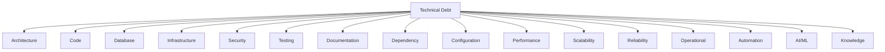

---

# Technical Debt Classification

Every debt item is assigned exactly one classification level, re-assessed whenever material new evidence emerges (a growing frequency of impact, a newly discovered downstream consequence).

| Level | Engineering Impact | Business Impact | Urgency | Review Frequency | Approval Authority |
|---|---|---|---|---|---|
| **Low** | Confined to a single file or a small, non-critical module; a minor, contained inconvenience. | None or negligible; no citizen-facing effect. | No defined deadline; addressed opportunistically or in routine capacity. | Semi-annually | Tech Lead |
| **Medium** | Slows delivery in one domain; a recurring minor annoyance for the owning team. | Indirect — slower feature delivery in one area, no direct citizen impact yet. | Addressed within 1–2 quarters. | Quarterly | Engineering Manager |
| **High** | Actively degrading delivery velocity, test confidence, or reliability in a citizen-facing or financially significant domain. | Noticeable citizen-facing risk (elevated defect rate, degrading performance) or meaningful engineering cost. | Addressed within the current or next quarter; a defined **Service-Level Expectation (SLE)** applies, per Service-Level Expectations below. | Monthly | Architecture Review Board or Security Review Board, per category |
| **Critical** | A standing, active threat to system integrity, security, or the ability to ship safely at all in the affected area. | Direct, significant citizen-facing or financial/regulatory risk if left unaddressed. | Immediate scheduling required; a defined SLE applies, per Service-Level Expectations below. | Continuous (standing watch) | CTO / Engineering Leadership Council |

### Service-Level Expectations (SLEs) for Debt Resolution

Per the Continuous Repayment principle above, Critical- and High-classification debt items are held to explicit, tracked resolution expectations — never left to indefinite, best-effort scheduling merely because they are not yet an active incident.

| Tier | Service-Level Expectation | Escalation if Missed |
|---|---|---|
| **Critical** | Mitigation plan scheduled within **5 business days** of classification; full resolution or a formally re-approved Exception (per Debt Introduced by Exception below) within **90 days**. | Automatic escalation to the Engineering Leadership Council; surfaced on the Governance dashboard per `ai-docs/29-engineering-governance-decision-authority.md`. |
| **High** | Mitigation plan scheduled within **15 business days** of classification; full resolution or a formally re-approved Exception within **180 days**. | Escalation to the Architecture Review Board or Security Review Board, per category. |

An SLE is a *scheduling* commitment, not a guarantee of instant resolution — a Critical debt item may legitimately require more than 90 days of genuine engineering effort to fully resolve, but it may never simply sit unscheduled and unmitigated for that entire window. Where full resolution cannot be achieved within the SLE window, the item is either genuinely closed, or it is converted into a governed Exception per Debt Introduced by Exception below — it is never allowed to silently remain "High, unresolved" indefinitely with no fresh decision made about it.

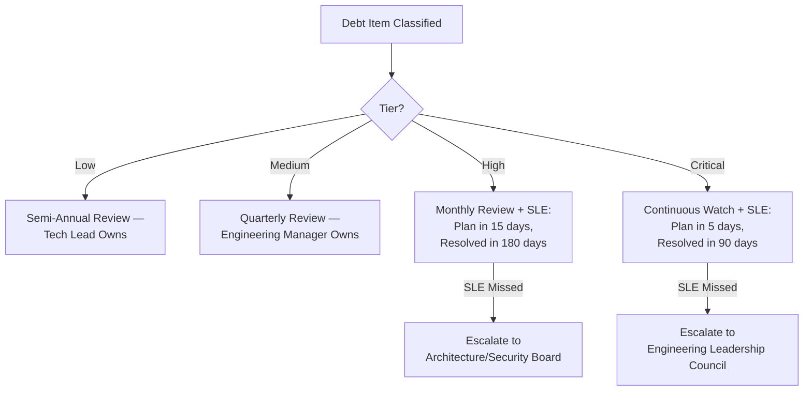

---

# Technical Debt Register

The Technical Debt Register is Arwal's single, authoritative, version-controlled record of every tracked debt item — living at `docs/technical-debt-register/` (or an equivalent tracked system), reviewed with the identical Documentation Is Code rigor already established in `ai-docs/24-documentation-standards.md`, and structurally mirroring the Risk Register already established in `ai-docs/30-engineering-risk-management-standards.md`.

| Field | Description |
|---|---|
| **Debt ID** | A permanent, sequential, zero-padded identifier (`DEBT-0001`), never reused, mirroring the Immutable Numbers principle already established for ADRs in `ai-docs/25-architecture-decision-records.md`. |
| **Title** | A short, specific, descriptive title — never vague. |
| **Description** | The precise gap between current and ideal state, and what it costs to leave unaddressed. |
| **Category** | One of the sixteen categories in Technical Debt Categories above. |
| **Owner** | A named individual, per Every Debt Has an Owner above — never a team alone. |
| **Origin** | How the debt was incurred — a deliberate, documented trade-off (with its originating PR/decision cited); a discovered pre-existing gap; or the outcome of a Debt Introduced by Exception (below). |
| **Business Impact** | The citizen-facing or commercial consequence of leaving this unaddressed. |
| **Engineering Impact** | The velocity, risk, or quality consequence for the engineering team. |
| **Priority** | The computed prioritization score, per Technical Debt Prioritization below. |
| **Status** | `Identified` / `Registered` / `Assessed` / `Prioritized` / `Approved` / `Scheduled` / `In Progress` / `Verifying` / `Retired`, per Technical Debt Lifecycle below. |
| **Estimated Effort** | A sized estimate (S/M/L/XL, or engineer-days) of the repayment work. |
| **Target Resolution** | The planned resolution date or sprint/quarter, matching its tier's SLE where applicable. |
| **Dependencies** | Any other debt item, risk, or in-flight change this one depends on or blocks. |
| **Related ADRs** | Any ADR (`ai-docs/25-architecture-decision-records.md`) this debt item's origin or resolution references. |
| **Related Risks** | Any Risk Register entry (`ai-docs/30-engineering-risk-management-standards.md`) this debt item feeds or overlaps with. |
| **Retirement Criteria** | The specific, observable condition under which this debt item is considered fully repaid — never left ambiguous. |

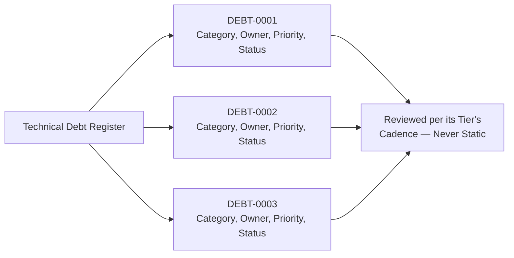

---

# Technical Debt Lifecycle

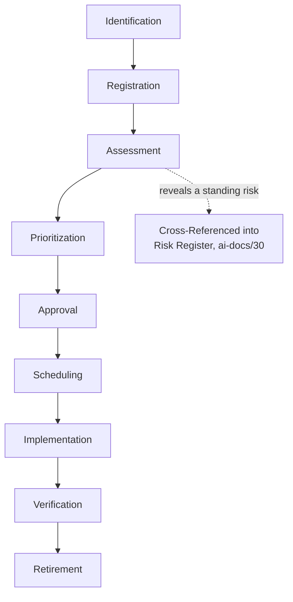

| Stage | Meaning | Exit Criteria |
|---|---|---|
| **Identification** | A debt item is first surfaced — by an engineer during implementation, a code review comment (`ai-docs/26-code-review-standards.md`), an automated scan, or a periodic Portfolio Review (below). | The gap is named and its category is roughly known. |
| **Registration** | The item is logged in the Technical Debt Register with an initial description. | Every required field is populated at least provisionally. |
| **Assessment** | Engineering and business impact are evaluated with stated reasoning, per Technical Debt Classification above. | Classification tier assigned. |
| **Prioritization** | The item is scored per Technical Debt Prioritization below, relative to every other open item. | A Priority score is recorded. |
| **Approval** | The Approval Authority matching the item's tier confirms it should be scheduled — never assumed automatic. | Sign-off recorded. |
| **Scheduling** | The item is placed into a specific sprint, quarter, or the standing debt-budget allocation, per Technical Debt Budget below. | A Target Resolution is set. |
| **Implementation** | The repayment work executes as a governed Change, per `ai-docs/31-change-management-governance-standards.md`. | The change reaches Closure per that document's lifecycle. |
| **Verification** | The Retirement Criteria are checked against the actual, post-change system. | Retirement Criteria confirmed true, or found still unmet. |
| **Retirement** | The item is marked Retired — archived, never deleted, mirroring the identical Archive Never Delete principle already established for ADRs. | Retirement Criteria verified; item permanently closed. |

---

# Technical Debt Prioritization

Debt items compete for the same finite engineering capacity as feature work — prioritization must be explicit, evidence-based, and comparable across categories, mirroring the identical Evidence-Based Assessment principle already established in `ai-docs/30-engineering-risk-management-standards.md`.

### Prioritization Factors

| Factor | Question It Answers |
|---|---|
| **Business Value** | How much citizen-facing or commercial value does resolving this unlock or protect? |
| **Engineering Risk** | How likely is this item to cause or contribute to an incident if left unaddressed? |
| **Frequency of Impact** | How often does this item actually slow down or complicate real engineering work? |
| **Cost of Delay** | How much more expensive does this item become to fix the longer it is left unaddressed? |
| **Customer Impact** | Does this item have a direct or indirect citizen-facing consequence? |
| **Security Impact** | Does this item expand Arwal's attack surface or weaken a security control? |
| **Operational Impact** | Does this item make production operations (deployment, monitoring, incident response) harder? |
| **Future Development Impact** | Does this item block or slow a specific, already-planned future feature? |

### Prioritization Matrix

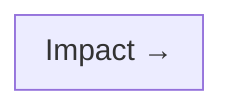

| | **Frequency of Impact: Low** | **Frequency of Impact: Medium** | **Frequency of Impact: High** |
|---|---|---|---|
| **Cost of Delay: Low** | Backlog — opportunistic | Backlog — quarterly review | Scheduled — next available cycle |
| **Cost of Delay: Medium** | Quarterly review | Scheduled — current/next quarter | Scheduled — current sprint window |
| **Cost of Delay: High** | Scheduled — current quarter | Scheduled — immediate | Immediate — SLE tier engaged |

A debt item touching Security or a citizen-critical flow is never left purely to this matrix's default cadence — it is additionally cross-checked against Technical Debt Classification's Critical/High SLEs above, which take precedence whenever the two disagree.

### Priority Score

```
Priority Score = (Business Value + Engineering Risk + Frequency + Security Impact) × Cost of Delay Multiplier
```

Each input factor is scored 1–5 by the item's owner and confirmed at Assessment; the Cost of Delay Multiplier (1.0–2.0) reflects how much the item's cost grows the longer it waits — a debt item whose cost compounds sharply over time is deliberately weighted above one that stays roughly flat, per Early Mitigation reasoning already established in `ai-docs/30-engineering-risk-management-standards.md`.

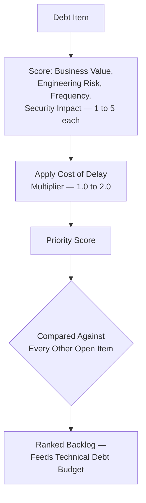

---

# Technical Debt Budget

### Engineering Allocation

Every engineering cycle reserves an explicit, non-negotiable portion of capacity for technical debt reduction — restating the Continuous Refactoring Budget commitment already established in `ai-docs/00-project-vision.md`. Arwal's default allocation is **15–20% of total engineering capacity per sprint**, tracked and reported identically to feature-work capacity, never silently absorbed into feature timelines under delivery pressure.

### Sprint Allocation

Every sprint's planning explicitly reserves its debt-budget share before feature work is committed — a sprint is never planned at 100% feature capacity with debt work treated as whatever's left over, since "whatever's left over" is reliably zero under any real deadline pressure.

### Quarterly Planning

Beyond the standing sprint-level allocation, each quarter reserves a larger, deliberately scheduled block of capacity for a High or Critical-tier debt item too large to fit inside a single sprint's routine allocation — planned at the same quarterly cadence already established for release cadence recalibration in `ai-docs/27-branching-release-strategy.md`.

### Emergency Debt

A debt item discovered mid-incident, or one whose classification jumps to Critical between scheduled reviews, may draw against a small, reserved **Emergency Debt Reserve** — a portion of the standing allocation held back specifically for exactly this circumstance, so a genuinely urgent debt item is never forced to wait for the next quarterly planning cycle purely because of calendar timing.

### Debt Repayment Strategy

| Strategy | When Used |
|---|---|
| **Steady, incremental repayment** | The default — a portion of every sprint's debt budget chips away at the ranked backlog. |
| **Concentrated repayment block** | A quarterly-planned, dedicated block for one large item too big for incremental chipping (a module-wide refactor, a major dependency migration). |
| **Opportunistic repayment** | A Low-tier item addressed as a byproduct of unrelated feature work touching the same area — never itself budgeted, per the Routine Refactoring distinction in What Is Technical Debt above. |
| **Deferred, tracked repayment** | A Low/Medium-tier item deliberately left in the backlog, reviewed at its cadence, never forgotten. |

### Long-Term Investment

Beyond routine repayment, the Engineering Leadership Council reserves capacity, at least annually, for a genuinely structural, multi-quarter debt-reduction investment (e.g., a coordinated Architecture Debt resolution spanning several modules) — planned, resourced, and governed with the identical rigor `ai-docs/31-change-management-governance-standards.md` already applies to a Major/Critical-tier change program.

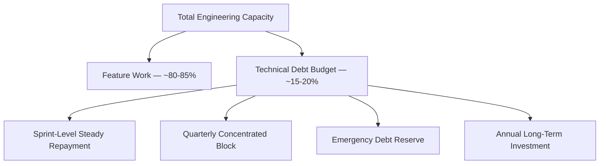

---

# Technical Debt Ownership

| Role | Ownership Responsibility |
|---|---|
| **Developers** | Identify and register debt at the point of discovery; own Low-tier items within their own current work once assigned. |
| **Tech Leads** | Own Code, Database, Configuration, and domain-scoped debt within their module; confirm Priority scoring; advocate for their team's debt budget in sprint planning. |
| **Engineering Managers** | Own Medium-tier approval; ensure the sprint-level debt budget is actually protected during planning, not silently reallocated to feature work. |
| **Architecture Review Board** | Own High/Critical-tier Architecture and Scalability debt approval; custodian of consistency between debt-driven structural changes and `ai-docs/03-system-architecture-principles.md`. |
| **Platform Team** | Own Infrastructure and Automation debt; maintain the shared tooling that makes debt tracking and remediation itself efficient. |
| **Security Team** | Own Security-category debt assessment and approval; hold veto authority over deferring a Critical security debt item past its SLE. |
| **SRE** | Own Performance, Reliability, and Operational debt assessment; feed leading-indicator signals (per `ai-docs/18-observability-standards.md` and `ai-docs/30-engineering-risk-management-standards.md`'s KRIs) into debt identification. |
| **CTO** | Final accountability for Critical-tier debt and the overall health of the debt budget across the organization. |
| **Engineering Leadership Council** | Owns Portfolio-Level Technical Debt Review (below); resolves cross-team debt-prioritization disagreements; approves Long-Term Investment allocation. |

---

# Technical Debt Reduction Strategies

| Strategy | Definition | When Used |
|---|---|---|
| **Refactoring** | Restructuring code with no behavior change, per `ai-docs/02-engineering-principles.md`'s Refactoring Principles. | The default strategy for Code and Database debt confined to a well-tested area. |
| **Replacement** | Swapping an underlying implementation or dependency behind an already-stable interface. | A dependency reaching end-of-life, or a component whose implementation is beyond incremental repair. |
| **Migration** | Moving data, traffic, or functionality from an old pattern to a new one over a defined, phased plan. | A schema migration, a dependency MAJOR upgrade, a module extraction per `ai-docs/03-system-architecture-principles.md`'s Migration Strategy. |
| **Automation** | Replacing a manual process with a repeatable, tooled one. | Automation debt, per that category above. |
| **Removal** | Deleting code, a feature, or a dependency that no longer serves a genuine purpose. | The cheapest, most underused reduction strategy — dead code and un-sunset feature flags (`ai-docs/21-configuration-management-standards.md`) are frequently better deleted than refactored. |
| **Redesign** | A more significant structural rethink than a refactor, changing the approach rather than merely the implementation. | Architecture or Scalability debt where the existing pattern itself, not merely its implementation, is the constraint. |
| **Documentation** | Writing down what should already have been recorded — a README, an ADR, an inline "why" comment. | Documentation and Knowledge debt. |
| **Training** | Deliberately spreading understanding of a system beyond its current small set of holders. | Knowledge debt where the gap is understanding, not artifact — pairing, a lunch-and-learn, a documented walkthrough session. |

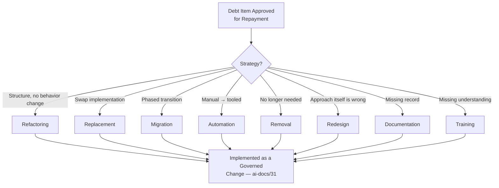

---

# Technical Debt Prevention

Prevention is cheaper than repayment, per Prevention Over Accumulation above — every mechanism below already exists, fully governed, in a preceding phase document; this document's role is affirming each one as a debt-prevention control, never redefining its mechanics.

| Mechanism | How It Prevents Debt | Governing Document |
|---|---|---|
| **Architecture Reviews** | Catches a structural shortcut before it becomes a precedent other engineers copy. | `ai-docs/07-development-workflow.md`, `ai-docs/29-engineering-governance-decision-authority.md` |
| **Code Reviews** | Catches a Code Smell, a missing test, or an undocumented shortcut at the cheapest possible point, per `ai-docs/26-code-review-standards.md`. | `ai-docs/26-code-review-standards.md` |
| **Testing** | A strong test suite is what makes future repayment safe — testing debt compounds fastest of any category because it degrades the safety net for every other kind of change. | `ai-docs/15-testing-standards.md` |
| **CI/CD Quality Gates** | Mechanically blocks a category of debt (a lint violation, a coverage regression, a dependency license issue) before a human reviewer's attention is even needed. | `ai-docs/17-cicd-standards.md` |
| **Documentation** | A README kept current at the moment of change, per `ai-docs/24-documentation-standards.md`'s Documentation Workflow, prevents Documentation and Knowledge debt from ever accruing in the first place. | `ai-docs/24-documentation-standards.md` |
| **Knowledge Sharing** | Calibration sessions (`ai-docs/26-code-review-standards.md`), pairing, and cross-team rotation keep understanding distributed before a single-owner bottleneck forms. | `ai-docs/26-code-review-standards.md`, `ai-docs/29-engineering-governance-decision-authority.md` |
| **ADR Usage** | Recording *why* a decision was made prevents the specific Knowledge Debt failure mode of a decision surviving only in one person's memory. | `ai-docs/25-architecture-decision-records.md` |
| **Design Reviews** | Catching a scalability or reliability gap at design time, before implementation, is categorically cheaper than discovering it as Debt after the fact. | `ai-docs/07-development-workflow.md`'s Architecture Review Workflow |

---

# Debt Introduced by Exception

Not every shortcut can be avoided — an emergency fix under active incident pressure, or a deliberately approved short-term compromise to hit a genuine external deadline (a government-partnership launch date), sometimes has to trade long-term cleanliness for immediate necessity. This document governs that trade explicitly, rather than pretending it never happens.

### When an Exception Is Permitted

A debt item may be knowingly introduced via exception only where: (1) the shortcut is the fastest path to resolving an active Sev 1/Sev 2 incident (per `ai-docs/07-development-workflow.md`) or meeting a genuinely fixed external commitment, (2) a fully compliant alternative was not available within the required timeframe, and (3) an accountable sponsor explicitly accepts the resulting debt — mirroring the identical Exception Handling discipline already established in `ai-docs/28-dependency-governance-standards.md` and `ai-docs/29-engineering-governance-decision-authority.md`.

### Mandatory Registration

Every debt item introduced by exception is registered in the Technical Debt Register **at the moment it is introduced**, never after the fact — per the identical Debt Is Intentional principle above, an exception-driven shortcut that is never logged is indistinguishable, six months later, from a silently accumulated liability. The originating Emergency Change or Change Request (per `ai-docs/31-change-management-governance-standards.md`) is cross-referenced in the debt item's Origin field.

### Mandatory Review Date

Every exception-introduced debt item carries an explicit, calendar-scheduled review date, never longer than **90 days** out for a Critical/High-classification item and **180 days** for Medium — mirroring the identical Time Limits discipline already established across `ai-docs/28-dependency-governance-standards.md`'s Exception Handling, `ai-docs/29-engineering-governance-decision-authority.md`'s Exception Governance, and `ai-docs/30-engineering-risk-management-standards.md`'s Risk Acceptance. At that date, the item is either fully repaid, re-approved with fresh justification and a new review date, or escalated as an overdue item per the Governance Review (below) — it is never permitted to lapse into silent, indefinite existence.

### Approval Chain

| Exception Tier | Required Approver |
|---|---|
| Low/Medium | Engineering Manager |
| High | Architecture Review Board or Security Review Board, per category |
| Critical | CTO |

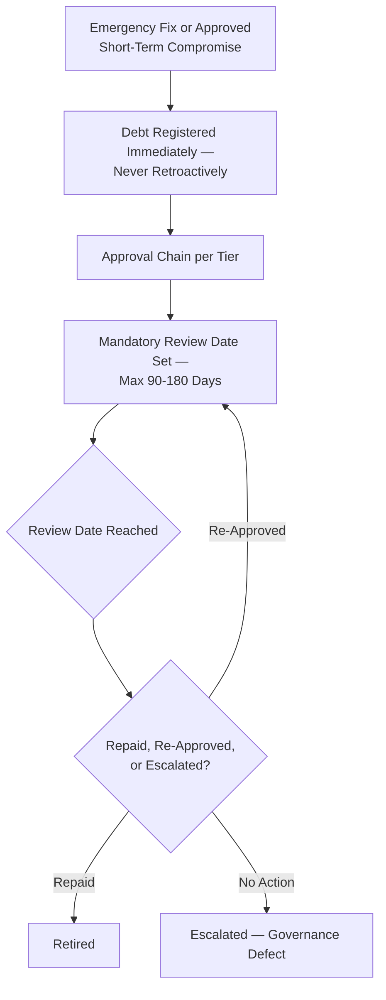

---

# Technical Debt Metrics

Per the Actionable Metrics principle already established in `ai-docs/18-observability-standards.md`, every metric below ties to a real question a Tech Lead or the Engineering Leadership Council will actually ask.

| Metric | Definition | What a Regression Signals |
|---|---|---|
| **Open debt items** | Total count of currently open (non-Retired) items, by tier. | A rising count outpacing the repayment rate signals the budget is under-resourced relative to accumulation. |
| **Debt age** | Time since a debt item was first Registered, for every still-open item. | A growing population of old, unresolved items signals Continuous Repayment is not being honored in practice. |
| **Debt repayment rate** | Count of items Retired per unit time. | A declining rate signals debt-budget capacity is being silently reallocated to feature work. |
| **Debt growth rate** | Count of new items Registered per unit time, relative to repayment rate. | Growth consistently outpacing repayment is the single most direct signal of a compounding, unsustainable trajectory. |
| **Debt by category** | Distribution of open items across the sixteen categories. | A category with a disproportionate, growing share signals a systemic gap (e.g., persistently weak Testing debt discipline in one team) worth targeted investment. |
| **Critical debt count** | Count of currently open Critical-tier items. | Any sustained non-zero count beyond its SLE window is an active governance failure, per Service-Level Expectations above. |
| **Debt backlog size** | Total Priority-Score-weighted volume of the open backlog. | A rising weighted total, even with a stable item count, signals the *severity* of accumulated debt is worsening. |
| **Average resolution time** | Mean time from Approval to Retirement, per tier. | A rising trend signals a scheduling or capacity bottleneck. |
| **Debt trend** | The overall trajectory of the weighted backlog over multiple quarters. | A sustained upward trend is Arwal's clearest signal that debt management itself needs governance attention, not merely more sprints. |

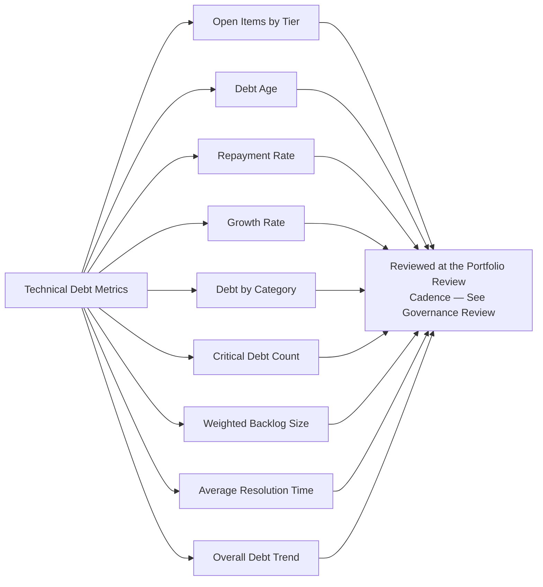

---

# AI-Assisted Technical Debt Management

Consistent with the identical AI-assistance principle already established across every governance document in this handbook: **AI accelerates identification and analysis, never accountability.**

### AI-Assisted Identification

An AI tool may scan the codebase for a Common Code Smell pattern (`ai-docs/05-coding-standards.md`), a coverage gap, or a stale `TODO`/`FIXME` marker and surface a candidate debt item — every such candidate is treated as a lead for a human to confirm and Register, never auto-added to the Technical Debt Register.

### AI-Assisted Code Analysis

An AI tool may analyze a module's complexity trend, dependency-freshness, or churn-versus-coverage ratio to flag an area likely accumulating debt — the flag is independently verified against the actual code by the module's owning Tech Lead before it changes any item's classification.

### AI-Assisted Prioritization

An AI tool may suggest a candidate Priority Score based on historical patterns of similar debt items — every suggestion is a draft input to the human-applied Technical Debt Prioritization framework above, never a substitute for it.

### AI-Assisted Reporting

An AI tool may draft the Technical Debt Metrics summary for a Portfolio Review — the draft is verified against the actual Register data by a human (typically the Engineering Manager or Portfolio Review chair) before it is presented, per the identical AI Meeting Summaries standard already established in `ai-docs/29-engineering-governance-decision-authority.md`.

### AI Recommendations and Human Verification

Every quantitative or qualitative claim an AI tool makes in support of a debt assessment — a cited pattern, a comparison to a prior repayment effort — is independently verified before being relied upon. No debt item is Approved, Retired, or granted an Exception on the basis of an AI tool's assessment alone; the named human Owner in the Technical Debt Register remains fully accountable, regardless of how much AI assistance contributed.

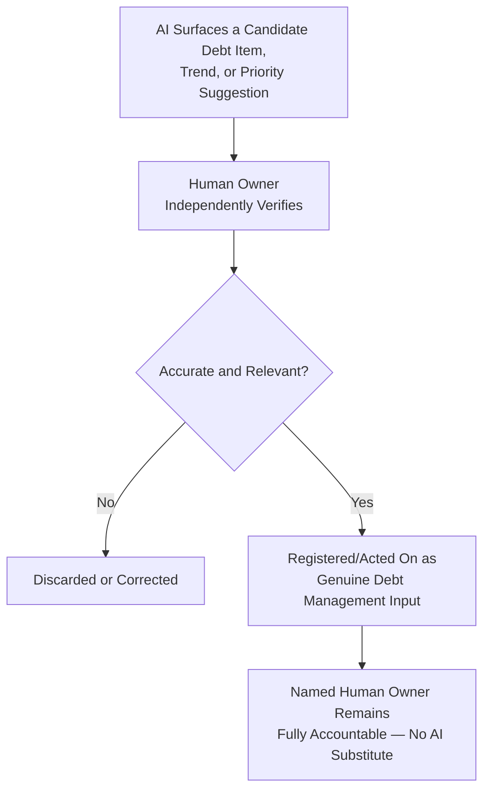

---

# Technical Debt Anti-Patterns

| Anti-Pattern | Description | Why It's Rejected |
|---|---|---|
| **Ignoring Debt** | A known gap left unaddressed, unregistered, "because nothing has broken yet." | Violates Prevention Over Accumulation and Debt Must Be Visible above; silence is not evidence of safety. |
| **Hidden Debt** | A shortcut taken without documentation, known only to the engineer who introduced it. | Violates Debt Must Be Visible above; recreates the exact tribal-knowledge failure mode `ai-docs/24-documentation-standards.md` exists to prevent. |
| **Permanent Postponement** | A debt item repeatedly pushed to "next quarter" with no genuine scheduling intent, quarter after quarter. | Violates Continuous Repayment above and the SLE discipline in Technical Debt Classification. |
| **No Ownership** | A debt item registered with no named individual accountable for it. | Violates Every Debt Has an Owner above; an unowned item never gets advocated for in planning. |
| **No Budget** | A team with no protected debt-repayment capacity, where every sprint is planned at 100% feature work. | Violates Technical Debt Budget above; guarantees debt accumulates monotonically regardless of good intentions. |
| **Large, Uncontrolled Rewrites** | A "let's just rewrite the whole module" response to accumulated debt, undertaken without the Change Management rigor `ai-docs/31-change-management-governance-standards.md` requires. | Violates Small, Incremental Changes; an uncontrolled rewrite is itself a high-risk change and frequently introduces more debt than it resolves. |
| **Premature Optimization** | Repayment effort spent hardening or optimizing an area with no measured, demonstrated need. | Violates Business Alignment above and the identical Evidence over Prediction principle already established in `ai-docs/03-system-architecture-principles.md`. |
| **Refactoring Without Business Value** | A structural cleanup undertaken purely for engineering aesthetic preference, disconnected from any measurable Business Value or Cost of Delay factor. | Violates Business Alignment above; a debt-budget spent this way is a debt-budget not spent on what the district actually needs from Arwal next. |

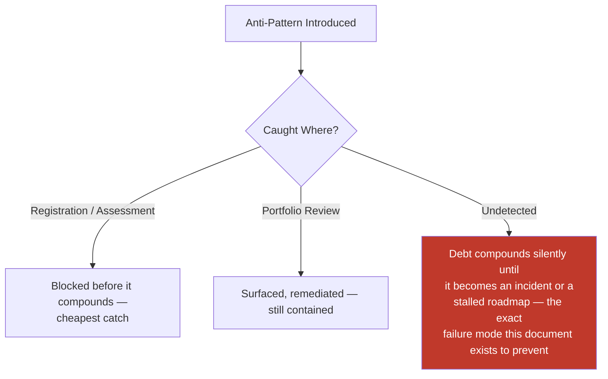

---

# Engineering Review Checklist

Every debt item — identified, registered, assessed, prioritized, approved, scheduled, implemented, or retired — is checked against the following before it is considered debt-management-compliant:

- [ ] **Correctly categorized** — The item matches exactly one of the sixteen categories in Technical Debt Categories above.
- [ ] **Correctly classified** — Low/Medium/High/Critical, matching the actual engineering and business impact.
- [ ] **Named owner assigned** — A specific individual, never a diffuse team.
- [ ] **Registered in the Technical Debt Register** — Every required field populated, per Technical Debt Register above.
- [ ] **Priority scored** — Per Technical Debt Prioritization, with stated reasoning for each factor.
- [ ] **SLE applied where required** — Critical/High-tier items carry their mandatory scheduling and resolution windows, per Service-Level Expectations.
- [ ] **Exception properly governed, if applicable** — Registered at the moment of introduction, approval chain matched to tier, review date set, per Debt Introduced by Exception above.
- [ ] **Budget allocation respected** — Scheduling draws from the protected sprint/quarterly debt budget, never silently displaced by feature work.
- [ ] **Repayment implemented as a governed Change** — Per `ai-docs/31-change-management-governance-standards.md`, with no shortcut around that document's approval/testing/rollback discipline.
- [ ] **Retirement Criteria explicit** — A specific, observable condition, never left ambiguous.
- [ ] **Verified before Retirement** — The Retirement Criteria are actually checked against the post-change system, never assumed satisfied.
- [ ] **AI-assisted analysis independently verified** — Any AI-surfaced claim fact-checked by the human owner before being relied upon.
- [ ] **No anti-pattern present** — No ignored debt, hidden debt, permanent postponement, unowned item, unbudgeted team, uncontrolled rewrite, premature optimization, or value-disconnected refactor.
- [ ] **No duplication of Engineering Principles, Risk Management, Change Management, ADR, Governance, Code Review, or Testing standards** — Any such concern deferred entirely to its owning phase document, never redefined here.

A debt item failing any item above is not considered properly governed until resolved — this checklist carries the same non-negotiable authority as every other review checklist established in the preceding thirty-two phase documents.

---

# Governance Review

### Annual Framework Review

This document's own classification thresholds, category taxonomy, budget allocation percentage, and SLE windows are reviewed no less than **annually** by the Engineering Leadership Council, per the identical standing self-review commitment already established in `ai-docs/30-engineering-risk-management-standards.md` and `ai-docs/31-change-management-governance-standards.md`. The annual review specifically asks: does the 15–20% budget allocation still reflect Arwal's actual debt-growth trajectory; are the SLE windows realistic given actual resolution-time metrics; has any category's threshold proven mis-calibrated against real incident history.

### Metrics-Driven Improvement

Between annual reviews, Technical Debt Metrics (above) are watched continuously at the same standing cadence already established for the Engineering Leadership Council in `ai-docs/29-engineering-governance-decision-authority.md` — a sharp, sustained shift (a spike in debt growth rate, a persistent SLE miss pattern in one category) triggers an out-of-cycle review, never deferred to the next scheduled annual review.

### Ownership Review

Every debt item's Owner is confirmed current at least annually — an item whose named owner has left the team with no successor assigned is treated as an active governance defect, per the identical Ownerless standard already established for ADRs in `ai-docs/25-architecture-decision-records.md` and risks in `ai-docs/30-engineering-risk-management-standards.md`.

### Debt Register Audit

A periodic (at minimum quarterly) audit samples a cross-section of the Technical Debt Register, verifying: was the classification tier accurate in hindsight, was the SLE genuinely honored where applicable, and does the Register's aggregate state match reality (no phantom "Retired" items still present in the codebase, no silently-abandoned "In Progress" items with no recent activity).

### Portfolio-Level Technical Debt Review

Beyond any single team's own debt backlog, the Engineering Leadership Council convenes a **Portfolio-Level Technical Debt Review** at least **quarterly**, examining the aggregate Technical Debt Metrics across every team simultaneously — specifically to catch debt accumulating unevenly, where one team's backlog quietly grows unchecked while another's stays disciplined, purely because no cross-team view previously existed to compare them. The Portfolio Review produces: a ranked, cross-team view of the highest-priority open items regardless of which team owns them; an explicit reallocation decision where one team's debt budget is insufficient relative to its actual accumulation; and a standing agenda item asking whether any category (per Technical Debt Categories above) is trending disproportionately across the whole organization, warranting a targeted, cross-team Long-Term Investment per Technical Debt Budget above.

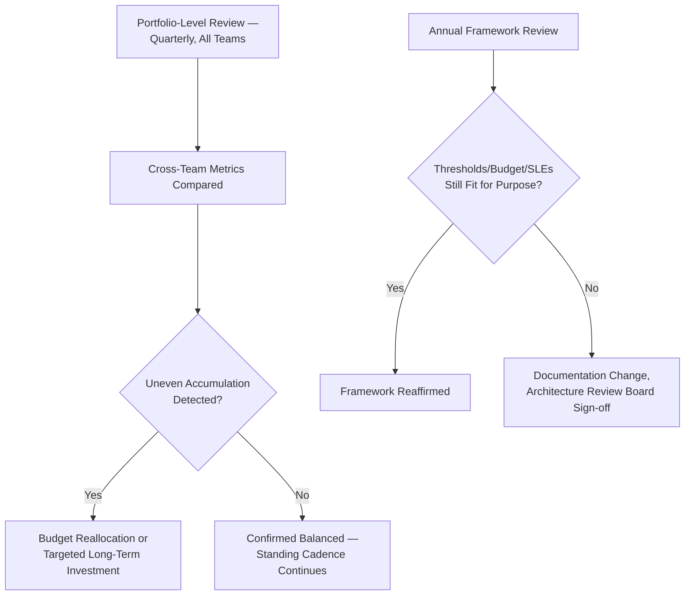

---

# Relationship to Previous Standards

### Project Vision

`ai-docs/00-project-vision.md` establishes the Continuous Refactoring Budget commitment and the "infrastructure for a generation" mission this entire document operationalizes into a concrete, tracked practice.

### Engineering Principles

`ai-docs/02-engineering-principles.md` owns the founding Technical Debt Policy — this document is its complete, standalone operational expansion, never redefining its core acknowledgment that debt is a rational, trackable trade-off.

### Architecture Principles

`ai-docs/03-system-architecture-principles.md` owns Evidence over Prediction and the Migration Strategy this document's Architecture and Scalability debt categories feed evidence into, never redefining that document's extraction indicators.

### Risk Management

`ai-docs/30-engineering-risk-management-standards.md` owns the complete standing Risk Register and Risk Assessment Framework this document's Related Risks field cross-references — a debt item and a risk are distinct concepts (known gap vs. uncertain future harm), and neither document redefines the other's scoring mechanics.

### Change Management

`ai-docs/31-change-management-governance-standards.md` owns the complete Change Request lifecycle every debt repayment's Implementation stage flows through — this document never redefines a Change Request field, approval chain, or deployment mechanic.

### Engineering Governance

`ai-docs/29-engineering-governance-decision-authority.md` owns the complete organizational decision-authority structure this document's Approval Authority columns are drawn from directly, never duplicated.

### Documentation Standards

`ai-docs/24-documentation-standards.md` owns the complete documentation discipline this document's Documentation Debt category and repayment strategy both depend on, never redefining a documentation-quality rule.

### ADR Standards

`ai-docs/25-architecture-decision-records.md` owns when a decision requires a permanent record — this document's Related ADRs field and its "Debt Is Intentional" originating-decision citation both flow into that already-established discipline, never redefining ADR mechanics.

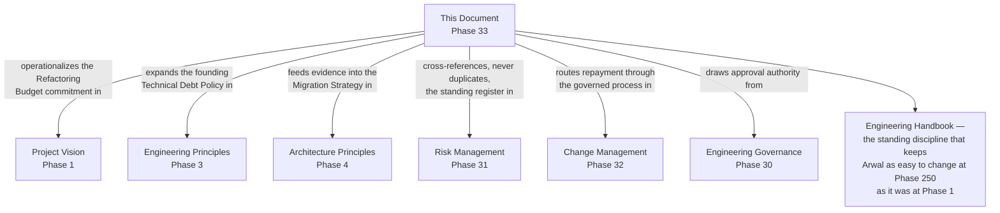

---

# Closing Statement

> **Callout — Closing Statement**
> Every preceding phase document described a standard for how Arwal is designed, built, secured, tested, deployed, governed, risk-managed, and changed. This document describes the discipline that keeps every one of those standards affordable to hold for the long run — because a codebase carrying unmanaged, invisible, unowned debt eventually cannot afford good architecture, good testing, or good security either; every hour spent fighting yesterday's shortcuts is an hour not spent serving tomorrow's citizen. Technical debt is not a moral failure and never treated as one at Arwal — it is a normal, expected consequence of shipping real software under real constraints, made safe specifically by being named, owned, measured, budgeted, and repaid on a real and honestly kept schedule. Across ~300 micro-phases, a team growing from a handful of founding engineers to hundreds, and a mission that will eventually touch government integration, financial services, and healthcare, the codebase's ability to keep changing safely is not a given — it is the direct, compounding result of whether debt was managed with this much discipline, every single cycle, for as long as Arwal exists. Where a future phase must deviate from a standard stated here, that deviation is made explicitly — through this document's own Governance Review process, or an Architectural Decision Record where the deviation is structural — never silently, and never by default.

This document, `ai-docs/32-technical-debt-management-standards.md`, is Phase 33 of approximately 300. Every shortcut taken, every debt item registered, prioritized, budgeted, repaid, and retired in the phases that follow is expected to satisfy the standards defined here, or to justify its deviation in writing.

**End of Phase 33 — `ai-docs/32-technical-debt-management-standards.md`**