# Engineering Knowledge Management Standards

**Document:** `ai-docs/33-engineering-knowledge-management-standards.md`
**Project:** Arwal — The District Super App
**Stage:** 1 — Foundation
**Phase:** 34 — Engineering Knowledge Management Standards
**Status:** Approved for Engineering Reference
**Audience:** CTO, Architecture Review Board, Platform Team, Security Team, SRE, Engineering Managers, Tech Leads, Developers, QA, Product Managers, Government Technical Partners, New Engineers Onboarding

> **Callout — Purpose of This Document**
> `ai-docs/00-project-vision.md` through `ai-docs/32-technical-debt-management-standards.md` defined why Arwal exists and every enforceable discipline governing how it is designed, written, secured, tested, deployed, observed, logged, configured, documented, decided upon, reviewed, branched, released, depended upon, governed, risk-managed, changed, and kept solvent against its own technical debt. Every one of those documents assumes something none of them fully defines: that the *knowledge* behind each standard — why it exists, how it is applied, what it took to learn — actually survives inside the organization, not merely inside the documents themselves. This document is that definition: Arwal's Engineering Knowledge Management charter, for every one of the ~300 micro-phases still ahead.

---

# Purpose of this Document

### Why Engineering Knowledge Management Exists

A phase document tells an engineer *what* the standard is. It does not, by itself, guarantee that the engineer *understands* why the standard exists, *knows* where to find it, *trusts* that it is current, or *can teach it* to the next engineer who joins after them. Knowledge management is the discipline that sits underneath every artifact this handbook produces — it is what makes a README actually read, an ADR actually cited, a runbook actually followed correctly during an incident at 2am by someone who has never run it before. Documentation is the *container*; knowledge management is the *system* that keeps the container filled, current, discoverable, and passed on. Without it, Arwal can have a perfectly complete `ai-docs/` corpus and still lose the ability to operate itself the moment the people who wrote it move on.

### Organizational Memory

Per the identical reasoning already established in `ai-docs/25-architecture-decision-records.md` for why ADRs exist — human memory is not a reliable long-term store — organizational memory is the aggregate of every engineer's understanding of how Arwal actually works, why it was built this way, and what has already been tried and rejected. That memory is Arwal's most valuable, least visible asset, and it is the asset every other engineering artifact (code, tests, infrastructure, ADRs) is downstream of. Knowledge management exists to make organizational memory a deliberately engineered, durable property of Arwal — never an accident of who happens to still be on the team.

### Sustainable Engineering

Per the Sustainability Vision already established in `ai-docs/00-project-vision.md`, Arwal is built as infrastructure for a generation, not a product optimized for a single team's current tenure. A codebase that only its original authors can safely operate is not sustainable engineering, regardless of how well-architected it is — it is a system whose maintainability has an expiration date tied to specific people's employment. Knowledge management is what decouples Arwal's long-term health from any individual's continued presence.

### Reduced Key-Person Dependency

Every system with exactly one person who truly understands it carries a standing, silent risk: that person's departure, illness, or simple unavailability during an incident becomes Arwal's problem at the worst possible moment. This document formalizes the discipline — including an explicit, measurable **bus factor** governance mechanism (see Knowledge Metrics below) — that keeps that risk visible, measured, and actively reduced, rather than discovered only once it has already materialized.

### Faster Onboarding

Arwal's roadmap anticipates growth from a handful of founding engineers to hundreds, per the identical organizational trajectory already established in `ai-docs/29-engineering-governance-decision-authority.md`. Every day a new engineer spends reconstructing context that already exists somewhere, undiscoverably, is a day of lost velocity multiplied across every future hire. Knowledge management exists to make "how do I find out how this works" answerable in minutes, not weeks, at Phase 250 exactly as reliably as at Phase 34.

### Long-Term Maintainability

Per the Maintainable pillar of Engineering Excellence already established in `ai-docs/02-engineering-principles.md`, a system's maintainability is only as real as the maintainers' actual understanding of it. Knowledge management is the discipline that keeps that understanding distributed, current, and verifiable — the organizational precondition every other maintainability commitment in this handbook depends on to be genuinely true rather than aspirational.

### Relationship with Documentation Standards

`ai-docs/24-documentation-standards.md` already owns, in full, the complete discipline of documentation as a written artifact — categories, Markdown standards, writing style, the Documentation Review Process, Documentation Ownership, and Documentation Lifecycle. This document does not redefine a single one of those mechanics. It governs the layer *above* the artifact: how knowledge — of which written documentation is one, but not the only, carrier — is identified, classified by criticality, captured from its many real-world sources, shared actively rather than passively published, transferred deliberately when people or ownership change, and measured for whether it is actually working as a system. Where this document needs a documentation mechanic, it cites `ai-docs/24-documentation-standards.md` directly.

### Relationship with ADR Standards

`ai-docs/25-architecture-decision-records.md` already owns the complete artifact-level discipline for a specific, high-value category of knowledge — the decision record. This document treats an ADR as one of several first-class Knowledge Sources (below) and never redefines its template, numbering, or lifecycle. This document's concern is broader: not only *decisions*, but the tacit, operational, and historical understanding that never rises to ADR significance yet is still essential to operating Arwal correctly.

### Relationship with Engineering Governance

`ai-docs/29-engineering-governance-decision-authority.md` already owns the complete organizational decision-authority structure — roles, boards, escalation, delegation. Every Knowledge Ownership role named in this document is a role already defined there, applied specifically to the accountability for a *body of knowledge* rather than a *decision*. This document introduces no new authority structure.

### Relationship with Technical Debt Management

`ai-docs/32-technical-debt-management-standards.md` already owns Knowledge Debt as one of its sixteen debt categories — "critical system understanding concentrated in too few people." This document is the standing, proactive discipline that *prevents* Knowledge Debt from accumulating in the first place; that document is the *remediation* framework for when it already has. A bus-factor risk identified under this document's Knowledge Metrics that is not resolved through routine knowledge-sharing practice is registered as a Knowledge Debt item under that document's framework — the two are deliberately complementary, never duplicative.

---

# Knowledge Management Philosophy

Arwal's knowledge management discipline rests on eight commitments. Together they answer the question every subsequent section of this document exists to make concrete: **what makes engineering knowledge actually durable, rather than merely written down once?**

### Knowledge Is an Engineering Asset

Knowledge is treated with the identical seriousness already established for a database schema (`ai-docs/14-database-design-guidelines.md`) or a dependency (`ai-docs/28-dependency-governance-standards.md`) — it is inventoried, classified, owned, and invested in, never treated as a free byproduct of engineering work that takes care of itself. This exists because an asset nobody manages deliberately degrades exactly as an unmaintained codebase does — not through any single failure, but through a thousand small, uncorrected drifts away from accuracy.

### Documentation Before Memory

The default expectation is that a piece of knowledge is written down at the moment it is learned, never deferred on the assumption "I'll remember this" or "the team already knows this" — mirroring the identical Documentation-First principle already established in `ai-docs/07-development-workflow.md` and `ai-docs/24-documentation-standards.md`. This exists because the specific moment a fact is freshest in an engineer's mind is also the cheapest moment to record it; every day of delay both increases the cost of writing it down accurately and increases the chance it is never written down at all.

### Shared Ownership

Knowledge of a critical system is deliberately distributed across more than one person, never concentrated by convenience or historical accident — the organizational expression of the same principle that motivates code review's Knowledge Sharing purpose already established in `ai-docs/26-code-review-standards.md`. This exists because a single owner is a single point of failure, and a team's collective understanding of its own systems must scale with team size, not remain fixed at whatever one founding engineer happened to learn first.

### Single Source of Truth

Every fact has exactly one authoritative location, restating the identical principle already established in `ai-docs/02-engineering-principles.md` and `ai-docs/24-documentation-standards.md`, applied here to knowledge broadly rather than documentation narrowly — a fact repeated informally across several engineers' private understanding, with no single canonical location, is a fact that will eventually be remembered differently by different people, with no way to resolve the disagreement.

### Continuous Learning

Arwal's engineering organization treats every incident, every difficult investigation, and every hard-won architectural insight as a learning opportunity to be captured and propagated, never merely resolved and forgotten — mirroring the Blameless Postmortems commitment already established in `ai-docs/00-project-vision.md` and `ai-docs/07-development-workflow.md`. This exists because the same class of problem, if its lesson is never captured, will eventually recur and be re-learned at full cost by someone else.

### Knowledge Evolves

Knowledge is never treated as permanently correct the moment it is captured — a runbook, an architecture diagram, or an onboarding guide is accurate only as long as the system it describes has not changed since, per the identical Living Documentation principle already established in `ai-docs/24-documentation-standards.md`. This exists because treating knowledge as static is precisely what produces the single most damaging failure mode this document exists to prevent: a confident, wrong answer trusted because it was once true.

### Discoverability

Knowledge that exists but cannot be found by the person who needs it is, functionally, knowledge that does not exist — mirroring the identical Documentation Searchability principle already established in `ai-docs/24-documentation-standards.md`, generalized here across every knowledge source, not only written documents. This exists because the value of any captured knowledge is realized only at the moment someone successfully finds and uses it; capture without discoverability is wasted effort.

### Accountability

Every category and instance of knowledge has a named, accountable owner, never a diffuse "the team knows this" — restating the identical Accountability principle already established throughout `ai-docs/29-engineering-governance-decision-authority.md` and `ai-docs/30-engineering-risk-management-standards.md`, applied here to knowledge itself. This exists because unowned knowledge is knowledge nobody is responsible for keeping current, discoverable, or transferred when circumstances change.

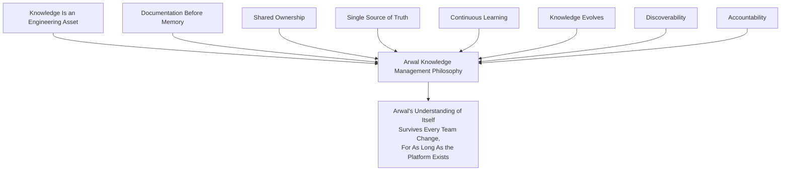

> **Callout — The One-Sentence Knowledge Management Philosophy**
> *"A system nobody remembers how to operate is a system Arwal no longer actually owns — knowledge management is what keeps ownership real, not merely historical."*

---

# Types of Engineering Knowledge

Every category below is distinct in its typical source, its typical owner, and the specific harm that results if it is lost. Classifying knowledge correctly is what determines which of the practices in this document applies to it.

### Architecture Knowledge

**Definition:** Understanding of how Arwal's system is structured — module boundaries, dependency direction, the reasoning behind the Modular Monolith strategy, per `ai-docs/03-system-architecture-principles.md`.
**Examples:** Why `local-services` and `commerce` are separate bounded contexts; the Migration Strategy's extraction indicators.
**Typical Owner:** Architecture Review Board, Principal Engineers.
**Importance:** Loss produces boundary erosion and repeated architectural mistakes already resolved once; this is Arwal's most expensive category of knowledge to relearn.

### Business Domain Knowledge

**Definition:** Understanding of the civic and commercial domain Arwal serves — why the 2-hour cancellation cutoff exists, how a government scheme's eligibility rule actually works, per `ai-docs/00-project-vision.md` and `ai-docs/01-product-goals.md`.
**Examples:** The reasoning behind a district-specific configuration rule; a government partner's specific compliance requirement.
**Typical Owner:** Product Managers, the affected domain's Tech Lead.
**Importance:** Loss produces incorrect business logic that passes every technical test while still being wrong for the citizen.

### Code Knowledge

**Definition:** Understanding of how a specific module or component is actually implemented, beyond what its README states, per `ai-docs/05-coding-standards.md`.
**Examples:** Why a particular algorithm was chosen over a simpler alternative; a non-obvious interaction between two use cases.
**Typical Owner:** The module's owning Tech Lead and its regular contributors.
**Importance:** Loss slows every future change to the affected module and increases the risk of a change that "looks safe" but breaks a non-obvious invariant.

### Operational Knowledge

**Definition:** Understanding of how to run, monitor, and recover Arwal's production systems day to day, per `ai-docs/16-deployment-standards.md` and `ai-docs/18-observability-standards.md`.
**Examples:** Which dashboard to check first during a specific alert; the actual (not merely documented) steps of a rollback.
**Typical Owner:** SRE, DevOps/Platform Lead.
**Importance:** Loss directly extends MTTR during a real incident, per `ai-docs/07-development-workflow.md`'s Incident Response Workflow.

### Infrastructure Knowledge

**Definition:** Understanding of Arwal's provisioned infrastructure topology and its non-obvious operational quirks, per `ai-docs/16-deployment-standards.md` and `ai-docs/23-environment-strategy.md`.
**Examples:** Why a specific IAM boundary was drawn the way it was; a known, worked-around limitation of a managed service.
**Typical Owner:** Platform Team.
**Importance:** Loss risks a future change silently reintroducing a previously-solved infrastructure problem.

### Security Knowledge

**Definition:** Understanding of Arwal's threat model, its specific mitigations, and the reasoning behind a security control, per `ai-docs/10-security-standards.md`.
**Examples:** Why a specific endpoint returns `404` rather than `403` for an unauthorized resource; the details of a previously-mitigated vulnerability class.
**Typical Owner:** Security Team.
**Importance:** Loss is among the highest-severity categories in this document — a forgotten mitigation is a reintroduced vulnerability.

### Testing Knowledge

**Definition:** Understanding of why a specific test exists, what regression it guards against, and how to interpret a flaky or failing suite, per `ai-docs/15-testing-standards.md`.
**Examples:** The specific incident a regression test was written to prevent from recurring.
**Typical Owner:** QA, the module's owning Tech Lead.
**Importance:** Loss produces a test suite engineers no longer trust or understand, eventually leading to tests being deleted or ignored rather than fixed.

### Deployment Knowledge

**Definition:** Understanding of Arwal's release and deployment mechanics beyond the written pipeline definition, per `ai-docs/16-deployment-standards.md` and `ai-docs/17-cicd-standards.md`.
**Examples:** A known-fragile step in the release process and its manual workaround; the real reason a specific deployment window was chosen.
**Typical Owner:** Release Engineer, DevOps.
**Importance:** Loss risks a release process only "documented" on paper actually failing the first time it is run by someone unfamiliar with its quirks.

### Incident Knowledge

**Definition:** Understanding accumulated from past production incidents — root causes, contributing factors, and what was learned, per `ai-docs/07-development-workflow.md`'s Incident Response Workflow.
**Examples:** A postmortem's full timeline and root-cause analysis; a "near miss" that never became a full incident but revealed a real gap.
**Typical Owner:** The Incident Commander of record, SRE.
**Importance:** Loss guarantees the same class of incident recurs, since its lesson was never institutionalized.

### AI Knowledge

**Definition:** Understanding of Arwal's AI Gateway Service, its prompt engineering decisions, provider trade-offs, and safety mitigations, per `ai-docs/09-tech-stack.md` and the AI Principle in `ai-docs/00-project-vision.md`.
**Examples:** Why a specific prompt template was structured a certain way after an adversarial-testing finding; a provider's known limitation.
**Typical Owner:** The AI Gateway Service's owning team.
**Importance:** Loss risks a regression toward unsafe or lower-quality AI behavior that was already solved once.

### Integration Knowledge

**Definition:** Understanding of how Arwal integrates with a specific third-party system — a payment gateway, an SMS provider, a government API, per `ai-docs/09-tech-stack.md`'s Third-Party Service Policy.
**Examples:** A partner's undocumented rate limit, discovered only through experience; a specific error code's real meaning that the partner's own documentation gets wrong.
**Typical Owner:** The integrating domain's Tech Lead.
**Importance:** Loss risks a costly rediscovery process the next time the integration needs to change.

### Government Compliance Knowledge

**Definition:** Understanding of a specific regulatory or government-partnership requirement and how Arwal satisfies it, per `ai-docs/01-product-goals.md`'s Government Coordination and `ai-docs/19-logging-standards.md`'s Compliance section.
**Examples:** The specific data-retention obligation a government partnership requires; the reasoning behind a data-residency commitment.
**Typical Owner:** Architecture Review Board, Legal/Compliance, the affected domain's Tech Lead.
**Importance:** Loss risks an inadvertent compliance violation with real regulatory or partnership consequences — one of this document's highest-criticality categories, per Knowledge Classification below.

### Developer Onboarding Knowledge

**Definition:** The specific, practical understanding a new engineer needs to become productive — not the formal standards themselves, but how to actually apply them on day one.
**Examples:** Which of several plausible approaches is actually the team's convention; a common first-week mistake and how to avoid it.
**Typical Owner:** Engineering Managers, Tech Leads.
**Importance:** Loss directly extends time-to-productivity for every future hire, compounding across Arwal's anticipated team growth.

### Historical Decision Knowledge

**Definition:** Understanding of *why* a past decision was made, distinct from the ADR record itself where one exists — the surrounding context, the road not taken, the constraint that no longer applies.
**Examples:** Why a rejected alternative was rejected, beyond what a terse ADR captured; a decision made before ADR discipline (`ai-docs/25-architecture-decision-records.md`) existed at Arwal.
**Typical Owner:** The original decision's Owner, per `ai-docs/25-architecture-decision-records.md`'s Decision Ownership, or their Successor Owner.
**Importance:** Loss produces exactly the "systematic amnesia" `ai-docs/25-architecture-decision-records.md` already warns against — decisions re-litigated or violated unknowingly.

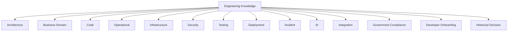

---

# Knowledge Sources

Knowledge is captured across a defined set of official sources — never left to accumulate only in an unofficial, undiscoverable channel (a private chat thread, an individual's personal notes).

| Source | What It Captures | Governing Document |
|---|---|---|
| **Documentation** (`ai-docs/`, `docs/`) | Standards, guides, READMEs, runbooks. | `ai-docs/24-documentation-standards.md` |
| **ADRs** | Permanent decision records. | `ai-docs/25-architecture-decision-records.md` |
| **Runbooks** | Step-by-step operational procedures. | `ai-docs/24-documentation-standards.md`'s Documentation Categories |
| **Playbooks** | Decision-tree guidance for a class of situation. | `ai-docs/24-documentation-standards.md`'s Documentation Categories |
| **Architecture diagrams** | The static and dynamic shape of the system, per the Mermaid convention already established throughout this handbook. | `ai-docs/03-system-architecture-principles.md`, `ai-docs/24-documentation-standards.md`'s Diagrams |
| **Code comments** | Inline "why," per the Commenting Standards. | `ai-docs/05-coding-standards.md` |
| **Repositories** | The code itself, and its full commit history as a record of *what* changed and *when*. | `ai-docs/06-git-workflow.md` |
| **CI/CD pipelines** | A machine-verifiable record of what was actually built, tested, and deployed. | `ai-docs/17-cicd-standards.md` |
| **Monitoring dashboards** | The observable, current behavior of the system, per `ai-docs/18-observability-standards.md`. | `ai-docs/18-observability-standards.md` |
| **Postmortems** | Incident timelines, root causes, and lessons learned. | `ai-docs/07-development-workflow.md` |
| **Technical RFCs** | Pre-ADR proposal discussion for a significant technical direction, captured before a decision is finalized. | Feeds into `ai-docs/25-architecture-decision-records.md`'s Proposal/Draft stages |
| **Engineering standards** | This entire `ai-docs/*` corpus. | Every preceding phase document |
| **Training material** | Onboarding guides, workshop content, recorded sessions. | `ai-docs/24-documentation-standards.md`'s Developer Guides category |
| **Knowledge base** | Focused answers to recurring questions, per `ai-docs/24-documentation-standards.md`'s `docs/kb/`. | `ai-docs/24-documentation-standards.md` |

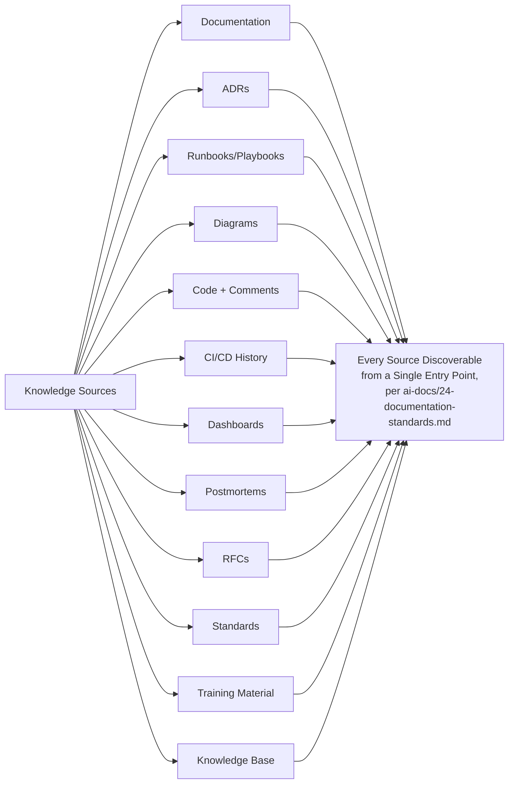

---

# Knowledge Classification

Every distinct body of knowledge (a system's operational understanding, a domain's business rules, a decision's rationale) is classified into exactly one criticality tier, determining its ownership rigor, review cadence, and retention expectation.

| Level | Business Importance | Engineering Importance | Ownership | Review Frequency | Retention Expectation |
|---|---|---|---|---|---|
| **Critical** | Direct citizen-facing, financial, or government-compliance consequence if lost or wrong. | Governs a citizen-critical flow or a system with no safe fallback if misunderstood. | Named individual **and** a Successor Owner, per Knowledge Ownership below — never a single point of failure. | Quarterly, minimum; disaster-recovery and government-integration knowledge additionally verified per Knowledge Retention's periodic verification requirement below. | Indefinite; archived, never deleted. |
| **High** | Meaningful citizen or commercial impact, contained to one domain. | Governs a widely-used shared component or a frequently-changed critical-path module. | Named individual, Tech Lead as accountable escalation. | Semi-annually. | Long-term; archived on retirement, per Knowledge Lifecycle below. |
| **Medium** | Noticeable but contained impact if lost. | Localized to a single module or team. | Named individual or team, Engineering Manager as escalation. | Annually. | Retained through the life of the system it describes. |
| **Low** | Minimal impact if lost; easily reconstructed. | A convenience or a minor implementation detail. | Author, no mandatory Successor Owner. | Opportunistic — reviewed when touched. | Retained until the described system is retired. |

> **Callout — Classification Drives Rigor, Never the Reverse**
> A knowledge item's tier is assessed from its actual consequence if lost — never inflated to Critical merely because it feels important to its author, and never deflated to Low merely to avoid the review burden. The same discipline `ai-docs/30-engineering-risk-management-standards.md` applies to Evidence-Based Assessment applies identically here.

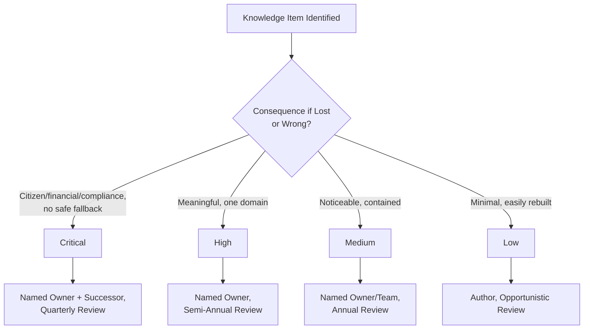

---

# Knowledge Lifecycle

Every knowledge item, regardless of type or tier, passes through the same eight stages — mirroring the identical Documentation Lifecycle already established in `ai-docs/24-documentation-standards.md`, extended here to knowledge captured through any of the sources above, not only written documentation.

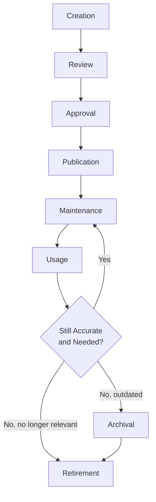

| Stage | Meaning | Exit Criteria |
|---|---|---|
| **Creation** | The knowledge is first captured, at or near the moment it was learned, per Documentation Before Memory above. | A record exists in the correct Knowledge Source location. |
| **Review** | The item is checked for accuracy and clarity, per the Documentation Review Process already established in `ai-docs/24-documentation-standards.md` where the item is a written document. | Reviewer confirms the content is correct as of the review date. |
| **Approval** | The item's classification-appropriate Approval Authority (per Knowledge Classification above) signs off. | Approval recorded. |
| **Publication** | The item becomes discoverable in its correct location, indexed per Documentation Searchability (`ai-docs/24-documentation-standards.md`). | Live and findable. |
| **Maintenance** | The item is kept current as the system it describes changes, per Living Documentation above. | Updated in the same change that invalidates its prior content. |
| **Usage** | The item is actually consulted by engineers — its real value is realized here. | Tracked per Knowledge Metrics below, where tooling supports it. |
| **Archival** | The item no longer reflects current practice but retains historical value. | Marked deprecated with a pointer to its replacement, per `ai-docs/24-documentation-standards.md`'s Deprecation. |
| **Retirement** | The item is removed from the active knowledge surface; its history is preserved via version control, never destroyed. | Removed from active search/index; permanently recoverable via Git history. |

---

# Knowledge Ownership

| Role | Responsibility |
|---|---|
| **Developers** | Capture knowledge at the point of discovery, per Knowledge Capture below; flag stale or missing knowledge they encounter. |
| **Tech Leads** | Own Code, Testing, and domain-scoped Integration knowledge for their module; confirm a Successor Owner exists for any Critical/High item before an ownership gap opens. |
| **Engineering Managers** | Own Developer Onboarding knowledge for their team; ensure knowledge-sharing practices (below) are actually happening, not merely scheduled. |
| **Architecture Review Board** | Owns Architecture and Historical Decision knowledge at the system-wide level, per `ai-docs/29-engineering-governance-decision-authority.md`. |
| **Platform Team** | Owns Infrastructure and cross-cutting Operational knowledge. |
| **Security Team** | Owns Security knowledge, jointly accountable for AI and Government Compliance knowledge's security dimension. |
| **SRE** | Owns Operational, Deployment, and Incident knowledge; maintains the currency of runbooks and disaster-recovery procedures. |
| **CTO** | Final accountability for Critical-tier knowledge continuity across the organization; approves any Critical-tier knowledge item left without a Successor Owner beyond a defined grace period. |
| **Engineering Leadership Council** | Owns the Governance Review of this document itself (below); resolves a cross-team knowledge-ownership dispute. |

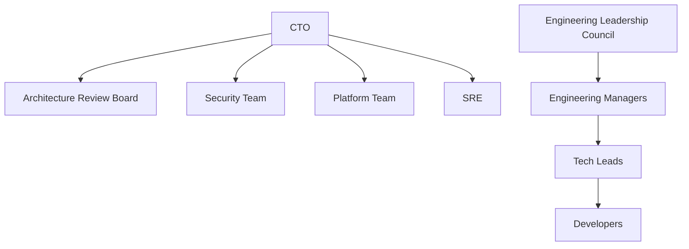

---

# Knowledge Capture

Knowledge is captured deliberately from every one of the following real-world moments — never left to accumulate only when someone happens to feel like writing something down.

| Capture Moment | What Is Captured | Where |
|---|---|---|
| **Projects** | A module README's domain boundary, updated as the project ships, per `ai-docs/24-documentation-standards.md`'s Documentation Workflow. | Module README |
| **Architecture decisions** | A filed ADR, per `ai-docs/25-architecture-decision-records.md`'s What Requires an ADR. | `ai-docs/adr/` |
| **Incidents** | A blameless postmortem, per `ai-docs/07-development-workflow.md`. | `docs/incidents/` |
| **Code reviews** | A non-obvious rationale surfaced during review, captured as an inline comment or linked ADR, per `ai-docs/26-code-review-standards.md`. | Code comment, ADR reference |
| **Major releases** | A release's changelog and any lessons-learned entry, per `ai-docs/27-branching-release-strategy.md`. | `docs/releases/`, Change Log |
| **Technical investigations** | The findings of a `spike/*` or `experiment/*` branch, per `ai-docs/27-branching-release-strategy.md` — captured even though the branch itself is discarded. | A short written finding, or an ADR if adopted |
| **Postmortems** | Root cause and contributing factors, cross-referenced to any resulting ADR or debt item. | `docs/incidents/`, `ai-docs/32-technical-debt-management-standards.md`'s Register |
| **Customer/citizen issues** | A pattern surfaced through support or Trust & Safety, distinct from an individual bug, per `ai-docs/07-development-workflow.md`. | Knowledge base, `docs/kb/` |
| **Government integrations** | The specific, hard-won operational understanding of a partner's real (not merely documented) behavior. | A dedicated integration runbook, per Government Compliance knowledge above |
| **AI experiments** | A prompt-engineering finding, a provider evaluation result, per `ai-docs/09-tech-stack.md`'s Prompt Management. | The AI Gateway Service's own documentation, versioned per its Prompt Management standard |

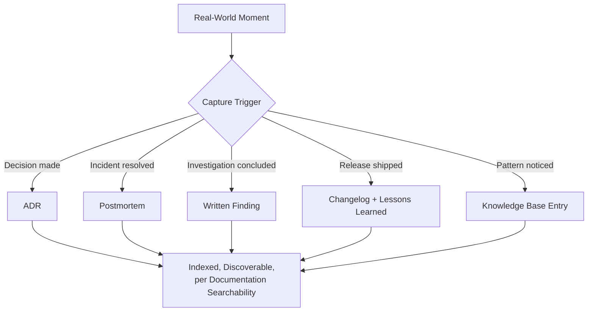

---

# Knowledge Sharing

Knowledge is actively pushed to the people who need it, never left purely to passive publication — mirroring the identical Communication discipline already established in `ai-docs/24-documentation-standards.md`'s Breaking Documentation Changes and `ai-docs/31-change-management-governance-standards.md`'s Change Communication.

| Practice | Purpose | Cadence |
|---|---|---|
| **Technical talks** | A deeper, narrative walkthrough of a system or decision than a README can convey. | Monthly, org-wide. |
| **Design reviews** | Shared understanding of an in-flight design before it is built, per `ai-docs/07-development-workflow.md`'s Architecture Review Workflow. | Per proposal. |
| **Pair programming** | Direct, real-time knowledge transfer between two engineers on the same task. | Ad hoc, encouraged for a Critical-tier module's first-time contributor. |
| **Code walkthroughs** | A guided tour of a specific module for a new contributor or cross-team engineer. | On request, or as part of onboarding. |
| **Architecture reviews** | Shared understanding of a structural change before it is accepted, per `ai-docs/29-engineering-governance-decision-authority.md`. | Per proposal, weekly standing cadence. |
| **Cross-team sessions** | Deliberate exposure between teams whose domains interact, surfacing an integration assumption before it becomes a defect. | Quarterly, at minimum. |
| **Engineering wiki** | The searchable, aggregated index across every Knowledge Source above. | Continuously updated. |
| **Office hours** | A standing, low-friction time for any engineer to ask a domain expert a question. | Weekly, per critical domain. |
| **Mentorship** | A structured, ongoing relationship pairing a newer engineer with an experienced one, specifically to transfer tacit knowledge a document cannot fully capture. | Ongoing, assigned at onboarding. |
| **Community of practice** | A standing, cross-team group focused on a specific discipline (testing, accessibility, AI safety) sharing practice across team boundaries. | Bi-weekly or monthly, per community. |

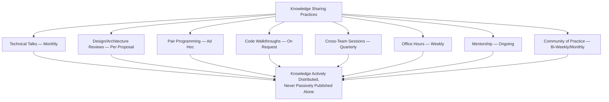

---

# Knowledge Transfer

Knowledge transfer is governed explicitly at every point people or ownership change — never left to an informal handoff conversation with no durable record.

| Transition | Required Transfer Activity |
|---|---|
| **New hires** | A structured onboarding path through Developer Onboarding knowledge (above), assigned a mentor, per Knowledge Sharing's Mentorship practice. |
| **Role changes** | The outgoing role's Critical/High-tier knowledge items are reviewed for currency and re-owned, per Knowledge Ownership above, before the transition completes. |
| **Team transitions** | A documented handoff session covering every Critical-tier item the transitioning engineer owned, with the new team confirming understanding, not merely receipt. |
| **Project handoffs** | A written handoff document covering architecture, known issues, and in-flight decisions, reviewed jointly by outgoing and incoming owners. |
| **Long leave** | Every Critical/High-tier item the departing engineer solely owns has an interim Successor Owner assigned before the leave begins, per Succession Planning below. |
| **Employee exits** | A mandatory exit knowledge-transfer checklist (below) is completed before the engineer's final day — never deferred to "we'll figure it out after they're gone." |
| **Vendor transitions** | Any vendor-specific operational knowledge (an integration's undocumented behavior, a support escalation path) is captured into Arwal's own knowledge base before a vendor relationship changes, never left solely in the vendor's own documentation. |
| **Cross-team ownership transfers** | Follows the identical Ownership Transfer discipline already established in `ai-docs/25-architecture-decision-records.md` — proposed by the outgoing owner or their manager, confirmed by the next level up, recorded explicitly. |

### Knowledge Succession Planning

For every Critical-tier knowledge item, a **Successor Owner** is identified and actively briefed *before* any planned ownership change — never reactively, after the primary owner has already departed. Succession planning is a standing agenda item at the quarterly review cadence already established for Critical-tier knowledge in Knowledge Classification above: for each Critical item, the review confirms a Successor Owner exists, is genuinely capable of stepping in (not merely named on paper), and has been given real exposure to the system (via Pair Programming, a Code Walkthrough, or direct hands-on work) within the preceding review period.

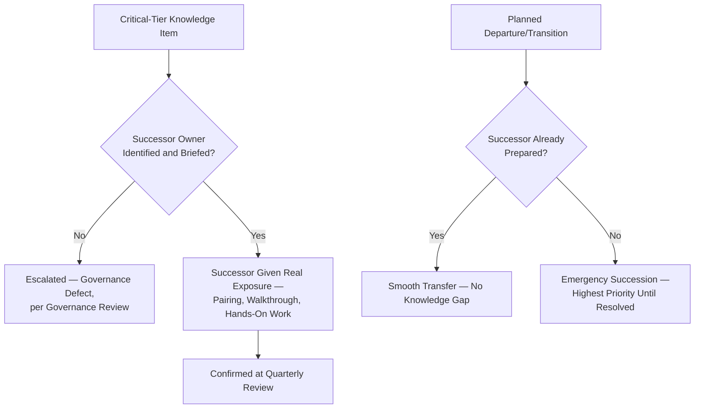

### Exit Knowledge-Transfer Checklist

Before a departing engineer's final day: every Critical/High-tier item they own is confirmed transferred or re-owned; every undocumented "only I know this" item they can identify is captured in writing; access to any system-specific knowledge (an integration credential's context, a workaround's reasoning) is transferred, not merely revoked; and the departing engineer's manager confirms, explicitly, that no Critical-tier item is left without a confirmed owner.

---

# Knowledge Validation

### Accuracy Reviews

Every knowledge item's Review stage (per Knowledge Lifecycle above) explicitly checks the content against the *current* system, never merely against internal consistency — a document can be perfectly well-written and still wrong if the system it describes has since changed.

### Peer Review

A knowledge item of Medium tier or above passes through at least one peer's review before Publication, per the identical review discipline already established in `ai-docs/24-documentation-standards.md`'s Documentation Review Process — this document adds no new review mechanic for written documentation; it extends the same expectation to non-document knowledge sources (a runbook rehearsed by a second engineer, a diagram checked by someone other than its author).

### Periodic Verification

Critical operational knowledge — disaster-recovery procedures, government-integration runbooks, and incident-response playbooks specifically — is **actively rehearsed, not merely re-read**, on a defined cadence: at minimum aligned with the Disaster Recovery Drill cadence already established in `ai-docs/14-database-design-guidelines.md` and `ai-docs/23-environment-strategy.md` (semi-annually, minimum) for disaster-recovery procedures, and at minimum annually for a government-integration runbook. A periodic verification is only considered passed if an engineer *unfamiliar* with the procedure can follow it successfully using only the written record — a verification performed solely by the procedure's original author does not satisfy this requirement, since it does not test whether the knowledge has actually transferred to the document.

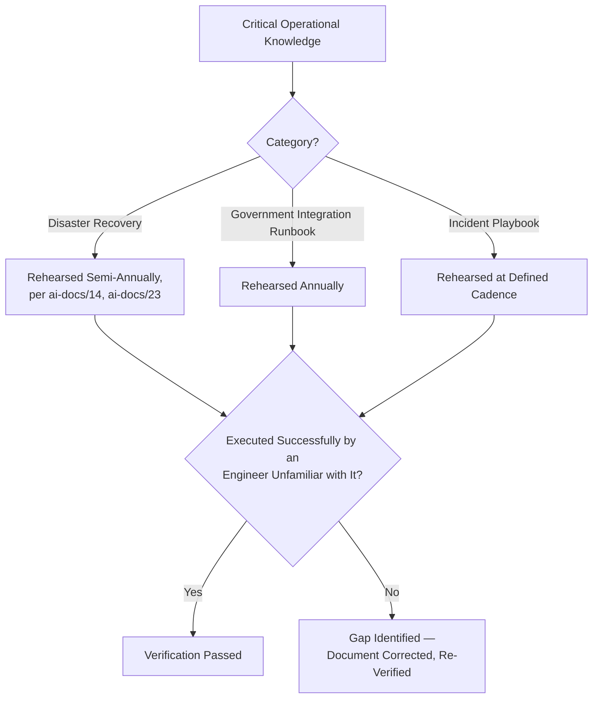

### Versioning

Every knowledge item is versioned identically to code, per Documentation Is Code already established in `ai-docs/24-documentation-standards.md` — Git history is the authoritative record of how a piece of knowledge has evolved, never a separately-maintained, disconnected version log.

### Obsolete Knowledge Detection

A knowledge item referencing a removed module, a deprecated API version, or a superseded ADR without the appropriate marker is flagged automatically wherever tooling supports it (per Documentation Automation, `ai-docs/24-documentation-standards.md`) and manually during the item's next scheduled review otherwise — an obsolete item left uncorrected is treated with the identical severity already established for Outdated Documentation in `ai-docs/24-documentation-standards.md`'s Anti-Patterns.

### Approval Workflow

Approval follows the classification-scaled Approval Authority already established in Knowledge Classification above, mirroring — never redefining — the Documentation Ownership's Approval Authority table already established in `ai-docs/24-documentation-standards.md` for the specific case of a written document.

---

# Knowledge Retention

### Retention Policy

Retention is classified by the same tiers already established in Knowledge Classification above: Critical and High-tier knowledge is retained indefinitely, archived rather than deleted; Medium-tier knowledge is retained through the life of the system it describes; Low-tier knowledge is retained until the system it describes is retired.

### Archiving

An archived knowledge item is moved to a clearly labeled, lower-priority location (mirroring `ai-docs/24-documentation-standards.md`'s `docs/archive/` and `ai-docs/adr/archive/`) — preserved, never deleted, so a future investigation can still recover the historical understanding even after it stops being actively maintained.

### Historical Preservation

Every Critical-tier decision's Historical Decision knowledge (above) is preserved permanently, mirroring the identical Archive, Never Delete principle already established for ADRs in `ai-docs/25-architecture-decision-records.md` — this document introduces no new preservation mechanic beyond affirming it applies to the surrounding context an ADR's own template does not always fully capture.

### Sensitive Knowledge

A knowledge item touching a security vulnerability under active remediation, an unreleased architectural decision, or citizen-sensitive context is retained under the identical confidentiality posture already established in `ai-docs/10-security-standards.md`'s Incident Response and `ai-docs/24-documentation-standards.md`'s Confidential Information standard — access-restricted, never indexed into a generally-searchable location until the sensitivity has resolved.

### Compliance Requirements

Government Compliance knowledge is retained per the specific term of the applicable regulatory or partnership agreement, mirroring the identical Compliance-Designated Logs retention already established in `ai-docs/19-logging-standards.md` — a compliance-scoped retention period is a negotiated civic obligation, never an Arwal-internal default.

### Deletion Policy

A knowledge item is permanently deleted from the active tree only when it has no remaining historical, audit, or compliance value — identical to the Deletion stage already established in `ai-docs/24-documentation-standards.md`'s Documentation Lifecycle; Git history preserves every prior version regardless, so "deletion" here means removal from the actively searched surface, never destruction of the record.

---

# Knowledge Metrics

Per the Actionable Metrics principle already established in `ai-docs/18-observability-standards.md`, every metric below ties to a real question an Engineering Manager or the Engineering Leadership Council will actually ask.

| Metric | Definition | What a Regression Signals |
|---|---|---|
| **Documentation freshness** | The proportion of Critical/High-tier knowledge items reviewed within their required cadence. | A declining rate signals Knowledge Validation's periodic review discipline is not being honored. |
| **Knowledge coverage** | The proportion of production systems/modules with a current README, runbook, and named owner. | A gap signals a system operating on undocumented, unowned understanding. |
| **Review completion rate** | The proportion of scheduled Knowledge Validation reviews actually completed on time. | A declining rate is an early warning that Knowledge Freshness will soon degrade. |
| **Onboarding effectiveness** | Time-to-first-meaningful-contribution for a new hire, and a post-onboarding survey of how easily needed knowledge was found. | A lengthening time signals Developer Onboarding knowledge or Discoverability has degraded. |
| **Knowledge reuse** | How often an existing knowledge base entry or runbook is actually consulted (via search/access logs, where tooling supports it) versus a question being re-asked informally. | A low reuse rate alongside frequent repeated questions signals a Discoverability failure, not an absence of the knowledge itself. |
| **Single-owner risk (Bus Factor)** | The count of Critical/High-tier knowledge items with no confirmed, actively-briefed Successor Owner, per Knowledge Succession Planning above. | **Any non-zero count for a Critical-tier item is treated as an active governance defect**, escalated immediately per Governance Review below — this is Arwal's single most direct concentration-risk signal. |
| **Documentation quality** | Sampled accuracy findings from Knowledge Validation's Accuracy Reviews, per the identical Documentation Quality Standards already established in `ai-docs/24-documentation-standards.md`. | A rising defect rate signals the Review stage of the Knowledge Lifecycle is not being applied rigorously. |
| **Knowledge search success** | The proportion of searches against the engineering wiki/knowledge base that result in the searcher finding what they needed (via follow-up survey or search-abandonment tracking). | A declining rate signals a Discoverability or organization problem independent of whether the knowledge itself exists. |

### Bus Factor Governance Threshold

A **bus factor** — the minimum number of people whose simultaneous unavailability would leave a system without anyone able to safely operate or modify it — is computed per Critical and High-tier system, and reviewed at the same cadence as the item's own classification tier.

| Bus Factor | Classification | Required Action |
|---|---|---|
| **1** | Critical governance defect for any Critical-tier system; High-priority defect for a High-tier system. | Immediate Succession Planning engagement, per Knowledge Transfer above; escalated to the CTO for a Critical-tier system if unresolved within 30 days. |
| **2** | Acceptable minimum for a Critical-tier system; monitored for a High-tier system. | Standing watch; a further reduction (e.g., one of the two departing) immediately re-triggers Bus Factor 1's required action. |
| **3+** | Healthy for a Critical-tier system. | Routine quarterly confirmation only. |

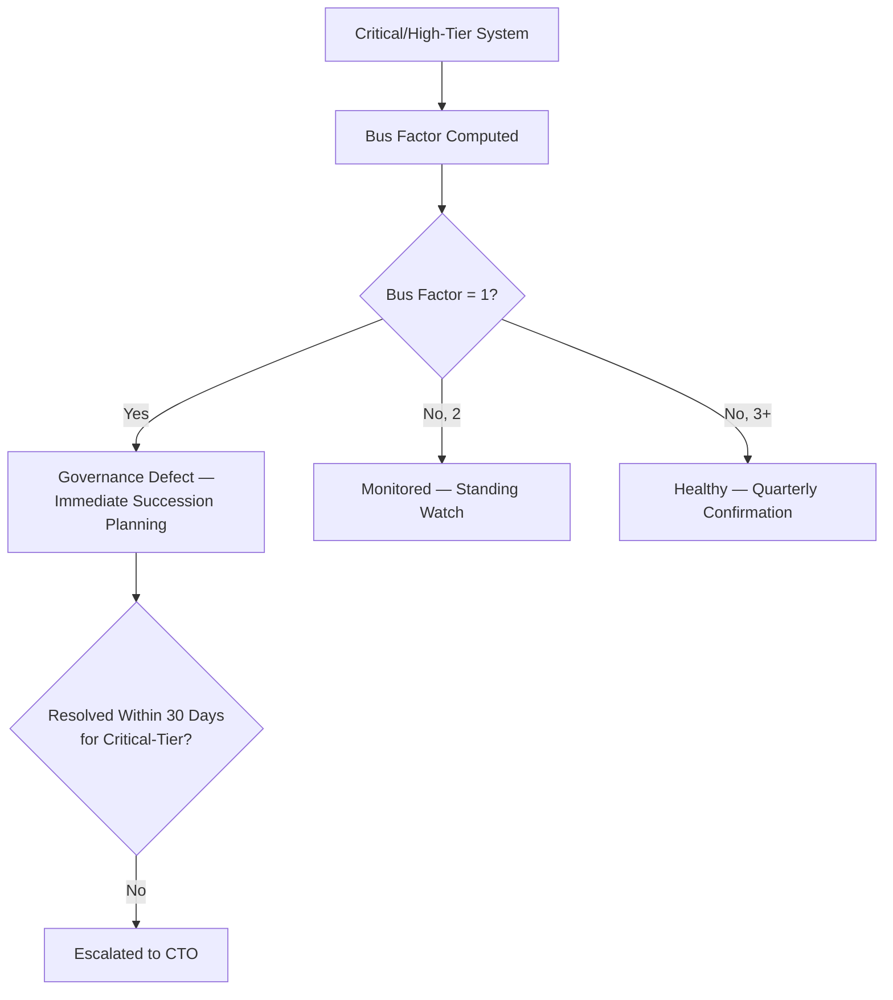

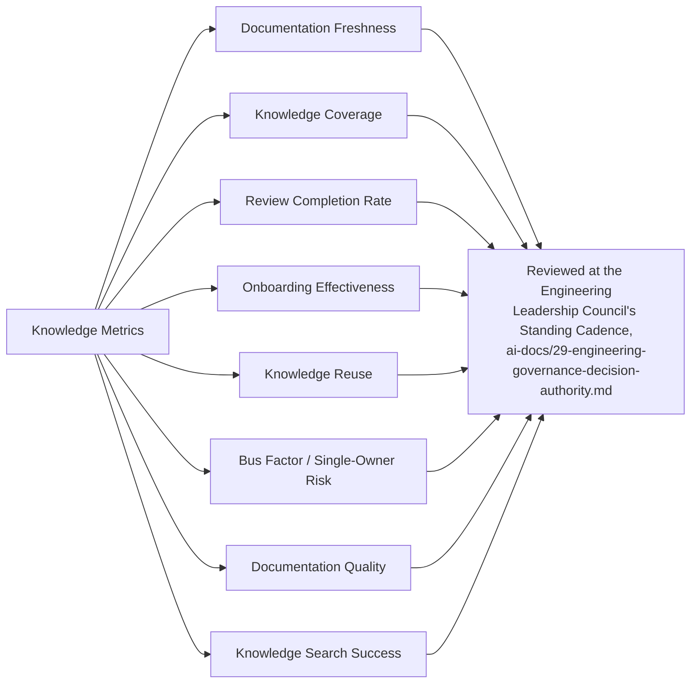

---

# AI-Assisted Knowledge Management

Consistent with the identical AI-assistance principle already established across every governance document in this handbook (`ai-docs/24` through `ai-docs/32`): **AI accelerates capture, search, and synthesis — never accountability.**

### AI-Assisted Documentation

An AI tool may draft a first pass at a README, a runbook, or a knowledge base entry from a diff, a ticket, or a conversation — the draft is treated as a starting point, reviewed and corrected by the accountable human owner before Publication, per the identical AI-Generated Documentation standard already established in `ai-docs/24-documentation-standards.md`.

### AI-Assisted Search

An AI-powered search layer over the engineering wiki and knowledge base is a legitimate, encouraged Discoverability tool — every result it surfaces is presented as a candidate answer for the searcher to verify against the actual source, never as an authoritative answer in its own right, since a search tool summarizing stale or superseded content can propagate exactly the inaccuracy Knowledge Validation exists to prevent.

### AI-Generated Summaries

An AI tool may summarize a long postmortem, a lengthy ADR, or a sprawling technical discussion into a shorter, more discoverable form — the summary is verified against the original by a human familiar with the underlying content before it is published as a standalone artifact, per the identical Fact Verification discipline already established throughout this handbook's AI-assistance sections.

### AI-Assisted Onboarding

An AI tool may answer a new engineer's routine, factual question ("where is the config for X," "what does this acronym mean") by retrieving from the existing, verified knowledge base — this is a genuinely valuable onboarding accelerant, provided the underlying knowledge base itself is kept current per Knowledge Validation above; an AI tool cannot compensate for a stale source it is retrieving from.

### Knowledge Recommendations

An AI tool may proactively flag a knowledge item likely to be stale (based on the age of its last review versus the frequency of change in the system it describes) or surface a related item a searcher may not have known to look for — every such recommendation is a lead for a human to act on, never an automatic correction applied without review.

### Human Verification Requirements

No knowledge item is Published, Approved, or relied upon for a Critical or High-tier decision on the basis of AI-generated content alone. The human owner named per Knowledge Ownership above remains fully accountable for every item's accuracy, regardless of how much AI assistance contributed to its drafting, summarization, or retrieval — identical to the Human Ownership standard already established consistently across `ai-docs/24-documentation-standards.md` through `ai-docs/32-technical-debt-management-standards.md`.

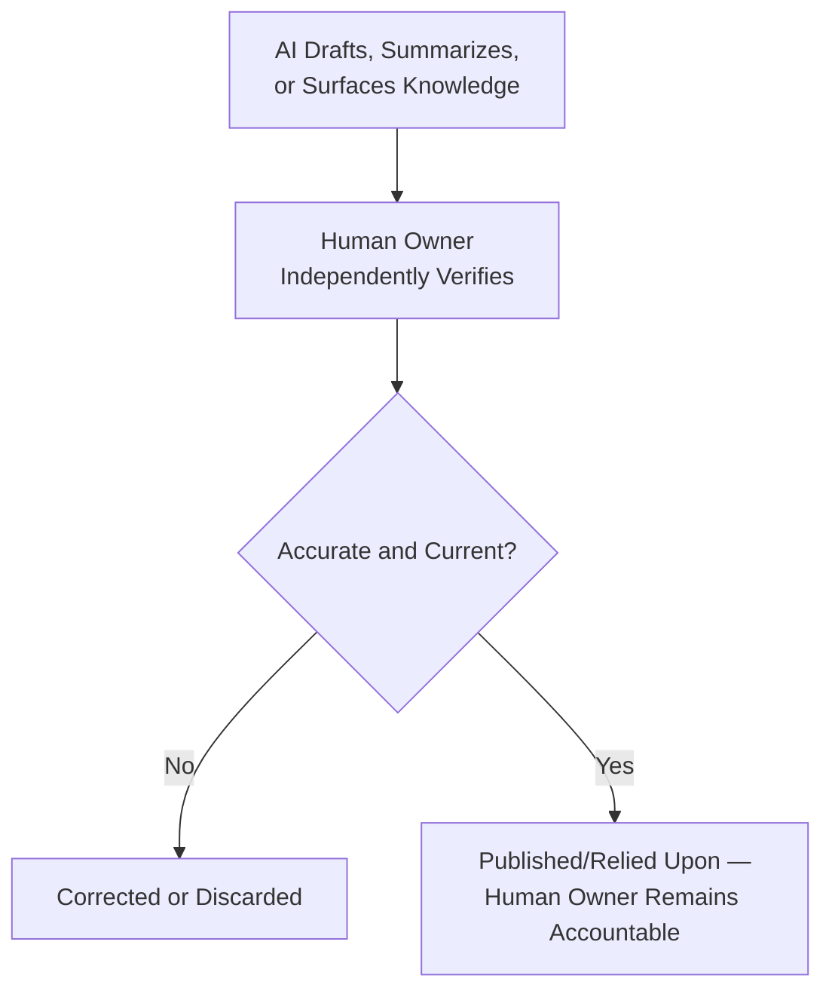

---

# Engineering Knowledge Anti-Patterns

| Anti-Pattern | Description | Why It's Rejected |
|---|---|---|
| **Knowledge Silos** | Critical understanding of a system concentrated in one team or individual, inaccessible to anyone outside it. | Violates Shared Ownership above; directly produces the Bus Factor 1 condition this document treats as a governance defect. |
| **Undocumented Systems** | A production system with no README, no runbook, and no named owner. | Violates Knowledge Coverage above; a system nobody can safely operate without its original author is a standing operational risk. |
| **Outdated Documentation** | A document that no longer reflects current system behavior, left uncorrected. | Violates Knowledge Evolves above and Documentation Quality Standards in `ai-docs/24-documentation-standards.md`; worse than no documentation, per Accuracy Over Quantity there. |
| **Single Expert Dependency** | One engineer is the only person who genuinely understands a Critical-tier system, with no Successor Owner briefed. | The specific condition Knowledge Succession Planning and the Bus Factor Governance Threshold exist to eliminate. |
| **Duplicate Documentation** | The same fact independently maintained in two or more locations. | Violates Single Source of Truth above; the two copies inevitably drift, and a reader has no way to know which is current. |
| **Private Documentation** | Knowledge captured in a personal notes app, an unshared document, or a private chat, never published to an official Knowledge Source. | Violates Discoverability and Documentation Before Memory above; knowledge that cannot be found by anyone but its author has not actually been captured for the organization. |
| **Lost Architectural Decisions** | A significant, precedent-setting decision made with no corresponding ADR or Historical Decision record. | Recreates the exact "systematic amnesia" `ai-docs/25-architecture-decision-records.md` exists to prevent. |
| **Unverified AI-Generated Documentation** | AI-drafted content published without human review, or an AI search result trusted without verification against its source. | Violates Human Verification Requirements above; an unverified AI claim can be confidently, plausibly wrong. |

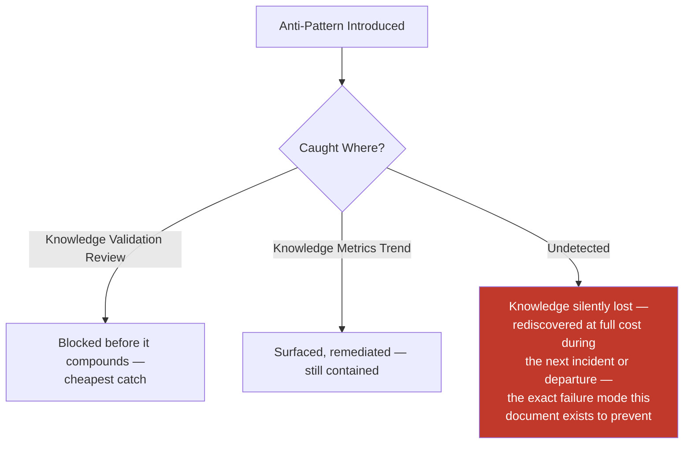

---

# Engineering Review Checklist

Every knowledge item, transition, or periodic review is checked against the following before it is considered knowledge-management-compliant:

- [ ] **Correctly typed** — The knowledge matches exactly one of the fourteen types in Types of Engineering Knowledge above.
- [ ] **Captured in an official Knowledge Source** — Never left only in a private, unofficial location, per Knowledge Sources above.
- [ ] **Correctly classified** — Critical/High/Medium/Low, matching its actual consequence if lost, per Knowledge Classification.
- [ ] **Named owner assigned** — Per Knowledge Ownership above, never a diffuse team alone.
- [ ] **Successor Owner confirmed for Critical/High tier** — Actively briefed, not merely named on paper, per Knowledge Transfer's Succession Planning.
- [ ] **Reviewed within its required cadence** — Per Knowledge Classification's Review Frequency column.
- [ ] **Periodic verification completed for Critical operational knowledge** — Disaster-recovery and government-integration procedures rehearsed, not merely re-read, per Knowledge Validation above.
- [ ] **Discoverable** — Indexed and findable from the standard entry point, per Documentation Searchability (`ai-docs/24-documentation-standards.md`).
- [ ] **No duplication** — The item does not restate a fact already authoritatively recorded elsewhere; it links instead, per Single Source of Truth.
- [ ] **Transfer governed at every transition** — New hire, role change, team transition, leave, or exit follows the applicable checklist in Knowledge Transfer above.
- [ ] **AI-assisted content independently verified** — Any AI-drafted or AI-surfaced content fact-checked by the human owner before being relied upon.
- [ ] **No anti-pattern present** — No silo, undocumented system, outdated content, single-expert dependency, duplication, private documentation, lost decision, or unverified AI content.
- [ ] **No duplication of Documentation, ADR, Governance, Code Review, Technical Debt, or Development Workflow standards** — Any such concern deferred entirely to its owning phase document, never redefined here.

A knowledge item, transition, or review failing any item above is not considered compliant until resolved — this checklist carries the same non-negotiable authority as every other review checklist established in the preceding thirty-three phase documents.

---

# Governance Review

### Annual Framework Review

This document's own classification thresholds, review cadences, and Bus Factor Governance Threshold are reviewed no less than **annually** by the Engineering Leadership Council, per the identical standing self-review commitment already established in `ai-docs/30-engineering-risk-management-standards.md`, `ai-docs/31-change-management-governance-standards.md`, and `ai-docs/32-technical-debt-management-standards.md`. The annual review specifically asks: do the review cadences still fit Arwal's actual rate of system change; is the Bus Factor threshold catching real concentration risk before it becomes a governance defect; and has any knowledge type in Types of Engineering Knowledge above proven under-served relative to its real-world importance.

### Knowledge Audits

A periodic (at minimum quarterly) audit samples a cross-section of the Critical and High-tier knowledge inventory, verifying: is the named owner still accurate, is a Successor Owner genuinely briefed, does the content match current system reality, and was the required periodic verification actually performed (not merely marked complete).

### Ownership Review

Every knowledge item's Owner is confirmed current at least annually, mirroring the identical standard already established for ADRs in `ai-docs/25-architecture-decision-records.md` and debt items in `ai-docs/32-technical-debt-management-standards.md` — an item whose named owner has left the team with no successor is treated as an active governance defect, escalated immediately rather than waiting for the next scheduled review.

### Metrics-Driven Improvements

Between annual reviews, Knowledge Metrics (above) are watched continuously at the Engineering Leadership Council's standing cadence — a sharp, sustained shift (a rising Bus Factor 1 count, a declining review completion rate) triggers an out-of-cycle review of the specific practice or team implicated, never deferred to the next scheduled cycle.

### Cross-Team Reviews

At least annually, the Engineering Leadership Council convenes a cross-team knowledge review examining the aggregate Knowledge Metrics across every team simultaneously, specifically to catch knowledge risk accumulating unevenly — one team's documentation staying disciplined while another's silently degrades — mirroring the identical Portfolio-Level Review structure already established for technical debt in `ai-docs/32-technical-debt-management-standards.md`.

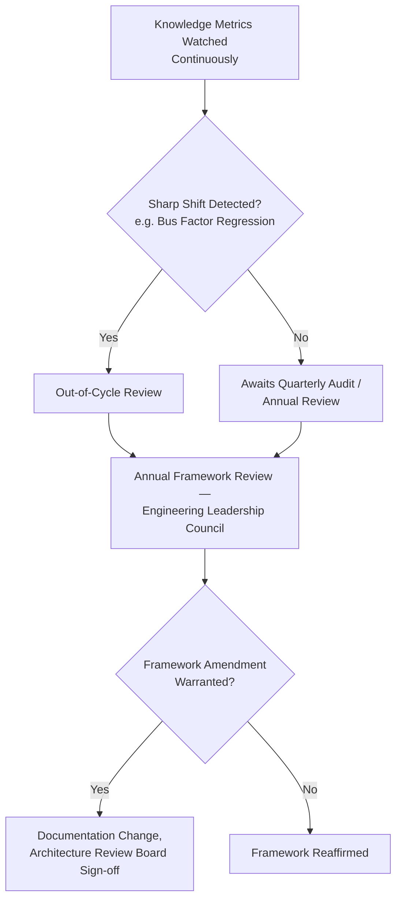

---

# Relationship to Previous Standards

### Project Vision

`ai-docs/00-project-vision.md` establishes the commitment to infrastructure built for a generation. This document is the operational discipline that makes that multi-year commitment survivable across the team changes a generation-long project inevitably involves.

### Engineering Principles

`ai-docs/02-engineering-principles.md` establishes Documentation-Driven Development and the founding ADR concept. This document is the standing, organization-wide practice that keeps that founding commitment real in daily engineering life, never redefining a single principle already established there.

### Documentation Standards

`ai-docs/24-documentation-standards.md` owns the complete discipline of documentation as a written artifact in full — this document never redefines a Markdown standard, a writing-style rule, or the Documentation Review Process; it governs the broader system of knowledge that written documentation is one carrier of.

### ADR Standards

`ai-docs/25-architecture-decision-records.md` owns the complete decision-record artifact and its lifecycle. This document treats an ADR as one Knowledge Source among several and never redefines its template or numbering.

### Engineering Governance

`ai-docs/29-engineering-governance-decision-authority.md` owns the complete organizational decision-authority structure this document's every Ownership role and Approval Authority is drawn from directly.

### Technical Debt Management

`ai-docs/32-technical-debt-management-standards.md` owns Knowledge Debt as a tracked, remediated category. This document is the standing, preventive discipline; that document is the remediation framework for when prevention has already failed.

### Risk Management

`ai-docs/30-engineering-risk-management-standards.md` owns Knowledge Risk as a standing risk category with its own Risk Register. A knowledge concentration this document's Bus Factor metric identifies as unresolved past its governance threshold is escalated into that document's framework, never tracked redundantly here.

### Change Management

`ai-docs/31-change-management-governance-standards.md` owns the Change Request lifecycle. A knowledge-transfer activity requiring a system change (e.g., automating a manual runbook step discovered during a transfer) flows through that document's governance, never redefined here.

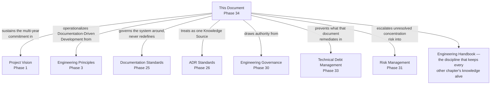

---

# Closing Statement

> **Callout — Closing Statement**
> Every preceding phase document described a standard for how Arwal is designed, built, secured, tested, deployed, governed, risk-managed, changed, and kept solvent against its own technical debt. This document describes the discipline that keeps the *understanding* behind every one of those standards alive in the people who must apply them — because a handbook nobody remembers how to use, a runbook nobody has ever actually rehearsed, and a decision nobody can explain are not meaningfully different from standards that were never written at all. Arwal's engineers will change — teams will grow, roles will shift, people will leave and new people will arrive — for as long as this platform exists, and the codebase, the architecture, and the citizen trust built on top of them must survive every one of those changes intact. Knowledge management is what makes that survival possible: not by preventing people from ever leaving, but by ensuring that what they knew never leaves with them. A district's trust in Arwal, sustained across ~300 micro-phases and however many years those phases span, rests as much on what Arwal's engineers remember and can teach the next generation as on what Arwal's code actually does today. Where a future phase must deviate from a standard stated here, that deviation is made explicitly — through this document's own Governance Review process, or a Strategic-classification ADR where the deviation is structural — never silently, and never by default.

This document, `ai-docs/33-engineering-knowledge-management-standards.md`, is Phase 34 of approximately 300. Every piece of engineering knowledge captured, shared, transferred, validated, retained, and retired in the phases that follow is expected to satisfy the standards defined here, or to justify its deviation in writing.

**End of Phase 34 — `ai-docs/33-engineering-knowledge-management-standards.md`**