# Engineering Communication Standards

**Document:** `ai-docs/34-engineering-communication-standards.md`
**Project:** Arwal — The District Super App
**Stage:** 1 — Foundation
**Phase:** 35 — Engineering Communication Standards
**Status:** Approved for Engineering Reference
**Audience:** CTO, Architecture Review Board, Platform Team, Security Team, SRE, Engineering Managers, Tech Leads, Developers, QA, Product Managers, Government Technical Partners

> **Callout — Purpose of This Document**
> `ai-docs/00-project-vision.md` through `ai-docs/33-engineering-knowledge-management-standards.md` defined why Arwal exists and every enforceable discipline governing how it is designed, written, secured, tested, deployed, observed, logged, configured, documented, decided upon, reviewed, branched, released, depended upon, governed, risk-managed, changed, kept solvent against its own technical debt, and kept alive as organizational knowledge. Every one of those documents assumes something none of them fully defines: that the people implementing them can actually **talk to each other** — clearly, at the right time, to the right audience, through the right channel, with a durable record left behind. This document is that definition: Arwal's Engineering Communication charter, for every one of the ~300 micro-phases still ahead.

---

# Purpose of this Document

### Why Engineering Communication Exists

A perfectly architected system, perfectly documented and perfectly governed, still fails the moment two engineers who need to coordinate cannot do so clearly. Communication is the connective tissue between every standard this handbook defines and the humans who must apply it — an ADR (`ai-docs/25-architecture-decision-records.md`) is worthless if nobody is told it exists; a Critical-tier Change Request (`ai-docs/31-change-management-governance-standards.md`) is dangerous if its approvers were never actually informed in time; an incident is prolonged, not shortened, by responders talking past each other. This document exists to make communication itself a governed engineering discipline — with defined channels, defined audiences, defined urgency tiers, and a defined lifecycle — rather than an unmanaged byproduct left to whatever happens to work on a given day.

### Reducing Ambiguity

Per the Explicit Configuration and Explicitness principles already established throughout `ai-docs/05-coding-standards.md` and `ai-docs/21-configuration-management-standards.md`, ambiguity is a defect wherever it appears — including in how Arwal's engineers talk to one another. A message that could be read two ways, a decision announced to the wrong audience, or an update that never specifies who is expected to act on it is exactly as costly as an ambiguous API contract, and this document exists to close that gap with the same rigor `ai-docs/13-api-design-guidelines.md` applies to a request body.

### Shared Understanding

Per Shared Ownership and Single Source of Truth already established in `ai-docs/33-engineering-knowledge-management-standards.md`, knowledge that exists in one person's head is not yet organizational knowledge — communication is the mechanism by which it becomes that. This document governs the deliberate act of moving understanding from where it originates to everyone who needs it, at the moment they need it, through a channel built for that specific purpose.

### Faster Collaboration

A team of hundreds spanning Platform, Security, SRE, and dozens of product teams, per the organizational trajectory already established in `ai-docs/29-engineering-governance-decision-authority.md`, cannot rely on hallway proximity to coordinate. Deliberate, disciplined communication is what lets that scale of organization move as fast as a five-person team did in Phase 1 — not by talking less, but by talking through the right channel, to the right audience, the first time.

### Operational Resilience

During an incident, per the Incident Response Workflow already established in `ai-docs/07-development-workflow.md`, the single largest amplifier of Mean Time to Recovery is not usually the technical fix — it is confusion about who is speaking authoritatively, what is actually known versus assumed, and who still needs to be told. This document's Incident Communication section exists specifically to remove that amplifier before an incident ever happens, not to improvise it during one.

### Organizational Alignment

Per Transparency over Opacity, already a Guiding Principle in `ai-docs/00-project-vision.md`, an organization is aligned only to the degree its engineers share an accurate, current picture of what is happening and why. Communication is the practice that keeps that picture current — this document exists to make sure it stays that way as Arwal scales from a handful of founding engineers to hundreds, across ~300 micro-phases.

### Relationship with Documentation Standards

`ai-docs/24-documentation-standards.md` already owns the complete discipline of documentation as a written artifact — Markdown standards, writing style, the Documentation Review Process, Documentation Ownership, Documentation Lifecycle. This document does not redefine a single one of those mechanics. It governs the act of communicating — which is broader than, and not always synonymous with, producing a document: a Slack message, a stand-up update, and an incident timeline are all communication, only some of which becomes formal documentation. Where this document's communication produces a durable artifact, it is authored per `ai-docs/24-documentation-standards.md`'s rules; this document governs only the communication act itself — audience, timing, channel, and tone.

### Relationship with Knowledge Management

`ai-docs/33-engineering-knowledge-management-standards.md` already owns Knowledge Sources, Knowledge Capture, and Knowledge Sharing practices (technical talks, design reviews, mentorship, communities of practice) in full. This document does not redefine a single knowledge-management mechanic. It governs the communication layer those practices run on — the channel discipline, urgency classification, and lifecycle that make a knowledge-sharing session, an ADR announcement, or a runbook update actually reach the people who need it, when they need it.

### Relationship with Engineering Governance

`ai-docs/29-engineering-governance-decision-authority.md` already owns the complete decision-authority structure — who proposes, reviews, approves, and escalates a decision. This document owns how that decision, once made, is **communicated** to everyone it affects — this document never redefines a board's authority or an escalation tier; it defines the communication obligation that authority carries once a decision is final.

### Relationship with Change Management

`ai-docs/31-change-management-governance-standards.md` already owns the complete Change Request lifecycle, including its own Change Communication section governing stakeholder notification for a specific change. This document does not duplicate that section — it is the general communication framework Change Communication's specific rules are an instance of; where the two overlap, `ai-docs/31-change-management-governance-standards.md` governs the change-specific detail and this document governs the general channel, classification, and quality standards that detail is built from.

### Relationship with Risk Management

`ai-docs/30-engineering-risk-management-standards.md` already owns Risk Escalation and the standing Risk Register. This document does not redefine a risk-escalation trigger — it governs how a risk, once escalated, is actually communicated to the humans who must act on it, with the same channel and classification discipline applied to every other communication category in this document.

---

# Engineering Communication Philosophy

Arwal's engineering communication rests on nine commitments. Together they answer the question every subsequent section of this document exists to make concrete: **what makes a piece of engineering communication actually work, rather than merely get sent?**

### Clarity Before Speed

A message sent quickly but misunderstood costs more time than a message that took an extra minute to write clearly — restating, at the communication layer, the identical Readability Over Cleverness principle already established in `ai-docs/05-coding-standards.md`. This exists because the appearance of speed (a fast reply) is worthless if it produces a second round of clarifying questions that together take longer than a clear first message would have.

### Transparency

Every communication of consequence is visible to everyone who might reasonably be affected by it, per the identical Transparency principle already established throughout `ai-docs/00-project-vision.md`, `ai-docs/24-documentation-standards.md`, and `ai-docs/29-engineering-governance-decision-authority.md`. This exists because a decision or an update known only to a private channel cannot be trusted, questioned, or built upon by the people who must live with its consequences.

### Audience Awareness

Every communication is shaped for who will actually read it — a citizen-facing status page update is not written in the same register as an internal incident channel, and an executive summary is not the same document as the engineering postmortem it summarizes. This exists because a single message trying to serve every possible audience simultaneously usually serves none of them well; per the Writing Style Guide already established in `ai-docs/24-documentation-standards.md`, precision for the intended reader is what makes communication actually useful.

### Single Source of Truth

Every fact is communicated from exactly one authoritative origin, restating the identical Single Source of Truth principle already established in `ai-docs/02-engineering-principles.md` and `ai-docs/33-engineering-knowledge-management-standards.md`. This exists because two independently-issued updates about the same event, even both well-intentioned, inevitably drift and produce the specific Conflicting Announcements anti-pattern this document exists to prevent.

### Timeliness

A communication is delivered within a window proportional to its urgency — restating, at the communication layer, the identical Risk Proportionality principle already established in `ai-docs/30-engineering-risk-management-standards.md`. This exists because information that arrives after the decision it should have informed has already been made has failed its purpose regardless of how accurate or well-written it is.

### Respectful Collaboration

Every communication treats its recipient with the same dignity already established for code review in `ai-docs/26-code-review-standards.md`'s Reviews Improve Code, Not People principle — direct, specific, free of sarcasm or dismissiveness. This exists because Arwal's engineers, across hundreds of people and years of collaboration, can only sustain honest, fast communication in a culture where raising a concern or asking a question never carries a social cost.

### Traceability

Every significant communication is recorded somewhere durable and citable, never left as an ephemeral, unrecoverable exchange — mirroring the identical Traceability principle already established in `ai-docs/06-git-workflow.md` and `ai-docs/25-architecture-decision-records.md`. This exists because "we discussed this in a call" is not, on its own, evidence a future engineer, auditor, or government partner can verify.

### Accountability

Every communication of consequence has a named, accountable sender — never an anonymous or diffuse "the team" announcement — restating the identical Accountability principle already established throughout `ai-docs/29-engineering-governance-decision-authority.md` and `ai-docs/30-engineering-risk-management-standards.md`. This exists because a message with no accountable author cannot be followed up on, corrected, or trusted at the same level as one that is.

### Continuous Improvement

Arwal's communication practice — its channels, its classification thresholds, its quality bar — is itself periodically re-evaluated against what Communication Metrics (below) actually reveal, mirroring the identical Continuous Improvement discipline already established across `ai-docs/30`, `ai-docs/31`, `ai-docs/32`, and `ai-docs/33`. This exists because a communication framework calibrated once, in Phase 35, and never revisited will drift out of fit with Arwal's actual team size and distribution as both grow.

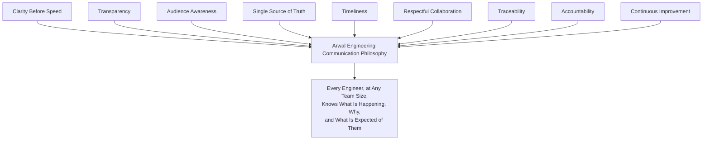

> **Callout — The One-Sentence Communication Philosophy**
> *"A fact that is true but never reaches the person who needed it has, functionally, never been communicated at all — this handbook exists so that never happens by accident."*

---

# Types of Engineering Communication

### Architecture Communication

**Definition:** Communication about system structure, boundaries, and structural decisions.
**Typical Audience:** Architecture Review Board, affected domain Tech Leads, all Engineering for a Strategic/Architectural decision.
**Communication Goals:** Shared understanding of *why* a boundary exists before it is depended upon; early surfacing of a conflicting proposal.
**Examples:** An ADR announcement per `ai-docs/25-architecture-decision-records.md`; an Architecture Review Board meeting record; a pre-Draft RFC circulated for early feedback.

### Development Communication

**Definition:** Day-to-day communication about in-progress engineering work.
**Typical Audience:** The immediate team, occasionally a Domain Expert outside it.
**Communication Goals:** Keep collaborators current on progress, blockers, and scope changes without requiring a formal artifact for every update.
**Examples:** A stand-up update; a PR description; a "heads up, I'm touching X" message before starting cross-cutting work.

### Code Review Communication

**Definition:** Communication exchanged during the review of a specific change, fully governed in substance by `ai-docs/26-code-review-standards.md`.
**Typical Audience:** The PR's author and reviewer(s).
**Communication Goals:** Actionable, evidence-based, respectful feedback per the Review Quality Standards already established there.
**Examples:** A Blocking review comment; a Suggestion comment; a synchronous pairing session resolving a disagreement, recorded back into the PR thread per that document's Decision Recording standard.

### Operational Communication

**Definition:** Communication about the day-to-day running of production systems, distinct from an active incident.
**Typical Audience:** SRE, DevOps/Platform, the affected service's owning team.
**Communication Goals:** Keep operational state (a deploy in progress, a maintenance window, a capacity concern) visible to everyone who might be affected by it.
**Examples:** A deployment-starting notification; a scheduled maintenance-window announcement per `ai-docs/16-deployment-standards.md`; a capacity-trend flag per `ai-docs/30-engineering-risk-management-standards.md`'s Risk Monitoring.

### Incident Communication

**Definition:** Communication during and immediately after an active Sev 1/Sev 2 incident, per the Incident Response Workflow already established in `ai-docs/07-development-workflow.md`.
**Typical Audience:** Scales from the responding team to all Engineering, executives, government partners, and citizens, per severity — see Incident Communication below.
**Communication Goals:** A single, authoritative, continuously updated source of truth about what is known, what is being done, and what is still uncertain.
**Examples:** An incident channel's pinned status update; an executive incident brief; a citizen-facing status-page notice.

### Release Communication

**Definition:** Communication about a change moving through `ai-docs/27-branching-release-strategy.md`'s release cadence toward production.
**Typical Audience:** Affected teams, QA, DevOps, and — for a citizen-behavior-changing release — Product and citizens.
**Communication Goals:** Ensure nobody is surprised by a release, a rollback, or a deprecation affecting them.
**Examples:** A release announcement; a rollback notification; a feature-deprecation notice, per Release Communication below.

### Security Communication

**Definition:** Communication about a security finding, control change, or incident, governed in substance by `ai-docs/10-security-standards.md`.
**Typical Audience:** Security Review Board, affected domain teams; scoped restrictively for an unpatched, actively-exploitable finding.
**Communication Goals:** Get the right people acting on a security-relevant fact quickly, without over-broadcasting detail that itself increases risk.
**Examples:** A CVSS-scaled vulnerability disclosure per `ai-docs/22-dependency-management-standards.md`; a Security Review Board determination.

### Infrastructure Communication

**Definition:** Communication about provisioned infrastructure and its topology, per `ai-docs/16-deployment-standards.md`.
**Typical Audience:** Platform Team, DevOps, any team whose service the infrastructure change affects.
**Communication Goals:** Prevent a team from being surprised by an infrastructure change that alters their service's behavior or capacity.
**Examples:** An IaC plan-diff review notice; a network-topology change announcement.

### AI Communication

**Definition:** Communication about Arwal's AI Gateway Service, its capabilities, limitations, and safety posture, per `ai-docs/09-tech-stack.md` and the AI Principle in `ai-docs/00-project-vision.md`.
**Typical Audience:** The AI Gateway Service's owning team, Security Team, and any domain team integrating a new AI-assisted capability.
**Communication Goals:** Keep every consuming team aware of a provider change, a prompt-template update, or a discovered safety limitation.
**Examples:** A provider-fallback-path announcement; a prompt-template regression finding shared per `ai-docs/15-testing-standards.md`'s AI Testing golden-set process.

### Cross-Team Communication

**Definition:** Communication between two or more teams whose domains interact.
**Typical Audience:** Every team on either side of a shared boundary — an API contract, a shared package, a data dependency.
**Communication Goals:** Surface an integration assumption before it becomes a defect, per Cross-Team Collaboration below.
**Examples:** A breaking-change notice to every consuming team of a shared package (`ai-docs/28-dependency-governance-standards.md`); a joint planning session ahead of two teams' colliding release windows.

### Executive Communication

**Definition:** Communication to CTO, VP Engineering, and the Engineering Leadership Council on a matter warranting their awareness or decision.
**Typical Audience:** CTO, VP Engineering, Engineering Leadership Council.
**Communication Goals:** Give leadership an accurate, appropriately-summarized picture without requiring them to read every underlying artifact.
**Examples:** A Critical-tier risk escalation per `ai-docs/30-engineering-risk-management-standards.md`; a quarterly Governance Metrics summary per `ai-docs/29-engineering-governance-decision-authority.md`.

### Government Partner Communication

**Definition:** Communication with a Government Technical Partner about an integration, an incident affecting their system, or a compliance obligation.
**Typical Audience:** The relevant Government Technical Partner, mediated through Product and/or the affected domain's Tech Lead.
**Communication Goals:** Never let a government partner be surprised by a change to a system they integrate with, per Transparency over Opacity (`ai-docs/00-project-vision.md`).
**Examples:** An advance notice of an API contract deprecation per `ai-docs/13-api-design-guidelines.md`; an incident brief scoped to a partner-affecting outage.

### Customer-Impact Communication

**Definition:** Communication to citizens, merchants, or government officers about a change or incident affecting their use of the platform.
**Typical Audience:** The affected citizen/merchant/officer population.
**Communication Goals:** Plain-language, accessible (`ai-docs/12-accessibility-standards.md`, multilingual where applicable), honest communication about what is happening and what to expect.
**Examples:** A status-page incident notice; a maintenance-window advance notice per `ai-docs/31-change-management-governance-standards.md`.

### Knowledge-Sharing Communication

**Definition:** Communication whose primary purpose is transferring understanding, distinct from coordinating a specific piece of work, governed in substance by `ai-docs/33-engineering-knowledge-management-standards.md`.
**Typical Audience:** Varies by practice — a team, a community of practice, all Engineering.
**Communication Goals:** Spread understanding deliberately, per Shared Ownership (`ai-docs/33-engineering-knowledge-management-standards.md`).
**Examples:** A technical talk announcement; a cross-team session invite; an onboarding session for a new hire.

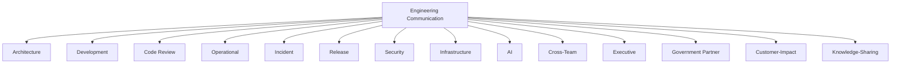

---

# Official Communication Channels

| Channel | Purpose | Ownership | When to Use | When NOT to Use |
|---|---|---|---|---|
| **ADRs** | Permanent decision records, per `ai-docs/25-architecture-decision-records.md`. | Architecture Review Board, decision Owners. | A decision meeting the ADR threshold. | A routine implementation choice or a non-precedent-setting change. |
| **Engineering Handbook (`ai-docs/*`)** | Standing, foundational standards. | The owning team per each document's own governance. | A structural, enduring rule everyone must follow. | A time-bound announcement or a status update. |
| **Issue Tracker** | Tracked, assignable units of work and their history. | The requesting/assigned engineer, Tech Lead. | Any trackable task, bug, or debt item (`ai-docs/32-technical-debt-management-standards.md`). | A real-time, urgent coordination need — an issue is asynchronous by nature. |
| **Pull Requests** | The record of a specific code change and its review, per `ai-docs/06-git-workflow.md`. | The PR author, reviewers. | Any code-level change and its discussion. | A cross-team architectural discussion better suited to an RFC or Architecture Review. |
| **Code Reviews** | In-line feedback on a specific diff. | Reviewer, author. | Feedback tied to a specific line or file. | A broader design disagreement — escalate to a design review or ADR discussion instead. |
| **Architecture Review Meetings** | Deliberation and approval of Strategic/Architectural decisions, per `ai-docs/07-development-workflow.md`'s Architecture Review Workflow. | Architecture Review Board. | A proposal meeting the ADR threshold, per `ai-docs/25-architecture-decision-records.md`. | A routine status update — use Development Communication instead. |
| **Runbooks** | Step-by-step operational procedures, per `ai-docs/24-documentation-standards.md`. | SRE, DevOps. | A rehearsable, repeatable operational task. | A one-off, non-repeatable communication. |
| **Incident Timelines** | The authoritative, chronological record of an active incident. | The Incident Commander of record. | Every Sev 1/Sev 2 incident, per Incident Communication below. | A non-incident operational update. |
| **Release Notes** | A changelog of what shipped, per `ai-docs/06-git-workflow.md`'s Changelog Generation. | Release Engineer, generated per `ai-docs/17-cicd-standards.md`. | Every release, per Release Communication below. | An in-progress, unreleased feature's status. |
| **Technical RFCs** | Pre-decision proposal discussion, feeding into `ai-docs/25-architecture-decision-records.md`'s Proposal/Draft stages. | The proposing engineer/team. | A significant technical direction still being explored, before it is ready to become an ADR. | A decision already final — use an ADR instead. |
| **Engineering Wiki / Knowledge Base** | The searchable, aggregated index of durable knowledge, per `ai-docs/33-engineering-knowledge-management-standards.md`. | Per-item, per that document's Knowledge Ownership. | A durable fact worth finding later. | A time-sensitive, ephemeral coordination need. |
| **Dashboards** | Live, observable system state, per `ai-docs/18-observability-standards.md`. | SRE, the owning service's team. | Real-time or trend-based system health. | A narrative explanation of *why* a metric moved — pair with a written note. |
| **Chat Platforms** | Fast, informal, real-time coordination. | The relevant team/channel owner. | Development Communication, a quick question, an operational heads-up. | A decision of Medium classification or above with no durable record — escalate to a written, archived channel per Communication Classification below. |
| **Email** | Formal, externally-facing, or asynchronous-by-design communication. | The sender. | Government Partner Communication; a formal notice requiring a durable, timestamped record outside internal tooling. | Fast-moving internal coordination better served by chat. |
| **Engineering Town Halls** | Org-wide, synchronous, broadcast communication. | VP Engineering / CTO, or delegate. | A significant strategic update, a major incident retrospective shared broadly, a recurring cadence update. | A team-specific or narrowly-scoped update — use the affected team's own channel. |

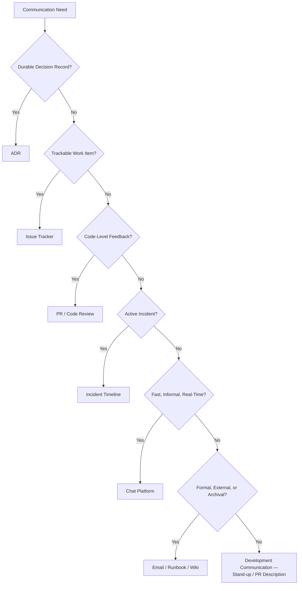

> **Callout — Chat Is Never the System of Record for a Decision**
> A decision reached in a chat thread is real the moment it is written into its proper channel — an ADR, a Change Request, an issue — and not fully real until then, per Traceability above. A chat platform is excellent for reaching that decision quickly; it is never itself the durable record of having reached it.

---

# Communication Classification

Every communication of genuine consequence is assigned exactly one classification tier, mirroring the identical Low/Medium/High/Critical shape already established across `ai-docs/29`, `ai-docs/30`, `ai-docs/31`, and `ai-docs/32`, applied here specifically to the act of communicating.

| Tier | Urgency | Required Audience | Escalation Expectation | Retention Expectation | Review Requirement |
|---|---|---|---|---|---|
| **Low** | No defined deadline; informational. | The immediately relevant team. | None. | Retained per its channel's own default (e.g., chat history, PR history). | None required. |
| **Medium** | Within the current working day, or the next standing cadence (stand-up, weekly sync). | The affected team(s), named explicitly. | Escalates to the Tech Lead if unacknowledged within one business day. | Retained for the life of the system it describes, per `ai-docs/24-documentation-standards.md`'s applicable category. | A peer glance for accuracy where the communication states a fact others will act on. |
| **High** | Within hours — same business day, minimum. | Every team named in the communication's stated Affected Systems/Stakeholders. | Escalates to the Engineering Manager or the relevant Governance Board if unacknowledged within 4 business hours. | Retained per `ai-docs/19-logging-standards.md`'s Application/Audit retention tiers, as applicable. | Reviewed by the sender's Tech Lead before distribution, for accuracy and completeness. |
| **Critical** | Immediate — minutes, not hours, per the Communication SLEs below. | All Engineering, plus Executive/Government/Customer audiences per the specific communication type. | Escalates to the Engineering Leadership Council or CTO immediately if the required audience cannot be reached. | Retained indefinitely, mirroring the Archive Never Delete principle already established for ADRs (`ai-docs/25-architecture-decision-records.md`). | Reviewed by the Incident Commander or the relevant Governance Board chair before or concurrently with distribution. |

### Communication Service-Level Expectations (SLEs)

Per the identical SLE discipline already established for debt resolution in `ai-docs/32-technical-debt-management-standards.md`, Critical-tier communication carries an explicit, enforced timing commitment — never left to best-effort delivery merely because the underlying event is already urgent.

| Communication Category | Required First Communication | Required Update Cadence | Escalation if Missed |
|---|---|---|---|
| **Sev 1 Incident (internal)** | Within **5 minutes** of Incident Commander confirmation. | Every **15 minutes** until the incident is Mitigated, per `ai-docs/07-development-workflow.md`. | Automatic escalation to the Engineering Leadership Council. |
| **Sev 1 Incident (executive)** | Within **15 minutes** of Incident Commander confirmation. | Every **30 minutes**, or on any material status change. | Escalation to CTO directly. |
| **Sev 1 Incident (customer-facing, if citizen-visible)** | Within **30 minutes** of confirmed citizen impact. | Every **60 minutes**, or on resolution/material change. | Escalation to Product Lead + CTO. |
| **Critical-tier Architecture/Strategic Decision Announcement** | Within **1 business day** of ADR Acceptance, per `ai-docs/25-architecture-decision-records.md`. | N/A — single announcement, cross-linked from the ADR. | Escalation to the Architecture Review Board if not communicated within the window. |
| **Critical-tier Change (production-impacting)** | Advance notice per the Communication Requirement column already established in `ai-docs/31-change-management-governance-standards.md`'s Change Classification Matrix, confirmed delivered before the change's Approval stage closes. | Status update at each lifecycle transition, per that document's Status Updates standard. | Escalation to the Release Governance Board. |
| **Critical Security Finding (internal)** | Within **1 hour** of confirmed Critical CVSS severity, per `ai-docs/22-dependency-management-standards.md`. | Every **4 hours** until remediated or downgraded. | Escalation to the Security Review Board and CTO. |

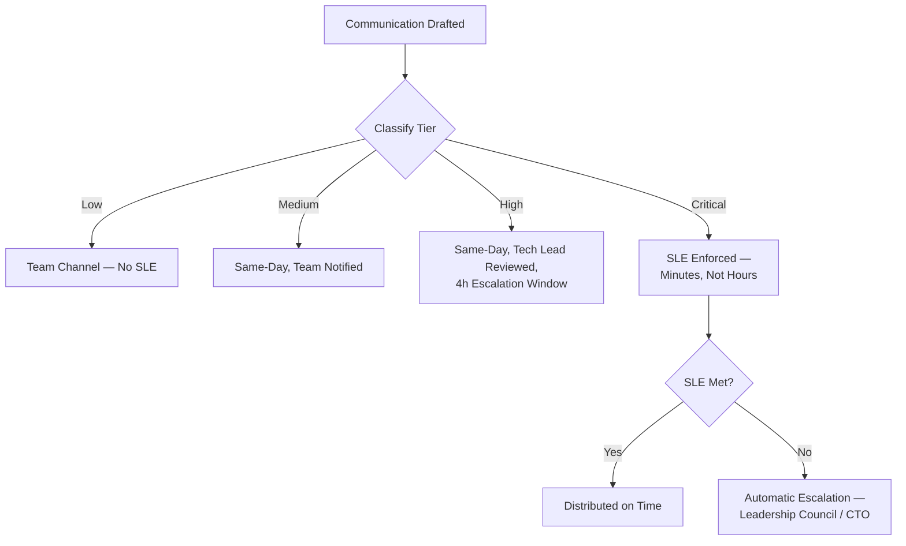

---

# Communication Lifecycle

Every communication of Medium classification or above passes through the same eight stages, mirroring the identical Documentation Lifecycle and Knowledge Lifecycle already established in `ai-docs/24-documentation-standards.md` and `ai-docs/33-engineering-knowledge-management-standards.md`, applied here to the act of communicating specifically. A Low-tier, purely informal communication (a stand-up remark, a quick chat question) is exempt from the full lifecycle — it is created and consumed in one step.

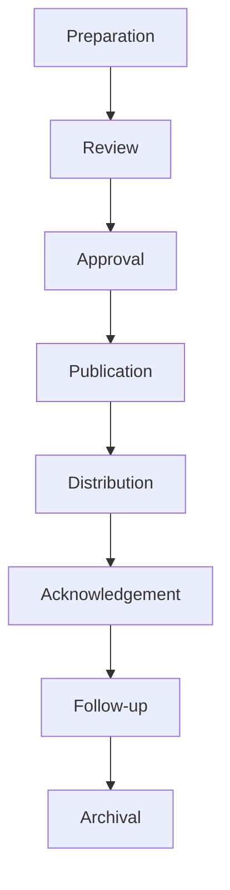

| Stage | Meaning | Exit Criteria |
|---|---|---|
| **Preparation** | The sender drafts the communication, choosing the correct channel (Official Communication Channels above) and classification tier. | A complete draft exists, addressed to a named audience. |
| **Review** | Per the classification tier's Review Requirement, a peer or Tech Lead checks the draft for accuracy and completeness before it is sent. | Reviewer confirms the content is correct as of the review moment. |
| **Approval** | For a High/Critical-tier communication touching a governed decision (an ADR, a Change, a risk acceptance), the Approval Authority already established in the owning document (`ai-docs/25`, `ai-docs/31`, `ai-docs/30`) signs off before or concurrently with distribution. | Approval recorded, or explicitly not required for the tier. |
| **Publication** | The communication is placed in its official channel, per Official Communication Channels above. | Live in the correct, discoverable location. |
| **Distribution** | The communication actively reaches its named audience — never assumed found through passive publication alone, mirroring the identical Communication discipline already established in `ai-docs/24-documentation-standards.md`. | Every named recipient has been actively notified through a channel they monitor. |
| **Acknowledgement** | For a High/Critical-tier communication, the named audience confirms receipt and understanding — never assumed from silence. | Acknowledgement recorded, per Communication Metrics' Acknowledgement Rate below. |
| **Follow-up** | Any question, objection, or required action arising from the communication is tracked to resolution. | Every raised follow-up item is closed or explicitly deferred with an owner. |
| **Archival** | The communication's durable record (where one exists) is retained per its classification tier's Retention Expectation. | Retained in its permanent, citable location — never deleted, mirroring Archive Never Delete. |

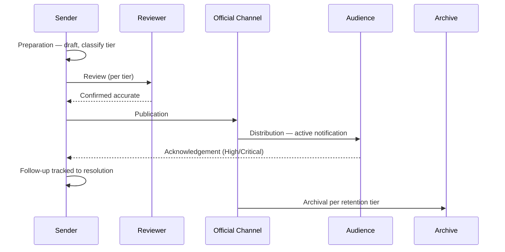

---

# Communication Ownership

| Role | Communication Responsibility |
|---|---|
| **Developers** | Communicate development progress and blockers proactively; escalate a discovered ambiguity rather than guessing silently. |
| **Tech Leads** | Own High-tier communication review within their domain; ensure their team is informed of every Medium-tier or above change affecting it. |
| **Engineering Managers** | Own Medium-tier approval escalations; ensure their team's communication load stays sustainable, per Communication Overload in Anti-Patterns below. |
| **Architecture Review Board** | Own Architecture Communication's distribution to all Engineering for a Strategic/Architectural decision, per `ai-docs/25-architecture-decision-records.md`. |
| **Platform Team** | Own Infrastructure Communication and the Engineering Wiki's platform-tooling currency. |
| **Security Team** | Own Security Communication, scoped restrictively per finding sensitivity, per `ai-docs/10-security-standards.md`. |
| **SRE** | Own Operational and Incident Communication's channel discipline; maintain the Incident Timeline's currency during an active incident. |
| **Product Managers** | Own Customer-Impact Communication's content accuracy and Government Partner Communication's coordination. |
| **CTO** | Final accountability for Executive Communication's accuracy reaching the Engineering Leadership Council and, where warranted, the board/investors. |
| **Engineering Leadership Council** | Owns the Governance Review of this document itself (below); resolves a cross-team communication-ownership dispute. |

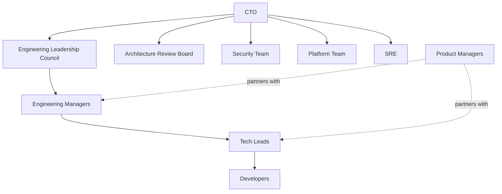

---

# Cross-Team Collaboration

### Shared Ownership

Where two teams share a boundary — a shared package (`ai-docs/28-dependency-governance-standards.md`), an API contract (`ai-docs/13-api-design-guidelines.md`), or a shared database schema access pattern (`ai-docs/14-database-design-guidelines.md`) — both owning teams are named recipients of every Medium-tier or above communication touching that boundary, never assumed to discover it passively.

### Dependency Communication

A team beginning work that depends on another team's in-flight change communicates that dependency explicitly and early, per the identical Dependency Analysis standard already established in `ai-docs/31-change-management-governance-standards.md`'s Change Planning — never discovered only when the dependent work is blocked.

### Planning Communication

Cross-team planning collisions (two teams both scheduling a release into the same maintenance window, or two teams both proposing a change to the same shared package in the same quarter) are surfaced during planning, per the Cross-Team Sessions practice already established in `ai-docs/33-engineering-knowledge-management-standards.md`'s Knowledge Sharing.

### Interface Changes

Any change to a shared interface — a module's public `index.ts` surface (`ai-docs/04-folder-guidelines.md`), a shared package's exported API (`ai-docs/28-dependency-governance-standards.md`) — is communicated to every known consumer before the change merges, at High-tier classification minimum, per the identical Breaking Changes and Compatibility standard already established there.

### API Changes

A non-breaking API change is communicated at Medium-tier to consuming client teams (PWA, Android, iOS, Admin, per `ai-docs/01-product-goals.md`'s Platform Parity). A breaking API version is communicated at High-tier minimum, per the Deprecation Policy already established in `ai-docs/13-api-design-guidelines.md`, with the `Deprecation`/`Sunset` headers' human-readable counterpart delivered directly to every known consuming team, never left for them to discover from the header alone.

### Database Changes

A schema migration affecting a shared read pattern (a cross-module read model built from an Integration Event, per `ai-docs/03-system-architecture-principles.md`) is communicated to every consuming module's team before the migration's Approval stage closes, per `ai-docs/14-database-design-guidelines.md`'s Migration Review Checklist.

### Platform Changes

A Platform Team change affecting shared tooling, CI/CD pipeline behavior (`ai-docs/17-cicd-standards.md`), or shared infrastructure is communicated at High-tier to every consuming team, with advance notice proportional to the change's blast radius, per the Platform Governance Board already established in `ai-docs/29-engineering-governance-decision-authority.md`.

### Breaking Changes

Every breaking change, regardless of category, is communicated at High-tier minimum, is never silently absorbed into a routine release note alone, and follows the identical advance-notice discipline already established in `ai-docs/31-change-management-governance-standards.md`'s Change Communication.

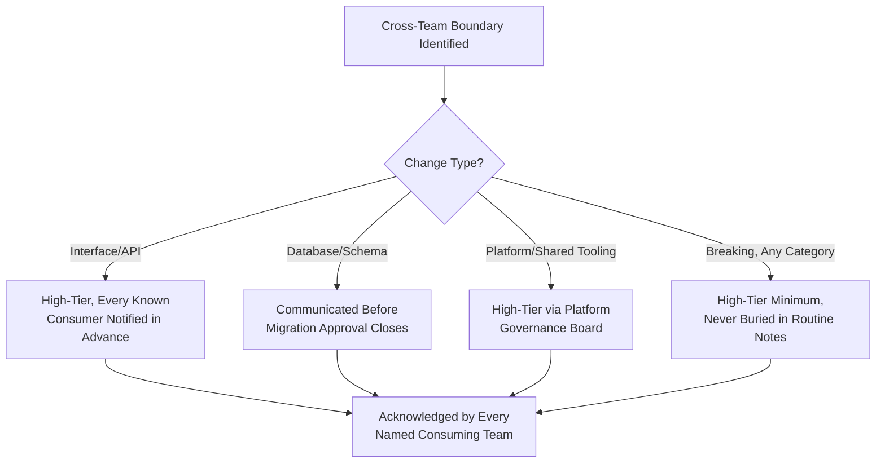

---

# Incident Communication

### Single Authoritative Source

During a multi-team incident, exactly one role — the Incident Commander, per `ai-docs/07-development-workflow.md`'s Incident Response Workflow — is the sole authoritative source of status updates. Every other responder communicates findings and actions **to** the Incident Commander, who alone issues the consolidated update to every audience tier below; this prevents the specific Conflicting Announcements anti-pattern that arises when two teams, each with partial visibility, issue independent, mutually inconsistent updates about the same incident. Where an incident spans multiple teams, each contributing team names a single liaison who relays to the Incident Commander — never every individual responder communicating outward independently.

### Internal Updates

Per the Communication SLEs above, internal updates flow to the incident channel at the defined cadence (every 15 minutes for Sev 1) — each update states what is known, what is being done, what is still uncertain, and when the next update will arrive, never merely "still investigating" with no structure.

### Executive Updates

Per the Communication SLEs above, the CTO/VP Engineering receives a Sev 1 update within 15 minutes and every 30 minutes thereafter — summarized for a leadership audience per Audience Awareness above, never a raw copy of the internal responder channel.

### Stakeholder Updates

Product, the affected domain's leadership, and any other internal stakeholder named in the incident's Affected Systems receive updates at the same cadence as Internal Updates, routed through the Incident Commander or their designated liaison.

### Government Communication

Where an incident affects a government-partner integration, the relevant Government Technical Partner is notified per that partnership's specific communication terms, coordinated by Product and the Incident Commander jointly — never delayed past the incident's own internal-update cadence merely because external communication feels lower-priority.

### Customer Communication

Where an incident is citizen-visible, a status-page or in-app notice is issued per the Communication SLEs above, in plain, accessible, multilingual language per `ai-docs/12-accessibility-standards.md` — honest about what is affected and what is not, never vague in a way that erodes trust more than the incident itself.

### Post-Incident Communication

Once an incident is Resolved, a summary communication closes the loop with every audience that received an update during the incident — internal, executive, stakeholder, government, and (where applicable) customer — confirming resolution and pointing to the blameless postmortem once it is published, per `ai-docs/07-development-workflow.md`.

### Relationship with Incident Response Workflow

`ai-docs/07-development-workflow.md` owns the complete Incident Response Workflow — declaration, mitigation-first sequencing, root-cause analysis, and the postmortem process itself. This document does not redefine a single stage of that workflow; it defines the communication discipline — channel, audience, cadence, and single-source-of-truth ownership — that workflow's own communication step relies on.

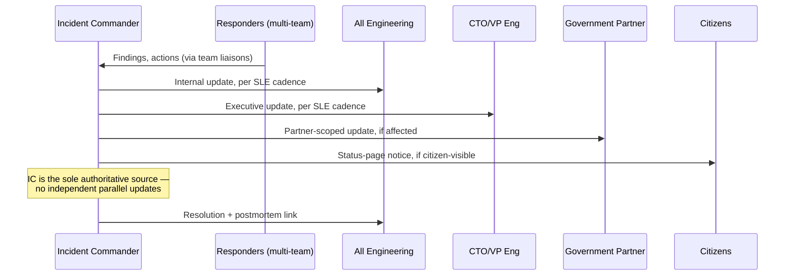

---

# Release Communication

### Release Announcements

Every Production Release (`ai-docs/27-branching-release-strategy.md`) is announced via generated release notes (`ai-docs/17-cicd-standards.md`'s Changelog Generation) distributed to all Engineering at Medium-tier, and to Product/affected teams at High-tier for a release carrying a citizen-behavior change.

### Maintenance Notices

A maintenance window carrying citizen-facing interruption risk (`ai-docs/31-change-management-governance-standards.md`'s Maintenance Windows) is communicated to affected citizens at least 72 hours in advance for a routine window, per the identical standard already established there — this document adds no new timing rule, only affirms the channel (status page, in-app notice, per Official Communication Channels above) and classification (High-tier).

### Rollback Notifications

A rollback (`ai-docs/16-deployment-standards.md`'s Rollback Standards) is communicated through the identical channels the original change's Communication Plan specified, immediately, per `ai-docs/31-change-management-governance-standards.md`'s Rollback Governance — never a quieter event than the deployment it reverses.

### Feature Deprecation

A feature deprecation follows the identical Deprecation Policy already established in `ai-docs/13-api-design-guidelines.md` (for an API) or `ai-docs/09-tech-stack.md` (for a technology) — communicated at High-tier, with the deprecation window stated explicitly and the replacement path named.

### Migration Notices

A migration affecting a consuming team (a dependency MAJOR upgrade per `ai-docs/22-dependency-management-standards.md`, a schema migration per `ai-docs/14-database-design-guidelines.md`) is communicated with a concrete migration plan and timeline, at High-tier, well ahead of the migration's Approval stage closing.

### Version Communication

A SemVer MAJOR/MINOR/PATCH release (`ai-docs/27-branching-release-strategy.md`) is communicated with its version number explicit in every announcement — never described only in prose ("the new release") without the citable version identifier a future reader can trace back to its exact tag.

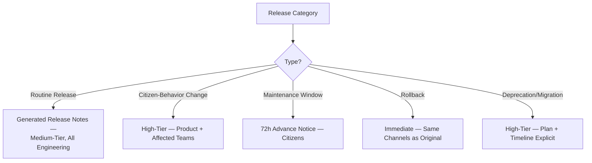

---

# Decision Communication

Every decision-communication category below routes through the Approval Authority already established in its owning governance document — this document never redefines who approves a decision; it defines how that decision, once approved, is communicated.

| Decision Type | Communicated Via | Audience | Owning Governance Document |
|---|---|---|---|
| **Architecture decisions** | ADR announcement, per Official Communication Channels above. | All Engineering (Strategic/Architectural tier); the affected domain (Technical tier). | `ai-docs/25-architecture-decision-records.md` |
| **Policy changes** | Documentation Change per `ai-docs/24-documentation-standards.md`, announced at High-tier. | All Engineering. | `ai-docs/24-documentation-standards.md`, `ai-docs/29-engineering-governance-decision-authority.md` |
| **Security decisions** | Security Communication, scoped per sensitivity. | Security Review Board, affected domain teams. | `ai-docs/10-security-standards.md` |
| **Infrastructure changes** | Infrastructure Communication, per Cross-Team Collaboration above. | Platform Team, affected consuming teams. | `ai-docs/16-deployment-standards.md` |
| **Technical debt decisions** | A Technical Debt Register entry update, communicated at Medium-tier to the affected team; High-tier for a Critical-tier debt item's Exception. | The debt item's Owner and affected team. | `ai-docs/32-technical-debt-management-standards.md` |
| **AI policy decisions** | AI Communication, distributed to every team consuming the AI Gateway Service. | The AI Gateway Service's owning team, every consuming domain. | `ai-docs/09-tech-stack.md`, `ai-docs/00-project-vision.md`'s AI Principle |

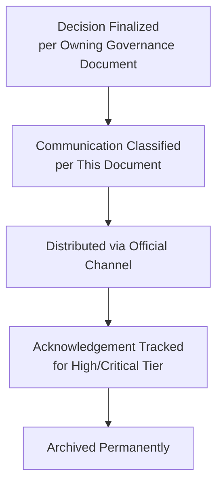

---

# Meeting Standards

| Meeting Type | Purpose | Standard |
|---|---|---|
| **Architecture Reviews** | Deliberate and approve a Strategic/Architectural proposal, per `ai-docs/07-development-workflow.md`. | Agenda circulated in advance; the proposal's Context and Options are pre-read material, never presented cold; a recorded outcome (Approve/Rework/Reject) is published within one business day. |
| **Engineering Reviews** | A recurring, team-level review of in-progress work. | Time-boxed; every discussed item has a named owner and next step by the meeting's end. |
| **Incident Reviews (Postmortems)** | Blameless review of a resolved incident, per `ai-docs/07-development-workflow.md`. | Follows the blameless framing already established there; action items are tracked to completion, never left as narrative alone. |
| **Sprint Planning** | Commit a team's near-term work, including its protected debt-repayment allocation per `ai-docs/32-technical-debt-management-standards.md`. | The debt-budget allocation is confirmed explicitly before feature work is committed, per that document's Sprint Allocation standard. |
| **Retrospectives** | Team-level continuous improvement, per `ai-docs/07-development-workflow.md`. | Findings that generalize beyond the team are escalated to the appropriate Governance Board, never left siloed. |
| **Cross-Team Meetings** | Resolve or plan around a shared boundary, per Cross-Team Collaboration above. | Every attending team names its own representative in advance; the meeting's outcome is written down and distributed to every non-attending stakeholder. |
| **Decision Meetings** | A meeting whose explicit purpose is reaching a specific, named decision. | The decision and its reasoning are recorded in the correct governance artifact (an ADR, a Change Request, a Risk Register entry) within one business day — a decision meeting with no written outcome is treated as an Anti-Pattern below (Undocumented Verbal Agreements). |
| **Action Item Tracking** | Ensure every meeting's commitments are actually completed. | Every action item has a named owner and a due date, tracked in the Issue Tracker, never left only in meeting notes with no follow-up mechanism. |

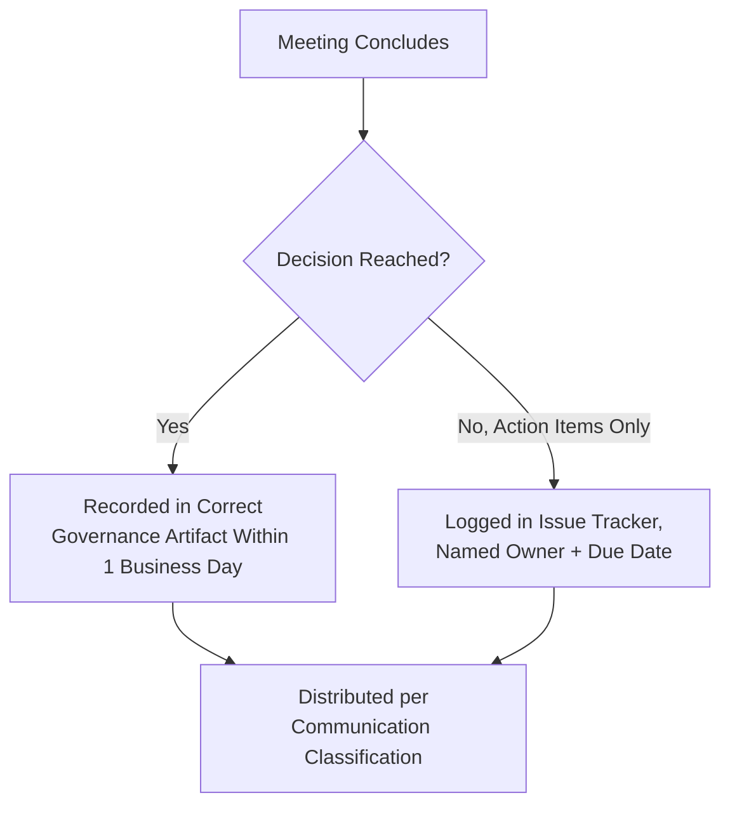

---

# Communication Quality Standards

| Standard | Definition |
|---|---|
| **Accuracy** | Every stated fact matches the current, actual system or event — never asserted from memory alone where a source can be checked, per the identical Accuracy Over Quantity principle already established in `ai-docs/24-documentation-standards.md`. |
| **Completeness** | A communication states what happened, why it matters, what is expected of the reader, and where to go for more detail — never leaving the reader to infer a required action. |
| **Consistency** | The same fact is described identically across every channel it appears in, per Single Source of Truth above — a discrepancy between an incident channel's update and a status-page notice is a Blocking-severity finding. |
| **Professionalism** | Every communication is written the way its author would want to receive it, per the identical Respectful Communication standard already established in `ai-docs/26-code-review-standards.md`. |
| **Evidence** | A claim of consequence cites its source — a dashboard, a test result, a specific commit — never asserted on confidence alone, per the identical Evidence-Based Decisions principle already established in `ai-docs/29-engineering-governance-decision-authority.md`. |
| **Neutral Language** | Communication, especially during an incident or a disagreement, describes what happened without assigning blame to an individual, per the identical Blameless Postmortems principle already established in `ai-docs/00-project-vision.md` and `ai-docs/07-development-workflow.md`. |
| **Actionability** | Every communication requiring a reader response states, explicitly, who is expected to do what, by when — never a passive statement of fact with an implied but unstated ask. |

---

# Communication Metrics

Per the Actionable Metrics principle already established in `ai-docs/18-observability-standards.md`, every metric below ties to a real question an Engineering Manager or the Engineering Leadership Council will actually ask.

| Metric | Definition | What a Regression Signals |
|---|---|---|
| **Response time** | Time from a communication's distribution to its first substantive response, per tier. | A rising trend signals channel fatigue or an incorrect audience/classification. |
| **Decision communication latency** | Time from a decision's Approval to its distribution, per Decision Communication above. | A widening gap signals the Communication Lifecycle's Distribution stage is not being honored promptly. |
| **Acknowledgement rate** | Percentage of High/Critical-tier communications receiving a recorded acknowledgement within the expected window. | A declining rate signals audience fatigue or a channel mismatch. |
| **Meeting effectiveness** | Percentage of Decision Meetings producing a recorded outcome within one business day, per Meeting Standards above. | A declining rate signals a rising incidence of the Meeting Without Outcome anti-pattern below. |
| **Cross-team communication health** | Frequency of a Cross-Team Disagreement escalation (`ai-docs/29-engineering-governance-decision-authority.md`) traceable to a missed or unclear cross-team communication. | A rising rate signals Cross-Team Collaboration's notification discipline is not being honored. |
| **Incident communication timeliness** | Percentage of incidents meeting their Communication SLE, per Communication Classification above. | Any miss on a Critical-tier SLE is treated with the identical severity already established for a missed audit finding in `ai-docs/29-engineering-governance-decision-authority.md`. |
| **Documentation linkage** | Percentage of Decision Communications correctly cross-linked to their governing artifact (an ADR, a Change Request). | A declining rate signals communication and documentation are drifting apart, undermining Traceability. |
| **Communication quality score** | A sampled, periodic rating of communications against the Communication Quality Standards above, per the Governance Review's Communication Audits below. | A declining score signals a need for calibration or targeted coaching, mirroring the identical Reviewer Calibration discipline already established in `ai-docs/26-code-review-standards.md`. |

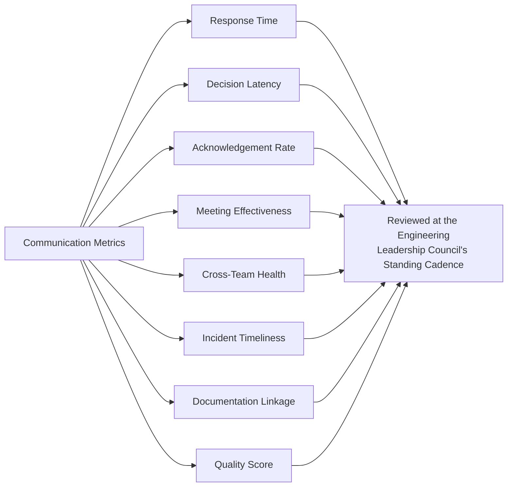

---

# AI-Assisted Communication

Consistent with the identical AI-assistance principle already established across every governance document in this handbook: **AI accelerates drafting and retrieval, never authority or accountability.**

### AI-Generated Summaries

An AI tool may summarize a long incident thread, a lengthy design discussion, or a sprawling cross-team exchange into a shorter, more discoverable form — the summary is verified against the original by a human familiar with the underlying content before it is distributed as a standalone communication, per the identical Fact Verification discipline already established throughout `ai-docs/24-documentation-standards.md` and `ai-docs/33-engineering-knowledge-management-standards.md`.

### Meeting Notes

An AI tool may draft meeting notes and action items from a recorded or transcribed session — the draft is reviewed and corrected by a human attendee (typically the meeting owner) before it is published as the meeting's official record, per the identical AI Meeting Summaries standard already established in `ai-docs/29-engineering-governance-decision-authority.md`.

### Translation Assistance

An AI tool may assist in translating a citizen-facing communication into a supported regional language, per `ai-docs/12-accessibility-standards.md`'s Multilingual Accessibility — every translation is reviewed by a fluent human speaker before publication, since a subtly incorrect translation of an incident notice or a civic communication carries real citizen-trust consequences.

### Knowledge Retrieval

An AI-powered search layer surfacing a candidate answer from the Engineering Wiki or a past communication is a legitimate, encouraged tool — every result is presented as a candidate for the searcher to verify against its source, never as an authoritative answer in its own right, per the identical AI-Assisted Search standard already established in `ai-docs/33-engineering-knowledge-management-standards.md`.

### Draft Generation

An AI tool may draft a first pass at a release announcement, an incident update, or a decision communication from underlying source data (a diff, a ticket, a Change Request) — the draft is treated as a starting point, never distributed unreviewed, per Human Verification below.

### Human Verification

No Medium-tier or above communication is distributed on the basis of unreviewed AI-generated content. The named human sender remains fully accountable for every communication's accuracy, regardless of how much AI assistance contributed to its drafting or summarization — identical to the Human Ownership standard already established consistently across `ai-docs/24` through `ai-docs/33`.

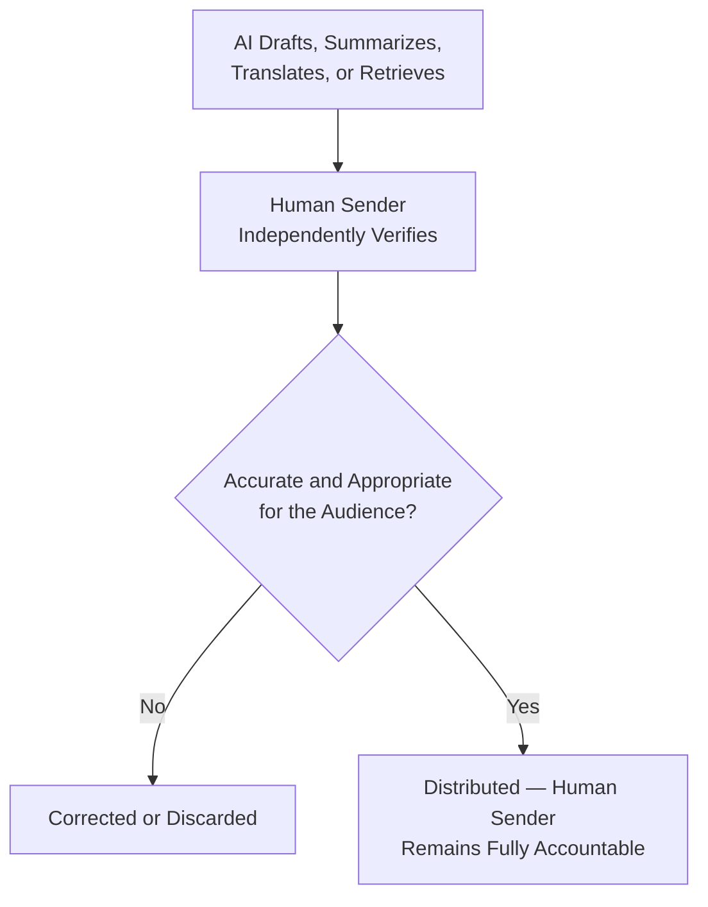

---

# Engineering Communication Anti-Patterns

| Anti-Pattern | Description | Why It's Rejected |
|---|---|---|
| **Hidden Decisions** | A significant decision made and acted upon with no corresponding communication to the people it affects. | Violates Transparency above; recreates the exact tribal-knowledge and Shadow Governance failure modes already rejected in `ai-docs/24`, `ai-docs/25`, and `ai-docs/29`. |
| **Private Engineering Decisions** | A decision made in a private, unlogged channel (a DM, an unrecorded call) with no path into an official channel. | Violates Traceability and Single Source of Truth above; a decision only two people know about is not a decision the organization can rely on. |
| **Unclear Ownership** | A communication with no named, accountable sender, or an announcement signed only "the team." | Violates Accountability above; nobody can be asked a follow-up question. |
| **Communication Overload** | So many Low/Medium-tier notifications that a genuinely High/Critical-tier one is lost in the noise. | Violates Audience Awareness and Timeliness above — the same Alert Fatigue reasoning already established in `ai-docs/18-observability-standards.md`, applied to human communication. |
| **Meeting Without Outcome** | A Decision Meeting that ends with no recorded decision, no action items, and no next step. | Violates the Meeting Standards' Decision Meetings requirement above; the meeting's time cost was paid with no corresponding value produced. |
| **Undocumented Verbal Agreements** | A cross-team or architectural agreement reached in conversation, never written into an ADR, Change Request, or issue. | Violates Traceability above and the identical Document Before Deciding principle already established in `ai-docs/29-engineering-governance-decision-authority.md`; a verbal agreement is indistinguishable from no agreement the moment either party's memory of it diverges. |
| **Conflicting Announcements** | Two independent communications about the same fact, each accurate in isolation but inconsistent with each other. | Violates Single Source of Truth above — the specific failure mode Incident Communication's Single Authoritative Source rule exists to prevent at its highest-stakes instance. |
| **AI-Generated Misinformation** | An unverified AI-drafted or AI-summarized communication distributed with an inaccuracy the sender never caught. | Violates Human Verification above; an inaccurate communication is worse than none, per the identical Accuracy Over Quantity reasoning already established in `ai-docs/24-documentation-standards.md`. |

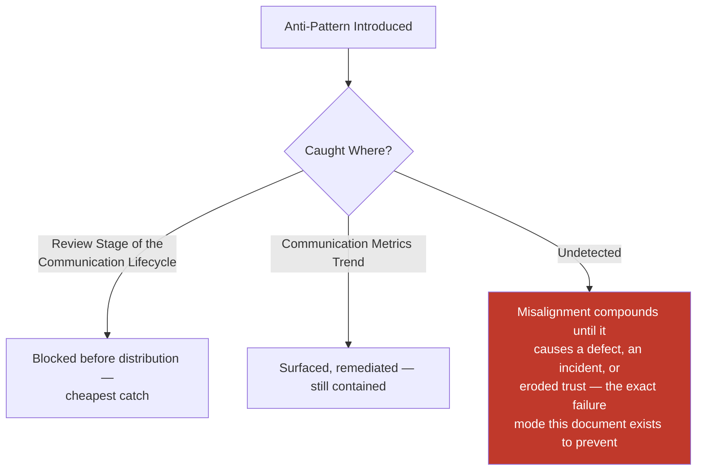

---

# Engineering Review Checklist

Every communication of Medium classification or above is checked against the following before it is considered communication-standard-compliant:

- [ ] **Correctly typed** — The communication matches exactly one of the fourteen types in Types of Engineering Communication above.
- [ ] **Correctly channeled** — Distributed through the Official Communication Channel matching its purpose, per Official Communication Channels above.
- [ ] **Correctly classified** — Low/Medium/High/Critical, matching its actual urgency and audience, per Communication Classification.
- [ ] **SLE respected, if applicable** — A Critical-tier communication met its stated timing commitment, per Communication SLEs above.
- [ ] **Single authoritative source maintained** — For a multi-team incident, only the Incident Commander (or their named liaison chain) issued external-facing updates.
- [ ] **Named, accountable sender** — Never an anonymous or diffuse "the team," per Accountability above.
- [ ] **Audience explicitly named** — Every intended recipient is stated, never left to passive discovery.
- [ ] **Written record produced for a decision** — A Decision Meeting's outcome is recorded in the correct governance artifact within one business day, per Meeting Standards above.
- [ ] **Reviewed per its tier** — A peer glance for Medium, a Tech Lead review for High, an Incident Commander/Board review for Critical.
- [ ] **Acknowledgement tracked, if High/Critical** — Per the Communication Lifecycle's Acknowledgement stage.
- [ ] **Quality standards met** — Accurate, complete, consistent, professional, evidenced, neutral in language, and actionable, per Communication Quality Standards above.
- [ ] **AI-assisted content independently verified** — Any AI-drafted, summarized, or translated content fact-checked by the human sender before distribution.
- [ ] **No anti-pattern present** — No hidden decision, private decision, unclear ownership, overload, outcome-less meeting, undocumented verbal agreement, conflicting announcement, or unverified AI content.
- [ ] **Archived per its retention tier** — Retained in its permanent, citable location, per Communication Classification's Retention Expectation.
- [ ] **No duplication of Documentation, Knowledge Management, Change Management, Risk Management, Governance, ADR, or Incident Response standards** — Any such concern deferred entirely to its owning phase document, never redefined here.

A communication failing any item above is not considered compliant until resolved — this checklist carries the same non-negotiable authority as every other review checklist established in the preceding thirty-four phase documents.

---

# Governance Review

### Annual Framework Review

This document's own classification thresholds, Communication SLEs, and channel list are reviewed no less than **annually** by the Engineering Leadership Council, per the identical standing self-review commitment already established in `ai-docs/30`, `ai-docs/31`, `ai-docs/32`, and `ai-docs/33`. The annual review specifically asks: do the SLE windows still fit Arwal's actual incident and decision cadence; has a new communication type emerged that the taxonomy does not yet cover; and has any channel proven under- or over-used relative to its intended purpose.

### Communication Audits

A periodic (at minimum quarterly) audit samples a cross-section of Medium-tier-and-above communications, verifying: was the correct channel used, was the classification tier accurate in hindsight, and did the communication meet the Communication Quality Standards above.

### Metrics Review

Communication Metrics (above) are watched continuously at the Engineering Leadership Council's standing cadence — a sharp, sustained shift (a declining acknowledgement rate, a rising SLE-miss rate) triggers an out-of-cycle review of the specific practice or team implicated, never deferred to the next scheduled cycle.

### Cross-Team Communication Review

At least annually, the Engineering Leadership Council convenes a cross-team communication review examining the aggregate Cross-Team Communication Health metric across every team pair with a known shared boundary, specifically to catch a degrading relationship before it produces a defect or a Cross-Team Disagreement escalation per `ai-docs/29-engineering-governance-decision-authority.md`.

### Continuous Improvement

Any proposed change to this document's own classification thresholds, SLEs, or channel list is itself governed as a Documentation Change requiring, at minimum, Architecture Review Board sign-off, mirroring the identical rigor already required for a structural amendment to any foundational `ai-docs/*` document throughout this handbook.

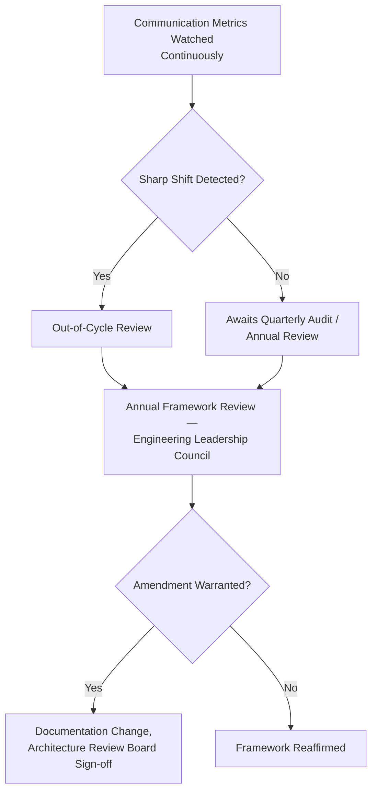

---

# Relationship to Previous Standards

### Project Vision

`ai-docs/00-project-vision.md` establishes Transparency over Opacity as a founding Guiding Principle. This document is the operational discipline that makes that principle real in every message an engineer sends, never redefining the principle itself.

### Engineering Principles

`ai-docs/02-engineering-principles.md` establishes Documentation-Driven Development and the founding communication norms implicit in Blameless Postmortems and Code Review Standards. This document generalizes those norms into a standing, organization-wide communication practice, never redefining a single principle already established there.

### Documentation Standards

`ai-docs/24-documentation-standards.md` owns the complete discipline of documentation as a written artifact in full. This document governs the broader act of communicating, of which producing a document is one outcome — it never redefines a Markdown standard, a writing-style rule, or the Documentation Review Process.

### Knowledge Management

`ai-docs/33-engineering-knowledge-management-standards.md` owns Knowledge Sources, Capture, and Sharing practices in full. This document governs the channel, classification, and lifecycle discipline those practices are communicated through, never redefining a knowledge-management mechanic.

### ADR Standards

`ai-docs/25-architecture-decision-records.md` owns the complete ADR artifact and lifecycle. This document governs how an ADR's existence and content are communicated once Accepted, never redefining its template or numbering.

### Risk Management

`ai-docs/30-engineering-risk-management-standards.md` owns the complete Risk Register and Risk Escalation triggers. This document governs how an escalated risk is actually communicated to the humans who must act on it, never redefining a risk-scoring mechanic.

### Change Management

`ai-docs/31-change-management-governance-standards.md` owns the complete Change Request lifecycle, including its own Change Communication section for a specific change. This document is the general framework that section is an instance of — the two are complementary, never duplicative.

### Engineering Governance

`ai-docs/29-engineering-governance-decision-authority.md` owns the complete organizational decision-authority structure this document's every Ownership role is drawn from directly, never redefined here.

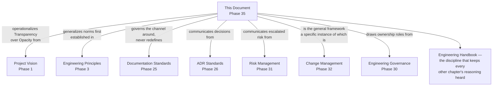

---

# Closing Statement

> **Callout — Closing Statement**
> Every preceding phase document described a standard for how Arwal is designed, built, secured, tested, deployed, governed, risk-managed, changed, and kept alive as organizational knowledge. This document describes the discipline that carries every one of those standards from where they live on paper into the daily, human act of one engineer telling another what is happening and why. A codebase this large, a team scaling toward hundreds of engineers, and a mission that will eventually touch government integration, financial services, and healthcare cannot be held together by architecture and process alone — they are held together by people who trust that when something matters, they will be told, clearly, in time, by someone accountable for saying it. Communication that is disciplined — proportional to its urgency, honest about what is known and unknown, and never left to a private channel or an unrecorded conversation — is what lets Arwal's engineers move fast without ever moving carelessly, for every one of the ~265 micro-phases still ahead. Where a future phase must deviate from a standard stated here, that deviation is made explicitly — through this document's own Governance Review process, or a Strategic-classification ADR where the deviation is structural — never silently, and never by default.

This document, `ai-docs/34-engineering-communication-standards.md`, is Phase 35 of approximately 300. Every announcement made, every decision communicated, every incident update sent, and every cross-team notice issued in the phases that follow is expected to satisfy the standards defined here, or to justify its deviation in writing.

**End of Phase 35 — `ai-docs/34-engineering-communication-standards.md`**