# Engineering Onboarding & Offboarding Standards

**Document:** `ai-docs/35-engineering-onboarding-offboarding-standards.md`
**Project:** Arwal — The District Super App
**Stage:** 1 — Foundation
**Phase:** 36 — Engineering Onboarding & Offboarding Standards
**Status:** Approved for Engineering Reference
**Audience:** CTO, VP Engineering, Engineering Managers, Tech Leads, Platform Team, Security Team, SRE, HR/People Operations, New Engineers, Departing Engineers, Contractors, Government Technical Partners

> **Callout — Purpose of This Document**
> `ai-docs/00-project-vision.md` through `ai-docs/34-engineering-communication-standards.md` defined why Arwal exists and every enforceable discipline governing how it is designed, written, secured, tested, deployed, observed, logged, configured, documented, decided upon, reviewed, branched, released, depended upon, governed, risk-managed, changed, kept solvent against its own technical debt, kept alive as organizational knowledge, and communicated. Every one of those documents assumes a working engineer sitting in front of a correctly-provisioned machine, with the right access, the right training, and the right understanding of what came before them — and assumes that when that engineer eventually leaves, whatever they alone knew and whatever they alone could access do not leave with them unmanaged. This document is that assumption made explicit: Arwal's Engineering Onboarding & Offboarding charter, for every one of the ~300 micro-phases still ahead.

---

# Purpose of this Document

### Why Onboarding Matters

Every standard in this handbook is only as good as an engineer's ability to actually apply it. An engineer who joins Arwal without a disciplined onboarding path spends weeks reconstructing context that already exists, guessing at conventions this handbook already answers definitively, and — worst of all — is granted access and expected to contribute before anyone has verified they understand Arwal's security, architecture, and civic obligations. Onboarding exists to make the gap between "hired" and "genuinely productive and trustworthy" as short, as safe, and as consistent as possible — for the tenth engineer Arwal ever hires and the ten-thousandth, identically.

### Why Offboarding Matters

An engineer's departure is not the end of their relationship to Arwal's risk surface — it is often the moment that risk is highest. Every credential they held, every system only they fully understood, and every piece of ownership they carried must be recovered, transferred, or revoked deliberately, on a defined timeline, never left to informal goodwill or a hope that "someone will notice." Offboarding exists to make a departure — planned or sudden, amicable or not — a controlled, secure, fully-accounted-for event, never a silent erosion of Arwal's security posture or institutional memory.

### Organizational Continuity

Arwal's roadmap anticipates a team scaling from a handful of founding engineers to hundreds, spanning Platform, Security, SRE, Product, and AI teams, across ~300 micro-phases and years of turnover, promotion, and reorganization. An organization of that scale and duration cannot survive on informal, person-to-person handoffs — onboarding and offboarding are the two structural events, occurring constantly across a team this size, that either preserve continuity through every transition or quietly erode it one departure at a time.

### Security

Per Secure by Default already established throughout `ai-docs/10-security-standards.md`, an engineering lifecycle event is a security event. Onboarding is the moment access is first granted — every grant made too broadly or too early is a standing liability from day one. Offboarding is the moment access should be fully and promptly removed — every credential left active a day longer than necessary is a door Arwal has left open. This document exists to make both moments provably secure, not merely assumed to be.

### Productivity

Per Time-to-Productivity already implicit in `ai-docs/33-engineering-knowledge-management-standards.md`'s Onboarding Effectiveness metric, every day an engineer spends confused, blocked, or under-equipped is a day of lost organizational capacity — multiplied across every future hire, this compounds into a material, avoidable velocity tax. A disciplined onboarding path is not bureaucratic overhead; it is the fastest reliable route to genuine contribution.

### Knowledge Preservation

Per Knowledge Debt already established in `ai-docs/32-technical-debt-management-standards.md` and the full Knowledge Transfer discipline in `ai-docs/33-engineering-knowledge-management-standards.md`, a departing engineer carries knowledge that, if not deliberately captured before they leave, is gone the moment they are. This document is where that capture is made a mandatory, timed, verified stage of every departure — never a hopeful afterthought.

### Relationship with Security Standards

`ai-docs/10-security-standards.md` already owns the complete, enforceable security control set — authentication, authorization, Least Privilege, secrets management, and the Admin Privileges/break-glass mechanism. This document does not redefine a single security control. It governs **when in an engineer's lifecycle** those controls are applied — at what point access is granted, reviewed, and revoked — and the operational checklist that ensures they actually are, every time, for every person.

### Relationship with Knowledge Management

`ai-docs/33-engineering-knowledge-management-standards.md` already owns the complete discipline of Knowledge Types, Knowledge Ownership, Knowledge Transfer (including its own New Hires, Long Leave, and Employee Exits rows), and the Bus Factor Governance Threshold. This document does not redefine a single knowledge-management mechanic — it is where that document's Knowledge Transfer triggers are executed as a concrete, timed onboarding and offboarding procedure.

### Relationship with Documentation Standards

`ai-docs/24-documentation-standards.md` already owns the complete documentation discipline — categories, ownership, review process. This document references onboarding-relevant documentation (a module README, a runbook) by pointer, never restating that document's rules, and treats "documentation currency" as a precondition an onboarding path relies on, never a thing this document itself governs the writing of.

### Relationship with Communication Standards

`ai-docs/34-engineering-communication-standards.md` already owns the complete communication taxonomy, classification, and channel discipline. Every notification this document requires — a new hire's team introduction, a departure announcement, an access-revocation confirmation — is issued through that document's Official Communication Channels, at the classification tier this document specifies, never through a new, redundant channel invented here.

---

# Engineering Lifecycle Philosophy

Arwal's onboarding and offboarding discipline rests on eight commitments. Together they answer the question every subsequent section of this document exists to make concrete: **what makes an engineer's arrival and departure both genuinely safe for Arwal, rather than merely procedurally complete?**

### Secure by Default

Every account, credential, and access grant begins in the most restrictive state consistent with the engineer's role, and is opened up only as far as their actual, verified responsibilities require — restating, at the lifecycle-event level, the identical Secure by Default principle already established in `ai-docs/02-engineering-principles.md` and `ai-docs/10-security-standards.md`. This exists because a new hire granted broad access "to save time getting them set up" is a standing risk from their very first day, and a risk introduced at onboarding is one this document's entire remaining discipline then has to carry for as long as that access persists.

### Least Privilege

An engineer holds exactly the access their current role requires, never more — reviewed not only at onboarding but continuously across their tenure, per Periodic Access Recertification below. This exists because access, once granted, tends to accumulate rather than shrink as an engineer's role evolves; without a deliberate, recurring check, "what I actually need today" and "what I actually have" drift apart, silently, for everyone.

### Knowledge Continuity

No engineer's departure — planned or sudden — is allowed to take irreplaceable understanding of a Critical system with them, per the identical Knowledge Continuity commitment already established in `ai-docs/33-engineering-knowledge-management-standards.md`. This exists because Arwal's civic and financial mandate cannot depend on any single person's continued presence; every onboarding path deliberately builds redundant understanding, and every offboarding path deliberately verifies it before the person leaves.

### Ownership Clarity

Every system, repository, and operational responsibility has an unambiguous, currently-accurate named owner at all times — never left ambiguous during a transition, per the identical Named Ownership principle already established throughout `ai-docs/29-engineering-governance-decision-authority.md`, `ai-docs/30-engineering-risk-management-standards.md`, and `ai-docs/33-engineering-knowledge-management-standards.md`. This exists because an ownership gap, even a brief one during a transfer, is exactly the moment a Critical system becomes unaccountable.

### Reproducible Environments

Every engineer's local development environment is provisioned from the identical, version-controlled source every other engineer's is — Docker Compose, `packages/config` presets, the documented setup path — never a hand-assembled, undocumented, engineer-specific configuration, mirroring the identical Reproducibility principle already established in `ai-docs/06-git-workflow.md` and `ai-docs/16-deployment-standards.md`. This exists because an environment that cannot be reliably reproduced for the next engineer is an environment whose "it works on my machine" quietly becomes a permanent, unresolved risk.

### Standardized Onboarding

Every engineer, regardless of role, seniority, or team, moves through the same defined lifecycle stages (Pre-Onboarding through First Quarter, below) — never an informal, manager-improvised path that varies in quality by who happens to be doing the onboarding. This exists because inconsistent onboarding produces inconsistent baseline competence, and a gap in one new engineer's foundational understanding of `ai-docs/10-security-standards.md` is exactly as dangerous as a gap in any other's.

### Respectful Offboarding

A departing engineer — regardless of the reason for their departure — is treated with the identical dignity and respect already established as a standing commitment throughout this handbook's culture (`ai-docs/26-code-review-standards.md`'s Reviews Improve Code, Not People; `ai-docs/00-project-vision.md`'s Guiding Principles). This exists because how Arwal treats someone on their way out is a direct, visible signal to every remaining engineer about how much the organization actually values the people inside it — and because a departing engineer treated respectfully is measurably more likely to cooperate fully and honestly with the knowledge-transfer process this document depends on.

### Continuous Improvement

Arwal's onboarding and offboarding practice — its checklists, its timelines, its training content — is itself periodically re-evaluated against what Onboarding/Offboarding Metrics (below) actually reveal, mirroring the identical Continuous Improvement discipline already established across `ai-docs/30` through `ai-docs/34`. This exists because a lifecycle framework calibrated once, in Phase 36, and never revisited will drift out of fit with Arwal's actual hiring pace, team structure, and risk profile as all three change.

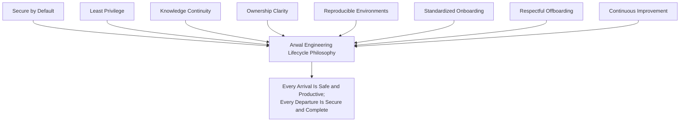

> **Callout — The One-Sentence Lifecycle Philosophy**
> *"An engineer should never be trusted with more access than their role requires on day one, and Arwal should never be left trusting a departed engineer's access, ownership, or unwritten knowledge for a single day longer than necessary."*

---

# Engineering Roles Covered

This document applies to every individual who writes, reviews, deploys, or operates code or infrastructure on Arwal's behalf — the lifecycle discipline scales by role, per Proportional Rigor already established throughout this handbook, but no role is exempt from it.

| Role | Onboarding Emphasis | Offboarding Emphasis |
|---|---|---|
| **Developers** | Codebase, coding standards, module ownership context. | Code/module ownership transfer, PR/review handoff. |
| **Tech Leads** | Domain ownership, Decision Authority Matrix (`ai-docs/29-engineering-governance-decision-authority.md`), review authority. | Successor Tech Lead assignment (mandatory before departure completes, per Ownership Transition below). |
| **Engineering Managers** | Team governance, hiring/onboarding process itself, performance/people process. | Team continuity plan, direct-report reassignment. |
| **Platform Engineers** | Shared packages, CI/CD, IaC, `packages/*` governance (`ai-docs/28-dependency-governance-standards.md`). | Infrastructure and pipeline ownership transfer. |
| **Security Engineers** | Threat model, Security Review Board process, incident response. | Security-control ownership transfer, credential rotation oversight. |
| **SRE** | Observability stack, on-call rotation, runbooks, disaster recovery. | Runbook/dashboard ownership transfer, on-call rotation adjustment. |
| **QA** | Testing standards, release readiness process. | Test-suite and coverage-ownership transfer. |
| **DevOps** | Deployment pipeline, environment topology (`ai-docs/23-environment-strategy.md`). | Deployment/environment credential transfer. |
| **AI Engineers** | AI Gateway Service, prompt management, AI safety review. | AI Gateway ownership and provider-credential transfer. |
| **Architects** | System architecture, ADR discipline, Architecture Review Board. | Architectural decision context capture (Historical Decision knowledge). |
| **Contractors** | Scoped access provisioning, engagement-specific training only. | Governed under Contractor & Vendor Offboarding below — expedited, access-first. |
| **Interns** | Full standard onboarding at reduced access scope. | Full standard offboarding, time-boxed to the internship's known end date in advance. |
| **Vendor Engineers** | Scoped, integration-specific onboarding only. | Governed under Contractor & Vendor Offboarding below. |

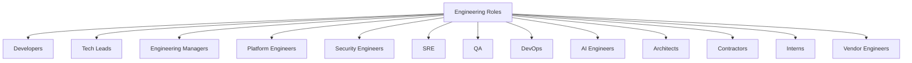

---

# Pre-Onboarding Requirements

Every requirement below is completed **before** a new engineer's Day 0, never assembled reactively on the morning they arrive.

| Requirement | Responsible Party | Purpose |
|---|---|---|
| **Employment verification** | HR/People Operations | Confirms the legal basis for granting any access at all — no account is provisioned before this is confirmed complete. |
| **Equipment readiness** | IT/Platform Team | A correctly-imaged machine, per Development Environment Setup below, is ready before Day 0 — never assembled after the engineer has already arrived. |
| **Account planning** | Engineering Manager + IT | Every account the role requires is identified in advance, scoped per Least Privilege, per Access Provisioning below — never granted ad hoc as needs arise informally. |
| **Required approvals** | Engineering Manager, and Security Team for any Security-classified role | Every account-planning decision is signed off before provisioning begins, mirroring the Change Approval Authority discipline already established in `ai-docs/31-change-management-governance-standards.md`. |
| **Role assignment** | Engineering Manager | The new engineer's role, team, and initial module/domain assignment are confirmed, determining their onboarding path's specific emphasis per Engineering Roles Covered above. |
| **Manager responsibilities** | Engineering Manager | A named mentor (per Knowledge Transfer During Onboarding below) is assigned before Day 0; the manager's own Day 1 schedule is blocked to be actually present. |
| **Security prerequisites** | Security Team | A background-check requirement (where applicable to the role's access level) is confirmed complete; the account-provisioning plan is reviewed for Least Privilege compliance before any credential is issued. |

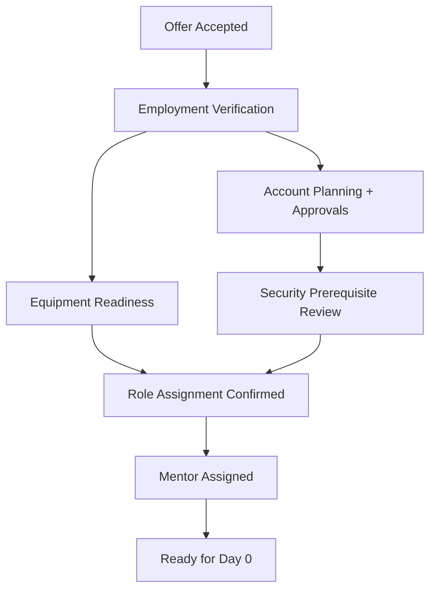

---

# Engineering Onboarding

Every new engineer moves through the same defined stages, with role-specific emphasis per Engineering Roles Covered above but no stage skipped.

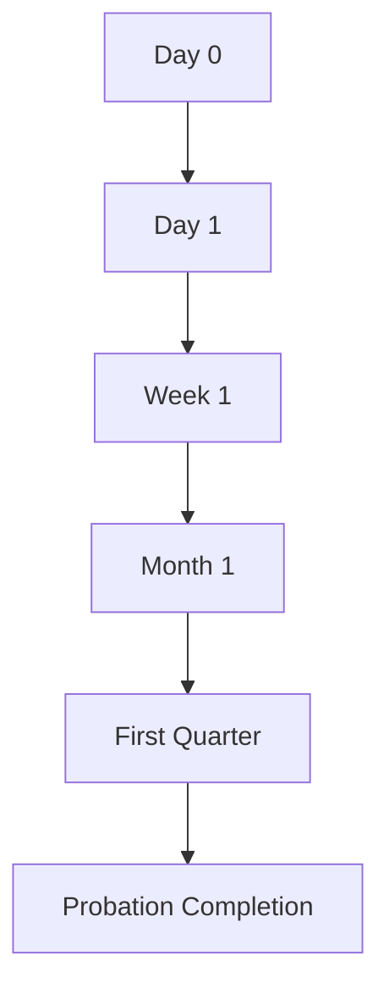

### Day 0 (Before Arrival)

Equipment, accounts (at Low-tier, non-production scope only), and the onboarding schedule are fully prepared, per Pre-Onboarding Requirements above. Nothing is left for the new engineer's first morning to discover is missing.

### Day 1

Equipment handoff and environment setup begin, per Development Environment Setup below. The assigned mentor (per Knowledge Transfer During Onboarding below) has their first session. Access is provisioned strictly at the Day-1 tier — Development environment, non-production, per Access Provisioning's tiered model below. The new engineer reads `ai-docs/00-project-vision.md` and `ai-docs/01-product-goals.md` as their first assigned reading, per Documentation Reading Order below.

**Expected outcome:** A working local environment, a scheduled first week, and a first orientation to why Arwal exists before any code is touched.

### Week 1

The new engineer completes their local environment setup fully (per Development Environment Setup below), begins Engineering Training's foundational modules (Architecture, Coding Standards, Security), and shadows their mentor on at least one real, in-progress task. A first, small, low-risk PR is opened and merged before the week ends, giving the new engineer a complete, real experience of the Code Review process (`ai-docs/26-code-review-standards.md`) early.

**Expected outcome:** A merged first contribution; comfort navigating the repository structure (`ai-docs/04-folder-guidelines.md`); every Day-1-tier access confirmed working correctly.

### Month 1

Engineering Training (below) is substantially complete across every required module for the engineer's role. The engineer takes ownership of a well-scoped, real piece of work independently, with their mentor available but not required. Access is reviewed and, where the role genuinely requires it, expanded per the tiered model in Access Provisioning below — never expanded speculatively "in case it's needed later."

**Expected outcome:** Independent, reviewed contribution at a normal cadence; every required training module completed; a documented first-month check-in between the engineer and their manager.

### First Quarter

The engineer has contributed to a release, per `ai-docs/27-branching-release-strategy.md`'s cadence, and — where their role requires it — participated in an on-call rotation shadow shift or a design review, per Knowledge Transfer During Onboarding below. Production access, where the role genuinely requires it, is granted only now, and only after the specific mandatory training gate in Access Provisioning below is satisfied.

**Expected outcome:** Full, independent participation in their team's normal engineering rhythm; production access granted where applicable, per its mandatory training gate.

### Probation Completion

The engineer's manager confirms, against the Engineering Readiness Checklist below, that every onboarding milestone has been genuinely met — not merely that time has passed. Probation completion is a deliberate confirmation, never an automatic default at a calendar date.

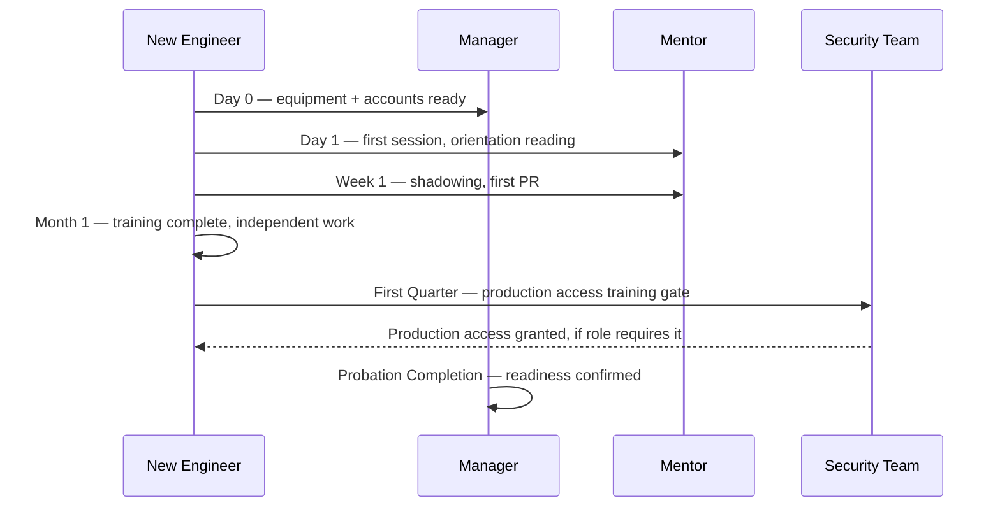

---

# Development Environment Setup

Every engineer's environment is provisioned from the identical, version-controlled source, per Reproducible Environments above — this document governs the **governance** of setup; the exact tool versions and commands are owned entirely by `ai-docs/09-tech-stack.md` and `ai-docs/16-deployment-standards.md`, never redefined here.

| Component | Governance |
|---|---|
| **Hardware** | Provisioned per a standard, role-appropriate hardware specification (sufficient for local Docker Compose, per `ai-docs/09-tech-stack.md`) — never assembled ad hoc per engineer. |
| **Operating systems** | A supported, currently-patched OS image, provisioned and maintained by IT/Platform, per the identical patch-cadence discipline already established in `ai-docs/22-dependency-management-standards.md`'s Version Management Strategy applied to endpoint devices. |
| **IDE configuration** | A shared, version-controlled IDE configuration (linting, formatting hooks) matching `packages/config`'s presets, per `ai-docs/04-folder-guidelines.md` — never a personally-tuned configuration that silently diverges from what CI actually enforces. |
| **Git** | Configured per `ai-docs/06-git-workflow.md`'s branch, commit, and signed-commit standards; SSH/credential setup follows the organization's standard, documented path. |
| **Node.js** | The current Active LTS release line, per `ai-docs/09-tech-stack.md`'s Version Management Strategy — never a locally-installed, unmanaged version. |
| **Docker** | Docker Compose is the standard local orchestration tool, per `ai-docs/09-tech-stack.md` — every engineer's local stack is provisioned identically. |
| **Secrets** | Local, non-production placeholder values only, sourced from `.env.*.example` templates, per `ai-docs/21-configuration-management-standards.md` and `ai-docs/06-git-workflow.md`'s Git Ignore Policy — never a real secret provisioned to a local machine. |
| **Local databases** | A disposable, containerized PostgreSQL/Redis instance seeded from the version-controlled seed script, per `ai-docs/14-database-design-guidelines.md` — never a shared or production-adjacent database. |
| **Testing tools** | Vitest/Jest/Playwright, provisioned per `ai-docs/09-tech-stack.md`'s Testing Stack, verified working before Week 1 concludes. |
| **Security software** | Endpoint security tooling (disk encryption, an approved secrets-scanning pre-commit hook, per `ai-docs/06-git-workflow.md`'s Secret Scanning Policy) is provisioned and verified active before any repository access is granted. |
| **AI tooling** | Any AI coding assistant used locally is provisioned per the AI-Assisted Development Guidelines already established in `ai-docs/07-development-workflow.md` — never a tool outside Arwal's governed data-handling agreements, per that document's Confidentiality standard. |

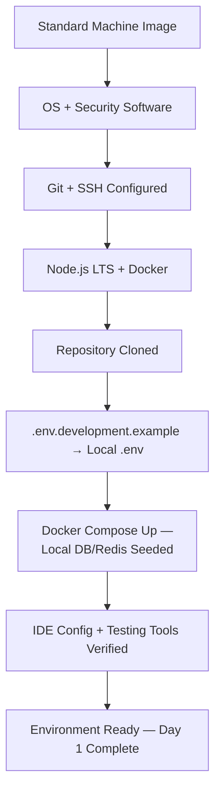

---

# Access Provisioning

Access is granted in **tiers**, matching the Engineering Onboarding stages above — never granted in full on Day 0 regardless of role, per Least Privilege and Secure by Default above.

| Tier | Granted At | Scope | Approval |
|---|---|---|---|
| **Tier 0 — Pre-Boarding** | Before Day 0 | HR systems, benefits enrollment — no engineering system access. | HR/People Operations. |
| **Tier 1 — Development** | Day 1 | Repository read/write (per `CODEOWNERS`-scoped teams), Development environment (`ai-docs/23-environment-strategy.md`), non-production CI/CD. | Engineering Manager. |
| **Tier 2 — Staging & Tooling** | Month 1, once foundational training is complete | Staging environment (read + deploy-via-pipeline), monitoring/logging dashboards (read-only, `ai-docs/18-observability-standards.md`), issue tracker, internal wiki. | Engineering Manager + Tech Lead. |
| **Tier 3 — Production (Conditional)** | First Quarter, **only after the mandatory training gate below is satisfied** | Production deploy-via-pipeline (never standing/ambient access, per `ai-docs/16-deployment-standards.md`'s Production Access Control), production-scoped monitoring/logging. | Engineering Manager + Security Team, per the governance improvement below. |
| **Tier 4 — Elevated/Break-Glass** | Never standing; granted only per an active, time-bound need | Emergency production data/infrastructure access, per `ai-docs/10-security-standards.md`'s Admin Privileges standard. | Per `ai-docs/10-security-standards.md`'s break-glass mechanism — this document never redefines it. |

### Mandatory Production Access Training Gate

Per the governance improvement this document incorporates: **no engineer, regardless of role or seniority, is granted Tier 3 (Production) access until they have completed and had formally recorded**: (1) the Security training module in Engineering Training below, (2) the Incident Response training module, and (3) the Platform/Deployment training module — with sign-off recorded by both the Engineering Manager and a Security Team reviewer. An engineer whose role does not require production access (e.g., certain QA or documentation-focused roles) simply never advances to Tier 3, and this is never treated as an oversight to correct — Least Privilege means many roles correctly stop at Tier 2 permanently.

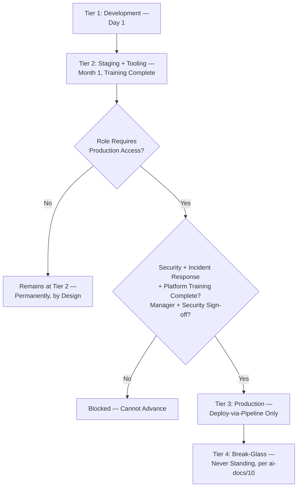

### Identity Management

Every account is provisioned under a single, centrally-managed identity (per the unified Authentication service already established in `ai-docs/10-security-standards.md`), never a locally-created, unmanaged credential per system.

### Repository, Cloud, CI/CD, Monitoring, Logging, and Secrets Access

Every one of these access categories is governed entirely by its own owning document — `ai-docs/06-git-workflow.md` (repository), `ai-docs/16-deployment-standards.md` (cloud), `ai-docs/17-cicd-standards.md` (CI/CD), `ai-docs/18-observability-standards.md` (monitoring), `ai-docs/19-logging-standards.md` (logging), `ai-docs/10-security-standards.md` (secrets) — this document's sole role is confirming each is provisioned at the correct Tier, per the table above, and reviewed per Periodic Access Recertification below.

### Approval Workflow

Every access grant beyond Tier 1 follows the identical Approval Chain discipline already established in `ai-docs/31-change-management-governance-standards.md`'s Change Approval Authority — an access grant is itself a governed Change, never a favor an engineer requests informally from whoever happens to hold the credential.

---

# Engineering Training

Every module below is completed within the timeline specified in Engineering Onboarding above, tracked to individual completion, never assumed from attendance alone.

| Module | Content Source | Required Before |
|---|---|---|
| **Architecture** | `ai-docs/03-system-architecture-principles.md`, `ai-docs/04-folder-guidelines.md` | End of Week 1 |
| **Coding Standards** | `ai-docs/05-coding-standards.md` | End of Week 1 |
| **Security** | `ai-docs/10-security-standards.md` | End of Month 1 — **mandatory gate for Tier 3 access** |
| **Testing** | `ai-docs/15-testing-standards.md` | End of Month 1 |
| **Deployment** | `ai-docs/16-deployment-standards.md`, `ai-docs/17-cicd-standards.md` | End of Month 1 — **mandatory gate for Tier 3 access** |
| **Incident Response** | `ai-docs/07-development-workflow.md`'s Incident Response Workflow, `ai-docs/34-engineering-communication-standards.md`'s Incident Communication | End of Month 1 — **mandatory gate for Tier 3 access** |
| **Documentation** | `ai-docs/24-documentation-standards.md` | End of Week 1 |
| **Knowledge Management** | `ai-docs/33-engineering-knowledge-management-standards.md` | End of Month 1 |
| **Communication** | `ai-docs/34-engineering-communication-standards.md` | End of Week 1 |
| **AI Usage** | `ai-docs/07-development-workflow.md`'s AI-Assisted Development Guidelines, `ai-docs/09-tech-stack.md`'s AI Stack | End of Month 1, where the role touches AI-assisted work |
| **Government Compliance** | `ai-docs/01-product-goals.md`'s Government Coordination, `ai-docs/19-logging-standards.md`'s Compliance section | End of First Quarter, for any role touching `civic-services` |

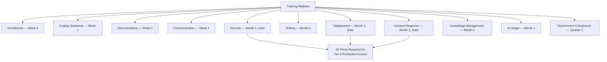

---

# Knowledge Transfer During Onboarding

Per Knowledge Continuity above and the Mentorship practice already established in `ai-docs/33-engineering-knowledge-management-standards.md`'s Knowledge Sharing, every new engineer receives deliberate, structured knowledge transfer — never left to osmosis.

| Practice | Timing | Purpose |
|---|---|---|
| **Assigned mentor** | Confirmed before Day 0; active through the First Quarter. | A single, named point of contact for both technical and tacit-knowledge questions. |
| **Shadowing** | Week 1. | The new engineer observes their mentor handling real work before attempting it independently. |
| **Pair programming** | Week 1 through Month 1. | Direct, real-time transfer on the new engineer's own early tasks. |
| **Architecture walkthroughs** | Week 1. | A guided tour of the module(s) the new engineer will own, per `ai-docs/33-engineering-knowledge-management-standards.md`'s Code Walkthroughs. |
| **Runbook reviews** | Month 1, for any role touching Operational knowledge. | The new engineer reads and, where feasible, participates in a rehearsal of a relevant runbook, per `ai-docs/33-engineering-knowledge-management-standards.md`'s Knowledge Validation. |
| **Codebase exploration** | Week 1, self-directed with mentor support. | Hands-on familiarity beyond what a document alone conveys. |
| **Documentation reading order** | Day 1 through Week 1, per the table below. | A deliberate sequence, never an unordered dump of every phase document at once. |

### Documentation Reading Order

| Order | Document | Why First/Next |
|---|---|---|
| 1 | `ai-docs/00-project-vision.md`, `ai-docs/01-product-goals.md` | Establishes *why* before *how* — every later standard makes more sense once the mission is understood. |
| 2 | `ai-docs/02-engineering-principles.md`, `ai-docs/04-folder-guidelines.md` | The foundational engineering philosophy and where things live. |
| 3 | `ai-docs/05-coding-standards.md`, `ai-docs/06-git-workflow.md` | What is needed to make and merge a first real change. |
| 4 | `ai-docs/26-code-review-standards.md` | What to expect from, and how to give, review feedback. |
| 5 | The specific module's README and this document's Architecture Walkthroughs practice | Domain-specific context, once the general foundation is in place. |
| 6+ | Every other `ai-docs/*` document, as relevant to the engineer's role, per Engineering Training's table above | Consumed progressively across the first quarter, never all at once. |

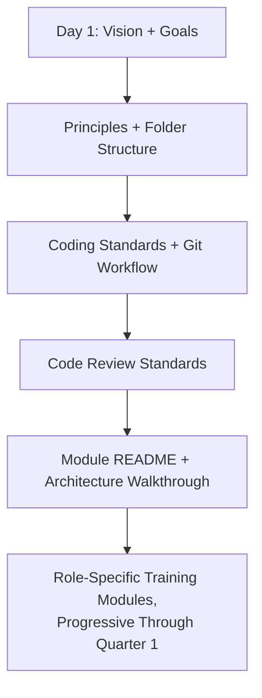

---

# Internal Transfers

An internal transition is a smaller-scale version of onboarding — access and ownership are re-scoped, never simply expanded on top of what already existed.

| Transition | Governance |
|---|---|
| **Team changes** | The outgoing team's access at a tier the new team does not require is revoked, per Least Privilege — a lateral move is never an accumulation event. |
| **Promotion** | New Decision Authority Matrix scope (`ai-docs/29-engineering-governance-decision-authority.md`), if applicable, is granted only once the corresponding training/readiness for that authority tier is confirmed. |
| **Temporary assignment** | Access is time-bound to the assignment's stated duration, per the identical Temporary Delegation discipline already established in `ai-docs/29-engineering-governance-decision-authority.md` — automatically reverting, never requiring active revocation to end correctly. |
| **Platform rotation** | A defined-duration rotation onto the Platform Team follows an abbreviated onboarding path (Platform-specific training only, per Engineering Training above), with access reverting per Temporary Delegation at the rotation's end. |
| **Cross-functional movement** | Any movement into a Security- or `payments`/`identity`/`civic-services`-touching role triggers the identical mandatory training gate already established in Access Provisioning above, regardless of the engineer's tenure elsewhere at Arwal. |

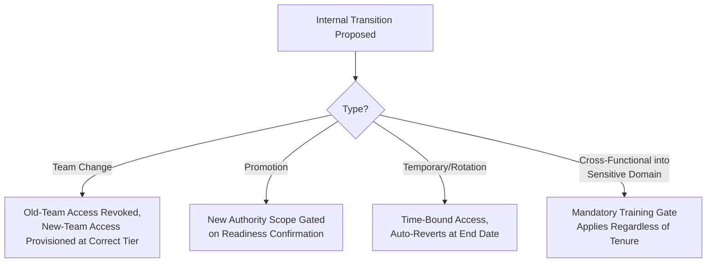

---

# Engineering Readiness Checklist

Confirmed by the Engineering Manager at Probation Completion, per Engineering Onboarding above:

- [ ] Employment verification, equipment, and Tier 1 access were ready before Day 0.
- [ ] Local development environment fully functional, per Development Environment Setup.
- [ ] Git, IDE, and testing tooling verified working.
- [ ] Documentation Reading Order completed through at minimum item 5.
- [ ] Every Week-1-required Engineering Training module completed.
- [ ] Every Month-1-required Engineering Training module completed, including the three mandatory Tier 3 gate modules where the role requires production access.
- [ ] At least one PR merged through the standard Code Review process.
- [ ] Mentor-led shadowing, pairing, and an architecture walkthrough all completed.
- [ ] Access tier matches the engineer's actual, current role — no unused, speculative grant remains.
- [ ] First-month and first-quarter check-ins with the manager both completed and recorded.
- [ ] Production access (if granted) was gated correctly, per the Mandatory Production Access Training Gate above, with sign-off recorded.
- [ ] The engineer has contributed to at least one full release cycle, per `ai-docs/27-branching-release-strategy.md`.

A checklist with any item unresolved is not signed off as complete — Probation Completion is a deliberate confirmation, never a calendar default.

---

# Offboarding Philosophy

### Security

An offboarding event is, before anything else, a security event — every access grant this document's Access Provisioning section deliberately, gradually built up must be deliberately, promptly torn down, per Secure Access Revocation below.

### Knowledge Preservation

Per Knowledge Continuity above, no departure proceeds without a genuine attempt to capture what only the departing engineer knows — this is never optional, and never deferred past the departure date.

### Respectful Transition

Per Respectful Offboarding above, every departing engineer — regardless of the circumstances of their departure — is treated with dignity, given a clear process, and thanked for their contribution. A hostile or dismissive offboarding process both harms the individual and measurably reduces the quality and completeness of the knowledge transfer Arwal depends on from them.

### Operational Continuity

No system, service, or repository is left without a confirmed, accountable owner the moment a departure completes — Ownership Transition below is never optional, and for a Critical-tier system, is never left incomplete past the departure date itself.

### Asset Recovery

Every physical and digital asset issued to the engineer — hardware, credentials, physical access badges — is recovered or confirmed destroyed/revoked, tracked to explicit completion, never assumed returned informally.

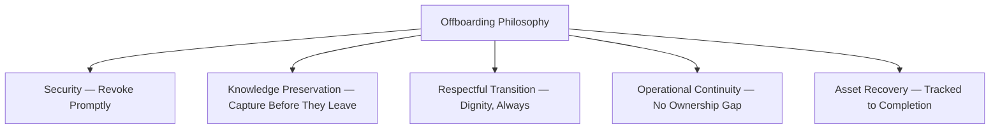

---

# Offboarding Process

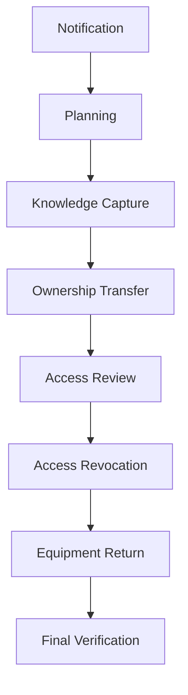

| Stage | Meaning | Owner |
|---|---|---|
| **Notification** | The departure (resignation, termination, end of contract) is confirmed and communicated to the Engineering Manager, HR, and — for a Critical-tier owner — Security Team and the Engineering Leadership Council, per `ai-docs/34-engineering-communication-standards.md`'s classification. | HR/People Operations, Engineering Manager. |
| **Planning** | An offboarding plan is drafted immediately upon Notification — covering the timeline (see Secure Access Revocation's completion-time table below), the knowledge-capture scope, and the ownership-transfer scope. | Engineering Manager. |
| **Knowledge Capture** | Per `ai-docs/33-engineering-knowledge-management-standards.md`'s Exit Knowledge-Transfer Checklist, every Critical/High-tier item the departing engineer owns is documented, and every "only I know this" item they can identify is captured in writing. | Departing engineer, mentor/successor, Engineering Manager. |
| **Ownership Transfer** | Every system, repository, and responsibility they own is formally reassigned, per Ownership Transition below — **never left pending past the departure date for a Critical-tier item.** | Engineering Manager, the confirmed Successor Owner. |
| **Access Review** | Every access grant the departing engineer holds is enumerated, per the tiered model in Access Provisioning above. | Security Team, IT. |
| **Access Revocation** | Every enumerated access grant is revoked per the timelines in Secure Access Revocation below. | Security Team, IT, Platform Team. |
| **Equipment Return** | Hardware and any physical access credentials are recovered and confirmed. | IT, HR. |
| **Final Verification** | A named individual (per Secure Access Revocation's Audit Logging below) confirms every prior stage is genuinely complete, not merely initiated. | Security Team. |

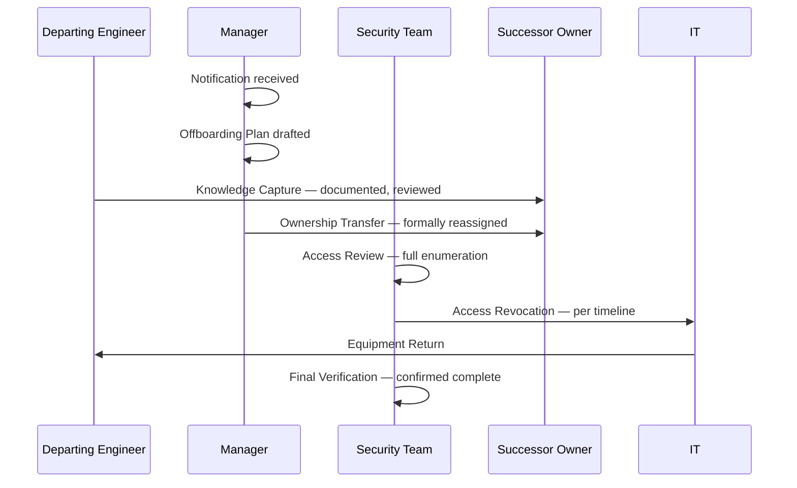

---

# Ownership Transition

Every category of ownership below is governed by the Formal Successor Assignment requirement this document incorporates: **for any Critical-tier service, repository, infrastructure component, or operational responsibility (per the Critical classification already established in `ai-docs/30-engineering-risk-management-standards.md` and `ai-docs/33-engineering-knowledge-management-standards.md`), a named Successor Owner must be formally confirmed — not merely proposed — before the outgoing owner's access to that item is revoked, and before their departure is considered Offboarding-complete.**

| Ownership Category | Transfer Mechanism | Governing Document |
|---|---|---|
| **Repositories** | `CODEOWNERS` entry updated; the outgoing owner's write access on the specific repository is retained only until the Successor Owner confirms readiness. | `ai-docs/04-folder-guidelines.md`'s Folder Ownership Rules |
| **Services** | The service's README/ownership metadata updated; the Successor Owner briefed per `ai-docs/33-engineering-knowledge-management-standards.md`'s Succession Planning. | `ai-docs/33-engineering-knowledge-management-standards.md` |
| **Runbooks** | The Successor Owner walks through and, where feasible, rehearses the runbook before the outgoing owner departs, per that document's Periodic Verification standard. | `ai-docs/33-engineering-knowledge-management-standards.md` |
| **Dashboards** | Dashboard ownership metadata updated; the Successor Owner confirms they can interpret and act on it. | `ai-docs/18-observability-standards.md` |
| **Infrastructure** | IaC ownership tags and any Platform Governance Board record updated, per `ai-docs/16-deployment-standards.md` and `ai-docs/29-engineering-governance-decision-authority.md`. | `ai-docs/16-deployment-standards.md` |
| **Secrets** | Every secret the outgoing owner was the sole approver/rotator for is reassigned to the Successor Owner, per `ai-docs/10-security-standards.md`'s Key Management, **before** the outgoing owner's own credential is revoked. | `ai-docs/10-security-standards.md` |
| **CI/CD** | Pipeline ownership and any required-reviewer configuration (`ai-docs/17-cicd-standards.md`) referencing the outgoing owner is updated. | `ai-docs/17-cicd-standards.md` |
| **Documentation** | Documentation Ownership Matrix entries (`ai-docs/24-documentation-standards.md`) updated to the Successor Owner. | `ai-docs/24-documentation-standards.md` |
| **Technical debt** | Every Technical Debt Register item (`ai-docs/32-technical-debt-management-standards.md`) the outgoing owner held is reassigned, never left orphaned. | `ai-docs/32-technical-debt-management-standards.md` |
| **Architecture ownership** | Architecture Review Board membership or a specific ADR's Owner field (`ai-docs/25-architecture-decision-records.md`) is transferred per that document's Ownership Transfer standard. | `ai-docs/25-architecture-decision-records.md` |

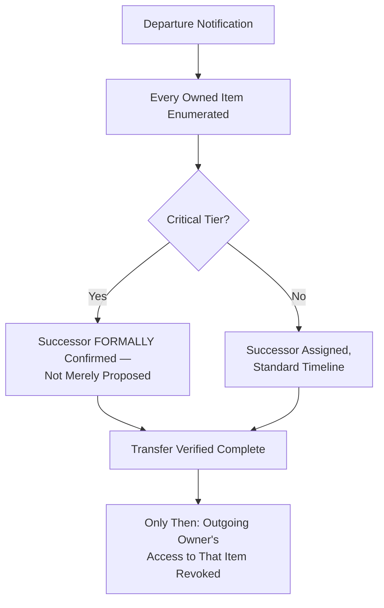

> **Callout — No Critical Ownership Gap, Ever**
> A Critical-tier item without a formally confirmed Successor Owner is a blocking condition on the offboarding process itself — the departure's Access Revocation stage does not proceed for that specific item's associated access until the successor is confirmed, escalated to the Engineering Leadership Council per `ai-docs/29-engineering-governance-decision-authority.md` if the departure timeline makes this genuinely difficult.

---

# Secure Access Revocation

### Immediate Revocation Triggers

The following trigger **immediate** (within minutes, never batched) revocation of all access, regardless of departure type: a termination for cause, a security-relevant departure (suspected credential compromise, a trust violation), or an explicit request from Security Team or the Engineering Leadership Council.

### Scheduled Revocation

A planned, amicable departure (a resignation with standard notice) follows a scheduled revocation timeline, timed to the departure's actual last working day — never revoked prematurely in a way that blocks the departing engineer's own Knowledge Capture and Ownership Transition work in their remaining time.

### Maximum Allowed Completion Times

Per the governance improvement this document incorporates:

| Revocation Category | Maximum Completion Time |
|---|---|
| **Emergency offboarding** (immediate revocation trigger, above) | **Immediate** — within minutes of the trigger being confirmed; no exception. |
| **Standard access removal** (planned, amicable departure) | **Same business day** as the confirmed last working day — every credential, repository grant, and cloud access revoked before that day ends. |
| **Credential rotation for shared/service-account secrets the departing engineer had access to** | Within **3 business days** of the last working day. |
| **Physical access badge deactivation** | Same business day as the last working day, coordinated with Equipment Return. |
| **Final audit confirmation** (Final Verification stage) | Within **5 business days** of the last working day. |

A revocation task missed past its maximum completion time is treated as an active governance defect, escalated per Governance Review below — never left open indefinitely with no fresh accountability assigned.

### Emergency Offboarding

Where a departure is security-sensitive (suspected malicious intent, an active investigation), Emergency Offboarding bypasses the normal Knowledge Capture and Ownership Transition sequencing — access is revoked immediately per the table above, and knowledge/ownership recovery is performed **afterward**, by the Successor Owner and Security Team working from existing documentation and system inspection, never by continuing to trust the departing engineer's own cooperation.

### Credential Rotation, Token Revocation, Secrets Rotation

Every credential the departing engineer could have accessed or derived — not only their own personal login — is rotated where it was a shared or service-level secret they had legitimate access to, per `ai-docs/10-security-standards.md`'s Secret Rotation standard; this document adds no new rotation mechanic, it affirms the maximum-completion-time table above applies to it.

### Audit Logging

Every revocation action is logged in the immutable audit trail already established in `ai-docs/10-security-standards.md` and `ai-docs/19-logging-standards.md` — who revoked what, when, and confirmation it was verified complete. This audit record is what Final Verification (per Offboarding Process above) checks against.

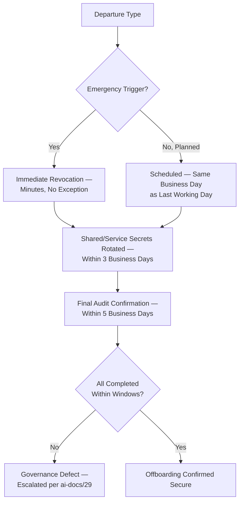

---

# Contractor & Vendor Offboarding

Short-term contractors, consultants, government vendors, and third-party engineers follow an **abbreviated but never weaker** version of this document's discipline, scoped to their engagement's actual access footprint.

| Category | Onboarding Difference | Offboarding Difference |
|---|---|---|
| **Short-term contractors** | Engagement-scoped training only (per Engineering Training above, limited to the modules their work actually touches); Tier 1–2 access ceiling by default, Tier 3 only with the identical mandatory gate every employee faces. | Access is time-boxed to the contract's known end date from the moment it is granted, per the identical Temporary Delegation discipline in `ai-docs/29-engineering-governance-decision-authority.md` — reverting automatically, never requiring a separate offboarding trigger for the routine, on-schedule case. |
| **Consultants** | Access scoped narrowly to the specific engagement's deliverable — never broader repository or infrastructure access than that deliverable requires. | Identical automatic time-box reversion; any early termination follows the same Maximum Allowed Completion Times as an employee's Standard Access Removal. |
| **Government vendors** | Onboarding coordinated jointly with the relevant Government Technical Partner relationship owner, per `ai-docs/34-engineering-communication-standards.md`'s Government Partner Communication; access is scoped exclusively to the specific integration surface. | Offboarding is communicated to the government partner per that same document's terms — never a silent access change on a system the partner depends on without notice. |
| **Third-party engineers** (e.g., an embedded vendor team) | Held to the identical Security and Coding Standards training gates as an Arwal employee before any Tier 2+ access — no reduced bar merely because they are external. | Identical Maximum Allowed Completion Times; the engaging Arwal Tech Lead is the accountable Ownership Transition party, since a third-party engineer never holds unsupervised Critical-tier ownership in the first place, per Least Privilege. |

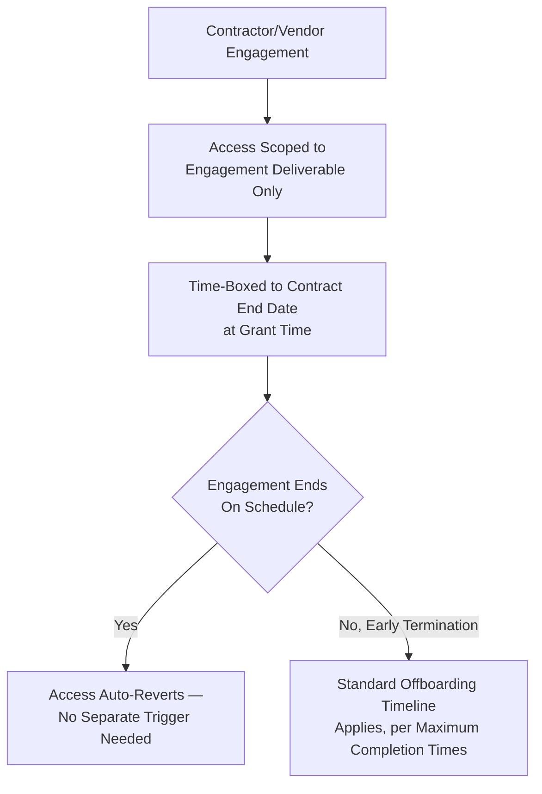

> **Callout — No Reduced Security Bar for External Engineers**
> A contractor or vendor engineer's onboarding path is *narrower in scope*, never *lower in rigor* — the same Security, Coding Standards, and (where their access reaches it) Incident Response training gates apply before any access beyond Tier 1 is granted, regardless of the engagement's expected brevity.

---

# Metrics

Per the Actionable Metrics principle already established throughout `ai-docs/18-observability-standards.md` and every governance chapter since, every metric below ties to a real question an Engineering Manager or the Engineering Leadership Council will actually ask.

| Metric | Definition | What a Regression Signals |
|---|---|---|
| **Time-to-productivity** | Time from Day 0 to a new engineer's first independently-merged, non-trivial contribution. | A lengthening trend signals a gap in Development Environment Setup, Engineering Training, or mentor availability. |
| **Environment setup success rate** | Percentage of new engineers with a fully working local environment by end of Day 1. | A declining rate signals Reproducible Environments has drifted from the documented path. |
| **Training completion rate** | Percentage of required Engineering Training modules completed within their stated deadline, per role. | A declining rate directly threatens the Tier 3 access gate's integrity. |
| **Knowledge transfer completion** | Percentage of departing engineers' Critical/High-tier items with a confirmed, verified Successor Owner before departure. | Any value below 100% for Critical-tier items is treated as an active governance defect, per Ownership Transition above. |
| **Access audit compliance** | Percentage of active engineers whose access matches their current role, per the most recent Periodic Access Recertification below. | A declining rate signals Least Privilege is eroding through unmanaged access accumulation. |
| **Offboarding completion time** | Actual time taken for each offboarding stage against the Maximum Allowed Completion Times in Secure Access Revocation above. | Any miss is escalated immediately, per that section. |
| **Ownership transfer completion** | Percentage of departures with every owned item (per Ownership Transition's table) formally reassigned before the departure date. | A gap here is the single most direct signal of an operational-continuity risk actively forming. |

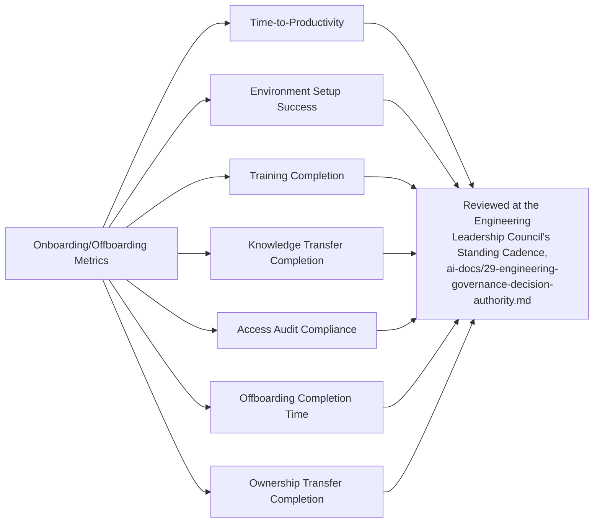

---

# AI-Assisted Onboarding

Consistent with the identical AI-assistance principle already established across every governance document in this handbook (`ai-docs/24` through `ai-docs/34`): **AI accelerates orientation and troubleshooting, never authority or accountability.**

### AI Onboarding Assistant

An AI tool may serve as a first-line assistant for a new engineer's routine, factual questions — "where is the config for X," "what does this module do" — retrieving from the existing, verified Knowledge Base (`ai-docs/33-engineering-knowledge-management-standards.md`), per that document's AI-Assisted Search standard. This is a genuinely valuable onboarding accelerant precisely because it reduces the load on a human mentor for the mechanical, easily-answered questions, freeing mentor time for genuinely tacit knowledge transfer.

### Knowledge Search

An AI-powered search layer surfacing a candidate answer is presented as a candidate for the new engineer to verify against its cited source, never as an unquestionable authority — a new engineer, by definition, does not yet have the context to independently judge whether an AI answer is subtly wrong, which makes this verification discipline especially important during onboarding specifically.

### Architecture Guidance

An AI tool may help a new engineer navigate `ai-docs/03-system-architecture-principles.md` and `ai-docs/04-folder-guidelines.md` by answering structural questions — this supplements, never replaces, the human Architecture Walkthrough already required in Knowledge Transfer During Onboarding above.

### Training Assistance

An AI tool may quiz a new engineer on training-module content or summarize a phase document into a more digestible first pass — the underlying phase document remains authoritative, and Engineering Training's completion sign-off is always confirmed by a human (the Engineering Manager or Tech Lead), never by an AI tool's own assessment of comprehension.

### Environment Troubleshooting

An AI tool may assist in diagnosing a local environment setup failure (a Docker Compose error, a dependency resolution issue) — a genuinely high-value, low-risk use case, since a wrong AI suggestion here is self-correcting (the environment either works or it doesn't) rather than silently propagating an inaccuracy the way an architectural misunderstanding could.

### Human Oversight

No onboarding milestone (training completion, readiness checklist sign-off) and no offboarding milestone (knowledge-capture completeness, ownership-transfer confirmation) is ever confirmed complete on the basis of an AI tool's assessment alone. The named human — the Engineering Manager for onboarding, the Successor Owner and Security Team for offboarding — remains fully accountable, identical to the Human Verification standard already established consistently across `ai-docs/24` through `ai-docs/34`.

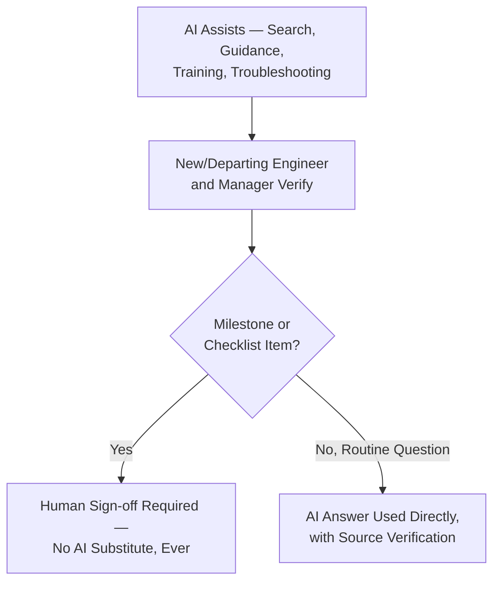

---

# Engineering Anti-Patterns

| Anti-Pattern | Description | Why It's Rejected |
|---|---|---|
| **Shared Accounts** | Two or more engineers using the same login credential "for convenience." | Violates Identity Management above and `ai-docs/10-security-standards.md`'s Zero Trust; makes audit logging and Secure Access Revocation impossible to apply correctly to an individual. |
| **Missing Ownership** | A system, repository, or item left with no confirmed owner after a transition. | Violates Ownership Clarity above; the exact condition the Formal Successor Assignment requirement exists to prevent. |
| **Undocumented Exits** | A departure with no formal Offboarding Process record — the engineer simply stops appearing. | Violates every principle in Offboarding Philosophy simultaneously; recreates the tribal-knowledge and security risk this entire document exists to close. |
| **Unrevoked Credentials** | An access grant still active well past its Maximum Allowed Completion Time. | A direct, active security exposure — treated with the identical severity already established for a Critical open risk in `ai-docs/30-engineering-risk-management-standards.md`. |
| **Knowledge Loss** | A departure completing with no attempt at Knowledge Capture, relying on "we'll figure it out later." | Violates Knowledge Continuity above and directly produces the Bus Factor concentration risk `ai-docs/33-engineering-knowledge-management-standards.md` exists to prevent. |
| **Shadow Access** | An access grant obtained outside the documented Access Provisioning tiers — a favor from a colleague, an unreviewed elevation. | Violates Least Privilege and the Approval Workflow above; invisible to every audit this document depends on. |
| **Incomplete Onboarding** | An engineer granted Tier 3 production access without every mandatory training gate genuinely completed and signed off. | Directly violates the Mandatory Production Access Training Gate — the single most load-bearing rule this document adds. |
| **Unverified AI Guidance** | A new engineer, or a manager, treating an AI onboarding assistant's answer as authoritative without checking its source. | Violates Human Oversight above; an unverified AI claim during onboarding is especially dangerous because the new engineer has no independent basis yet to catch it being wrong. |

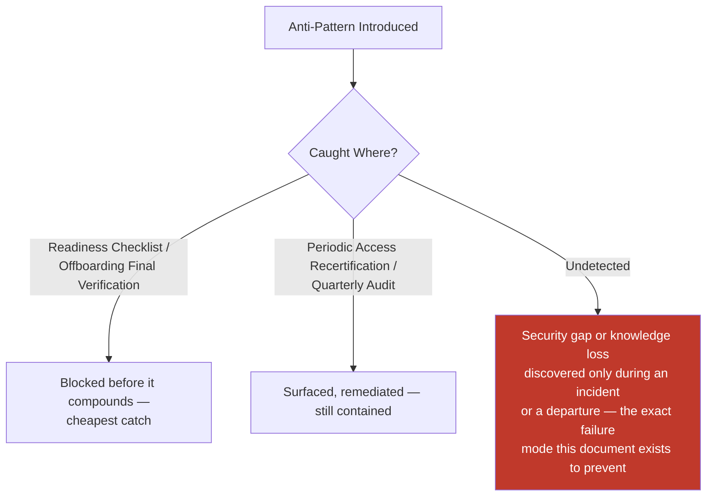

---

# Engineering Review Checklist

Every onboarding or offboarding event is checked against the following before it is considered lifecycle-compliant:

**Onboarding**
- [ ] Pre-Onboarding Requirements fully satisfied before Day 0.
- [ ] Development environment reproducible and verified working by end of Day 1.
- [ ] Access provisioned strictly at the correct tier for the current stage — never advanced ahead of schedule.
- [ ] Every required Engineering Training module completed and recorded, per role.
- [ ] Tier 3 (Production) access, if granted, passed the full Mandatory Production Access Training Gate with documented manager + Security sign-off.
- [ ] Mentor-led Knowledge Transfer practices (shadowing, pairing, walkthrough) completed.
- [ ] Engineering Readiness Checklist fully satisfied before Probation Completion is confirmed.

**Offboarding**
- [ ] Notification triggered the correct process path (standard vs. Emergency Offboarding).
- [ ] Knowledge Capture completed per `ai-docs/33-engineering-knowledge-management-standards.md`'s Exit Checklist.
- [ ] Every Critical-tier ownership item has a **formally confirmed** Successor Owner before departure.
- [ ] Every non-Critical ownership item is reassigned, never left orphaned.
- [ ] Access Revocation completed within its category's Maximum Allowed Completion Time.
- [ ] Shared/service secrets the departing engineer could access were rotated within the required window.
- [ ] Equipment and physical access recovered/confirmed.
- [ ] Final Verification completed and logged in the audit trail.
- [ ] For a contractor/vendor: engagement-scoped access reverted on schedule, or Standard Access Removal timelines honored for an early termination.

**Both**
- [ ] AI-assisted guidance used during the process was independently verified, never trusted as authoritative on its own.
- [ ] No anti-pattern present, per Engineering Anti-Patterns above.
- [ ] No duplication of Security, Documentation, Knowledge Management, Communication, Governance, Development Workflow, or Risk Management standards — every such concern deferred entirely to its owning phase document.

An onboarding or offboarding event failing any item above is not considered complete until resolved — this checklist carries the same non-negotiable authority as every other review checklist established in the preceding thirty-five phase documents.

---

# Governance Review

### Annual Framework Review

This document's own tiered-access model, training-gate list, and Maximum Allowed Completion Times are reviewed no less than **annually** by the Engineering Leadership Council, per the identical standing self-review commitment already established in `ai-docs/30` through `ai-docs/34`. The review specifically asks: do the completion-time windows still fit Arwal's actual team size and tooling; has any role's training-module list grown out of date relative to the current handbook; and does the Access Provisioning tier model still reflect Arwal's actual production topology.

### Quarterly Onboarding Audits

A periodic (at minimum quarterly) audit samples a cross-section of recent onboarding events, verifying: was the Readiness Checklist genuinely satisfied, was Tier 3 access correctly gated, and did the new engineer's actual Time-to-Productivity match expectations.

### Offboarding Audits

An identical quarterly audit samples recent departures, verifying: was every Maximum Allowed Completion Time actually honored, was every Critical-tier item's Successor Owner genuinely confirmed (not merely proposed), and does the audit trail show complete, verifiable Access Revocation.

### Access Audits (Periodic Access Recertification)

Per the governance improvement this document incorporates, **every active engineer's access is recertified no less than semi-annually** — their Engineering Manager and, for any Tier 3+/Security-relevant access, the Security Team, jointly confirm that every access grant the engineer currently holds is still genuinely required by their current role. An access grant that is no longer justified is revoked within the same Maximum Allowed Completion Time already established in Secure Access Revocation above for a Standard Access Removal — recertification is never a passive review that finds nothing simply because nobody looked closely.

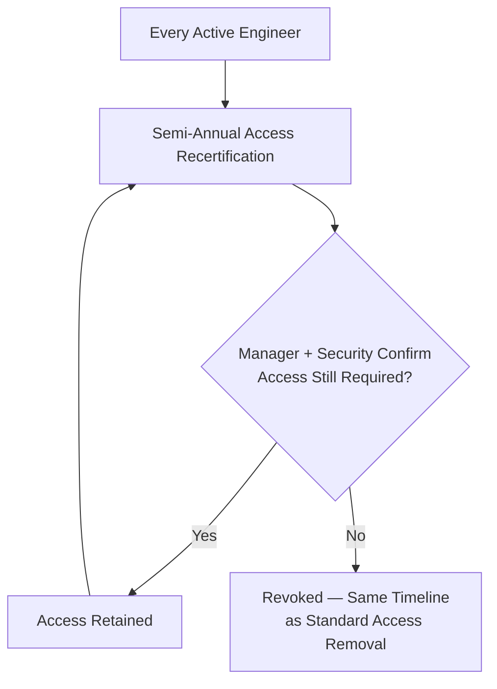

### Knowledge Continuity Review

At least annually, this document's onboarding and offboarding data feeds directly into `ai-docs/33-engineering-knowledge-management-standards.md`'s Bus Factor Governance Threshold review — a pattern of departures consistently struggling to complete Knowledge Capture on time is itself a signal that Knowledge Continuity's underlying practice needs strengthening, escalated to the Engineering Leadership Council.

### Metrics Review

Metrics (above) are watched continuously at the Engineering Leadership Council's standing cadence — a sharp, sustained shift (a lengthening Time-to-Productivity, a declining Ownership Transfer Completion rate) triggers an out-of-cycle review, never deferred to the next scheduled cycle.

```mermaid
graph TD
    A[Metrics Watched Continuously] --> B{Sharp Shift Detected?}
    B -->|Yes| C[Out-of-Cycle Review]
    B -->|No| D[Awaits Quarterly Audit /<br/>Annual Review]
    C & D --> E[Annual Framework Review —<br/>Engineering Leadership Council]
    E --> F{Amendment Warranted?}
    F -->|Yes| G[Documentation Change,<br/>Architecture Review Board Sign-off]
    F -->|No| H[Framework Reaffirmed]
```

---

# Relationship to Previous Standards

### Project Vision

`ai-docs/00-project-vision.md` establishes the founding commitment to infrastructure built for a generation and to treating engineers with dignity. This document is the operational discipline that makes both commitments real at the exact moments — arrival and departure — where they are most tested.

### Engineering Principles

`ai-docs/02-engineering-principles.md` establishes Secure by Default, Least Privilege, and Documentation-Driven Development as founding principles. This document is their concrete application to the engineering lifecycle, never redefining a single principle already established there.

### Security Standards

`ai-docs/10-security-standards.md` owns every technical security control this document's Access Provisioning and Secure Access Revocation sections apply on a defined timeline — this document never redefines an authentication mechanism, an authorization model, or the break-glass procedure.

### Documentation Standards

`ai-docs/24-documentation-standards.md` owns the complete documentation discipline this document's Documentation Reading Order and ownership-metadata updates depend on, never redefining a documentation rule.

### Knowledge Management

`ai-docs/33-engineering-knowledge-management-standards.md` owns the complete Knowledge Transfer, Succession Planning, and Bus Factor discipline this document executes as a concrete, timed onboarding and offboarding procedure — the two are directly complementary, never duplicative.

### Communication Standards

`ai-docs/34-engineering-communication-standards.md` owns every channel, classification, and audience rule this document's Notification and departure-announcement steps rely on, never redefining a communication mechanic.

### Risk Management

`ai-docs/30-engineering-risk-management-standards.md` owns Knowledge Risk and Human Process Risk as standing categories — an onboarding or offboarding gap this document's audits surface is escalated into that document's Risk Register where it represents a standing, unresolved condition.

### Engineering Governance

`ai-docs/29-engineering-governance-decision-authority.md` owns the complete decision-authority structure this document's every Approval role (Engineering Manager, Security Team, Engineering Leadership Council) is drawn from directly, never a new authority structure invented here.

```mermaid
graph TD
    A[This Document<br/>Phase 36] -->|"protects the founding<br/>commitments in"| B[Project Vision<br/>Phase 1]
    A -->|"applies Secure by Default<br/>and Least Privilege from"| C[Engineering Principles<br/>Phase 3]
    A -->|"schedules the controls in"| D[Security Standards<br/>Phase 11]
    A -->|"executes the Knowledge Transfer<br/>discipline in"| E[Knowledge Management<br/>Phase 34]
    A -->|"communicates through the<br/>channels in"| F[Communication Standards<br/>Phase 35]
    A -->|"escalates unresolved gaps into"| G[Risk Management<br/>Phase 31]
    A -->|"draws authority from"| H[Engineering Governance<br/>Phase 30]
    A --> I[Engineering Handbook —<br/>the discipline that keeps every<br/>arrival safe and every departure secure]
```

---

# Closing Statement

> **Callout — Closing Statement**
> Every preceding phase document described a standard for how Arwal is designed, built, secured, tested, deployed, governed, risk-managed, changed, kept solvent against debt, kept alive as knowledge, and communicated. This document describes the two moments where all of that discipline is either extended safely to a new person or recovered safely from a departing one — moments that will recur constantly across ~300 micro-phases and years of hiring, promotion, rotation, and departure, at a pace that only grows as Arwal scales from a handful of founding engineers to hundreds spanning Platform, Security, SRE, Product, and AI teams. A single careless onboarding grants access before trust has been earned; a single careless offboarding leaves that access, or that knowledge, behind long after trust has ended. Neither failure announces itself immediately — both compound silently until an incident, an audit, or a departure under pressure reveals exactly how much was never actually secured. This document exists so that every engineer who ever joins Arwal starts safely, productively, and with genuine understanding of what came before them, and every engineer who ever leaves does so with dignity, with their knowledge preserved, and with nothing of Arwal's left insecurely in their hands. Where a future phase must deviate from a standard stated here, that deviation is made explicitly — through this document's own Governance Review process, or a Strategic-classification ADR where the deviation is structural — never silently, and never by default.

This document, `ai-docs/35-engineering-onboarding-offboarding-standards.md`, is Phase 36 of approximately 300. Every engineer hired, transferred, promoted, and offboarded in the phases that follow is expected to move through the lifecycle defined here, or to have their deviation justified in writing.

**End of Phase 36 — `ai-docs/35-engineering-onboarding-offboarding-standards.md`**