# Engineering Capacity Planning & Resource Management Standards

**Document:** `ai-docs/36-engineering-capacity-planning-resource-management-standards.md`
**Project:** Arwal — The District Super App
**Stage:** 1 — Foundation
**Phase:** 37 — Engineering Capacity Planning & Resource Management Standards
**Status:** Approved for Engineering Reference
**Audience:** CTO, VP Engineering, Engineering Managers, Tech Leads, Platform Team, Security Team, SRE, Product Managers, HR/People Operations, Government Technical Partners

> **Callout — Purpose of This Document**
> `ai-docs/00-project-vision.md` through `ai-docs/35-engineering-onboarding-offboarding-standards.md` defined why Arwal exists and every enforceable discipline governing how it is designed, written, secured, tested, deployed, governed, risk-managed, changed, kept solvent against debt, kept alive as knowledge, communicated, and staffed through onboarding and offboarding. None of those documents answers a question that determines whether all of them remain *sustainably* true over time: **does Arwal have enough of the right people, doing the right work, at a pace it can hold for years, not just for the next sprint?** This document is that answer — Arwal's Engineering Capacity Planning & Resource Management charter, for every one of the ~300 micro-phases still ahead.

---

# Purpose of this Document

### Why Capacity Planning Matters

Every standard in this handbook assumes engineering capacity exists to apply it — a Code Review (`ai-docs/26-code-review-standards.md`) assumes a reviewer has time to review; a Technical Debt Budget (`ai-docs/32-technical-debt-management-standards.md`) assumes 15–20% of a sprint is genuinely free to spend on it; an Incident Response (`ai-docs/07-development-workflow.md`) assumes a responder is actually available, not already committed elsewhere. Capacity is the resource every other discipline in this handbook silently draws against. A codebase can be perfectly architected and still fail its citizens if the team maintaining it is permanently overcommitted, understaffed in a critical skill, or one departure away from losing its only expert in a Critical-tier system. This document exists to make capacity itself a deliberately planned, protected, and measured engineering asset — never an afterthought discovered only when it runs out.

### Sustainable Delivery

Per the Sustainability Vision already established in `ai-docs/00-project-vision.md`, Arwal is built as infrastructure for a generation. A team that ships fast for two quarters by borrowing against its own sustainability — no debt budget, no on-call relief, no room to learn — is not fast; it is spending capacity it does not have, and the bill arrives as attrition, incidents, and slowed future delivery. Capacity planning exists to keep Arwal's delivery pace one it can actually sustain across ~300 micro-phases, not one that looks good on a single roadmap slide.

### Predictable Execution

A district government partner, a citizen depending on a promised civic feature, and Arwal's own engineers all depend on delivery commitments being credible. Per Evidence-Based Assessment already established throughout `ai-docs/30-engineering-risk-management-standards.md`, a commitment made without genuine capacity evidence behind it is not a plan — it is a guess wearing the appearance of one. Capacity planning exists to make every delivery commitment traceable to real, forecast, measured capacity, so "predictable" is a property Arwal can demonstrate, not merely claim.

### Engineering Scalability

Arwal's roadmap anticipates growth from a handful of founding engineers to hundreds, spanning Platform, Security, SRE, AI, Product, Government Integration, Payments, and Healthcare teams, per the identical organizational trajectory already established in `ai-docs/29-engineering-governance-decision-authority.md`. That growth does not happen automatically or safely without a deliberate model for how teams are structured, staffed, and expanded — this document is where that model lives.

### Resource Optimization

Capacity is finite and expensive — every engineer-hour is a real cost, and every hour spent on the wrong priority is an hour not spent on what the district actually needs from Arwal next, per the identical Business Alignment reasoning already established in `ai-docs/32-technical-debt-management-standards.md`. Capacity planning exists to make the allocation of that finite resource deliberate, visible, and periodically re-justified — never left to whichever request was loudest that week.

### Relationship with Preceding Documents

This document does not redefine the Decision Authority Matrix, Governance Boards, or escalation tiers already fully established in `ai-docs/29-engineering-governance-decision-authority.md`; it applies that structure to capacity decisions. It does not redefine the Engineering Lifecycle or Incident Response Workflow already established in `ai-docs/07-development-workflow.md`; it defines the capacity reserves those workflows draw on. It does not redefine Risk Classification (`ai-docs/30-engineering-risk-management-standards.md`), Knowledge Ownership or Bus Factor (`ai-docs/33-engineering-knowledge-management-standards.md`), Communication channels (`ai-docs/34-engineering-communication-standards.md`), or the onboarding/offboarding lifecycle (`ai-docs/35-engineering-onboarding-offboarding-standards.md`) — every one of those is cited, never restated. This document's exclusive territory is capacity itself: how much exists, how it is planned, how it is allocated, and how it is protected.

---

# Capacity Planning Philosophy

Arwal's capacity planning rests on eight commitments. Together they answer the question every subsequent section of this document exists to make concrete: **what makes a capacity plan actually protect delivery and people, rather than merely produce a spreadsheet?**

### Sustainable Pace

Capacity is planned against what a team can sustain indefinitely, never against its peak, one-time-only output — mirroring the identical Sustainability Vision already established in `ai-docs/00-project-vision.md`. This exists because a plan built on peak capacity guarantees the team will fall short of it the moment real-world friction (a sick day, an unplanned incident, a harder-than-expected task) appears — which is every sprint, not an exception.

### Quality Over Utilization

A team planned at 100% utilization has no room to do anything well — no time to review carefully, no time to test thoroughly, no time to think before deploying. This exists because utilization is a measure of busyness, not of value delivered, and per Quality First already established in `ai-docs/07-development-workflow.md`, Arwal never trades quality for a higher utilization number.

### Buffer for Innovation

Every planning cycle reserves capacity for work that is not yet on any roadmap — a technical debt item, a platform improvement, an unplanned but valuable idea — restating and applying the Continuous Refactoring Budget already established in `ai-docs/00-project-vision.md` and `ai-docs/32-technical-debt-management-standards.md`. This exists because a team with zero unallocated capacity cannot respond to what it learns; it can only execute what was already decided before the learning happened.

### Risk-Aware Planning

Capacity plans account explicitly for known risk — a Critical-tier Bus Factor of 1 (`ai-docs/33-engineering-knowledge-management-standards.md`), a team with no on-call depth, a single point of failure in a delivery-critical skill — never assuming everything will go as smoothly as the best case. This exists because a plan that only works if nothing goes wrong is not a plan; it is an unstated bet.

### Cross-Functional Collaboration

Capacity planning is never done by engineering in isolation from Product, Security, and SRE — every plan reflects the genuine, negotiated trade-offs across those functions, mirroring the identical Product Engineering classification already established in `ai-docs/29-engineering-governance-decision-authority.md`. This exists because a plan engineering commits to without Product's input, or Product commits to without engineering's input, is a plan neither side actually believes in.

### Team Stability

Frequent, disruptive reallocation of people across teams is treated as a genuine cost, not a free lever to pull whenever a priority shifts — restating, at the staffing level, the identical Team Stability reasoning behind Small, Incremental Changes already established in `ai-docs/31-change-management-governance-standards.md`. This exists because a team's velocity is not merely the sum of its members' individual skill; it is also a function of how long they have worked together, and every reshuffle resets part of that.

### Continuous Improvement

Arwal's capacity planning practice — its cadences, its reserve percentages, its forecasting assumptions — is itself periodically re-evaluated against what actually happened, per the identical Continuous Improvement discipline already established across `ai-docs/30` through `ai-docs/35`. This exists because a capacity model calibrated once and never checked against reality drifts silently from being useful to being actively misleading.

### Evidence-Based Forecasting

A capacity forecast is grounded in Arwal's own historical delivery data, never in optimism alone, mirroring the identical Evidence-Based Assessment principle already established in `ai-docs/30-engineering-risk-management-standards.md`. This exists because a forecast that is wrong in the same direction every time (always optimistic) is not noise — it is a systematic bias this document's Forecast Validation section exists to catch and correct.

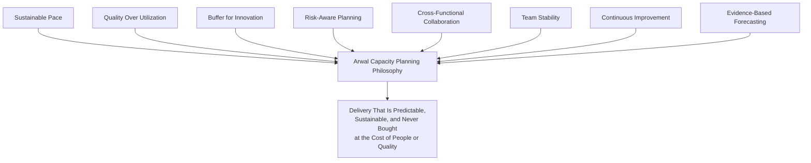

> **Callout — The One-Sentence Capacity Planning Philosophy**
> *"A capacity plan that only works when nothing goes wrong is not a plan — it is hope with a spreadsheet attached, and Arwal's citizens deserve better than hope."*

---

# Engineering Organization Model

Capacity planning presupposes a defined organizational shape. This section names the teams capacity is planned *for*; it does not redefine any team's decision authority, already fully owned by `ai-docs/29-engineering-governance-decision-authority.md`.

| Team | Function | Typical Composition | Capacity Character |
|---|---|---|---|
| **Product Teams** | Own a domain vertical (e.g., Local Services, Civic Services, Payments, Healthcare) end to end, per the Feature-First organization in `ai-docs/04-folder-guidelines.md`. | Backend, frontend, QA engineers, a Tech Lead, a paired Product Manager. | The largest share of Arwal's total capacity; planned per Product Domain Capacity below. |
| **Platform Team** | Owns `packages/*` shared libraries, CI/CD (`ai-docs/17-cicd-standards.md`), developer tooling, and cross-team infrastructure. | Senior/Principal engineers with broad system context. | A shared-services capacity pool, planned to serve every Product Team simultaneously — see Shared Services Capacity below. |
| **Security Team** | Security Review Board membership, threat modeling, and the security-classified review layer (`ai-docs/10-security-standards.md`). | Security engineers, often embedded liaisons into sensitive domains. | Protected, rarely reallocated capacity, per Critical Skill Coverage below. |
| **SRE** | Production reliability, on-call, observability (`ai-docs/18-observability-standards.md`), incident command. | SRE engineers, rotating on-call coverage. | Explicitly reserved Incident Reserve capacity, per Capacity During Incidents below. |
| **DevOps** | Deployment mechanics, environment topology (`ai-docs/16-deployment-standards.md`, `ai-docs/23-environment-strategy.md`). | Often merged with Platform/SRE at early team scale, split out as Arwal grows. | Shared-services capacity, planned jointly with Platform. |
| **AI Team** | Owns the AI Gateway Service, prompt management, and AI safety review, per `ai-docs/09-tech-stack.md`. | AI/ML-literate engineers, jointly accountable with Security for AI Risk (`ai-docs/30-engineering-risk-management-standards.md`). | A specialized skill pool — see Critical Skill Coverage. |
| **Government Integration Team** | Owns civic-services integrations, compliance-sensitive contracts, per `ai-docs/01-product-goals.md`'s Government Coordination. | Domain engineers with Government Compliance knowledge, per `ai-docs/33-engineering-knowledge-management-standards.md`. | Capacity planned with explicit awareness of external, non-negotiable government deadlines. |
| **Payments Team** | Owns the Payments module, wallet, and gateway integrations. | Engineers held to elevated Security Review (`ai-docs/10-security-standards.md`), Critical Risk Classification default. | Never planned below its Critical-tier minimum staffing floor, per Skill Matrix below. |
| **Healthcare Team** | Owns Healthcare Discovery & Booking, per `ai-docs/01-product-goals.md`. | Domain engineers plus a dedicated compliance liaison once the module reaches production maturity. | Planned with the identical Critical-tier rigor as Payments, given health-data sensitivity. |
| **Architecture Group** | Architecture Review Board membership, per `ai-docs/29-engineering-governance-decision-authority.md`. | Principal Engineers, senior Tech Leads on rotation. | A cross-cutting, time-boxed capacity draw from Product/Platform Teams, never a permanently separate headcount pool at Arwal's early scale. |
| **Shared Services (broader)** | Any capability serving every team — Identity, Notifications, Search, File Storage (`ai-docs/03-system-architecture-principles.md`). | A blend of Platform and dedicated shared-service owners as the org scales. | Planned identically to Platform Team's shared-pool model. |

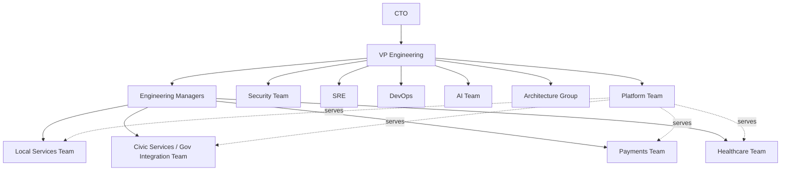

---

# Capacity Planning Levels

Capacity is planned at six nested horizons, each with a distinct time scale, owner, and precision expectation — mirroring the never-one-blunt-mechanism discipline already established throughout this handbook.

| Level | Horizon | Owner | Precision Expectation | Governing Cadence |
|---|---|---|---|---|
| **Annual Planning** | 12 months | CTO, VP Engineering, Engineering Leadership Council | Directional — headcount targets, team-formation plans, major skill investments. | Annual, aligned to Arwal's business planning cycle. |
| **Quarterly Planning** | One quarter | Engineering Managers, Tech Leads, Product Managers jointly | Committed — team-level allocation across roadmap, debt, and reserve, per Resource Allocation below. | Quarterly, aligned to `ai-docs/27-branching-release-strategy.md`'s cadence recalibration points. |
| **Sprint Planning** | One sprint (1–2 weeks) | Tech Lead, the team | Precise — individual assignment, per Workload Management below. | Per sprint. |
| **Incident Capacity** | Real-time, unplanned | Incident Commander, per `ai-docs/07-development-workflow.md` | Reserved in advance, drawn on demand. | Standing, per Capacity During Incidents below. |
| **Emergency Reserve** | Days to weeks | Engineering Manager, escalating to VP Engineering | A small, protected buffer for a genuinely unplanned, non-incident urgent need. | Standing, replenished quarterly. |
| **Innovation Allocation** | Ongoing, per sprint | The team, self-directed within its own budget | Loosely planned by design — see Innovation Allocation below. | Per sprint, within the Technical Debt Budget already established in `ai-docs/32-technical-debt-management-standards.md`. |

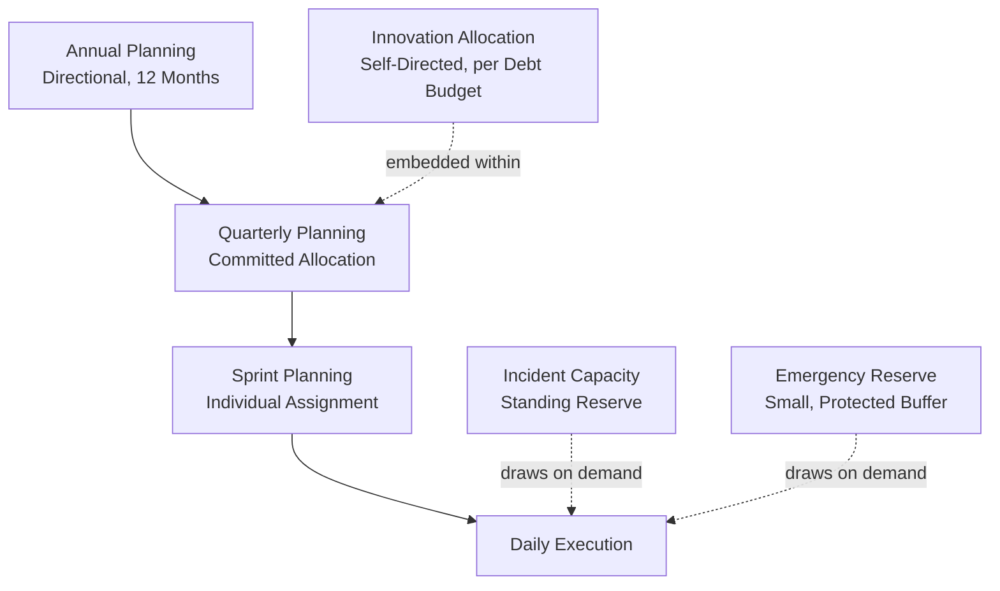

### Annual Planning

Annual Planning sets headcount and team-formation targets for the year, informed by the Engineering Forecasting section below and Arwal's business roadmap (`ai-docs/01-product-goals.md`). It is directional, not committed — a Quarterly Plan is what actually binds a team's capacity.

### Quarterly Planning

Every quarter, each team's Engineering Manager and Tech Lead, jointly with the paired Product Manager, allocate capacity across three buckets: **Roadmap Delivery**, **Technical Debt & Platform Investment** (never below the 15–20% floor already established in `ai-docs/32-technical-debt-management-standards.md`), and **Reserve** (Emergency + Incident, per below). This allocation is the binding capacity commitment every Sprint Plan within the quarter must respect.

### Sprint Planning

Per-sprint assignment of specific work to specific engineers, scoped against the team's already-committed Quarterly allocation — a Sprint Plan never silently exceeds its quarter's committed roadmap capacity to accommodate a new, unplanned request without an explicit re-negotiation, per Workload Escalation Thresholds below.

---

# Resource Allocation

### Team Assignment

Every engineer has exactly one primary team assignment at any time, recorded and current, per the identical Ownership Clarity principle already established in `ai-docs/35-engineering-onboarding-offboarding-standards.md`. A primary assignment is what a capacity plan is built against; anything beyond it is a Shared or Temporary Assignment, below.

### Shared Engineers

An engineer split across two teams (common for a Platform or Security specialist in a small organization) has their capacity split **explicitly, as a stated percentage**, never left as an informal "available when needed" arrangement — a 50/50 split is planned as 50% capacity against each team's Quarterly allocation, never as 100% capacity double-counted against both.

### Critical Projects

A project meeting the Critical Risk/Change classification already established in `ai-docs/30-engineering-risk-management-standards.md` and `ai-docs/31-change-management-governance-standards.md` receives a protected capacity allocation, confirmed before the project's Approval stage closes — a Critical project is never staffed opportunistically from whoever happens to be free.

### Cross-Team Initiatives

An initiative spanning multiple teams (e.g., a district → ward → zone partitioning rollout, per `ai-docs/14-database-design-guidelines.md`) is planned with an explicit capacity commitment from every contributing team, negotiated at Quarterly Planning, never assumed to be absorbed silently into each team's existing roadmap allocation.

### Temporary Assignments

A temporary reassignment (a Platform rotation, a short-term loan to an understaffed Critical project) follows the identical Temporary Delegation discipline already established in `ai-docs/29-engineering-governance-decision-authority.md` — an explicit start and end date, automatically reverting, never left open-ended.

### External Vendors

A contractor or vendor engineer's capacity is planned identically to an internal engineer's for allocation purposes, but is never counted toward a team's Critical-tier Skill Coverage minimum (below), per the identical Least Privilege and ownership-scoping discipline already established in `ai-docs/35-engineering-onboarding-offboarding-standards.md`'s Contractor & Vendor Offboarding section — a vendor engineer augments capacity; they never *are* the organization's sole holder of Critical knowledge.

### RACI — Resource Allocation Decisions

| Decision | Responsible | Accountable | Consulted | Informed |
|---|---|---|---|---|
| Team Assignment (new hire) | Engineering Manager | VP Engineering | Tech Lead | Team |
| Shared Engineer split | Engineering Managers (both teams) | VP Engineering | The shared engineer | Both teams |
| Critical Project staffing | Engineering Manager + Tech Lead | CTO (for Critical-tier) | Security/Architecture Board as applicable | Engineering Leadership Council |
| Cross-Team Initiative allocation | Engineering Managers (all teams) | VP Engineering | Product Managers | Engineering Leadership Council |
| Temporary Assignment | Engineering Manager (source team) | Engineering Manager (destination team) | The engineer | Both teams |
| External Vendor engagement | Engineering Manager | VP Engineering | Security Team, Legal | Engineering Leadership Council |

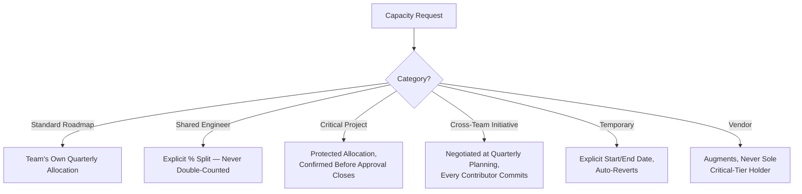

---

# Workload Management

### Maximum Sustainable Workload

Per Sustainable Pace above, a team's Sprint Plan is built against **no more than 80% of theoretical full-time capacity** per engineer as the default planning assumption — the remaining 20% absorbs meetings, code review of others' work, unplanned interruptions, and genuine deep-work variance. This is a planning default, not a productivity ceiling; it is what makes the *other* 80% actually deliverable.

### Parallel Work Limits

An engineer is assigned no more than **two concurrently in-progress, non-trivial work items** at any time — restating, at the individual level, the identical Small, Incremental Changes and WIP-limiting reasoning already established in `ai-docs/31-change-management-governance-standards.md`. A third item started before either of the first two reaches Review is a signal the assignment itself, not merely the engineer's pace, needs re-examining.

### Context Switching

Every context switch (moving between two unrelated modules or domains within a day) has a measurable cost, per the same reasoning already established for review latency in `ai-docs/26-code-review-standards.md`. Sprint Planning deliberately batches an individual's assignments within a single domain where possible, and a Tech Lead treats a pattern of frequent, forced context-switching as a workload health signal, per Metrics below.

### Meeting Allocation

No individual contributor's calendar carries more than **~20% of their working week in standing meetings** by default — a team or role requiring more (a Tech Lead, an Engineering Manager) is planned with a correspondingly reduced expectation of individual-contributor delivery output, never expected to deliver at a full engineer's pace *and* carry full leadership meeting load simultaneously.

### Deep Work Protection

Every team reserves a protected block (at minimum, one half-day per week, per team convention) with no standing meetings scheduled against it, mirroring the identical Deep Work Blocks already established in `ai-docs/07-development-workflow.md`'s Daily Engineering Workflow — this is a planning input, not a courtesy, since Maximum Sustainable Workload assumes it exists.

### On-Call Impact

An engineer on an active on-call rotation shift has their **Sprint Planning capacity reduced by a defined amount** (Arwal's default: 25% for a primary on-call week) — on-call is real work, and planning a full sprint's worth of feature delivery on top of a full on-call rotation is exactly the Chronic Overtime anti-pattern this document rejects, below.

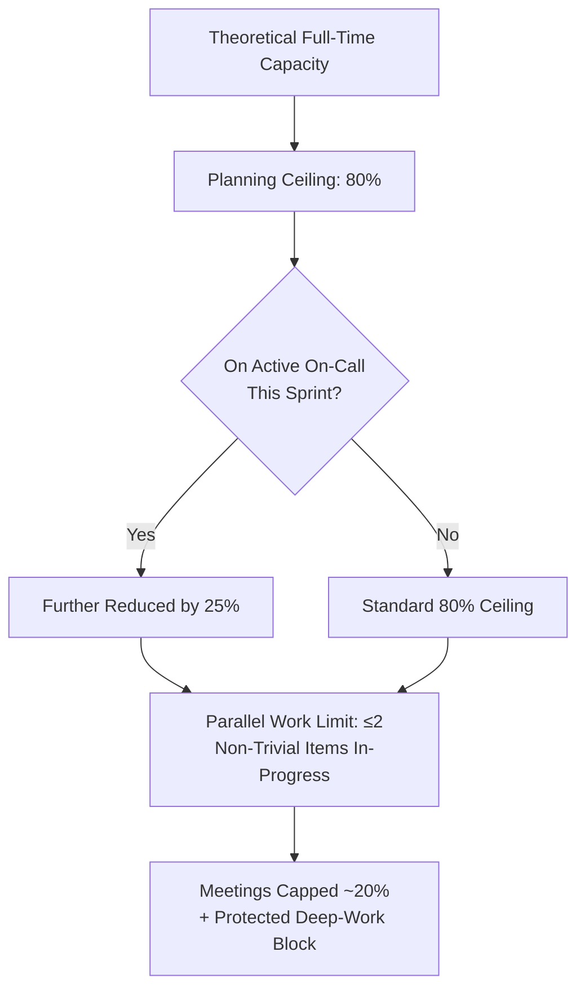

### Workload Escalation Thresholds

Per the governance improvement this document incorporates, the following **objective thresholds** require Engineering Manager review before additional work is accepted onto a team's plan — never left to individual engineer discretion to silently absorb:

| Threshold | Trigger | Required Action |
|---|---|---|
| **Sustained over-allocation** | A team's committed Sprint work exceeds the 80% Maximum Sustainable Workload ceiling for **two consecutive sprints**. | Mandatory Engineering Manager review before a third sprint is planned at the same level. |
| **Parallel work breach** | Any individual carries **3 or more** non-trivial concurrent work items for more than 3 business days. | Tech Lead re-prioritizes; the third item is deferred or reassigned. |
| **Unplanned work influx** | Unplanned, urgent requests consume **more than 20%** of a sprint's committed capacity. | Engineering Manager reviews and, if the pattern recurs across 2+ sprints, escalates to Quarterly re-planning. |
| **On-call + feature overlap** | An on-call engineer's sprint plan was not reduced per On-Call Impact above. | Blocking — Sprint Plan is corrected before the sprint starts. |
| **Meeting load breach** | An individual contributor's calendar exceeds 30% standing meetings. | Engineering Manager reviews and reduces, per Meeting Allocation above. |

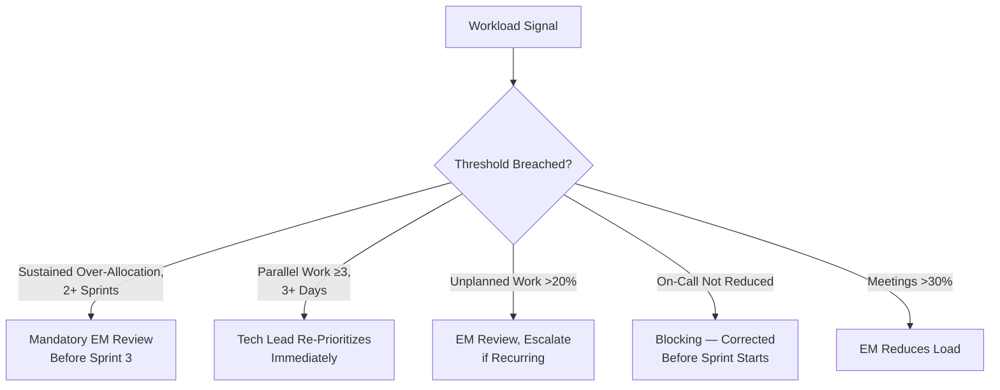

---

# Skill Matrix

### Skill Inventory

Every engineer's skills — technology, domain, and operational (on-call readiness, a Critical system's operational knowledge per `ai-docs/33-engineering-knowledge-management-standards.md`) — are inventoried and kept current, reviewed at the identical cadence as Periodic Access Recertification in `ai-docs/35-engineering-onboarding-offboarding-standards.md` (semi-annually).

### Critical Skill Coverage

Every skill required to operate a Critical-tier system (per `ai-docs/30-engineering-risk-management-standards.md`'s classification) has a minimum coverage floor of **at least two engineers currently proficient**, mirroring the identical Bus Factor Governance Threshold already established in `ai-docs/33-engineering-knowledge-management-standards.md` — a Bus Factor of 1 on a Critical skill is treated with the identical governance-defect severity that document already assigns it.

### Knowledge Redundancy

Capacity planning deliberately allocates time for a second and third engineer to build proficiency in a Critical-tier system, per Upskilling below — this is planned capacity, not a hoped-for side effect of normal work.

### Upskilling

Every engineer's Quarterly Plan includes an explicit, small, protected allocation (Arwal's default: **5% of capacity**) for skill development — training, a new domain's onboarding, a certification — distinct from and in addition to the Technical Debt Budget's Innovation Allocation.

### Mentoring

A senior engineer's capacity plan explicitly accounts for mentoring time (per `ai-docs/33-engineering-knowledge-management-standards.md`'s Mentorship and `ai-docs/35-engineering-onboarding-offboarding-standards.md`'s onboarding mentor role) — never assumed to be absorbed silently on top of their own full delivery load.

### Succession Planning

Per the governance improvement this document incorporates, succession planning applies to **both technical specialists and engineering leadership roles** — a Tech Lead, an Engineering Manager, and a Principal Engineer each require a confirmed, actively-developing successor candidate, identically to the Successor Owner requirement already established in `ai-docs/33-engineering-knowledge-management-standards.md` and `ai-docs/35-engineering-onboarding-offboarding-standards.md` for Critical-tier knowledge.

| Leadership Role | Succession Requirement | Review Cadence |
|---|---|---|
| **Tech Lead** | A named, actively-developing successor within the team, given progressively larger ownership. | Semi-annually. |
| **Engineering Manager** | A named successor candidate, typically a Tech Lead being developed toward people-management readiness. | Annually. |
| **Principal Engineer / Architect** | A named successor candidate on the Architecture Review Board rotation. | Annually. |
| **VP Engineering / CTO** | A documented leadership pipeline, reviewed by the Engineering Leadership Council. | Annually, as part of Annual Planning. |

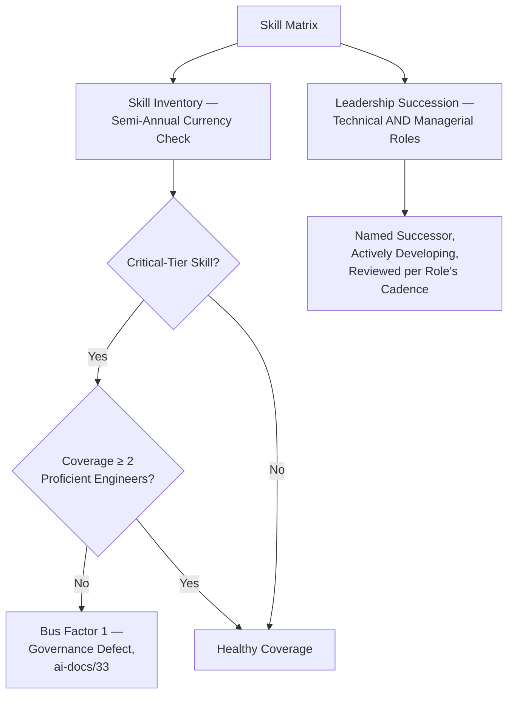

---

# Engineering Forecasting

### Delivery Forecasting

Every Quarterly Plan's roadmap commitment is forecast from Arwal's own historical velocity — story points, cycle time, or an equivalent measure per team convention — never from an aspirational target set independently of what the team has actually demonstrated it can deliver.

### Capacity Forecasting

Annual Planning forecasts total capacity across the coming year, accounting for planned hiring (per Engineering Growth Strategy below), expected attrition (using Arwal's own historical rate as the default assumption), and planned leave.

### Risk Forecasting

A forecast explicitly states the risks that could invalidate it — a Critical Bus Factor gap not yet resolved, a hiring pipeline dependent on a single, uncertain candidate — cross-referenced into the Risk Register per `ai-docs/30-engineering-risk-management-standards.md` where the forecast risk itself meets that document's threshold.

### Dependency Forecasting

A forecast for a Cross-Team Initiative explicitly states its dependency on another team's own forecast capacity — never assumed independently achievable when it is not.

### Staffing Forecasts

A forecast states, explicitly, the specific skill and headcount gap it depends on Engineering Growth Strategy (below) to close, and by when — a forecast that assumes an unfilled Critical role will simply be filled "sometime" is not a forecast, it is a placeholder.

### Forecast Validation

Per the governance improvement this document incorporates, **every Quarterly forecast is checked against actual delivery data at the close of the quarter it covered**, and the deviation is recorded explicitly — never silently absorbed into the next quarter's planning without comment.

| Deviation | Interpretation | Required Action |
|---|---|---|
| **Within ±15% of forecast** | Normal, expected variance. | None — forecast assumptions confirmed sound. |
| **Consistently optimistic by >15%, 2+ consecutive quarters** | A systematic bias in the forecasting method or inputs. | Mandatory review of forecasting assumptions by the Engineering Manager and Tech Lead; the method is corrected before the next Quarterly Plan is finalized. |
| **Consistently pessimistic by >15%, 2+ consecutive quarters** | Capacity is being under-committed, potentially starving the roadmap unnecessarily. | Review whether Reserve allocations are oversized relative to actual incident/emergency draw, per Metrics below. |
| **A single quarter's large, one-off deviation** | Likely attributable to a specific, identifiable event (a Critical incident, an unplanned departure). | Documented as context, not treated as a systemic forecasting failure on its own. |

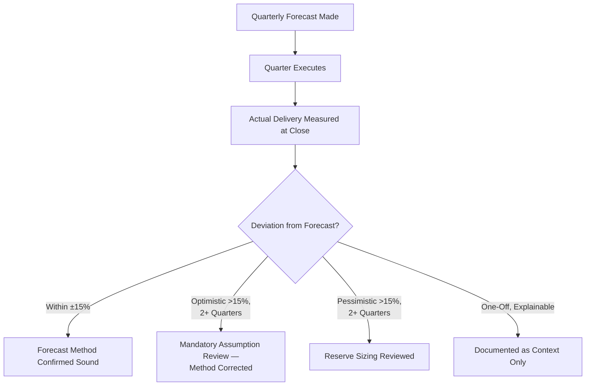

---

# Engineering Growth Strategy

### Hiring Strategy

Hiring targets are derived directly from Capacity Forecasting above and the Skill Matrix's Critical Skill Coverage gaps — never set independently of a demonstrated capacity or skill-coverage need. A hiring request cites the specific forecast gap or coverage floor it closes.

### Internal Promotions

A promotion into a leadership role (Tech Lead, Engineering Manager) is planned against the Succession Planning table above — a promotion pipeline is a capacity-planning input, not a separate, disconnected HR process.

### Team Expansion

A new team is formed only where Annual Planning has confirmed a genuine, sustained capacity need it cannot meet by expanding an existing team — mirroring the identical Evidence over Prediction discipline already established in `ai-docs/03-system-architecture-principles.md`, applied here to organizational structure rather than software architecture.

### Organizational Scaling

As Arwal's headcount grows toward the hundreds already anticipated in `ai-docs/29-engineering-governance-decision-authority.md`, the Engineering Organization Model above is itself revisited — a new domain team is formed following the identical Module Folder Template-style consistency already established in `ai-docs/04-folder-guidelines.md`'s Folder Evolution Strategy, applied to organizational units.

### Leadership Pipeline

Per Succession Planning above, Arwal maintains a standing, visible leadership pipeline — reviewed at Annual Planning by the Engineering Leadership Council, ensuring growth in headcount is matched by growth in the leadership capacity needed to manage it, never headcount added faster than the organization can actually lead it well.

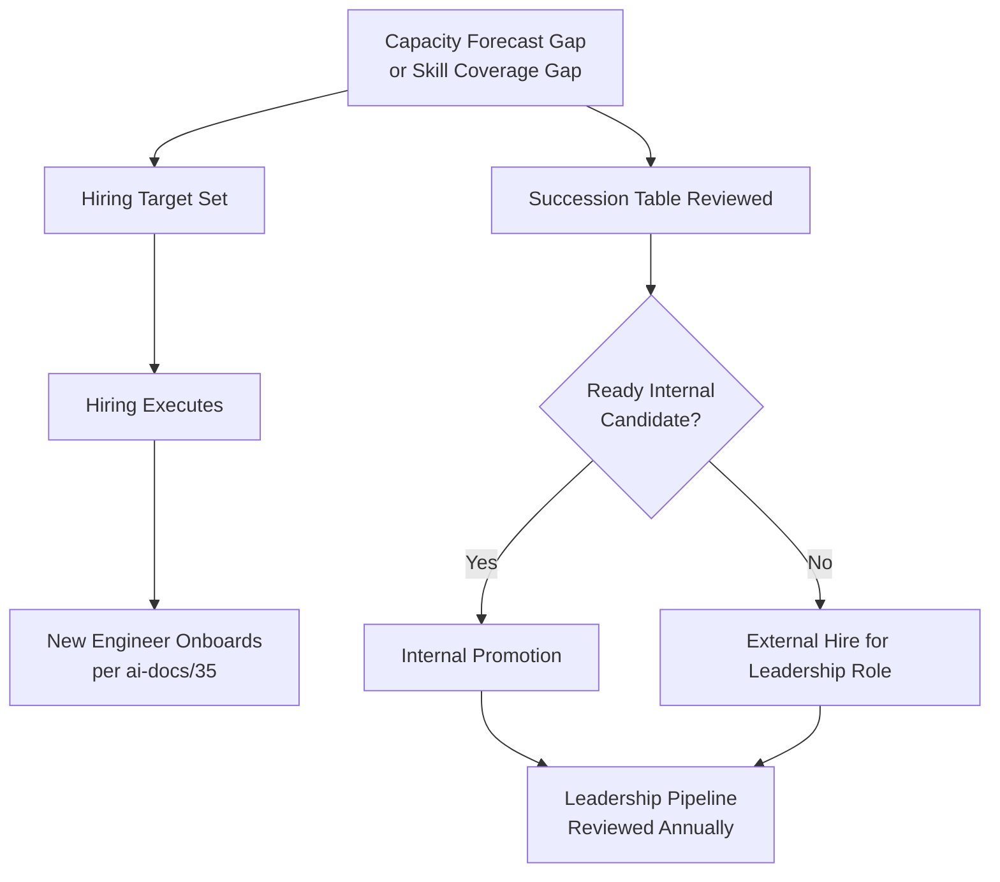

---

# Capacity During Incidents

### Incident Reserve

Every team's Quarterly Plan reserves an explicit percentage of capacity (Arwal's default: **10%**) for incident response — drawn against whenever an active Sev 1/Sev 2 incident, per `ai-docs/07-development-workflow.md`, requires it, never treated as "stealing" from the roadmap since it was already planned for.

### Priority Changes

During an active incident, per the Incident Commander's authority already established in `ai-docs/07-development-workflow.md` and `ai-docs/29-engineering-governance-decision-authority.md`, normal Sprint priorities are suspended for the responding engineers — this document adds no new incident-authority mechanic, it affirms that capacity, not merely priority, shifts accordingly and is tracked as drawn from the Incident Reserve.

### Resource Reallocation

Where an incident's demand exceeds the standing Incident Reserve, the Engineering Manager reallocates from the Emergency Reserve (below) before pulling from planned roadmap capacity — roadmap capacity is the last resource drawn, never the first.

### Crisis Staffing

A Critical, platform-wide incident (per `ai-docs/30-engineering-risk-management-standards.md`'s Critical classification) may temporarily draw capacity across team boundaries, coordinated by the Incident Commander and ratified by the Engineering Leadership Council, per the identical Emergency-classification authority already established in `ai-docs/29-engineering-governance-decision-authority.md` — this is the one circumstance where Team Stability above is deliberately, explicitly overridden, and only for the incident's duration.

### Recovery Planning

Following a Sev 1/Sev 2 incident, the affected team's next Sprint Plan explicitly accounts for post-incident recovery capacity (postmortem participation, immediate follow-up fixes) — never planned as if the incident's capacity draw ends the moment the incident is marked Resolved.

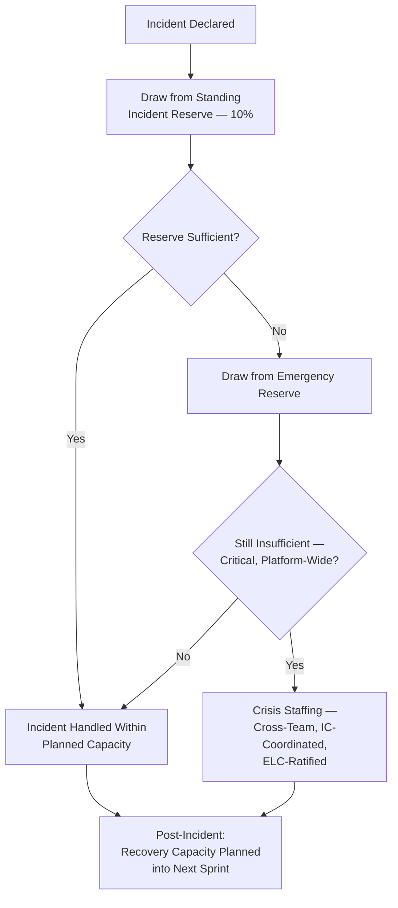

---

# Metrics

Per the Actionable Metrics principle already established in `ai-docs/18-observability-standards.md`, every metric below ties to a real question an Engineering Manager or the Engineering Leadership Council will actually ask.

| Metric | Definition | What a Regression Signals |
|---|---|---|
| **Team utilization** | Actual capacity consumed vs. the 80% planning ceiling. | Sustained utilization above 90% signals Sustainable Pace is being violated; sustained utilization well below 70% signals over-forecasted headcount or under-committed roadmap. |
| **Delivery predictability** | Percentage of Quarterly-committed roadmap items delivered as forecast. | A declining rate signals a Forecast Validation deviation requiring review. |
| **Engineering throughput** | Delivered value (features, debt items closed, per `ai-docs/32-technical-debt-management-standards.md`) per unit of capacity, tracked over time. | A declining trend at stable headcount signals a workload health or process friction problem, not merely a capacity shortfall. |
| **Capacity accuracy** | The Forecast Validation deviation percentage, per Engineering Forecasting above. | Consistent deviation beyond ±15% triggers the corrective action already defined there. |
| **Hiring effectiveness** | Time-to-fill for a forecast gap, and the new hire's Time-to-Productivity per `ai-docs/35-engineering-onboarding-offboarding-standards.md`. | A lengthening trend signals a hiring pipeline or onboarding capacity problem. |
| **Skill coverage** | Percentage of Critical-tier skills meeting the 2+ engineer coverage floor. | Any gap is a standing governance defect, per Skill Matrix above. |
| **Team stability** | Rate of unplanned team reassignment and attrition. | A rising rate signals Team Stability is eroding, directly threatening delivery predictability. |
| **Burnout indicators** | A composite signal — sustained over-allocation breaches (per Workload Escalation Thresholds), declining engagement-survey results, rising unplanned leave. | Any sustained rise is escalated immediately to the Engineering Manager, never treated as a lagging, low-priority signal. |

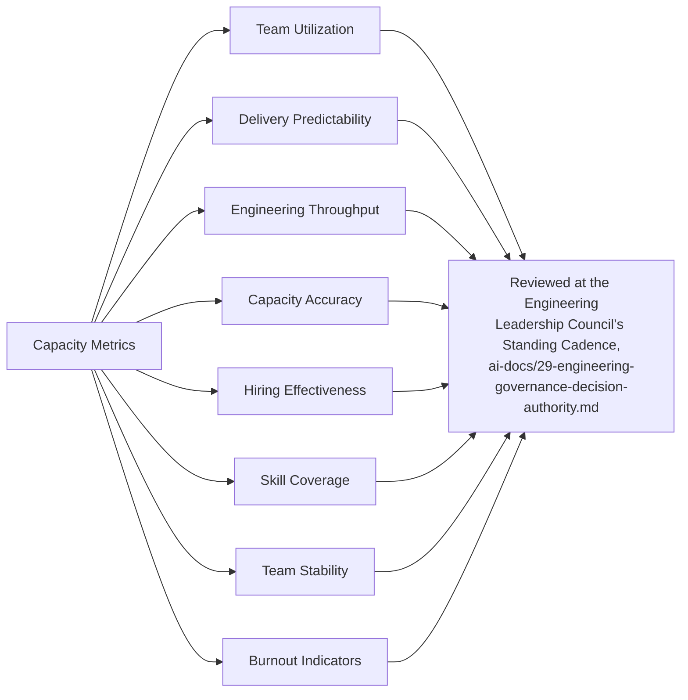

---

# AI-Assisted Capacity Planning

Consistent with the identical AI-assistance principle already established across every governance document in this handbook: **AI accelerates analysis, never authority.**

### Forecast Assistance

An AI tool may analyze historical velocity and staffing data to draft a candidate Quarterly or Annual capacity forecast — every such draft is a starting point for the Engineering Manager and Tech Lead to evaluate against Evidence-Based Forecasting above, never distributed or committed to as a plan without human review.

### Resource Analysis

An AI tool may surface a candidate Shared Engineer split, a Critical Project staffing gap, or a Cross-Team Initiative dependency conflict from raw allocation data — every surfaced candidate is verified by the relevant Engineering Manager before it changes an actual allocation.

### Workload Analysis

An AI tool may flag an individual or team pattern resembling a Workload Escalation Threshold breach before it is formally logged — a genuinely valuable early-warning capability, verified by the Tech Lead against the actual data before any corrective action is taken.

### Trend Detection

An AI tool may detect a Forecast Validation deviation trend, a declining Team Stability metric, or an emerging Burnout Indicator pattern earlier than a purely manual quarterly review would — every such detection is a lead for a human to investigate, never an automatic trigger for a personnel action.

### Human Oversight

No capacity plan, hiring decision, reallocation, or workload-escalation resolution is ever finalized on the basis of an AI tool's analysis alone. The named human Approval Authority per Resource Allocation's RACI table above remains fully accountable, regardless of how much AI assistance contributed to the underlying analysis — identical to the Human Oversight standard already established consistently across `ai-docs/24` through `ai-docs/35`.

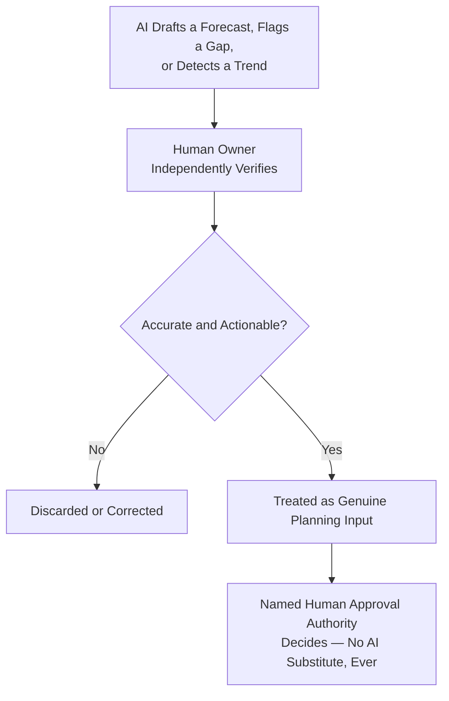

---

# Engineering Anti-Patterns

| Anti-Pattern | Description | Why It's Rejected |
|---|---|---|
| **100% Utilization Planning** | A team's Sprint Plan built against full theoretical capacity, with no margin. | Violates Maximum Sustainable Workload above; guarantees the plan is missed the moment any real-world friction occurs. |
| **Chronic Overtime** | Sustained delivery achieved only through repeated, unplanned extra hours. | Violates Sustainable Pace above; a delivery pace that depends on unpaid, unplanned extra effort is not sustainable and is a leading Burnout Indicator. |
| **Single Expert Dependency** | A Critical-tier skill or system held by exactly one person, with no succession plan. | Violates Critical Skill Coverage and Succession Planning above; the identical Bus Factor 1 governance defect already established in `ai-docs/33-engineering-knowledge-management-standards.md`. |
| **Permanent Firefighting** | A team whose Incident Reserve is consistently insufficient, forcing roadmap capacity to be drawn every sprint. | Signals either an under-provisioned Incident Reserve or an unaddressed Reliability Risk (`ai-docs/30-engineering-risk-management-standards.md`) — never treated as "just how this team operates." |
| **Excessive Multitasking** | An individual routinely carrying more than the Parallel Work Limit. | Violates Context Switching discipline above; measurably reduces both throughput and quality. |
| **Unrealistic Commitments** | A Quarterly roadmap commitment made without a genuine Delivery Forecast behind it. | Violates Evidence-Based Forecasting above; produces a Delivery Predictability metric that erodes trust in every future commitment. |
| **Hidden Work** | Unplanned, unlogged work absorbed silently by an engineer without being reflected in capacity metrics. | Violates Transparency, the identical principle already established throughout `ai-docs/24` through `ai-docs/34`; makes every capacity metric built on top of it inaccurate. |
| **Ignoring Burnout** | A declining Burnout Indicator trend observed but not acted on. | Violates Sustainable Pace and directly threatens Team Stability, Knowledge Continuity (`ai-docs/33`), and delivery predictability simultaneously. |

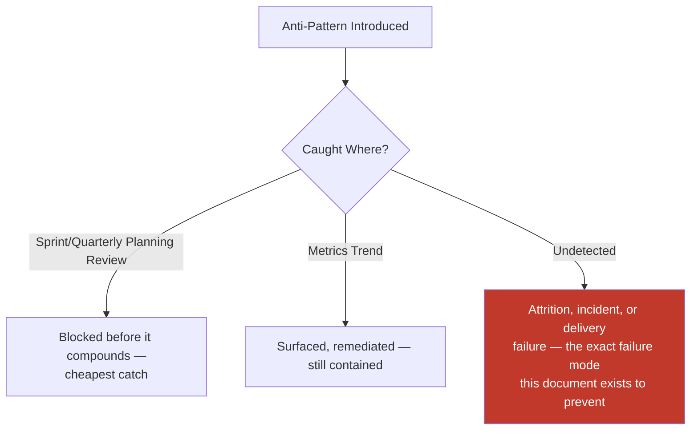

---

# Engineering Review Checklist

Every capacity plan — annual, quarterly, or sprint-level — is checked against the following before it is considered compliant:

- [ ] **Planning level correctly applied** — Annual, Quarterly, Sprint, Incident, Emergency, or Innovation, per Capacity Planning Levels above.
- [ ] **Maximum Sustainable Workload respected** — No individual or team planned above the 80% ceiling (further reduced for active on-call).
- [ ] **Parallel Work Limit respected** — No individual assigned more than 2 concurrent non-trivial items.
- [ ] **Technical Debt Budget honored** — 15–20% reserved, per `ai-docs/32-technical-debt-management-standards.md`, never silently displaced.
- [ ] **Incident and Emergency Reserves allocated** — Explicit, protected percentages set before roadmap capacity is committed.
- [ ] **Critical Skill Coverage confirmed** — Every Critical-tier skill meets the 2+ engineer floor, or a gap is logged and being actively closed.
- [ ] **Succession Planning current** — Both technical and leadership roles have a named, actively-developing successor, per Skill Matrix above.
- [ ] **Forecast grounded in evidence** — Delivery, Capacity, Risk, Dependency, and Staffing forecasts all cite historical or current data, never optimism alone.
- [ ] **Forecast Validation performed for the prior period** — Deviation calculated and, where it exceeds ±15% for 2+ consecutive quarters, a corrective action taken.
- [ ] **Workload Escalation Thresholds monitored** — No unresolved breach carried silently into a new planning period.
- [ ] **Cross-functional input obtained** — Product, Security, and SRE were genuinely consulted, per Cross-Functional Collaboration above.
- [ ] **AI-assisted analysis independently verified** — Any AI-surfaced forecast, gap, or trend fact-checked by the human owner before being relied upon.
- [ ] **No anti-pattern present** — No 100% utilization plan, chronic overtime, single-expert dependency, permanent firefighting, excessive multitasking, unrealistic commitment, hidden work, or ignored burnout signal.
- [ ] **No duplication of Governance, Risk Management, Knowledge Management, Communication, Onboarding/Offboarding, or Development Workflow standards** — Any such concern deferred entirely to its owning phase document, never redefined here.

A capacity plan failing any item above is not considered final until resolved — this checklist carries the same non-negotiable authority as every other review checklist established in the preceding thirty-six phase documents.

---

# Governance Review

### Quarterly Capacity Reviews

At the close of every quarter, each team's Engineering Manager and Tech Lead review actual capacity consumption against the committed plan, per Forecast Validation above, and confirm every Reserve was sized correctly relative to actual draw.

### Annual Organization Review

At Annual Planning, the Engineering Leadership Council reviews the entire Engineering Organization Model above — confirming team boundaries, shared-service pools, and headcount distribution still reflect Arwal's actual operational shape, correcting drift per the identical Folder Evolution Strategy reasoning already established in `ai-docs/04-folder-guidelines.md`.

### Staffing Audits

A periodic (at minimum quarterly) audit confirms every team's actual headcount and Shared Engineer splits match the Resource Allocation records — catching a silent, undocumented drift before it undermines every downstream capacity metric.

### Skill Audits

A periodic (at minimum semi-annual) audit confirms the Skill Inventory is current and every Critical Skill Coverage floor is genuinely met, not merely recorded as met historically.

### Forecast Accuracy Reviews

Per Forecast Validation above, every quarter's forecast is checked against actual delivery, with the specific corrective actions defined there applied automatically when the deviation threshold is breached — never left to individual judgment on whether to bother checking.

### Workload Health Reviews

At the same cadence as Quarterly Capacity Reviews, the Engineering Leadership Council reviews the aggregate Burnout Indicator and Team Stability metrics across every team simultaneously, specifically to catch a degrading pattern in one team before it produces attrition or an incident — mirroring the identical Portfolio-Level Review structure already established in `ai-docs/32-technical-debt-management-standards.md` and `ai-docs/33-engineering-knowledge-management-standards.md`.

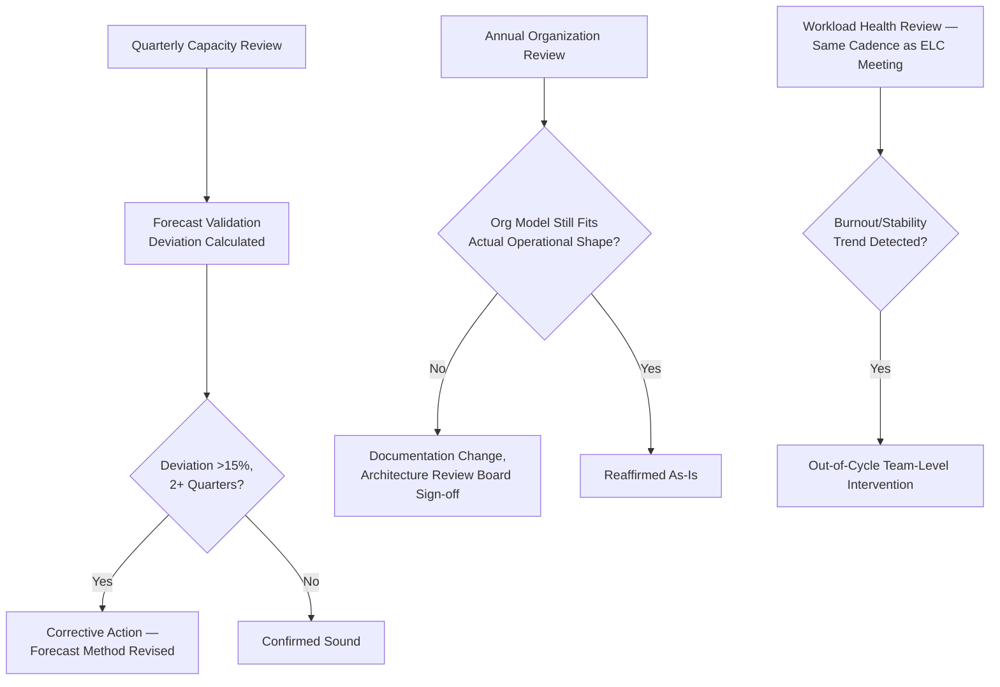

---

# Relationship to Previous Standards

### Project Vision

`ai-docs/00-project-vision.md` establishes the Sustainability Vision and the commitment to infrastructure built for a generation. This document is the operational discipline that keeps engineering capacity itself sustainable across that same generation-long horizon.

### Engineering Principles

`ai-docs/02-engineering-principles.md` establishes the Continuous Refactoring Budget and the founding Technical Debt Policy. This document's Innovation Allocation and Quarterly Planning bucket structure are the capacity-level execution of that founding commitment, never redefining the policy itself.

### Engineering Governance

`ai-docs/29-engineering-governance-decision-authority.md` owns the complete organizational decision-authority structure — every Approval Authority and Escalation path named in this document's RACI tables is drawn directly from that structure, never a new authority invented here.

### Risk Management

`ai-docs/30-engineering-risk-management-standards.md` owns the complete Risk Register and Risk Classification. A capacity or staffing gap this document identifies (a Critical Bus Factor of 1, an unresourced forecast) is logged into that document's Risk Register where it meets its threshold — this document never redefines risk-scoring mechanics.

### Knowledge Management

`ai-docs/33-engineering-knowledge-management-standards.md` owns Knowledge Ownership, Succession Planning's original mechanics, and the Bus Factor Governance Threshold. This document applies that same succession discipline explicitly to leadership roles and treats capacity for mentoring/knowledge-transfer as a planned, protected resource — never redefining that document's own framework.

### Communication Standards

`ai-docs/34-engineering-communication-standards.md` owns every channel and classification this document's capacity announcements, escalations, and reallocation notices are distributed through — this document never redefines a communication mechanic.

### Onboarding & Offboarding Standards

`ai-docs/35-engineering-onboarding-offboarding-standards.md` owns the complete hiring-to-departure lifecycle mechanics — Time-to-Productivity, Access Provisioning tiers, Ownership Transition. This document's Engineering Growth Strategy and Hiring Strategy feed that document's Pre-Onboarding Requirements directly, never duplicating its process.

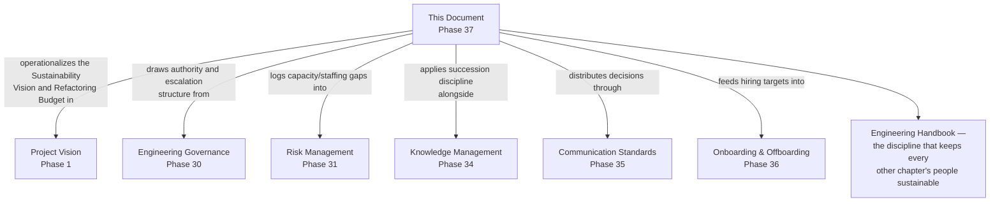

---

# Closing Statement

> **Callout — Closing Statement**
> Every preceding phase document described a standard for how Arwal is designed, built, secured, tested, deployed, governed, risk-managed, changed, kept solvent against debt, kept alive as knowledge, communicated, and staffed. This document describes the discipline that makes it possible to keep doing all of that — not just today, with a handful of founding engineers, but at Phase 250, with hundreds of engineers spread across Platform, Security, SRE, AI, Government Integration, Payments, and Healthcare teams, still delivering at a pace they can sustain and still protecting the time to do it well. Capacity is Arwal's most finite, most human resource, and the discipline of planning it deliberately — with real reserves for debt and incidents, real succession for critical knowledge and leadership, and real honesty about what a team can actually sustain — is what keeps the district's trust in Arwal from ever being purchased at the cost of the engineers building it. A platform this ambitious does not stay reliable by accident; it stays reliable because the people building it were never asked to run faster than they could run forever. Where a future phase must deviate from a standard stated here, that deviation is made explicitly — through this document's own Governance Review process, or a Strategic-classification ADR where the deviation is structural — never silently, and never by default.

This document, `ai-docs/36-engineering-capacity-planning-resource-management-standards.md`, is Phase 37 of approximately 300. Every capacity plan drafted, every team formed, every hire made, and every reserve drawn in the phases that follow is expected to satisfy the standards defined here, or to justify its deviation in writing.

**End of Phase 37 — `ai-docs/36-engineering-capacity-planning-resource-management-standards.md`**