# Engineering Career Development & Performance Management Standards

**Document:** `ai-docs/37-engineering-career-development-performance-management-standards.md`
**Project:** Arwal — The District Super App
**Stage:** 1 — Foundation
**Phase:** 38 — Engineering Career Development & Performance Management Standards
**Status:** Approved for Engineering Reference
**Audience:** CTO, VP Engineering, Engineering Managers, Tech Leads, Principal Engineers, HR/People Operations, Developers, Government Technical Partners

> **Callout — Purpose of This Document**
> `ai-docs/00-project-vision.md` through `ai-docs/36-engineering-capacity-planning-resource-management-standards.md` defined why Arwal exists and every enforceable discipline governing how it is designed, built, secured, governed, risk-managed, changed, documented, communicated, staffed, and capacity-planned. None of those documents answers a question that determines whether Arwal can staff itself with excellent engineers for the next 270-odd phases: **how does an engineer at Arwal actually grow — technically, professionally, and as a leader — and how is that growth recognized fairly, consistently, and without politics?** This document is that answer.

---

# Purpose of this Document

### Why Career Development Matters

Arwal's roadmap spans ~300 micro-phases and anticipates a team scaling from a handful of founding engineers to hundreds. A codebase this disciplined does not sustain itself — it is sustained by engineers who keep getting better at building it, who stay long enough to carry its institutional memory (`ai-docs/33-engineering-knowledge-management-standards.md`), and who trust that their growth is recognized on its merits. Career development is the discipline that keeps that trust real: a written, evidence-based, transparent system for how an engineer moves from their first PR to owning a domain, to leading a team, to shaping Arwal's technical direction.

### Why Performance Systems Exist

Per Accountability, already a load-bearing principle throughout `ai-docs/29-engineering-governance-decision-authority.md` and `ai-docs/30-engineering-risk-management-standards.md`, an organization that cannot fairly evaluate its own people cannot fairly evaluate anything else it does. A performance system exists to convert the sprawling, subjective question "is this person doing well?" into the same evidence-based, calibrated, citable discipline this handbook already applies to code review, architecture, and risk.

### Sustainable Engineering Growth

Per the Sustainability Vision already established in `ai-docs/00-project-vision.md` and the Sustainable Pace principle in `ai-docs/36-engineering-capacity-planning-resource-management-standards.md`, growth that burns people out is not growth Arwal can rely on for a generation-long mission. This document exists to make growth itself sustainable — paced, supported, and never purchased at the cost of psychological safety or long-term health.

### Organizational Excellence

A district's trust in Arwal is ultimately built by the people building Arwal. Organizational excellence is not a slogan — it is the compounding result of thousands of individual engineers each getting a little better, a little more capable, and a little more trusted every quarter, for years. This document is the operational mechanism for that compounding.

### Relationship with Preceding Documents

This document does not redefine Onboarding or Offboarding (`ai-docs/35-engineering-onboarding-offboarding-standards.md`), Capacity Planning (`ai-docs/36-engineering-capacity-planning-resource-management-standards.md`), Engineering Governance (`ai-docs/29-engineering-governance-decision-authority.md`), Risk Management (`ai-docs/30-engineering-risk-management-standards.md`), Knowledge Management (`ai-docs/33-engineering-knowledge-management-standards.md`), or Communication Standards (`ai-docs/34-engineering-communication-standards.md`) — every one of those is cited, never restated. This document's exclusive territory is the individual engineer's growth, evaluation, and advancement.

---

# Engineering Career Philosophy

Arwal's career development rests on eight commitments.

### Continuous Learning

No engineer's skill set is ever treated as "finished" — every role at every level carries an explicit expectation of ongoing growth, per Upskilling already established in `ai-docs/36-engineering-capacity-planning-resource-management-standards.md`. This exists because a technology landscape spanning ~300 phases will outpace any static skill set; the engineers who thrive are the ones whose learning never stops.

### Ownership

Career growth is a partnership, not something delivered *to* an engineer — every engineer owns their own trajectory, supported by a manager, a mentor, and a transparent framework, but never dependent on someone else noticing their growth for them. This exists because an engineer who waits passively for recognition is an engineer this document's transparency exists to make unnecessary.

### Technical Excellence

Growth is measured substantially by the quality, not merely the quantity, of an engineer's contribution — restating Engineering Excellence already established in `ai-docs/02-engineering-principles.md`. This exists because a career framework that rewards volume over quality would directly contradict every coding, review, and architecture standard already established elsewhere in this handbook.

### Collaboration

No level of seniority is measured by individual output alone — every level includes an explicit expectation of making others around them better, per Every Review Teaches Something already established in `ai-docs/26-code-review-standards.md`. This exists because a codebase this large is never built by isolated individual brilliance; it is built by people who deliberately raise everyone around them.

### Leadership at Every Level

Leadership is a behavior, not a title — a Software Engineer II who proactively unblocks a teammate is leading exactly as much, in that moment, as a Tech Lead running a design review. This exists because gating "leadership" behind a formal title trains engineers to wait for permission to lead, which directly undermines the Lowest Competent Decision Maker principle already established in `ai-docs/29-engineering-governance-decision-authority.md`.

### Long-Term Growth

Career decisions are evaluated against an engineer's multi-year trajectory, never a single quarter's optics — mirroring the identical Long-Term Thinking principle already established in `ai-docs/29-engineering-governance-decision-authority.md`. This exists because a career system optimized for short-term visibility produces engineers who chase visibility instead of building durable value.

### Fair Evaluation

Every evaluation is grounded in evidence, calibrated across managers, and free of favoritism — per Evidence-Based Decisions already established throughout this handbook. This exists because an unfair evaluation system is corrosive in a way no technical defect can match: it teaches an entire organization that merit does not actually matter.

### Transparency

Every engineer can see, in writing, exactly what is expected of their current level and the level above it — restating Transparency over Opacity already established in `ai-docs/00-project-vision.md`. This exists because an unwritten, "you'll know it when you see it" promotion bar is indistinguishable, from an engineer's perspective, from no bar at all — and breeds exactly the suspicion of favoritism this document exists to prevent.

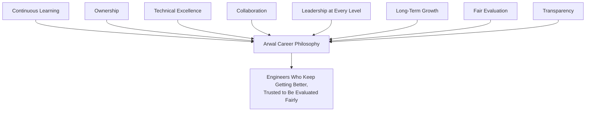

> **Callout — The One-Sentence Career Philosophy**
> *"An engineer's growth at Arwal should never depend on who they know, only on what they've done, how well they've done it, and how well the people around them were made better because of it."*

---

# Engineering Career Framework

Arwal offers two parallel, equally-prestigious tracks — Individual Contributor (IC) and Management/Leadership — per the governance improvement this document incorporates: **neither track outranks the other; both are valid, permanent career destinations, not a temporary stop before "graduating" into the other.**

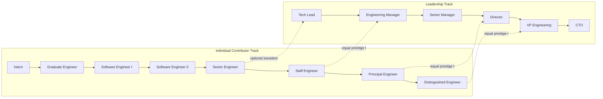

### Individual Contributor Track

| Level | Typical Scope | Expectations |
|---|---|---|
| **Intern** | A single, well-scoped task under close mentorship. | Learns the codebase, tools, and culture; contributes a small, real, reviewed change. |
| **Graduate Engineer** | A single module, closely mentored. | Completes onboarding (`ai-docs/35`) fully; ships correct, tested, reviewed code with guidance. |
| **Software Engineer I** | A single module, independently for routine work. | Delivers Low/Medium-tier changes (`ai-docs/31-change-management-governance-standards.md`) with minimal guidance; growing comfort with the full Testing Pyramid (`ai-docs/15-testing-standards.md`). |
| **Software Engineer II** | A module, with cross-module awareness. | Delivers Medium/High-tier changes independently; writes high-quality tests unprompted; gives substantive code review. |
| **Senior Engineer** | A domain, end to end. | Owns a module's technical quality and its README (`ai-docs/24-documentation-standards.md`); mentors SE I/II engineers; makes High-tier changes with light oversight. |
| **Staff Engineer** | Multiple domains, or one deeply complex domain. | Drives cross-module technical direction; a de facto Domain Expert reviewer (`ai-docs/26-code-review-standards.md`); regularly proposes ADR-worthy decisions. |
| **Principal Engineer** | The organization's technical direction. | Architecture Review Board membership (`ai-docs/29-engineering-governance-decision-authority.md`); owns Strategic/Architectural-classification technical judgment. |
| **Distinguished Engineer** | Arwal's technology, industry-wide. | Sets multi-year technical strategy; represents Arwal's engineering externally; mentors Principal Engineers. |

### Leadership Track

| Level | Typical Scope | Expectations |
|---|---|---|
| **Tech Lead** | One team's technical direction. | Domain Expert authority (`ai-docs/26`); Technical-classification decision authority (`ai-docs/29`); still writes code regularly. |
| **Engineering Manager** | One team's people and delivery. | Owns capacity planning (`ai-docs/36`), performance management for direct reports, hiring. |
| **Senior Manager** | Several teams. | Coordinates across Tech Leads/EMs; owns a domain's cross-team delivery predictability. |
| **Director** | A function or a set of domains. | Sits on the Engineering Leadership Council (`ai-docs/29`); owns multi-team strategy and staffing. |
| **VP Engineering** | All of Engineering. | Owns organizational health, the Decision Authority Matrix's health, and Arwal's engineering culture. |
| **CTO** | Technical strategy for Arwal as a whole. | Final Strategic-classification authority, per `ai-docs/29-engineering-governance-decision-authority.md`. |

> **Callout — No Forced Track Switch**
> An engineer is never required to move into management to be recognized for growth — a Staff or Principal Engineer is compensated, trusted, and respected identically to an Engineering Manager or Director at the equivalent organizational impact level. Forcing a strong IC into management to "reward" them is treated as a hiring/promotion anti-pattern, per Engineering Anti-Patterns below.

---

# Competency Framework

Every level above is assessed against eleven competency dimensions — never a single, undifferentiated "is this person good" judgment.

| Competency | What It Measures |
|---|---|
| **Technical Skills** | Depth and currency of language/framework/tooling proficiency, per `ai-docs/05-coding-standards.md` and `ai-docs/09-tech-stack.md`. |
| **System Design** | Ability to design a system meeting `ai-docs/03-system-architecture-principles.md`'s boundaries and `ai-docs/11-performance-standards.md`'s targets. |
| **Code Quality** | Consistent, demonstrated adherence to `ai-docs/05-coding-standards.md` without prompting. |
| **Architecture** | Judgment in drawing and defending a domain boundary, per `ai-docs/03-system-architecture-principles.md`. |
| **Communication** | Clarity, audience-awareness, and timeliness, per `ai-docs/34-engineering-communication-standards.md`. |
| **Mentoring** | Demonstrated, deliberate development of other engineers, per `ai-docs/33-engineering-knowledge-management-standards.md`'s Mentorship. |
| **Decision Making** | Evidence-based judgment under the Decision Authority Matrix, per `ai-docs/29-engineering-governance-decision-authority.md`. |
| **Leadership** | Influence without authority; raising the standard of work around them. |
| **Collaboration** | Quality of code review given, cross-team communication, per `ai-docs/26-code-review-standards.md`. |
| **Innovation** | Original, evidence-grounded proposals — a technical RFC, a debt-reduction strategy (`ai-docs/32`). |
| **Operational Excellence** | On-call effectiveness, incident response quality, runbook currency, per `ai-docs/18-observability-standards.md`. |

### Competency Matrix by Level (Illustrative)

| Level | Technical Skills | System Design | Mentoring | Decision Making |
|---|---|---|---|---|
| SE I | Applies existing patterns correctly | Follows an existing design | Receives mentoring | Executes decisions made by others |
| SE II | Applies patterns with judgment | Designs within a module | Occasionally mentors an intern | Makes Routine-classification decisions independently |
| Senior | Deep in one domain | Designs a module end to end | Regularly mentors SE I/II | Technical-classification decisions |
| Staff | Deep across domains | Designs cross-module systems | Mentors Seniors | Proposes ADR-worthy decisions |
| Principal | Sets technical direction | Designs platform-wide systems | Mentors Staff | Architecture Review Board authority |

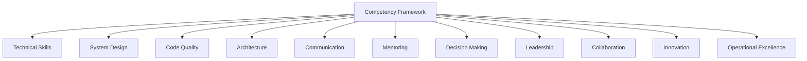

---

# Performance Management

### Review Cycle

Arwal runs a **semi-annual formal review**, embedded within a **continuous feedback** model — per the governance improvement this document incorporates, **feedback is never limited to an annual event**; a formal review is a checkpoint that summarizes and calibrates feedback already given continuously, never the first time an engineer hears it.

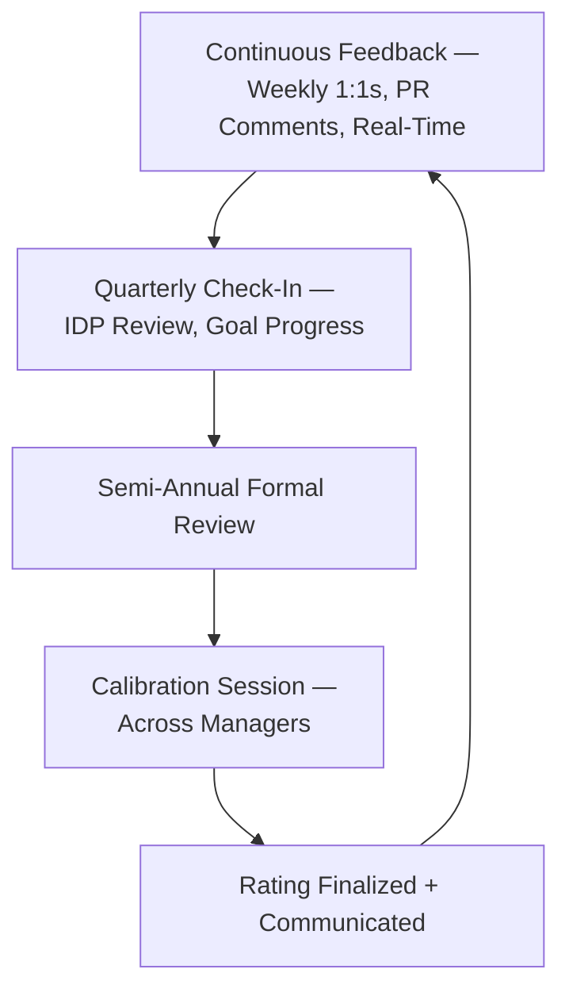

| Component | Cadence | Purpose |
|---|---|---|
| **Continuous feedback** | Ongoing | Real-time, specific, actionable — mirroring Review Quality Standards already established in `ai-docs/26-code-review-standards.md`. |
| **Weekly/biweekly 1:1s** | Weekly or biweekly | Manager-engineer relationship, blockers, early signal. |
| **Quarterly check-in** | Quarterly | IDP review (below), goal progress, capacity health per `ai-docs/36`. |
| **Semi-annual formal review** | Semi-annual | Self-assessment, manager assessment, peer feedback, calibrated rating. |
| **Career conversation** | At least annual, separate from the rating conversation | A dedicated, non-rating discussion about trajectory, deliberately decoupled from compensation to keep it genuinely developmental. |

### Self-Assessment

Every engineer writes their own assessment against the Competency Framework before their manager's assessment is finalized — never the reverse — so the manager's view is informed by, and can be checked against, the engineer's own perspective.

### Manager Assessment

A manager's assessment cites specific, verifiable evidence — a PR, an incident response, a mentoring instance — never a vague impression, per Evidence-Based Decisions.

### Peer Feedback

Every formal review incorporates feedback from at least two peers who worked directly with the engineer in the review period, selected jointly by the engineer and manager — never solicited only from people the manager already suspects will be favorable.

### Goal Tracking

Every engineer's goals (technical, leadership, learning) are tracked from the prior cycle's IDP (below) and explicitly revisited at each Quarterly check-in — a goal set once and never revisited is treated as an anti-pattern, below.

---

# Individual Development Plans

Every engineer maintains an **Individual Development Plan (IDP)** — a living document, reviewed **no less than quarterly**, per the governance improvement this document incorporates.

| IDP Component | Content |
|---|---|
| **Learning goals** | A specific skill or knowledge area, tied to a competency gap or a growth ambition. |
| **Technical goals** | A concrete technical contribution — e.g., own a module's migration to a new pattern. |
| **Leadership goals** | A specific leadership behavior to practice — running a design review, mentoring a junior engineer. |
| **Certifications/training** | Any structured external or internal training relevant to the engineer's goals. |
| **Stretch assignments** | A deliberately challenging assignment, sized to grow a specific competency, per `ai-docs/36-engineering-capacity-planning-resource-management-standards.md`'s Upskilling allocation. |

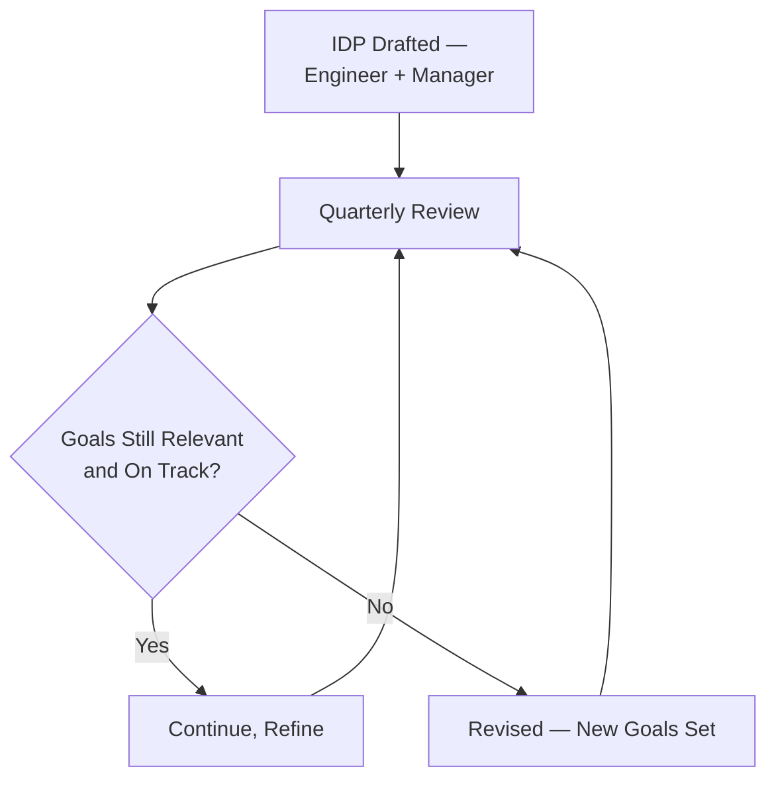

---

# Promotion Standards

### Promotion Readiness

A promotion is never based on tenure alone — per the governance improvement this document incorporates, **promotions are evidence-based**, assessed against the Competency Matrix for the target level, with a sustained, demonstrated pattern (not a single standout instance) across at least two review cycles.

### Evidence Required

| Evidence Category | Example |
|---|---|
| **Sustained scope** | Consistently operating at the target level's scope for 2+ cycles, not a single project. |
| **Peer corroboration** | Multiple peers independently describing the same growth. |
| **Concrete artifacts** | Merged PRs, ADRs authored (`ai-docs/25`), incidents led, mentees grown. |
| **Manager endorsement** | The manager's own assessment, itself calibrated. |

### Promotion Committee

A promotion above Senior Engineer / Tech Lead is reviewed by a **Promotion Committee** — the sponsoring manager plus at least two additional calibrated managers/Principals with no direct reporting relationship to the candidate, mirroring the identical Conflict of Interest / Separation of Duties discipline already established in `ai-docs/30-engineering-risk-management-standards.md` and `ai-docs/31-change-management-governance-standards.md`.

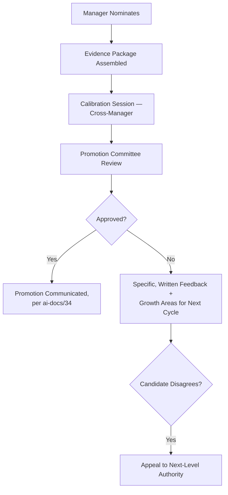

### Fairness

Every promotion decision is checked against the same calibration session applied to every other candidate in that cycle, per Calibration below — a promotion is never decided in isolation by a single manager.

### Appeals

A declined candidate may appeal to the Promotion Committee's next-level authority (a Director, or the VP Engineering) — the appeal is reviewed against the same evidence standard, never overturned on relationship or seniority alone.

### Documentation

Every promotion decision — approved or declined — is recorded with its supporting evidence and its Committee's reasoning, retained per the identical Archive, Never Delete discipline already established for ADRs.

---

# Mentorship Program

Builds directly on top of the Mentorship practice already established in `ai-docs/33-engineering-knowledge-management-standards.md`'s Knowledge Sharing — this document governs the program's structure, never redefining that document's knowledge-transfer mechanics.

| Element | Standard |
|---|---|
| **Mentor assignment** | Every engineer below Senior has an assigned mentor; assignment considers skill-gap fit, never proximity alone. |
| **Mentor responsibilities** | Regular 1:1s, code walkthroughs, sponsorship in visibility opportunities. |
| **Mentoring expectations** | A Senior-and-above engineer's IDP includes an explicit mentoring goal, per the governance improvement's Recognition emphasis below. |
| **Reverse mentoring** | A junior engineer explicitly mentors a senior one on a specific emerging skill (a new tool, a fresh perspective) — recognized with equal weight to traditional mentoring. |
| **Cross-team mentoring** | Encouraged for a Staff/Principal candidate to demonstrate organization-wide impact beyond their own team. |

---

# Leadership Development

| Path | Preparation |
|---|---|
| **Future Tech Leads** | Shadowing an existing Tech Lead's Domain Expert review duties; leading a design review under supervision. |
| **Engineering Managers** | A structured people-management training track; co-managing 1:1s with an existing manager before taking direct reports. |
| **Principal Engineers** | Rotation onto the Architecture Review Board as a non-voting participant before full membership. |
| **Executive leadership preparation** | Director/VP candidates participate in Engineering Leadership Council sessions (`ai-docs/29`) as observers before joining formally. |

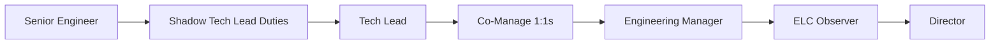

---

# Performance Improvement

### Coaching

The first response to a performance gap is coaching — specific, frequent feedback and support, never a formal process, per Psychological Safety below.

### Improvement Plans

Where coaching alone has not closed a sustained, evidenced gap, a formal **Performance Improvement Plan (PIP)** is used — specific, measurable, time-boxed criteria, with genuine support (pairing, reduced scope, training) provided throughout.

### Support

Every PIP names the specific support the engineer will receive — never a plan that states only what is expected with no resourcing to achieve it.

### Follow-up

Progress is reviewed at least biweekly during a PIP — never left to a single check-in at the plan's end.

### Success Criteria

Every PIP states, explicitly and in advance, what success looks like — an ambiguous PIP is treated as an anti-pattern, below.

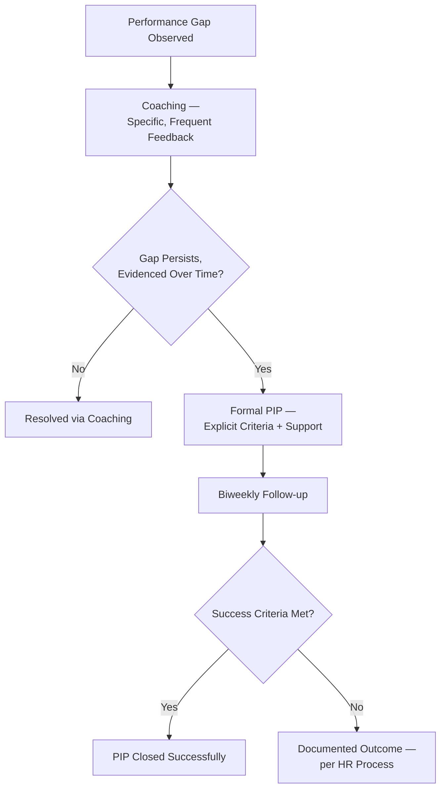

---

# Recognition

Per the governance improvement this document incorporates, recognition explicitly rewards **collaboration, documentation, mentoring, operational excellence, and long-term platform improvements — not only feature delivery.**

| Recognized Category | Example |
|---|---|
| **Technical achievements** | A well-designed, well-tested, high-impact system. |
| **Mentoring** | A documented pattern of growing other engineers. |
| **Innovation** | A novel, evidence-backed proposal adopted via ADR. |
| **Reliability** | Sustained on-call excellence, incident MTTR improvement. |
| **Team contribution** | Consistently strong code review, unblocking teammates. |
| **Knowledge sharing** | A widely-used runbook, a well-attended technical talk, per `ai-docs/33-engineering-knowledge-management-standards.md`. |
| **Documentation** | A module README or ADR that measurably reduced onboarding friction. |
| **Operational excellence** | A rehearsed, accurate disaster-recovery runbook. |

---

# Metrics

| Metric | Definition | What a Regression Signals |
|---|---|---|
| **Promotion success rate** | Percentage of nominated candidates approved. | An extreme in either direction signals miscalibrated nomination or evaluation. |
| **Internal mobility** | Rate of internal transfers/promotions vs. external hiring for the same role. | A declining rate signals a weak growth pipeline. |
| **Learning participation** | Percentage of engineers with an active, current IDP. | A declining rate signals the quarterly-review discipline is not being honored. |
| **Mentorship coverage** | Percentage of eligible engineers with an assigned mentor. | A gap signals a Knowledge Debt risk forming, per `ai-docs/32`. |
| **Employee growth** | Average competency-level progression per year. | A stagnating trend signals systemic under-investment. |
| **Retention** | Voluntary attrition rate, tracked against Burnout Indicators in `ai-docs/36`. | A rising rate is a direct signal of career-system failure. |
| **Performance distribution** | Rating spread across the organization. | A distribution skewed unrealistically high signals rating inflation; skewed low signals miscalibration or morale risk. |
| **Leadership pipeline** | Ratio of ready successors to current leadership roles, per `ai-docs/36`'s Succession Planning. | A shrinking ratio is an active governance defect. |

---

# AI-Assisted Career Development

Consistent with the identical AI-assistance principle already established across every governance document in this handbook: **AI accelerates analysis and suggestion, never authority.**

An AI tool may suggest a candidate learning resource, flag a competency gap from a pattern of code review feedback, or draft a first-pass IDP goal — every such suggestion is a draft for the engineer and manager to evaluate, never auto-applied. No performance rating, promotion decision, or PIP outcome is ever finalized on the basis of an AI tool's assessment alone; the named human manager and Promotion Committee remain fully accountable, identical to the Human Oversight standard already established consistently across `ai-docs/24` through `ai-docs/36`.

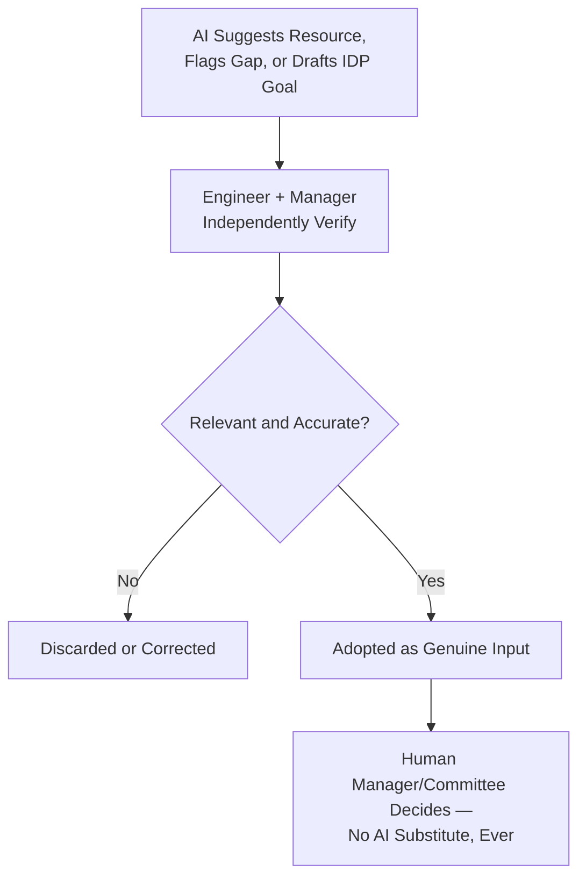

---

# Engineering Anti-Patterns

| Anti-Pattern | Description | Why It's Rejected |
|---|---|---|
| **Promotion by tenure** | "They've been here long enough" as the sole justification. | Violates Evidence-Based Assessment; time alone is not evidence of competency growth. |
| **Favoritism** | A decision shaped by personal relationship rather than evidence. | Violates Fair Evaluation; the fastest way to destroy trust in the entire framework. |
| **Hero culture** | Rewarding dramatic, individual firefighting over quiet, consistent excellence. | Violates Collaboration and Sustainable Pace (`ai-docs/36`); incentivizes risk-taking that manufactures its own emergencies. |
| **Knowledge hoarding** | An engineer withholding understanding to appear indispensable. | Directly violates `ai-docs/33-engineering-knowledge-management-standards.md`'s Shared Ownership; penalized, never rewarded, in review. |
| **Ignoring mentorship** | A Senior+ engineer with no mentoring activity, unaddressed. | Violates the Mentorship expectation baked into every Senior+ competency matrix above. |
| **Unclear expectations** | A level with no written competency bar. | Violates Transparency above; this document's entire purpose. |
| **Annual-only feedback** | An engineer's first substantive feedback arriving at their formal review. | Violates Continuous Feedback above; a rating should never be a surprise. |
| **Punishing failure instead of learning** | A well-reasoned, well-tested experiment that didn't work out treated as a performance mark against the engineer. | Violates Psychological Safety and the identical Blameless Postmortems principle already established in `ai-docs/00-project-vision.md` and `ai-docs/07-development-workflow.md`. |

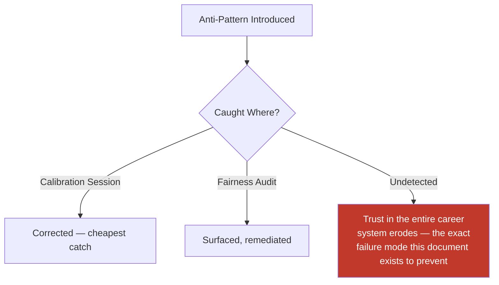

---

# Engineering Review Checklist

- [ ] **Career track correctly identified** — IC or Leadership, per the engineer's own stated preference, never assumed.
- [ ] **Level expectations documented and shared** — The engineer can see, in writing, their current level's and next level's bar.
- [ ] **IDP current** — Reviewed within the last quarter, per Individual Development Plans above.
- [ ] **Continuous feedback occurring** — Not deferred to the formal review alone.
- [ ] **Self, manager, and peer input all present** — For every formal review.
- [ ] **Promotion evidence-based** — Sustained scope, peer corroboration, concrete artifacts, never tenure alone.
- [ ] **Calibration session held** — Across managers, before any rating or promotion is finalized.
- [ ] **Mentorship coverage confirmed** — Every eligible engineer has an assigned mentor.
- [ ] **Recognition reflects the full value set** — Collaboration, documentation, mentoring, and operational excellence, not only feature delivery.
- [ ] **PIP, if applicable, has explicit success criteria and real support** — Never ambiguous or unresourced.
- [ ] **AI-assisted suggestions independently verified** — Never trusted as a final decision.
- [ ] **No anti-pattern present** — Per Engineering Anti-Patterns above.
- [ ] **No duplication of Onboarding, Capacity Planning, Governance, Risk, Knowledge, or Communication standards** — Deferred entirely to their owning documents.

---

# Governance Review

| Review | Cadence | Owner |
|---|---|---|
| **Quarterly career reviews** | Quarterly | Engineering Manager + engineer, per IDP above. |
| **Annual framework review** | Annual | Engineering Leadership Council — confirms level bars and competencies still fit Arwal's actual technical and organizational shape. |
| **Promotion audits** | Per cycle | HR/People Operations + a Principal/Director — samples promoted and declined cases for consistency. |
| **Fairness audits** | Semi-annual | HR + Engineering Leadership Council — checks rating and promotion distribution for disparity across teams/demographics. |
| **Mentorship reviews** | Quarterly | Engineering Managers — confirms coverage and quality, per Metrics above. |
| **Leadership pipeline reviews** | Annual | Engineering Leadership Council, jointly with `ai-docs/36-engineering-capacity-planning-resource-management-standards.md`'s Succession Planning review. |

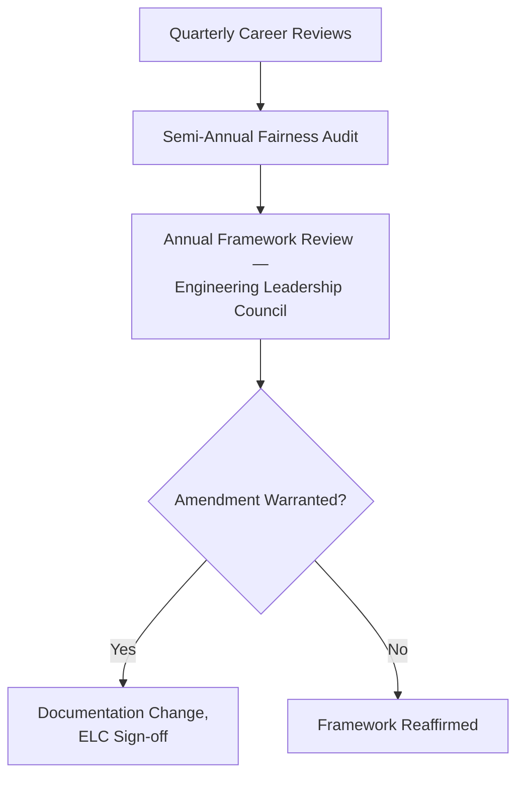

---

# Relationship with Previous Standards

- **`ai-docs/00-project-vision.md`** — This document operationalizes the Sustainability Vision and Guiding Principles at the level of an individual engineer's career.
- **`ai-docs/02-engineering-principles.md`** — Engineering Excellence and the founding culture of ownership and accountability are the technical bar this document's Competency Framework measures against.
- **`ai-docs/33-engineering-knowledge-management-standards.md`** — Owns Mentorship's knowledge-transfer mechanics in full; this document governs the program structure and its recognition, never redefining the mechanics.
- **`ai-docs/34-engineering-communication-standards.md`** — Every promotion announcement, recognition, and review communication flows through that document's channels and classification, never a new channel invented here.
- **`ai-docs/35-engineering-onboarding-offboarding-standards.md`** — This document's career framework begins where that document's onboarding ends (Probation Completion) and its offboarding may follow a PIP's unsuccessful outcome — the two are sequential, never duplicative.
- **`ai-docs/36-engineering-capacity-planning-resource-management-standards.md`** — Owns Succession Planning's original mechanics and the Innovation/Upskilling capacity allocation this document's IDPs draw against.
- **`ai-docs/29-engineering-governance-decision-authority.md`** — Every Approval Authority and escalation path this document's Promotion Committee and Appeals process use is drawn directly from that structure.
- **`ai-docs/30-engineering-risk-management-standards.md`** — A career-system failure (a pipeline gap, a fairness-audit finding) that meets that document's threshold is logged into its Risk Register, never tracked redundantly here.

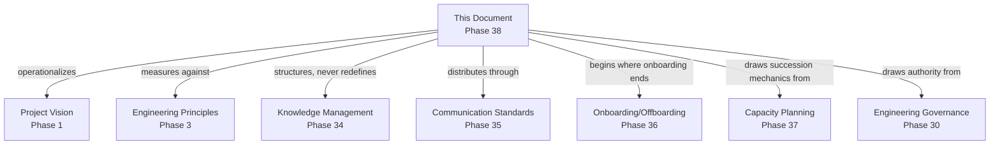

---

# Closing Statement

> **Callout — Closing Statement**
> Every preceding phase document described how Arwal builds, secures, governs, and sustains its systems. This document describes how Arwal sustains the people who do all of that — because a district's trust in Arwal, held across ~300 micro-phases and however many years those phases span, is ultimately a bet on the engineers who keep showing up, keep learning, and keep making each other better. A career system that is fair, transparent, evidence-based, and generous with feedback is not a departure from engineering discipline — it is engineering discipline, applied to the organization's most important asset. Where a future phase must deviate from a standard stated here, that deviation is made explicitly — through this document's own Governance Review process, or a Strategic-classification ADR where the deviation is structural — never silently, and never by default.

This document, `ai-docs/37-engineering-career-development-performance-management-standards.md`, is Phase 38 of approximately 300. Every review conducted, every promotion decided, and every IDP written in the phases that follow is expected to satisfy the standards defined here, or to justify its deviation in writing.

**End of Phase 38 — `ai-docs/37-engineering-career-development-performance-management-standards.md`**