# Engineering Portfolio & Program Management Standards

**Document:** `ai-docs/38-engineering-portfolio-program-management-standards.md`
**Project:** Arwal — The District Super App
**Stage:** 1 — Foundation
**Phase:** 39 — Engineering Portfolio & Program Management Standards
**Status:** Approved for Engineering Reference
**Audience:** CTO, VP Engineering, Directors, Technical Program Managers, Engineering Managers, Tech Leads, Product Managers, Platform/Security/SRE/AI/Government Integration/Payments/Healthcare Teams, Government Technical Partners

> **Callout — Purpose of This Document**
> `ai-docs/00-project-vision.md` through `ai-docs/37-engineering-career-development-performance-management-standards.md` defined why Arwal exists and every enforceable discipline governing how it is designed, built, secured, governed, risk-managed, changed, documented, communicated, staffed, capacity-planned, and grown as a career. None of those documents answers a question that only appears once Arwal is running dozens of initiatives across dozens of teams simultaneously: **which initiatives get built, in what order, coordinated how, and how does leadership know — honestly, continuously — whether the whole portfolio is actually on track?** This document is that answer.

---

# Purpose of this Document

### Why Portfolio Governance Matters

A single well-run team can coordinate itself informally. A hundred engineers spread across Local Services, Civic Services, Payments, Healthcare, Platform, Security, SRE, and AI teams — each capable of shipping independently, per the Modular Monolith's own promise in `ai-docs/03-system-architecture-principles.md` — cannot. Without a portfolio layer, every team optimizes locally, dependencies collide invisibly, and Arwal's finite engineering capacity is spent on whatever was loudest that quarter rather than what the district actually needs next. Portfolio governance exists to make "what are we building, and why, across the whole organization" a single, deliberately answered question — not an emergent accident of a hundred independent local decisions.

### Why Program Management Matters

Many of Arwal's most consequential initiatives — a government-partnership integration, a payments-gateway migration, a multi-district expansion — span more than one team and more than one quarter. A feature-level workflow (`ai-docs/07-development-workflow.md`) and a single Change Request (`ai-docs/31-change-management-governance-standards.md`) are the right unit of governance for a bounded piece of work; neither is designed to coordinate six teams delivering interdependent pieces of the same outcome over two quarters. Program management is the discipline that exists specifically for that shape of work.

### Predictable Multi-Team Delivery

Per Delivery Predictability already established in `ai-docs/36-engineering-capacity-planning-resource-management-standards.md`, a single team's forecast is only as trustworthy as the dependencies it relies on from other teams. A citizen, a merchant, and a government partner all depend on Arwal keeping commitments that frequently span team boundaries — this document exists to make that cross-team predictability a governed property, not a hope.

### Strategic Alignment

Per `ai-docs/01-product-goals.md`'s Business Goals and `ai-docs/00-project-vision.md`'s founding mission, every initiative Arwal funds should trace back to a real business, civic, or platform need. Strategic alignment is what prevents Arwal's ~300-micro-phase roadmap from drifting into a collection of locally-interesting engineering projects disconnected from what the district actually needs from Arwal next.

### Relationship with Preceding Documents

This document does not redefine Capacity Planning (`ai-docs/36-engineering-capacity-planning-resource-management-standards.md`), Career Development (`ai-docs/37-engineering-career-development-performance-management-standards.md`), Engineering Governance (`ai-docs/29-engineering-governance-decision-authority.md`), Risk Management (`ai-docs/30-engineering-risk-management-standards.md`), Change Management (`ai-docs/31-change-management-governance-standards.md`), Development Workflow (`ai-docs/07-development-workflow.md`), or Communication Standards (`ai-docs/34-engineering-communication-standards.md`) — every one of those is cited, never restated. This document's exclusive territory is the **portfolio and program** layer sitting above all of them: which initiatives exist, how they are prioritized and sequenced, how cross-team dependencies are tracked, and how leadership sees the whole picture.

---

# Portfolio Management Philosophy

Arwal's portfolio management rests on eight commitments.

### Business Value First

Every initiative in the portfolio is justified by a specific, stated business, civic, or platform value — never by engineering interest alone, restating Business Alignment already established in `ai-docs/32-technical-debt-management-standards.md`. This exists because a portfolio optimized for what is technically interesting, rather than what the district needs, is a portfolio that fails its founding mission regardless of how well-engineered the result is.

### Strategic Alignment

Every initiative is traceable to a goal already established in `ai-docs/01-product-goals.md` or a documented, real operational need. This exists because a large organization inevitably generates good ideas faster than it can fund them — alignment is the filter that keeps the portfolio coherent rather than merely busy.

### Incremental Delivery

Every initiative is decomposed into deliverable increments, mirroring Small, Incremental Changes already established in `ai-docs/31-change-management-governance-standards.md` and Small Deliverables in `ai-docs/07-development-workflow.md`, applied here at the portfolio scale. This exists because a large, monolithic initiative that only delivers value at its very end is both the highest-risk and the least-correctable shape of work a portfolio can fund.

### Transparency

Every initiative's status, priority, and health is visible to the whole organization, per Transparency over Opacity already established throughout this handbook. This exists because a portfolio managed behind closed doors cannot be trusted by the teams executing it, and cannot be corrected by anyone who can see a problem the portfolio owners cannot.

### Evidence-Based Prioritization

Prioritization decisions are grounded in the scoring model defined in Portfolio Prioritization below — never in the seniority or persistence of whoever is advocating for an initiative, mirroring Evidence-Based Decisions already established in `ai-docs/29-engineering-governance-decision-authority.md`.

### Sustainable Execution

The portfolio never plans against 100% of Arwal's engineering capacity — it respects the Maximum Sustainable Workload ceiling and the Technical Debt Budget already established in `ai-docs/36-engineering-capacity-planning-resource-management-standards.md` and `ai-docs/32-technical-debt-management-standards.md`. This exists because a portfolio sized against theoretical maximum capacity is a portfolio that guarantees the sustainability failures those documents already exist to prevent.

### Cross-Functional Ownership

No initiative of Program scale is owned by engineering alone — Product, Security, and SRE input is a standing requirement, per Cross-Functional Collaboration already established in `ai-docs/36-engineering-capacity-planning-resource-management-standards.md`. This exists because a portfolio decision made by engineering in isolation from the functions that must live with its consequences is a decision made with incomplete information.

### Continuous Review

The portfolio is never a static, once-a-year document — it is reviewed and rebalanced on a defined, recurring cadence, per Continuous Improvement already established throughout `ai-docs/30` through `ai-docs/37`. This exists because a portfolio's inputs (business priority, delivered evidence, discovered risk) change constantly, and a portfolio that is not continuously re-evaluated against reality drifts silently out of relevance.

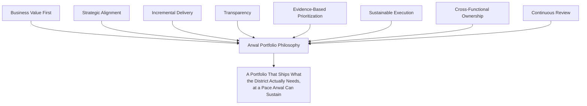

> **Callout — The One-Sentence Portfolio Philosophy**
> *"A portfolio that cannot say, with evidence, why this initiative and not that one, is not a portfolio — it is a wish list with a Gantt chart attached."*

---

# Portfolio Structure

Every unit of planned work belongs to exactly one level of a seven-tier hierarchy — never blended or used interchangeably, per the identical Consistency discipline already established throughout this handbook.

| Level | Definition | Typical Duration | Typical Owner |
|---|---|---|---|
| **Portfolio** | The complete, organization-wide set of everything Arwal's engineering is currently funding. | Standing, continuously reviewed. | CTO / VP Engineering, per Program Governance below. |
| **Program** | A coordinated set of Projects delivering one large, cross-team strategic outcome. | Multiple quarters. | A Technical Program Manager (TPM) + Executive Sponsor. |
| **Project** | A bounded, single- or few-team body of work delivering a specific capability. | One quarter to a few quarters. | An Engineering Manager or Tech Lead. |
| **Initiative** | The portfolio-tracked unit that Portfolio Prioritization (below) actually scores and ranks — typically equivalent to a Project, occasionally to a whole Program for scoring purposes. | Varies. | The initiative's named Owner, per Program Governance. |
| **Epic** | A large, trackable slice of a Project's work, decomposed into individually deliverable pieces. | Weeks to one quarter. | Tech Lead. |
| **Milestone** | A specific, dated, observable checkpoint within a Project or Program — never a vague "roughly here" marker. | A point in time. | The Project/Program owner. |
| **Workstream** | A parallel track of related work within a Program, owned by one contributing team. | Matches the Program's duration. | The contributing team's Tech Lead. |

### Relationships

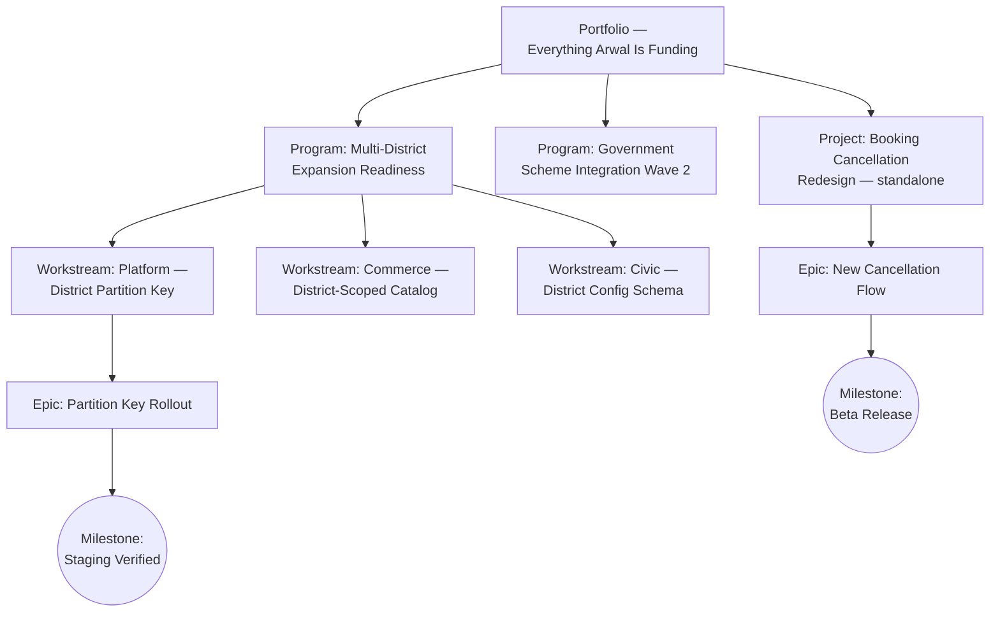

A **Program** is composed of multiple **Workstreams**, each owned by a single contributing team; each Workstream is decomposed into **Epics**; each Epic is decomposed into the same `feature/*`/`bugfix/*` branches already fully governed by `ai-docs/27-branching-release-strategy.md` and reviewed per `ai-docs/26-code-review-standards.md` — this document never redefines that execution layer. A standalone **Project** not part of any Program follows the identical Epic → branch structure without a Workstream layer.

---

# Program Governance

### Program Ownership

Every Program has exactly one named **Executive Sponsor** (a Director, VP Engineering, or CTO, per the Decision Authority Matrix already established in `ai-docs/29-engineering-governance-decision-authority.md`) and one named **Technical Program Manager (TPM)** — never a diffuse "the teams involved" ownership model.

### Technical Program Managers

A TPM owns a Program's cross-team coordination, dependency tracking (per Dependency Management below), and status reporting (per Executive Reporting below) — a TPM does **not** hold Technical-classification decision authority within any contributing team's domain, per the Decision Authority Matrix already established in `ai-docs/29-engineering-governance-decision-authority.md`; that authority remains with each Workstream's own Tech Lead.

### Executive Sponsors

An Executive Sponsor is accountable for the Program's strategic justification remaining valid throughout its life, resolves a cross-program conflict escalated per Cross-Program Conflict Resolution below, and is the Program's Approval Authority for a scope change meeting the Roadmap Governance thresholds below.

### Cross-Team Leadership

Every Workstream's Tech Lead reports Workstream-level status to the Program's TPM on the cadence established in Delivery Governance below — this document adds no new reporting mechanic beyond specifying its cadence and audience; the content of a status update follows `ai-docs/34-engineering-communication-standards.md`'s Operational Communication standards.

### Steering Committees

Every Program above a defined size threshold (Arwal's default: three or more contributing teams, or a duration exceeding two quarters) convenes a **Steering Committee** — the Executive Sponsor, the TPM, every contributing Workstream's Tech Lead, and the paired Product Manager — meeting at the cadence established in Delivery Governance below.

### Program Governance RACI

| Decision | Responsible | Accountable | Consulted | Informed |
|---|---|---|---|---|
| Program charter approval | TPM | Executive Sponsor | Contributing Tech Leads, Product | Engineering Leadership Council |
| Workstream scope definition | Contributing Tech Lead | TPM | Domain Expert reviewers | Steering Committee |
| Cross-team dependency resolution | TPM | Executive Sponsor | Contributing Tech Leads | Steering Committee |
| Program pause/stop decision | Executive Sponsor | CTO/VP Engineering | TPM, Steering Committee | All Engineering |
| Program status reporting | TPM | Executive Sponsor | Contributing Tech Leads | Engineering Leadership Council |

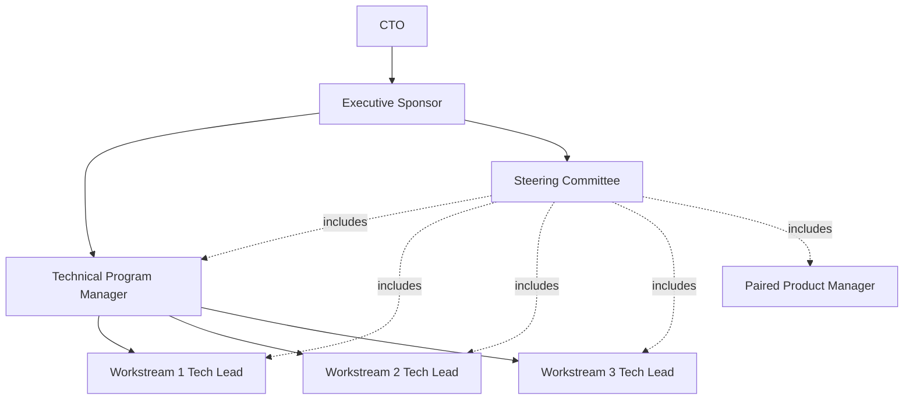

---

# Portfolio Prioritization

### Prioritization Categories

Per the explicit portfolio capacity allocation this document incorporates as a governance improvement, every quarter's total engineering capacity is allocated **before** individual initiatives are ranked within their category — never ranked as one undifferentiated list where a new feature silently outcompetes a compliance obligation for the same capacity.

| Category | Default Allocation Band | Rationale |
|---|---|---|
| **New Features / Customer Value** | 45–55% | The primary driver of `ai-docs/01-product-goals.md`'s Reach and Engagement goals. |
| **Technical Debt & Platform Investment** | 15–20% | The floor already established in `ai-docs/32-technical-debt-management-standards.md`, never displaced by feature pressure. |
| **Operational Work** | 10–15% | Reliability, on-call follow-through, and the Incident/Emergency Reserves already established in `ai-docs/36-engineering-capacity-planning-resource-management-standards.md`. |
| **Compliance & Regulatory** | 5–10%, expanding on demand | Government-partnership and regulatory obligations, per `ai-docs/01-product-goals.md`'s Government Coordination Risk — never optional, never traded away for feature velocity. |
| **Innovation & Exploration** | 5–10% | `experiment/*` and `spike/*` work, per `ai-docs/27-branching-release-strategy.md`, and the Innovation Allocation already established in `ai-docs/36-engineering-capacity-planning-resource-management-standards.md`. |

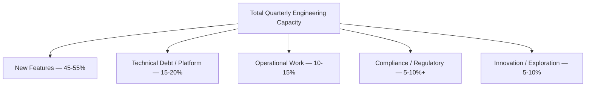

### Initiative Scoring Model

Per the standardized scoring model this document incorporates, every candidate initiative is scored 1–5 against five weighted factors before it is eligible for roadmap placement — mirroring the identical scoring discipline already established in `ai-docs/22-dependency-management-standards.md`'s Dependency Selection Criteria and `ai-docs/32-technical-debt-management-standards.md`'s Priority Score, applied here at the initiative level.

| Factor | Weight | Question It Answers |
|---|---|---|
| **Business Value** | 25% | How much citizen-facing, commercial, or civic value does this unlock? |
| **Engineering Effort** | 20% (inverse — lower effort scores higher) | How much capacity does this genuinely require, per `ai-docs/36-engineering-capacity-planning-resource-management-standards.md`'s forecasting discipline? |
| **Risk Reduction** | 20% | Does this close a High/Critical item in the Risk Register (`ai-docs/30-engineering-risk-management-standards.md`) or the Technical Debt Register (`ai-docs/32-technical-debt-management-standards.md`)? |
| **Strategic Alignment** | 20% | Does this trace directly to a goal in `ai-docs/01-product-goals.md`? |
| **Customer Impact** | 15% | How many citizens, merchants, or government partners does this affect, and how directly? |

```
Initiative Score = (Business Value × 0.25) + ((6 − Effort) × 0.20) + (Risk Reduction × 0.20)
                    + (Strategic Alignment × 0.20) + (Customer Impact × 0.15)
```

A Compliance-category initiative bypasses this scoring model's ranking function entirely — its priority is set by its external deadline, per Roadmap Governance below, never competed against a discretionary feature for the same slot.

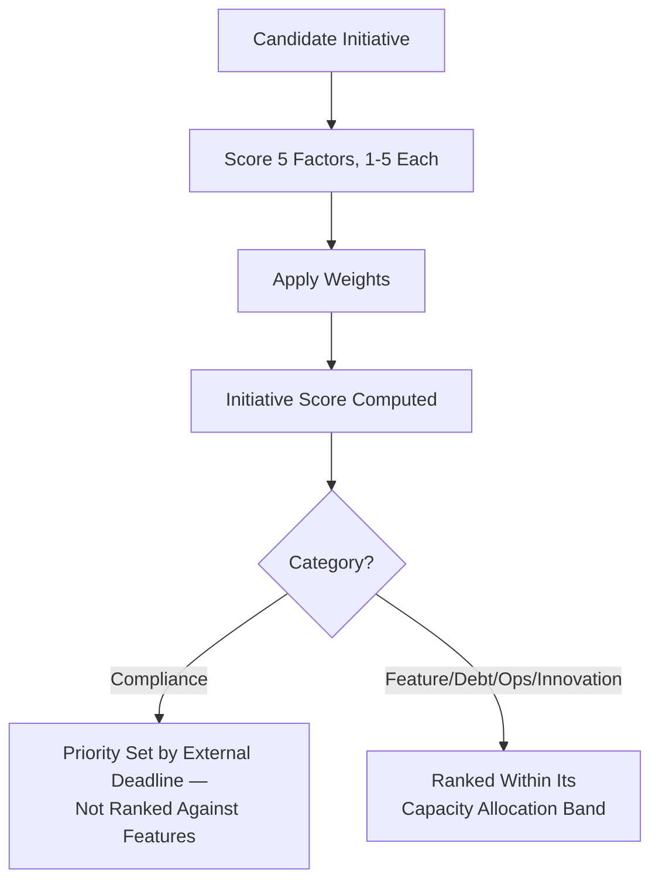

### Prioritization Decision Flow

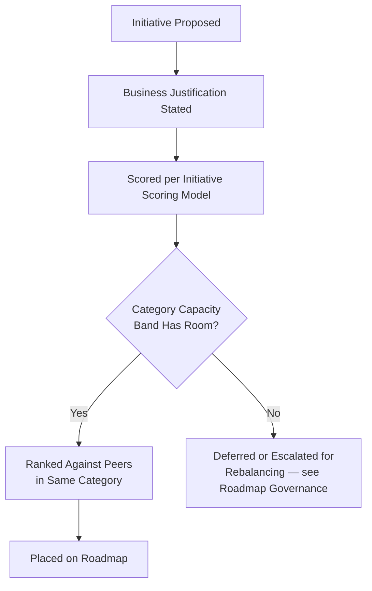

---

# Roadmap Governance

### Roadmap Levels

| Level | Horizon | Precision | Owner | Review Cadence |
|---|---|---|---|---|
| **Annual Roadmap** | 12 months | Directional — themes and Programs, not committed dates. | CTO, VP Engineering, Engineering Leadership Council | Annual, aligned to `ai-docs/36-engineering-capacity-planning-resource-management-standards.md`'s Annual Planning. |
| **Quarterly Roadmap** | One quarter | Committed — specific Initiatives, ranked, capacity-allocated. | Engineering Managers, TPMs, paired Product Managers | Quarterly, aligned to `ai-docs/27-branching-release-strategy.md`'s cadence recalibration. |

### Quarterly Portfolio Rebalancing

Per the governance improvement this document incorporates, **every quarter's roadmap is rebalanced against the prior quarter's measured delivery outcomes** — never carried forward on assumption alone. Rebalancing inputs are drawn directly from Portfolio Metrics below and Forecast Validation already established in `ai-docs/36-engineering-capacity-planning-resource-management-standards.md`.

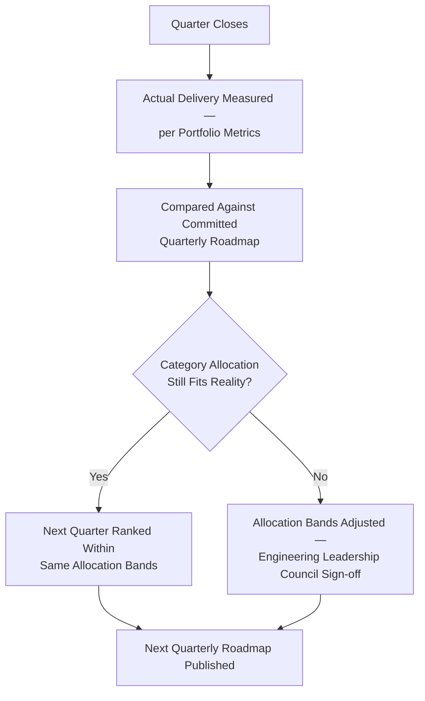

### Roadmap Reviews

A Quarterly Roadmap is reviewed at its midpoint (a lightweight health check, per Delivery Governance below) and at its close (the rebalancing exercise above) — never left unreviewed between publication and the next quarter's planning.

### Scope Adjustments

A scope adjustment to an already-committed Quarterly Roadmap item follows the identical Change Classification discipline already established in `ai-docs/31-change-management-governance-standards.md`, applied at the initiative level: a Low-impact adjustment (a two-week slip with no downstream dependency) requires only the initiative Owner's and TPM's sign-off; a High/Critical-impact adjustment (a scope cut affecting a government-partnership commitment) requires Executive Sponsor and, where a Program is affected, Steering Committee sign-off.

### Change Approval

| Adjustment Impact | Approval Authority |
|---|---|
| Low — no downstream dependency affected | Initiative Owner + TPM |
| Medium — one dependent team affected | + The dependent team's Tech Lead |
| High — multiple teams or a Program milestone affected | Executive Sponsor + Steering Committee |
| Critical — a government-partnership or regulatory commitment affected | + CTO/VP Engineering, per `ai-docs/29-engineering-governance-decision-authority.md`'s Compliance classification |

### Example Roadmap Excerpt

| Initiative | Category | Score | Owning Team(s) | Target Quarter | Status |
|---|---|---|---|---|---|
| District-scoped booking cancellation redesign | Feature | 3.9 | Local Services | Q3 | On Track |
| PgBouncer pool-saturation remediation | Technical Debt | 4.2 | Platform | Q3 | On Track |
| PMKISAN scheme integration (Wave 2) | Compliance | Deadline-set | Civic Services, Government Integration | Q3–Q4 | At Risk (Government Partner API delay) |
| District → ward partition key rollout | Platform Investment | 4.0 | Platform, Commerce, Civic | Q3–Q4 (Program) | On Track |
| AI civic-assistant prompt safety hardening | Innovation | 3.4 | AI Team | Q4 | Not Started |

---

# Dependency Management

### Cross-Team Dependencies

Every dependency between two teams' Workstreams or Projects is tracked explicitly in the Portfolio Dependency Register — never assumed to be visible informally, mirroring the identical Dependency Analysis discipline already established in `ai-docs/31-change-management-governance-standards.md`'s Change Planning, applied here at the portfolio scale.

### Portfolio Dependency Register

| Field | Description |
|---|---|
| **Dependency ID** | A permanent, sequential identifier (`DEP-0001`), never reused. |
| **Providing Team** | The team whose deliverable the dependency requires. |
| **Consuming Team** | The team blocked or affected until the dependency is resolved. |
| **Description** | What is specifically needed, and by when. |
| **Criticality** | Low / Medium / High / Critical, per the identical Risk Classification tiers already established in `ai-docs/30-engineering-risk-management-standards.md`. |
| **Status** | `Identified` / `Committed` / `In Progress` / `At Risk` / `Blocked` / `Resolved`. |
| **Target Resolution** | The date the providing team has committed to. |
| **Escalation Path** | Named, per Dependency Escalation below. |

### Critical Dependencies

A dependency classified Critical (blocking a Program milestone, a government-partnership deadline, or a citizen-critical release) receives standing visibility on the Portfolio Dependency Heat Map, per the governance improvement below — never tracked only inside one team's own backlog.

### Blocking Issues

A dependency whose Status reaches `Blocked` (the providing team cannot meet the Target Resolution) triggers the identical escalation cadence already established for a missed SLE in `ai-docs/32-technical-debt-management-standards.md` — surfaced immediately, never discovered only at the next scheduled review.

### Dependency Escalation

| Criticality | Escalation Trigger | Escalates To |
|---|---|---|
| Low | Missed target with no downstream Program impact | Consuming team's Tech Lead reviews, no escalation required. |
| Medium | Missed target affecting one dependent Project | TPM (if within a Program) or the consuming Engineering Manager. |
| High | Missed target affecting a Program milestone | Steering Committee, per Program Governance above. |
| Critical | Missed target affecting a government-partnership or citizen-critical commitment | Executive Sponsor + Engineering Leadership Council, per `ai-docs/29-engineering-governance-decision-authority.md`'s Cross-Team Disagreement path. |

### Dependency Tracking

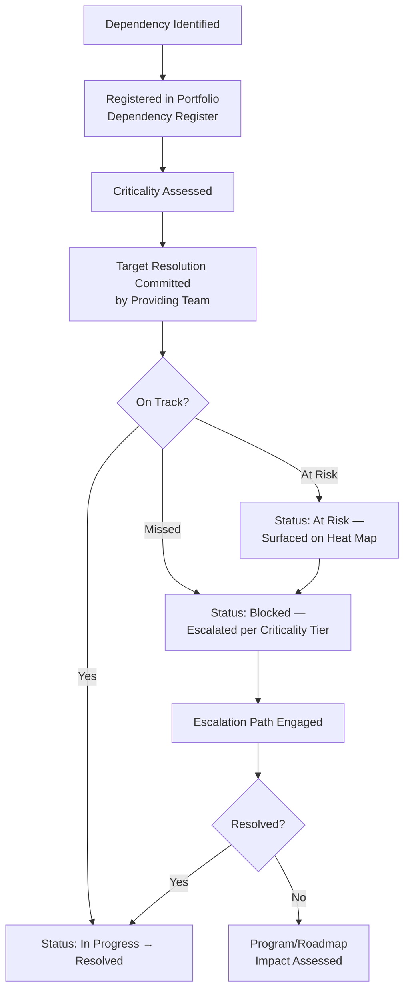

### Portfolio Dependency Heat Map

Per the governance improvement this document incorporates, a **Dependency Heat Map** — every currently open High/Critical dependency, plotted by Criticality against Days Until Target Resolution — is maintained as a standing, visible artifact, reviewed at every Delivery Governance checkpoint below.

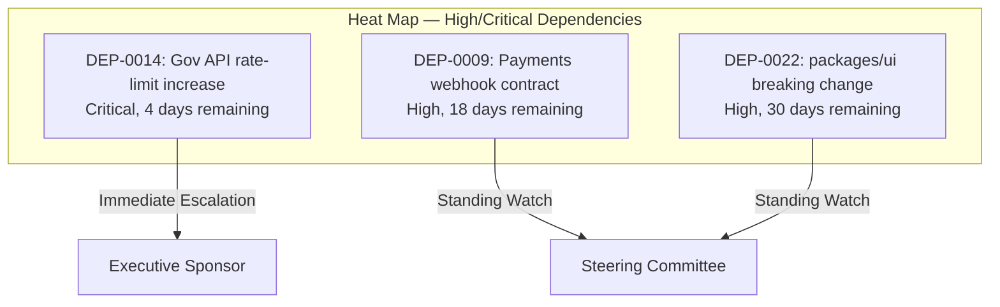

---

# Delivery Governance

### Milestone Tracking

Every Program and Project milestone (per Portfolio Structure above) is tracked against its committed date, with a binary, unambiguous status — `Met`, `At Risk`, or `Missed` — never a vague "mostly on track."

### Progress Reporting

Every Workstream reports progress to its Program's TPM weekly; every Program reports to the Engineering Leadership Council at the cadence established in Executive Reporting below — this document specifies cadence and audience; content format follows `ai-docs/34-engineering-communication-standards.md`.

### Executive Dashboards

A standing, always-current dashboard — never a manually-assembled, point-in-time report — shows: every active Program's health (per Delivery Health below), the Dependency Heat Map, and the current quarter's capacity-allocation actuals against plan.

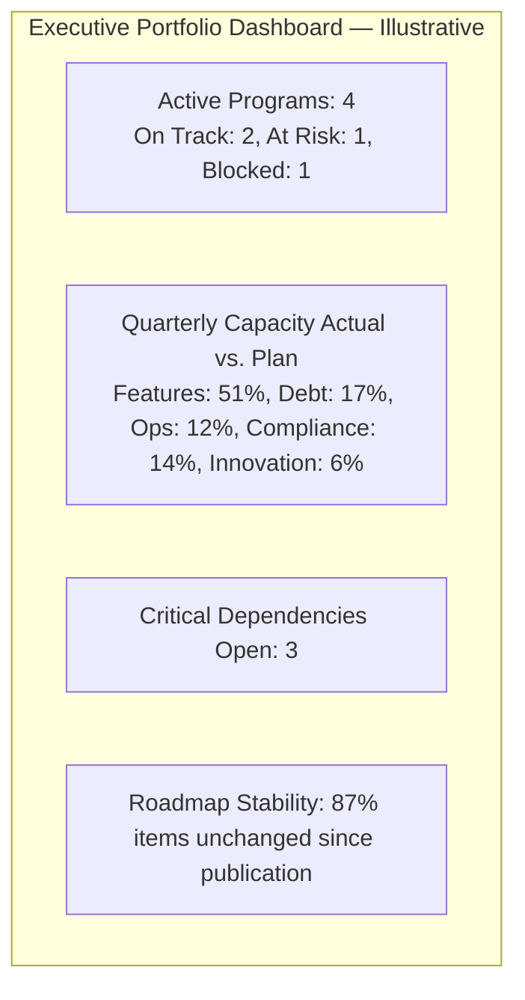

### Delivery Health

Every Program and Project is assigned a single, standing health status, computed from objective inputs, never a subjective gut-feel label:

| Health | Definition | Trigger |
|---|---|---|
| **On Track** | Milestones met, no open Critical dependency, capacity allocation within ±10% of plan. | Default state. |
| **At Risk** | A milestone is `At Risk`, or a High-criticality dependency is open past 50% of its resolution window. | Automatic, from Milestone Tracking + Dependency Register data. |
| **Blocked** | A milestone is `Missed`, or a Critical dependency is `Blocked`. | Automatic. |
| **Paused/Stopped** | Formally paused or stopped, per Portfolio Stop/Pause Criteria below. | Deliberate governance decision only. |

### Status Reviews

Every Program undergoes a Steering Committee review at least monthly; every standalone Project undergoes an Engineering Manager review at least biweekly — an At Risk or Blocked status triggers an out-of-cycle review within 2 business days, never deferred to the next scheduled checkpoint.

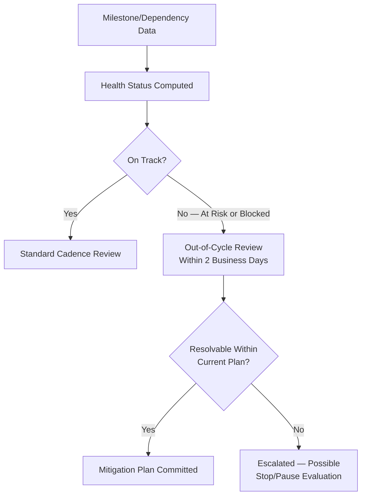

---

# Portfolio Metrics

| Metric | Definition | What a Regression Signals |
|---|---|---|
| **Delivery predictability** | Percentage of committed Quarterly Roadmap items delivered as planned. | A declining rate signals a scoring, capacity, or dependency-management gap, per `ai-docs/36-engineering-capacity-planning-resource-management-standards.md`'s Forecast Validation applied at portfolio scale. |
| **Program health distribution** | Count of active Programs by health status. | A rising At Risk/Blocked share is the portfolio's clearest early-warning signal. |
| **Portfolio throughput** | Count of Initiatives moving from Committed to Delivered per quarter. | A declining trend at stable capacity signals a systemic delivery friction, not merely a capacity shortfall. |
| **Dependency resolution rate** | Percentage of Portfolio Dependency Register items resolved by their committed Target Resolution. | A declining rate is the most direct signal that cross-team coordination is degrading. |
| **Initiative completion rate** | Percentage of scored, roadmapped Initiatives reaching Delivered status without a Stop/Pause. | A declining rate signals a scoring-accuracy or execution-capability gap. |
| **Roadmap stability** | Percentage of Quarterly Roadmap items unchanged between publication and quarter close. | A declining rate signals reactive, non-evidence-based reprioritization, per Anti-Patterns below. |
| **Risk exposure** | Count and severity of open Portfolio-level risks, cross-referenced into `ai-docs/30-engineering-risk-management-standards.md`'s Risk Register. | A rising trend signals the portfolio is accumulating unmanaged strategic risk. |

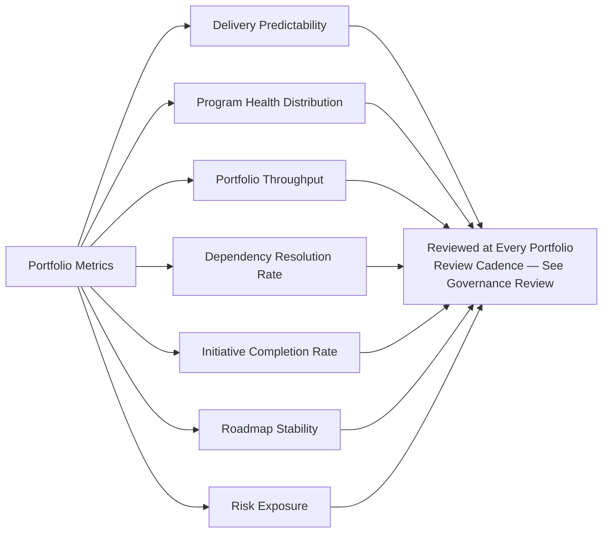

---

# Executive Reporting

| Report | Cadence | Audience | Content |
|---|---|---|---|
| **Weekly Program Status** | Weekly | TPM's own Steering Committee | Milestone status, new/resolved dependencies, capacity actuals. |
| **Monthly Portfolio Summary** | Monthly | Engineering Leadership Council | Program health distribution, Dependency Heat Map, roadmap stability. |
| **Quarterly Portfolio Review** | Quarterly | CTO, VP Engineering, Engineering Leadership Council, Product leadership | Full rebalancing exercise, per Roadmap Governance above; Portfolio Metrics trend. |
| **Executive Dashboards** | Continuous | CTO, VP Engineering, Directors | Live, always-current — never manually assembled per request. |
| **Leadership Summaries** | Ad hoc, per a Critical-tier event | CTO, VP Engineering, Government Technical Partners where affected | A concise, plain-language brief, per `ai-docs/34-engineering-communication-standards.md`'s Executive Communication classification. |

Every report category above is distributed through the Official Communication Channels and classified per the tiers already fully established in `ai-docs/34-engineering-communication-standards.md` — this document adds no new channel or classification mechanic.

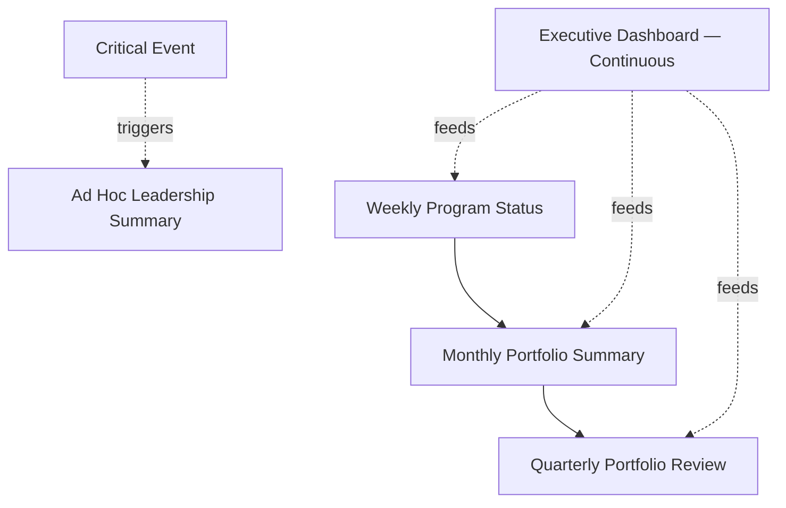

---

# AI-Assisted Portfolio Management

Consistent with the identical AI-assistance principle already established across every governance document in this handbook: **AI accelerates analysis and forecasting, never authority.**

### Forecast Analysis

An AI tool may analyze historical Portfolio Metrics to draft a candidate Quarterly Roadmap capacity forecast — every such draft is a starting point for the Engineering Leadership Council's Quarterly Portfolio Rebalancing, never committed to without human review, per Evidence-Based Forecasting already established in `ai-docs/36-engineering-capacity-planning-resource-management-standards.md`.

### Dependency Analysis

An AI tool may scan repository, issue-tracker, and communication data to surface a candidate cross-team dependency not yet registered — every such candidate is verified by the relevant TPM before it is added to the Portfolio Dependency Register.

### Delivery Prediction

An AI tool may flag a Program or Project trending toward `At Risk` status ahead of the next scheduled review, based on milestone velocity and dependency trend data — a genuinely valuable early-warning capability, verified by the TPM/Engineering Manager before it changes an official Health status.

### Risk Prediction

An AI tool may surface a candidate Portfolio-level risk (a concentration of dependencies on one team, a pattern of Compliance-category deadlines colliding) — every such flag is independently verified before it is cross-referenced into `ai-docs/30-engineering-risk-management-standards.md`'s Risk Register.

### Human Oversight

No Program pause/stop decision, roadmap rebalancing, or Critical-tier escalation resolution is ever finalized on the basis of an AI tool's analysis alone. The named human Approval Authority per this document's RACI tables remains fully accountable, identical to the Human Oversight standard already established consistently across `ai-docs/24` through `ai-docs/37`.

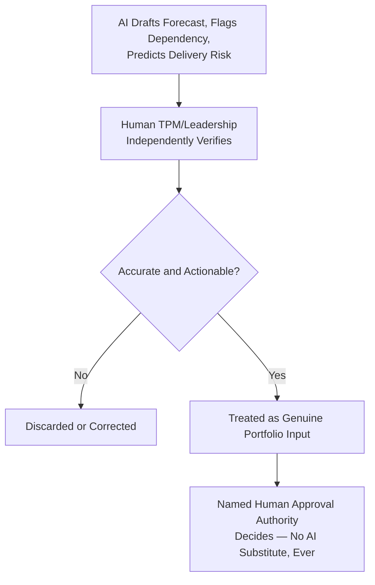

---

# Portfolio Stop/Pause Criteria

Per the governance improvement this document incorporates, every Program or Project is explicitly evaluated against defined stop/pause criteria — never allowed to continue indefinitely on inertia alone.

| Criterion | Trigger | Action |
|---|---|---|
| **Consistent delivery failure** | Two or more consecutive missed milestones with no credible recovery plan. | Mandatory Steering Committee review; Pause pending a revised plan or Stop. |
| **Strategic misalignment** | The initiative no longer traces to a current `ai-docs/01-product-goals.md` goal, following a business-priority change. | Executive Sponsor review; Stop with a documented rationale. |
| **Cost overrun beyond threshold** | Actual capacity consumption exceeds its scored Engineering Effort estimate by more than 50%, with no re-approved justification. | Escalated to Engineering Leadership Council for a Continue/Pause/Stop decision. |
| **Superseded by a better alternative** | A newer, higher-scoring initiative addresses the same need more effectively. | Executive Sponsor-approved Stop, with any salvageable work folded into the superseding initiative. |
| **Unresolved Critical dependency beyond a defined window** | A Critical dependency remains `Blocked` for more than 30 days with no resolution path. | Program-level Pause pending resolution; Steering Committee reassesses viability. |

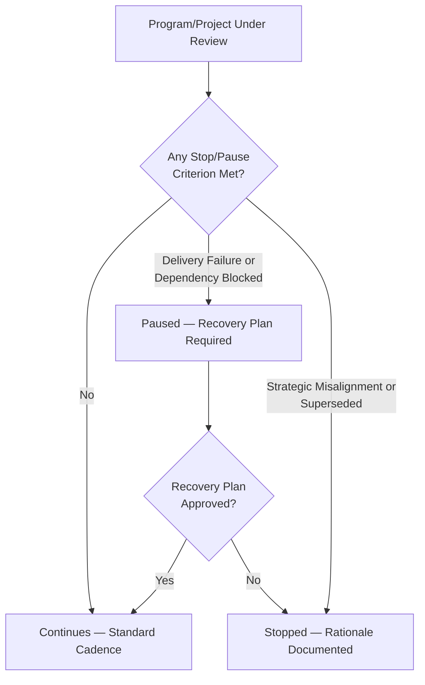

---

# Cross-Program Conflict Resolution

Per the governance improvement this document incorporates, a conflict between two Programs — competing for the same scarce capacity, a shared dependency, or an incompatible technical approach — follows an explicit, never-informal resolution path.

| Conflict Type | Resolution Authority |
|---|---|
| Two Programs competing for the same team's capacity in the same quarter | The contested team's Engineering Manager escalates to the Engineering Leadership Council for a ranked-priority decision, per the Initiative Scoring Model above. |
| Two Programs proposing incompatible technical approaches to a shared boundary | Architecture Review Board, per `ai-docs/29-engineering-governance-decision-authority.md`'s Architecture Conflict escalation. |
| Two Programs with competing Executive Sponsors, unresolved at the Steering Committee level | CTO/VP Engineering, per `ai-docs/29-engineering-governance-decision-authority.md`'s Executive Escalation tier. |

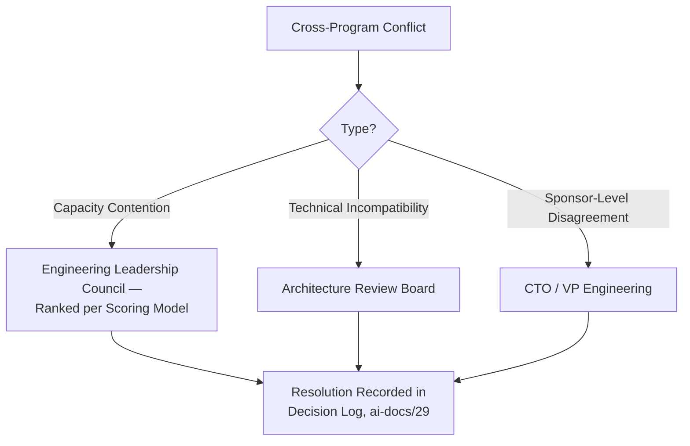

---

# Engineering Anti-Patterns

| Anti-Pattern | Description | Why It's Rejected |
|---|---|---|
| **Too many concurrent initiatives** | More Programs/Projects active than the capacity allocation bands can genuinely support. | Violates Sustainable Execution above; produces the 100% Utilization Planning failure mode already rejected in `ai-docs/36-engineering-capacity-planning-resource-management-standards.md`. |
| **Hidden dependencies** | A cross-team dependency never registered in the Portfolio Dependency Register. | Violates Transparency above; recreates the exact blind-spot failure mode `ai-docs/31-change-management-governance-standards.md`'s Change Planning already exists to prevent, at portfolio scale. |
| **Constant reprioritization** | The Quarterly Roadmap changing every few weeks with no evidence-based trigger. | Violates Evidence-Based Prioritization above; directly degrades the Roadmap Stability metric and erodes every team's ability to plan. |
| **Executive-only planning** | A roadmap set without Cross-Functional Ownership input from Product, Security, or SRE. | Violates Cross-Functional Ownership above; produces decisions made with incomplete information. |
| **No roadmap ownership** | An Initiative on the roadmap with no named Owner or TPM. | Violates the identical Named Ownership principle already established throughout `ai-docs/29`, `ai-docs/30`, and `ai-docs/33`. |
| **Ignoring technical debt** | The Technical Debt & Platform Investment allocation band silently displaced by feature pressure. | Directly violates the floor already established in `ai-docs/32-technical-debt-management-standards.md`. |
| **Portfolio overload** | A portfolio sized without regard to the Maximum Sustainable Workload ceiling already established in `ai-docs/36-engineering-capacity-planning-resource-management-standards.md`. | Guarantees Delivery Predictability failure and elevated Burnout Indicators. |
| **Delivery optimism bias** | A forecast consistently overestimating what the portfolio can deliver, never corrected. | Violates Evidence-Based Forecasting; mirrors the identical Forecast Validation failure mode already established in `ai-docs/36-engineering-capacity-planning-resource-management-standards.md`, applied at portfolio scale. |

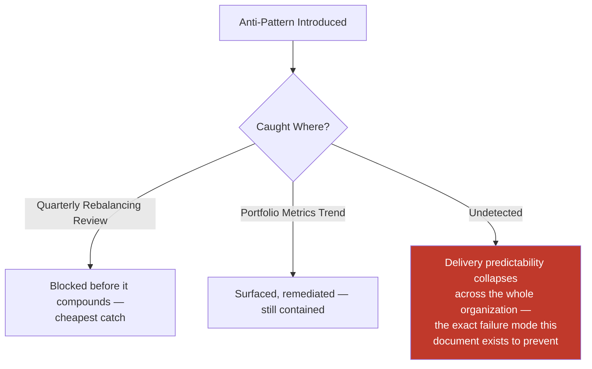

---

# Engineering Review Checklist

Every Program, Project, or Quarterly Roadmap is checked against the following before it is considered portfolio-compliant:

- [ ] **Correctly classified** — Portfolio/Program/Project/Initiative/Epic/Milestone/Workstream, per Portfolio Structure above, never blended.
- [ ] **Named ownership** — Executive Sponsor and TPM assigned for every Program; an Owner assigned for every Initiative.
- [ ] **Scored via the Initiative Scoring Model** — Or, for Compliance-category work, its external deadline is documented explicitly.
- [ ] **Capacity allocation respected** — The initiative fits within its category's allocation band, per Portfolio Prioritization above.
- [ ] **Cross-functional input obtained** — Product, Security, and SRE consulted where relevant, per Cross-Functional Ownership.
- [ ] **Dependencies registered** — Every cross-team dependency is in the Portfolio Dependency Register, criticality assessed.
- [ ] **Heat Map current** — Every High/Critical dependency is visible on the standing Dependency Heat Map.
- [ ] **Health status objective** — Computed from Milestone Tracking and Dependency Register data, never a subjective label.
- [ ] **Reporting cadence honored** — Weekly, Monthly, and Quarterly reports distributed per Executive Reporting above.
- [ ] **Stop/Pause criteria evaluated** — At every Steering Committee/Engineering Manager review, per Portfolio Stop/Pause Criteria above.
- [ ] **Cross-program conflicts resolved through the defined path** — Never left informally unresolved.
- [ ] **AI-assisted analysis independently verified** — Any AI-surfaced forecast, dependency, or risk fact-checked by a human before being relied upon.
- [ ] **No anti-pattern present** — No overload, hidden dependency, constant reprioritization, executive-only planning, unowned initiative, displaced debt allocation, or optimism-biased forecast.
- [ ] **No duplication of Capacity Planning, Governance, Risk Management, Change Management, Development Workflow, or Communication standards** — Any such concern deferred entirely to its owning phase document, never redefined here.

A Program, Project, or Roadmap failing any item above is not considered compliant until resolved — this checklist carries the same non-negotiable authority as every other review checklist established in the preceding thirty-eight phase documents.

---

# Governance Review

| Review | Cadence | Owner | Purpose |
|---|---|---|---|
| **Quarterly portfolio reviews** | Quarterly | Engineering Leadership Council | Full rebalancing per Roadmap Governance above; Portfolio Metrics trend review. |
| **Annual portfolio strategy review** | Annual | CTO, VP Engineering, Engineering Leadership Council | Confirms allocation bands and the Initiative Scoring Model's weights still fit Arwal's actual strategic shape. |
| **Program audits** | Per Program, at least semi-annual for a multi-quarter Program | TPM + an independent Director/Principal | Confirms Program Governance's roles, Steering Committee cadence, and reporting were genuinely honored. |
| **Dependency audits** | Quarterly | Platform Team + affected TPMs | Confirms the Dependency Register and Heat Map match reality — no phantom `Resolved` entries, no silently-abandoned `Blocked` items. |
| **Roadmap audits** | Quarterly | Engineering Leadership Council | Confirms Roadmap Stability's underlying causes for any deviation are genuinely evidence-based, not politically driven. |
| **Delivery governance reviews** | Monthly | VP Engineering | Confirms Delivery Health statuses are computed correctly and Status Reviews are occurring on cadence. |

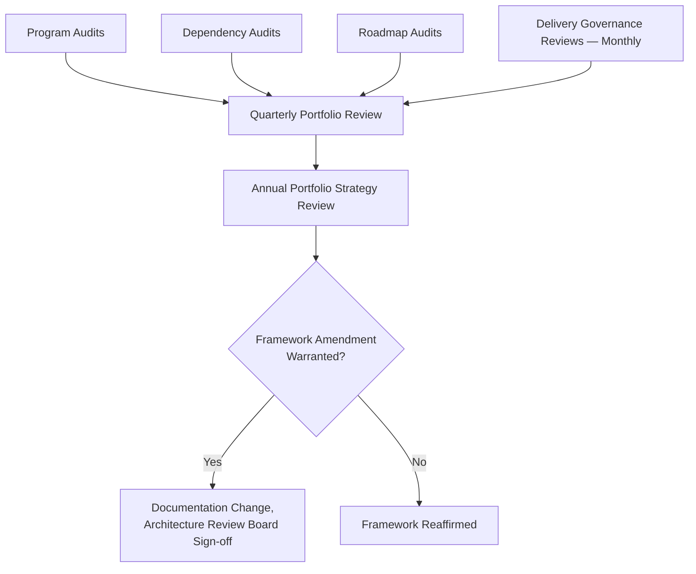

---

# Relationship with Previous Standards

### Project Vision

`ai-docs/00-project-vision.md` establishes the founding mission and the North Star Principle. This document is the operational mechanism that keeps the entire portfolio, across hundreds of engineers and dozens of simultaneous initiatives, aligned to that same mission rather than drifting into locally-optimized, disconnected work.

### Engineering Principles

`ai-docs/02-engineering-principles.md` establishes YAGNI, Scope Discipline, and the Technical Debt Policy. This document's capacity-allocation bands and Initiative Scoring Model are the portfolio-level application of those same disciplines, never redefining them.

### Engineering Governance

`ai-docs/29-engineering-governance-decision-authority.md` owns the complete organizational decision-authority structure — every Approval Authority, escalation tier, and board named in this document's RACI tables and Cross-Program Conflict Resolution section is drawn directly from that structure, never a new authority invented here.

### Risk Management

`ai-docs/30-engineering-risk-management-standards.md` owns the complete standing Risk Register. A Portfolio-level risk this document's Risk Exposure metric surfaces is logged into that Register where it meets its threshold — this document never redefines risk-scoring mechanics.

### Capacity Planning

`ai-docs/36-engineering-capacity-planning-resource-management-standards.md` owns Quarterly and Annual Planning's capacity mechanics, Forecast Validation, and team-level workload discipline. This document's Portfolio Prioritization and Roadmap Governance sections consume that document's capacity forecasts directly, never redefining how capacity itself is planned or protected.

### Career Development

`ai-docs/37-engineering-career-development-performance-management-standards.md` owns individual growth and promotion. A TPM or Executive Sponsor role named in this document is a career milestone governed entirely by that document's Leadership Development track, never redefined here.

### Communication

`ai-docs/34-engineering-communication-standards.md` owns every channel, classification, and audience rule this document's Executive Reporting section relies on, never redefining a communication mechanic.

### Change Management

`ai-docs/31-change-management-governance-standards.md` owns the complete Change Request lifecycle every Epic's individual changes flow through once execution begins. This document governs only the initiative-level decision of *what* is built and *when*; that document governs *how* the resulting change is safely deployed.

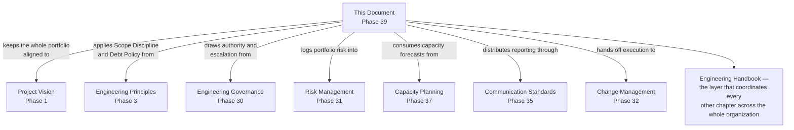

---

# Closing Statement

> **Callout — Closing Statement**
> Every preceding phase document described a standard for how a single change, a single team, or a single engineer operates inside Arwal. This document describes how all of that coordinates at the scale Arwal's mission actually requires — hundreds of engineers, spread across Local Services, Civic Services, Payments, Healthcare, Platform, Security, SRE, and AI teams, delivering dozens of initiatives simultaneously, for a district that does not care how many teams it took to renew a certificate, only that it worked. Portfolio and program governance is not bureaucracy imposed on top of good engineering — it is what keeps good engineering, practiced by many independent teams at once, from quietly working against itself: two teams solving the same problem twice, a Critical dependency discovered only when it is already late, a roadmap that changes every few weeks because no one can say with evidence why. A disciplined portfolio is what lets Arwal say, honestly, at any point across the remaining ~261 micro-phases, exactly what is being built, why, by whom, and how it is actually going — and to correct course the moment the evidence says it should, rather than the moment it becomes impossible to ignore. Where a future phase must deviate from a standard stated here, that deviation is made explicitly — through this document's own Governance Review process, or a Strategic-classification ADR where the deviation is structural — never silently, and never by default.

This document, `ai-docs/38-engineering-portfolio-program-management-standards.md`, is Phase 39 of approximately 300. Every portfolio prioritized, every program chartered, and every roadmap published in the phases that follow is expected to satisfy the standards defined here, or to justify its deviation in writing.

**End of Phase 39 — `ai-docs/38-engineering-portfolio-program-management-standards.md`**