# Engineering Operational Excellence & Continuous Improvement Standards

**Document:** `ai-docs/39-engineering-operational-excellence-continuous-improvement-standards.md`
**Project:** Arwal — The District Super App
**Stage:** 1 — Foundation
**Phase:** 40 — Engineering Operational Excellence & Continuous Improvement Standards
**Status:** Approved for Engineering Reference
**Audience:** CTO, VP Engineering, Directors, Engineering Managers, Tech Leads, Platform/Security/AI/SRE/DevOps/Government Integration/Payments/Healthcare Teams, Government Technical Partners

> **Callout — Purpose of This Document**
> `ai-docs/00-project-vision.md` through `ai-docs/38-engineering-portfolio-program-management-standards.md` defined why Arwal exists and every enforceable discipline governing how it is designed, built, secured, governed, risk-managed, changed, documented, communicated, staffed, capacity-planned, grown as a career, and coordinated as a portfolio. Every one of those documents describes a *state* Arwal should be in. None of them, individually, answers the question that determines whether Arwal stays in that state — or drifts away from it — across the ~260 micro-phases still ahead: **how does Arwal know, continuously and honestly, whether it is actually getting better, and what does it do about it when the evidence says it isn't?** This document is that answer.

---

# Purpose of this Document

### Why Operational Excellence Matters

Every standard in this handbook was correct on the day it was written. None of them is guaranteed to still be correct at Phase 150, Phase 220, or Phase 290 — not because the standards were wrong, but because a codebase, a team, and a threat landscape spanning ~300 micro-phases and years of real operation will surface facts no Phase 1 committee could have anticipated. Operational excellence is the discipline of noticing those facts deliberately, continuously, and acting on them — rather than discovering, only in an incident postmortem or a failed audit, that a standard quietly stopped fitting reality long ago. A system that is well-designed once and never re-examined is not excellent; it is merely lucky, for as long as its luck holds.

### Why Continuous Improvement Matters

Per Continuous Improvement, already a load-bearing commitment repeated across `ai-docs/29-engineering-governance-decision-authority.md` through `ai-docs/38-engineering-portfolio-program-management-standards.md`, every governance chapter in this handbook already promises to review itself. This document is where that promise becomes a single, coherent, organization-wide practice rather than nine separate, loosely-coordinated review cadences that might drift out of sync with one another. Continuous improvement exists to make Arwal's own operating discipline as deliberately engineered, as measured, and as accountable as the software it produces.

### Long-Term Engineering Sustainability

Per the Sustainability Vision already established in `ai-docs/00-project-vision.md` and the Sustainable Pace principle in `ai-docs/36-engineering-capacity-planning-resource-management-standards.md`, Arwal is built as infrastructure for a generation — and infrastructure that cannot improve itself eventually becomes infrastructure that citizens can no longer trust, regardless of how well it was built on day one. This document exists to make sustainability a *practiced*, continuously-renewed property of Arwal's engineering organization, never a one-time architectural decision assumed to hold forever.

### Organizational Learning

Per Continuous Learning already established in `ai-docs/37-engineering-career-development-performance-management-standards.md` and the Blameless Postmortems commitment in `ai-docs/00-project-vision.md`, every incident, every experiment, and every metric Arwal collects is a learning opportunity — but a lesson learned by one engineer, on one team, in one quarter, is not yet organizational learning until it has been deliberately captured, shared, and — where it generalizes — turned into a standard. This document is where that conversion happens systematically, closing the loop between "we noticed something" and "the organization now does something differently because of it."

### Relationship with Preceding Documents

This document does not redefine Engineering Governance (`ai-docs/29-engineering-governance-decision-authority.md`), Risk Management (`ai-docs/30-engineering-risk-management-standards.md`), Change Management (`ai-docs/31-change-management-governance-standards.md`), Technical Debt Management (`ai-docs/32-technical-debt-management-standards.md`), Knowledge Management (`ai-docs/33-engineering-knowledge-management-standards.md`), Communication Standards (`ai-docs/34-engineering-communication-standards.md`), Onboarding & Offboarding (`ai-docs/35-engineering-onboarding-offboarding-standards.md`), Capacity Planning (`ai-docs/36-engineering-capacity-planning-resource-management-standards.md`), Career Development (`ai-docs/37-engineering-career-development-performance-management-standards.md`), or Portfolio & Program Management (`ai-docs/38-engineering-portfolio-program-management-standards.md`). Every one of those governs its own domain's specific mechanics, review cadence, and metrics in full. This document sits **above** all nine of them: it is the discipline that periodically asks, across every one of those domains simultaneously, "is this working, and how do we know?" — and the mechanism by which an answer of "no" becomes a tracked, owned, resolved improvement rather than a shrug.

---

# Engineering Excellence Philosophy

Arwal's operational excellence practice rests on eight commitments. Together they answer the question every subsequent section of this document exists to make concrete: **what makes a continuous-improvement practice actually improve things, rather than merely produce reviews about improving things?**

### Continuous Improvement

Excellence is never a destination reached and then maintained passively — it is a standing, cyclical practice of measuring, learning, and adjusting, mirroring the identical Continuous Improvement discipline already established across `ai-docs/30` through `ai-docs/38`. This exists because a codebase, a team, and an organization are all moving targets; a practice that only improves things once, at launch, guarantees decay the moment reality diverges from that one snapshot.

### Evidence-Based Decisions

Every claim that something is better, worse, or unchanged is grounded in a specific, checkable metric or a documented finding — never in confidence or seniority alone, restating Evidence-Based Decisions already established in `ai-docs/29-engineering-governance-decision-authority.md` and `ai-docs/30-engineering-risk-management-standards.md`. This exists because an improvement program that cannot demonstrate it actually improved anything is indistinguishable, to a skeptical engineer six months later, from a program that did nothing at all.

### Simplicity

An improvement is judged first by whether it makes something simpler, never merely by whether it makes something more sophisticated — mirroring KISS already established in `ai-docs/02-engineering-principles.md`. This exists because operational excellence practiced without this discipline tends toward accumulating process, dashboards, and rituals that look rigorous but add friction without adding genuine reliability or clarity.

### Automation

Anything measured, reviewed, or reported on a recurring cadence is automated wherever a machine can do it reliably, restating Automation Where Possible already established in `ai-docs/24-documentation-standards.md` and `ai-docs/17-cicd-standards.md`. This exists because a continuous-improvement practice that depends on a human remembering to manually pull a metric every week is a practice that will quietly stop happening the first time that human is on leave.

### Learning Culture

Every finding — including a failed experiment — is treated as a contribution to organizational knowledge, never as a personal failure to be hidden, restating Blameless Postmortems already established in `ai-docs/00-project-vision.md` and `ai-docs/07-development-workflow.md`. This exists because a culture that punishes the reporting of a disappointing result trains engineers to stop reporting disappointing results, which is the single fastest way to make an improvement program blind to its own failures.

### Sustainability

Improvement work is planned against the same Maximum Sustainable Workload ceiling already established in `ai-docs/36-engineering-capacity-planning-resource-management-standards.md` — never treated as free, unbudgeted work squeezed on top of an already-full plate. This exists because an improvement program that burns out the people executing it is, by its own definition, not actually improving anything.

### Reliability

Every improvement is validated against its effect on Arwal's actual reliability — uptime, latency, error rate, per `ai-docs/11-performance-standards.md` and `ai-docs/18-observability-standards.md` — never assumed beneficial merely because it was well-intentioned. This exists because "we made a change to improve things" and "we made a change that measurably improved things" are different claims, and only the second one is worth keeping.

### Incremental Optimization

Excellence is pursued through small, frequently-validated steps, mirroring Small, Incremental Changes already established in `ai-docs/31-change-management-governance-standards.md`, never through a single, sweeping "excellence initiative" undertaken once and then declared complete. This exists because a large, infrequent improvement effort carries the identical risk profile — hard to validate, hard to roll back, easy to get wrong — that `ai-docs/31-change-management-governance-standards.md` already rejects at the level of a single production change.

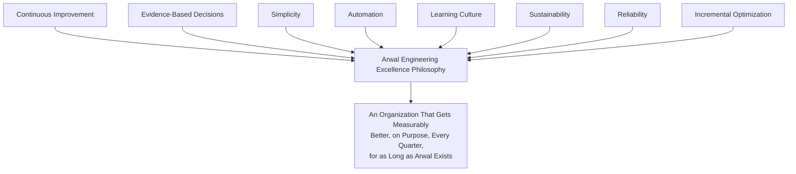

> **Callout — The One-Sentence Operational Excellence Philosophy**
> *"An improvement that cannot be measured did not happen, and a lesson that is not shared was not learned — this document exists so that neither is ever true at Arwal by accident."*

---

# Engineering Excellence Framework

Operational excellence is assessed across eight interlocking dimensions — never a single, undifferentiated "is engineering good" judgment, mirroring the same never-one-blunt-mechanism discipline already established throughout this handbook for State Management, Configuration, and Risk Classification.

| Dimension | What It Measures | Primary Owning Document(s) |
|---|---|---|
| **People** | Team health, skill growth, sustainable workload, career progression. | `ai-docs/36`, `ai-docs/37` |
| **Process** | How work moves from idea to production — governance, change management, review discipline. | `ai-docs/07`, `ai-docs/26`, `ai-docs/29`, `ai-docs/31` |
| **Technology** | The architecture, tech stack, and tooling Arwal is built from. | `ai-docs/03`, `ai-docs/09` |
| **Quality** | Correctness, test coverage, defect rate. | `ai-docs/05`, `ai-docs/15` |
| **Delivery** | Speed, predictability, and throughput of shipping value. | `ai-docs/27`, `ai-docs/38` |
| **Reliability** | Uptime, latency, incident frequency and recovery. | `ai-docs/11`, `ai-docs/18`, `ai-docs/07` |
| **Security** | Threat posture, vulnerability response, compliance. | `ai-docs/10`, `ai-docs/22`, `ai-docs/28` |
| **Innovation** | The organization's capacity to try, learn from, and adopt new approaches. | `ai-docs/25`, `ai-docs/38` |

### Relationships Between Dimensions

No dimension is optimized in isolation — this document's central operational claim is that these eight dimensions are **coupled**, and a change that appears to improve one while silently degrading another is not an improvement at all, per Local Optimization Hurting the System in Engineering Anti-Patterns below.

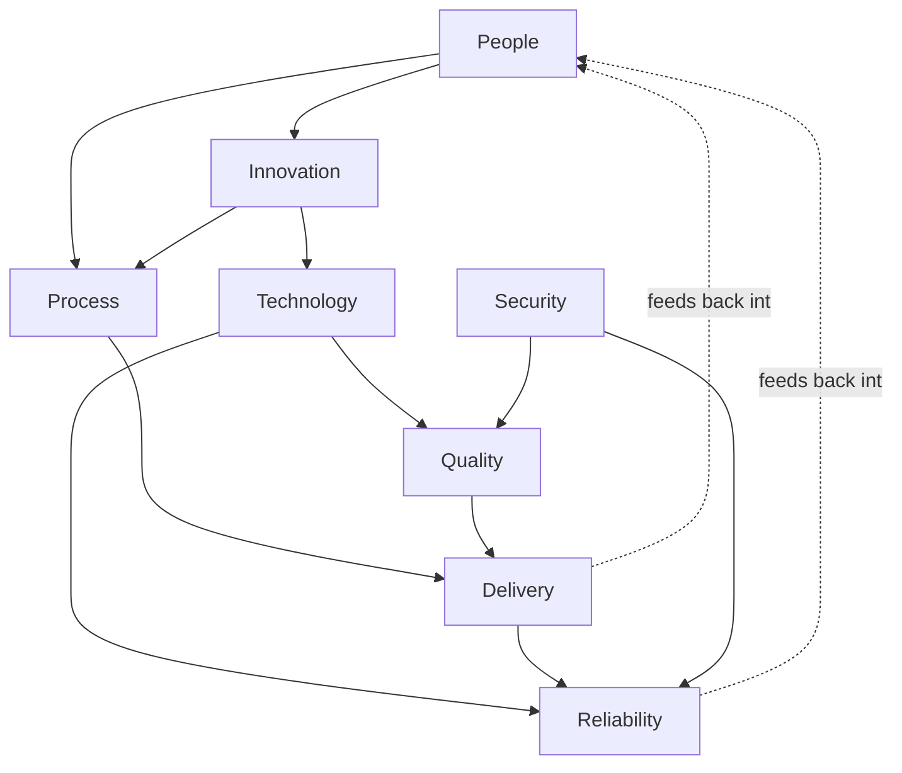

> **Callout — Why Eight Dimensions, Not One Score**
> A single, blended "engineering health" number invites exactly the gaming this document's Anti-Patterns section rejects — a team can raise a blended score by improving the easiest dimension while a harder, more important one quietly degrades. Eight distinct dimensions, each with its own evidence trail, force a reviewer to see the trade-off explicitly rather than letting one dimension's improvement mask another's decline.

---

# Engineering Maturity Model

Arwal's engineering maturity is assessed on a five-level scale, applied per team and rolled up to an organization-wide view via the Engineering Maturity Scorecard below — mirroring the identical Risk Classification and Change Classification tiering already established throughout `ai-docs/30` and `ai-docs/31`, applied here to organizational capability rather than a single risk or change.

| Level | Name | Characteristics | Typical Signal |
|---|---|---|---|
| **1** | **Initial** | Work happens, but inconsistently — process exists informally, in individual habit rather than written standard. | High variance in delivery time and quality across engineers doing similar work. |
| **2** | **Managed** | This handbook's standards exist and are followed for routine work, but reactively — a gap is closed only after it causes visible pain. | Standards are cited in review, but metrics are collected inconsistently and rarely reviewed proactively. |
| **3** | **Defined** | Standards are followed consistently and proactively; metrics are collected on a defined cadence, per every governing document's own Metrics section. | A team can produce its own dashboard on demand and explain what every number means. |
| **4** | **Measured** | Metrics are not merely collected but actively used to make decisions — a Quarterly Rebalancing (`ai-docs/38`) or a Debt Budget adjustment (`ai-docs/32`) is demonstrably evidence-driven. | A decision log shows metrics explicitly cited as the reason for a specific change. |
| **5** | **Optimizing** | The team runs its own disciplined experimentation loop (per Continuous Improvement Process below), proactively identifies improvement opportunities before they become pain, and contributes findings back to the wider organization. | The team has authored or materially improved a standard in this handbook based on its own evidence. |

### Progression

Progression between levels is never assumed automatic with tenure — it is confirmed by the Engineering Maturity Scorecard's evidence, per Governance Review below, mirroring the identical Evidence Required discipline already established for individual promotion in `ai-docs/37-engineering-career-development-performance-management-standards.md`.

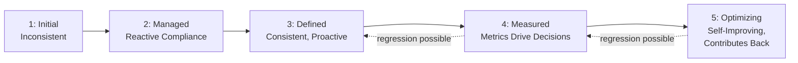

> **Callout — Regression Is Real and Must Be Named**
> A team can lose maturity — a Platform reorganization, a wave of departures (`ai-docs/35`), or sustained delivery pressure overriding review discipline (`ai-docs/26`) can regress a team from Level 4 back to Level 2. The Engineering Maturity Scorecard exists specifically to catch this regression while it is still cheap to reverse, never only to celebrate forward progress.

### Engineering Maturity Scorecard

Per the governance improvement this document incorporates, every team is scored **annually**, across all eight Engineering Excellence Framework dimensions, against the five maturity levels — producing a single, comparable, organization-wide view.

| Team | People | Process | Technology | Quality | Delivery | Reliability | Security | Innovation | Overall |
|---|---|---|---|---|---|---|---|---|---|
| Local Services | 4 | 4 | 3 | 4 | 3 | 4 | 3 | 3 | **3.5** |
| Payments | 4 | 5 | 4 | 5 | 3 | 5 | 5 | 3 | **4.25** |
| Platform | 5 | 4 | 4 | 4 | 4 | 4 | 4 | 4 | **4.1** |
| Civic Services | 3 | 3 | 3 | 3 | 3 | 3 | 3 | 2 | **2.9** |
| AI Team | 3 | 3 | 3 | 3 | 2 | 3 | 4 | 4 | **3.1** |

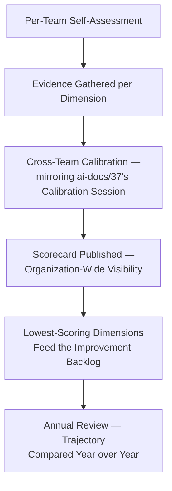

A team scoring below Level 3 on any dimension is not treated as a failing grade — it is treated identically to a High-tier item in the Technical Debt Register (`ai-docs/32-technical-debt-management-standards.md`): visible, owned, and scheduled for deliberate improvement, never hidden or excused.

---

# Continuous Improvement Process

Every improvement — from a five-minute tooling tweak to a multi-quarter process redesign — passes through the same six stages, scaled in rigor to its scope, mirroring the identical Proportional Rigor principle already established throughout this handbook.

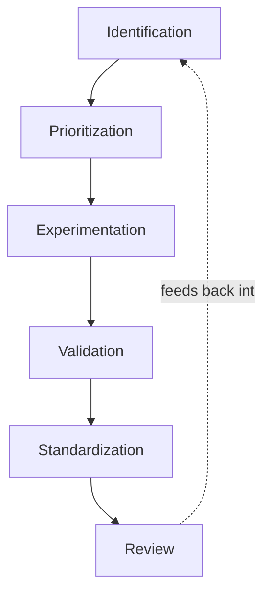

### Identification

An improvement opportunity is surfaced from any of: a Retrospective (`ai-docs/07-development-workflow.md`), a postmortem finding (`ai-docs/07-development-workflow.md`), a Technical Debt Register entry (`ai-docs/32`), a Risk Register entry (`ai-docs/30`), an Engineering Maturity Scorecard gap (above), or a direct engineer proposal — every source feeds the same Improvement Backlog below, never a separate, siloed list per source.

### Prioritization

Every identified improvement is scored against the identical Priority Score model already established in `ai-docs/32-technical-debt-management-standards.md`'s Technical Debt Prioritization, reused here rather than duplicated: Business Value, Engineering Risk, Frequency of Impact, and Cost of Delay, weighted identically.

### Experimentation

Per the governance improvement this document incorporates, **no improvement initiative begins execution without a stated, measurable success criterion defined in advance** — never a vague "let's try this and see." An experiment follows the identical `experiment/*` branch discipline already established in `ai-docs/27-branching-release-strategy.md` where it touches code, or an equivalent time-boxed pilot for a process change (a single team trials a new stand-up format for one sprint before any organization-wide rollout).

### Validation

The experiment's actual outcome is measured against its pre-stated success criterion — never judged by whether it "felt" successful. A validation step that cannot point to the specific metric it moved (or failed to move) is not a completed validation.

### Standardization

An experiment that meets its success criterion, and that generalizes beyond the single team that trialed it, is promoted into this handbook itself — a new or amended phase document, per the identical Documentation Change and ADR discipline already established in `ai-docs/24-documentation-standards.md` and `ai-docs/25-architecture-decision-records.md`. An experiment that does not generalize is retired at the team level, its finding still recorded per Experimentation Governance below.

### Review

Every standardized improvement is revisited at its next Operational Review (below) to confirm the benefit is holding over time, never assumed permanent from a single successful validation.

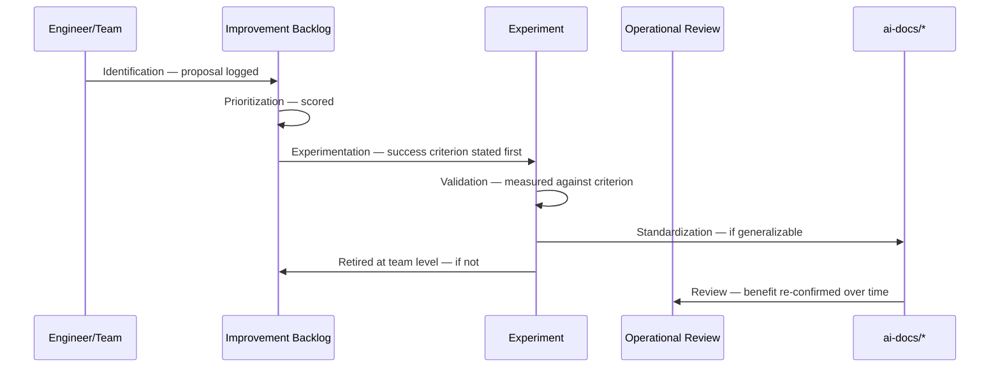

### Experimentation Governance

Per the governance improvement this document incorporates, **a failed experiment is documented and shared whenever it provides meaningful organizational learning — never quietly discarded.** A failed experiment's record states: the hypothesis, the success criterion that was not met, the actual outcome, and — where identifiable — why the hypothesis was wrong. This record is retained in the Improvement Backlog's own history, never deleted, mirroring the identical Archive, Never Delete principle already established for ADRs in `ai-docs/25-architecture-decision-records.md`.

| Experiment Outcome | Action |
|---|---|
| **Success, generalizes** | Standardized into the handbook, per Standardization above. |
| **Success, team-specific only** | Retained as a documented team convention, not elevated to a handbook standard. |
| **Failure, meaningful learning** | Documented and shared organization-wide via `ai-docs/34-engineering-communication-standards.md`'s Knowledge-Sharing Communication. |
| **Failure, no generalizable learning** | Logged in the Improvement Backlog's history with a brief closing note; not actively broadcast. |

---

# Operational Reviews

Every review below is a distinct, defined cadence — never blended into a single, undifferentiated "engineering meeting," mirroring the identical never-one-blunt-mechanism discipline already established throughout this handbook.

| Review | Cadence | Audience | Focus |
|---|---|---|---|
| **Weekly Operational Review** | Weekly | The team, Tech Lead | Immediate operational signals — this week's incidents, alerts, review backlog, per `ai-docs/18-observability-standards.md` and `ai-docs/26-code-review-standards.md`'s own metrics. |
| **Monthly Engineering Review** | Monthly | Engineering Managers, Tech Leads | Team-level Engineering Health (below), Improvement Backlog progress, Technical Debt trend (`ai-docs/32`). |
| **Quarterly Excellence Review** | Quarterly | Engineering Leadership Council | Cross-team Engineering Excellence Metrics (below), Portfolio-level delivery health (`ai-docs/38`), Improvement Backlog's highest-priority items. |
| **Annual Organizational Review** | Annual | CTO, VP Engineering, Engineering Leadership Council | The full Engineering Maturity Scorecard, framework-level amendments across every governance document, industry benchmarking (below). |

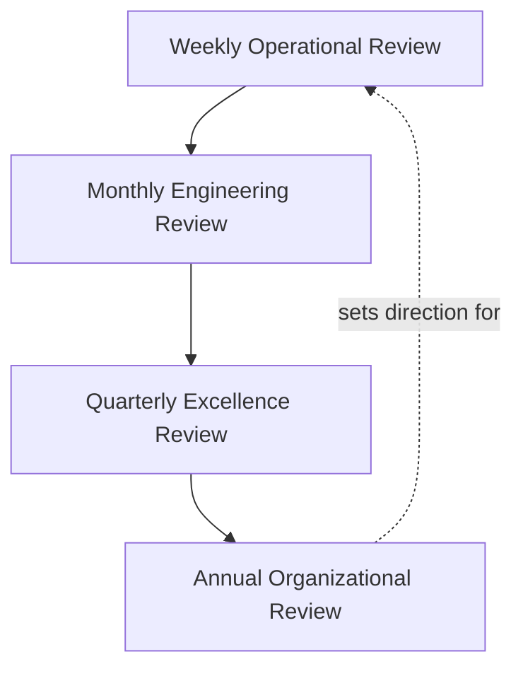

### Weekly Operational Review

A short, tactical review of the immediate operational picture — open incidents, alert noise, review latency (`ai-docs/26-code-review-standards.md`'s Review Backlog metric), and any Workload Escalation Threshold breach (`ai-docs/36-engineering-capacity-planning-resource-management-standards.md`) from the past week. This review never duplicates a Governance Board's own standing meeting (`ai-docs/29-engineering-governance-decision-authority.md`); it is the team's own internal pulse check.

### Monthly Engineering Review

A team-level review of Engineering Health (below) trend lines, Improvement Backlog velocity, and Technical Debt Register status (`ai-docs/32`) — the point at which a Level-3 team confirms it is still Level 3, not merely assumes it.

### Quarterly Excellence Review

A cross-team review at the Engineering Leadership Council, comparing Engineering Excellence Metrics (below) across every team, feeding directly into `ai-docs/38-engineering-portfolio-program-management-standards.md`'s Quarterly Portfolio Rebalancing — this document supplies the excellence-and-maturity evidence that rebalancing exercise consumes, never redefining the rebalancing mechanic itself.

### Annual Organizational Review

The full Engineering Maturity Scorecard is published, benchmarked against industry practice (below), and used to set the coming year's Engineering Excellence priorities — feeding into `ai-docs/36-engineering-capacity-planning-resource-management-standards.md`'s Annual Planning and `ai-docs/38-engineering-portfolio-program-management-standards.md`'s Annual Portfolio Strategy Review.

---

# Engineering Health

Engineering Health is a **leading**, not lagging, signal — distinct from the Engineering Excellence Metrics (below), which measure outcomes. Health indicators are watched continuously so a decline is visible before it produces a measurable outcome regression.

| Health Dimension | Indicators | Data Source |
|---|---|---|
| **Delivery Health** | Delivery Predictability, Roadmap Stability, per `ai-docs/38-engineering-portfolio-program-management-standards.md`. | `ai-docs/38`'s Portfolio Metrics |
| **Quality Health** | Escaped defect rate, Code Coverage trend, per `ai-docs/15-testing-standards.md`. | `ai-docs/15`, `ai-docs/26`'s Escaped Defects metric |
| **Reliability Health** | Uptime, MTTR, SLO error-budget consumption, per `ai-docs/18-observability-standards.md`. | `ai-docs/18` |
| **Security Health** | Open Critical/High vulnerability count and remediation timeliness, per `ai-docs/22-dependency-management-standards.md`. | `ai-docs/22`, `ai-docs/28` |
| **Developer Experience** | Time-to-productivity (`ai-docs/35`), local environment setup success rate, CI/CD pipeline duration (`ai-docs/17-cicd-standards.md`). | `ai-docs/35`, `ai-docs/17` |
| **Team Health** | Burnout Indicators, Team Stability, per `ai-docs/36-engineering-capacity-planning-resource-management-standards.md`. | `ai-docs/36` |
| **Platform Health** | Shared-package stability, CI/CD success rate, dependency freshness, per `ai-docs/28-dependency-governance-standards.md`. | `ai-docs/17`, `ai-docs/28` |

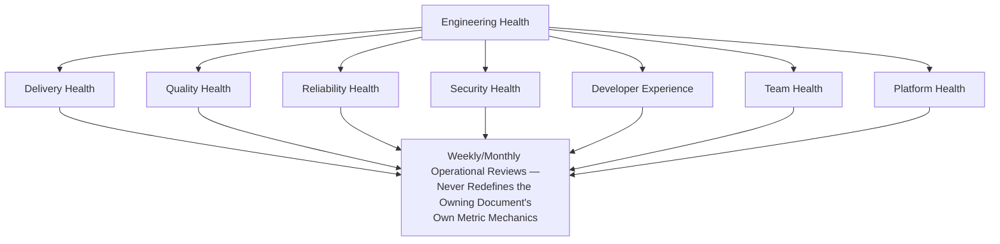

> **Callout — Health Indicators Are Sourced, Never Re-Measured**
> This document never introduces a new metric-collection mechanic — every Health indicator above is read directly from the metric already fully defined in its owning document. This document's sole contribution is assembling them into one, cross-dimensional view no single owning document is positioned to produce alone.

---

# Improvement Backlog

The Improvement Backlog is Arwal's single, authoritative, version-controlled record of every identified improvement opportunity — structurally mirroring the Technical Debt Register (`ai-docs/32-technical-debt-management-standards.md`) and Risk Register (`ai-docs/30-engineering-risk-management-standards.md`), living at `docs/improvement-backlog/` per the identical Documentation Is Code discipline already established in `ai-docs/24-documentation-standards.md`.

| Field | Description |
|---|---|
| **Improvement ID** | A permanent, sequential, zero-padded identifier (`IMP-0001`), never reused. |
| **Title** | A short, specific, descriptive title. |
| **Source** | Retrospective, postmortem, Maturity Scorecard gap, Risk Register, Technical Debt Register, or direct proposal. |
| **Description** | The specific gap and the improvement proposed to close it. |
| **Success Criterion** | The specific, measurable outcome that determines whether the improvement worked — required before Prioritization, per Continuous Improvement Process above. |
| **Owner** | A named individual, never a diffuse team, per the identical Named Ownership principle already established throughout `ai-docs/29`, `ai-docs/30`, and `ai-docs/33`. |
| **Priority Score** | Computed per Continuous Improvement Process's Prioritization stage. |
| **Status** | `Identified` / `Prioritized` / `Experimenting` / `Validating` / `Standardized` / `Retired`. |
| **Target Review Date** | When Validation is expected to occur. |
| **Related Items** | Cross-references into the Technical Debt Register, Risk Register, or an ADR where applicable. |

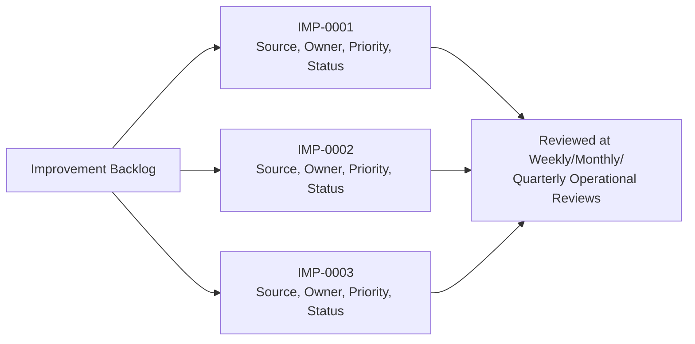

### Ownership and Tracking

Every Improvement Backlog item has exactly one Owner, confirmed current at the same cadence as Technical Debt Register ownership review (`ai-docs/32`) — an ownerless item is treated as an active governance defect, identical in severity to an ownerless ADR (`ai-docs/25`) or an ownerless risk (`ai-docs/30`).

### Completion and Validation

An item is never marked `Standardized` until its stated Success Criterion has been genuinely measured true, per Validation in Continuous Improvement Process above — a completion recorded on optimism alone is treated identically to the "Complete Trap" already rejected in `ai-docs/08-definition-of-done.md`.

---

# Process Optimization

### Workflow Optimization

Every recurring engineering workflow (a PR review cycle, a deployment pipeline stage, an on-call handoff) is a candidate for optimization when it shows up as a recurring friction point across multiple Weekly Operational Reviews — never optimized speculatively ahead of demonstrated friction, per Evidence-Based Decisions above.

### Tooling Improvements

A tooling gap (a slow CI step, an undiscoverable dashboard, a manual step that should be scripted) identified during Identification above is prioritized identically to any other Improvement Backlog item — tooling investment is never treated as a lesser category of improvement exempt from Success Criterion discipline.

### Automation Opportunities

Per Automation above, any recurring manual task performed more than a defined threshold (Arwal's default: more than twice in a quarter by the same team) is flagged as an Automation Debt candidate, cross-referenced into `ai-docs/32-technical-debt-management-standards.md`'s own Automation Debt category — this document never redefines that category, it is the mechanism by which a pattern of manual repetition is noticed in the first place.

### Waste Reduction

Waste is defined precisely, per the identical Simplicity principle above: work that consumes engineering capacity without producing a corresponding, verifiable outcome — an unread dashboard, a review step nobody acts on, a meeting with no recorded decision (`ai-docs/34-engineering-communication-standards.md`'s Meeting Without Outcome anti-pattern). Waste identified during an Operational Review is logged into the Improvement Backlog for removal, never merely complained about informally.

### Efficiency Improvements

An efficiency improvement is validated against Engineering Excellence Metrics below — never assumed beneficial merely because it reduces a step count, per the same Evidence Before Approval discipline already established in `ai-docs/29-engineering-governance-decision-authority.md`.

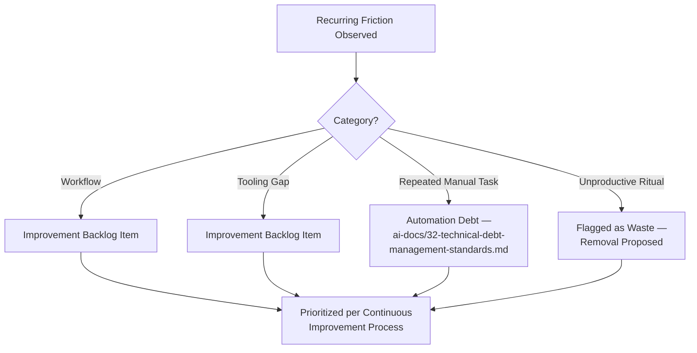

---

# Engineering Excellence Metrics

Per the Actionable Metrics principle already established throughout `ai-docs/18-observability-standards.md` and every governance chapter since, every metric below ties to a real question the Engineering Leadership Council will actually ask.

### North Star Metrics

Per the governance improvement this document incorporates, Arwal defines a small, deliberately **stable** set of "north star" engineering metrics — chosen to remain meaningful across ~300 micro-phases even as the specific supporting metrics beneath them evolve.

| North Star Metric | Definition | Why It Stays Stable |
|---|---|---|
| **Citizen-Facing Reliability** | Composite of uptime and p95 latency for citizen-critical flows, per `ai-docs/01-product-goals.md`'s Reliability KPI category. | The citizen's experience of "does it work" does not change even as the underlying tech stack does. |
| **Delivery Predictability** | Percentage of committed roadmap delivered as forecast, per `ai-docs/38-engineering-portfolio-program-management-standards.md`. | A stable measure of organizational trustworthiness regardless of team structure changes. |
| **Engineering Maturity (Organization-Wide Average)** | The rolled-up Engineering Maturity Scorecard average, per above. | A durable proxy for "is Arwal getting better at being Arwal," independent of any single dimension's supporting metric changing. |
| **Citizen Trust Signal** | Independent citizen trust survey result, per `ai-docs/01-product-goals.md`'s Success Criteria. | The only metric that directly measures the mission itself, per `ai-docs/00-project-vision.md`. |

Supporting metrics beneath each north star (a specific dashboard's p95 threshold, a specific team's coverage floor) are free to evolve as tooling and architecture change, per Retiring Outdated Standards below — the four north star metrics themselves are amended only through the identical Strategic-classification ADR discipline already established in `ai-docs/25-architecture-decision-records.md`.

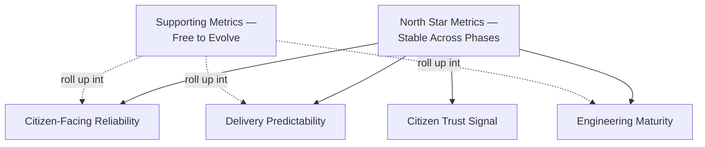

### Full Metrics Table

| Metric | Definition | What a Regression Signals |
|---|---|---|
| **Engineering maturity trend** | Year-over-year change in the Engineering Maturity Scorecard, organization-wide and per team. | A flat or declining trend signals the Continuous Improvement Process is not producing genuine, lasting change. |
| **Process efficiency** | Cycle time from Identification to Standardization for an Improvement Backlog item. | A lengthening trend signals the improvement process itself has become bureaucratic — the exact Process for Process's Sake anti-pattern below. |
| **Automation coverage** | Percentage of identified Automation Debt items resolved, per `ai-docs/32`. | A declining rate signals waste is accumulating faster than it is removed. |
| **Quality trends** | Escaped defect rate and coverage trend, per `ai-docs/15-testing-standards.md`. | A worsening trend signals Quality Health is degrading despite an active improvement program — a direct signal the program is mis-targeted. |
| **Reliability trends** | Uptime and MTTR trend, per `ai-docs/18-observability-standards.md`. | A worsening trend despite active improvement work is this document's most serious possible finding. |
| **Operational improvements** | Count of Improvement Backlog items reaching Standardized status per quarter. | A declining count signals the pipeline itself (Identification through Standardization) has a bottleneck. |
| **Improvement completion rate** | Percentage of Prioritized items reaching Validation within their Target Review Date. | A declining rate signals Improvement Backlog items are being logged but not genuinely resourced. |
| **Engineering satisfaction** | A periodic engineer-experience survey result, cross-referenced against Burnout Indicators in `ai-docs/36-engineering-capacity-planning-resource-management-standards.md`. | A declining trend is treated with the identical urgency already established for that document's own Burnout Indicators metric. |

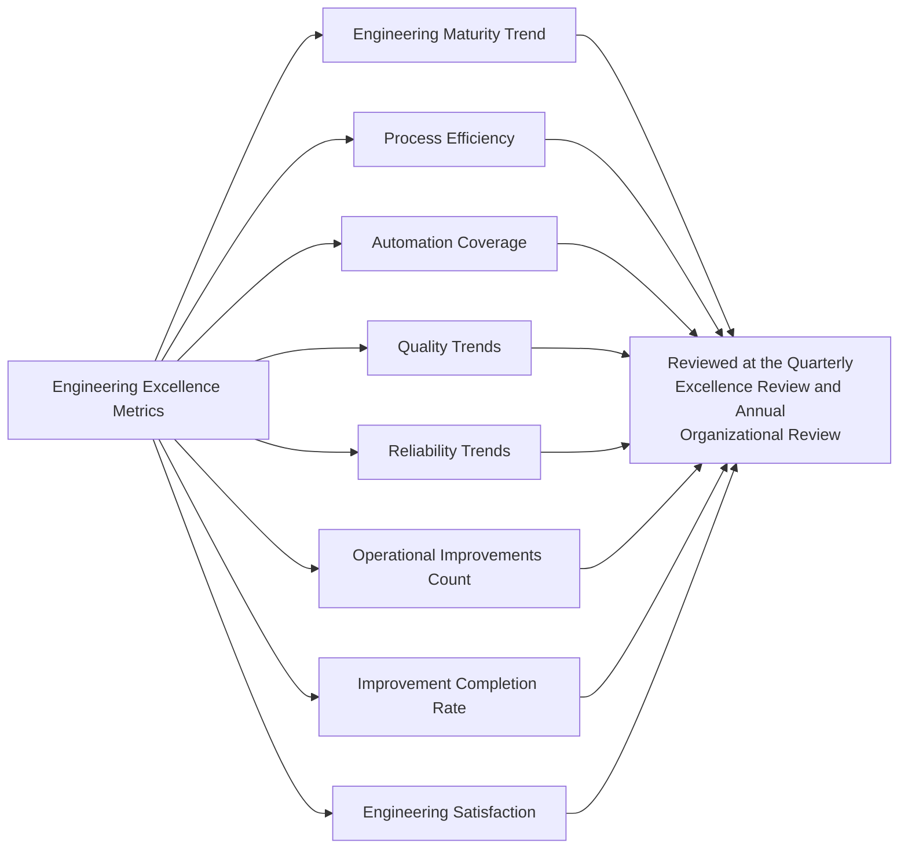

### Industry Benchmarking

Per the governance improvement this document incorporates, Arwal **periodically benchmarks its own metrics against publicly available industry data** (DORA metrics, per `ai-docs/17-cicd-standards.md`'s Pipeline Monitoring; comparable civic-tech or fintech engineering-maturity studies where available) — never to copy another organization's practice wholesale, but to calibrate whether Arwal's own targets are genuinely ambitious, complacent, or unrealistic given its actual context (`ai-docs/09-tech-stack.md`'s "boring, proven tool" philosophy applies identically here: a benchmark is evidence to weigh, never an instruction to follow blindly). Benchmarking is performed at the Annual Organizational Review, with findings explicitly adapted — never adopted wholesale — to Arwal's specific civic mandate, device profile, and regulatory context, per `ai-docs/01-product-goals.md`.

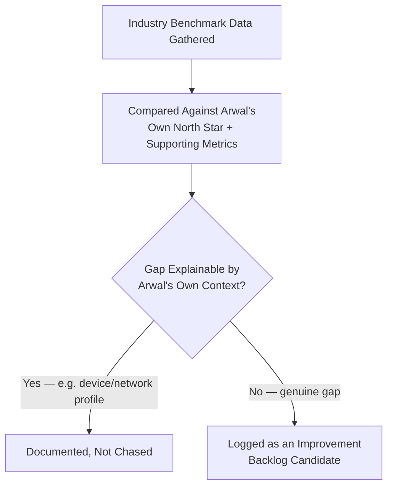

---

# AI-Assisted Operational Excellence

Consistent with the identical AI-assistance principle already established across every governance document in this handbook: **AI accelerates analysis and forecasting, never authority.**

### Trend Analysis

An AI tool may analyze multi-quarter Engineering Health and Excellence Metrics trend lines to surface a pattern a purely manual quarterly review might miss — every such pattern is a lead for a human (typically the Engineering Manager or Quarterly Excellence Review chair) to independently verify before it changes any Maturity Scorecard rating or Improvement Backlog priority.

### Metric Analysis

An AI tool may draft a first-pass summary of a team's Monthly Engineering Review inputs — the draft is verified against the actual underlying data by a human before it is presented, per the identical AI Meeting Summaries standard already established in `ai-docs/29-engineering-governance-decision-authority.md`.

### Improvement Recommendations

An AI tool may suggest a candidate Improvement Backlog item, informed by patterns across postmortems, code review comments, or Technical Debt Register entries — every suggestion is treated as a lead for a human to evaluate and, if adopted, is required to carry a human-stated Success Criterion before Prioritization, per Continuous Improvement Process above; an AI-suggested improvement is never auto-logged with an AI-generated success criterion accepted uncritically.

### Operational Forecasting

An AI tool may project a Reliability or Delivery Predictability trend forward, informing the Annual Organizational Review's priority-setting — every projection is a draft input, independently verified against the actual historical data before it shapes a resourcing decision, mirroring the identical Forecast Validation discipline already established in `ai-docs/36-engineering-capacity-planning-resource-management-standards.md`.

### Human Oversight

No Engineering Maturity Scorecard rating, Improvement Backlog Standardization decision, or process-retirement decision (below) is ever finalized on the basis of an AI tool's analysis alone. The named human Approval Authority — the relevant Governance Board, per `ai-docs/29-engineering-governance-decision-authority.md` — remains fully accountable, identical to the Human Oversight standard already established consistently across `ai-docs/24` through `ai-docs/38`.

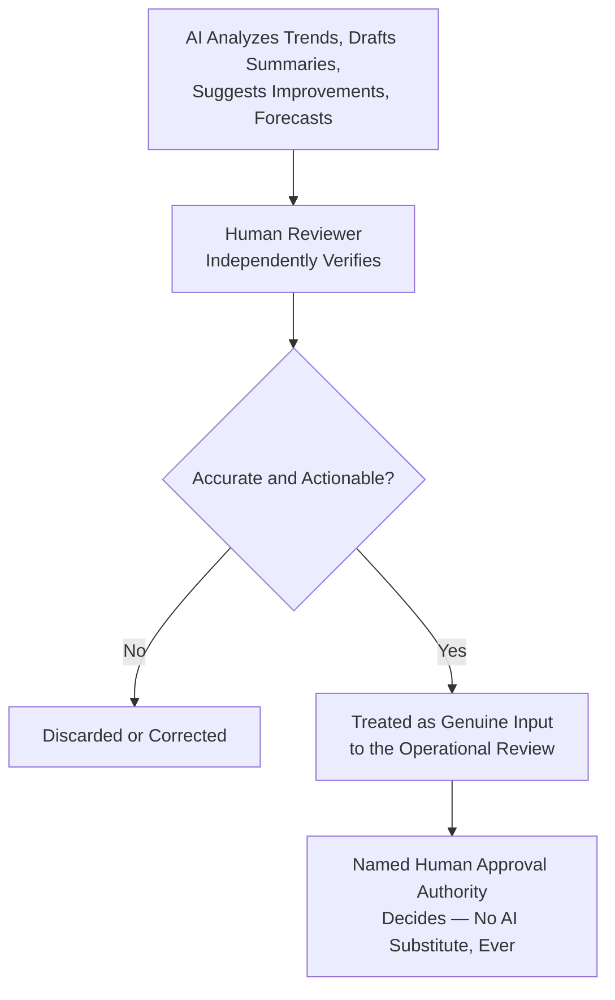

---

# Retiring Outdated Standards

Per the governance improvement this document incorporates, this handbook is not a permanent, one-way accumulation of process — every process, tool, and standard is subject to explicit, deliberate retirement when it no longer earns its cost.

### Retirement Triggers

| Trigger | Example |
|---|---|
| **Superseded by a better alternative** | A manual runbook automated away entirely, per Process Optimization above. |
| **No longer applicable** | A standard written for a technology already deprecated per `ai-docs/09-tech-stack.md`'s Deprecation Policy. |
| **Measured, negative value** | A recurring review or report whose Engineering Excellence Metrics show it consumes capacity with no demonstrated benefit, per Process Efficiency above. |
| **Consistently bypassed in practice** | A standard `ai-docs/29-engineering-governance-decision-authority.md`'s Governance Compliance metric shows is routinely worked around — retired and replaced, never left as a fiction nobody follows. |

### Retirement Process

A retirement follows the identical `ai-docs/24-documentation-standards.md`'s Deprecation → Archiving lifecycle for any affected document — marked deprecated with a pointer to its replacement (or a stated reason no replacement is needed), archived, never silently deleted. A retirement affecting a foundational `ai-docs/*` standard requires the identical Architecture Review Board sign-off already established for any structural handbook amendment throughout this document's governing predecessors.

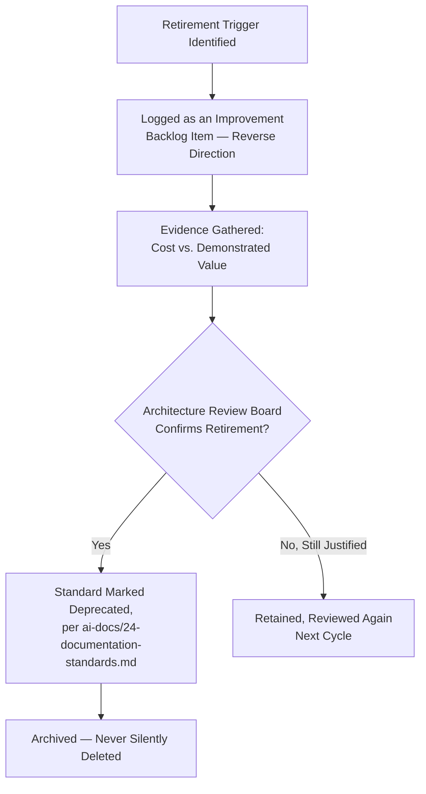

---

# Engineering Anti-Patterns

| Anti-Pattern | Description | Why It's Rejected |
|---|---|---|
| **Measuring everything but improving nothing** | A dashboard full of metrics with no Improvement Backlog item ever tracing back to any of them. | Violates Evidence-Based Decisions above; measurement without action is theater, not operational excellence. |
| **Process for process's sake** | A review, report, or ritual maintained because it has always existed, with no one able to state its Success Criterion. | Violates Simplicity above and directly triggers Retiring Outdated Standards' negative-value trigger. |
| **Ignoring metrics** | A Reliability or Quality trend visibly worsening across multiple Quarterly Excellence Reviews with no corresponding Improvement Backlog response. | Violates the identical Ignoring Debt / Ignoring Known Risks anti-patterns already rejected in `ai-docs/32` and `ai-docs/30`. |
| **Repeating the same mistakes** | An incident whose postmortem action items were never tracked to completion, per `ai-docs/07-development-workflow.md`, recurring in a near-identical form. | Violates Learning Culture above; the single most damaging failure mode a continuous-improvement practice exists to prevent. |
| **Tool sprawl** | Multiple, overlapping tools adopted for the same purpose across different teams with no consolidation. | Violates Simplicity and directly mirrors the Duplicate Libraries anti-pattern already rejected in `ai-docs/22-dependency-management-standards.md`, applied to internal tooling. |
| **Optimization without evidence** | A process change made because it "should" help, with no baseline measurement taken before or after. | Violates Evidence-Based Decisions above; makes Validation (per Continuous Improvement Process) structurally impossible after the fact. |
| **Improvement fatigue** | So many concurrent improvement initiatives that no single one receives the attention needed to actually validate it. | Violates Sustainability above and the identical 100% Utilization Planning anti-pattern already rejected in `ai-docs/36-engineering-capacity-planning-resource-management-standards.md`. |
| **Local optimization hurting the system** | A team improves its own metric (e.g., its own delivery speed) in a way that measurably degrades a shared dimension (e.g., Platform Team's stability, or another team's dependency reliability). | Violates the Engineering Excellence Framework's explicit coupling above; the exact reason this document assesses eight dimensions rather than one blended score. |

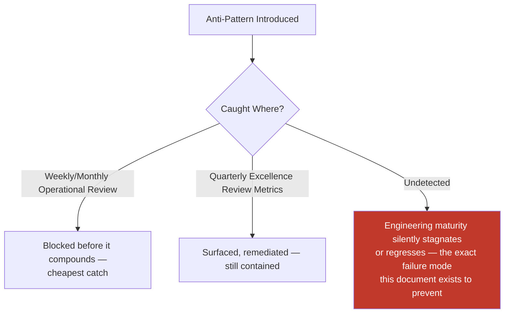

---

# Engineering Review Checklist

Every Improvement Backlog item, Operational Review, or Maturity Scorecard entry is checked against the following before it is considered compliant:

- [ ] **Correctly sourced** — Traced to a Retrospective, postmortem, Maturity Scorecard gap, Risk Register, Technical Debt Register, or a direct proposal, per Improvement Backlog above.
- [ ] **Success Criterion stated before work begins** — Specific and measurable, never vague, per the governance improvement in Continuous Improvement Process.
- [ ] **Named owner assigned** — A specific individual, never a diffuse team.
- [ ] **Prioritized with evidence** — Scored per the reused Technical Debt Prioritization model, never ranked on advocacy alone.
- [ ] **Experimentation time-boxed** — Follows `ai-docs/27-branching-release-strategy.md`'s `experiment/*` discipline where code is touched.
- [ ] **Validated against its own criterion** — Never marked Standardized on optimism alone.
- [ ] **Failed experiments documented** — Where meaningful learning exists, shared per Experimentation Governance above.
- [ ] **Standardization routed correctly** — Through `ai-docs/24-documentation-standards.md` and, where ADR-worthy, `ai-docs/25-architecture-decision-records.md`.
- [ ] **Reviewed at its correct Operational Review cadence** — Weekly, Monthly, Quarterly, or Annual, per Operational Reviews above.
- [ ] **Engineering Health indicators sourced correctly** — Never re-measured redundantly outside their owning document.
- [ ] **North Star Metrics left stable** — No supporting-metric change silently altered a north star definition without Strategic-classification ADR sign-off.
- [ ] **Benchmarking findings adapted, not copied** — Industry data explicitly weighed against Arwal's own civic context before being adopted.
- [ ] **Retirement considered where applicable** — A standard, tool, or process no longer earning its cost is flagged, never left indefinitely by default.
- [ ] **AI-assisted analysis independently verified** — Any AI-surfaced trend, summary, or recommendation fact-checked by a human before being relied upon.
- [ ] **No anti-pattern present** — No measurement without action, process for its own sake, ignored metric trend, repeated mistake, tool sprawl, evidence-free optimization, improvement fatigue, or local optimization harming the system.
- [ ] **No duplication of Governance, Risk Management, Capacity Planning, Portfolio Management, Career Development, Knowledge Management, or Communication standards** — Any such concern deferred entirely to its owning phase document, never redefined here.

An item, review, or scorecard entry failing any item above is not considered complete until resolved — this checklist carries the same non-negotiable authority as every other review checklist established in the preceding thirty-nine phase documents.

---

# Governance Review

| Review | Cadence | Owner | Purpose |
|---|---|---|---|
| **Quarterly excellence reviews** | Quarterly | Engineering Leadership Council | Cross-team Engineering Excellence Metrics; Improvement Backlog's highest-priority items; feeds `ai-docs/38`'s Portfolio Rebalancing. |
| **Annual maturity assessments** | Annual | CTO, VP Engineering, Engineering Leadership Council | The full Engineering Maturity Scorecard, per above; year-over-year trajectory per team and organization-wide. |
| **Process audits** | At minimum semi-annual | Engineering Leadership Council | Confirms every standing review and report still has a stated Success Criterion and demonstrated value, per Retiring Outdated Standards. |
| **Operational audits** | Quarterly | Platform Team + affected Engineering Managers | Confirms the Improvement Backlog and Engineering Health data sources are current, not phantom or stale. |
| **Continuous improvement audits** | Quarterly | Engineering Leadership Council | Confirms the Identification → Standardization pipeline itself is not bottlenecked, per Process Efficiency above. |
| **Framework reviews** | Annual | Engineering Leadership Council, Architecture Review Board | Confirms this document's own dimensions, maturity levels, and North Star Metrics still fit Arwal's actual organizational and technical shape. |

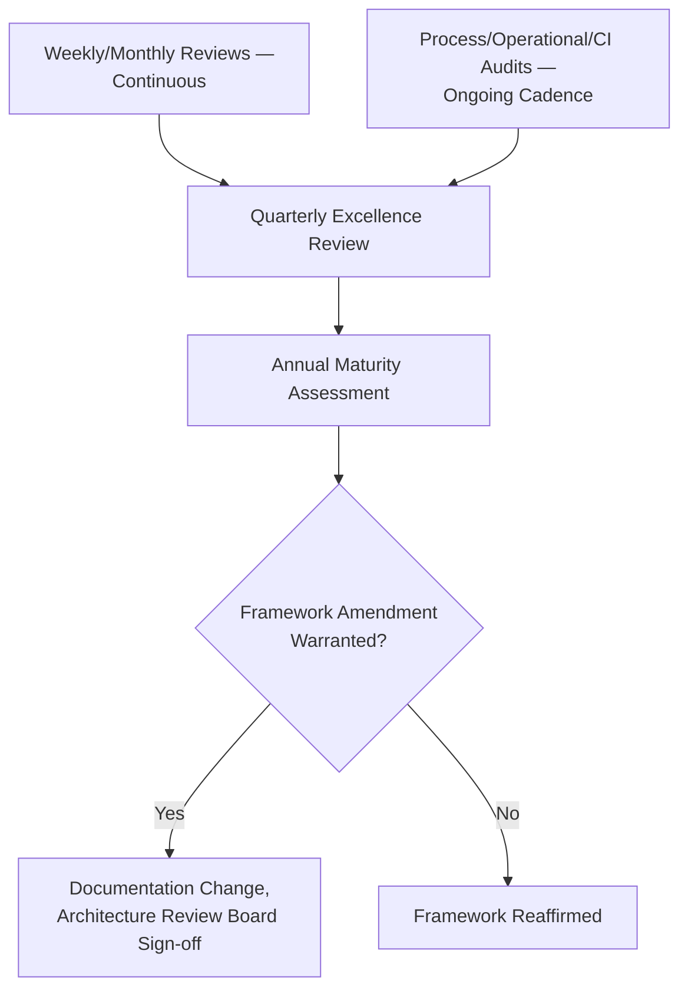

### Annual Framework Review Detail

This document's own maturity-level definitions, dimension list, and North Star Metrics are reviewed no less than annually by the Engineering Leadership Council, per the identical standing self-review commitment already established across `ai-docs/30` through `ai-docs/38`. The review specifically asks: does the five-level maturity model still discriminate meaningfully between teams; has any Engineering Excellence Framework dimension proven redundant or insufficient relative to what Arwal actually needs to track; and do the North Star Metrics still represent the mission, per `ai-docs/00-project-vision.md`, or have they quietly become disconnected from it.

---

# Relationship with Previous Standards

### Project Vision

`ai-docs/00-project-vision.md` establishes the North Star Principle and the founding commitment to infrastructure built for a generation. This document is the operational mechanism that keeps Arwal's engineering practice itself improving in service of that mission, never redefining the mission or its own North Star Principle — this document's own North Star Metrics are a direct, engineering-level translation of it.

### Engineering Principles

`ai-docs/02-engineering-principles.md` establishes KISS, YAGNI, and the Technical Debt Policy. This document's Simplicity and Automation principles are the continuous-improvement-level application of that same founding discipline, never redefining it.

### Engineering Governance

`ai-docs/29-engineering-governance-decision-authority.md` owns the complete organizational decision-authority structure — every Approval Authority named in this document's Governance Review section is drawn directly from that structure, never a new authority invented here.

### Risk Management

`ai-docs/30-engineering-risk-management-standards.md` owns the complete Risk Register and Risk Classification. An operational-excellence finding that meets that document's threshold (a persistent reliability regression, a recurring incident pattern) is logged into that Register, never tracked redundantly here.

### Capacity Planning

`ai-docs/36-engineering-capacity-planning-resource-management-standards.md` owns the Technical Debt Budget and Innovation Allocation this document's improvement work draws capacity from — this document never redefines how capacity is planned or protected, only how the work funded by it is identified, validated, and standardized.

### Portfolio Management

`ai-docs/38-engineering-portfolio-program-management-standards.md` owns Quarterly Portfolio Rebalancing and the Initiative Scoring Model this document's Improvement Backlog reuses rather than duplicates. This document's Quarterly Excellence Review is the evidence source that rebalancing exercise consumes.

### Career Development

`ai-docs/37-engineering-career-development-performance-management-standards.md` owns individual growth, Recognition, and the Competency Framework. A pattern of individual excellence this document's reviews surface (a mentee grown, a runbook that measurably reduced onboarding friction) feeds that document's Recognition category, never redefined here.

### Knowledge Management

`ai-docs/33-engineering-knowledge-management-standards.md` owns Knowledge Capture and Knowledge Sharing mechanics in full. This document's Experimentation Governance and Standardization stage are a specific, structured instance of that document's Knowledge Capture practice, applied to improvement findings.

### Communication Standards

`ai-docs/34-engineering-communication-standards.md` owns every channel, classification, and audience rule this document's shared findings and Operational Review outputs are distributed through, never a new channel invented here.

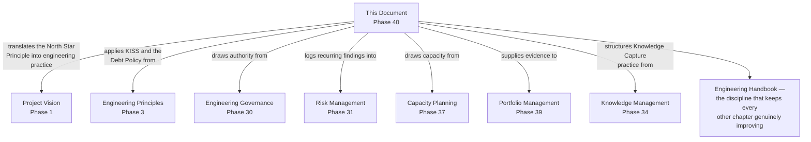

---

# Closing Statement

> **Callout — Closing Statement**
> Every preceding phase document described a standard for how Arwal is designed, built, secured, governed, risk-managed, changed, documented, communicated, staffed, capacity-planned, grown as a career, and coordinated as a portfolio. This document describes the discipline that keeps every one of those standards *true over time* — because a handbook this comprehensive, written once at Phase 1 through Phase 39, does not stay correct by accident across ~260 more micro-phases, a team growing from a handful of founding engineers to hundreds, and a technology and citizen landscape that will keep changing in ways no committee could fully anticipate today. Operational excellence is not a department, a dashboard, or a quarterly ritual performed for its own sake — it is Arwal's standing, structural promise to itself that every claim of improvement is backed by evidence, every lesson (including every failure) is captured and shared, every process that no longer earns its keep is retired rather than accumulated, and every team's maturity is visible, honest, and continuously growing. A district's trust in Arwal, sustained for a generation, ultimately rests on this: not that Arwal was built well once, but that it never stops getting better, deliberately, measurably, and together. Where a future phase must deviate from a standard stated here, that deviation is made explicitly — through this document's own Governance Review process, or a Strategic-classification ADR where the deviation is structural — never silently, and never by default.

This document, `ai-docs/39-engineering-operational-excellence-continuous-improvement-standards.md`, is Phase 40 of approximately 300. Every improvement identified, validated, standardized, and retired in the phases that follow is expected to satisfy the standards defined here, or to justify its deviation in writing.

**End of Phase 40 — `ai-docs/39-engineering-operational-excellence-continuous-improvement-standards.md`**