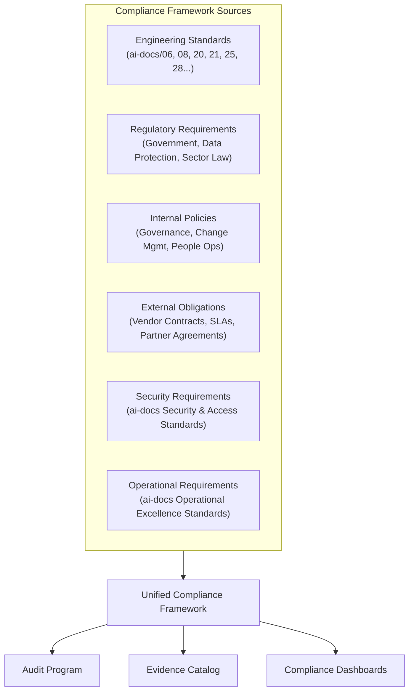
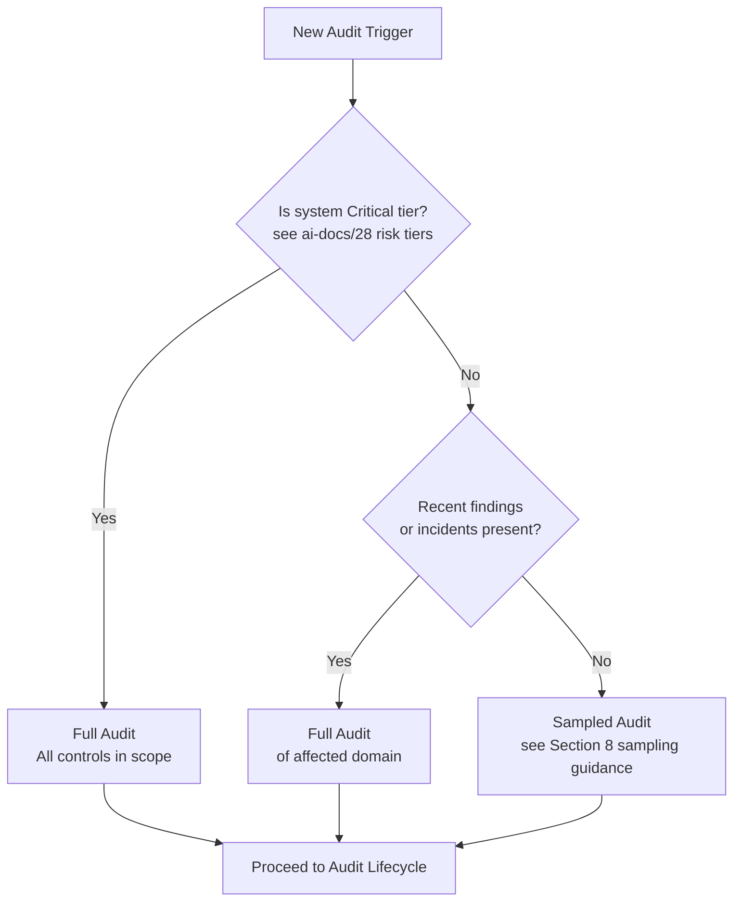
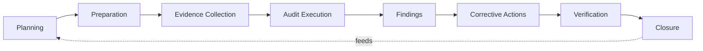
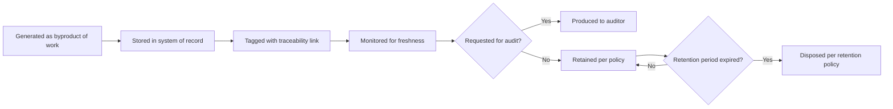
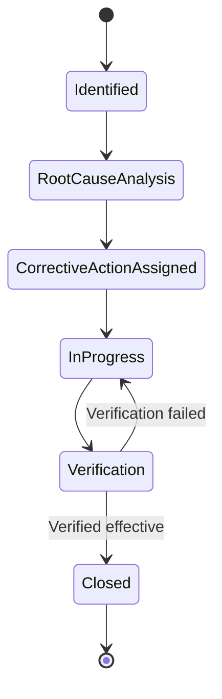
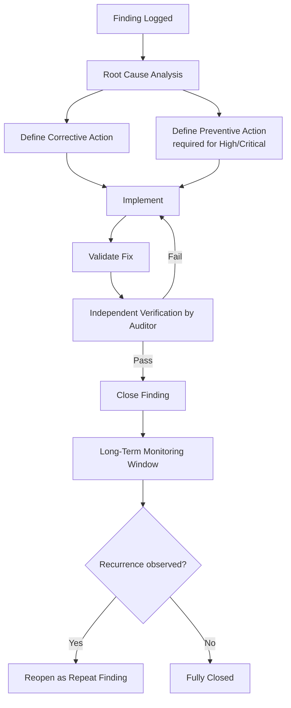
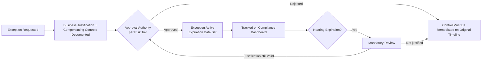
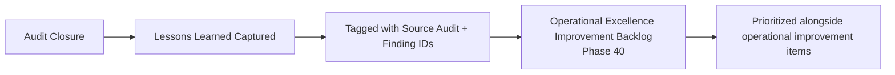

# Engineering Compliance & Audit Standards

**Document:** `ai-docs/40-engineering-compliance-audit-standards.md`
**Stage:** 1 — Foundation
**Phase:** 41
**Status:** Authoritative — Single Source of Truth for Compliance & Audit Standards
**Audience:** CTO, VP Engineering, CISO, Internal Audit Director, Compliance Officer, Architecture Review Board, Platform/Security/SRE Leads, Engineering Managers, Government Technical Partners, Vendor Partners

---

## How to Use This Document

This document governs how Arwal engineering demonstrates compliance, prepares for and undergoes audits, manages evidence, tracks findings, and continuously verifies adherence to its own engineering standards and to external obligations.

It does **not** redefine the substance of standards that already exist elsewhere. Every time this document references a rule that lives in another `ai-docs/` file, it cites that file by name instead of restating it. If a future reader finds a conflict between this document and an authoritative source document, the source document wins for its subject matter, and this document's audit/evidence/compliance mechanics still apply on top of it.

---

# 1. Purpose of This Document

Arwal is being built as critical civic-commerce infrastructure for over one million residents, spanning commerce, food, grocery, marketplace, property, jobs, farmer services, healthcare, education, government services, payments, logistics, and community life. At that scale, engineering claims of "we follow the standard" are not enough — Arwal must be able to **prove** it, on demand, to auditors, regulators, government technical partners, security assessors, and its own leadership.

Compliance and audit exist for four concrete reasons:

1. **Public trust is not optional.** A district-scale system touching healthcare and government services fails its mission if residents or officials cannot trust that it operates safely, lawfully, and predictably.
2. **Regulatory and contractual obligations are real, not theoretical.** Government integrations, payments, and healthcare domains bring statutory, contractual, and sector-specific obligations that must be demonstrably met, not merely believed to be met.
3. **Evidence protects the organization and the individual engineer.** When something goes wrong, a documented, evidenced compliance posture protects Arwal from unfounded blame and protects engineers from being scapegoated for systemic gaps.
4. **Audits are a forcing function for honesty.** Left alone, engineering organizations drift from their stated standards. Audits catch this drift before it becomes an incident, a breach, or a regulatory failure.

### Evidence Over Assumptions

The central discipline of this document is a single sentence: **"We believe we are compliant" is not a valid answer. "Here is the evidence" is.**

Every control, standard, and process referenced by this document must be paired with evidence that can be produced without last-minute scrambling. If evidence cannot be produced on demand, the control is treated as **not proven**, regardless of whether it is actually being followed.

### Continuous Compliance, Not Point-in-Time Audit Prep

A recurring failure mode in engineering organizations is treating compliance as a fire drill that happens right before an audit. Arwal rejects this model. Compliance is a **continuously monitored state**, not a costume worn for auditors once a quarter. Section 5 (Audit Lifecycle) and Section 6 (Compliance Evidence) formalize this as **continuous compliance monitoring**, with audit events treated as periodic, independent verification of a state that should already be true at all times.

---

# 2. Compliance Philosophy

Each principle below exists to solve a specific, named failure mode observed in engineering organizations that scale without discipline.

| Principle | Statement | Why It Exists |
|---|---|---|
| **Compliance by Design** | Compliance requirements are built into architecture, workflows, and tooling from the start, not bolted on afterward. | Retrofitting compliance onto an existing system is exponentially more expensive and error-prone than designing for it. Prevents the "we'll fix it before launch" trap that never gets paid down. |
| **Evidence-Based Compliance** | Every compliance claim must be backed by artifact-level evidence (logs, records, signed approvals, test results, tickets). | Verbal assurances do not survive audits, incidents, or legal review. Evidence is durable; memory and good intentions are not. |
| **Continuous Verification** | Compliance status is checked on an ongoing basis via automated and manual controls, not only during scheduled audits. | Point-in-time checks miss drift that occurs between audits. Continuous verification shrinks the window during which a violation can go undetected. |
| **Transparency** | Compliance status, findings, and exceptions are visible to relevant stakeholders, not hidden or minimized. | Hidden non-compliance is a ticking liability. Transparency allows problems to be resourced and fixed instead of discovered during a crisis. |
| **Traceability** | Every requirement can be traced forward to the control that satisfies it and backward from any artifact to the requirement it supports. | Without traceability, organizations cannot prove coverage or identify gaps — they can only guess. |
| **Least Surprise** | Audits should confirm what engineering already knows about itself; audit day should never be the first time a gap is discovered. | Surprise findings indicate a monitoring failure, not just a compliance failure. Least Surprise measures whether continuous compliance monitoring is actually working. |
| **Accountability** | Every control, finding, and corrective action has a named, single owner. | Shared ownership of compliance obligations reliably becomes no one's ownership. Single-owner accountability is the only model that survives contact with a real incident. |
| **Continuous Improvement** | Every audit, finding, and near-miss is treated as an input to improving the compliance system itself, not just the immediate defect. | Without a feedback loop, the same classes of findings recur audit after audit. Continuous improvement is what converts audits from a cost center into a source of organizational learning. |

---

# 3. Compliance Framework

Arwal's compliance obligations come from six overlapping sources. This section defines each source and how they relate to one another; it does not restate their substantive content, which lives in the referenced documents.

| Source | Definition | Owner | Relationship to This Document |
|---|---|---|---|
| **Engineering Standards** | Internally authored technical and process standards (coding, testing, error handling, configuration, dependency governance, ADRs, etc.) | Principal Architects / Tech Leads | This document verifies *adherence* to these standards; it does not define them. |
| **Regulatory Requirements** | Statutory and sector-specific obligations arising from government, healthcare, and payments domains | Compliance Officer, Legal Counsel | Regulatory requirements are mapped into the Evidence Catalog (Section 6) and into Audit Types (Section 4). |
| **Internal Policies** | Governance, change management, HR/People Operations standards already defined elsewhere | Respective policy owners | Cross-referenced, never duplicated. |
| **External Obligations** | Vendor contracts, partner SLAs, government integration agreements | Vendor Management, Legal | Subject to Vendor Audits (Section 4). |
| **Security Requirements** | Security controls, access management, data protection controls | CISO / Security Lead | Verified via Security Audits (Section 4); substantive controls live in the Security Standards document. |
| **Operational Requirements** | Reliability, incident response, and operational excellence obligations | SRE Lead | Verified via Operational Audits (Section 4); substantive practices live in the Operational Excellence Standards document (Phase 40). |

**Relationship rule:** Every requirement in the Compliance Framework must map to exactly one authoritative source document. If a requirement cannot be traced to a source document, it is either (a) missing from engineering standards and must be raised as a gap, or (b) not a real requirement and should be discarded rather than informally enforced.

---

# 4. Audit Types

| Audit Type | Scope | Typical Trigger | Typical Auditor |
|---|---|---|---|
| **Internal Engineering Audit** | Adherence to internal engineering standards (coding, testing, documentation, workflow) | Scheduled (quarterly) | Internal Audit function, peer Tech Leads |
| **Security Audit** | Access controls, secrets management, vulnerability management, data protection | Scheduled + trigger-based (major release, incident) | CISO / Security team, external pen-testers |
| **Architecture Audit** | Adherence to architecture principles, ADR compliance, system boundaries | Scheduled (semi-annual), major architecture change | Architecture Review Board |
| **Operational Audit** | Incident response effectiveness, SLO adherence, on-call practices | Scheduled (quarterly) | SRE Lead, Internal Audit |
| **Process Audit** | Change management, release process, dependency governance adherence | Scheduled (quarterly) | Internal Audit, Engineering Managers |
| **Vendor Audit** | Third-party and vendor compliance with contractual and security obligations | Scheduled (annual) + onboarding | Vendor Management, Security |
| **Government Audit** | Compliance with government integration and public-sector requirements | Regulator-initiated or scheduled per agreement | Government Technical Partners, external regulator |
| **Compliance Review** | Cross-cutting review of overall compliance posture across all domains | Scheduled (quarterly executive review) | Compliance Officer, CTO |

**Audit scope decision tree:**

---

# 5. Audit Lifecycle

Every audit — regardless of type — follows the same eight-stage lifecycle. This standardization allows evidence, tooling, and dashboards to be reused across audit types.

| Stage | Purpose | Key Activities | Primary Owner |
|---|---|---|---|
| **Planning** | Define scope, type, timeline, and audit criteria | Select audit type, define scope boundary, assign auditor(s), set schedule | Compliance Officer |
| **Preparation** | Confirm readiness before formal evidence collection begins | Run pre-audit checklist (Section 8), notify system owners, freeze relevant change windows if required | Audit Lead / System Owner |
| **Evidence Collection** | Gather evidence per the Evidence Catalog (Section 6) | Pull logs, records, approvals, test results, tickets; validate against evidence quality bar | Evidence Owners (per catalog) |
| **Audit Execution** | Independent examination of evidence against criteria | Auditor reviews evidence, conducts interviews, tests controls (full or sampled per Section 4 decision tree) | Auditor (internal or external) |
| **Findings** | Document gaps between required state and observed state | Classify severity (Section 9), document root cause hypothesis, assign owner | Auditor + System Owner |
| **Corrective Actions** | Define and execute remediation (CAPA) | Draft corrective and preventive actions, assign owner and due date | System Owner (with Auditor sign-off on plan) |
| **Verification** | Confirm the corrective action actually closed the gap | Re-test control, review new evidence, confirm no regression | Auditor |
| **Closure** | Formally close the audit and feed lessons back into the system | Publish final report, update dashboards, feed lessons learned into Operational Excellence Improvement Backlog (Phase 40) | Compliance Officer |

**Continuous compliance monitoring** operates in parallel to this lifecycle, not instead of it: automated control checks and evidence freshness monitors run continuously so that when an audit begins, Preparation should confirm readiness rather than manufacture it.

---

# 6. Compliance Evidence

### 6.1 Evidence Catalog

The Evidence Catalog is the standardized, authoritative list of evidence types Arwal maintains. Every entry has a named owner and a retention period. New evidence types must be added here before being relied upon in any audit.

| Evidence Type | Example Artifact | Owner | Retention | Traceability Link |
|---|---|---|---|---|
| Access review records | Quarterly access recertification reports | Security Lead | 3 years | Maps to Security Standards access control requirements |
| Change approval records | Change tickets with approver sign-off | Engineering Manager (per domain) | 3 years | Maps to Change Management standards (ai-docs/31) |
| Dependency approval records | Dependency governance tickets and SBOM snapshots | Platform Lead | 3 years | Maps to Dependency Governance standards (ai-docs/28) |
| ADR records | Approved Architecture Decision Records | Principal Architect | Permanent | Maps to ADR Governance standards (ai-docs/25) |
| Incident records | Incident timelines, postmortems, action items | SRE Lead | 3 years | Maps to Operational Excellence standards (Phase 40) |
| Configuration audit logs | Config change history per environment | Platform Lead | 3 years | Maps to Configuration Management standards (ai-docs/21) |
| Error/exception logs | Structured error logs, error budget reports | SRE Lead | 1 year (raw), 3 years (summarized) | Maps to Error Handling standards (ai-docs/20) |
| Test evidence | CI test reports, coverage reports | QA Lead | 1 year | Maps to Testing standards |
| Security scan results | Vulnerability scan reports, pen-test reports | CISO | 3 years | Maps to Security Standards |
| Training and competency records | Completed training logs, certification records | HR/People Ops | Duration of employment + 1 year | Maps to Career Development standards (ai-docs/37) |
| Vendor compliance records | Vendor audit reports, signed attestations | Vendor Management | 3 years | Maps to Vendor governance sections of Dependency Governance (ai-docs/28) |
| Exception records | Approved compliance exceptions with expiry | Compliance Officer | 3 years past expiry | Maps to Section 10 (Compliance Exception Governance) |
| CAPA records | Corrective/preventive action tickets and verification evidence | Audit Lead | 3 years | Maps to Section 9 (CAPA) |

### 6.2 Evidence Ownership

Each evidence type has exactly one accountable owner. Owners are responsible for:

- Ensuring evidence is generated as a byproduct of normal work (not manufactured after the fact)
- Maintaining evidence in its system of record
- Producing evidence on request within one business day for non-critical requests, and within four hours for critical/regulator requests

### 6.3 Evidence Quality Bar

Evidence is only counted as valid if it is:

1. **Contemporaneous** — created at the time the activity occurred, not reconstructed afterward.
2. **Attributable** — clearly tied to a named individual, system, or role.
3. **Immutable or version-controlled** — tamper-evident, with a clear change history if mutable.
4. **Traceable** — linked to the specific requirement or control it supports.

Evidence failing any of these four tests is treated as **absent**, not merely weak.

### 6.4 Evidence Lifecycle

---

# 7. Audit Preparation

Audit Preparation exists to confirm — not create — readiness. If Preparation regularly surfaces large gaps, that is itself a finding against continuous compliance monitoring.

### 7.1 Audit Readiness Principles

- Readiness is measured continuously via automated evidence-freshness checks, not assembled reactively.
- Any evidence gap discovered during Preparation must be logged even if it is fixed before the audit, so patterns of last-minute gaps can be tracked over time.

### 7.2 Pre-Audit Checklist

- [ ] Audit scope and type confirmed against Section 4
- [ ] Evidence Catalog entries relevant to scope identified
- [ ] Evidence freshness validated for each in-scope entry (no evidence older than its defined refresh interval)
- [ ] Evidence owners notified and availability confirmed
- [ ] Prior audit's open findings reviewed for status
- [ ] Any active compliance exceptions in scope identified and reviewed for expiry
- [ ] Sampling plan defined (if applicable, per Section 4 decision tree)
- [ ] Communication sent to affected teams regarding audit timeline
- [ ] Audit logistics confirmed (access, tooling, interview schedule)

---

# 8. Audit Findings

### 8.1 Severity Matrix

| Severity | Definition | Example | Required Response Time | Escalation |
|---|---|---|---|---|
| **Critical** | Active violation with material risk to residents' data, safety, funds, or legal standing | Unencrypted PII in a payments-adjacent service; missing access controls on healthcare data | Immediate remediation plan within 24 hours | CTO + CISO + Compliance Officer notified immediately |
| **High** | Significant control gap with realistic path to material harm | Dependency governance bypass on a Critical-tier service | Remediation plan within 3 business days | VP Engineering + domain Engineering Manager |
| **Medium** | Control gap with limited blast radius or requiring specific conditions to matter | Incomplete access review for a Low-tier internal tool | Remediation plan within 2 weeks | Engineering Manager |
| **Low** | Minor deviation from standard with negligible risk | Missing changelog entry, cosmetic documentation drift | Remediation within next planning cycle | Tech Lead |

### 8.2 Finding Requirements

Every finding rated Medium or above **must** include:

1. A documented **root cause analysis** — not merely a description of the symptom.
2. A named, single **owner**.
3. At least one **measurable corrective action** (Section 9) with a defined completion criterion.

Findings without a linked root cause analysis and measurable corrective action are not eligible for closure, regardless of severity.

### 8.3 Finding Lifecycle

---

# 9. Corrective & Preventive Actions (CAPA)

### 9.1 Definitions

- **Corrective Action** — addresses the specific instance of the finding (fixes what is broken now).
- **Preventive Action** — addresses the systemic cause so the same class of finding does not recur elsewhere.

Every Medium+ finding requires a corrective action. High and Critical findings additionally require a preventive action.

### 9.2 CAPA Workflow

### 9.3 Long-Term Monitoring

Closed CAPA items for High and Critical findings remain under a defined monitoring window (minimum 90 days) during which recurrence automatically reopens the finding as a **repeat finding**, which is escalated one severity level above its original rating.

---

# 10. Compliance Exception Governance

Not every gap can be closed immediately. When a control genuinely cannot be met on schedule, Arwal uses a formal, time-boxed exception process rather than silent non-compliance.

### 10.1 Exception Requirements

Every compliance exception must include:

| Field | Requirement |
|---|---|
| **Business Justification** | Written explanation of why the control cannot currently be met and why proceeding without it is acceptable |
| **Compensating Controls** | At least one alternative control that reduces risk while the exception is active |
| **Approval Authority** | Determined by risk tier of the affected system (see table below) |
| **Expiration Date** | Mandatory; exceptions never granted as indefinite or "until further notice" |
| **Review Before Renewal** | Exception must be re-justified and re-approved before expiry; auto-renewal is prohibited |

### 10.2 Approval Authority by Risk Tier

| Risk Tier | Approval Authority | Maximum Exception Duration |
|---|---|---|
| Critical | CTO + CISO (joint approval) | 30 days |
| High | VP Engineering + Compliance Officer | 60 days |
| Medium | Engineering Manager + Compliance Officer | 90 days |
| Low | Engineering Manager | 180 days |

### 10.3 Exception Lifecycle

All active exceptions are visible on the Compliance Officer and CTO dashboards (Section 12) at all times, including days remaining until expiry.

---

# 11. Compliance Metrics

| Metric | Definition | Target Direction |
|---|---|---|
| **Audit Pass Rate** | % of audits closed with no Critical/High findings | Increasing |
| **Findings by Severity** | Count of open findings per severity tier | Decreasing, especially Critical/High |
| **Repeat Findings** | % of findings that recur after closure | Decreasing toward zero |
| **Evidence Completeness** | % of Evidence Catalog entries meeting freshness requirement at any point in time | Increasing toward 100% |
| **CAPA Completion Rate** | % of corrective actions completed by due date | Increasing toward 100% |
| **Compliance Trend** | Rolling trend of overall compliance posture across domains | Stable or improving |
| **Audit Readiness Score** | Composite score from continuous monitoring reflecting real-time readiness | Increasing |
| **Overdue Corrective Actions** | Count of CAPA items past their due date, by severity | Zero, always visible |
| **Active Exceptions** | Count of active compliance exceptions, with days-to-expiry | Minimized, always visible |

---

# 12. Compliance Dashboards

Each stakeholder group requires a different lens on the same underlying data.

| Dashboard | Audience | Key Content |
|---|---|---|
| **Executive Compliance Dashboard** | CTO, VP Engineering | Compliance Trend, Audit Pass Rate, Overdue Corrective Actions (by severity), Active Exceptions nearing expiry |
| **Security Compliance Dashboard** | CISO, Security Team | Security audit findings, vulnerability remediation SLAs, access review completeness |
| **Audit Committee Dashboard** | Audit Committee, Compliance Officer | Full audit calendar, findings by severity and age, CAPA completion rate, repeat findings |
| **Government Stakeholder Dashboard** | Government Technical Partners | Government-audit-relevant findings and remediation status, regulatory evidence completeness |
| **Engineering Manager Dashboard** | Engineering Managers | Team-level findings, CAPA ownership and due dates, evidence-owner responsibilities |

**Executive visibility rule:** Overdue corrective actions for High and Critical findings must appear on the Executive Compliance Dashboard automatically once past due — this is not a manual escalation step, it is a standing, always-on visibility requirement.

---

# 13. AI-Assisted Compliance

AI tools may assist with compliance and audit work strictly within the following boundaries, consistent with the AI-assistance boundary established across all prior governance documents: **AI tools assist but never substitute for human decision-making authority.**

| Activity | AI Role | Human Role |
|---|---|---|
| **Evidence Discovery** | Surface candidate evidence artifacts matching a requirement | Human validates evidence meets the quality bar (Section 6.3) before it is relied upon |
| **Compliance Analysis** | Identify potential gaps between stated requirements and observed state | Human confirms whether a genuine finding exists and assigns severity |
| **Audit Preparation** | Draft checklists, summarize prior findings, flag stale evidence | Human reviews and approves preparation before audit begins |
| **Trend Analysis** | Identify patterns across findings (e.g., recurring root causes) | Human interprets trend significance and decides on systemic action |
| **Report Drafting** | Draft audit report language from structured findings data | Auditor and Compliance Officer approve final report content and severity ratings |

AI-generated compliance analysis is never treated as evidence itself; it may only point to evidence that a human then validates.

---

# 14. Engineering Anti-Patterns

| Anti-Pattern | Why It's Harmful |
|---|---|
| **Audit-Only Compliance** | Treating compliance as something that only matters during an audit window guarantees drift the rest of the year. |
| **Missing Evidence** | A control that cannot produce evidence is functionally unproven, no matter how well it is actually followed. |
| **Last-Minute Preparation** | Scrambling before an audit is a symptom that continuous compliance monitoring has failed. |
| **Compliance Theater** | Producing documentation that looks compliant without the underlying practice being real is worse than no documentation, because it hides risk. |
| **Ignoring Findings** | Findings left open erode the credibility of the entire audit program and compound risk over time. |
| **Repeated Violations** | Recurrence of a "closed" finding indicates the corrective action addressed a symptom, not the root cause. |
| **Documentation Drift** | Standards documents that no longer reflect real practice make every downstream audit unreliable. |
| **Ownership Gaps** | Evidence or findings without a single named owner reliably become no one's responsibility. |

---

# 15. Engineering Review Checklist

- [ ] Every in-scope requirement is traced to exactly one authoritative source document
- [ ] Every Evidence Catalog entry has a named owner and defined retention period
- [ ] Evidence freshness is monitored continuously, not just before scheduled audits
- [ ] Audit scope for the current cycle correctly applies the Critical-tier full-audit rule
- [ ] All open findings have a documented root cause analysis
- [ ] All Medium+ findings have at least one measurable corrective action with an owner and due date
- [ ] All High/Critical findings have a preventive action in addition to a corrective action
- [ ] Closed CAPA items for High/Critical findings are within their long-term monitoring window
- [ ] All active compliance exceptions have a documented business justification, compensating control, approval per risk tier, and expiration date
- [ ] No compliance exception is set to auto-renew
- [ ] Overdue corrective actions are visible on the Executive Compliance Dashboard
- [ ] Lessons learned from the most recent audit have been logged into the Operational Excellence Improvement Backlog (Phase 40)
- [ ] AI-assisted compliance outputs have been validated by a named human before being relied upon

---

# 16. Governance Review

| Review Type | Frequency | Owner | Output |
|---|---|---|---|
| **Quarterly Compliance Review** | Quarterly | Compliance Officer | Updated compliance metrics, review of active exceptions |
| **Annual Audit Planning** | Annual | Compliance Officer + CTO | Approved audit calendar for the year, covering all audit types in Section 4 |
| **Compliance Framework Review** | Annual, or upon major regulatory change | Compliance Officer + Legal | Updated mapping of regulatory/contractual sources into the framework |
| **Evidence Catalog Audit** | Semi-annual | Compliance Officer | Confirmation that all evidence types remain owned, retained correctly, and traceable |
| **CAPA Program Review** | Quarterly | Audit Lead | Review of CAPA completion rate, repeat findings, aging corrective actions |
| **Exception Governance Review** | Quarterly | Compliance Officer | Review of all active exceptions and upcoming expirations |

---

# 17. Post-Audit Lessons Learned

Every audit closure must produce a lessons-learned summary answering:

1. What made evidence collection harder or easier than expected?
2. Did any finding represent a *class* of issue rather than an isolated one?
3. What continuous-monitoring gap allowed this finding to reach audit day undetected (Least Surprise principle)?
4. What systemic improvement would prevent this class of finding in future audits?

These lessons are **required inputs**, not optional notes: each lessons-learned item must be logged directly into the **Operational Excellence Improvement Backlog** established in Phase 40, tagged with the source audit, so that compliance learning feeds the same continuous-improvement mechanism as operational learning rather than living in a separate, disconnected audit archive.

---

# 18. Relationship with Previous Standards

| Prior Document | Relationship to This Document |
|---|---|
| **Project Vision** | Defines *why* Arwal exists; this document ensures engineering delivery of that vision is verifiably compliant. |
| **Engineering Principles** | Defines *how* engineers should think and work; this document verifies adherence through audits. |
| **Security Standards** | Defines *what* security controls must exist; this document defines *how* security compliance is audited and evidenced. |
| **Documentation Standards** | Defines *how* documents must be written and maintained; this document treats documentation currency as an audit criterion. |
| **Governance (ai-docs/25, 31)** | Defines decision-making and change authority; this document audits adherence to those authority structures. |
| **Risk Management** | Defines risk tiers and treatment; this document uses risk tier to scale audit scope (Section 4) and exception approval authority (Section 10). |
| **Operational Excellence Standards (Phase 40)** | Defines operational practice and the Improvement Backlog; this document feeds audit lessons learned directly into that backlog (Section 17). |
| **Portfolio Management** | Defines prioritization across initiatives; this document ensures compliance and CAPA work is visible for portfolio-level prioritization. |
| **Knowledge Management** | Defines how organizational knowledge is captured; this document treats evidence and audit reports as a specific, high-rigor category of organizational knowledge. |

---

# 19. Closing Statement

Arwal exists to serve as trusted digital infrastructure for an entire district — a role that carries obligations far beyond ordinary software delivery. Disciplined compliance and evidence-based auditing are not bureaucratic overhead layered on top of engineering; they are the mechanism by which Arwal proves, continuously and verifiably, that its engineering practice matches its stated standards.

By requiring evidence over assumption, continuous monitoring over point-in-time preparation, root-caused corrective action over symptom patching, and time-boxed, transparent exceptions over silent non-compliance, Arwal builds an engineering organization whose compliance posture can be trusted by its own leadership, by government partners, by regulators, and — ultimately — by the residents who depend on it. This discipline protects Arwal's engineering quality, its regulatory standing, and its long-term sustainability as it scales toward the full 300-phase vision.

