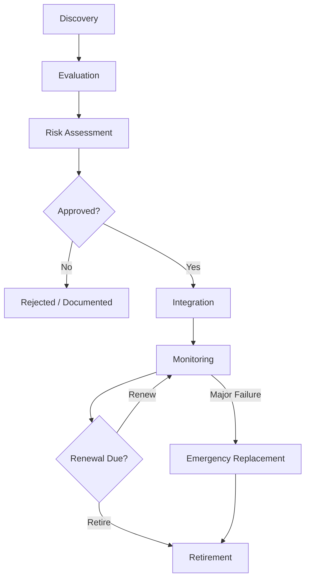
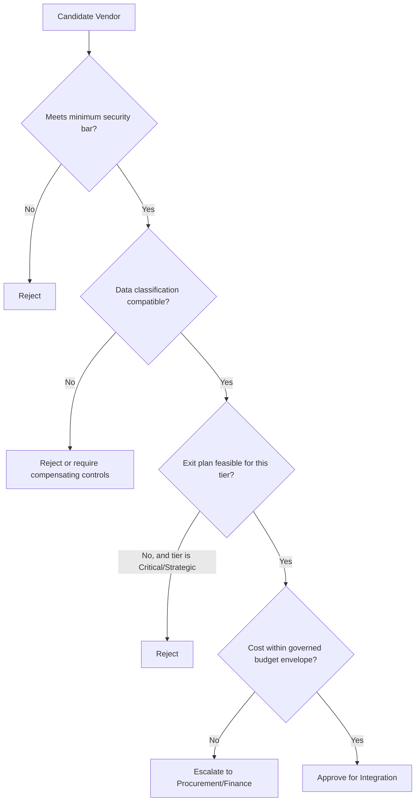
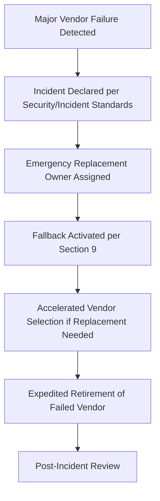

# Engineering Vendor & Third-Party Management Standards

**Document ID:** 41
**Stage:** 1
**Phase:** 42
**Project:** Arwal (District Super App)
**Status:** Adopted Engineering Standard
**Owner:** VP Engineering / CTO Office
**Applies To:** All engineering departments, platform teams, SRE, DevOps, AI Platform, Security, and any team that procures, integrates, or operates a third-party dependency on behalf of Arwal

---

## 1. Purpose of this Document

Arwal is a district-scale super app spanning government services, healthcare, payments, an AI platform, and general-purpose civic infrastructure. No organization of this scope builds everything itself. Arwal engineering will depend on cloud providers, SaaS platforms, external APIs, commercial software, consulting partners, and open-source ecosystems for the lifetime of the product.

This document exists because **every third party Arwal depends on is also a third party Arwal's citizens indirectly depend on.** A payments vendor outage, a government API deprecation, or a SaaS platform's data breach becomes an Arwal incident regardless of who is technically at fault. Vendor governance is therefore not an administrative formality — it is an extension of Arwal's engineering reliability, security, and compliance posture.

### Why Vendor Governance Matters

| Risk if Ungoverned | Consequence |
|---|---|
| No formal vendor evaluation | Insecure or unreliable tools enter production silently |
| No classification of vendor criticality | Engineering treats a critical payments processor the same as a internal analytics widget |
| No exit planning | Arwal becomes hostage to a vendor's pricing, roadmap, or failure |
| No monitoring after onboarding | Vendor degrades in quality, security, or support without anyone noticing |
| No retirement discipline | Dead vendors continue to hold data, cost money, and expand attack surface |

### Third-Party Engineering Risks

Arwal engineering recognizes seven persistent categories of third-party risk: security risk, availability risk, financial risk, compliance risk, concentration risk, supply-chain risk, and strategic/roadmap risk. Every section of this document maps back to mitigating one or more of these.

### Long-Term Sustainability and Strategic Partnerships

Arwal is a multi-decade civic platform, not a short-lived product. Vendor decisions made in Stage 1 will still be load-bearing in Stage 20. This document therefore favors vendors and practices that compound in value — deep integration with vendors who are genuinely strategic, and deliberate shallow, replaceable integration with everything else.

---

## 2. Vendor Governance Philosophy

| Principle | Why It Exists |
|---|---|
| **Buy before build (when appropriate)** | Engineering time is Arwal's scarcest resource. Building undifferentiated infrastructure (e.g., email delivery, SMS gateways, generic observability) diverts effort from Arwal-specific value: civic and citizen-facing systems. Buy when the capability is commoditized; build when it is a genuine differentiator or when no vendor can meet government/compliance constraints. |
| **Least vendor lock-in** | Arwal must remain able to change vendors without existential cost. Lock-in shifts negotiating power to the vendor and increases long-term risk, especially for a government-adjacent platform expected to operate for decades. |
| **Business continuity first** | A vendor failure must degrade Arwal gracefully, not catastrophically. Continuity planning is required before criticality, not after an incident. |
| **Evidence-based selection** | Vendor selection decisions must be justified by verifiable technical, security, and financial evidence — not vendor marketing, familiarity, or convenience. |
| **Security first** | A vendor is an extension of Arwal's attack surface and data custodianship. No vendor is onboarded without a security evaluation proportional to the data and criticality involved. |
| **Transparency** | Vendor relationships, costs, and risks must be visible to engineering leadership and, where relevant, auditors and government partners — never siloed in a single team's private knowledge. |
| **Exit readiness** | Every Critical or Strategic vendor relationship must have a documented, tested exit path before it is approved, not improvised after a crisis. |
| **Continuous monitoring** | Vendor risk is not static. A vendor evaluated as low-risk at onboarding can become high-risk after a leadership change, acquisition, security incident, or financial distress. Monitoring must be ongoing, not a one-time gate. |

---

## 3. Vendor Classification Framework

Every vendor relationship is assigned exactly one tier. Tier determines the rigor of evaluation, monitoring frequency, and exit-planning requirements applied throughout this document.

| Tier | Definition | Examples (illustrative, not exhaustive) | Exit Plan Required? |
|---|---|---|---|
| **Strategic** | Deep integration; replacing them requires a multi-quarter program; failure materially disrupts Arwal's mission | Primary cloud provider, core payments processor, national government identity/API integration | Mandatory, tested annually |
| **Critical** | Not deeply embedded but failure causes severe operational or citizen-facing impact | Notification/SMS gateway for emergency alerts, core database-as-a-service, primary CDN | Mandatory, reviewed annually |
| **Standard** | Important but replaceable within a normal project cycle without crisis | Internal analytics tool, non-critical SaaS, secondary logging tool | Recommended |
| **Experimental** | Under evaluation, limited scope, no production dependency | Pilot AI tooling, proof-of-concept integrations | Not required (scope is inherently bounded) |
| **Open-Source Community** | Not a commercial vendor, but a dependency ecosystem with business-level obligations (support continuity, license risk, community health) — technical dependency mechanics are governed separately | Foundational frameworks/libraries relied upon at the business level | Governed via Dependency Governance; this document covers only business continuity aspects |
| **Consulting Partner** | External firms delivering engineering, design, or advisory work | Systems integrators, specialized security auditors | Contract-based, not infrastructure exit |
| **Government Partner** | Public-sector counterpart systems Arwal integrates with, which are not "vendors" in a commercial sense but require equivalent governance discipline | District identity systems, health record registries | Mandatory continuity and fallback plan |
| **Cloud Provider** | Infrastructure-layer provider underpinning compute, storage, networking | Primary and secondary cloud platforms | Mandatory, tested annually |

> **Note:** This document governs the *business and engineering-governance* perspective on open-source usage (continuity, licensing posture at a business level, community health signals). Technical dependency selection, versioning, and patching are governed by the Dependency Management and Dependency Governance standards and are not duplicated here.

---

## 4. Vendor Lifecycle

Each lifecycle stage produces a durable artifact stored in the **Vendor Inventory** (Section 6):

| Stage | Required Artifact |
|---|---|
| Discovery | Candidate vendor brief, business justification |
| Evaluation | Evaluation scorecard (Section 5) |
| Risk Assessment | Risk matrix entry (Section 6) |
| Approval | Signed approval record with named approvers |
| Integration | Integration record, named engineering owner |
| Monitoring | Ongoing review log |
| Renewal | Renewal decision record with rationale |
| Retirement | Retirement/exit report (Section 10) |

---

## 5. Vendor Evaluation Framework

No vendor advances past Discovery without a completed scorecard across six evaluation domains. **Measurable acceptance criteria must be defined before onboarding begins**, not derived retroactively to justify a vendor already in use.

| Domain | What Is Evaluated | Example Measurable Criteria |
|---|---|---|
| **Technical** | API quality, documentation, integration effort, scalability | Documented SLA for API latency; sandbox available; supports required data residency |
| **Security** | Data handling, certifications, breach history, access model | Holds required certifications for data classification handled; passes Arwal security questionnaire; no unresolved critical findings |
| **Operational** | Support responsiveness, uptime history, incident transparency | Published historical uptime ≥ defined threshold; support SLA with defined response time |
| **Business** | Company stability, roadmap alignment, reference customers | Verifiable references in comparable regulated sectors (government, healthcare, or payments) |
| **Financial** | Pricing model, cost predictability, financial health of vendor | Cost model produces bounded, forecastable spend; vendor solvency check for Critical/Strategic tier |
| **Legal** | Contract terms, data ownership, liability, termination clauses | Contract guarantees data portability and defines termination-assistance obligations |

### Vendor Evaluation Decision Tree

---

## 6. Vendor Risk Management

### Risk Categories

| Risk Category | Description | Primary Mitigation |
|---|---|---|
| Security risk | Vendor compromise exposes Arwal data or systems | Security evaluation, access minimization, monitoring |
| Operational risk | Vendor downtime or degraded performance disrupts Arwal | SLA enforcement, fallback strategy (Section 9) |
| Availability risk | Vendor discontinues service or region | Exit readiness, multi-provider strategy where feasible |
| Financial risk | Vendor pricing changes or insolvency | Financial evaluation, contract protections |
| Compliance risk | Vendor fails to meet regulatory obligations relevant to Arwal's sectors | Compliance mapping (see Relationship with Previous Standards) |
| Vendor concentration risk | Over-reliance on a single vendor across multiple systems | Annual concentration analysis (below) |
| Supply chain risk | Vendor's own upstream dependencies fail or are compromised | Vendor-of-vendor disclosure requirement for Critical/Strategic tier |

### Vendor Risk Matrix

| Likelihood \ Impact | Low | Medium | High | Severe |
|---|---|---|---|---|
| **Rare** | Accept | Accept | Monitor | Monitor |
| **Possible** | Accept | Monitor | Mitigate | Mitigate |
| **Likely** | Monitor | Mitigate | Mitigate | Escalate to Exec |
| **Near-certain** | Mitigate | Escalate | Escalate | Escalate + Emergency Plan |

### Annual Vendor Concentration Analysis

Every year, Platform Engineering and Procurement jointly produce a concentration report answering:

- What percentage of critical citizen-facing capability depends on a single vendor?
- Are multiple independent systems unknowingly dependent on the same underlying vendor (e.g., two SaaS tools built on the same cloud region)?
- What is the blast radius if the single largest vendor fails today?

Findings above an agreed concentration threshold require a mitigation roadmap (diversification, negotiated protections, or accelerated exit planning).

---

## 7. SaaS Governance

| Area | Governance Requirement |
|---|---|
| Approval | No SaaS tool is purchased or connected to Arwal systems/data without passing the Evaluation Framework (Section 5), regardless of price — low cost does not exempt a tool from governance (this closes the "shadow IT via cheap SaaS" gap). |
| User Management | Access is provisioned via Arwal's central identity system wherever technically possible; no standalone credential silos for Critical or Strategic SaaS. |
| Access Reviews | Quarterly access reviews for Critical/Strategic SaaS; annual for Standard. |
| Data Ownership | Contracts must explicitly state Arwal retains ownership of its data, independent of subscription status. |
| Data Portability | Export mechanism must be verified *before* onboarding, not discovered during offboarding. |
| Offboarding | Named engineering owner confirms data export and account deprovisioning; confirmation logged in the Vendor Inventory. |
| Renewal | No auto-renewal for Critical/Strategic SaaS without an explicit renewal decision record (see Section 15, unreviewed renewals anti-pattern). |

---

## 8. Cloud Provider Governance

| Area | Governance Requirement |
|---|---|
| Multi-region strategy | Critical citizen-facing services define a documented region-failure response, even where multi-region is not fully active from day one. |
| Cost governance | Cloud spend is reviewed against forecast monthly; anomalies are investigated within a defined window, not discovered at invoice time. |
| Service dependencies | Teams document which managed cloud services (queues, managed databases, functions) are load-bearing, to avoid invisible lock-in via convenience features. |
| Shared responsibility | Security ownership boundaries between Arwal and the cloud provider are documented explicitly per service, aligned with the Security Standards. |
| Disaster recovery | Cloud-provider-level DR is tested, not assumed; test results feed into Vendor Monitoring (Section 9). |
| Exit planning | As a Strategic-tier vendor, the primary cloud provider requires a tested exit or portability plan, reviewed annually, per Section 3. |

---

## 9. API Provider Governance

| Area | Governance Requirement |
|---|---|
| External APIs | Every external API integration is registered in the Vendor Inventory with its named engineering owner. |
| SLAs | Consuming teams document the vendor's published SLA and Arwal's tolerance for deviation. |
| Rate limits | Rate limit ceilings and Arwal's expected peak usage are documented together, with headroom review before major citizen-facing launches. |
| Versioning | Teams track the API version in use and the vendor's deprecation timeline for that version. |
| Breaking changes | A named owner is responsible for monitoring vendor changelogs for Critical/Strategic APIs. |
| Deprecation | Deprecation notices trigger a mandatory migration plan before the vendor's stated end-of-life date. |
| Fallback strategies | Every Critical or Strategic API integration defines a fallback (degrade gracefully, cached response, alternate provider, or manual process) — this is part of the exit-readiness requirement, applied at the integration-point level rather than only the vendor-relationship level. |

---

## 10. Vendor Monitoring

Monitoring is continuous, not a one-time gate at onboarding.

| Monitoring Type | Frequency by Tier |
|---|---|
| Performance reviews | Strategic/Critical: Quarterly · Standard: Annual |
| SLA monitoring | Continuous (automated where possible) for Strategic/Critical |
| Security monitoring | Continuous threat/breach-disclosure monitoring for Strategic/Critical; annual re-questionnaire for Standard |
| Compliance monitoring | Aligned to Compliance & Audit standard's audit cadence |
| Incident monitoring | Every vendor-caused incident is logged and linked to the vendor's inventory record |
| Contract reviews | 90 days before renewal date at minimum, for all tiers |

### Periodic Market Reassessment

For Strategic and Critical vendors, engineering leadership periodically reassesses whether the current vendor remains the best available choice — even absent any current problem. This prevents complacency where a vendor was correct at selection time but has since been overtaken by better alternatives.

---

## 11. Vendor Retirement

| Step | Requirement |
|---|---|
| Exit strategy | The exit plan required at approval time (Section 2, 3) is executed, not written for the first time at retirement. |
| Data migration | Verified data export and integrity check, owned by the named engineering owner. |
| Contract closure | Procurement confirms no further billing; termination-assistance clauses invoked if applicable. |
| Knowledge transfer | Runbooks, integration notes, and lessons learned are archived for future reference. |
| Risk mitigation | Any residual access, credentials, or data footprints are actively closed, not left dormant. |
| Post-retirement review | Short retrospective: was this vendor's lifecycle managed well? Feeds back into Section 5 criteria. |

### Sunset Governance for Obsolete Vendors/Tools

Vendors and SaaS platforms that are no longer actively used but not formally retired ("zombie vendors") are identified during the quarterly review (Section 16) and forced through the retirement process rather than left in indefinite limbo — closing the gap where obsolete tools quietly retain data and cost.

### Emergency Vendor Replacement

For major security, financial, or operational failures, the Retirement lifecycle is compressed into an emergency track:

Emergency replacement does not bypass security evaluation — it compresses timelines, not rigor.

---

## 12. Vendor Metrics

| Metric | Purpose |
|---|---|
| Vendor health score | Composite of SLA compliance, incident frequency, and support responsiveness |
| SLA compliance rate | Percentage of periods where vendor met contracted SLA |
| Incident frequency | Vendor-attributable incidents per quarter |
| Renewal success rate | Percentage of renewals completed with documented review vs. lapsed/auto-renewed |
| Vendor risk distribution | Count of vendors per risk-matrix cell (Section 6) |
| Vendor concentration index | Degree of dependence on top vendors by capability area |
| Cost trend | Spend trajectory per vendor vs. forecast |
| Business value score | Qualitative/quantitative assessment of value delivered vs. cost and risk carried |

---

## 13. Executive Dashboards

| Audience | Dashboard Focus |
|---|---|
| CTO | Portfolio-level risk exposure, Strategic vendor health, concentration index |
| VP Engineering | Integration health, engineering owner coverage, overdue reviews |
| Platform | Cloud cost trends, service dependency map, DR test status |
| Security | Vendor security posture, breach disclosures, outstanding findings |
| Procurement | Renewal calendar, contract terms, cost trends |
| Executive Leadership | Top vendor risks, concentration exposure, exit-readiness status for Strategic vendors |

---

## 14. AI-Assisted Vendor Governance

AI tooling may assist, but never replace, human judgment in vendor governance.

| Use Case | AI Role | Human Oversight Requirement |
|---|---|---|
| Vendor comparisons | Summarize feature/pricing differences from public data | Human validates before decision |
| Risk analysis | Flag anomalies in vendor security disclosures or financial filings | Human reviews and confirms materiality |
| Contract summarization | Extract key terms (termination, liability, data ownership) | Legal review remains mandatory for Critical/Strategic contracts |
| SLA analysis | Track SLA adherence patterns over time | Human interprets before escalation |
| Trend detection | Surface emerging concentration or risk trends across the portfolio | Human decides on action |
| Human oversight | AI outputs are advisory inputs to the Vendor Inventory, never authoritative records themselves | All final approvals require named human approvers |

---

## 15. Engineering Anti-Patterns

| Anti-Pattern | Why It's Harmful |
|---|---|
| Vendor lock-in | Removes Arwal's negotiating leverage and exit options |
| Tool sprawl | Increases cost, attack surface, and cognitive overhead without proportional value |
| Duplicate SaaS | Multiple teams unknowingly paying for overlapping capability |
| Shadow IT | Ungoverned tools bypass security and data-ownership safeguards |
| Ignoring SLAs | Normalizes vendor underperformance, eroding Arwal's own reliability |
| No exit strategy | Converts vendor dependency into existential risk |
| Over-customization | Deepens lock-in and complicates future migration |
| Vendor dependence without oversight | Critical capability rests on an unmonitored relationship |
| Unreviewed renewals | Auto-renewal without reassessment perpetuates outdated decisions |

---

## 16. Engineering Review Checklist

**Before Approving Any New Vendor**
- [ ] Business justification documented
- [ ] Evaluation scorecard completed across all six domains (Section 5)
- [ ] Risk tier assigned (Section 3)
- [ ] Risk matrix entry completed (Section 6)
- [ ] Named engineering owner assigned, in addition to any procurement owner
- [ ] For Critical/Strategic tier: exit strategy documented and deemed feasible
- [ ] Data classification and residency compatibility confirmed
- [ ] Contract reviewed for data ownership, portability, and termination terms
- [ ] Vendor Inventory record created

**Ongoing (Per Monitoring Cadence)**
- [ ] SLA performance reviewed
- [ ] Security posture reviewed
- [ ] Incident log reviewed
- [ ] Cost vs. forecast reviewed
- [ ] Concentration exposure reviewed (annual)
- [ ] Market reassessment performed (Strategic/Critical, periodic)

**Before Renewal**
- [ ] Renewal decision record created (not auto-renewed)
- [ ] Continued business justification confirmed
- [ ] Any accumulated risk or incident history reviewed

**Before Retirement**
- [ ] Exit strategy executed
- [ ] Data migration verified
- [ ] Access and credentials revoked
- [ ] Contract formally closed
- [ ] Post-retirement review completed

---

## 17. Governance Review

| Review Type | Frequency | Owner |
|---|---|---|
| Quarterly vendor reviews | Quarterly | Platform Engineering Director + Vendor Risk Manager |
| Annual vendor assessments | Annual | VP Engineering |
| SLA reviews | Per Section 10 cadence | Engineering owner per vendor |
| Security reviews | Per Section 10 cadence | Security team |
| Cost optimization reviews | Quarterly | Procurement + Platform Engineering |
| Vendor portfolio reviews | Annual | CTO + Executive Leadership |

### RACI — Vendor Governance Activities

| Activity | CTO | VP Eng | Vendor Risk Mgr | Eng Owner | Security | Procurement |
|---|---|---|---|---|---|---|
| Vendor discovery | I | I | C | R | I | C |
| Evaluation scorecard | I | A | R | R | C | C |
| Risk assessment | I | A | R | C | R | I |
| Approval (Standard tier) | I | A | C | R | C | R |
| Approval (Critical/Strategic tier) | A | R | R | C | R | R |
| Ongoing monitoring | I | I | A | R | C | I |
| Renewal decision | I | A | C | R | I | R |
| Retirement/exit execution | I | I | C | R | C | R |
| Emergency replacement | A | R | R | R | R | C |

*(R = Responsible, A = Accountable, C = Consulted, I = Informed)*

### Vendor Approval Matrix

| Vendor Tier | Minimum Approval Level |
|---|---|
| Experimental | Engineering Manager |
| Standard | VP Engineering delegate + Procurement |
| Critical | VP Engineering + Security + Procurement |
| Strategic | CTO + VP Engineering + Security + Procurement (formal sign-off) |
| Government Partner | CTO + Government Digital Systems Advisor + Legal |

---

## 18. Centralized Vendor Inventory

A single, authoritative Vendor Inventory is maintained (system of record defined by Platform Engineering) with, at minimum, the following fields per vendor:

| Field | Description |
|---|---|
| Vendor name | — |
| Classification tier | Per Section 3 |
| Named engineering owner | Individual, not a team alias |
| Named procurement owner | Individual responsible for commercial terms |
| Renewal date | Drives Section 10/16 review triggers |
| Risk tier / matrix position | Per Section 6 |
| Business justification | Why this vendor was selected |
| Data classification handled | Links to Security Standards classification scheme |
| Exit strategy status | Documented / In Progress / Not Applicable (tier-dependent) |
| Last review date | Links to Section 10 monitoring cadence |

This inventory is the single source of truth referenced by all dashboards in Section 13 and all reviews in Section 17.

---

## 19. Relationship with Previous Standards

This document intentionally does not duplicate the following standards and should be read alongside them:

| Standard | Relationship |
|---|---|
| **Project Vision** | Vendor governance philosophy (Section 2) exists to protect the long-term mission described in the Project Vision. |
| **Engineering Principles** | Vendor decisions must remain consistent with core engineering principles (e.g., simplicity, reliability) already defined elsewhere. |
| **Security Standards** | This document triggers security evaluation and monitoring requirements (Sections 5, 10) but defers the actual security control specifications to the Security Standards. |
| **Dependency Governance** | Technical, code-level dependency selection and patching are governed there; this document covers only the business/vendor-relationship dimension of open-source and API providers. |
| **Risk Management** | Vendor risk categories (Section 6) feed into, and are scored consistently with, the enterprise Risk Management framework. |
| **Compliance & Audit** | Compliance monitoring cadence (Section 10) is aligned to, not redefined from, the Compliance & Audit standard. |
| **Operational Excellence** | Vendor monitoring and incident logging (Sections 10-11) feed operational metrics defined under Operational Excellence. |
| **Portfolio Management** | Vendor cost and concentration metrics (Sections 6, 12) feed into portfolio-level decision-making without re-litigating portfolio governance itself here. |

---

## 20. Closing Statement

Arwal will depend on hundreds of vendors, SaaS platforms, cloud services, and external APIs over its multi-decade lifespan. Disciplined vendor governance — evidence-based selection, tiered risk management, mandatory exit readiness for critical relationships, continuous monitoring, and deliberate retirement — protects Arwal from unnecessary risk, vendor lock-in, operational disruption, and uncontrolled technology sprawl. Just as importantly, this discipline creates the trust and stability required to build genuine strategic partnerships where they matter most: with the vendors, cloud providers, and government partners who will help carry Arwal's mission forward for years to come.

**— End of Document 41 —**
