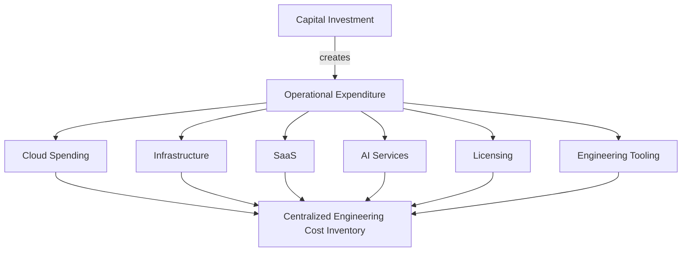
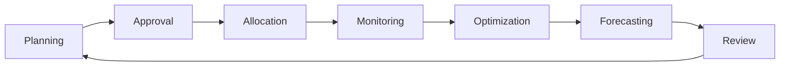
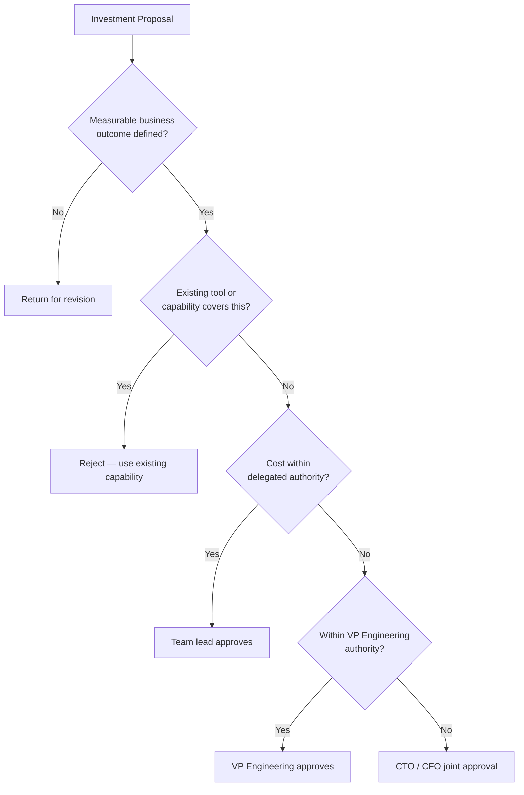

# Engineering Financial Governance Standards

**Document ID:** 42
**Stage:** 1
**Phase:** 43
**Project:** Arwal — District Super App
**Status:** Approved for Baseline Adoption
**Owning Function:** Engineering Leadership (CTO Office, FinOps, VP Engineering)

---

# Purpose of this Document

Arwal is a public-facing district super app that will eventually run payments, healthcare workflows, government integrations, and an AI platform for citizens across a large population. At that scale, engineering spending stops being a line item and becomes a strategic instrument — every dollar spent on cloud capacity, licensing, or tooling either advances citizen value or quietly erodes the public trust placed in this program.

This document exists because uncontrolled technology spending is one of the most common and most preventable causes of program failure in large digital government initiatives. Cloud bills grow silently. Licenses outlive the teams that bought them. Infrastructure is provisioned "just in case" and never reclaimed. Left ungoverned, these patterns compound over hundreds of engineering phases into unsustainable cost structures that starve future investment.

Engineering Financial Governance matters for three durable reasons:

- **Sustainable engineering investment.** Arwal must be able to fund next year's roadmap without being strangled by this year's unmanaged spend. Governance protects the organization's ability to keep investing in the platform over a multi-year horizon.
- **Responsible technology spending.** Because Arwal is a publicly accountable system, every unit of spend must be traceable to a decision, an owner, and a justification. This is not optional financial hygiene — it is a condition of legitimacy for a government-facing platform.
- **Long-term financial sustainability.** Architecture decisions (modular monolith today, event-driven and microservices tomorrow) all carry cost trajectories. Financial governance ensures those trajectories are visible and steered deliberately, not discovered after the fact.

This document does not replace engineering judgment. It gives engineering judgment a financial language, a cadence, and a set of guardrails so that spending decisions can be made quickly *and* responsibly.

---

# Financial Governance Philosophy

Each principle below exists to counter a specific, observed failure mode in large engineering organizations.

| Principle | What It Means | Why It Exists |
|---|---|---|
| **Value over cost** | Spending decisions are justified by the outcome they produce, not merely by whether the organization can afford them. | Cheap decisions with no business value are still waste. Optimizing for lowest cost alone starves genuinely valuable investment. |
| **Cost transparency** | Every engineering cost is visible, attributable, and understandable to the team that owns it. | Hidden costs cannot be governed. Teams cannot optimize what they cannot see. |
| **Evidence-based investment** | Major spend decisions require a stated hypothesis and expected measurable outcome. | Prevents "gut feel" purchasing and technology adoption driven by hype rather than need. |
| **Sustainable spending** | Spend growth is expected to track value growth, not simply user growth or feature count. | Arwal will scale for years; linear cost growth against linear value growth is the only pattern that survives that long. |
| **Financial accountability** | Every recurring cost has a named, accountable engineering owner. | Costs without owners are costs nobody optimizes, questions, or eventually turns off. |
| **Automation** | Cost tracking, tagging, alerting, and reporting are automated wherever possible. | Manual financial governance does not scale past a handful of teams and decays under delivery pressure. |
| **Continuous optimization** | Cost optimization is a standing engineering activity, not a one-time cleanup. | Cloud and licensing environments drift constantly; optimization is a discipline, not an event. |
| **Long-term ownership** | Teams are financially responsible for what they build for its entire lifecycle, including decommissioning. | Prevents the common pattern where a system is cheap to build but nobody is accountable for the cost of running or retiring it. |

---

# Engineering Financial Framework

This framework defines the categories of engineering spend and how they relate to one another. It does not redefine procurement or vendor contracting mechanics — see *Vendor Management Standards* for that.

| Category | Definition | Typical Nature |
|---|---|---|
| **Capital Investment (CapEx)** | Spend that builds durable engineering capability — platform builds, major architectural investments, foundational AI capability. | Infrequent, large, strategically reviewed |
| **Operational Expenditure (OpEx)** | Recurring spend required to run the platform day to day. | Continuous, monitored monthly |
| **Cloud Spending** | Compute, storage, networking, and managed services consumed to run Arwal's environments. | Usage-driven, elastic, the largest OpEx category at scale |
| **Infrastructure** | Underlying platform components (Kubernetes, databases, messaging, observability stacks) whether self-hosted or managed. | Mix of CapEx (initial setup) and OpEx (ongoing run cost) |
| **SaaS** | Third-party software consumed as a service (CI/CD, security scanning, collaboration tooling). | Subscription-based OpEx |
| **AI Services** | Model inference, AI platform infrastructure, AI tooling, and AI-specific vendor services. | Usage-driven OpEx with high variance |
| **Licensing** | Per-seat, per-node, or per-usage licenses for commercial software. | Subscription or perpetual, requires periodic review |
| **Engineering Tooling** | Developer productivity tools, IDEs, testing infrastructure, internal platforms. | Mostly fixed OpEx, occasionally CapEx for internal platform builds |

**Relationships:** CapEx decisions create future OpEx obligations (a new platform build generates ongoing cloud and licensing costs). Every category above must be traceable to the Engineering Budget Lifecycle below, and every recurring cost must map to an owner in the Centralized Engineering Cost Inventory.

---

# Engineering Budget Lifecycle

| Stage | Purpose | Primary Owner |
|---|---|---|
| Planning | Estimate spend by category against roadmap and expected growth | VP Engineering + FinOps Director |
| Approval | Validate business case, expected outcome, and budget fit | CTO / CFO (per Budget Approval Matrix) |
| Allocation | Distribute approved budget to teams and cost centers | FinOps Director |
| Monitoring | Track actual spend against allocation in near real time | Engineering Governance Lead |
| Optimization | Identify and act on waste, rightsizing, and efficiency opportunities | Platform Engineering Director |
| Forecasting | Project future spend based on trends and roadmap | FinOps Director |
| Review | Assess variance, outcomes, and lessons for the next cycle | CTO + CFO + VP Engineering |

---

# Budget Categories

| Category | Governs | Review Cadence |
|---|---|---|
| Infrastructure | Compute, storage, networking, managed platform services | Monthly |
| Cloud | Elastic cloud consumption across environments | Monthly |
| Software Licenses | Commercial and per-seat licensing | Quarterly |
| Security Tooling | Scanning, monitoring, and protective tooling spend | Quarterly (coordinate with Compliance Standards) |
| Monitoring | Observability, logging, and alerting platforms | Quarterly |
| AI Services | Model inference, AI platform infrastructure | Monthly (high variance) |
| Developer Productivity | Internal tooling, CI/CD, developer environments | Quarterly |
| Training | Engineering upskilling and certification | Annual |
| Innovation | Exploratory and experimental technology investment | Quarterly, capped allocation |
| Technical Debt Reduction | Dedicated budget for remediation of accumulated debt | Quarterly, protected allocation |

---

# Cloud Cost Governance

Cloud spend is the largest and fastest-moving cost category in Arwal and requires dedicated controls.

- **Resource tagging.** Every cloud resource must carry mandatory tags: `team`, `service`, `environment`, `cost-center`. Untagged resources are treated as a governance violation and flagged for remediation within 5 business days.
- **Budget alerts.** Every environment and cost center has a configured budget threshold with automated alerts at 50%, 75%, 90%, and 100% of allocation.
- **Idle resource detection.** Automated scanning identifies resources with sustained low utilization (compute below 5% average over 14 days, unattached storage, idle load balancers) for review and reclamation.
- **Auto scaling.** Environments must scale to actual demand by default; static over-provisioning requires explicit, documented justification.
- **Cost allocation.** All cloud spend is allocated to an owning team and service via tagging, feeding the Centralized Engineering Cost Inventory.
- **Reserved capacity.** Predictable, steady-state workloads should be evaluated for reserved or committed-use pricing once usage patterns are stable for at least one full quarter.
- **Storage lifecycle.** Storage tiers and retention policies are defined per data class, with automated lifecycle transitions to lower-cost tiers for aging or infrequently accessed data.
- **Cost optimization.** Optimization is a continuous input into the Engineering Budget Lifecycle's Optimization stage, not a separate off-cycle activity.

### Cloud Cost Anomaly Detection

| Severity | Trigger | Required Action | Response Window |
|---|---|---|---|
| Watch | 20–40% deviation from 7-day rolling average | Automated notification to service owner | 3 business days |
| Investigate | 40–75% deviation, or new cost center exceeding $X threshold | Mandatory investigation and written finding by service owner | 2 business days |
| Critical | >75% deviation, or unexplained spend spike above defined ceiling | Mandatory investigation, FinOps Director notified, remediation plan required | 24 hours |

Anomaly thresholds are reviewed quarterly and adjusted as Arwal's baseline spend matures.

---

# FinOps Governance

FinOps at Arwal is a shared responsibility model, not a centralized cost-police function.

| Responsibility | Owner |
|---|---|
| Cost ownership per service | Service-owning engineering team |
| Shared accountability for platform-wide costs | Platform Engineering Director |
| Engineering participation in cost reviews | All engineering teams (mandatory attendance) |
| Monthly cost reviews | FinOps Director, facilitated with team leads |
| Cost forecasting | FinOps Director |
| Optimization initiatives | Platform Engineering Director + service owners |

**Monthly FinOps Review** covers: spend versus budget by category, anomalies detected and resolved, optimization actions taken, and upcoming spend risks. Every engineering team with a live service is expected to send a representative.

---

# Technology Investment Governance

All new tools, platform investments, infrastructure upgrades, AI investment, and automation investment follow a common evaluation gate before approval.

Every investment proposal must state, in advance: the business outcome it targets, the metric that will confirm success, and the review date at which that metric will be checked. Investments without a stated measurable outcome are not eligible for approval, regardless of cost.

---

# ROI Evaluation

ROI at Arwal is evaluated across four dimensions, not cost alone.

| Dimension | What It Captures | Example Metric |
|---|---|---|
| Cost | Total cost of ownership, including run cost | Fully loaded annual cost |
| Engineering Productivity | Time saved, friction removed, delivery velocity impact | Change lead time, deployment frequency |
| Operational Efficiency | Reduction in manual effort or incident load | Toil hours saved, incidents avoided |
| Risk Reduction | Reduction in compliance, security, or continuity risk | Reduction in critical findings |
| Citizen Value | Direct or indirect improvement to citizen-facing outcomes | Service uptime, request latency, citizen-facing feature adoption |

Investments are scored against these dimensions at approval time and re-scored at the post-investment review to confirm whether projected value materialized.

---

# Financial Risk Management

| Risk | Description | Mitigation |
|---|---|---|
| Budget overruns | Actual spend exceeds allocation without escalation | Automated alerting at defined thresholds; mandatory variance review |
| Cloud cost spikes | Sudden, unexplained increases in cloud spend | Anomaly detection with mandatory investigation thresholds |
| License growth | Uncontrolled growth in per-seat or per-node licensing | Quarterly unused-license review; owner sign-off for renewals |
| Vendor price increases | Vendor raises pricing at renewal beyond forecast | Coordinate with Vendor Management Standards; multi-year forecasting to anticipate |
| Unused software | Purchased software with low or no adoption | Quarterly utilization review; sunset if adoption remains low |
| Capacity waste | Over-provisioned infrastructure sitting idle | Periodic rightsizing review; idle resource detection |

---

# Cost Optimization

Optimization is treated as a continuous engineering discipline with defined mechanisms per category.

| Area | Optimization Mechanism | Cadence |
|---|---|---|
| Resource optimization | Rightsizing based on utilization data | Quarterly |
| License optimization | Unused-license identification and reclamation | Quarterly |
| Environment optimization | Non-production environment scheduling and scale-down | Monthly |
| Storage optimization | Lifecycle policies and tier transitions | Ongoing (automated) |
| Compute optimization | Auto scaling tuning, reserved capacity evaluation | Quarterly |
| AI cost optimization | Model selection, inference batching, caching, right-sized model tiers | Monthly (given cost volatility) |

**Periodic Rightsizing and Unused-License Review.** Every quarter, each service owner must certify that infrastructure sizing reflects actual observed utilization and that all licenses assigned to their team are actively used. Unused licenses identified in this review are reclaimed within the following billing cycle.

---

# Financial Metrics

| Metric | Definition | Why It Matters |
|---|---|---|
| Budget variance | Actual spend vs. planned spend, by category | Early signal of planning accuracy or drift |
| Cost per environment | Total cost divided by environment (dev, staging, prod, etc.) | Reveals non-production cost bloat |
| Cloud efficiency | Useful compute/storage consumed vs. provisioned | Direct measure of waste |
| Infrastructure utilization | Average and peak utilization across compute resources | Basis for rightsizing decisions |
| ROI | Value delivered vs. cost incurred, per the ROI Evaluation model | Confirms whether investments paid off |
| Cost trends | Month-over-month and quarter-over-quarter spend trajectory | Detects unsustainable growth early |
| Savings | Realized savings from optimization initiatives | Demonstrates governance is working, not just reporting |
| Technical investment health | Composite view of debt-reduction spend vs. new-feature spend | Signals whether the platform is being sustainably maintained |

### Engineering Unit-Cost Metrics

| Unit Metric | Formula (Conceptual) | Purpose |
|---|---|---|
| Cost per deployment | Total CI/CD + infra cost / number of deployments | Measures delivery pipeline efficiency |
| Cost per API request | Total serving infra cost / total API requests | Measures marginal cost of platform usage |
| Cost per active citizen | Total platform run cost / monthly active citizens | Measures cost efficiency of citizen value delivery |
| Cost per environment | Total environment cost / number of environments | Flags non-production cost bloat |

Unit-cost metrics are tracked over time, not evaluated as one-off numbers; the trend line matters more than any single reading.

---

# Executive Dashboards

| Dashboard | Audience | Core Content |
|---|---|---|
| Financial Overview | CTO | Total spend, variance, category breakdown, top risks |
| Budget & ROI | CFO | Budget vs. actual, ROI by major investment, forecast accuracy |
| Delivery Efficiency | VP Engineering | Cost per deployment, team-level spend, productivity metrics |
| Platform Cost Health | Platform Engineering Director | Cloud efficiency, utilization, optimization backlog |
| Infrastructure Spend | Infrastructure/Cloud Director | Environment cost breakdown, reserved capacity coverage, anomalies |
| Executive Summary | Executive Leadership | Cross-cutting view: spend trend, sustainability outlook, major decisions pending |

Each dashboard draws from the same Centralized Engineering Cost Inventory to ensure all stakeholders see a consistent, single source of financial truth.

---

# AI-Assisted Financial Governance

AI assistance is used to scale financial governance across hundreds of engineering phases, but never to replace human accountability for spending decisions.

| Function | AI Role | Human Role |
|---|---|---|
| Forecasting | Generate trend-based forecasts from historical spend data | FinOps Director validates and adjusts for known roadmap changes |
| Cost analysis | Surface cost drivers and correlations across categories | Service owners interpret and act |
| Optimization recommendations | Propose rightsizing, reserved capacity, and license reclamation actions | Engineering leads approve and implement |
| Spending anomaly detection | Continuously monitor spend patterns and flag deviations | FinOps Director or service owner investigates per the anomaly thresholds table |
| Human approval | — | All AI-generated recommendations above delegated-authority thresholds require explicit human sign-off before action |

No AI system is permitted to autonomously provision, cancel, or modify billable resources without a human approval step.

---

# Engineering Anti-Patterns

| Anti-Pattern | Why It's Harmful |
|---|---|
| Budget exhaustion | Spend runs out mid-cycle, forcing reactive and poorly evaluated cuts |
| Tool duplication | Multiple teams pay for overlapping tools solving the same problem |
| Zombie infrastructure | Resources nobody remembers provisioning continue to bill indefinitely |
| Unused licenses | Paid seats with no active users, quietly renewed each cycle |
| Cloud waste | Over-provisioned or idle cloud resources consuming budget with no return |
| Cost optimization without business value | Cutting costs in ways that damage reliability or delivery capability |
| Buying before evaluation | Committing to tools or vendors before a trial or proof of value |
| Hidden costs | Spend that is not tagged, attributed, or visible in the cost inventory |

---

# Engineering Review Checklist

- [ ] Every recurring engineering cost has a named accountable owner
- [ ] All cloud resources carry mandatory cost-allocation tags
- [ ] Budget alerts are configured at 50/75/90/100% thresholds for every cost center
- [ ] Anomaly detection thresholds are active and reviewed quarterly
- [ ] Idle and underutilized resources have been reviewed in the current quarter
- [ ] Unused licenses have been identified and reclaimed in the current quarter
- [ ] Every major investment has a stated measurable business outcome
- [ ] ROI has been reassessed for investments past their review date
- [ ] Unit-cost metrics (per deployment, per API request, per active citizen, per environment) are current
- [ ] Technology sunset candidates have been identified and reviewed
- [ ] Multi-year financial forecast is current and aligned with roadmap
- [ ] Executive dashboards reflect current-quarter data
- [ ] Monthly FinOps review has been held with cross-team attendance
- [ ] All AI-generated financial recommendations above threshold carry human sign-off

---

# Governance Review

| Review | Cadence | Owner | Focus |
|---|---|---|---|
| Monthly FinOps Review | Monthly | FinOps Director | Spend vs. budget, anomalies, optimization actions |
| Quarterly Budget Review | Quarterly | CFO + VP Engineering | Variance analysis, reallocation decisions |
| Annual Planning | Annual | CTO + CFO | Next-cycle budget setting, strategic investment planning |
| Cloud Optimization Review | Quarterly | Platform Engineering Director | Rightsizing, reserved capacity, storage lifecycle |
| ROI Review | Per investment review date | CTO + investment sponsor | Confirm realized value against projected value |
| Investment Sunset Review | Quarterly | VP Engineering + FinOps Director | Identify technology no longer delivering sufficient value |
| Financial Governance Review | Annual | CTO + CFO + Engineering Governance Lead | Assess whether this standard itself remains fit for purpose |
| Multi-Year Financial Forecast | Annual | FinOps Director | Forecast aligned to engineering and product strategy across a multi-year horizon |

### Investment Sunset Review Criteria

A technology or tool is flagged as a sunset candidate when it meets any of the following:
- Utilization has remained below defined thresholds for two consecutive quarters
- Its original stated business outcome was not achieved and no revised outcome has been approved
- A lower-cost or already-adopted alternative now covers its function
- Its ongoing cost trend is growing faster than the value it demonstrably delivers

---

# RACI — Engineering Financial Governance

| Activity | CTO | CFO | VP Engineering | FinOps Director | Engineering Governance Lead | Service Owners |
|---|---|---|---|---|---|---|
| Annual budget planning | A | A | R | R | C | C |
| Investment approval (major) | A | A | C | C | I | C |
| Cloud cost anomaly investigation | I | I | I | A | C | R |
| Monthly FinOps review | I | I | C | A/R | C | R |
| Quarterly rightsizing & license review | I | I | C | A | R | R |
| ROI evaluation | A | C | R | C | I | C |
| Investment sunset review | A | C | R | R | C | C |
| Executive dashboard maintenance | I | I | I | A | R | I |
| Multi-year forecasting | A | A | C | R | I | I |

*R = Responsible, A = Accountable, C = Consulted, I = Informed*

---

# Budget Approval Matrix

| Spend Threshold | Approval Authority |
|---|---|
| Below delegated team limit | Team Lead |
| Up to Platform-level threshold | Platform Engineering Director |
| Up to VP-delegated threshold | VP Engineering |
| Above VP-delegated threshold | CTO and CFO joint approval |
| Any new recurring vendor commitment | FinOps Director sign-off required regardless of amount, coordinated with Vendor Management Standards |
| Any AI service adoption with variable/usage-based pricing | VP Engineering approval, with FinOps Director cost-modeling sign-off |

Exact numeric thresholds are set and maintained by the CFO office and published separately to allow adjustment without revising this standard.

---

# Centralized Engineering Cost Inventory

Arwal maintains a single, authoritative inventory of all recurring engineering costs, spanning infrastructure, SaaS, cloud services, AI platforms, and licenses. This inventory is the source of truth feeding every dashboard, review, and anomaly detection process described in this document.

| Inventory Field | Purpose |
|---|---|
| Cost item name | Unique identification of the spend line |
| Category | Maps to Budget Categories above |
| Owning team | Establishes accountability |
| Cost center | Enables financial rollup and reporting |
| Recurring cost and frequency | Enables forecasting and variance tracking |
| Last utilization review date | Confirms the item is actively reviewed, not forgotten |
| Sunset review status | Confirms whether the item remains justified |

No recurring engineering cost is permitted to exist outside this inventory. New spend commitments are added to the inventory at the point of approval, not after the fact.

---

# Relationship with Previous Standards

This document intentionally does not redefine adjacent governance domains. It relies on and references them:

- **Project Vision** — provides the citizen and mission outcomes that ROI Evaluation and Technology Investment Governance measure against.
- **Engineering Principles** — establishes the technical values (quality, maintainability) that Financial Governance must not be allowed to undermine in pursuit of cost savings.
- **Vendor Management** — owns contracting, negotiation, and vendor relationship mechanics; this document owns the financial governance of what is spent with those vendors once contracted.
- **Portfolio Management** — owns prioritization of what gets built; this document owns what it costs to build and run it.
- **Operational Excellence** — owns operational reliability practices; cost governance here must never be optimized in a way that degrades operational standards defined there.
- **Risk Management** — owns the broader risk register; financial risks identified here feed into that register rather than duplicating it.
- **Compliance** — owns regulatory and audit obligations; financial governance here supports compliance evidence but does not redefine compliance requirements.
- **Capacity Planning** — owns forward-looking technical capacity needs; this document owns the budgeting and cost governance of the capacity that planning identifies.

---

# Closing Statement

Disciplined engineering financial governance is what allows Arwal to scale across hundreds of engineering phases without its cost structure becoming a liability to the mission it serves. By tying every recurring cost to an owner, every major investment to a measurable outcome, and every optimization effort to a continuous review cadence, Arwal ensures that engineering spending remains a deliberate instrument of value creation rather than an uncontrolled byproduct of growth. This standard protects the long-term public investment in Arwal by making financial discipline a first-class engineering responsibility — not a periodic afterthought.
