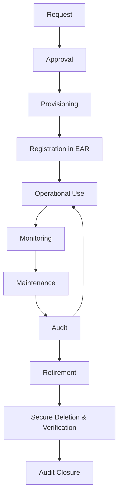
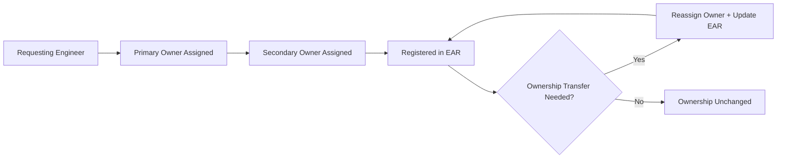
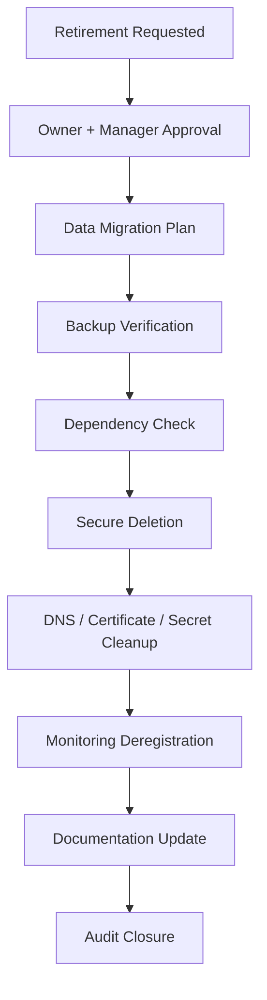
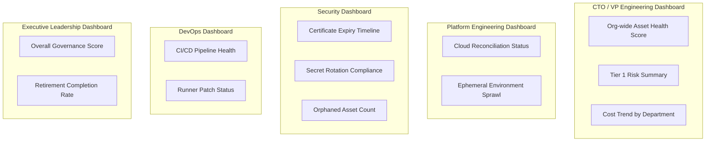

# Engineering Asset Management Standards — Arwal

**Document ID:** ai-docs/43-engineering-asset-management-standards.md
**Stage:** 1 · **Phase:** 44
**Status:** Official Standard
**Scope:** Engineering-owned assets across all Arwal engineering departments

---

## Purpose of this Document

Arwal is being built as a district-scale super app spanning payments, healthcare, government integrations, and AI platform capabilities, developed by hundreds of engineers across multiple departments over roughly 300 engineering phases. At this scale, engineering assets — servers, repositories, pipelines, secrets, certificates, cloud resources, developer devices — multiply far faster than any single person's memory can track. Without governance, assets become invisible the moment their creator changes teams or leaves the project.

This document exists because:

- **Operational reliability** depends on knowing what exists, what it does, and who is responsible for it. An outage caused by an expired certificate that nobody knew existed is a governance failure, not a technical one.
- **Ownership** must be assignable at all times. An asset without a named owner is an asset nobody will fix at 2 a.m.
- **Security** requires a complete map of the attack surface. Unknown assets — forgotten test databases, orphaned cloud storage buckets, stale API keys — are the assets attackers find first.
- **Sustainability** means Arwal's infrastructure cost and complexity must grow proportionally to real need, not to accumulated neglect. Unretired, unused assets consume budget and cognitive overhead indefinitely.

This standard defines how every engineering asset is identified, classified, acquired, tracked, maintained, secured, audited, and retired throughout its lifecycle. It does not redefine Security Standards, Vendor Management, Financial Governance, Compliance & Audit, Risk Management, Configuration Management, or Dependency Governance — those standards are referenced where relevant, not duplicated.

---

## Asset Management Philosophy

| Principle | Why It Exists |
|---|---|
| **Single Source of Truth** | If asset data lives in spreadsheets, tickets, and tribal memory simultaneously, no version is trustworthy. A single Engineering Asset Registry (EAR) ensures every question about "what do we own" has one authoritative answer. |
| **Named Ownership** | Shared ownership is equivalent to no ownership under time pressure. Every asset must resolve to a specific accountable human, not a team alias alone. |
| **Full Lifecycle Governance** | Assets that are well-governed at creation but ignored afterward decay into risk. Governance must span request through retirement, not just provisioning. |
| **Least Privilege** | Every credential, role, and access grant tied to an asset should default to the minimum access required, reducing blast radius when an asset or account is compromised. |
| **Traceability** | Every asset must be traceable to a business justification, an owner, and a change history. This enables audits, incident forensics, and cost attribution. |
| **Standardization** | Ad hoc naming, tagging, and provisioning create friction and hide duplication. Standard templates make assets discoverable and comparable across teams. |
| **Automation** | Manual inventory tracking cannot keep pace with hundreds of engineers provisioning cloud resources daily. Automated discovery and reconciliation are mandatory, not optional. |
| **Continuous Auditing** | Point-in-time audits miss drift. Continuous, automated auditing catches orphaned or non-compliant assets close to the moment they appear. |

---

## Engineering Asset Classification

| Category | Examples | Primary Risk if Ungoverned |
|---|---|---|
| Hardware | Developer laptops, servers, network appliances | Loss, theft, unpatched firmware |
| Software & Licenses | IDEs, commercial SDKs, internal tools | License non-compliance, unsupported versions |
| Cloud Assets | VMs, storage, managed databases, networking | Cost sprawl, unmonitored exposure |
| Source Repositories | Git repositories, monorepo modules | Unclear ownership, abandoned branches |
| Build Systems & CI/CD | Pipelines, runners, artifact registries | Poisoned pipelines, stale credentials |
| Containers | Images, registries, base image chains | Vulnerable base layers, orphaned images |
| Secrets | API keys, tokens, service credentials | Credential leakage, stale privileged access |
| Certificates | TLS certs, code-signing certs | Expiry-driven outages |
| Domains | Subdomains, DNS records | Subdomain takeover |
| Databases | Transactional, analytical, cache stores | Data left behind after service retirement |
| Monitoring Systems | Dashboards, alert rules, log pipelines | Blind spots, alert fatigue |
| AI Infrastructure | Model artifacts, vector databases, inference endpoints, training datasets | Untracked model drift, data governance gaps |
| Developer Devices | Workstations, remote dev environments | Unmanaged endpoints, data exfiltration risk |

---

## Asset Lifecycle

Every asset must pass through Registration before it is considered "real" for governance purposes. An asset provisioned but not registered is, by definition, an orphaned asset from the moment it is created.

---

## Asset Inventory

All engineering assets are tracked in the **Engineering Asset Registry (EAR)**, the single source of truth referenced throughout this document.

### Mandatory Registry Fields

| Field | Description |
|---|---|
| Asset ID | Unique, immutable identifier (format: `ARW-<category>-<sequence>`) |
| Classification | Category from the classification table above |
| Primary Owner | Named individual accountable for the asset |
| Secondary Owner | Named backup accountable individual |
| Business Justification | Why the asset exists |
| Environment | Dev / Staging / Production / Sandbox |
| Criticality Tier | Tier 1 (business-critical) through Tier 4 (low impact) |
| Creation Date | Date of provisioning |
| Last Reviewed Date | Date of most recent audit |
| Retirement Date | Populated once retirement is scheduled or completed |

Every asset ID is issued once and never reused, even after retirement, to preserve historical traceability.

---

## Asset Ownership

- **Engineering Owner** — accountable for the asset's correct operation and lifecycle compliance.
- **Technical Owner** — the individual with hands-on operational responsibility (may be the same as Engineering Owner).
- **Backup Owner** — a named secondary who can act if the primary is unavailable.
- **Ownership Transfer** — mandatory whenever an owner changes teams, roles, or leaves the project; transfer must be logged in the EAR within 5 business days.
- **Orphaned Assets** — any asset whose primary and secondary owner both become invalid (e.g., both leave the organization) is automatically flagged by the EAR and escalated to the relevant Engineering Director within 3 business days for reassignment or retirement.

### Ownership RACI

| Activity | Requesting Engineer | Primary Owner | Engineering Manager | Platform/Security Team |
|---|---|---|---|---|
| Initial Request | R | C | A | I |
| Approval | I | I | A | C |
| Registration | I | R | I | C |
| Ongoing Maintenance | I | R/A | C | C |
| Ownership Transfer | I | R | A | I |
| Retirement Decision | I | R | A | C |

*(R = Responsible, A = Accountable, C = Consulted, I = Informed)*

---

## Asset Security

Detailed control design is owned by the Security Standards document; this section governs asset-level security obligations only.

- All access to registered assets follows least-privilege role assignment, reviewed quarterly.
- Secrets must be stored exclusively in the approved secrets manager — never in source code, CI logs, or configuration files.
- Certificates must be tracked in the EAR with expiry dates and auto-renewal status.
- Cryptographic keys and secrets follow mandatory rotation schedules (see Maintenance section).
- All Tier 1 and Tier 2 assets require encryption at rest and in transit by default.
- Patch management for hardware and software assets follows severity-based SLAs defined jointly with the Security Standards document.

---

## Asset Maintenance

### Maximum Acceptable Age / Refresh Policy

| Asset Type | Maximum Age Before Mandatory Review | Refresh Action |
|---|---|---|
| Developer Hardware | 4 years | Replace or re-certify |
| TLS Certificates | 90 days per rotation cycle | Auto-renew before expiry |
| Secrets / API Keys | 90 days | Rotate |
| Service Account Credentials | 180 days | Rotate |
| Container Base Images | 30 days | Rebuild from latest patched base |
| Software Licenses | Per vendor contract | Renew or decommission |
| Ephemeral Dev Environments | 14 days idle | Auto-terminate |

- Repository maintenance includes stale-branch pruning, mandatory README and CODEOWNERS presence, and dependency governance handoff (see Dependency Governance standard).
- CI/CD maintenance includes runner patching, pipeline credential rotation, and periodic pipeline permission review.

---

## Asset Monitoring

| Monitoring Type | What It Answers |
|---|---|
| Health Monitoring | Is the asset functioning as intended? |
| Usage Monitoring | Is the asset actually being used? |
| Capacity Monitoring | Is the asset approaching resource limits? |
| Security Monitoring | Is the asset showing signs of compromise or misconfiguration? |
| Availability Monitoring | Is the asset meeting its uptime commitments? |
| Cost Monitoring | Is the asset's spend justified by its usage and criticality? |

### Automated Cloud Reconciliation

All cloud resources are discovered automatically on a recurring schedule and reconciled against the EAR. Any cloud resource found without a matching EAR entry is:

1. Automatically tagged `UNREGISTERED`.
2. Escalated to the owning department's on-call engineering lead within 24 hours.
3. Either registered with a valid owner within 5 business days, or scheduled for retirement.

---

## Asset Retirement

Retirement is not complete until every one of the following is verified and signed off:

- Data migrated or intentionally discarded per data retention policy.
- Backups verified as either preserved (per policy) or securely deleted.
- Associated credentials, secrets, and service accounts revoked.
- DNS records and certificates removed or reassigned.
- Monitoring, alerting, and dashboard references removed.
- Documentation and the EAR entry updated to `RETIRED` with a closure date.
- Downstream dependency check confirming no active system still references the asset.

### Retirement Approval Matrix

| Criticality Tier | Approver(s) Required |
|---|---|
| Tier 1 (Business-Critical) | Engineering Director + Security Officer + VP Engineering |
| Tier 2 | Engineering Manager + Security Officer |
| Tier 3 | Engineering Manager |
| Tier 4 | Primary Owner |

---

## Engineering Metrics

| Metric | Target |
|---|---|
| Asset Inventory Accuracy | ≥ 98% of live assets match EAR records |
| Orphaned Assets | 0 unresolved beyond escalation SLA |
| Ownership Completeness | 100% of assets have valid primary + secondary owner |
| Certificate Health | 0 certificates within 14 days of expiry without renewal in progress |
| Secret Rotation Compliance | 100% within policy window |
| Patch Compliance | ≥ 95% within SLA |
| Asset Utilization | Flag assets below utilization threshold quarterly |
| Retirement Completion | 100% of approved retirements fully closed within 30 days |

---

## Executive Dashboards

Each dashboard pulls directly from the EAR and monitoring systems — no manually compiled executive reports are permitted, to preserve the single-source-of-truth principle.

---

## AI-Assisted Asset Management

AI assistance is permitted for the following activities, always with human approval before any action is taken:

- Inventory analysis to detect anomalies or drift.
- Asset discovery across cloud accounts to identify unregistered resources.
- Capacity prediction for infrastructure scaling decisions.
- Maintenance recommendations (e.g., flagging aging certificates or stale images).
- Risk detection based on unusual access or configuration patterns.

AI recommendations are advisory only. No AI system may register, modify, or retire an asset autonomously; a named human owner or approver must confirm every action.

### AI Infrastructure Governance

Engineering-owned AI infrastructure is a first-class asset category and must be registered like any other asset:

- **Model artifacts** — versioned, owned, and tied to the training dataset and evaluation results that produced them.
- **Vector databases** — registered with data source lineage and retention policy.
- **Inference endpoints** — registered with owner, criticality tier, and cost monitoring.
- **Training datasets** — registered with provenance, sensitivity classification, and retention policy, in coordination with Compliance & Audit standards.

---

## Engineering Anti-Patterns

| Anti-Pattern | Why It's Dangerous |
|---|---|
| Unknown assets | Cannot be secured, patched, or budgeted for |
| Orphaned assets | No one responds when they fail or are attacked |
| Expired certificates | Direct cause of preventable outages |
| Forgotten secrets | Long-lived, unrotated credentials are prime attack targets |
| Zombie infrastructure | Running, billed, and exposed with no business purpose |
| Shared ownership | Diffuses accountability until no one acts |
| Duplicate environments | Wastes cost and creates configuration drift |
| Asset sprawl | Increases attack surface and audit burden |
| Manual inventories | Guaranteed to fall out of date at this scale |

---

## Engineering Review Checklist

- [ ] Every asset has a unique, immutable Asset ID in the EAR.
- [ ] Every asset has a valid primary and secondary owner.
- [ ] Every asset has a documented business justification.
- [ ] Criticality tier assigned and periodically reviewed.
- [ ] Certificates tracked with expiry and renewal status.
- [ ] Secrets rotated within policy windows.
- [ ] Cloud reconciliation run and discrepancies resolved.
- [ ] Ephemeral environments auto-terminated per idle policy.
- [ ] Orphaned assets flagged and escalated within SLA.
- [ ] Retirement checklist fully completed for all decommissioned assets.
- [ ] Executive dashboards reflect current EAR state (no stale exports).
- [ ] AI-assisted recommendations reviewed and approved by a human owner before action.

---

## Governance Review

| Review | Frequency | Owner |
|---|---|---|
| Inventory Accuracy Review | Monthly | Platform Engineering |
| Ownership Review | Quarterly | Engineering Managers |
| Certificate Audit | Monthly | Security |
| Secret Audit | Monthly | Security |
| Asset Lifecycle Review | Annual | VP Engineering |
| Overall Governance Review | Annual | CTO |

---

## Relationship with Previous Standards

- **Project Vision** — this standard operationalizes the reliability and sustainability goals set out in the Project Vision.
- **Engineering Principles** — asset governance is a direct application of the organization's stated engineering principles, particularly ownership and automation.
- **Configuration Management** — Configuration Management governs *how* systems are configured; this standard governs *what exists* and *who owns it*. The two are complementary and cross-referenced, not duplicated.
- **Security Standards** — this document defers all control specifics (encryption standards, access control models) to Security Standards and governs only asset-level security obligations.
- **Financial Governance** — cost monitoring here feeds Financial Governance's budget processes; this standard does not define budget approval workflows.
- **Vendor Management** — software and hardware licensing acquisition processes are owned by Vendor Management; this standard governs post-acquisition tracking and lifecycle.
- **Compliance & Audit** — this standard supplies the asset-level evidence that Compliance & Audit processes rely on.
- **Operational Excellence** — asset monitoring and maintenance practices here directly support the reliability targets defined under Operational Excellence.

---

## Closing Statement

Disciplined engineering asset management is what allows Arwal to scale from its current phase toward hundreds of engineers, multiple departments, and mission-critical domains like payments, healthcare, and government integration without losing track of what it owns. A single source of truth, named ownership at every stage, automated discovery, and rigorous retirement discipline protect the platform's reliability, security, and cost sustainability. As Arwal grows, this standard ensures that growth in infrastructure is always matched by growth in accountability — never outpaced by it.
