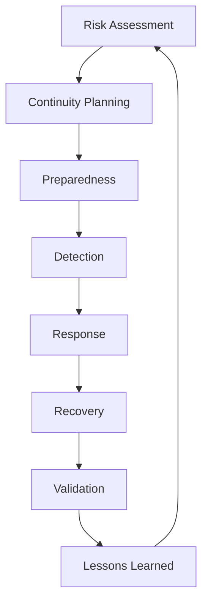
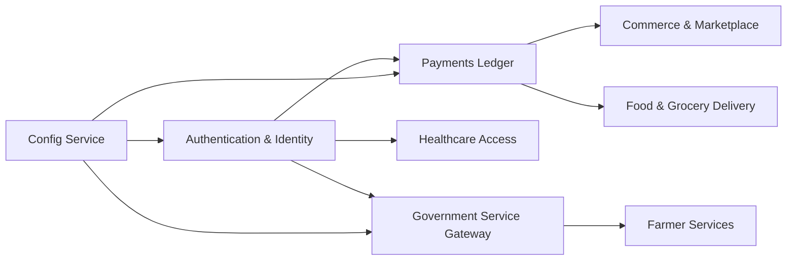
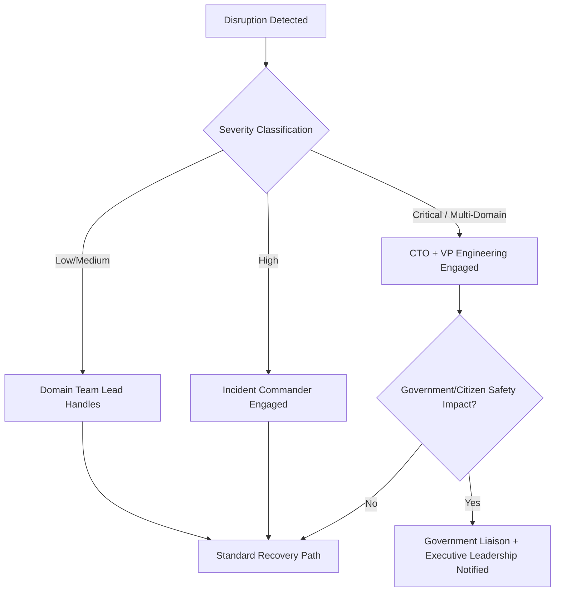

# Engineering Business Continuity & Disaster Recovery Standards

**Document:** `ai-docs/44-engineering-business-continuity-disaster-recovery-standards.md`
**Stage:** 1 — Foundation
**Phase:** 45
**Status:** Binding Engineering Standard
**Applies To:** All engineering, platform, SRE, security, and infrastructure teams building and operating Arwal

---

## Purpose of this Document

Arwal is not a conventional consumer application. It is the digital operating system for an entire district — the substrate through which residents access commerce, food, groceries, marketplaces, property, jobs, farmer services, healthcare, education, government services, payments, logistics, and community life. When Arwal experiences an outage, it is not merely a service degradation: it is a disruption to how citizens receive food, how patients reach healthcare providers, how government payments are disbursed, and how a district functions on a given day.

This document exists because:

- **Public trust is a production dependency.** A district-scale civic-commerce platform earns the right to serve critical services only if it can demonstrably survive failure without harming the people who depend on it.
- **Failure is a certainty, not a possibility.** Cloud regions fail, vendors have outages, databases corrupt, human operators make mistakes, and architecture evolves in ways that introduce new failure modes. Business continuity and disaster recovery (BC/DR) exist to make failure survivable rather than catastrophic.
- **Government and healthcare integrations carry a duty of care beyond typical SaaS products.** Recovery obligations for these domains are not aspirational; they are governance requirements with real consequences for citizens.
- **Engineering resilience must be engineered, not assumed.** Cloud providers offer infrastructure durability primitives, but they do not absorb Arwal's responsibility for application-level recovery, data integrity, or service continuity. That responsibility belongs to Arwal's engineering organization.
- **Disaster preparedness is cheaper than disaster response.** Every dollar and hour invested in tested recovery capability is materially cheaper than the cost of an unrecovered or mishandled outage — in engineering time, citizen harm, government relationship damage, and reputational cost.

This document governs how Arwal prepares for, detects, responds to, recovers from, and learns from major disruptions. It does not redefine Incident Management (`ai-docs/` — Operational Excellence family), Security Standards, Risk Management, Asset Management, Compliance & Audit, or Infrastructure Architecture. Those documents are referenced, not restated.

---

## Continuity Philosophy

Every principle below exists for a specific, non-negotiable reason. Principles are not aspirational language — they are enforced through the frameworks in this document.

| Principle | Definition | Why It Exists |
|---|---|---|
| **Resilience by Design** | Recovery capability is designed into services at build time, not retrofitted after an incident. | Retrofitted resilience is expensive, incomplete, and usually discovered to be inadequate during the incident it was meant to prevent. Designing for failure from Phase 1 of any service ensures recovery is a first-class architectural concern. |
| **Recovery Over Perfection** | Arwal accepts that systems will fail and optimizes for fast, safe recovery rather than chasing unattainable zero-failure guarantees. | Chasing perfect prevention diverts effort from what actually protects citizens during an incident: how quickly and safely the organization restores service. A district cannot wait for "no failures ever" — it needs "failures resolved within defined limits." |
| **Continuous Preparedness** | Continuity readiness is maintained at all times, not activated only when a disaster is imminent. | Disasters do not schedule themselves around engineering convenience. Preparedness that is only exercised occasionally decays; continuous preparedness keeps runbooks, backups, and teams recovery-ready year-round. |
| **Defense in Depth** | Recovery relies on multiple independent layers (backups, redundancy, failover, manual fallback) rather than a single safeguard. | Any single recovery mechanism can fail or be unavailable exactly when needed. Layered defenses ensure that the failure of one safeguard does not cascade into total data or service loss. |
| **Automation** | Recovery procedures are automated wherever technically and safely feasible. | Manual recovery under incident pressure is slow, error-prone, and inconsistent across responders. Automation converts recovery from a stressful improvisation into a repeatable, testable procedure. |
| **Regular Testing** | Recovery plans, backups, and failover mechanisms are tested on a defined cadence, not assumed to work. | An untested recovery plan is a hypothesis, not a capability. Regular testing is the only way to know — before a real disaster — whether recovery actually works within its promised timelines. |
| **Evidence-Based Recovery** | Recovery decisions and readiness claims are backed by test results, metrics, and audit evidence, not assertions. | Confidence in recovery capability must be earned through demonstrated evidence. Unverified claims of readiness create false security that fails at the worst possible moment. |
| **Continuous Improvement** | Every incident, drill, and audit feeds back into improved plans, tooling, and training. | Recovery capability that does not evolve falls behind the architecture, scale, and threat landscape it is meant to protect. Continuous improvement keeps continuity governance aligned with Arwal's growth. |

---

## Continuity Framework

The continuity framework establishes how Arwal identifies what must be protected, how recovery priorities are set, and how continuity decisions are governed.

### Framework Components

- **Critical Services** — Services whose failure directly harms citizens' access to essential needs (healthcare access, payments, government service delivery, food/grocery fulfillment in emergency contexts) or causes irreversible data loss.
- **Supporting Services** — Services that enhance the platform experience but whose temporary unavailability does not constitute a citizen-harm event (e.g., recommendation engines, non-critical analytics, marketing surfaces).
- **Recovery Priorities** — The sequencing logic that determines which services are restored first during a multi-service disruption, based on Service Classification (see below) and dependency mapping.
- **Business Impact Analysis (BIA)** — The structured assessment, performed per service and revisited at defined intervals, that quantifies the operational, financial, safety, and reputational impact of that service's unavailability over time.
- **Recovery Governance** — The authority structure (see Crisis Management) that owns continuity decisions, approves recovery plans, and holds engineering accountable for tested readiness.

### Business Impact Analysis Inputs

| Input | Description |
|---|---|
| Citizen impact | Does unavailability prevent access to healthcare, payments, food, or government services? |
| Data sensitivity | Would data loss during this disruption be irreversible or regulatorily significant? |
| Financial impact | What is the estimated cost per hour of unavailability? |
| Dependency fan-out | How many downstream services or domains depend on this service? |
| Regulatory/government exposure | Does this service have contractual or legal recovery obligations to government partners? |
| Reputational exposure | Would an extended outage in this service be publicly visible and trust-damaging? |

---

## Service Classification

Every production service in Arwal must be classified into exactly one tier. Classification is proposed by the owning Engineering Manager, reviewed by SRE and Architecture, and approved by VP Engineering. Reclassification follows the same governance path used for architectural changes (see `ai-docs/25` — Architecture Decision Records governance).

| Tier | Definition | Examples in Arwal | Availability Expectation |
|---|---|---|---|
| **Mission Critical** | Failure directly endangers citizen safety, health access, or financial integrity, or is legally/contractually bound to government SLAs. | Healthcare access & emergency routing, payments ledger, government service gateways, authentication/identity | 99.95%+ target; near-zero tolerated data loss |
| **High** | Failure significantly disrupts daily citizen commerce or livelihood access but does not endanger safety. | Food & grocery delivery core flows, marketplace transactions, job listings/applications, farmer services | 99.9% target |
| **Medium** | Failure is inconvenient and visible but has workable manual or degraded-mode alternatives. | Property listings, community features, non-critical notifications | 99.5% target |
| **Low** | Failure has negligible citizen or business impact. | Internal tooling, non-customer-facing dashboards, experimental features | Best-effort |

### Service Classification Governance Table

| Tier | Recovery Priority | Minimum Backup Frequency | Minimum Restoration Test Frequency | Failover Requirement |
|---|---|---|---|---|
| Mission Critical | P0 (restored first) | Continuous/near-real-time | Monthly | Multi-AZ mandatory; multi-region target |
| High | P1 | Hourly | Quarterly | Multi-AZ mandatory |
| Medium | P2 | Daily | Semi-annual | Multi-AZ recommended |
| Low | P3 | Daily/weekly | Annual | Single-AZ acceptable |

---

## Business Continuity Lifecycle

| Stage | Owner | Description |
|---|---|---|
| Risk Assessment | SRE + Architecture | Identify plausible disruption scenarios (infrastructure, vendor, data, human, environmental) and their likelihood/impact. |
| Continuity Planning | Engineering Managers + SRE | Produce and version-control recovery plans per service, aligned to Service Classification. |
| Preparedness | Platform + Security | Maintain backups, failover infrastructure, runbooks, and trained on-call responders. |
| Detection | SRE (via Incident Management, `ai-docs` Operational Excellence family) | Identify that a disruption has occurred or is occurring. |
| Response | Crisis Management structure (see below) | Execute the declared recovery plan; coordinate technical and communication response. |
| Recovery | Engineering + Platform | Restore service and data to defined RTO/RPO targets. |
| Validation | QA + SRE | Confirm restored service meets integrity, performance, and correctness expectations before full traffic is returned. |
| Lessons Learned | Governance Review Board | Feed findings into plan updates and the Operational Excellence Improvement Backlog (`ai-docs/` Phase 40). |

---

## Disaster Recovery Strategy

Disaster recovery strategy governs how Arwal restores technical capability after a disruption, distinct from the broader organizational continuity lifecycle above.

### Strategy Layers

| Layer | Governs | Primary Owner |
|---|---|---|
| Recovery Objectives | RTO/RPO targets per tier | SRE + Engineering Managers |
| Infrastructure Recovery | Compute, networking, cloud account recovery | Platform Engineering |
| Platform Recovery | Shared platform services (auth, AI Gateway, messaging, config) | Platform Engineering |
| Application Recovery | Domain-specific application logic and workflows | Domain Engineering Teams |
| Database Recovery | PostgreSQL, Redis, backups, replication | Platform + Database Reliability |
| Network Recovery | DNS, load balancing, CDN, VPC/network fabric | Platform Engineering |

### Recovery Sequencing (Dependency Mapping)

Recovery is never planned per-service in isolation. Every service's recovery plan must include an explicit **upstream/downstream dependency map** identifying:

- Which services this service depends on to function (upstream)
- Which services depend on this service (downstream)
- Whether the dependency is hard (blocking) or soft (degradable)

Dependency maps determine recovery sequencing: a downstream service cannot be validated as "recovered" until its hard upstream dependencies are recovered and validated first. Mission Critical services with shared upstream dependencies (e.g., Authentication) place extraordinary recovery priority on that shared dependency.

---

## Recovery Objectives

### RTO / RPO Targets by Service Tier

| Tier | RTO (Recovery Time Objective) | RPO (Recovery Point Objective) |
|---|---|---|
| Mission Critical | ≤ 15 minutes | ≤ 1 minute (near-zero data loss) |
| High | ≤ 1 hour | ≤ 15 minutes |
| Medium | ≤ 4 hours | ≤ 1 hour |
| Low | ≤ 24 hours | ≤ 24 hours |

RTO and RPO targets are **mandatory minimums**, not aspirational goals. A service that cannot technically meet the RTO/RPO of its assigned tier must either be re-architected to meet it or formally reclassified to a lower tier through governance review — reclassification cannot be used to avoid investment in required resilience for services that are genuinely mission-critical.

### Recovery Dependencies

Every recovery plan must state:

1. Hard upstream dependencies that must be operational before this service can be validated as recovered.
2. Shared infrastructure dependencies (e.g., PgBouncer pool, Redis cluster, AI Gateway) and their own RTO/RPO commitments.
3. Whether degraded-mode operation is possible while upstream dependencies are still recovering.

### Validation Criteria

Recovery is not complete until validation confirms:

- Data integrity (no silent corruption, correct row counts/checksums where applicable)
- Functional correctness (critical user journeys pass smoke tests)
- Performance within acceptable bounds (per `ai-docs` Performance Standards)
- Security posture intact (no exposed credentials, no bypassed authentication)
- Monitoring and observability fully reporting (per `ai-docs` Observability/Logging Standards)

---

## Backup Governance

Backup governance exists because a backup that has never been restored is not a backup — it is an unverified assumption.

### Backup Requirements by Tier

| Requirement | Mission Critical | High | Medium | Low |
|---|---|---|---|---|
| Backup frequency | Continuous/near-real-time (WAL streaming or equivalent) | Hourly | Daily | Daily/weekly |
| Encryption at rest | Mandatory (AES-256 or equivalent) | Mandatory | Mandatory | Mandatory |
| Immutability | Mandatory (write-once, cannot be altered/deleted before retention expiry) | Required | Recommended | Optional |
| Geographic redundancy | Mandatory — minimum two physically separate regions | Required — cross-AZ minimum, cross-region recommended | Cross-AZ | Single location acceptable |
| Retention period | Per data classification & regulatory requirement (see `ai-docs` Compliance & Audit) | Per data classification | Per data classification | Minimum 30 days |
| Restoration testing frequency | Monthly, full restoration to isolated environment | Quarterly | Semi-annual | Annual |

### Why Immutability and Geographic Redundancy Are Mandatory for Mission-Critical Systems

A ransomware event, a misconfigured deletion pipeline, or a malicious insider can destroy or encrypt live data and its backups simultaneously if backups are mutable and co-located. Immutable, geographically redundant backups for mission-critical systems (payments ledger, healthcare records, government service data, identity data) ensure that no single failure domain — technical, human, or malicious — can eliminate Arwal's ability to recover citizen-critical data.

### Backup Verification vs. Restoration Testing

Backup **verification** (checksum validation, successful completion of the backup job) confirms a backup was written. It does **not** confirm the backup can be restored into a working system. Arwal requires **restoration testing** — actually restoring the backup into an isolated environment and validating functional correctness — at the frequencies defined above. Verification alone is classified as an anti-pattern (see Anti-Patterns section).

---

## Crisis Management

### Crisis Roles and RACI

| Role | Responsibility | R | A | C | I |
|---|---|---|---|---|---|
| Incident Commander (on-call SRE lead) | Directs technical response | ✔ | | | |
| VP Engineering | Holds overall accountability for recovery outcome | | ✔ | | |
| CTO | Executive decision authority for cross-domain/major disruptions | | ✔ | ✔ | |
| CISO | Security implications of the disruption and recovery actions | ✔ | | ✔ | |
| Domain Engineering Manager | Recovery execution within their domain | ✔ | | ✔ | |
| Platform Engineering Director | Infrastructure/platform recovery execution | ✔ | | ✔ | |
| Communications Lead | Executes communication playbooks | ✔ | | ✔ | |
| Government Technical Partner Liaison | Coordinates with government stakeholders | ✔ | | ✔ | ✔ |
| Executive Leadership | Informed of major disruption status and business impact | | | | ✔ |
| Engineering Organization (broad) | Informed of status, participates as directed | | | | ✔ |

### Escalation and Decision Authority

Decision authority to declare a formal disaster (triggering this document's response mechanisms rather than standard Incident Management) rests with the Incident Commander in consultation with VP Engineering, escalating to CTO for any disruption affecting Mission Critical services, multiple domains, or government/citizen safety.

### Communication Playbooks

Distinct audiences require distinct communication cadence, tone, and content. Communication playbooks must be pre-drafted (not improvised during an incident) for:

| Audience | Content Focus | Cadence During Active Disruption | Owner |
|---|---|---|---|
| Citizens | Plain-language status, expected restoration window, alternative access if available | Every 30–60 minutes for Mission Critical/High disruptions | Communications Lead |
| Government Agencies/Partners | Technical status, safety/compliance implications, formal incident notification per contractual obligation | Immediate initial notification, then per contractual SLA | Government Technical Partner Liaison |
| Vendors/Third Parties | Coordination requests, dependency status | As needed for coordination | Platform Engineering |
| Executives | Business impact, recovery ETA, decisions needed | Every 30 minutes for Critical, hourly for High | Incident Commander |
| Engineering Teams | Technical status, action items, coordination | Continuous via incident channel | Incident Commander |

---

## Recovery Testing

Recovery capability that has not been tested is not a capability — it is a hope. Recovery testing is mandatory, scheduled, and tracked as a governance artifact.

### Minimum Testing Frequencies

| Test Type | Mission Critical | High | Medium | Low |
|---|---|---|---|---|
| Tabletop exercises (discussion-based walkthrough) | Quarterly | Semi-annual | Annual | Annual |
| Backup restoration testing | Monthly | Quarterly | Semi-annual | Annual |
| Infrastructure recovery drills | Quarterly | Semi-annual | Annual | Best-effort |
| Multi-region/multi-AZ failover testing | Semi-annual | Annual | N/A | N/A |
| Full-scale disaster simulation (all-hands, cross-domain) | Annual (organization-wide, mandatory) | Participates in annual org-wide simulation | Participates in annual org-wide simulation | Optional participation |

### Testing Governance

- Every test produces a written report: scope, participants, findings, gaps, and corrective actions.
- Failed or incomplete tests must be remediated and re-tested within one quarter — a failed test is not closed until re-tested successfully.
- Test results feed directly into the Operational Excellence Improvement Backlog (`ai-docs/` Phase 40) and into recovery plan revisions.
- SRE maintains the master testing calendar and reports compliance status to the Governance Review Board quarterly.

---

## Third-Party Recovery

Arwal's dependence on cloud providers, SaaS tools, and external APIs does not transfer recovery responsibility away from Arwal's engineering organization — it adds a category of failure that must be planned for independently.

| Failure Category | Governance Requirement |
|---|---|
| Cloud provider region/AZ failure | Multi-AZ minimum for all High+ tiers; documented multi-region fallback plan for Mission Critical services. |
| SaaS tool failure (e.g., third-party auth, notification providers) | Every SaaS dependency supporting a High+ tier service must have a documented degraded-mode or fallback provider path. |
| Vendor outage (payments processors, government system integrations) | Contractual SLA review during vendor onboarding (per `ai-docs` Asset/Vendor governance); documented manual fallback procedure where feasible. |
| API failures (third-party integrations) | Circuit breakers and graceful degradation required per `ai-docs/20` Error Handling Standards; recovery plan must define citizen-facing behavior during third-party API unavailability. |
| Communication expectations with vendors | Vendor contracts must define notification obligations during vendor-side outages; Arwal's Communication Playbooks define how Arwal communicates vendor-caused disruptions to citizens and government partners without assigning blame prematurely. |
| Contingency planning | Every vendor supporting a Mission Critical or High service must have a documented contingency plan reviewed at least annually. |

**Assuming cloud providers eliminate DR responsibility is explicitly rejected as an anti-pattern** (see below). Cloud providers guarantee infrastructure durability under their own shared responsibility model; they do not guarantee Arwal's application-level recoverability, data correctness, or citizen-facing continuity.

---

## Engineering Metrics

| Metric | Definition | Target |
|---|---|---|
| Recovery success rate | % of declared disasters/drills where RTO/RPO targets were met | ≥ 95% |
| Mean recovery time | Average actual time to restore service across incidents | Within tier RTO |
| Backup success rate | % of scheduled backup jobs completing successfully | ≥ 99.9% |
| Backup verification rate | % of backups passing automated verification | 100% |
| Restoration test pass rate | % of restoration tests successfully restoring to a working state | ≥ 95% |
| Recovery test frequency compliance | % of scheduled tests (tabletop, drill, simulation) completed on schedule | 100% |
| Service availability | Actual uptime vs. tier target | Meets or exceeds tier target |
| Disaster readiness score | Composite score across backup health, test recency, plan currency, dependency mapping completeness | ≥ 90/100 for Mission Critical |
| Continuity maturity level | Organizational maturity rating (Ad Hoc → Managed → Defined → Measured → Optimizing) | "Defined" minimum by end of Stage 1; "Measured" by Stage 3 |

---

## Executive Dashboards

| Dashboard | Audience | Key Contents |
|---|---|---|
| Continuity Posture Dashboard | CTO, VP Engineering | Service classification coverage, RTO/RPO compliance, disaster readiness score, open recovery plan gaps |
| SRE Recovery Operations Dashboard | SRE | Backup job health, restoration test schedule/results, failover test status, active recovery plans under revision |
| Platform Resilience Dashboard | Platform Engineering | Infrastructure redundancy status, multi-AZ/multi-region coverage, third-party dependency risk |
| Security & Data Integrity Dashboard | Security/CISO | Backup encryption/immutability compliance, access control on backup systems, incident-linked security findings |
| Executive Continuity Summary | Executive Leadership | Business impact summary, government/citizen-facing risk exposure, high-level readiness trend over time |

---

## AI-Assisted Continuity

Arwal's provider-abstracted AI Gateway Service may assist continuity operations under strict human-approval boundaries consistent with the organization's AI-assistance principle: **AI tools assist but never substitute for human decision-making authority.**

| AI-Assisted Function | Permitted Use | Human Approval Requirement |
|---|---|---|
| Failure prediction | Anomaly detection on infrastructure/application telemetry to flag emerging risk patterns | Advisory only; SRE reviews and decides on action |
| Recovery planning assistance | Drafting initial recovery plan structure, dependency map suggestions | All plans require Engineering Manager and SRE sign-off before adoption |
| Runbook recommendations | Suggesting runbook steps based on historical incidents | Runbooks are reviewed and approved by domain owners before use |
| Dependency analysis | Automated scanning of service dependency graphs to surface undocumented dependencies | Findings verified by engineering before being trusted in recovery sequencing |
| Recovery optimization | Suggesting sequencing or resource allocation improvements during drills (never during live incidents in an unsupervised capacity) | Incident Commander retains final authority during any live event |
| Human approval | No AI-generated recovery action executes automatically against production Mission Critical or High tier systems without explicit human authorization | Mandatory, without exception |

AI systems must never be granted autonomous authority to execute failover, data restoration, or service recovery actions against production systems without an accountable human approver in the loop.

---

## Engineering Anti-Patterns

| Anti-Pattern | Why It Is Dangerous |
|---|---|
| Untested backups | A backup that has never been restored provides false confidence and may fail exactly when needed. |
| Recovery plans never exercised | Plans decay as architecture changes; an unexercised plan is likely to be wrong by the time it's needed. |
| Single-region dependency for Mission Critical services | A single region failure becomes a total outage with no fallback path. |
| Manual-only recovery | Manual recovery under pressure is slow and error-prone; it cannot reliably meet tight RTOs. |
| Missing runbooks | Responders improvising recovery steps during a live incident increases recovery time and error risk. |
| Unknown recovery ownership | If no one is accountable for a service's recovery plan, it will not be maintained or tested. |
| No communication plan | Silence during a disruption damages citizen and government trust more than the disruption itself. |
| Backup without restore testing | Verification of backup completion is not proof of restorability. |
| Assuming cloud providers eliminate DR responsibility | Cloud providers guarantee infrastructure durability, not application-level recovery or business continuity. |

---

## Engineering Review Checklist

**Service-Level Continuity Readiness**

- [ ] Service has an assigned, governance-approved Service Classification tier
- [ ] RTO/RPO targets are defined and technically achievable for the assigned tier
- [ ] Dependency map (upstream/downstream, hard/soft) is documented and current
- [ ] Backup strategy meets frequency, encryption, immutability, and redundancy requirements for its tier
- [ ] Restoration testing has been performed within the required frequency window
- [ ] Recovery plan is version-controlled and has a named accountable owner
- [ ] Recovery plan has been reviewed after the most recent major incident or architecture change
- [ ] Runbooks exist for the service's recovery procedures and are current
- [ ] Communication playbook applicability for this service is documented
- [ ] Succession coverage exists for the individual(s) accountable for this service's recovery

**Organizational Continuity Readiness**

- [ ] Full-scale disaster simulation completed within the last 12 months
- [ ] All Mission Critical services passed restoration testing within the last month
- [ ] Crisis Management RACI is current and all named roles are staffed
- [ ] Executive dashboards reflect current, accurate continuity metrics
- [ ] Third-party/vendor contingency plans reviewed within the last 12 months
- [ ] Lessons learned from the last quarter's incidents/drills have been incorporated into plan updates
- [ ] Operational Excellence Improvement Backlog reflects open continuity-related action items

---

## Governance Review

| Review Activity | Frequency | Owner |
|---|---|---|
| Quarterly continuity review | Quarterly | VP Engineering + SRE |
| Semi-annual disaster recovery drills | Semi-annual | SRE + Platform Engineering |
| Annual full-scale disaster simulation | Annual | CTO sponsor; SRE execution |
| Backup audits | Quarterly | Security + Platform Engineering |
| Recovery objective (RTO/RPO) reviews | Semi-annual, or upon major architecture change | Architecture + SRE |
| Business continuity governance review | Annual | Governance Review Board |

Every governance review activity produces a written record retained per `ai-docs` Compliance & Audit retention requirements, and every finding is triaged into the Operational Excellence Improvement Backlog.

---

## Relationship with Previous Standards

This document depends on and defers to the following prior standards rather than duplicating them:

- **Project Vision** — establishes the citizen-serving mission that justifies the rigor of this document's continuity obligations.
- **Engineering Principles** — establishes the quality and craftsmanship baseline that continuity planning assumes.
- **Operational Excellence** (including `ai-docs/40` Improvement Backlog) — owns Incident Management detection/response mechanics that this document's Business Continuity Lifecycle plugs into; this document does not redefine incident severity classification or on-call mechanics.
- **Risk Management** — owns the broader organizational risk register; this document consumes risk assessments relevant to continuity but does not redefine risk methodology.
- **Security Standards** — owns security incident response and threat handling; this document's Crisis Management coordinates with, but does not replace, security incident procedures.
- **Asset Management** — owns vendor and asset inventory; this document's Third-Party Recovery section relies on that inventory rather than maintaining a separate one.
- **Compliance & Audit** — owns data retention and regulatory classification; this document's Backup Governance retention periods are derived from, not independently defined by, that standard.
- **Financial Governance** — owns cost approval processes; recovery infrastructure investment (e.g., multi-region redundancy) is justified here but financially governed there.
- **`ai-docs/25` Architecture Decision Records governance** — governs how Service Classification changes and architecture-triggered recovery plan updates are formally recorded.
- **`ai-docs/20` Error Handling Standards** — governs the circuit breaker and graceful degradation mechanics referenced in Third-Party Recovery.

---

## Closing Statement

Arwal exists to serve a district of over one million residents across the essential fabric of civic and commercial life — food, health, payments, government services, work, and community. Disciplined business continuity and disaster recovery governance is not a defensive afterthought; it is the mechanism by which Arwal keeps its promise to citizens and government partners even when infrastructure fails, vendors falter, or the unexpected occurs.

By classifying services honestly, setting recovery objectives that are genuinely met rather than merely aspired to, maintaining backups that are proven — not assumed — restorable, and rehearsing crisis response before a real crisis demands it, Arwal's engineering organization ensures that disruption is met with prepared, tested, evidence-based recovery rather than improvisation. This is how a platform entrusted with citizen-critical services earns and keeps the right to carry that responsibility.
