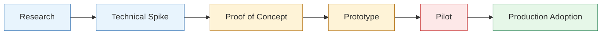
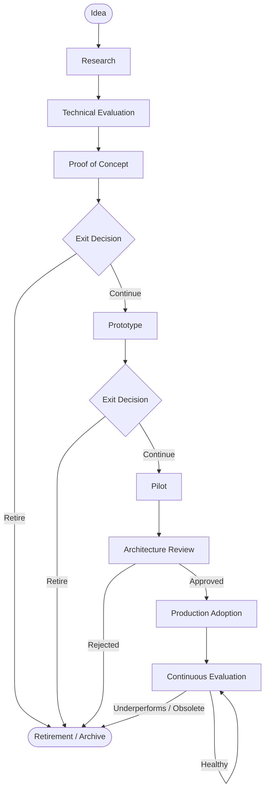
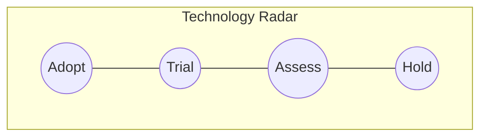
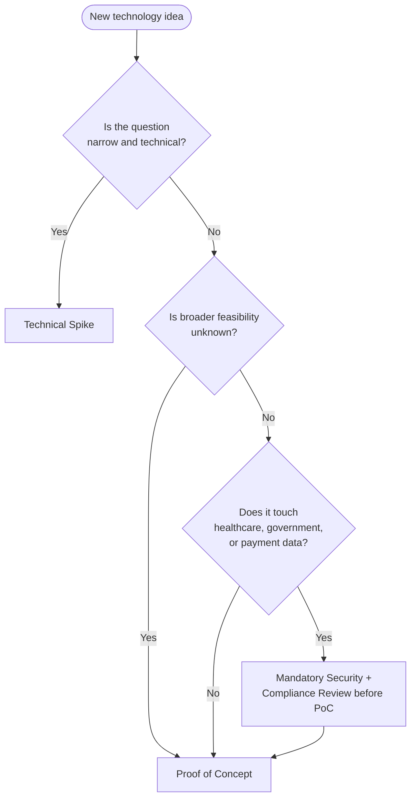
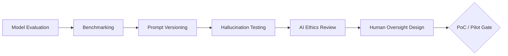
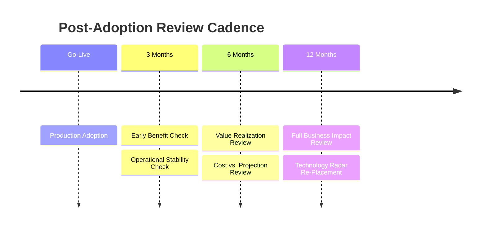

# Engineering Innovation & Research Standards

**Document:** `ai-docs/45-engineering-innovation-research-standards.md`
**Project:** Arwal — District Super App
**Stage:** 1
**Phase:** 46
**Status:** Approved Standard
**Owner:** VP Engineering, in partnership with the AI Platform Director and Architecture Review Board

---

## 1. Purpose of this Document

Arwal is a district-scale super app spanning healthcare, government integrations, payments, and citizen-facing platform services, operated by an engineering organization that will grow to hundreds of engineers across many teams. In an organization of this size and consequence, the question is never *whether* engineers will experiment with new technology — they always will — but whether that experimentation happens in a way that is visible, bounded, and convertible into durable platform value, or invisibly, redundantly, and in ways that quietly accumulate risk.

**Why innovation requires governance.** Ungoverned innovation in a large system tends toward two failure modes simultaneously: too little exploration, because individual teams have no safe, sanctioned way to try new approaches and default to whatever was used last time; and too much uncontrolled exploration, because ambitious engineers route around slow processes by quietly shipping proofs of concept into production. Governance exists to remove both failure modes at once — creating an explicit, low-friction path for trying new things, while ensuring nothing experimental reaches citizens' health data, government systems, or payment flows without passing through the same scrutiny as any other production change.

**Why responsible experimentation matters here specifically.** Arwal is not a green-field consumer app where a failed experiment costs a bug report. A failed experiment in a healthcare integration can produce incorrect clinical information. A failed experiment in a government integration can create legal or audit exposure. A failed experiment in payments can cause direct financial harm to citizens. Innovation governance is what allows Arwal engineers to keep innovating in this environment rather than becoming risk-averse to the point of technical stagnation.

**Why long-term engineering sustainability is a governance concern, not just a technical one.** Every new technology adopted becomes a long-term liability as well as an asset — something that must be operated, secured, upgraded, staffed for, and eventually retired. Without governance, an organization accumulates tools faster than it can retire them, and the resulting sprawl becomes a tax on every future engineer who has to understand "why do we have three different queue technologies."

**Why balancing innovation with operational stability is the central design tension of this document.** Every section that follows — the lifecycle, the evaluation framework, the exit criteria, the sunset governance — exists to resolve the same underlying tension: Arwal must be technologically current enough to serve citizens well for the next decade, while being operationally boring enough that engineers on call at 2 a.m. are never surprised by an unreviewed piece of experimental infrastructure in the production path.

This document governs the full innovation lifecycle: research, technical spikes, proofs of concept, prototypes, pilots, AI experimentation, and production adoption of new technology. It does not redefine Architecture Governance, Risk Management, Vendor Management, Financial Governance, Security Standards, Operational Excellence, or Compliance & Audit; where those domains intersect with innovation activity, this document references the relevant standard rather than duplicating it.

---

## 2. Innovation Philosophy

Every principle below exists to resolve a specific, recurring failure mode observed in large engineering organizations. They are not aspirational statements; they are operating rules.

| Principle | What It Means in Practice | Why It Exists |
|---|---|---|
| **Experiment safely** | All experimentation happens in isolated environments, with synthetic or anonymized data by default, behind explicit scope and access boundaries. | Without an explicit safety boundary, "just trying something quickly" becomes the most common route by which unreviewed code or unvetted data handling reaches production. |
| **Evidence over hype** | Technology adoption decisions are backed by benchmarks, PoC results, or documented comparisons — never by conference buzz or a vendor's marketing claims alone. | Large organizations pay a compounding cost for hype-driven adoption: the technology outlives the trend, but the team stops believing it delivered the promised benefit. |
| **Learn quickly** | Spikes and PoCs are timeboxed specifically so that the *cost of finding out* something doesn't work stays small. | The value of an experiment is inversely proportional to how long it takes to get a clear answer; slow experiments defeat their own purpose. |
| **Fail cheaply** | Failure is an accepted, expected, and budgeted outcome of research activity — provided it is failure at spike or PoC scale, not at production scale. | An organization that punishes failed experiments will simply stop running them, and lose its ability to evaluate new technology before a competitor or a mandate forces the decision under pressure. |
| **Production stability first** | No experimental technology touches production data paths, citizen-facing systems, or the critical path of healthcare, government, or payment flows without passing Architecture Review. | Arwal's obligations to citizens do not pause for innovation; stability is the non-negotiable floor beneath every experiment. |
| **Continuous learning** | Engineers are expected, and given capacity, to study the field — not only to build features. | Technology and threat landscapes move faster than any static standard; an organization that stops learning falls behind silently until a crisis makes the gap visible. |
| **Measurable outcomes** | Every experiment defines what "success" means before it starts, in terms that can be checked afterward. | Without a predefined success measure, retrospective judgment of an experiment collapses into opinion and internal politics rather than evidence. |
| **Knowledge sharing** | The outcome of every piece of research — including negative results — is captured in a searchable, organization-wide knowledge base. | The most expensive kind of technical debt is re-answering a question the organization already answered once and then forgot; documented failure is as valuable as documented success. |

---

## 3. Innovation Framework

Arwal defines six categories of innovation activity, ordered by increasing commitment, increasing scope, and increasing governance requirements.

| Category | Definition | Typical Duration | Governance Weight |
|---|---|---|---|
| **Research** | Open-ended investigation of a technology, technique, or academic development with no commitment to build anything. | Unbounded, capacity-allocated | Light — knowledge capture only |
| **Technical Spike** | A short, focused engineering effort to answer a specific technical question ("can X integrate with Y," "what is the latency of Z"). | Days | Light — timeboxed, no adoption commitment |
| **Proof of Concept (PoC)** | A deliberately narrow, throwaway implementation built to test feasibility against defined success criteria. | 1–4 weeks | Moderate — owner, timebox, budget, exit criteria required |
| **Prototype** | A more complete implementation used to validate usability, integration depth, or user/stakeholder reaction; still not production-grade. | 2–8 weeks | Moderate-to-high — documentation, ownership, security review |
| **Pilot** | A limited, controlled, real-world deployment (e.g., one district office, one hospital ward, one payment corridor) with real but bounded exposure. | 1–3 months | High — architecture pre-review, monitoring, rollback plan |
| **Production Adoption** | Full architecture review, operational readiness, and rollout as a standard, supported part of the Arwal platform. | Ongoing | Full governance per Architecture Principles and Operational Excellence standards |

Each category has a distinct purpose and none may be skipped: a technology may not move from Research directly to Pilot, and a Prototype may not be deployed to real users without first being treated as a Pilot under full pilot governance.

---

## 4. Innovation Lifecycle

**Why this lifecycle has explicit exit gates at every stage:** the single most common innovation failure in large organizations is not a bad idea — it is a mediocre idea that is never formally killed, and so continues consuming engineering attention indefinitely. Every stage transition in this lifecycle requires an explicit decision to continue, not a default. Silence is not consent; a technology that receives no further sponsorship at a gate is automatically routed to Retirement.

| Stage | Entry Requirement | Exit Requirement | Decision Owner |
|---|---|---|---|
| Idea | Any engineer or stakeholder submission | Logged in Innovation Backlog | Submitter |
| Research | Backlog prioritization | Findings documented in Knowledge Base | Research sponsor |
| Technical Evaluation | Research findings exist | Technical Evaluation Framework scorecard completed | Principal Engineer / Architect |
| Proof of Concept | Evaluation score meets threshold | Success criteria met/not met, recommendation issued | PoC Owner |
| Prototype | PoC recommends "continue" | Usability/integration validated, documented | Prototype Owner |
| Pilot | Prototype recommends "continue" | Real-world metrics collected, rollback tested | Pilot Owner + Ops |
| Architecture Review | Pilot recommends "continue" | Architecture Review Board approval | Architecture Review Board |
| Production Adoption | Architecture Review approval | Operational readiness checklist complete | VP Engineering / Platform Engineering |
| Continuous Evaluation | Live in production | Ongoing — 3/6/12-month reviews | Technology Owner |
| Retirement | Any stage exit, or continuous evaluation failure | Decommission plan executed | Technology Owner + Architecture Review Board |

---

## 5. Technology Evaluation Framework

Every candidate technology — whether proposed for a spike, PoC, or direct adoption — is scored against the same weighted framework before resources are committed.

| Dimension | Key Questions | Weight |
|---|---|---|
| **Technical feasibility** | Does it solve the stated problem? Are there working reference implementations at comparable scale? | High |
| **Architectural fit** | Does it fit the modular monolith / event-driven / future-microservices direction, or does it require an architectural exception? | High |
| **Security implications** | What is the attack surface? Has it undergone independent security review? Does it touch healthcare, government, or payment data? | High |
| **Scalability** | Does it scale to district-wide, and eventually national-scale, load? | Medium |
| **Operational impact** | What is the on-call burden? Does Platform Engineering / SRE have the skills to operate it? | High |
| **Cost** | Licensing, infrastructure, and engineering time cost, evaluated per Financial Governance standards. | Medium |
| **Community / vendor maturity** | Is it actively maintained? What is the contributor/vendor health? | Medium |
| **Long-term support** | Is there a credible 3–5 year support horizon? | Medium |
| **Regulatory considerations** | Does it introduce data residency, healthcare compliance, or government-integration constraints? Escalate to Compliance & Audit standards where relevant. | High (mandatory for healthcare/government/payments) |

### Technology Radar

All evaluated technologies are placed on a centrally maintained **Technology Radar**, reviewed quarterly by the Architecture Review Board.

| Radar Ring | Meaning | Engineering Guidance |
|---|---|---|
| **Adopt** | Proven, approved for use across Arwal without additional review. | Use freely within architectural guardrails. |
| **Trial** | Validated in at least one PoC or Pilot; approved for further controlled use. | Use only with sponsoring team's oversight; report outcomes. |
| **Assess** | Under active research or evaluation; not yet validated. | May be explored via Research or Spike only; not for PoC without sponsorship. |
| **Hold** | Explicitly discouraged — deprecated, superseded, or found unsuitable. | Do not adopt for new work; existing use is tracked for migration. |

### Decision Tree: Which Innovation Path Applies?

---

## 6. Proof of Concept Governance

Every PoC must be registered in the Innovation Backlog with the following, before any engineering time is spent:

| Requirement | Description |
|---|---|
| **Objective** | The specific question the PoC answers. |
| **Success criteria** | Measurable, predefined pass/fail thresholds — not subjective impressions. |
| **Time limit** | Fixed timebox (default: 2 weeks; maximum: 4 weeks without Architecture Review Board extension). |
| **Budget limit** | Approved capacity/spend, per Financial Governance standards. |
| **Scope** | What is explicitly in scope and out of scope — including a statement that PoCs never use real citizen, patient, or payment data. |
| **Owner** | A single named accountable engineer or lead. |
| **Deliverables** | Code (throwaway, clearly labeled), findings write-up, recommendation. |
| **Exit criteria** | One of: **Adopt** (proceed to Prototype), **Continue Research** (insufficient evidence), or **Retire** (does not meet criteria). |

**Why a fixed timebox is mandatory, not advisory:** PoCs without a hard deadline tend to quietly become permanent unreviewed systems — "temporary" infrastructure that nobody ever schedules time to properly build or remove. The timebox forces the exit decision to happen on a predictable schedule rather than by accident.

---

## 7. Prototype Governance

| Area | Standard |
|---|---|
| **Prototype quality** | Must meet baseline code quality and testing standards even though it is not production-grade; "throwaway" applies to PoCs, not Prototypes. |
| **Data usage** | Synthetic or fully anonymized data only, unless Pilot-stage approval has been granted under Security Standards and Compliance & Audit. |
| **Security** | Baseline security review required before any Prototype is used by more than the owning team. |
| **Documentation** | Architecture, data flow, and known limitations documented in the Knowledge Base. |
| **Ownership** | Named accountable owner and named engineering sponsor (typically a Principal Engineer). |
| **Transition to production** | Never direct — must pass through Pilot and Architecture Review. |
| **Prototype retirement** | Any Prototype with no active sponsor for two consecutive quarterly innovation reviews is automatically retired. |

---

## 8. AI Innovation Governance

Arwal's AI Platform requires governance specific to the unique risk profile of AI/ML and LLM-based systems, in addition to (not instead of) the general innovation lifecycle above.

| Area | Standard | Why It Exists |
|---|---|---|
| **AI research** | Tracked in the same Innovation Backlog and Knowledge Base as all other research. | Prevents AI research from becoming a shadow process outside normal governance. |
| **Model evaluation** | Candidate models are benchmarked against task-specific accuracy, latency, cost-per-call, and safety metrics before any PoC begins. | Model selection driven by evidence, not by which model is newest or most publicized. |
| **Benchmarking** | Standardized, versioned benchmark suites per use case (e.g., clinical summarization, citizen query triage), re-run whenever a model version changes. | Model behavior changes across versions; a benchmark run once is stale the moment the vendor ships an update. |
| **Prompt versioning** | All prompts used in production or Pilot-stage systems are version-controlled with change history and rollback capability. | Prompts are executable logic; ungoverned prompt changes are equivalent to unreviewed code deploys. |
| **Agent experimentation** | Any autonomous or semi-autonomous agent (i.e., an AI system that takes actions, not just generates text) requires explicit scoping of allowed actions and mandatory human approval gates before Pilot stage. | Agentic systems can take real-world action; the blast radius of a misbehaving agent is categorically larger than a chatbot's. |
| **Hallucination testing** | Mandatory adversarial and factuality testing before any AI system is exposed to citizens, especially in healthcare or government contexts. | Confident, fluent, incorrect output is the dominant failure mode of LLM systems and the hardest for users to detect unaided. |
| **AI ethics** | All AI systems reviewed for fairness, bias, and disparate impact across the district's population before Pilot. | Arwal serves the full population of a district; an AI system that performs unevenly across demographic groups causes real harm and undermines public trust. |
| **Human oversight** | Every AI system serving healthcare, government, or payment functions retains a human-in-the-loop or human-on-the-loop control point appropriate to its risk level. | AI assistance must augment, not silently replace, accountable human decision-making in high-stakes domains. |
| **Responsible AI adoption** | AI PoCs and Pilots follow the same exit-criteria and Architecture Review discipline as any other technology — no AI-specific shortcut to production. | Excitement about AI capability is not, by itself, evidence of production readiness. |

---

## 9. Engineering Research

| Activity | Governance |
|---|---|
| **Academic research** | Engineers may allocate research capacity (see §11) to reviewing relevant academic literature; findings are summarized into the Knowledge Base, not left as personal notes. |
| **Industry trends** | Tracked as part of the quarterly Technology Radar review. |
| **Open-source evaluation** | Follows the Technology Evaluation Framework (§5); license compatibility is confirmed with Compliance & Audit standards before any Trial-ring adoption. |
| **Benchmarking** | Standardized methodology maintained centrally so results are comparable across teams and over time. |
| **Technical conferences** | Attendance is expected to produce a knowledge-share artifact (write-up or internal talk), not only individual learning. |
| **Knowledge capture** | Mandatory for all research activity — see §14. |

---

## 10. Innovation Portfolio

| Component | Description |
|---|---|
| **Innovation backlog** | Single, organization-wide backlog of ideas, research topics, spikes, PoCs, prototypes, and pilots, with status visible to all engineers. |
| **Prioritization** | Scored against business alignment, technical evaluation score, and strategic fit; reviewed at each quarterly innovation review. |
| **Capacity allocation** | See §11 — a defined percentage of engineering capacity is reserved for innovation activity, protected from feature-delivery pressure. |
| **Innovation roadmap** | Rolling 12-month view of active and planned innovation initiatives, maintained by the AI Platform Director and VP Engineering. |
| **Resource planning** | Innovation initiatives above Spike level are staffed with named owners and sponsors, not "whoever has spare time." |
| **Business alignment** | Every Prototype-stage-and-above initiative documents which business or citizen outcome it serves. |

**Innovation capacity planning:** Arwal reserves a defined percentage of total engineering capacity (set and reviewed annually by VP Engineering and Platform Engineering leadership) explicitly for research, spikes, and PoCs. This allocation is protected — it is not the first thing cut when delivery deadlines tighten. **Why:** capacity that is only "whatever is left over" is capacity that never exists in practice; explicit allocation is what makes the innovation philosophy in §2 actually operational rather than aspirational.

---

## 11. Production Adoption

| Requirement | Standard |
|---|---|
| **Adoption criteria** | Successful Pilot outcome, positive Technology Evaluation Framework score, and a completed recommendation from the Pilot Owner. |
| **Architecture approval** | Mandatory Architecture Review Board sign-off per Architecture Principles standard — no experimental technology enters production without it. |
| **Operational readiness** | Runbooks, monitoring, alerting, and on-call ownership defined per Operational Excellence standards before go-live. |
| **Documentation** | Full technical documentation published to the Knowledge Base, including known limitations carried over from Pilot. |
| **Training** | Relevant teams trained before or concurrent with rollout; training completion tracked. |
| **Monitoring** | Production monitoring includes technology-specific health metrics in addition to standard platform monitoring. |
| **Rollback strategy** | Documented, tested rollback plan is a mandatory precondition of go-live, not an afterthought. |

---

## 12. Innovation Metrics

| Metric | Definition | Reviewed By |
|---|---|---|
| Experiment success rate | % of PoCs/Prototypes/Pilots that meet their predefined success criteria | Quarterly Innovation Review |
| Time to validation | Average elapsed time from PoC start to exit decision | Quarterly Innovation Review |
| Production adoption rate | % of Pilots that reach Production Adoption | Quarterly Innovation Review |
| Innovation ROI | Business/operational value delivered vs. capacity invested | Annual Research Strategy Review |
| Research throughput | Number of research topics closed with documented findings | Quarterly Innovation Review |
| Knowledge reuse | Frequency with which past research/PoC findings are referenced in new initiatives | Quarterly Innovation Review |
| Technology retirement rate | Number of technologies formally sunset per year | Annual Research Strategy Review |
| Business impact | Qualitative + quantitative assessment tied to citizen or operational outcomes | Post-adoption reviews (§16) |

---

## 13. Executive Dashboards

| Dashboard | Audience | Key Contents |
|---|---|---|
| **Innovation Portfolio Overview** | CTO, VP Engineering | Active initiatives by stage, capacity utilization, top risks |
| **Technology Radar** | Architecture Review Board, Platform Engineering | Current Adopt/Trial/Assess/Hold placements and quarter-over-quarter movement |
| **AI Innovation Dashboard** | AI Platform Director | Model evaluations in progress, benchmark trends, responsible-AI review status |
| **Innovation ROI Dashboard** | Executive Leadership | Metrics from §12, cost vs. value delivered, retirement rate |
| **Pipeline Health Dashboard** | VP Engineering, Platform Engineering | Stage-by-stage conversion rates, time-to-validation trends, stalled initiatives |

---

## 14. AI-Assisted Innovation

Arwal permits and encourages the use of AI assistance within the innovation process itself, under the following governance:

| Use | Governance |
|---|---|
| **Research assistance** | AI tools may summarize literature or prior art; all AI-generated summaries are labeled as such and verified by a human researcher before entering the Knowledge Base. |
| **Technology comparisons** | AI-assisted comparisons are treated as a starting draft, not a substitute for the Technology Evaluation Framework scoring in §5. |
| **Literature summarization** | Same verification requirement as research assistance above. |
| **Prototype generation** | AI-generated code used in Prototypes follows the same quality, security, and documentation standards as human-written code (§7); it carries no exemption. |
| **Experiment analysis** | AI may assist in analyzing PoC/Pilot results, but the final recommendation (Adopt / Continue / Retire) is always made and signed off by the human Owner. |
| **Human approval** | No AI-assisted output — research summary, comparison, generated code, or analysis — is treated as final without named human review and sign-off. |

**Why human approval is non-negotiable here:** using AI to accelerate innovation work is itself an act of innovation, and it is therefore governed by the same core principle underlying this entire document — evidence over hype, and human accountability preserved at every decision point.

---

## 15. Engineering Anti-Patterns

The following patterns are explicitly discouraged and are flagged during quarterly innovation reviews:

- **Innovation without business value** — technology explored for its own sake with no connection to a citizen or operational outcome.
- **Technology chasing** — adopting new tools because they are trending, not because the Technology Evaluation Framework supports them.
- **Permanent prototypes** — Prototypes or Pilots that persist indefinitely without a production decision, violating the exit-criteria requirement in §4.
- **Uncontrolled experimentation** — spikes or PoCs run outside the Innovation Backlog, with no owner, timebox, or success criteria.
- **Production PoCs** — PoC-quality code reaching production data paths, bypassing Architecture Review.
- **Innovation without documentation** — completed research or experiments with no Knowledge Base entry, forcing future teams to re-discover the same findings.
- **Tool proliferation** — multiple teams independently adopting overlapping tools for the same problem, absent Technology Radar coordination.
- **Research silos** — teams duplicating research effort because findings were never shared organization-wide.
- **Ignoring failed experiments** — treating a "Retire" outcome as a wasted effort rather than valuable, documented evidence.

---

## 16. Engineering Review Checklist

**Before starting any PoC, Prototype, or Pilot:**

- [ ] Registered in the Innovation Backlog
- [ ] Named Owner assigned
- [ ] Success criteria defined and measurable
- [ ] Timebox and budget approved
- [ ] Scope explicitly defined, including data-usage boundaries
- [ ] Technology Evaluation Framework scorecard completed
- [ ] Security/compliance flag raised if healthcare, government, or payment-adjacent

**Before Architecture Review for Production Adoption:**

- [ ] Pilot success criteria met and documented
- [ ] Operational readiness checklist complete (per Operational Excellence standard)
- [ ] Security review complete (per Security Standards)
- [ ] Rollback plan documented and tested
- [ ] Training plan in place
- [ ] Monitoring and alerting defined
- [ ] Cost model reviewed (per Financial Governance standard)
- [ ] Knowledge Base entry published

**Ongoing, post-adoption:**

- [ ] 3-month post-adoption review scheduled
- [ ] 6-month post-adoption review scheduled
- [ ] 12-month post-adoption review scheduled
- [ ] Technology Radar entry updated

---

## 17. Governance Review

| Review | Frequency | Participants | Purpose |
|---|---|---|---|
| **Quarterly innovation review** | Quarterly | VP Engineering, AI Platform Director, Principal Engineers | Review backlog, active experiments, and metrics from §12 |
| **Technology radar review** | Quarterly | Architecture Review Board | Update Adopt/Trial/Assess/Hold placements |
| **Annual research strategy review** | Annually | CTO, VP Engineering, AI Platform Director | Set research priorities and capacity allocation for the coming year |
| **AI innovation review** | Quarterly | AI Platform Director, Responsible AI reviewers | Review model evaluations, benchmarks, hallucination testing outcomes |
| **Prototype audit** | Quarterly | Platform Engineering | Identify and retire unsponsored or stale Prototypes |
| **Innovation portfolio review** | Quarterly | VP Engineering, Product Strategy | Confirm business alignment of active initiatives |

### Post-Adoption Review Cadence

Every technology reaching Production Adoption is formally reviewed at fixed intervals to confirm expected benefits were realized:

**Why fixed-interval post-adoption review matters:** the innovation lifecycle does not end at go-live. A technology that looked justified at the Pilot stage can fail to deliver the projected benefit once operating at full production scale; the 3/6/12-month cadence is what catches that gap before it becomes permanent, unexamined technical debt.

---

## 18. Sunset Governance

Technologies are retired — not left to decay in place — under the following triggers:

| Trigger | Action |
|---|---|
| Post-adoption review shows benefit not realized | Technology Owner presents findings to Architecture Review Board; migration or retirement plan required within one quarter |
| Vendor/community support ends | Automatic move to **Hold** ring on Technology Radar; migration plan required within two quarters |
| Superseded by a better-evaluated alternative | Technology Owner and Architecture Review Board agree a sunset timeline |
| Security posture becomes unacceptable | Immediate Hold status; expedited migration per Security Standards |
| No active owner for two consecutive quarterly reviews | Automatic escalation to Architecture Review Board for retirement decision |

Every sunset includes a documented decommission plan, data-migration or data-retention plan (per Compliance & Audit standards), and a Knowledge Base entry capturing lessons learned — so that the reasons for retirement inform future Technology Evaluation Framework scoring.

---

## 19. RACI — Innovation Lifecycle

| Activity | Engineer | PoC/Prototype/Pilot Owner | Principal Engineer / Architect | Architecture Review Board | VP Engineering | AI Platform Director |
|---|---|---|---|---|---|---|
| Submit idea | R | — | — | — | — | — |
| Conduct research/spike | R | — | C | — | I | C (if AI-related) |
| Run PoC | C | R/A | C | I | I | C (if AI-related) |
| Run Prototype | C | R/A | C | I | I | C (if AI-related) |
| Run Pilot | C | R/A | C | C | I | C (if AI-related) |
| Architecture Review | I | C | C | R/A | I | C (if AI-related) |
| Approve Production Adoption | I | C | C | A | R | C (if AI-related) |
| Post-adoption review | I | R | C | I | A | C (if AI-related) |
| Sunset decision | I | R | C | A | I | C (if AI-related) |

*R = Responsible, A = Accountable, C = Consulted, I = Informed*

---

## 20. Adoption Maturity Model

| Level | Name | Characteristics |
|---|---|---|
| **0** | Ad hoc | No backlog, no timebox, experiments undocumented, decisions made informally |
| **1** | Tracked | Innovation Backlog exists; PoCs have owners and timeboxes, but exit criteria inconsistently enforced |
| **2** | Governed | Full lifecycle (§4) enforced; Technology Radar maintained; Knowledge Base populated |
| **3** | Measured | Innovation Metrics (§12) tracked and reviewed quarterly; capacity allocation formalized |
| **4** | Optimizing | Post-adoption reviews consistently close the loop; sunset governance actively retires technology; innovation ROI demonstrably informs roadmap and capacity decisions |

Arwal's target operating level from Stage 1 onward is **Level 2 (Governed)**, with a roadmap to **Level 3 (Measured)** as the Innovation Metrics dashboards (§13) mature.

---

## 21. Relationship with Previous Standards

This document governs innovation and research activity specifically. It relies on, and does not duplicate, the following standards:

| Standard | Relationship |
|---|---|
| **Project Vision** | Innovation priorities are scored for alignment against the Project Vision's stated goals; this document does not restate that vision. |
| **Engineering Principles** | Prototype and PoC code quality expectations derive from the Engineering Principles baseline; this document adds innovation-specific timeboxing and exit criteria on top. |
| **Operational Excellence** | Operational readiness, monitoring, and on-call standards referenced in §11 are fully defined in the Operational Excellence standard; this document only specifies when they must be satisfied. |
| **Financial Governance** | PoC/Prototype/Pilot budget limits and cost evaluation criteria follow Financial Governance approval thresholds; this document does not redefine spend authority. |
| **Vendor Management** | Evaluation of third-party and vendor technologies follows Vendor Management's procurement and contracting rules; the Technology Evaluation Framework (§5) is a technical input to that process, not a replacement for it. |
| **Business Continuity** | Rollback and sunset plans (§11, §18) must satisfy Business Continuity requirements for any technology in a critical path. |
| **Compliance & Audit** | Regulatory considerations (§5), data usage in Prototypes (§7), and healthcare/government/payment data handling throughout this document defer entirely to Compliance & Audit standards for specific requirements. |
| **Architecture Principles** | Architecture Review Board approval (§4, §11) is granted under the criteria defined in Architecture Principles; this document specifies *when* that review is triggered within the innovation lifecycle, not *how* the board evaluates architecture. |

---

## 22. Closing Statement

Disciplined innovation governance is what allows Arwal to keep pace with a rapidly changing technology landscape — in AI, in healthcare integration, in government digital services, in payments — without gambling with the stability that citizens depend on. By giving every engineer a clear, fast, well-lit path from idea to evidence, and by refusing to let prototypes and pilots linger without a decision, Arwal turns innovation from a source of hidden risk into a managed, measurable engine of platform improvement. Evidence over hype, fail cheaply, document everything, and never let an experiment reach production without earning its way there: these are the habits that let Arwal keep building for the next decade rather than merely maintaining what it built for the last one — sustaining both engineering creativity and the public trust the platform exists to serve.
