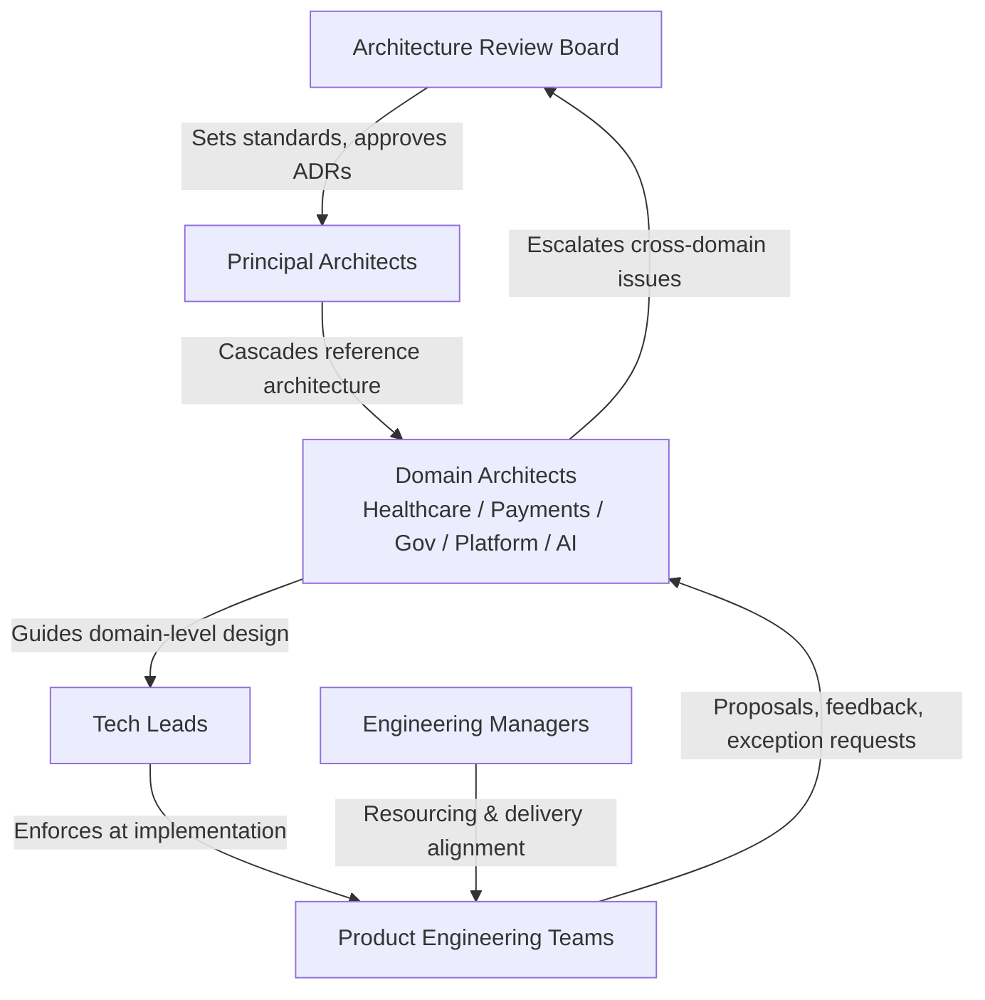
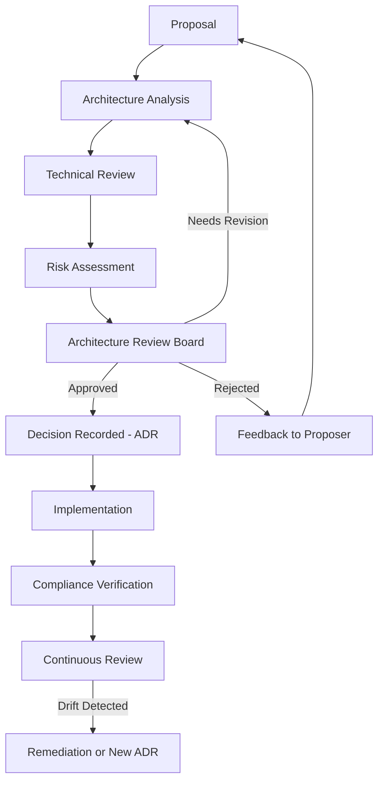
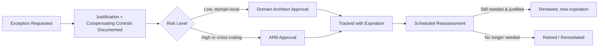

# Engineering Architecture Governance Standards
### Arwal — District Super App
**Document ID:** 46-engineering-architecture-governance-standards
**Stage:** 1 · **Phase:** 47
**Status:** Approved Standard
**Owning Body:** Architecture Review Board (ARB)

---

## Purpose of this Document

Arwal is being built as a long-lived platform intended to serve a district-scale population across healthcare, payments, government integrations, and citizen-facing services, developed incrementally across roughly 300 engineering phases and hundreds of contributing engineers over multiple years. A system of that lifespan does not fail because a single engineer writes a bad module — it fails because hundreds of individually reasonable decisions, made without a shared frame of reference, slowly pull the architecture in incompatible directions. This document exists to prevent that failure mode.

Specifically, this standard exists because:

- **Long-term architectural consistency requires an explicit mechanism, not goodwill.** Good intentions do not scale past a handful of teams. Without a governing body and a recorded decision trail, every team re-derives its own conventions, and the system fragments.
- **Technical sustainability is a first-class deliverable.** Arwal must still be maintainable, extensible, and comprehensible in year five, not just at launch. Governance is the mechanism that protects the system's future optionality against short-term convenience.
- **Decision transparency prevents re-litigation.** When a decision and its rationale are recorded, future engineers can understand *why* something is the way it is, agree or formally challenge it, and avoid wasting cycles re-arguing settled questions from first principles.
- **Controlled architectural evolution is what allows the platform to change safely.** Arwal will evolve from a modular monolith toward event-driven and eventually distributed/microservices patterns. That evolution must happen deliberately, phase by phase, with reversibility and blast-radius control — not as an uncoordinated series of local rewrites.

This document governs **how** architectural decisions are made, reviewed, approved, implemented, verified, and evolved. It does not restate *what* the architecture itself should look like technically (see [Relationship with Previous Standards](#relationship-with-previous-standards)).

---

## Architecture Governance Philosophy

| Principle | Statement | Why It Exists |
|---|---|---|
| **Architecture serves business** | Every architectural decision must trace back to a business, user, or operational outcome. | Prevents architecture from becoming an end in itself; keeps engineering effort aligned with district-scale citizen impact. |
| **Consistency over personal preference** | Approved patterns take precedence over individual taste, even when an engineer's alternative is technically defensible. | At hundreds-of-engineers scale, uncoordinated personal preference produces N architectures instead of one, multiplying onboarding cost and operational risk. |
| **Evolution over revolution** | Architecture changes incrementally, in reviewable, reversible steps. | Big-bang rewrites in critical systems (healthcare, payments, government) carry unacceptable risk of outage, data loss, or compliance failure. |
| **Simplicity first** | The simplest architecture that satisfies current, known requirements is preferred over speculative generality. | Overengineering for imagined future scale is a recurring cause of wasted effort and unnecessary operational complexity. |
| **Evidence-based decisions** | Architectural claims (performance, scalability, reliability) must be supported by data, benchmarks, or prior art — not assertion. | Protects the organization from decisions driven by hype, seniority, or persuasive but untested argument. |
| **Measured exceptions** | Deviation from standards is allowed, but only when scoped, justified, time-boxed, and tracked. | Permanent, silent exceptions are how architectural drift accumulates until the standard itself becomes meaningless. |
| **Long-term maintainability** | Decisions are evaluated on total cost of ownership, not just time-to-ship. | Arwal's lifespan is measured in years and phases, not sprints; short-term velocity gains that create long-term maintenance debt are a net loss. |
| **Shared ownership** | Architecture is a collective asset stewarded by the ARB and domain architects, not the property of any one team. | Prevents siloed, team-local architectures that block cross-team reuse and create integration friction. |

---

## Architecture Governance Framework



| Role | Responsibility | Relationship to Governance |
|---|---|---|
| **Architecture Review Board (ARB)** | Owns architecture governance; approves/rejects ADRs, reference architectures, and exceptions. | Ultimate decision authority for cross-cutting and high-risk architecture. |
| **Principal Architects** | Own end-to-end technical direction across domains; author/curate reference architectures. | Vote on ARB; escalation point for domain architects. |
| **Domain Architects** (Healthcare, Payments, Government, Platform, AI Platform) | Own architecture within their domain; ensure domain designs comply with reference architecture. | Bring domain proposals to ARB; enforce compliance within domain. |
| **Tech Leads** | Translate approved architecture into team-level technical decisions and code-level enforcement. | Escalate ambiguity or friction to domain architects; not empowered to approve exceptions unilaterally. |
| **Engineering Managers** | Ensure teams have capacity to comply with architecture decisions; balance delivery pressure against governance requirements. | Non-voting governance stakeholders; escalation path for resourcing conflicts. |
| **Product Engineering** | Implements within approved patterns; raises proposals for new patterns where existing ones fall short. | Primary source of architecture proposals and exception requests. |

---

## Architecture Review Board (ARB)

### Membership

| Seat | Voting? | Notes |
|---|---|---|
| Chief Architect (Chair) | Yes | Tie-breaking vote |
| CTO / VP Engineering | Yes | May delegate to Chief Architect for routine reviews |
| Principal Architects (all) | Yes | |
| Domain Architects (Healthcare, Payments, Government, Platform, AI Platform) | Yes | One vote per domain regardless of domain size |
| Security Architecture Representative | Yes | Mandatory attendance for any review touching data, auth, or external integration |
| SRE / Platform Engineering Director | Advisory | Non-voting; provides operational feasibility input |
| Proposing Team Representative | Non-voting | Presents proposal; may respond to questions |

### Quorum and Voting Rules

- **Quorum:** A minimum of five voting members, including the Chair or their delegate and the Security Architecture Representative, must be present for a binding decision.
- **Voting threshold:** Simple majority of present voting members for standard decisions; **two-thirds majority** required for decisions affecting healthcare, payments, or government-integration domains due to elevated regulatory and safety stakes.
- **Conflict of interest:** A voting member with direct ownership of, or reporting relationship to, the proposing team must disclose the conflict and abstain from voting (may still participate in discussion).
- **Tie-breaking:** The Chair casts the deciding vote in the event of a tie.

### Responsibilities

- Approve, reject, or request revision of Architecture Decision Records (ADRs).
- Approve and maintain the catalog of reference architectures and approved technology stacks.
- Approve, time-box, and periodically re-review architecture exceptions.
- Resolve cross-domain architectural conflicts.
- Own the architecture maturity model and its application across engineering.

### Meeting Cadence

| Cadence | Purpose |
|---|---|
| Weekly | Standard ADR review, exception requests, standing business |
| Monthly | Architecture compliance and metrics review |
| Quarterly | Reference architecture and technology stack review |
| Annual | Architecture strategy and governance model reassessment |

### Emergency Reviews

An emergency review may be convened within 24 hours when a proposed or in-flight change poses an active production risk, a regulatory/compliance deadline, or a security exposure. Emergency reviews require a minimum of three voting members, including the Security Architecture Representative when the issue is security-related, and any decision made under emergency quorum must be ratified at the next standing ARB meeting.

### Escalation

Unresolved disagreement between a domain architect and a proposing team escalates to the ARB Chair. Unresolved disagreement within the ARB itself escalates to the CTO for final resolution.

### Decision Recording

Every ARB decision — approval, rejection, revision request, or exception grant — is recorded as an ADR or an Exception Record (see below), with the vote tally, dissenting opinions, and rationale. Undocumented verbal approvals carry no governance authority.

---

## Architecture Decision Lifecycle



Each stage has an owner and an exit criterion:

| Stage | Owner | Exit Criterion |
|---|---|---|
| Proposal | Proposing team | Problem statement, options considered, recommendation documented |
| Architecture Analysis | Domain Architect | Alignment with reference architecture assessed |
| Technical Review | Tech Leads + Domain Architect | Technical feasibility and integration impact confirmed |
| Risk Assessment | Security + SRE representatives | Security, operational, and compliance risks identified and scored |
| ARB Decision | ARB | Vote recorded; ADR issued |
| Implementation | Proposing team | Delivered per approved design |
| Compliance Verification | Domain Architect | Post-implementation review confirms design conformance |
| Continuous Review | ARB / automated fitness functions | Ongoing drift monitoring |

---

## Architecture Decision Records (ADR)

### Governance Rules

- **Creation:** Any engineer may draft an ADR; it must be co-signed by a Tech Lead or Domain Architect before submission to the ARB.
- **Template:** All ADRs use the standard template below — free-form documents are not accepted for ARB review.
- **Numbering:** Sequential, global, immutable (`ADR-0001`, `ADR-0002`, …). Numbers are never reused, even for rejected proposals.
- **Approval:** Requires ARB vote per the quorum/voting rules above.
- **Versioning:** An ADR's *decision* is immutable once approved. Changes in direction require a new ADR that explicitly supersedes the prior one.
- **Superseding:** A superseding ADR must reference the ADR(s) it replaces; the superseded ADR is marked `Superseded` but never deleted.
- **Retirement:** ADRs are retired (marked `Deprecated`) when the decision no longer applies, with a link to the replacing decision or rationale for removal without replacement.

### ADR Template

```markdown
# ADR-XXXX: <Title>

Status: Proposed | Accepted | Rejected | Superseded | Deprecated
Date: YYYY-MM-DD
Domain: Healthcare | Payments | Government | Platform | AI Platform | Cross-Cutting
Deciders: <ARB members present>

## Context
<Problem being solved; forces at play>

## Decision
<What was decided>

## Alternatives Considered
<Options evaluated and why they were not chosen>

## Consequences
<Positive and negative consequences, including technical debt introduced>

## Compliance Notes
<How this will be verified post-implementation>
```

---

## Reference Architecture Governance

| Category | Governed Artifact | Approval Authority |
|---|---|---|
| Technology Standards | Approved languages, frameworks, datastores, messaging systems | ARB (quarterly review) |
| Integration Patterns | Synchronous API, event publication/subscription, batch integration | ARB |
| Service Patterns | Module boundaries within the monolith, future service extraction criteria | Principal Architects, ratified by ARB |
| Platform Patterns | Shared platform services (auth, notifications, audit logging) | Platform Domain Architect, ratified by ARB |
| Data Patterns | Data ownership boundaries, schema evolution rules, PII handling patterns | ARB with mandatory Security review |

Reference architectures are published in a central, version-controlled catalog. A pattern not in the catalog is, by default, **not approved for use** — proposing teams must either adopt a cataloged pattern or submit an ADR to introduce a new one.

---

## Architecture Compliance

### Architecture Compliance Scorecard

Each significant system or service is scored quarterly across seven dimensions, 1 (non-compliant) to 5 (exemplary):

| Dimension | What It Measures | Weight |
|---|---|---|
| Maintainability | Code/module structure aligns with reference architecture; low coupling | 15% |
| Scalability | Design supports known and near-term projected load | 15% |
| Security Alignment | Conformance to security architecture standards (see Security Standards doc) | 20% |
| Observability | Logging, metrics, tracing implemented per platform standard | 15% |
| Performance | Meets defined latency/throughput targets | 10% |
| Interoperability | Uses approved integration patterns; no undocumented point-to-point coupling | 15% |
| Operational Readiness | Runbooks, alerting, rollback paths in place per Operational Excellence standard | 10% |

**Composite score bands:** 4.0–5.0 = Compliant · 3.0–3.9 = Watch · Below 3.0 = Remediation Required (mandatory ARB review).

### Compliance Mechanisms

- **Compliance reviews:** Scheduled per the scorecard cadence above.
- **Design reviews:** Required before implementation begins on any major change (see trigger list below).
- **Technical audits:** Periodic deep-dive audits led by Principal Architects, focused on high-risk domains (healthcare, payments, government).
- **Exception requests:** See dedicated section below.
- **Continuous monitoring:** Automated fitness functions (see below) supplement point-in-time reviews with continuous drift detection.

### Mandatory Architecture Review Triggers

An architecture review is **required**, not optional, for:

- Any new platform or major subsystem
- Any critical integration (payments, government data exchange, healthcare records)
- Adoption of a new technology not already in the approved stack
- Any change altering a system's data ownership or trust boundary
- Any change with projected impact on more than one domain

---

## Architecture Exception Governance

No exception is valid without all seven of the following elements documented in an Exception Record:

| Field | Requirement |
|---|---|
| Business Justification | Why the deviation is necessary from a business/timeline perspective |
| Technical Justification | Why the approved pattern cannot be used as-is |
| Compensating Controls | What mitigates the risk introduced by the deviation |
| Owner | Named individual accountable for the exception |
| Expiration Date | Hard date; exceptions are never open-ended |
| Review Schedule | Cadence at which the exception is reassessed before expiry |
| Approval Authority | ARB for cross-cutting/high-risk; Domain Architect for low-risk, domain-local exceptions |



Exceptions nearing expiration without renewal or remediation are automatically escalated to the ARB as a compliance risk.

---

## Cross-Team Governance

| Area | Governance Approach |
|---|---|
| Shared Components | Owned by a designated team; changes require RFC + review by consuming teams |
| Common Libraries | Versioned and published centrally; breaking changes require a deprecation window |
| Platform Ownership | Every shared platform capability has one accountable owning team — no co-owned ambiguity |
| API Consistency | All public and internal APIs conform to the platform API standard (naming, versioning, error format) |
| Data Consistency | Canonical data ownership defined per domain; no silent duplication of source-of-truth data |
| Shared Infrastructure | Infrastructure changes affecting multiple teams require Platform Engineering sign-off in addition to ARB review where architecturally significant |

---

## Architectural Evolution

Arwal's architecture is expected to evolve from modular monolith → event-driven extensions → selective microservices extraction as scale and organizational structure demand it. This evolution is governed, not organic:

- **Incremental modernization:** Modernization happens module-by-module, behind stable interfaces, never as a full-system rewrite.
- **Legacy replacement:** Requires an ADR defining the replacement scope, migration strategy, and rollback plan.
- **Technical debt reduction:** Tracked as first-class backlog items with owners, not left implicit.
- **Platform evolution:** Changes to foundational platform capabilities go through the same ARB lifecycle as any other major change.
- **Technology transitions:** New technology adoption requires a time-boxed evaluation (proof of concept) before ARB approval for broad use.
- **Deprecation strategy:** Every deprecated pattern or technology has a published sunset date and migration guide before removal.

---

## Architecture Metrics

| Metric | Definition | Target Direction |
|---|---|---|
| Architecture Compliance | % of systems scoring "Compliant" on the scorecard | Increasing |
| ADR Throughput | ADRs processed per month vs. submitted | Stable, no backlog growth |
| Exception Count | Active exceptions, and count past expiration | Decreasing / near-zero overdue |
| Technical Debt Trend | Tracked debt items opened vs. closed per quarter | Net decreasing over time |
| Architecture Review Cycle Time | Time from proposal submission to ARB decision | Decreasing, within SLA |
| Platform Consistency | % of services using approved reference patterns | Increasing |
| Reuse Rate | % of new capability built on shared components vs. bespoke | Increasing |
| Architectural Health | Composite index of the above | Increasing |

---

## Executive Dashboards

| Dashboard | Audience | Key Contents |
|---|---|---|
| Architecture Health Overview | CTO, Chief Architect | Composite architectural health index, compliance trend, top risks |
| Governance Throughput | VP Engineering | ADR cycle time, review backlog, exception aging |
| Board Decision Log | Architecture Review Board | All decisions, votes, dissents, pending items |
| Platform Consistency | Platform Engineering | Reuse rate, shared component adoption, drift alerts |
| Executive Risk Summary | Executive Leadership | Overdue exceptions, remediation-required systems, regulatory-domain compliance status |

---

## AI-Assisted Architecture Governance

AI assistance is permitted to accelerate — never to replace — human architectural judgment:

| Use Case | AI Role | Human Requirement |
|---|---|---|
| Architecture reviews | Surface likely compliance gaps against reference architecture | Domain Architect confirms findings |
| ADR drafting | Draft initial context/alternatives sections from proposal notes | Human author remains accountable for content and decision |
| Pattern recommendations | Suggest applicable reference architecture patterns | Human selects and justifies final pattern |
| Dependency analysis | Map cross-service/module dependencies automatically | Human interprets architectural significance |
| Impact analysis | Estimate blast radius of a proposed change | Human risk assessment remains authoritative |
| Human approval | — | **No architectural decision is considered approved based on AI output alone; ARB vote is always required.** |

---

## Engineering Anti-Patterns

| Anti-Pattern | Description | Why It's Prohibited |
|---|---|---|
| Architecture by opinion | Decisions made by seniority or persuasiveness rather than evidence and process | Bypasses the evidence-based decision principle |
| Architecture drift | Implementation silently diverging from the approved design over time | Undermines the entire point of compliance verification |
| Permanent exceptions | Exceptions renewed indefinitely without genuine reassessment | Defeats the purpose of time-boxed exceptions |
| Framework-first design | Choosing a technology before defining the problem it solves | Produces solutions that don't fit actual requirements |
| Overengineering | Building for speculative future scale not evidenced by current data | Violates simplicity-first principle; wastes engineering capacity |
| Local optimization | Optimizing one team's delivery at the expense of system-wide consistency | Produces fragmented, hard-to-integrate architecture |
| Copy-paste architecture | Duplicating a pattern without understanding its context or trade-offs | Propagates mismatched assumptions across domains |
| Technology fragmentation | Multiple teams solving the same problem with different, unapproved tech | Multiplies operational and hiring cost |
| Unreviewed architectural changes | Significant changes shipped without going through the decision lifecycle | Bypasses the governance framework entirely |

---

## Engineering Review Checklist

**Pre-Implementation**
- [ ] Problem statement and business justification documented
- [ ] Alternatives considered and recorded
- [ ] Alignment with reference architecture confirmed (or exception requested)
- [ ] Security and data-handling implications assessed
- [ ] Operational readiness plan (observability, rollback) defined
- [ ] ADR drafted and co-signed by Tech Lead / Domain Architect

**ARB Review**
- [ ] Quorum met
- [ ] Conflicts of interest disclosed
- [ ] Risk assessment reviewed
- [ ] Vote recorded with rationale

**Post-Implementation**
- [ ] Implementation matches approved ADR
- [ ] Compliance scorecard completed
- [ ] Fitness functions / automated checks passing
- [ ] Runbooks and monitoring confirmed live
- [ ] Exception(s), if any, logged with expiration and owner

---

## Architecture Maturity Model

| Level | Name | Characteristics |
|---|---|---|
| 1 | Initial | Architecture decisions made ad hoc, undocumented, team-local |
| 2 | Managed | ADRs exist but inconsistently used; governance reactive |
| 3 | Defined | Reference architectures published; ARB process consistently followed |
| 4 | Measured | Compliance scorecards and metrics actively tracked and acted upon |
| 5 | Optimized | Automated fitness functions continuously enforce compliance; governance data drives proactive architectural strategy |

Domains and teams are assessed against this model annually as part of the Architecture Governance Assessment (see below). Arwal's target state by the completion of Stage 1 is **Level 3 (Defined)**, with **Level 4 (Measured)** targeted for Stage 2.

---

## Architecture Fitness Functions

Where practical, architectural rules are encoded as automated, continuously-run checks rather than relying solely on periodic human review:

- Dependency-direction checks (e.g., domain modules must not import from unrelated domains)
- Approved-technology checks in CI (flagging unapproved libraries/frameworks)
- API contract conformance checks against the platform API standard
- Data-boundary checks (flagging direct cross-domain database access)
- Observability presence checks (flagging services missing required logging/metrics/tracing)

Fitness function failures are treated as compliance signals feeding directly into the Architecture Compliance Scorecard, not as advisory-only warnings.

---

## Governance Review

| Review | Cadence | Owner |
|---|---|---|
| Architecture Review | Monthly | ARB |
| Reference Architecture Review | Quarterly | Principal Architects, ratified by ARB |
| ADR Review | Weekly (standing ARB agenda item) | ARB |
| Exception Review | Monthly, plus ad hoc for approaching expirations | ARB / Domain Architects |
| Architecture Strategy Review | Annual | ARB + CTO |
| Architecture Governance Assessment | Annual | ARB, using the Maturity Model |

---

## Relationship with Previous Standards

This document governs *process*; it deliberately does not restate the *content* defined elsewhere:

| Related Standard | Relationship |
|---|---|
| Project Vision | Governance decisions are ultimately validated against Arwal's stated vision and mission |
| Engineering Principles | Governance enforces adherence to the engineering principles at an organizational scale |
| System Architecture Principles | This document governs *how* those principles are applied and enforced, not what they are |
| Innovation & Research | New technology evaluated through Innovation & Research feeds into ARB technology-adoption decisions |
| Operational Excellence | Operational readiness criteria referenced in the compliance scorecard are defined in that standard |
| Compliance & Audit | Regulatory compliance requirements (healthcare, payments, government) are inputs to ARB risk assessment, not redefined here |
| Technical Debt Management | Debt tracked under that standard feeds the Architecture Metrics debt trend reported here |

---

## Closing Statement

Disciplined architecture governance is what allows Arwal to remain one coherent system rather than a collection of accidentally-related services, even as it grows across hundreds of engineers, dozens of teams, and roughly 300 engineering phases. By requiring every significant architectural decision to pass through a transparent, evidence-based lifecycle — proposed, analyzed, reviewed, decided, implemented, and continuously verified — this standard ensures that Arwal's architecture evolves deliberately rather than accidentally. It gives engineers a shared frame of reference instead of hundreds of local ones, gives leadership visibility into architectural health instead of surprises, and gives the platform itself the structural integrity to keep serving the district reliably for years, through healthcare, payments, and government workloads that cannot afford architectural chaos.
