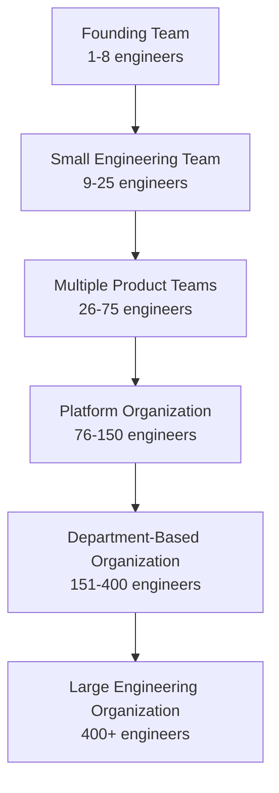
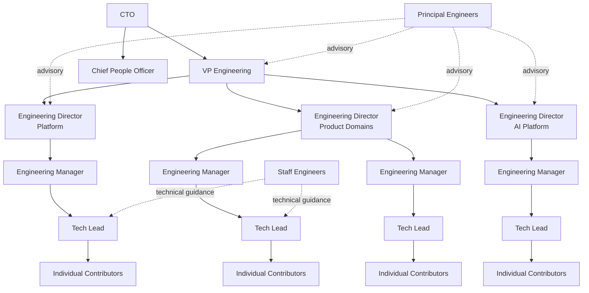
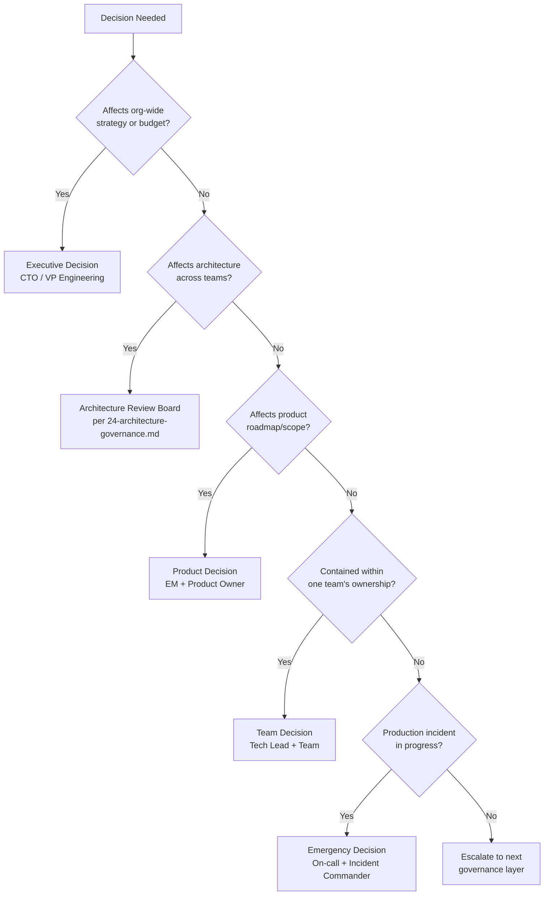
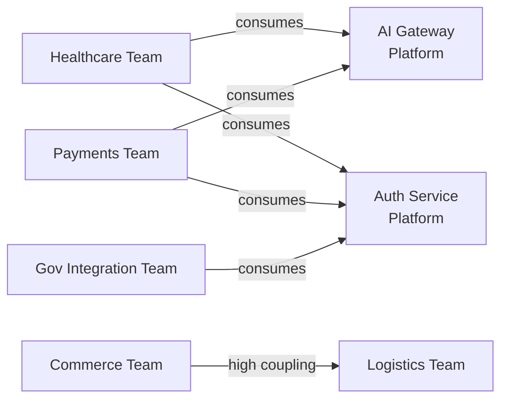
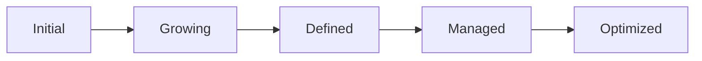

# Engineering Organizational Scaling Standards

**Document ID:** ARWAL-ENG-047
**Stage:** 1
**Phase:** 48
**Status:** Approved Standard
**Owner:** VP Engineering / Chief People Officer (joint ownership)
**Applies To:** All Arwal engineering personnel, current and future, across all departments, geographies, and vendor/contractor engagements
**Classification:** Internal — Engineering Governance

---

## Relationship to Prior Phases

This document is part of the Arwal Engineering Handbook and assumes familiarity with, and does not restate, the standards established in:

- `01-project-vision.md` — product mission and district-scale mandate
- `02-*-engineering-principles.md` — foundational engineering values this document operationalizes at organizational scale
- `03-system-architecture.md` — the Modular Monolith → Event-Driven → Microservices evolution this org model is designed to track under Conway's Law
- `04-folder-guidelines.md` and `05-coding-standards.md` — codebase conventions that ownership boundaries in this document map onto
- `06-git-workflow.md` and `07-development-workflow.md` — delivery mechanics that team topologies in this document execute
- `08-definition-of-done.md` — quality bar that all team structures defined here must uphold
- `09-tech-stack.md` — platform capabilities referenced in the Platform Engineering ownership sections
- `10-accessibility.md`, `11-security.md`, `12-performance.md` — cross-cutting domains represented by guilds and champions in this document
- `13-deployment.md`, `14-ci-cd.md`, `15-dependency-management.md` — operational surfaces owned by Platform Engineering
- `16-code-review.md`, `17-decision-authority.md` — the base decision-authority framework this document extends to organizational-scale decisions
- `18-technical-debt-management.md` — debt ownership that this document assigns to specific accountable teams
- `19-engineering-governance.md` — the parent governance framework this document operates within
- `20-onboarding-offboarding.md` — individual-level onboarding this document extends to team-level and organizational-level onboarding
- `21-portfolio-program-management.md` — portfolio structures this document's teams deliver against (not redefined here)
- `22-operational-excellence.md` — operational practices this document assigns organizational ownership for (not redefined here)
- `23-innovation-research.md` — the innovation function referenced in the growth model
- `24-architecture-governance.md` — the Architecture Review Board (ARB) whose relationship to engineering leadership is clarified in this document (architecture *decision-making* process is not redefined here)
- Career Development, Capacity Planning, and Business Continuity standards — explicitly referenced, not redefined, per this document's scope boundary

Where this document references a governance body, process, or standard defined elsewhere, the earlier document remains authoritative. This document governs **organizational structure and scaling**, not the technical or procedural content those bodies produce.

---

## Purpose of This Document

Arwal is not being built as a short-lived product. It is district-scale civic infrastructure with an expected operating horizon measured in decades and a user base projected to exceed one million people. An engineering organization that supports infrastructure of this kind cannot scale by accident. It must scale by design.

This document exists because three failure modes recur predictably in every engineering organization that grows without a deliberate structural plan:

1. **Ownership decay.** As headcount grows faster than ownership boundaries are defined, services and systems accumulate ambiguous or shared-nobody ownership. Ambiguous ownership is the single strongest predictor of production incidents going unresolved, technical debt going unpaid, and quality silently eroding.
2. **Coordination collapse.** Communication overhead grows combinatorially with team count if organizational structure does not actively suppress it. Beyond a threshold, engineers spend more time synchronizing than building.
3. **Architectural drift from Conway's Law.** Conway's Law is not a curiosity — it is a structural certainty. The shape of the software will mirror the shape of the organization whether or not that mirroring is intentional. If organizational design is left unmanaged, the target architecture (Modular Monolith → Event-Driven → Microservices) will not emerge; something else, shaped by whatever teams happen to exist, will emerge instead.

Deliberate organizational scaling protects four outcomes that are otherwise put at risk by uncontrolled growth:

- **Organizational sustainability** — the ability to keep growing without the organization becoming slower per-engineer as it grows larger.
- **Ownership clarity** — every system has exactly one team that is unambiguously accountable for it, at every point in the organization's growth.
- **Decision efficiency** — decisions are made at the lowest competent level, by people close to the context, without unnecessary escalation.
- **Long-term engineering health** — the organization remains a place where engineers can do their best work, regardless of whether it has 8 engineers or 800.

This document is the standard against which every future team formation, split, merger, or restructuring decision is evaluated.

---

## Organizational Scaling Philosophy

Every principle below exists to counteract a specific, predictable failure mode of organizational growth.

### 1. Conway's Law Awareness

**Principle:** Organizational structure is treated as an architectural decision, not merely an HR decision. Team boundaries are drawn to match desired module and service boundaries, not the reverse.

**Why this exists:** Conway's Law states that systems mirror the communication structures of the organizations that build them. If Arwal's org chart is drawn without reference to `03-system-architecture.md`, the resulting software architecture will reflect whatever org chart existed, not the modular monolith → event-driven → microservices path that has been deliberately chosen. Treating org design as an architectural lever — rather than an afterthought — is the only way to keep the two aligned as both scale.

### 2. Clear Ownership

**Principle:** Every service, repository, platform capability, and production system has exactly one accountable team at all times, with no exceptions and no transition gaps.

**Why this exists:** Shared ownership between multiple teams reliably degrades into no ownership. When an incident occurs at 2 a.m., "who owns this?" must have a one-word answer, not a discussion.

### 3. Autonomous Teams

**Principle:** Teams are structured to independently design, build, test, deploy, and operate their owned systems without requiring synchronous approval from other teams for routine work.

**Why this exists:** Every cross-team dependency required for day-to-day delivery is a tax on velocity. Autonomy within clear boundaries is what allows the organization to grow engineer count without a proportional growth in coordination cost.

### 4. Shared Responsibility

**Principle:** Autonomy over how a team delivers does not exempt any team from shared organizational responsibilities — security posture, accessibility, performance budgets, and the standards defined in prior phase documents apply uniformly.

**Why this exists:** Autonomy without shared standards produces fragmentation. Arwal needs both: team-level freedom of execution, organization-level consistency of outcome.

### 5. Platform-First Enablement

**Principle:** Common capabilities (auth, AI Gateway, observability, CI/CD, design system) are built once by dedicated platform teams and consumed as internal products by all other teams, rather than rebuilt per team.

**Why this exists:** At district scale, duplicated infrastructure work across dozens of teams is a direct, compounding tax on the entire organization's velocity. Platform-first enablement converts that duplicated cost into a one-time, well-maintained investment.

### 6. Minimize Coordination Overhead

**Principle:** Organizational design actively works to reduce the number of teams any given team must synchronously coordinate with to ship.

**Why this exists:** Communication paths grow combinatorially with team count. Left unmanaged, this growth silently converts an engineering organization from a builder of software into a coordinator of meetings.

### 7. Organizational Simplicity

**Principle:** The organization adds structure (layers, roles, processes) only when a demonstrated need exists — never preemptively, never for prestige, never to mirror a larger company's structure without cause.

**Why this exists:** Structure is not free. Every management layer, every additional approval step, and every new standing meeting is a permanent cost that must be justified by a corresponding reduction in a real, observed problem.

### 8. Continuous Evolution

**Principle:** The organizational structure defined in this document is expected to change as Arwal grows. This document defines the *process* for evolving structure, not a single permanent structure.

**Why this exists:** An organization sized correctly for 20 engineers will be actively harmful at 200. Treating the org chart as a static artifact rather than a living one is itself an anti-pattern (see Engineering Anti-Patterns).

---

## Organizational Growth Model

### Stage 1: Founding Team (1–8 engineers)

- **Structure:** Single team, no formal sub-teams. Flat reporting to a single technical founder or CTO.
- **Ownership:** Whole system owned collectively; ownership boundaries exist logically (per `04-folder-guidelines.md`) but not organizationally.
- **Decision-making:** Centralized; most decisions made directly by the founding technical lead.
- **Transition criteria (to Stage 2):** Sustained inability of one team to hold full context of the system in working memory; onboarding of the 9th engineer; first instance of two engineers blocking each other's work regularly.

### Stage 2: Small Engineering Team (9–25 engineers)

- **Structure:** 2–4 stream-aligned teams emerge, each 6–10 engineers (see Team Topologies). First Engineering Manager and Tech Lead roles appointed.
- **Ownership:** Formal service/module ownership introduced, mapped to `03-system-architecture.md` module boundaries.
- **Decision-making:** Architecture Review Board (per `24-architecture-governance.md`) formally convened for the first time.
- **Transition criteria (to Stage 3):** More than 4 stream-aligned teams needed; first dedicated platform capability required (e.g., shared auth service) rather than duplicated per-team.

### Stage 3: Multiple Product Teams (26–75 engineers)

- **Structure:** 5–10 stream-aligned teams across defined product domains (Healthcare, Payments, Commerce, etc.). First Engineering Director role appointed to oversee multiple Engineering Managers.
- **Ownership:** Platform team(s) formally split out from product teams. Enabling teams introduced for cross-cutting concerns (accessibility, security champions network).
- **Decision-making:** Decision delegation framework (see below) formally documented and enforced; Engineering Directors gain formal architecture and hiring authority within domain.
- **Transition criteria (to Stage 4):** Platform team backlog cannot keep pace with product team demand; more than 2 Engineering Directors required; first cross-team dependency mapping exercise reveals systemic bottlenecks.

### Stage 4: Platform Organization (76–150 engineers)

- **Structure:** Platform Engineering formalized as its own department with its own leadership, treated as an internal product organization serving other engineering teams (see Platform Engineering Governance below).
- **Ownership:** Complicated-subsystem teams introduced (e.g., Payments Reconciliation, Government Integration Gateway) for domains requiring deep, protected specialization.
- **Decision-making:** VP Engineering role established; Engineering Leadership Council formally convened on a regular cadence.
- **Transition criteria (to Stage 5):** More than 4 Engineering Directors reporting to a single VP Engineering; product domains require dedicated department-level leadership (e.g., a Head of Healthcare Engineering).

### Stage 5: Department-Based Organization (151–400 engineers)

- **Structure:** Formal departments established along domain lines (Healthcare, Payments, Government Integration, Platform, AI Platform, per project context), each led by a Department Head reporting to VP Engineering / CTO.
- **Ownership:** Department-level ownership councils introduced; cross-department dependency mapping becomes a standing quarterly process (see Governance Review).
- **Decision-making:** Formal succession planning (see Leadership Succession) becomes mandatory at Department Head level and above.
- **Transition criteria (to Stage 6):** Departments themselves require internal sub-department structure; geographic or regulatory distribution (e.g., separate government-liaison engineering units) emerges.

### Stage 6: Large Engineering Organization (400+ engineers)

- **Structure:** Full department/sub-department hierarchy; CTO oversees VP-level leaders per major department. Organizational structure formally reviewed against Conway's Law alignment on a fixed cadence (see Governance Review).
- **Ownership:** Ownership registry (see Ownership Model) becomes a governed, audited system of record rather than an informal document.
- **Decision-making:** Full decision delegation matrix in force at every level; escalation paths formally time-bounded.

> **Critical Principle:** No stage transition is triggered by headcount alone. Headcount ranges above are indicative, not prescriptive. The actual trigger is always a demonstrated structural need — coordination failure, ownership ambiguity, or delivery bottleneck — as evidenced by the metrics defined in Engineering Metrics.

---

## Engineering Organization Structure

### Role Definitions and Reporting Relationships

| Role | Reports To | Primary Accountability | Authority Granted |
|---|---|---|---|
| CTO | CEO/Board | Overall technical direction, engineering organization health | Final authority on organization-wide technical strategy |
| VP Engineering | CTO | Engineering execution across all departments | Cross-department resource allocation, ED appointment |
| Engineering Director (ED) | VP Engineering | One department's delivery, health, and architecture alignment | Department hiring, team formation/splitting within department |
| Engineering Manager (EM) | Engineering Director | 1–3 teams' delivery, people management, team health | Team formation input, performance management, sprint-level prioritization |
| Tech Lead | Engineering Manager (dotted line to Principal/Staff Engineers) | One team's technical direction and code quality | Technical decisions within team scope per `17-decision-authority.md` |
| Principal Engineer | VP Engineering (advisory to EDs) | Cross-department architectural consistency | Architecture Review Board voting member per `24-architecture-governance.md` |
| Staff Engineer | Engineering Director (advisory to EMs/Tech Leads) | Deep technical guidance across 2–4 teams | Non-binding technical guidance, escalation point for complex design |
| Individual Contributor (IC) | Tech Lead / Engineering Manager | Delivery of owned work within team | Full technical autonomy within team-owned systems |

**Why this hierarchy exists:** Each layer exists only to solve a specific span-of-control or context-aggregation problem. Tech Leads solve team-level technical coherence. Engineering Managers solve people and delivery management, deliberately kept separate from technical authority to avoid single points of both technical and managerial failure. Principal and Staff Engineer tracks exist so that senior individual contributors can gain organizational influence without being forced into people management — a deliberate design choice to retain deep technical talent (see Career Development, referenced not redefined).

### Span of Control Guidance

| Role | Target Direct Reports / Span | Rationale |
|---|---|---|
| Engineering Manager | 5–8 direct reports | Below 5: underutilized management capacity. Above 8: individual attention to each engineer degrades measurably. |
| Engineering Director | 3–6 Engineering Managers | Mirrors EM span logic one layer up; above 6, department-level architecture and hiring quality decays. |
| VP Engineering | 3–5 Engineering Directors | Above 5, cross-department dependency awareness — a core VP Engineering responsibility — becomes structurally impossible to maintain. |

---

## Team Topologies

Arwal adopts a Team Topologies–aligned model with six recognized team types. Every engineer belongs to exactly one team type at any given time.

| Team Type | Purpose | Example (Arwal) | Interaction Mode |
|---|---|---|---|
| Stream-Aligned | Owns end-to-end delivery of a specific product/user journey | Healthcare Booking Team, Payments Checkout Team | Primary; consumes platform capabilities as a service |
| Platform | Builds internal products consumed by stream-aligned teams to reduce their cognitive load | Platform Engineering (CI/CD, AI Gateway, Observability) | X-as-a-Service |
| Enabling | Temporarily embeds expertise into other teams to close a capability gap, then withdraws | Accessibility Enabling Team, Performance Enabling Team | Facilitating |
| Complicated Subsystem | Owns a domain requiring deep, protected specialist knowledge | Payments Reconciliation Engine, Government ID Integration | X-as-a-Service |
| Shared Services | Provides a narrow, well-defined service consumed org-wide, not product-specific | Design System Team, Internal Tooling Team | X-as-a-Service |
| Temporary Project | Time-boxed team assembled for a specific cross-cutting initiative, dissolved on completion | Microservices Migration Task Force | Collaborating (time-boxed) |

**Why these six types exist and no others:** Team Topologies theory (industry-standard model, referenced here as the basis for Arwal's adaptation) demonstrates that most organizational dysfunction stems from teams being asked to operate in an interaction mode mismatched to their type — e.g., a platform team collaborating deeply and continuously with every stream-aligned team defeats the purpose of having a platform. Naming exactly six types and their correct interaction modes prevents this drift.

### Target Team Size

- **Standard target: 6–10 engineers per delivery team** (stream-aligned, complicated subsystem, platform).
- **Enabling teams:** 3–6 engineers, given their temporary and advisory nature.
- **Shared services teams:** 4–8 engineers depending on service breadth.

**Team Split Criteria** (any one is sufficient to trigger a formal split evaluation):
- Team exceeds 10 engineers for more than one full quarter.
- Team owns more than one clearly separable domain (evidenced by dependency mapping showing two low-coupling clusters within the team's ownership).
- Sprint planning regularly exceeds 90 minutes due to scope breadth.
- Onboarding time-to-first-contribution (see Engineering Metrics) exceeds department baseline by more than 50%, indicating excessive domain breadth.

**Team Merge Criteria** (any one is sufficient to trigger a formal merge evaluation):
- Team falls below 5 engineers for more than one full quarter with no active reduction plan.
- Two teams show sustained high-coupling dependency (per quarterly dependency mapping) that repeatedly requires cross-team synchronous coordination for routine delivery.
- Team's owned domain has contracted (e.g., a sunset feature) such that remaining scope no longer justifies dedicated team overhead.

All splits and merges follow the Organizational Restructuring Governance process defined below.

---

## Ownership Model

> **Critical Principle:** Every service, repository, platform capability, database, and production system has **exactly one** accountable engineering team, at all times, with no gaps during transitions.

### Ownership Categories

| Category | Definition | Example |
|---|---|---|
| Product Ownership | Accountability for a user-facing feature domain's roadmap and quality | Healthcare Booking Team owns the booking product domain |
| Service Ownership | Accountability for a specific deployable service's build, deploy, and on-call | Payments Checkout Team owns `checkout-service` |
| Platform Ownership | Accountability for a shared internal capability consumed by other teams | Platform Engineering owns the AI Gateway Service |
| Infrastructure Ownership | Accountability for foundational infrastructure (networking, IaC, cloud accounts) | Infrastructure Team owns Terraform-style IaC modules |
| Shared Ownership (Design System / Standards) | Accountability for org-wide conventions and shared UI/code assets | Shared Services Team owns the shadcn/ui-based design system |

### Ownership Registry

Every owned artifact is recorded with, at minimum:

| Field | Description |
|---|---|
| Artifact | Repository, service, or system name |
| Owning Team | Exactly one team |
| Accountable Tech Lead | Named individual |
| On-Call Rotation | Linked rotation per `22-operational-excellence.md` (referenced, not redefined) |
| Ownership Since | Date of last ownership transition |
| Criticality Tier | Per `19-engineering-governance.md` criticality classification |

**Why a registry, not a document:** At Stage 4 and beyond, ownership recorded only in prose documentation becomes stale within weeks. The registry is treated as a governed system of record, reviewed at every quarterly organization review (see Governance Review).

### Ownership Handover Process

Ownership transitions (due to team split, merge, restructuring, or departure) follow a mandatory sequence:

1. **Announcement** — Outgoing and incoming teams notified with a target handover date, minimum 2 weeks' notice except in emergency restructuring.
2. **Knowledge Transfer** — Outgoing team provides architecture walkthrough, on-call runbook review, and open-issue triage to incoming team.
3. **Shadow Period** — Incoming team shadows on-call rotation for a minimum of one full rotation cycle before assuming primary responsibility.
4. **Registry Update** — Ownership Registry updated on the effective handover date; no artifact may show a gap in ownership at any point in this process.
5. **Retrospective** — Handover retrospective conducted within 2 weeks of completion, feeding into the Organizational Maturity Model's ownership-clarity indicators.

---

## Platform Engineering Governance

Platform Engineering is governed as an **internal product organization**, not a cost-center support function.

**Why this distinction matters:** Platform teams that are treated as ticket-fulfillment functions for other teams inevitably become under-resourced, reactive, and resented. Treating Platform Engineering as a product organization — with its own roadmap, its own internal customers (stream-aligned teams), and its own success metrics — is what sustains platform quality at scale.

| Practice | Requirement |
|---|---|
| Internal Customer Feedback | Platform Engineering conducts quarterly internal customer satisfaction surveys of consuming teams |
| Platform Roadmap | Published and reviewed quarterly, weighted by consuming-team-reported friction, not solely by platform team preference |
| Self-Service First | Every platform capability targets self-service consumption (documented APIs, templates, golden paths) over white-glove, ticket-based support |
| Golden Paths | Platform Engineering maintains at least one documented, opinionated "golden path" for each common engineering task (new service creation, new frontend app, new CI/CD pipeline) |
| Platform SLOs | Platform capabilities carry internal SLOs (e.g., CI pipeline p95 duration) reviewed alongside product-facing SLOs |

Platform Engineering's relationship to `09-tech-stack.md`, `13-deployment.md`, `14-ci-cd.md`, and the AI Gateway abstraction defined in prior phases: Platform Engineering is the accountable owner of the tooling and infrastructure those documents describe; this document does not redefine that technical content, only the organizational accountability for it.

---

## Decision Delegation

### Decision Authority Matrix

| Decision Type | Decided By | Consulted | Informed | Time Bound |
|---|---|---|---|---|
| Executive (org strategy, budget, department creation) | CTO / VP Engineering | Engineering Leadership Council | All engineering | N/A |
| Cross-team architecture | Architecture Review Board | Affected Tech Leads, Principal Engineers | All engineering | Per `24-architecture-governance.md` cadence |
| Product roadmap/scope | Engineering Manager + Product Owner | Tech Lead, affected teams | Department | Sprint/quarter cadence |
| Team-internal technical | Tech Lead + team | Staff Engineer (advisory) | Engineering Manager | Immediate |
| Emergency/incident | On-call engineer + Incident Commander | Relevant service owners | Engineering leadership | Immediate; retrospective within 5 business days |
| Team formation/split/merge | Engineering Director | Affected Engineering Managers, People team | VP Engineering | Per Organizational Restructuring Governance |

**Escalation Path:** Any decision unresolved at its designated level for longer than its time bound escalates automatically one level up. No decision may remain unowned; ambiguity of decision ownership is itself treated as an organizational health incident (see Engineering Metrics).

**Why decisions are delegated this way:** Decisions made too high in the hierarchy are slow and context-poor; decisions made without any structure are inconsistent and unaccountable. This matrix places each decision type at the lowest level that has sufficient context and legitimate authority — the same principle underlying `17-decision-authority.md`, extended here to organizational and structural decisions specifically.

---

## Cross-Team Collaboration

### Engineering Guilds and Communities of Practice

| Guild | Scope | Membership Model |
|---|---|---|
| Architecture Guild | Cross-cutting architectural patterns, ARB feeder discussions | Principal/Staff Engineers + volunteer ICs |
| Frontend Guild | Next.js/React/design-system conventions | Open, cross-team |
| Backend Guild | NestJS/Prisma/API conventions | Open, cross-team |
| AI Guild | AI Gateway usage patterns, prompt/model governance | Open, cross-team, mandatory for teams building AI-integrated features |
| Security Champions | Embedded security advocates per team | One nominated champion per stream-aligned team, rotates per Career Development cadence (referenced, not redefined) |
| Accessibility Champions | Embedded WCAG advocates per team | One nominated champion per stream-aligned team |

**Why guilds exist:** Team topologies deliberately optimize for team-level autonomy, which — left unchecked — produces divergence in cross-cutting practices. Guilds are the structural counterweight: a standing, voluntary forum where cross-team consistency in frontend patterns, backend patterns, AI usage, security, and accessibility is maintained without reintroducing the coordination overhead of mandatory cross-team approval.

### Cross-Team Planning

- Quarterly cross-team planning session precedes each quarter, surfacing dependencies identified through Organizational Dependency Mapping (below).
- Any stream-aligned team with a hard dependency on another team's roadmap for a committed deliverable must have that dependency explicitly logged and jointly committed at this session — informal "please prioritize this for us" requests outside this process are not honored as commitments.

### Organizational Dependency Mapping

**Requirement:** A formal dependency mapping exercise is conducted quarterly, producing a visual dependency graph of team-to-team coordination requirements.

**Why this is mandatory, not optional:** Coordination bottlenecks are invisible until measured. A quarterly, visualized dependency map is the mechanism that turns "teams feel blocked on each other" — an anecdote — into "these two specific teams have high, recurring coupling" — an actionable finding that can trigger a team merge, a new platform capability, or an interface redesign. This mapping directly informs Team Split/Merge criteria above and feeds the Conway's Law Alignment Review (see Governance Review).

---

## Organizational Communication

| Communication Type | Cadence | Audience | Owner |
|---|---|---|---|
| Leadership Sync | Weekly | CTO, VP Engineering, Engineering Directors | VP Engineering |
| Engineering Leadership Council | Monthly | All EDs, Principal Engineers, People team | CTO |
| Department All-Hands | Monthly | Department engineers | Engineering Director |
| Team Standup | Daily | Team members | Tech Lead |
| Cross-Functional Sync (Product/Design/Eng) | Weekly, per team | Team + Product/Design counterparts | Engineering Manager |
| Incident Communication | Real-time during incident | Per `22-operational-excellence.md` incident protocol (referenced) | Incident Commander |
| Executive Reporting | Quarterly | Board/CEO | CTO |
| Organization-Wide Update | Quarterly | All engineering | CTO / VP Engineering |

**Why cadences are fixed, not ad hoc:** Predictable communication cadences reduce the need for one-off status-check meetings, which are themselves a major coordination-overhead cost. A well-known, trusted cadence lets engineers safely *not* attend a meeting because they know the next one is coming.

---

## Scaling Engineering Processes

### Hiring

- Hiring plans are owned by Engineering Directors, approved by VP Engineering, and must reference current Ownership Registry gaps and Capacity Planning standards (referenced, not redefined) before a requisition is approved.
- No requisition is opened solely to "grow headcount" without a named ownership or capacity gap it addresses.

### Onboarding

- Individual onboarding mechanics follow `20-onboarding-offboarding.md`.
- **Organizational-level addition:** Every new team formation includes a team-level onboarding plan — documented ownership scope, access provisioning, and a named onboarding buddy team — completed before the new team's first sprint.

### Team Formation

New teams are formed only when:
1. A clear, nameable ownership gap exists (validated against the Ownership Registry), and
2. The gap cannot be absorbed by an existing team without breaching the Team Split criteria, and
3. Engineering Director sponsorship and VP Engineering approval are secured.

### Team Splitting / Merging

Governed by the Team Split/Merge criteria under Team Topologies, executed via the Organizational Restructuring Governance process below.

### Organizational Restructuring Governance

Any restructuring — team split, merge, department creation, or reporting-line change affecting more than one team — requires:

| Step | Requirement |
|---|---|
| Impact Assessment | Documented effect on ownership, current sprint commitments, and dependency map |
| Communication Plan | Named audiences, timing, and messaging owner; no restructuring is announced to affected engineers with less than 5 business days' notice except in emergency circumstances (e.g., attrition-driven) |
| Ownership Transition | Full Ownership Handover Process (above) executed for every affected artifact, with zero ownership gap |
| Post-Reorganization Review | Conducted 60–90 days after restructuring, assessing whether the intended coordination or ownership problem was actually resolved, feeding into the Organizational Maturity Model |

**Why this governance exists:** Restructuring is one of the highest-risk organizational actions — it directly threatens the "no ownership gap, no coordination collapse" guarantees this entire document exists to protect. Restructuring without impact assessment and a formal transition process is treated as an anti-pattern (see Engineering Anti-Patterns), regardless of good intent.

---

## Engineering Leadership Succession Planning

**Requirement:** Every role at Tech Lead level and above has a documented, current succession candidate or interim coverage plan.

| Role Level | Succession Requirement |
|---|---|
| Tech Lead | At least one IC on the team identified as ready-in-6-months or ready-now |
| Engineering Manager | At least one Tech Lead in department identified as a management-track candidate |
| Engineering Director | VP Engineering maintains a named interim coverage plan (typically a peer ED or a senior EM) |
| VP Engineering / CTO | Board-level succession plan maintained outside this document's scope, but its existence is confirmed at each Annual Scaling Strategy Review |

**Why succession planning is a scaling concern, not just an HR concern:** Organizational scaling is only sustainable if key-person risk is actively managed. A department that scales headcount but has a single point of failure at its Director level has not actually reduced organizational risk — it has hidden it. Succession planning is reviewed at every Quarterly Leadership Review (see Governance Review).

---

## Organizational Maturity Model

| Level | Characteristics | Ownership Clarity | Decision-Making | Typical Stage |
|---|---|---|---|---|
| **Initial** | Ad hoc structure, ownership implicit, decisions centralized in founders | Low — tribal knowledge only | Centralized, informal | Founding Team |
| **Growing** | First formal teams and roles, ownership documented but inconsistently maintained | Medium — documented but stale | Delegated informally | Small Engineering Team |
| **Defined** | Team Topologies formally applied, Ownership Registry actively maintained, decision matrix in force | High — registry-driven | Formal decision delegation matrix followed | Multiple Product Teams / Platform Organization |
| **Managed** | Dependency mapping, succession planning, and restructuring governance all active and measured | Very high — audited quarterly | Metrics-informed, escalation paths enforced | Department-Based Organization |
| **Optimized** | Organizational structure continuously tuned against measured Conway's Law alignment; restructuring is proactive, not reactive | Near-total — gaps detected before they cause incidents | Predictive; bottlenecks addressed before escalation needed | Large Engineering Organization |

**Why a maturity model, not a single target state:** A Stage 1 founding team forcing "Optimized"-level process onto itself is over-structured and slower for it (violating Organizational Simplicity). The maturity model lets each growth stage target the maturity level appropriate to its size, while making the progression path explicit.

---

## Engineering Metrics

| Metric | Definition | Why It Matters |
|---|---|---|
| Team Health Score | Composite of team-reported psychological safety, workload sustainability, and clarity of purpose (survey-based, quarterly) | Early warning for burnout and hero culture before attrition occurs |
| Ownership Clarity Index | % of Ownership Registry entries with a current, unambiguous accountable team | Direct measure of the core guarantee this document exists to protect |
| Delivery Predictability | Variance between committed and delivered scope per sprint/quarter, per team | Signals whether team size/scope match capacity |
| Collaboration Effectiveness | Ratio of synchronous cross-team meeting time to total engineering time, per team | Proxy for coordination overhead; rising trend signals topology drift |
| Leadership Span Health | Actual span of control vs. target span (see Span of Control Guidance) | Flags leadership layers at risk of context overload |
| Organizational Maturity Level | Self-assessed and leadership-validated level per Organizational Maturity Model | Tracks progression and flags premature or lagging structure |
| Cross-Team Dependency Count | Number and coupling strength of dependencies per team, from quarterly mapping | Direct input to split/merge and platform investment decisions |
| Employee Retention | Voluntary attrition rate, by team and department | Sustained low team health precedes attrition; this is the lagging confirmation |
| Internal Mobility | % of open roles filled internally per year | Indicator of career growth health, referenced from Career Development standard but tracked here as an organizational-scaling signal |
| Onboarding Time-to-Contribution | Median days from start date to first shipped change, per team | Signals excessive team scope/complexity (feeds Team Split criteria) |

---

## Executive Dashboards

### CTO Dashboard
- Organizational Maturity Level (org-wide and per department)
- Executive-level decision backlog and escalation aging
- Department headcount vs. plan
- Leadership succession coverage status (green/yellow/red per role)

### VP Engineering Dashboard
- Cross-department dependency graph (from quarterly mapping)
- Delivery Predictability trend, all departments
- Team Health Score distribution, flagged outliers
- Platform Engineering internal customer satisfaction score

### Engineering Director Dashboard
- Department Ownership Clarity Index
- Team-level span of control vs. target
- Department dependency map (in/out of department)
- Team split/merge candidate list (auto-flagged from criteria thresholds)

### Engineering Manager Dashboard
- Team Health Score detail (survey breakdown)
- Delivery Predictability, sprint-level
- Onboarding Time-to-Contribution for recent hires
- Open decision items pending EM action

### Executive Leadership (Board-Facing) Dashboard
- Organizational Maturity trend, year-over-year
- Retention and internal mobility, org-wide
- Succession coverage summary
- Major restructuring events and post-reorg review outcomes

---

## AI-Assisted Organizational Scaling

Arwal permits AI assistance for organizational analysis, strictly bounded by mandatory human approval for any action affecting people or team structure.

| Use Case | AI Role | Human Approval Required |
|---|---|---|
| Organizational Analysis | Summarize dependency mapping data, surface patterns across quarters | Yes — findings reviewed by VP Engineering before circulation |
| Team Health Analysis | Aggregate and anonymize survey trends, flag statistically significant shifts | Yes — any team-specific flag reviewed by Engineering Manager before action |
| Capacity Forecasting | Model headcount-vs-roadmap scenarios using Capacity Planning inputs (referenced standard) | Yes — forecasts are advisory inputs to Engineering Director planning, never auto-committed |
| Dependency Visualization | Auto-generate dependency graphs from repository/API call metadata | No approval needed for visualization generation itself; approval required before graphs inform a restructuring decision |
| Knowledge Discovery | Surface undocumented ownership or tribal-knowledge gaps from code/commit patterns | Yes — surfaced gaps are proposals to update the Ownership Registry, not automatic updates |
| Human Approval | — | All AI-assisted organizational outputs are advisory only; no AI output triggers a team formation, split, merge, or reporting-line change without the corresponding human governance step in this document |

**Why human approval is non-negotiable here:** Every other domain in this document ultimately concerns systems. This one concerns people. AI Gateway usage patterns for this use case follow `09-tech-stack.md`'s provider-agnostic abstraction requirement (referenced, not redefined), but the governance constraint above — mandatory human approval for any people-affecting action — is absolute and takes precedence over any efficiency gain.

---

## Engineering Anti-Patterns

| Anti-Pattern | Description | Why It Is Harmful |
|---|---|---|
| Hero Culture | Reliance on specific individuals to resolve incidents or ship critical work outside normal team process | Creates unmanaged key-person risk; directly contradicts Succession Planning requirements |
| Unclear Ownership | Systems with no, ambiguous, or stale registry ownership | Root cause of unresolved incidents and abandoned technical debt |
| Organizational Silos | Teams operating with no visibility into adjacent teams' roadmaps or architecture | Produces duplicated platform investment and integration failures |
| Team Overload | Teams operating above target size or scope for extended periods without triggering split evaluation | Degrades delivery predictability and team health simultaneously |
| Excessive Management Layers | Adding management layers without a demonstrated span-of-control problem | Violates Organizational Simplicity; slows decision-making without benefit |
| Decision Bottlenecks | Decisions routinely escalated above their designated authority level in the Decision Authority Matrix | Signals either unclear delegation or lack of trust in lower-level decision-makers |
| Platform Neglect | Platform Engineering under-resourced relative to consuming-team demand, treated as a cost center rather than internal product | Forces stream-aligned teams back into duplicated infrastructure work |
| Knowledge Hoarding | Critical system knowledge held by one person with no documentation or succession candidate | Directly violates Succession Planning and Ownership Handover requirements |
| Team Fragmentation | Splitting teams for reasons other than the documented Team Split criteria (e.g., purely political) | Produces artificially small teams with coordination costs exceeding their delivery benefit |
| Organizational Sprawl | Adding departments, teams, or roles without a corresponding entry in the Ownership Registry or dependency map | Growth outpaces governance; the exact failure mode this document exists to prevent |

---

## Engineering Review Checklist

Use this checklist at every Quarterly Organization Review.

- [ ] Ownership Registry reviewed; 100% of production artifacts have a current, unambiguous owning team
- [ ] All teams checked against Target Team Size; split/merge candidates identified and triaged
- [ ] Quarterly Organizational Dependency Mapping completed and reviewed by affected Engineering Directors
- [ ] Team Health Score reviewed for all teams; outliers have a documented follow-up action
- [ ] Delivery Predictability reviewed per team; teams below threshold have a root-cause discussion scheduled
- [ ] Span of Control reviewed for all EM/ED/VP roles against target ranges
- [ ] Succession coverage confirmed green for all Tech Lead+ roles; any yellow/red has an active remediation plan
- [ ] Platform Engineering internal customer satisfaction score reviewed; below-threshold scores trigger platform roadmap discussion
- [ ] Any restructuring completed this quarter has a scheduled or completed Post-Reorganization Review
- [ ] Organizational Maturity Level self-assessed and compared to prior quarter
- [ ] Conway's Law Alignment Review completed (see Governance Review)
- [ ] Guild participation and health reviewed (Architecture, Frontend, Backend, AI, Security Champions, Accessibility Champions)
- [ ] Decision Authority Matrix escalation log reviewed for patterns indicating misplaced delegation
- [ ] No open items from the prior quarter's checklist remain unresolved without an explicitly accepted exception

---

## Governance Review

| Review | Cadence | Owner | Output |
|---|---|---|---|
| Quarterly Organization Review | Quarterly | VP Engineering | Completed Engineering Review Checklist, updated dashboards |
| Team Topology Review | Quarterly | Engineering Directors | Split/merge decisions, topology-type reassignments |
| Leadership Review | Quarterly | CTO / VP Engineering | Span of control status, succession coverage status |
| Ownership Review | Quarterly | Engineering Directors (department-level), VP Engineering (org-wide roll-up) | Ownership Registry accuracy sign-off |
| Organizational Maturity Review | Quarterly | Engineering Leadership Council | Maturity Level assessment, gap-closure plan |
| Conway's Law Alignment Review | Quarterly | Architecture Review Board + VP Engineering (joint) | Assessment of whether current team boundaries still match `03-system-architecture.md` target architecture; drift findings feed Team Topology Review |
| Annual Scaling Strategy Review | Annually | CTO, VP Engineering, Chief People Officer | Updated Organizational Growth Model stage assessment, next-year structural plan, confirmed board-level succession plan existence |

**Why Conway's Law alignment is reviewed on its own dedicated cadence, jointly with the ARB:** This is the review most likely to be silently skipped because it requires two governance bodies (Architecture and Organizational) to compare notes, and each may assume the other is covering it. Naming it explicitly, with joint ownership, is a deliberate correction against that specific failure mode.

---

## Relationship with Previous Standards

| Standard | Relationship to This Document |
|---|---|
| Project Vision (`01`) | This document's growth model is scoped to deliver the district-scale mission defined there; it does not alter that mission. |
| Engineering Principles (`02`) | The eight scaling principles above are direct organizational-scale applications of the foundational engineering principles; not a replacement for them. |
| Career Development | Individual career progression (IC track, management track, promotion criteria) is governed there. This document consumes those tracks (e.g., in role definitions and succession planning) without redefining promotion mechanics. |
| Capacity Planning | Headcount and resourcing math is governed there. This document consumes capacity outputs as an input to hiring and team-formation decisions without redefining capacity models. |
| Portfolio/Program Management (`21`) | Portfolio structure and prioritization mechanics are governed there. This document defines the teams that execute against that portfolio, not the portfolio itself. |
| Architecture Governance (`24`) | The ARB's decision-making process is governed there. This document defines the ARB's place in the organizational decision matrix and its joint role in Conway's Law alignment review, without redefining how the ARB makes architectural decisions. |
| Operational Excellence (`22`) | Incident response and operational process mechanics are governed there. This document defines who owns what operationally (via the Ownership Registry) without redefining operational procedures. |
| Business Continuity | Continuity planning for systems is governed there. This document's Leadership Succession Planning section addresses the organizational/people dimension of continuity specifically, complementary to and not overlapping with system-level business continuity. |

---

## Closing Statement

Arwal's mission — district-scale civic infrastructure serving over a million people — cannot be delivered by a team that scales accidentally. The organizational structures, ownership guarantees, decision-delegation rules, and governance cadences defined in this document exist so that Arwal's engineering organization can grow from a handful of founding engineers to a large, department-based organization without losing the properties that make it capable of building trustworthy public infrastructure: clear accountability, fast and correct decisions, sustainable team health, and an architecture that reflects deliberate design rather than organizational accident.

Disciplined organizational scaling is not bureaucracy layered on top of engineering — it is the mechanism by which engineering quality, innovation, operational excellence, and public trust remain achievable at every size the organization grows into.

---

**End of Document — ai-docs/47-engineering-organizational-scaling-standards.md**
