# Engineering Strategic Planning Standards

**Document:** `ai-docs/48-engineering-strategic-planning-standards.md`
**Project:** Arwal — The District Super App
**Stage:** 1 — Foundation
**Phase:** 49 — Engineering Strategic Planning Standards
**Status:** Approved for Engineering Reference
**Audience:** CEO, CTO, VP Engineering, Engineering Directors, Principal Architects, Portfolio Review Board, Product Leadership, Government Technical Partners

> **Callout — Purpose of This Document**
> `ai-docs/00-project-vision.md` through `ai-docs/47-engineering-organizational-scaling-standards.md` defined why Arwal exists and every enforceable discipline governing how it is designed, built, secured, governed, risk-managed, changed, financed, architected, and organizationally scaled. None of those documents, individually, answers the question that sits above all of them and outlives any single one of their review cycles: **where is Arwal's engineering organization deliberately taking the platform over the next one, three, and five years, and how does leadership know — continuously, not just at launch — that the plan still matches reality?** This document is that answer: Arwal's Engineering Strategic Planning charter.

---

# Purpose of this Document

### Why Engineering Requires Long-Term Strategy

Every other document in this handbook governs how a decision is made once it has already been decided what to build. None of them decides, in advance, what the engineering organization is *for* over the coming years — which technology bets to make, which capabilities to build ahead of need, and which platform investments to fund before the pain of not having them becomes acute. Without a deliberate strategic layer, an engineering organization the size Arwal will become defaults to reactive planning: each quarter solves whatever was most urgent last quarter, and the sum of many locally-sensible decisions produces a platform that drifted rather than one that was built. Strategic planning exists to make the multi-year shape of Arwal's engineering effort a deliberate choice, not an emergent accident.

### Alignment with Product Vision

Per `ai-docs/00-project-vision.md`'s founding mission and `ai-docs/01-product-goals.md`'s measurable goals, every dollar and every engineer-hour Arwal spends should trace back to the district's actual needs. Strategic planning is the mechanism that keeps engineering's multi-year technology bets — a modernization effort, an AI capability investment, a platform rebuild — demonstrably in service of that mission, rather than technically interesting work pursued for its own sake.

### Sustainable Technology Evolution

Arwal's architecture is committed, per `ai-docs/03-system-architecture-principles.md`, to an evidence-based evolution from Modular Monolith toward Event-Driven and eventually Microservices patterns. That evolution does not happen by accident — it requires a standing strategic view of when the platform is ready for its next stage, matched against organizational readiness (`ai-docs/47-engineering-organizational-scaling-standards.md`) and financial capacity (`ai-docs/42-engineering-financial-governance-standards.md`). This document is where that multi-year technology trajectory is planned, tracked, and revised.

### Strategic Decision-Making

Per Evidence-Based Decisions, already a load-bearing commitment throughout `ai-docs/29` through `ai-docs/39`, the highest-stakes engineering decisions — which technology to bet on, which capability to build ahead of demand, when to pivot away from an assumption that no longer holds — deserve the same evidence discipline already applied to a single architectural decision or a single risk assessment, but exercised at organizational scale and over a multi-year horizon. This document supplies that discipline.

### Long-Term Value Creation

A codebase that is well-engineered today but built toward no deliberate future state will still eventually stagnate, because the world Arwal serves — citizen expectations, government partnership scope, AI capability, regulatory context — keeps moving. Strategic planning exists to keep Arwal's engineering investment compounding in value over years, not merely maintaining what already exists.

### Relationship with Preceding Documents

This document does not redefine Product Goals (`ai-docs/01-product-goals.md`), Portfolio & Program Management (`ai-docs/38-engineering-portfolio-program-management-standards.md`), Financial Governance (`ai-docs/42-engineering-financial-governance-standards.md`), Organizational Scaling (`ai-docs/47-engineering-organizational-scaling-standards.md`), Architecture Governance (`ai-docs/46-engineering-architecture-governance-standards.md`), Operational Excellence (`ai-docs/39-engineering-operational-excellence-continuous-improvement-standards.md`), or Capacity Planning (`ai-docs/36-engineering-capacity-planning-resource-management-standards.md`). Every one of those owns its domain's mechanics, cadence, and metrics in full. This document sits **above** the portfolio layer and **ahead** of the budget cycle: it is where Arwal decides, multiple years out, what those other documents will eventually be asked to execute, fund, govern, and operate.

---

# Strategic Planning Philosophy

Arwal's strategic planning rests on eight commitments. Together they answer the question every subsequent section of this document exists to make concrete: **what makes a strategy actually steer the organization, rather than merely decorate a slide deck once a year?**

### Business-First Engineering

Every strategic theme, objective, and initiative traces to a business, civic, or platform need already established in `ai-docs/00-project-vision.md` and `ai-docs/01-product-goals.md` — never to engineering interest alone. This exists because a strategy set by engineering in isolation optimizes for what is technically compelling, not for what the district actually needs from Arwal next.

### Long-Term Thinking

Strategy is planned across nested horizons — one year, three years, five years, per the Rolling Strategic Planning Cycle below — never collapsed into a single annual plan that quietly substitutes for genuine long-range thinking. This exists because a platform meant to serve a district for a generation, per `ai-docs/00-project-vision.md`, cannot be steered by twelve-month vision alone; some decisions (a data-partitioning strategy, a core identity architecture) are only correct when evaluated against where Arwal needs to be in five years, not where it needs to be next quarter.

### Incremental Modernization

Strategic technology change happens in evidence-based, reversible increments, mirroring the identical Migration Strategy discipline already established in `ai-docs/03-system-architecture-principles.md` and the Small, Incremental Changes principle in `ai-docs/31-change-management-governance-standards.md`, applied here at the multi-year scale. This exists because a strategy executed as a single "big bang" transformation carries the same catastrophic risk profile a single oversized production change carries — just with a multi-year blast radius instead of a single deployment's.

### Evidence-Based Planning

A strategic claim — that a technology will scale, that a market will move a certain way, that a capability will be needed — is grounded in data, benchmark, prior art, or a stated, falsifiable assumption, never in confidence or seniority alone, restating Evidence-Based Assessment already established in `ai-docs/30-engineering-risk-management-standards.md`. This exists because strategy is the domain most vulnerable to persuasive but untested narrative, and the cost of being wrong compounds over years rather than sprints.

### Measurable Outcomes

Every strategic theme, objective, and initiative carries a stated, checkable success criterion before it is funded, per the same Success Criterion discipline already established in `ai-docs/39-engineering-operational-excellence-continuous-improvement-standards.md`'s Continuous Improvement Process, applied here at the strategic scale. This exists because a strategy that cannot later say whether it worked is not a strategy — it is a narrative that happened to precede whatever occurred.

### Adaptability

A strategy is a current best plan, not a permanent commitment — every strategic theme and roadmap is explicitly revisable when the evidence underneath it changes, per Strategic Pivot Governance below. This exists because a strategy defended past the point its founding assumptions have broken is not discipline; it is the sunk-cost fallacy institutionalized.

### Sustainable Investment

Strategic investment is planned against the same Maximum Sustainable Workload ceiling and Technical Debt Budget already established in `ai-docs/36-engineering-capacity-planning-resource-management-standards.md` and `ai-docs/32-technical-debt-management-standards.md` — a strategy is never funded against theoretical maximum capacity. This exists because a strategic plan the organization cannot actually execute without burning out its people is not a plan; it is an aspiration wearing a Gantt chart.

### Continuous Strategic Review

Strategy is reviewed on a defined, recurring cadence — never set once a year and left unexamined until the next annual cycle, per Governance Review below. This exists because the assumptions underlying any multi-year plan degrade continuously, and a strategy that is only checked annually will, on average, be stale for eleven of its twelve months.

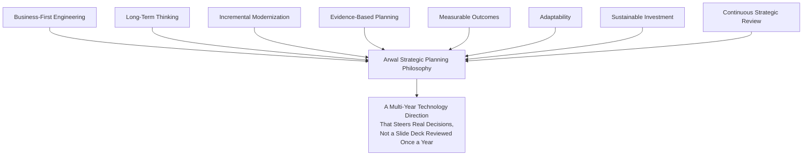
```mermaid
graph TD
    A[Business-First Engineering] --> I[Arwal Strategic Planning Philosophy]
    B[Long-Term Thinking] --> I
    C[Incremental Modernization] --> I
    D[Evidence-Based Planning] --> I
    E[Measurable Outcomes] --> I
    F[Adaptability] --> I
    G[Sustainable Investment] --> I
    H[Continuous Strategic Review] --> I
    I --> J[A Multi-Year Technology Direction<br/>That Steers Real Decisions,<br/>Not a Slide Deck Reviewed Once a Year]
```

> **Callout — The One-Sentence Strategic Planning Philosophy**
> *"A strategy that cannot say, with evidence, what changed since last quarter and why the plan still holds, is not a strategy — it is a forecast nobody is checking."*

---

# Engineering Strategic Planning Framework

Strategy at Arwal flows through ten sequential, always-connected layers — never skipped, never reordered, and never collapsed into fewer stages for convenience.

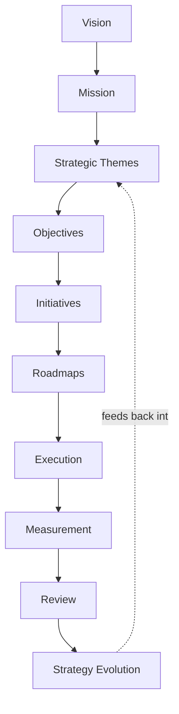
```mermaid
graph TD
    A[Vision] --> B[Mission]
    B --> C[Strategic Themes]
    C --> D[Objectives]
    D --> E[Initiatives]
    E --> F[Roadmaps]
    F --> G[Execution]
    G --> H[Measurement]
    H --> I[Review]
    I --> J[Strategy Evolution]
    J -.feeds back into.-> C
```

| Layer | Definition | Horizon | Owning Section Below |
|---|---|---|---|
| **Vision** | The durable, multi-year technology aspiration for Arwal, per `ai-docs/00-project-vision.md`'s 10-Year Vision Arc. | 5–10 years | Engineering Vision |
| **Mission** | How engineering specifically serves that vision — restated, never redefined, from `ai-docs/00-project-vision.md`. | Standing | Engineering Vision |
| **Strategic Themes** | The handful of durable focus areas the organization commits capacity to. | 3–5 years, refreshed annually | Strategic Themes |
| **Objectives** | Concrete, measurable statements of what "progress" on a theme means this year. | 1 year | Engineering OKRs |
| **Initiatives** | The specific, funded bodies of work that move an objective forward. | 1–4 quarters | Strategic Investment Governance |
| **Roadmaps** | The scheduled, sequenced view of initiatives across teams and time. | Rolling — 1yr / 3yr / 5yr | Engineering Roadmap Governance |
| **Execution** | Delivery of a roadmapped initiative — governed entirely by `ai-docs/38-engineering-portfolio-program-management-standards.md`, never redefined here. | Per initiative | (Cross-reference only) |
| **Measurement** | Tracking whether execution is producing the outcomes the strategy predicted. | Continuous | Strategic Metrics |
| **Review** | Deliberate, scheduled comparison of plan against reality. | Quarterly / Annual | Governance Review |
| **Strategy Evolution** | The disciplined act of updating Themes, Objectives, or the Vision itself based on Review findings. | Ongoing, triggered | Strategic Pivot Governance |

---

# Engineering Vision

Arwal's Engineering Vision is a set of durable, multi-year aspirations across six dimensions, each with a named executive owner accountable for its continued relevance.

| Vision Dimension | Aspiration | Owner | Refreshed |
|---|---|---|---|
| **Technology Vision** | Arwal's core stack (`ai-docs/09-tech-stack.md`) evolves deliberately, staying on proven, well-supported technology while incrementally adopting event-driven and selectively-extracted service patterns per `ai-docs/03-system-architecture-principles.md`'s Migration Strategy. | CTO | Annually |
| **Platform Vision** | Every domain module (Commerce, Local Services, Civic, Healthcare, Payments) is served by a mature, self-service internal platform, per `ai-docs/47-engineering-organizational-scaling-standards.md`'s Platform Engineering Governance. | VP Engineering | Annually |
| **AI Vision** | AI capability is delivered exclusively through the provider-agnostic AI Gateway Service (`ai-docs/09-tech-stack.md`), maturing from discovery-ranking to a fully human-overseen civic assistant, per `ai-docs/00-project-vision.md`'s AI Vision and AI Principle. | Head of AI Platform | Annually |
| **Data Vision** | Arwal's data foundations remain AI-ready and partition-ready (district → ward → zone) from Phase 1, per `ai-docs/01-product-goals.md`'s Technical Goals. | Principal Architect (Data) | Annually |
| **Developer Experience Vision** | Every engineer, regardless of team, reaches production confidently through documented golden paths, per `ai-docs/47-engineering-organizational-scaling-standards.md`'s Platform Engineering Governance. | Platform Engineering Director | Annually |
| **Infrastructure Vision** | Infrastructure scales horizontally and cost-efficiently toward 1,000,000+ users without a fundamental redesign, per `ai-docs/00-project-vision.md`'s Scalability Vision. | Infrastructure/Cloud Director | Annually |

### Vision Governance

Each Vision Dimension's owner is accountable for confirming, at the Annual Technology Vision Review (see Governance Review), that the dimension's stated aspiration still fits Arwal's actual trajectory — a Vision Dimension is amended only through the same rigor a Strategic-classification ADR already requires per `ai-docs/25-architecture-decision-records.md`, never informally rewritten mid-year.

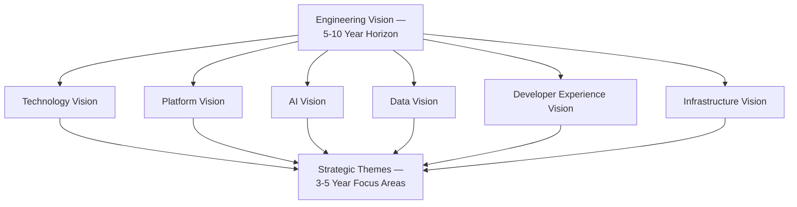
```mermaid
graph TD
    Vision[Engineering Vision —<br/>5-10 Year Horizon] --> Tech[Technology Vision]
    Vision --> Plat[Platform Vision]
    Vision --> AI[AI Vision]
    Vision --> Data[Data Vision]
    Vision --> DX[Developer Experience Vision]
    Vision --> Infra[Infrastructure Vision]
    Tech & Plat & AI & Data & DX & Infra --> Themes[Strategic Themes —<br/>3-5 Year Focus Areas]
```

---

# Strategic Themes

A Strategic Theme is a durable, multi-year focus area — never more than eight active themes at once, per the identical Proportional Rigor and Simplicity disciplines already established throughout this handbook, since a theme list long enough to include everything is a theme list that prioritizes nothing.

| Theme | Description | Executive Owner | Success Criteria (Measurable) |
|---|---|---|---|
| **Platform Modernization** | Deliberate, evidence-based evolution from Modular Monolith toward Event-Driven and selectively-extracted services. | CTO | ≥2 modules extracted per `ai-docs/03`'s Migration Strategy indicators within 3 years, with zero unplanned rollback. |
| **Citizen Experience** | Sub-2-second perceived load, offline-first reliability, and accessibility parity across every module, per `ai-docs/00-project-vision.md`. | VP Engineering + Head of Product | p95 load time and offline-sync success rate meet `ai-docs/01-product-goals.md`'s targets for 95%+ of citizen sessions. |
| **AI Adoption** | Mature, human-overseen AI capability across discovery, fraud detection, and the civic assistant. | Head of AI Platform | 100% of AI-influenced citizen decisions carry a functioning human-override path, per `ai-docs/00-project-vision.md`'s AI Principle. |
| **Security & Privacy** | Zero-trust posture and data-minimization consent flows fully operational across identity, payments, and health domains. | CISO / Security Team | Zero Critical, unremediated security debt items past SLE, per `ai-docs/32-technical-debt-management-standards.md`. |
| **Reliability** | Enterprise-grade uptime and MTTR at district and, eventually, multi-district scale. | SRE Director | 99.9%+ uptime for core citizen flows, sustained for 4 consecutive quarters. |
| **Scalability** | Horizontal, partition-ready architecture proven at 1,000,000+ user scale. | Principal Architect | Load-tested confirmation of 1M-user capacity per `ai-docs/00-project-vision.md`'s Scalability Vision, ahead of actual demand. |
| **Engineering Productivity** | Delivery predictability and cycle time improve year over year without sacrificing quality. | VP Engineering | Delivery Predictability (`ai-docs/38`) ≥85%, sustained for 2 consecutive quarters. |
| **Data-Driven Governance** | Every governance chapter in this handbook operates on live, trustworthy metrics rather than point-in-time reports. | Engineering Governance Lead | 100% of this handbook's Metrics sections sourced from automated dashboards, not manual reporting. |

### Theme Lifecycle

A theme is retired only when its Success Criteria are durably met (folded into standing operational excellence, per `ai-docs/39-engineering-operational-excellence-continuous-improvement-standards.md`) or superseded by a strategic pivot (below) — never silently dropped from the roadmap without an explicit retirement decision recorded at the Annual Engineering Strategy Refresh.

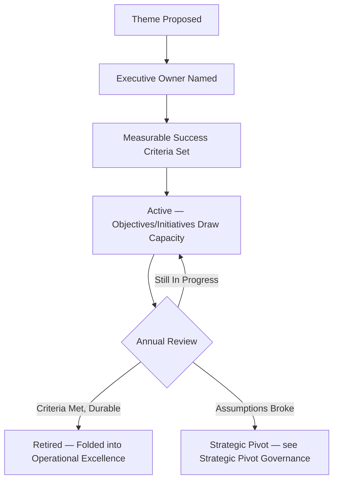
```mermaid
graph TD
    A[Theme Proposed] --> B[Executive Owner Named]
    B --> C[Measurable Success Criteria Set]
    C --> D[Active — Objectives/Initiatives Draw Capacity]
    D --> E{Annual Review}
    E -->|Criteria Met, Durable| F[Retired — Folded into Operational Excellence]
    E -->|Still In Progress| D
    E -->|Assumptions Broke| G[Strategic Pivot — see Strategic Pivot Governance]
```

---

# Engineering Roadmap Governance

### Rolling Strategic Planning Cycle

Per the governance improvement this document incorporates, Arwal plans on three nested, simultaneously-maintained horizons — never a single plan pretending to serve all three purposes at once.

| Roadmap Level | Horizon | Precision | Refresh Cadence | Owner |
|---|---|---|---|---|
| **1-Year Operational Plan** | 12 months | Committed — specific Initiatives, funded and staffed. | Annually, adjusted quarterly per `ai-docs/38`'s Quarterly Portfolio Rebalancing. | VP Engineering, Engineering Directors |
| **3-Year Technology Roadmap** | 36 months | Directional — Strategic Themes and major Programs, not committed dates. | Annually. | CTO, Principal Architects |
| **5-Year Engineering Vision** | 60 months | Aspirational — Vision Dimensions and the shape of the organization/platform, per `ai-docs/00-project-vision.md`'s 10-Year Arc's first half. | Every 2 years, or upon a Strategic Pivot. | CTO, CEO, Board |

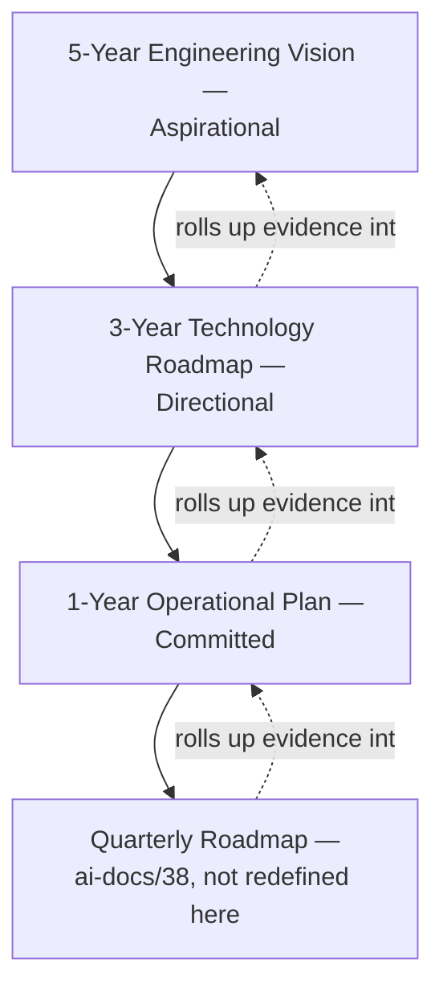
```mermaid
graph TD
    A[5-Year Engineering Vision —<br/>Aspirational] --> B[3-Year Technology Roadmap —<br/>Directional]
    B --> C[1-Year Operational Plan —<br/>Committed]
    C --> D[Quarterly Roadmap —<br/>ai-docs/38, not redefined here]
    D -.rolls up evidence into.-> C
    C -.rolls up evidence into.-> B
    B -.rolls up evidence into.-> A
```

### Scenario Planning

Per the governance improvement this document incorporates, every 3-Year Technology Roadmap is planned against three explicit scenarios, never a single assumed future.

| Scenario | Assumption | Planning Response |
|---|---|---|
| **Optimistic** | Government partnerships accelerate, funding is secure, hiring targets are met ahead of schedule. | Identify which Strategic Themes could be pulled forward with additional, already-approved contingency capacity. |
| **Expected** | Growth and funding proceed per the current Capacity Forecast (`ai-docs/36-engineering-capacity-planning-resource-management-standards.md`) and Financial Forecast (`ai-docs/42-engineering-financial-governance-standards.md`). | The baseline roadmap — what is actually committed and staffed. |
| **Adverse** | A funding shortfall, a key government-partnership delay, or a sustained hiring shortfall materializes. | A pre-identified, ranked list of which Initiatives are deferred first, per the Prioritization Matrix already established in `ai-docs/38-engineering-portfolio-program-management-standards.md`. |

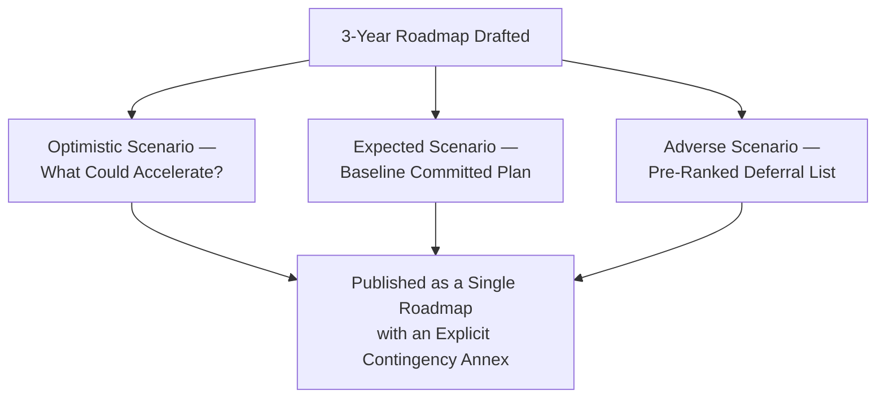
```mermaid
graph TD
    A[3-Year Roadmap Drafted] --> B[Optimistic Scenario —<br/>What Could Accelerate?]
    A --> C[Expected Scenario —<br/>Baseline Committed Plan]
    A --> D[Adverse Scenario —<br/>Pre-Ranked Deferral List]
    B & C & D --> E[Published as a Single Roadmap<br/>with an Explicit Contingency Annex]
```

### Multi-Year Roadmap Example

| Theme | Year 1 Milestone | Year 2 Milestone | Year 3 Milestone |
|---|---|---|---|
| Platform Modernization | Payments module boundary hardened, extraction readiness ADR filed | Payments extracted as an independent service | Local Services extraction evaluated against Migration Strategy indicators |
| AI Adoption | AI Gateway Service in production for discovery ranking | Fraud/trust anomaly detection live, human-override path audited | Civic assistant pilot in one government department |
| Scalability | District → ward partition key rolled out (Commerce, Civic) | Read replicas introduced, evidence-based | Load-tested confirmation at 500K concurrent users |

### Dependencies and Prioritization

Every roadmap milestone above the 1-Year Operational Plan states its dependency on a Strategic Dependency Mapping entry (below) — a milestone with an unresolved Critical dependency is never presented as committed, only as directional, per Roadmap Levels above.

### Executive Approval

| Roadmap Level | Approval Authority |
|---|---|
| 1-Year Operational Plan | VP Engineering, ratified by CTO |
| 3-Year Technology Roadmap | CTO, ratified by CEO/Board per `ai-docs/29-engineering-governance-decision-authority.md`'s Executive classification |
| 5-Year Engineering Vision | CEO/Board, CTO as accountable sponsor |

---

# Engineering OKRs

### Objective Creation

Every Objective is derived directly from a Strategic Theme's current-year target, never invented independently of one — an Objective with no traceable parent Theme is not eligible for capacity allocation, per `ai-docs/38-engineering-portfolio-program-management-standards.md`'s Strategic Alignment principle.

### Key Result Definition

Every Key Result is specific, numeric, and independently verifiable — restating the identical Measurable requirement already established in `ai-docs/25-architecture-decision-records.md`'s Decision Quality Standards, applied here to strategic goal-setting.

### OKR Template

## Objective: <Ambitious, qualitative statement of intent>
**Strategic Theme:** <Parent Theme>
**Owner:** <Named individual — Director level or above>
**Quarter/Year:** <Period>

### Key Results
1. <Specific, numeric, verifiable outcome> — Baseline: X, Target: Y
2. <Specific, numeric, verifiable outcome> — Baseline: X, Target: Y
3. <Specific, numeric, verifiable outcome> — Baseline: X, Target: Y

### Confidence Score (0.0-1.0, updated at each check-in)
### Supporting Initiatives (per Strategic Investment Governance)

### Example OKR

## Objective: Make Arwal's core citizen flows reliably fast on real district networks
**Strategic Theme:** Citizen Experience
**Owner:** VP Engineering
**Quarter/Year:** Q3 2026

### Key Results
1. p95 load time for booking flow on simulated 3G ≤ 2.0s — Baseline: 3.4s, Target: 2.0s
2. Offline-sync success rate ≥ 98% — Baseline: 91%, Target: 98%
3. Zero P1 performance regressions shipped to production — Baseline: 2/quarter, Target: 0

### Confidence Score: 0.7 (mid-quarter check-in)
### Supporting Initiatives: INIT-0014 (Network Throttled E2E Suite), INIT-0019 (Offline Queue Rework)

### Ownership and Review Cadence

| Level | Owner | Check-In Cadence |
|---|---|---|
| Objective | Director-level or above, named individually per the identical Named Ownership principle already established throughout `ai-docs/29`–`ai-docs/39` | Monthly |
| Key Result | The Objective owner, or a delegated Initiative owner | Bi-weekly |

### Progress Tracking

OKR progress is tracked via the Confidence Score above, never a binary done/not-done status — a Key Result trending below 0.4 confidence at its mid-point check-in is automatically flagged for the Quarterly Strategy Review, per Governance Review below.

### Strategic Alignment Check

Every OKR is checked, at creation, against the Strategic Dependency Mapping (below) and the current Capacity Forecast (`ai-docs/36-engineering-capacity-planning-resource-management-standards.md`) — an OKR set without confirmed capacity behind it is treated identically to the Unrealistic Commitments anti-pattern already rejected in `ai-docs/36`.

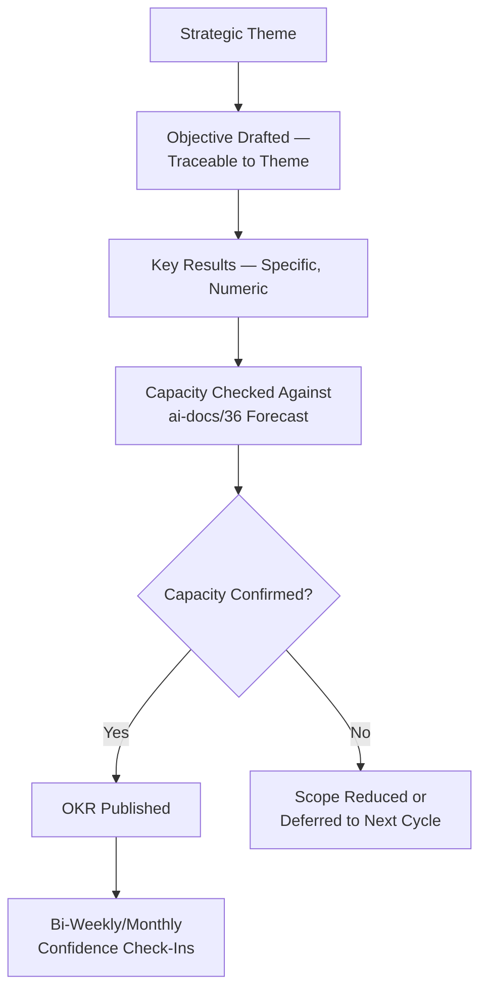
```mermaid
graph TD
    A[Strategic Theme] --> B[Objective Drafted —<br/>Traceable to Theme]
    B --> C[Key Results — Specific, Numeric]
    C --> D[Capacity Checked Against<br/>ai-docs/36 Forecast]
    D --> E{Capacity Confirmed?}
    E -->|Yes| F[OKR Published]
    E -->|No| G[Scope Reduced or<br/>Deferred to Next Cycle]
    F --> H[Bi-Weekly/Monthly<br/>Confidence Check-Ins]
```

---

# Strategic Investment Governance

### Investment Categories

| Category | Definition | Typical Horizon |
|---|---|---|
| **Technology Investments** | Adoption or upgrade of a core technology per `ai-docs/09-tech-stack.md`'s Technology Adoption Process. | 1–2 years |
| **Innovation Investments** | Exploratory work per `ai-docs/38`'s Innovation & Exploration allocation band. | Quarters |
| **Platform Investments** | Internal-product capability per `ai-docs/47`'s Platform Engineering Governance. | 1–3 years |
| **Infrastructure Investments** | Provisioned capacity, topology, or resilience improvements. | 1–2 years |
| **AI Investments** | AI Gateway Service capability, model provider evaluation, prompt infrastructure. | 1–2 years, high variance |
| **Modernization Funding** | Legacy remediation, service extraction, framework upgrades. | 1–3 years |

### Every Strategic Initiative's Required Fields

Per the governance improvement this document incorporates, no Strategic Initiative is approved without every field below stated explicitly — an initiative missing any field is returned for revision, never approved provisionally.

| Field | Description |
|---|---|
| **Expected Business Outcome** | The specific citizen-facing, commercial, or civic value this initiative unlocks. |
| **Expected Technical Outcome** | The specific technical capability or state this initiative produces. |
| **Risks** | Identified risks, cross-referenced into `ai-docs/30-engineering-risk-management-standards.md`'s Risk Register where they meet its threshold. |
| **Dependencies** | Cross-referenced into Strategic Dependency Mapping below. |
| **Budget** | Estimated cost across the categories in `ai-docs/42-engineering-financial-governance-standards.md`'s Engineering Financial Framework. |
| **KPIs** | The specific Strategic Metrics (below) this initiative is expected to move. |
| **Review Milestones** | Dated checkpoints at which progress is confirmed against the initiative's stated outcomes. |

### ROI Validation

Every Strategic Investment is scored, at approval and again at its stated Review Milestone, against the identical four-dimension ROI model already established in `ai-docs/42-engineering-financial-governance-standards.md`'s ROI Evaluation (Cost, Engineering Productivity, Operational Efficiency, Risk Reduction, Citizen Value) — this document never redefines that scoring model, only requires it be applied to every strategic-tier investment.

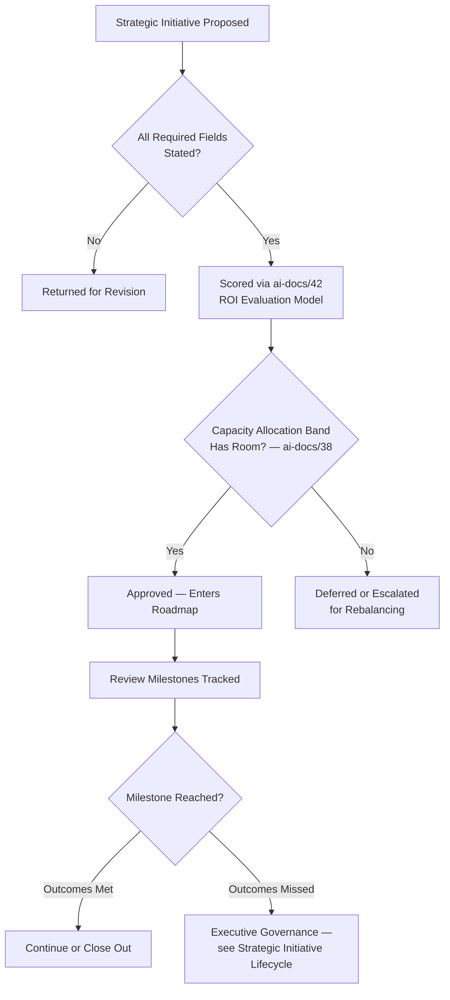
```mermaid
flowchart TD
    A[Strategic Initiative Proposed] --> B{All Required Fields<br/>Stated?}
    B -->|No| C[Returned for Revision]
    B -->|Yes| D[Scored via ai-docs/42<br/>ROI Evaluation Model]
    D --> E{Capacity Allocation Band<br/>Has Room? — ai-docs/38}
    E -->|Yes| F[Approved — Enters Roadmap]
    E -->|No| G[Deferred or Escalated<br/>for Rebalancing]
    F --> H[Review Milestones Tracked]
    H --> I{Milestone Reached?}
    I -->|Outcomes Met| J[Continue or Close Out]
    I -->|Outcomes Missed| K[Executive Governance —<br/>see Strategic Initiative Lifecycle]
```

---

# Technology Modernization Strategy

### Legacy Modernization

A component is a modernization candidate when it fails the Technology Review Checklist already established in `ai-docs/09-tech-stack.md`, or when its category is marked Deprecated per that document's Deprecation Policy — this document never redefines that checklist, it schedules the resulting work into the Strategic Roadmap.

### Platform Evolution

Platform evolution follows the Migration Strategy's indicator-based discipline already fully established in `ai-docs/03-system-architecture-principles.md` — a module's extraction readiness is a standing input into the Platform Modernization theme's Year-by-Year milestones (above), never decided independently of that document's own evidence requirements.

### Framework Upgrades

A MAJOR version upgrade of any Approved Technology (`ai-docs/09-tech-stack.md`'s Approved Technologies Table) that is expected to consume more than one sprint's dedicated capacity is planned as a Strategic Initiative, carrying the full Required Fields above — a framework upgrade absorbed silently into routine sprint work without this visibility is treated as Hidden Work, per the identical anti-pattern already rejected in `ai-docs/36-engineering-capacity-planning-resource-management-standards.md`.

### Cloud Adoption

Infrastructure topology changes with multi-year cost or resilience implications (a multi-region strategy, a managed-service migration) are evaluated jointly against the Infrastructure Vision above and `ai-docs/42-engineering-financial-governance-standards.md`'s ROI Evaluation before entering the 3-Year Technology Roadmap.

### Technical Debt Reduction

The Technical Debt Budget's Long-Term Investment allocation, already established in `ai-docs/32-technical-debt-management-standards.md`, is the execution mechanism for any debt-reduction Strategic Initiative — this document schedules and prioritizes at the strategic level; `ai-docs/32` governs the debt item's own lifecycle and never has its mechanics restated here.

### Technology Replacement

Replacing an already-Approved Technology follows `ai-docs/09-tech-stack.md`'s Technology Adoption Process for the technical evaluation, and this document's Strategic Initiative Required Fields for the business case — a replacement decision is never made on technical merit alone without a stated business outcome.

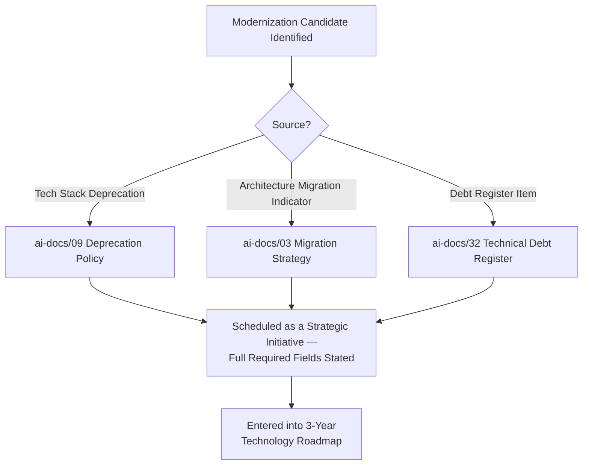
```mermaid
graph TD
    A[Modernization Candidate Identified] --> B{Source?}
    B -->|Tech Stack Deprecation| C[ai-docs/09 Deprecation Policy]
    B -->|Architecture Migration Indicator| D[ai-docs/03 Migration Strategy]
    B -->|Debt Register Item| E[ai-docs/32 Technical Debt Register]
    C & D & E --> F[Scheduled as a Strategic Initiative —<br/>Full Required Fields Stated]
    F --> G[Entered into 3-Year<br/>Technology Roadmap]
```

---

# Capability Planning

### Engineering Capabilities

Capability gaps (a skill Arwal does not yet have in sufficient depth — AI safety engineering, government-compliance integration) are identified via the Skill Matrix already established in `ai-docs/36-engineering-capacity-planning-resource-management-standards.md`, and closed via that document's Engineering Growth Strategy — this document's role is confirming a capability gap traces to a genuine Strategic Theme before it justifies a hiring or upskilling investment.

### Platform Capabilities

Platform capability maturity (does the AI Gateway Service, the Design System, the Auth service meet the needs of every consuming team) is assessed via the Platform Engineering Governance internal-customer feedback already established in `ai-docs/47-engineering-organizational-scaling-standards.md` — a persistent low-satisfaction finding there is a direct input into this document's Platform Modernization theme.

### Organizational Capabilities

Organizational readiness for a strategic bet (can Arwal actually staff and lead a fifth product domain) is assessed via the Organizational Growth Model already established in `ai-docs/47-engineering-organizational-scaling-standards.md` — this document never redefines that model's stage-transition criteria, it consumes them as a gating input before committing a Strategic Theme requiring organizational scale beyond the current stage.

### Skills Development

Skills investment tied to a Strategic Theme is planned through the Upskilling allocation already established in `ai-docs/36-engineering-capacity-planning-resource-management-standards.md`'s Skill Matrix — this document names *which* skills matter strategically; that document governs *how* capacity for developing them is protected.

### Tooling Evolution

A tooling gap identified as strategically significant (not merely a team-local friction point, per `ai-docs/39-engineering-operational-excellence-continuous-improvement-standards.md`'s Process Optimization) is elevated into a Platform Investment, per Strategic Investment Governance above.

### AI Capability Maturity

AI capability is assessed annually against a five-level maturity scale, feeding directly into the AI Vision (above) and the Annual Technology Radar (below).

| Level | Characteristics |
|---|---|
| **1 — Exploratory** | AI used in isolated pilots, no shared Gateway abstraction. |
| **2 — Integrated** | AI Gateway Service in production for at least one domain, provider-agnostic contract enforced. |
| **3 — Operationalized** | Multiple domains consume the AI Gateway; prompt versioning and evaluation are routine. |
| **4 — Governed** | Every AI-influenced citizen decision carries a verified, audited human-override path. |
| **5 — Adaptive** | AI capability informs strategic planning itself (trend detection, forecasting) under full human oversight, per AI-Assisted Strategic Planning below. |

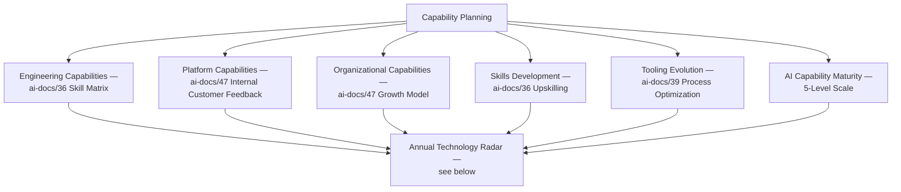
```mermaid
graph TD
    A[Capability Planning] --> B[Engineering Capabilities —<br/>ai-docs/36 Skill Matrix]
    A --> C[Platform Capabilities —<br/>ai-docs/47 Internal Customer Feedback]
    A --> D[Organizational Capabilities —<br/>ai-docs/47 Growth Model]
    A --> E[Skills Development —<br/>ai-docs/36 Upskilling]
    A --> F[Tooling Evolution —<br/>ai-docs/39 Process Optimization]
    A --> G[AI Capability Maturity —<br/>5-Level Scale]
    B & C & D & E & F & G --> H[Annual Technology Radar —<br/>see below]
```

### Annual Technology Radar

Per the governance improvement this document incorporates, Arwal produces an **Annual Technology Radar** — a structured inventory of technologies and capabilities across four rings (Adopt, Trial, Assess, Hold), feeding directly into both Capability Planning and the 3-Year Technology Roadmap.

| Ring | Meaning | Example (Illustrative) |
|---|---|---|
| **Adopt** | Already an Approved Technology (`ai-docs/09-tech-stack.md`), proven in production. | NestJS, PostgreSQL, Prisma |
| **Trial** | Approved for a scoped pilot per `ai-docs/09`'s Experimental status. | A dedicated message broker (Kafka/RabbitMQ), evaluated ahead of BullMQ's evidence-based upgrade trigger |
| **Assess** | Worth evaluating, not yet piloted. | A newer state-partitioning technique for the district → ward → zone strategy |
| **Hold** | Explicitly not pursued at this time, with stated reasoning. | GraphQL as a default API paradigm — remains Experimental per `ai-docs/09` |

The Technology Radar is produced by Principal Architects, reviewed by the Architecture Review Board (`ai-docs/46-engineering-architecture-governance-standards.md`), and published at the Annual Technology Vision Review below — it is an input to strategic planning, never itself a technology-approval mechanism, which remains exclusively `ai-docs/09-tech-stack.md`'s Technology Adoption Process.

---

# Strategic Risk Management

Strategic-tier risks are cross-referenced into the standing Risk Register already fully governed by `ai-docs/30-engineering-risk-management-standards.md` — this document never redefines Risk Classification, scoring, or the Risk Register's mechanics. Its role is naming the specific risk categories that matter at the strategic-planning horizon and ensuring they are actually surfaced there.

| Strategic Risk Category | Description | Feeds Into (ai-docs/30 Category) |
|---|---|---|
| **Technology Risk** | A multi-year technology bet fails to mature as expected, or the market moves away from it. | Strategic Risk |
| **Market Changes** | Citizen or merchant behavior shifts in a way that changes which Strategic Theme matters most. | Strategic Risk |
| **Regulatory Changes** | A new data-protection, health-data, or financial-services regulation invalidates a planning assumption. | Compliance Risk |
| **Vendor Dependencies** | A strategic bet depends on a vendor whose roadmap, pricing, or continuity is uncertain, per `ai-docs/09-tech-stack.md`'s Vendor Lock-In Considerations. | Vendor Risk |
| **Talent Risks** | A Strategic Theme requires a capability Arwal cannot hire or retain fast enough, per `ai-docs/47-engineering-organizational-scaling-standards.md`'s hiring governance. | Human Process Risk, Knowledge Risk |
| **Emerging Technology Disruption** | A new technology (an AI capability shift, a new integration standard) materially changes the best path to a Strategic Theme's goal mid-cycle. | Strategic Risk |

### Strategic Risk Review

Every Strategic Theme's executive owner reviews the risks specific to their theme at each Quarterly Strategy Review (below), confirming classification and mitigation status per `ai-docs/30-engineering-risk-management-standards.md`'s own cadence — this document adds no new risk-scoring mechanic, it ensures strategic risk gets a standing seat at strategic review.

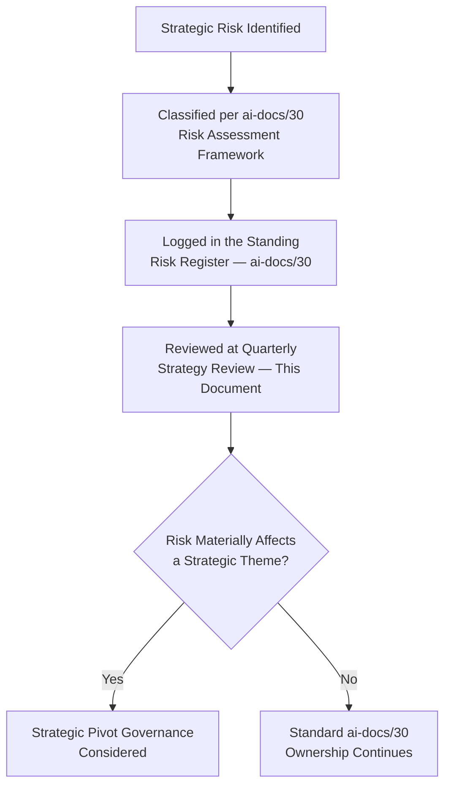
```mermaid
graph TD
    A[Strategic Risk Identified] --> B[Classified per ai-docs/30<br/>Risk Assessment Framework]
    B --> C[Logged in the Standing<br/>Risk Register — ai-docs/30]
    C --> D[Reviewed at Quarterly<br/>Strategy Review — This Document]
    D --> E{Risk Materially Affects<br/>a Strategic Theme?}
    E -->|Yes| F[Strategic Pivot Governance<br/>Considered]
    E -->|No| G[Standard ai-docs/30<br/>Ownership Continues]
```

---

# Strategic Metrics

Per the Actionable Metrics principle already established in `ai-docs/18-observability-standards.md` and every governance chapter since, every metric below ties to a real question the Board, CEO, or CTO will actually ask.

| Metric | Definition | What a Regression Signals |
|---|---|---|
| **OKR achievement rate** | Percentage of Key Results reaching their target value by quarter close. | A declining rate signals OKRs are being set without genuine capacity or evidence behind them. |
| **Roadmap completion rate** | Percentage of 1-Year Operational Plan milestones delivered as scheduled. | Directly mirrors `ai-docs/38`'s Delivery Predictability, applied at the strategic-initiative level. |
| **Strategic initiative success rate** | Percentage of Strategic Initiatives meeting their stated Expected Business/Technical Outcomes at their Review Milestone. | A declining rate is this document's most direct signal that strategy-setting itself needs review. |
| **Engineering productivity** | Cross-referenced from `ai-docs/39-engineering-operational-excellence-continuous-improvement-standards.md`'s Engineering Excellence Metrics. | A worsening trend despite active strategic investment signals investment is mis-targeted. |
| **Platform maturity** | Cross-referenced from `ai-docs/39`'s Engineering Maturity Scorecard, Technology dimension. | Stagnation signals the Platform Modernization theme is not translating into real capability growth. |
| **Modernization progress** | Percentage of identified legacy/modernization candidates (per Technology Modernization Strategy above) resolved per their planned Roadmap milestone. | A declining rate signals modernization capacity is being displaced by feature pressure. |
| **Innovation impact** | Percentage of Innovation & Exploration initiatives (`ai-docs/38`'s allocation band) that generalize into a Standardized improvement, per `ai-docs/39`'s Continuous Improvement Process. | A near-zero rate signals the Innovation allocation is not producing genuine learning. |
| **Business alignment** | Percentage of active Strategic Initiatives with a traceable link to a current `ai-docs/01-product-goals.md` goal. | Any initiative failing this trace is a candidate for the Strategy Drift anti-pattern below. |

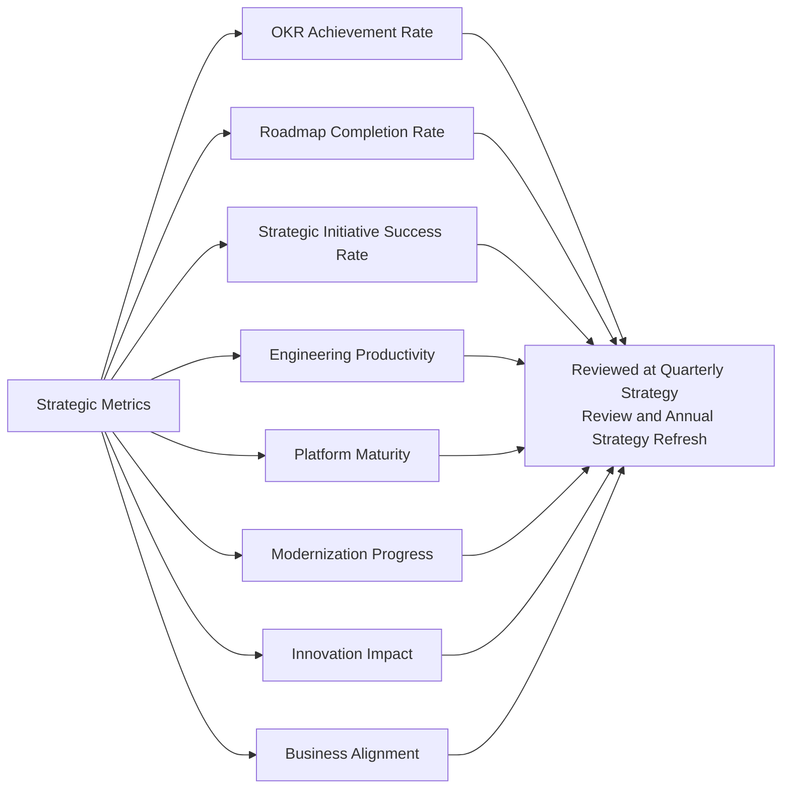
```mermaid
graph LR
    A[Strategic Metrics] --> B[OKR Achievement Rate]
    A --> C[Roadmap Completion Rate]
    A --> D[Strategic Initiative Success Rate]
    A --> E[Engineering Productivity]
    A --> F[Platform Maturity]
    A --> G[Modernization Progress]
    A --> H[Innovation Impact]
    A --> I[Business Alignment]
    B & C & D & E & F & G & H & I --> J[Reviewed at Quarterly Strategy<br/>Review and Annual Strategy Refresh]
```

---

# Executive Dashboards

| Dashboard | Audience | Core Content |
|---|---|---|
| **CEO Dashboard** | CEO, Board | 5-Year Vision trajectory, Citizen Trust Signal (`ai-docs/39`'s North Star Metrics), major Strategic Pivots, government-partnership-affecting risks. |
| **CTO Dashboard** | CTO | 3-Year Technology Roadmap status, Technology Radar, Strategic Theme health, Architecture Compliance (`ai-docs/46`) rolled up. |
| **VP Engineering Dashboard** | VP Engineering | 1-Year Operational Plan status, OKR achievement rate, Capacity vs. Strategic Investment allocation. |
| **Executive Leadership Dashboard** | Engineering Leadership Council | All active Strategic Initiatives' health, ROI re-scoring status, Strategic Risk summary. |
| **Portfolio Review Board Dashboard** | Portfolio Review Board (`ai-docs/38`) | Strategic Initiative → Program/Project traceability, dependency status feeding into `ai-docs/38`'s Dependency Heat Map. |
| **Engineering Directors Dashboard** | Engineering Directors | Theme-level capacity draw per department, Capability Planning gaps within their domain. |

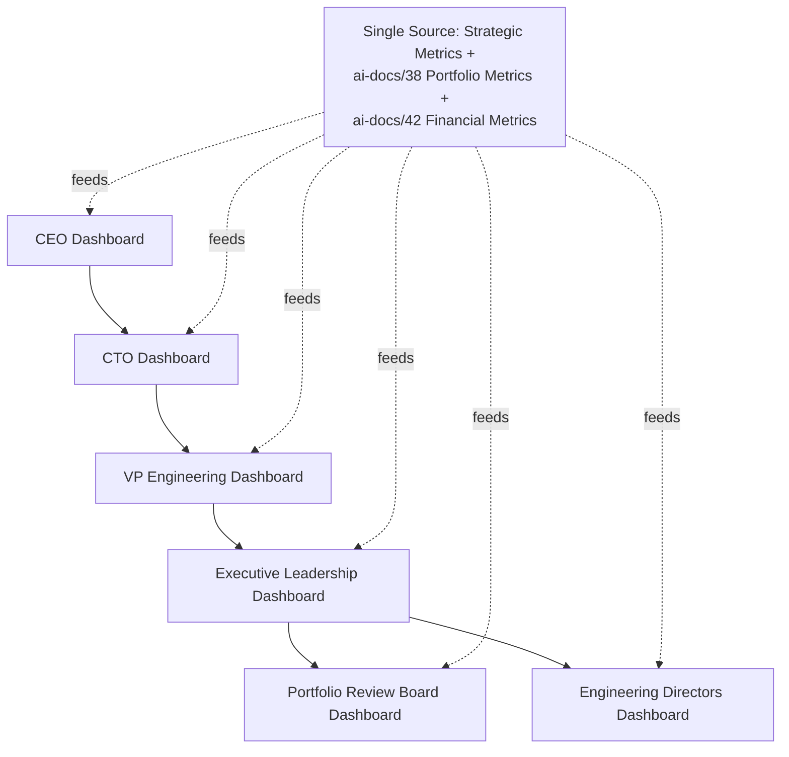
```mermaid
graph TD
    A[CEO Dashboard] --> B[CTO Dashboard]
    B --> C[VP Engineering Dashboard]
    C --> D[Executive Leadership Dashboard]
    D --> E[Portfolio Review Board Dashboard]
    D --> F[Engineering Directors Dashboard]
    G[Single Source: Strategic Metrics +<br/>ai-docs/38 Portfolio Metrics +<br/>ai-docs/42 Financial Metrics] -.feeds.-> A
    G -.feeds.-> B
    G -.feeds.-> C
    G -.feeds.-> D
    G -.feeds.-> E
    G -.feeds.-> F
```

---

# AI-Assisted Strategic Planning

Consistent with the identical AI-assistance principle already established across every governance document in this handbook: **AI accelerates analysis and simulation, never authority.**

### Trend Analysis

An AI tool may analyze multi-year Strategic Metrics, Technology Radar history, and industry benchmarking data (`ai-docs/39`'s Industry Benchmarking) to surface a pattern a purely manual annual review might miss — every such pattern is a lead for the CTO and Principal Architects to independently verify before it changes a Strategic Theme or the Technology Radar.

### Forecasting

An AI tool may draft a candidate multi-year capacity, cost, or delivery forecast, drawing on `ai-docs/36`'s Capacity Forecasting and `ai-docs/42`'s Financial Metrics — the draft is a starting point for the Rolling Strategic Planning Cycle, never committed to without human review, per Evidence-Based Planning above.

### Scenario Planning

An AI tool may generate candidate Optimistic/Expected/Adverse scenario variants (per Scenario Planning above) from historical variance data — every such variant is reviewed and adjusted by the CTO and VP Engineering before publication; an AI-generated scenario is never published as-is.

### Roadmap Generation

An AI tool may draft a candidate sequencing of Initiatives against a Strategic Theme's milestones — the draft is evaluated against Capacity Forecasting, Strategic Dependency Mapping, and executive judgment before it becomes part of a published Roadmap.

### Risk Prediction

An AI tool may flag an emerging Strategic Risk (a vendor's declining health signals, a regulatory trend) ahead of a scheduled review — every flag is independently verified before it is logged into `ai-docs/30-engineering-risk-management-standards.md`'s Risk Register.

### Strategy Simulation

An AI tool may simulate the projected effect of a candidate Strategic Pivot (below) against historical delivery and cost data — a simulation is treated as one input among several to executive deliberation, never as a determinative forecast.

### Human Approval

No Strategic Theme, OKR, Roadmap, Strategic Initiative approval/pause/retirement, or Strategic Pivot is ever finalized on the basis of an AI tool's analysis alone. The named human Approval Authority per this document's governance sections remains fully accountable, identical to the Human Oversight standard already established consistently across `ai-docs/24` through `ai-docs/47`.

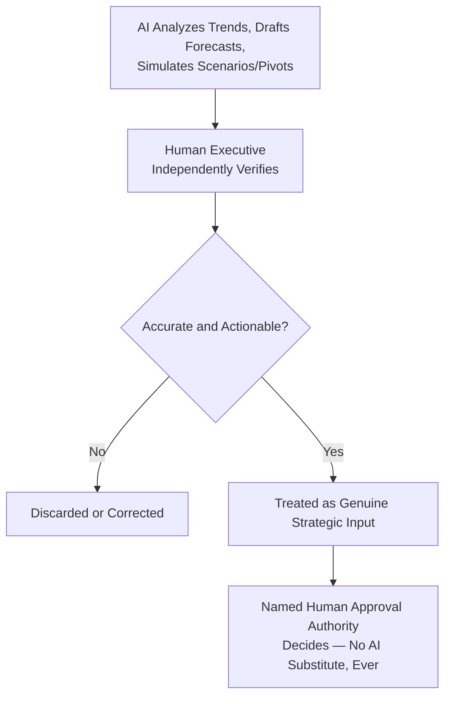
```mermaid
graph TD
    A[AI Analyzes Trends, Drafts Forecasts,<br/>Simulates Scenarios/Pivots] --> B[Human Executive<br/>Independently Verifies]
    B --> C{Accurate and Actionable?}
    C -->|No| D[Discarded or Corrected]
    C -->|Yes| E[Treated as Genuine Strategic Input]
    E --> F[Named Human Approval Authority<br/>Decides — No AI Substitute, Ever]
```

---

# Strategic Initiative Lifecycle and Executive Governance

Per the governance improvement this document incorporates, every Strategic Initiative is explicitly governed through approval, modification, pause, and retirement — never allowed to continue on inertia, mirroring the identical Portfolio Stop/Pause Criteria already established in `ai-docs/38-engineering-portfolio-program-management-standards.md`, applied here at the strategic tier.

| Decision | Trigger | Authority |
|---|---|---|
| **Approve** | All Required Fields (per Strategic Investment Governance) stated; ROI scored; capacity confirmed. | CTO, or CEO/Board for a Strategic Theme-defining initiative. |
| **Modify** | A Review Milestone reveals a scope, budget, or timeline adjustment is needed but the initiative's core value case still holds. | VP Engineering + the initiative's executive sponsor. |
| **Pause** | A Review Milestone is missed with no credible recovery plan, or a dependency (Strategic Dependency Mapping) is blocked beyond a defined window. | CTO, informing the Engineering Leadership Council. |
| **Retire** | The initiative's founding assumption has broken (Strategic Pivot Governance below), or it is superseded by a better-scoring alternative. | CTO, ratified by CEO/Board for a Theme-level retirement. |

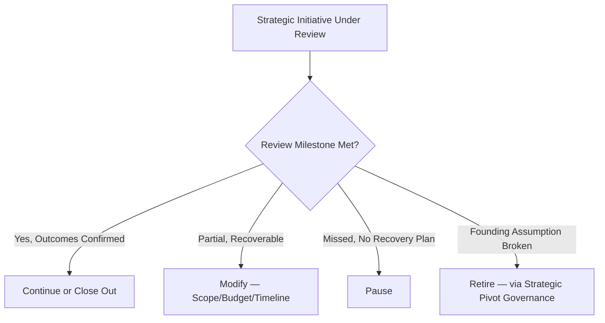
```mermaid
graph TD
    A[Strategic Initiative Under Review] --> B{Review Milestone Met?}
    B -->|Yes, Outcomes Confirmed| C[Continue or Close Out]
    B -->|Partial, Recoverable| D[Modify — Scope/Budget/Timeline]
    B -->|Missed, No Recovery Plan| E[Pause]
    B -->|Founding Assumption Broken| F[Retire — via Strategic Pivot Governance]
```

### Strategic Pivot Governance

Per the governance improvement this document incorporates, a **Strategic Pivot** — a material change to a Strategic Theme, the 3-Year Technology Roadmap, or the 5-Year Engineering Vision itself, triggered by a technology, regulatory, financial, or organizational shift — follows an explicit, never-informal path.

| Trigger | Example | Governance Path |
|---|---|---|
| **Technology shift** | A previously Assess-ring technology (Technology Radar) becomes suddenly necessary due to a competitive or capability gap. | CTO proposes, Architecture Review Board (`ai-docs/46`) reviews technical soundness, Engineering Leadership Council ratifies. |
| **Regulatory shift** | A new data-protection law invalidates a Data Vision assumption. | Security Team + Legal assess, CTO proposes the pivot, CEO/Board ratifies given compliance stakes. |
| **Financial shift** | A funding shortfall requires re-sequencing the 3-Year Roadmap's Adverse Scenario into the baseline. | CFO + CTO jointly propose, per `ai-docs/42-engineering-financial-governance-standards.md`'s Budget Approval Matrix. |
| **Organizational shift** | Arwal's Organizational Growth Model (`ai-docs/47`) stage-transition happens faster or slower than planned, changing what the organization can execute. | VP Engineering + CTO jointly propose, Engineering Leadership Council ratifies. |

A Strategic Pivot requires: a documented rationale (what assumption broke, and the evidence), an explicit statement of what is being changed (Theme, Roadmap milestone, or Vision Dimension), and a Post-Strategy Review comparing the abandoned plan's original assumptions against what was learned, per Post-Strategy Reviews below. A pivot is never executed informally through a quiet roadmap edit.

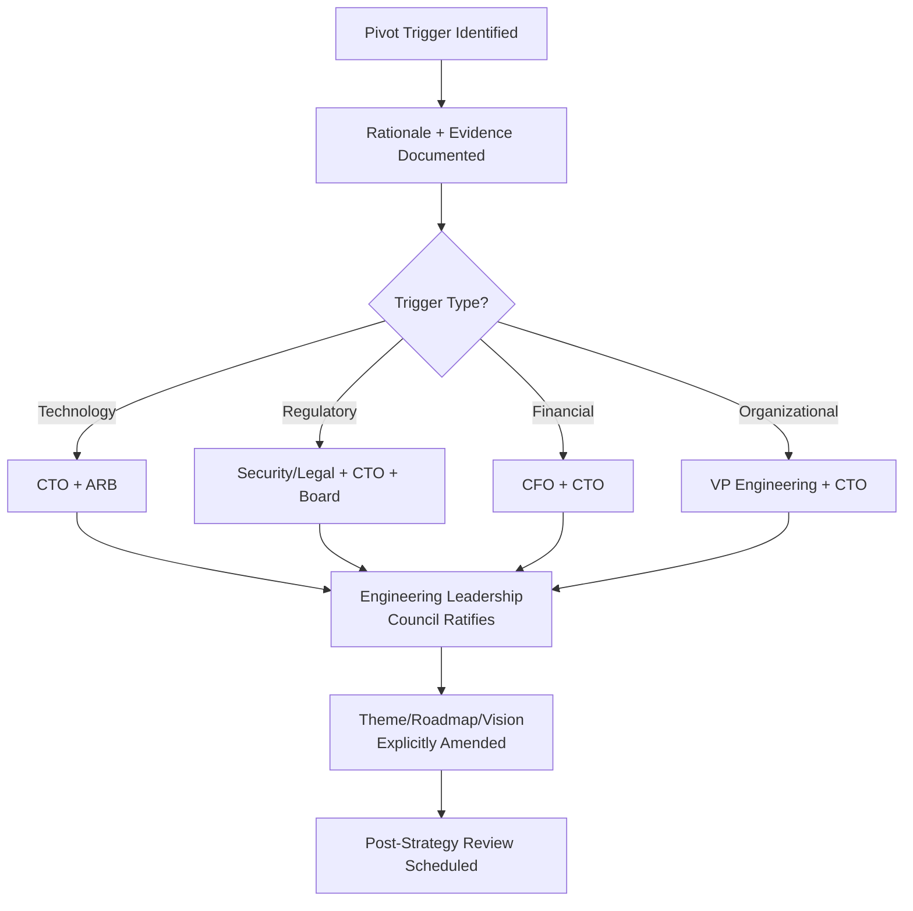
```mermaid
flowchart TD
    A[Pivot Trigger Identified] --> B[Rationale + Evidence Documented]
    B --> C{Trigger Type?}
    C -->|Technology| D[CTO + ARB]
    C -->|Regulatory| E[Security/Legal + CTO + Board]
    C -->|Financial| F[CFO + CTO]
    C -->|Organizational| G[VP Engineering + CTO]
    D & E & F & G --> H[Engineering Leadership<br/>Council Ratifies]
    H --> I[Theme/Roadmap/Vision<br/>Explicitly Amended]
    I --> J[Post-Strategy Review Scheduled]
```

### Post-Strategy Reviews

Per the governance improvement this document incorporates, every Strategic Theme and every Strategic Pivot receives a **Post-Strategy Review** comparing planned outcomes against actual outcomes, at the Theme's retirement or the Pivot's one-year mark, whichever comes first.

| Field | Description |
|---|---|
| **Planned Outcome** | What the Theme/Initiative's Success Criteria stated at approval. |
| **Actual Outcome** | What Strategic Metrics and OKR data actually show. |
| **Variance** | The gap, quantified, between planned and actual. |
| **Root Cause** | Why the variance occurred — a genuinely broken assumption, an execution gap, or a measurement error. |
| **Lessons Learned** | What changes in future strategic planning as a result, fed into the next Annual Engineering Strategy Refresh. |

Lessons Learned are never discarded after the review — they are logged into the Improvement Backlog already established in `ai-docs/39-engineering-operational-excellence-continuous-improvement-standards.md`, ensuring a strategic-level finding gets the same durable, shared-visibility treatment as any other organizational learning.

---

# Strategic Dependency Mapping

Per the governance improvement this document incorporates, every Strategic Initiative's cross-boundary dependencies are mapped explicitly across five dependency classes — never assumed self-evident from the roadmap alone.

| Dependency Class | Example | Tracked Via |
|---|---|---|
| **Engineering** | A Platform Modernization milestone depends on Payments Team completing a boundary-hardening initiative first. | `ai-docs/38`'s Portfolio Dependency Register |
| **Product** | An AI Adoption milestone depends on Product finalizing the civic-assistant's scope with a government partner. | Cross-Functional Ownership, `ai-docs/38` |
| **Vendor** | A Scalability milestone depends on a cloud provider's regional capacity roadmap. | `ai-docs/42`'s Vendor Management coordination |
| **Government Integration** | A Civic Services milestone depends on a department's own API readiness timeline. | `ai-docs/01-product-goals.md`'s Government Coordination Risk |
| **External Ecosystem** | An AI Vision milestone depends on a model provider's capability roadmap, per `ai-docs/09-tech-stack.md`'s Provider Independence. | Technology Radar, above |

A Critical-classified dependency in any of these five classes is surfaced on the Portfolio Dependency Heat Map already established in `ai-docs/38-engineering-portfolio-program-management-standards.md` — this document never duplicates that Heat Map, it ensures strategic-tier dependencies are represented on it with the same visibility as any Program-level dependency.

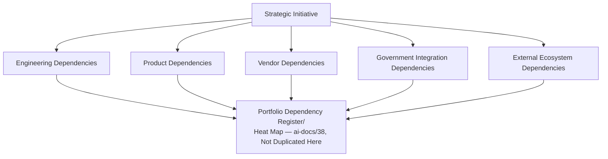
```mermaid
graph TD
    A[Strategic Initiative] --> B[Engineering Dependencies]
    A --> C[Product Dependencies]
    A --> D[Vendor Dependencies]
    A --> E[Government Integration Dependencies]
    A --> F[External Ecosystem Dependencies]
    B & C & D & E & F --> G[Portfolio Dependency Register/<br/>Heat Map — ai-docs/38, Not Duplicated Here]
```

---

# Balancing Strategic Capacity

Per the governance improvement this document incorporates, every 1-Year Operational Plan explicitly states how strategic capacity is balanced across six competing pulls — never left to ad hoc negotiation each quarter.

| Pull | Governed By (Not Redefined Here) | This Document's Role |
|---|---|---|
| Feature Delivery | `ai-docs/38`'s New Features allocation band (45–55%) | Confirms feature-delivery Themes (Citizen Experience) get a fair share without crowding out the rest. |
| Platform Investment | `ai-docs/38`'s Technical Debt & Platform Investment band (15–20%) | Confirms Platform Modernization theme milestones are actually funded from this band. |
| Innovation | `ai-docs/38`'s Innovation & Exploration band (5–10%) | Confirms AI Adoption exploratory work draws from here before graduating to a funded Strategic Initiative. |
| Technical Debt Reduction | `ai-docs/32-technical-debt-management-standards.md`'s Technical Debt Budget | Confirms debt reduction tied to a Strategic Theme is visible in the roadmap, not just the Debt Register. |
| Reliability Improvements | `ai-docs/36`'s Incident/Emergency Reserve, `ai-docs/38`'s Operational Work band (10–15%) | Confirms the Reliability theme's milestones are distinguishable from routine operational work. |
| Compliance Work | `ai-docs/38`'s Compliance & Regulatory band (5–10%+, expanding on demand) | Confirms Security & Privacy theme milestones tied to a genuine regulatory deadline bypass discretionary ranking, per `ai-docs/38`'s own rule. |

This document never re-litigates the allocation-band percentages themselves, owned entirely by `ai-docs/38-engineering-portfolio-program-management-standards.md` — its contribution is confirming, at the strategic level, that every Theme actually has a funded lane rather than competing informally against features for the same capacity.

---

# Engineering Anti-Patterns

| Anti-Pattern | Description | Why It's Rejected |
|---|---|---|
| **Strategy without execution** | A published 3-Year Roadmap with no corresponding funded Strategic Initiatives or OKRs. | Violates Measurable Outcomes above; a strategy that never becomes an Initiative is a document, not a plan. |
| **Technology-first planning** | A Strategic Theme chosen because a technology is exciting, with no traced Business-First justification. | Violates Business-First Engineering above. |
| **Short-term optimization** | Every planning cycle spent entirely on the 1-Year Operational Plan, with the 3-Year and 5-Year horizons left stale. | Violates Long-Term Thinking above and the Rolling Strategic Planning Cycle's nested-horizon design. |
| **Ignoring technical debt** | The Technical Debt Reduction pull in Balancing Strategic Capacity consistently displaced by feature-delivery pressure. | Directly violates the floor already established in `ai-docs/32-technical-debt-management-standards.md`. |
| **Roadmap overload** | More Strategic Themes or Initiatives active than Capacity Forecasting (`ai-docs/36`) can genuinely support. | Violates Sustainable Investment above; produces the identical 100% Utilization Planning failure already rejected in `ai-docs/36`. |
| **Reactive planning** | Strategic Themes changed every quarter chasing whatever pressure was loudest, with no Strategic Pivot Governance invoked. | Violates Adaptability's requirement that change be deliberate and evidenced, not reflexive. |
| **Undefined priorities** | Two or more Strategic Themes with no stated relative priority, leaving Portfolio-level rebalancing (`ai-docs/38`) without guidance. | Produces exactly the Constant Reprioritization anti-pattern already rejected in `ai-docs/38`. |
| **Strategy drift** | An active Strategic Initiative that no longer traces to any current Strategic Theme or `ai-docs/01-product-goals.md` goal. | Violates Business Alignment (Strategic Metrics) above; caught by the Business Alignment metric's own definition. |
| **Unmeasured initiatives** | A Strategic Initiative approved without KPIs or a stated Review Milestone. | Violates Measurable Outcomes above and the Required Fields discipline in Strategic Investment Governance. |

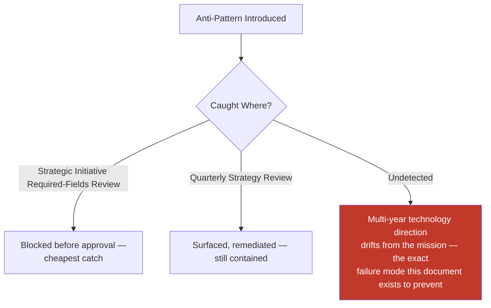
```mermaid
graph TD
    A[Anti-Pattern Introduced] --> B{Caught Where?}
    B -->|Strategic Initiative Required-Fields Review| C[Blocked before approval —<br/>cheapest catch]
    B -->|Quarterly Strategy Review| D[Surfaced, remediated — still contained]
    B -->|Undetected| E[Multi-year technology direction<br/>drifts from the mission — the exact<br/>failure mode this document exists to prevent]
    style E fill:#c0392b,color:#fff
```

---

# Engineering Review Checklist

Every Strategic Theme, Objective, Initiative, or Roadmap is checked against the following before it is considered strategy-compliant:

- [ ] **Traceable to a Vision Dimension and a current Strategic Theme** — Never invented independently of the Framework above.
- [ ] **Measurable Success Criteria stated** — Specific and numeric, per Strategic Themes and Engineering OKRs above.
- [ ] **Named executive owner assigned** — A specific individual, never a diffuse team or committee.
- [ ] **Scenario Planning applied where the initiative spans the 3-Year Technology Roadmap** — Optimistic/Expected/Adverse variants considered.
- [ ] **All Required Fields present for every Strategic Initiative** — Business Outcome, Technical Outcome, Risks, Dependencies, Budget, KPIs, Review Milestones.
- [ ] **ROI scored per `ai-docs/42`'s model** — At approval and at every Review Milestone.
- [ ] **Capacity confirmed against `ai-docs/36`'s Capacity Forecast** — Never approved against theoretical maximum capacity.
- [ ] **Strategic Dependency Mapping completed** — Engineering, Product, Vendor, Government Integration, and External Ecosystem dependencies stated.
- [ ] **Critical dependencies visible on the `ai-docs/38` Heat Map** — Never tracked only informally.
- [ ] **Risks cross-referenced into `ai-docs/30`'s Risk Register where they meet its threshold** — Never duplicated or redefined here.
- [ ] **Balancing Strategic Capacity respected** — The initiative draws from its correct `ai-docs/38` allocation band, never displacing another band silently.
- [ ] **Technology Radar consulted for any new technology bet** — Adopt/Trial/Assess/Hold ring stated.
- [ ] **AI-assisted analysis independently verified** — Any AI-surfaced trend, forecast, scenario, or simulation fact-checked by a human before being relied upon.
- [ ] **Strategic Pivot Governance followed for any material change** — Never an informal roadmap edit.
- [ ] **Post-Strategy Review scheduled** — At Theme retirement or Pivot's one-year mark, whichever comes first.
- [ ] **No anti-pattern present** — No strategy-without-execution, technology-first planning, short-term optimization, ignored debt, roadmap overload, reactive planning, undefined priorities, strategy drift, or unmeasured initiative.
- [ ] **No duplication of Product Goals, Portfolio Management, Financial Governance, Organizational Scaling, Architecture Governance, Operational Excellence, or Capacity Planning standards** — Any such concern deferred entirely to its owning phase document, never redefined here.

A Strategic Theme, Objective, Initiative, or Roadmap failing any item above is not considered approved until resolved — this checklist carries the same non-negotiable authority as every other review checklist established in the preceding forty-eight phase documents.

---

# Governance Review

| Review | Cadence | Owner | Purpose |
|---|---|---|---|
| **Quarterly Strategy Review** | Quarterly | CTO, VP Engineering, Engineering Leadership Council | OKR confidence check-ins, Strategic Metrics trend, Strategic Risk review, initiative Modify/Pause candidates. |
| **Annual Engineering Strategy Refresh** | Annual | CTO, VP Engineering, CEO/Board | Full Strategic Themes reassessment, 1-Year Operational Plan reset, 3-Year Roadmap rolled forward. |
| **Roadmap Review** | Quarterly (aligned to `ai-docs/38`'s cadence) | Engineering Directors, TPMs | Milestone status, dependency resolution, scenario-plan re-check against Expected trajectory. |
| **OKR Review** | Monthly (Objective level), Bi-weekly (Key Result level) | Objective Owners | Confidence Score updates, at-risk Key Results flagged. |
| **Executive Strategy Workshop** | Annual, ahead of the Strategy Refresh | CEO, CTO, VP Engineering, Engineering Leadership Council, Board where applicable | Scenario Planning inputs, Technology Radar review, Vision Dimension confirmation. |
| **Annual Technology Vision Review** | Annual | Vision Dimension owners (per Engineering Vision above) | Confirms each Vision Dimension still holds; amendments follow Strategic-classification ADR discipline. |

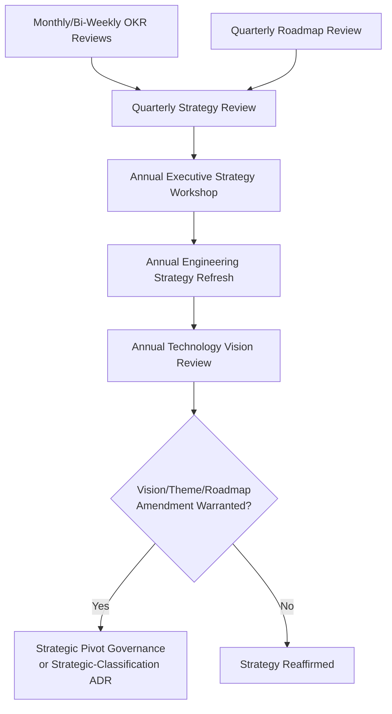
```mermaid
graph TD
    A[Monthly/Bi-Weekly OKR Reviews] --> B[Quarterly Strategy Review]
    C[Quarterly Roadmap Review] --> B
    B --> D[Annual Executive Strategy Workshop]
    D --> E[Annual Engineering Strategy Refresh]
    E --> F[Annual Technology Vision Review]
    F --> G{Vision/Theme/Roadmap<br/>Amendment Warranted?}
    G -->|Yes| H[Strategic Pivot Governance<br/>or Strategic-Classification ADR]
    G -->|No| I[Strategy Reaffirmed]
```

---

# Relationship with Previous Standards

### Project Vision

`ai-docs/00-project-vision.md` establishes the Mission, the North Star Principle, and the 10-Year Vision Arc. This document is the operational mechanism that translates that founding, decade-scale ambition into a disciplined, continuously-revisited 1-year/3-year/5-year planning cycle — never redefining the mission itself, only the process by which engineering pursues it deliberately.

### Product Goals

`ai-docs/01-product-goals.md` owns the complete, measurable Business, User, Technical, and Functional Goals. Every Strategic Theme in this document traces directly to a goal already established there — this document never invents a goal independently of that one.

### Engineering Principles

`ai-docs/02-engineering-principles.md` establishes YAGNI, Evolvable over Perfect, and the founding Technical Debt Policy. This document's Incremental Modernization principle and its Technology Modernization Strategy are the strategic-scale application of those same founding disciplines.

### System Architecture Principles

`ai-docs/03-system-architecture-principles.md` owns the Migration Strategy, Evidence over Prediction, and the Modular Monolith → Microservices evolution path in full. This document's Platform Modernization theme and Technology Modernization Strategy consume that document's indicators directly, never redefining when or how a module is extracted.

### Capacity Planning

`ai-docs/36-engineering-capacity-planning-resource-management-standards.md` owns Capacity Forecasting, the Skill Matrix, and the Maximum Sustainable Workload ceiling. This document's OKRs, Strategic Initiatives, and Roadmaps are checked against that document's forecasts at every approval gate, never committing capacity that document has not confirmed exists.

### Portfolio Management

`ai-docs/38-engineering-portfolio-program-management-standards.md` owns Quarterly Portfolio Rebalancing, the Initiative Scoring Model, and the Portfolio Dependency Register/Heat Map in full. This document sets the multi-year Themes and Vision that Portfolio Management's quarterly execution serves — the two documents share the Prioritization Matrix and Dependency mechanics by direct reuse, never duplication.

### Financial Governance

`ai-docs/42-engineering-financial-governance-standards.md` owns the ROI Evaluation model, the Budget Approval Matrix, and the Centralized Engineering Cost Inventory. Every Strategic Investment in this document is scored and approved through that document's mechanics, never a parallel financial process invented here.

### Architecture Governance

`ai-docs/46-engineering-architecture-governance-standards.md` owns the ARB's decision lifecycle, ADR governance, and the Architecture Compliance Scorecard. This document's Technology Radar and Strategic Pivot Governance route any resulting technical decision through that document's ARB process, never bypassing it.

### Organizational Scaling

`ai-docs/47-engineering-organizational-scaling-standards.md` owns the Organizational Growth Model, Team Topologies, and Platform Engineering Governance. This document's Capability Planning consumes that document's stage-transition criteria and Platform internal-customer feedback directly, never redefining organizational structure itself.

### Operational Excellence

`ai-docs/39-engineering-operational-excellence-continuous-improvement-standards.md` owns the Engineering Maturity Scorecard, the Improvement Backlog, and the North Star Metrics. This document's Post-Strategy Reviews feed Lessons Learned into that document's Improvement Backlog directly, and this document's Platform Maturity metric is sourced from that Scorecard, never re-measured redundantly here.

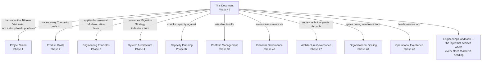
```mermaid
graph TD
    A[This Document<br/>Phase 49] -->|"translates the 10-Year Vision Arc<br/>into a disciplined cycle from"| B[Project Vision<br/>Phase 1]
    A -->|"traces every Theme to goals in"| C[Product Goals<br/>Phase 2]
    A -->|"applies Incremental Modernization<br/>from"| D[Engineering Principles<br/>Phase 3]
    A -->|"consumes Migration Strategy<br/>indicators from"| E[System Architecture<br/>Phase 4]
    A -->|"checks capacity against"| F[Capacity Planning<br/>Phase 37]
    A -->|"sets direction for"| G[Portfolio Management<br/>Phase 39]
    A -->|"scores investments via"| H[Financial Governance<br/>Phase 43]
    A -->|"routes technical pivots through"| I[Architecture Governance<br/>Phase 47]
    A -->|"gates on org readiness from"| J[Organizational Scaling<br/>Phase 48]
    A -->|"feeds lessons into"| K[Operational Excellence<br/>Phase 40]
    A --> L[Engineering Handbook —<br/>the layer that decides where<br/>every other chapter is heading]
```

---

# Closing Statement

> **Callout — Closing Statement**
> Every preceding phase document described a standard for how Arwal builds, secures, governs, finances, architects, scales, and continuously improves what it has already decided to build. This document describes the discipline that decides, deliberately and years in advance, what that "already decided" should actually be — a Vision durable enough to guide a decade, Themes concrete enough to fund, Objectives measurable enough to hold anyone accountable to, and a rolling planning cycle honest enough to say, every quarter, whether the plan is still working. Strategic planning is not a slide deck produced once and forgotten; it is the standing discipline that keeps Arwal's engineering organization spending its most finite resources — capacity, capital, and years — on what the district actually needs next, revised the moment evidence says it should be, and never left to drift on inertia or persuasive narrative alone. A platform meant to serve a district for a generation earns that duration only if the people steering it keep asking, honestly and on a fixed cadence, whether they are still steering it toward the right place. Where a future phase must deviate from a standard stated here, that deviation is made explicitly — through this document's own Strategic Pivot Governance, or a Strategic-classification ADR where the deviation is structural — never silently, and never by default.

This document, `ai-docs/48-engineering-strategic-planning-standards.md`, is Phase 49 of approximately 300. Every vision set, theme funded, OKR tracked, roadmap published, and pivot ratified in the phases that follow is expected to satisfy the standards defined here, or to justify its deviation in writing.

**End of Phase 49 — `ai-docs/48-engineering-strategic-planning-standards.md`**