# Engineering Handbook Governance & Evolution Standards

**Document:** `ai-docs/49-engineering-handbook-governance-evolution-standards.md`
**Project:** Arwal — The District Super App
**Stage:** 1 — Foundation
**Phase:** 50 — Engineering Handbook Governance & Evolution Standards
**Status:** Approved for Engineering Reference
**Audience:** CTO, VP Engineering, Architecture Review Board, Engineering Governance Committee, Technical Authors, Reviewers, Contributors, Government Technical Partners

> **Callout — Purpose of This Document**
> `ai-docs/00-project-vision.md` through `ai-docs/48-engineering-strategic-planning-standards.md` defined why Arwal exists and every enforceable discipline governing how it is designed, built, secured, governed, risk-managed, changed, documented, communicated, staffed, capacity-planned, grown as a career, coordinated as a portfolio, continuously improved, audited, architected, organizationally scaled, and strategically planned. None of those documents governs **the handbook that contains them** — how a standard is proposed, reviewed, approved, versioned, superseded, and eventually retired; who owns the corpus itself; and how Arwal knows, at Phase 250 as reliably as at Phase 50, that the handbook it is reading is still the handbook it should be following. This document is that governance layer — the meta-standard for every standard.

---

# Purpose of this Document

### Why Engineering Handbooks Require Governance

A handbook of forty-nine phase documents, each internally rigorous, does not remain coherent by accident. Standards are written by different authors, at different times, under different pressures, and each new document inherits the risk of contradicting, duplicating, or silently drifting from what came before it. Without a governing document for the handbook itself, the corpus accumulates the exact failure modes every individual standard within it was written to prevent in code: God documents that try to cover everything, tight coupling between documents that should be independently revisable, duplicated guidance that drifts out of sync, and orphaned standards nobody remembers approving. This document exists to apply the same engineering discipline the handbook demands of Arwal's codebase to the handbook itself.

### Why Standards Evolve

A standard written in Phase 3 reflects the best evidence available in Phase 3. Technology changes, regulation changes, the organization's scale changes, and Arwal's own operational history generates lessons no committee could have anticipated at Phase 1. A handbook that cannot evolve is a handbook that becomes progressively less true the longer the project runs — and a handbook that evolves without governance becomes internally inconsistent within a single quarter. This document exists to make evolution itself a disciplined, evidenced, reviewable process rather than an ad hoc edit made by whoever felt strongly enough to make it.

### Long-Term Knowledge Preservation

Arwal's roadmap spans roughly 300 micro-phases and a multi-year, likely multi-decade operating horizon, per `ai-docs/00-project-vision.md`'s commitment to infrastructure built for a generation. Across that horizon, the handbook is the single most durable artifact Arwal's engineering organization produces — more durable than any individual service, any individual team, and any individual engineer's tenure. Preserving it correctly — its content, its history, its reasoning — is preserving Arwal's capacity to remain the organization it intends to be, long after everyone who wrote Phase 1 has moved on.

### Institutional Memory

Per the identical Historical Decision Knowledge category already established in `ai-docs/33-engineering-knowledge-management-standards.md`, the reasoning behind a standard is as valuable as the standard itself — and reasoning that is not deliberately preserved is reasoning that is lost the moment the people who held it move to other work. This document is where the handbook's own institutional memory — why a document was written the way it was, why it was later changed, why a standard was eventually retired — is made a governed, permanent, citable record rather than an oral history nobody can verify.

### Engineering Consistency

Per Consistency already established as a pillar of Engineering Excellence in `ai-docs/02-engineering-principles.md`, an engineer's understanding of how one part of Arwal works should transfer to every other part. That consistency is only as real as the handbook that teaches it is internally consistent — a handbook containing two documents that quietly contradict each other on the same question teaches inconsistency exactly as effectively as an inconsistent codebase does. This document is the mechanism that keeps the handbook's own house in order.

### Relationship with Preceding Documents

This document does not redefine Engineering Principles (`ai-docs/02-engineering-principles.md`), Engineering Governance (`ai-docs/29-engineering-governance-decision-authority.md`), Risk Management (`ai-docs/30-engineering-risk-management-standards.md`), Compliance & Audit (`ai-docs/40-engineering-compliance-audit-standards.md`), Architecture Governance (`ai-docs/46-engineering-architecture-governance-standards.md`), Organizational Scaling (`ai-docs/47-engineering-organizational-scaling-standards.md`), Strategic Planning (`ai-docs/48-engineering-strategic-planning-standards.md`), Operational Excellence (`ai-docs/39-engineering-operational-excellence-continuous-improvement-standards.md`), Innovation & Research (`ai-docs/45-engineering-innovation-research-standards.md`), Documentation Standards (`ai-docs/24-documentation-standards.md`), or Knowledge Management (`ai-docs/33-engineering-knowledge-management-standards.md`). Every one of those governs its own domain's substance in full. This document's exclusive territory is the handbook itself, as a governed corpus: how a document within it is proposed, classified, versioned, approved, published, adopted, reviewed, revised, and retired — the meta-process every other document in this handbook was, is, and will be produced through.

---

# Handbook Governance Philosophy

Arwal's handbook governance rests on eight commitments. Together they answer the question every subsequent section of this document exists to make concrete: **what makes a body of engineering standards actually trustworthy, rather than merely voluminous?**

### Single Source of Truth

Every engineering question has exactly one authoritative answer, located in exactly one document — restating, at the handbook level, the identical Single Source of Truth principle already established in `ai-docs/02-engineering-principles.md` and `ai-docs/34-engineering-communication-standards.md`. This exists because two documents answering the same question, even both correctly at the moment each was written, will inevitably drift apart, and a reader has no way to know which one to trust.

### Continuous Evolution

The handbook is never treated as complete — it is a living system, deliberately revised as evidence, technology, and Arwal's own operating history accumulate, mirroring Continuous Improvement already established throughout `ai-docs/30` through `ai-docs/39`. This exists because a handbook frozen at Phase 50 becomes, by Phase 200, a historical curiosity rather than an operating standard.

### Evidence-Based Updates

Every revision to an existing standard is grounded in a specific, checkable reason — an incident, a measured metric, a genuine technology shift, a regulatory change — never in a single engineer's unchecked preference, restating Evidence-Based Decisions already established in `ai-docs/29-engineering-governance-decision-authority.md`. This exists because a handbook that can be rewritten on the strength of the most persuasive recent conversation is not a standard; it is a mood.

### Backward Compatibility

A revision to a standard is designed, wherever possible, to be adopted incrementally without invalidating work already completed under the prior version, mirroring the identical Backward-Compatible Migrations principle already established in `ai-docs/02-engineering-principles.md` and `ai-docs/14-database-design-guidelines.md`. This exists because a handbook that retroactively invalidates completed, compliant work punishes the engineers who followed it correctly, and trains the organization to distrust future standards.

### Traceability

Every document, every revision, and every retirement is traceable to a specific proposal, a specific review, and a specific approval — restating Traceability already established in `ai-docs/06-git-workflow.md` and `ai-docs/25-architecture-decision-records.md`. This exists because a standard nobody can trace back to a decision is a standard that cannot be defended, audited, or trusted when it is challenged.

### Transparency

Every handbook change of consequence is visible to every engineer it might affect, per Transparency over Opacity already established in `ai-docs/00-project-vision.md`. This exists because a handbook edited quietly, without visibility, cannot be relied upon by the people who must follow it — they cannot follow a standard they do not know has changed.

### Simplicity

The handbook adds a new document, a new section, or a new governance step only when a demonstrated need exists — never speculatively, never for its own procedural weight, mirroring KISS and YAGNI already established in `ai-docs/02-engineering-principles.md`. This exists because a governance process heavy enough to discourage anyone from ever proposing an improvement defeats Continuous Evolution just as surely as no governance process at all.

### Quality Over Quantity

Forty-nine documents of genuine, load-bearing rigor are worth more than a hundred documents padded with restated content or speculative coverage of problems Arwal does not yet have. This exists because a handbook's authority rests on every engineer trusting that what is written there was written because it needed to be — the moment that trust erodes, engineers stop reading the handbook at all.

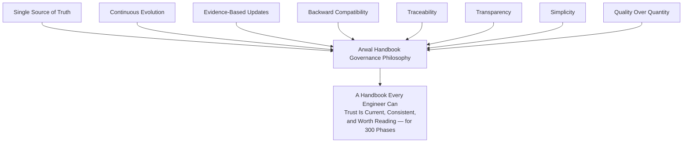

> **Callout — The One-Sentence Handbook Governance Philosophy**
> *"A standard nobody can trace, version, or eventually retire is not a standard — it is a document that happens to still be sitting in the repository."*

---

# Handbook Governance Framework

Every document in the handbook — new or revised — passes through the same nine-stage lifecycle, scaled in rigor to the document's Classification (below) and the significance of the change.

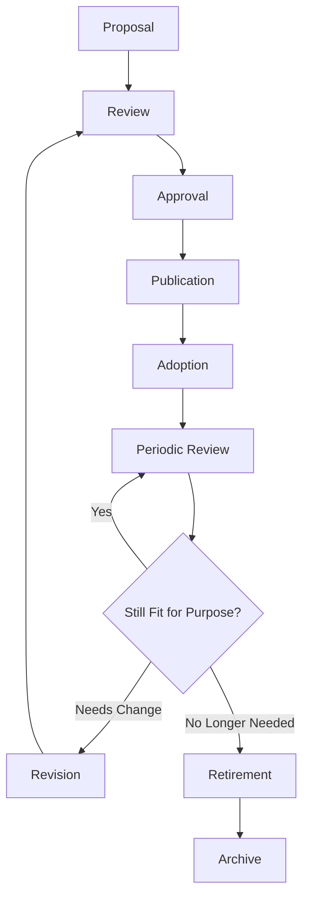

| Stage | Purpose | Owner | Exit Criterion |
|---|---|---|---|
| **Proposal** | A new document or a revision to an existing one is formally proposed, per Document Lifecycle below. | Proposing engineer/team | A complete proposal record exists, including rationale and classification. |
| **Review** | Technical and governance review confirms accuracy, consistency, and non-duplication. | Technical Reviewers, Handbook Governance Committee | Review comments resolved; no unaddressed Blocking issue remains. |
| **Approval** | The document's classification-appropriate Approval Authority signs off, per Document Approval Workflow below. | Per Handbook Ownership | Approval recorded with named approver and date. |
| **Publication** | The document (or revision) is published to its canonical location in `ai-docs/`, version-tagged. | Handbook Governance Committee | Live, discoverable, version metadata correct. |
| **Adoption** | The document is actively communicated to affected engineers and begins governing new work. | Handbook Governance Committee, Engineering Managers | Communicated per `ai-docs/34-engineering-communication-standards.md`; adoption tracked per Handbook Metrics below. |
| **Periodic Review** | The document is re-examined on its classification's defined cadence to confirm it remains accurate and relevant. | Document Owner | Reviewed on schedule, per Continuous Evolution below. |
| **Revision** | A change is made in response to Periodic Review or an evidenced trigger, re-entering the lifecycle at Proposal. | Document Owner | A new version is drafted per Version Management below. |
| **Retirement** | The document (or the specific standard within it) is formally deprecated, per Deprecation Governance below. | Handbook Governance Committee | Marked deprecated with a pointer to its replacement, or a stated reason none exists. |
| **Archive** | The retired document is preserved, permanently discoverable, never deleted. | Handbook Governance Committee | Moved to the archive location, indexed, excluded from active-standard search. |

---

# Handbook Ownership

Every role below carries defined handbook-governance responsibility, built on top of the Governance Organization already established in `ai-docs/29-engineering-governance-decision-authority.md` — this document introduces one new standing body (the Handbook Governance Committee) and applies existing roles specifically to the handbook's own stewardship.

| Role | Handbook Responsibility |
|---|---|
| **CTO** | Final accountability for the handbook's overall coherence and its alignment with Arwal's technical strategy, per `ai-docs/48-engineering-strategic-planning-standards.md`; approves any Strategic-classification document or amendment. |
| **VP Engineering** | Accountable for the handbook's practical usability and adoption across the organization; co-chairs the Handbook Governance Committee. |
| **Architecture Review Board** | Technical review authority for any document touching system architecture, per `ai-docs/46-engineering-architecture-governance-standards.md`; ratifies architecture-adjacent handbook amendments. |
| **Handbook Governance Committee** | The standing body accountable for the handbook's ownership, quality, and long-term stewardship as a whole — see below. |
| **Technical Authors** | Draft new documents and revisions; accountable for technical accuracy and adherence to the Standard Templates below. |
| **Reviewers** | Confirm a document's technical accuracy, non-duplication, and consistency with the rest of the handbook before Approval. |
| **Contributors** | Any engineer proposing a correction, a clarification, or a new-document idea via the Proposal stage — proposal authority is open to every engineer, never restricted to senior roles alone. |

### Handbook Governance Committee

Per the governance improvement this document incorporates, the **Handbook Governance Committee (HGC)** is the standing body accountable for the handbook's ownership, quality, and long-term stewardship as a single, coherent system — distinct from any individual document's own Owner.

| Attribute | Definition |
|---|---|
| **Membership** | VP Engineering (co-chair), a Principal Architect (co-chair), a rotating Engineering Director, the Documentation/Knowledge Management Lead, and a rotating Technical Author representative. |
| **Responsibilities** | Approves new-document proposals and Major revisions; maintains the Handbook Index and Dependency Map (below); resolves cross-document conflicts; owns the Handbook Maturity Model assessment; runs the Governance Review cadence below. |
| **Decision Process** | Consensus-seeking; where consensus is not reached, the co-chairs jointly decide, escalating to the CTO per `ai-docs/29-engineering-governance-decision-authority.md`'s Escalation Process where still unresolved. |
| **Cadence** | Monthly standing meeting, plus ad hoc sessions for an Emergency Revision (below). |
| **Accountability** | The HGC does not author documents itself — authorship belongs to Technical Authors and Domain Owners — the HGC is accountable for the *system* the documents form: no gaps, no unresolved contradictions, no orphaned or ownerless documents. |

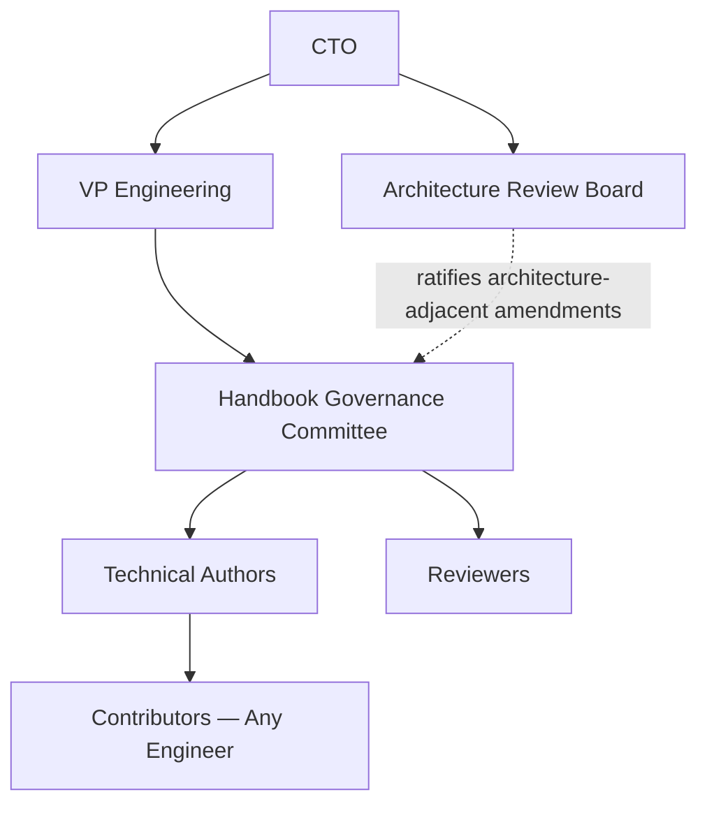

### RACI — Handbook Governance Decisions

| Decision | Responsible | Accountable | Consulted | Informed |
|---|---|---|---|---|
| New document proposal | Proposing engineer/team | Handbook Governance Committee | Domain Owner(s) of related documents | All Engineering |
| Minor revision | Document Owner | Handbook Governance Committee | Affected teams | Engineering Managers |
| Major revision | Document Owner | Handbook Governance Committee + CTO (Strategic-tier) | Architecture Review Board (where applicable) | All Engineering |
| Emergency revision | Incident Commander / Security Team | CTO | Handbook Governance Committee | All Engineering, immediately |
| Document retirement | Document Owner | Handbook Governance Committee | Affected teams, Architecture Review Board | All Engineering |
| Handbook structure change (numbering, templates) | Handbook Governance Committee | VP Engineering | Technical Authors | All Engineering |

---

# Document Lifecycle

Every kind of change to the handbook follows one of six paths, distinguished by scope and urgency — never blended into a single undifferentiated "edit" concept.

| Change Type | Definition | Governance Path |
|---|---|---|
| **New document creation** | A genuinely new phase document, addressing a domain not yet covered. | Full Proposal → Review → Approval → Publication cycle; Handbook Governance Committee approval mandatory. |
| **Document update** | A substantive but non-breaking addition or clarification to an existing document. | Standard Review + Document Owner + HGC notification; classified as Minor or Major per Version Management below. |
| **Minor revision** | A clarification, a typo fix, a broken-reference repair, a non-substantive rewording. | Document Owner approval; HGC informed, not required to convene. |
| **Major revision** | A change to a standard's actual requirement, threshold, or governance mechanic — potentially breaking for work already in flight. | Full Review + HGC approval; Migration Guidance mandatory, per Version Management below. |
| **Emergency revision** | A change made in direct response to an active security incident, a regulatory deadline, or a critical production learning that cannot wait for standard cadence. | Per Emergency Handbook Updates below — expedited, but never unaccountable. |
| **Retirement** | A document or standard is formally deprecated. | Per Deprecation Governance below. |

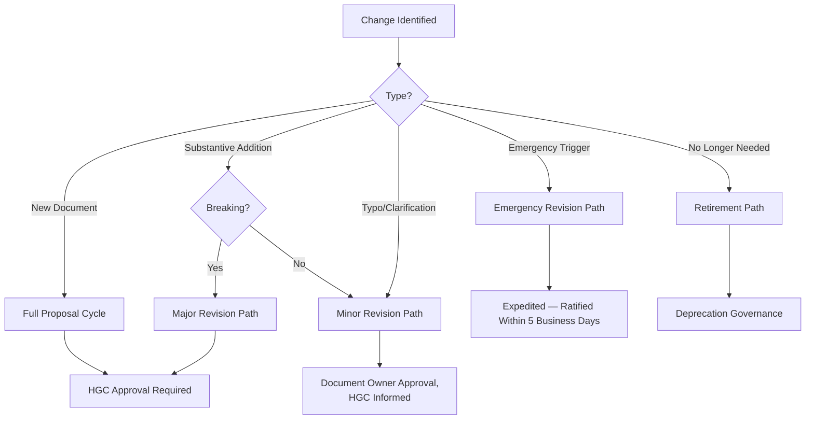

### New Document Creation Criteria

A new phase document is created only where: (1) the subject matter is not already governed, even partially, by an existing document — checked explicitly against the Handbook Index below before drafting begins; (2) the subject matter is significant and durable enough to warrant standing, citable authority rather than a one-off decision; and (3) the Handbook Governance Committee confirms no existing document can reasonably be extended to cover it instead, per Quality Over Quantity above.

---

# Version Management

### Semantic Versioning

Every handbook document carries an explicit version number in its metadata (below), following **Major.Minor.Patch** semantics, restating and applying the identical Semantic Versioning discipline already established in `ai-docs/06-git-workflow.md` and `ai-docs/22-dependency-management-standards.md` to the handbook itself.

| Version Component | Meaning | Example Trigger |
|---|---|---|
| **Major** | A breaking change to a requirement, threshold, or governance mechanic — work compliant under the old version may not be compliant under the new one. | A Change Classification tier's approval chain is restructured; a mandatory field is added to a governed template with no default. |
| **Minor** | A backward-compatible addition — new guidance, a new section, an expanded example — that does not invalidate existing compliant work. | A new anti-pattern is documented; a new metric is added to an existing table. |
| **Patch** | A non-substantive correction — a typo, a broken link, a formatting fix, a clarifying rewording that changes no actual requirement. | A cross-reference is corrected; a Mermaid diagram is fixed. |

### Compatibility Expectations

A **Minor** or **Patch** version bump never requires any engineer or team to change already-completed, already-compliant work. A **Major** version bump requires an explicit Migration Guidance section (below) — no Major revision is published without one.

### Change History

Every document maintains a **Change History** table at its foot, recording every version, its date, its type, a one-line summary, and the approving authority — mirroring the identical Changelog discipline already established in `ai-docs/06-git-workflow.md`.

```markdown
## Change History

| Version | Date | Type | Summary | Approved By |
|---|---|---|---|---|
| 1.0.0 | 2026-01-14 | Major | Initial publication | Handbook Governance Committee |
| 1.1.0 | 2026-04-02 | Minor | Added Bus Factor governance threshold | Handbook Governance Committee |
| 1.1.1 | 2026-04-19 | Patch | Fixed broken cross-reference to ai-docs/30 | Document Owner |
```

### Release Notes

Every Minor or Major version publication produces a release note distributed per `ai-docs/34-engineering-communication-standards.md`'s Release Communication classification — a Patch-level change is recorded in Change History alone and does not require standalone release-note distribution.

### Migration Guidance

Every Major revision states, explicitly: what changed, who is affected, what action (if any) affected teams must take, and by when — never leaving an affected engineer to infer the migration path from the diff alone.

### Superseded Documents

Where a Major revision effectively replaces the prior version's approach rather than extending it, the prior version is marked `Superseded` in its own header, with an explicit link to the superseding version — mirroring the identical Superseding discipline already established for ADRs in `ai-docs/25-architecture-decision-records.md`. A superseded version is retained in the Archive (below), never deleted.

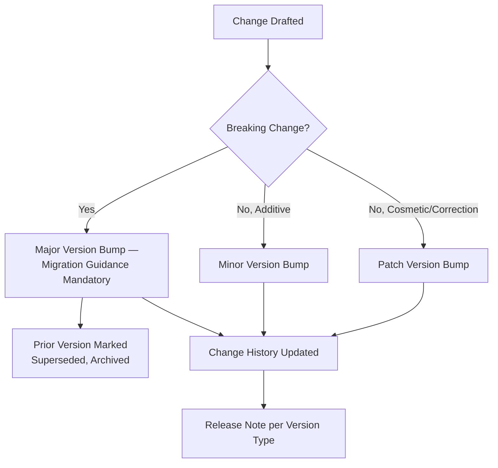

---

# Document Classification

Per the governance improvement this document incorporates, every document in the handbook is classified into exactly one of eight types, determining its authority, its review rigor, and how strictly it is enforced.

| Classification | Definition | Enforcement | Example |
|---|---|---|---|
| **Mandatory Standard** | A non-negotiable requirement; deviation requires a formal, governed exception per the owning document's own exception process. | Enforced in code review, CI, and audit. | `ai-docs/05-coding-standards.md`, `ai-docs/10-security-standards.md` |
| **Guideline** | A strong, evidence-based default that is followed absent a documented, reviewed reason to deviate — deviation is lighter-weight than a Mandatory Standard's formal exception but still requires justification. | Enforced in code review by convention. | `ai-docs/09-tech-stack.md`'s tooling preferences |
| **Best Practice** | A recommended approach with demonstrated value, offered as guidance rather than requirement. | Advisory; cited in review, not blocking. | Sections of `ai-docs/24-documentation-standards.md`'s Writing Style Guide |
| **Reference Architecture** | A published, approved pattern to be reused rather than reinvented. | Enforced via `ai-docs/46-engineering-architecture-governance-standards.md`'s Reference Architecture Governance. | `ai-docs/03-system-architecture-principles.md`'s System Layers |
| **Template** | A structured, fill-in-the-blank artifact (ADR template, Change Request template, IDP template). | Used as-is; structural deviation requires HGC sign-off. | The ADR Template in `ai-docs/25-architecture-decision-records.md` |
| **Playbook** | Decision-tree guidance for a class of situation, not a single linear procedure. | Advisory, consulted situationally. | `ai-docs/07-development-workflow.md`'s Bug Fix Workflow severity table |
| **Runbook** | A step-by-step, rehearsable operational procedure. | Enforced via `ai-docs/33-engineering-knowledge-management-standards.md`'s Periodic Verification. | A disaster-recovery procedure |
| **Informational** | Context, history, or explanation with no enforceable requirement. | Not enforced; read for understanding. | The Closing Statement of any phase document |

### Classification Governs Rigor

A **Mandatory Standard** requires the full Review → HGC Approval → Publication cycle for any Major or Minor change. A **Best Practice** or **Informational** document may be updated through the Minor Revision path with lighter review, per Document Lifecycle above — classification is the primary input into which lifecycle path a given change actually needs.

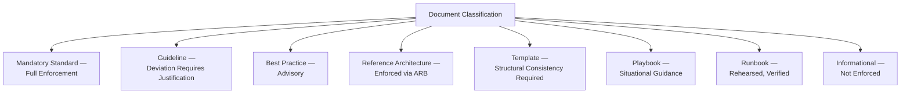

---

# Document Metadata Requirements

Per the governance improvement this document incorporates, every handbook document carries a mandatory metadata block, machine-parseable and human-readable, populated before Publication and never left partially complete.

| Field | Description | Required |
|---|---|---|
| **Document ID** | The canonical filename, e.g. `ai-docs/33-engineering-knowledge-management-standards.md`. | Yes |
| **Title** | The document's full title. | Yes |
| **Classification** | One of the eight types in Document Classification above. | Yes |
| **Version** | Current Major.Minor.Patch. | Yes |
| **Status** | `Draft` / `Approved for Engineering Reference` / `Superseded` / `Deprecated` / `Archived`. | Yes |
| **Owner** | The named individual (never a diffuse team) accountable for the document's continued accuracy. | Yes |
| **Approver** | The name/role that granted the current version's Approval. | Yes |
| **Effective Date** | The date the current version became authoritative. | Yes |
| **Review Date** | The next scheduled Periodic Review date, per Continuous Evolution below. | Yes |
| **Superseded Version** | If applicable, the version this document replaces. | Where applicable |
| **Related Standards** | Cross-references to directly dependent or dependency documents. | Yes |
| **Audience** | The roles for whom this document is primary reading. | Yes |

### Example Metadata Block

```markdown
---
document_id: ai-docs/33-engineering-knowledge-management-standards.md
title: Engineering Knowledge Management Standards
classification: Mandatory Standard
version: 1.2.0
status: Approved for Engineering Reference
owner: Documentation & Knowledge Management Lead
approver: Handbook Governance Committee
effective_date: 2026-03-01
review_date: 2026-09-01
superseded_version: null
related_standards:
  - ai-docs/24-documentation-standards.md
  - ai-docs/25-architecture-decision-records.md
  - ai-docs/32-technical-debt-management-standards.md
audience:
  - Engineering Managers
  - Tech Leads
  - All Engineers
---
```

### Metadata Enforcement

Publication is blocked by the automated quality checks below if any mandatory metadata field is missing, malformed, or references a non-existent related document.

---

# Document Approval Workflow

Every document — new or revised — passes through six sequential gates before it governs any work, scaled in depth to its Classification and change type.

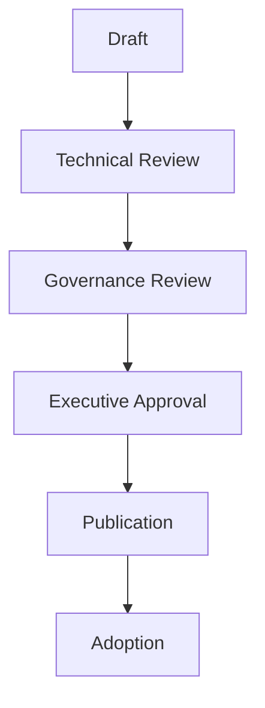

| Gate | Purpose | Who | Exit Criterion |
|---|---|---|---|
| **Draft** | The Technical Author produces a complete, metadata-tagged draft. | Technical Author | Draft complete, self-reviewed against the Standard Template. |
| **Technical Review** | Domain experts confirm technical accuracy and non-duplication against related standards. | 2+ Reviewers with relevant domain expertise | Every Blocking comment resolved. |
| **Governance Review** | The Handbook Governance Committee confirms classification, versioning, cross-references, and consistency with the handbook as a whole. | Handbook Governance Committee | HGC sign-off recorded. |
| **Executive Approval** | For a Strategic-classification document (a new Mandatory Standard, any document touching organization-wide authority) or a Major revision, executive ratification is required. | CTO (Strategic), Architecture Review Board (architecture-adjacent) | Approval recorded per RACI above. |
| **Publication** | The document is committed to `ai-docs/`, version-tagged, indexed in the Handbook Index below. | Handbook Governance Committee | Live, discoverable, cross-references verified. |
| **Adoption** | The document is actively communicated and begins governing new work, per `ai-docs/34-engineering-communication-standards.md`. | Handbook Governance Committee, Engineering Managers | Communicated to all affected audiences; adoption tracked. |

### Approval Authority by Classification

| Classification | Technical Review | Governance Review | Executive Approval |
|---|---|---|---|
| Mandatory Standard (new) | Mandatory | Mandatory | CTO |
| Mandatory Standard (Major revision) | Mandatory | Mandatory | CTO |
| Mandatory Standard (Minor/Patch) | Mandatory | HGC informed | Not required |
| Guideline / Best Practice | Mandatory | HGC informed | Not required |
| Reference Architecture | Mandatory | Mandatory | Architecture Review Board |
| Template / Playbook / Runbook | Mandatory | HGC informed | Not required |
| Informational | Light review | Not required | Not required |

---

# Handbook Structure Governance

### Folder Structure

Every handbook document lives at `ai-docs/##-document-name.md`, per the naming convention already established across all prior phases — this document does not introduce a new location, it governs the discipline of keeping that convention consistent as the corpus grows.

### Naming Conventions

Document filenames are lowercase, hyphen-separated, and descriptive of content rather than of process (`engineering-knowledge-management-standards.md`, never `phase-34.md` alone) — the numeric prefix indicates sequence; the descriptive name indicates content, so a reader can identify a document's subject without needing to already know its number.

### Numbering

Numbering is sequential and immutable, mirroring the identical Immutable Numbers principle already established for ADRs in `ai-docs/25-architecture-decision-records.md` — a retired document's number is never reused for an unrelated future document, even after archival.

### Cross-References

Every cross-reference to another handbook document cites the full document path (`ai-docs/03-system-architecture-principles.md`), never an informal reference ("see the architecture doc") that cannot be automatically verified or machine-checked for existence.

### Document Dependencies

The relationship between documents — which ones a given document assumes, extends, or is extended by — is recorded explicitly in that document's Metadata (`related_standards`) and in its own "Relationship with Previous Standards" section, per the pattern already established consistently since `ai-docs/29-engineering-governance-decision-authority.md`.

### Standard Templates

Every new Mandatory Standard follows the same structural template — Purpose, Philosophy, Framework, substantive sections, Metrics, AI-Assistance, Anti-Patterns, Review Checklist, Governance Review, Relationship with Previous Standards, Closing Statement — mirroring the structure every phase document since `ai-docs/02-engineering-principles.md` has followed. A new document deviating from this structure without HGC-approved justification is returned at Governance Review.

```markdown
# <Document Title>

**Document:** `ai-docs/##-document-slug.md`
**Classification:** <per Document Classification>
**Version:** <Major.Minor.Patch>
**Status:** <per metadata>

> **Callout — Purpose of This Document**
> ...

# Purpose of this Document
# <Domain> Philosophy
# <Domain> Framework
## <substantive sections, per domain>
# Metrics
# AI-Assisted <Domain>
# Engineering Anti-Patterns
# Engineering Review Checklist
# Governance Review
# Relationship with Previous Standards
# Closing Statement
```

---

# Handbook Index and Dependency Map

Per the governance improvement this document incorporates, the Handbook Governance Committee maintains a **central Handbook Index** — a single, always-current table listing every document, its classification, its current version, and its status — and a **Dependency Map** visualizing how documents relate.

### Handbook Index (Illustrative Excerpt)

| # | Document | Classification | Version | Status |
|---|---|---|---|---|
| 00 | Project Vision | Informational | 1.0.0 | Approved |
| 02 | Engineering Principles | Mandatory Standard | 1.1.0 | Approved |
| 03 | System Architecture Principles | Reference Architecture | 1.0.0 | Approved |
| 25 | Architecture Decision Records | Template | 1.0.0 | Approved |
| 33 | Knowledge Management Standards | Mandatory Standard | 1.2.0 | Approved |
| 46 | Architecture Governance | Mandatory Standard | 1.0.0 | Approved |
| 49 | Handbook Governance & Evolution | Mandatory Standard | 1.0.0 | Approved |

### Dependency Map

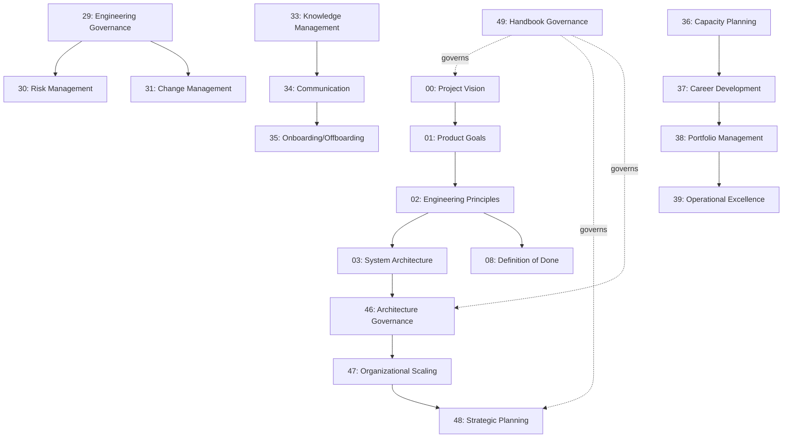

The Index and Dependency Map are re-generated at every Publication event and reviewed in full at the Quarterly Handbook Governance Review below — a document missing from the Index, or an Index entry pointing to a nonexistent file, is treated as an active Anti-Pattern (below).

---

# Knowledge Management

### Searchability

Every handbook document is indexed for full-text search, per the identical Documentation Searchability principle already established in `ai-docs/24-documentation-standards.md` — this document adds no new search mechanic, it requires that the Handbook Index above stays in lockstep with whatever search tooling the organization uses.

### Metadata and Indexing

The metadata block required in Document Metadata Requirements above is the structured data every indexing and search tool consumes — a document without complete metadata is not merely non-compliant, it is functionally undiscoverable by any automated tool.

### Knowledge Retention

Every version of every document is retained in Git history indefinitely, per the identical Documentation Is Code principle already established in `ai-docs/24-documentation-standards.md` — retention here means the handbook's own past is never lost, only superseded.

### Historical Decisions

Where a handbook document's own creation or revision constitutes a decision meeting the ADR threshold already established in `ai-docs/25-architecture-decision-records.md` (a genuinely new governance mechanic, a reversal of a prior standard), that decision is additionally recorded as an ADR — this document's Change History table is not a substitute for an ADR where one is independently warranted.

### Lessons Learned

Every Periodic Review (below) that results in a Major revision records what evidence prompted the change, feeding into the Improvement Backlog already established in `ai-docs/39-engineering-operational-excellence-continuous-improvement-standards.md` — a handbook-level lesson learned is treated with the identical rigor as any other organizational learning, never siloed in a separate, disconnected handbook-only record.

### AI-Readable Documentation

Every handbook document is written in structured Markdown with consistent heading hierarchy, explicit cross-reference syntax (`ai-docs/##-slug.md`), and complete metadata — deliberately AI-readable, so that an AI tool assisting with search, drafting, or consistency-checking (per AI-Assisted Handbook Governance below) can reliably parse document boundaries, relationships, and authority without ambiguity. This is a structural property the Standard Template above exists partly to guarantee, not an afterthought layered on top.

---

# Quality Assurance

### Writing Quality

Every document is reviewed against the Writing Style Guide already established in `ai-docs/24-documentation-standards.md` before Publication — this document adds no new style rule, it makes style compliance a Technical Review gate.

### Technical Accuracy

Technical Review (per Document Approval Workflow above) confirms every claim, threshold, and cross-reference in a document is accurate as of the review date — an inaccurate Mandatory Standard is a liability, per the identical severity already established for Outdated Documentation in `ai-docs/24-documentation-standards.md`'s Anti-Patterns.

### Governance Consistency

The Handbook Governance Committee confirms, at Governance Review, that a new or revised document does not silently contradict an existing one — where a genuine conflict is found, it is resolved explicitly (one document is revised, or an explicit precedence rule is stated), never left for readers to reconcile themselves.

### Duplication Detection

Before Approval, every document is checked against the Handbook Index for content overlap with an existing document — genuine duplication is resolved by consolidating into the authoritative document and having the newer document cite it, never by two documents independently maintaining the same guidance.

### Broken References

Every cross-reference (`ai-docs/##-slug.md`) is automatically validated to point to an existing, non-archived document before Publication — a broken reference blocks Publication, it is never merged with a "fix later" note.

### Automated Quality Checks

Per the governance improvement this document incorporates, the following checks run automatically before any document is eligible for Publication:

| Check | What It Catches |
|---|---|
| **Broken cross-reference detection** | A citation to a document ID that does not exist, or that has been archived without a superseding pointer. |
| **Duplicate content detection** | Substantial textual overlap with an existing document, surfaced for human review — never auto-merged. |
| **Formatting consistency** | Deviation from the Standard Template's heading structure, missing metadata fields, malformed Mermaid syntax. |
| **Stale document detection** | A document past its `review_date` with no recorded Periodic Review, per Continuous Evolution below. |
| **Orphan detection** | A document with no inbound references from the Dependency Map and no outbound `related_standards` entries — flagged for HGC review, not automatically retired. |

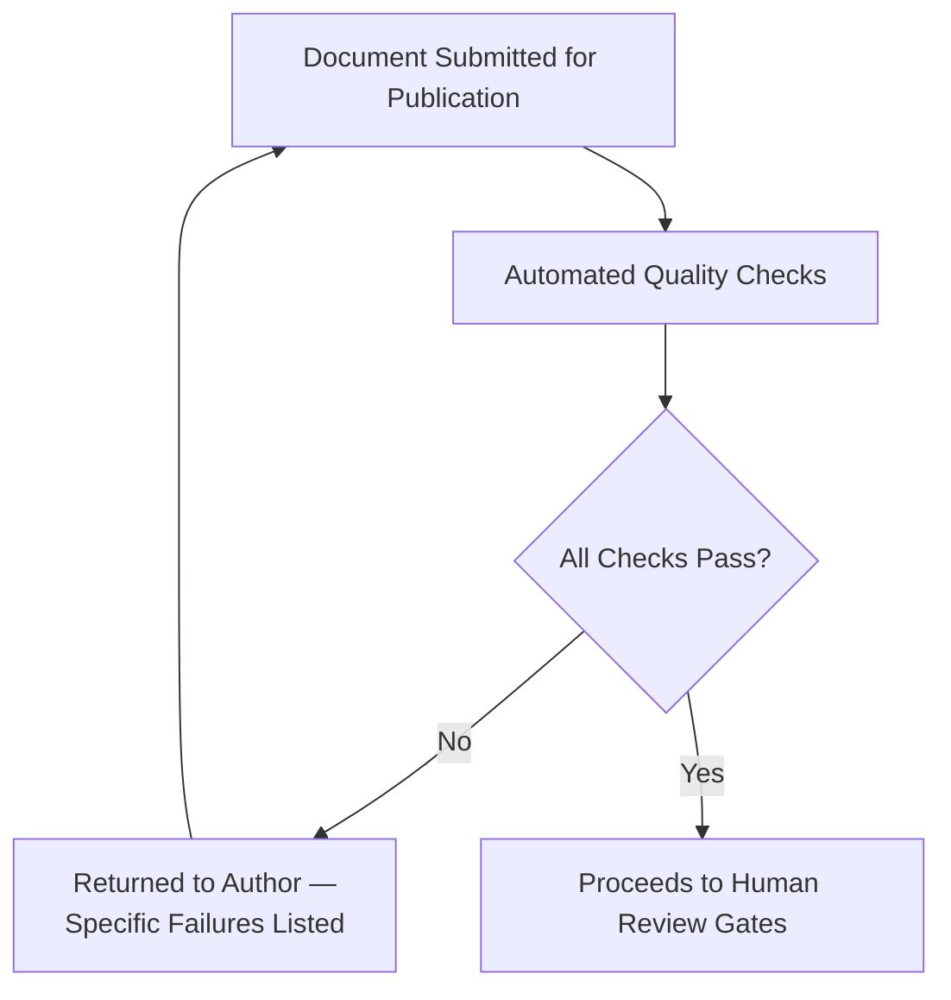

### Review Checklists

Every gate in Document Approval Workflow applies the Engineering Review Checklist at the foot of this document, in addition to any classification-specific checklist the document type requires.

---

# Continuous Evolution

### Quarterly Reviews

The Handbook Governance Committee reviews Handbook Metrics (below), any document past its `review_date`, and any open Proposal at its monthly standing meeting, with a consolidated quarterly summary distributed per `ai-docs/34-engineering-communication-standards.md`.

### Annual Handbook Review

Once per year, every Mandatory Standard and Reference Architecture document undergoes a full Periodic Review regardless of its individual `review_date` — confirming the handbook as a whole, not merely document-by-document, still reflects Arwal's actual technical and organizational shape, per the identical Annual Framework Review commitment already established across `ai-docs/30` through `ai-docs/48`.

### Technology Updates

A material change to Arwal's Approved Technologies (`ai-docs/09-tech-stack.md`) or its Technology Radar (`ai-docs/45-engineering-innovation-research-standards.md`, `ai-docs/48-engineering-strategic-planning-standards.md`) automatically flags every handbook document referencing the changed technology for a targeted Periodic Review, rather than waiting for that document's own scheduled cycle.

### Regulatory Updates

A regulatory or government-partnership change surfaced through `ai-docs/40-engineering-compliance-audit-standards.md`'s Compliance Framework Review automatically flags every affected Mandatory Standard for review, coordinated with the Compliance Officer.

### Engineering Feedback

Any engineer may submit a Proposal — a correction, a clarification request, or a new-document idea — through the standard Proposal path; per Contributors above, this is not restricted to senior roles. A Proposal is acknowledged within 5 business days and routed to the appropriate Document Owner or the HGC.

### Community Contributions

An engineer-submitted Minor revision (a typo fix, a broken-reference repair) may be merged directly by the Document Owner without full HGC convening, per Document Lifecycle's Minor Revision path — this keeps the barrier to a small, valuable contribution low while preserving full rigor for anything substantive.

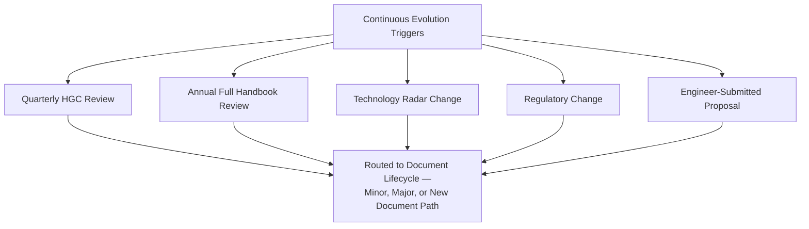

---

# Handbook Maturity Model

Per the governance improvement this document incorporates, the handbook's own governance maturity is assessed on a five-level scale, distinct from — but structurally mirroring — the Engineering Maturity Model already established in `ai-docs/39-engineering-operational-excellence-continuous-improvement-standards.md`.

| Level | Name | Characteristics |
|---|---|---|
| **1 — Initial** | Documents exist but are written and maintained ad hoc, with no consistent template, versioning, or ownership. | High variance in document quality and structure; no central index. |
| **2 — Developing** | Standard Templates and basic metadata exist; versioning is inconsistent; review cadence is reactive. | Documents are individually good but the corpus as a whole is not yet governed as a system. |
| **3 — Managed** | This document's full lifecycle (Proposal → Archive) is consistently followed; Handbook Index and Dependency Map are current; every document has complete metadata. | A reader can trust that every published document has passed the same governed process. |
| **4 — Optimized** | Automated Quality Checks run on every change; Handbook Metrics are actively reviewed and drive Continuous Evolution decisions; Periodic Review is never missed. | The handbook actively improves itself based on measured evidence, not just individual document updates. |
| **5 — Institutionalized** | The handbook's governance is itself a source of organizational pride and external reference; new engineers cite it unprompted; the process this document defines is applied so consistently it requires minimal active enforcement. | The handbook has become genuinely load-bearing institutional memory, surviving team turnover without degrading. |

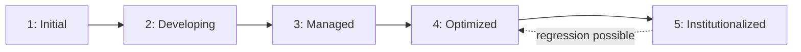

Arwal's target state at the completion of Stage 1 is **Level 3 (Managed)**, with **Level 4 (Optimized)** targeted as Stage 2 tooling investment matures, per the identical staged-target pattern already established in `ai-docs/46-engineering-architecture-governance-standards.md`'s own Architecture Maturity Model.

---

# Deprecation Governance

### Deprecation Criteria

A document, or a specific standard within it, is a deprecation candidate when: it has been Superseded by a newer version addressing the same need; its subject matter no longer applies (a retired technology, a sunset process); or a Periodic Review finds it has been consistently bypassed in practice with no corrective action taken, mirroring the identical Consistently Bypassed in Practice trigger already established in `ai-docs/39-engineering-operational-excellence-continuous-improvement-standards.md`'s Retiring Outdated Standards.

### Sunset Policy

Every deprecation carries a published sunset date, communicated at High-tier classification per `ai-docs/34-engineering-communication-standards.md`, no shorter than 30 days out for a Guideline or Best Practice and no shorter than 90 days for a Mandatory Standard — giving affected teams a genuine window to migrate before the standard stops governing new work.

### Migration Guidance

Every deprecation states, explicitly, what replaces the deprecated guidance (a specific successor document or section) or, where nothing replaces it, why the guidance is no longer needed at all.

### Archive Policy

A deprecated document is never deleted — it is moved to a clearly labeled archive location (`ai-docs/archive/`), marked `Archived` in its Status metadata field, and excluded from the active Handbook Index's default view while remaining fully searchable in an explicit "archived standards" view.

### Historical Preservation

Per the governance improvement this document incorporates, every archived document remains **permanently discoverable for audit and historical reference** — cited in `ai-docs/40-engineering-compliance-audit-standards.md`'s Evidence Catalog where relevant — but is **structurally prevented from being mistakenly applied to new work**: an archived document's header carries a prominent, unambiguous notice stating its Archived status and pointing to its successor, and the Automated Quality Checks above flag any new cross-reference into an archived document as a Broken Reference-equivalent failure.

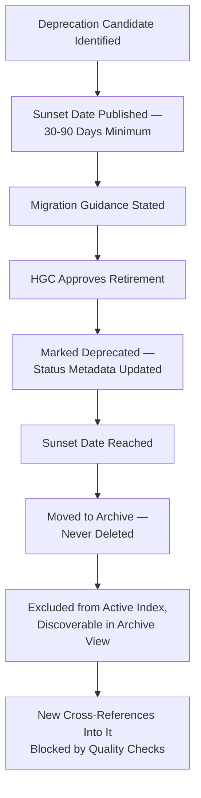

### Periodic Archival Review

Per the governance improvement this document incorporates, the Archive itself is reviewed **annually** by the Handbook Governance Committee, confirming: every archived document still carries a correct, working pointer to its successor (or a still-accurate reason none exists); no archived document has been inadvertently re-referenced by an active document; and the archive remains fully searchable and correctly excluded from default active-standard views.

---

# Handbook Metrics

Per the Actionable Metrics principle already established in `ai-docs/18-observability-standards.md` and every governance chapter since, every metric below ties to a real question the Handbook Governance Committee or CTO will actually ask.

| Metric | Definition | What a Regression Signals |
|---|---|---|
| **Document coverage** | Percentage of identified engineering domains with a current, published Mandatory Standard or Reference Architecture. | A gap signals an area of Arwal's engineering practice operating without governed guidance. |
| **Review completion rate** | Percentage of documents reviewed within their stated `review_date` window. | A declining rate signals Continuous Evolution's Periodic Review discipline is not being honored. |
| **Update frequency** | Average time between a document's publication and its first substantive revision, per Classification. | An excessively long interval on a fast-moving domain (e.g., AI, security) signals staleness risk; an excessively short interval signals instability. |
| **Handbook maturity** | The organization-wide Handbook Maturity Model level, per above. | A flat or declining trend signals the governance process itself is not producing genuine improvement. |
| **Broken references** | Count of cross-reference failures caught by Automated Quality Checks, over time. | A rising count signals documents are being edited without the automated gate being respected. |
| **Compliance rate** | Percentage of active Mandatory Standards with complete, current metadata and no open Blocking review comment. | A declining rate directly threatens the handbook's trustworthiness as a citable authority. |
| **Adoption rate** | Percentage of affected teams confirming Adoption (per Handbook Governance Framework) within 30 days of Publication. | A declining rate signals Communication (`ai-docs/34`) or the document's own practical usability needs attention. |
| **Reader feedback** | A periodic engineer survey on handbook usability, clarity, and trustworthiness. | A declining trend is treated with the identical urgency already established for Engineering Satisfaction in `ai-docs/39-engineering-operational-excellence-continuous-improvement-standards.md`. |

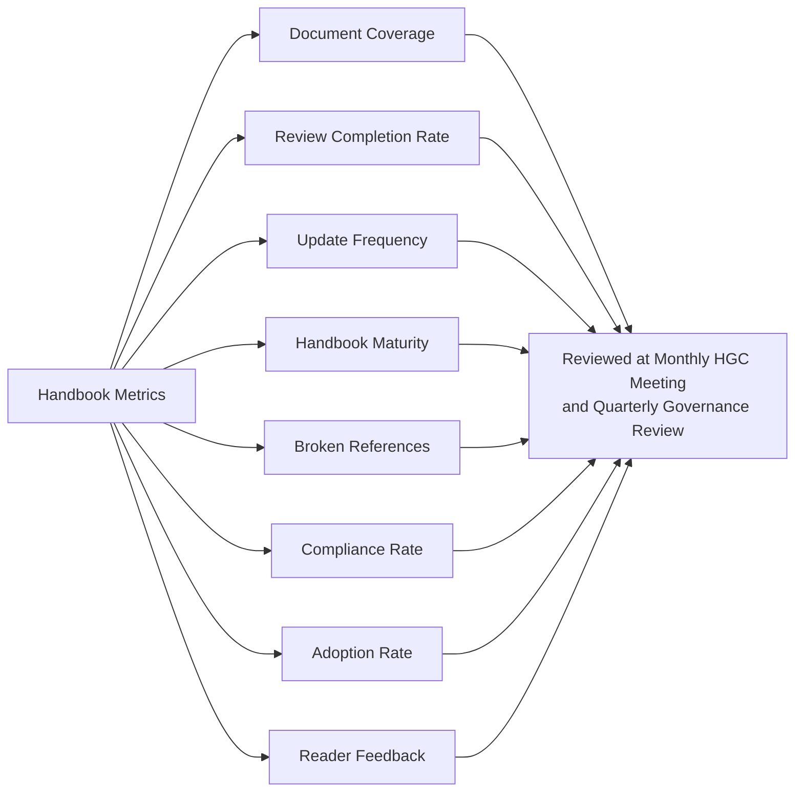

---

# Executive Dashboards

| Dashboard | Audience | Key Content |
|---|---|---|
| **CTO Dashboard** | CTO | Handbook Maturity Level, Strategic-classification documents pending approval, Compliance Rate, cross-document conflicts open. |
| **VP Engineering Dashboard** | VP Engineering | Adoption Rate by document, Reader Feedback trend, review-cadence health across all Mandatory Standards. |
| **Architecture Review Board Dashboard** | ARB | Reference Architecture documents pending review, architecture-adjacent Major revisions in flight, Dependency Map's architecture cluster. |
| **Governance Committee Dashboard** | Handbook Governance Committee | Full Handbook Index, open Proposals by stage, overdue Periodic Reviews, Automated Quality Check failure trend, Archive review status. |
| **Engineering Leadership Dashboard** | Engineering Leadership Council | Document Coverage by domain, Update Frequency outliers, Handbook Metrics rolled up for the standing council cadence. |

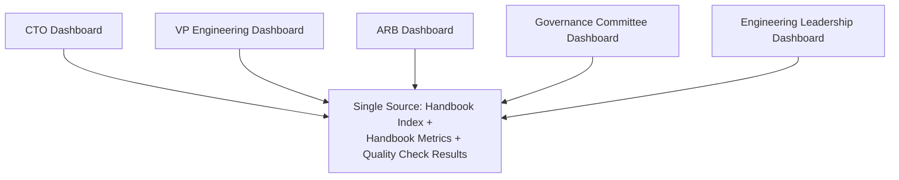

---

# AI-Assisted Handbook Governance

Consistent with the identical AI-assistance principle already established across every governance document in this handbook: **AI accelerates discovery, checking, and drafting — never authority.**

### Knowledge Discovery

An AI tool may surface a candidate existing document that already covers a proposed new document's subject matter — every such surfaced candidate is verified by the Handbook Governance Committee before a Proposal is accepted or redirected, per Quality Over Quantity above.

### Duplicate Detection

An AI tool may flag substantial content overlap between a draft document and an existing one — every flag is a lead for a human reviewer to confirm, never an automatic rejection.

### Consistency Checking

An AI tool may compare a draft or revision against related documents (per `related_standards` metadata) to surface a potential contradiction — every surfaced contradiction is independently verified by a Reviewer before it blocks Publication.

### Broken Reference Detection

An AI tool, or a deterministic script, may perform the Automated Quality Checks' broken cross-reference and stale-document detection described above — these are genuinely mechanical checks well-suited to automation and require no human judgment to execute, though a human confirms the correction before re-submission.

### Documentation Generation Assistance

An AI tool may draft a first pass of a new document's sections from a Technical Author's notes, an existing template, or a linked proposal — the draft is treated as a starting point only. Where AI-generated text is retained substantially in the published document, the document's Change History notes that AI assistance was used in drafting, consistent with the identical AI-Generated Documentation attribution standard already established in `ai-docs/24-documentation-standards.md`.

### Search Optimization

An AI-powered search layer over the Handbook Index and full document corpus is a legitimate, encouraged Discoverability tool, per the identical AI-Assisted Search standard already established in `ai-docs/33-engineering-knowledge-management-standards.md` — every result is presented as a candidate for the searcher to verify against the actual source document, never as an authoritative answer in its own right.

### Human Approval Requirement

No document — new, revised, or retired — is Published, Approved, or relied upon as governing guidance on the basis of AI-generated or AI-verified content alone. Every gate in Document Approval Workflow requires a named human sign-off; an AI tool's analysis, however accurate, is never itself the Approval, identical to the Human Oversight standard already established consistently across `ai-docs/24` through `ai-docs/48`.

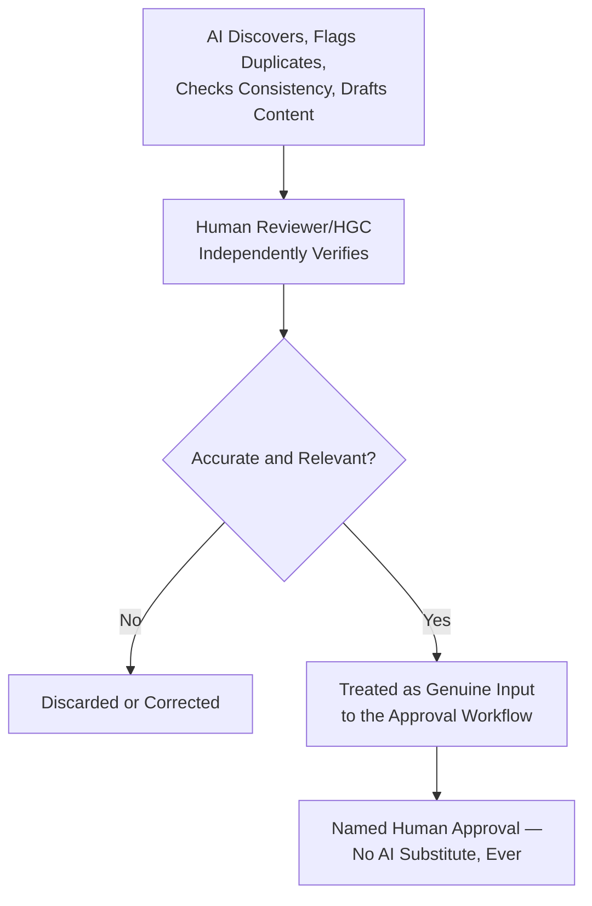

---

# Engineering Anti-Patterns

| Anti-Pattern | Description | Why It's Rejected |
|---|---|---|
| **Outdated documentation** | A document past its `review_date` with no recorded Periodic Review, still cited as current authority. | Violates Continuous Evolution above; the handbook's core promise — that it reflects current reality — fails silently. |
| **Duplicate standards** | Two documents independently maintaining guidance on the same question, inevitably drifting apart. | Violates Single Source of Truth above; a reader has no way to know which document to trust. |
| **Orphan documents** | A document with no inbound or outbound cross-references, unowned, and absent from anyone's regular review cycle. | Violates Traceability and Handbook Ownership above; an orphan document is functionally invisible to the governance process meant to maintain it. |
| **Conflicting guidance** | Two documents giving genuinely incompatible instructions on the same scenario, never explicitly reconciled. | Violates Governance Consistency above; forces every reader to individually guess which standard actually applies. |
| **Missing ownership** | A document with no current, confirmed Owner in its metadata. | Violates the identical Named Ownership principle already established throughout `ai-docs/29`, `ai-docs/30`, and `ai-docs/33`; an unowned document is a document nobody is actually maintaining. |
| **Unreviewed updates** | A Major revision published without passing through Technical Review, Governance Review, or the correct Executive Approval tier. | Violates Document Approval Workflow above; recreates the exact Undocumented Decisions anti-pattern already rejected in `ai-docs/29-engineering-governance-decision-authority.md`. |
| **Knowledge silos** | A team maintaining its own informal, unpublished "house standard" that diverges from the actual handbook. | Violates Single Source of Truth and Transparency above; recreates the exact Private Documentation anti-pattern already rejected in `ai-docs/33-engineering-knowledge-management-standards.md`. |
| **Documentation sprawl** | New documents created for narrow, one-off concerns that could reasonably have extended an existing document. | Violates Quality Over Quantity and New Document Creation Criteria above; dilutes the corpus's authority and makes the Handbook Index harder to navigate. |

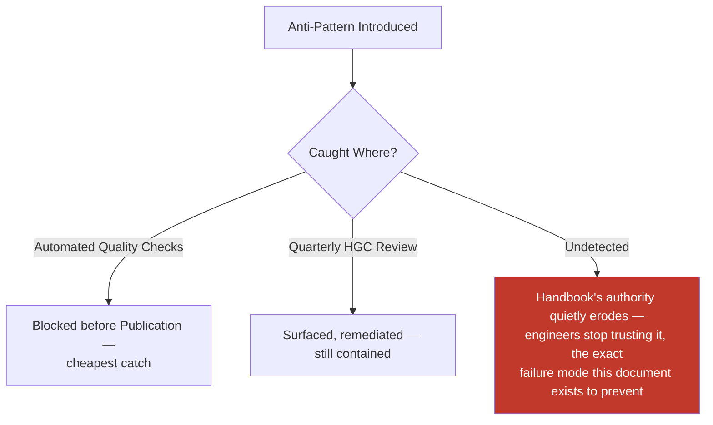

---

# Engineering Review Checklist

Every document — new, revised, or retired — is checked against the following before it is considered handbook-compliant:

- [ ] **Correctly classified** — One of the eight types in Document Classification above.
- [ ] **Complete metadata block** — Every mandatory field in Document Metadata Requirements populated, never left partial.
- [ ] **Follows the Standard Template** — Or deviation is explicitly HGC-approved with stated reasoning.
- [ ] **Versioned correctly** — Major/Minor/Patch bump matches the actual nature of the change, per Version Management.
- [ ] **Change History updated** — Every version recorded with date, type, summary, and approver.
- [ ] **Migration Guidance included for any Major revision** — Never a breaking change with no stated migration path.
- [ ] **No duplicate content** — Checked against the Handbook Index; genuine overlap consolidated, never left standing in two places.
- [ ] **No broken cross-references** — Every citation verified to point to an existing, non-archived document.
- [ ] **Correctly routed through Document Approval Workflow** — Technical Review, Governance Review, and Executive Approval (where required) all completed and recorded.
- [ ] **Named Owner and Approver current** — Never a stale or departed individual left in the metadata.
- [ ] **Handbook Index and Dependency Map updated** — At Publication, never left to drift out of sync.
- [ ] **Communicated per its classification tier** — Per `ai-docs/34-engineering-communication-standards.md`'s channel and audience rules.
- [ ] **Review Date set** — A genuine future date, per the document's Classification-appropriate cadence.
- [ ] **AI-assisted content independently verified** — Any AI-drafted, AI-flagged, or AI-checked content confirmed by a human before reliance.
- [ ] **No anti-pattern present** — No outdated content, duplication, orphaning, conflicting guidance, missing ownership, unreviewed update, knowledge silo, or sprawl.
- [ ] **Retirement, if applicable, follows Deprecation Governance in full** — Sunset date published, migration guidance stated, archived (never deleted), discoverable for audit.

A document failing any item above is not considered Published or compliant until resolved — this checklist carries the same non-negotiable authority as every other review checklist established in the preceding forty-nine phase documents.

---

# Governance Review

| Review | Cadence | Owner | Purpose |
|---|---|---|---|
| **Monthly documentation health review** | Monthly | Handbook Governance Committee | Handbook Metrics trend, open Proposals, overdue Periodic Reviews, Automated Quality Check failure trend. |
| **Quarterly handbook governance review** | Quarterly | Handbook Governance Committee + VP Engineering | Full Handbook Index and Dependency Map audit; document coverage gaps identified; Handbook Maturity Model self-assessment. |
| **Annual full handbook audit** | Annual | Handbook Governance Committee, CTO, Architecture Review Board | Every Mandatory Standard and Reference Architecture reviewed regardless of individual `review_date`; Archive integrity confirmed per Periodic Archival Review. |
| **Major release review** | Per any Major revision or new document publication | Handbook Governance Committee | Confirms the specific change followed the full Document Approval Workflow and that Migration Guidance (where applicable) is genuinely actionable. |
| **Continuous improvement process** | Ongoing | Handbook Governance Committee | Handbook-level lessons learned fed into `ai-docs/39-engineering-operational-excellence-continuous-improvement-standards.md`'s Improvement Backlog, per Knowledge Management above. |

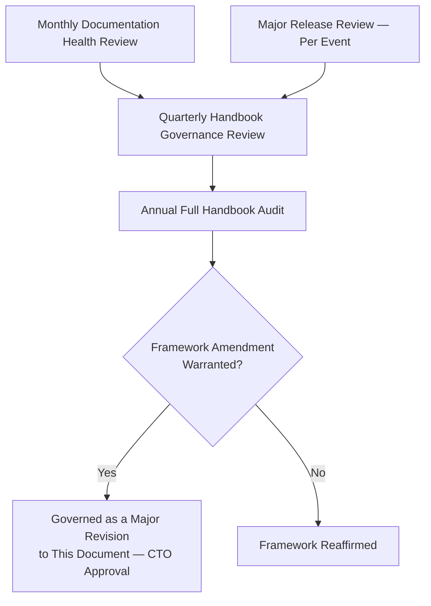

---

# Emergency Handbook Updates

Per the governance improvement this document incorporates, an **Emergency Revision** is permitted only for a genuine, time-critical trigger — never as a shortcut around normal governance for a change that merely feels urgent, mirroring the identical restriction already established for Emergency Changes in `ai-docs/31-change-management-governance-standards.md`.

| Trigger | Example |
|---|---|
| **Active security incident** | A Critical-severity finding requires an immediate correction to a security-relevant Mandatory Standard's guidance. |
| **Regulatory deadline** | A government partnership or legal requirement imposes a compliance obligation with a deadline shorter than the standard Major Revision cycle. |
| **Critical production learning** | A Sev 1 incident's postmortem reveals the handbook itself gave actively incorrect or dangerous guidance. |

### Emergency Revision Process

The Incident Commander (for a production/security trigger) or the Compliance Officer (for a regulatory trigger) may propose an Emergency Revision with the CTO's immediate authorization — implementation may begin before the full Review cycle completes, but never without, at minimum, one qualified Reviewer's expedited sign-off and a stated rationale.

### Post-Implementation Ratification

Every Emergency Revision is followed, within **5 business days**, by: full completion of the standard Document Approval Workflow retroactively, Handbook Governance Committee ratification, and — where the revision reveals a genuinely new governance mechanic — a corresponding ADR per `ai-docs/25-architecture-decision-records.md`. An Emergency Revision whose retroactive ratification is never completed is treated as an active governance defect, surfaced at the next Monthly documentation health review.

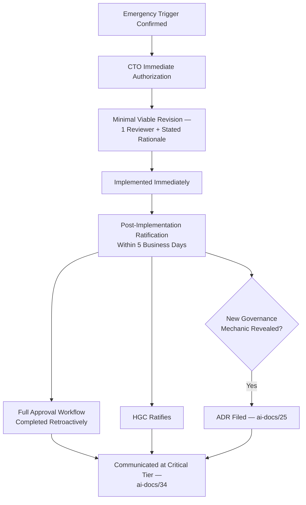

---

# Relationship with Previous Standards

### Project Vision

`ai-docs/00-project-vision.md` establishes Documentation-Driven Development as a founding Engineering Culture commitment and names itself "the first artifact of that culture." This document is the governance system that keeps every subsequent artifact in that culture — all forty-nine documents that followed it, and every one still to come — trustworthy, current, and coherent as a single body of work.

### Engineering Principles

`ai-docs/02-engineering-principles.md` establishes Documentation Standards, the founding ADR concept, and the Technical Debt Policy. This document generalizes that same disciplined, tracked, never-silent approach to the handbook's own evolution — never redefining a principle already established there, only applying it reflexively to the handbook itself.

### Engineering Governance

`ai-docs/29-engineering-governance-decision-authority.md` owns the complete organizational decision-authority structure — every Approval Authority, board, and escalation tier this document's Handbook Ownership and RACI tables draw from directly. This document introduces exactly one new standing body, the Handbook Governance Committee, built on top of — never replacing — that structure.

### Documentation Standards

`ai-docs/24-documentation-standards.md` owns the complete discipline of an individual document as a written artifact — Markdown standards, writing style, the Documentation Review Process, Documentation Ownership, Documentation Lifecycle. This document governs the layer above: the handbook as a governed *system* of documents, never redefining that document's own per-document mechanics.

### ADR Standards

`ai-docs/25-architecture-decision-records.md` owns the complete decision-record artifact and lifecycle. This document treats an ADR as the correct vehicle for any handbook change meeting that document's own significance threshold, and never redefines its template, numbering, or lifecycle.

### Risk Management

`ai-docs/30-engineering-risk-management-standards.md` owns the complete standing Risk Register. A handbook-governance gap this document's metrics surface (a stale Mandatory Standard, an unresolved conflict) is logged into that Register where it meets its threshold, never tracked redundantly here.

### Compliance & Audit

`ai-docs/40-engineering-compliance-audit-standards.md` owns the complete Evidence Catalog and Audit Lifecycle. This document's Archive is a direct source of Compliance Evidence for that document's own audit program — the two are complementary, never duplicative.

### Architecture Governance

`ai-docs/46-engineering-architecture-governance-standards.md` owns the ARB's decision lifecycle and Reference Architecture governance in full. This document names the ARB as the Approval Authority for architecture-classified handbook documents without redefining the ARB's own process.

### Organizational Scaling

`ai-docs/47-engineering-organizational-scaling-standards.md` owns the Organizational Growth Model this document's own governance rigor is scaled against — a five-person team does not need the full Handbook Governance Committee machinery; a five-hundred-engineer organization does, per the identical Organizational Simplicity principle already established there.

### Strategic Planning

`ai-docs/48-engineering-strategic-planning-standards.md` owns the complete Strategic Theme and Roadmap mechanics. Any handbook amendment reflecting a Strategic Pivot from that document flows through this document's own Major Revision path, never a separate, parallel amendment process.

### Operational Excellence

`ai-docs/39-engineering-operational-excellence-continuous-improvement-standards.md` owns the Improvement Backlog and Engineering Maturity Scorecard this document's Lessons Learned and Handbook Maturity Model feed into and mirror respectively — this document never redefines that document's own metrics mechanics.

### Innovation & Research

`ai-docs/45-engineering-innovation-research-standards.md` owns the Technology Radar and Innovation Lifecycle. A new Reference Architecture or Guideline arising from a successfully adopted technology follows that document's Production Adoption path first, then enters the handbook proper through this document's New Document Creation Criteria.

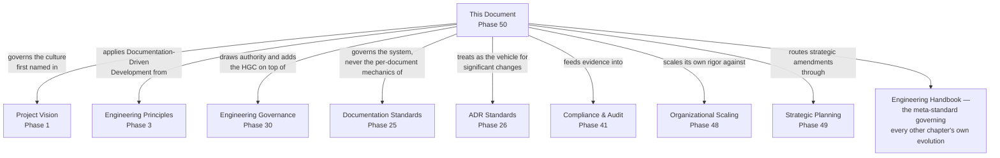

---

# Closing Statement

> **Callout — Closing Statement**
> Every preceding phase document taught Arwal's engineers how to build, secure, govern, risk-manage, change, document, communicate, staff, plan, and continuously improve the platform they are building together. This document is where the handbook turns its own discipline back on itself — because a corpus of fifty documents, written across years by many hands, does not remain trustworthy by accident any more than a codebase of that scale does. A standard that cannot be traced to a decision, versioned against its own history, checked for consistency against everything around it, and eventually retired with dignity when it no longer serves is not a standard a district-scale civic platform can afford to depend on for a generation. This document exists so that the Arwal Engineering Handbook remains, at Phase 300 exactly as much as at Phase 50, a living system — genuinely current, genuinely coherent, genuinely earned — rather than an archive of good intentions slowly drifting out of relevance. Institutional knowledge is not preserved by writing it down once; it is preserved by governing, deliberately and continuously, the process that keeps what is written down true. Where a future phase must deviate from a standard stated here, that deviation is made explicitly — through this document's own Emergency Handbook Updates process, or a Major revision carrying the same CTO-level rigor this document requires of itself — never silently, and never by default.

This document, `ai-docs/49-engineering-handbook-governance-evolution-standards.md`, is Phase 50 of approximately 300. Every document proposed, reviewed, approved, published, adopted, revised, and retired in the phases that follow — including this one — is expected to satisfy the standards defined here, or to justify its deviation in writing.

**End of Phase 50 — `ai-docs/49-engineering-handbook-governance-evolution-standards.md`**