# Product Vision & Business Strategy

**Document:** `ai-docs/50-product-vision-business-strategy.md`
**Project:** Arwal — The District Super App
**Stage:** 2 — Product & Business Strategy
**Phase:** 51 — Product Vision & Business Strategy
**Status:** Approved for Product & Engineering Reference
**Audience:** CEO, CPO, CTO, VP Product, VP Engineering, Chief Strategy Officer, Government Digital Transformation Partners, Public Policy Consultants, Investors, Product Managers, Architects

> **Callout — Purpose of This Document**
> `ai-docs/00-project-vision.md` established why Arwal exists as engineering-grade infrastructure. `ai-docs/01-product-goals.md` translated that founding charter into measurable engineering-facing goals. `ai-docs/48-engineering-strategic-planning-standards.md` and `ai-docs/49-engineering-handbook-governance-evolution-standards.md` established how Arwal's engineering organization plans and governs itself over years and how the handbook that contains all of this evolves. None of those documents speaks in the register a Chief Executive Officer, a government partner, or an investor needs: **what is Arwal, in one sentence, and why should a district trust it with the next decade of its digital life?** This document is that answer — Arwal's Product Vision & Business Strategy, the highest-level product document every future product, UX, architecture, AI, and implementation phase must trace back to.

---

# Purpose of this Document

A platform intended to serve a district for a generation cannot be built from a hundred independently reasonable product decisions any more than it can be built from a hundred independently reasonable engineering decisions. `ai-docs/02-engineering-principles.md` and `ai-docs/03-system-architecture-principles.md` already exist to prevent that failure mode at the code and system level. This document exists to prevent the analogous failure mode at the **product and business** level: a district super app that quietly drifts into being a commerce app with some government features bolted on, or a government portal with some commerce features bolted on, because no single document ever forced the question of what Arwal actually *is*.

This document exists to answer five questions with the same precision `ai-docs/01-product-goals.md` demands of engineering goals:

1. What is Arwal's product identity, in a form a citizen, a merchant, a government officer, and an investor can each recognize themselves in?
2. What does Arwal promise, and what does it explicitly refuse to become?
3. How does Arwal position itself against every category of app it could be mistaken for?
4. How does Arwal grow — as a product and as a business — from one district to a state, without losing what made the first district trust it?
5. How will Arwal know, on a fixed and honest cadence, whether it is becoming what this document says it should become?

### Why a Unified Product Vision Is Essential

Without a single, binding product vision:

- **Every team optimizes locally.** Commerce optimizes for GMV, Civic optimizes for application throughput, and no one owns the citizen's actual daily experience of moving between them.
- **Positioning drifts by accident.** A platform that does not deliberately define what it is *not* will eventually be built, feature by feature, into something a citizen no longer trusts to be neutral, affordable, or theirs.
- **Expansion becomes incoherent.** A second district, and eventually a state, inherits whatever the first district happened to accumulate, rather than a deliberately replicable model.
- **Investment and government partnership lack a shared reference.** A CEO, a CTO, and a government technical partner reading three different documents will reach three different understandings of what they are funding, building, and partnering with.

This document is the single document all three can read and agree on.

### Relationship to Engineering-Facing Documents

This document does not redefine Engineering Principles (`ai-docs/02`), System Architecture Principles (`ai-docs/03`), Engineering Governance (`ai-docs/29`), or Engineering Strategic Planning (`ai-docs/48`). Those documents remain fully authoritative for *how* Arwal is engineered and *how* engineering strategy is planned and governed. This document sits **above** and **before** them in the reading order a new stakeholder should follow — it is the product and business register those documents exist to serve; every Strategic Theme in `ai-docs/48-engineering-strategic-planning-standards.md` is expected to trace back to a Strategic Objective defined here, never the reverse.

---

# Product Vision

### Product Vision Statement

> **"Arwal is the trusted digital front door to a district — the single place where a citizen discovers, transacts, and is served, and the single place a district's businesses, workers, and government are found."**

### Long-Term Aspiration

Arwal aspires to become the assumed, default operating layer of daily digital life for every resident of Arwal District, Bihar — and, once that trust is earned and proven, for residents of additional districts and eventually the state. Arwal does not aspire to be the best app in any single category (food delivery, government forms, classifieds); it aspires to be the **only app a citizen needs to open** to reach all of them, at a quality bar equal to or exceeding any single-purpose competitor.

### Product Identity

Arwal is a **district super app** — a single, unified, mobile-first application unifying commerce, local services, civic/government services, healthcare discovery, education, agriculture intelligence, logistics, payments, and community engagement under one citizen identity. Arwal is:

- **Not** a government portal wearing a modern UI.
- **Not** a food-delivery or e-commerce app with a government tab added later.
- **Not** a generic national marketplace localized with a district name.
- **A genuinely new category**: civic-commercial infrastructure, built district-first, government-equal-to-commerce from day one.

### Public Value

Arwal's public value is structural, not incidental: every citizen interaction — a mandi price check, a certificate renewal, a grocery order — compounds into one identity, one reputation, and one trust relationship, rather than resetting with every app a citizen is forced to juggle today (per the fragmentation problem already established in `ai-docs/00-project-vision.md`).

### Citizen Impact

By maturity, a resident of Arwal District should be able to say, truthfully:

- "I check Arwal in the morning the way I check the time."
- "I have never had to visit a government office more than once for the same certificate."
- "My local shopkeeper's rating on Arwal means something, because disputes actually get resolved."
- "I don't need to know five different apps to run my household."

### Digital Transformation Goals

Arwal exists to digitally transform a district's relationship with three previously disconnected worlds — commerce, essential services, and governance — into one coherent, trusted, dignity-preserving digital experience, without ever requiring a citizen to have a high-end device, strong connectivity, or high digital literacy to participate fully.

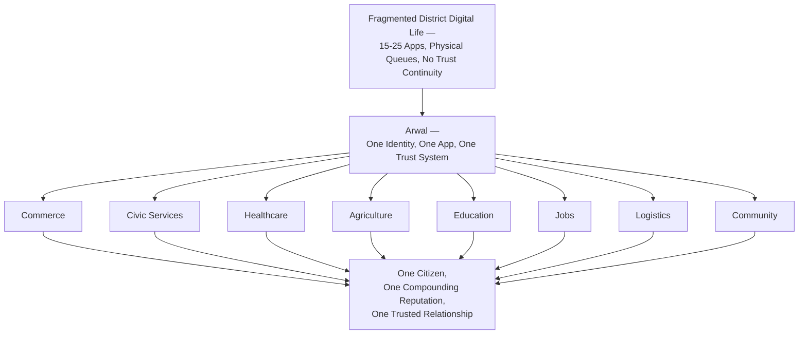

---

# Mission Statement

### Daily Mission

**To be the first application a citizen of Arwal District opens each morning, and the last one they need each night — for commerce, for care, for opportunity, and for governance.**

### Long-Term Mission

**To build the most trusted, most complete, and most accessible digital operating platform a district-level population can depend on — proving a replicable model that carries this trust from one district, to a state, to a national reference standard for civic-commerce infrastructure.**

### Guiding Principles

1. **Citizen dignity is non-negotiable** — no product decision may treat a citizen's time, literacy, or income as an acceptable place to cut corners.
2. **Trust compounds or it doesn't exist** — every module either strengthens the citizen's single reputation and relationship with Arwal, or it is not worth building.
3. **Depth before breadth** — Arwal earns default-app status in one district honestly before it claims to serve a second.
4. **Government and commerce are co-equal** — neither is permitted to subsidize, distort, or overshadow the other in product priority.
5. **What is built once must work everywhere** — a feature designed only for the urban, literate, well-connected user is an incomplete feature, not a finished one.

---

# Product Philosophy

Every principle below exists because a district super app that gets it wrong does not fail quietly — it fails a citizen who had no alternative.

### Citizen-First Design

**Why it exists:** A platform serving government, healthcare, and payments cannot treat the citizen as a segment to be monetized first and served second. Every design decision is evaluated first against "does this genuinely help the citizen," and only then against commercial upside — because a citizen-first platform is also, provably, the platform most likely to be trusted with sensitive data at scale.

### Simplicity

**Why it exists:** A first-generation smartphone user and a power user must both succeed. Complexity that is not earned by genuine user need is a tax paid disproportionately by the citizens Arwal exists to serve first — the rural, the low-literacy, the first-time digital user.

### Accessibility

**Why it exists:** A district population spans wide variance in literacy, language, income, and physical ability. An app that is merely "compliant" with accessibility standards is treating accessibility as a checkbox; Arwal treats it as an equity mandate, because excluding a citizen from a government-equivalent service is a form of harm no commercial feature can offset.

### Trust

**Why it exists:** Arwal's entire structural advantage over single-purpose competitors is that trust compounds across verticals. If trust breaks in one vertical — a leaked record, an unresolved dispute — it does not stay contained to that vertical; it threatens the whole identity. Trust must therefore be engineered deliberately, not assumed as a byproduct of good UX.

### Privacy

**Why it exists:** Arwal is a custodian of identity, payment, and health data whose misuse could cause irreversible harm to a citizen with limited recourse. Privacy-by-design and data minimization are prerequisites for the trust this platform's entire value proposition depends on — never a feature traded away for growth.

### Inclusiveness

**Why it exists:** A super app that quietly optimizes for its most profitable segment (urban, affluent, digitally fluent) while nominally "supporting" everyone else has failed its civic mandate even while succeeding commercially. Inclusiveness is measured, not assumed.

### Reliability

**Why it exists:** When a citizen depends on Arwal for a hospital booking or a government deadline, "the app was down" is not a minor inconvenience — it can mean a missed appointment or a missed subsidy window. Reliability is a trust signal before it is an engineering metric.

### Local Empowerment

**Why it exists:** Arwal exists to strengthen the district's own economy and institutions, not to extract value from them on behalf of a distant platform. A local merchant, farmer, or service worker must end up structurally better off for having joined Arwal, not merely digitally present.

### Digital Inclusion

**Why it exists:** Digital fragmentation is itself a form of inequality (per `ai-docs/00-project-vision.md`). A platform that only serves the already-digitally-included has replicated the exclusion it was built to solve, in a new medium.

### Data-Driven Decisions

**Why it exists:** A civic-commercial platform operating at district-then-state scale cannot afford decisions made on anecdote or seniority alone — not because data is more virtuous than judgment, but because the stakes (a citizen's healthcare booking, a farmer's livelihood) are too high to risk on an untested assumption when evidence is available.

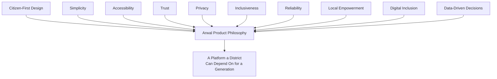

---

# Strategic Objectives

Every Strategic Objective below is measurable, reviewable at the cadence defined in Governance Review, and traceable back to the Product Vision above — an objective that cannot be traced is not eligible for roadmap placement, mirroring the identical Strategic Alignment discipline already established in `ai-docs/38-engineering-portfolio-program-management-standards.md` and `ai-docs/48-engineering-strategic-planning-standards.md`.

| Strategic Objective | Measurable Target Direction | Traces To |
|---|---|---|
| **Citizen Adoption** | Monthly Active Users as % of district population, growing toward district-majority penetration | Product Vision's "default digital layer" aspiration |
| **Service Digitization** | Count of government services initiable and trackable end-to-end without a physical visit | Mission's "governance" pillar |
| **Economic Growth** | Aggregate GMV/GSV flowing through local merchants and service providers, with healthy contribution margin | Local Empowerment principle |
| **Farmer Empowerment** | % of registered farmers actively using mandi price, weather, or scheme-discovery features monthly | Digital Inclusion principle |
| **Healthcare Access** | Reduction in average time-to-appointment for discoverable local healthcare providers | Citizen-First Design principle |
| **Education Improvement** | Count of students/learners connected to tutors, coaching centers, or skill resources through the platform | Local Empowerment principle |
| **Employment Generation** | Count of verified jobs, gigs, or service bookings fulfilled through the platform per quarter | Economic Growth objective |
| **Business Enablement** | % of onboarded merchants reporting measurable income improvement attributable to Arwal | Local Empowerment principle |
| **Government Efficiency** | Reduction in average government service completion time for citizens using Arwal's civic modules | Trust and Government Coordination goals |

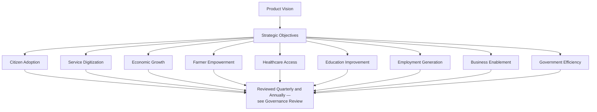

---

# Value Proposition

### Stakeholder Value Map

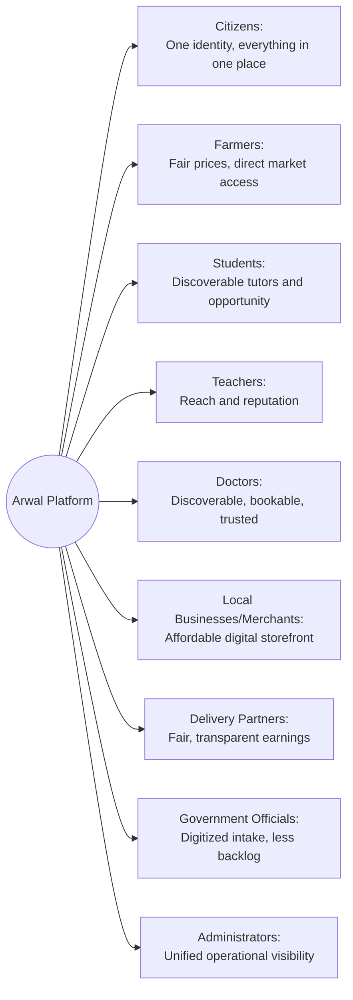

| Stakeholder | Value Proposition |
|---|---|
| **Citizens** | One trusted identity for commerce, care, and governance — no more juggling 15–25 apps or resetting reputation with every new service. |
| **Farmers** | Real-time mandi prices, weather intelligence, and government scheme discovery in one voice-friendly, low-literacy place — reducing dependency on underquoting middlemen. |
| **Students** | Discovery of tutors, coaching centers, and skill-development resources matched to real local opportunity, not generic national content. |
| **Teachers** | A verified, ratable reputation and reach beyond word-of-mouth referral, compounding over time. |
| **Doctors** | Discoverability, appointment management, and a trust layer that reduces no-shows and builds a portable local reputation. |
| **Local Businesses** | A zero/low-cost digital storefront without needing technical skill, reaching hyperlocal customers with same-day fulfillment potential. |
| **Merchants** | Simple order, inventory, and payment management from a single dashboard designed for their actual skill level. |
| **Delivery Partners** | Transparent, fair compensation and efficient routing, replacing today's opaque informal arrangements. |
| **Government Officials** | Digitized application intake, status tracking, and citizen communication, reducing physical queue burden and backlog. |
| **Administrators** | Unified operational tooling to monitor platform health, fraud signals, and verification workflows as volume scales. |

---

# Target Audience

### Primary Users

- **General citizens** of Arwal District spanning urban headquarters, semi-urban towns, and rural villages, across the full range of literacy and device capability.
- **Local merchants, restaurants, and service providers** seeking affordable digital reach.
- **Farmers** needing market, weather, and scheme intelligence.

### Secondary Users

- **Government officials and department administrators** seeking a digital citizen-service channel.
- **Delivery partners** seeking transparent, schedulable work.
- **Students, teachers, and healthcare providers** seeking discoverability and reputation.

### Future Users (Expansion Horizon)

- Residents of **adjacent districts**, once the founding-district model is proven and replicable.
- **State-level government departments** seeking formal digital-partnership integration.
- **Trusted third-party developers and businesses**, once platform trust and security maturity justify an open ecosystem phase.

### Demographics and Digital Literacy Considerations

| Segment | Device Profile | Literacy Consideration | Design Response |
|---|---|---|---|
| Rural, low-income | Entry-level Android, intermittent 2G/3G | Basic reading, voice-preferred | Voice-first, offline-caching, large-target UI |
| Semi-urban, mixed literacy | Mid-range Android, inconsistent 4G | Moderate literacy | Simplified language mode, assisted/delegated access |
| Urban, digitally fluent | Mid-to-high-range smartphone, stable 4G | Fully digital-native | Full-featured, fast, multi-payment-method experience |
| Elderly / non-digital-native | Shared or borrowed device | Low digital literacy | Assisted mode, family delegation, high-contrast UI |

---

# Market Positioning

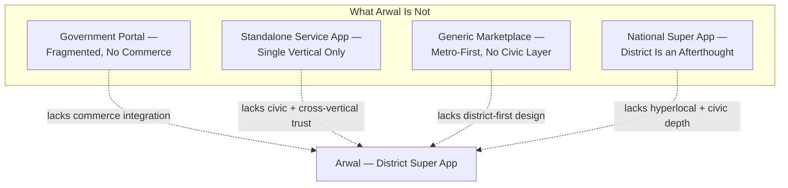

| Category | What They Do Well | What They Structurally Cannot Do | Arwal's Position |
|---|---|---|---|
| **Traditional Government Portals** | Official authority, legal validity | Poor UX, fragmented across departments, zero integration with a citizen's commercial life | Arwal treats civic services as co-equal to commerce within one identity, not a separate universe |
| **Standalone Service Apps** (single-vertical: food, home services, classifieds) | Deep, focused feature sets in one category | No cross-vertical trust compounding; district-tier density is often thin | Arwal's reputation, identity, and history compound across every vertical a citizen touches |
| **Generic National Marketplaces** | Broad catalog, logistics scale | District/rural users are a low roadmap priority; no hyperlocal, village-level fulfillment focus | Arwal is designed district-first, not retrofitted from a metro-first product |
| **Other Super Apps (national/international)** | Bundled convenience across a few verticals | Rarely include genuine civic/government integration; rarely built for the specific device/network/literacy profile of a district population | Arwal is civic-commercial infrastructure — government-equal-to-commerce, built for the actual conditions of a district |

**Arwal's unique position:** it is structurally impossible for any single-purpose competitor to replicate without becoming Arwal itself — because doing so requires unifying commerce, services, civic access, healthcare, education, and agriculture under one identity with one trust system, which no existing platform's business model or organizational mandate incentivizes (see `ai-docs/01-product-goals.md`'s Competitive Advantages for the full comparative analysis this document does not restate).

---

# Business Strategy

### Sustainable Growth

Growth is pursued in the sequence already established in `ai-docs/00-project-vision.md`'s Future Expansion Strategy: depth before breadth in the founding district, proven unit economics before geographic replication, and diversified revenue (commerce commissions, service fees, delivery logistics, promoted listings, government facilitation fees, and later fintech) so no single vertical is a point of commercial failure.

### Platform Expansion

Expansion to a second district, and eventually the state, follows a **configuration-driven replication model**, never a rebuild: language, geography, local-partner, and district-identifier configuration are externalized from Phase 1 so a new district is a deployment decision, not an engineering project.

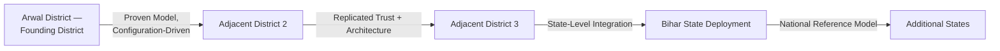

### Partnership Strategy

- **Government partnerships** are pursued as durable, department-level integrations designed to add standalone civic value even absent full government cooperation, insulating the platform from any single administrative transition or political cycle.
- **Merchant and service-provider partnerships** prioritize radical onboarding simplicity as a Must-Have, never a later optimization, since supply-side density is the platform's foundational dependency.
- **Logistics and fintech partnerships** are layered in as trust and compliance maturity justify them, never ahead of that maturity.

### Ecosystem Development

Arwal's long-term ecosystem strategy follows the Future Expansion Strategy's Open Ecosystem Phase: platform APIs are opened to trusted third parties only after core identity, payment, and trust rails have demonstrated multi-year reliability — never as an early-stage growth shortcut.

### Innovation Strategy

Innovation (AI-assisted discovery, a civic assistant, fraud intelligence) is pursued as a structural capability layered across the platform, governed by the AI Principle below and by `ai-docs/48-engineering-strategic-planning-standards.md`'s AI Vision — never as a standalone gimmick disconnected from the core citizen journeys.

### Public-Private Collaboration

Arwal is deliberately positioned as **public-purpose private infrastructure**: commercially sustainable enough to fund its own continuous investment, civic in responsibility enough that a government partner can recognize it as a genuine extension of public service delivery, and structured so that neither commitment is allowed to compromise the other.

---

# Product Success Metrics

### North Star Metrics

| North Star Metric | Definition | Why It's the North Star |
|---|---|---|
| **District Trust Signal** | Independent citizen trust survey result (safe, fair, genuinely useful) | The only metric that directly measures whether the mission itself is being achieved |
| **Cross-Vertical Adoption Depth** | Average number of distinct verticals (commerce, services, civic, etc.) used per active citizen | Directly measures whether Arwal is becoming the "one app," not just one of many |
| **Civic Impact** | Average reduction in time to complete a government service, vs. pre-Arwal baseline | Measures the civic half of the mission with the same rigor as the commercial half |
| **Sustainable Growth** | GMV/GSV growth with healthy contribution margin, held alongside stable-or-improving dispute and uptime metrics | Prevents growth from being counted as success when trust or reliability are quietly degrading |

### Full KPI Table

| Category | KPI | Direction |
|---|---|---|
| Adoption | MAU as % of district population | Growing toward district-majority |
| Engagement | WAU/MAU stickiness ratio | Sustained upward trend |
| Service Completion | % of civic applications completed without a physical office visit | Increasing |
| Citizen Satisfaction | CSAT/NPS-equivalent score | Sustained positive trend |
| Economic Impact | Merchant/provider-reported income improvement | Positive and measurable |
| Platform Reliability | Uptime for core citizen flows | 99.9%+ as scale matures |
| Partner Growth | Verified merchants, providers, and government departments onboarded | Steadily increasing |

> **Callout — Metric Discipline**
> Consistent with the North Star Principle already established in `ai-docs/00-project-vision.md`, no metric above is evaluated in isolation. Growth alongside rising disputes or falling uptime is a regression, never a win.

---

# Product Evolution Roadmap

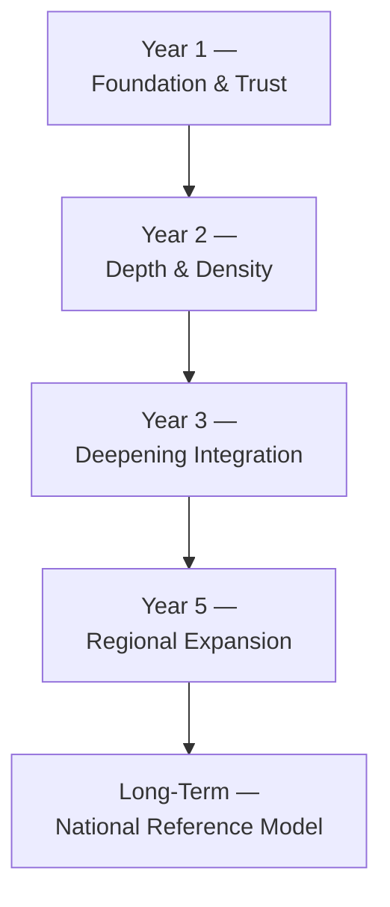

| Horizon | Focus |
|---|---|
| **Year 1** | Core commerce, local services, and unified identity live and reliable; civic pilot services launched; initial trust mechanisms proven at real (if modest) scale. |
| **Year 2** | Merchant/provider density reaches critical mass; healthcare and expanded civic coverage introduced; unit economics proven in the founding district. |
| **Year 3** | Full civic-department coverage across most relevant government services; education and agriculture modules mature; early AI-assisted discovery live. |
| **Year 5** | Configuration-driven replication to at least one adjacent district; state-level government integration pursued; cross-district logistics capability built. |
| **Long-Term (7–10 years)** | State-level infrastructure status; responsible fintech/micro-lending introduced once trust justifies it; Arwal established as a national reference model for district-super-app infrastructure, with offline-first resilience at full scale. |

---

# Risks & Strategic Assumptions

| Risk Category | Description | Mitigation Direction |
|---|---|---|
| **Adoption Risk** | Citizens or merchants remain loyal to familiar informal channels despite Arwal's availability. | Radical onboarding simplicity; visible, early trust-building mechanisms. |
| **Regulatory Risk** | Data-protection, health-data, or financial-services regulation changes invalidate a product assumption. | Compliance review gates every sensitive-domain launch; no module bypasses review for speed. |
| **Technology Risk** | A core technology bet fails to mature or scale as expected. | Evidence-based, incremental technology adoption per `ai-docs/48`'s Technology Radar. |
| **Ecosystem Risk** | Merchant, provider, or government-partner density fails to reach the critical mass the model depends on. | Depth-before-breadth sequencing; standalone civic value even absent full government integration. |
| **Financial Risk** | Unit economics fail to prove positive before geographic expansion is attempted. | Explicit Business Goal: prove unit economics in the founding district before scaling geographically. |

### Strategic Assumptions

1. A meaningful majority of the target population owns or has regular access to an Android smartphone.
2. Mobile connectivity, while inconsistent, is present at least intermittently across most of the district.
3. Local merchants and service providers will adopt digital tools if onboarding friction and cost are sufficiently low.
4. District and state government bodies are open to digital partnership, even if formal integration takes time.
5. Citizens will trust a unified platform with sensitive data only if verification, transparency, and dispute resolution are visibly effective from the earliest phases.

---

# AI's Role in the Product

AI is a structural capability woven across citizen journeys, never a bolt-on feature or a replacement for human accountability.

| Application | Role |
|---|---|
| **Citizen Assistant** | Conversational guidance through government processes, form-filling, and eligibility checks in local language and dialect. |
| **Personalized Recommendations** | Hyperlocal-context-aware discovery across commerce, services, and civic content — never generic keyword matching. |
| **Government Assistance** | Helping officials triage, route, and track applications more efficiently, without displacing officer judgment on any individual case. |
| **Agriculture Guidance** | Mandi price and weather-informed guidance, and scheme-eligibility pre-screening for farmers. |
| **Healthcare Support** | Discovery and appointment-guidance support for local healthcare providers and diagnostics. |

### Human Oversight Is Mandatory

Consistent with the AI Principle already established in `ai-docs/00-project-vision.md`: AI in Arwal must always be **explainable and overridable by a human process**. No citizen may be denied a government service, blocked from a transaction, or penalized in reputation solely by an opaque automated decision without a human appeal path. This governance constraint is absolute and takes precedence over any efficiency gain — mirroring the identical Human Oversight standard already established across `ai-docs/24` through `ai-docs/49`.

### Ethical AI and Responsible Data Use

- AI-influenced decisions affecting a citizen's access to a service carry a functioning human-override path, verified per `ai-docs/48-engineering-strategic-planning-standards.md`'s AI Adoption theme.
- Data minimization and explicit consent govern what any AI feature may access, especially for health and government-identity data, per the Security Vision already established in `ai-docs/00-project-vision.md`.
- AI capability is delivered through a provider-agnostic abstraction (per `ai-docs/09-tech-stack.md`, referenced not redefined) to avoid vendor lock-in on a civic-critical capability.

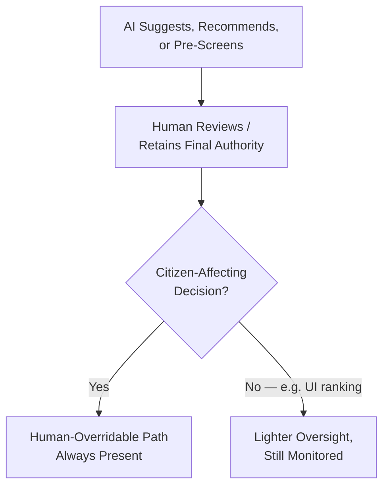

---

# Sustainable Development Alignment

Arwal's mission intersects directly with several United Nations Sustainable Development Goals (SDGs), and product decisions are made with an awareness of this alignment — not as a marketing claim, but as a genuine check on whether the platform is serving its stated civic mandate.

| SDG | Arwal's Contribution |
|---|---|
| **SDG 3 — Good Health and Well-Being** | Healthcare discovery, appointment booking, and diagnostics/pharmacy visibility for underserved rural populations. |
| **SDG 4 — Quality Education** | Discovery of tutors, coaching centers, and skill-development resources, closing an information gap for students outside urban centers. |
| **SDG 8 — Decent Work and Economic Growth** | Fair, transparent bookings and payments for service providers and delivery partners; measurable income improvement for merchants and workers. |
| **SDG 9 — Industry, Innovation and Infrastructure** | Civic-commercial digital infrastructure built for a district's real device and network conditions, not retrofitted from a metro-first product. |
| **SDG 10 — Reduced Inequalities** | Accessibility-first, voice-first, and assisted-access design ensures a low-literacy or low-income citizen is not a second-class user. |
| **SDG 11 — Sustainable Cities and Communities** | A replicable, configuration-driven model for district-level digital infrastructure, extensible to additional communities without a rebuild. |

---

# Strategic Expansion Principles

Arwal's expansion from the founding district to additional districts, and eventually the state, is governed by principles that outrank the commercial appeal of faster growth:

1. **Depth before breadth** — default-app status and proven trust in the founding district precede any geographic expansion decision.
2. **Configuration, not rebuild** — language, geography, and local-partner variability are externalized from Phase 1 so replication is a deployment exercise.
3. **Proven unit economics first** — a district's positive contribution margin is demonstrated before its architecture and business model are replicated elsewhere.
4. **Local trust is earned locally** — a district's government partnerships and merchant density are built fresh in each new district; trust is never assumed to transfer automatically from a prior district's reputation.
5. **State integration follows, never leads** — formal state-level government integration is pursued once district-level civic modules have demonstrated reliability and trust at real scale, per `ai-docs/00-project-vision.md`'s Future Expansion Strategy.

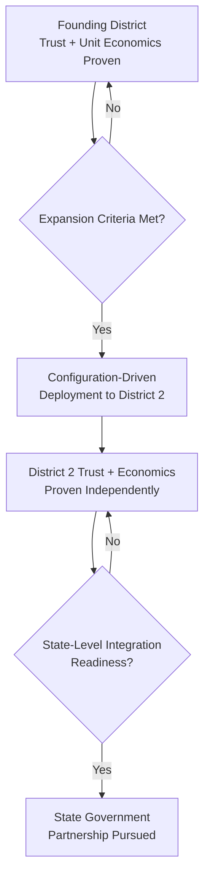

---

# Product Strategy Dependency Map

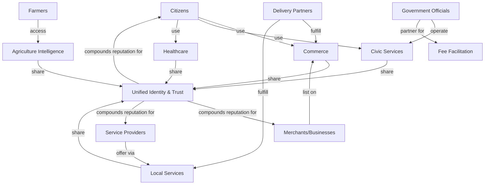

This dependency map illustrates why no module can be evaluated in isolation: every capability draws on, and feeds back into, the same shared Identity & Trust layer that is Arwal's core structural advantage over single-purpose competitors.

---

# Strategic Success Criteria by Horizon

| Horizon | Success Criteria |
|---|---|
| **1 Year** | Core commerce, local services, and unified identity are in daily reliable use; at least one civic service pilot is live and completing applications end-to-end. |
| **3 Years** | Arwal is the default channel for at least two core verticals for a meaningful share of district households; merchant/provider density reaches critical mass; positive unit economics demonstrated. |
| **5 Years** | Configuration-driven replication proven in at least one adjacent district; state-level government integration underway; majority-household default-app status achieved in the founding district for at least three verticals. |
| **10 Years** | Arwal operates as a national reference model for district-super-app infrastructure; multi-district/state-level operation is standard; citizen trust surveys consistently rate the platform as safe, fair, and genuinely useful across every operating district. |

---

# Product Anti-Patterns

| Anti-Pattern | Description | Why It's Rejected |
|---|---|---|
| **Feature bloat** | Adding capability because it is possible, not because it traces to a Strategic Objective. | Dilutes focus and violates the "every feature must trace to the vision" discipline established in this document. |
| **Technology-first thinking** | Choosing a technology or AI capability because it is exciting, before the citizen problem it solves is defined. | Produces solutions that don't fit real district conditions; contradicts Data-Driven Decisions above. |
| **Ignoring citizens** | Designing primarily for digitally fluent, urban personas while underserving rural/low-literacy ones. | Directly violates Citizen-First Design and Inclusiveness above. |
| **Poor accessibility** | Treating WCAG compliance as a checkbox rather than a design floor. | Violates the Accessibility principle's equity mandate. |
| **Siloed modules** | Building verticals that do not share identity, reputation, or trust signals. | Defeats the entire structural advantage — cross-vertical trust compounding — that differentiates Arwal from single-purpose competitors. |
| **Low trust** | Allowing disputes, fraud, or verification gaps to persist because they are commercially inconvenient to fix. | Trust erosion in one vertical threatens the whole platform's identity, per the Trust principle above. |
| **Weak governance** | Product decisions made without traceability to this document's Strategic Objectives or without review at the defined cadence. | Produces exactly the drift this document exists to prevent. |

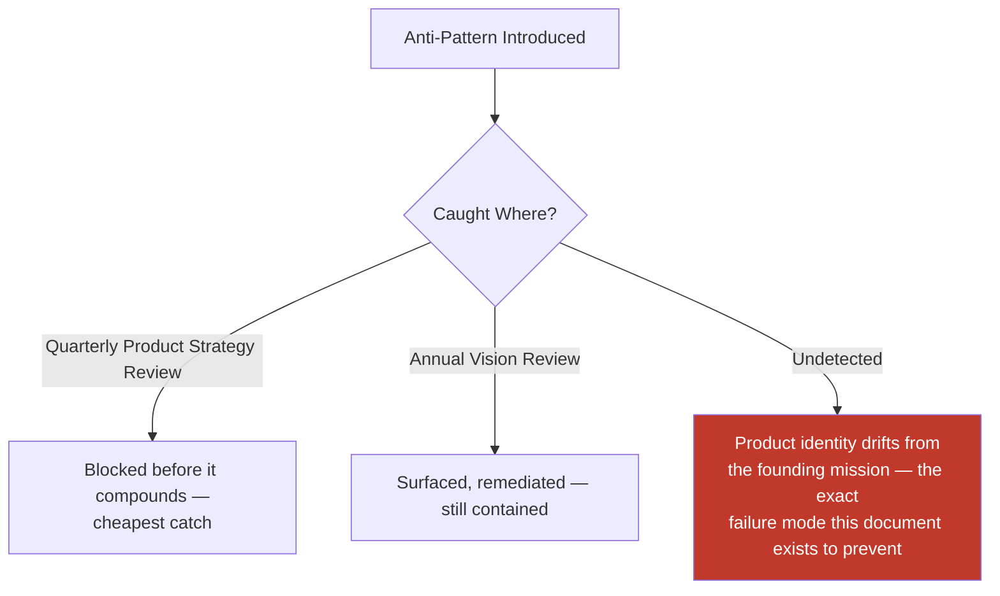

---

# Product Review Checklist

Every Strategic Objective, roadmap milestone, or major product decision is checked against the following before it is considered vision-compliant:

- [ ] **Traceable to the Product Vision** — Never justified by engineering or commercial interest alone.
- [ ] **Measurable success criteria stated** — Per Strategic Objectives and the relevant Strategic Success Criteria horizon.
- [ ] **Consistent with the Product Philosophy** — Citizen-first, simple, accessible, trustworthy, private, inclusive, reliable, locally empowering, digitally inclusive, and data-driven.
- [ ] **Positioned correctly against the Market Positioning table** — Does not quietly drift toward becoming a government portal, a standalone service app, or a generic marketplace.
- [ ] **Checked against North Star Metrics** — No growth claim accepted in isolation from trust and reliability metrics.
- [ ] **AI usage, if any, carries a human-override path** — Per AI's Role in the Product above, no exceptions.
- [ ] **SDG alignment considered where relevant** — Per Sustainable Development Alignment above.
- [ ] **Expansion decisions follow Strategic Expansion Principles** — Depth before breadth, configuration before rebuild, proven economics before replication.
- [ ] **No anti-pattern present** — No feature bloat, technology-first thinking, citizen neglect, poor accessibility, module siloing, low trust, or weak governance.
- [ ] **No duplication of Engineering Principles, System Architecture, Engineering Governance, or Strategic Planning** — Any such concern deferred entirely to its owning phase document, never redefined here.

A decision failing any item above is not considered vision-compliant until resolved.

---

# Governance Review

| Review | Cadence | Owner | Purpose |
|---|---|---|---|
| **Quarterly Product Strategy Review** | Quarterly | CPO, VP Product, Product Leadership | Strategic Objective progress, KPI trend, roadmap adjustment. |
| **Annual Vision Review** | Annual | CEO, CPO, CTO, Chief Strategy Officer | Confirms the Product Vision, Mission, and Market Positioning still hold; amendments follow the same rigor as a Strategic-classification ADR per `ai-docs/25-architecture-decision-records.md`. |
| **KPI Review** | Quarterly | Product Leadership, Engineering Leadership Council | North Star Metrics and full KPI table trend review, cross-referenced against `ai-docs/38`'s Portfolio Metrics and `ai-docs/48`'s Strategic Metrics. |
| **Stakeholder Review** | Semi-annual | CEO, Government Technical Partners, Investor representatives where applicable | Confirms the platform's civic and commercial value proposition remains credible to its most consequential external stakeholders. |

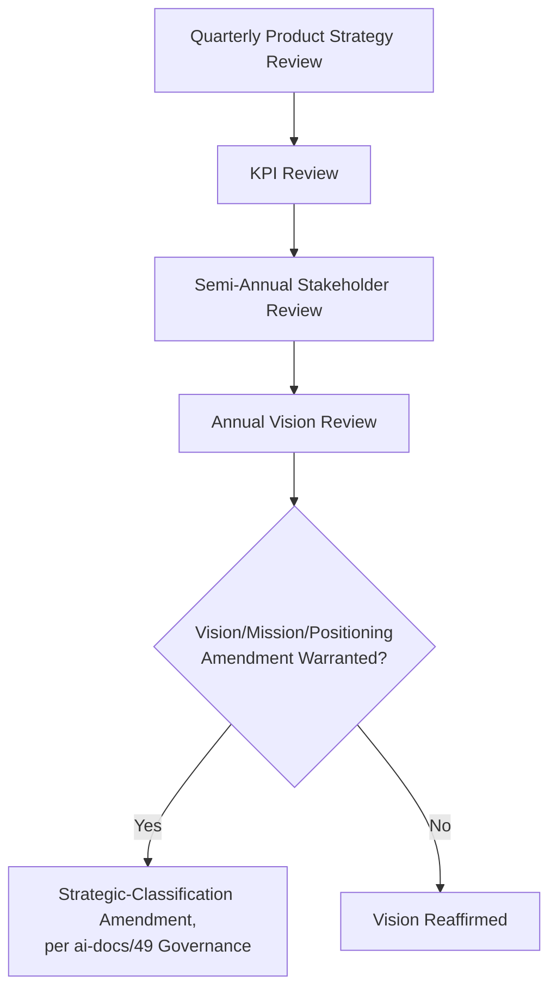

---

# Relationship with Previous Standards

### Project Vision

`ai-docs/00-project-vision.md` establishes Arwal's founding mission, philosophy, and 10-Year Vision Arc. This document translates that founding charter into a product-and-business register a CEO, CPO, and government partner can act on directly — never redefining the founding mission, only making it operational at the product-strategy level.

### Product Goals

`ai-docs/01-product-goals.md` establishes measurable Business, User, Technical, and Functional Goals. This document's Strategic Objectives and Value Proposition are the executive-facing restatement and extension of those same goals, traceable back to them directly rather than inventing a parallel goal set.

### Engineering Principles

`ai-docs/02-engineering-principles.md` and `ai-docs/03-system-architecture-principles.md` govern how Arwal is engineered and architected. This document deliberately does not redefine either — every technical implication of this product vision is executed through those documents' own disciplines.

### Engineering Governance

`ai-docs/29-engineering-governance-decision-authority.md` owns the organizational decision-authority structure this document's Governance Review draws its Approval Authorities from, never inventing a new authority independently.

### Engineering Strategic Planning

`ai-docs/48-engineering-strategic-planning-standards.md` owns the multi-year engineering Vision, Strategic Themes, and Roadmap mechanics. Every engineering Strategic Theme in that document is expected to trace to a Strategic Objective defined here — this document sets the product-and-business direction; that document plans the engineering execution of it.

### Handbook Governance

`ai-docs/49-engineering-handbook-governance-evolution-standards.md` owns the complete lifecycle by which any handbook document — including this one — is proposed, versioned, reviewed, and retired. This document's own future amendments flow through that document's Document Lifecycle, never through an informal edit.

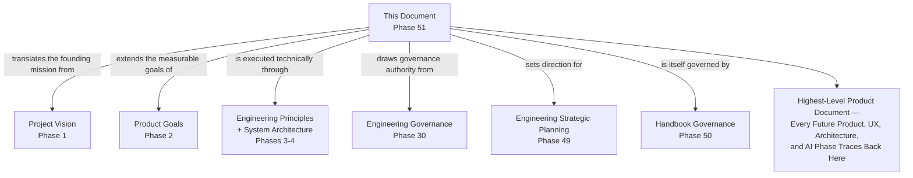

---

# Closing Statement

> **Callout — Closing Statement**
> Arwal begins in a single district, but it is built to become the trusted digital operating platform a much larger population depends on — without ever losing the citizen-first, trust-compounding, inclusive philosophy that makes it worth trusting in the first place. A district super app is not proven by the breadth of its feature list; it is proven by whether a farmer, a shopkeeper, a student, a government officer, and an elderly citizen sharing a phone with his son can each say, honestly, that Arwal made their life measurably better and never made them feel like a second-class user. This document exists so that every product, UX, architecture, AI, and implementation phase that follows can be measured against one durable standard: does this decision make Arwal more trusted, more inclusive, and more genuinely useful to the district it exists to serve — not just today, but for the decades this platform is being built to last. Where a future phase must deviate from a principle stated here, that deviation is made explicitly, through this document's own Governance Review process or a Strategic-classification amendment per `ai-docs/49-engineering-handbook-governance-evolution-standards.md` — never silently, and never by default.

This document, `ai-docs/50-product-vision-business-strategy.md`, is Phase 51 of approximately 420. It is the highest-level product document against which every subsequent product, UX, architecture, AI, and implementation decision in this project will be measured.

**End of Phase 51 — `ai-docs/50-product-vision-business-strategy.md`**
