# Stakeholder Analysis

**Document:** `ai-docs/51-stakeholder-analysis.md`
**Project:** Arwal — The District Super App
**Stage:** 2 — Product & Business Strategy
**Phase:** 52 — Stakeholder Analysis
**Status:** Approved for Product & Engineering Reference
**Audience:** CEO, CPO, CSO, VP Product, VP Engineering, Government Digital Transformation Partners, Public Policy Consultants, Investors, Product Managers, UX Researchers, Service Designers, Architects

> **Callout — Purpose of This Document**
> `ai-docs/00-project-vision.md` established why Arwal exists. `ai-docs/01-product-goals.md` translated that charter into measurable goals. `ai-docs/50-product-vision-business-strategy.md` established what Arwal is, in a form a citizen, a merchant, a government officer, and an investor can each recognize themselves in. None of those documents answers a question every subsequent product, UX, architecture, and AI decision depends on: **who, exactly, is Arwal for — and for each of them, what do they need, what do they fear, what do they hold power over, and what must Arwal give them in return for their trust?** This document is that answer: the complete, authoritative Stakeholder Analysis every future persona (Phase 53) and business domain (Phase 54) traces back to.

---

# Purpose of this Document

### Why Stakeholder Identification Matters

A district super app touches more distinct categories of human being than almost any product category in existence — a farmer checking a mandi price, a government officer processing a certificate, a delivery partner routing between two orders, a hospital administrator managing appointment slots, an NGO field worker helping an elderly citizen complete a form. Each of these people has a different relationship to Arwal: different goals, different constraints, different levels of power over whether the platform succeeds, and different tolerances for the platform getting it wrong. A product built without an explicit, written accounting of every one of these relationships will inevitably serve some of them by accident and neglect others by omission — never by a considered choice anyone can defend later.

Stakeholder identification exists to convert an implicit, assumed understanding of "who uses Arwal" into an explicit, complete, and citable inventory — one every subsequent phase document can reference rather than re-derive from first principles.

### Why Stakeholder Alignment Reduces Project Risk

Per the identical Evidence-Based Decisions and Traceability principles already established throughout `ai-docs/29-engineering-governance-decision-authority.md` and `ai-docs/48-engineering-strategic-planning-standards.md`, a decision that cannot be traced to a real stakeholder need is a decision made on assumption, not evidence. Unaligned stakeholders are Arwal's single largest source of unmanaged project risk:

- **Adoption risk** — a feature built for an assumed user who does not match the real user fails silently, discovered only after launch.
- **Trust risk** — a stakeholder whose needs are structurally deprioritized (a low-literacy citizen, a rural farmer) eventually experiences the platform as exclusionary, undermining the cross-vertical trust compounding that is Arwal's core structural advantage per `ai-docs/50-product-vision-business-strategy.md`.
- **Governance risk** — a government partner whose actual decision authority was never mapped correctly produces a partnership that stalls or reverses at the exact moment it is most needed.
- **Commercial risk** — a merchant or service-provider stakeholder whose real pain points were never captured produces low supply-side density, starving the entire platform of the local catalog depth its value proposition depends on.

A stakeholder analysis performed once, rigorously, and kept current is materially cheaper than discovering any of the above in production, at scale, with a citizen's certificate, health booking, or livelihood on the line.

### Balancing Public and Commercial Interests

Arwal is deliberately positioned, per `ai-docs/50-product-vision-business-strategy.md`, as **public-purpose private infrastructure** — commercially sustainable, but civic in responsibility. That positioning is only real if this document treats a citizen's need and a government partner's mandate with the same rigor it applies to a merchant's revenue interest or an investor's return expectation. This document does not rank stakeholders by commercial value; it ranks them by their actual relationship to the platform's mission, and it makes the tensions between stakeholder interests — a merchant wanting higher visibility, a citizen wanting neutral ranking; a delivery partner wanting more orders, a citizen wanting fair pricing — explicit rather than resolved silently in whichever direction is commercially convenient that quarter.

### Scope Boundary

This document does not redefine Product Vision (`ai-docs/50-product-vision-business-strategy.md`), Product Goals (`ai-docs/01-product-goals.md`), Engineering Governance (`ai-docs/29-engineering-governance-decision-authority.md`), or Organizational Structure (`ai-docs/47-engineering-organizational-scaling-standards.md`). Every one of those remains fully authoritative for its own domain. This document's exclusive territory is **stakeholder identity, need, power, and relationship** — the input every future Persona document (Phase 53) and Business Domain document (Phase 54) must trace back to, per the Traceability Requirement at the foot of this document.

---

# Stakeholder Analysis Philosophy

Every principle below exists because a district-scale civic-commercial platform that gets stakeholder relationships wrong does not fail quietly — it fails a citizen, a farmer, or a government partner who had limited alternatives to begin with.

### Citizen-First

**Why it exists:** Every stakeholder category in this document ultimately exists to serve, work alongside, or govern on behalf of the citizen. Where two stakeholder interests conflict and no other principle resolves the tension, the citizen's interest is the tie-breaker — mirroring the identical tie-breaking role Citizen Dignity plays in `ai-docs/00-project-vision.md`'s Guiding Principles.

### Mutual Value Creation

**Why it exists:** A stakeholder relationship that only extracts value (data, attention, commission) without returning proportionate value is not a partnership — it is exploitation the stakeholder will eventually route around. Every stakeholder entry in this document states, explicitly, what Arwal receives from them and what they receive from Arwal, so an asymmetric relationship is visible and correctable before it erodes trust.

### Transparency

**Why it exists:** A stakeholder cannot make an informed decision to trust, adopt, or partner with Arwal if the platform's intentions toward them are opaque. Transparency about ranking logic, fee structures, dispute processes, and data use is what lets a merchant, a citizen, or a government officer verify that Arwal's stated commitments match its actual behavior.

### Accountability

**Why it exists:** Every stakeholder relationship in this document has a named internal owner (see Stakeholder Registry). A relationship with no accountable owner degrades identically to an unowned system in `ai-docs/33-engineering-knowledge-management-standards.md` — nobody notices when it starts failing until a citizen or partner escalates loudly enough to force attention.

### Inclusiveness

**Why it exists:** A stakeholder list that implicitly excludes the elderly, the low-literacy, persons with disabilities, or economically weaker sections has already failed the civic mandate this platform exists to serve, regardless of how well it serves the stakeholders it did remember to list. This document treats underserved and vulnerable populations as first-class stakeholder categories, never an afterthought appended to a "general citizen" entry.

### Trust

**Why it exists:** Per `ai-docs/50-product-vision-business-strategy.md`, trust is Arwal's core structural advantage and it compounds — or erodes — across every stakeholder relationship simultaneously. A dispute mishandled with one merchant is a trust signal read by every merchant; a government partnership handled with integrity in one department is a credential every other department can rely on.

### Long-Term Relationships

**Why it exists:** Arwal is infrastructure built for a generation, per `ai-docs/00-project-vision.md`. A stakeholder relationship optimized for a single transaction (a one-time onboarding push, a single election-cycle government partnership) is optimized for the wrong time horizon. This document evaluates every relationship against its durability across years, not its convenience this quarter.

### Ethical Decision-Making

**Why it exists:** Several stakeholder categories in this document (children accessing education content, patients accessing health services, low-literacy citizens navigating government forms) are inherently vulnerable to being disadvantaged by a design decision made carelessly. Ethical decision-making means every stakeholder-affecting choice is evaluated for its effect on the least powerful party in the relationship, not only the most commercially significant one.

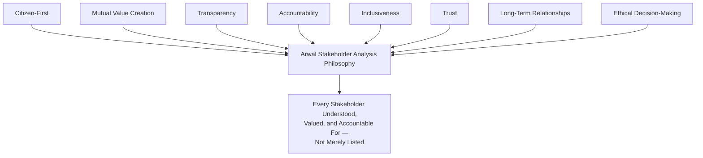

> **Callout — The One-Sentence Stakeholder Philosophy**
> *"A platform that cannot name, in writing, what it owes a stakeholder and what it expects in return does not yet have a relationship with them — it has an assumption."*

---

# Stakeholder Classification Framework

Every stakeholder in this document belongs to one or more of ten classification dimensions — a stakeholder is frequently primary *and* internal, or external *and* regulatory; classification is additive, not mutually exclusive, and every classification determines a different governance obligation.

| Classification | Definition | Governance Implication |
|---|---|---|
| **Primary** | A stakeholder whose direct use of, or direct effect on, the platform is central to Arwal's mission — the platform fails its purpose if this group is neglected. | Requires a dedicated persona (Phase 53), direct research cadence, and representation in every major product decision. |
| **Secondary** | A stakeholder affected by or benefiting from the platform indirectly, without being a direct daily user. | Consulted, not necessarily empowered, in product decisions; monitored for downstream impact. |
| **Internal** | A stakeholder inside Arwal's own organization, accountable for building, operating, or governing the platform. | Governed by `ai-docs/29` through `ai-docs/49`'s organizational and engineering standards; this document addresses only their stakeholder-facing responsibilities. |
| **External** | A stakeholder outside Arwal's organizational boundary. | Requires an explicit communication channel and relationship owner, per Stakeholder Registry below. |
| **Strategic** | A stakeholder whose relationship shapes multi-year direction (a government department, a major financial partner). | Reviewed at the Annual Stakeholder Strategy Review; escalations reach CEO/CPO level. |
| **Operational** | A stakeholder whose relationship is managed through day-to-day operational processes (support, onboarding, dispute resolution). | Reviewed at Quarterly Stakeholder Review; escalations reach Operations/Customer Success. |
| **Regulatory** | A stakeholder with legal or compliance authority over some or all of Arwal's operation. | Governed jointly with `ai-docs/40-engineering-compliance-audit-standards.md`; non-negotiable obligations. |
| **Community** | A stakeholder representing a collective, non-transactional interest (an NGO, a self-help group, a community leader). | Engaged through Community Engagement channels (see Stakeholder Communication Strategy). |
| **Supporting** | A stakeholder providing infrastructure, capability, or capital Arwal depends on but does not directly serve. | Governed jointly with `ai-docs/09-tech-stack.md`'s Third-Party Service Policy and `ai-docs/28-dependency-governance-standards.md`. |
| **Future** | A stakeholder not yet active but anticipated by Arwal's expansion strategy (a resident of an adjacent district, a state government department). | Tracked for readiness; not yet subject to active relationship management. |

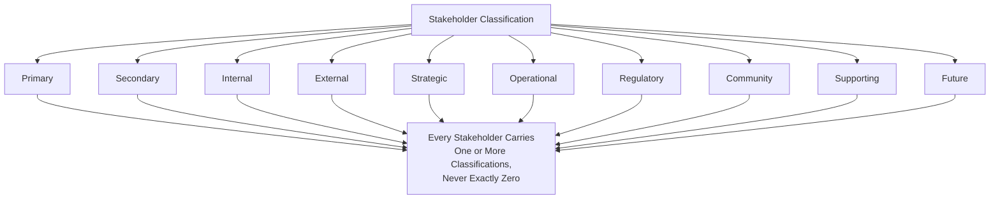

---

# Stakeholder Registry

Every stakeholder category identified in this document is recorded in a single, authoritative registry — mirroring the identical Registry discipline already established for Ownership (`ai-docs/47-engineering-organizational-scaling-standards.md`) and Dependencies (`ai-docs/38-engineering-portfolio-program-management-standards.md`).

| Field | Description |
|---|---|
| **Stakeholder ID** | A permanent, sequential identifier (`STK-001`), never reused. |
| **Name** | The stakeholder category's name. |
| **Classification** | One or more of the ten types above. |
| **Description** | A one-paragraph account of who this stakeholder is. |
| **Internal Owner** | The named role/team accountable for this relationship (e.g., "Head of Merchant Success"). |
| **Primary Communication Channel** | The default channel used to reach this stakeholder, per Stakeholder Communication Strategy below. |
| **Review Frequency** | How often this relationship is formally reviewed. |
| **Related Persona (Phase 53)** | Cross-reference, populated when Phase 53 is published. |
| **Related Business Domain (Phase 54)** | Cross-reference, populated when Phase 54 is published. |

### Registry Excerpt (Primary and Selected Supporting/Internal Stakeholders)

| ID | Name | Classification | Internal Owner | Primary Channel | Review Frequency |
|---|---|---|---|---|---|
| STK-001 | Citizens (General) | Primary, External | VP Product | In-app notification, Citizen Advisory Council | Quarterly |
| STK-002 | Farmers | Primary, External, Community | Head of Agriculture Vertical | Voice IVR, field agents, in-app | Quarterly |
| STK-003 | Students | Primary, External | Head of Education Vertical | In-app, school/coaching partnerships | Quarterly |
| STK-004 | Teachers | Primary, External | Head of Education Vertical | In-app, guild/community sessions | Semi-Annual |
| STK-005 | Parents | Primary, External | Head of Education Vertical | In-app, SMS | Semi-Annual |
| STK-006 | Doctors | Primary, External | Head of Healthcare Vertical | In-app, clinic onboarding team | Quarterly |
| STK-007 | Clinics | Primary, External | Head of Healthcare Vertical | Partner success manager | Quarterly |
| STK-008 | Hospitals | Primary, External, Strategic | Head of Healthcare Vertical | Partner success manager, formal MOU | Semi-Annual |
| STK-009 | Pharmacies | Primary, External | Head of Healthcare Vertical | In-app, partner success manager | Quarterly |
| STK-010 | Local Businesses | Primary, External | Head of Merchant Success | Merchant dashboard, field onboarding | Quarterly |
| STK-011 | Merchants (Marketplace Sellers) | Primary, External | Head of Merchant Success | Merchant dashboard | Quarterly |
| STK-012 | Delivery Partners | Primary, External | Head of Logistics | In-app, partner support line | Monthly |
| STK-013 | Property Owners | Primary, External | Head of Classifieds/Property | In-app | Semi-Annual |
| STK-014 | Tenants | Primary, External | Head of Classifieds/Property | In-app | Semi-Annual |
| STK-015 | Job Seekers | Primary, External | Head of Jobs Vertical | In-app, SMS | Quarterly |
| STK-016 | Employers | Primary, External | Head of Jobs Vertical | In-app, partner success manager | Quarterly |
| STK-017 | Government Officials | Primary, External, Regulatory, Strategic | Head of Government Partnerships | Formal liaison, MOU review meetings | Quarterly |
| STK-018 | District Administration | Primary, External, Regulatory, Strategic | CEO / Head of Government Partnerships | Formal liaison | Semi-Annual |
| STK-019 | NGOs | Supporting, External, Community | Head of Community Engagement | Partnership meetings | Semi-Annual |
| STK-020 | Banks | Supporting, External | Head of Payments | Formal partnership review | Semi-Annual |
| STK-021 | Payment Providers | Supporting, External | Head of Payments | Technical account management | Quarterly |
| STK-022 | Educational Institutions | Supporting, External | Head of Education Vertical | Partnership meetings | Semi-Annual |
| STK-023 | Farmer Cooperatives | Supporting, External, Community | Head of Agriculture Vertical | Field agents, cooperative liaison | Semi-Annual |
| STK-024 | Self-Help Groups (SHGs) | Supporting, External, Community | Head of Community Engagement | Field agents | Semi-Annual |
| STK-025 | Logistics Partners | Supporting, External | Head of Logistics | Technical account management | Quarterly |
| STK-026 | Technology Partners | Supporting, External | CTO / Platform Team | Vendor management | Per `ai-docs/28` cadence |
| STK-027 | Telecom Providers | Supporting, External | Head of Infrastructure | Vendor management | Semi-Annual |
| STK-028 | Legal Advisors | Supporting, External | Compliance Officer | Direct engagement | As needed / Quarterly |
| STK-029 | Senior Citizens | Primary, External, Community (Vulnerable) | Head of Accessibility & Inclusion | Assisted-mode channels, family delegation | Quarterly |
| STK-030 | Persons with Disabilities | Primary, External (Vulnerable) | Head of Accessibility & Inclusion | Accessible support channels | Quarterly |
| STK-031 | Low-Literacy Users | Primary, External (Vulnerable) | Head of Accessibility & Inclusion | Voice-first, field agents | Quarterly |
| STK-032 | Migrant Workers | Primary, External (Vulnerable) | Head of Jobs Vertical | SMS, community networks | Semi-Annual |
| STK-033 | Women's Self-Help Groups | Primary/Supporting, External, Community (Vulnerable) | Head of Community Engagement | Field agents, cooperative liaison | Semi-Annual |
| STK-034 | Economically Weaker Sections | Primary, External (Vulnerable) | Head of Accessibility & Inclusion | Field agents, government scheme integration | Quarterly |
| STK-035 | Product Team | Internal | CPO | Internal standups, roadmap reviews | Continuous |
| STK-036 | Engineering | Internal | CTO / VP Engineering | Internal, per `ai-docs/29` | Continuous |
| STK-037 | Design | Internal | Head of Design | Internal design reviews | Continuous |
| STK-038 | QA | Internal | QA Lead | Internal, per `ai-docs/15` | Continuous |
| STK-039 | Customer Support | Internal | Head of Customer Success | Internal, support tooling | Continuous |
| STK-040 | Operations | Internal | Head of Operations | Internal | Continuous |
| STK-041 | AI Team | Internal | Head of AI Platform | Internal, per `ai-docs/09` | Continuous |
| STK-042 | Security Team | Internal | CISO | Internal, per `ai-docs/10` | Continuous |
| STK-043 | Compliance Team | Internal | Compliance Officer | Internal, per `ai-docs/40` | Continuous |
| STK-044 | Leadership | Internal, Strategic | CEO | Executive reviews | Continuous |
| STK-045 | Investors | Strategic, External, Future/Supporting | CEO / CFO | Board reporting | Quarterly |
| STK-046 | Adjacent-District Residents | Future, External | CPO / Head of Expansion | N/A — anticipatory only | Annual |
| STK-047 | State Government Departments | Future, External, Regulatory, Strategic | CEO / Head of Government Partnerships | N/A — anticipatory only | Annual |

> **Callout — Registry Is a Living Document**
> The Stakeholder Registry is reviewed and updated at every Quarterly Stakeholder Review (see Governance Review below); a stakeholder category added, merged, or retired outside that cadence is treated as an exception requiring Head of Product sign-off, mirroring the Exception Governance discipline already established in `ai-docs/46-engineering-architecture-governance-standards.md`.

---

# Primary Stakeholders

Each primary stakeholder below is analyzed across Purpose, Goals, Pain Points, Needs, Digital Literacy, Device Usage, Accessibility Needs, Trust Expectations, Success Metrics, and Relationship with Arwal. This analysis is the direct input to each stakeholder's Phase 53 persona and Phase 54 business-domain mapping.

### Citizens (General)

- **Purpose:** The foundational stakeholder — every other stakeholder ultimately exists to serve, or is served alongside, the citizen.
- **Goals:** Discover and transact with local commerce and services; access government services without repeated physical visits; trust that ratings and dispute resolution are real.
- **Pain Points:** Juggling 15–25 disconnected apps; no continuity of identity or reputation across services; opaque government processes; inconsistent experience across devices.
- **Needs:** One identity, one wallet, reliable offline-capable core flows, transparent dispute resolution.
- **Digital Literacy:** Spans first-generation smartphone users to fully digital-native, per `ai-docs/01-product-goals.md`'s Target Audience.
- **Device Usage:** Predominantly entry-to-mid-range Android; meaningful 2G/3G population share.
- **Accessibility Needs:** WCAG 2.2 AA minimum per `ai-docs/12-accessibility-standards.md`; voice-first and assisted modes for low-literacy and elderly segments.
- **Trust Expectations:** Verified merchants/providers, enforced dispute resolution, transparent data use, no dark patterns.
- **Success Metrics:** MAU as % of district population; District Trust Signal; Cross-Vertical Adoption Depth (`ai-docs/50`).
- **Relationship with Arwal:** The central, non-negotiable relationship every other stakeholder's value is ultimately measured against.

### Farmers

- **Purpose:** Access market intelligence, weather data, government schemes, and direct-to-buyer sales.
- **Goals:** Fair mandi prices without middleman underquoting; timely weather alerts; subsidy eligibility clarity.
- **Pain Points:** Information asymmetry with middlemen; scheme information rarely reaches them directly; low-connectivity villages.
- **Needs:** Voice-assisted access, offline caching of prices/weather, simplified language.
- **Digital Literacy:** Often basic reading; strong preference for voice/audio.
- **Device Usage:** Entry-level Android, intermittent 2G/3G.
- **Accessibility Needs:** Voice-first interaction, regional dialect support, large-target UI.
- **Trust Expectations:** Prices reflect genuine market data, not platform-favored buyers.
- **Success Metrics:** % of registered farmers actively using price/weather/scheme features monthly (Farmer Empowerment KPI, `ai-docs/50`).
- **Relationship with Arwal:** A Must-Have persona whose neglect directly contradicts the Inclusion-over-Optimization founding pillar (`ai-docs/00-project-vision.md`).

### Students

- **Purpose:** Discover tutors, coaching centers, and skill-development resources matched to real local opportunity.
- **Goals:** Find relevant, affordable learning resources; discover scholarships and local opportunities.
- **Pain Points:** No consolidated platform connecting students to tutors/coaching centers; generic national content that ignores local context.
- **Needs:** Localized discovery, transparent tutor/coaching-center ratings.
- **Digital Literacy:** Generally moderate to high among the student population.
- **Device Usage:** Entry-to-mid-range smartphones, shared-device scenarios common.
- **Accessibility Needs:** Simplified-language mode for younger or lower-literacy students.
- **Trust Expectations:** Genuine, unmanipulated ratings of tutors and coaching centers.
- **Success Metrics:** Count of students connected to tutors/resources (Education Improvement KPI, `ai-docs/50`).
- **Relationship with Arwal:** Secondary-to-primary depending on module maturity; Should-Have priority per `ai-docs/01-product-goals.md`.

### Teachers

- **Purpose:** Build a discoverable, verified reputation and reach beyond word-of-mouth referral.
- **Goals:** Steady student inquiries; a portable reputation that compounds over time.
- **Pain Points:** Currently discovered only through informal referral; no way to demonstrate reliability to new students.
- **Needs:** Verified profile, transparent ratings, simple scheduling.
- **Digital Literacy:** Moderate to high.
- **Device Usage:** Mid-range smartphone typical.
- **Accessibility Needs:** Standard WCAG compliance; no specialized needs beyond general accessibility floor.
- **Trust Expectations:** Ratings genuinely reflect performance, not platform manipulation or pay-for-visibility.
- **Success Metrics:** Reputation-score growth; repeat-student rate.
- **Relationship with Arwal:** Supply-side stakeholder for the Education vertical; success measured jointly with Student outcomes.

### Parents

- **Purpose:** Oversee and, where needed, delegate access to education and civic services on behalf of children or dependents.
- **Goals:** Safe, age-appropriate discovery of educational resources; visibility into a child's learning engagement where applicable.
- **Pain Points:** Lack of trusted, verified information about local coaching quality; concern about online safety for minors.
- **Needs:** Assisted/delegated access modes; clear parental-oversight controls where minors are involved.
- **Digital Literacy:** Wide variance, often lower than the student themselves in rural households.
- **Device Usage:** Frequently a shared household device.
- **Accessibility Needs:** Assisted-mode and family-delegation UX per `ai-docs/00-project-vision.md`'s Accessibility Vision.
- **Trust Expectations:** Strict child-safety and data-minimization guarantees for any minor-involving flow.
- **Success Metrics:** Parental engagement rate on education-linked features; complaint/incident rate near zero.
- **Relationship with Arwal:** Secondary stakeholder with an outsized trust-sensitivity profile given minor involvement.

### Doctors

- **Purpose:** Get discovered, booked, and paid securely for healthcare services.
- **Goals:** Reduce no-shows; build a portable, verified reputation; manage appointment load efficiently.
- **Pain Points:** Currently found largely through word-of-mouth; inconsistent booking/payment collection.
- **Needs:** Verified profile, secure scheduled payments, appointment management tooling.
- **Digital Literacy:** Generally moderate to high.
- **Device Usage:** Mid-range smartphone, occasionally desktop for clinic administration.
- **Accessibility Needs:** Standard WCAG floor; clear, unambiguous scheduling UI given the stakes of missed appointments.
- **Trust Expectations:** Verification is genuine (not merely self-attested); patient data handled per the Security Vision's health-data protections.
- **Success Metrics:** Reduction in average time-to-appointment (Healthcare Access KPI, `ai-docs/50`); no-show rate reduction.
- **Relationship with Arwal:** Supply-side healthcare stakeholder; launch is explicitly gated on completed verification and compliance review per `ai-docs/01-product-goals.md`'s Out of Scope guardrails.

### Clinics

- **Purpose:** Provide institutional-level discovery, scheduling, and reputation management for multi-practitioner facilities.
- **Goals:** Predictable appointment flow; institutional (not just individual-doctor) reputation.
- **Pain Points:** Fragmented scheduling across practitioners; no unified digital front door for the clinic itself.
- **Needs:** Multi-practitioner scheduling tools, institutional verification badge.
- **Digital Literacy:** Administrative staff literacy varies; often delegated to a front-desk operator.
- **Device Usage:** Mixed desktop/tablet at front desk, mobile for practitioners.
- **Accessibility Needs:** Standard WCAG floor for any citizen-facing clinic page.
- **Trust Expectations:** Institutional verification held to the same rigor as individual practitioner verification.
- **Success Metrics:** Booking-fill rate; verified-status maintenance.
- **Relationship with Arwal:** Institutional variant of the Doctor relationship; same compliance gating applies.

### Hospitals

- **Purpose:** Larger-scale institutional healthcare discovery, diagnostics, and pharmacy-availability integration.
- **Goals:** Reduce administrative burden of appointment intake; visibility into district-wide referral patterns.
- **Pain Points:** Legacy, paper-heavy or fragmented internal systems; limited digital citizen-facing presence.
- **Needs:** Robust institutional integration, formal partnership terms, data-handling agreements meeting health-data regulatory bars.
- **Digital Literacy:** Institutional IT capability varies significantly by hospital size.
- **Device Usage:** Institutional systems integration (API-level), not solely consumer app usage.
- **Accessibility Needs:** Any citizen-facing surface meets the same WCAG floor as every other module.
- **Trust Expectations:** Formal MOU-backed data governance; audit-ready compliance posture per `ai-docs/40-engineering-compliance-audit-standards.md`.
- **Success Metrics:** Referral/appointment volume through Arwal; reduction in administrative overhead reported by hospital administration.
- **Relationship with Arwal:** Strategic-tier institutional partner; launch gated on completed healthcare compliance review.

### Pharmacies

- **Purpose:** Provide medicine availability visibility and, where regulation allows, fulfillment integration.
- **Goals:** Increased footfall/orders; reduced stock-inquiry phone-call burden.
- **Pain Points:** No digital visibility into real-time stock for citizens; informal phone-based inquiry is inefficient.
- **Needs:** Simple inventory-visibility tooling suited to a small-business operator's skill level.
- **Digital Literacy:** Moderate; similar profile to Local Business/Merchant stakeholders.
- **Device Usage:** Entry-to-mid-range smartphone or basic point-of-sale device.
- **Accessibility Needs:** Radically simplified merchant-side UI, mirroring the Local Shop Owner persona in `ai-docs/01-product-goals.md`.
- **Trust Expectations:** Accurate, current stock information; no liability exposure from platform-side errors.
- **Success Metrics:** Stock-check-to-visit conversion; merchant-reported time savings.
- **Relationship with Arwal:** Supply-side healthcare-adjacent stakeholder, subject to regulatory constraints on pharmaceutical information display.

### Local Businesses

- **Purpose:** Establish an affordable, low-effort digital storefront.
- **Goals:** Reach customers within their own locality with same-day/same-hour fulfillment potential; manage orders/inventory/payments simply.
- **Pain Points:** Cannot afford or operate complex e-commerce seller tools designed for large-scale sellers.
- **Needs:** Zero/low-cost onboarding, radically simplified dashboard.
- **Digital Literacy:** Moderate; often more comfortable with WhatsApp/calls than structured software.
- **Device Usage:** Basic-to-mid-range smartphone.
- **Accessibility Needs:** Simplified language mode; large-target, low-complexity UI.
- **Trust Expectations:** Fair commission structure; transparent ranking not distorted by ad spend alone.
- **Success Metrics:** Merchant/provider revenue retention; reported income improvement (Business Enablement KPI, `ai-docs/50`).
- **Relationship with Arwal:** Foundational supply-side stakeholder; onboarding friction is treated as a Must-Have risk per `ai-docs/01-product-goals.md`.

### Merchants (Marketplace Sellers)

- **Purpose:** Broader commerce/wholesale/classifieds sellers beyond the single local-shop profile.
- **Goals:** Predictable order volume; reputation that compounds rather than resets per platform.
- **Pain Points:** Reputation resets with every new platform tried; unclear dispute-resolution recourse.
- **Needs:** Portable reputation, secure payment collection, dispute-resolution transparency.
- **Digital Literacy:** Varies from basic to advanced depending on business scale.
- **Device Usage:** Entry-level to mid-range smartphone; some desktop use for larger sellers.
- **Accessibility Needs:** Same as Local Businesses, scaled to seller sophistication.
- **Trust Expectations:** Consistent, evenly-applied policy enforcement across all sellers, large or small.
- **Success Metrics:** GMV/GSV with healthy contribution margin; merchant retention.
- **Relationship with Arwal:** Primary commerce-vertical supply-side stakeholder.

### Delivery Partners

- **Purpose:** Fulfill commerce, food, and services delivery/logistics needs.
- **Goals:** Maximize earnings per shift; efficient, fair route assignment; timely payment.
- **Pain Points:** Inconsistent order flow and opaque payout calculations in today's informal arrangements.
- **Needs:** Transparent earnings dashboard, efficient routing, safety/emergency mechanisms.
- **Digital Literacy:** Moderate.
- **Device Usage:** Entry-level smartphone, frequently used continuously through a shift (battery/data-cost sensitivity).
- **Accessibility Needs:** Low-bandwidth-optimized routing UI; simplified earnings display.
- **Trust Expectations:** Payout calculations are verifiable and match what was promised, not adjusted retroactively.
- **Success Metrics:** Earnings transparency satisfaction; on-time delivery rate; safety-incident rate.
- **Relationship with Arwal:** Fulfillment-layer stakeholder underpinning Commerce, Food, and Services verticals simultaneously.

### Property Owners

- **Purpose:** List and manage property (sale/rental) listings within the classifieds/property vertical.
- **Goals:** Reach genuine, verified prospective buyers/tenants; avoid fraudulent inquiries.
- **Pain Points:** Existing classifieds platforms carry weak verification and no integrated trust layer.
- **Needs:** Verified-lister status, spam/fraud filtering, secure communication channel with prospects.
- **Digital Literacy:** Varies widely.
- **Device Usage:** Mixed smartphone and desktop.
- **Accessibility Needs:** Standard WCAG floor.
- **Trust Expectations:** Genuine verification of both listers and inquirers to reduce fraud exposure.
- **Success Metrics:** Listing-to-transaction conversion; fraud/report rate.
- **Relationship with Arwal:** Supply-side stakeholder for the Property/Classifieds vertical (Could-Have priority tier).

### Tenants

- **Purpose:** Search and secure rental property through a trustworthy channel.
- **Goals:** Find genuine listings without broker-fee exploitation or fraud.
- **Pain Points:** Fraudulent or stale listings on existing informal channels; opaque brokerage fees.
- **Needs:** Verified listings, transparent fee disclosure.
- **Digital Literacy:** Varies; often overlaps with Job Seeker and Migrant Worker segments.
- **Device Usage:** Entry-to-mid-range smartphone.
- **Accessibility Needs:** Standard WCAG floor; multilingual support given potential migrant-tenant population.
- **Trust Expectations:** Listings reflect real, current availability.
- **Success Metrics:** Verified-listing search-to-contact rate; fraud-report rate.
- **Relationship with Arwal:** Demand-side stakeholder for the Property/Classifieds vertical.

### Job Seekers

- **Purpose:** Discover local employment and gig opportunities.
- **Goals:** Find genuine, locally relevant job/gig opportunities without exploitative intermediaries.
- **Pain Points:** Informal job markets rely on word-of-mouth; national job platforms are metro-centric and irrelevant to district-level roles.
- **Needs:** Localized, verified job listings; simple application flow suited to varying literacy levels.
- **Digital Literacy:** Wide variance, including a meaningful low-literacy and migrant-worker population.
- **Device Usage:** Entry-level smartphone.
- **Accessibility Needs:** Voice-first and simplified-language support; SMS fallback for low-connectivity users.
- **Trust Expectations:** Listings are genuine, not exploitative or fraudulent recruitment schemes.
- **Success Metrics:** Employment Generation KPI (`ai-docs/50`) — count of verified jobs/gigs fulfilled.
- **Relationship with Arwal:** Demand-side stakeholder for the Jobs vertical (Could-Have priority tier, per `ai-docs/01-product-goals.md`).

### Employers

- **Purpose:** Post and fill local job/gig roles.
- **Goals:** Reach genuinely local, qualified candidates without costly national-platform overhead.
- **Pain Points:** National job platforms poorly serve hyperlocal, informal-sector hiring needs.
- **Needs:** Simple posting tools, applicant verification signals.
- **Digital Literacy:** Varies with business size and sophistication.
- **Device Usage:** Mixed smartphone/desktop.
- **Accessibility Needs:** Standard WCAG floor.
- **Trust Expectations:** Applicant information is genuine; platform does not permit discriminatory filtering practices.
- **Success Metrics:** Fill-rate for posted roles; employer retention.
- **Relationship with Arwal:** Supply-side stakeholder for the Jobs vertical.

### Government Officials

- **Purpose:** Digitize application intake, status tracking, and citizen communication for their department.
- **Goals:** Reduce physical queue burden and repetitive citizen visits; maintain auditable records.
- **Pain Points:** Current systems are paper-heavy or fragmented across disconnected legacy software.
- **Needs:** Structured admin dashboard, workflow automation, immutable audit trails.
- **Digital Literacy:** High for administrative tooling; varies for older or less digitally-fluent officers.
- **Device Usage:** Office desktop plus department-issued smartphone.
- **Accessibility Needs:** Standard WCAG floor for admin dashboards; training material for less digitally fluent officers.
- **Trust Expectations:** Full control over what data is shared and how civic workflows are configured for their department.
- **Success Metrics:** Government Efficiency KPI (`ai-docs/50`) — reduction in average service completion time.
- **Relationship with Arwal:** Regulatory-and-Strategic-classified stakeholder; the Civic Services vertical's primary institutional partner.

### District Administration

- **Purpose:** Formal, district-wide oversight and endorsement of Arwal's civic integration.
- **Goals:** A trustworthy, accountable digital channel that reduces administrative burden district-wide without ceding regulatory control.
- **Pain Points:** Prior digital initiatives may have failed to sustain engagement or trust; political/administrative transition risk.
- **Needs:** Durable, transparent partnership terms insulated from any single administrative transition or political cycle, per `ai-docs/00-project-vision.md`'s Civic Sustainability commitment.
- **Digital Literacy:** High at a policy level; varies operationally.
- **Device Usage:** Institutional systems and administrative devices.
- **Accessibility Needs:** N/A directly; accountable for accessibility compliance across every civic-facing surface under their oversight.
- **Trust Expectations:** Full auditability, data sovereignty clarity, and a genuine escalation path for district-level concerns.
- **Success Metrics:** Formal government partnership establishment (Product Goals Business Goal); sustained multi-year engagement.
- **Relationship with Arwal:** The highest-classified Strategic/Regulatory external stakeholder; CEO-level relationship ownership.

---

# Supporting Stakeholders

| Stakeholder | Role | Value Exchanged |
|---|---|---|
| **NGOs** | Field-level trust-building, digital-literacy assistance, advocacy for underserved populations. | Arwal provides a channel for their beneficiaries' civic/commercial access; NGOs provide field credibility and vulnerable-population insight. |
| **Banks** | Wallet settlement, KYC verification infrastructure, future fintech products. | Arwal provides transaction volume and district-level distribution; banks provide regulated financial rails. |
| **Payment Providers** | UPI/card processing per `ai-docs/09-tech-stack.md`'s Third-Party Service Policy. | Arwal provides transaction volume; providers provide processing reliability and compliance coverage. |
| **Educational Institutions** | Formal coaching/school partnerships feeding the Education vertical. | Arwal provides discovery reach; institutions provide verified content and credibility. |
| **Farmer Cooperatives** | Aggregation point for farmer onboarding, price-data validation, and produce-marketplace logistics. | Arwal provides direct-to-buyer market access; cooperatives provide trusted local aggregation and field reach. |
| **Self-Help Groups (SHGs)** | Community-level onboarding assistance, especially for women and economically weaker sections. | Arwal provides livelihood and marketplace access; SHGs provide trust, distribution, and inclusion assurance. |
| **Logistics Partners** | Last-mile and bulk delivery infrastructure beyond Arwal's own Delivery Partner network. | Arwal provides order volume; partners provide fulfillment capacity at scale. |
| **Technology Partners** | Infrastructure, AI model providers, and specialized technical vendors per `ai-docs/09-tech-stack.md`. | Arwal provides a growing customer relationship; partners provide technology Arwal does not build in-house. |
| **Telecom Providers** | Connectivity, and potentially zero-rated data partnerships for core flows. | Arwal provides a citizen-facing use case; telecoms provide reach into low-connectivity segments. |
| **Legal Advisors** | Regulatory, contractual, and compliance counsel across all sensitive domains. | Arwal provides ongoing engagement; advisors provide risk mitigation and regulatory navigation. |

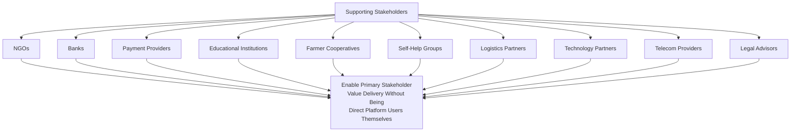

---

# Internal Stakeholders

| Stakeholder | Stakeholder-Facing Responsibility | Governing Standard |
|---|---|---|
| **Product Team** | Owns the accuracy and currency of every persona and stakeholder need represented in the roadmap. | `ai-docs/50-product-vision-business-strategy.md` |
| **Engineering** | Implements stakeholder-facing capability within architectural and quality standards. | `ai-docs/02`–`ai-docs/23` |
| **Design** | Translates stakeholder needs into accessible, inclusive interface and interaction design. | `ai-docs/12-accessibility-standards.md` |
| **QA** | Verifies stakeholder-facing flows actually work under real device/network/literacy conditions. | `ai-docs/15-testing-standards.md` |
| **Customer Support** | Front-line relationship holder for citizen, merchant, and provider escalations. | Stakeholder Communication Strategy (below) |
| **Operations** | Owns onboarding, verification, and day-to-day operational stakeholder processes. | `ai-docs/07-development-workflow.md` |
| **AI Team** | Owns AI-Gateway-mediated stakeholder-facing features, with mandatory human-override paths. | `ai-docs/09-tech-stack.md`'s AI Vision |
| **Security Team** | Protects every stakeholder's data per their classification's sensitivity. | `ai-docs/10-security-standards.md` |
| **Compliance Team** | Ensures every regulatory-classified stakeholder relationship meets its legal obligation. | `ai-docs/40-engineering-compliance-audit-standards.md` |
| **Leadership** | Final accountability for stakeholder trust and the balance between civic and commercial interests. | `ai-docs/50-product-vision-business-strategy.md` |

---

# Stakeholder Influence Matrix

Every stakeholder is placed on a Power–Interest grid, per the governance improvement this document incorporates, determining the correct engagement posture — never a uniform level of engagement applied indiscriminately across every relationship.

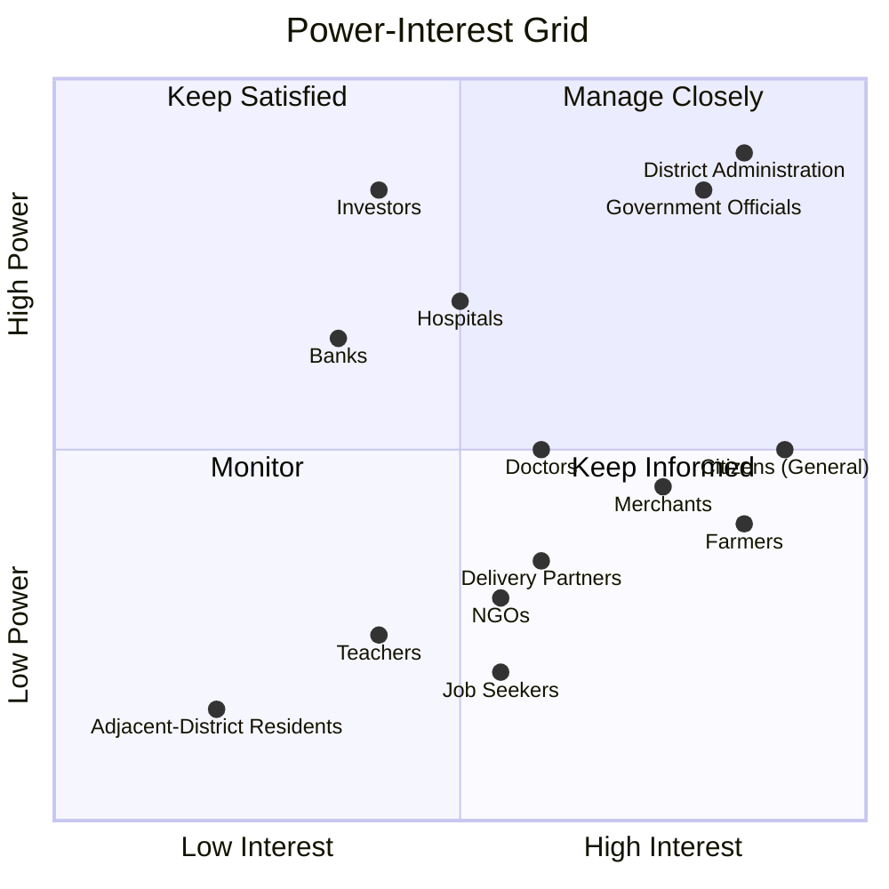

| Quadrant | Definition | Governance Implication |
|---|---|---|
| **Manage Closely** (High Power, High Interest) | District Administration, Government Officials, Investors, Hospitals | Direct executive relationship ownership; formal MOU/board-level cadence; escalations reach CEO. |
| **Keep Satisfied** (High Power, Lower Interest) | Banks, major Technology Partners, Telecom Providers | Regular structured updates even without daily engagement; relationship health monitored via account management. |
| **Keep Informed** (High Interest, Lower Power) | Citizens, Farmers, Merchants, Delivery Partners, Doctors, Job Seekers | High-frequency, accessible communication; direct feedback channels; product decisions consult this group heavily even without formal veto power. |
| **Monitor** (Lower Power, Lower Interest) | Future/anticipatory stakeholders (adjacent-district residents, not-yet-onboarded employers) | Light-touch tracking; escalate to a higher engagement tier only if power or interest increases. |

> **Callout — Power Is Not Prestige**
> A citizen's individual power over any single product decision is low, but the aggregate power of the Citizens stakeholder category — via adoption, trust surveys, and the platform's entire mission — is the highest in the organization. The Power-Interest Grid above scores the *aggregate category*, never an individual member, and Citizens' aggregate power is treated as structurally High even where a single citizen's influence on a specific decision is necessarily indirect.

---

# Stakeholder Responsibility Matrix (RACI)

Per the governance improvement this document incorporates, every major product decision category names who is Responsible, Accountable, Consulted, and Informed among stakeholder-facing roles — extending, not duplicating, the Decision Authority Matrix already established in `ai-docs/29-engineering-governance-decision-authority.md`.

| Decision Category | Responsible | Accountable | Consulted | Informed |
|---|---|---|---|---|
| New vertical/module launch (e.g., Healthcare) | Product Team, Domain Lead | CPO | Government Officials (if civic-adjacent), Compliance Team, affected Primary Stakeholders (via research) | All Engineering, Leadership |
| Fee/commission structure change | Head of relevant vertical | CEO/CFO | Merchants, Delivery Partners, Legal Advisors | Government Officials (where fee-facilitation applies), Citizens |
| Government partnership terms (MOU) | Head of Government Partnerships | CEO | District Administration, Legal Advisors, Compliance Team | Leadership, affected Government Officials |
| Accessibility/inclusion feature prioritization | Head of Accessibility & Inclusion | CPO | Senior Citizens, Persons with Disabilities, Low-Literacy Users, NGOs | All Engineering, Design |
| AI feature introduction | AI Team Lead | Head of AI Platform | Security Team, Compliance Team, affected Primary Stakeholders | Citizens (via transparency notice), Leadership |
| Dispute-resolution policy change | Head of Trust & Safety | CPO | Merchants, Citizens (via Advisory Council), Legal Advisors | All Support staff |
| Data-sharing agreement (health/identity) | Compliance Officer | CEO | Security Team, Legal Advisors, affected Government/Hospital partners | Citizens (via consent flow), Leadership |
| Vulnerable-population feature design | Head of Accessibility & Inclusion | CPO | NGOs, SHGs, Senior Citizens, Persons with Disabilities | All Design, Product |

---

# Stakeholder Value Exchange Model

Every stakeholder relationship is a two-way exchange, never a one-directional extraction — the model below is applied per stakeholder in the Registry.

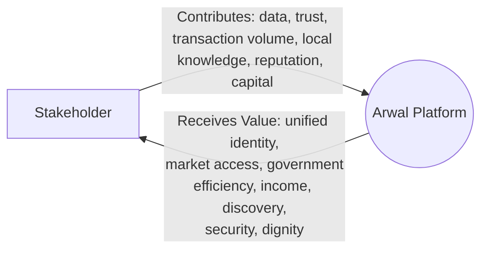

| Stakeholder | Contributes to Arwal | Receives from Arwal |
|---|---|---|
| Citizens | Attention, transaction volume, trust, feedback | One identity, convenience, dignity, access to government/healthcare/commerce |
| Farmers | Produce-market participation, field-level data | Fair pricing intelligence, weather, scheme access |
| Merchants | Catalog depth, commission revenue | Affordable storefront, customer reach, portable reputation |
| Delivery Partners | Fulfillment capacity | Transparent earnings, efficient routing |
| Government Officials | Institutional legitimacy, workflow data | Reduced backlog, audit trails, citizen-satisfaction improvement |
| NGOs/SHGs | Field trust, inclusion insight | Amplified reach for their beneficiaries |
| Investors | Capital | Return, mission-aligned growth story |
| Technology Partners | Infrastructure capability | Sustained commercial relationship |

---

# Stakeholder Relationship Map

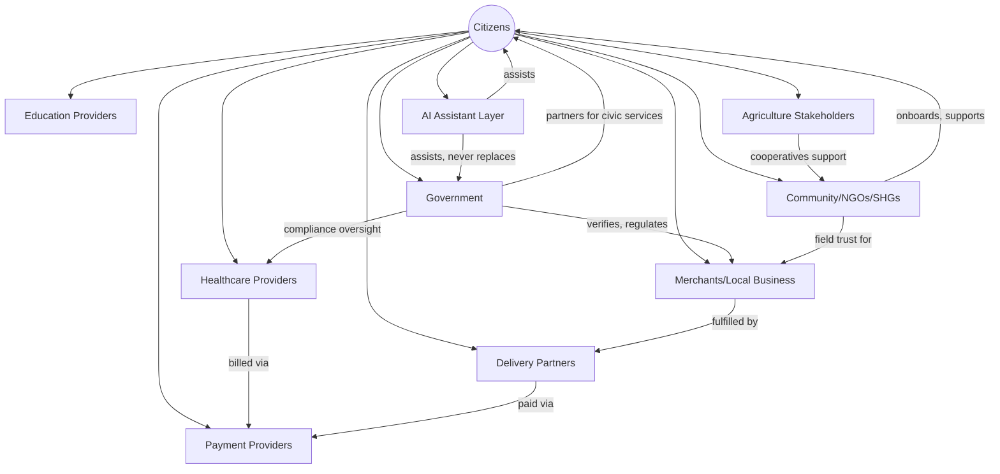

This relationship map is the visual counterpart to `ai-docs/50-product-vision-business-strategy.md`'s Product Strategy Dependency Map — every relationship line above ultimately depends on the same shared Identity & Trust layer that document establishes as Arwal's structural advantage.

---

# Stakeholder Dependency Map

Per the governance improvement this document incorporates, the diagram below shows how value actually **flows** — not merely relates — between citizens, merchants, government, service providers, and platform operations, so a downstream dependency failure (e.g., a government API outage) is traceable to every stakeholder it ultimately affects.

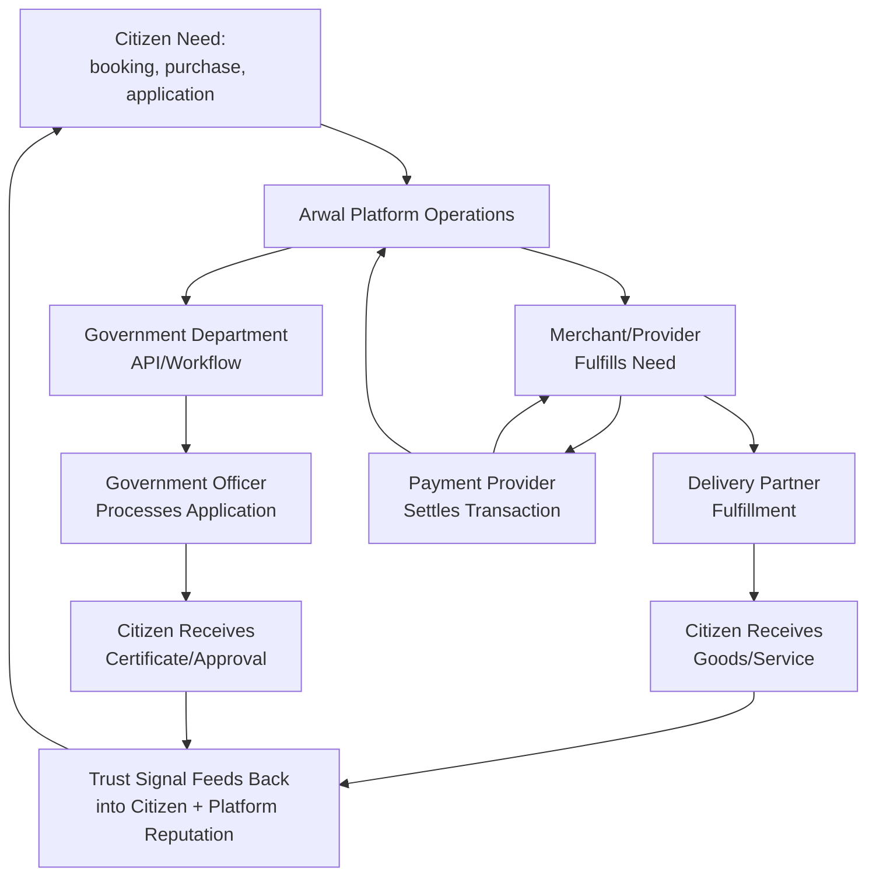

> **Callout — Why the Dependency Map Matters**
> A single broken link in this chain — a government API outage, a delivery partner shortage, a payment settlement delay — degrades the citizen outcome regardless of how well every other stakeholder performed. This map is the basis for prioritizing Failure Isolation work (`ai-docs/03-system-architecture-principles.md`) around the stakeholder relationships with the highest downstream fan-out.

---

# Underserved and Vulnerable Stakeholder Groups

Per the governance improvement this document incorporates, the following groups are treated as first-class primary stakeholders in their own right — never folded silently into a generic "Citizens" entry where their distinct needs would be lost.

| Group | Distinct Needs | Design Response | Owning Team |
|---|---|---|---|
| **Senior Citizens** | Low digital literacy, comfort with basic calls/SMS only, potential vision/dexterity limitations. | Large-target, high-contrast UI; assisted/delegated access allowing a family member to act on their behalf safely and transparently. | Head of Accessibility & Inclusion |
| **Persons with Disabilities** | Screen-reader dependency, motor-control limitations, varying sensory needs. | WCAG 2.2 AA minimum (`ai-docs/12-accessibility-standards.md`), progressing toward AAA for critical civic flows. | Head of Accessibility & Inclusion |
| **Low-Literacy Users** | Difficulty with text-heavy interfaces and complex forms. | Voice-first interaction, simplified-language mode, iconography paired with text per `ai-docs/12`'s Color Independence and Icon standards. | Head of Accessibility & Inclusion |
| **Migrant Workers** | Intermittent connectivity, unfamiliarity with local district systems, potential lack of formal documentation. | Simplified onboarding, SMS fallback, multilingual support, alternate-ID verification pathways where legally permissible. | Head of Jobs Vertical / Compliance |
| **Women's Self-Help Groups** | Group-based economic activity, need for collective bargaining/visibility, potential social-access barriers to individual smartphone use. | Group-account patterns, field-agent-assisted onboarding, cooperative-linked verification. | Head of Community Engagement |
| **Economically Weaker Sections** | Cost sensitivity to data usage, device affordability constraints, potential exclusion from formal financial systems. | Aggressive low-bandwidth optimization, offline-first core flows, low/no-cost onboarding, integration with government subsidy/scheme discovery. | Head of Accessibility & Inclusion |

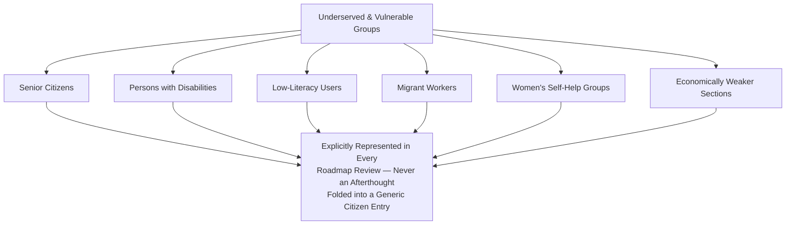

---

# Stakeholder Lifecycle

Every stakeholder category, not only citizens, moves through the same nine-stage relationship lifecycle — a merchant, a government department, and a delivery partner are each onboarded, verified, activated, retained, and re-engaged through the same structural stages, even though the specific mechanics differ per category.

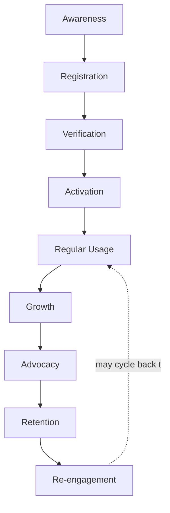

| Stage | Meaning | Example (Merchant) | Example (Citizen) | Example (Government Department) |
|---|---|---|---|---|
| **Awareness** | The stakeholder learns Arwal exists and is relevant to them. | Field onboarding team visits local market. | Word-of-mouth, community outreach, local advertising. | Government liaison presents Arwal's civic capability. |
| **Registration** | The stakeholder creates an identity within Arwal. | Merchant signs up via simplified dashboard. | Citizen creates unified identity. | Department signs a pilot MOU. |
| **Verification** | The stakeholder's identity/credentials are confirmed. | KYC and business verification completed. | Identity verification (OTP/KYC as applicable). | Formal legal/administrative sign-off. |
| **Activation** | The stakeholder completes their first meaningful transaction/action. | First order fulfilled. | First booking/purchase/application completed. | First application processed end-to-end. |
| **Regular Usage** | The stakeholder engages routinely. | Weekly order volume sustained. | Weekly/monthly active use across verticals. | Ongoing application intake through the platform. |
| **Growth** | The stakeholder's engagement deepens or expands. | Merchant lists additional products/categories. | Citizen adopts additional verticals (cross-vertical depth). | Department expands to additional service types. |
| **Advocacy** | The stakeholder actively recommends Arwal to peers. | Merchant refers other local shop owners. | Citizen refers family/neighbors. | Department becomes a reference for other departments. |
| **Retention** | The stakeholder continues engaging over the long term. | Sustained multi-year merchant activity. | Sustained multi-year citizen engagement. | Multi-year, renewed partnership. |
| **Re-engagement** | A lapsed stakeholder is brought back. | Dormant merchant reactivation campaign. | Lapsed-citizen win-back flow. | Renewed engagement after an administrative transition. |

---

# Stakeholder Risks

| Risk Category | Description | Primary Affected Stakeholders | Mitigation Direction |
|---|---|---|---|
| **Adoption Risk** | Stakeholders remain loyal to familiar informal channels despite Arwal's availability. | Citizens, Farmers, Merchants | Radical onboarding simplicity; visible early trust mechanisms; field-agent-assisted onboarding for low-literacy segments. |
| **Trust Risk** | A dispute, data incident, or perceived unfairness damages cross-vertical trust. | All Primary Stakeholders | Transparent dispute resolution; consistent policy enforcement; incident communication per `ai-docs/34-engineering-communication-standards.md`. |
| **Operational Risk** | Onboarding, verification, or support processes fail to scale with stakeholder growth. | Merchants, Delivery Partners, Government Officials | Operational readiness reviews tied to `ai-docs/38-engineering-portfolio-program-management-standards.md`'s capacity planning. |
| **Regulatory Risk** | A data-protection, health-data, or financial-services regulation change invalidates a stakeholder-facing assumption. | Doctors, Hospitals, Government Officials, Citizens | Compliance review gates every sensitive-domain launch, per `ai-docs/40-engineering-compliance-audit-standards.md`. |
| **Financial Risk** | Stakeholder-facing fee/commission structures fail to sustain unit economics or are perceived as unfair. | Merchants, Delivery Partners | Fair-fee governance reviewed jointly by Product and Finance; transparent fee disclosure. |
| **Technology Risk** | A stakeholder-facing feature (e.g., AI assistant) underperforms or produces an unsafe outcome. | Citizens, Government Officials | Mandatory human-override paths per `ai-docs/50-product-vision-business-strategy.md`'s AI Principle. |
| **Social Risk** | A design decision inadvertently excludes or disadvantages a vulnerable stakeholder group. | Senior Citizens, Persons with Disabilities, Low-Literacy Users, Migrant Workers | Mandatory inclusion review per Underserved and Vulnerable Stakeholder Groups above, before any major launch. |

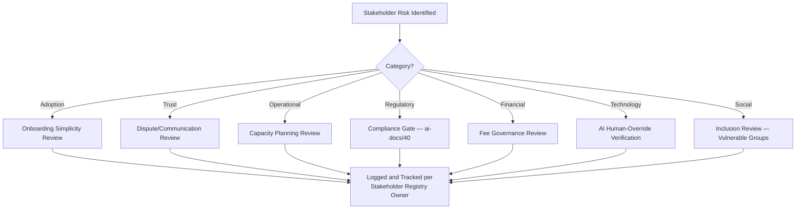

---

# Conflict-of-Interest Governance

Per the governance improvement this document incorporates, competing stakeholder needs are evaluated through an explicit, documented process — never resolved silently in whichever direction is most commercially convenient.

### Common Conflict Patterns

| Conflict | Competing Stakeholders | Resolution Principle |
|---|---|---|
| Merchant visibility vs. citizen neutrality | Merchants (want promoted placement) vs. Citizens (want unbiased ranking) | Citizen-First principle prevails; promoted placement is always disclosed, never disguised as organic ranking. |
| Delivery partner earnings vs. citizen pricing | Delivery Partners (want higher per-order pay) vs. Citizens (want lower delivery fees) | Resolved through transparent, published fee structures reviewed jointly by Finance and Product, never adjusted invisibly. |
| Government data request vs. citizen privacy | Government Officials (want broader data access for verification) vs. Citizens (want data minimization) | Resolved per the Data Minimization & Consent principle in `ai-docs/00-project-vision.md`'s Security Vision; no data shared beyond what a specific, disclosed civic purpose requires. |
| Platform monetization vs. merchant fee fairness | Leadership/Investors (want revenue growth) vs. Merchants (want low commission) | Resolved per the Protect Commercial Sustainability Without Compromising Trust goal in `ai-docs/01-product-goals.md` — fee structures must remain demonstrably fairer than informal-channel alternatives. |

### Conflict Governance Process

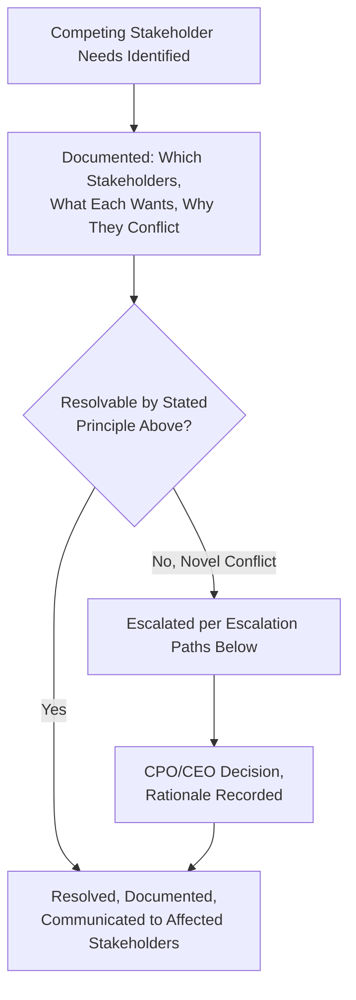

A conflict resolution, once made, is recorded in the same Decision Log discipline already established in `ai-docs/29-engineering-governance-decision-authority.md`, ensuring a future, structurally similar conflict is resolved consistently rather than re-litigated from scratch.

---

# Escalation Paths

Per the governance improvement this document incorporates, every stakeholder issue that cannot be resolved at the operational level follows a defined escalation path — never left to informally find its way to whichever leader happens to be reachable.

| Issue Type | First-Level Owner | Escalates To (If Unresolved) | Final Escalation |
|---|---|---|---|
| Individual citizen complaint/dispute | Customer Support | Head of Trust & Safety | CPO |
| Merchant/provider dispute | Merchant Success team | Head of Merchant Success | CPO |
| Government partnership disagreement | Government Partnerships liaison | Head of Government Partnerships | CEO |
| Accessibility/inclusion gap reported | Head of Accessibility & Inclusion | CPO | CEO |
| Data-privacy or security concern | Security/Compliance Team | CISO / Compliance Officer | CEO |
| Cross-stakeholder conflict of interest | Relevant vertical Head | CPO | CEO |
| NGO/Community partnership friction | Head of Community Engagement | CPO | CEO |
| Investor/board-level concern | CEO | Board | Board Chair |

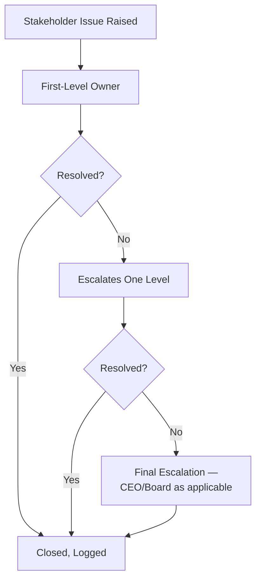

---

# Stakeholder Communication Strategy

| Communication Type | Purpose | Primary Channel | Cadence |
|---|---|---|---|
| **Announcements** | Feature launches, policy changes, maintenance windows. | In-app notification, SMS (for connectivity-constrained users), government liaison briefings. | Per event, per `ai-docs/34-engineering-communication-standards.md`'s classification tiers. |
| **Feedback** | Ongoing stakeholder input into product direction. | In-app feedback tool, Citizen Advisory Council, Merchant Advisory sessions. | Continuous, reviewed monthly. |
| **Support** | Resolving individual stakeholder issues. | In-app support, phone/IVR for low-connectivity users, field agents for rural populations. | Continuous. |
| **Escalations** | Unresolved issues requiring higher-level attention. | Per Escalation Paths above. | As triggered. |
| **Community Engagement** | Building trust with NGOs, SHGs, and community leaders. | Field visits, community workshops, cooperative liaison meetings. | Semi-Annual minimum. |
| **Government Coordination** | Formal liaison with government partners. | Scheduled liaison meetings, MOU review sessions. | Quarterly minimum. |

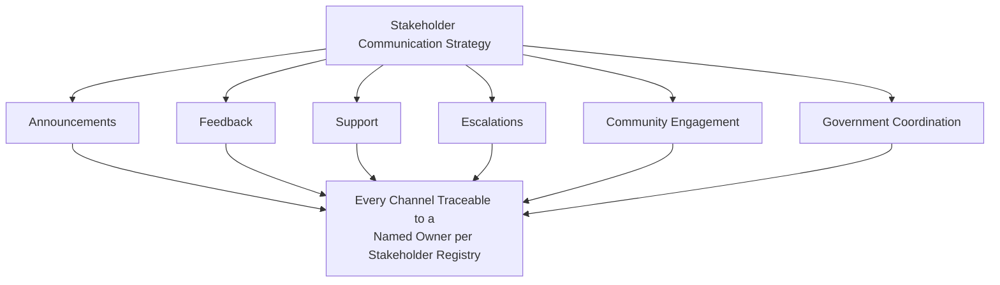

---

# Periodic Stakeholder Validation

Per the governance improvement this document incorporates, stakeholder needs stated in this document are never assumed permanently accurate — they are validated on a recurring, evidenced cadence.

| Validation Method | Applies To | Cadence |
|---|---|---|
| **Surveys** | Citizens, Merchants, Delivery Partners, Job Seekers | Quarterly |
| **Interviews** | Government Officials, Hospital Administrators, NGO Leaders | Semi-Annual |
| **Analytics** | All digitally-active stakeholders (usage, drop-off, conversion) | Continuous |
| **Usability Testing** | Vulnerable/underserved groups (Senior Citizens, Low-Literacy Users, Persons with Disabilities) | Before every major UI change touching their primary flows |
| **Advisory Councils** | Citizens (Citizen Advisory Council), Merchants (Merchant Advisory Council) | Quarterly standing meeting |

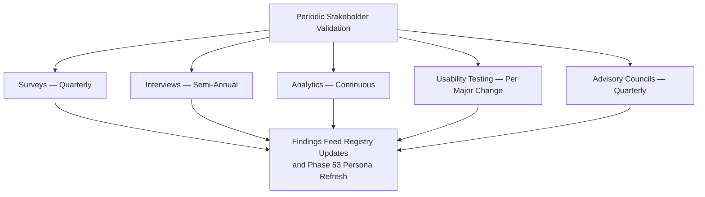

---

# Stakeholder KPIs

| Stakeholder Group | KPI | Target Direction |
|---|---|---|
| Citizens | MAU as % of district population; District Trust Signal | Increasing |
| Farmers | % of registered farmers using price/weather/scheme features monthly | Increasing |
| Merchants | Revenue retention; reported income improvement | Increasing |
| Delivery Partners | Earnings-transparency satisfaction score; on-time delivery rate | Increasing |
| Doctors/Clinics/Hospitals | Reduction in time-to-appointment; no-show rate | Decreasing (time-to-appointment, no-shows) |
| Government Officials | Reduction in average service completion time | Decreasing |
| Job Seekers/Employers | Verified jobs/gigs fulfilled per quarter | Increasing |
| NGOs/SHGs | Beneficiary reach amplified through Arwal | Increasing |
| Vulnerable/Underserved Groups | Accessibility-flow completion rate vs. general population | Approaching parity |
| Internal Teams | Stakeholder-issue resolution time; escalation rate | Decreasing |

---

# Executive Dashboards

### CEO Dashboard
- District Trust Signal trend
- Strategic/Regulatory stakeholder relationship health (Government, District Administration, Investors)
- Open escalations at CEO level
- Conflict-of-interest resolutions logged this quarter

### CPO Dashboard
- Cross-Vertical Adoption Depth
- Stakeholder KPI dashboard (all Primary Stakeholders)
- Vulnerable-group accessibility parity metrics
- Advisory Council feedback summary

### Government Partners Dashboard
- Civic module completion-time trend
- Active MOUs and renewal status
- Compliance evidence readiness (cross-referenced with `ai-docs/40`)

### Operations Dashboard
- Stakeholder onboarding funnel (Awareness → Activation) by category
- Support ticket volume and resolution time by stakeholder group
- Field-agent-assisted onboarding volume for vulnerable groups

### Customer Success Dashboard
- Merchant/Provider retention and satisfaction
- Delivery Partner earnings-satisfaction trend
- Escalation volume by stakeholder category

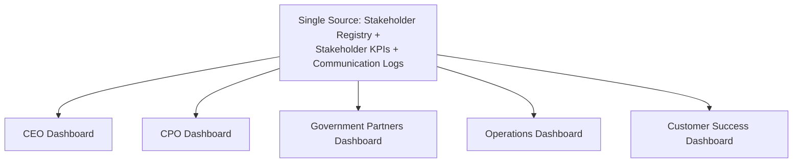

---

# AI-Assisted Stakeholder Management

Consistent with the identical AI-assistance principle established across `ai-docs/24` through `ai-docs/50`: **AI accelerates segmentation and analysis, never authority.**

| Use Case | AI Role | Human Requirement |
|---|---|---|
| Stakeholder segmentation | Cluster citizens/merchants by usage pattern to refine persona candidates for Phase 53 | Product researcher validates clusters against real qualitative research before adoption |
| Feedback analysis | Summarize large volumes of in-app feedback and survey responses | Human reviews summary for accuracy before it informs a roadmap decision |
| Sentiment analysis | Flag a trending negative-sentiment pattern (e.g., a specific dispute type) | Human (Trust & Safety) investigates and confirms before any policy change |
| Support prioritization | Suggest triage order for support tickets based on urgency signals | Human support lead retains final triage authority, especially for vulnerable-group cases |
| Recommendation systems | Personalize discovery within citizen-facing surfaces | Every recommendation is explainable and never the sole determinant of a citizen's access to a service, per the AI Principle in `ai-docs/00-project-vision.md` |

No stakeholder segmentation, sentiment finding, or prioritization recommendation is acted upon without human review — identical to the Human Oversight standard already established consistently across this handbook.

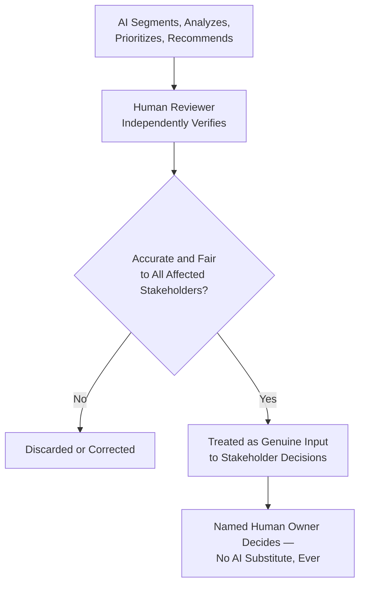

---

# Stakeholder Anti-Patterns

| Anti-Pattern | Description | Why It's Rejected |
|---|---|---|
| **Ignoring rural users** | Product decisions optimized for urban, high-connectivity citizens while rural needs are deprioritized. | Directly violates Inclusion over Optimization (`ai-docs/00-project-vision.md`) and the Citizen-First principle above. |
| **Urban bias** | Research, personas, and metrics implicitly skewed toward urban headquarters users. | Produces a platform that structurally underserves the majority-rural district population. |
| **Ignoring accessibility** | Treating WCAG compliance as a checkbox rather than a design floor. | Violates the Accessibility principle and directly harms Senior Citizens and Persons with Disabilities. |
| **One-size-fits-all UX** | A single interface pattern applied uniformly regardless of literacy, device, or connectivity variance. | Contradicts the Progressive Complexity principle already established in `ai-docs/00-project-vision.md`. |
| **Poor communication** | Stakeholders learn of a policy or fee change only after it takes effect. | Violates Transparency above and the Communication Classification discipline in `ai-docs/34-engineering-communication-standards.md`. |
| **Stakeholder conflicts left unresolved** | Competing needs (merchant visibility vs. citizen neutrality) resolved silently, inconsistently, or not at all. | Violates Conflict-of-Interest Governance above; erodes trust across whichever stakeholder loses out unpredictably. |
| **Lack of trust** | Verification, dispute resolution, or data handling that does not match stated commitments. | Directly threatens Arwal's core structural advantage — cross-vertical trust compounding, per `ai-docs/50`. |
| **Platform favoritism** | Ranking, visibility, or support quality distorted by ad spend or informal relationships rather than genuine merit. | Violates Transparency and Mutual Value Creation above. |

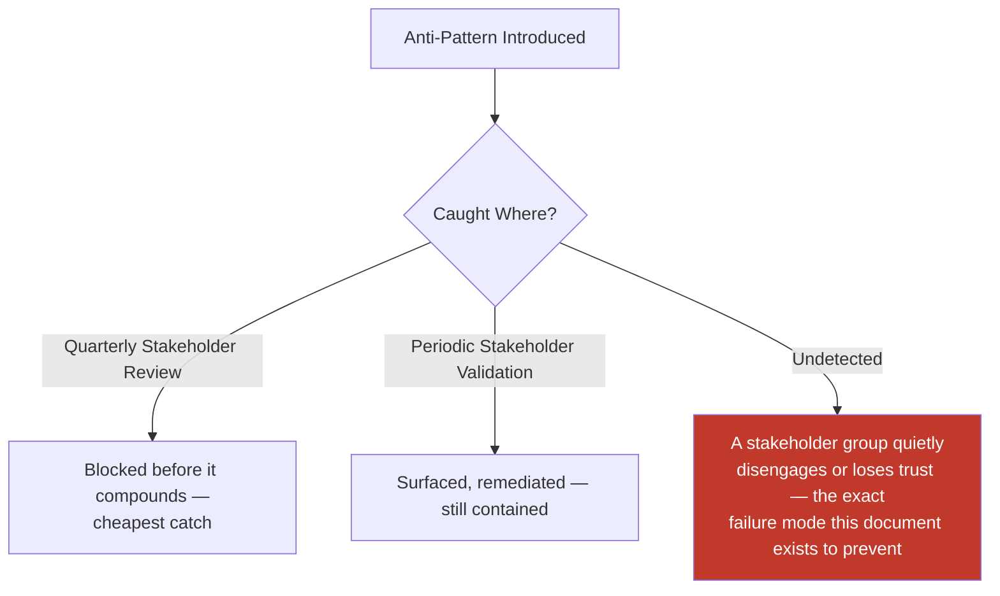

---

# Stakeholder Review Checklist

Every product decision, roadmap item, or partnership agreement is checked against the following before it is considered stakeholder-compliant:

- [ ] **Every affected stakeholder identified** — Cross-referenced against the Stakeholder Registry, never assumed self-evident.
- [ ] **Classification correctly applied** — Primary/Secondary/Internal/External/Strategic/Operational/Regulatory/Community/Supporting/Future, as applicable.
- [ ] **Power-Interest quadrant considered** — Engagement posture matches the stakeholder's actual quadrant, per the Influence Matrix.
- [ ] **RACI applied** — Responsible, Accountable, Consulted, and Informed parties named per the Responsibility Matrix.
- [ ] **Value exchange stated explicitly** — What the stakeholder contributes and receives is documented, never assumed.
- [ ] **Vulnerable groups explicitly considered** — Senior Citizens, Persons with Disabilities, Low-Literacy Users, Migrant Workers, Women's SHGs, and Economically Weaker Sections are named, not folded into a generic citizen entry.
- [ ] **Conflict-of-interest evaluated** — Any competing stakeholder need is documented and resolved per Conflict-of-Interest Governance.
- [ ] **Escalation path confirmed** — A defined path exists for any unresolved issue arising from this decision.
- [ ] **Communication plan defined** — Channel and cadence match Stakeholder Communication Strategy.
- [ ] **Success metrics traceable** — Tied to a KPI in Stakeholder KPIs above.
- [ ] **AI-assisted analysis independently verified** — Any AI-surfaced segmentation, sentiment, or recommendation confirmed by a human before reliance.
- [ ] **Traceable to a future Persona (Phase 53) and Business Domain (Phase 54)** — No stakeholder defined here is left unconnected to those future phases.
- [ ] **No anti-pattern present** — No rural neglect, urban bias, accessibility gap, one-size-fits-all UX, poor communication, unresolved conflict, trust erosion, or platform favoritism.

---

# Governance Review

| Review | Cadence | Owner | Purpose |
|---|---|---|---|
| **Quarterly Stakeholder Review** | Quarterly | CPO, Head of Accessibility & Inclusion, all vertical Heads | Registry accuracy, KPI trend, open escalations, conflict-of-interest log review. |
| **Annual Stakeholder Strategy Review** | Annual | CEO, CPO, Chief Strategy Officer | Confirms the full Stakeholder Registry and classification framework still reflect Arwal's actual district reality; amendments follow the same rigor as a Strategic-classification amendment per `ai-docs/49-engineering-handbook-governance-evolution-standards.md`. |
| **Citizen Satisfaction Review** | Quarterly | CPO, Head of Customer Success | Citizen Advisory Council findings, CSAT/NPS trend, District Trust Signal. |
| **Government Partnership Review** | Quarterly | CEO, Head of Government Partnerships | MOU health, service-completion-time trend, escalation status with District Administration. |

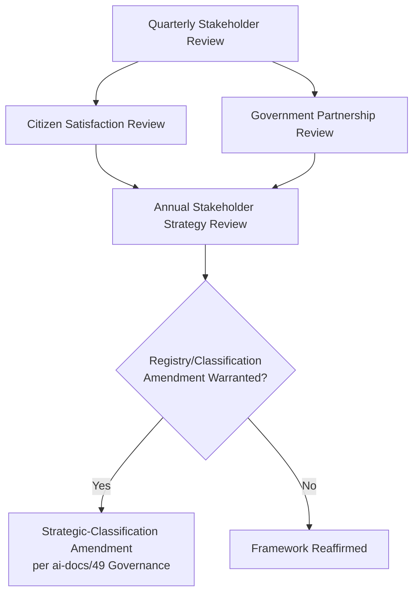

---

# Relationship with Previous Standards

### Project Vision

`ai-docs/00-project-vision.md` establishes Arwal's founding mission and Guiding Principles — Citizen dignity, Inclusion over Optimization, Trust over Growth-at-all-costs. This document operationalizes those principles into a concrete, named accounting of every stakeholder they apply to, never redefining the founding principles themselves.

### Product Goals

`ai-docs/01-product-goals.md` establishes User Goals per persona category and the Product Priorities (Must/Should/Could/Won't). This document's Primary Stakeholder analyses extend those User Goals into the fuller Purpose/Goals/Pain Points/Needs/Accessibility/Trust/Success-Metrics structure this document requires, tracing back to — never contradicting — the priorities already set there.

### Engineering Principles

`ai-docs/02-engineering-principles.md` establishes the engineering culture (SOLID, DRY, Separation of Concerns) that ultimately implements every stakeholder-facing capability this document identifies. This document does not redefine any engineering principle; it supplies the stakeholder need engineering exists to satisfy.

### Product Vision & Business Strategy

`ai-docs/50-product-vision-business-strategy.md` establishes the Product Vision, Mission, Value Proposition, and Market Positioning. This document is the detailed stakeholder-level foundation that document's Stakeholder Value Map and Value Proposition table summarize at a higher level — every stakeholder category in that document's Stakeholder Value Map traces directly to a full entry in this document's Stakeholder Registry.

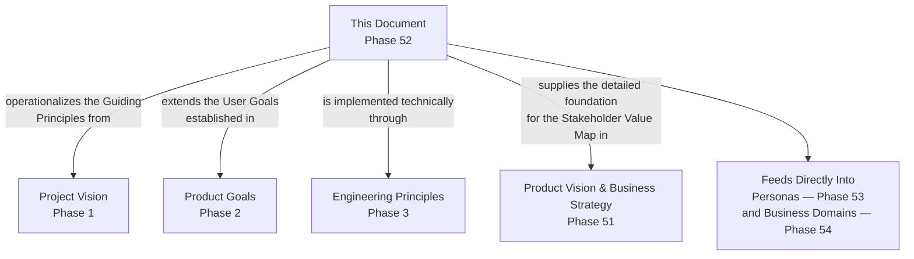

---

# Closing Statement

> **Callout — Closing Statement**
> Arwal exists to serve a district's entire population — but "the district" is not one stakeholder, it is dozens, each with distinct goals, constraints, vulnerabilities, and power over whether this platform earns the trust it depends on. A citizen checking a mandi price, a government officer processing a certificate, a delivery partner routing between orders, a senior citizen relying on a family member's phone, and an investor evaluating a return are all, simultaneously, the reason Arwal exists and the measure of whether it is succeeding. This document exists so that no stakeholder's needs are ever an accident of who happened to be in the room when a decision was made — every relationship named here is owned, measured, validated, and reconciled against every other relationship it touches, so that Arwal can balance citizen dignity, commercial sustainability, and government partnership simultaneously, not as a compromise between them, but as the single coherent design this platform was always meant to be. Where a future phase must deviate from a stakeholder relationship or classification stated here, that deviation is made explicitly — through the Governance Review process above, or a Strategic-classification amendment per `ai-docs/49-engineering-handbook-governance-evolution-standards.md` — never silently, and never by default.

This document, `ai-docs/51-stakeholder-analysis.md`, is Phase 52 of approximately 420. Every persona (Phase 53), business domain (Phase 54), and subsequent product, UX, architecture, and AI decision is expected to trace back to a stakeholder defined here, or to justify its deviation in writing.

**End of Phase 52 — `ai-docs/51-stakeholder-analysis.md`**
