# User Personas & User Segmentation

**Document:** `ai-docs/52-user-personas-user-segmentation.md`
**Project:** Arwal — The District Super App
**Stage:** 2 — Product & Business Strategy
**Phase:** 53 — User Personas & User Segmentation
**Status:** Approved for Product & Engineering Reference
**Audience:** CPO, VP User Experience, Head of User Research, UX/Service Designers, Accessibility Specialists, Product Managers, AI/Personalization Team, Architects, Government Digital Transformation Partners

> **Callout — Purpose of This Document**
> `ai-docs/00-project-vision.md` established why Arwal exists. `ai-docs/01-product-goals.md` translated that into measurable goals. `ai-docs/50-product-vision-business-strategy.md` established what Arwal is and how it wins. `ai-docs/51-stakeholder-analysis.md` established *who* Arwal serves at the stakeholder-category level — Citizens, Farmers, Merchants, Government Officials, and forty-plus others — and what each stakeholder needs, fears, and holds power over. None of those documents answers the question every screen, workflow, AI feature, and analytics event depends on: **who, specifically, sits behind each stakeholder category, in enough behavioral and human detail that a designer, an engineer, or an AI model can build for a real person instead of an abstraction?** This document is that answer.

---

# Purpose of this Document

### Why Personas Are Essential for Consistent Product Decisions

`ai-docs/51-stakeholder-analysis.md` tells us that Farmers are a Primary stakeholder with a named internal owner and a quarterly review cadence. It does not tell a UX designer whether Meena, checking today's mandi price on a cracked Android screen in a field with one bar of signal, needs a voice interface or a data table — because a stakeholder category is a governance unit, not a design input. A persona is what converts a stakeholder category into a specific, evidence-grounded human being (or a small, coherent cluster of them) that every design, engineering, and AI decision can be tested against with a single question: **"Would this actually work for her?"**

Without personas, three failure modes recur predictably, each already named in principle elsewhere in this handbook and now made concrete at the human level:

1. **Designing for yourself.** An engineer or designer building Arwal is, almost by definition, not representative of its median user — younger, more digitally fluent, better-connected, more literate, more urban. Absent a documented persona to design against, every ambiguous decision defaults to "what would I want," which is the single most common source of the Urban Bias anti-pattern already rejected in `ai-docs/51-stakeholder-analysis.md`.
2. **Feature decisions with no traceable human justification.** `ai-docs/50-product-vision-business-strategy.md`'s Product Review Checklist requires every decision to trace to a Strategic Objective; this document is the layer beneath that check — a Strategic Objective ("Farmer Empowerment") is only actionable once it has a persona ("Meena, the Rural Farmer") whose actual daily routine, device, and literacy level a feature can be designed and tested against.
3. **AI personalization with no defined boundaries.** An AI recommendation, ranking, or civic-assistant response that is not built against an explicit, human, accessibility-aware persona set will silently optimize for whichever segment generates the most training signal — typically the most digitally active, urban, literate users — recreating exactly the exclusion this platform exists to reverse.

### Personas as the Traceability Layer Between Strategy and Screen

Every future UX screen, module, workflow, AI feature, dashboard, and analytics event must map to one or more personas defined here, per the Persona-to-Feature Traceability Matrix later in this document — mirroring the identical Traceability discipline already established throughout `ai-docs/29-engineering-governance-decision-authority.md` and `ai-docs/51-stakeholder-analysis.md`. A feature that cannot name which persona it serves is a feature built on assumption, not evidence.

### What This Document Does Not Redefine

This document does not redefine Product Vision (`ai-docs/50-product-vision-business-strategy.md`), Stakeholder Analysis (`ai-docs/51-stakeholder-analysis.md`), or any Engineering Standard (`ai-docs/02` through `ai-docs/49`). Every persona below carries a `Stakeholder Reference` field linking directly back to its `STK-###` entry in the Phase 52 Stakeholder Registry — this document narrows and humanizes those entries; it never contradicts or restates their governance mechanics.

---

# Persona Design Philosophy

Every principle below exists because a persona built carelessly does not merely produce a bad diagram — it produces bad product decisions repeated at scale, across millions of eventual users.

### Citizen-First

**Why it exists:** Every persona in this catalog — even a Merchant or a Government Officer — is ultimately in service of, or judged by, the citizen's experience. Where a persona's stated need would conflict with citizen dignity or citizen access, the citizen persona's need prevails, mirroring the identical Citizen-First tie-breaker already established in `ai-docs/51-stakeholder-analysis.md`.

### Evidence-Based Research

**Why it exists:** A persona invented from assumption is worse than no persona at all, because it carries false confidence — a team designing against a fabricated "typical farmer" will defend wrong decisions with the same certainty they would defend right ones. Every persona below states its **Research Confidence Score** and evidence source, and no persona is treated as authoritative until validated per Persona Governance below.

### Accessibility-First

**Why it exists:** A persona catalog that treats accessibility as a single bolt-on "accessibility persona" at the end of the list has already failed — real citizens with low vision, motor impairment, or low literacy are not edge cases of the Citizen persona; they are the Citizen persona for a meaningful share of Arwal's actual population. Accessibility needs are a mandatory field on **every** persona card below, never confined to a separate section alone.

### Inclusive Design

**Why it exists:** Designing *with* the full range of human variation — literacy, language, income, device, ability — rather than designing for an assumed "average" user and patching exceptions later, is the only way a district-scale platform avoids quietly re-creating the digital exclusion it exists to solve, per the identical Inclusive Design principle already established in `ai-docs/12-accessibility-standards.md`.

### Privacy

**Why it exists:** A persona's data (a farmer's income proxy, a patient's health-seeking behavior, a job seeker's employment history) is sensitive by nature. Persona research and the personalization systems built from it must honor Data Minimization and Consent, per `ai-docs/00-project-vision.md`'s Security Vision — a persona is a design tool, never a justification for collecting more personal data than a feature genuinely requires.

### Trust

**Why it exists:** Every persona below states explicit Trust Expectations, because trust is not a single platform-wide constant — a Government Officer's trust expectation (auditability) and a Migrant Worker's trust expectation (non-exploitation, data safety) are different obligations Arwal must meet simultaneously, per the Mutual Value Creation principle already established in `ai-docs/51-stakeholder-analysis.md`.

### Simplicity

**Why it exists:** A persona catalog exists to protect simplicity, not undermine it with complexity — every persona's UX implications are stated as the *simplest* design that serves them, per the Progressive Complexity principle already established in `ai-docs/00-project-vision.md`, never as a license to add a parallel, persona-specific interface that fragments the product.

### Local Relevance

**Why it exists:** A persona modeled on a generic, nationally-averaged "rural user" fails Arwal's actual population, which is specifically Arwal District, Bihar — its dialects, its crop cycles, its local government structures, its specific device and connectivity reality. Every persona below is grounded in this specific geography, never a placeholder that could describe any district in the country.

### Cultural Awareness

**Why it exists:** Family structure (a shared household device, a son assisting an elderly parent), gender-specific access patterns (a woman's smartphone access mediated by a Self-Help Group), and local trust norms (preference for a known field agent over a cold digital onboarding flow) are not incidental details — they are structural facts a persona must capture, or the resulting product will be usable in a lab and unusable in the district it is meant to serve.

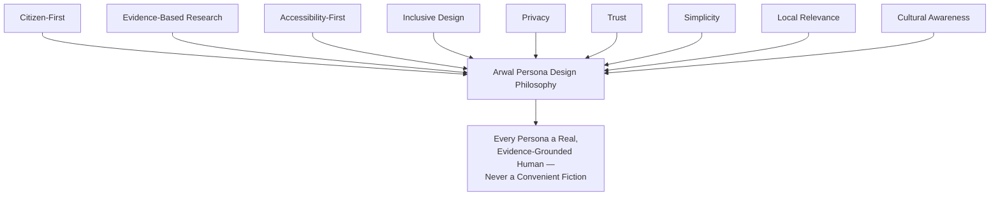

> **Callout — The One-Sentence Persona Philosophy**
> *"A persona that could be describing anyone is describing no one — every persona in this catalog must be specific enough that a designer can predict, correctly, what this exact person would do when the screen doesn't work as expected."*

---

# User Segmentation Framework

Segmentation is the analytical layer beneath the Persona Catalog — every persona is a coherent point within this multi-dimensional segmentation space, never an arbitrary label.

| Dimension | Segments | Why It Matters |
|---|---|---|
| **Demographics** | Age band (18–25, 26–40, 41–60, 60+); gender; household role (head of household, dependent, caregiver) | Age and household role predict device ownership, assistance needs, and literacy patterns distinctly. |
| **Geography** | Urban headquarters town; semi-urban block town; rural village; remote/low-connectivity hamlet | Arwal's founding-district reality spans all four; each has a materially different connectivity and service-access baseline. |
| **Digital Literacy** | First-generation smartphone user; functional-but-cautious user; confident everyday user; power user | Determines onboarding depth, UI complexity tolerance, and voice-vs-text default. |
| **Device Capability** | Feature-phone-adjacent Android (≤2GB RAM); entry-level Android; mid-range Android; iOS/high-end | Drives Performance Budget targets already established in `ai-docs/11-performance-standards.md`. |
| **Connectivity** | Persistent 2G; intermittent 3G; stable 4G; WiFi-available | Drives Offline-First design priority per module. |
| **Income** | Below poverty line; low income (informal sector); lower-middle income; middle income; salaried/formal | Drives fee sensitivity, payment-method preference, and data-cost sensitivity. |
| **Education** | No formal schooling; primary; secondary; graduate; postgraduate/professional | Correlates with, but is not identical to, digital literacy — a graduate first-time smartphone user and a primary-schooled experienced user behave differently. |
| **Profession** | Farmer; informal-sector worker; formal-sector employee; small-business owner; government employee; student; unemployed/job-seeking | Drives which vertical(s) a persona engages first and most. |
| **Accessibility** | No disclosed disability; low vision; blind; hard of hearing/deaf; motor impairment; cognitive/learning difference | Mandatory input to every persona, per Accessibility-First above. |
| **Platform Engagement** | Explorer; Routine User; High-Frequency User; Occasional User; Assisted User; Power User (full definitions under Behavioral Segmentation) | Drives retention and re-engagement strategy design. |
| **Behavioral Patterns** | Task-driven (in, done, out); Browsing/discovery-driven; Delegation-driven (acts on someone else's behalf); Trust-verification-driven (checks reviews/disputes before acting) | Drives information architecture and default landing experience. |

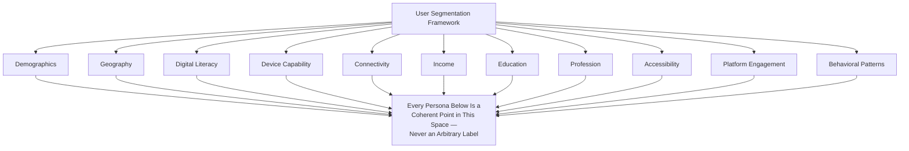

---

# Persona Registry

Every persona carries a permanent Persona ID, linked to its Stakeholder ID from `ai-docs/51-stakeholder-analysis.md`. IDs are never reused, even if a persona is retired.

| Persona ID | Name | Stakeholder Ref | Classification | Research Confidence |
|---|---|---|---|---|
| PER-001 | Rahul, the Urban Shopper | STK-001 | Primary | High |
| PER-002 | Meena, the Rural Farmer | STK-002 | Primary, Vulnerable-adjacent | High |
| PER-003 | Aisha, the Aspiring Student | STK-003 | Primary | Medium |
| PER-004 | Manoj, the Independent Tutor | STK-004 | Primary | Medium |
| PER-005 | Sunita, the Delegating Parent | STK-005 | Secondary | Medium |
| PER-006 | Dr. Kavita, the Independent Physician | STK-006 | Primary | High |
| PER-007 | Ramesh, the Clinic Administrator | STK-006/STK-007 | Primary | Medium |
| PER-008 | Anjali, the Hospital Administrator | STK-008 | Primary, Strategic | Medium |
| PER-009 | Vikash, the Neighborhood Pharmacist | STK-009 | Primary | Medium |
| PER-010 | Suresh, the Local Shop Owner | STK-010 | Primary | High |
| PER-011 | Priyanka, the Marketplace Merchant | STK-011 | Primary | Medium |
| PER-012 | Vikram, the Delivery Partner | STK-012 | Primary | High |
| PER-013 | Ashok, the Property Owner | STK-013 | Primary | Low |
| PER-014 | Farida, the Rental Tenant | STK-014 | Primary | Low |
| PER-015 | Rakesh (Job Seeker), the Skilled Youth | STK-015 | Primary | Medium |
| PER-016 | Neha, the Small-Business Employer | STK-016 | Primary | Low |
| PER-017 | Priya, the Government Officer | STK-017 | Primary, Regulatory | High |
| PER-018 | Mr. Singh, the District Administrator | STK-018 | Strategic, Regulatory | Medium |
| PER-019 | Devendra, the Elderly Citizen | STK-029 | Primary, Vulnerable | High |
| PER-020 | Arvind, Citizen with a Visual Impairment | STK-030 | Primary, Vulnerable | Medium |
| PER-021 | Lakshmi, the Low-Literacy Homemaker | STK-031 | Primary, Vulnerable | High |
| PER-022 | Radha's SHG, Women's Collective | STK-033 | Primary, Community, Vulnerable | Medium |
| PER-023 | Iqbal, the Migrant Construction Worker | STK-032 | Primary, Vulnerable | Medium |
| PER-024 | Fr. Thomas, the NGO Field Coordinator | STK-019 | Supporting, Community | Medium |
| PER-025 | TechNova Cloud Services, Technology Partner | STK-026 | Supporting | Low |
| PER-026 | Anjali's Cousin (Future Persona), Adjacent-District Resident | STK-046 | Future | Low (anticipatory) |

> **Callout — Registry Governance**
> This Registry is the single authoritative index for every persona. A persona added, merged, or retired outside the Quarterly Persona Review below is treated as an exception requiring Head of User Research sign-off, mirroring the identical Registry discipline already established in `ai-docs/51-stakeholder-analysis.md`.

---

# Persona Catalog

Each persona below follows an identical structure for comparability. Empathy maps and Jobs-To-Be-Done statements are included for every **primary** persona category.

## PER-001 — Rahul, the Urban Shopper

| Field | Detail |
|---|---|
| **Stakeholder Reference** | STK-001 (Citizens, General) |
| **Description** | A digitally-native resident of Arwal district headquarters town, juggling work and household logistics, currently splitting his digital life across 4–5 separate apps. |
| **Age Range** | 24–34 |
| **Occupation** | Salaried private-sector employee (retail/services) |
| **Education** | Graduate |
| **Income Group** | Lower-middle to middle income |
| **Family Context** | Nuclear household, sometimes supporting aging parents remotely |
| **Device Usage** | Mid-range Android, personally owned, primary device |
| **Connectivity Profile** | Stable 4G at home and work; occasional dead zones during commute |
| **Digital Literacy** | Confident everyday user |
| **Daily Routine** | Checks phone within minutes of waking; orders breakfast/groceries via app; checks work messages on commute; evening food/grocery ordering; occasional bill payments |
| **Primary Goals** | Fast, reliable local delivery; a single place to manage orders and payments |
| **Secondary Goals** | Discover new local restaurants/shops; occasional civic-service use (utility bill, license renewal) |
| **Motivations** | Time efficiency; consistent experience quality; not wanting to "manage five apps for one life" |
| **Frustrations** | Juggling separate apps for shopping, food, and services with no shared order history or reputation |
| **Pain Points** | Re-entering address/payment details across apps; no cross-app loyalty or trust carryover |
| **Accessibility Requirements** | None disclosed; standard WCAG 2.2 AA floor applies regardless |
| **Preferred Language** | Hindi/English bilingual, English-leaning for app UI |
| **Trust Expectations** | Real-time order tracking; secure, multiple payment options; responsive dispute resolution |
| **Security Expectations** | Standard authentication; visible transaction history; ability to revoke saved payment methods |
| **Typical Platform Usage** | Daily — Commerce, Food, occasional Civic Services |
| **AI Assistance Opportunities** | Personalized discovery ranking; reorder suggestions; smart delivery-time estimation |
| **Success Metrics** | WAU/MAU stickiness; cross-vertical adoption depth; repeat order rate |
| **Future Evolution** | Adopts civic and healthcare modules as trust in the platform compounds |
| **Related Business Domains** | Commerce, Food & Grocery Delivery, Payments (Phase 54) |

**Empathy Map — Rahul**

| Think | Feel | Say | Do |
|---|---|---|---|
| "Why do I need five apps for one evening?" | Mildly frustrated by fragmentation; otherwise satisfied | "This app actually remembers my address, finally." | Orders food, checks delivery status repeatedly, rarely contacts support |

**Jobs-To-Be-Done:** *"When I get home from work hungry and tired, I want to order food and groceries from one trusted place, so I can relax instead of comparing five apps."*

---

## PER-002 — Meena, the Rural Farmer

| Field | Detail |
|---|---|
| **Stakeholder Reference** | STK-002 (Farmers) |
| **Description** | A smallholder farmer living 25km from district headquarters, primary decision-maker for her household's crop sales, navigating a middleman-dominated local market. |
| **Age Range** | 38–48 |
| **Occupation** | Farmer (smallholder, 2–4 acres) |
| **Education** | Primary schooling, basic reading |
| **Income Group** | Below poverty line to low income, seasonal variance |
| **Family Context** | Joint household; husband works partly as a migrant laborer |
| **Device Usage** | Entry-level Android, shared with husband when he is home |
| **Connectivity Profile** | Intermittent 2G/3G, frequent dead zones |
| **Digital Literacy** | First-generation smartphone user |
| **Daily Routine** | Field work from early morning; checks phone in short windows for mandi prices and weather; evening household management |
| **Primary Goals** | Get a fair, current mandi price for her crop; timely weather alerts before harvest |
| **Secondary Goals** | Discover government subsidy eligibility; connect to direct buyers |
| **Motivations** | Reduce dependency on a middleman who underquotes prices; protect the harvest from weather loss |
| **Frustrations** | Word-of-mouth pricing she cannot verify; scheme information that rarely reaches her directly |
| **Pain Points** | Text-heavy interfaces; data cost anxiety; low confidence typing |
| **Accessibility Requirements** | Voice-first interaction; large-target UI; offline caching of prices/weather |
| **Preferred Language** | Regional Bihari dialect (spoken/voice), Hindi (read, haltingly) |
| **Trust Expectations** | Prices reflect genuine market data, not a platform-favored buyer |
| **Security Expectations** | Simple, low-friction authentication (OTP via basic SMS, not app-based 2FA) |
| **Typical Platform Usage** | Few times weekly — Agriculture Intelligence module primarily |
| **AI Assistance Opportunities** | Voice-based price/weather query; scheme-eligibility pre-screening in local dialect |
| **Success Metrics** | Farmer Empowerment KPI (`ai-docs/50`) — monthly active use of price/weather/scheme features |
| **Future Evolution** | Graduates to direct-to-buyer marketplace listing as trust and confidence grow |
| **Related Business Domains** | Agriculture Intelligence, Government Services (Phase 54) |

**Empathy Map — Meena**

| Think | Feel | Say | Do |
|---|---|---|---|
| "Is the price the middleman quoted actually fair?" | Cautious, occasionally anxious about being cheated | "Can you check on the phone what the real price is today?" (to a family member) | Asks a neighbor or family member to check the app for her; listens more than reads |

**Jobs-To-Be-Done:** *"When it's time to sell my harvest, I want to know the real market price without relying on a middleman's word, so I can negotiate fairly and support my family."*

---

## PER-003 — Aisha, the Aspiring Student

| Field | Detail |
|---|---|
| **Stakeholder Reference** | STK-003 (Students) |
| **Description** | A secondary-school student in a semi-urban block town seeking affordable tutoring and information about local scholarship opportunities. |
| **Age Range** | 15–19 |
| **Occupation** | Student |
| **Education** | Currently in secondary/higher-secondary schooling |
| **Income Group** | Household is low-to-lower-middle income |
| **Family Context** | Lives with parents; shares a household smartphone with a sibling |
| **Device Usage** | Shared entry-to-mid-range Android |
| **Connectivity Profile** | Intermittent 3G |
| **Digital Literacy** | Confident everyday user, higher than her parents' |
| **Daily Routine** | School during the day; evening study and phone access window |
| **Primary Goals** | Find affordable, reputable tutors/coaching for exam preparation |
| **Secondary Goals** | Discover local scholarships and skill-development opportunities |
| **Motivations** | Improve academic outcomes without expensive, unreliable coaching choices |
| **Frustrations** | No consolidated, trustworthy way to compare local tutors; generic national platforms with irrelevant content |
| **Pain Points** | Limited daily device-access window; needs to justify spend to parents |
| **Accessibility Requirements** | Simplified-language mode; readable typography at default zoom |
| **Preferred Language** | Hindi, with some English for academic content |
    | **Trust Expectations** | Genuine, unmanipulated tutor ratings |
| **Security Expectations** | Minimal data collection; parental visibility where appropriate |
| **Typical Platform Usage** | Weekly — Education module, occasional Jobs (skill programs) |
| **AI Assistance Opportunities** | Personalized resource/tutor matching by subject and budget |
| **Success Metrics** | Education Improvement KPI (`ai-docs/50`) |
| **Future Evolution** | Transitions into Job Seeker persona post-graduation |
| **Related Business Domains** | Education & Skills, Jobs (Phase 54) |

**Jobs-To-Be-Done:** *"When exams are approaching, I want to find an affordable, genuinely good tutor nearby, so I don't waste my family's limited money on a bad choice."*

---

## PER-004 — Manoj, the Independent Tutor

| Field | Detail |
|---|---|
| **Stakeholder Reference** | STK-004 (Teachers) |
| **Description** | An independent subject tutor in the district headquarters area relying entirely on word-of-mouth referral for new students. |
| **Age Range** | 28–45 |
| **Occupation** | Independent tutor / small coaching-center operator |
| **Education** | Graduate/postgraduate |
| **Income Group** | Lower-middle income, income directly tied to student volume |
| **Family Context** | Household provider |
| **Device Usage** | Mid-range Android, primary device also used for scheduling |
| **Connectivity Profile** | Stable 4G |
| **Digital Literacy** | Confident everyday user |
| **Daily Routine** | Teaches multiple batches daily; manages scheduling and payment collection manually |
| **Primary Goals** | Steady stream of new student inquiries; build a portable reputation |
| **Secondary Goals** | Simplify scheduling and payment collection |
| **Motivations** | Grow income without expensive advertising; demonstrate reliability to new students |
| **Frustrations** | No way to prove track record to a stranger; inconsistent payment collection |
| **Pain Points** | Manual scheduling conflicts; cash-based payment friction |
| **Accessibility Requirements** | Standard WCAG floor |
| **Preferred Language** | Hindi/English bilingual |
| **Trust Expectations** | Ratings genuinely reflect performance, not manipulated by pay-for-visibility |
| **Security Expectations** | Secure payment collection, transaction records for tax purposes |
| **Typical Platform Usage** | Weekly — Education module provider-side tools |
| **AI Assistance Opportunities** | Smart scheduling conflict detection; demand forecasting by subject |
| **Success Metrics** | Reputation-score growth; repeat-student rate |
| **Future Evolution** | Expands to a small coaching-center institutional profile |
| **Related Business Domains** | Education & Skills (Phase 54) |

---

## PER-005 — Sunita, the Delegating Parent

| Field | Detail |
|---|---|
| **Stakeholder Reference** | STK-005 (Parents) |
| **Description** | A mother overseeing her children's education and, occasionally, civic tasks on behalf of her household, with lower digital confidence than her children. |
| **Age Range** | 35–50 |
| **Occupation** | Homemaker, occasional informal-sector work |
| **Education** | Secondary schooling |
| **Income Group** | Low to lower-middle income |
| **Family Context** | Household manager; primary caregiver |
| **Device Usage** | Shares a household device, sometimes borrows a child's phone |
| **Connectivity Profile** | Intermittent 3G |
| **Digital Literacy** | Functional-but-cautious user |
| **Daily Routine** | Household management; occasional phone use in the evening |
| **Primary Goals** | Safe, age-appropriate discovery of educational resources for her children |
| **Secondary Goals** | Occasionally handle a civic task on behalf of an elderly relative |
| **Motivations** | Her children's academic success; family safety |
| **Frustrations** | Concern about online safety for minors; unfamiliarity with app navigation |
| **Pain Points** | Low confidence in irreversible actions (payments, submissions) |
| **Accessibility Requirements** | Assisted-mode UX; clear confirmation steps before any payment |
| **Preferred Language** | Regional dialect (spoken), basic Hindi (read) |
| **Trust Expectations** | Strict child-safety and data-minimization guarantees for minor-involving flows |
| **Security Expectations** | Clear, simple authentication; visible activity history |
| **Typical Platform Usage** | Occasional — Education module, assisted Civic Services |
| **AI Assistance Opportunities** | Guided, step-by-step flows for civic tasks with plain-language confirmation |
| **Success Metrics** | Parental engagement rate on education-linked features |
| **Future Evolution** | Grows in confidence as guided flows prove reliable |
| **Related Business Domains** | Education & Skills, Civic Services (Phase 54) |

---

## PER-006 — Dr. Kavita, the Independent Physician

| Field | Detail |
|---|---|
| **Stakeholder Reference** | STK-006 (Doctors) |
| **Description** | A general physician running an independent practice in district headquarters, currently discovered mostly through word of mouth. |
| **Age Range** | 32–55 |
| **Occupation** | Physician |
| **Education** | Postgraduate (MBBS/MD) |
| **Income Group** | Middle income |
| **Family Context** | Household provider, often the primary earner |
| **Device Usage** | Mid-to-high-range smartphone, occasional desktop for clinic administration |
| **Connectivity Profile** | Stable 4G |
| **Digital Literacy** | Confident everyday user |
| **Daily Routine** | Clinic hours with scheduled appointments; manual booking management in gaps |
| **Primary Goals** | Reduce no-shows; build a verified, portable reputation |
| **Secondary Goals** | Manage appointment load efficiently; secure, timely payment collection |
| **Motivations** | Grow patient base predictably; reduce administrative overhead |
| **Frustrations** | Inconsistent payment collection; no way to prove reliability to new patients |
| **Pain Points** | Manual scheduling conflicts across walk-ins and bookings |
| **Accessibility Requirements** | Standard WCAG floor |
| **Preferred Language** | English/Hindi bilingual |
| **Trust Expectations** | Verification is genuine, not merely self-attested |
| **Security Expectations** | Patient data handled per health-data protection standards; strict access logging |
| **Typical Platform Usage** | Daily — Healthcare provider-side scheduling tools |
| **AI Assistance Opportunities** | No-show prediction and proactive reminder nudges |
| **Success Metrics** | Healthcare Access KPI (`ai-docs/50`) — reduced time-to-appointment, no-show rate reduction |
| **Future Evolution** | Adopts telehealth/remote-consultation features as trust matures |
| **Related Business Domains** | Healthcare Discovery & Booking (Phase 54) |

---

## PER-007 — Ramesh, the Clinic Administrator

| Field | Detail |
|---|---|
| **Stakeholder Reference** | STK-006/STK-007 (Clinics) |
| **Description** | The front-desk operator/administrator managing scheduling for a multi-practitioner clinic. |
| **Age Range** | 25–45 |
| **Occupation** | Clinic administrator/front-desk operator |
| **Education** | Secondary to graduate |
| **Income Group** | Lower-middle income |
| **Family Context** | Household provider or secondary earner |
| **Device Usage** | Desktop/tablet at front desk, mobile for after-hours coordination |
| **Connectivity Profile** | Stable 4G/WiFi at the clinic |
| **Digital Literacy** | Confident everyday user for administrative tools |
| **Daily Routine** | Manages multi-practitioner scheduling throughout clinic hours |
| **Primary Goals** | Predictable, conflict-free multi-practitioner appointment flow |
| **Secondary Goals** | Institutional (not individual) reputation management |
| **Motivations** | Reduce scheduling chaos and patient complaints |
| **Frustrations** | Fragmented scheduling across practitioners with no unified view |
| **Pain Points** | Manual reconciliation between walk-ins and app bookings |
| **Accessibility Requirements** | Standard WCAG floor |
| **Preferred Language** | Hindi/English bilingual |
| **Trust Expectations** | Institutional verification held to the same rigor as individual practitioners |
| **Security Expectations** | Role-scoped access to only the clinic's own data |
| **Typical Platform Usage** | Daily — institutional admin dashboard |
| **AI Assistance Opportunities** | Multi-practitioner scheduling conflict resolution suggestions |
| **Success Metrics** | Booking-fill rate; verified-status maintenance |
| **Future Evolution** | Adopts analytics dashboards as clinic digital maturity grows |
| **Related Business Domains** | Healthcare Discovery & Booking (Phase 54) |

---

## PER-008 — Anjali, the Hospital Administrator

| Field | Detail |
|---|---|
| **Stakeholder Reference** | STK-008 (Hospitals) |
| **Description** | An administrator at a larger institutional hospital managing digital intake and referral integration at scale. |
| **Age Range** | 35–55 |
| **Occupation** | Hospital administrator |
| **Education** | Postgraduate (healthcare administration or equivalent) |
| **Income Group** | Middle income |
| **Family Context** | Not directly relevant to platform use |
| **Device Usage** | Institutional desktop systems, API-level integration oversight |
| **Connectivity Profile** | Stable institutional connectivity |
| **Digital Literacy** | Power user for institutional systems |
| **Daily Routine** | Oversees intake, referral, and diagnostics-availability processes across departments |
| **Primary Goals** | Reduce administrative burden of appointment intake; district-wide referral visibility |
| **Secondary Goals** | Data-governance compliance across the integration |
| **Motivations** | Institutional efficiency; regulatory/compliance confidence |
| **Frustrations** | Legacy, paper-heavy or fragmented internal systems |
| **Pain Points** | Formal data-handling agreements taking long to negotiate |
| **Accessibility Requirements** | Standard WCAG floor for any citizen-facing surface under her oversight |
| **Preferred Language** | English/Hindi bilingual |
| **Trust Expectations** | Formal MOU-backed data governance; audit-ready compliance posture |
| **Security Expectations** | Strict health-data classification and access-logging compliance |
| **Typical Platform Usage** | Institutional integration — API-level, dashboard review |
| **AI Assistance Opportunities** | District-wide referral-pattern analytics |
| **Success Metrics** | Referral/appointment volume through Arwal; administrative-overhead reduction |
| **Future Evolution** | Deepens integration as multi-district expansion proceeds |
| **Related Business Domains** | Healthcare Discovery & Booking (Phase 54) |

---

## PER-009 — Vikash, the Neighborhood Pharmacist

| Field | Detail |
|---|---|
| **Stakeholder Reference** | STK-009 (Pharmacies) |
| **Description** | Owner-operator of a small neighborhood pharmacy fielding frequent phone-based stock inquiries. |
| **Age Range** | 30–55 |
| **Occupation** | Pharmacist/pharmacy owner |
| **Education** | Pharmacy diploma/degree |
| **Income Group** | Lower-middle income |
| **Family Context** | Small-business owner, often a family business |
| **Device Usage** | Entry-to-mid-range smartphone or basic point-of-sale device |
| **Connectivity Profile** | Stable 4G in headquarters/block towns |
| **Digital Literacy** | Functional-but-cautious user |
| **Daily Routine** | Manages counter sales and frequent phone stock-inquiry calls throughout the day |
| **Primary Goals** | Increased footfall/orders; reduced stock-inquiry call burden |
| **Secondary Goals** | Simple inventory-visibility tooling |
| **Motivations** | Reduce time lost to repetitive phone inquiries |
| **Frustrations** | No digital visibility into stock for citizens |
| **Pain Points** | Limited technical comfort with complex seller tools |
| **Accessibility Requirements** | Radically simplified merchant-side UI |
| **Preferred Language** | Hindi |
| **Trust Expectations** | Accurate, current stock information without platform-side liability exposure |
| **Security Expectations** | Simple, low-friction merchant authentication |
| **Typical Platform Usage** | Daily, brief sessions — inventory-visibility updates |
| **AI Assistance Opportunities** | Auto-suggested restock alerts based on inquiry patterns |
| **Success Metrics** | Stock-check-to-visit conversion; merchant-reported time savings |
| **Future Evolution** | Adopts fulfillment integration where regulation allows |
| **Related Business Domains** | Healthcare Discovery & Booking, Commerce (Phase 54) |

---

## PER-010 — Suresh, the Local Shop Owner

| Field | Detail |
|---|---|
| **Stakeholder Reference** | STK-010 (Local Businesses) |
| **Description** | Owner of a small general/retail shop in the district headquarters market area, comfortable with WhatsApp and calls but not structured software. |
| **Age Range** | 32–50 |
| **Occupation** | Shop owner |
| **Education** | Secondary schooling |
| **Income Group** | Lower-middle income |
| **Family Context** | Family-run business, household provider |
| **Device Usage** | Basic smartphone, primarily WhatsApp/calls |
| **Connectivity Profile** | Stable 4G in the market area |
| **Digital Literacy** | First-generation-adjacent; comfortable with messaging apps only |
| **Daily Routine** | Manages shop counter throughout the day; handles orders reactively |
| **Primary Goals** | Get a simple digital storefront without hiring technical help |
| **Secondary Goals** | Reliable order receipt; minimal-effort inventory management |
| **Motivations** | Reach customers beyond walk-in traffic without complex tooling |
| **Frustrations** | Cannot afford or operate complex e-commerce seller tools built for large-scale sellers |
| **Pain Points** | Fear of "breaking something" in an unfamiliar dashboard |
| **Accessibility Requirements** | Zero/low-cost onboarding, radically simplified merchant dashboard, large-target UI |
| **Preferred Language** | Hindi, regional dialect for verbal support |
| **Trust Expectations** | Fair commission structure; visibility not solely dictated by ad spend |
| **Security Expectations** | Simple authentication; clear, itemized payout records |
| **Typical Platform Usage** | Daily, brief — order receipt and fulfillment confirmation |
| **AI Assistance Opportunities** | Auto-categorized product listing from a photo; simple demand nudges |
| **Success Metrics** | Business Enablement KPI (`ai-docs/50`) — reported income improvement |
| **Future Evolution** | Expands catalog and adopts basic analytics as confidence grows |
| **Related Business Domains** | Commerce Marketplace (Phase 54) |

---

## PER-011 — Priyanka, the Marketplace Merchant

| Field | Detail |
|---|---|
| **Stakeholder Reference** | STK-011 (Merchants) |
| **Description** | A slightly larger-scale seller across commerce/wholesale/classifieds categories, more digitally sophisticated than a single-shop owner. |
| **Age Range** | 28–45 |
| **Occupation** | Marketplace seller / small wholesaler |
| **Education** | Graduate |
| **Income Group** | Middle income |
| **Family Context** | Business owner, sometimes with employed staff |
| **Device Usage** | Mid-range smartphone; occasional desktop for larger sellers |
| **Connectivity Profile** | Stable 4G |
| **Digital Literacy** | Confident everyday user |
| **Daily Routine** | Manages listings, inventory, and order fulfillment throughout the day |
| **Primary Goals** | Predictable order volume; reputation that compounds rather than resets per platform |
| **Secondary Goals** | Transparent dispute-resolution recourse |
| **Motivations** | Grow revenue without rebuilding reputation on every new platform tried |
| **Frustrations** | Reputation resets with every new platform; unclear dispute recourse |
| **Pain Points** | Policy enforcement perceived as inconsistent across sellers |
| **Accessibility Requirements** | Standard WCAG floor, scaled dashboard sophistication |
| **Preferred Language** | Hindi/English bilingual |
| **Trust Expectations** | Consistent, evenly-applied policy enforcement across all sellers |
| **Security Expectations** | Secure payment collection, transaction audit trail |
| **Typical Platform Usage** | Daily — Commerce provider-side tooling |
| **AI Assistance Opportunities** | Demand forecasting, dynamic pricing suggestions (human-approved) |
| **Success Metrics** | GMV/GSV with healthy contribution margin; merchant retention |
| **Future Evolution** | Expands into B2B/Wholesale marketplace depth |
| **Related Business Domains** | Commerce Marketplace, B2B/Wholesale (Phase 54) |

---

## PER-012 — Vikram, the Delivery Partner

| Field | Detail |
|---|---|
| **Stakeholder Reference** | STK-012 (Delivery Partners) |
| **Description** | A young delivery worker fulfilling commerce, food, and services deliveries across district headquarters and surrounding areas. |
| **Age Range** | 20–30 |
| **Occupation** | Delivery partner (gig/informal) |
| **Education** | Secondary schooling |
| **Income Group** | Low income, per-delivery earnings |
| **Family Context** | Often supporting family, sometimes the primary earner |
| **Device Usage** | Entry-level smartphone, used continuously through a shift |
| **Connectivity Profile** | Mixed — moves between 4G and dead zones during routes |
| **Digital Literacy** | Functional-but-cautious to confident everyday user |
| **Daily Routine** | Shift-based; continuous app use for order assignment and navigation |
| **Primary Goals** | Maximize earnings per shift; fair and efficient route assignment |
| **Secondary Goals** | Timely, transparent payment; safety/emergency support |
| **Motivations** | Predictable income; not wanting to feel exploited by opaque payout math |
| **Frustrations** | Inconsistent order flow and opaque payout calculations in informal arrangements |
| **Pain Points** | Battery/data-cost sensitivity across a long shift |
| **Accessibility Requirements** | Low-bandwidth-optimized routing UI; simplified earnings display |
| **Preferred Language** | Hindi/regional dialect |
| **Trust Expectations** | Payout calculations are verifiable and match what was promised |
| **Security Expectations** | Emergency-contact and dispute-flagging mechanisms |
| **Typical Platform Usage** | Daily, continuous during shifts |
| **AI Assistance Opportunities** | Efficient route/order-batching assignment respecting time and fuel cost |
| **Success Metrics** | Earnings-transparency satisfaction; on-time delivery rate; safety-incident rate |
| **Future Evolution** | Adopts insurance/benefit touchpoints as the platform matures |
| **Related Business Domains** | Mobility & Logistics (Phase 54) |

---

## PER-013 — Ashok, the Property Owner

| Field | Detail |
|---|---|
| **Stakeholder Reference** | STK-013 (Property Owners) |
| **Description** | An owner of a residential rental property listing within the classifieds/property vertical. |
| **Age Range** | 40–65 |
| **Occupation** | Property owner (may have another primary occupation) |
| **Education** | Secondary to graduate |
| **Income Group** | Lower-middle to middle income |
| **Family Context** | Varies |
| **Device Usage** | Mixed smartphone and desktop |
| **Connectivity Profile** | Stable 4G/WiFi |
| **Digital Literacy** | Functional-but-cautious user |
| **Daily Routine** | Infrequent, transactional platform use |
| **Primary Goals** | Reach genuine, verified prospective tenants/buyers |
| **Secondary Goals** | Avoid fraudulent inquiries |
| **Motivations** | Reduce time wasted on non-genuine inquiries |
| **Frustrations** | Existing classifieds platforms carry weak verification and no trust layer |
| **Pain Points** | Spam inquiries, difficulty gauging inquiry genuineness |
| **Accessibility Requirements** | Standard WCAG floor |
| **Preferred Language** | Hindi/English bilingual |
| **Trust Expectations** | Genuine verification of both listers and inquirers |
| **Security Expectations** | Secure, in-platform communication channel with prospects |
| **Typical Platform Usage** | Occasional — Property/Classifieds listing management |
| **AI Assistance Opportunities** | Spam/fraud-inquiry filtering |
| **Success Metrics** | Listing-to-transaction conversion; fraud/report rate |
| **Future Evolution** | Lists multiple properties as trust in the platform builds |
| **Related Business Domains** | Classifieds/Property Marketplace (Phase 54) |

---

## PER-014 — Farida, the Rental Tenant

| Field | Detail |
|---|---|
| **Stakeholder Reference** | STK-014 (Tenants) |
| **Description** | A prospective tenant, sometimes overlapping with the Migrant Worker or Job Seeker segment, searching for genuine rental listings. |
| **Age Range** | 22–40 |
| **Occupation** | Varies — often overlaps with Job Seeker/Migrant Worker |
| **Education** | Secondary to graduate |
| **Income Group** | Low to lower-middle income |
| **Family Context** | Single or small-family renter |
| **Device Usage** | Entry-to-mid-range smartphone |
| **Connectivity Profile** | Intermittent 3G/4G |
| **Digital Literacy** | Functional-but-cautious user |
| **Daily Routine** | Bursty platform use during an active property search |
| **Primary Goals** | Find genuine listings without broker-fee exploitation or fraud |
| **Secondary Goals** | Transparent fee disclosure |
| **Motivations** | Secure safe, affordable housing quickly |
| **Frustrations** | Fraudulent or stale listings on existing informal channels |
| **Pain Points** | Opaque brokerage fees |
| **Accessibility Requirements** | Standard WCAG floor; multilingual support given potential migrant-tenant population |
| **Preferred Language** | Hindi/regional dialect |
| **Trust Expectations** | Listings reflect real, current availability |
| **Security Expectations** | Safe, verified communication channel with property owners |
| **Typical Platform Usage** | Bursty — active only during a housing search |
| **AI Assistance Opportunities** | Fraud-pattern detection on listings |
| **Success Metrics** | Verified-listing search-to-contact rate |
| **Future Evolution** | May become a Property Owner persona later in life |
| **Related Business Domains** | Classifieds/Property Marketplace (Phase 54) |

---

## PER-015 — Rakesh, the Skilled Job Seeker

| Field | Detail |
|---|---|
| **Stakeholder Reference** | STK-015 (Job Seekers) |
| **Description** | A young adult seeking local employment or gig work, navigating an informal, word-of-mouth job market. |
| **Age Range** | 19–30 |
| **Occupation** | Job seeker / informal-sector worker |
| **Education** | Secondary to graduate |
| **Income Group** | Low income |
| **Family Context** | Often supporting family; sometimes a migrant within the district |
| **Device Usage** | Entry-level smartphone |
| **Connectivity Profile** | Intermittent 3G |
| **Digital Literacy** | Functional-but-cautious to confident everyday user |
| **Daily Routine** | Regular job-search sessions, often clustered around specific hours |
| **Primary Goals** | Find genuine, locally relevant job/gig opportunities |
| **Secondary Goals** | Avoid exploitative intermediaries |
| **Motivations** | Financial stability; escaping unreliable informal referral networks |
| **Frustrations** | National job platforms are metro-centric and irrelevant to district-level roles |
| **Pain Points** | Fraudulent recruitment schemes |
| **Accessibility Requirements** | Voice-first and simplified-language support; SMS fallback for low-connectivity |
| **Preferred Language** | Hindi/regional dialect |
| **Trust Expectations** | Listings are genuine, not exploitative or fraudulent |
| **Security Expectations** | Minimal personal data exposure during initial application |
| **Typical Platform Usage** | Regular during active search, dormant otherwise |
| **AI Assistance Opportunities** | Locally-relevant job matching, application-status nudges |
| **Success Metrics** | Employment Generation KPI (`ai-docs/50`) |
| **Future Evolution** | Becomes an Employer persona if starting a small business later |
| **Related Business Domains** | Jobs & Employment (Phase 54) |

---

## PER-016 — Neha, the Small-Business Employer

| Field | Detail |
|---|---|
| **Stakeholder Reference** | STK-016 (Employers) |
| **Description** | Owner of a small local business posting occasional job/gig roles. |
| **Age Range** | 30–50 |
| **Occupation** | Small-business owner |
| **Education** | Secondary to graduate |
| **Income Group** | Lower-middle to middle income |
| **Family Context** | Business owner, household provider |
| **Device Usage** | Mixed smartphone/desktop |
| **Connectivity Profile** | Stable 4G |
| **Digital Literacy** | Functional-but-cautious user |
| **Daily Routine** | Infrequent, need-driven platform use when hiring |
| **Primary Goals** | Reach genuinely local, qualified candidates without national-platform overhead |
| **Secondary Goals** | Simple applicant-verification signals |
| **Motivations** | Fill roles quickly with trustworthy local candidates |
| **Frustrations** | National job platforms poorly serve hyperlocal, informal-sector hiring |
| **Pain Points** | Screening volume of unqualified applicants |
| **Accessibility Requirements** | Standard WCAG floor |
| **Preferred Language** | Hindi/English bilingual |
| **Trust Expectations** | Applicant information is genuine; no discriminatory filtering permitted |
| **Security Expectations** | Simple posting tools with clear data-use disclosure |
| **Typical Platform Usage** | Occasional — Jobs vertical, provider-side |
| **AI Assistance Opportunities** | Candidate-fit suggestions (bias-audited) |
| **Success Metrics** | Fill-rate for posted roles; employer retention |
| **Future Evolution** | Adopts recurring hiring workflows as business grows |
| **Related Business Domains** | Jobs & Employment (Phase 54) |

---

## PER-017 — Priya, the Government Officer

| Field | Detail |
|---|---|
| **Stakeholder Reference** | STK-017 (Government Officials) |
| **Description** | A district administrative officer processing citizen applications, currently working with paper-heavy or fragmented legacy systems. |
| **Age Range** | 35–55 |
| **Occupation** | Government officer |
| **Education** | Graduate/postgraduate |
| **Income Group** | Middle income (salaried government) |
| **Family Context** | Not directly relevant to platform use |
| **Device Usage** | Office desktop plus department-issued smartphone |
| **Connectivity Profile** | Stable institutional connectivity |
| **Digital Literacy** | High for administrative tools |
| **Daily Routine** | Processes application queues throughout the workday |
| **Primary Goals** | Process citizen applications efficiently; reduce backlog |
| **Secondary Goals** | Maintain auditable records of every action taken |
| **Motivations** | Reduce repetitive citizen queue visits; demonstrate departmental efficiency |
| **Frustrations** | Current systems are paper-heavy or fragmented across disconnected legacy software |
| **Pain Points** | No unified queue view; manual audit-trail reconstruction |
| **Accessibility Requirements** | Standard WCAG floor for admin dashboards |
| **Preferred Language** | Hindi/English bilingual |
| **Trust Expectations** | Full control over what data is shared and how workflows are configured for her department |
| **Security Expectations** | Immutable audit trails; role-scoped access |
| **Typical Platform Usage** | Daily — Civic Services admin dashboard |
| **AI Assistance Opportunities** | Application-triage and routing suggestions, never autonomous approval |
| **Success Metrics** | Government Efficiency KPI (`ai-docs/50`) — reduced service completion time |
| **Future Evolution** | Adopts workflow-automation tooling as department digital maturity grows |
| **Related Business Domains** | Civic/Government Services (Phase 54) |

---

## PER-018 — Mr. Singh, the District Administrator

| Field | Detail |
|---|---|
| **Stakeholder Reference** | STK-018 (District Administration) |
| **Description** | A senior district-level administrator overseeing Arwal's civic integration at an institutional, cross-department level. |
| **Age Range** | 45–60 |
| **Occupation** | Senior district administrator |
| **Education** | Postgraduate |
| **Income Group** | Middle income (senior government) |
| **Family Context** | Not directly relevant |
| **Device Usage** | Institutional systems and administrative devices |
| **Connectivity Profile** | Stable institutional connectivity |
| **Digital Literacy** | High at a policy level; operational literacy varies |
| **Daily Routine** | Oversight-level review, not day-to-day transactional use |
| **Primary Goals** | A trustworthy, accountable digital channel that reduces administrative burden district-wide |
| **Secondary Goals** | Insulate the partnership from political/administrative transition risk |
| **Motivations** | District-wide efficiency without ceding regulatory control |
| **Frustrations** | Prior digital initiatives may have failed to sustain engagement |
| **Pain Points** | Needing durable partnership terms across administrative transitions |
| **Accessibility Requirements** | N/A directly; accountable for accessibility compliance across every civic surface |
| **Preferred Language** | Hindi/English bilingual |
| **Trust Expectations** | Full auditability, data-sovereignty clarity, escalation path for district-level concerns |
| **Security Expectations** | Highest-tier compliance and audit posture |
| **Typical Platform Usage** | Periodic strategic review, not daily transactional use |
| **AI Assistance Opportunities** | District-wide civic-impact analytics dashboards |
| **Success Metrics** | Formal government partnership establishment; sustained multi-year engagement |
| **Future Evolution** | Anchors state-level integration conversations as the platform matures |
| **Related Business Domains** | Civic/Government Services (Phase 54) |

---

## PER-019 — Devendra, the Elderly Citizen

| Field | Detail |
|---|---|
| **Stakeholder Reference** | STK-029 (Senior Citizens) |
| **Description** | A 68-year-old citizen sharing a smartphone with his son, seeking to renew a government certificate without repeated physical office visits. |
| **Age Range** | 65+ |
| **Occupation** | Retired |
| **Education** | Basic to secondary |
| **Income Group** | Low to lower-middle income (pension-dependent) |
| **Family Context** | Lives with adult son's family; shares his son's smartphone |
| **Device Usage** | Shared mid-range Android, son's primary device |
| **Connectivity Profile** | Stable 4G at home |
| **Digital Literacy** | First-generation smartphone user, comfortable with basic calls only |
| **Daily Routine** | Rarely initiates app use independently; relies on son's assistance |
| **Primary Goals** | Renew a government certificate without visiting the office multiple times |
| **Secondary Goals** | Get help navigating the app when needed |
| **Motivations** | Avoid exhausting physical queues; preserve dignity and independence where possible |
| **Frustrations** | Physical government queues are exhausting; existing digital portals too complex to use unassisted |
| **Pain Points** | Small touch targets; multi-step flows without clear progress indication |
| **Accessibility Requirements** | Large-target, high-contrast UI; assisted/delegated access mode |
| **Preferred Language** | Regional dialect (spoken) |
| **Trust Expectations** | Assisted actions are transparent and reversible; his son's help is safely, visibly logged |
| **Security Expectations** | Simple authentication that does not require him to personally manage complex credentials |
| **Typical Platform Usage** | Occasional, always assisted — Civic Services |
| **AI Assistance Opportunities** | Voice-guided form completion in local dialect |
| **Success Metrics** | Successful certificate renewal without a physical office visit |
| **Future Evolution** | Gradually attempts more tasks independently as assisted-mode builds confidence |
| **Related Business Domains** | Civic/Government Services (Phase 54) |

**Empathy Map — Devendra**

| Think | Feel | Say | Do |
|---|---|---|---|
| "I hope my son has time to help me with this." | Anxious about bureaucracy, relieved when it works | "Beta, can you check if my certificate came through?" | Waits for his son, watches over his shoulder, rarely types himself |

**Jobs-To-Be-Done:** *"When I need to renew a government certificate, I want my son to be able to safely handle it for me, so I don't have to stand in a queue at my age."*

---

## PER-020 — Arvind, Citizen with a Visual Impairment

| Field | Detail |
|---|---|
| **Stakeholder Reference** | STK-030 (Persons with Disabilities) |
| **Description** | A working-age citizen with low vision relying on a screen reader (TalkBack) to navigate his daily digital tasks. |
| **Age Range** | 25–45 |
| **Occupation** | Varies — office worker, small-business operator |
| **Education** | Secondary to graduate |
| **Income Group** | Lower-middle to middle income |
| **Family Context** | Independent household |
| **Device Usage** | Mid-range Android with TalkBack enabled |
| **Connectivity Profile** | Stable 4G |
| **Digital Literacy** | Confident everyday user of assistive technology |
| **Daily Routine** | Uses the phone continuously throughout the day for both work and personal tasks |
| **Primary Goals** | Complete the same tasks as any other citizen — booking, ordering, civic applications — independently |
| **Secondary Goals** | Avoid needing to ask for sighted assistance for routine tasks |
| **Motivations** | Independence and dignity in daily digital life |
| **Frustrations** | Icon-only buttons with no accessible name; unlabeled form fields; inconsistent focus order |
| **Pain Points** | Any screen that breaks TalkBack's linear or rotor navigation |
| **Accessibility Requirements** | Full WCAG 2.2 AA compliance; correct ARIA labeling; logical heading structure; live-region announcements for dynamic content |
| **Preferred Language** | Hindi/English bilingual |
| **Trust Expectations** | The platform is genuinely, not merely nominally, screen-reader accessible |
| **Security Expectations** | Authentication flows fully operable via screen reader (no visual-only CAPTCHA) |
| **Typical Platform Usage** | Daily, across most modules |
| **AI Assistance Opportunities** | AI-generated alt-text quality assurance; voice-based navigation shortcuts |
| **Success Metrics** | Screen-reader task-completion rate at parity with sighted users |
| **Future Evolution** | Becomes a vocal advocate/tester within the Accessibility Champions community if engaged |
| **Related Business Domains** | Cross-cutting — every module (Phase 54) |

---

## PER-021 — Lakshmi, the Low-Literacy Homemaker

| Field | Detail |
|---|---|
| **Stakeholder Reference** | STK-031 (Low-Literacy Users) |
| **Description** | A homemaker with limited formal schooling who relies heavily on icons, voice, and audio cues rather than reading text. |
| **Age Range** | 30–55 |
| **Occupation** | Homemaker, occasional informal work |
| **Education** | No formal schooling to primary |
| **Income Group** | Low income |
| **Family Context** | Household manager |
| **Device Usage** | Entry-level Android, shared household device |
| **Connectivity Profile** | Intermittent 2G/3G |
| **Digital Literacy** | First-generation smartphone user |
| **Daily Routine** | Brief phone-access windows amid household duties |
| **Primary Goals** | Complete simple transactions (ordering, checking a price, a basic civic task) without needing to read extensively |
| **Secondary Goals** | Access community/SHG-related information |
| **Motivations** | Household economic participation; not wanting to feel excluded or dependent |
| **Frustrations** | Text-heavy forms; unfamiliar jargon |
| **Pain Points** | Low confidence typing; fear of making an irreversible mistake |
| **Accessibility Requirements** | Voice-first interaction; icon-plus-text (never icon-alone) labeling; simplified-language mode |
| **Preferred Language** | Regional dialect (spoken) |
| **Trust Expectations** | Clear, spoken confirmation before any payment or submission |
| **Security Expectations** | Simple OTP-based authentication; no complex password management |
| **Typical Platform Usage** | Occasional, assisted or voice-guided |
| **AI Assistance Opportunities** | Full voice-driven task completion in local dialect |
| **Success Metrics** | Task-completion rate via voice/simplified flows |
| **Future Evolution** | Builds confidence through SHG-assisted onboarding into more independent use |
| **Related Business Domains** | Cross-cutting — Commerce, Civic Services, Agriculture (Phase 54) |

---

## PER-022 — Radha's SHG, Women's Collective

| Field | Detail |
|---|---|
| **Stakeholder Reference** | STK-033 (Women's Self-Help Groups) |
| **Description** | A collective of women engaged in shared economic activity (handicrafts, small production), onboarded and supported as a group rather than as individuals. |
| **Age Range** | 25–55 (group composition varies) |
| **Occupation** | Small-scale collective producers/sellers |
| **Education** | Varies widely within the group |
| **Income Group** | Low income, collectively pooled |
| **Family Context** | Group-based, often with social-access barriers to individual smartphone use |
| **Device Usage** | Often one shared device per group, managed by a designated group representative |
| **Connectivity Profile** | Intermittent 2G/3G in rural settings |
| **Digital Literacy** | First-generation smartphone use at the group level; the designated representative is often more confident |
| **Daily Routine** | Periodic, coordinated group sessions for platform use rather than continuous individual access |
| **Primary Goals** | Collective visibility/marketplace access; group-level bargaining power |
| **Secondary Goals** | Verification/credibility tied to cooperative or SHG affiliation |
| **Motivations** | Economic independence and dignity for group members |
| **Frustrations** | Individual-account-only platform designs that don't fit group economic structures |
| **Pain Points** | Social-access barriers preventing individual smartphone ownership for some members |
| **Accessibility Requirements** | Group-account patterns; field-agent-assisted onboarding |
| **Preferred Language** | Regional dialect (spoken) |
| **Trust Expectations** | Cooperative-linked verification treated with the same rigor as individual verification |
| **Security Expectations** | Clear delineation of which member/representative is authorized to act for the group |
| **Typical Platform Usage** | Periodic, group-coordinated sessions — Commerce, Community |
| **AI Assistance Opportunities** | Group-level demand aggregation and simplified collective listing tools |
| **Success Metrics** | Beneficiary reach amplified through Arwal |
| **Future Evolution** | Individual members gain independent digital confidence over time |
| **Related Business Domains** | Commerce Marketplace, Community (Phase 54) |

---

## PER-023 — Iqbal, the Migrant Construction Worker

| Field | Detail |
|---|---|
| **Stakeholder Reference** | STK-032 (Migrant Workers) |
| **Description** | A construction laborer who has migrated within the state to Arwal district for work, unfamiliar with local systems and often lacking complete formal documentation. |
| **Age Range** | 22–40 |
| **Occupation** | Construction/informal-sector laborer |
| **Education** | Primary to secondary |
| **Income Group** | Low income, often irregular |
| **Family Context** | Frequently living apart from family, sending remittances home |
| **Device Usage** | Entry-level Android, personally owned but data-cost sensitive |
| **Connectivity Profile** | Intermittent, varies by worksite |
| **Digital Literacy** | Functional-but-cautious user |
| **Daily Routine** | Physical labor during the day; brief phone use in the evening |
| **Primary Goals** | Find fair local jobs/gigs; secure affordable rental housing |
| **Secondary Goals** | Access civic services despite lacking complete local documentation |
| **Motivations** | Financial stability for himself and his family back home |
| **Frustrations** | Unfamiliarity with local district systems; language/dialect barriers |
| **Pain Points** | Documentation gaps that block standard verification flows |
| **Accessibility Requirements** | Simplified onboarding; SMS fallback; alternate-ID verification pathways where legally permissible |
| **Preferred Language** | May speak a different regional dialect than Arwal's dominant local language |
| **Trust Expectations** | Data safety and non-exploitation; no discriminatory treatment due to migrant status |
| **Security Expectations** | Minimal, need-only data collection |
| **Typical Platform Usage** | Occasional — Jobs, Property/Tenancy |
| **AI Assistance Opportunities** | Multilingual job/housing matching |
| **Success Metrics** | Employment Generation KPI; successful, fraud-free housing placement |
| **Future Evolution** | Settles into regular platform use if the district becomes a longer-term home |
| **Related Business Domains** | Jobs & Employment, Classifieds/Property (Phase 54) |

---

## PER-024 — Fr. Thomas, the NGO Field Coordinator

| Field | Detail |
|---|---|
| **Stakeholder Reference** | STK-019 (NGOs) |
| **Description** | A field coordinator for a local NGO focused on digital-literacy assistance and advocacy for underserved populations. |
| **Age Range** | 30–55 |
| **Occupation** | NGO field coordinator |
| **Education** | Graduate |
| **Income Group** | Middle income (NGO salaried) |
| **Family Context** | Not directly relevant |
| **Device Usage** | Mid-range smartphone |
| **Connectivity Profile** | Mixed — travels between rural and headquarters areas |
| **Digital Literacy** | Confident everyday user |
| **Daily Routine** | Field visits supporting vulnerable populations' platform onboarding |
| **Primary Goals** | Amplify beneficiaries' reach into Arwal's commercial/civic services |
| **Secondary Goals** | Advocate for underserved-population feature needs |
| **Motivations** | Genuine community upliftment |
| **Frustrations** | A platform that doesn't account for field realities his beneficiaries face |
| **Pain Points** | Explaining complex flows repeatedly without a simplified assisted-mode to point to |
| **Accessibility Requirements** | Needs the platform's own assisted-mode tools to be genuinely usable in the field |
| **Preferred Language** | Hindi/regional dialect fluency |
| **Trust Expectations** | Arwal genuinely values field-level insight in product decisions |
| **Security Expectations** | Clear data-handling boundaries for beneficiaries he assists |
| **Typical Platform Usage** | Regular — assisting others rather than personal use |
| **AI Assistance Opportunities** | Field-reporting tools to flag systemic gaps back to Arwal |
| **Success Metrics** | Beneficiary reach amplified through Arwal |
| **Future Evolution** | Becomes a standing community-engagement partner |
| **Related Business Domains** | Community, Cross-cutting Accessibility (Phase 54) |

---

## PER-025 — TechNova Cloud Services, Technology Partner

| Field | Detail |
|---|---|
| **Stakeholder Reference** | STK-026 (Technology Partners) |
| **Description** | An illustrative infrastructure/AI-model technology vendor whose capability Arwal integrates rather than builds in-house. |
| **Age Range** | N/A (organizational persona) |
| **Occupation** | Vendor account management team |
| **Education** | N/A |
| **Income Group** | N/A |
| **Family Context** | N/A |
| **Device Usage** | Enterprise account-management tooling |
| **Connectivity Profile** | N/A |
| **Digital Literacy** | Power user (organizational) |
| **Daily Routine** | Account management, SLA monitoring |
| **Primary Goals** | Sustained commercial relationship with Arwal |
| **Secondary Goals** | Product feedback loop for its own roadmap |
| **Motivations** | Long-term contract value; case-study/reference value |
| **Frustrations** | Ambiguous technical requirements or changing integration scope |
| **Pain Points** | Unclear escalation paths for a technical account issue |
| **Accessibility Requirements** | N/A |
| **Preferred Language** | English (business/technical) |
| **Trust Expectations** | Contract terms honored; clear technical account management |
| **Security Expectations** | Least-privilege, scoped API credentials per `ai-docs/09-tech-stack.md` |
| **Typical Platform Usage** | API-level, continuous |
| **AI Assistance Opportunities** | N/A — this persona provides AI/infrastructure capability rather than consuming it |
| **Success Metrics** | Contract renewal; SLA adherence |
| **Future Evolution** | Deepens integration as Arwal's scale grows |
| **Related Business Domains** | Cross-cutting infrastructure (Phase 54) |

---

## PER-026 — Future Persona: Adjacent-District Resident

| Field | Detail |
|---|---|
| **Stakeholder Reference** | STK-046 (Adjacent-District Residents) |
| **Description** | An anticipatory persona representing a resident of a district adjacent to Arwal, not yet served, informing future configuration-driven expansion design. |
| **Research Confidence** | Low (anticipatory, not yet researched) |
| **Primary Goals** | Presumed similar to Rahul/Meena archetypes, pending validated local research |
| **Future Evolution** | Activated and fully researched at the point `ai-docs/50-product-vision-business-strategy.md`'s Strategic Expansion Principles trigger a second-district deployment |
| **Related Business Domains** | All verticals, pending expansion (Phase 54) |

> **Callout — Future Personas Are Placeholders, Not Assumptions**
> PER-026 exists to remind planners that expansion requires **new** local research, never a copy-paste of Arwal District personas onto a new geography, per the Local Trust Is Earned Locally principle in `ai-docs/50-product-vision-business-strategy.md`.

---

# Persona Journey Summary

| Persona | High-Level Journey |
|---|---|
| Rahul | Opens app → browses/reorders → checks out → tracks delivery → rates experience |
| Meena | Asks family member to open app → hears voice-read mandi price → decides sale timing → occasionally checks scheme eligibility |
| Aisha | Searches tutors by subject/budget → reads ratings → contacts tutor → books first session |
| Manoj | Updates availability → receives inquiry → confirms booking → collects payment |
| Sunita | Opens child's education profile (assisted) → reviews resource → confirms enrollment |
| Dr. Kavita | Reviews daily schedule → confirms/reschedules appointments → collects payment → reviews reputation dashboard |
| Ramesh | Manages multi-practitioner calendar → resolves conflicts → confirms institutional listing accuracy |
| Anjali | Reviews referral dashboard → coordinates data-sharing agreement → monitors compliance status |
| Vikash | Updates stock visibility → responds to inquiry → fulfills order |
| Suresh | Lists products via simplified flow → receives order notification → confirms fulfillment |
| Priyanka | Manages catalog → reviews order/dispute queue → analyzes sales trend |
| Vikram | Logs in for shift → accepts assigned deliveries → completes route → reviews earnings |
| Ashok | Creates listing → responds to verified inquiries → manages viewing schedule |
| Farida | Searches listings → filters by verified status → contacts owner → arranges viewing |
| Rakesh | Searches jobs → applies → tracks application status → attends interview |
| Neha | Posts role → reviews applicants → shortlists → hires |
| Priya | Reviews assigned-application queue → processes/approves → logs audit trail |
| Mr. Singh | Reviews district-wide dashboard → confirms MOU health → escalates a partnership concern |
| Devendra | Son opens app for him → voice-guided form completed → certificate status tracked → notified of completion |
| Arvind | Navigates via TalkBack → completes booking independently → receives accessible confirmation |
| Lakshmi | Uses voice prompt → confirms simple transaction verbally → receives spoken confirmation |
| Radha's SHG | Group representative logs in → lists collective produce/handicrafts → manages shared order queue |
| Iqbal | Searches job/housing in simplified mode → applies with minimal documentation → follows up via SMS |
| Fr. Thomas | Assists a beneficiary's onboarding in the field → flags a systemic gap to Arwal |
| TechNova | Monitors integration health → responds to a technical account escalation |

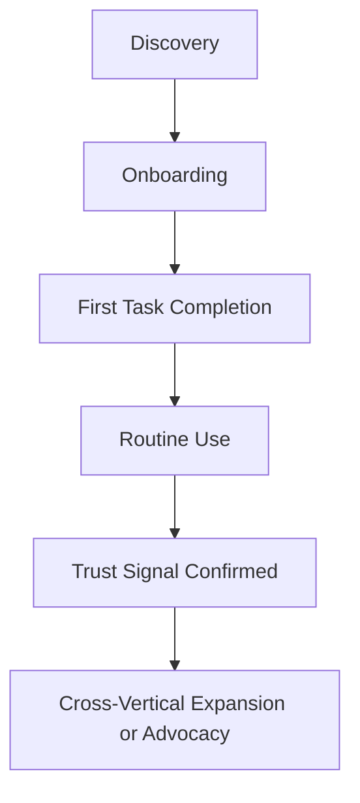

---

# Persona Relationship Map

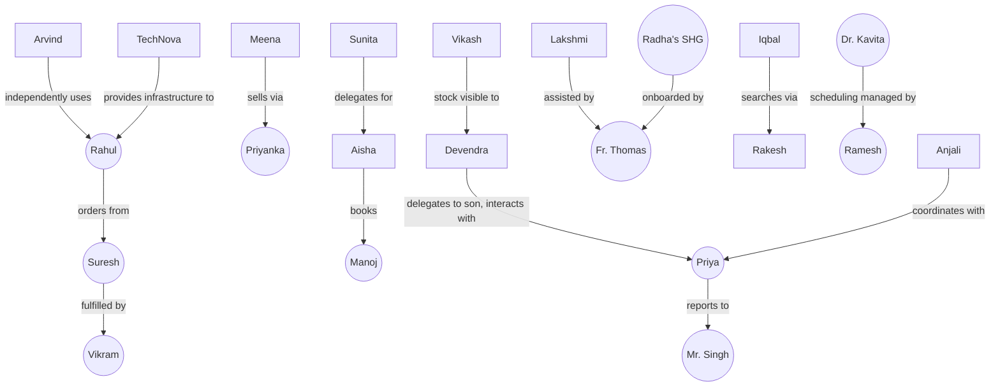

---

# Behavioral Segmentation

| Segment | Definition | Representative Personas |
|---|---|---|
| **Explorers** | New users browsing broadly across modules with no fixed task yet | New citizens (Rahul, Aisha at onboarding) |
| **Routine Users** | Predictable, recurring task patterns (weekly grocery order, weekly price check) | Rahul, Meena |
| **High-Frequency Users** | Multiple daily sessions, often provider-side | Vikram, Suresh, Priyanka, Priya |
| **Occasional Users** | Infrequent, need-triggered use | Ashok, Farida, Sunita |
| **Assisted Users** | Rely on another person or field agent to complete tasks | Devendra, Lakshmi, Radha's SHG |
| **Power Users** | Deep, sophisticated feature usage, often administrative | Anjali, Mr. Singh, TechNova |

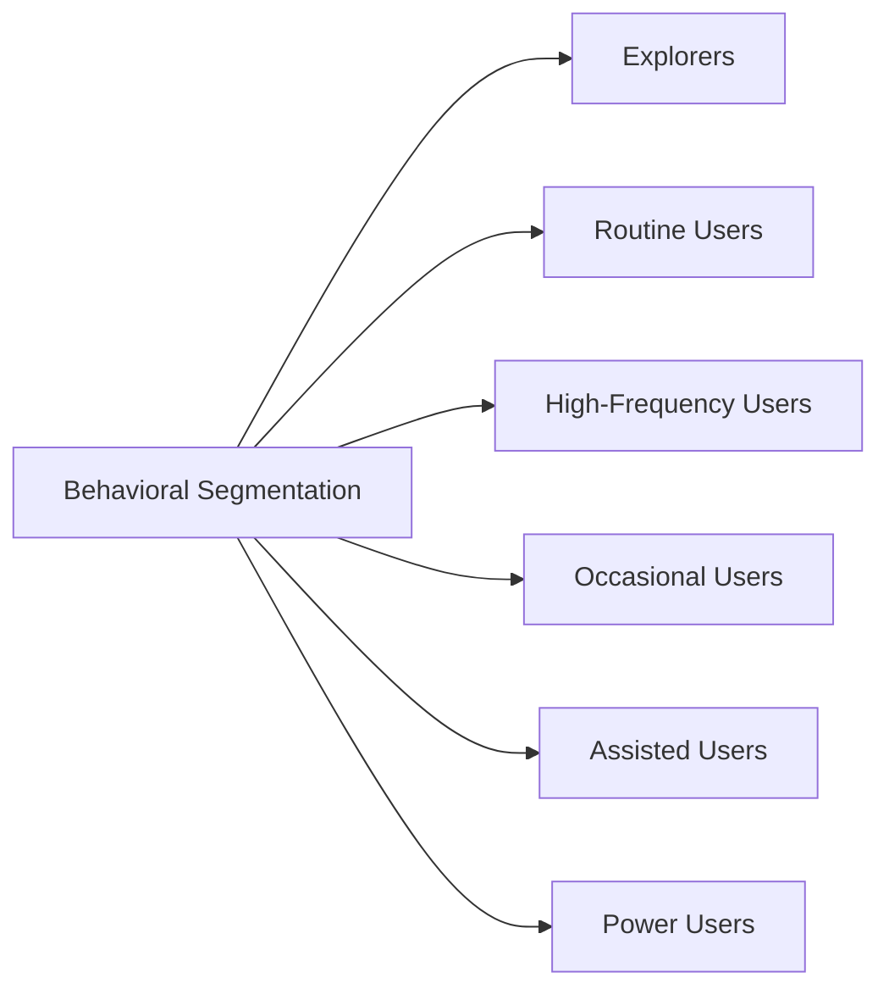

---

# Accessibility Personas

| Accessibility Focus | Representative Persona | Key Design Response |
|---|---|---|
| **Elderly users** | Devendra (PER-019) | Assisted/delegated access, large-target UI, high contrast |
| **Vision impairment** | Arvind (PER-020) | Full screen-reader compliance, correct ARIA, live regions |
| **Hearing impairment** | (Cross-cutting, no dedicated named persona yet — flagged for research) | Captioned audio/video, visual equivalents for all audio cues |
| **Motor impairment** | (Cross-cutting, no dedicated named persona yet — flagged for research) | 44×44px touch targets, no complex gesture-only actions |
| **Cognitive limitations** | Lakshmi (PER-021, adjacent) | Simplified language, reduced choice complexity, clear confirmations |
| **Low literacy** | Lakshmi (PER-021) | Voice-first, icon+text pairing, audio confirmation |

### Accessibility Requirement Matrix

| Persona | Screen Reader | Voice-First | High Contrast | Large Targets | Simplified Language | Assisted Mode |
|---|---|---|---|---|---|---|
| Devendra | — | ✓ | ✓ | ✓ | ✓ | ✓ |
| Arvind | ✓ | — | — | — | — | — |
| Lakshmi | — | ✓ | — | ✓ | ✓ | Partial |
| Radha's SHG | — | ✓ | — | ✓ | ✓ | ✓ |
| Iqbal | — | Partial | — | — | ✓ | — |
| Meena | — | ✓ | — | ✓ | ✓ | Partial |

> **Callout — Research Gap Flagged**
> Hearing-impairment and motor-impairment personas are not yet independently named due to insufficient direct field research (Low Research Confidence). Per Persona Governance below, this is logged as an open research item for the next Quarterly Persona Review, not silently left unaddressed.

---

# AI Personalization Strategy

### Recommendation Models

Recommendations (discovery ranking, provider matching, content suggestions) are trained and evaluated per-persona-cluster, never on a single undifferentiated population model, so that a low-frequency Assisted User's sparse interaction history does not get drowned out by a High-Frequency Power User's dense signal — mirroring the identical AI Principle already established in `ai-docs/00-project-vision.md`.

### Context Awareness

Personalization accounts for device capability, connectivity, language/dialect, and literacy signals (never inferred from sensitive attributes) drawn from the persona catalog above — a recommendation surface degrades gracefully (fewer images, more text-light options) for a low-bandwidth, low-literacy context rather than assuming uniform capability.

### Language Adaptation

AI-assisted interactions (the Civic Assistant, voice search) adapt to the citizen's actual preferred language and regional dialect per persona, per `ai-docs/12-accessibility-standards.md`'s Multilingual Accessibility standard — never defaulting silently to Hindi or English when a persona's stated preference is a regional dialect.

### Predictive Assistance

Predictive features (reorder suggestions, no-show prediction, scheme-eligibility pre-screening) are scoped to genuinely reduce a persona's stated Pain Points — never introduced merely because a model can technically predict something. Every predictive feature traces to a specific persona's Primary or Secondary Goal.

### Human Oversight

Per the AI Principle already established in `ai-docs/00-project-vision.md` and reaffirmed in `ai-docs/50-product-vision-business-strategy.md`: no AI-driven personalization may deny a citizen a service, block a transaction, or determine reputation without a human-reachable override path. This is absolute for every persona, with no exception for a "low-risk" persona category.

### AI Personalization Boundaries (Anti-Discrimination Safeguards)

To prevent AI personalization from silently disadvantaging a persona or segment:

| Boundary | Rule |
|---|---|
| **No sensitive-attribute targeting** | Gender, religion, caste, disability status, and migrant status are never used as direct ranking or eligibility-scoring inputs. |
| **No proxy discrimination** | Device tier, geography, or connectivity signals are monitored for producing an unintended proxy for a protected attribute (e.g., systematically down-ranking rural listings); flagged findings are reviewed by the AI Team and Head of Accessibility & Inclusion jointly. |
| **Equal-quality floor** | Every persona's AI-assisted experience is held to the same functional-quality floor, even where personalization differs — an Assisted User's guided flow must be as effective at completing the task as a Power User's advanced flow, not merely "acceptable." |
| **Explainability requirement** | Any AI recommendation that materially affects access to a service states, in plain language appropriate to the persona, why it was made. |
| **Periodic bias audit** | AI personalization outputs are audited quarterly across persona segments for disparate outcome rates, per Persona Analytics Framework below. |

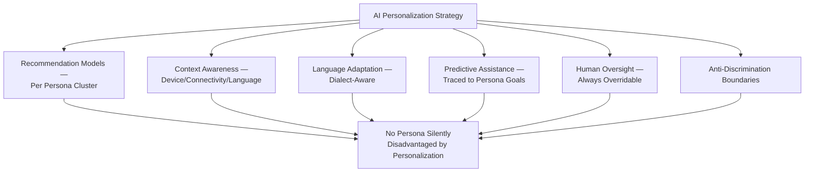

---

# Persona Analytics Framework

| Persona | Key Analytics Signals | Health Indicator |
|---|---|---|
| Rahul | Order frequency, cross-vertical adoption, session length | WAU/MAU ratio ≥ target |
| Meena | Price/weather check frequency, voice-query success rate | Monthly active feature use trend |
| Aisha | Tutor-search-to-booking conversion | Search-to-contact conversion rate |
| Devendra | Assisted-flow completion rate, session abandonment point | Task-completion rate for assisted sessions |
| Arvind | Screen-reader task-completion parity vs. sighted baseline | Parity ratio ≥ 0.95 |
| Lakshmi | Voice-flow completion rate, fallback-to-assistance rate | Voice-task success rate |
| Vikram | Earnings-per-shift consistency, route-assignment satisfaction | Earnings-transparency CSAT |
| Priya | Application-processing time, audit-log completeness | Government Efficiency KPI contribution |
| Radha's SHG | Group-session frequency, listing-to-sale conversion | Beneficiary reach growth |

Every persona's analytics are reviewed for **Research Confidence** drift — a persona whose real analytics signal diverges materially from its documented profile is flagged for re-validation, per Persona Governance below.

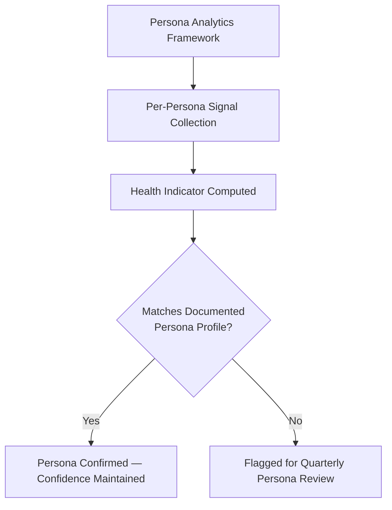

---

# Persona Lifecycle

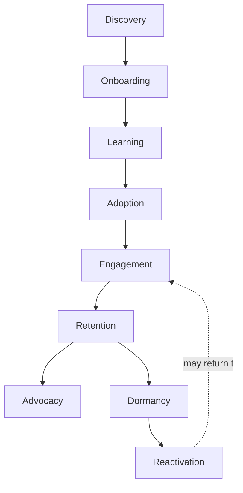

| Stage | Meaning | Example (Meena) |
|---|---|---|
| **Discovery** | Persona learns Arwal is relevant to them | Field agent visits her village |
| **Onboarding** | Persona creates an identity | Family member helps register her |
| **Learning** | Persona explores core features with guidance | Learns to ask for a voice price-check |
| **Adoption** | First meaningful, independent-enough action | Uses the price check unprompted |
| **Engagement** | Regular, routine use | Checks prices/weather most weeks |
| **Retention** | Sustained multi-season use | Continues through multiple crop cycles |
| **Advocacy** | Recommends to peers | Tells a neighboring farmer about it |
| **Dormancy** | Usage lapses (e.g., off-season, device change) | Stops checking during a fallow period |
| **Reactivation** | Returns after a lapse | Field agent or SMS nudge brings her back at next planting season |

---

# Persona Anti-Patterns

| Anti-Pattern | Description | Why It's Rejected |
|---|---|---|
| **Designing for yourself** | An engineer or designer defaults to their own habits and device capability as the implicit persona. | Produces a product that fails the median rural/low-literacy citizen, per the Citizen-First principle above. |
| **Urban-only assumptions** | Research and personas skewed toward district-headquarters, high-connectivity users. | Directly contradicts `ai-docs/51-stakeholder-analysis.md`'s Urban Bias anti-pattern. |
| **Ignoring accessibility** | Treating accessibility needs as a separate, lower-priority persona category. | Violates Accessibility-First above; a meaningful share of Arwal's real population has an accessibility need. |
| **Technology-first UX** | Choosing an interaction pattern (e.g., a chatbot) because it's technically novel, before confirming a persona actually needs it. | Violates Simplicity and Evidence-Based Research above. |
| **One-size-fits-all** | A single interface pattern applied uniformly regardless of literacy, device, or connectivity variance. | Contradicts Progressive Complexity already established in `ai-docs/00-project-vision.md`. |
| **Ignoring behavior** | Treating a demographic persona as static, never validated against real analytics behavior. | Violates Evidence-Based Research and the Persona Analytics Framework above. |
| **Persona proliferation without evidence** | Creating a new persona for every minor variation without genuine research backing. | Dilutes the catalog's usefulness and violates the Evidence Requirement in Persona Governance below. |

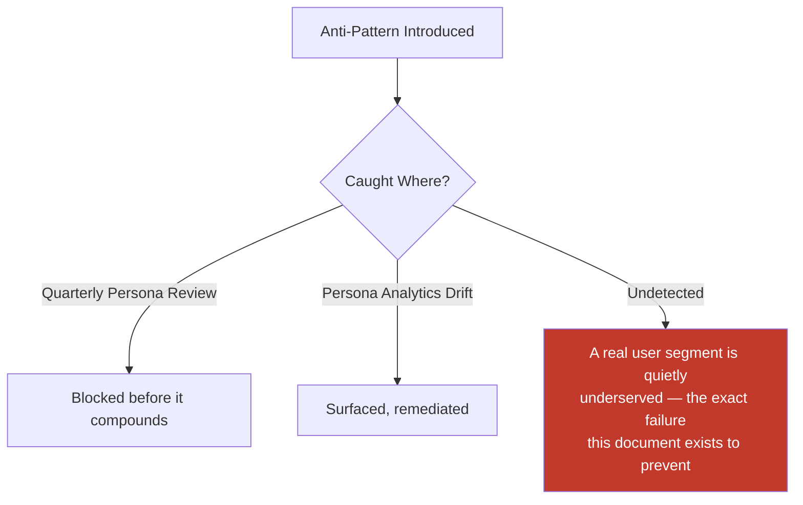

---

# Negative Personas

Negative personas define who or what behavior Arwal explicitly does **not** design to optimize for — clarifying product boundaries so a feature is never accidentally tuned to serve, reward, or accommodate harmful use.

| Negative Persona | Description | Product Boundary |
|---|---|---|
| **The Fraudulent Merchant** | A seller attempting to list counterfeit goods, misrepresent inventory, or manipulate ratings. | Verification, fraud detection, and dispute systems are designed *against* this behavior, never accommodated as an edge case to tolerate for growth. |
| **The Exploitative Recruiter** | An "employer" posting fraudulent or exploitative job listings, especially targeting vulnerable Job Seekers or Migrant Workers. | Job-listing verification and anti-exploitation review gates are mandatory, never optional for speed. |
| **The Review Manipulator** | A merchant or provider purchasing fake reviews or coercing citizens into inflated ratings. | Trust & Reputation systems actively detect and penalize this pattern; ranking is never for-sale. |
| **The Data Harvester** | A third party attempting to scrape citizen or merchant data for resale or unauthorized use. | Rate limiting, bot detection, and data-minimization by design (per `ai-docs/10-security-standards.md`) actively work against this actor. |
| **The Predatory Lender (future fintech)** | An entity attempting to use future financial-services features to trap citizens in exploitative debt. | Any future lending product is gated by the Ethical Decision-Making principle and explicit regulatory compliance review, never optimized for volume alone. |
| **The AI-Manipulating User** | A user attempting prompt injection or adversarial input against the Civic Assistant to extract another citizen's data or bypass a safeguard. | Governed by `ai-docs/10-security-standards.md`'s AI Security standards; never treated as a legitimate personalization input. |

> **Callout — Negative Personas Are Boundaries, Not Villains**
> Negative personas exist to keep the product team honest about who success metrics should *not* inadvertently reward — a rising engagement metric driven by manipulated reviews or exploitative listings is a regression, not a win, per the identical North Star Principle already established in `ai-docs/00-project-vision.md`.

---

# Persona-to-Feature Traceability

| Persona | Primary Future Modules Served (Phase 54 Business Domains) |
|---|---|
| Rahul | Commerce, Food & Grocery Delivery, Payments |
| Meena | Agriculture Intelligence, Government Services |
| Aisha | Education & Skills, Jobs |
| Manoj | Education & Skills |
| Sunita | Education & Skills, Civic Services |
| Dr. Kavita | Healthcare Discovery & Booking |
| Ramesh | Healthcare Discovery & Booking |
| Anjali | Healthcare Discovery & Booking |
| Vikash | Healthcare, Commerce |
| Suresh | Commerce Marketplace |
| Priyanka | Commerce Marketplace, B2B/Wholesale |
| Vikram | Mobility & Logistics |
| Ashok | Classifieds/Property |
| Farida | Classifieds/Property |
| Rakesh | Jobs & Employment |
| Neha | Jobs & Employment |
| Priya | Civic/Government Services |
| Mr. Singh | Civic/Government Services |
| Devendra | Civic/Government Services (cross-cutting accessibility) |
| Arvind | Cross-cutting — every module |
| Lakshmi | Cross-cutting — Commerce, Civic, Agriculture |
| Radha's SHG | Commerce Marketplace, Community |
| Iqbal | Jobs & Employment, Classifieds/Property |
| Fr. Thomas | Community, cross-cutting Accessibility |
| TechNova | Cross-cutting infrastructure |

A future module proposed at Phase 54 or beyond that cannot name at least one persona from this table it primarily serves is treated as unjustified scope, per the identical Traceability discipline established in Purpose of this Document above.

---

# Persona Governance

### Ownership

Every persona has a named accountable owner — the Head of User Research for the catalog as a whole, and the relevant vertical Head (per `ai-docs/51-stakeholder-analysis.md`'s Stakeholder Registry) for that persona's ongoing accuracy.

### Quarterly Persona Review

Every quarter, the Head of User Research convenes a review of: Persona Analytics drift (per the Analytics Framework above), any flagged Research Confidence downgrade, and any proposed new or retired persona.

### Research Validation

A persona's Research Confidence is upgraded only on the basis of new qualitative (interview, field observation) or quantitative (analytics, usability testing) evidence — never upgraded by internal confidence alone.

### Usability Testing

Any major UI change touching a Vulnerable or Assisted persona's primary flow requires usability testing with real representative participants before release, mirroring the identical Usability Testing requirement already established in `ai-docs/12-accessibility-standards.md`.

### Interview Cadence

| Persona Tier | Interview/Field Research Cadence |
|---|---|
| Primary, High Research Confidence | Semi-annual refresh |
| Primary, Medium/Low Research Confidence | Quarterly, prioritized for upgrade |
| Vulnerable/Accessibility-tagged | Quarterly minimum, tied to any major UI change |
| Supporting/Future | Annual or upon activation trigger |

### Persona Retirement

A persona is retired when its underlying stakeholder segment is confirmed structurally absent from the platform's real user base for two consecutive Quarterly Reviews, or when it is merged into a more accurate, evidence-supported persona — retirement never means deletion; a retired persona's ID and history are archived, never reused, mirroring the identical Archive, Never Delete principle already established throughout this handbook.

### Persona Versioning

Every persona carries an implicit version via its Registry entry's last-updated date; a material change to a persona's Primary Goals, Pain Points, or Accessibility Requirements is treated as a new version requiring Head of User Research sign-off, never a silent in-place edit.

### Evidence Requirements for New Personas

A new persona is added to the Registry only when: (1) it traces to an existing `STK-###` Stakeholder Registry entry or a formally proposed new one, (2) at least Medium Research Confidence evidence exists (field interview, survey, or analytics cluster), and (3) it is demonstrably distinct from every existing persona in at least one of Primary Goals, Pain Points, or Accessibility Requirements — never added merely to represent a minor demographic variation.

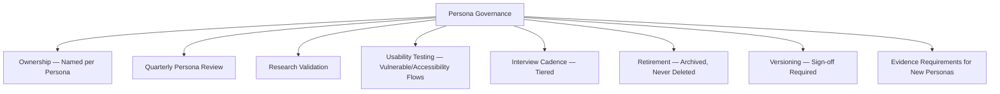

---

# Executive Dashboards

### CPO Dashboard
- Persona Research Confidence distribution (High/Medium/Low count)
- Persona Health Indicators trend (per Analytics Framework)
- Open research gaps (e.g., unnamed hearing/motor-impairment personas)

### Head of User Research Dashboard
- Quarterly Review completion status
- Interview cadence compliance by persona tier
- Retired/versioned personas this quarter

### Head of Accessibility & Inclusion Dashboard
- Accessibility Requirement Matrix coverage
- Usability testing completion for Vulnerable personas
- AI personalization bias-audit findings

### AI Team Dashboard
- Personalization boundary compliance (bias-audit results per persona segment)
- Explainability-requirement coverage for AI-influenced recommendations

---

# Relationship with Previous Standards

### Project Vision

`ai-docs/00-project-vision.md` establishes the founding personas implicitly through its Guiding Principles and early User-Centric Principles table. This document formalizes and deeply extends those early sketches into the full, evidence-tracked catalog every subsequent phase relies on.

### Product Goals

`ai-docs/01-product-goals.md` establishes seven foundational personas (Meena, Rahul, Suresh, Anita, Devendra, Priya, Vikram) at a summary level. This document is the authoritative, detailed successor to those summaries — every persona in `ai-docs/01-product-goals.md` maps directly to its expanded entry here (e.g., that document's Meena is this document's PER-002).

### Product Vision & Business Strategy

`ai-docs/50-product-vision-business-strategy.md` establishes Strategic Objectives and a Stakeholder Value Map at the product-strategy level. This document supplies the human-level detail that document's value propositions are tested against — a Strategic Objective ("Farmer Empowerment") is only actionable through a persona (Meena) with real goals and pain points.

### Stakeholder Analysis

`ai-docs/51-stakeholder-analysis.md` establishes the complete Stakeholder Registry, classification, and governance for every stakeholder category. This document is the direct, one-level-more-specific successor — every persona here carries a Stakeholder Reference field, and no persona may exist without a corresponding Stakeholder Registry entry.

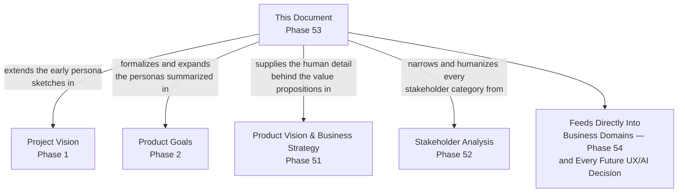

---

# Closing Statement

> **Callout — Closing Statement**
> Every future screen Arwal ships, every AI recommendation it surfaces, and every dashboard it builds will be judged, ultimately, by whether it worked for a real person — Meena checking a price in a field with one bar of signal, Devendra's son quietly renewing a certificate on his behalf, Arvind navigating independently by voice, a fraudulent merchant correctly kept out. A stakeholder category tells the organization who to be accountable to; a persona tells a designer and an engineer exactly what "serving them well" actually looks like, in enough specific, evidence-grounded human detail that a bad decision has nowhere to hide behind an abstraction. This document exists so that "we think users would want this" is never an acceptable justification again — every decision from here forward can, and must, be tested against a named, validated, accountable persona. Where a future phase must deviate from a persona defined here, that deviation is made explicitly — through the Quarterly Persona Review, or a new persona meeting the Evidence Requirements above — never silently, and never by default.

This document, `ai-docs/52-user-personas-user-segmentation.md`, is Phase 53 of approximately 420. Every future UX screen, module, workflow, AI feature, dashboard, and analytics event is expected to trace back to a persona defined here, or to justify its deviation in writing.

**End of Phase 53 — `ai-docs/52-user-personas-user-segmentation.md`**